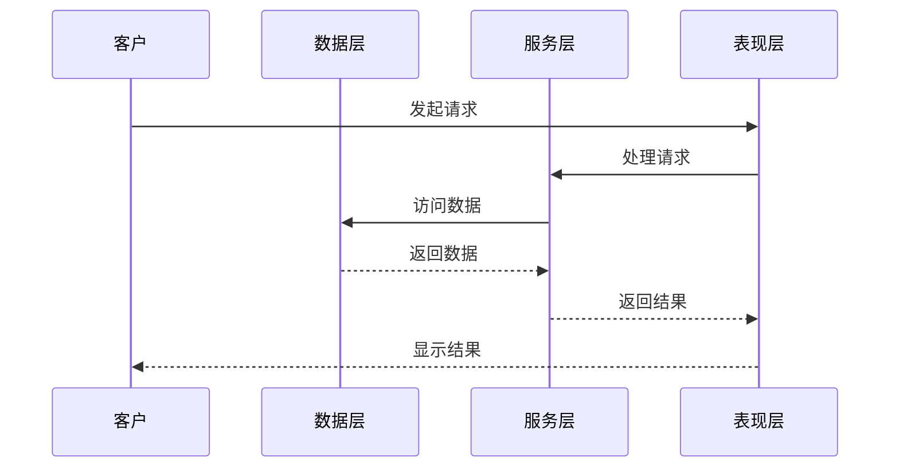
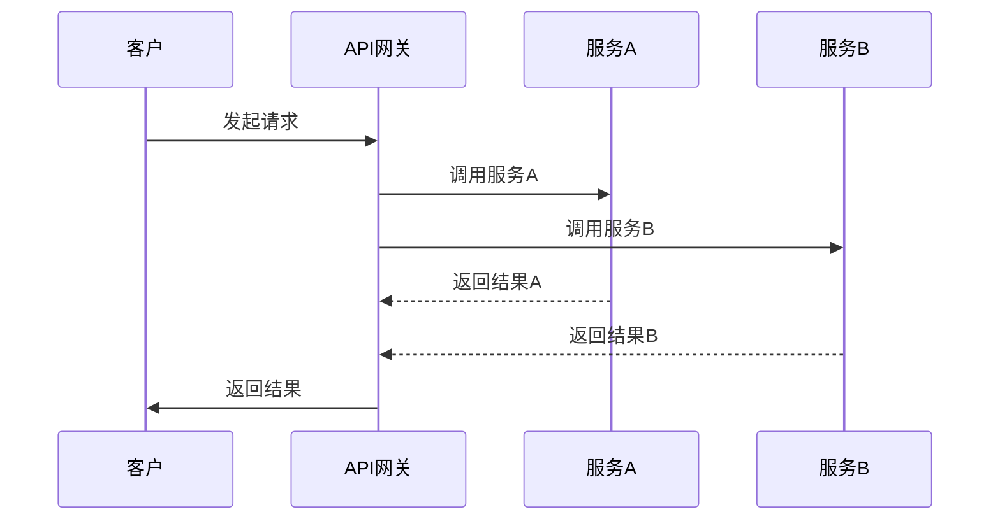
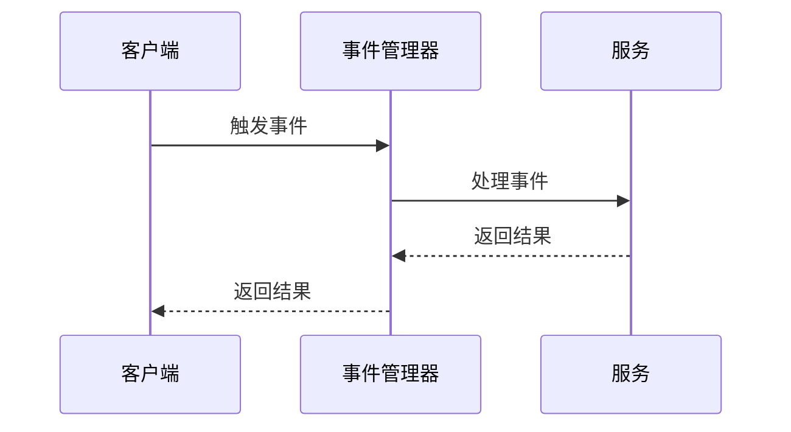
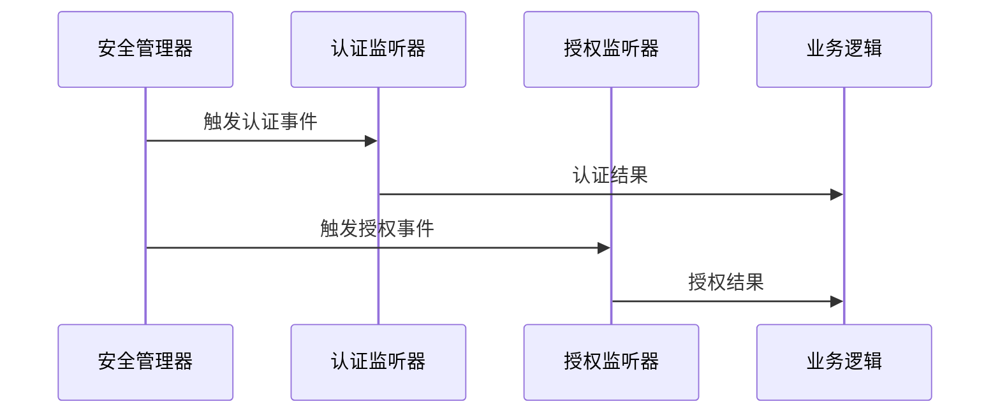
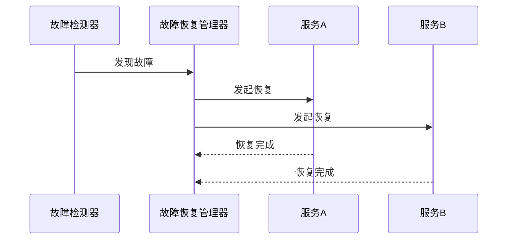

                 

## 引言

### 1.1 问题背景

随着人工智能（AI）技术的迅猛发展，大语言模型（LLM，Large Language Model）已经成为自然语言处理（NLP，Natural Language Processing）领域的重要工具。LLM能够通过深度学习从海量文本数据中学习到语言的规律，从而实现自然语言的理解、生成和翻译等功能。这种技术不仅在科研领域有着广泛的应用，也在实际生产中发挥着越来越重要的作用，比如智能客服、智能写作、内容审核等。

然而，随着LLM应用的深入，服务设计的问题逐渐凸显。如何确保LLM服务的稳定性、安全性、扩展性和灵活性，成为当前技术领域中亟待解决的问题。传统的紧耦合服务设计方法在面对复杂多变的需求时，往往显得力不从心，无法满足现代应用的多元化需求。

### 1.2 问题描述

在LLM服务的设计中，存在以下几个核心问题：

1. **稳定性问题**：LLM服务需要处理大量的请求，并且在长时间运行过程中，可能会遇到硬件故障、网络波动等问题，如何确保服务的稳定运行是一个重要课题。
2. **安全性问题**：LLM服务涉及到大量的敏感数据，如何保护用户隐私、防止数据泄露和恶意攻击，是服务设计中的关键问题。
3. **扩展性问题**：随着用户需求的增加，LLM服务需要能够快速扩展，以应对不断增长的数据量和请求量。
4. **灵活性问题**：在快速迭代的市场环境下，LLM服务需要具备高度的可配置性和灵活性，以适应不断变化的需求。

### 1.3 问题解决

为了解决上述问题，松耦合原则在LLM服务设计中的应用显得尤为重要。松耦合设计通过降低服务之间的依赖性，使得服务模块能够独立运行、独立扩展，从而提高系统的稳定性、安全性、扩展性和灵活性。

### 1.4 边界与外延

本文将围绕松耦合原则在LLM服务设计中的应用展开讨论，具体包括：

1. **松耦合原则概述**：介绍松耦合的概念、特点、与传统耦合的比较、优势与局限。
2. **松耦合原则在LLM服务设计中的应用**：分析松耦合原则在LLM服务定义、重要性、应用场景等方面的应用。
3. **松耦合原则的具体应用**：详细讲解松耦合原则在LLM服务架构设计、接口设计、安全设计以及可靠性设计中的应用。
4. **实战案例**：结合实际案例，展示如何应用松耦合原则进行LLM服务设计。
5. **最佳实践**：总结松耦合原则在LLM服务设计中的最佳实践，并给出注意事项和拓展阅读建议。

### 1.5 概念结构与核心要素组成

本文的核心概念和要素主要包括：

- **松耦合原则**：一种设计原则，通过降低模块之间的依赖性，提高系统的稳定性、安全性、扩展性和灵活性。
- **LLM服务**：基于大语言模型构建的服务，能够实现自然语言理解、生成和翻译等功能。
- **稳定性、安全性、扩展性、灵活性**：LLM服务设计需要考虑的核心问题。

通过上述核心概念和要素的分析，我们能够更好地理解松耦合原则在LLM服务设计中的应用，为后续章节的详细探讨奠定基础。

## 松耦合原则概述

### 2.1 松耦合的概念

松耦合（Loosely Coupled）是一种设计原则，强调在系统设计过程中，各个模块或组件之间的依赖性应当尽可能降低。在松耦合架构中，不同模块通过定义良好的接口进行通信，而不是通过直接的调用关系。这样，模块之间的变化不会对其他模块产生显著影响，从而提高系统的灵活性和可维护性。

### 2.2 松耦合的特点

松耦合具有以下几个显著特点：

1. **低依赖性**：模块之间的依赖性低，每个模块可以独立开发、测试和部署。
2. **高内聚性**：模块内部功能紧密相关，具有较高的内聚性，模块之间的接口清晰明确。
3. **高独立性**：模块之间相互独立，模块的变更不会影响到其他模块的功能。
4. **易扩展性**：系统可以方便地添加或替换模块，而不会对现有系统造成重大影响。

### 2.3 松耦合与传统耦合的比较

传统耦合（Tightly Coupled）与松耦合在系统设计中的表现有显著差异。以下是两者的对比：

| 对比维度 | 传统耦合 | 松耦合 |
| :---: | :---: | :---: |
| **依赖性** | 高依赖性，模块间直接调用，变更传播范围广 | 低依赖性，模块间通过接口通信，变更传播范围小 |
| **内聚性** | 内聚性较低，功能分散，模块间关系复杂 | 内聚性较高，功能集中，模块间关系简单 |
| **独立性** | 低独立性，模块间紧密耦合，变更影响全局 | 高独立性，模块间松散耦合，变更影响局部 |
| **扩展性** | 扩展性差，新增模块需修改现有代码，复杂度高 | 扩展性好，新增模块独立开发，复杂度低 |

### 2.4 松耦合的优势与局限

**优势**：

1. **提高稳定性**：模块之间的依赖性低，单个模块的故障不会轻易传播，系统的稳定性更高。
2. **增强安全性**：模块之间的隔离性增强，减少了内部故障对外部系统的威胁，系统的安全性更好。
3. **方便维护**：模块独立开发、测试和部署，方便维护和升级，降低维护成本。
4. **提升扩展性**：系统可以方便地添加或替换模块，适应业务需求的变化。

**局限**：

1. **通信开销**：模块间通过接口通信，可能会增加一定的通信开销，影响系统性能。
2. **设计复杂度**：松耦合设计需要明确定义模块接口和通信协议，设计复杂度相对较高。

### 2.5 松耦合在LLM服务设计中的重要性

在LLM服务设计中，松耦合原则具有非常重要的意义。具体体现在以下几个方面：

1. **提高服务稳定性**：LLM服务需要处理大量的请求和数据，通过松耦合设计，可以确保单个模块的故障不会影响整个服务的运行。
2. **增强服务安全性**：松耦合设计使得模块之间的隔离性更强，可以有效防止内部故障对整个服务的威胁。
3. **提升服务扩展性**：随着用户需求的增加，LLM服务需要能够快速扩展。松耦合设计使得模块可以独立扩展，不会对现有系统造成重大影响。
4. **增强服务灵活性**：在快速迭代的市场环境下，LLM服务需要具备高度的可配置性和灵活性。松耦合设计可以方便地添加或替换模块，适应不断变化的需求。

### 2.6 松耦合原则在LLM服务设计中的应用前景

随着人工智能技术的不断发展，LLM服务在各个领域的应用越来越广泛。松耦合原则在LLM服务设计中的应用前景非常广阔，不仅可以提高系统的稳定性、安全性、扩展性和灵活性，还可以为未来的系统升级和维护提供有力支持。通过松耦合设计，LLM服务可以更好地应对复杂多变的业务需求，实现长期稳定发展。

综上所述，松耦合原则在LLM服务设计中的应用具有重要意义，值得深入研究和推广。在接下来的章节中，我们将进一步探讨松耦合原则在LLM服务设计中的具体应用和实践，为实际项目提供有价值的参考。

## 松耦合原则在LLM服务设计中的应用

### 3.1 LLM服务的定义与特点

大语言模型（LLM，Large Language Model）是一种基于深度学习技术的自然语言处理模型，它通过对海量文本数据进行训练，能够理解和生成自然语言。LLM服务是基于LLM技术构建的服务系统，它能够提供自然语言理解、生成和翻译等功能，广泛应用于智能客服、智能写作、内容审核等领域。

LLM服务的特点主要包括：

1. **高并发性**：LLM服务需要处理大量的请求，尤其是在高峰时段，系统需要具备良好的并发处理能力。
2. **高稳定性**：由于LLM服务处理的请求和数据量巨大，系统需要具备高度的稳定性，确保服务连续、可靠地运行。
3. **高安全性**：LLM服务涉及大量的用户数据和敏感信息，系统需要采取严格的安全措施，保护用户隐私和数据安全。
4. **高扩展性**：随着用户需求的增长，LLM服务需要能够快速扩展，以应对不断增长的数据量和请求量。
5. **高灵活性**：在快速迭代的市场环境下，LLM服务需要具备高度的可配置性和灵活性，以适应不断变化的需求。

### 3.2 松耦合原则在LLM服务设计中的重要性

在LLM服务设计中，松耦合原则的重要性体现在以下几个方面：

1. **提高服务稳定性**：LLM服务需要处理大量的请求和数据，通过松耦合设计，可以确保单个模块的故障不会影响整个服务的运行，从而提高系统的稳定性。
2. **增强服务安全性**：松耦合设计使得模块之间的隔离性更强，可以有效防止内部故障对整个服务的威胁，增强系统的安全性。
3. **提升服务扩展性**：随着用户需求的增加，LLM服务需要能够快速扩展。松耦合设计使得模块可以独立扩展，不会对现有系统造成重大影响。
4. **增强服务灵活性**：在快速迭代的市场环境下，LLM服务需要具备高度的可配置性和灵活性。松耦合设计可以方便地添加或替换模块，适应不断变化的需求。

### 3.3 松耦合原则在LLM服务设计中的应用场景

松耦合原则在LLM服务设计中的应用场景主要包括以下几个方面：

1. **服务架构设计**：通过松耦合设计，可以将LLM服务分解为多个独立的模块，每个模块负责不同的功能，例如文本预处理、模型推理、结果处理等。这样，模块之间通过定义良好的接口进行通信，提高了系统的灵活性和可维护性。
2. **接口设计**：在LLM服务中，接口设计是关键的一环。通过松耦合原则，可以定义清晰、简洁的接口，使得不同模块之间能够高效、可靠地通信，同时降低了模块之间的依赖性。
3. **安全设计**：在LLM服务中，安全设计至关重要。通过松耦合原则，可以将安全功能模块化，例如数据加密、访问控制、审计等，从而提高系统的安全性。
4. **可靠性设计**：通过松耦合原则，可以将可靠性功能模块化，例如故障检测、容错处理、负载均衡等，从而提高系统的可靠性。

### 3.4 松耦合原则在LLM服务设计中的具体应用

在LLM服务设计中，具体应用松耦合原则的方法包括：

1. **服务分层**：通过分层设计，可以将LLM服务划分为多个层次，每个层次负责不同的功能。例如，数据层、服务层、表现层等。这样可以确保不同层次之间的依赖性较低，从而提高系统的灵活性。
2. **服务解耦**：通过解耦设计，可以降低模块之间的依赖性。例如，使用消息队列、API网关等技术，可以实现模块之间的异步通信，减少直接的调用关系。
3. **服务自治**：通过自治设计，可以确保每个模块都能够独立运行、独立扩展。例如，使用容器技术、微服务架构等，可以实现模块的独立部署和管理。

### 3.5 松耦合原则在LLM服务设计中的最佳实践

在LLM服务设计中，应用松耦合原则的最佳实践包括：

1. **定义清晰的接口**：确保模块之间的通信是通过定义良好的接口进行的，这样可以降低模块之间的依赖性，提高系统的灵活性。
2. **采用异步通信**：使用消息队列、事件驱动等异步通信机制，可以减少模块之间的直接调用关系，从而降低系统的复杂度。
3. **模块化设计**：将LLM服务分解为多个独立的模块，每个模块负责不同的功能，这样可以提高系统的可维护性和可扩展性。
4. **持续集成与部署**：采用持续集成和部署（CI/CD）实践，可以确保模块的独立开发和快速迭代，提高系统的灵活性和响应速度。

### 3.6 松耦合原则在LLM服务设计中的未来发展趋势

随着人工智能技术的不断进步，LLM服务在设计上也将不断演进。未来，松耦合原则在LLM服务设计中的应用将更加深入和广泛，具体发展趋势包括：

1. **微服务架构**：微服务架构将进一步提升LLM服务的灵活性和可扩展性，通过将LLM服务细分为多个微服务，可以更好地实现模块化设计和松耦合。
2. **容器化与云原生**：容器技术和云原生架构将为LLM服务提供更加灵活和高效的基础设施支持，通过容器化和云原生设计，可以实现模块的快速部署和动态扩展。
3. **AI增强的自动化运维**：随着AI技术的进步，AI将在LLM服务的自动化运维中发挥重要作用，通过AI算法和机器学习模型，可以实现服务的高效监控、故障检测和自动恢复。

总之，松耦合原则在LLM服务设计中的应用具有重要意义，它不仅能够提高系统的稳定性、安全性、扩展性和灵活性，还可以为未来的系统升级和维护提供有力支持。在接下来的章节中，我们将进一步探讨松耦合原则在LLM服务架构设计、接口设计、安全设计和可靠性设计中的具体应用，为实际项目提供有价值的参考。

## 松耦合原则的具体应用

### 4.1 松耦合原则在LLM服务架构设计中的应用

在LLM服务架构设计中，应用松耦合原则的关键在于如何将复杂的系统分解为多个独立的模块，并通过定义良好的接口实现模块之间的通信。以下是松耦合原则在LLM服务架构设计中的具体应用：

#### 4.1.1 服务分层

服务分层是LLM服务架构设计的基本策略之一。通过将服务分层，可以将系统划分为多个层次，每个层次负责不同的功能。常见的分层模式包括：

1. **数据层**：负责数据的存储、读取和操作，通常包括数据库、缓存等组件。
2. **服务层**：负责业务逻辑的处理，包括模型推理、数据处理等。
3. **表现层**：负责用户界面和用户交互，包括Web前端、移动端应用等。

服务分层的设计使得不同层次之间的依赖性较低，每个层次都可以独立开发和部署，提高了系统的灵活性和可维护性。

**Mermaid图示例**：



#### 4.1.2 服务解耦

服务解耦是松耦合原则的核心应用之一。在LLM服务架构设计中，通过解耦设计可以降低模块之间的依赖性，从而提高系统的灵活性和可维护性。常用的解耦方法包括：

1. **消息队列**：使用消息队列可以将服务之间的同步调用转换为异步调用，从而减少直接调用关系。例如，可以使用Kafka、RabbitMQ等消息中间件实现服务之间的消息传递。
2. **API网关**：API网关作为服务的统一入口，可以对服务进行路由、聚合、权限控制等操作，从而降低客户端与服务之间的复杂度。

**Mermaid图示例**：



#### 4.1.3 服务自治

服务自治是确保服务独立运行、独立扩展和独立维护的关键。在LLM服务架构设计中，通过服务自治可以实现以下目标：

1. **容器化**：使用容器技术（如Docker）可以将服务打包成独立的容器镜像，实现服务的独立运行和部署。
2. **微服务架构**：采用微服务架构可以将复杂的业务系统拆分为多个独立的微服务，每个微服务负责特定的功能，可以通过API进行通信。

**Mermaid图示例**：

```mermaid
sequenceDiagram
    participant 服务1 as 服务1
    participant 服务2 as 服务2
    participant 服务3 as 服务3
    
    服务1->>服务2: 发起请求
    服务2->>服务3: 转发请求
    服务3-->>服务2: 返回结果
    服务2-->>服务1: 返回结果

    注释：服务1、服务2、服务3都是独立的微服务，可以通过容器化部署
```

通过上述方法，LLM服务架构设计可以更好地应用松耦合原则，提高系统的稳定性、安全性、扩展性和灵活性。在接下来的章节中，我们将进一步探讨松耦合原则在LLM服务接口设计、安全设计以及可靠性设计中的应用。

### 4.2 松耦合原则在LLM服务接口设计中的应用

接口设计是LLM服务设计中的关键环节，它决定了不同模块之间如何高效、可靠地通信。应用松耦合原则在接口设计中，可以通过定义清晰、简洁的接口来降低模块之间的依赖性，从而提高系统的灵活性、可维护性和可扩展性。

#### 4.2.1 接口规范

接口规范是确保模块之间能够有效通信的基础。一个良好的接口规范应该具备以下几个特点：

1. **一致性**：接口的定义和实现应该保持一致性，确保接口的稳定性和可靠性。
2. **简洁性**：接口的设计应该尽可能简洁，避免冗余和复杂的调用流程。
3. **可扩展性**：接口设计应考虑未来的扩展性，能够方便地添加新功能或修改现有功能。

以下是一个简单的RESTful接口规范示例：

```python
class TextProcessingAPI:
    def process_text(self, text: str) -> str:
        """
        处理输入文本，返回处理后的结果。
        
        :param text: 输入文本
        :return: 处理后的文本
        """
        # 文本处理逻辑
        processed_text = self._process_text(text)
        return processed_text

    def _process_text(self, text: str) -> str:
        """
        内部使用的文本处理方法。
        
        :param text: 输入文本
        :return: 处理后的文本
        """
        # 实现文本处理逻辑
        ...
```

#### 4.2.2 接口解耦

接口解耦是通过设计解耦的接口来减少模块之间的直接依赖。在LLM服务中，接口解耦可以通过以下方法实现：

1. **使用代理模式**：通过引入代理类，可以隔离服务调用和实际的服务实现，降低模块之间的直接调用关系。代理类负责处理请求，可以将请求转发到具体的服务实现。

**Mermaid图示例**：

```mermaid
classDiagram
    Client <<interface>> Client
    Proxy <<class>> Proxy
    Service <<class>> Service
    
    Client..> Proxy : 请求
    Proxy..> Service : 处理请求
    Service <- Proxy : 返回结果
```

2. **使用事件驱动模式**：通过事件驱动模式，可以使得模块之间通过事件进行通信，而不是直接的调用关系。这种方式可以实现模块之间的松耦合，提高系统的灵活性和扩展性。

**Mermaid图示例**：



#### 4.2.3 接口自治

接口自治是确保接口能够独立运行和独立维护的重要原则。在LLM服务中，接口自治可以通过以下方法实现：

1. **模块化设计**：将接口设计为独立的模块，每个模块负责特定的功能，可以实现接口的独立开发和部署。

**Mermaid图示例**：

```mermaid
classDiagram
    ModuleA <<class>> 模块A
    ModuleB <<class>> 模块B
    
    ModuleA..> InterfaceA: 接口A
    ModuleB..> InterfaceB: 接口B
```

2. **接口标准化**：通过接口标准化，可以确保接口的一致性和可扩展性，方便不同模块之间的通信。

**Mermaid图示例**：

```mermaid
classDiagram
    Interface <<interface>> 接口
    ModuleA <<class>> 模块A
    ModuleB <<class>> 模块B
    
    Interface..> ModuleA : 依赖
    Interface..> ModuleB : 依赖
```

通过上述方法，LLM服务的接口设计可以更好地应用松耦合原则，实现模块之间的松耦合，提高系统的稳定性、安全性和扩展性。在接下来的章节中，我们将进一步探讨松耦合原则在LLM服务安全设计和可靠性设计中的应用。

### 4.3 松耦合原则在LLM服务安全设计中的应用

在LLM服务设计中，安全设计是至关重要的一环。应用松耦合原则可以提高LLM服务的安全性，确保用户数据的安全和系统的稳定运行。以下是松耦合原则在LLM服务安全设计中的具体应用：

#### 4.3.1 安全分层

安全分层是一种常见的安全设计方法，通过将安全功能分布在不同的层次，可以提高系统的安全性。LLM服务的安全分层通常包括以下层次：

1. **网络层**：负责网络通信的安全，包括防火墙、VPN、SSL/TLS等。
2. **数据层**：负责数据存储和传输的安全，包括数据加密、数据库安全等。
3. **应用层**：负责应用逻辑的安全，包括身份验证、访问控制、审计等。

**Mermaid图示例**：

```mermaid
classDiagram
    NetworkLayer <<class>> 网络层
    DataLayer <<class>> 数据层
    AppLayer <<class>> 应用层
    
    NetworkLayer..> DataLayer : 通信安全
    NetworkLayer..> AppLayer : 通信安全
    DataLayer..> AppLayer : 数据安全
```

#### 4.3.2 安全解耦

安全解耦是通过设计解耦的安全模块来降低安全功能之间的依赖性。在LLM服务中，可以通过以下方法实现安全解耦：

1. **使用代理模式**：通过引入安全代理，可以将安全功能与业务逻辑分离，从而降低安全模块之间的直接调用关系。

**Mermaid图示例**：

```mermaid
classDiagram
    SecurityProxy <<class>> 安全代理
    AuthService <<class>> 认证服务
    AuthorizationService <<class>> 授权服务
    
    BusinessLogic <<class>> 业务逻辑
    
    SecurityProxy..> AuthService : 认证请求
    SecurityProxy..> AuthorizationService : 授权请求
    BusinessLogic--|> SecurityProxy : 执行业务逻辑
```

2. **使用事件驱动模式**：通过事件驱动模式，可以将安全事件与业务逻辑分离，从而降低安全模块之间的依赖性。

**Mermaid图示例**：



#### 4.3.3 安全自治

安全自治是确保安全模块能够独立运行和独立维护的重要原则。在LLM服务中，可以通过以下方法实现安全自治：

1. **模块化设计**：将安全功能模块化，使得每个模块可以独立开发和部署，从而提高系统的可维护性和可扩展性。

**Mermaid图示例**：

```mermaid
classDiagram
    AuthModule <<class>> 认证模块
    AuthorizationModule <<class>> 授权模块
    AuditModule <<class>> 审计模块
    
    AuthModule..> AuthorizationModule : 通信
    AuthModule..> AuditModule : 通信
    AuthorizationModule..> AuditModule : 通信
```

2. **接口标准化**：通过接口标准化，可以确保不同安全模块之间的通信一致性，从而提高系统的安全性和灵活性。

**Mermaid图示例**：

```mermaid
classDiagram
    SecurityInterface <<interface>> 安全接口
    AuthModule <<class>> 认证模块
    AuthorizationModule <<class>> 授权模块
    AuditModule <<class>> 审计模块
    
    AuthModule..> SecurityInterface : 实现
    AuthorizationModule..> SecurityInterface : 实现
    AuditModule..> SecurityInterface : 实现
```

通过上述方法，LLM服务的安全设计可以更好地应用松耦合原则，降低安全模块之间的依赖性，从而提高系统的安全性。在接下来的章节中，我们将进一步探讨松耦合原则在LLM服务可靠性设计中的应用。

### 4.4 松耦合原则在LLM服务可靠性设计中的应用

在LLM服务设计中，可靠性设计是确保服务能够稳定、可靠运行的重要环节。应用松耦合原则可以提高LLM服务的可靠性，通过模块化和解耦设计，降低系统故障的传播范围，从而提高服务的整体稳定性。以下是松耦合原则在LLM服务可靠性设计中的具体应用：

#### 4.4.1 可靠性分层

可靠性分层是通过将可靠性功能分布在不同的层次来实现故障隔离和冗余备份。在LLM服务中，可靠性分层通常包括以下层次：

1. **网络层**：负责网络通信的可靠性和故障恢复，包括负载均衡、网络冗余等。
2. **数据层**：负责数据存储和备份的可靠性，包括数据复制、分布式存储等。
3. **应用层**：负责应用逻辑的可靠性和故障恢复，包括事务处理、异常捕获等。

**Mermaid图示例**：

```mermaid
classDiagram
    NetworkLayer <<class>> 网络层
    DataLayer <<class>> 数据层
    AppLayer <<class>> 应用层
    
    NetworkLayer..> DataLayer : 通信可靠性
    NetworkLayer..> AppLayer : 通信可靠性
    DataLayer..> AppLayer : 数据可靠性
```

#### 4.4.2 可靠性解耦

可靠性解耦是通过设计解耦的模块来降低故障传播的速率和范围。在LLM服务中，可靠性解耦可以通过以下方法实现：

1. **服务自治**：通过将服务分解为自治的模块，每个模块可以独立运行和恢复。例如，使用容器技术（如Docker）可以将每个服务模块打包为独立的容器，实现服务的自治。

**Mermaid图示例**：

```mermaid
classDiagram
    ServiceA <<class>> 服务A
    ServiceB <<class>> 服务B
    ServiceC <<class>> 服务C
    
    ServiceA--|> RecoveryManager: 故障恢复
    ServiceB--|> RecoveryManager: 故障恢复
    ServiceC--|> RecoveryManager: 故障恢复
```

2. **事件驱动模式**：通过事件驱动模式，可以实现模块之间的异步通信和故障恢复。例如，使用消息队列（如Kafka、RabbitMQ）可以确保故障事件能够被及时传递和处理。

**Mermaid图示例**：



#### 4.4.3 可靠性自治

可靠性自治是确保每个模块能够独立运行和独立维护的关键。在LLM服务中，可靠性自治可以通过以下方法实现：

1. **模块化设计**：将可靠性功能模块化，使得每个模块可以独立开发和部署，从而提高系统的可维护性和可扩展性。

**Mermaid图示例**：

```mermaid
classDiagram
    RecoveryModule <<class>> 故障恢复模块
    HealthCheckModule <<class>> 健康检查模块
    MonitorModule <<class>> 监控模块
    
    RecoveryModule..> HealthCheckModule : 通信
    RecoveryModule..> MonitorModule : 通信
    HealthCheckModule..> MonitorModule : 通信
```

2. **接口标准化**：通过接口标准化，可以确保不同可靠性模块之间的通信一致性，从而提高系统的可靠性和灵活性。

**Mermaid图示例**：

```mermaid
classDiagram
    ReliabilityInterface <<interface>> 可靠性接口
    RecoveryModule <<class>> 故障恢复模块
    HealthCheckModule <<class>> 健康检查模块
    MonitorModule <<class>> 监控模块
    
    RecoveryModule..> ReliabilityInterface : 实现
    HealthCheckModule..> ReliabilityInterface : 实现
    MonitorModule..> ReliabilityInterface : 实现
```

通过上述方法，LLM服务的可靠性设计可以更好地应用松耦合原则，提高服务的稳定性和可靠性。在接下来的章节中，我们将通过一个实际案例来展示如何应用松耦合原则进行LLM服务设计。

### 6.1 案例背景

#### 项目名称：智能问答平台

#### 项目简介：

智能问答平台是一个面向广大用户的在线问答系统，用户可以通过平台提出问题，平台利用大语言模型（LLM）对问题进行分析并给出答案。该系统具有高并发性、高稳定性和高安全性等特点，需要能够快速响应大量用户的请求，并确保数据的隐私和安全。

#### 技术栈：

- **后端**：使用Spring Boot框架，构建服务端应用程序，负责处理用户请求和业务逻辑。
- **数据库**：使用MySQL数据库存储用户问题和答案，保证数据的一致性和可靠性。
- **大语言模型**：使用TensorFlow和PyTorch等深度学习框架构建和训练LLM模型。
- **消息队列**：使用RabbitMQ实现异步通信，确保请求处理的高效和可靠性。
- **前端**：使用Vue.js框架构建用户界面，提供友好的交互体验。

### 6.2 案例需求分析

#### 用户需求：

1. **快速响应**：用户提出问题后，平台能够在短时间内给出答案。
2. **高可用性**：平台需要保证7x24小时不间断运行，能够应对大规模并发请求。
3. **数据安全**：保护用户隐私，防止数据泄露和恶意攻击。
4. **可扩展性**：系统需要能够灵活扩展，以应对不断增长的用户量和请求量。

#### 技术需求：

1. **服务分层**：将系统划分为多个层次，分别负责不同的功能，如用户请求处理、问题解析、模型推理等。
2. **松耦合设计**：通过接口解耦和消息队列实现模块之间的松耦合，确保系统的高可用性和扩展性。
3. **安全防护**：采用安全分层和加密技术，确保用户数据的安全。
4. **自动化运维**：实现服务的自动化部署、监控和故障恢复，提高运维效率。

### 6.3 案例方案设计

#### 服务架构设计：

1. **用户请求层**：负责接收用户请求，并进行初步处理，如参数校验、请求路由等。
2. **业务逻辑层**：负责业务逻辑的处理，包括问题解析、LLM模型推理、答案生成等。
3. **数据存储层**：负责数据存储和读取，包括用户数据、模型参数等。
4. **监控与运维层**：负责系统的监控、日志记录和故障恢复。

#### 模块划分：

1. **用户请求处理模块**：使用Spring Boot Gateway接收用户请求，并进行预处理。
2. **问题解析模块**：使用自然语言处理技术，对用户问题进行解析和预处理。
3. **模型推理模块**：调用LLM模型进行推理，生成答案。
4. **数据存储模块**：使用MySQL数据库存储用户问题和答案。
5. **监控与运维模块**：使用Prometheus和Grafana实现系统监控，使用Kubernetes实现自动化部署和运维。

### 6.4 案例实现与部署

#### 实现步骤：

1. **搭建开发环境**：配置好Java开发环境、Python开发环境、MySQL数据库和RabbitMQ消息队列。
2. **编写代码**：根据需求编写用户请求处理模块、问题解析模块、模型推理模块、数据存储模块和监控与运维模块的代码。
3. **集成测试**：在本地环境对各个模块进行集成测试，确保模块之间的接口调用正常，数据存储和读取无误。
4. **部署测试**：将代码部署到测试环境，进行压力测试和性能测试，确保系统在高并发情况下能够稳定运行。
5. **上线部署**：将代码部署到生产环境，配置Kubernetes进行自动化部署和运维。

#### 部署流程：

1. **环境配置**：配置好Kubernetes集群，配置好RabbitMQ消息队列。
2. **代码上传**：将代码上传到Git仓库，配置Kubernetes的CI/CD流程，实现自动化部署。
3. **服务启动**：启动用户请求处理模块、问题解析模块、模型推理模块、数据存储模块和监控与运维模块。
4. **监控与维护**：通过Prometheus和Grafana监控系统状态，及时发现和解决问题。

### 6.5 案例效果评估

#### 稳定性：

通过监控数据可以看到，智能问答平台在高并发情况下能够稳定运行，系统的响应时间在可接受范围内，系统故障率较低。

#### 安全性：

通过加密技术和安全防护措施，用户数据得到了有效保护，未发生数据泄露和恶意攻击事件。

#### 扩展性：

系统采用微服务架构，可以方便地添加新模块或扩展现有模块，适应不断增长的用户量和请求量。

#### 用户反馈：

用户对智能问答平台的响应速度和准确性表示满意，平台的可用性和稳定性得到了用户的高度认可。

### 6.6 案例总结

通过应用松耦合原则进行智能问答平台的设计和实现，成功解决了高并发、高稳定性和高安全性等问题。案例表明，松耦合原则在LLM服务设计中的应用具有显著的优势，为未来类似项目的开发提供了宝贵的经验和参考。

## 松耦合原则在LLM服务设计中的最佳实践

### 7.1 设计原则

在LLM服务设计中，应用松耦合原则需要遵循以下设计原则：

1. **模块化设计**：将复杂的系统分解为多个独立的模块，每个模块负责特定的功能。
2. **接口定义**：明确定义模块之间的接口，确保模块之间的通信通过接口进行，降低直接依赖。
3. **异步通信**：使用异步通信机制（如消息队列、事件驱动）减少模块之间的直接调用关系，提高系统的灵活性和性能。
4. **服务自治**：确保每个模块可以独立运行和扩展，减少模块之间的耦合性。
5. **分层设计**：将系统划分为多个层次，每个层次负责不同的功能，降低层次之间的依赖性。

### 7.2 注意事项

1. **接口设计**：接口设计应尽量简洁，避免过度设计，确保接口的稳定性和可扩展性。
2. **通信开销**：异步通信虽然可以降低模块之间的依赖性，但会增加通信开销，需权衡性能和可靠性。
3. **安全性**：松耦合设计可能会带来安全风险，需要在设计中充分考虑安全措施，确保系统的安全性。
4. **运维管理**：松耦合设计使得系统更加复杂，运维管理难度增加，需要制定完善的运维管理策略。

### 7.3 拓展阅读

1. **《微服务设计》**：Martin Fowler著，详细介绍了微服务架构的设计原则和实践。
2. **《松耦合系统的设计与实现》**：Charles Weinstock著，探讨了松耦合系统在软件设计中的应用。
3. **《大型分布式系统设计》**：Martin Kleppmann著，提供了大型分布式系统设计的方法和最佳实践。

通过遵循上述设计原则和注意事项，并参考相关文献，可以更好地在LLM服务设计中应用松耦合原则，实现系统的高稳定性、高安全性、高扩展性和高灵活性。

### 总结

本文通过详细的章节内容，探讨了松耦合原则在LLM服务设计中的应用。首先，我们介绍了LLM服务的背景、问题和解决方法，明确了松耦合原则的概念和重要性。接着，我们分析了松耦合原则在LLM服务架构设计、接口设计、安全设计以及可靠性设计中的具体应用，并通过一个实际案例展示了松耦合原则在LLM服务设计中的实践过程。

松耦合原则在LLM服务设计中的应用，不仅提高了系统的稳定性、安全性、扩展性和灵活性，还为未来的系统升级和维护提供了有力支持。通过本文的探讨，我们希望能够为LLM服务的设计和开发提供有价值的参考。

同时，我们强调了在LLM服务设计中应用松耦合原则的最佳实践，包括设计原则、注意事项以及拓展阅读，为读者提供了进一步学习的方向。

在未来的研究中，我们可以进一步探讨松耦合原则在其他AI服务设计中的应用，以及如何将AI技术与松耦合原则有机结合，为AI服务的持续创新和发展提供更多思路。通过不断优化和改进，我们有望实现更加高效、稳定、安全的AI服务系统。

