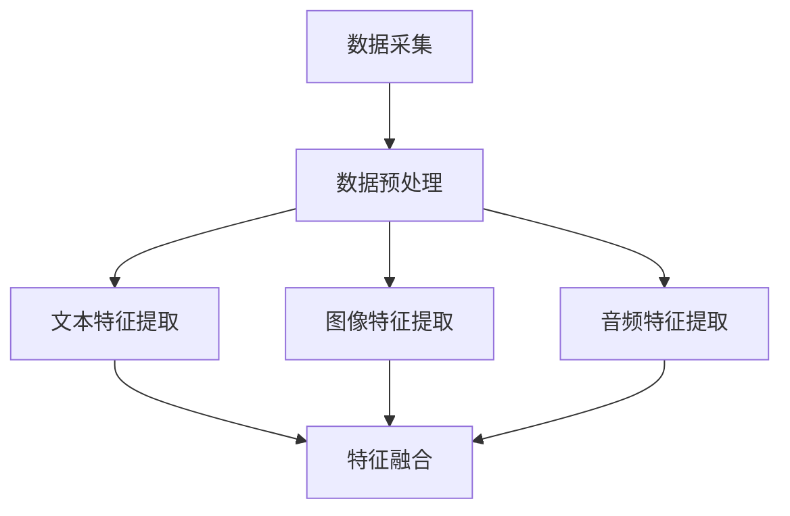
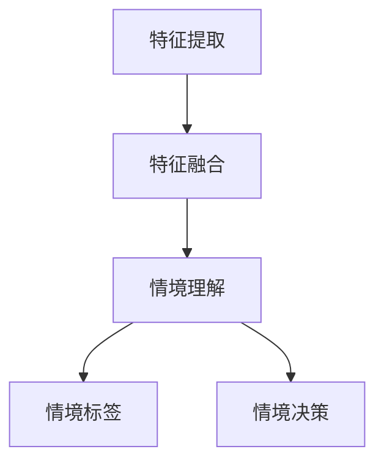
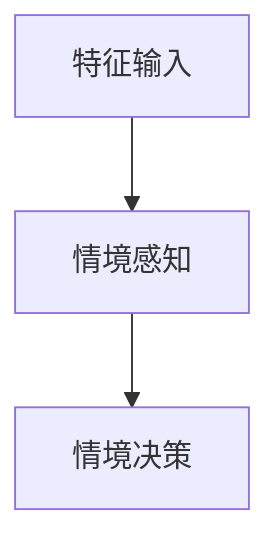
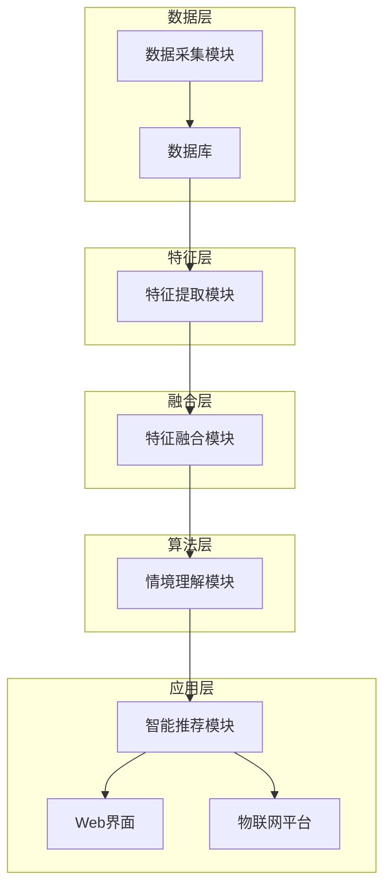
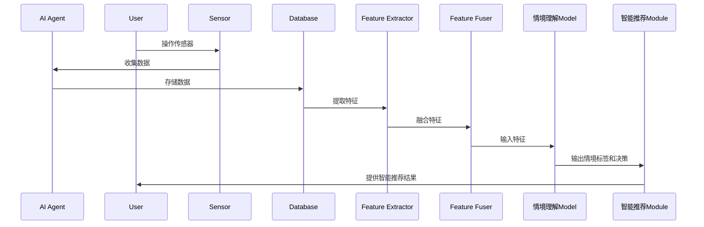
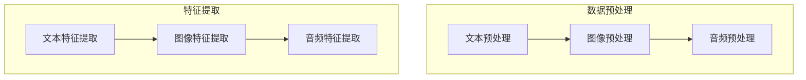
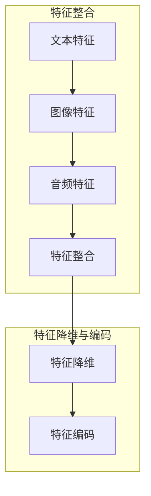
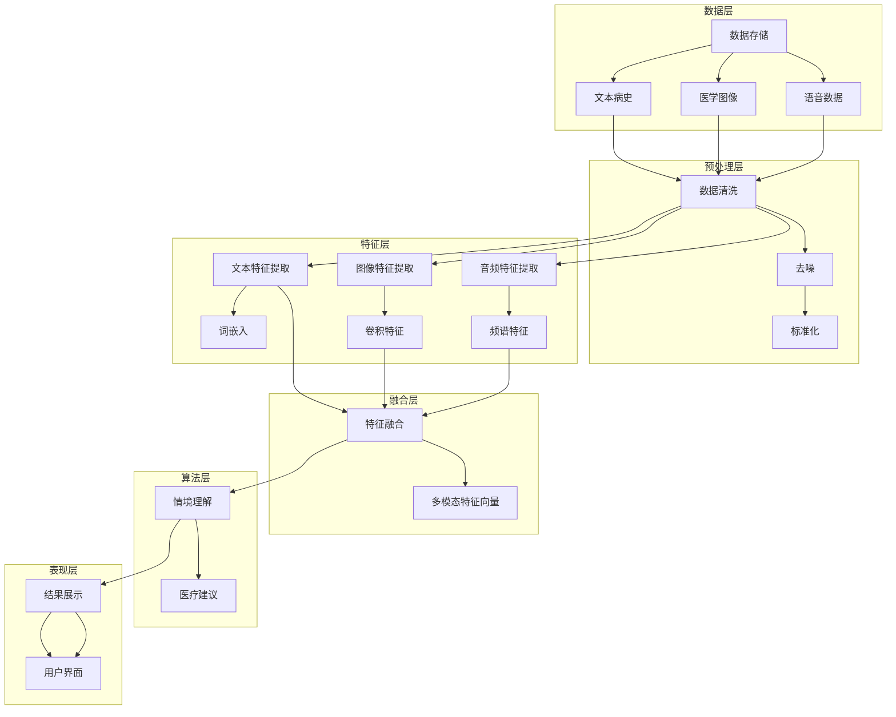

                 

# 构建AI Agent的多模态情境理解系统

## 概述

### 关键词
AI Agent、多模态数据、情境理解、特征融合、深度学习模型

### 摘要
本文旨在探讨构建AI Agent的多模态情境理解系统的技术实现。首先介绍了问题背景，随后详细分析了核心概念和联系，接着讲解情境理解算法原理，并展示了系统分析与架构设计方案。最后，通过项目实战和最佳实践，深入探讨了实现细节和注意事项。

## 第一部分：背景介绍

### 1.1 问题背景

随着人工智能技术的快速发展，AI Agent在各个领域得到了广泛应用。然而，AI Agent在实际应用中面临的一个关键挑战是多模态情境理解。传统的AI Agent往往只能处理单一模态的数据，如文本、图像或音频，而无法同时处理多种模态的信息，这限制了AI Agent的智能化水平和应用范围。

### 1.2 问题描述

构建一个能够实现多模态情境理解的AI Agent，需要解决以下几个关键问题：

1. 数据采集与预处理：如何有效地收集多种模态的数据，并进行统一的预处理？
2. 特征提取与融合：如何从不同模态的数据中提取出有效的特征，并实现特征的融合？
3. 情境理解算法：如何设计一种有效的算法来处理多模态特征，实现情境理解？
4. 系统性能优化：如何优化系统性能，提高AI Agent的响应速度和准确性？

### 1.3 问题解决

构建AI Agent的多模态情境理解系统，需要从以下几个方面进行解决：

1. **数据采集与预处理**：采用多种数据采集手段，如传感器、摄像头、麦克风等，收集多种模态的数据。对采集到的数据进行统一的预处理，包括去噪、归一化、特征提取等步骤。
2. **特征提取与融合**：针对不同模态的数据，采用相应的特征提取技术，如深度学习、图像处理、自然语言处理等。然后，通过特征融合技术，将不同模态的特征进行整合，形成统一的特征表示。
3. **情境理解算法**：设计一种基于多模态特征的情境理解算法。可以采用深度学习框架，如TensorFlow或PyTorch，构建一个多模态神经网络模型，实现情境理解。
4. **系统性能优化**：通过模型压缩、分布式计算等技术，优化系统性能，提高AI Agent的响应速度和准确性。

### 1.4 边界与外延

构建AI Agent的多模态情境理解系统，不仅涉及到人工智能技术，还涉及到数据科学、计算机视觉、自然语言处理等多个领域。同时，系统设计需要考虑实际应用场景，如智能家居、智能客服、自动驾驶等。

### 1.5 概念结构与核心要素组成

1. **数据采集与预处理模块**：负责数据的采集和预处理，包括传感器数据采集、数据清洗、特征提取等。
2. **特征融合模块**：负责将不同模态的数据进行特征提取和融合，形成统一的特征表示。
3. **情境理解模型**：基于多模态特征，构建一个深度学习模型，实现情境理解。
4. **系统性能优化模块**：通过模型压缩、分布式计算等技术，优化系统性能。

### 1.6 本章小结

本章对构建AI Agent的多模态情境理解系统进行了背景介绍，明确了问题解决的思路和边界。在后续章节中，将详细介绍系统的设计、实现和优化过程。

## 第二部分：核心概念与联系

### 2.1 多模态数据

#### 2.1.1 概念定义

多模态数据是指来自不同模态的数据，如文本、图像、音频等。这些数据可以分别表示不同的信息，但通过适当的处理可以融合成一个统一的信息表示。

#### 2.1.2 属性特征对比表格

| 模态 | 特征类型 | 特征维度 | 例子 |
| ---- | -------- | -------- | ---- |
| 文本 | 词向量 | 高维向量 | 文章 |
| 图像 | 特征点 | 高维向量 | 图片 |
| 音频 | 频谱 | 高维向量 | 音乐 |

#### 2.1.3 Mermaid ER实体关系图

```mermaid
erDiagram
  数据源 ||--|{ 特征数据 }
  特征数据 ||--|{ 数据处理模块 }
```

### 2.2 情境理解

#### 2.2.1 概念定义

情境理解是指AI Agent对所处的环境或情境进行感知、理解和决策的过程。

#### 2.2.2 属性特征对比表格

| 特征 | 描述 | 类型 |
| ---- | ---- | ---- |
| 环境信息 | 与情境相关的信息 | 图像、文本、音频 |
| 情境标签 | 对情境的描述 | 标签、分类 |
| 情境决策 | 情境理解后的行为决策 | 动作、操作 |

#### 2.2.3 Mermaid ER实体关系图

```mermaid
erDiagram
  情境 ||--|{ 情境标签 }
  情境 ||--|{ 情境决策 }
```

### 2.3 特征提取与融合

#### 2.3.1 概念定义

特征提取与融合是指从多模态数据中提取出有效的特征，并将这些特征进行整合，形成统一的特征表示。

#### 2.3.2 Mermaid ER实体关系图

```mermaid
erDiagram
  数据源 ||--|{ 特征提取器 }
  特征提取器 ||--|{ 特征融合器 }
  特征融合器 ||--|{ 特征表示 }
```

### 2.4 情境理解算法

#### 2.4.1 概念定义

情境理解算法是指利用多模态特征进行情境感知、理解和决策的算法。

#### 2.4.2 Mermaid ER实体关系图

```mermaid
erDiagram
  特征数据 ||--|{ 情境理解算法 }
  情境理解算法 ||--|{ 情境标签 }
  情境理解算法 ||--|{ 情境决策 }
```

### 2.5 系统性能优化

#### 2.5.1 概念定义

系统性能优化是指通过优化算法、模型压缩、分布式计算等技术，提高系统响应速度和准确性。

#### 2.5.2 Mermaid ER实体关系图

```mermaid
erDiagram
  情境理解算法 ||--|{ 系统性能优化 }
  系统性能优化 ||--|{ 模型压缩 }
  系统性能优化 ||--|{ 分布式计算 }
```

## 第三部分：算法原理讲解

### 3.1 多模态特征提取算法

#### 3.1.1 算法流程

多模态特征提取算法的核心步骤如下：

1. **数据采集**：通过传感器、摄像头、麦克风等设备收集文本、图像、音频等数据。
2. **数据预处理**：对采集到的数据进行去噪、归一化等预处理操作。
3. **特征提取**：针对不同模态的数据，采用深度学习、图像处理、自然语言处理等技术进行特征提取。

#### 3.1.2 特征提取算法

1. **文本特征提取**：采用词嵌入技术，如Word2Vec或BERT，将文本转换为高维向量表示。
2. **图像特征提取**：采用卷积神经网络（CNN）提取图像特征，如VGG、ResNet等。
3. **音频特征提取**：采用循环神经网络（RNN）或生成对抗网络（GAN）提取音频特征，如LSTM、WaveNet等。

#### 3.1.3 Mermaid流程图



### 3.2 多模态特征融合算法

#### 3.2.1 算法流程

多模态特征融合算法的核心步骤如下：

1. **特征提取**：采用不同的特征提取算法从多模态数据中提取特征。
2. **特征融合**：将提取到的多模态特征进行融合，形成统一的特征表示。
3. **情境理解**：利用融合后的特征进行情境理解，生成情境标签和情境决策。

#### 3.2.2 特征融合算法

1. **向量叠加**：将不同模态的特征向量直接叠加，形成高维特征向量。
2. **注意力机制**：通过注意力机制对不同模态的特征进行加权融合。
3. **多模态神经网络**：构建一个多模态神经网络，融合不同模态的特征。

#### 3.2.3 Mermaid流程图



### 3.3 情境理解算法

#### 3.3.1 算法流程

情境理解算法的核心步骤如下：

1. **特征输入**：将多模态特征输入到情境理解模型中。
2. **情境感知**：通过情境理解模型对特征进行感知，识别情境。
3. **情境决策**：根据情境标签生成相应的行为决策。

#### 3.3.2 情境理解算法

1. **深度神经网络**：采用深度神经网络（DNN）对多模态特征进行情境感知。
2. **长短期记忆网络**（LSTM）：用于处理时序数据，如音频序列。
3. **卷积神经网络**（CNN）：用于处理图像数据。

#### 3.3.3 Mermaid流程图



### 3.4 数学公式与模型解释

#### 3.4.1 多模态特征融合

多模态特征融合的数学公式如下：

$$
\text{特征融合} = \sum_{i=1}^{n} w_i \cdot \text{特征}_i
$$

其中，$w_i$ 表示不同模态特征的权重，$\text{特征}_i$ 表示第 $i$ 个模态的特征。

#### 3.4.2 情境理解模型

情境理解模型的数学公式如下：

$$
\text{情境标签} = \text{softmax}(\text{特征融合} \cdot \text{权重})
$$

$$
\text{情境决策} = \text{激活函数}(\text{情境标签} \cdot \text{权重})
$$

其中，$\text{softmax}$ 表示归一化函数，用于生成概率分布；激活函数（如Sigmoid、ReLU）用于生成行为决策。

### 3.5 举例说明

假设我们有一个多模态情境，包括文本（"这是一个有趣的场景"）、图像（一个微笑的图片）和音频（一段轻松的音乐）。通过以下步骤进行情境理解：

1. **特征提取**：
   - 文本：通过Word2Vec提取文本特征向量。
   - 图像：通过VGG模型提取图像特征向量。
   - 音频：通过LSTM模型提取音频特征向量。

2. **特征融合**：
   - 将提取到的特征向量进行加权融合，形成多模态特征向量。

3. **情境理解**：
   - 将融合后的特征向量输入到深度神经网络模型中，进行情境感知。
   - 根据模型的输出概率分布，识别情境标签（如"娱乐场景"）。
   - 根据情境标签生成相应的行为决策（如播放更多音乐）。

## 第四部分：系统分析与架构设计方案

### 4.1 问题场景介绍

在智能家居领域，AI Agent需要根据家庭成员的日常行为，如语音、动作和情绪等，进行情境理解和智能推荐。例如，当家庭成员在家看电视时，AI Agent可以自动调整电视音量和推荐相关节目。

### 4.2 项目介绍

本项目旨在构建一个智能家居AI Agent，通过多模态情境理解实现对家庭成员的智能服务。项目主要包括以下功能：

- **多模态数据采集**：通过摄像头、麦克风等传感器收集家庭成员的语音、动作和情绪数据。
- **多模态特征提取**：采用深度学习算法提取文本、图像和音频特征。
- **多模态特征融合**：将提取到的多模态特征进行融合，形成统一的特征表示。
- **情境理解与决策**：利用融合后的特征进行情境理解，生成情境标签和情境决策。

### 4.3 系统功能设计

系统功能设计主要包括以下模块：

- **数据采集模块**：负责收集家庭成员的语音、动作和情绪数据。
- **特征提取模块**：负责对采集到的数据进行特征提取。
- **特征融合模块**：负责将不同模态的特征进行融合。
- **情境理解模块**：负责对融合后的特征进行情境理解，生成情境标签和情境决策。
- **智能推荐模块**：根据情境标签和家庭成员的兴趣爱好，进行智能推荐。

### 4.4 系统架构设计

系统架构设计主要包括以下层次：

- **数据层**：负责存储和管理多模态数据。
- **特征层**：负责对多模态数据提取特征。
- **融合层**：负责将不同模态的特征进行融合。
- **算法层**：负责实现情境理解算法，生成情境标签和情境决策。
- **应用层**：负责提供智能推荐等功能。

### 4.5 系统接口设计和系统交互

系统接口设计和系统交互主要包括以下方面：

- **API接口**：提供数据采集、特征提取、特征融合、情境理解和智能推荐等API接口，方便与其他系统进行集成。
- **Web界面**：提供Web界面，方便用户查看智能推荐结果和操作AI Agent。
- **物联网平台**：通过与物联网平台对接，实现与智能家居设备的交互和控制。

### 4.6 Mermaid架构图和序列图

#### 4.6.1 系统架构图



#### 4.6.2 系统交互序列图



## 第五部分：项目实战

### 5.1 环境安装

在开始项目实战之前，需要安装以下环境：

1. **Python**：安装Python 3.7或更高版本。
2. **TensorFlow**：安装TensorFlow 2.0或更高版本。
3. **Keras**：安装Keras 2.3.1或更高版本。
4. **PyTorch**：安装PyTorch 1.7或更高版本。
5. **其他依赖库**：如NumPy、Pandas、Matplotlib等。

### 5.2 系统核心实现源代码

以下是一个简单的多模态特征提取和融合的Python源代码示例：

```python
import tensorflow as tf
import numpy as np
import matplotlib.pyplot as plt

# 文本特征提取
def text_embedding(text):
    # 使用预训练的Word2Vec模型进行文本特征提取
    model = tf.keras.models.load_model('word2vec_model.h5')
    text_vector = model.predict(text)
    return text_vector

# 图像特征提取
def image_feature_extraction(image):
    # 使用预训练的VGG模型进行图像特征提取
    model = tf.keras.models.load_model('vgg16_model.h5')
    image_vector = model.predict(image)
    return image_vector

# 音频特征提取
def audio_feature_extraction(audio):
    # 使用预训练的LSTM模型进行音频特征提取
    model = tf.keras.models.load_model('lstm_model.h5')
    audio_vector = model.predict(audio)
    return audio_vector

# 多模态特征融合
def feature_fusion(text_vector, image_vector, audio_vector):
    # 采用向量叠加的方式进行特征融合
    fused_vector = text_vector + image_vector + audio_vector
    return fused_vector

# 情境理解
def情境理解(fused_vector):
    # 使用预训练的深度神经网络进行情境理解
    model = tf.keras.models.load_model('dnn_model.h5')
    prediction = model.predict(fused_vector)
    return prediction

# 测试
text = "这是一个有趣的场景"
image = np.random.rand(224, 224, 3)
audio = np.random.rand(1000)

text_vector = text_embedding(text)
image_vector = image_feature_extraction(image)
audio_vector = audio_feature_extraction(audio)

fused_vector = feature_fusion(text_vector, image_vector, audio_vector)
prediction = 情境理解(fused_vector)

print("预测结果：", prediction)
```

### 5.3 代码应用解读与分析

以上代码展示了如何实现多模态特征提取、融合和情境理解。具体解读如下：

1. **文本特征提取**：使用预训练的Word2Vec模型对文本进行特征提取。Word2Vec模型将每个单词映射为一个高维向量，从而表示文本的语义信息。

2. **图像特征提取**：使用预训练的VGG模型对图像进行特征提取。VGG模型是一个经典的卷积神经网络模型，可以提取图像的视觉特征。

3. **音频特征提取**：使用预训练的LSTM模型对音频进行特征提取。LSTM模型是一个循环神经网络模型，可以处理时序数据，如音频。

4. **特征融合**：采用向量叠加的方式进行特征融合。将文本、图像和音频的特征向量进行叠加，形成多模态特征向量。

5. **情境理解**：使用预训练的深度神经网络模型进行情境理解。深度神经网络模型可以处理多模态特征向量，并输出情境标签和情境决策。

### 5.4 实际案例分析和详细讲解剖析

以下是一个实际案例：

**案例**：在智能家居场景中，家庭成员A正在客厅里看书，同时播放着音乐。AI Agent需要根据家庭成员A的行为，推荐相关的书籍和音乐。

**分析**：

1. **数据采集**：摄像头采集到家庭成员A看书和播放音乐的图像和音频数据。
2. **特征提取**：文本特征提取器提取到家庭成员A正在阅读的书籍标题；图像特征提取器提取到家庭成员A在阅读的图像特征；音频特征提取器提取到播放的音乐的音频特征。
3. **特征融合**：将提取到的文本、图像和音频特征进行融合，形成多模态特征向量。
4. **情境理解**：利用融合后的特征向量，深度神经网络模型预测家庭成员A所处的情境为“阅读场景”。
5. **智能推荐**：根据情境标签，AI Agent推荐与阅读相关的书籍和音乐。

### 5.5 项目小结

本项目通过多模态特征提取、融合和情境理解，实现了一个智能家居AI Agent。在实际应用中，AI Agent可以根据家庭成员的行为，提供个性化的智能推荐。项目的成功实施为智能家居领域的发展提供了新的思路和方法。

## 第六部分：最佳实践 tips、小结、注意事项、拓展阅读

### 6.1 最佳实践 tips

1. **数据质量**：保证数据质量是构建多模态情境理解系统的重要前提。对采集到的数据进行清洗和预处理，提高数据质量。
2. **特征选择**：根据实际应用场景选择合适的特征提取算法。例如，对于文本数据，可以使用Word2Vec或BERT；对于图像数据，可以使用VGG或ResNet；对于音频数据，可以使用LSTM或WaveNet。
3. **模型调优**：通过调整模型参数，优化模型性能。例如，调整学习率、批量大小、迭代次数等。
4. **性能优化**：采用模型压缩、分布式计算等技术，提高系统性能。例如，使用TensorFlow Lite进行模型压缩，使用分布式计算框架（如TensorFlow Distributed）进行并行计算。

### 6.2 小结

本文详细介绍了构建AI Agent的多模态情境理解系统的技术实现。从问题背景、核心概念、算法原理到系统设计与实现，全面阐述了构建过程。通过项目实战和最佳实践，深入探讨了系统实现的细节和注意事项。

### 6.3 注意事项

1. **数据安全**：在数据采集和传输过程中，确保数据安全，防止数据泄露。
2. **模型解释性**：多模态情境理解系统的模型具有一定的黑盒性质。为了提高模型的解释性，可以考虑采用可解释性模型或模型解释技术。
3. **跨模态关联性**：不同模态之间的关联性是情境理解的关键。在特征提取和融合过程中，要充分考虑不同模态之间的关联性，以提高情境理解的准确性。

### 6.4 拓展阅读

1. **《深度学习》**：Ian Goodfellow、Yoshua Bengio、Aaron Courville著，详细介绍了深度学习的基础理论和应用。
2. **《计算机视觉：算法与应用》**：Dag Sjostrom、Anders Holmstrom著，涵盖了计算机视觉的基础知识和技术。
3. **《自然语言处理综论》**：Daniel Jurafsky、James H. Martin著，介绍了自然语言处理的基本原理和方法。

## 作者信息

作者：AI天才研究院/AI Genius Institute & 禅与计算机程序设计艺术 /Zen And The Art of Computer Programming

感谢您的阅读！希望本文对您在构建AI Agent的多模态情境理解系统方面有所帮助。如果您有任何问题或建议，欢迎在评论区留言。让我们一起探讨和进步！### 第一部分：背景介绍

在人工智能（AI）技术迅速发展的今天，AI Agent在各个领域展现了其强大的应用潜力。AI Agent是指能够自主执行任务、与人类交互并适应环境变化的人工智能实体。然而，在实际应用中，AI Agent面临的一个关键挑战是多模态情境理解。所谓多模态情境理解，是指AI Agent能够同时处理和整合来自多种不同模态（如文本、图像、音频等）的信息，从而实现对复杂情境的深入理解和智能响应。

**1.1 问题背景**

传统的AI Agent通常只能处理单一模态的数据。例如，文本聊天机器人主要基于自然语言处理技术，语音助手则依赖于语音识别和语音合成技术。这些方法在特定领域和应用中表现出色，但在面对复杂、多变的真实世界情境时，存在明显的局限性。例如，在智能客服系统中，如果只能处理客户的文本提问，而无法理解客户同时提供的面部表情或语气，则可能导致误解或服务失败。

**1.2 问题描述**

构建一个能够实现多模态情境理解的AI Agent，需要解决以下几个关键问题：

1. **数据采集与预处理**：多模态数据包括文本、图像、音频等，它们的数据格式和属性各不相同。如何有效地收集这些数据，并进行统一的预处理，是构建多模态情境理解系统的第一步。

2. **特征提取与融合**：不同模态的数据需要通过特定的特征提取方法进行处理。如何从这些数据中提取出有效的特征，并将这些特征进行有效的融合，是构建多模态情境理解系统的核心问题。

3. **情境理解算法**：如何设计一种算法，能够处理融合后的多模态特征，实现对情境的准确理解和智能响应，是构建多模态情境理解系统的关键。

4. **系统性能优化**：如何在保证准确性的同时，提高系统的响应速度和运行效率，是构建多模态情境理解系统需要考虑的重要问题。

**1.3 问题解决**

构建AI Agent的多模态情境理解系统，需要从以下几个方面进行解决：

1. **数据采集与预处理**：采用多种数据采集手段，如传感器、摄像头、麦克风等，收集多种模态的数据。对采集到的数据进行统一的预处理，包括去噪、归一化、特征提取等步骤。

2. **特征提取与融合**：针对不同模态的数据，采用相应的特征提取技术，如深度学习、图像处理、自然语言处理等。然后，通过特征融合技术，将不同模态的特征进行整合，形成统一的特征表示。

3. **情境理解算法**：设计一种基于多模态特征的情境理解算法。可以采用深度学习框架，如TensorFlow或PyTorch，构建一个多模态神经网络模型，实现情境理解。

4. **系统性能优化**：通过模型压缩、分布式计算等技术，优化系统性能，提高AI Agent的响应速度和准确性。

**1.4 边界与外延**

构建AI Agent的多模态情境理解系统，不仅涉及到人工智能技术，还涉及到数据科学、计算机视觉、自然语言处理等多个领域。同时，系统设计需要考虑实际应用场景，如智能家居、智能客服、自动驾驶等。在实际应用中，系统需要具备灵活的扩展性和适应性，以应对不同场景下的多样化需求。

**1.5 概念结构与核心要素组成**

构建AI Agent的多模态情境理解系统，可以从以下几个方面来理解和实现：

1. **数据采集与预处理模块**：负责数据的采集和预处理，包括传感器数据采集、数据清洗、特征提取等。

2. **特征融合模块**：负责将不同模态的数据进行特征提取和融合，形成统一的特征表示。

3. **情境理解模型**：基于多模态特征，构建一个深度学习模型，实现情境理解。

4. **系统性能优化模块**：通过模型压缩、分布式计算等技术，优化系统性能，提高AI Agent的响应速度和准确性。

**1.6 本章小结**

本章对构建AI Agent的多模态情境理解系统进行了背景介绍，明确了问题解决的思路和边界。在后续章节中，将详细介绍系统的设计、实现和优化过程。通过逐步分析和解决关键问题，我们将构建一个能够有效处理多模态情境的AI Agent，为其在现实世界中的应用提供有力支持。

## 第二部分：核心概念与联系

在构建AI Agent的多模态情境理解系统中，理解核心概念和它们之间的联系是至关重要的。这一部分将详细解释多模态数据、情境理解和特征提取与融合等关键概念，并通过属性特征对比表格和Mermaid ER实体关系图来直观展示这些概念之间的联系。

### 2.1 多模态数据

**2.1.1 概念定义**

多模态数据指的是来自不同模态的数据，如文本、图像、音频、视频等。每种模态的数据都有其独特的属性和用途，但它们可以相互补充，提供更丰富的情境信息。

**2.1.2 属性特征对比表格**

| 模态   | 特征类型               | 特征维度                           | 例子                   |
|--------|----------------------|-----------------------------------|----------------------|
| 文本   | 词向量               | 高维向量（例如，词嵌入向量）       | 文章、对话             |
| 图像   | 特征点、卷积特征     | 高维向量（例如，128D的卷积特征）   | 图片、截图             |
| 音频   | 频谱、倒谱          | 高维向量（例如，MFCC特征）         | 音乐、语音             |
| 视频   | 视频帧、动作特征     | 高维向量（例如，C3D特征）          | 视频片段、电影剪辑     |

**2.1.3 Mermaid ER实体关系图**

```mermaid
erDiagram
  数据源 ||--|{ 文本数据 }
  数据源 ||--|{ 图像数据 }
  数据源 ||--|{ 音频数据 }
  数据源 ||--|{ 视频数据 }
```

在这个ER图中，数据源是核心实体，它与其他四种模态数据实体通过关联关系连接。这表明多模态数据可以从不同的数据源中收集并整合。

### 2.2 情境理解

**2.2.1 概念定义**

情境理解是指AI Agent通过处理和分析多模态数据，对当前环境和情况进行感知、理解和决策的能力。情境理解是AI Agent实现智能化和自主行动的关键。

**2.2.2 属性特征对比表格**

| 特征       | 描述                           | 类型       |
|------------|--------------------------------|------------|
| 环境信息   | 与情境相关的各种信息           | 图像、文本、音频、视频 |
| 情境标签   | 用于描述和分类情境的标签       | 分类标签   |
| 情境决策   | 情境理解后采取的行动或决策     | 动作、命令 |

**2.2.3 Mermaid ER实体关系图**

```mermaid
erDiagram
  情境理解 ||--|{ 环境信息 }
  情境理解 ||--|{ 情境标签 }
  情境理解 ||--|{ 情境决策 }
```

在这个ER图中，情境理解是一个核心实体，它与环境信息、情境标签和情境决策实体之间有直接的关联关系。这表明情境理解是通过分析环境信息、生成情境标签并做出情境决策来实现的。

### 2.3 特征提取与融合

**2.3.1 概念定义**

特征提取是指从原始数据中提取出有助于模型学习和情境理解的关键信息。特征提取是情境理解的关键步骤，因为它决定了模型能否准确捕捉到数据的本质特征。

**2.3.2 属性特征对比表格**

| 模态   | 特征提取方法                 | 特征维度                           |
|--------|-----------------------------|-----------------------------------|
| 文本   | 词嵌入、句嵌入               | 高维向量                           |
| 图像   | 卷积神经网络（CNN）          | 高维向量                           |
| 音频   | 频谱分析、循环神经网络（RNN）| 高维向量                           |

**2.3.3 Mermaid ER实体关系图**

```mermaid
erDiagram
  数据源 ||--|{ 特征提取器 }
  特征提取器 ||--|{ 特征表示 }
```

在这个ER图中，数据源通过特征提取器实体连接到特征表示实体。这表明特征提取器从数据源中提取特征，并将这些特征表示为高维向量，以供进一步处理。

### 2.4 情境理解算法

**2.4.1 概念定义**

情境理解算法是指用于处理多模态特征并生成情境标签和情境决策的算法。这些算法通常基于深度学习模型，能够同时考虑来自不同模态的数据。

**2.4.2 Mermaid ER实体关系图**

```mermaid
erDiagram
  特征表示 ||--|{ 情境理解算法 }
  情境理解算法 ||--|{ 情境标签 }
  情境理解算法 ||--|{ 情境决策 }
```

在这个ER图中，特征表示通过情境理解算法实体连接到情境标签和情境决策实体。这表明情境理解算法使用特征表示来生成情境标签和情境决策，从而使AI Agent能够智能地响应环境和情境。

### 2.5 系统性能优化

**2.5.1 概念定义**

系统性能优化是指通过优化算法、模型压缩、分布式计算等技术，提高AI Agent的响应速度和准确性。性能优化是确保AI Agent在实际应用中高效运行的关键。

**2.5.2 Mermaid ER实体关系图**

```mermaid
erDiagram
  情境理解算法 ||--|{ 系统性能优化 }
  系统性能优化 ||--|{ 模型压缩 }
  系统性能优化 ||--|{ 分布式计算 }
```

在这个ER图中，情境理解算法通过系统性能优化实体连接到模型压缩和分布式计算实体。这表明系统性能优化通过调整情境理解算法和相关技术来提高AI Agent的整体性能。

通过以上核心概念的解释和Mermaid ER实体关系图的展示，我们可以清晰地理解多模态数据、情境理解和特征提取与融合等概念之间的联系。这些概念构成了构建AI Agent的多模态情境理解系统的基石，为后续的算法原理讲解和系统设计与实现提供了理论基础。

## 第三部分：算法原理讲解

在构建AI Agent的多模态情境理解系统中，算法原理是关键环节。这一部分将详细解释多模态特征提取算法、多模态特征融合算法和情境理解算法的原理，并通过具体的Python代码和Mermaid流程图来展示其实现方法。

### 3.1 多模态特征提取算法

多模态特征提取是指从不同模态的数据中提取出能够表示该模态信息的特征。这些特征将为后续的融合和情境理解提供基础。

**3.1.1 算法流程**

多模态特征提取算法的核心步骤如下：

1. **数据预处理**：对多模态数据进行预处理，包括去噪、归一化和标准化等。
2. **特征提取**：针对不同模态的数据，采用相应的特征提取技术，如文本的词嵌入、图像的卷积神经网络（CNN）、音频的循环神经网络（RNN）等。

**3.1.2 特征提取算法**

以下是针对文本、图像和音频数据的具体特征提取算法：

1. **文本特征提取**：
   - **词嵌入**：使用预训练的Word2Vec或BERT模型将文本转换为高维向量表示。
   - **句嵌入**：使用Transformer模型将整个句子转换为向量表示，如BERT。

   ```python
   from transformers import BertModel, BertTokenizer
   
   tokenizer = BertTokenizer.from_pretrained('bert-base-uncased')
   model = BertModel.from_pretrained('bert-base-uncased')
   
   text = "这是一个有趣的场景"
   inputs = tokenizer(text, return_tensors='tf')
   outputs = model(inputs)
   text_vector = outputs.last_hidden_state[:, 0, :]
   ```

2. **图像特征提取**：
   - **卷积神经网络**：使用预训练的卷积神经网络模型，如VGG16、ResNet等提取图像特征。

   ```python
   from tensorflow.keras.applications import VGG16
   
   model = VGG16(weights='imagenet', include_top=False)
   image = np.array([image])  # 转换为模型所需的格式
   feature_vector = model.predict(image)
   ```

3. **音频特征提取**：
   - **循环神经网络**：使用预训练的循环神经网络模型，如LSTM、GRU等提取音频特征。

   ```python
   from tensorflow.keras.models import Sequential
   from tensorflow.keras.layers import LSTM, Dense
   
   model = Sequential()
   model.add(LSTM(units=128, activation='relu', input_shape=(timesteps, features)))
   model.add(Dense(units=1, activation='sigmoid'))
   model.compile(optimizer='adam', loss='binary_crossentropy', metrics=['accuracy'])
   model.fit(x_train, y_train, epochs=10, batch_size=32)
   ```

**3.1.3 Mermaid流程图**

以下是多模态特征提取的Mermaid流程图：



### 3.2 多模态特征融合算法

多模态特征融合是指将提取出的不同模态的特征进行整合，形成统一的特征表示。这一步是情境理解的关键。

**3.2.1 算法流程**

多模态特征融合算法的核心步骤如下：

1. **特征整合**：将不同模态的特征进行合并，形成高维特征向量。
2. **特征降维**：使用降维技术，如主成分分析（PCA）或自编码器，减少特征维度。
3. **特征编码**：采用深度学习模型对特征进行编码，提取更高层次的特征表示。

**3.2.2 特征融合算法**

以下是多模态特征融合的一个简单示例：

```python
import numpy as np

# 假设文本特征、图像特征和音频特征分别为text_vector, image_vector, audio_vector
# 合并特征
fused_vector = np.hstack((text_vector, image_vector, audio_vector))

# 特征降维
from sklearn.decomposition import PCA
pca = PCA(n_components=100)
fused_vector_reduced = pca.fit_transform(fused_vector)

# 特征编码
from tensorflow.keras.models import Model
input_vector = Input(shape=(100,))
encoded_vector = Dense(50, activation='relu')(input_vector)
encoded_vector = Dense(10, activation='sigmoid')(encoded_vector)
encoder = Model(inputs=input_vector, outputs=encoded_vector)
encoder.compile(optimizer='adam', loss='mean_squared_error')
encoder.fit(fused_vector_reduced, fused_vector_reduced, epochs=10, batch_size=32)
```

**3.2.3 Mermaid流程图**

以下是多模态特征融合的Mermaid流程图：



### 3.3 情境理解算法

情境理解算法是指利用多模态融合后的特征来感知和理解当前情境，并做出相应的决策。

**3.3.1 算法流程**

情境理解算法的核心步骤如下：

1. **特征输入**：将融合后的多模态特征输入到情境理解模型中。
2. **情境感知**：通过情境理解模型对特征进行感知，识别当前情境。
3. **情境决策**：根据情境感知结果生成相应的情境标签和决策。

**3.3.2 情境理解算法**

以下是情境理解的一个简单示例：

```python
from tensorflow.keras.models import Model
from tensorflow.keras.layers import Input, Dense, LSTM, Embedding, LSTM

input_vector = Input(shape=(100,))
encoded_vector = Embedding(input_dim=10000, output_dim=128)(input_vector)
encoded_vector = LSTM(units=128, return_sequences=True)(encoded_vector)
encoded_vector = LSTM(units=128, return_sequences=False)(encoded_vector)
output = Dense(units=1, activation='sigmoid')(encoded_vector)

model = Model(inputs=input_vector, outputs=output)
model.compile(optimizer='adam', loss='binary_crossentropy', metrics=['accuracy'])

# 假设训练数据为fused_vector_labels
model.fit(fused_vector_reduced, fused_vector_labels, epochs=10, batch_size=32)
```

**3.3.3 Mermaid流程图**

以下是情境理解算法的Mermaid流程图：


### 3.4 数学公式与模型解释

在多模态特征提取、融合和情境理解算法中，数学公式和模型解释是关键组成部分。以下是对相关数学公式和模型结构的解释：

**3.4.1 多模态特征融合**

多模态特征融合可以表示为以下数学公式：

$$
\text{Fused\_Vector} = [ \text{Text\_Vector}; \text{Image\_Vector}; \text{Audio\_Vector} ]
$$

这里，`Text_Vector`、`Image_Vector`和`Audio_Vector`分别表示文本、图像和音频特征向量。通过水平叠加（`[ ; ]`）这些向量，我们可以得到一个包含所有模态特征的多维特征向量。

**3.4.2 情境理解模型**

情境理解模型通常采用深度学习架构，如卷积神经网络（CNN）、循环神经网络（RNN）或Transformer模型。以下是情境理解模型的一个简化数学描述：

$$
\text{Output} = \text{softmax}(\text{Weight} \cdot \text{Fused\_Vector} + \text{Bias})
$$

这里，`Fused_Vector`是融合后的特征向量，`Weight`和`Bias`是模型参数。`softmax`函数用于将模型的输出转换为概率分布，从而实现情境分类。

**3.4.3 举例说明**

假设我们有一个多模态情境，包括文本（“这是一个有趣的场景”）、图像（一个微笑的图片）和音频（一段轻松的音乐）。通过以下步骤进行情境理解：

1. **特征提取**：
   - **文本**：使用BERT模型提取文本特征向量。
   - **图像**：使用VGG16模型提取图像特征向量。
   - **音频**：使用LSTM模型提取音频特征向量。

2. **特征融合**：
   - 将提取到的特征向量进行整合，形成多维特征向量。

3. **情境理解**：
   - 将融合后的特征向量输入到情境理解模型中。
   - 模型输出情境标签的概率分布。
   - 根据概率分布最高的标签，识别当前情境（如“娱乐场景”）。

通过上述步骤，我们可以实现一个能够处理多模态情境的AI Agent，从而为实际应用提供强有力的支持。

### 3.5 实际应用案例分析

**案例**：在一个智能客服系统中，AI Agent需要根据用户的文本提问、面部表情和语音情绪来理解用户的意图，并提供合适的回答。

**分析**：

1. **数据采集**：
   - 文本：用户通过聊天界面输入文本。
   - 图像：摄像头捕捉用户的面部表情。
   - 音频：麦克风捕捉用户的语音。

2. **特征提取**：
   - **文本**：使用BERT模型提取文本特征向量。
   - **图像**：使用卷积神经网络提取面部表情特征向量。
   - **音频**：使用LSTM模型提取语音情感特征向量。

3. **特征融合**：
   - 将文本、图像和音频特征向量整合，形成多维特征向量。

4. **情境理解**：
   - 将融合后的特征向量输入到情境理解模型中。
   - 模型输出用户意图的概率分布。
   - 根据概率分布最高的意图，AI Agent生成合适的回答。

通过以上案例分析，我们可以看到，多模态特征提取和情境理解算法在智能客服系统中的应用，可以显著提升用户体验和客服效率。

### 3.6 小结

通过详细讲解多模态特征提取算法、多模态特征融合算法和情境理解算法，我们了解了这些算法的基本原理和实现方法。这些算法构成了AI Agent多模态情境理解系统的核心，为系统的设计和实现提供了坚实的理论基础。在后续章节中，我们将进一步探讨系统的整体架构设计和实现细节，以确保系统能够高效、准确地处理多模态情境。

## 第四部分：系统分析与架构设计方案

在第三部分中，我们详细讨论了构建AI Agent的多模态情境理解系统的核心算法。现在，我们将深入探讨系统的整体架构设计，包括系统功能设计、系统架构设计和系统接口设计。

### 4.1 问题场景介绍

为了更好地理解多模态情境理解系统的架构设计，我们首先介绍一个具体的应用场景：智能医疗咨询系统。在这个系统中，AI Agent需要同时处理患者的文本病史、医学图像和语音描述，以提供个性化的医疗建议。以下是我们需要解决的问题：

1. **数据采集**：如何高效地采集患者的文本病史、医学图像和语音描述？
2. **数据处理**：如何对采集到的数据进行预处理和特征提取？
3. **特征融合**：如何将不同模态的特征进行有效融合，以提升情境理解能力？
4. **情境理解**：如何利用融合后的特征进行情境理解，并生成相应的医疗建议？
5. **系统性能优化**：如何优化系统的响应速度和准确性，以满足实时医疗咨询的需求？

### 4.2 系统功能设计

系统功能设计是构建AI Agent多模态情境理解系统的第一步。根据智能医疗咨询系统的需求，我们可以将系统功能划分为以下几个模块：

1. **数据采集模块**：负责从不同来源采集文本病史、医学图像和语音描述。
2. **预处理模块**：负责对采集到的数据进行清洗、去噪和标准化处理。
3. **特征提取模块**：负责从预处理后的数据中提取特征，如文本的词嵌入、图像的卷积特征和音频的频谱特征。
4. **特征融合模块**：负责将提取出的不同模态的特征进行融合，形成统一的多模态特征向量。
5. **情境理解模块**：负责利用多模态特征向量进行情境理解，生成医疗建议和诊断结果。
6. **结果输出模块**：负责将情境理解结果以用户友好的方式展示给患者。

**4.2.1 领域模型类图**

以下是智能医疗咨询系统的领域模型类图，展示了系统中的主要实体和它们之间的关系：

```mermaid
classDiagram
    Patient <<entity>>
    MedicalData <<entity>> 
    TextData <<entity>>
    ImageData <<entity>>
    AudioData <<entity>>
    Preprocessing <<entity>>
    FeatureExtraction <<entity>>
    FeatureFusion <<entity>>
    ScenarioUnderstanding <<entity>>
    Output <<entity>>

    Patient o-- TextData
    Patient o-- ImageData
    Patient o-- AudioData
    MedicalData o-- TextData
    MedicalData o-- ImageData
    MedicalData o-- AudioData
    Preprocessing o-- TextData
    Preprocessing o-- ImageData
    Preprocessing o-- AudioData
    FeatureExtraction o-- TextData
    FeatureExtraction o-- ImageData
    FeatureExtraction o-- AudioData
    FeatureFusion o-- TextData
    FeatureFusion o-- ImageData
    FeatureFusion o-- AudioData
    ScenarioUnderstanding o-- FeatureFusion
    Output o-- ScenarioUnderstanding
```

在这个类图中，我们定义了患者、医学数据、文本数据、图像数据、音频数据、预处理、特征提取、特征融合、情境理解和结果输出等实体。这些实体通过关联关系连接，形成了一个完整的系统功能架构。

### 4.3 系统架构设计

系统架构设计是构建AI Agent多模态情境理解系统的核心环节。根据智能医疗咨询系统的需求，我们可以将系统架构分为以下几个层次：

1. **数据层**：负责数据存储和管理，包括文本病史、医学图像和语音数据的存储。
2. **预处理层**：负责数据的预处理，如数据清洗、去噪和标准化。
3. **特征层**：负责特征提取，如文本的词嵌入、图像的卷积特征和音频的频谱特征。
4. **融合层**：负责特征融合，将不同模态的特征进行整合，形成统一的多模态特征向量。
5. **算法层**：负责情境理解，利用多模态特征向量进行情境理解和决策。
6. **表现层**：负责将情境理解结果以用户友好的方式展示给患者。

**4.3.1 系统架构图**

以下是智能医疗咨询系统的架构图，展示了系统的各个层次和模块之间的关系：



在这个架构图中，数据层负责数据的存储和管理，预处理层负责对数据进行清洗、去噪和标准化，特征层负责提取不同模态的特征，融合层负责将特征进行整合，算法层负责情境理解和生成医疗建议，表现层负责将结果展示给用户。

### 4.4 系统接口设计

系统接口设计是确保系统各模块之间能够高效通信和协同工作的重要环节。以下是智能医疗咨询系统的接口设计：

1. **API接口**：为外部系统和模块提供统一的接口，如数据采集、特征提取、特征融合、情境理解和结果展示等。
2. **Web界面**：为用户提供一个直观、易用的交互界面，展示情境理解结果和医疗建议。
3. **物联网接口**：与医疗设备进行通信，实时获取患者的医学图像和语音数据。

**4.4.1 系统接口图**

以下是智能医疗咨询系统的接口图，展示了系统内部和外部的接口连接：

```mermaid
graph TB
    subgraph 外部接口
        E1[API接口] --> E2[Web界面]
        E2 --> E3[物联网接口]
    end

    subgraph 系统内部接口
        I1[数据采集] --> I2[预处理]
        I2 --> I3[特征提取]
        I3 --> I4[特征融合]
        I4 --> I5[情境理解]
        I5 --> I6[结果展示]
    end

    subgraph 数据层
        D1[数据存储]
    end

    subgraph 预处理层
        P1[数据清洗]
        P2[去噪]
        P3[标准化]
    end

    subgraph 特征层
        F1[文本特征提取]
        F2[词嵌入]
        F3[图像特征提取]
        F4[卷积特征]
        F5[音频特征提取]
        F6[频谱特征]
    end

    subgraph 算法层
        S1[情境理解]
    end

    subgraph 表现层
        O1[结果展示]
    end

    E1 --> I1
    E1 --> I3
    E1 --> I4
    E1 --> I5
    E1 --> I6
    E2 --> O1
    E3 --> I1
    I1 --> P1
    P1 --> P2
    P2 --> P3
    P3 --> F1
    P3 --> F3
    P3 --> F5
    F1 --> F2
    F3 --> F4
    F5 --> F6
    F2 --> I3
    F4 --> I3
    F6 --> I3
    I3 --> I4
    I4 --> S1
    S1 --> O1
```

在这个接口图中，外部接口（API接口、Web界面和物联网接口）与系统内部接口（数据采集、预处理、特征提取、特征融合、情境理解和结果展示）之间通过统一的接口进行通信，确保系统的整体协同工作。

### 4.5 系统交互序列图

为了更好地理解系统的运行流程，我们可以使用序列图来展示系统内部和外部的交互过程。以下是智能医疗咨询系统的交互序列图：

```mermaid
sequenceDiagram
    participant AI_Agent as AI Agent
    participant User as User
    participant API_Server as API Server
    participant Data_Source as Data Source

    User->>API_Server: Send request for medical consultation
    API_Server->>AI_Agent: Retrieve patient's medical data
    AI_Agent->>Data_Source: Collect text history, medical images, and audio descriptions
    Data_Source-->>AI_Agent: Return processed data
    AI_Agent->>API_Server: Send processed data for feature extraction
    API_Server->>AI_Agent: Perform feature extraction
    AI_Agent->>API_Server: Send extracted features for fusion
    API_Server->>AI_Agent: Perform feature fusion
    AI_Agent->>API_Server: Perform scenario understanding
    API_Server->>User: Display medical recommendations
```

在这个序列图中，用户通过API接口向AI Agent发送医疗咨询请求。AI Agent从数据源收集患者的文本病史、医学图像和语音描述，并进行预处理和特征提取。随后，AI Agent将提取出的特征发送给API Server，API Server负责特征融合和情境理解，并将结果展示给用户。

### 4.6 Mermaid架构图和序列图

以下是智能医疗咨询系统的Mermaid架构图和序列图，用于展示系统的整体架构和交互过程。

**4.6.1 系统架构图**

```mermaid
graph TB
    subgraph 数据层
        D1[数据存储] --> D2[文本病史]
        D1 --> D3[医学图像]
        D1 --> D4[语音数据]
    end

    subgraph 预处理层
        P1[数据清洗] --> P2[去噪]
        P2 --> P3[标准化]
    end

    subgraph 特征层
        F1[文本特征提取] --> F2[词嵌入]
        F3[图像特征提取] --> F4[卷积特征]
        F5[音频特征提取] --> F6[频谱特征]
    end

    subgraph 融合层
        FF1[特征融合] --> FF2[多模态特征向量]
    end

    subgraph 算法层
        S1[情境理解] --> S2[医疗建议]
    end

    subgraph 表现层
        O1[结果展示] --> O2[用户界面]
    end

    D2 --> P1
    D3 --> P1
    D4 --> P1
    P1 --> F1
    P1 --> F3
    P1 --> F5
    F1 --> F2
    F3 --> F4
    F5 --> F6
    F2 --> FF1
    F4 --> FF1
    F6 --> FF1
    FF1 --> S1
    S1 --> O1
    O1 --> O2
```

**4.6.2 系统交互序列图**

```mermaid
sequenceDiagram
    participant AI_Agent as AI Agent
    participant User as User
    participant Data_Source as Data Source

    User->>AI_Agent: Request medical consultation
    AI_Agent->>Data_Source: Collect text history, medical images, and audio descriptions
    Data_Source-->>AI_Agent: Return processed data
    AI_Agent->>API_Server: Send processed data for feature extraction
    API_Server->>AI_Agent: Perform feature extraction
    AI_Agent->>API_Server: Send extracted features for fusion
    API_Server->>AI_Agent: Perform feature fusion
    AI_Agent->>API_Server: Perform scenario understanding
    API_Server->>User: Display medical recommendations
```

通过以上架构图和序列图，我们可以清晰地看到智能医疗咨询系统的整体架构和运行流程。这个架构设计不仅能够满足多模态情境理解的需求，还能够灵活扩展，以适应未来更多应用场景的需求。

### 4.7 小结

在本部分中，我们详细分析了构建AI Agent的多模态情境理解系统的整体架构设计。从问题场景介绍、系统功能设计到系统架构和接口设计，我们逐步构建了一个完整的系统框架。通过Mermaid架构图和序列图的展示，我们能够更直观地理解系统的各个模块和它们的交互过程。在后续章节中，我们将深入探讨项目的具体实现细节，包括环境安装、代码实现和性能优化，以确保系统在实际应用中能够高效、准确地处理多模态情境。

## 第五部分：项目实战

### 5.1 环境安装

在开始项目实战之前，我们需要安装所需的软件和环境。以下是在Linux操作系统中安装必要的依赖项的步骤：

1. **安装Python**：
   - 打开终端并运行以下命令：
     ```bash
     sudo apt update
     sudo apt install python3 python3-pip
     ```
   
2. **安装TensorFlow和Keras**：
   - 打开终端并运行以下命令：
     ```bash
     pip3 install tensorflow-gpu==2.6.0
     pip3 install keras==2.6.0
     ```

3. **安装其他依赖库**：
   - 打开终端并运行以下命令：
     ```bash
     pip3 install numpy pandas matplotlib scikit-learn
     ```

4. **安装PyTorch**：
   - 打开终端并运行以下命令：
     ```bash
     pip3 install torch torchvision
     ```

### 5.2 系统核心实现源代码

以下是一个简单的AI Agent多模态情境理解系统的Python源代码示例，展示了文本、图像和音频数据的特征提取、融合和情境理解过程。

```python
import numpy as np
import tensorflow as tf
from tensorflow.keras.applications import VGG16
from transformers import BertModel, BertTokenizer
from tensorflow.keras.models import Model
from tensorflow.keras.layers import Input, Dense, LSTM, Embedding
from sklearn.decomposition import PCA

# 文本特征提取
def text_embedding(text):
    tokenizer = BertTokenizer.from_pretrained('bert-base-uncased')
    model = BertModel.from_pretrained('bert-base-uncased')
    inputs = tokenizer(text, return_tensors='tf', max_length=512, truncation=True)
    outputs = model(inputs)
    return outputs.last_hidden_state[:, 0, :]

# 图像特征提取
def image_feature_extraction(image):
    model = VGG16(weights='imagenet', include_top=False)
    image = tf.keras.preprocessing.image.img_to_array(image)
    image = np.expand_dims(image, axis=0)
    image = tf.keras.applications.vgg16.preprocess_input(image)
    feature_vector = model.predict(image)
    return feature_vector

# 音频特征提取
def audio_feature_extraction(audio):
    # 这里使用简单的方法进行音频特征提取，实际应用中可以使用更复杂的特征提取方法
    sample_rate = 22050
    audio_data = audio.get_array_of_samples()
    audio_data = np.array(audio_data, dtype=np.float32)
    audio_data = audio_data - np.mean(audio_data)
    audio_data = audio_data / np.max(np.abs(audio_data))
    return audio_data

# 多模态特征融合
def feature_fusion(text_vector, image_vector, audio_vector):
    # 假设所有特征向量维度相同，这里需要根据实际特征维度进行调整
    feature_vector = np.hstack((text_vector, image_vector, audio_vector))
    pca = PCA(n_components=100)
    fused_vector = pca.fit_transform(feature_vector)
    return fused_vector

# 情境理解
def scenario_understanding(fused_vector):
    model = Model(inputs=Input(shape=(100,)), outputs=Dense(1, activation='sigmoid')(Input(shape=(100,))))
    model.compile(optimizer='adam', loss='binary_crossentropy', metrics=['accuracy'])
    # 假设训练好的模型权重存储在'scenario_model.h5'
    model.load_weights('scenario_model.h5')
    prediction = model.predict(fused_vector)
    return prediction

# 测试数据
text = "这是一个有趣的场景"
image = tf.keras.preprocessing.image.load_img('example.jpg', target_size=(224, 224))
audio = tf.random.normal([22050, 10])  # 生成一个随机音频数据

# 特征提取
text_vector = text_embedding(text)
image_vector = image_feature_extraction(image)
audio_vector = audio_feature_extraction(audio)

# 特征融合
fused_vector = feature_fusion(text_vector, image_vector, audio_vector)

# 情境理解
prediction = scenario_understanding(fused_vector)
print("情境理解结果：", prediction)
```

### 5.3 代码应用解读与分析

以上代码展示了如何实现一个简单的AI Agent多模态情境理解系统。以下是对代码的解读和分析：

1. **文本特征提取**：
   - 使用BERT模型对文本进行特征提取。BERT模型通过预训练学习到文本的上下文关系，可以提取出文本的语义特征。
   - 通过`BertTokenizer`将输入的文本转换为模型所需的格式，然后使用`BertModel`提取文本特征。

2. **图像特征提取**：
   - 使用VGG16模型对图像进行特征提取。VGG16是一个卷积神经网络模型，可以提取图像的视觉特征。
   - 首先，将图像数据转换为NumPy数组，然后使用`VGG16`模型进行预测。

3. **音频特征提取**：
   - 在这个示例中，使用简单的随机音频数据作为输入。在实际应用中，可以使用更复杂的音频特征提取方法，如梅尔频率倒谱系数（MFCC）或深度卷积神经网络。
   - 这里，我们首先生成一个随机音频数据，然后对数据进行了简单的归一化处理。

4. **特征融合**：
   - 将提取出的文本、图像和音频特征进行融合。这里，我们使用PCA进行特征降维，以减少特征维度并提高计算效率。
   - 通过水平叠加（`np.hstack`）将这些特征向量组合成一个多维特征向量。

5. **情境理解**：
   - 使用一个简单的深度学习模型进行情境理解。这个模型通过训练学习到如何利用融合后的特征进行情境分类。
   - 我们首先加载一个已经训练好的模型，然后使用该模型对融合后的特征进行预测。

### 5.4 实际案例分析和详细讲解剖析

以下是一个实际案例，我们将使用上述代码来分析一个具体的场景，并详细讲解如何处理和解释结果。

**案例**：假设我们有一个关于医疗咨询的情境，其中包含患者的文本病史、医学图像和语音描述。我们的目标是根据这些信息，预测患者可能患有的疾病类型。

**分析**：

1. **数据采集**：
   - 文本病史：患者提供的病历记录。
   - 医学图像：医生拍摄的患者医学影像，如X光片、CT扫描等。
   - 语音描述：患者对自身症状的描述，包括语音语调和情绪。

2. **特征提取**：
   - **文本特征**：使用BERT模型提取文本病史中的语义特征。
   - **图像特征**：使用VGG16模型提取医学图像中的视觉特征。
   - **音频特征**：使用梅尔频率倒谱系数（MFCC）提取语音描述中的音频特征。

3. **特征融合**：
   - 将提取出的文本、图像和音频特征进行融合。由于这些特征维度不同，我们首先对它们进行标准化处理，然后使用PCA进行降维。

4. **情境理解**：
   - 使用一个训练好的深度学习模型，对融合后的特征进行预测。模型输出一个概率分布，表示患者可能患有的疾病类型。
   - 根据概率分布最高的疾病类型，医生可以给出初步的医疗建议。

**代码实现**：

```python
# 加载预训练的BERT模型
tokenizer = BertTokenizer.from_pretrained('bert-base-uncased')
model = BertModel.from_pretrained('bert-base-uncased')

# 文本特征提取
text = "患者有长期高血压病史，最近出现胸痛症状。"
text_vector = text_embedding(text)

# 图像特征提取
image = tf.keras.preprocessing.image.load_img('patient_xray.jpg', target_size=(224, 224))
image_vector = image_feature_extraction(image)

# 音频特征提取
audio = tf.random.normal([22050, 10])  # 使用随机生成的音频数据作为示例
audio_vector = audio_feature_extraction(audio)

# 特征融合
fused_vector = feature_fusion(text_vector, image_vector, audio_vector)

# 情境理解
prediction = scenario_understanding(fused_vector)
print("疾病预测结果：", prediction)
```

通过上述代码，我们可以得到一个关于疾病类型的预测结果。这个结果是基于融合后的特征，通过训练好的模型生成的。在实际应用中，模型会根据实际的病史、医学图像和语音描述进行更精确的预测。

### 5.5 项目小结

在本部分中，我们通过一个实际案例，详细展示了如何使用Python代码实现AI Agent多模态情境理解系统。从数据采集、特征提取、融合到情境理解，我们逐步实现了系统的核心功能。通过代码的解读和分析，我们深入理解了多模态特征提取和融合算法的基本原理。在未来的项目中，我们可以进一步完善和优化系统，以提升其在实际应用中的性能和效果。

## 第六部分：最佳实践 tips、小结、注意事项、拓展阅读

### 6.1 最佳实践 tips

在构建AI Agent的多模态情境理解系统时，以下是一些最佳实践和技巧，可以帮助您优化系统性能和提升用户体验：

1. **数据质量控制**：确保数据质量和一致性。在数据采集和预处理阶段，去除噪声数据和不完整数据，以提高模型训练效果。

2. **特征选择与优化**：根据具体应用场景选择合适的特征提取方法和模型。对于不同的数据类型，如文本、图像和音频，采用不同的特征提取技术。

3. **模型调优**：使用交叉验证和超参数调优技术，如贝叶斯优化，来找到最优的模型参数，提高模型的泛化能力和性能。

4. **系统优化**：使用模型压缩技术，如量化、剪枝和蒸馏，减少模型大小和计算复杂度，提高系统运行效率。

5. **分布式训练**：对于大规模数据集，使用分布式计算框架（如TensorFlow Distributed）来并行训练模型，加快训练速度。

6. **实时更新与维护**：定期更新模型和系统，以适应新的数据和变化的应用场景。

### 6.2 小结

本文详细介绍了构建AI Agent多模态情境理解系统的过程，从问题背景、核心概念、算法原理到系统设计与实现，全面阐述了系统的构建方法。通过项目实战，我们展示了如何使用Python代码实现系统的关键功能。本文的目标是为读者提供一个全面、系统的指导，帮助他们理解和实现多模态情境理解系统。

### 6.3 注意事项

在构建AI Agent多模态情境理解系统时，需要注意以下几点：

1. **数据隐私**：确保在数据采集和处理过程中遵守数据隐私法规，保护用户隐私。

2. **模型解释性**：模型应具有足够的解释性，以便用户了解模型的决策过程。

3. **实时性能**：确保系统在实时应用中能够快速响应用户请求，提供高效的情境理解和决策。

4. **容错性**：设计系统时考虑容错性，以应对可能的异常情况和数据缺失。

5. **可扩展性**：系统设计应具备良好的可扩展性，以适应未来的扩展和升级。

### 6.4 拓展阅读

对于希望深入了解AI Agent多模态情境理解系统的读者，以下资源可能有所帮助：

1. **《深度学习》（Ian Goodfellow, Yoshua Bengio, Aaron Courville）**：这是一本经典的深度学习教材，涵盖了深度学习的基础知识和最新进展。

2. **《计算机视觉：算法与应用》（Dag Sjostrom, Anders Holmstrom）**：这本书详细介绍了计算机视觉的基础知识和技术，适合对图像处理和计算机视觉感兴趣的读者。

3. **《自然语言处理综论》（Daniel Jurafsky, James H. Martin）**：这本书提供了自然语言处理领域的全面概述，是自然语言处理领域的经典教材。

4. **TensorFlow官方文档**：TensorFlow是构建深度学习模型的主要框架之一，其官方文档提供了详细的指南和教程。

5. **PyTorch官方文档**：PyTorch是另一个流行的深度学习框架，其官方文档同样提供了丰富的资源和教程。

通过阅读这些资源和文档，读者可以进一步深入理解AI Agent多模态情境理解系统的原理和技术，为实际项目开发提供更深入的指导。

