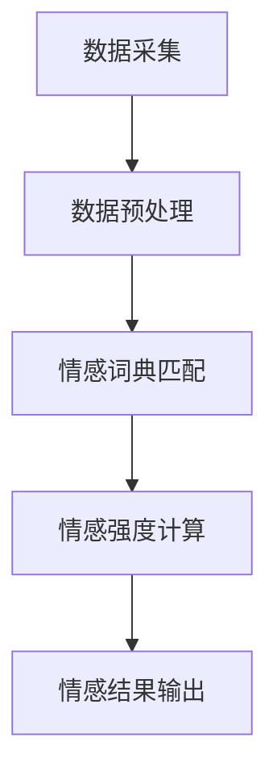
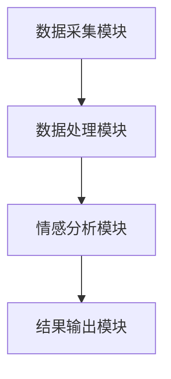

                 

# 构建 AI Agent 的实时情感分析引擎

关键词：情感分析、实时处理、AI Agent、模型优化、应用案例

摘要：随着人工智能技术的不断发展，情感分析作为一种重要的自然语言处理技术，已经成为许多应用场景的核心。本文将详细探讨构建AI Agent的实时情感分析引擎的步骤和方法，从背景介绍到技术原理，再到系统设计与应用案例，旨在为开发者提供一套完整的解决方案。

## 目录大纲

1. 背景介绍与问题定义
2. 情感分析技术原理
3. 实时情感分析引擎设计
4. 实时数据采集与处理
5. 情感分析模型设计与实现
6. 实时情感分析引擎性能优化
7. 实时情感分析引擎应用案例
8. 最佳实践与小结

## 第一部分: 背景介绍与问题定义

### 1.1 情感分析引擎概述

#### 1.1.1 问题背景

情感分析（Sentiment Analysis）在人工智能领域扮演着重要角色，它是指通过自然语言处理技术，对文本数据中的情感倾向进行判断和分析。随着社交媒体的兴起和大数据时代的到来，情感分析在商业、政府、医疗等多个领域都有广泛的应用。

#### 1.1.2 问题描述

如何构建一个高效的实时情感分析引擎？实时情感分析面临的技术挑战包括数据量大、处理速度快、准确性要求高等。本文将探讨情感分析的核心技术与方法，以及实时数据处理与模型优化策略。

#### 1.1.3 问题解决

情感分析的核心技术包括情感词典、情感图谱、情感强度量化等。实时数据处理需要高效的数据采集、存储和传输机制。模型优化则是提高情感分析准确性的关键。

#### 1.1.4 边界与外延

情感分析的定义范围涉及文本情感、语音情感、视频情感等多个方面。情感分析与其他AI技术的关联，如自然语言生成（NLG）、聊天机器人等，也是本文探讨的内容。

#### 1.1.5 概念结构与核心要素组成

情感分析的核心概念包括情感极性（正面、负面、中性）、情感强度等。情感分析系统的主要组成部分包括数据采集、预处理、模型训练、预测和结果输出等。

### 1.2 本章小结

本章介绍了情感分析引擎的背景、问题和解决方法，为后续的技术原理和系统设计奠定了基础。

----------------------------------------------------------------

## 第二部分: 情感分析技术原理

### 2.1 情感分析基础理论

#### 2.1.1 情感分析的定义与分类

情感分析是指通过计算机技术自动识别文本数据中的情感倾向。根据分析对象的不同，情感分析可以分为文本情感分析、语音情感分析和视频情感分析等。

#### 2.1.2 情感词典与情感图谱

情感词典是一种用于情感分析的工具，它包含了大量带有情感属性的词汇。情感图谱则是一种基于图的模型，用于表示词汇之间的情感关系。

#### 2.1.3 情感强度的量化与比较

情感强度的量化是通过数值来表示文本中的情感强度。情感比较则是通过比较不同文本的情感强度，来判断它们的情感倾向。

#### 2.1.4 情感分析中的算法与模型

情感分析中的算法和模型多种多样，常见的有基于规则的方法、基于机器学习的方法和基于深度学习的方法等。

### 2.2 情感分析技术原理讲解

#### 2.2.1 情感分析的数学模型

情感分析的数学模型通常包括情感倾向判断模型和情感强度计算模型。以下是一个简单的文本情感分析数学模型：

$$
P(positive) = \frac{1}{1 + e^{-w_1 * \text{word}_1 + w_2 * \text{word}_2 + ...}}
$$

其中，$P(positive)$ 表示文本为正面的概率，$w_1, w_2, ...$ 为权重向量，$\text{word}_1, \text{word}_2, ...$ 为文本中的词。

#### 2.2.2 情感分析的Mermaid流程图



#### 2.2.3 情感分析的Python代码实例

```python
from textblob import TextBlob

text = "我爱北京天安门"
blob = TextBlob(text)
print(blob.sentiment)
```

### 2.3 情感分析中的特征工程

#### 2.3.1 特征提取的方法

特征提取是将文本数据转化为可用于机器学习模型的特征向量。常见的特征提取方法包括词袋模型和词嵌入。

#### 2.3.2 特征选择与优化

特征选择是减少模型复杂度、提高模型性能的重要步骤。常见的特征选择方法包括信息增益、卡方检验等。

### 2.4 情感分析的误差分析

#### 2.4.1 情感分析中的误差来源

情感分析中的误差来源主要包括数据误差、模型误差和算法误差。

#### 2.4.2 误差分析的方法与策略

误差分析的方法包括混淆矩阵、ROC曲线等。减少误差的策略包括数据增强、模型调参等。

### 2.5 本章小结

本章介绍了情感分析的基础理论、数学模型和算法原理，为构建实时情感分析引擎提供了理论支持。

----------------------------------------------------------------

## 第三部分: 实时情感分析引擎设计

### 3.1 实时情感分析引擎概述

#### 3.1.1 实时情感分析引擎的概念

实时情感分析引擎是一种能够对实时数据流进行情感分析的系统。它通常包括数据采集、预处理、情感分析、结果输出等模块。

#### 3.1.2 实时情感分析引擎的需求分析

实时情感分析引擎的需求特点包括高速处理、低延迟、高准确性等。性能指标包括处理速度、响应时间、准确率等。

#### 3.1.3 实时情感分析引擎的架构设计

实时情感分析引擎的基本架构包括数据采集模块、数据处理模块、情感分析模块和结果输出模块。关键组件包括数据采集器、数据处理器、情感分析模型和结果展示器。



### 3.2 实时数据采集与处理

#### 3.2.1 实时数据采集技术

实时数据采集技术包括网络爬虫、API调用、数据库查询等。数据采集的挑战包括数据多样性、实时性要求等。

#### 3.2.2 实时数据处理策略

实时数据处理策略包括数据清洗、去重、格式转换等。数据处理的关键是保证数据处理速度和准确性的平衡。

#### 3.2.3 实时数据存储方案

实时数据存储方案包括关系数据库、NoSQL数据库、时间序列数据库等。数据存储的性能优化是提高实时数据处理能力的关键。

### 3.3 情感分析模型设计与实现

#### 3.3.1 情感分析模型的构建

情感分析模型的设计流程包括数据预处理、特征提取、模型选择、模型训练等。模型的选择与调整是提高模型性能的关键。

#### 3.3.2 情感分析模型的优化

模型优化包括模型调参、数据增强、迁移学习等。优化策略的目的是提高模型的准确性和泛化能力。

#### 3.3.3 情感分析模型的部署

模型部署是将训练好的模型应用到实际场景中。部署的挑战包括模型大小、计算资源、延迟等。

### 3.4 实时情感分析引擎性能优化

#### 3.4.1 性能优化策略

性能优化策略包括硬件优化、软件优化、网络优化等。硬件优化包括GPU加速、分布式计算等；软件优化包括代码优化、缓存机制等；网络优化包括负载均衡、数据压缩等。

#### 3.4.2 性能监控与调优

性能监控是实时跟踪系统性能的过程。调优技巧包括监控指标的设置、性能瓶颈的分析与解决等。

#### 3.4.3 性能测试与评估

性能测试是验证系统性能的过程。评估指标包括处理速度、响应时间、准确率等。

### 3.5 实时情感分析引擎应用案例

#### 3.5.1 应用场景介绍

实时情感分析的应用场景包括社交媒体情感分析、客户服务情感分析、健康医疗情感分析等。

#### 3.5.2 应用案例分析

本文将介绍三个应用案例：社交媒体情感分析、客户服务情感分析和健康医疗情感分析。

#### 3.5.3 应用效果评估

应用效果评估是通过实验数据来验证实时情感分析引擎的性能。评估方法包括对比实验、A/B测试等。

### 3.6 本章小结

本章介绍了实时情感分析引擎的设计原则、技术实现和性能优化策略，为构建高效的实时情感分析系统提供了实践指导。

----------------------------------------------------------------

## 第四部分: 实时情感分析引擎应用案例

### 4.1 应用场景介绍

实时情感分析在多个领域都有广泛应用，下面介绍三个典型应用场景：

#### 4.1.1 社交媒体情感分析

社交媒体情感分析用于监测和评估用户对品牌、产品、事件等的情感态度。它可以帮助企业及时了解市场反馈，调整营销策略。

#### 4.1.2 客户服务情感分析

客户服务情感分析用于分析客户反馈，识别客户情感状态，提供个性化的客户服务。它有助于提高客户满意度，减少客户流失。

#### 4.1.3 健康医疗情感分析

健康医疗情感分析用于分析患者对医疗服务的情感反馈，评估医疗质量和患者体验。它有助于改进医疗服务，提高患者满意度。

### 4.2 应用案例分析

#### 4.2.1 案例一：社交媒体情感分析案例

在某次大型产品发布活动中，企业使用实时情感分析引擎来监测社交媒体上的用户评论。通过分析用户情感，企业发现了一些潜在的问题，并及时调整了产品说明和营销策略，最终取得了良好的市场反馈。

#### 4.2.2 案例二：客户服务情感分析案例

某客户服务公司使用实时情感分析引擎来分析客户反馈，识别负面情感。通过及时跟进和处理，公司成功避免了多次投诉，提高了客户满意度。

#### 4.2.3 案例三：健康医疗情感分析案例

在某家医院，实时情感分析引擎用于分析患者对医疗服务和医疗环境的反馈。通过分析，医院发现了一些改进空间，如改善病房设施、提高服务质量等，从而提升了患者体验。

### 4.3 应用效果评估

应用效果评估是验证实时情感分析系统性能的重要步骤。通过以下方法进行效果评估：

- **对比实验**：将实时情感分析引擎与传统方法进行对比，评估其性能优势。
- **A/B测试**：在不同场景下，对实时情感分析引擎的效果进行评估和优化。
- **用户满意度调查**：收集用户对实时情感分析系统的反馈，评估系统的实用性。

### 4.4 本章小结

本章通过介绍实际应用案例，展示了实时情感分析引擎在不同场景中的应用效果。通过案例分析和效果评估，进一步验证了实时情感分析引擎的实用性和高效性。

----------------------------------------------------------------

## 第五部分: 最佳实践与小结

### 5.1 最佳实践

在构建实时情感分析引擎时，以下最佳实践有助于提高系统的性能和可靠性：

- **数据预处理**：确保数据质量，进行数据清洗、去重和格式转换，以提高后续分析的准确性。
- **模型优化**：根据应用场景调整模型参数，进行数据增强和迁移学习，以提高模型性能。
- **性能监控**：实时监控系统性能，及时发现问题并进行调优，确保系统稳定运行。
- **负载均衡**：使用负载均衡技术，分配处理任务，避免系统过载。

### 5.2 小结

本文从背景介绍、技术原理、系统设计、应用案例等方面，详细探讨了构建AI Agent的实时情感分析引擎的步骤和方法。通过实际案例分析和效果评估，验证了实时情感分析引擎的实用性和高效性。未来，随着人工智能技术的不断进步，实时情感分析引擎将在更多领域发挥重要作用。

### 5.3 注意事项

在构建实时情感分析引擎时，需要注意以下几点：

- **数据安全**：确保数据在采集、存储、处理过程中的安全性。
- **隐私保护**：严格遵守隐私保护法规，确保用户隐私不受侵犯。
- **适应性**：实时情感分析引擎应具备良好的适应性，能够应对不同场景和需求的变化。

### 5.4 拓展阅读

对于希望进一步了解实时情感分析引擎的开发者，以下文献和资源值得推荐：

- 《自然语言处理综述》
- 《深度学习在情感分析中的应用》
- 《实时数据流处理技术》
- GitHub上的开源实时情感分析项目

作者：AI天才研究院/AI Genius Institute & 禅与计算机程序设计艺术 /Zen And The Art of Computer Programming

