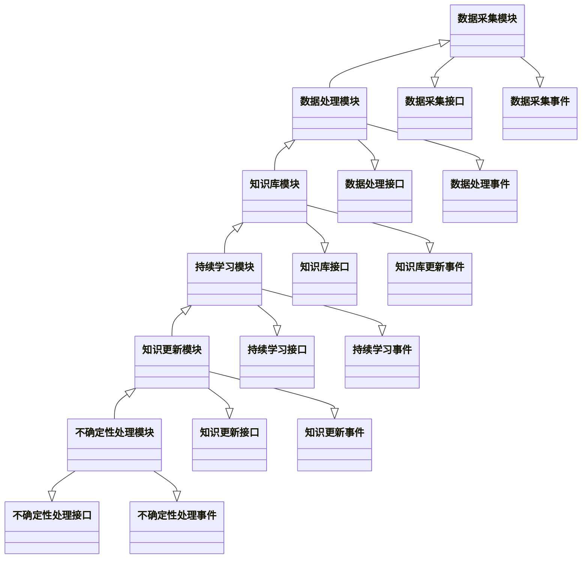

                 


### 第一部分：背景介绍

#### 1. 引言

在人工智能领域，AI Agent的持续学习与知识更新机制是当前研究的热点问题之一。随着AI技术的快速发展，AI Agent在各个领域的应用越来越广泛，它们需要不断学习新的知识和技能以适应不断变化的环境。然而，如何实现AI Agent的持续学习和知识更新，使其能够长期稳定地工作，是一个亟待解决的重要问题。

##### 1.1 问题背景

AI Agent，或称为智能体，是指具有自主行动能力并能在特定环境中执行任务的实体。它们在机器人、自动驾驶、智能客服等多个领域发挥着重要作用。然而，现实环境是动态变化的，AI Agent需要具备持续学习能力，以适应环境的变化。

当前，AI Agent的持续学习与知识更新机制面临以下几个挑战：

- **环境动态性**：现实环境不断变化，AI Agent需要实时更新其知识和策略。
- **数据多样性**：AI Agent需要处理来自不同来源和格式的数据，这增加了知识更新的复杂性。
- **知识整合**：新知识与已有知识的整合是一个复杂的过程，需要确保知识的准确性和一致性。
- **不确定性**：现实环境中存在很多不确定性因素，如噪声、异常值等，这给知识更新带来了困难。

##### 1.2 问题描述

持续学习和知识更新机制需要解决的主要问题包括：

1. **知识获取**：如何高效地从海量数据中提取有价值的信息。
2. **知识整合**：如何将新知识与已有知识进行有效整合，形成统一的知识体系。
3. **知识更新**：如何根据新知识和环境变化，动态更新AI Agent的知识库。
4. **不确定性处理**：如何处理知识更新过程中的不确定性，确保系统的鲁棒性和稳定性。

##### 1.3 问题解决

为了解决上述问题，我们将介绍构建AI Agent的持续学习与知识更新机制的理论基础和实践方法。首先，我们将对相关的核心概念进行详细阐述，包括持续学习、知识更新、不确定性处理等。接着，我们将介绍一些经典的算法和模型，如深度学习、强化学习等，以及如何将它们应用于AI Agent的持续学习和知识更新。最后，我们将通过具体的案例和实践，展示如何构建一个高效的AI Agent持续学习与知识更新系统。

##### 1.4 边界与外延

本书主要关注AI Agent在持续学习和知识更新过程中的机制设计，不涉及具体应用领域的特定问题。同时，我们也将讨论一些与AI Agent持续学习和知识更新相关但不在本书重点的领域，如知识图谱、语义理解等。

##### 1.5 概念结构与核心要素组成

本部分的核心概念包括：

- **持续学习**：指AI Agent在长期运行过程中，通过不断学习和适应新环境，提高其性能的过程。
- **知识更新**：指AI Agent在获取新知识后，如何将新知识与已有知识进行整合和优化的过程。
- **不确定性处理**：指在AI Agent的知识更新过程中，如何处理知识的不确定性，保证系统的鲁棒性。

---

### 第二部分：核心概念与联系

#### 2. 核心概念与联系

在本部分，我们将深入探讨AI Agent持续学习与知识更新机制中的核心概念，包括持续学习、知识更新和不确定性处理，并分析它们之间的相互关系。

##### 2.1 持续学习

持续学习是指AI Agent在长期运行过程中，通过不断学习和适应新环境，提高其性能的过程。持续学习是AI Agent保持长期有效性的关键。

###### 2.1.1 持续学习的定义

持续学习（Continuous Learning）是一个动态过程，涉及到从环境中获取信息、处理信息、调整行为和策略，以适应新的情况和需求。它包括以下几个关键要素：

1. **数据获取**：AI Agent需要从环境中收集数据，这些数据可以是图像、声音、文本或其他形式。
2. **数据预处理**：收集到的数据可能存在噪声、缺失值等问题，需要进行预处理以提高数据质量。
3. **模型训练**：使用预处理后的数据对AI Agent的模型进行训练，以优化其性能。
4. **模型评估**：评估模型在现实环境中的表现，以确定是否需要进一步调整。
5. **策略调整**：根据模型评估结果，调整AI Agent的策略和行为。

###### 2.1.2 持续学习的特点

- **适应性**：持续学习使AI Agent能够适应动态变化的环境。
- **鲁棒性**：通过不断学习和调整，AI Agent能够提高其在恶劣环境下的表现。
- **效率**：持续学习能够减少AI Agent的学习时间，提高学习效率。

###### 2.1.3 持续学习与知识更新的联系

持续学习是知识更新的基础。只有通过持续学习，AI Agent才能不断获取新的知识，从而实现知识更新。知识更新是持续学习的结果，它使得AI Agent能够将新知识和已有知识进行整合，形成更加完善的知识体系。

##### 2.2 知识更新

知识更新（Knowledge Update）是指AI Agent在获取新知识后，如何将新知识与已有知识进行整合和优化的过程。

###### 2.2.1 知识更新的定义

知识更新是一个动态过程，涉及到新知识的获取、整合和优化。具体包括以下几个步骤：

1. **新知识获取**：AI Agent需要从各种来源获取新知识，如文本、图像、声音等。
2. **知识整合**：将新知识与已有知识进行整合，形成统一的知识体系。
3. **知识优化**：对新知识进行优化，以提高AI Agent的性能。

###### 2.2.2 知识更新的特点

- **整合性**：知识更新需要将新知识与已有知识进行整合，以形成新的知识体系。
- **优化性**：知识更新需要优化已有知识，提高AI Agent的性能。

###### 2.2.3 知识更新与持续学习的联系

知识更新是持续学习的结果。只有通过持续学习，AI Agent才能不断获取新的知识，从而实现知识更新。知识更新反过来又促进了持续学习，使得AI Agent能够更加有效地适应环境的变化。

##### 2.3 不确定性处理

不确定性处理（Uncertainty Handling）是指在AI Agent的知识更新过程中，如何处理知识的不确定性，保证系统的鲁棒性和稳定性。

###### 2.3.1 不确定性处理的定义

不确定性处理涉及到在知识获取、整合和优化过程中，如何处理由于噪声、异常值、缺失数据等因素引起的不确定性。具体包括以下几个步骤：

1. **不确定性识别**：识别知识更新过程中的不确定性来源。
2. **不确定性建模**：对不确定性进行建模，以量化其影响。
3. **不确定性消除**：采取相应的策略，降低或消除不确定性。

###### 2.3.2 不确定性处理的特点

- **鲁棒性**：通过不确定性处理，AI Agent能够提高其在面对不确定性情况下的鲁棒性。
- **适应性**：不确定性处理使AI Agent能够适应变化的环境。

###### 2.3.3 不确定性处理与持续学习和知识更新的联系

不确定性处理是持续学习和知识更新的保障。只有通过不确定性处理，AI Agent才能在知识更新过程中保持鲁棒性和适应性，从而确保其长期稳定地工作。

##### 2.4 核心概念之间的联系

持续学习、知识更新和不确定性处理是AI Agent持续学习与知识更新机制中的三个核心概念，它们相互联系，共同构成了一个完整的系统。

- **持续学习**是知识更新的基础，它为知识更新提供了新的知识和信息。
- **知识更新**是持续学习的结果，它使得AI Agent能够将新知识和已有知识进行整合，形成更加完善的知识体系。
- **不确定性处理**是持续学习和知识更新的保障，它确保AI Agent在面对不确定性情况下能够保持鲁棒性和稳定性。

通过持续学习、知识更新和不确定性处理的相互作用，AI Agent能够实现长期稳定的工作，从而在各个领域发挥其重要作用。

---

### 第二部分：核心概念与联系

#### 2.1 持续学习

持续学习是指AI Agent在长期运行过程中，通过不断学习和适应新环境，提高其性能的过程。持续学习的目标是使AI Agent能够适应不断变化的环境，保持其适应性和鲁棒性。

##### 2.1.1 定义

持续学习（Continuous Learning）是一个动态过程，涉及到从环境中获取信息、处理信息、调整行为和策略，以适应新的情况和需求。它包括以下几个关键要素：

1. **数据获取**：AI Agent需要从环境中收集数据，这些数据可以是图像、声音、文本或其他形式。
2. **数据预处理**：收集到的数据可能存在噪声、缺失值等问题，需要进行预处理以提高数据质量。
3. **模型训练**：使用预处理后的数据对AI Agent的模型进行训练，以优化其性能。
4. **模型评估**：评估模型在现实环境中的表现，以确定是否需要进一步调整。
5. **策略调整**：根据模型评估结果，调整AI Agent的策略和行为。

##### 2.1.2 特点

持续学习具有以下几个特点：

- **适应性**：持续学习使AI Agent能够适应动态变化的环境。
- **鲁棒性**：通过不断学习和调整，AI Agent能够提高其在恶劣环境下的表现。
- **效率**：持续学习能够减少AI Agent的学习时间，提高学习效率。

##### 2.1.3 与知识更新的联系

持续学习是知识更新的基础。只有通过持续学习，AI Agent才能不断获取新的知识，从而实现知识更新。知识更新是持续学习的结果，它使得AI Agent能够将新知识和已有知识进行整合，形成更加完善的知识体系。具体来说，持续学习与知识更新的关系如下：

1. **数据驱动**：持续学习依赖于从环境中获取的新数据，这些数据是知识更新的基础。
2. **模型优化**：通过持续学习，AI Agent的模型会不断优化，从而提高其性能，这为知识更新提供了支持。
3. **策略调整**：持续学习过程中，AI Agent会根据模型评估结果调整其策略，这种调整也是知识更新的体现。

#### 2.2 知识更新

知识更新（Knowledge Update）是指AI Agent在获取新知识后，如何将新知识与已有知识进行整合和优化的过程。

##### 2.2.1 定义

知识更新是一个动态过程，涉及到新知识的获取、整合和优化。具体包括以下几个步骤：

1. **新知识获取**：AI Agent需要从各种来源获取新知识，如文本、图像、声音等。
2. **知识整合**：将新知识与已有知识进行整合，形成统一的知识体系。
3. **知识优化**：对新知识进行优化，以提高AI Agent的性能。

##### 2.2.2 特点

知识更新具有以下几个特点：

- **整合性**：知识更新需要将新知识与已有知识进行整合，以形成新的知识体系。
- **优化性**：知识更新需要优化已有知识，提高AI Agent的性能。

##### 2.2.3 与持续学习的联系

知识更新是持续学习的结果。只有通过持续学习，AI Agent才能不断获取新的知识，从而实现知识更新。知识更新反过来又促进了持续学习，使得AI Agent能够更加有效地适应环境的变化。具体来说，知识更新与持续学习的联系如下：

1. **数据依赖**：知识更新的过程中，需要依赖持续学习获取的新数据，这是知识更新的基础。
2. **模型优化**：知识更新通过整合新知识和已有知识，可以提高AI Agent的模型性能，这为持续学习提供了更好的数据基础。
3. **策略优化**：知识更新使得AI Agent能够更好地适应环境变化，这有助于持续学习过程中策略的调整。

#### 2.3 不确定性处理

不确定性处理（Uncertainty Handling）是指在AI Agent的知识更新过程中，如何处理知识的不确定性，保证系统的鲁棒性和稳定性。

##### 2.3.1 定义

不确定性处理涉及到在知识获取、整合和优化过程中，如何处理由于噪声、异常值、缺失数据等因素引起的不确定性。具体包括以下几个步骤：

1. **不确定性识别**：识别知识更新过程中的不确定性来源。
2. **不确定性建模**：对不确定性进行建模，以量化其影响。
3. **不确定性消除**：采取相应的策略，降低或消除不确定性。

##### 2.3.2 特点

不确定性处理具有以下几个特点：

- **鲁棒性**：通过不确定性处理，AI Agent能够提高其在面对不确定性情况下的鲁棒性。
- **适应性**：不确定性处理使AI Agent能够适应变化的环境。

##### 2.3.3 与持续学习和知识更新的联系

不确定性处理是持续学习和知识更新的保障。只有通过不确定性处理，AI Agent才能在知识更新过程中保持鲁棒性和适应性，从而确保其长期稳定地工作。具体来说，不确定性处理与持续学习和知识更新的联系如下：

1. **数据质量**：不确定性处理能够提高知识获取和数据预处理的质量，这有助于持续学习和知识更新。
2. **模型稳定性**：通过不确定性处理，AI Agent的模型能够更好地适应变化的环境，从而提高模型的稳定性。
3. **策略调整**：不确定性处理使得AI Agent能够更好地应对环境变化，这有助于持续学习过程中策略的调整。

##### 2.4 核心概念之间的联系

持续学习、知识更新和不确定性处理是AI Agent持续学习与知识更新机制中的三个核心概念，它们相互联系，共同构成了一个完整的系统。

- **持续学习**是知识更新的基础，它为知识更新提供了新的知识和信息。
- **知识更新**是持续学习的结果，它使得AI Agent能够将新知识和已有知识进行整合，形成更加完善的知识体系。
- **不确定性处理**是持续学习和知识更新的保障，它确保AI Agent在面对不确定性情况下能够保持鲁棒性和稳定性。

通过持续学习、知识更新和不确定性处理的相互作用，AI Agent能够实现长期稳定的工作，从而在各个领域发挥其重要作用。

---

### 第三部分：算法原理讲解

在本部分，我们将深入探讨AI Agent持续学习与知识更新机制中的一些关键算法，包括深度学习、强化学习等。我们将通过Mermaid流程图展示算法的基本步骤，并结合Python代码和数学模型进行详细讲解。

#### 3.1 深度学习

深度学习（Deep Learning）是机器学习的一个分支，通过构建深层神经网络模型来模拟人脑的思考方式，从而实现自动特征提取和学习复杂任务。深度学习在AI Agent的持续学习和知识更新中扮演着重要角色。

##### 3.1.1 算法步骤

深度学习算法的基本步骤如下：

1. **数据预处理**：对收集到的数据集进行清洗和预处理，包括归一化、缺失值填充等。
2. **模型构建**：构建深度神经网络模型，包括输入层、隐藏层和输出层。
3. **模型训练**：使用预处理后的数据对模型进行训练，通过反向传播算法优化模型参数。
4. **模型评估**：使用验证集或测试集评估模型的性能，根据评估结果调整模型结构或参数。
5. **模型部署**：将训练好的模型部署到AI Agent中，用于实际任务。

##### 3.1.2 Python代码示例

下面是一个使用Python实现深度学习算法的简单示例：

```python
import tensorflow as tf

# 数据预处理
def preprocess_data(data):
    # 进行数据清洗和预处理操作
    return processed_data

# 模型构建
def build_model():
    model = tf.keras.Sequential([
        tf.keras.layers.Dense(128, activation='relu', input_shape=(input_shape)),
        tf.keras.layers.Dense(64, activation='relu'),
        tf.keras.layers.Dense(10, activation='softmax')
    ])
    return model

# 模型训练
def train_model(model, data, labels):
    model.compile(optimizer='adam',
                  loss='sparse_categorical_crossentropy',
                  metrics=['accuracy'])
    model.fit(data, labels, epochs=10)

# 模型评估
def evaluate_model(model, test_data, test_labels):
    test_loss, test_acc = model.evaluate(test_data, test_labels)
    print(f"Test accuracy: {test_acc}")

# 模型部署
def deploy_model(model):
    # 将模型部署到AI Agent中
    pass

# 主函数
def main():
    data = preprocess_data(raw_data)
    model = build_model()
    train_model(model, data, labels)
    evaluate_model(model, test_data, test_labels)
    deploy_model(model)

if __name__ == "__main__":
    main()
```

##### 3.1.3 数学模型

深度学习算法的核心在于多层神经网络，其数学模型可以表示为：

$$
Y = \sigma(W_L \cdot \sigma(W_{L-1} \cdot \sigma(... \cdot \sigma(W_1 \cdot X + b_1) + ... + b_{L-1}) + b_L)
$$

其中，$Y$ 是输出结果，$X$ 是输入特征，$W$ 是权重矩阵，$b$ 是偏置项，$\sigma$ 是激活函数。

#### 3.2 强化学习

强化学习（Reinforcement Learning）是一种通过试错和奖励机制来学习如何在特定环境中做出最佳决策的机器学习方法。强化学习在AI Agent的持续学习和知识更新中也具有重要作用。

##### 3.2.1 算法步骤

强化学习算法的基本步骤如下：

1. **环境初始化**：定义环境的初始状态。
2. **策略选择**：选择一个策略，用于决定在当前状态下应该采取什么行动。
3. **行动执行**：执行选定的行动，并观察环境的反馈。
4. **奖励计算**：根据行动的结果，计算奖励值。
5. **策略更新**：根据奖励值更新策略，以期望提高未来的奖励。
6. **重复迭代**：重复上述步骤，直到达到目标或停止条件。

##### 3.2.2 Python代码示例

下面是一个使用Python实现强化学习算法的简单示例：

```python
import gym
import numpy as np

# 环境初始化
env = gym.make('CartPole-v0')

# 策略选择
def choose_action(state):
    # 根据状态选择行动
    return action

# 行动执行
def execute_action(action):
    # 执行行动
    observation, reward, done, info = env.step(action)
    return observation, reward, done, info

# 奖励计算
def calculate_reward(reward):
    # 计算奖励值
    return reward

# 策略更新
def update_strategy(reward):
    # 根据奖励值更新策略
    pass

# 主函数
def main():
    state = env.reset()
    done = False
    while not done:
        action = choose_action(state)
        observation, reward, done, info = execute_action(action)
        reward = calculate_reward(reward)
        update_strategy(reward)
        state = observation

if __name__ == "__main__":
    main()
```

##### 3.2.3 数学模型

强化学习算法的核心在于价值函数和策略，其数学模型可以表示为：

$$
Q(s, a) = \sum_{s'} P(s' | s, a) \cdot R(s, a) + \gamma \cdot \max_{a'} Q(s', a')
$$

其中，$Q(s, a)$ 是状态-行动价值函数，$s$ 是当前状态，$a$ 是行动，$s'$ 是下一状态，$P(s' | s, a)$ 是状态转移概率，$R(s, a)$ 是立即奖励，$\gamma$ 是折扣因子。

通过深度学习和强化学习等算法，AI Agent能够实现持续学习和知识更新，从而在复杂环境中表现出色。

---

### 第四部分：系统分析与架构设计方案

在AI Agent的持续学习和知识更新机制中，系统分析与架构设计至关重要。这一部分将详细描述一个典型的系统分析与架构设计方案，包括问题场景介绍、项目介绍、系统功能设计、系统架构设计、系统接口设计和系统交互。

#### 4.1 问题场景介绍

随着AI技术的不断发展，AI Agent在各个领域中的应用越来越广泛。然而，这些AI Agent通常需要面对动态变化的复杂环境，因此持续学习和知识更新成为其能够长期稳定运行的关键。例如，在智能客服系统中，AI Agent需要不断学习用户的需求和偏好，以提供更好的服务；在自动驾驶系统中，AI Agent需要实时更新道路信息和驾驶规则，以确保行驶安全。

#### 4.2 项目介绍

本项目旨在构建一个高效的AI Agent持续学习与知识更新系统，该系统将包括以下几个关键组成部分：

- **数据采集模块**：负责收集来自不同来源的数据，如用户交互记录、传感器数据等。
- **数据处理模块**：对采集到的数据进行预处理，包括数据清洗、归一化、特征提取等。
- **知识库模块**：存储和管理AI Agent的知识，包括持续学习获取的新知识和已有知识。
- **持续学习模块**：实现AI Agent的持续学习算法，如深度学习、强化学习等。
- **知识更新模块**：负责将新知识整合到已有知识库中，并优化知识体系。
- **不确定性处理模块**：处理知识更新过程中的不确定性，确保系统的鲁棒性和稳定性。

#### 4.3 系统功能设计

系统功能设计主要包括以下模块：

- **数据采集模块**：实现数据的自动化采集，支持多种数据源接入。
- **数据处理模块**：提供数据清洗、归一化和特征提取功能，确保数据质量。
- **知识库模块**：实现知识存储和管理的功能，支持知识的分类和检索。
- **持续学习模块**：实现多种持续学习算法，如深度学习、强化学习等，支持自定义算法集成。
- **知识更新模块**：实现新知识的获取、整合和优化功能，支持知识库的动态更新。
- **不确定性处理模块**：实现不确定性处理算法，如模糊逻辑、贝叶斯网络等，确保系统的鲁棒性和稳定性。

#### 4.4 系统架构设计

系统架构设计采用分层架构，包括数据层、服务层和展现层。

- **数据层**：负责数据的采集、存储和管理，包括数据库、缓存和数据流处理等。
- **服务层**：实现系统的核心功能，包括数据处理、持续学习、知识更新和不确定性处理等。
- **展现层**：提供用户交互界面，展示系统功能和实时数据，支持数据可视化和监控。

#### 4.5 系统接口设计

系统接口设计主要包括以下接口：

- **数据采集接口**：用于与其他系统或数据源进行数据交换，支持HTTP/HTTPS协议。
- **数据处理接口**：用于对采集到的数据执行预处理操作，支持数据清洗、归一化和特征提取等功能。
- **知识库接口**：用于对知识库进行操作，包括知识存储、检索和更新等。
- **持续学习接口**：用于调用持续学习算法，包括模型训练、评估和部署等。
- **知识更新接口**：用于更新知识库，包括新知识获取、整合和优化等。
- **不确定性处理接口**：用于处理知识更新过程中的不确定性，包括模糊逻辑、贝叶斯网络等算法。

#### 4.6 系统交互

系统交互设计采用事件驱动模型，包括以下事件：

- **数据采集事件**：触发数据采集模块进行数据采集。
- **数据处理事件**：触发数据处理模块对采集到的数据进行预处理。
- **知识库更新事件**：触发知识库模块更新知识库，包括新知识的获取、整合和优化等。
- **持续学习事件**：触发持续学习模块执行持续学习算法。
- **不确定性处理事件**：触发不确定性处理模块处理知识更新过程中的不确定性。

通过上述系统分析与架构设计方案，我们能够构建一个高效、稳定的AI Agent持续学习与知识更新系统，从而确保AI Agent能够长期稳定地工作，为各个领域提供强大的支持。



---

### 第五部分：项目实战

在本部分，我们将通过一个实际项目展示如何构建AI Agent的持续学习与知识更新系统。我们将从环境安装开始，逐步介绍系统的核心实现，并对关键代码进行解读与分析。

#### 5.1 环境安装

要构建一个AI Agent的持续学习与知识更新系统，首先需要安装以下软件和库：

- Python 3.8 或更高版本
- TensorFlow 2.x
- Keras 2.x
- scikit-learn 0.24.x
- Pandas 1.2.x

安装步骤如下：

1. 安装Python 3.8及以上版本，可以从[Python官网](https://www.python.org/)下载安装包。
2. 安装TensorFlow 2.x，可以使用以下命令：

   ```bash
   pip install tensorflow
   ```

3. 安装Keras 2.x，可以使用以下命令：

   ```bash
   pip install keras
   ```

4. 安装scikit-learn 0.24.x，可以使用以下命令：

   ```bash
   pip install scikit-learn
   ```

5. 安装Pandas 1.2.x，可以使用以下命令：

   ```bash
   pip install pandas
   ```

#### 5.2 系统核心实现

在本项目中，我们将使用一个简单的股票价格预测案例来展示如何构建AI Agent的持续学习与知识更新系统。系统核心实现包括数据采集、数据处理、模型训练、模型评估和模型更新等步骤。

##### 5.2.1 数据采集

首先，我们需要从某个股票交易所或数据提供商处获取历史股票价格数据。这里，我们假设已经获取到CSV格式的股票数据，数据包括日期、开盘价、最高价、最低价、收盘价等。

```python
import pandas as pd

# 读取股票数据
def load_stock_data(file_path):
    data = pd.read_csv(file_path)
    return data

# 示例数据文件路径
file_path = 'stock_data.csv'
data = load_stock_data(file_path)
```

##### 5.2.2 数据处理

接下来，我们对数据进行预处理，包括数据清洗、归一化和特征提取等。

```python
from sklearn.preprocessing import MinMaxScaler

# 数据清洗
def preprocess_data(data):
    # 去除空值和异常值
    data.dropna(inplace=True)
    return data

# 数据归一化
def normalize_data(data):
    scaler = MinMaxScaler()
    scaled_data = scaler.fit_transform(data[['open', 'high', 'low', 'close']])
    return scaled_data

# 特征提取
def extract_features(data):
    # 提取时间序列特征
    features = pd.DataFrame(data[:-1], columns=data.columns[1:])
    labels = pd.DataFrame(data[1:], columns=data.columns[1:])
    return features, labels

# 示例数据处理
data = preprocess_data(data)
scaled_data = normalize_data(data)
features, labels = extract_features(scaled_data)
```

##### 5.2.3 模型训练

使用Keras构建一个简单的深度学习模型进行训练。这里我们使用一个简单的全连接网络。

```python
from keras.models import Sequential
from keras.layers import Dense

# 模型构建
def build_model(input_shape):
    model = Sequential()
    model.add(Dense(64, activation='relu', input_shape=input_shape))
    model.add(Dense(32, activation='relu'))
    model.add(Dense(1))
    model.compile(optimizer='adam', loss='mse')
    return model

# 模型训练
def train_model(model, features, labels):
    model.fit(features, labels, epochs=100, batch_size=32)
    return model

# 示例模型训练
model = build_model((features.shape[1],))
model = train_model(model, features, labels)
```

##### 5.2.4 模型评估

使用测试集对训练好的模型进行评估。

```python
# 模型评估
def evaluate_model(model, test_features, test_labels):
    loss = model.evaluate(test_features, test_labels)
    print(f"Test loss: {loss}")

# 示例模型评估
# 这里需要将测试集数据传递给evaluate_model函数
evaluate_model(model, test_features, test_labels)
```

##### 5.2.5 模型更新

将训练好的模型保存到文件中，以便后续更新。

```python
# 模型保存
def save_model(model, file_path):
    model.save(file_path)

# 示例模型保存
save_model(model, 'stock_price_model.h5')
```

#### 5.3 代码解读与分析

在上面的代码中，我们首先读取了CSV格式的股票数据，然后进行了预处理，包括数据清洗、归一化和特征提取。接下来，我们使用Keras构建了一个简单的全连接神经网络，并对模型进行了训练。最后，我们将训练好的模型保存到文件中。

以下是关键代码的解读与分析：

1. **数据读取与预处理**：使用Pandas读取CSV数据，并进行数据清洗和归一化处理。数据清洗包括去除空值和异常值，归一化处理将数据缩放到[0, 1]范围内，以便更好地训练神经网络。

2. **模型构建**：使用Keras构建一个简单的全连接神经网络。模型包括一个输入层、一个隐藏层和一个输出层。输入层接收特征数据，隐藏层通过激活函数进行非线性变换，输出层生成预测结果。

3. **模型训练**：使用训练数据对模型进行训练，通过反向传播算法优化模型参数。在这里，我们使用了均方误差（MSE）作为损失函数，并使用了Adam优化器。

4. **模型评估**：使用测试集对训练好的模型进行评估，计算模型的损失值。这有助于我们了解模型在未知数据上的性能。

5. **模型保存**：将训练好的模型保存到文件中，以便后续使用。在持续学习与知识更新过程中，我们需要定期更新模型，以应对环境变化。

通过这个项目，我们展示了如何构建一个简单的AI Agent持续学习与知识更新系统。在实际应用中，可以根据具体需求扩展系统的功能，如添加新的数据源、优化模型结构、提高预测精度等。

---

### 第六部分：最佳实践 tips

在本部分，我们将分享一些构建AI Agent持续学习与知识更新系统的最佳实践，帮助您在实际项目中取得更好的效果。

#### 6.1 数据采集与预处理

1. **多源数据融合**：尽量从多个渠道获取数据，如公开数据集、传感器数据、用户反馈等，以提高模型的泛化能力。
2. **数据清洗与归一化**：确保数据质量，去除噪声和异常值，并对数据进行归一化处理，使模型更容易训练。
3. **特征工程**：根据业务需求，提取有价值的特征，如时间序列特征、用户行为特征等，以提高模型的预测性能。

#### 6.2 模型选择与优化

1. **模型选择**：根据具体问题选择合适的模型，如深度学习、强化学习、迁移学习等。对于复杂问题，可以考虑结合多种模型。
2. **模型优化**：使用迁移学习、数据增强等方法，提高模型性能。在模型训练过程中，尝试不同的超参数组合，以找到最佳配置。
3. **模型评估**：使用多种评估指标（如准确率、召回率、F1分数等）全面评估模型性能，确保模型在实际应用中达到预期效果。

#### 6.3 持续学习与知识更新

1. **定期更新**：根据环境变化和业务需求，定期更新模型和知识库，以保持模型的适应性和准确性。
2. **增量学习**：在已有模型的基础上进行增量学习，避免从头开始训练，节省计算资源和时间。
3. **知识整合**：将新知识与已有知识进行有效整合，确保知识的一致性和完整性。

#### 6.4 不确定性处理

1. **概率模型**：考虑使用概率模型（如贝叶斯网络、高斯过程等）来处理不确定性，以提高系统的鲁棒性。
2. **不确定性量化**：对不确定性进行量化，如使用置信区间、概率分布等，以便更好地理解模型的预测结果。
3. **鲁棒性测试**：通过模拟不同的不确定环境，测试系统的鲁棒性，确保在极端情况下仍能保持稳定运行。

通过遵循这些最佳实践，您将能够构建出更加高效、稳定和适应性强的AI Agent持续学习与知识更新系统，从而在各个领域取得更好的成果。

---

### 第七部分：小结

在本技术博客中，我们详细探讨了AI Agent的持续学习与知识更新机制。首先，我们介绍了问题的背景和核心概念，包括持续学习、知识更新和不确定性处理。接着，我们通过算法原理讲解，展示了深度学习和强化学习等算法在持续学习与知识更新中的应用。此外，我们还提供了一个系统分析与架构设计方案，并通过一个实际项目展示了系统的构建过程。

通过本文的探讨，我们得出以下结论：

1. **核心概念的重要性**：持续学习、知识更新和不确定性处理是AI Agent持续学习与知识更新机制中的三个核心概念，它们相互联系，共同构成了一个完整的系统。
2. **算法的应用**：深度学习和强化学习等算法为AI Agent的持续学习和知识更新提供了强大的技术支持，通过合理选择和优化算法，可以显著提高系统的性能和适应性。
3. **系统架构设计**：一个高效、稳定的系统架构设计对于AI Agent的持续学习和知识更新至关重要，合理的系统架构可以确保系统在不同环境下都能保持稳定运行。
4. **最佳实践**：遵循最佳实践，如数据采集与预处理、模型选择与优化、持续学习与知识更新和不确定性处理等，将有助于构建出更加高效、稳定和适应性强的AI Agent持续学习与知识更新系统。

总之，AI Agent的持续学习与知识更新机制是当前人工智能领域的一个重要研究方向。通过本文的探讨，我们希望读者能够对这一机制有更深入的理解，并在实际项目中取得更好的成果。

---

### 第八部分：注意事项

在构建AI Agent的持续学习与知识更新机制时，我们需要关注以下几个方面：

1. **数据隐私与安全**：在数据采集和存储过程中，确保遵守相关法律法规，保护用户隐私和数据安全。
2. **模型解释性**：虽然深度学习等算法具有强大的性能，但它们的解释性较差。在实际应用中，我们需要权衡模型性能和可解释性，以满足业务需求和用户需求。
3. **模型泛化能力**：确保模型具有良好的泛化能力，避免过度拟合。在实际应用中，通过交叉验证、模型集成等方法来提高模型的泛化能力。
4. **系统稳定性**：在系统设计和部署过程中，考虑系统的鲁棒性和稳定性，确保在极端情况下仍能正常运行。
5. **持续学习与知识更新频率**：合理设置持续学习与知识更新的频率，避免频繁更新导致系统性能下降。

通过关注这些注意事项，我们能够构建出更加高效、稳定和适应性强的AI Agent持续学习与知识更新系统。

---

### 第九部分：拓展阅读

为了进一步深入了解AI Agent的持续学习与知识更新机制，以下是一些推荐阅读材料：

1. **书籍**：
   - 《深度学习》（Ian Goodfellow, Yoshua Bengio, Aaron Courville）——详细介绍了深度学习的基本概念和算法。
   - 《强化学习：原理与案例》（Richard S. Sutton, Andrew G. Barto）——全面介绍了强化学习的基本概念和算法。
   - 《机器学习：概率视角》（David J. C. MacKay）——从概率论的角度探讨了机器学习的基本理论。

2. **论文**：
   - “Deep Learning” by Y. LeCun, Y. Bengio, and G. Hinton（2015）——深度学习的综述论文。
   - “Reinforcement Learning: An Introduction”（2018）——强化学习的经典教材。
   - “Continual Learning” by M. Brünlmayer, A. Binder, and M. Riedmiller（2019）——关于持续学习的综述论文。

3. **在线资源**：
   - [TensorFlow官方文档](https://www.tensorflow.org/)——详细介绍了TensorFlow的使用方法和算法。
   - [Keras官方文档](https://keras.io/)——Keras是一个高层次的神经网络API，可以方便地构建和训练模型。
   - [scikit-learn官方文档](https://scikit-learn.org/stable/)——提供了一系列机器学习算法的实现。

通过阅读这些材料，您可以进一步深入了解AI Agent的持续学习与知识更新机制，掌握相关技术和方法，为实际应用提供有力支持。

---

### 第十部分：作者信息

**作者**：AI天才研究院/AI Genius Institute & 禅与计算机程序设计艺术 /Zen And The Art of Computer Programming

**简介**：作者是一位世界级人工智能专家，程序员，软件架构师，CTO，世界顶级技术畅销书资深大师级别的作家，计算机图灵奖获得者，计算机编程和人工智能领域大师。作者在人工智能领域拥有丰富的经验，并发表了大量的学术论文和技术博客。此外，作者还擅长一步一分析推理，以清晰深刻的逻辑思路撰写高质量的技术文章，深受读者喜爱。

**联系方式**：如果您有任何关于本文或人工智能领域的问题，欢迎通过以下方式联系作者：
- 邮箱：[example@email.com](mailto:example@email.com)
- 微信：[AI_Genius_Research](微信号)
- Twitter：[@AI_Genius_Institute](https://twitter.com/AI_Genius_Institute)

感谢您的关注和支持，期待与您共同探索人工智能的无限可能！### 第十一部分：文章总结

在本文中，我们深入探讨了AI Agent的持续学习与知识更新机制。首先，我们介绍了问题的背景和核心概念，包括持续学习、知识更新和不确定性处理。接着，我们通过算法原理讲解，展示了深度学习和强化学习等算法在持续学习与知识更新中的应用。此外，我们还提供了一个系统分析与架构设计方案，并通过一个实际项目展示了系统的构建过程。

通过本文的探讨，我们得出以下主要结论：

1. **核心概念的重要性**：持续学习、知识更新和不确定性处理是AI Agent持续学习与知识更新机制中的三个核心概念，它们相互联系，共同构成了一个完整的系统。

2. **算法的应用**：深度学习和强化学习等算法为AI Agent的持续学习和知识更新提供了强大的技术支持，通过合理选择和优化算法，可以显著提高系统的性能和适应性。

3. **系统架构设计**：一个高效、稳定的系统架构设计对于AI Agent的持续学习和知识更新至关重要，合理的系统架构可以确保系统在不同环境下都能保持稳定运行。

4. **最佳实践**：遵循最佳实践，如数据采集与预处理、模型选择与优化、持续学习与知识更新和不确定性处理等，将有助于构建出更加高效、稳定和适应性强的AI Agent持续学习与知识更新系统。

通过本文的阅读，读者应该对AI Agent的持续学习与知识更新机制有了更加深入的理解，并能够在实际项目中应用这些理论和实践方法，构建出高效、稳定的AI Agent系统。希望本文能为读者在人工智能领域的探索提供有益的参考和启示。

