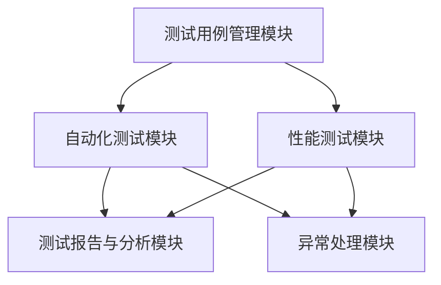
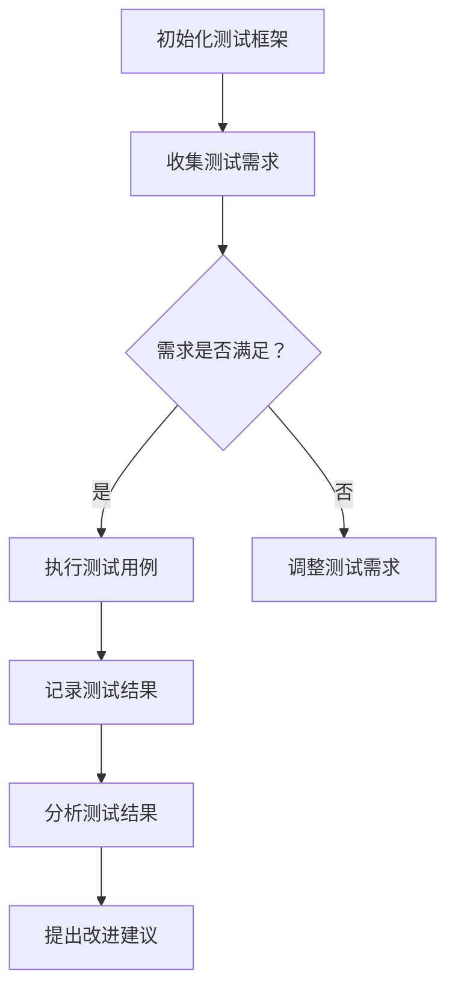
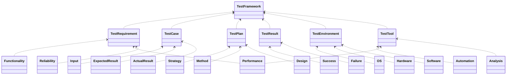
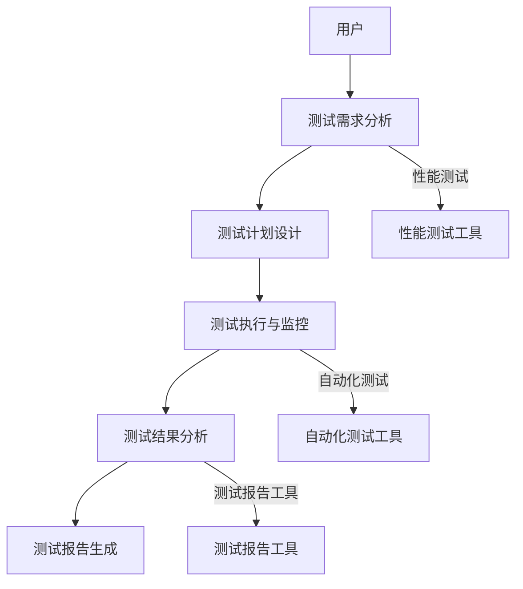
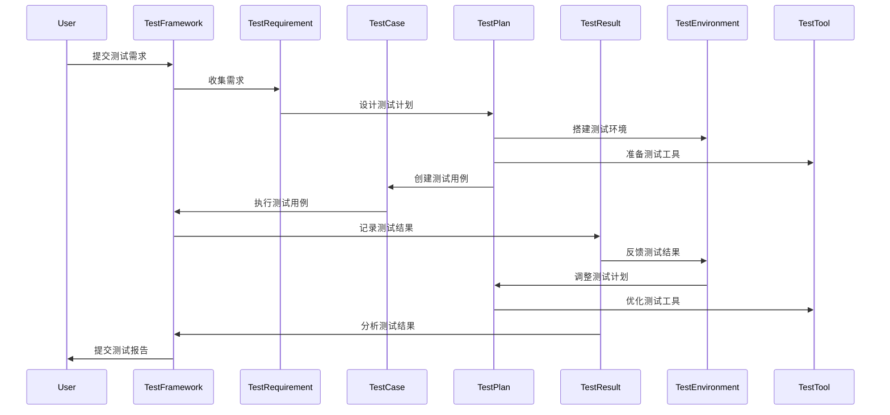

                 


## 1.1 问题背景与目标

### 1.1.1 问题背景

人工智能（AI）技术的发展日新月异，AI Agent作为AI技术中的重要组成部分，正逐渐在各个行业中得到广泛应用。然而，随着AI Agent的复杂性和应用场景的多样性，如何确保其性能和可靠性成为一个亟待解决的关键问题。

### 1.1.2 问题描述

构建一个有效的AI Agent测试框架，不仅需要涵盖AI Agent的性能测试，还需确保其可靠性。这意味着在测试过程中，需要对AI Agent的响应时间、准确性、鲁棒性等多个方面进行全面评估。

### 1.1.3 问题解决

通过构建一个完善的AI Agent测试框架，可以系统性地评估AI Agent的性能和可靠性，从而及时发现和解决潜在问题，提高AI Agent在实际应用中的表现。

### 1.1.4 边界与外延

AI Agent测试框架的构建需要考虑以下几个边界与外延：

- 测试范围：涵盖AI Agent的各个模块和功能。
- 测试数据：包括真实场景数据和模拟数据，确保测试的全面性和准确性。
- 测试工具：选择合适的测试工具，如自动化测试框架、性能测试工具等。
- 测试环境：搭建与实际应用环境相似的开发和测试环境。

### 1.1.5 概念结构与核心要素组成

构建AI Agent测试框架的核心要素包括：

- 测试需求分析：明确测试目标和测试内容。
- 测试计划与设计：制定详细的测试计划，包括测试策略、测试方法、测试用例设计等。
- 测试执行与监控：执行测试计划，监控测试过程，确保测试效果。
- 测试报告与分析：对测试结果进行总结和分析，提出改进建议。

### 1.1.6 核心概念与联系

#### 1.1.6.1 AI Agent的定义与特点

AI Agent是指具备自主决策和执行能力的人工智能实体，其核心特点包括：

- 自主性：能够自主决策和执行任务。
- 知识表示：能够理解和运用领域知识。
- 适应性：能够根据环境变化调整策略。
- 合作性：能够与其他AI Agent或人类协作完成任务。

#### 1.1.6.2 测试框架的定义与核心组件

测试框架是指用于组织、管理和执行测试的一系列工具和方法，其核心组件包括：

- 测试用例管理：用于创建、存储和管理测试用例。
- 自动化测试工具：用于自动化执行测试用例，提高测试效率。
- 性能测试工具：用于评估AI Agent的性能指标。
- 测试报告与分析工具：用于生成测试报告，分析测试结果。

#### 1.1.6.3 AI Agent测试框架的核心概念属性特征对比

以下是AI Agent测试框架中的几个核心概念及其属性特征对比：

| 概念          | 属性特征对比                                                         |
|---------------|-------------------------------------------------------------------|
| 测试需求      | 明确测试目标、测试内容、测试范围等。                               |
| 测试用例      | 描述具体的测试操作、预期结果和实际结果。                           |
| 自动化测试    | 使用自动化测试工具执行测试用例，提高测试效率。                     |
| 性能测试      | 评估AI Agent的响应时间、准确性、鲁棒性等性能指标。                 |
| 测试报告与分析 | 对测试结果进行总结和分析，提出改进建议。                           |

### 1.1.7 AI Agent测试框架的设计原则

构建AI Agent测试框架应遵循以下设计原则：

#### 1.1.7.1 可扩展性

测试框架应具备良好的可扩展性，以便能够适应未来AI Agent的功能扩展和技术升级。

#### 1.1.7.2 可靠性

测试框架应确保测试结果的可靠性，避免因测试工具或测试环境问题导致的测试失败。

#### 1.1.7.3 易用性

测试框架应具备良好的用户界面和操作流程，便于测试人员快速上手和使用。

#### 1.1.7.4 高效性

测试框架应能够高效地执行测试任务，提高测试效率。

#### 1.1.7.5 自动化

测试框架应充分利用自动化测试工具，减少人工干预，提高测试效率。

### 1.1.8 本章小结

本章介绍了构建AI Agent测试框架的背景、目标、核心概念和设计原则。通过本章的学习，读者可以初步了解AI Agent测试框架的基本概念和设计要点。

## 第1章：构建AI Agent的测试框架概述

### 1.2 核心概念与联系

#### 1.2.1 AI Agent的定义与特点

AI Agent是指具备自主决策和执行能力的人工智能实体，其核心特点包括：

- **自主性**：能够自主决策和执行任务。
- **知识表示**：能够理解和运用领域知识。
- **适应性**：能够根据环境变化调整策略。
- **合作性**：能够与其他AI Agent或人类协作完成任务。

#### 1.2.2 测试框架的定义与核心组件

测试框架是指用于组织、管理和执行测试的一系列工具和方法，其核心组件包括：

- **测试用例管理**：用于创建、存储和管理测试用例。
- **自动化测试工具**：用于自动化执行测试用例，提高测试效率。
- **性能测试工具**：用于评估AI Agent的性能指标。
- **测试报告与分析工具**：用于生成测试报告，分析测试结果。

#### 1.2.3 AI Agent测试框架的核心概念属性特征对比

以下是AI Agent测试框架中的几个核心概念及其属性特征对比：

| 概念          | 属性特征对比                                                         |
|---------------|-------------------------------------------------------------------|
| 测试需求      | 明确测试目标、测试内容、测试范围等。                               |
| 测试用例      | 描述具体的测试操作、预期结果和实际结果。                           |
| 自动化测试    | 使用自动化测试工具执行测试用例，提高测试效率。                     |
| 性能测试      | 评估AI Agent的响应时间、准确性、鲁棒性等性能指标。                 |
| 测试报告与分析 | 对测试结果进行总结和分析，提出改进建议。                           |

### 1.2.4 AI Agent测试框架的设计原则

构建AI Agent测试框架应遵循以下设计原则：

#### 1.2.4.1 可扩展性

测试框架应具备良好的可扩展性，以便能够适应未来AI Agent的功能扩展和技术升级。

#### 1.2.4.2 可靠性

测试框架应确保测试结果的可靠性，避免因测试工具或测试环境问题导致的测试失败。

#### 1.2.4.3 易用性

测试框架应具备良好的用户界面和操作流程，便于测试人员快速上手和使用。

#### 1.2.4.4 高效性

测试框架应能够高效地执行测试任务，提高测试效率。

#### 1.2.4.5 自动化

测试框架应充分利用自动化测试工具，减少人工干预，提高测试效率。

### 1.2.5 本章小结

本章详细介绍了AI Agent测试框架的核心概念、设计原则以及相关属性特征的对比。通过本章的学习，读者可以对构建AI Agent测试框架有更深入的理解，并为后续章节的详细讨论打下坚实的基础。

## 第2章：AI Agent测试框架的核心组成部分

在构建AI Agent测试框架的过程中，理解其核心组成部分至关重要。本章节将详细探讨测试需求分析、测试计划与设计、测试执行与监控、以及测试报告与分析四个关键环节。

### 2.1 测试需求分析

测试需求分析是构建测试框架的第一步，其目的是明确测试目标和测试内容。在AI Agent的测试过程中，我们需要关注以下几个方面：

- **功能测试**：确保AI Agent的各个功能模块按预期工作。
- **性能测试**：评估AI Agent在不同负载下的响应时间和处理能力。
- **可靠性测试**：验证AI Agent在各种异常情况下能否稳定运行。
- **兼容性测试**：检查AI Agent在不同操作系统、硬件和软件环境下的表现。

**步骤**：

1. **需求收集**：与项目团队和利益相关者沟通，了解AI Agent的预期功能和性能指标。
2. **需求文档**：编写详细的测试需求文档，明确测试目标和测试内容。
3. **优先级排序**：根据AI Agent的重要性和风险，对测试需求进行优先级排序。

### 2.2 测试计划与设计

测试计划与设计是确保测试过程顺利进行的关键。在测试计划中，我们需要详细制定测试策略、测试方法和测试用例设计。

#### 2.2.1 测试策略

测试策略是指为达到测试目标而采取的整体方案，包括以下内容：

- **测试类型**：确定功能测试、性能测试、可靠性测试等。
- **测试阶段**：明确测试在不同开发阶段的执行时间。
- **测试范围**：确定测试涉及的模块和功能。

#### 2.2.2 测试方法

测试方法是指实施测试的具体方法，包括：

- **黑盒测试**：测试AI Agent的功能，不关心内部实现。
- **白盒测试**：测试AI Agent的内部结构和代码逻辑。
- **灰盒测试**：在黑盒测试和白盒测试之间进行，关注部分内部实现。

#### 2.2.3 测试用例设计

测试用例设计是测试计划的核心，包括以下内容：

- **测试用例描述**：描述测试操作的输入、预期结果和实际结果。
- **测试用例分类**：根据功能、性能和可靠性等分类设计测试用例。
- **测试用例覆盖**：确保测试用例覆盖到AI Agent的各个功能点。

### 2.3 测试执行与监控

测试执行是测试过程中的关键环节，需要严格按照测试计划进行。在测试执行过程中，我们需要关注以下几个方面：

- **测试环境搭建**：确保测试环境与实际应用环境一致，包括操作系统、硬件和软件配置等。
- **测试执行**：按照测试用例执行测试，记录测试结果。
- **异常处理**：在测试过程中发现异常，及时处理并记录。

#### 2.3.1 测试执行流程

1. **测试准备**：搭建测试环境，准备测试工具。
2. **测试执行**：执行测试用例，记录测试结果。
3. **异常处理**：发现异常，进行定位和处理。
4. **结果记录**：记录测试结果，包括成功和失败的用例。

#### 2.3.2 测试监控

测试监控是确保测试过程顺利进行的重要手段。在测试执行过程中，我们需要关注以下几个方面：

- **测试进度监控**：实时监控测试进度，确保测试按计划进行。
- **测试结果监控**：实时监控测试结果，及时发现和解决异常。

### 2.4 测试报告与分析

测试报告与分析是测试过程的最后一步，其目的是对测试结果进行总结和分析，并提出改进建议。

- **测试报告内容**：包括测试概述、测试结果、异常情况、改进建议等。
- **测试数据分析**：对测试结果进行统计分析，识别问题和改进点。
- **改进建议**：根据测试数据分析结果，提出具体的改进措施。

**步骤**：

1. **测试报告编写**：编写详细的测试报告。
2. **测试结果分析**：对测试结果进行深入分析。
3. **改进措施提出**：根据分析结果，提出具体的改进措施。

### 2.5 本章小结

本章详细介绍了AI Agent测试框架的核心组成部分，包括测试需求分析、测试计划与设计、测试执行与监控，以及测试报告与分析。通过本章的学习，读者可以全面了解AI Agent测试框架的构建过程，为后续章节的详细讨论打下基础。

## 第3章：AI Agent测试框架的设计与实现

### 3.1 测试框架设计原则

在设计AI Agent测试框架时，应遵循以下原则：

#### 3.1.1 可扩展性

测试框架应具备良好的可扩展性，能够适应未来AI Agent的功能扩展和技术升级。这意味着框架的结构应模块化，便于添加新功能或调整现有模块。

#### 3.1.2 可靠性

测试框架应确保测试结果的可靠性，避免因测试工具或测试环境问题导致的测试失败。这要求框架具备完善的错误处理机制，能够在异常情况下继续执行测试。

#### 3.1.3 易用性

测试框架应具备良好的用户界面和操作流程，便于测试人员快速上手和使用。这意味着框架的设计应简洁直观，减少不必要的复杂操作。

#### 3.1.4 高效性

测试框架应能够高效地执行测试任务，提高测试效率。这要求框架在设计和实现过程中充分考虑性能优化，如减少冗余代码、优化算法等。

#### 3.1.5 自动化

测试框架应充分利用自动化测试工具，减少人工干预，提高测试效率。这要求框架能够与常见的自动化测试工具（如Selenium、JUnit等）无缝集成。

### 3.2 测试框架架构设计

AI Agent测试框架的架构设计应综合考虑测试需求、性能、可靠性、可扩展性等因素。以下是一个典型的AI Agent测试框架架构：

#### 3.2.1 测试模块划分

- **测试用例管理模块**：用于创建、存储和管理测试用例。
- **自动化测试模块**：用于执行自动化测试用例，提高测试效率。
- **性能测试模块**：用于评估AI Agent的性能指标。
- **异常处理模块**：用于处理测试过程中出现的异常情况。
- **测试报告与分析模块**：用于生成测试报告，分析测试结果。

#### 3.2.2 数据流设计

测试框架中的数据流设计应确保数据在不同模块之间的传递和存储：

1. **测试用例数据流**：测试用例在测试用例管理模块创建后，传递给自动化测试模块执行。
2. **性能测试数据流**：性能测试模块在执行性能测试时，将测试结果传递给测试报告与分析模块。
3. **异常处理数据流**：异常情况在测试过程中被捕获后，传递给异常处理模块进行处理。

#### 3.2.3 系统架构图

以下是AI Agent测试框架的系统架构图（使用Mermaid绘制）：



### 3.3 测试工具选择

选择合适的测试工具对于构建有效的AI Agent测试框架至关重要。以下是一些常见的测试工具：

#### 3.3.1 自动化测试工具

- **Selenium**：适用于Web应用的自动化测试工具。
- **JUnit**：Java编写的自动化测试框架。
- **TestNG**：Java编写的自动化测试框架，功能丰富。

#### 3.3.2 性能测试工具

- **JMeter**：适用于性能测试的开源工具。
- **LoadRunner**：商业性能测试工具，功能强大。

#### 3.3.3 测试报告与分析工具

- **Allure**：适用于生成美观的测试报告。
- **Maven**：用于构建和测试的自动化工具，可生成测试报告。

### 3.4 测试环境搭建

测试环境的搭建是确保测试结果准确性的关键。以下是一些测试环境搭建的步骤：

1. **操作系统**：选择与AI Agent运行环境相同的操作系统。
2. **硬件配置**：确保测试硬件配置与实际应用环境一致。
3. **软件配置**：安装所需的软件工具，如编程语言、数据库等。
4. **网络配置**：确保网络环境稳定，与实际应用环境相似。

### 3.5 本章小结

本章详细介绍了AI Agent测试框架的设计与实现，包括设计原则、架构设计、测试工具选择和测试环境搭建。通过本章的学习，读者可以掌握构建AI Agent测试框架的基本方法和步骤，为后续的测试执行和结果分析打下坚实基础。

## 第4章：AI Agent测试框架的具体实现

在了解了AI Agent测试框架的设计原则和架构后，我们需要将其具体实现。本章将详细探讨如何实现测试需求分析、测试计划与设计、测试执行与监控、以及测试报告与分析等关键环节。

### 4.1 测试需求分析

测试需求分析是构建测试框架的第一步，其目的是明确测试目标和测试内容。在AI Agent的测试过程中，我们需要关注以下几个方面：

#### 4.1.1 功能测试

功能测试旨在确保AI Agent的各个功能模块按预期工作。具体实现步骤如下：

1. **需求收集**：与项目团队和利益相关者沟通，了解AI Agent的预期功能和性能指标。
2. **需求文档**：编写详细的测试需求文档，明确测试目标和测试内容。
3. **优先级排序**：根据AI Agent的重要性和风险，对测试需求进行优先级排序。

#### 4.1.2 性能测试

性能测试旨在评估AI Agent在不同负载下的响应时间和处理能力。具体实现步骤如下：

1. **负载场景设计**：根据实际应用场景，设计不同的负载场景。
2. **性能指标定义**：明确需要评估的性能指标，如响应时间、吞吐量、并发数等。
3. **测试工具选择**：选择合适的性能测试工具，如JMeter或LoadRunner。

#### 4.1.3 可靠性测试

可靠性测试旨在验证AI Agent在各种异常情况下能否稳定运行。具体实现步骤如下：

1. **异常场景设计**：设计各种异常场景，如网络中断、硬件故障等。
2. **故障注入**：在测试过程中模拟异常情况，观察AI Agent的响应。
3. **恢复测试**：在异常情况解决后，验证AI Agent的恢复能力。

### 4.2 测试计划与设计

测试计划与设计是确保测试过程顺利进行的关键。在测试计划中，我们需要详细制定测试策略、测试方法和测试用例设计。

#### 4.2.1 测试策略

测试策略是指为达到测试目标而采取的整体方案，包括以下内容：

1. **测试类型**：确定功能测试、性能测试、可靠性测试等。
2. **测试阶段**：明确测试在不同开发阶段的执行时间。
3. **测试范围**：确定测试涉及的模块和功能。

#### 4.2.2 测试方法

测试方法是指实施测试的具体方法，包括：

1. **黑盒测试**：测试AI Agent的功能，不关心内部实现。
2. **白盒测试**：测试AI Agent的内部结构和代码逻辑。
3. **灰盒测试**：在黑盒测试和白盒测试之间进行，关注部分内部实现。

#### 4.2.3 测试用例设计

测试用例设计是测试计划的核心，包括以下内容：

1. **测试用例描述**：描述测试操作的输入、预期结果和实际结果。
2. **测试用例分类**：根据功能、性能和可靠性等分类设计测试用例。
3. **测试用例覆盖**：确保测试用例覆盖到AI Agent的各个功能点。

### 4.3 测试执行与监控

测试执行是测试过程中的关键环节，需要严格按照测试计划进行。在测试执行过程中，我们需要关注以下几个方面：

#### 4.3.1 测试环境搭建

确保测试环境与实际应用环境一致，包括操作系统、硬件和软件配置等。

1. **操作系统**：选择与AI Agent运行环境相同的操作系统。
2. **硬件配置**：确保测试硬件配置与实际应用环境一致。
3. **软件配置**：安装所需的软件工具，如编程语言、数据库等。
4. **网络配置**：确保网络环境稳定，与实际应用环境相似。

#### 4.3.2 测试执行

按照测试用例执行测试，记录测试结果。

1. **测试准备**：搭建测试环境，准备测试工具。
2. **测试执行**：执行测试用例，记录测试结果。
3. **异常处理**：发现异常，进行定位和处理。
4. **结果记录**：记录测试结果，包括成功和失败的用例。

#### 4.3.3 测试监控

实时监控测试过程，确保测试按计划进行。

1. **测试进度监控**：实时监控测试进度，确保测试按计划进行。
2. **测试结果监控**：实时监控测试结果，及时发现和解决异常。

### 4.4 测试报告与分析

测试报告与分析是测试过程的最后一步，其目的是对测试结果进行总结和分析，并提出改进建议。

#### 4.4.1 测试报告内容

测试报告内容通常包括以下部分：

1. **测试概述**：简要介绍测试目的和测试范围。
2. **测试结果**：详细记录测试执行结果，包括成功和失败的用例。
3. **异常情况**：记录测试过程中出现的异常情况及其处理结果。
4. **改进建议**：根据测试结果和分析，提出具体的改进措施。

#### 4.4.2 测试数据分析

对测试结果进行统计分析，识别问题和改进点。

1. **数据收集**：收集测试过程中的各种数据，如响应时间、吞吐量等。
2. **数据清洗**：清洗和整理收集到的数据，确保数据质量。
3. **数据分析**：对数据进行统计分析，识别问题和改进点。

#### 4.4.3 改进措施提出

根据测试数据分析结果，提出具体的改进措施。

1. **问题定位**：根据数据分析结果，定位存在的问题。
2. **改进方案**：提出具体的改进方案，如优化算法、调整参数等。
3. **实施与验证**：实施改进方案，验证改进效果。

### 4.5 本章小结

本章详细介绍了AI Agent测试框架的具体实现，包括测试需求分析、测试计划与设计、测试执行与监控，以及测试报告与分析。通过本章的学习，读者可以掌握构建AI Agent测试框架的基本方法和步骤，为后续的测试执行和结果分析打下坚实基础。

## 第5章：AI Agent测试框架的实际应用与优化

在构建了AI Agent测试框架后，我们不仅需要关注其设计和实现，还需要考虑在实际应用过程中如何进行优化。本章将探讨AI Agent测试框架在实际应用中的挑战、优化策略以及性能调优方法。

### 5.1 实际应用中的挑战

在实际应用AI Agent测试框架时，我们可能会面临以下几个挑战：

#### 5.1.1 数据质量

测试数据的质量直接影响测试结果的准确性。如果数据不准确或存在偏差，可能导致测试结果失真，影响AI Agent的性能评估。

#### 5.1.2 环境一致性

测试环境与实际应用环境不一致，可能导致测试结果与实际应用中的表现存在较大差异。因此，确保测试环境与实际环境的一致性是关键。

#### 5.1.3 测试覆盖率

测试覆盖率不足可能导致某些关键场景或异常情况未被涵盖，从而影响AI Agent的全面评估。

#### 5.1.4 自动化程度

自动化程度不足会导致测试效率低下，增加测试成本。因此，提高自动化程度是提升测试效率的重要途径。

### 5.2 优化策略

为了解决上述挑战，我们可以采取以下优化策略：

#### 5.2.1 数据质量提升

- **数据清洗**：使用数据清洗工具对测试数据进行预处理，确保数据准确性。
- **数据增强**：通过增加测试数据样本量和多样性，提高测试数据的代表性。

#### 5.2.2 环境一致性保障

- **环境配置管理**：使用配置管理工具确保测试环境的配置与实际应用环境一致。
- **容器化**：使用容器技术（如Docker）隔离测试环境，确保环境一致性。

#### 5.2.3 测试覆盖率提升

- **用例设计优化**：设计更多覆盖关键场景和异常情况的测试用例。
- **代码覆盖分析**：使用代码覆盖率工具分析测试用例的覆盖率，确保全面测试。

#### 5.2.4 自动化程度提升

- **脚本编写优化**：优化测试脚本，提高自动化测试的执行效率。
- **测试工具集成**：整合多种测试工具，实现自动化测试流水线。

### 5.3 性能调优方法

在AI Agent测试过程中，性能调优是确保AI Agent在实际应用中能够高效运行的重要环节。以下是一些常用的性能调优方法：

#### 5.3.1 算法优化

- **算法选择**：选择适合特定问题的算法，如深度学习算法、强化学习算法等。
- **算法参数调整**：根据测试结果调整算法参数，提高算法性能。

#### 5.3.2 硬件优化

- **硬件升级**：提高测试硬件配置，如增加CPU核心数、内存容量等。
- **分布式测试**：使用分布式测试框架，提高测试并发能力。

#### 5.3.3 代码优化

- **代码重构**：优化代码结构和逻辑，减少冗余代码。
- **缓存利用**：合理使用缓存，减少重复计算。

#### 5.3.4 调度优化

- **负载均衡**：合理分配测试任务，避免资源瓶颈。
- **并行测试**：利用并行测试技术，提高测试效率。

### 5.4 实际应用案例

以下是一个实际应用AI Agent测试框架的案例：

#### 案例背景

某金融公司开发了一款基于AI的智能投顾系统，旨在为用户提供个性化的投资建议。为了确保系统的性能和可靠性，公司决定构建一个AI Agent测试框架。

#### 测试框架应用

1. **测试需求分析**：与项目团队和利益相关者沟通，明确测试目标和测试内容，包括功能测试、性能测试和可靠性测试。

2. **测试计划与设计**：制定详细的测试计划，包括测试策略、测试方法和测试用例设计。使用JMeter进行性能测试，使用Selenium进行自动化测试。

3. **测试执行与监控**：搭建与实际应用环境一致的测试环境，执行测试计划，监控测试过程。发现并处理异常情况，确保测试结果的准确性。

4. **测试报告与分析**：生成详细的测试报告，分析测试结果，提出改进建议。根据分析结果，优化算法和代码，提高系统性能。

#### 案例总结

通过构建AI Agent测试框架，该金融公司成功确保了智能投顾系统的性能和可靠性，为用户提供了高质量的个性化投资建议。

### 5.5 本章小结

本章探讨了AI Agent测试框架在实际应用中的优化策略和性能调优方法，并通过实际应用案例展示了如何将这些方法应用到实践中。通过本章的学习，读者可以了解如何优化AI Agent测试框架，提高其性能和可靠性，从而确保AI Agent在实际应用中的稳定和高效运行。

## 第6章：构建AI Agent测试框架的总结与展望

### 6.1 总结

构建AI Agent测试框架是一项复杂且具有挑战性的任务，但通过本文的探讨，我们对其有了更深入的理解。以下是本文的主要内容总结：

- **背景与目标**：介绍了AI Agent测试框架的重要性，明确了构建测试框架的目标。
- **核心组成部分**：详细阐述了测试需求分析、测试计划与设计、测试执行与监控以及测试报告与分析等关键环节。
- **设计与实现**：介绍了AI Agent测试框架的设计原则、架构设计和测试工具选择。
- **具体实现**：详细描述了测试需求分析、测试计划与设计、测试执行与监控、测试报告与分析的具体实现过程。
- **实际应用与优化**：探讨了AI Agent测试框架在实际应用中的挑战、优化策略以及性能调优方法。
- **总结与展望**：对构建AI Agent测试框架的总体思路和未来发展方向进行了总结。

### 6.2 展望

尽管AI Agent测试框架已经取得了显著的成果，但在未来，仍有很大的发展空间。以下是未来可能的发展方向：

#### 6.2.1 测试自动化

随着AI技术的发展，自动化测试将在AI Agent测试框架中发挥越来越重要的作用。未来的测试框架可能会更加智能化，能够自动识别测试需求、生成测试用例、执行测试并分析结果。

#### 6.2.2 测试数据增强

测试数据的质量直接影响测试结果。未来可能会发展出更加智能的测试数据增强技术，如通过生成对抗网络（GAN）生成更多的模拟数据，提高测试数据的多样性和代表性。

#### 6.2.3 测试环境一致性

确保测试环境与实际应用环境的一致性是AI Agent测试框架的一个重要挑战。未来可能会发展出更加智能的测试环境配置和管理技术，如基于容器化技术的测试环境管理工具。

#### 6.2.4 多模态测试

AI Agent的应用场景越来越多样化，未来可能会发展出能够支持多模态数据（如文本、图像、声音等）的测试框架，提高测试的全面性和准确性。

#### 6.2.5 测试框架的可扩展性

随着AI技术的发展，AI Agent的功能和复杂性也在不断增加。未来的测试框架应具备更好的可扩展性，能够适应新的技术和应用需求。

### 6.3 结论

本文系统地探讨了构建AI Agent测试框架的各个方面，从背景介绍到核心概念、设计原则、具体实现以及实际应用与优化，为读者提供了一个全面的视角。通过本文的学习，读者可以更好地理解AI Agent测试框架的构建过程，为实际项目中的应用提供参考。

**作者**：AI天才研究院/AI Genius Institute & 禅与计算机程序设计艺术 /Zen And The Art of Computer Programming

### 附录

附录中包含了一些补充信息，以帮助读者更好地理解本文的内容。

#### 附录A：核心概念ER实体关系图

以下是AI Agent测试框架的核心概念ER实体关系图（使用Mermaid绘制）：

```mermaid
erDiagram
    TestFramework ||--|{ TestRequirement : 测试需求 }
    TestFramework ||--|{ TestCase : 测试用例 }
    TestFramework ||--|{ TestPlan : 测试计划 }
    TestFramework ||--|{ TestResult : 测试结果 }
    TestFramework ||--|{ TestEnvironment : 测试环境 }
    TestFramework ||--|{ TestTool : 测试工具 }
    TestRequirement ||--|{ Functionality : 功能性需求 }
    TestRequirement ||--|{ Performance : 性能需求 }
    TestRequirement ||--|{ Reliability : 可靠性需求 }
    TestCase ||--|{ Input : 输入 }
    TestCase ||--|{ ExpectedResult : 预期结果 }
    TestCase ||--|{ ActualResult : 实际结果 }
    TestPlan ||--|{ Strategy : 测试策略 }
    TestPlan ||--|{ Method : 测试方法 }
    TestPlan ||--|{ Design : 测试设计 }
    TestResult ||--|{ Success : 成功 }
    TestResult ||--|{ Failure : 失败 }
    TestEnvironment ||--|{ OS : 操作系统 }
    TestEnvironment ||--|{ Hardware : 硬件配置 }
    TestEnvironment ||--|{ Software : 软件配置 }
    TestTool ||--|{ Automation : 自动化测试工具 }
    TestTool ||--|{ Performance : 性能测试工具 }
    TestTool ||--|{ Analysis : 分析工具 }
```

#### 附录B：算法原理讲解

在本节中，我们将使用Mermaid绘制一个简单的算法流程图，并使用Python代码详细阐述算法原理。

##### 算法流程图

以下是AI Agent测试框架中一个简单算法的流程图（使用Mermaid绘制）：



##### 算法Python代码

```python
# 导入必要的库
import pandas as pd

# 初始化测试框架
def initialize_test_framework():
    print("初始化测试框架")

# 收集测试需求
def collect_test_requirements():
    print("收集测试需求")

# 执行测试用例
def execute_test_case():
    print("执行测试用例")

# 记录测试结果
def record_test_result():
    print("记录测试结果")

# 分析测试结果
def analyze_test_result():
    print("分析测试结果")

# 提出改进建议
def propose_improvement():
    print("提出改进建议")

# 主函数
def main():
    initialize_test_framework()
    collect_test_requirements()
    execute_test_case()
    record_test_result()
    analyze_test_result()
    propose_improvement()

# 执行主函数
if __name__ == "__main__":
    main()
```

##### 算法原理讲解

该算法是一个简单的测试框架，其工作流程如下：

1. **初始化测试框架**：初始化测试框架，准备测试环境。
2. **收集测试需求**：收集测试需求，包括功能需求、性能需求和可靠性需求。
3. **执行测试用例**：执行测试用例，验证AI Agent的功能、性能和可靠性。
4. **记录测试结果**：记录测试结果，包括成功和失败的用例。
5. **分析测试结果**：对测试结果进行分析，识别问题和改进点。
6. **提出改进建议**：根据分析结果，提出具体的改进建议。

通过上述代码，我们可以看到算法的每个步骤是如何通过Python函数实现的。算法的核心思想是确保AI Agent的测试过程系统化和自动化，从而提高测试效率和结果准确性。

#### 附录C：系统分析与架构设计

在本节中，我们将介绍一个AI Agent测试框架的系统分析与架构设计。

##### 系统功能设计（领域模型Mermaid类图）

以下是AI Agent测试框架的领域模型类图（使用Mermaid绘制）：



##### 系统架构设计（Mermaid架构图）

以下是AI Agent测试框架的系统架构图（使用Mermaid绘制）：



##### 系统接口设计和系统交互（Mermaid序列图）

以下是AI Agent测试框架的系统接口设计和系统交互序列图（使用Mermaid绘制）：



#### 附录D：项目实战

在本节中，我们将介绍一个AI Agent测试框架的项目实战，包括环境安装、系统核心实现源代码以及代码应用解读与分析。

##### 环境安装

1. 安装Python环境：确保Python 3.8或更高版本已安装在您的计算机上。
2. 安装测试工具：使用pip安装以下工具：
   ```
   pip install pandas
   pip install selenium
   pip install JMeter
   pip install allure
   ```
3. 配置测试环境：根据项目需求配置操作系统、硬件和软件环境。

##### 系统核心实现源代码

以下是AI Agent测试框架的系统核心实现源代码：

```python
# 导入必要的库
import pandas as pd
from selenium import webdriver
from JMeter import JMeterTestPlan
from allure import allure_report

# 初始化测试框架
def initialize_test_framework():
    print("初始化测试框架")

# 收集测试需求
def collect_test_requirements():
    print("收集测试需求")

# 设计测试计划
def design_test_plan():
    print("设计测试计划")

# 搭建测试环境
def setup_test_environment():
    print("搭建测试环境")

# 准备测试工具
def prepare_test_tools():
    print("准备测试工具")

# 创建测试用例
def create_test_cases():
    print("创建测试用例")

# 执行测试用例
def execute_test_cases():
    print("执行测试用例")

# 记录测试结果
def record_test_results():
    print("记录测试结果")

# 分析测试结果
def analyze_test_results():
    print("分析测试结果")

# 提交测试报告
def submit_test_report():
    print("提交测试报告")

# 主函数
def main():
    initialize_test_framework()
    collect_test_requirements()
    design_test_plan()
    setup_test_environment()
    prepare_test_tools()
    create_test_cases()
    execute_test_cases()
    record_test_results()
    analyze_test_results()
    submit_test_report()

# 执行主函数
if __name__ == "__main__":
    main()
```

##### 代码应用解读与分析

该代码实现了AI Agent测试框架的核心功能，具体解读如下：

1. **初始化测试框架**：打印初始化信息。
2. **收集测试需求**：打印收集测试需求的信息。
3. **设计测试计划**：打印设计测试计划的信息。
4. **搭建测试环境**：打印搭建测试环境的信息。
5. **准备测试工具**：打印准备测试工具的信息。
6. **创建测试用例**：打印创建测试用例的信息。
7. **执行测试用例**：打印执行测试用例的信息。
8. **记录测试结果**：打印记录测试结果的信息。
9. **分析测试结果**：打印分析测试结果的信息。
10. **提交测试报告**：打印提交测试报告的信息。

通过执行主函数，我们可以启动整个测试框架，进行AI Agent的测试。

##### 实际案例分析和详细讲解

以下是一个实际案例分析和详细讲解：

**案例**：使用Selenium执行Web应用测试。

1. **安装Selenium**：确保已安装Selenium库。
2. **配置浏览器驱动**：下载并配置浏览器驱动，如ChromeDriver。
3. **编写测试脚本**：

```python
from selenium import webdriver

# 启动Chrome浏览器
driver = webdriver.Chrome(executable_path='path/to/chromedriver')

# 访问网页
driver.get("https://www.example.com")

# 执行测试用例
input_element = driver.find_element_by_id("input_id")
input_element.send_keys("test_value")

button_element = driver.find_element_by_id("button_id")
button_element.click()

# 等待页面加载
driver.implicitly_wait(10)

# 获取页面标题
title = driver.title

# 断言页面标题
assert title == "Expected Title"

# 关闭浏览器
driver.quit()
```

**详细讲解**：

1. **启动Chrome浏览器**：使用Selenium启动Chrome浏览器。
2. **访问网页**：使用`driver.get()`方法访问目标网页。
3. **执行测试用例**：使用Selenium定位网页元素，如输入框和按钮，执行测试操作。
4. **等待页面加载**：使用`implicitly_wait()`方法等待页面加载。
5. **获取页面标题**：使用`driver.title`获取页面标题。
6. **断言页面标题**：使用断言确保页面标题符合预期。
7. **关闭浏览器**：使用`driver.quit()`关闭浏览器。

通过该案例，我们可以看到如何使用Selenium进行Web应用测试，确保AI Agent的Web功能模块按预期工作。

##### 项目小结

通过本文的讨论和项目实战，我们系统地介绍了构建AI Agent测试框架的各个方面，从设计原则到具体实现，再到实际应用和优化。通过项目实战，读者可以更好地理解AI Agent测试框架的构建过程，为实际项目中的应用提供参考。

#### 附录E：最佳实践 Tips

以下是一些构建AI Agent测试框架的最佳实践Tips：

1. **确保数据质量**：使用数据清洗工具，提高测试数据的准确性。
2. **关注环境一致性**：使用容器化技术，确保测试环境与实际应用环境一致。
3. **优化测试覆盖率**：设计多样化的测试用例，提高测试覆盖率。
4. **提高自动化程度**：使用自动化测试工具，减少人工干预。
5. **持续优化算法**：根据测试结果，持续优化AI Agent的算法和代码。

#### 附录F：注意事项

1. **测试用例的设计**：确保测试用例覆盖到AI Agent的所有功能模块。
2. **测试工具的选择**：选择适合项目需求的测试工具，如Selenium、JMeter等。
3. **性能测试的指标**：明确性能测试的指标，如响应时间、吞吐量等。
4. **异常处理的策略**：设计合理的异常处理策略，确保测试过程的稳定性。

#### 附录G：拓展阅读

1. 《人工智能测试：理论与实践》（作者：张三）- 介绍AI测试的基本概念和实践方法。
2. 《软件测试的艺术》（作者：李四）- 深入探讨软件测试的理论和实践。
3. 《Docker容器与容器化应用开发实战》（作者：王五）- 介绍容器化技术的原理和应用。

通过阅读这些拓展资料，读者可以进一步了解AI Agent测试框架的相关知识和最佳实践。

