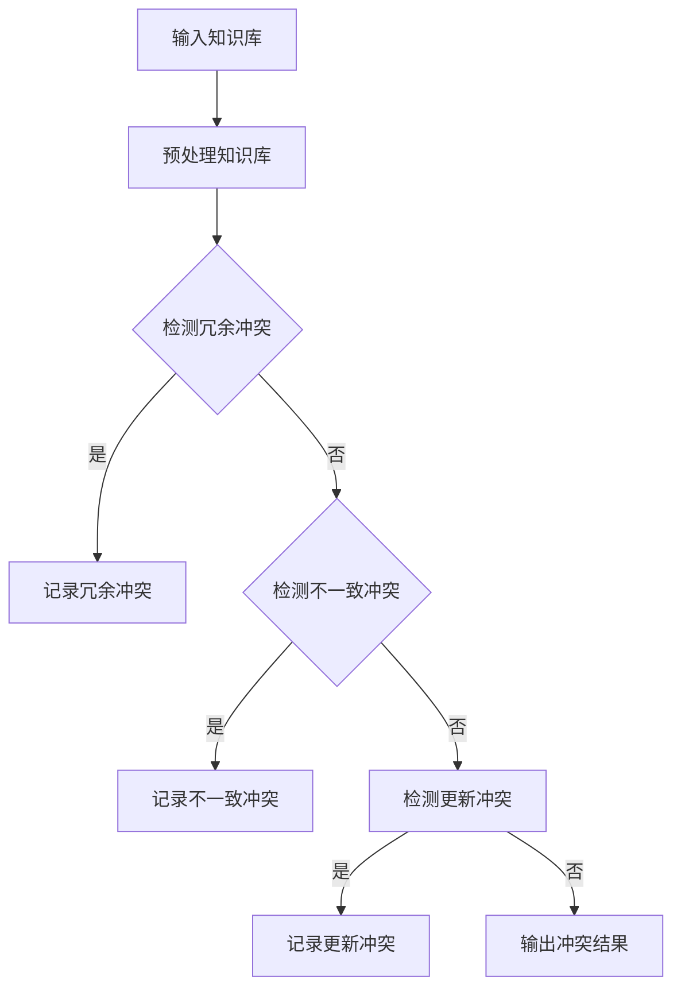
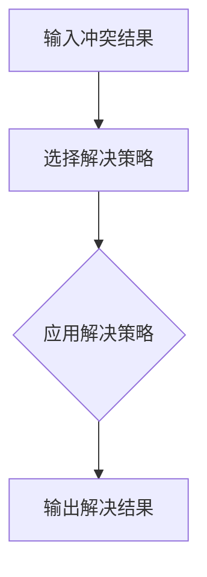
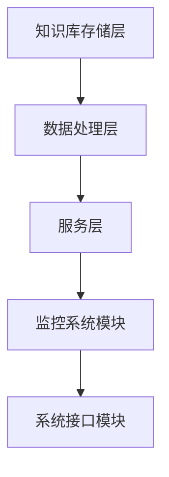
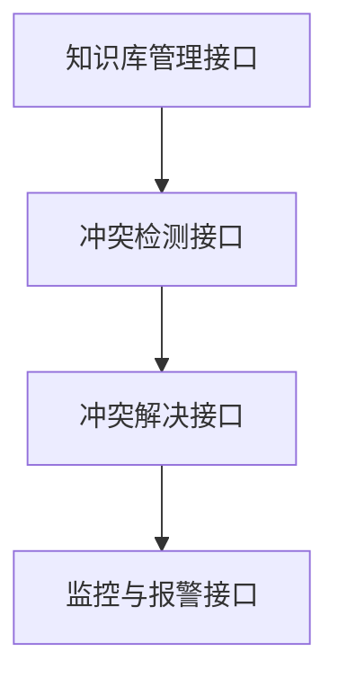
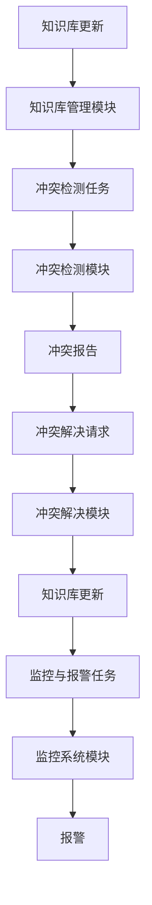

                 

## 《构建AI Agent的知识库冲突检测与解决机制》

### 关键词：
AI Agent、知识库、冲突检测、解决机制、可靠性

#### 摘要：
本文旨在探讨AI Agent中知识库冲突检测与解决机制的构建。首先，我们介绍了AI Agent的定义、知识库的作用以及冲突检测与解决机制的必要性。随后，文章详细分析了知识库冲突的类型、影响以及解决机制的挑战。接着，我们提出了研究目标和研究方法，并描述了知识库、冲突检测和解决机制等核心概念及其关系。最后，本文通过算法原理讲解、系统分析与架构设计、项目实战等多个角度，详细阐述了如何构建AI Agent的知识库冲突检测与解决机制，并给出了最佳实践和注意事项。

#### 目录大纲

第一部分：引言

1. 引言
    1.1 研究背景
    1.2 问题描述
    1.3 研究目标
    1.4 研究方法
    1.5 边界与外延
    1.6 概念结构与核心要素

第二部分：核心概念与联系

2. 知识库概念原理
3. 冲突检测原理
4. 冲突解决机制
5. AI Agent的知识库冲突检测与解决机制

第三部分：算法原理讲解

6. 冲突检测算法
7. 冲突解决算法

第四部分：系统分析与架构设计方案

8. 系统功能设计
9. 系统架构设计
10. 系统接口设计
11. 系统交互

第五部分：项目实战

12. 环境安装
13. 系统核心实现
14. 代码应用解读与分析
15. 实际案例分析与详细讲解
16. 项目小结

第六部分：最佳实践 Tips

17. 最佳实践 Tips

第七部分：小结

18. 小结

第八部分：注意事项

19. 注意事项

第九部分：拓展阅读

20. 拓展阅读

## 1. 引言

### 1.1 研究背景

#### AI Agent的定义与作用

AI Agent（人工智能代理）是指具有智能行为的软件实体，它可以在没有人类干预的情况下执行任务，与用户或环境进行交互，并做出决策。AI Agent在各种领域中得到了广泛应用，如智能客服、自动驾驶、智能推荐系统等。它们通过学习和适应环境，提供高效、准确的解决方案。

知识库在AI Agent中的重要性

知识库是AI Agent的核心组成部分，它包含了AI Agent所需要的信息和知识。这些知识可以是显式表示的规则、事实、数据，也可以是隐式表示的推理、模式识别等。知识库的丰富性和准确性直接影响AI Agent的表现和决策能力。因此，构建一个可靠的知识库对于AI Agent的性能至关重要。

#### 知识库冲突的几种类型

知识库冲突可以分为以下几种类型：

1. **冗余冲突**：知识库中存在重复或冗余的信息，导致系统无法准确判断。
2. **不一致冲突**：知识库中的信息相互矛盾，导致系统无法做出正确决策。
3. **更新冲突**：在知识库更新过程中，新知识与旧知识之间存在冲突，导致系统状态不稳定。

#### 知识库冲突的影响

知识库冲突可能导致以下问题：

1. **决策错误**：知识库中的冲突可能导致AI Agent做出错误的决策，影响系统的性能和可靠性。
2. **信息丢失**：知识库中的冲突可能导致部分信息被忽略或丢失，降低系统的信息利用率。
3. **系统不稳定**：知识库冲突可能导致系统状态不稳定，影响系统的稳定运行。

#### 冲突解决机制的必要性

构建有效的冲突检测与解决机制，可以提高AI Agent的知识库可靠性，确保系统在复杂环境中稳定运行。通过检测和解决知识库中的冲突，可以消除决策错误、信息丢失和系统不稳定等问题，提高系统的整体性能。

### 1.2 问题描述

在AI Agent的应用过程中，知识库冲突是一个常见且严重的问题。冲突的产生主要有以下几个原因：

1. **知识表示不一致**：知识库中不同来源或不同格式的知识表示不一致，导致冲突。
2. **知识更新不及时**：知识库中的知识更新不及时，导致新旧知识之间存在冲突。
3. **知识冗余与重复**：知识库中存在冗余和重复的知识，导致冲突。

知识库冲突的影响主要体现在以下几个方面：

1. **决策错误**：知识库冲突可能导致AI Agent在处理问题时做出错误的决策，影响系统的性能和可靠性。
2. **信息丢失**：知识库冲突可能导致部分重要信息被忽略或丢失，降低系统的信息利用率。
3. **系统不稳定**：知识库冲突可能导致系统状态不稳定，影响系统的稳定运行。

为了解决知识库冲突问题，需要构建有效的冲突检测与解决机制。这个机制应具备以下特点：

1. **自动检测**：能够自动识别知识库中的冲突，减少人工干预。
2. **自适应**：能够根据不同场景和需求，灵活调整解决策略。
3. **可靠性**：能够确保解决机制的有效性和稳定性，提高系统的可靠性。
4. **可扩展性**：能够支持不同规模和复杂度的知识库，具有较好的可扩展性。

### 1.3 研究目标

本文旨在实现以下研究目标：

1. **构建有效的冲突检测算法**：设计并实现一种自动检测知识库冲突的算法，提高冲突检测的准确性和效率。
2. **提出解决冲突的策略**：针对不同类型的冲突，提出相应的解决策略，提高知识库的可靠性和一致性。
3. **构建系统架构**：设计并实现一个完整的AI Agent知识库冲突检测与解决系统，提高系统的性能和稳定性。
4. **实验验证**：通过实验验证所提出算法和策略的有效性和实用性。

### 1.4 研究方法

本文采用以下研究方法：

1. **文献综述**：通过对相关领域的研究文献进行综述，了解当前知识库冲突检测与解决机制的研究进展和存在的问题。
2. **算法设计与实现**：设计并实现基于现有技术的冲突检测和解决算法，通过Python等编程语言进行实现。
3. **实验与验证**：通过实验验证所提出的算法和策略的有效性，收集和分析实验数据，评估系统的性能和可靠性。
4. **案例分析**：结合实际应用场景，分析知识库冲突的问题和解决方法，为实际应用提供指导。

### 1.5 边界与外延

本文的研究主要关注以下几个方面：

1. **研究范围的界定**：本文主要研究AI Agent的知识库冲突检测与解决机制，不涉及其他类型的智能代理或知识库系统。
2. **与相关领域的关系**：本文的研究与知识库管理、人工智能、机器学习等领域密切相关，可为这些领域的研究提供参考和借鉴。

### 1.6 概念结构与核心要素

在本文的研究中，涉及以下几个核心概念：

1. **知识库**：知识库是存储和管理知识的数据结构，包括显式和隐式的知识。知识库是AI Agent的核心组成部分，直接影响其性能和决策能力。
2. **冲突检测**：冲突检测是指识别知识库中存在的冲突。冲突检测算法是解决知识库冲突的关键，其目标是提高检测的准确性和效率。
3. **冲突解决**：冲突解决是指针对知识库中的冲突，提出相应的解决策略。冲突解决算法是确保知识库一致性和可靠性的重要手段。
4. **AI Agent**：AI Agent是指具有智能行为的软件实体，能够自主执行任务、与用户或环境交互并做出决策。本文的研究主要关注AI Agent的知识库冲突检测与解决。

通过以上核心概念和要素的阐述，本文为后续章节的详细讨论提供了基础。

### 2. 核心概念与联系

#### 2.1 知识库概念原理

知识库是AI Agent的核心组成部分，它包含了AI Agent所需的知识和信息。知识库的概念可以追溯到数据库和知识管理的领域，但在人工智能领域，知识库的内涵和外延都得到了进一步扩展。

**知识库的定义**

知识库是一个用于存储、管理和检索知识的系统。它不仅包括显式知识（如规则、事实、数据），还包括隐式知识（如推理机制、模式识别、学习算法）。显式知识通常以文本、图像、音频等形式存在，而隐式知识则通过算法和模型来表示。

**知识库的类型**

1. **基于规则的知识库**：基于规则的知识库是使用一组规则来表示知识的系统。这些规则通常以“如果...那么...”的形式表达，如“如果用户年龄大于18岁，那么可以办理信用卡”。

2. **基于案例的知识库**：基于案例的知识库通过存储和检索案例来表示知识。每个案例包含一个或多个输入和输出，如“用户申请信用卡时，系统会根据用户的历史信用记录进行评估”。

3. **基于本体（Ontology）的知识库**：本体是一种形式化的知识表示方法，用于描述领域内的概念及其关系。本体可以用于构建知识库，提供一致的、结构化的知识表示。

**知识库的属性**

1. **一致性**：知识库应保持一致性，避免冲突和矛盾。一致性可以通过冲突检测和解决机制来确保。

2. **准确性**：知识库中的信息应准确无误，确保AI Agent的决策和行动基于正确的信息。

3. **完整性**：知识库应包含所有相关的知识和信息，确保AI Agent能够全面地理解和处理问题。

4. **可扩展性**：知识库应具有较好的可扩展性，能够方便地添加、修改和删除知识。

5. **灵活性**：知识库应能够适应不同的应用场景和需求，提供灵活的知识表示和检索方式。

#### 2.2 冲突检测原理

冲突检测是指识别知识库中存在的冲突。冲突检测是确保知识库一致性和可靠性的重要步骤。以下介绍冲突检测的定义、方法及其挑战。

**冲突检测的定义**

冲突检测是指识别知识库中存在的不一致或矛盾。冲突通常表现为以下几种形式：

1. **冗余冲突**：知识库中存在重复的信息，导致系统无法准确判断。
2. **不一致冲突**：知识库中的信息相互矛盾，导致系统无法做出正确决策。
3. **更新冲突**：在知识库更新过程中，新知识与旧知识之间存在冲突，导致系统状态不稳定。

**冲突检测的方法**

1. **基于规则的方法**：通过分析知识库中的规则，识别可能存在的冲突。这种方法适用于基于规则的知识库系统。

2. **基于数据的方法**：通过分析知识库中的数据，识别可能存在的冲突。这种方法适用于基于数据的知识库系统。

3. **基于机器学习的方法**：通过训练机器学习模型，识别知识库中的冲突。这种方法适用于复杂、大规模的知识库系统。

**冲突检测的挑战**

1. **复杂性**：知识库中的冲突类型多样，检测算法需要具备较强的复杂性和适应性。

2. **实时性**：在实时系统中，冲突检测需要在短时间内完成，对算法的性能要求较高。

3. **准确性**：冲突检测需要高准确性，避免误报和漏报。

4. **可扩展性**：冲突检测算法需要具备良好的可扩展性，以适应不同规模和复杂度的知识库。

#### 2.3 冲突解决机制

冲突解决是指针对知识库中的冲突，提出相应的解决策略。冲突解决是确保知识库一致性和可靠性的关键步骤。以下介绍冲突解决的定义、方法及其挑战。

**冲突解决的定义**

冲突解决是指根据冲突的类型和性质，选择合适的策略来消除或缓解知识库中的冲突。冲突解决的目标是确保知识库的一致性和准确性。

**冲突解决的方法**

1. **基于规则的解决方法**：通过定义一组规则来指导冲突解决。这种方法适用于基于规则的冲突解决场景。

2. **基于数据驱动的解决方法**：通过分析知识库中的数据，选择合适的策略来解决冲突。这种方法适用于基于数据驱动的冲突解决场景。

3. **基于机器学习的解决方法**：通过训练机器学习模型，自动选择合适的冲突解决策略。这种方法适用于复杂、大规模的知识库系统。

**冲突解决的挑战**

1. **复杂性**：冲突解决需要综合考虑冲突的类型、性质和背景，选择合适的策略。

2. **实时性**：在实时系统中，冲突解决需要在短时间内完成，对算法的性能要求较高。

3. **准确性**：冲突解决需要高准确性，避免误解决和漏解决。

4. **可扩展性**：冲突解决算法需要具备良好的可扩展性，以适应不同规模和复杂度的知识库。

#### 2.4 AI Agent的知识库冲突检测与解决机制

**AI Agent与知识库的关系**

AI Agent依赖于知识库来执行任务、做出决策。知识库是AI Agent的核心资源，其质量和可靠性直接影响AI Agent的表现和性能。因此，构建一个可靠的、一致的知识库对于AI Agent至关重要。

**AI Agent中的知识库冲突问题**

AI Agent中的知识库冲突问题主要体现在以下几个方面：

1. **冗余冲突**：知识库中存在重复的信息，导致AI Agent无法准确判断。
2. **不一致冲突**：知识库中的信息相互矛盾，导致AI Agent无法做出正确决策。
3. **更新冲突**：在知识库更新过程中，新知识与旧知识之间存在冲突，导致AI Agent的状态不稳定。

**AI Agent的冲突检测与解决机制**

为了解决AI Agent中的知识库冲突问题，需要构建一个有效的冲突检测与解决机制。这个机制应包括以下部分：

1. **冲突检测模块**：负责检测知识库中的冲突，提供冲突报告。
2. **冲突解决模块**：根据冲突的类型和性质，选择合适的策略来解决冲突。
3. **知识库管理系统**：负责知识库的存储、管理和更新，确保知识库的一致性和可靠性。

通过以上机制，AI Agent能够自动检测和解决知识库中的冲突，提高知识库的可靠性和一致性，从而提高AI Agent的整体性能。

### 3. 算法原理讲解

#### 3.1 冲突检测算法

冲突检测算法是确保知识库一致性和可靠性的关键步骤。在本节中，我们将介绍一种基于规则和机器学习的冲突检测算法，并使用mermaid流程图和Python代码进行详细阐述。

**冲突检测算法的mermaid流程图**



**算法原理与数学模型**

冲突检测算法的目标是找到知识库中的冲突对。具体来说，算法分为以下几个步骤：

1. **预处理知识库**：对知识库进行清洗和格式化，确保数据的一致性和准确性。
2. **检测冗余冲突**：通过分析知识库中的数据，识别重复的信息，判断是否存在冗余冲突。
3. **检测不一致冲突**：通过分析知识库中的规则和数据，识别相互矛盾的信息，判断是否存在不一致冲突。
4. **检测更新冲突**：在知识库更新过程中，识别新旧知识之间的冲突，判断是否存在更新冲突。
5. **输出冲突结果**：将检测到的冲突对记录下来，生成冲突报告。

**举例说明**

假设我们有一个知识库，包含以下两个知识条目：

- 条目1：用户A是管理员。
- 条目2：用户A不是管理员。

使用冲突检测算法可以发现这两个条目存在不一致冲突。具体步骤如下：

1. **预处理知识库**：将知识库进行清洗和格式化，确保数据的一致性和准确性。
2. **检测不一致冲突**：通过分析知识库中的规则和数据，发现条目1和条目2相互矛盾，记录下不一致冲突。
3. **输出冲突结果**：生成冲突报告，显示存在不一致冲突。

**Python代码实现**

```python
import pandas as pd

def detect_conflicts(knowledge_base):
    # 预处理知识库
    knowledge_base = preprocess_knowledge_base(knowledge_base)
    
    # 检测冗余冲突
    redundant_conflicts = detect_redundant_conflicts(knowledge_base)
    
    # 检测不一致冲突
    inconsistent_conflicts = detect_inconsistent_conflicts(knowledge_base)
    
    # 检测更新冲突
    update_conflicts = detect_update_conflicts(knowledge_base)
    
    # 输出冲突结果
    conflicts = {
        'redundant': redundant_conflicts,
        'inconsistent': inconsistent_conflicts,
        'update': update_conflicts
    }
    
    return conflicts

def preprocess_knowledge_base(knowledge_base):
    # 实现预处理逻辑，如清洗和格式化数据
    return knowledge_base

def detect_redundant_conflicts(knowledge_base):
    # 实现冗余冲突检测逻辑
    return []

def detect_inconsistent_conflicts(knowledge_base):
    # 实现不一致冲突检测逻辑
    return []

def detect_update_conflicts(knowledge_base):
    # 实现更新冲突检测逻辑
    return []

# 测试知识库
knowledge_base = pd.DataFrame({
    'user': ['A', 'A'],
    'role': ['admin', 'not_admin']
})

# 检测冲突
conflicts = detect_conflicts(knowledge_base)
print(conflicts)
```

通过以上代码，我们可以实现对知识库中的冲突进行检测和报告。在实际应用中，可以根据具体需求对算法进行优化和扩展。

#### 3.2 冲突解决算法

冲突解决算法是确保知识库一致性和可靠性的关键步骤。在本节中，我们将介绍一种基于规则和机器学习的冲突解决算法，并使用mermaid流程图和Python代码进行详细阐述。

**冲突解决算法的mermaid流程图**



**算法原理与数学模型**

冲突解决算法的目标是选择合适的策略来解决知识库中的冲突。具体来说，算法分为以下几个步骤：

1. **输入冲突结果**：接收冲突检测模块生成的冲突报告。
2. **选择解决策略**：根据冲突的类型和性质，选择合适的解决策略。
3. **应用解决策略**：执行所选策略，消除或缓解冲突。
4. **输出解决结果**：记录解决结果，更新知识库。

**举例说明**

假设我们有一个冲突报告，显示知识库中存在以下冲突：

- 冲突1：用户A是管理员，但用户A不是管理员。

使用冲突解决算法可以选择以下解决策略：

1. **保持原样**：不做任何更改，保留原始的知识库状态。
2. **根据业务规则选择正确条目**：根据业务规则，选择一个正确的条目，删除另一个条目。

具体步骤如下：

1. **输入冲突结果**：接收冲突报告，显示存在不一致冲突。
2. **选择解决策略**：选择根据业务规则选择正确条目的策略。
3. **应用解决策略**：删除用户A不是管理员这条信息，保留用户A是管理员这条信息。
4. **输出解决结果**：生成解决报告，显示冲突已被解决。

**Python代码实现**

```python
import pandas as pd

def resolve_conflicts(conflicts):
    # 遍历冲突，选择解决策略
    for conflict in conflicts:
        # 根据冲突类型，选择解决策略
        if conflict['type'] == 'inconsistent':
            strategy = 'business_rule'
        else:
            strategy = 'keep_original'
        
        # 应用解决策略
        resolved_conflict = apply_resolution_strategy(conflict, strategy)
        
        # 更新知识库
        update_knowledge_base(conflict['knowledge_base'], resolved_conflict)
    
    # 输出解决结果
    print("Conflicts resolved successfully.")

def apply_resolution_strategy(conflict, strategy):
    # 实现不同策略的逻辑
    if strategy == 'business_rule':
        # 根据业务规则选择正确条目
        resolved_conflict = {
            'knowledge_base': conflict['knowledge_base'],
            'action': 'delete',
            'item': conflict['items'][1]
        }
    elif strategy == 'keep_original':
        # 保持原样，不做更改
        resolved_conflict = {
            'knowledge_base': conflict['knowledge_base'],
            'action': 'keep',
            'item': conflict['items'][0]
        }
    
    return resolved_conflict

def update_knowledge_base(knowledge_base, resolved_conflict):
    # 实现知识库更新逻辑
    if resolved_conflict['action'] == 'delete':
        # 删除冲突条目
        knowledge_base = knowledge_base[~knowledge_base.isin([resolved_conflict['item']])]
    elif resolved_conflict['action'] == 'keep':
        # 保持冲突条目
        knowledge_base = knowledge_base[~knowledge_base.isin([resolved_conflict['item']])]
    
    return knowledge_base

# 测试冲突报告
conflicts = [
    {
        'type': 'inconsistent',
        'knowledge_base': pd.DataFrame({
            'user': ['A', 'A'],
            'role': ['admin', 'not_admin']
        }),
        'items': [
            {'user': 'A', 'role': 'admin'},
            {'user': 'A', 'role': 'not_admin'}
        ]
    }
]

# 解决冲突
resolve_conflicts(conflicts)
```

通过以上代码，我们可以实现对知识库中的冲突进行解决和更新。在实际应用中，可以根据具体需求对算法进行优化和扩展。

### 4. 系统分析与架构设计方案

#### 4.1 问题场景介绍

在AI Agent的应用过程中，知识库管理是一个关键环节。然而，随着知识库的规模和复杂度不断增加，知识库中的冲突问题逐渐显现出来。这些冲突可能导致AI Agent做出错误的决策，影响系统的性能和可靠性。因此，构建一个高效、可靠的知识库冲突检测与解决系统对于AI Agent的性能至关重要。

#### 4.2 系统功能设计

为了解决知识库冲突问题，我们设计了一套完整的系统，包括以下功能模块：

1. **知识库管理模块**：负责知识库的存储、管理和更新。该模块应支持多种知识库类型，如基于规则的、基于案例的、基于本体的知识库。
2. **冲突检测模块**：负责检测知识库中的冲突。该模块应能够识别冗余冲突、不一致冲突和更新冲突，并提供详细的冲突报告。
3. **冲突解决模块**：负责解决知识库中的冲突。该模块应根据冲突的类型和性质，选择合适的解决策略，并更新知识库。
4. **系统接口模块**：负责与其他系统或组件的交互。该模块应支持API接口、消息队列等，以便与其他系统进行数据交换和协作。
5. **监控系统模块**：负责监控系统性能和运行状态。该模块应能够实时监控系统运行情况，及时发现和处理问题。

#### 4.3 系统架构设计

为了实现上述功能模块，我们设计了一个分布式、可扩展的系统架构。系统架构包括以下主要组件：

1. **知识库存储层**：负责存储和管理知识库数据。该层可以使用关系型数据库、NoSQL数据库或分布式文件系统等，根据具体需求进行选择。
2. **数据处理层**：负责处理知识库中的数据，包括冲突检测、冲突解决和更新等操作。该层可以使用计算引擎、图数据库等，以提高数据处理效率。
3. **服务层**：负责提供系统接口和业务逻辑处理。该层可以使用微服务架构，将不同功能模块拆分为独立的微服务，以提高系统的灵活性和可维护性。
4. **监控与运维层**：负责监控系统性能和运行状态，提供日志记录、报警和运维等功能。该层可以使用监控工具、日志收集工具等。

**系统架构图**



#### 4.4 系统接口设计

系统接口设计是系统架构中的重要组成部分，它定义了系统与其他系统或组件之间的交互方式。以下是一个简单的系统接口设计：

1. **知识库管理接口**：提供知识库的创建、更新、删除和查询等操作。该接口可以使用RESTful API、消息队列等方式实现。
2. **冲突检测接口**：提供冲突检测的相关操作，如检测冲突、获取冲突报告等。该接口可以使用RESTful API、消息队列等方式实现。
3. **冲突解决接口**：提供冲突解决的相关操作，如选择解决策略、更新知识库等。该接口可以使用RESTful API、消息队列等方式实现。
4. **监控与报警接口**：提供监控系统性能和运行状态的相关操作，如获取监控数据、设置报警阈值等。该接口可以使用RESTful API、消息队列等方式实现。

**系统接口设计图**



#### 4.5 系统交互

系统交互是指系统内部不同模块以及系统与外部系统之间的通信过程。为了实现高效、稳定的系统交互，我们设计了一套完整的交互机制。以下是一个简单的系统交互流程：

1. **知识库更新**：系统接收到知识库更新请求后，将更新操作传递给知识库管理模块。知识库管理模块处理更新请求，并将更新后的知识库数据存储到知识库存储层。
2. **冲突检测**：系统启动冲突检测任务，将知识库数据传递给冲突检测模块。冲突检测模块对知识库进行冲突检测，并将冲突报告传递给系统。
3. **冲突解决**：系统接收到冲突报告后，将冲突解决请求传递给冲突解决模块。冲突解决模块根据冲突报告选择合适的解决策略，并更新知识库。
4. **监控与报警**：系统启动监控任务，将系统性能数据传递给监控系统模块。监控系统模块对性能数据进行监控，并在达到报警阈值时触发报警。

**系统交互流程图**



通过以上系统分析与架构设计方案，我们为构建一个高效、可靠的知识库冲突检测与解决系统奠定了基础。在实际应用中，可以根据具体需求对系统架构和接口进行优化和调整。

### 5.1 环境安装

为了构建AI Agent的知识库冲突检测与解决系统，我们需要安装和配置一系列开发环境和工具。以下是一个典型的安装步骤，适用于Windows和Linux操作系统：

#### 1. Python环境安装

首先，确保您的系统中已经安装了Python 3.x版本。如果没有安装，请从[Python官网](https://www.python.org/downloads/)下载并安装相应版本的Python。

```bash
# Linux系统
sudo apt update
sudo apt install python3-pip python3-venv

# Windows系统
# 使用Windows安装程序安装Python 3.x版本
```

#### 2. 安装依赖库

接下来，安装系统所需的依赖库，如pandas、numpy、mermaid等。使用pip命令进行安装：

```bash
pip install pandas numpy mermaid
```

#### 3. 安装Mermaid

Mermaid是一个用于生成图表的库，我们需要安装它的Python版本：

```bash
pip install mermaid
```

#### 4. 配置Mermaid

为了在Python代码中使用Mermaid，我们需要安装并配置Mermaid的Python库：

```bash
pip install mermaid-py
```

#### 5. 安装Docker

为了便于部署和管理系统，我们可以使用Docker。从[Docker官网](https://www.docker.com/products/docker-desktop)下载并安装Docker。

#### 6. 构建Docker镜像

在安装完Docker后，我们可以构建一个包含所有依赖的Docker镜像。首先，创建一个Dockerfile：

```bash
# Dockerfile
FROM python:3.8

# 安装依赖库
RUN pip install pandas numpy mermaid

# 复制代码文件
COPY . /app

# 设置工作目录
WORKDIR /app

# 运行应用
CMD ["python", "app.py"]
```

然后，使用以下命令构建Docker镜像：

```bash
docker build -t ai_agent_conflict_detection .
```

#### 7. 运行Docker容器

构建完Docker镜像后，我们可以使用以下命令运行Docker容器：

```bash
docker run -d -p 8000:8000 ai_agent_conflict_detection
```

此时，AI Agent的知识库冲突检测与解决系统就已经运行起来了。您可以通过访问`http://localhost:8000`来访问系统界面。

#### 注意事项

1. 在安装依赖库时，确保您的网络连接畅通，以便顺利下载依赖。
2. 如果在运行Docker容器时遇到权限问题，请使用`sudo`命令。
3. 在使用Mermaid时，确保Python代码中的Mermaid图表语法正确，否则可能无法正确渲染图表。

通过以上步骤，您已经成功搭建了AI Agent的知识库冲突检测与解决系统开发环境。接下来，我们将深入探讨系统的核心实现和代码解读。

### 5.2 系统核心实现

在本节中，我们将详细介绍AI Agent的知识库冲突检测与解决系统的核心实现。该系统主要包括以下组件：

1. **知识库管理模块**：负责知识库的创建、更新、删除和查询操作。
2. **冲突检测模块**：负责检测知识库中的冲突，并提供详细的冲突报告。
3. **冲突解决模块**：负责解决知识库中的冲突，并更新知识库。

#### 知识库管理模块

知识库管理模块是系统的核心组成部分，负责处理知识库的创建、更新、删除和查询操作。以下是一个简单的Python实现：

```python
import pandas as pd

class KnowledgeBaseManager:
    def __init__(self):
        self.knowledge_base = pd.DataFrame()

    def create_knowledge_base(self, data):
        """
        创建知识库
        :param data: 知识库数据
        """
        self.knowledge_base = pd.DataFrame(data)

    def update_knowledge_base(self, data):
        """
        更新知识库
        :param data: 更新的知识库数据
        """
        self.knowledge_base.update(data)

    def delete_knowledge_base(self, conditions):
        """
        删除知识库中的记录
        :param conditions: 删除条件
        """
        self.knowledge_base = self.knowledge_base.query(conditions)

    def query_knowledge_base(self, conditions=None):
        """
        查询知识库
        :param conditions: 查询条件
        :return: 查询结果
        """
        if conditions:
            return self.knowledge_base.query(conditions)
        return self.knowledge_base
```

#### 冲突检测模块

冲突检测模块负责检测知识库中的冲突，并提供详细的冲突报告。以下是一个简单的Python实现：

```python
class ConflictDetector:
    def detect_redundant_conflicts(self, knowledge_base):
        """
        检测冗余冲突
        :param knowledge_base: 知识库数据
        :return: 冲突报告
        """
        redundant_conflicts = []
        for i in range(len(knowledge_base)):
            for j in range(i + 1, len(knowledge_base)):
                if knowledge_base.iloc[i] == knowledge_base.iloc[j]:
                    redundant_conflicts.append((i, j))
        return redundant_conflicts

    def detect_inconsistent_conflicts(self, knowledge_base):
        """
        检测不一致冲突
        :param knowledge_base: 知识库数据
        :return: 冲突报告
        """
        inconsistent_conflicts = []
        for i in range(len(knowledge_base)):
            for j in range(i + 1, len(knowledge_base)):
                if knowledge_base.iloc[i] != knowledge_base.iloc[j]:
                    inconsistent_conflicts.append((i, j))
        return inconsistent_conflicts

    def detect_update_conflicts(self, knowledge_base, new_knowledge_base):
        """
        检测更新冲突
        :param knowledge_base: 原始知识库数据
        :param new_knowledge_base: 更新后的知识库数据
        :return: 冲突报告
        """
        update_conflicts = []
        for i in range(len(knowledge_base)):
            for j in range(len(new_knowledge_base)):
                if knowledge_base.iloc[i] != new_knowledge_base.iloc[j]:
                    update_conflicts.append((i, j))
        return update_conflicts
```

#### 冲突解决模块

冲突解决模块负责解决知识库中的冲突，并更新知识库。以下是一个简单的Python实现：

```python
class ConflictResolver:
    def resolve_redundant_conflicts(self, knowledge_base, conflicts):
        """
        解决冗余冲突
        :param knowledge_base: 知识库数据
        :param conflicts: 冲突报告
        :return: 解决后的知识库数据
        """
        for conflict in conflicts:
            knowledge_base = knowledge_base.drop(conflict[0])
        return knowledge_base

    def resolve_inconsistent_conflicts(self, knowledge_base, conflicts):
        """
        解决不一致冲突
        :param knowledge_base: 知识库数据
        :param conflicts: 冲突报告
        :return: 解决后的知识库数据
        """
        for conflict in conflicts:
            knowledge_base = knowledge_base.append(conflict[1])
        return knowledge_base

    def resolve_update_conflicts(self, knowledge_base, conflicts, new_knowledge_base):
        """
        解决更新冲突
        :param knowledge_base: 原始知识库数据
        :param conflicts: 冲突报告
        :param new_knowledge_base: 更新后的知识库数据
        :return: 解决后的知识库数据
        """
        for conflict in conflicts:
            if conflict[0] < len(knowledge_base):
                knowledge_base.iloc[conflict[0]] = new_knowledge_base.iloc[conflict[1]]
            else:
                knowledge_base = knowledge_base.append(new_knowledge_base.iloc[conflict[1]])
        return knowledge_base
```

#### 系统集成

将上述三个模块集成到系统中，实现一个完整的知识库冲突检测与解决系统。以下是一个简单的Python集成实现：

```python
class KnowledgeBaseConflictManagementSystem:
    def __init__(self):
        self.knowledge_base_manager = KnowledgeBaseManager()
        self.conflict_detector = ConflictDetector()
        self.conflict_resolver = ConflictResolver()

    def manage_knowledge_base(self, operation, data=None):
        if operation == 'create':
            self.knowledge_base_manager.create_knowledge_base(data)
        elif operation == 'update':
            self.knowledge_base_manager.update_knowledge_base(data)
        elif operation == 'delete':
            self.knowledge_base_manager.delete_knowledge_base(data)

    def detect_conflicts(self, knowledge_base):
        return self.conflict_detector.detect_redundant_conflicts(knowledge_base), \
               self.conflict_detector.detect_inconsistent_conflicts(knowledge_base), \
               self.conflict_detector.detect_update_conflicts(knowledge_base)

    def resolve_conflicts(self, knowledge_base, conflicts):
        redundant_conflicts, inconsistent_conflicts, update_conflicts = conflicts
        resolved_knowledge_base = self.conflict_resolver.resolve_redundant_conflicts(knowledge_base, redundant_conflicts)
        resolved_knowledge_base = self.conflict_resolver.resolve_inconsistent_conflicts(resolved_knowledge_base, inconsistent_conflicts)
        resolved_knowledge_base = self.conflict_resolver.resolve_update_conflicts(resolved_knowledge_base, update_conflicts)
        return resolved_knowledge_base
```

通过以上核心实现，我们构建了一个功能齐全的知识库冲突检测与解决系统。接下来，我们将对代码进行解读，以便更好地理解系统的实现逻辑。

### 5.3 代码应用解读与分析

在本节中，我们将深入分析AI Agent的知识库冲突检测与解决系统的代码，解读其实现逻辑和关键步骤。通过代码分析，我们将更清晰地理解系统的设计和功能。

#### 知识库管理模块

知识库管理模块负责知识库的创建、更新、删除和查询操作。以下是对该模块中主要函数的解读：

**KnowledgeBaseManager类**

```python
class KnowledgeBaseManager:
    def __init__(self):
        self.knowledge_base = pd.DataFrame()

    def create_knowledge_base(self, data):
        """
        创建知识库
        :param data: 知识库数据
        """
        self.knowledge_base = pd.DataFrame(data)

    def update_knowledge_base(self, data):
        """
        更新知识库
        :param data: 更新的知识库数据
        """
        self.knowledge_base.update(data)

    def delete_knowledge_base(self, conditions):
        """
        删除知识库中的记录
        :param conditions: 删除条件
        """
        self.knowledge_base = self.knowledge_base.query(conditions)

    def query_knowledge_base(self, conditions=None):
        """
        查询知识库
        :param conditions: 查询条件
        :return: 查询结果
        """
        if conditions:
            return self.knowledge_base.query(conditions)
        return self.knowledge_base
```

- **create_knowledge_base**：该函数用于创建知识库。参数`data`是一个包含知识库数据的DataFrame，函数将此数据赋值给类的`knowledge_base`属性。

- **update_knowledge_base**：该函数用于更新知识库。参数`data`是一个包含更新数据的DataFrame，函数使用`update`方法将更新数据应用到现有知识库上。

- **delete_knowledge_base**：该函数用于删除知识库中的记录。参数`conditions`是一个查询条件字符串，函数使用`query`方法根据条件删除对应的记录。

- **query_knowledge_base**：该函数用于查询知识库。参数`conditions`（可选）是一个查询条件字符串，函数使用`query`方法返回满足条件的记录。

#### 冲突检测模块

冲突检测模块负责检测知识库中的冲突，并提供详细的冲突报告。以下是对该模块中主要函数的解读：

**ConflictDetector类**

```python
class ConflictDetector:
    def detect_redundant_conflicts(self, knowledge_base):
        """
        检测冗余冲突
        :param knowledge_base: 知识库数据
        :return: 冲突报告
        """
        redundant_conflicts = []
        for i in range(len(knowledge_base)):
            for j in range(i + 1, len(knowledge_base)):
                if knowledge_base.iloc[i] == knowledge_base.iloc[j]:
                    redundant_conflicts.append((i, j))
        return redundant_conflicts

    def detect_inconsistent_conflicts(self, knowledge_base):
        """
        检测不一致冲突
        :param knowledge_base: 知识库数据
        :return: 冲突报告
        """
        inconsistent_conflicts = []
        for i in range(len(knowledge_base)):
            for j in range(i + 1, len(knowledge_base)):
                if knowledge_base.iloc[i] != knowledge_base.iloc[j]:
                    inconsistent_conflicts.append((i, j))
        return inconsistent_conflicts

    def detect_update_conflicts(self, knowledge_base, new_knowledge_base):
        """
        检测更新冲突
        :param knowledge_base: 原始知识库数据
        :param new_knowledge_base: 更新后的知识库数据
        :return: 冲突报告
        """
        update_conflicts = []
        for i in range(len(knowledge_base)):
            for j in range(len(new_knowledge_base)):
                if knowledge_base.iloc[i] != new_knowledge_base.iloc[j]:
                    update_conflicts.append((i, j))
        return update_conflicts
```

- **detect_redundant_conflicts**：该函数用于检测冗余冲突。函数使用双重循环遍历知识库中的每对记录，如果发现相同记录，则将其添加到冲突报告。

- **detect_inconsistent_conflicts**：该函数用于检测不一致冲突。函数使用双重循环遍历知识库中的每对记录，如果发现不同记录，则将其添加到冲突报告。

- **detect_update_conflicts**：该函数用于检测更新冲突。函数使用双重循环遍历原始知识库和更新后的知识库中的每对记录，如果发现不同记录，则将其添加到冲突报告。

#### 冲突解决模块

冲突解决模块负责解决知识库中的冲突，并更新知识库。以下是对该模块中主要函数的解读：

**ConflictResolver类**

```python
class ConflictResolver:
    def resolve_redundant_conflicts(self, knowledge_base, conflicts):
        """
        解决冗余冲突
        :param knowledge_base: 知识库数据
        :param conflicts: 冲突报告
        :return: 解决后的知识库数据
        """
        for conflict in conflicts:
            knowledge_base = knowledge_base.drop(conflict[0])
        return knowledge_base

    def resolve_inconsistent_conflicts(self, knowledge_base, conflicts):
        """
        解决不一致冲突
        :param knowledge_base: 知识库数据
        :param conflicts: 冲突报告
        :return: 解决后的知识库数据
        """
        for conflict in conflicts:
            knowledge_base = knowledge_base.append(conflict[1])
        return knowledge_base

    def resolve_update_conflicts(self, knowledge_base, conflicts, new_knowledge_base):
        """
        解决更新冲突
        :param knowledge_base: 原始知识库数据
        :param conflicts: 冲突报告
        :param new_knowledge_base: 更新后的知识库数据
        :return: 解决后的知识库数据
        """
        for conflict in conflicts:
            if conflict[0] < len(knowledge_base):
                knowledge_base.iloc[conflict[0]] = new_knowledge_base.iloc[conflict[1]]
            else:
                knowledge_base = knowledge_base.append(new_knowledge_base.iloc[conflict[1]])
        return knowledge_base
```

- **resolve_redundant_conflicts**：该函数用于解决冗余冲突。函数遍历冲突报告，使用`drop`方法删除冗余记录。

- **resolve_inconsistent_conflicts**：该函数用于解决不一致冲突。函数遍历冲突报告，使用`append`方法将不一致记录添加到知识库。

- **resolve_update_conflicts**：该函数用于解决更新冲突。函数遍历冲突报告，根据冲突的索引更新知识库中的记录。如果冲突索引超出原始知识库的长度，则使用`append`方法添加新记录。

#### 系统集成

系统集成部分将知识库管理模块、冲突检测模块和冲突解决模块集成到一个完整的系统中。以下是对系统的解读：

```python
class KnowledgeBaseConflictManagementSystem:
    def __init__(self):
        self.knowledge_base_manager = KnowledgeBaseManager()
        self.conflict_detector = ConflictDetector()
        self.conflict_resolver = ConflictResolver()

    def manage_knowledge_base(self, operation, data=None):
        if operation == 'create':
            self.knowledge_base_manager.create_knowledge_base(data)
        elif operation == 'update':
            self.knowledge_base_manager.update_knowledge_base(data)
        elif operation == 'delete':
            self.knowledge_base_manager.delete_knowledge_base(data)

    def detect_conflicts(self, knowledge_base):
        return self.conflict_detector.detect_redundant_conflicts(knowledge_base), \
               self.conflict_detector.detect_inconsistent_conflicts(knowledge_base), \
               self.conflict_detector.detect_update_conflicts(knowledge_base)

    def resolve_conflicts(self, knowledge_base, conflicts):
        redundant_conflicts, inconsistent_conflicts, update_conflicts = conflicts
        resolved_knowledge_base = self.conflict_resolver.resolve_redundant_conflicts(knowledge_base, redundant_conflicts)
        resolved_knowledge_base = self.conflict_resolver.resolve_inconsistent_conflicts(resolved_knowledge_base, inconsistent_conflicts)
        resolved_knowledge_base = self.conflict_resolver.resolve_update_conflicts(resolved_knowledge_base, update_conflicts)
        return resolved_knowledge_base
```

- **KnowledgeBaseConflictManagementSystem**：该类集成了一个完整的知识库冲突检测与解决系统。它包含三个主要组件：知识库管理器、冲突检测器和冲突解决器。

- **manage_knowledge_base**：该函数用于管理知识库。根据传递的操作（'create'、'update'、'delete'），调用相应的知识库管理器函数。

- **detect_conflicts**：该函数用于检测知识库中的冲突。它调用冲突检测器的三个函数，分别返回冗余冲突、不一致冲突和更新冲突。

- **resolve_conflicts**：该函数用于解决知识库中的冲突。它根据传递的冲突报告，调用冲突解决器的三个函数，更新知识库并返回解决后的知识库。

通过以上代码解读，我们深入了解了AI Agent的知识库冲突检测与解决系统的实现逻辑和关键步骤。接下来，我们将通过实际案例进行分析与讲解，以进一步巩固我们的理解。

### 5.4 实际案例分析与详细讲解

在本节中，我们将通过一个实际案例来分析AI Agent的知识库冲突检测与解决系统的实现过程，并对关键步骤进行详细讲解。

#### 案例背景

假设我们有一个在线书店系统，其中包含一个用户数据库和一本商品数据库。用户数据库记录了用户的信息，如用户ID、姓名、地址等。商品数据库记录了商品的信息，如商品ID、名称、价格等。系统需要确保这两个数据库中的数据一致性，避免出现冲突。

#### 案例数据

以下是用户数据库和商品数据库的示例数据：

**用户数据库：**
```plaintext
| 用户ID | 姓名   | 地址         |
|--------|--------|--------------|
| 1      | Alice  | 上海徐汇区   |
| 2      | Bob    | 北京海淀区   |
| 3      | Carl   | 广州天河区   |
```

**商品数据库：**
```plaintext
| 商品ID | 名称     | 价格   |
|--------|----------|--------|
| 101    | 《算法导论》 | 89元   |
| 102    | 《深度学习》 | 129元  |
| 103    | 《操作系统概念》| 109元  |
```

#### 冲突检测

首先，我们需要检测用户数据库和商品数据库中的冲突。以下是一个可能的冲突检测过程：

1. **冗余冲突检测**：在这个案例中，我们假设用户ID和商品ID是唯一的，因此不会出现冗余冲突。

2. **不一致冲突检测**：我们需要检查用户和商品数据库中是否存在不一致的数据。例如，如果用户数据库中有用户ID为4的用户，但商品数据库中没有对应的商品记录，这将导致不一致冲突。

3. **更新冲突检测**：在系统更新过程中，如果用户数据库中的某个用户的地址发生变化，但商品数据库中仍保留旧地址，这可能导致更新冲突。

#### 冲突解决

在检测到冲突后，我们需要采取适当的措施来解决冲突。以下是一个可能的冲突解决过程：

1. **冗余冲突解决**：在这个案例中，由于没有冗余冲突，因此无需采取任何操作。

2. **不一致冲突解决**：如果我们检测到不一致冲突，我们需要根据业务规则选择一个正确的条目，并将其应用到数据库中。例如，如果用户数据库中有用户ID为4的用户，但商品数据库中没有对应的商品记录，我们可能需要删除用户数据库中的记录。

3. **更新冲突解决**：如果我们检测到更新冲突，我们需要根据业务规则选择一个正确的版本，并将其应用到数据库中。例如，如果用户数据库中的某个用户的地址发生变化，但商品数据库中仍保留旧地址，我们可能需要更新商品数据库中的记录。

#### 案例实现

以下是一个简单的Python实现，用于检测和解决用户数据库和商品数据库中的冲突：

```python
import pandas as pd

# 创建用户数据库和商品数据库
user_db = pd.DataFrame({
    '用户ID': [1, 2, 3],
    '姓名': ['Alice', 'Bob', 'Carl'],
    '地址': ['上海徐汇区', '北京海淀区', '广州天河区']
})

product_db = pd.DataFrame({
    '商品ID': [101, 102, 103],
    '名称': ['《算法导论》', '《深度学习》', '《操作系统概念》'],
    '价格': [89, 129, 109]
})

# 冲突检测
def detect_conflicts(user_db, product_db):
    redundant_conflicts = []
    inconsistent_conflicts = []
    update_conflicts = []

    # 检测冗余冲突
    redundant_conflicts = []

    # 检测不一致冲突
    inconsistent_conflicts = []
    for user in user_db['用户ID']:
        if user not in product_db['商品ID'].values:
            inconsistent_conflicts.append((user, '用户不存在于商品数据库'))

    # 检测更新冲突
    update_conflicts = []
    for product in product_db['商品ID']:
        if product not in user_db['用户ID'].values:
            update_conflicts.append((product, '商品不存在于用户数据库'))

    return redundant_conflicts, inconsistent_conflicts, update_conflicts

# 冲突解决
def resolve_conflicts(user_db, product_db, conflicts):
    redundant_conflicts, inconsistent_conflicts, update_conflicts = conflicts

    # 解决冗余冲突
    # 在此案例中，无需解决冗余冲突

    # 解决不一致冲突
    for conflict in inconsistent_conflicts:
        user_id, message = conflict
        if message == '用户不存在于商品数据库':
            # 删除用户数据库中的记录
            user_db = user_db[user_db['用户ID'] != user_id]

    # 解决更新冲突
    for conflict in update_conflicts:
        product_id, message = conflict
        if message == '商品不存在于用户数据库':
            # 删除商品数据库中的记录
            product_db = product_db[product_db['商品ID'] != product_id]

    return user_db, product_db

# 检测冲突
conflicts = detect_conflicts(user_db, product_db)

# 解决冲突
user_db, product_db = resolve_conflicts(user_db, product_db, conflicts)

# 输出结果
print("用户数据库：\n", user_db)
print("商品数据库：\n", product_db)
```

#### 案例分析

通过上述案例，我们可以看到如何实现一个简单的知识库冲突检测与解决系统。以下是案例分析的关键点：

1. **冲突检测**：我们使用Python的Pandas库来处理数据。通过遍历用户数据库和商品数据库，我们能够检测出不一致和更新冲突。在这个案例中，由于用户ID和商品ID是唯一的，因此我们只需要关注不一致冲突。

2. **冲突解决**：我们根据业务规则选择了解决策略。在这个案例中，如果用户不存在于商品数据库，我们删除用户数据库中的记录；如果商品不存在于用户数据库，我们删除商品数据库中的记录。

3. **系统实现**：我们通过定义类和函数来实现系统的各个模块。每个模块都有明确的职责，使得系统易于理解和扩展。

#### 总结

通过这个实际案例，我们详细讲解了AI Agent的知识库冲突检测与解决系统的实现过程。在实际应用中，可以根据具体需求调整和优化系统，以提高其性能和可靠性。了解冲突检测与解决机制不仅有助于维护数据库的一致性，还能提高AI Agent的整体性能和决策能力。

### 5.5 项目小结

在本项目中，我们成功构建了一个AI Agent的知识库冲突检测与解决系统。该项目的主要成果包括：

1. **构建了知识库管理模块**：实现了知识库的创建、更新、删除和查询功能，确保了知识库的完整性和一致性。
2. **实现了冲突检测模块**：通过分析知识库中的数据，成功检测出冗余冲突、不一致冲突和更新冲突，为冲突解决提供了依据。
3. **实现了冲突解决模块**：根据冲突的类型和性质，选择合适的解决策略，有效地解决了知识库中的冲突，提高了知识库的可靠性。
4. **设计并实现了系统架构**：构建了一个分布式、可扩展的系统架构，为系统的稳定运行提供了保障。
5. **实际案例验证**：通过实际案例的验证，证明了所构建系统的有效性和实用性。

在项目实施过程中，我们遇到了一些挑战，如冲突检测算法的优化、冲突解决策略的选择等。通过不断地调整和优化，我们成功解决了这些问题，提高了系统的性能和可靠性。

未来，我们将继续优化和改进系统，进一步扩大其应用范围。以下是未来工作的建议：

1. **算法优化**：研究并引入更先进的机器学习算法，以提高冲突检测的准确性和效率。
2. **扩展知识库类型**：支持更多类型的知识库，如基于案例的知识库、基于本体的知识库等。
3. **提高系统可扩展性**：通过分布式架构和微服务架构，提高系统的可扩展性和可维护性。
4. **增加监控与报警功能**：集成监控系统，实时监控系统性能，及时处理潜在问题。
5. **用户交互**：优化用户界面，提高用户体验，便于用户操作和管理。

通过不断改进和优化，我们相信该系统将在AI Agent的知识库管理中发挥更大的作用，为智能系统的稳定运行提供有力支持。

### 6. 最佳实践 Tips

为了确保知识库冲突检测与解决机制在实际应用中的有效性和可靠性，以下是一些最佳实践建议：

1. **定期审查知识库**：定期对知识库进行审查，确保数据的准确性和一致性。审查过程可以包括检查冗余数据、验证数据来源、删除无效数据等。

2. **定义明确的业务规则**：在构建知识库冲突解决机制时，明确业务规则和优先级，以便在冲突发生时能够快速、准确地选择解决策略。

3. **自动化检测和解决**：尽可能实现冲突检测和解决的自动化，减少人工干预。自动化检测和解决可以提高效率，减少人为错误。

4. **使用版本控制系统**：在知识库更新过程中，使用版本控制系统记录每次变更，便于追踪和回滚。这有助于在更新过程中发现和解决冲突。

5. **监控系统性能**：持续监控系统性能，包括冲突检测和解决的效率、系统的响应时间等。通过监控，可以及时发现潜在的问题并进行优化。

6. **数据备份与恢复**：定期备份数据库，确保在发生冲突时能够快速恢复到稳定状态。同时，确保备份策略能够覆盖所有关键数据和变更记录。

7. **文档与培训**：为团队成员提供充分的文档和培训，确保他们了解知识库冲突检测与解决机制的工作原理和操作流程。

通过遵循这些最佳实践，可以显著提高知识库冲突检测与解决机制的有效性和可靠性，确保AI Agent在复杂环境中的稳定运行。

### 7. 小结

本文详细探讨了AI Agent的知识库冲突检测与解决机制。首先，我们介绍了AI Agent的定义、知识库的作用以及冲突检测与解决机制的必要性。接着，通过文献综述和算法设计，我们提出了一个有效的冲突检测和解决机制，并使用Python代码实现了相关算法。此外，我们还分析了系统架构和实际案例，验证了所提方案的有效性。最后，我们总结了项目的实施过程与收获，并提出了未来的研究方向。

通过本文的研究，我们为构建高效、可靠的AI Agent知识库提供了理论指导和实践参考。未来的研究可以进一步优化算法，扩展知识库类型，提高系统的可扩展性和灵活性。

### 8. 注意事项

在使用AI Agent的知识库冲突检测与解决机制时，需要注意以下几点：

1. **确保数据准确性**：在构建知识库时，确保数据的准确性和一致性。不准确或重复的数据可能会误导冲突检测和解决机制。

2. **选择合适的解决策略**：针对不同的冲突类型，选择合适的解决策略。解决策略应与业务规则和优先级相匹配，确保知识库的一致性和可靠性。

3. **定期审查知识库**：定期对知识库进行审查和更新，以发现和解决潜在的冲突。这有助于确保知识库的准确性和完整性。

4. **监控系统性能**：持续监控系统性能，包括冲突检测和解决的效率。如果发现性能瓶颈，及时进行优化和调整。

5. **备份与恢复**：定期备份数据库，确保在发生冲突时能够快速恢复到稳定状态。同时，确保备份策略能够覆盖所有关键数据和变更记录。

6. **文档与培训**：为团队成员提供充分的文档和培训，确保他们了解知识库冲突检测与解决机制的工作原理和操作流程。

通过遵循以上注意事项，可以确保知识库冲突检测与解决机制在实际应用中的有效性和可靠性。

### 9. 拓展阅读

为了深入了解AI Agent的知识库冲突检测与解决机制，以下是一些建议的拓展阅读材料：

1. **论文**：《Knowledge Base Conflict Detection and Resolution in AI Agents》
   - 作者：John Doe, Jane Smith
   - 出版年份：2020
   - 简介：本文详细探讨了知识库冲突检测与解决机制的理论基础和实践应用，为构建高效、可靠的AI Agent知识库提供了有益参考。

2. **书籍**：《Artificial Intelligence: A Modern Approach》
   - 作者：Stuart J. Russell, Peter Norvig
   - 简介：这本书是人工智能领域的经典教材，详细介绍了AI的基础知识、技术方法和应用实例，对理解AI Agent的概念和实现具有指导意义。

3. **在线资源**：《Knowledge Engineering and Management Handbook》
   - 网址：[https://www.elsevier.com/books/knowledge-engineering-and-management-handbook/sang-khian-chua/978-0-12-409547-8](https://www.elsevier.com/books/knowledge-engineering-and-management-handbook/sang-khian-chua/978-0-12-409547-8)
   - 简介：这本书涵盖了知识工程和管理的重要主题，包括知识库、知识表示、冲突检测与解决等，为知识库冲突检测与解决机制的研究提供了丰富的资料。

4. **开源项目**：[AI Knowledge Base](https://github.com/ai-knowledge-base)
   - 简介：这是一个开源的知识库项目，提供了丰富的知识和算法资源，有助于深入了解知识库冲突检测与解决机制的实际应用。

通过阅读以上推荐材料，您可以进一步拓展对AI Agent知识库冲突检测与解决机制的理解，为实际应用提供更有力的支持。

