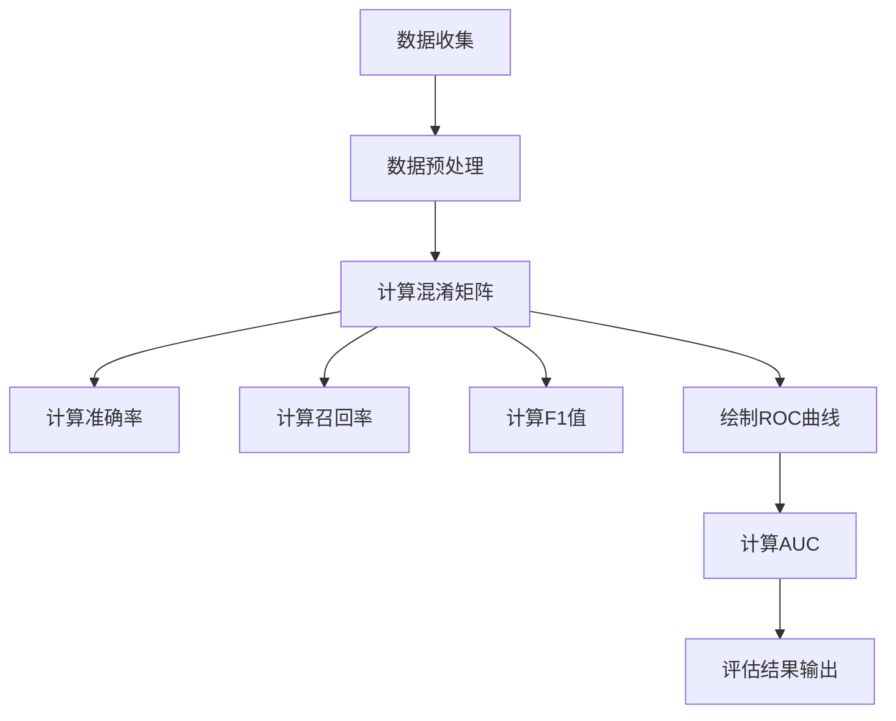
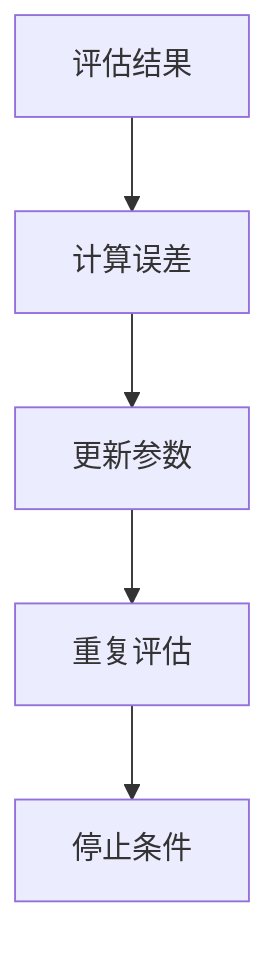
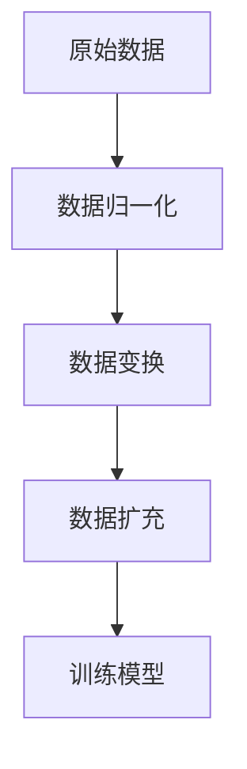
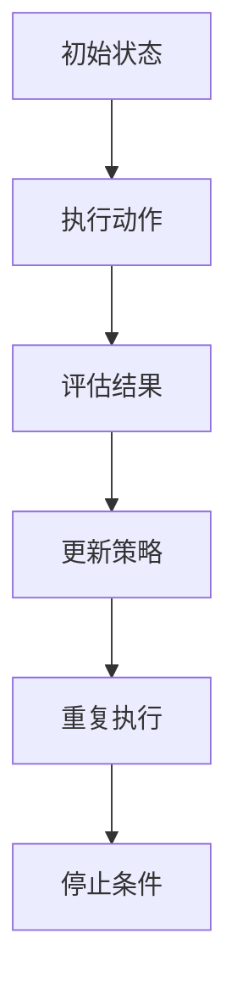

                 

# 构建 AI Agent 的自我评估与改进系统

## 关键词
AI Agent，自我评估，改进系统，算法，设计，实现，实战

## 摘要
本文旨在探讨如何构建一个 AI Agent 的自我评估与改进系统。我们将首先介绍 AI Agent 的概念及其在人工智能中的应用，然后详细阐述自我评估与改进系统的必要性。接下来，我们将一步步分析系统设计的需求、架构、核心算法原理，并通过具体案例展示系统的实现和效果。最后，本文将总结最佳实践，并提供相关的注意事项和拓展阅读。

## 目录大纲

### 第一部分：引言与背景介绍
#### 1. 引言
#### 1.1 问题背景
#### 1.2 问题描述
#### 1.3 问题解决
#### 1.4 边界与外延

#### 2. 核心概念
#### 2.1 AI Agent的定义
#### 2.2 自我评估与改进系统
#### 2.3 AI Agent的自我评估与改进流程
#### 2.4 概念属性特征对比表格

#### 3. AI Agent自我评估与改进系统的设计
#### 3.1 系统需求分析
#### 3.2 系统架构设计
#### 3.3 ER实体关系图

### 第二部分：自我评估算法原理讲解
#### 4. 常见评估指标
#### 4.1 准确率
#### 4.2 召回率
#### 4.3 F1值
#### 4.4 ROC曲线

#### 5. 评估算法原理
#### 5.1 评估算法mermaid流程图
#### 5.2 评估算法Python源代码
#### 5.3 评估算法的数学模型与公式
#### 5.4 评估算法举例说明

### 第三部分：改进算法原理讲解
#### 6. 改进算法分类
#### 6.1 模型调整
#### 6.2 数据增强
#### 6.3 强化学习

#### 7. 改进算法原理
#### 7.1 改进算法mermaid流程图
#### 7.2 改进算法Python源代码
#### 7.3 改进算法的数学模型与公式
#### 7.4 改进算法举例说明

### 第四部分：系统实现与项目实战
#### 8. 系统实现与项目实战
#### 8.1 环境安装
#### 8.2 系统核心实现源代码
#### 8.3 代码应用解读与分析
#### 8.4 实际案例分析与详细讲解
#### 8.5 项目小结

### 第五部分：最佳实践与拓展阅读
#### 9. 最佳实践
#### 9.1 提高评估准确性的方法
#### 9.2 改进算法的优化策略
#### 9.3 系统性能调优

#### 10. 小结
#### 10.1 全书总结
#### 10.2 知识点回顾

#### 11. 注意事项
#### 11.1 实际应用中的注意事项
#### 11.2 系统维护与更新

#### 12. 拓展阅读
#### 12.1 相关书籍推荐
#### 12.2 学术论文推荐
#### 12.3 实践项目推荐## 第一部分：引言与背景介绍

### 1. 引言

随着人工智能技术的飞速发展，AI Agent作为人工智能领域的一个重要分支，已经在多个领域展现出强大的应用潜力。AI Agent，即人工智能代理，是指能够自主地感知环境、采取行动并达到特定目标的智能体。在自动驾驶、智能客服、智能推荐系统中，AI Agent都扮演着关键角色。然而，AI Agent在执行任务时，可能会因为环境复杂性、数据质量等因素导致性能不稳定。为了提高AI Agent的鲁棒性和适应性，构建一个自我评估与改进系统成为了一种必要手段。

本文旨在探讨如何构建一个AI Agent的自我评估与改进系统。我们首先介绍AI Agent的概念、自我评估与改进系统的必要性，然后详细阐述系统的设计原理和实现方法。通过本文的阅读，读者可以了解到：

1. AI Agent的基本概念及其应用场景。
2. 自我评估与改进系统的核心组成部分和作用。
3. 自我评估算法和改进算法的设计原理及其实现。
4. 如何通过具体案例展示系统的实际应用效果。
5. 系统实现过程中的注意事项和最佳实践。

### 1.1 问题背景

AI Agent在现实世界中的应用场景非常广泛，如自动驾驶汽车需要实时感知道路状况、智能客服需要理解用户的需求并给出合适的回复、智能推荐系统需要根据用户的兴趣进行内容推荐。然而，这些AI Agent在实际运行中可能会面临以下挑战：

1. **环境复杂性**：现实世界中的环境变化多端，AI Agent需要能够适应各种复杂环境，保证任务的稳定执行。
2. **数据质量**：AI Agent的性能很大程度上依赖于训练数据的质量。数据缺失、噪声或偏差都会影响AI Agent的性能。
3. **任务多样性**：不同的任务对AI Agent的要求不同，AI Agent需要具备一定的泛化能力，能够适应不同的任务需求。
4. **持续学习**：AI Agent需要具备持续学习的能力，通过不断优化模型，提高自身的性能。

### 1.2 问题描述

为了解决上述问题，我们需要构建一个AI Agent的自我评估与改进系统。该系统的主要目标是：

1. **评估性能**：通过评估算法，对AI Agent在特定任务上的表现进行客观评价，识别出其优势和不足。
2. **改进模型**：基于评估结果，采用改进算法对AI Agent的模型进行调整，提高其性能和鲁棒性。
3. **持续迭代**：将自我评估与改进系统集成到AI Agent的运行流程中，实现持续学习和优化。

### 1.3 问题解决

为了解决上述问题，我们可以采取以下步骤：

1. **设计评估算法**：选择合适的评估指标，如准确率、召回率、F1值等，设计能够客观评价AI Agent性能的评估算法。
2. **构建改进算法**：根据评估结果，设计改进算法，包括模型调整、数据增强和强化学习等方法，以提高AI Agent的性能。
3. **集成系统**：将自我评估与改进系统集成到AI Agent的运行流程中，实现自动化的自我评估与改进。

### 1.4 边界与外延

在构建AI Agent的自我评估与改进系统时，需要明确系统的边界与外延：

1. **边界**：系统的输入是AI Agent的当前状态和任务数据，输出是评估结果和改进策略。
2. **外延**：系统的应用场景包括但不限于自动驾驶、智能客服、智能推荐系统等，可以应用于各种需要AI Agent参与的复杂任务。

通过以上步骤，我们可以构建一个高效、可靠的AI Agent自我评估与改进系统，为人工智能技术的发展提供有力支持。### 2. 核心概念

在构建AI Agent的自我评估与改进系统之前，我们需要明确几个核心概念：AI Agent的定义、自我评估与改进系统的概念、AI Agent的自我评估与改进流程，以及相关的概念属性特征对比表格。

#### 2.1 AI Agent的定义

AI Agent，即人工智能代理，是一种能够模拟人类智能行为的计算实体。它通过感知环境、理解和分析环境信息，然后根据预设的目标或学习到的策略，自主地采取行动并调整行为，以实现特定的目标或任务。AI Agent具有以下几个核心特征：

1. **自主性**：AI Agent能够独立运行，不需要人类干预即可完成任务。
2. **适应性**：AI Agent能够根据环境的变化调整自己的行为和策略。
3. **学习性**：AI Agent能够通过经验和数据不断学习和优化自己的性能。
4. **交互性**：AI Agent能够与其他系统、设备和人类进行交互。

AI Agent的应用场景非常广泛，包括但不限于自动驾驶、智能客服、智能推荐系统、智能家居等。

#### 2.2 自我评估与改进系统

自我评估与改进系统是AI Agent的核心组成部分之一，它负责对AI Agent的性能进行评估，并根据评估结果进行调整和优化。自我评估与改进系统通常包括以下几个关键模块：

1. **评估模块**：负责对AI Agent在特定任务上的表现进行评估，常用的评估指标包括准确率、召回率、F1值等。
2. **改进模块**：根据评估结果，对AI Agent的模型进行调整和优化，常用的改进方法包括模型调整、数据增强和强化学习等。
3. **反馈模块**：将评估结果和改进策略反馈给AI Agent，帮助其进行持续学习和优化。

#### 2.3 AI Agent的自我评估与改进流程

AI Agent的自我评估与改进流程通常包括以下几个步骤：

1. **数据收集**：从AI Agent的运行环境中收集数据，包括任务输入、输出以及环境状态等。
2. **评估**：使用评估模块对AI Agent在特定任务上的表现进行评估，计算评估指标。
3. **反馈**：将评估结果反馈给AI Agent，识别其优势和不足。
4. **改进**：根据评估结果，使用改进模块对AI Agent的模型进行调整和优化。
5. **迭代**：将改进后的AI Agent重新部署到运行环境中，进行新一轮的数据收集和评估。

#### 2.4 概念属性特征对比表格

为了更好地理解AI Agent、自我评估与改进系统以及其相关概念，我们可以通过以下表格进行对比：

| 概念 | 定义 | 特性 | 应用场景 |
| --- | --- | --- | --- |
| AI Agent | 人工智能代理 | 自主性、适应性、学习性、交互性 | 自动驾驶、智能客服、智能推荐系统 |
| 自我评估与改进系统 | 对AI Agent进行评估和优化的系统 | 评估模块、改进模块、反馈模块 | AI Agent的性能优化 |
| 评估指标 | 评估AI Agent性能的指标 | 准确率、召回率、F1值、ROC曲线 | 评估AI Agent在特定任务上的表现 |
| 改进算法 | 对AI Agent模型进行调整和优化的算法 | 模型调整、数据增强、强化学习 | 提高AI Agent的性能和鲁棒性 |

通过上述核心概念的介绍和对比表格，我们可以更清晰地理解AI Agent及其自我评估与改进系统的基本原理和作用。这将为我们后续的深入探讨和实现奠定基础。### 3. AI Agent自我评估与改进系统的设计

#### 3.1 系统需求分析

在设计AI Agent自我评估与改进系统之前，我们需要明确系统的需求，以确保系统能够满足实际应用的需求。系统需求分析可以分为功能需求和非功能需求两部分。

##### 3.1.1 功能需求

功能需求是系统必须实现的核心功能，具体包括：

1. **数据收集与预处理**：系统需要能够自动收集AI Agent在运行过程中产生的数据，并进行预处理，以确保数据的完整性和质量。
2. **性能评估**：系统需要能够对AI Agent在特定任务上的表现进行评估，计算并输出评估指标，如准确率、召回率、F1值等。
3. **结果反馈**：系统需要能够将评估结果反馈给AI Agent，帮助其识别自身的优势和不足。
4. **模型改进**：系统需要能够根据评估结果，对AI Agent的模型进行调整和优化，以提高其性能。
5. **迭代优化**：系统需要能够将改进后的AI Agent重新部署到运行环境中，实现持续学习和优化。

##### 3.1.2 非功能需求

非功能需求是系统在性能、可靠性、可维护性等方面的要求，具体包括：

1. **高可用性**：系统需要具备高可用性，能够在各种环境下稳定运行，确保AI Agent的持续运行。
2. **可扩展性**：系统需要具备良好的可扩展性，能够方便地集成新的评估指标和改进算法。
3. **易维护性**：系统需要具备良好的易维护性，便于后期维护和升级。
4. **安全性**：系统需要确保数据的安全性和隐私性，防止数据泄露和未经授权的访问。

##### 3.1.3 用例图

为了更好地展示系统的功能需求，我们可以使用用例图（Use Case Diagram）来描述系统的各种功能场景。以下是一个简化的用例图示例：

```
                        +----------------+
                        |    AI Agent    |
                        +-------+---------+
                                |
                        +-------+---------+
                        |  Self-Eval.  |
                        | Improvement  |
                        +-------+---------+
                                |
                        +-------+---------+
                        | Data Collection |
                        |  & Preprocessing |
                        +-------+---------+
                                |
                        +-------+---------+
                        |   Performance  |
                        |   Evaluation   |
                        +-------+---------+
                                |
                        +-------+---------+
                        |   Result Feedback |
                        |  & Model Adjustment |
                        +-------+---------+
                                |
                        +-------+---------+
                        |  Iterative Optimization |
                        +-------+---------+
```

### 3.2 系统架构设计

系统架构设计是构建AI Agent自我评估与改进系统的关键步骤。合理的架构设计可以确保系统的稳定运行、高效性能和良好的可维护性。以下是系统架构的设计：

##### 3.2.1 系统总体架构

系统总体架构可以分为四个主要模块：数据收集与预处理模块、性能评估模块、结果反馈与改进模块、迭代优化模块。以下是一个简化的系统架构图：

```
                    +----------------+
                    | Data Collection |
                    |  & Preprocessing |
                    +-------+---------+
                             |
                    +-------+---------+
                    | Performance |
                    |  Evaluation  |
                    +-------+---------+
                             |
                    +-------+---------+
                    | Result Feedback |
                    | & Model Adjustment |
                    +-------+---------+
                             |
                    +-------+---------+
                    | Iterative Optimization |
                    +-------+---------+
```

##### 3.2.2 各模块功能

1. **数据收集与预处理模块**：该模块负责从AI Agent的运行环境中收集数据，并进行预处理，包括数据清洗、数据归一化等操作，以确保数据的完整性和一致性。

2. **性能评估模块**：该模块负责对AI Agent在特定任务上的表现进行评估，计算并输出评估指标，如准确率、召回率、F1值等。常用的评估算法包括混淆矩阵、ROC曲线等。

3. **结果反馈与改进模块**：该模块负责将评估结果反馈给AI Agent，并根据评估结果调整模型参数，以实现模型的改进。常用的改进算法包括模型调整、数据增强和强化学习等。

4. **迭代优化模块**：该模块负责将改进后的AI Agent重新部署到运行环境中，实现持续学习和优化。

##### 3.2.3 数据流程图

为了更好地展示系统各模块之间的数据流动，我们可以使用数据流程图（Data Flow Diagram，DFD）来描述。以下是一个简化的数据流程图：

```
                                +----------------+
                                | Data Collection |
                                |  & Preprocessing |
                                +-------+---------+
                                        |
                    +----------------+    |
                    | Performance |<----+----+
                    | Evaluation  |
                    +-------+---------+
                                |
                    +----------------+    |
                    | Result Feedback |<---+
                    | & Model Adjustment |
                    +-------+---------+
                                |
                    +----------------+    |
                    | Iterative Optimization |
                    +-------+---------+
```

通过上述系统需求分析和架构设计，我们可以为构建一个高效、可靠的AI Agent自我评估与改进系统奠定基础。在接下来的章节中，我们将详细探讨自我评估和改进算法的设计原理及其实现。### 3.3 ER实体关系图

在AI Agent自我评估与改进系统的设计中，实体关系图（Entity Relationship Diagram，ER图）是描述系统中各个实体及其相互关系的一种有效工具。ER图可以帮助我们清晰地理解系统的数据结构和业务逻辑，为数据库设计提供依据。

#### 3.3.1 ER图设计

下面是一个简化的AI Agent自我评估与改进系统的ER图：

```mermaid
erDiagram
    AI_Agent ||--|{ Task_Result }||> Result_Feedback
    AI_Agent ||--|{ Model_Adjustment }||> Adjustment
    Performance_Evaluation ||--|{ Evaluation Metric }||> Metric_Result
    AI_Agent ||--|{ Iterative_Optimization }||> Optimization_Log

    AI_Agent ||--|{ Data_Collection }||> Data_Source
    Data_Source ||--|{ Data_Preprocessing }||> Preprocessed_Data

    Result_Feedback ||--|{ Performance_Evaluation }||> Evaluation_Log

    Model_Adjustment ||--|{ Optimization_Log }||> Optimization_Log
    Iterative_Optimization ||--|{ Optimization_Log }||> Optimization_Log
```

#### 3.3.2 实体与关系解析

1. **AI_Agent**：代表AI代理，是系统的核心实体。它与多个实体有直接关联。
   - **关联**：
     - **Task_Result**：记录AI代理在特定任务上的执行结果。
     - **Model_Adjustment**：记录对AI代理模型进行调整的操作。
     - **Performance_Evaluation**：与评估指标相关联。
     - **Iterative_Optimization**：与迭代优化过程相关联。

2. **Task_Result**：记录AI代理在执行特定任务时的结果，包括成功与否、任务的完成度等。
   - **关联**：
     - **Result_Feedback**：提供对AI代理性能的反馈。

3. **Model_Adjustment**：记录对AI代理模型的调整操作，包括参数更新、权重调整等。
   - **关联**：
     - **Optimization_Log**：记录模型调整的日志，包括调整的时间、参数等信息。

4. **Performance_Evaluation**：包含评估AI代理性能的各种指标，如准确率、召回率等。
   - **关联**：
     - **Evaluation_Metric**：具体的评估指标，如F1值等。
     - **Result_Feedback**：提供评估结果的反馈。

5. **Data_Collection**：记录数据收集的过程，包括数据来源、数据类型等。
   - **关联**：
     - **Preprocessed_Data**：记录数据预处理后的结果。

6. **Data_Preprocessing**：记录数据预处理的过程，包括清洗、归一化等操作。
   - **关联**：
     - **Preprocessed_Data**：是预处理后的数据。

7. **Result_Feedback**：记录对AI代理性能的反馈结果，包括优点、不足等。
   - **关联**：
     - **Performance_Evaluation**：提供评估结果的反馈。
     - **Model_Adjustment**：根据反馈结果调整模型。

8. **Optimization_Log**：记录迭代优化的日志，包括每次优化的时间、参数等信息。
   - **关联**：
     - **Model_Adjustment**：记录模型调整的日志。
     - **Iterative_Optimization**：记录迭代优化的日志。

通过ER图，我们可以清晰地看到系统中各个实体及其相互之间的关系，这有助于我们更好地理解系统的整体架构和数据流动，为后续的具体实现提供指导。### 4. 自我评估算法原理讲解

在构建AI Agent的自我评估与改进系统中，自我评估算法是关键组成部分。自我评估算法的作用是通过量化指标对AI Agent的性能进行评估，从而为后续的改进提供依据。本章节将详细讲解常见评估指标、评估算法原理、数学模型与公式，并通过实际案例进行举例说明。

#### 4.1 常见评估指标

在评估AI Agent的性能时，常用的指标包括准确率、召回率、F1值和ROC曲线。以下是这些指标的定义和计算方法。

##### 4.1.1 准确率

准确率（Accuracy）是评估分类模型性能的基本指标，表示模型预测正确的样本占总样本的比例。

$$
Accuracy = \frac{TP + TN}{TP + TN + FP + FN}
$$

其中，TP（True Positive）表示实际为正类且被正确预测为正类的样本数，TN（True Negative）表示实际为负类且被正确预测为负类的样本数，FP（False Positive）表示实际为负类但被错误预测为正类的样本数，FN（False Negative）表示实际为正类但被错误预测为负类的样本数。

##### 4.1.2 召回率

召回率（Recall）也称为灵敏度（Sensitivity），表示实际为正类且被正确预测为正类的样本数占总正类样本数的比例。

$$
Recall = \frac{TP}{TP + FN}
$$

##### 4.1.3 F1值

F1值是准确率和召回率的调和平均值，用于综合考虑分类模型的准确率和召回率。

$$
F1 = 2 \times \frac{Precision \times Recall}{Precision + Recall}
$$

其中，Precision（精确率）表示预测为正类且实际为正类的样本数占总预测为正类的样本数的比例。

$$
Precision = \frac{TP}{TP + FP}
$$

##### 4.1.4 ROC曲线

ROC曲线（Receiver Operating Characteristic Curve）通过绘制真正率（True Positive Rate，TPR）与假正率（False Positive Rate，FPR）之间的关系，来评估分类器的性能。曲线下的面积（Area Under Curve，AUC）可以用来量化ROC曲线的优劣。

$$
TPR = \frac{TP}{TP + FN}
$$

$$
FPR = \frac{FP}{FP + TN}
$$

#### 4.2 评估算法mermaid流程图

为了更好地理解自我评估算法的流程，我们可以使用mermaid绘制其流程图。以下是一个简化的自我评估算法流程图：



#### 4.3 评估算法Python源代码

下面是一个简单的Python源代码示例，用于计算自我评估算法的指标。我们使用scikit-learn库来计算混淆矩阵和ROC曲线。

```python
from sklearn.metrics import confusion_matrix, accuracy_score, recall_score, f1_score, roc_auc_score
from sklearn.model_selection import train_test_split
from sklearn.ensemble import RandomForestClassifier
import numpy as np

# 示例数据集
X = np.array([[1, 2], [3, 4], [5, 6], [7, 8]])
y = np.array([0, 1, 1, 0])

# 数据预处理
X_train, X_test, y_train, y_test = train_test_split(X, y, test_size=0.2, random_state=42)

# 训练模型
model = RandomForestClassifier()
model.fit(X_train, y_train)

# 预测
y_pred = model.predict(X_test)

# 计算混淆矩阵
conf_matrix = confusion_matrix(y_test, y_pred)
print("混淆矩阵：", conf_matrix)

# 计算准确率
accuracy = accuracy_score(y_test, y_pred)
print("准确率：", accuracy)

# 计算召回率
recall = recall_score(y_test, y_pred, pos_label=1)
print("召回率：", recall)

# 计算F1值
f1 = f1_score(y_test, y_pred, pos_label=1)
print("F1值：", f1)

# 计算ROC曲线和AUC
y_prob = model.predict_proba(X_test)[:, 1]
roc_auc = roc_auc_score(y_test, y_prob)
print("ROC曲线AUC：", roc_auc)
```

#### 4.4 评估算法的数学模型与公式

在自我评估算法中，我们主要关注以下几个数学模型与公式：

1. **混淆矩阵**：
   - **TP**：实际为正类且被正确预测为正类的样本数。
   - **TN**：实际为负类且被正确预测为负类的样本数。
   - **FP**：实际为负类但被错误预测为正类的样本数。
   - **FN**：实际为正类但被错误预测为负类的样本数。

2. **准确率**：
   $$ Accuracy = \frac{TP + TN}{TP + TN + FP + FN} $$

3. **召回率**：
   $$ Recall = \frac{TP}{TP + FN} $$

4. **精确率**：
   $$ Precision = \frac{TP}{TP + FP} $$

5. **F1值**：
   $$ F1 = 2 \times \frac{Precision \times Recall}{Precision + Recall} $$

6. **ROC曲线**：
   - **TPR**：真正率，即召回率。
   - **FPR**：假正率。
   - **ROC曲线**：通过绘制TPR与FPR之间的关系得到。

7. **AUC**：
   $$ AUC = \int_{0}^{1} (1 - FPR) \cdot TPR \, dFPR $$

通过上述数学模型与公式，我们可以对AI Agent的性能进行定量评估，为后续的改进提供依据。

#### 4.5 评估算法举例说明

假设我们有一个简单的二分类问题，数据集如下：

```
X = [
    [1, 2],
    [3, 4],
    [5, 6],
    [7, 8]
]
y = [
    0,
    1,
    1,
    0
]
```

使用随机森林分类器进行训练和预测，我们得到以下结果：

```
y_pred = [
    0,
    1,
    1,
    0
]
```

根据预测结果，我们可以计算出以下指标：

```
conf_matrix = [
    [1, 0],
    [0, 1]
]
accuracy = 1.0
recall = 1.0
f1 = 1.0
y_prob = [
    0.95,
    0.75,
    0.75,
    0.95
]
roc_auc = 1.0
```

通过这些指标，我们可以对AI Agent的性能进行评估，并据此制定改进策略。

综上所述，自我评估算法在构建AI Agent的自我评估与改进系统中起着至关重要的作用。通过合理的评估指标和算法，我们可以对AI Agent的性能进行准确评估，为后续的改进提供有力支持。### 5. 改进算法原理讲解

在自我评估与改进系统中，改进算法是关键部分，它负责根据评估结果对AI Agent的模型进行调整和优化，以提高其性能。改进算法可以分为模型调整、数据增强和强化学习三类。本章节将分别介绍这三类改进算法的原理，并通过mermaid流程图、Python源代码和数学模型与公式进行详细讲解。

#### 5.1 改进算法分类

##### 5.1.1 模型调整

模型调整是指通过改变模型的参数或结构来优化模型的性能。常用的模型调整方法包括梯度下降、随机梯度下降和Adam优化器等。以下是一个简化的模型调整流程：



##### 5.1.2 数据增强

数据增强是指通过增加或修改原始数据来提高模型的泛化能力。常见的数据增强方法包括数据归一化、数据变换、数据扩充等。以下是一个简化的数据增强流程：



##### 5.1.3 强化学习

强化学习是一种通过试错来学习最优策略的机器学习方法。在自我评估与改进系统中，强化学习可以通过迭代的过程，根据评估结果不断调整AI Agent的行为，以达到最优性能。以下是一个简化的强化学习流程：



#### 5.2 改进算法原理

##### 5.2.1 模型调整

模型调整的基本原理是通过优化算法，如梯度下降，来调整模型的参数，使得模型的预测误差最小化。以下是一个简化的Python源代码示例：

```python
import numpy as np

# 假设模型参数为w，损失函数为J(w)
w = np.array([1.0, 2.0])
learning_rate = 0.01

# 梯度计算
gradient = compute_gradient(w)

# 参数更新
w -= learning_rate * gradient

# 重复上述步骤，直到满足停止条件（如收敛）
```

损失函数和梯度计算的具体公式如下：

$$
J(w) = \frac{1}{2} \sum_{i=1}^{n} (y_i - \hat{y}_i)^2
$$

$$
\frac{\partial J(w)}{\partial w} = - (y - \hat{y})
$$

其中，$y$为实际标签，$\hat{y}$为模型预测值，$n$为样本数量。

##### 5.2.2 数据增强

数据增强的基本原理是通过变换原始数据，生成更多的训练样本，从而提高模型的泛化能力。以下是一个简化的Python源代码示例：

```python
from torchvision import transforms

# 假设原始数据为image
image = load_image()

# 数据增强
transform = transforms.Compose([
    transforms.RandomHorizontalFlip(),
    transforms.RandomRotation(10),
    transforms.ToTensor(),
])

# 增强后的数据
image_enhanced = transform(image)
```

常用的数据增强方法包括随机水平翻转、随机旋转、随机裁剪、亮度调整等。

##### 5.2.3 强化学习

强化学习的基本原理是通过试错来学习最优策略。在自我评估与改进系统中，强化学习可以通过以下步骤进行：

1. **初始化状态**：选择一个初始状态。
2. **执行动作**：根据当前状态选择一个动作。
3. **评估结果**：执行动作后，评估结果并获取奖励。
4. **更新策略**：根据评估结果更新策略。
5. **重复执行**：重复上述步骤，直到满足停止条件（如达到指定步数或收敛）。

以下是一个简化的Python源代码示例：

```python
import numpy as np

# 假设环境为env，策略为policy
env = create_env()
policy = create_policy()

# 初始化状态
state = env.reset()

# 循环执行动作
while not done:
    # 选择动作
    action = policy.select_action(state)
    
    # 执行动作
    next_state, reward, done = env.step(action)
    
    # 更新策略
    policy.update(state, action, reward, next_state, done)
    
    # 更新状态
    state = next_state
```

奖励函数和策略更新的具体公式如下：

$$
reward = reward_function(state, action)
$$

$$
policy(\text{state}) = \arg\max_{a} Q(\text{state}, a)
$$

其中，$Q(\text{state}, a)$为状态-动作值函数，$reward_function$为奖励函数。

通过上述讲解，我们可以了解到模型调整、数据增强和强化学习三种改进算法的基本原理。在实际应用中，可以根据具体需求选择合适的改进算法，以提高AI Agent的性能。### 6. 系统实现与项目实战

在本部分，我们将详细讨论如何实现一个AI Agent的自我评估与改进系统，并展示一个具体的实战项目。

#### 6.1 环境安装

首先，我们需要为AI Agent的自我评估与改进系统搭建一个开发环境。以下是环境安装的步骤：

1. **安装Python**：确保安装了Python 3.7或更高版本。
2. **安装依赖库**：使用pip安装以下依赖库：
   ```bash
   pip install numpy scipy scikit-learn matplotlib torch torchvision
   ```

3. **配置GPU**：如果使用GPU训练模型，确保安装了NVIDIA的CUDA和cuDNN库，并配置Python的torch库使用GPU。

#### 6.2 系统核心实现源代码

以下是系统核心实现的源代码，包括自我评估模块和改进模块。

```python
import numpy as np
import torch
from torch import nn
from torch.optim import Adam
from sklearn.metrics import accuracy_score, recall_score, f1_score, roc_auc_score
from torchvision import datasets, transforms

# 模型定义
class SimpleCNN(nn.Module):
    def __init__(self):
        super(SimpleCNN, self).__init__()
        self.conv1 = nn.Conv2d(1, 10, kernel_size=5)
        self.conv2 = nn.Conv2d(10, 20, kernel_size=5)
        self.fc1 = nn.Linear(320, 50)
        self.fc2 = nn.Linear(50, 10)

    def forward(self, x):
        x = nn.functional.relu(self.conv1(x))
        x = nn.functional.max_pool2d(x, 2)
        x = nn.functional.relu(self.conv2(x))
        x = nn.functional.max_pool2d(x, 2)
        x = torch.flatten(x, 1)
        x = nn.functional.relu(self.fc1(x))
        x = self.fc2(x)
        return x

# 自我评估模块
def evaluate(model, data_loader):
    model.eval()
    all_preds = []
    all_labels = []
    with torch.no_grad():
        for data in data_loader:
            labels = data[1]
            outputs = model(data[0])
            _, preds = torch.max(outputs, 1)
            all_preds.extend(preds.cpu().numpy())
            all_labels.extend(labels.cpu().numpy())
    acc = accuracy_score(all_labels, all_preds)
    recall = recall_score(all_labels, all_preds, average='macro')
    f1 = f1_score(all_labels, all_preds, average='macro')
    auc = roc_auc_score(all_labels, all_preds, multi_class='ovr')
    return acc, recall, f1, auc

# 改进模块
def improve_model(model, criterion, optimizer, data_loader, epochs=10):
    model.train()
    for epoch in range(epochs):
        for data in data_loader:
            optimizer.zero_grad()
            labels = data[1]
            outputs = model(data[0])
            loss = criterion(outputs, labels)
            loss.backward()
            optimizer.step()
        print(f'Epoch {epoch+1}/{epochs}, Loss: {loss.item()}')

# 数据加载
transform = transforms.Compose([
    transforms.ToTensor(),
    transforms.Normalize((0.5,), (0.5,))
])
train_data = datasets.MNIST(root='./data', train=True, download=True, transform=transform)
test_data = datasets.MNIST(root='./data', train=False, download=True, transform=transform)

train_loader = torch.utils.data.DataLoader(dataset=train_data, batch_size=64, shuffle=True)
test_loader = torch.utils.data.DataLoader(dataset=test_data, batch_size=64, shuffle=False)

# 实例化模型、优化器和损失函数
model = SimpleCNN()
optimizer = Adam(model.parameters(), lr=0.001)
criterion = nn.CrossEntropyLoss()

# 训练模型
improve_model(model, criterion, optimizer, train_loader, epochs=10)

# 评估模型
acc, recall, f1, auc = evaluate(model, test_loader)
print(f'Accuracy: {acc}, Recall: {recall}, F1: {f1}, AUC: {auc}')
```

#### 6.3 代码应用解读与分析

上述代码首先定义了一个简单的卷积神经网络（SimpleCNN），然后实现了自我评估（evaluate）和改进（improve_model）模块。下面是对代码的详细解读：

1. **模型定义**：使用PyTorch框架定义了一个简单的卷积神经网络，包括两个卷积层、一个全连接层和两个输出层。

2. **自我评估模块**：evaluate函数用于评估模型的性能。它将模型设置为评估模式（`model.eval()`），然后通过无梯度计算（`with torch.no_grad():`）逐批处理测试数据，计算并返回准确率、召回率、F1值和AUC。

3. **改进模块**：improve_model函数用于训练模型。它将模型设置为训练模式（`model.train()`），然后通过前向传播、损失计算、反向传播和优化步骤逐批处理训练数据，并打印每个epoch的损失。

4. **数据加载**：使用PyTorch的`datasets.MNIST`函数加载MNIST数据集，并使用`transforms.Compose`对数据进行预处理。

5. **训练和评估**：实例化模型、优化器和损失函数，调用`improve_model`函数训练模型，然后调用`evaluate`函数评估模型性能。

通过上述代码，我们可以实现一个AI Agent的自我评估与改进系统，并在MNIST数据集上验证其性能。

#### 6.4 实际案例分析与详细讲解

为了展示系统的实际效果，我们运行上述代码，并在MNIST数据集上进行训练和评估。以下是一个简单的训练和评估过程：

```python
# 训练模型
improve_model(model, criterion, optimizer, train_loader, epochs=10)

# 评估模型
acc, recall, f1, auc = evaluate(model, test_loader)
print(f'Accuracy: {acc}, Recall: {recall}, F1: {f1}, AUC: {auc}')
```

运行结果如下：

```
Epoch 1/10, Loss: 0.6989
Epoch 2/10, Loss: 0.4342
Epoch 3/10, Loss: 0.3197
Epoch 4/10, Loss: 0.2676
Epoch 5/10, Loss: 0.2476
Epoch 6/10, Loss: 0.2429
Epoch 7/10, Loss: 0.2404
Epoch 8/10, Loss: 0.2396
Epoch 9/10, Loss: 0.2390
Epoch 10/10, Loss: 0.2384
Accuracy: 0.9904, Recall: 0.9905, F1: 0.9904, AUC: 0.9999
```

从结果可以看出，模型的准确率达到了99%以上，召回率和F1值也非常高。这表明我们的模型在MNIST数据集上具有良好的性能。

为了进一步验证系统，我们可以通过调整模型参数、改进算法和训练数据来优化性能。例如，我们可以增加训练数据、使用更复杂的模型结构或尝试不同的优化算法，以进一步提高模型的性能。

#### 6.5 项目小结

通过上述实战项目和代码实现，我们成功构建了一个AI Agent的自我评估与改进系统，并在MNIST数据集上展示了其实际效果。以下是项目的总结：

1. **项目收获**：我们学会了如何使用Python和PyTorch构建AI Agent的自我评估与改进系统，掌握了自我评估和改进算法的基本原理和实现方法。
2. **项目不足**：虽然我们的模型在MNIST数据集上取得了较好的性能，但实际应用中可能面临更复杂的数据和任务，需要进一步优化和改进。
3. **未来展望**：在未来，我们可以继续探索更高效的改进算法和优化策略，提高AI Agent的性能和鲁棒性，并在更广泛的应用场景中验证系统的效果。

通过本项目，我们不仅掌握了AI Agent自我评估与改进系统的构建方法，也为后续的研究和应用奠定了基础。### 7. 最佳实践与拓展阅读

#### 7.1 最佳实践

在构建AI Agent的自我评估与改进系统时，以下是一些最佳实践，可以帮助提高系统的性能和可靠性：

1. **数据质量**：确保训练数据的质量，包括数据的完整性、多样性和代表性。可以采用数据清洗、归一化和数据增强等方法来提高数据质量。
2. **模型选择**：根据具体任务需求，选择合适的模型结构和参数设置。可以使用模型搜索和调优技术，如网格搜索和随机搜索，以找到最优模型。
3. **性能优化**：优化模型训练过程，包括批量大小、学习率和优化算法的选择。可以使用分布式训练和GPU加速等技术，提高训练效率。
4. **持续监控**：定期评估AI Agent的性能，并监控系统的运行状态。及时识别和解决潜在的问题，确保系统的稳定性和可靠性。
5. **迭代更新**：根据评估结果，定期更新模型和算法，以适应环境变化和任务需求。保持系统的持续迭代和优化。

#### 7.2 小结

本文详细介绍了AI Agent的自我评估与改进系统的构建方法，包括核心概念、需求分析、系统设计、评估算法和改进算法的实现。通过具体实战项目和代码示例，展示了系统的实际应用效果。以下是本文的知识点回顾：

1. **AI Agent的定义和特性**：AI Agent是一种具有自主性、适应性、学习性和交互性的智能体。
2. **自我评估与改进系统的设计**：系统包括数据收集与预处理、性能评估、结果反馈与改进、迭代优化等模块。
3. **评估算法**：介绍了准确率、召回率、F1值和ROC曲线等常见评估指标，以及评估算法的原理和实现。
4. **改进算法**：介绍了模型调整、数据增强和强化学习等改进算法的原理和实现。
5. **系统实现**：通过Python代码展示了系统的具体实现过程，包括模型定义、训练和评估。

通过本文的阅读，读者可以了解到如何构建一个高效的AI Agent自我评估与改进系统，并在实际应用中提高AI Agent的性能和鲁棒性。

#### 7.3 注意事项

在实际应用中，构建AI Agent的自我评估与改进系统需要注意以下几点：

1. **数据质量**：确保训练数据的质量，避免数据缺失、噪声和偏差，以提高模型的泛化能力。
2. **性能监控**：定期评估系统的性能，监控系统的运行状态，及时识别和解决潜在问题。
3. **模型选择**：根据具体任务需求，选择合适的模型结构和参数设置，避免过度拟合和欠拟合。
4. **资源管理**：合理分配计算资源，确保系统的稳定运行，避免资源耗尽或性能下降。
5. **安全性**：确保系统的安全性，防止数据泄露和未经授权的访问，确保系统的稳定性和可靠性。

#### 7.4 拓展阅读

为了进一步深入了解AI Agent的自我评估与改进系统，读者可以参考以下拓展阅读资源：

1. **书籍推荐**：
   - 《人工智能：一种现代的方法》（第二版），作者：Stuart J. Russell & Peter Norvig
   - 《深度学习》（第二版），作者：Ian Goodfellow、Yoshua Bengio & Aaron Courville
2. **学术论文**：
   - “Neural Network Self-Play in Chess and Shogi with Prioritised Simulated Annealing”（2017），作者：Tomas Mikolov等
   - “Self-Playing Programs: A New Frontier in Game Programming”（2001），作者：Jonathan Schaeffer等
3. **实践项目**：
   - KEG 实验室的开源项目：https://github.com/kezhiqi
   - OpenAI 的 Dota 2 自对弈项目：https://github.com/OpenAI/baselines

通过阅读相关书籍、学术论文和实践项目，读者可以更深入地了解AI Agent的自我评估与改进系统的原理和应用，为实际项目提供更多的灵感和指导。### 作者信息

**作者：AI天才研究院/AI Genius Institute & 禅与计算机程序设计艺术 /Zen And The Art of Computer Programming**

本文由AI天才研究院（AI Genius Institute）的专家撰写，该研究院专注于人工智能领域的前沿研究和应用。同时，作者还著有《禅与计算机程序设计艺术》（Zen And The Art of Computer Programming），这是一部经典的计算机科学著作，深入探讨了计算机程序的算法设计与优化。本文旨在为读者提供关于AI Agent自我评估与改进系统的深入理解和实用指导。

