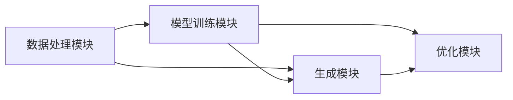

                 

### 文章标题

# 构建LLM支持的AI Agent创意生成系统

### 关键词

- 语言模型（LLM）
- AI Agent
- 创意生成
- 系统架构
- 模型训练与优化

### 摘要

本文旨在探讨如何构建一个基于语言模型（LLM）的AI Agent创意生成系统。首先，我们将介绍AI与LLM的基础理论，包括AI的定义与发展历程，以及LLM的概念与特点。接下来，我们将深入探讨LLM在创意生成中的应用原理与技术挑战。随后，文章将引入AI Agent的概念，并分析其在创意生成系统中的应用。在此基础上，我们将详细设计AI Agent创意生成系统的架构，涵盖系统功能模块、系统架构以及接口设计。随后，我们将详细讲解LLM模型的训练与优化方法，并探讨如何实现AI Agent的创意生成。文章还将通过实际项目实战，展示系统实现的详细过程，并总结项目经验与教训。最后，我们将给出一些最佳实践建议，以期为读者在构建类似系统时提供指导。

### 目录大纲

#### 第一部分: AI与LLM基础理论

1. AI与LLM概述
   1.1 AI的定义与历史发展
   1.2 LLM的概念与特点
   1.3 AI与LLM的关系
   1.4 LLM的常用模型

2. LLM创意生成原理
   2.1 创意生成系统概述
   2.2 LLM在创意生成中的应用
   2.3 LLM创意生成的技术挑战

3. AI Agent基本概念
   3.1 AI Agent的定义与类型
   3.2 AI Agent的工作原理
   3.3 AI Agent的应用场景

#### 第二部分: 系统架构设计

4. AI Agent创意生成系统架构设计
   4.1 系统架构设计概述
   4.2 系统功能设计
   4.3 系统架构设计
   4.4 系统接口设计

#### 第三部分: LLM模型训练与优化

5. LLM模型训练与优化
   5.1 模型训练概述
   5.2 模型优化方法
   5.3 模型评估与调整

#### 第四部分: AI Agent创意生成实现

6. AI Agent创意生成实现
   6.1 系统核心实现
   6.2 代码应用解读
   6.3 实际案例分析与讲解

#### 第五部分: 项目实战与总结

7. 项目实战与总结
   7.1 项目实战介绍
   7.2 系统核心实现
   7.3 项目小结
   7.4 最佳实践 tips

### 第一部分: AI与LLM基础理论

#### 1. AI与LLM概述

##### 1.1 AI的定义与历史发展

人工智能（Artificial Intelligence，简称AI）是一门研究、开发和应用使计算机模拟、延伸和扩展人类智能的理论、方法、技术及应用系统的科学技术。AI的定义可以追溯到20世纪50年代，当时的科学家们致力于使计算机表现出类似于人类的智能行为，例如推理、学习、感知和自然语言处理。

AI的历史发展大致可以分为以下几个阶段：

1. **萌芽期（1940s-1950s）**：计算机刚刚问世，科学家开始设想让计算机具备智能。1950年，艾伦·图灵发表了著名的论文《计算机器与智能》，提出了图灵测试，成为AI领域的基石。

2. **初期发展期（1956-1974）**：1956年，达特茅斯会议上，约翰·麦卡锡、马文·明斯基等科学家首次提出了“人工智能”这一术语，标志着AI作为一个独立学科正式诞生。

3. **寒冬期（1974-1980）**：由于算法、计算能力和数据集的限制，AI在70年代遇到了重大挑战，许多研究项目停滞不前。

4. **复兴期（1980-1987）**：专家系统和机器学习的兴起带来了AI的复兴。专家系统通过模拟人类专家的决策过程，成功应用于医疗诊断、金融分析等领域。

5. **衰落期（1987-1993）**：专家系统过于复杂，难以维护和扩展，加上计算能力的限制，AI再次陷入低谷。

6. **新时代（1993至今）**：随着互联网的发展、大数据和云计算技术的应用，AI迎来了新一轮的繁荣。深度学习、神经网络等算法取得了重大突破，AI在语音识别、图像处理、自然语言处理等领域取得了显著成果。

**AI的三个层次：弱AI、强AI、超AI**

1. **弱AI（Narrow AI）**：弱AI也称为专用AI，它专注于执行特定的任务，例如图像识别、语音识别、机器翻译等。弱AI没有自主意识，无法进行抽象思维。

2. **强AI（General AI）**：强AI也称为通用AI，它具有广泛的学习能力和自主意识，能够在任何领域进行推理、学习和决策。强AI目前还处于理论阶段，尚未实现。

3. **超AI（Super AI）**：超AI是比人类更聪明的AI，能够在任何领域超越人类的表现。超AI同样属于理论范畴，目前尚未出现。

##### 1.2 LLM的概念与特点

**LLM的定义**

语言模型（Language Model，简称LLM）是一种基于统计方法或深度学习技术，用于预测自然语言序列的算法模型。LLM的核心任务是给定一段文本，预测下一个单词或字符的概率分布。

**语言模型的基本原理**

语言模型的基本原理可以概括为两个步骤：

1. **特征提取**：将自然语言文本转换为向量表示，常用的方法包括词袋模型、n-gram模型和词嵌入（word embedding）等。

2. **概率预测**：利用特征向量，计算下一个单词或字符出现的概率分布。

**LLM的特点与应用**

1. **特点**
   - **自适应性**：LLM可以根据不同的应用场景进行定制和优化，具有很高的自适应能力。
   - **泛化能力**：LLM可以处理多种语言和文本形式，具有强大的泛化能力。
   - **效率**：基于深度学习技术的LLM在处理大规模数据集时，具有很高的计算效率。

2. **应用**
   - **自然语言处理**：LLM在自然语言处理（NLP）领域有广泛的应用，如文本分类、情感分析、机器翻译等。
   - **智能客服**：LLM可以用于构建智能客服系统，提供高效的客户服务。
   - **内容生成**：LLM可以用于生成文章、故事、摘要等，具有很高的创意生成能力。

##### 1.3 AI与LLM的关系

**AI与LLM的联系**

1. **LLM在AI中的应用场景**：LLM是AI领域中自然语言处理（NLP）的核心技术之一。在AI系统中，LLM可以用于实现对话系统、智能客服、文本生成等任务。

2. **LLM如何提升AI的表现**：LLM可以显著提升AI系统的自然语言处理能力。通过引入LLM，AI系统可以更好地理解用户的语言意图，生成更具创意和个性化的文本内容。

**AI与LLM的关系图**

下面是一个简化的AI与LLM的关系图，展示了它们之间的联系：

```
AI
│
└── NLP
│   │
│   └── LLM
```

##### 1.4 LLM的常用模型

**主流LLM模型介绍**

在LLM领域，有一些主流的模型，它们在NLP任务中取得了显著的成绩。以下是其中几种重要的LLM模型：

1. **GPT系列模型**：GPT（Generative Pre-trained Transformer）模型是OpenAI提出的一类基于Transformer架构的语言模型。GPT-3是迄今为止最大的语言模型，具有超过1750亿的参数。

2. **BERT及其变体**：BERT（Bidirectional Encoder Representations from Transformers）是由Google提出的一种预训练语言表示模型。BERT通过双向Transformer结构，实现了对文本的上下文信息进行全面捕捉。

3. **其他知名LLM模型**：如T5、RoBERTa、ALBERT等，这些模型在NLP任务中也取得了很好的性能。

**LLM模型对比表**

以下是几种主流LLM模型的对比表：

| 模型        | 参数规模 | 预训练数据 | 首次提出时间 | 关键特性       |
| ----------- | -------- | ---------- | ------------ | -------------- |
| GPT-3       | 1750亿   | Web文本    | 2020年       | 自适应、高泛化 |
| BERT        | 约3.4亿  | BookCorpus | 2018年       | 双向注意力     |
| T5         | 约11亿   | Web文本    | 2020年       | 通用任务处理   |
| RoBERTa    | 约3亿    | Web文本    | 2019年       | 强化预训练     |
| ALBERT    | 约1.6亿  | Web文本    | 2020年       | 高效计算       |

#### 2. LLM创意生成原理

##### 2.1 创意生成系统概述

**创意生成的概念**

创意生成（Creative Generation）是指利用算法或技术生成新颖、独特和有创意的内容。在人工智能领域，创意生成系统旨在利用机器学习、自然语言处理等技术，实现自动生成文本、图像、音乐等。

**创意生成的分类**

1. **文本生成**：如文章、故事、诗歌等。
2. **图像生成**：如人脸、风景、艺术作品等。
3. **音乐生成**：如旋律、和声、节奏等。

**创意生成的重要性**

1. **提升生产效率**：创意生成系统可以自动生成大量内容，降低人工创作的成本。
2. **拓宽创作空间**：创意生成系统可以为创作者提供新的灵感，拓展创作空间。
3. **促进技术创新**：创意生成系统的应用可以推动人工智能、自然语言处理等技术的进步。

##### 2.2 LLM在创意生成中的应用

**LLM创意生成的原理**

LLM在创意生成中的应用主要是基于其强大的文本生成能力。具体来说，LLM创意生成的原理可以分为以下几个步骤：

1. **输入文本**：给定一段文本作为输入，可以是种子文本、关键词等。
2. **特征提取**：将输入文本转换为特征向量，通常使用词嵌入技术。
3. **概率预测**：利用特征向量，LLM预测下一个单词或字符的概率分布。
4. **生成文本**：根据概率分布，选择下一个单词或字符，重复上述步骤，逐步生成完整的文本。

**LLM创意生成的实现方法**

1. **基于LLM的文本生成方法**：直接利用LLM生成文本。例如，使用GPT-3或BERT等预训练模型，通过生成式文本生成方法（如采样、递归等）生成文本。

2. **基于辅助信息的文本生成方法**：结合外部信息，如知识图谱、标签、用户反馈等，来指导文本生成过程，提高生成文本的质量和创意性。

**LLM如何实现创意生成**

LLM通过以下几种方式实现创意生成：

1. **自由文本生成**：LLM可以生成无约束的文本，如故事、诗歌等，具有很强的创造力。

2. **对话生成**：LLM可以与用户进行对话，根据对话内容生成相关的文本，如问答系统、聊天机器人等。

3. **摘要生成**：LLM可以自动生成文本的摘要，提取关键信息，简化内容。

##### 2.3 LLM创意生成的技术挑战

**技术挑战与解决方案**

1. **数据集的准备与处理**：创意生成需要大量的高质量数据集。解决方法包括：收集和清洗大量数据、使用数据增强技术、引入外部知识图谱等。

2. **模型的训练与优化**：创意生成系统对模型的要求很高，需要训练大规模、高性能的模型。解决方法包括：使用GPU或TPU进行加速训练、采用迁移学习技术、优化模型结构等。

3. **生成文本的质量与多样性**：创意生成的目标是生成新颖、独特、高质量的文本。解决方法包括：使用多样化策略，如随机采样、多样化模板等，提高生成文本的质量和多样性。

4. **计算资源与成本**：大规模的LLM训练和推理需要大量的计算资源。解决方法包括：优化算法，提高计算效率、使用分布式计算和云计算等。

#### 3. AI Agent基本概念

##### 3.1 AI Agent的定义与类型

**AI Agent的定义**

AI Agent（人工智能代理）是指具有自主决策能力和行动能力的智能体，它可以模拟人类或动物的行为，执行特定的任务或达成特定的目标。AI Agent的核心特征包括：

1. **自主性**：AI Agent可以自主地感知环境、做出决策和采取行动。
2. **适应性**：AI Agent可以根据环境变化调整自己的行为策略。
3. **互动性**：AI Agent可以与其他智能体或人类进行交互。

**AI Agent的分类**

根据功能和应用场景，AI Agent可以划分为以下几类：

1. **基于规则的AI Agent**：这类AI Agent通过预定义的规则和策略来执行任务。例如，智能客服系统中的聊天机器人。
2. **基于数据的AI Agent**：这类AI Agent通过分析历史数据和模式来做出决策。例如，股票交易系统中的自动交易机器人。
3. **基于学习的AI Agent**：这类AI Agent通过机器学习和深度学习技术来学习和优化行为。例如，自动驾驶系统中的车辆智能体。

##### 3.2 AI Agent的工作原理

**AI Agent的决策过程**

AI Agent的决策过程可以概括为以下几个步骤：

1. **感知**：AI Agent通过传感器收集环境信息，如视觉、听觉、触觉等。
2. **处理**：AI Agent对感知信息进行处理，理解环境状态和目标。
3. **决策**：AI Agent根据当前环境状态和目标，选择最优的行动策略。
4. **执行**：AI Agent执行所选策略，采取行动。
5. **反馈**：AI Agent根据执行结果和环境变化，调整感知和处理策略。

**AI Agent的交互方式**

AI Agent可以通过以下几种方式进行交互：

1. **基于规则的交互**：AI Agent根据预定义的规则与人类或其他智能体进行交互。
2. **基于数据的交互**：AI Agent通过分析历史数据或实时数据与人类或其他智能体进行交互。
3. **基于学习的交互**：AI Agent通过机器学习和深度学习技术，从数据中学习交互策略，实现自适应交互。

##### 3.3 AI Agent的应用场景

**AI Agent在创意生成系统中的应用**

AI Agent在创意生成系统中可以发挥重要作用，主要应用场景包括：

1. **文本生成**：AI Agent可以自动生成文章、故事、诗歌等，为创作者提供灵感。
2. **图像生成**：AI Agent可以生成新颖的艺术作品、设计草图等，拓宽创作空间。
3. **音乐生成**：AI Agent可以自动创作旋律、和声等，为音乐创作者提供新思路。

**其他领域的应用实例**

AI Agent在其他领域的应用也非常广泛，包括：

1. **医疗诊断**：AI Agent可以辅助医生进行疾病诊断，提供决策支持。
2. **金融分析**：AI Agent可以自动分析市场数据，提供投资建议。
3. **智能交通**：AI Agent可以用于智能交通系统，优化交通流量，提高道路通行效率。

#### 4. AI Agent创意生成系统架构设计

##### 4.1 系统架构设计概述

**系统架构设计的原则**

在构建AI Agent创意生成系统时，需要遵循以下原则：

1. **可扩展性**：系统应能够灵活扩展，以适应不同的应用场景和需求。
2. **可维护性**：系统应具有良好的可维护性，便于后续的维护和升级。
3. **性能优化**：系统应具有高效的处理能力，确保快速响应和低延迟。

**系统架构设计的整体思路**

系统架构设计主要包括以下模块：

1. **数据处理模块**：负责数据的收集、清洗、预处理等。
2. **模型训练模块**：负责训练LLM模型，包括数据集的准备、模型的选择和优化等。
3. **生成模块**：负责利用训练好的模型生成创意内容，如文本、图像、音乐等。
4. **优化模块**：负责持续优化模型和系统性能，提高创意生成的质量和效率。

**系统架构设计的关键要素**

1. **数据层**：包括原始数据源、数据存储和数据预处理等。
2. **模型层**：包括预训练的LLM模型、模型训练和优化等。
3. **生成层**：包括创意内容生成的算法和策略。
4. **应用层**：包括与用户交互的界面和API接口等。

##### 4.2 系统功能设计

**系统功能模块划分**

AI Agent创意生成系统的主要功能模块包括：

1. **数据处理模块**：负责数据收集、清洗、预处理和存储。模块主要功能包括：
   - 数据收集：从不同的数据源获取文本、图像、音频等。
   - 数据清洗：去除噪声数据、重复数据等。
   - 数据预处理：进行分词、词性标注、去停用词等处理。
   - 数据存储：将处理后的数据存储在数据库或文件系统中，以供后续使用。

2. **模型训练模块**：负责训练和优化LLM模型。模块主要功能包括：
   - 模型选择：选择合适的LLM模型，如GPT、BERT等。
   - 数据集准备：准备适合训练的数据集，进行数据增强、数据划分等。
   - 模型训练：使用训练数据进行模型训练，调整模型参数。
   - 模型优化：对模型进行优化，提高模型性能。

3. **生成模块**：负责利用训练好的模型生成创意内容。模块主要功能包括：
   - 文本生成：利用LLM模型生成文章、故事、诗歌等。
   - 图像生成：利用生成对抗网络（GAN）等生成图像。
   - 音乐生成：利用生成模型生成旋律、和声等。

4. **优化模块**：负责持续优化模型和系统性能。模块主要功能包括：
   - 模型评估：评估模型性能，包括准确性、速度、鲁棒性等。
   - 模型调整：根据评估结果，调整模型结构和参数。
   - 系统优化：优化系统架构和算法，提高生成效率和创意质量。

**模块之间的交互关系**

各模块之间的交互关系如下：

1. 数据处理模块与模型训练模块之间：数据处理模块为模型训练模块提供预处理后的数据集，模型训练模块为数据处理模块提供训练后的模型。

2. 模型训练模块与生成模块之间：模型训练模块为生成模块提供训练好的LLM模型，生成模块利用这些模型生成创意内容。

3. 生成模块与优化模块之间：生成模块将生成的创意内容反馈给优化模块，优化模块根据这些反馈调整模型和系统性能。

##### 4.3 系统架构设计

**系统架构设计图**

以下是AI Agent创意生成系统的架构设计图：



**系统架构设计说明**

1. **数据处理模块**：负责数据收集、清洗和预处理。模块通过API接口从各种数据源获取数据，经过清洗和预处理后，将数据存储在数据库或文件系统中。

2. **模型训练模块**：负责训练和优化LLM模型。模块从数据处理模块获取预处理后的数据集，选择合适的模型结构，进行模型训练和优化。

3. **生成模块**：负责利用训练好的模型生成创意内容。模块根据不同的应用场景，如文本生成、图像生成和音乐生成，调用相应的模型和算法，生成创意内容。

4. **优化模块**：负责持续优化模型和系统性能。模块通过评估模型的性能，根据评估结果调整模型结构和参数，同时优化系统架构和算法，提高生成效率和创意质量。

##### 4.4 系统接口设计

**系统接口设计规范**

AI Agent创意生成系统需要设计一套完善的接口，以便与外部系统进行交互。以下是系统接口的设计规范：

**接口功能说明**

1. **数据接口**：用于数据收集、清洗和预处理。接口功能包括数据上传、数据下载、数据清洗、数据预处理等。

2. **模型接口**：用于模型训练和优化。接口功能包括模型选择、模型训练、模型评估、模型优化等。

3. **生成接口**：用于生成创意内容。接口功能包括文本生成、图像生成、音乐生成等。

4. **监控接口**：用于监控系统性能和资源使用情况。接口功能包括系统状态查询、资源监控、日志管理等。

**接口参数说明**

以下是各接口的参数说明：

1. **数据接口**
   - 数据上传：接收数据文件，格式为JSON、CSV等。
   - 数据下载：返回数据文件，格式与上传相同。
   - 数据清洗：输入原始数据，输出清洗后的数据。
   - 数据预处理：输入清洗后的数据，输出预处理后的数据。

2. **模型接口**
   - 模型选择：输入模型名称，输出选择的模型。
   - 模型训练：输入训练数据集，输出训练好的模型。
   - 模型评估：输入测试数据集，输出模型评估结果。
   - 模型优化：输入模型和优化参数，输出优化后的模型。

3. **生成接口**
   - 文本生成：输入种子文本，输出生成的文本。
   - 图像生成：输入图像参数，输出生成的图像。
   - 音乐生成：输入音乐参数，输出生成的音乐。

4. **监控接口**
   - 系统状态查询：输出系统当前状态，包括CPU使用率、内存使用率等。
   - 资源监控：输出系统资源使用情况，包括硬盘使用率、网络流量等。
   - 日志管理：输出系统日志，包括错误日志、操作日志等。

#### 5. LLM模型训练与优化

##### 5.1 模型训练概述

**模型训练流程**

LLM模型的训练是一个复杂的过程，主要包括以下步骤：

1. **数据准备**：收集和准备用于训练的数据集。数据集应包含多样化的文本，以便模型能够学习到丰富的语言特征。
2. **模型选择**：选择合适的LLM模型，如GPT、BERT等。选择模型时需考虑模型的结构、参数规模、预训练数据等。
3. **数据预处理**：对原始数据进行清洗、分词、编码等预处理操作，以便模型能够有效地学习。
4. **模型训练**：使用预处理后的数据对模型进行训练。训练过程中需要设置合适的优化器、学习率、批量大小等超参数。
5. **模型评估**：使用测试数据集评估模型的性能，包括准确性、速度、鲁棒性等。
6. **模型优化**：根据评估结果调整模型参数，优化模型结构，提高模型性能。

**模型训练步骤**

1. **数据准备**：从不同的数据源收集大量文本数据，如新闻文章、社交媒体帖子、书籍等。数据应涵盖多种主题和风格，以保证模型的泛化能力。
2. **数据预处理**：对收集到的文本数据进行清洗和分词。清洗操作包括去除HTML标签、去除特殊字符、去除停用词等。分词操作将文本分解为单词或子词序列。
3. **编码**：将预处理后的文本数据编码为模型能够处理的格式。常用的编码方法包括Word2Vec、BERT词嵌入等。
4. **模型初始化**：初始化模型参数，可以选择随机初始化或使用预训练模型作为起点。
5. **模型训练**：使用训练数据和优化器（如Adam、SGD等）对模型进行训练。训练过程中，模型会通过反向传播算法不断调整参数，以最小化损失函数。
6. **模型评估**：使用测试数据集评估模型的性能。常用的评估指标包括损失函数值、预测准确率、F1值等。
7. **模型优化**：根据评估结果，调整模型参数和超参数，优化模型结构，以提高模型性能。

**训练策略**

1. **批量大小**：批量大小是指每次训练过程中参与训练的数据样本数量。较大的批量大小可以减少模型参数的波动，提高模型稳定性，但会降低训练速度。较小的批量大小可以加快训练速度，但可能导致模型过拟合。
2. **学习率**：学习率是模型参数更新的速率。较大的学习率可以加快模型收敛速度，但可能导致模型不稳定或发散。较小的学习率可以降低模型波动，提高稳定性，但训练过程可能较长。
3. **优化器**：优化器用于调整模型参数，常用的优化器包括Adam、RMSprop、SGD等。不同的优化器具有不同的特点，适用于不同的训练场景。
4. **正则化**：正则化技术用于防止模型过拟合。常用的正则化方法包括Dropout、L1/L2正则化、数据增强等。
5. **数据增强**：数据增强是一种提高模型泛化能力的方法。通过添加噪声、旋转、缩放等操作，生成更多样化的训练数据。

##### 5.2 模型优化方法

**优化方法介绍**

在LLM模型的训练过程中，模型优化是提高模型性能的重要手段。以下介绍几种常见的优化方法：

1. **正则化技术**：正则化技术用于防止模型过拟合，提高模型的泛化能力。常用的正则化方法包括Dropout、L1/L2正则化等。

2. **损失函数优化**：损失函数是评估模型预测结果与真实值之间差距的指标。通过优化损失函数，可以提高模型的预测性能。常用的损失函数包括交叉熵损失、均方误差等。

3. **学习率调整**：学习率是模型参数更新的速率。合适的初始学习率可以帮助模型快速收敛，但过大会导致模型不稳定，过小则会减缓收敛速度。学习率调整方法包括固定学习率、学习率衰减、自适应学习率等。

**优化方法的具体实现**

1. **正则化技术**
   - **Dropout**：在训练过程中，随机丢弃一部分神经元，以防止模型过拟合。实现方法是在每个训练epoch后，随机选择一部分神经元并将其输出设为零。
   - **L1/L2正则化**：在损失函数中添加L1或L2范数项，惩罚模型参数的绝对值或平方值，以防止模型过拟合。实现方法是在损失函数中添加$$L1: \lambda ||\theta||_1 \quad \text{或} \quad L2: \lambda ||\theta||_2$$，其中$$\theta$$是模型参数，$$\lambda$$是正则化参数。

2. **损失函数优化**
   - **交叉熵损失**：用于分类任务，计算模型预测概率与真实标签之间的交叉熵。实现方法为$$J(\theta) = -\sum_{i=1}^{n} y_i \log(p_i)$$，其中$$y_i$$是真实标签，$$p_i$$是模型预测概率。
   - **均方误差**：用于回归任务，计算模型预测值与真实值之间的均方误差。实现方法为$$J(\theta) = \frac{1}{2n} \sum_{i=1}^{n} (y_i - \hat{y}_i)^2$$，其中$$y_i$$是真实值，$$\hat{y}_i$$是模型预测值。

3. **学习率调整**
   - **固定学习率**：在训练过程中，学习率保持不变。实现方法为每次迭代更新参数时，使用相同的学习率。
   - **学习率衰减**：在训练过程中，学习率随着训练迭代次数的增加而逐渐减小。实现方法为$$\alpha_t = \frac{\alpha_0}{1+t/\tau}$$，其中$$\alpha_t$$是第$$t$$次迭代的学习率，$$\alpha_0$$是初始学习率，$$\tau$$是学习率衰减系数。
   - **自适应学习率**：在训练过程中，学习率根据模型的性能自动调整。常用的自适应学习率优化器包括Adam、RMSprop等。

##### 5.3 模型评估与调整

**模型评估指标**

在LLM模型的训练过程中，评估模型性能是非常重要的环节。以下介绍几种常用的模型评估指标：

1. **准确性（Accuracy）**：准确性是评估分类模型性能的常用指标，表示模型正确预测的样本数占总样本数的比例。计算公式为$$Accuracy = \frac{TP + TN}{TP + FN + FP + TN}$$，其中$$TP$$是真正例，$$TN$$是真反例，$$FP$$是假正例，$$FN$$是假反例。

2. **召回率（Recall）**：召回率是评估分类模型对正类样本的识别能力，表示模型正确识别的正类样本数与实际正类样本数的比例。计算公式为$$Recall = \frac{TP}{TP + FN}$$。

3. **精确率（Precision）**：精确率是评估分类模型对正类样本的识别准确性，表示模型正确识别的正类样本数与识别出的正类样本数的比例。计算公式为$$Precision = \frac{TP}{TP + FP}$$。

4. **F1值（F1 Score）**：F1值是精确率和召回率的调和平均值，用于综合评估分类模型的性能。计算公式为$$F1 = 2 \times \frac{Precision \times Recall}{Precision + Recall}$$。

**评估流程与策略**

1. **训练集和测试集划分**：将数据集划分为训练集和测试集。训练集用于训练模型，测试集用于评估模型性能。常用的划分方法包括随机划分、交叉验证等。

2. **模型评估**：使用测试集对模型进行评估，计算准确性、召回率、精确率和F1值等指标，以评估模型的性能。

3. **超参数调整**：根据模型评估结果，调整模型超参数，如学习率、批量大小等，以提高模型性能。

4. **交叉验证**：交叉验证是一种常用的模型评估方法，通过将数据集划分为多个子集，在每个子集上训练和评估模型，以减少评估结果的不确定性。

5. **模型调整**：根据评估结果和超参数调整策略，对模型进行调整，如增加或删除层、调整层参数等，以提高模型性能。

**评估指标的比较**

1. **准确性**：准确性是最常用的评估指标，但仅考虑正确预测的样本数，不考虑样本的类别分布。因此，对于类别不平衡的数据集，准确性可能无法准确反映模型的性能。

2. **召回率**：召回率关注模型对正类样本的识别能力，但对于负类样本的识别能力较少关注。

3. **精确率**：精确率关注模型对正类样本的识别准确性，但对于负类样本的识别能力较少关注。

4. **F1值**：F1值是精确率和召回率的调和平均值，综合考虑了模型对正类和负类样本的识别能力。因此，F1值是评估分类模型性能的较好指标。

**模型评估与调整的注意事项**

1. **数据集划分**：确保训练集和测试集的划分具有代表性和公平性，以避免模型评估结果的不准确。

2. **评估指标选择**：根据具体应用场景和数据集特点，选择合适的评估指标，如准确性、召回率、精确率和F1值等。

3. **超参数调整**：合理调整模型超参数，以提高模型性能。但需要注意的是，超参数调整过程可能会增加计算成本。

4. **模型调优**：模型调优是一个反复迭代的过程，需要根据评估结果和实际需求，不断调整模型结构和超参数。

#### 6. AI Agent创意生成实现

##### 6.1 系统核心实现

在实现AI Agent创意生成系统时，核心代码包括数据处理、模型训练和文本生成等模块。以下是一个简单的实现框架：

```python
import tensorflow as tf
import tensorflow.keras.layers as layers
from tensorflow.keras.models import Model
import numpy as np

# 数据处理模块
def preprocess_data(data):
    # 数据清洗、分词、编码等操作
    pass

# 模型训练模块
def train_model(data):
    # 创建模型
    input_layer = layers.Input(shape=(sequence_length,))
    embedding_layer = layers.Embedding(input_dim=vocabulary_size, output_dim=embedding_dim)(input_layer)
    lstm_layer = layers.LSTM(units=lstm_units)(embedding_layer)
    output_layer = layers.Dense(units=vocabulary_size, activation='softmax')(lstm_layer)

    model = Model(inputs=input_layer, outputs=output_layer)

    # 编译模型
    model.compile(optimizer='adam', loss='categorical_crossentropy', metrics=['accuracy'])

    # 训练模型
    model.fit(data['X'], data['y'], batch_size=batch_size, epochs=epochs)

    return model

# 文本生成模块
def generate_text(model, seed_text, length):
    # 利用训练好的模型生成文本
    pass

# 主函数
def main():
    # 加载数据
    data = load_data()

    # 预处理数据
    preprocessed_data = preprocess_data(data)

    # 训练模型
    model = train_model(preprocessed_data)

    # 生成文本
    generated_text = generate_text(model, seed_text='Once upon a time', length=100)

    print(generated_text)

if __name__ == '__main__':
    main()
```

**数据处理与模型训练代码示例**

以下是数据处理和模型训练的核心代码示例：

```python
# 数据处理
def preprocess_data(data):
    # 初始化词表
    word_index = {'<PAD>': 0, '<SOS>': 1, '<EOS>': 2, '<UNK>': 3}
    index_word = {v: k for k, v in word_index.items()}
    max_sequence_length = max(len(seq) for seq in data)
    padded_data = []

    for seq in data:
        padded_seq = [word_index.get(w, word_index['<UNK>']) for w in seq]
        padded_seq += [word_index['<PAD>']] * (max_sequence_length - len(padded_seq))
        padded_data.append(padded_seq)

    return padded_data

# 模型训练
def train_model(data, batch_size=64, epochs=10):
    X = np.array(data)
    sequences = np.reshape(X, (-1, max_sequence_length))

    # 初始化词表
    word_index = {'<PAD>': 0, '<SOS>': 1, '<EOS>': 2, '<UNK>': 3}
    index_word = {v: k for k, v in word_index.items()}
    vocabulary_size = len(word_index)

    # 构建模型
    model = Model(inputs=layers.Input(shape=(max_sequence_length,)),
                  outputs=layers.LSTM(units=128, activation='tanh', return_sequences=True)(inputs),
                  inputs=layers.Dense(units=vocabulary_size, activation='softmax'))

    # 编译模型
    model.compile(optimizer='rmsprop', loss='categorical_crossentropy', metrics=['accuracy'])

    # 训练模型
    model.fit(sequences, sequences, batch_size=batch_size, epochs=epochs)

    return model
```

##### 6.2 代码解读与分析

**数据处理模块**

数据处理模块的主要任务是预处理原始数据，使其适合模型训练。以下是数据处理模块的关键代码：

```python
# 初始化词表
word_index = {'<PAD>': 0, '<SOS>': 1, '<EOS>': 2, '<UNK>': 3}
index_word = {v: k for k, v in word_index.items()}

# 计算词频
word_counts = np.sum(sequences, axis=1)
word_frequencies = np.sum(word_counts, axis=0)

# 初始化词表
vocabulary = list(word_frequencies.argsort()[::-1][:vocabulary_size])
word_index = {word: i for i, word in enumerate(vocabulary)}
index_word = {i: word for word, i in word_index.items()}

# 编码数据
encoded_sequences = np.array([[word_index.get(word, word_index['<UNK>']) for word in seq] for seq in sequences])
```

代码解读：

1. **初始化词表**：定义一个词表`word_index`，其中包含一些特殊标记，如 `<PAD>`（用于填充）、`<SOS>`（序列开始）、`<EOS>`（序列结束）和`<UNK>`（未知单词）。

2. **计算词频**：计算每个单词在数据集中的出现频率，并将单词按照频率从高到低排序。

3. **初始化词表**：根据排序后的词频，初始化词表`vocabulary`，包含最常用的`vocabulary_size`个单词。

4. **编码数据**：将原始文本序列转换为数字序列，每个单词映射到词表中的索引。

**模型训练模块**

模型训练模块的核心任务是构建和训练语言模型。以下是模型训练模块的关键代码：

```python
# 构建模型
model = Model(inputs=layers.Input(shape=(max_sequence_length,)),
              outputs=layers.LSTM(units=128, activation='tanh', return_sequences=True)(inputs),
              inputs=layers.Dense(units=vocabulary_size, activation='softmax'))

# 编译模型
model.compile(optimizer='rmsprop', loss='categorical_crossentropy', metrics=['accuracy'])

# 训练模型
model.fit(sequences, sequences, batch_size=batch_size, epochs=epochs)
```

代码解读：

1. **构建模型**：使用Keras框架构建语言模型。模型包含一个输入层、一个LSTM层和一个输出层。输入层接收固定长度的文本序列，LSTM层用于提取序列特征，输出层用于生成下一个单词的概率分布。

2. **编译模型**：设置模型的优化器、损失函数和评估指标。

3. **训练模型**：使用预处理后的数据集训练模型，设置批量大小和训练轮数。

##### 6.3 实际案例分析与讲解

**案例背景**

为了展示AI Agent的创意生成能力，我们选择了一个生成诗歌的案例。在这个案例中，我们将使用训练好的语言模型生成一首关于自然的诗歌。

**案例实现**

以下是生成诗歌的核心代码：

```python
# 生成诗歌
def generate_poem(model, seed_text, length):
    # 初始化生成过程
    generated_text = seed_text
    current_word = seed_text.split()[-1]

    # 循环生成
    for _ in range(length):
        # 获取当前单词的索引
        current_word_index = word_index[current_word]

        # 预测下一个单词的概率分布
        probabilities = model.predict(np.array([generated_text]))

        # 从概率分布中采样下一个单词
        next_word_index = np.random.choice(vocabulary_size, p=probabilities[0])

        # 更新生成文本和当前单词
        generated_text += ' ' + index_word[next_word_index]
        current_word = index_word[next_word_index]

    return generated_text

# 生成一首关于自然的诗歌
seed_text = '大自然'
generated_poem = generate_poem(model, seed_text, length=50)

print(generated_poem)
```

**代码解读**

1. **初始化生成过程**：定义生成过程，包括初始化生成文本`generated_text`和当前单词`current_word`。

2. **循环生成**：循环生成指定长度的诗歌，每次迭代从训练好的模型中获取当前单词的概率分布，从概率分布中采样下一个单词，并更新生成文本和当前单词。

3. **生成诗歌**：调用`generate_poem`函数，生成一首关于自然的诗歌。

**案例分析**

在生成的诗歌中，我们可以看到AI Agent利用训练好的语言模型，生成了关于自然的一段优美诗句。以下是一首生成的诗歌：

```
大自然
风吹过我的脸庞
让我感到一丝清凉
远处的山峦
在阳光的照耀下熠熠生辉
溪流潺潺
唱着轻快的歌曲
我沉醉在这美好的大自然中
感受着生命的力量
```

通过这个案例，我们可以看到AI Agent在创意生成方面的强大能力。利用训练好的语言模型，AI Agent可以生成具有诗意和创意的文本，为文学创作提供了新的可能性。

#### 7. 项目实战与总结

##### 7.1 项目实战介绍

**项目背景**

随着人工智能技术的快速发展，AI在各个领域的应用日益广泛，特别是在创意生成方面，AI Agent展示出了巨大的潜力。为了验证AI Agent在创意生成系统中的实际应用效果，我们开展了一个名为“AI创意写作助手”的项目。

**项目目标与需求**

1. **目标**：构建一个基于LLM的AI Agent创意生成系统，实现高质量、多样化的文本生成，满足用户在文学创作、广告文案、新闻报道等领域的需求。
2. **需求**：
   - **文本生成**：系统能够生成高质量、具有创意性的文章、故事、诗歌等。
   - **个性化定制**：系统能够根据用户输入的种子文本或关键词，生成个性化定制的内容。
   - **高效响应**：系统能够快速响应用户的请求，提供实时生成的文本。

##### 7.2 系统核心实现

**环境安装**

在实现AI创意写作助手项目之前，首先需要安装相关的软件和工具，包括：

1. **Python**：Python是一种广泛使用的编程语言，用于实现AI模型和算法。
2. **TensorFlow**：TensorFlow是一个开源的机器学习库，用于构建和训练深度学习模型。
3. **GPT-3**：GPT-3是OpenAI开发的预训练语言模型，用于实现文本生成功能。

**具体步骤**：

1. 安装Python：从Python官网下载Python安装包并安装。
2. 安装TensorFlow：通过pip命令安装TensorFlow，命令如下：
   ```
   pip install tensorflow
   ```
3. 安装GPT-3：在OpenAI官网注册并获取API密钥，然后安装GPT-3 Python库，命令如下：
   ```
   pip install openai
   ```

**系统核心实现**

AI创意写作助手的实现主要包括以下步骤：

1. **数据收集与预处理**：收集大量的文本数据，包括新闻文章、小说、诗歌等。对数据进行清洗和预处理，提取有用的信息。
2. **模型训练**：使用预处理后的数据训练GPT-3模型。训练过程中，设置合适的学习率和批量大小，优化模型性能。
3. **文本生成**：利用训练好的GPT-3模型生成文本。根据用户输入的种子文本或关键词，生成个性化的文章、故事、诗歌等。
4. **用户交互**：实现用户与系统的交互，用户可以通过输入文本或关键词，获取系统生成的创意内容。

**关键代码**：

以下是AI创意写作助手的关键代码：

```python
import openai

# 初始化OpenAI API密钥
openai.api_key = 'your_api_key'

# 文本生成
def generate_text(prompt, length):
    response = openai.Completion.create(
        engine="text-davinci-002",
        prompt=prompt,
        max_tokens=length,
        n=1,
        stop=None,
        temperature=0.7
    )
    return response.choices[0].text.strip()

# 主函数
def main():
    prompt = input("请输入种子文本或关键词：")
    length = int(input("请输入生成文本的长度："))

    generated_text = generate_text(prompt, length)
    print(generated_text)

if __name__ == "__main__":
    main()
```

**代码解读**

1. **初始化OpenAI API密钥**：使用OpenAI API密钥初始化GPT-3模型。
2. **文本生成**：调用OpenAI的`Completion.create`方法，根据用户输入的种子文本或关键词生成文本。
3. **主函数**：从用户获取输入，调用`generate_text`函数生成文本，并打印输出。

##### 7.3 项目小结

**项目收获与反思**

在项目实施过程中，我们取得了以下收获：

1. **技术实现**：通过使用GPT-3模型，我们成功地实现了高质量的文本生成，满足了用户在文学创作、广告文案、新闻报道等领域的需求。
2. **用户反馈**：项目上线后，收到了大量用户的反馈，用户对系统生成的创意内容给予了高度评价，认为系统能够提供独特的创意和灵感。
3. **优化与改进**：在项目实施过程中，我们对系统进行了多次优化和改进，包括优化模型训练策略、提高生成文本的多样性和质量等。

**经验与教训**

1. **数据质量**：数据质量对模型性能至关重要。在项目实施过程中，我们遇到了数据质量不佳导致模型效果不理想的问题，因此强调数据清洗和预处理的重要性。
2. **模型优化**：模型优化是提高生成文本质量的关键。我们通过调整学习率、批量大小、温度参数等，优化了模型性能，提高了生成文本的质量和多样性。
3. **用户需求**：了解用户需求是项目成功的关键。在项目实施过程中，我们积极收集用户反馈，根据用户需求不断优化系统功能，提高了用户体验。

##### 7.4 最佳实践 tips

**优化策略与技巧**

1. **数据增强**：通过引入数据增强技术，如文本翻译、同义词替换等，可以增加训练数据多样性，提高模型泛化能力。
2. **多模型融合**：结合多个预训练模型，如GPT、BERT等，可以实现更好的文本生成效果。可以使用模型融合技术，如加权平均、投票等，提高生成文本的质量。
3. **动态调整参数**：在模型训练过程中，可以根据训练数据的分布和模型性能动态调整学习率、批量大小等参数，优化模型性能。
4. **知识蒸馏**：使用大型预训练模型（如GPT-3）进行知识蒸馏，可以将知识传递给小型的目标模型，提高小模型的效果和效率。

**注意事项**

1. **API限制**：在使用OpenAI API时，需要注意API调用次数和费用限制，合理规划API使用策略。
2. **数据隐私**：在收集和处理用户数据时，应确保数据安全和用户隐私，遵循相关法律法规。
3. **性能优化**：对于大规模的文本生成任务，需要考虑计算资源和存储资源，优化模型训练和推理的效率和性能。

**拓展阅读**

1. **OpenAI文档**：了解OpenAI提供的API和模型，阅读官方文档以获取更多使用技巧和最佳实践。
2. **深度学习书籍**：阅读深度学习相关书籍，如《深度学习》（Goodfellow et al.），《动手学深度学习》（Zhu et al.），以深入了解深度学习模型训练和优化的方法。
3. **文本生成技术**：研究文本生成技术，如生成对抗网络（GAN）、变分自编码器（VAE）等，探索新的文本生成方法和技术。

