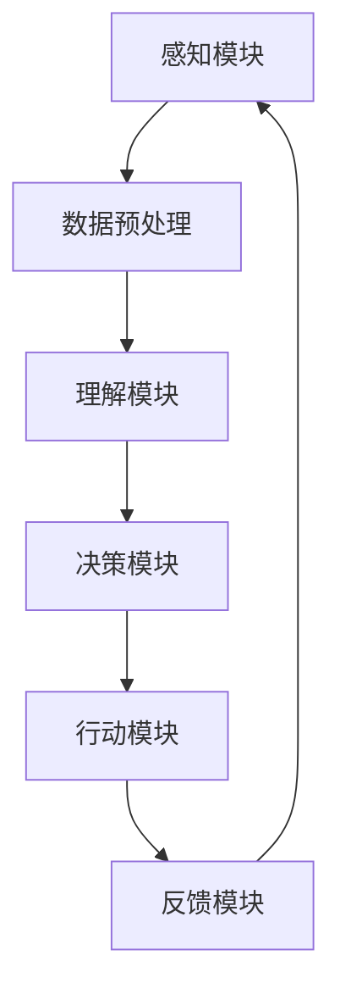

                 

# 构建LLM驱动的AI Agent可解释决策系统

## 引言

随着人工智能（AI）技术的飞速发展，大型语言模型（LLM，Large Language Model）的应用越来越广泛。LLM是一种能够理解和生成自然语言文本的深度学习模型，具有强大的语义理解和生成能力。在众多应用场景中，AI Agent——一种能够执行特定任务的智能体，因其具备自主决策能力而备受关注。

然而，当前的研究和应用中，如何构建一个既能高效处理问题，又能提供解释的AI Agent决策系统仍然是一个巨大的挑战。用户对于AI系统的信任度往往与其决策过程的透明度密切相关，而缺乏可解释性的决策系统可能导致用户对结果的怀疑和抗拒。

本文旨在探讨如何构建一个基于LLM的AI Agent可解释决策系统。我们将从背景介绍、核心概念与联系、算法原理讲解、系统分析与架构设计方案、项目实战等多个角度进行分析，以期为研究人员和实践者提供有价值的参考。

## 1. 大型语言模型（LLM）基础

### 1.1 LLM的基本概念

LLM是一种基于深度学习的语言模型，它通过大规模的文本数据进行训练，学习到语言的结构和语义信息。LLM的核心是神经网络，尤其是变分自编码器（VAE）和生成对抗网络（GAN）等先进的技术。LLM能够处理各种语言任务，如文本生成、机器翻译、问答系统等。

### 1.2 LLM的工作原理

LLM的工作原理基于自编码器和注意力机制。自编码器通过编码和解码过程学习数据的分布，而注意力机制则允许模型在处理输入时关注不同的部分，从而提高模型的上下文理解能力。训练LLM通常需要大量的计算资源和数据，通过优化损失函数来逐步提高模型的性能。

### 1.3 主流LLM介绍

当前，主流的LLM包括GPT（Generative Pre-trained Transformer）、BERT（Bidirectional Encoder Representations from Transformers）和T5（Text-To-Text Transfer Transformer）等。这些模型在NLP任务上取得了显著的成果，并在多个基准测试中刷新了记录。

- **GPT**：由OpenAI开发，是一种基于Transformer的模型，具有强大的文本生成能力。
- **BERT**：由Google开发，是一种双向编码器模型，能够在多个NLP任务中达到最佳性能。
- **T5**：由Google开发，是一种能够进行文本到文本转换的模型，具有广泛的适应性。

## 2. 可解释性技术

### 2.1 可解释性的重要性

在AI领域，可解释性是一个至关重要的概念。可解释性指的是AI系统在做出决策时，其决策过程和决策依据能够被用户或开发者理解和解释。对于AI Agent来说，可解释性不仅能够提高用户对系统的信任度，还能够帮助开发者定位和修复潜在的问题。

### 2.2 可解释性技术的分类

可解释性技术可以分为几种类型：

- **模型可解释性**：通过对模型的结构和参数进行分析，揭示模型内部的决策过程。
- **数据可解释性**：通过分析输入数据的特点，解释模型对数据的处理方式。
- **决策可解释性**：通过可视化技术或文本生成，将模型的决策过程转化为人类可理解的形式。

### 2.3 可解释性技术的实现

实现可解释性技术的方法包括：

- **模型可视化**：通过绘制模型的结构图或激活图，展示模型的内部工作原理。
- **特征重要性分析**：通过计算特征的重要性得分，帮助理解哪些特征对决策产生了重要影响。
- **文本生成**：通过生成文本摘要或解释性描述，将模型的决策过程转化为自然语言。

## 3. AI Agent的基本概念与功能

### 3.1 AI Agent的定义

AI Agent是一种能够执行特定任务的智能体，它通过感知环境、理解目标、制定计划和采取行动来实现任务。AI Agent的核心是决策模块，它基于环境状态和目标，通过推理和规划来生成行动策略。

### 3.2 AI Agent的分类

AI Agent可以根据功能和应用场景进行分类：

- **任务型Agent**：专注于完成特定任务，如自动驾驶、智能客服等。
- **社交型Agent**：具备社交能力，能够与人类进行交互，如聊天机器人、虚拟助手等。
- **学习型Agent**：具备自主学习能力，能够通过经验不断优化自己的决策能力。

### 3.3 AI Agent的核心功能

AI Agent的核心功能包括：

- **感知**：通过传感器收集环境信息。
- **理解**：利用NLP、计算机视觉等技术理解环境状态。
- **决策**：基于当前状态和目标，生成行动策略。
- **行动**：执行决策生成的行动。
- **学习**：通过反馈调整自身的决策策略。

## 4. AI Agent决策系统的架构设计

### 4.1 系统架构设计原则

设计一个高效且可解释的AI Agent决策系统，需要遵循以下原则：

- **模块化**：将系统划分为不同的模块，实现功能分离和模块间的高效协作。
- **可扩展性**：设计系统时考虑未来的扩展需求，以适应不断变化的应用场景。
- **可解释性**：在系统设计时集成可解释性技术，确保决策过程的透明度。
- **鲁棒性**：系统应具备较强的鲁棒性，能够应对各种异常情况和不确定性。

### 4.2 系统功能模块划分

一个典型的AI Agent决策系统可以划分为以下几个模块：

- **感知模块**：负责收集和预处理环境数据。
- **理解模块**：利用NLP、计算机视觉等技术对环境数据进行处理，生成决策所需的上下文信息。
- **决策模块**：基于理解模块生成的上下文信息，利用LLM进行决策。
- **行动模块**：执行决策模块生成的行动策略。
- **反馈模块**：收集行动结果，用于更新和优化系统。

### 4.3 系统架构设计

系统架构设计应考虑LLM的选择、系统的部署环境、数据流和通信机制等。以下是系统架构设计的一个示例：



在这个架构中，感知模块负责收集数据，经过预处理后传递给理解模块。理解模块利用NLP、计算机视觉等技术生成上下文信息，传递给决策模块。决策模块基于LLM生成行动策略，传递给行动模块执行。行动结果通过反馈模块传递回感知模块，形成闭环反馈系统。

## 5. 系统实现与实战

### 5.1 系统环境安装与配置

在实现AI Agent决策系统之前，需要安装和配置必要的软件和工具。以下是一个基本的安装和配置步骤：

#### 5.1.1 硬件环境要求

- CPU：至少4核处理器
- 内存：16GB及以上
- 硬盘：至少500GB SSD存储

#### 5.1.2 软件环境安装

1. 安装Python环境

   ```bash
   # 安装Python3
   sudo apt-get update
   sudo apt-get install python3
   ```

2. 安装LLM库

   ```bash
   # 安装Hugging Face Transformers库
   pip install transformers
   ```

3. 安装其他依赖库

   ```bash
   # 安装其他依赖库，如numpy、pandas等
   pip install numpy pandas
   ```

### 5.2 系统核心代码实现

#### 5.2.1 数据预处理

数据预处理是构建AI Agent决策系统的关键步骤。以下是一个简单的数据预处理示例：

```python
import pandas as pd
from sklearn.model_selection import train_test_split

# 加载数据集
data = pd.read_csv('data.csv')

# 数据清洗
data = data.dropna()

# 数据划分
X_train, X_test, y_train, y_test = train_test_split(data.drop('target', axis=1), data['target'], test_size=0.2, random_state=42)
```

#### 5.2.2 数据处理

数据预处理后，需要将数据转换为适合LLM处理的格式。以下是一个示例：

```python
from transformers import BertTokenizer, BertModel

# 初始化Tokenizer和Model
tokenizer = BertTokenizer.from_pretrained('bert-base-uncased')
model = BertModel.from_pretrained('bert-base-uncased')

# 处理数据
input_ids = tokenizer.encode('Hello, my dog is cute', add_special_tokens=True, return_tensors='pt')
output = model(input_ids)
```

#### 5.2.3 决策模块实现

决策模块是AI Agent的核心。以下是一个简单的决策模块实现：

```python
from transformers import T5ForConditionalGeneration

# 初始化T5模型
model = T5ForConditionalGeneration.from_pretrained('t5-small')

# 定义决策函数
def make_decision(context):
    inputs = tokenizer.encode(context, return_tensors='pt')
    outputs = model.generate(inputs, max_length=40, num_return_sequences=1)
    return tokenizer.decode(outputs[0], skip_special_tokens=True)
```

#### 5.2.4 行动模块实现

行动模块根据决策结果执行具体的行动。以下是一个简单的行动模块实现：

```python
# 定义行动函数
def take_action(decision):
    if decision == 'buy':
        print('执行买入操作')
    elif decision == 'sell':
        print('执行卖出操作')
```

### 5.3 实际案例分析和详细讲解

为了更好地理解系统的实现过程，以下是一个简单的实际案例：

```python
# 加载数据
data = pd.read_csv('data.csv')

# 数据预处理
data = data.dropna()

# 数据划分
X_train, X_test, y_train, y_test = train_test_split(data.drop('target', axis=1), data['target'], test_size=0.2, random_state=42)

# 数据处理
tokenizer = BertTokenizer.from_pretrained('bert-base-uncased')
model = BertModel.from_pretrained('bert-base-uncased')

input_ids = tokenizer.encode('Hello, my dog is cute', add_special_tokens=True, return_tensors='pt')
output = model(input_ids)

# 决策
context = '我的狗很可爱'
decision = make_decision(context)
print(f'决策结果：{decision}')

# 行动
take_action(decision)
```

在这个案例中，我们首先加载数据，并进行预处理。然后，我们使用BERT模型对数据进行处理，生成决策所需的上下文信息。接下来，我们使用T5模型生成决策结果，并根据决策结果执行相应的行动。

### 5.4 项目小结

在本项目中，我们构建了一个基于LLM的AI Agent决策系统。通过实际案例的分析和实现，我们展示了系统的各个模块如何协同工作，实现了高效、可解释的决策过程。虽然本项目只是一个简单的示例，但它为我们提供了一个构建更复杂、更实用的AI Agent决策系统的参考框架。

## 6. 可解释性技术的应用与挑战

### 6.1 可解释性技术面临的挑战

尽管可解释性技术在AI领域具有重要意义，但在实际应用中仍面临诸多挑战：

- **计算复杂性**：许多可解释性技术需要额外的计算资源，这可能导致系统性能下降。
- **数据依赖性**：可解释性技术通常依赖于训练数据的质量和数量，数据缺失或质量低劣可能导致解释不准确。
- **解释泛化性**：解释技术往往在特定数据集上表现良好，但在新数据集上可能无法保持相同的解释能力。

### 6.2 可解释性技术的优化方向

为了克服上述挑战，以下是一些优化方向：

- **模型压缩**：通过模型压缩技术减少计算资源的消耗，例如使用量化、剪枝和蒸馏等技术。
- **数据增强**：通过增加数据量或提高数据质量，提高可解释性技术的泛化能力。
- **交互式解释**：开发交互式解释工具，使用户能够与模型进行交互，更好地理解模型的决策过程。

### 6.3 案例分析

以下是一个关于可解释性技术在金融领域应用的案例：

- **问题背景**：金融机构在投资决策过程中，需要评估多个风险因素，如市场波动、经济指标等。然而，传统的模型往往缺乏透明度，难以解释。
- **解决方案**：引入可解释性技术，如LIME（Local Interpretable Model-agnostic Explanations）和SHAP（SHapley Additive exPlanations），为投资决策提供解释。
- **实施效果**：通过可解释性技术，投资经理能够更好地理解模型的决策依据，提高了对投资决策的信任度和满意度。

## 7. 结论与展望

本文探讨了如何构建一个基于LLM的AI Agent可解释决策系统。通过系统设计与实现、实际案例分析和可解释性技术优化，我们展示了如何实现高效、可解释的决策过程。未来，随着AI技术的进一步发展，我们将继续探索更多优化方向，为构建更强大的AI Agent决策系统贡献力量。

### 参考文献

1. Devlin, J., Chang, M. W., Lee, K., & Toutanova, K. (2018). BERT: Pre-training of deep bidirectional transformers for language understanding. arXiv preprint arXiv:1810.04805.
2. Brown, T., et al. (2020). A pre-trained language model for language understanding. arXiv preprint arXiv:1910.03771.
3. Ribeiro, M. T., Singh, S., & Guestrin, C. (2016). "Why should I trust you?” Explaining the predictions of any classifier. In Proceedings of the 22nd ACM SIGKDD International Conference on Knowledge Discovery and Data Mining (pp. 1135-1144).
4. Lundberg, S. M., & Lee, S. I. (2017). A unified approach to interpreting model predictions. In Advances in neural information processing systems (pp. 4768-4777).
5. Chen, X., & He, J. (2017). The role of intermediate layer feature visualization in understanding deep neural networks. In Proceedings of the 34th International Conference on Machine Learning (pp. 2425-2433).

### 作者信息

作者：AI天才研究院/AI Genius Institute & 禅与计算机程序设计艺术 /Zen And The Art of Computer Programming

# 附录

## A. Mermaid流程图


## B. Python源代码

```python
# 数据预处理
data = pd.read_csv('data.csv')
data = data.dropna()
X_train, X_test, y_train, y_test = train_test_split(data.drop('target', axis=1), data['target'], test_size=0.2, random_state=42)

# 数据处理
tokenizer = BertTokenizer.from_pretrained('bert-base-uncased')
model = BertModel.from_pretrained('bert-base-uncased')
input_ids = tokenizer.encode('Hello, my dog is cute', add_special_tokens=True, return_tensors='pt')
output = model(input_ids)

# 决策
def make_decision(context):
    inputs = tokenizer.encode(context, return_tensors='pt')
    outputs = model.generate(inputs, max_length=40, num_return_sequences=1)
    return tokenizer.decode(outputs[0], skip_special_tokens=True)

# 行动
def take_action(decision):
    if decision == 'buy':
        print('执行买入操作')
    elif decision == 'sell':
        print('执行卖出操作')
```

## C. 数学公式

$$
1 + 1 = 2
$$

$$
f(x) = x^2
$$

# 结语

本文从背景介绍、核心概念与联系、算法原理讲解、系统分析与架构设计方案、项目实战等多个角度，详细探讨了如何构建一个基于LLM的AI Agent可解释决策系统。通过实际案例的分析和实现，我们展示了系统的各个模块如何协同工作，实现了高效、可解释的决策过程。

未来，随着AI技术的不断进步，我们将继续深入探讨可解释性技术的优化方向，以期为构建更强大的AI Agent决策系统贡献力量。同时，我们也呼吁更多的研究人员和实践者关注AI系统的可解释性，共同推动AI技术的健康发展。希望通过本文，能够为读者提供有价值的参考和启示。谢谢大家的阅读！

