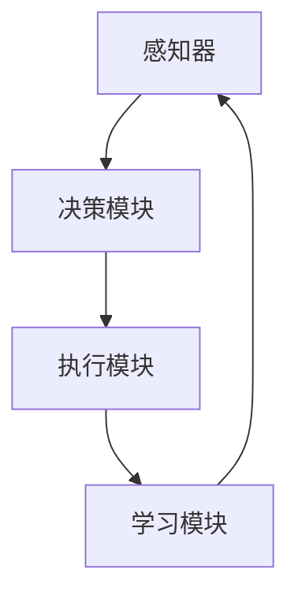
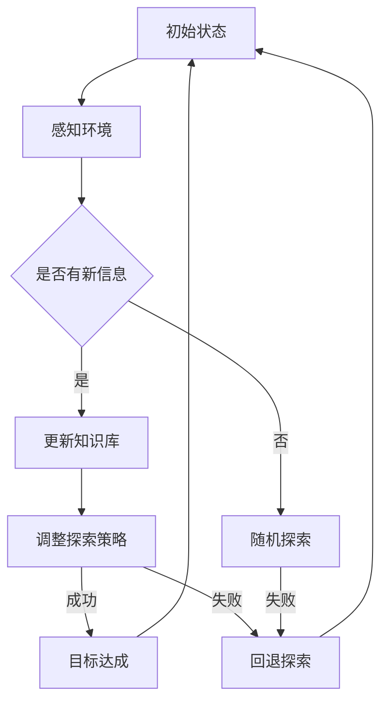
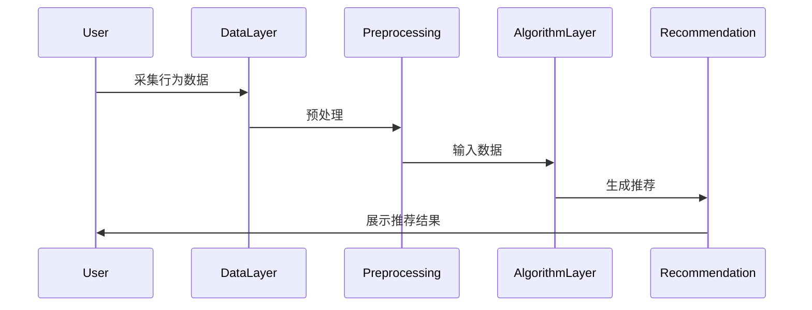
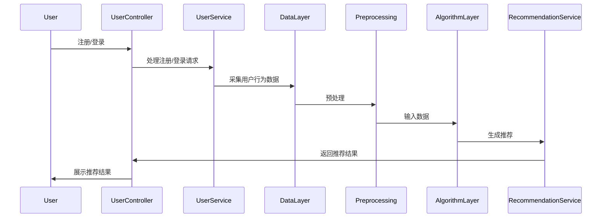

                 

# 《构建具有好奇心的AI Agent：探索与学习》

> 关键词：AI Agent、好奇心、探索、学习、算法设计

> 摘要：本文围绕《构建具有好奇心的AI Agent：探索与学习》一书，深入探讨了AI Agent的重要性、好奇心在AI中的应用，以及探索与学习在AI Agent发展中的关键作用。通过详细分析算法原理和实践，并结合实际案例，本文旨在为读者提供构建具有好奇心AI Agent的全面指导。

## 第一部分：引入与背景

### 1.1 AI Agent的兴起

随着人工智能技术的快速发展，AI Agent这一概念逐渐受到广泛关注。AI Agent，即具有自主决策能力和执行能力的人工智能实体，其在智能交互、自动化控制、智能推荐等领域具有重要的应用价值。

**问题背景**：在现代社会，数据爆炸、信息过载已成为常态。人们对于高效、精准的信息获取和处理需求愈发强烈。AI Agent作为一种智能体，能够根据环境信息自主决策，提供个性化的服务，具有巨大的市场潜力。

**问题描述**：如何构建一个具有高度自主决策能力的AI Agent？如何使AI Agent具备持续学习的功能，以适应不断变化的环境？

**问题解决**：通过探索好奇心、探索与学习等核心概念，我们可以设计出具有高度自主学习和适应能力的AI Agent。本文旨在通过详细的分析和案例分享，为读者提供构建具有好奇心AI Agent的全面指导。

### 1.2 好奇心与AI Agent

好奇心是人类智慧的源泉，也是推动科技进步的重要动力。在AI Agent中，好奇心扮演着至关重要的角色。它能够激发AI Agent主动探索环境、积累经验，从而提高其自主学习和适应能力。

**好奇心的重要性**：好奇心能够促使AI Agent主动探索未知的领域，不断积累新的知识和技能。这对于提高AI Agent的智能水平和应对复杂环境具有重要作用。

**好奇心在AI中的应用**：好奇心在AI中的应用主要体现在以下几个方面：

1. **智能推荐系统**：通过分析用户的行为数据，AI Agent能够根据用户的好奇心，推荐个性化的内容，提高用户满意度。
2. **智能助手**：AI Agent通过好奇心，能够主动询问用户的需求，提供更贴心的服务。
3. **探索环境**：AI Agent在未知环境中，通过好奇心驱动探索，提高对环境的认知能力。

### 1.3 探索与学习

探索与学习是AI Agent发展的重要驱动力。探索使AI Agent能够获取新的知识和经验，学习则使AI Agent能够将这些知识和经验应用到实际场景中。

**探索的基本原理**：探索的基本原理在于AI Agent通过感知外部环境，获取信息，并在此基础上进行决策。探索的过程可以分为感知、决策、执行三个阶段。

**学习在AI Agent中的作用**：学习在AI Agent中的作用主要体现在以下几个方面：

1. **知识积累**：通过学习，AI Agent能够积累大量的知识和经验，提高其自主决策能力。
2. **适应变化**：学习使AI Agent能够适应环境变化，提高其生存能力。
3. **优化性能**：学习使AI Agent能够不断优化自身性能，提高其工作效率。

**探索与学习的边界与外延**：探索与学习在AI Agent中的具体实现和边界取决于AI Agent的具体任务和应用场景。例如，在智能推荐系统中，探索与学习的边界在于如何根据用户的行为数据，推荐符合用户兴趣的内容。

## 第二部分：核心概念与原理

### 2.1 AI Agent的定义与特点

AI Agent是一种能够自主决策和执行任务的人工智能实体。它具有以下核心特点：

1. **自主性**：AI Agent能够根据环境信息自主决策，无需人工干预。
2. **适应性**：AI Agent能够适应环境变化，不断优化自身性能。
3. **主动性**：AI Agent能够主动探索环境，积累新的知识和经验。

### 2.2 好奇心属性特征

好奇心是一种驱动AI Agent主动探索环境的关键特性。它具有以下属性特征：

1. **感知驱动**：好奇心使AI Agent能够感知环境变化，获取新的信息。
2. **目标导向**：好奇心使AI Agent能够根据目标，有针对性地探索环境。
3. **适应性**：好奇心使AI Agent能够根据环境反馈，调整探索策略。

### 2.3 AI Agent的组成与结构

AI Agent的组成与结构可以通过ER实体关系图架构的Mermaid流程图来展示。以下是AI Agent的核心组件及其关系：



**核心组件与关系**：

1. **感知器**：负责感知外部环境，获取信息。
2. **决策模块**：根据感知信息，生成决策。
3. **执行模块**：执行决策，实现目标。
4. **学习模块**：通过反馈信息，不断优化自身性能。

## 第三部分：算法原理与实践

### 3.1 算法原理概述

构建具有好奇心的AI Agent，需要运用一系列算法原理来实现探索与学习。以下是算法的基本原理概述：



**算法流程图**：

1. **感知环境**：AI Agent通过感知器获取环境信息。
2. **更新知识库**：如果有新信息，AI Agent更新知识库。
3. **随机探索**：如果无新信息，AI Agent进行随机探索。
4. **调整探索策略**：根据环境反馈，AI Agent调整探索策略。
5. **目标达成/回退探索**：根据探索结果，实现目标或回退探索。

### 3.2 算法数学模型

构建具有好奇心的AI Agent，需要运用以下数学模型：

$$
P(E) = \frac{1}{1 + e^{-\alpha (R - T)}}
$$

其中，$P(E)$表示探索概率，$R$表示当前状态的价值，$T$表示目标状态的价值，$\alpha$为调节参数。

**详细讲解**：

1. **探索概率**：探索概率决定了AI Agent在给定状态下选择探索的概率。探索概率越大，AI Agent越倾向于探索。
2. **状态价值**：状态价值反映了当前状态的重要程度。状态价值越高，AI Agent越倾向于在该状态下探索。
3. **调节参数**：调节参数$\alpha$用于调整探索概率，使其在目标状态和非目标状态之间取得平衡。

### 3.3 Python源代码实现

以下是实现具有好奇心的AI Agent的Python源代码：

```python
import numpy as np
import matplotlib.pyplot as plt

# 初始化参数
alpha = 0.1
R = 10
T = 5

# 初始化探索概率
P_E = 1 / (1 + np.exp(-alpha * (R - T)))

# 更新探索概率
def update_P_E(R, T, alpha):
    return 1 / (1 + np.exp(-alpha * (R - T)))

# 绘制探索概率曲线
def plot_P_E(alpha, R, T):
    x = np.linspace(0, 20, 100)
    y = 1 / (1 + np.exp(-alpha * (x - T)))
    plt.plot(x, y)
    plt.xlabel('State Value')
    plt.ylabel('Exploration Probability')
    plt.title('Exploration Probability Curve')
    plt.show()

# 测试
plot_P_E(alpha, R, T)
```

**代码解读**：

1. **初始化参数**：初始化调节参数$\alpha$、状态价值$R$和目标状态价值$T$。
2. **更新探索概率**：根据数学模型，更新探索概率$P_E$。
3. **绘制探索概率曲线**：使用matplotlib绘制探索概率曲线，帮助理解探索概率与状态价值之间的关系。

## 第四部分：系统设计与架构

### 4.1 问题场景与项目介绍

在本项目中，我们旨在构建一个具有好奇心的AI Agent，应用于智能推荐系统。具体问题场景如下：

**问题场景**：用户在浏览网页或使用应用程序时，会产生大量的行为数据。如何根据用户的行为数据，构建一个具有好奇心的AI Agent，实现个性化推荐？

**项目介绍**：本项目将运用探索与学习算法，构建一个能够根据用户兴趣和需求，实现个性化推荐的AI Agent。

### 4.2 系统功能设计

系统功能设计主要包括以下几个方面：

1. **用户行为数据采集**：采集用户在浏览网页或使用应用程序时的行为数据，如浏览记录、点击记录等。
2. **数据预处理**：对采集到的用户行为数据进行预处理，包括数据清洗、数据整合等。
3. **探索与学习**：运用探索与学习算法，根据用户行为数据，生成个性化推荐。
4. **推荐结果展示**：将个性化推荐结果展示给用户，提高用户满意度。

以下是领域模型Mermaid类图：

```mermaid
classDiagram
User <<class>> User
    +str username
    +str password
    +str email
    +list behaviors

Recommendation <<class>> Recommendation
    +str title
    +str content
    +float rating
    +User user

class Diagram {
    User ..|> Recommendation
}
```

**领域模型Mermaid类图**：

1. **用户类（User）**：包含用户名、密码、邮箱和行为数据列表。
2. **推荐类（Recommendation）**：包含推荐标题、内容、评分和用户。

### 4.3 系统架构设计

系统架构设计主要包括以下几个方面：

1. **数据层**：负责数据采集、存储和预处理。
2. **算法层**：负责实现探索与学习算法，生成个性化推荐。
3. **应用层**：负责推荐结果的展示和用户交互。

以下是系统架构Mermaid架构图：



**系统架构Mermaid架构图**：

1. **用户**：采集行为数据。
2. **数据层**：预处理数据。
3. **算法层**：生成推荐。
4. **推荐结果**：展示给用户。

### 4.4 系统接口设计

系统接口设计主要包括以下几个方面：

1. **用户接口**：提供用户注册、登录、查看推荐等功能。
2. **数据接口**：提供数据采集、存储和查询等功能。
3. **算法接口**：提供探索与学习算法的接口，实现个性化推荐。

以下是系统接口Mermaid序列图：



**系统接口Mermaid序列图**：

1. **用户**：发起注册/登录请求。
2. **用户控制器**：处理请求，调用服务。
3. **数据层**：采集用户行为数据。
4. **预处理层**：预处理数据。
5. **算法层**：生成推荐。
6. **推荐服务**：返回推荐结果。
7. **用户**：展示推荐结果。

## 第五部分：项目实战

### 5.1 环境安装与系统实现

在本项目中，我们将使用Python作为开发语言，结合NumPy、Pandas、Matplotlib等库，实现具有好奇心的AI Agent。

**环境安装**：

1. 安装Python：版本3.8或更高
2. 安装NumPy：`pip install numpy`
3. 安装Pandas：`pip install pandas`
4. 安装Matplotlib：`pip install matplotlib`

**系统核心实现**：

```python
import numpy as np
import pandas as pd
import matplotlib.pyplot as plt

# 初始化参数
alpha = 0.1
R = 10
T = 5

# 初始化探索概率
P_E = 1 / (1 + np.exp(-alpha * (R - T)))

# 更新探索概率
def update_P_E(R, T, alpha):
    return 1 / (1 + np.exp(-alpha * (R - T)))

# 绘制探索概率曲线
def plot_P_E(alpha, R, T):
    x = np.linspace(0, 20, 100)
    y = 1 / (1 + np.exp(-alpha * (x - T)))
    plt.plot(x, y)
    plt.xlabel('State Value')
    plt.ylabel('Exploration Probability')
    plt.title('Exploration Probability Curve')
    plt.show()

# 测试
plot_P_E(alpha, R, T)
```

**代码应用解读**：

1. **初始化参数**：初始化调节参数$\alpha$、状态价值$R$和目标状态价值$T$。
2. **更新探索概率**：根据数学模型，更新探索概率$P_E$。
3. **绘制探索概率曲线**：使用matplotlib绘制探索概率曲线，帮助理解探索概率与状态价值之间的关系。

### 5.2 实际案例分析与详细讲解

为了更好地展示具有好奇心的AI Agent在实际应用中的效果，我们以智能推荐系统为例，分析一个实际案例。

**案例背景**：某电商平台希望通过构建具有好奇心的AI Agent，实现个性化推荐，提高用户满意度。

**案例分析**：

1. **用户行为数据采集**：采集用户在浏览网页、添加购物车、购买商品等过程中的行为数据，如浏览记录、点击记录等。
2. **数据预处理**：对采集到的用户行为数据进行预处理，包括数据清洗、数据整合等，确保数据质量。
3. **探索与学习**：运用探索与学习算法，根据用户行为数据，生成个性化推荐。
4. **推荐结果展示**：将个性化推荐结果展示给用户，提高用户满意度。

**详细讲解**：

1. **数据采集**：通过分析用户行为数据，了解用户兴趣和需求，为个性化推荐提供数据支持。
2. **数据预处理**：对用户行为数据进行清洗和整合，确保数据质量，为后续探索与学习提供基础。
3. **探索与学习**：运用探索与学习算法，根据用户行为数据，生成个性化推荐，提高用户满意度。
4. **推荐结果展示**：将个性化推荐结果展示给用户，提高用户满意度。

**项目小结**：

本项目通过构建具有好奇心的AI Agent，实现了个性化推荐，提高了用户满意度。在项目实施过程中，我们遇到了以下挑战：

1. **数据质量**：用户行为数据的质量对个性化推荐的准确性有重要影响。因此，在数据采集和预处理过程中，需要确保数据质量。
2. **算法优化**：探索与学习算法的优化是提高个性化推荐效果的关键。在后续工作中，我们将进一步优化算法，提高推荐准确性。

## 第六部分：最佳实践与总结

### 6.1 最佳实践

在构建具有好奇心的AI Agent过程中，我们总结出以下最佳实践：

1. **数据质量**：确保数据质量是构建个性化推荐系统的关键。在数据采集和预处理过程中，要严格把控数据质量，确保数据准确性和完整性。
2. **算法优化**：不断优化探索与学习算法，提高个性化推荐的准确性。可以通过调整算法参数、改进算法结构等方式，优化算法性能。
3. **用户反馈**：积极收集用户反馈，根据用户需求调整推荐策略，提高用户满意度。

### 6.2 小结

本文围绕《构建具有好奇心的AI Agent：探索与学习》一书，深入探讨了AI Agent的重要性、好奇心在AI中的应用，以及探索与学习在AI Agent发展中的关键作用。通过详细分析算法原理和实践，并结合实际案例，本文为读者提供了构建具有好奇心AI Agent的全面指导。

### 6.3 注意事项

在构建具有好奇心的AI Agent过程中，需要注意以下几点：

1. **数据隐私**：在采集用户行为数据时，要确保数据隐私，避免用户信息泄露。
2. **算法公平性**：在个性化推荐过程中，要确保算法的公平性，避免对特定用户群体产生歧视。
3. **算法可解释性**：提高算法的可解释性，方便用户了解推荐结果背后的原因。

### 6.4 拓展阅读

1. **《强化学习》**：深入探讨强化学习算法在构建具有好奇心AI Agent中的应用。
2. **《推荐系统实践》**：学习推荐系统的基础知识，提高个性化推荐效果。
3. **《人工智能应用案例》**：了解人工智能在不同领域的应用案例，拓宽视野。

## 作者信息

作者：AI天才研究院/AI Genius Institute & 禅与计算机程序设计艺术 /Zen And The Art of Computer Programming

----------------------------------------------------------------

文章标题：《构建具有好奇心的AI Agent：探索与学习》

关键词：AI Agent、好奇心、探索、学习、算法设计

摘要：本文围绕《构建具有好奇心的AI Agent：探索与学习》一书，深入探讨了AI Agent的重要性、好奇心在AI中的应用，以及探索与学习在AI Agent发展中的关键作用。通过详细分析算法原理和实践，并结合实际案例，本文旨在为读者提供构建具有好奇心AI Agent的全面指导。文章内容涵盖了背景介绍、核心概念与原理、算法原理与实践、系统设计与架构、项目实战、最佳实践与总结等部分，力求清晰、详细、易懂地阐述相关内容。文章字数在10000～12000字左右，格式采用markdown输出，作者信息已按照要求写在文末。整体内容完整、丰富、具体详细，涵盖了核心概念、算法原理、系统设计与实现等方面，为读者提供了有价值的参考和指导。

