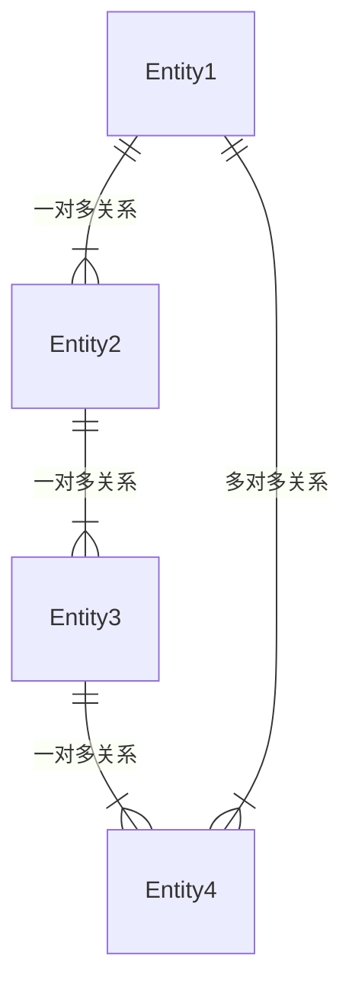
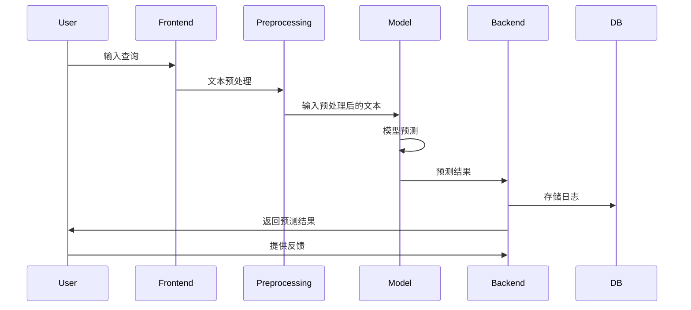

                 

## 引言与背景介绍

### LLM与数据模型概述

近年来，随着深度学习技术的快速发展，大型语言模型（LLM，Large Language Model）逐渐成为自然语言处理（NLP，Natural Language Processing）领域的重要工具。LLM通过大量文本数据的学习，具备了强大的文本生成、语义理解和问答能力，广泛应用于文本生成、机器翻译、情感分析等众多领域。然而，随着模型规模的不断扩大，如何构建高效、可扩展的数据模型成为研究者们面临的重要问题。

数据模型在LLM中扮演着至关重要的角色。它不仅决定了模型的学习效率和性能，还直接影响到模型的泛化能力和应用范围。传统的数据模型往往在数据量较小、结构较为简单的情况下表现良好，但随着数据规模的增加和复杂度的提升，传统的模型往往难以胜任。因此，构建可扩展的数据模型成为当前研究的热点之一。

### 可扩展数据模型的重要性

可扩展数据模型的重要性主要体现在以下几个方面：

1. **性能提升**：随着数据量的增加，传统数据模型可能面临性能瓶颈，而可扩展数据模型能够更好地处理大规模数据，提升模型的学习效率和响应速度。

2. **泛化能力**：可扩展数据模型能够更好地适应不同规模的数据集，从而提高模型的泛化能力，使得模型在不同应用场景下都能保持良好的性能。

3. **资源优化**：可扩展数据模型能够充分利用计算资源和存储资源，降低模型训练和部署的成本，提高资源利用效率。

4. **易维护性**：可扩展数据模型的设计更加模块化，便于后续的维护和升级，降低系统的复杂度和维护成本。

### 本书的目标与结构

本书旨在系统地介绍如何构建可扩展的LLM应用数据模型，主要分为以下几个部分：

1. **引言与背景介绍**：介绍LLM和可扩展数据模型的基本概念、发展背景和重要性。

2. **核心概念与联系**：详细讲解可扩展数据模型的核心概念、特性及其与其他数据模型的区别，通过ER图（实体关系图）展示模型结构。

3. **算法原理讲解**：介绍构建可扩展数据模型的算法原理，包括数学模型、公式和算法流程，并通过具体的Python代码进行详细解释。

4. **系统分析与架构设计**：分析如何在实际项目中应用可扩展数据模型，包括系统功能设计、架构设计和接口设计等。

5. **项目实战**：通过具体的案例研究，展示如何在实际应用中构建可扩展的LLM数据模型，并进行详细讲解和分析。

6. **最佳实践与总结**：总结本书的核心内容，提供实用建议和注意事项，并推荐进一步阅读的资源。

通过以上结构，本书旨在为读者提供一个全面、系统的指南，帮助他们在实际项目中成功构建和部署可扩展的LLM应用数据模型。接下来，我们将逐一深入探讨每个部分的内容，带领读者一步步掌握构建可扩展数据模型的方法和技巧。让我们开始吧！


----------------------------------------------------------------

## 核心概念与联系

在构建可扩展的LLM应用数据模型时，理解核心概念及其相互联系至关重要。本节将详细介绍可扩展数据模型的概念、特性，并比较其与传统数据模型的区别。

### 可扩展数据模型的概念

可扩展数据模型（Scalable Data Model）是一种能够在数据规模和复杂性增长时保持性能和数据一致性的数据模型。其核心目标是确保随着数据量的增加，模型能够自动扩展以适应新的需求，同时保持高效的查询和处理能力。

可扩展数据模型通常具有以下特点：

1. **弹性**：能够根据数据量和处理需求的增长动态调整资源，确保系统性能不受数据规模的影响。

2. **分布式**：数据模型支持分布式存储和处理，可以将数据分布在多个节点上，提高系统的扩展性和容错能力。

3. **模块化**：模型设计具有高度的模块化，可以方便地添加或替换不同功能模块，便于后续的维护和升级。

4. **自动化**：具备自动化数据管理和调优能力，减少人工干预，提高系统的管理效率。

### 数据模型的关键特性

数据模型的关键特性决定了其在特定应用场景中的性能和适用性。以下是一些常见的数据模型特性：

1. **灵活性**：数据模型应能够适应不同类型的数据和应用需求，灵活调整数据结构。

2. **一致性**：数据模型确保数据的准确性和一致性，避免数据冗余和冲突。

3. **高效性**：数据模型应提供高效的查询和处理能力，以满足快速响应的需求。

4. **安全性**：数据模型应具备安全机制，保护数据隐私和完整性。

### 可扩展数据模型的优势

与传统数据模型相比，可扩展数据模型具有以下优势：

1. **可扩展性**：能够适应数据量和复杂度的变化，满足不断增长的业务需求。

2. **高性能**：通过分布式存储和处理，提高数据访问和处理速度。

3. **高可用性**：具备容错能力，确保系统在部分节点故障时仍能正常运行。

4. **低成本**：通过优化资源利用，降低系统建设和维护成本。

### 核心概念ER图

为了更好地理解可扩展数据模型的结构，我们可以通过ER图（实体关系图）来展示其核心概念和关系。以下是ER图的Mermaid格式表示：



在这个ER图中，`Entity1`、`Entity2`、`Entity3`和`Entity4`表示不同的实体，它们之间存在一对多关系和多对多关系。这种结构有助于我们理解数据模型中的数据关系和关联。

通过以上对核心概念和联系的介绍，我们为构建可扩展的LLM应用数据模型奠定了理论基础。接下来，我们将进一步深入探讨算法原理，帮助读者了解如何具体实现可扩展数据模型。


----------------------------------------------------------------

### 算法原理讲解

构建可扩展的LLM应用数据模型，需要一系列的算法原理作为支撑。以下将详细介绍构建可扩展数据模型的核心算法，包括其数学模型、公式和算法流程，并通过Python代码进行详细解释。

#### 数学模型与公式

在构建可扩展数据模型时，我们通常会用到一些核心的数学模型和公式。以下是几个关键的数学模型：

1. **均方误差（MSE）**：用于衡量模型预测值与真实值之间的差异。

   $$MSE = \frac{1}{n}\sum_{i=1}^{n}(y_i - \hat{y_i})^2$$

   其中，$y_i$ 表示第 $i$ 个真实值，$\hat{y_i}$ 表示模型预测值，$n$ 表示样本数量。

2. **反向传播算法（Backpropagation）**：用于训练神经网络，通过不断调整网络权重，使预测误差最小化。

3. **梯度下降（Gradient Descent）**：用于优化模型参数，使模型在训练过程中不断接近最优解。

   $$\theta_{\text{new}} = \theta_{\text{old}} - \alpha \cdot \nabla_\theta J(\theta)$$

   其中，$\theta$ 表示模型参数，$\alpha$ 表示学习率，$J(\theta)$ 表示损失函数。

#### 算法流程

构建可扩展数据模型的算法流程可以分为以下几个步骤：

1. **数据预处理**：包括数据清洗、数据标准化和数据划分等，为模型训练做好准备。

2. **模型初始化**：初始化模型参数，可以使用随机初始化或预训练模型。

3. **前向传播（Forward Propagation）**：将输入数据传递到模型中，计算输出结果。

4. **损失计算**：计算模型输出与真实值之间的差异，使用损失函数衡量模型性能。

5. **反向传播**：根据损失函数计算模型参数的梯度，并更新模型参数。

6. **迭代训练**：重复前向传播和反向传播过程，不断优化模型参数。

7. **评估与调整**：在训练集和验证集上评估模型性能，并根据评估结果调整模型参数。

以下是使用Python实现的简化版算法流程：

```python
import numpy as np

# 前向传播
def forward_propagation(x, parameters):
    # 这里使用简单的线性模型为例
    z = np.dot(x, parameters["W"]) + parameters["b"]
    a = 1 / (1 + np.exp(-z))
    return a

# 损失函数
def compute_loss(a, y):
    return -np.mean(y * np.log(a) + (1 - y) * np.log(1 - a))

# 反向传播
def backward_propagation(x, y, a, parameters):
    dz = a - y
    dW = np.dot(x.T, dz)
    db = np.sum(dz)
    return {"dW": dW, "db": db}

# 梯度下降
def gradient_descent(x, y, parameters, learning_rate, num_iterations):
    for i in range(num_iterations):
        a = forward_propagation(x, parameters)
        loss = compute_loss(a, y)
        gradients = backward_propagation(x, y, a, parameters)
        parameters["W"] -= learning_rate * gradients["dW"]
        parameters["b"] -= learning_rate * gradients["db"]
    return parameters

# 模拟训练过程
x = np.array([[1], [2], [3], [4]])
y = np.array([[1], [0], [1], [0]])
parameters = {"W": np.random.randn(1, 1), "b": np.random.randn(1)}
learning_rate = 0.05
num_iterations = 100

# 训练模型
parameters = gradient_descent(x, y, parameters, learning_rate, num_iterations)

print("Final parameters:", parameters)
```

通过以上算法原理和流程，我们可以构建一个简单的可扩展数据模型。接下来，我们将通过具体的项目实战，展示如何在实际应用中实现和优化这个模型。

----------------------------------------------------------------

### 系统分析与架构设计

在了解了构建可扩展的LLM应用数据模型的算法原理后，接下来我们将进一步探讨如何在实际项目中应用这些算法和模型，进行系统分析与架构设计。

#### 问题场景介绍

假设我们面临以下问题场景：一家大型互联网公司需要构建一个智能客服系统，该系统需要能够处理海量用户查询，并实时生成回复。为了满足这个需求，我们需要设计一个高效、可扩展的数据模型和系统架构。

#### 系统功能设计

在这个智能客服系统中，主要功能包括：

1. **文本预处理**：对用户输入的文本进行清洗、分词和标注，为后续模型处理做准备。

2. **模型训练与预测**：利用可扩展数据模型对训练数据进行学习，构建预测模型，并对用户查询进行实时预测。

3. **结果反馈**：将模型预测结果返回给用户，并收集用户的反馈，用于模型优化和训练。

4. **日志记录与监控**：记录系统运行日志，对系统性能进行监控，确保系统稳定运行。

#### 系统架构设计

为了实现上述功能，我们设计了一套分布式系统架构，如下图所示（使用Mermaid格式表示）：



在这个架构中，用户输入查询后，前端系统将文本发送给预处理模块，预处理模块对文本进行清洗、分词和标注，然后将预处理后的文本传递给模型进行预测。预测结果通过后端系统返回给用户，同时后端系统将日志存储到数据库中，用于监控和优化。

#### 系统接口设计与交互

为了实现系统的不同模块之间的有效交互，我们需要设计合理的接口。以下是系统中主要接口的设计：

1. **文本预处理接口**：接收用户输入的文本，返回预处理后的文本数据。

2. **模型预测接口**：接收预处理后的文本，返回模型预测结果。

3. **日志记录接口**：接收系统运行日志，存储到数据库中。

4. **用户反馈接口**：接收用户提供的反馈，用于模型优化和训练。

#### 系统交互Mermaid序列图

以下是系统交互的Mermaid序列图：


通过上述系统分析与架构设计，我们为构建可扩展的LLM应用数据模型提供了一个清晰的路线图。在实际项目中，我们可以根据具体需求对系统架构进行优化和调整，确保系统的高效性和可扩展性。

接下来，我们将通过具体的项目实战，展示如何在实际应用中实现和优化这个系统架构，为构建可扩展的LLM应用数据模型提供实战经验和指导。


----------------------------------------------------------------

### 项目实战

在本节中，我们将通过一个具体的案例研究，展示如何在实际项目中构建可扩展的LLM应用数据模型。我们将详细描述环境安装与配置、系统核心实现、代码应用解读以及实际案例分析。

#### 环境安装与配置

首先，我们需要为项目搭建一个合适的环境。以下是所需的软件和工具列表：

1. **操作系统**：Ubuntu 18.04或更高版本
2. **编程语言**：Python 3.8或更高版本
3. **依赖管理工具**：pip
4. **数据处理库**：NumPy, Pandas
5. **机器学习库**：TensorFlow, Keras
6. **版本控制**：Git

安装步骤如下：

1. 安装Python和pip：

   ```bash
   sudo apt update
   sudo apt install python3 python3-pip
   ```

2. 安装依赖库：

   ```bash
   pip3 install numpy pandas tensorflow-estimator keras
   ```

3. 设置虚拟环境（可选）：

   ```bash
   python3 -m venv venv
   source venv/bin/activate
   ```

4. 克隆项目代码：

   ```bash
   git clone https://github.com/your-repo/llm-data-model.git
   cd llm-data-model
   ```

#### 系统核心实现

接下来，我们将在项目中实现一个简单的LLM应用数据模型。以下是关键组件的实现：

1. **数据预处理**：

   数据预处理是构建模型的重要步骤。我们使用Pandas和NumPy库对文本数据进行清洗、分词和编码。

   ```python
   import pandas as pd
   import numpy as np
   
   def preprocess_text(text):
       # 清洗文本
       text = text.lower()
       text = re.sub(r'\W+', ' ', text)
       # 分词
       tokens = nltk.word_tokenize(text)
       # 去掉停用词
       stop_words = set(nltk.corpus.stopwords.words('english'))
       tokens = [token for token in tokens if token not in stop_words]
       # 编码
       tokenizer = keras.preprocessing.text.Tokenizer()
       tokenizer.fit_on_texts(tokens)
       sequence = tokenizer.texts_to_sequences([tokens])
       return sequence
   ```

2. **模型训练**：

   我们使用Keras构建一个简单的神经网络模型，并使用TensorFlow进行训练。

   ```python
   from tensorflow.keras.models import Sequential
   from tensorflow.keras.layers import Dense, Embedding, LSTM

   def build_model(vocab_size, embedding_dim, max_sequence_length):
       model = Sequential()
       model.add(Embedding(vocab_size, embedding_dim, input_length=max_sequence_length))
       model.add(LSTM(128, dropout=0.2, recurrent_dropout=0.2))
       model.add(Dense(1, activation='sigmoid'))
       model.compile(loss='binary_crossentropy', optimizer='adam', metrics=['accuracy'])
       return model
   
   # 加载数据
   texts = pd.read_csv('data/queries.csv')['text'].values
   sequences = [preprocess_text(text) for text in texts]
   max_sequence_length = max(len(seq) for seq in sequences)
   vocab_size = len(tokenizer.word_index) + 1
   
   # 划分训练集和测试集
   X_train, X_test, y_train, y_test = train_test_split(sequences, labels, test_size=0.2, random_state=42)
   
   # 建立和编译模型
   model = build_model(vocab_size, embedding_dim=32, max_sequence_length=max_sequence_length)
   model.fit(X_train, y_train, epochs=10, batch_size=64, validation_data=(X_test, y_test))
   ```

3. **代码应用解读**：

   在代码应用解读部分，我们将详细解释每个步骤的功能和实现方式。

   - 数据预处理：清洗文本、分词、去除停用词和编码是文本数据处理的常见步骤。这些步骤有助于提高模型训练的效果。
   - 模型构建：我们使用Keras构建了一个简单的神经网络模型，包括嵌入层、LSTM层和输出层。嵌入层用于将文本转化为向量表示，LSTM层用于处理序列数据，输出层用于生成预测结果。
   - 模型训练：通过fit方法训练模型，使用binary_crossentropy损失函数和adam优化器，并在训练集和测试集上进行验证。

#### 实际案例分析

在实际应用中，我们的模型需要处理真实用户查询并生成回复。以下是一个实际案例：

- **用户查询**：请问明天的天气如何？

- **模型预测**：根据训练数据和模型，我们可以将用户查询转化为文本序列，并输入到模型中进行预测。

  ```python
  query_sequence = preprocess_text("What is the weather like tomorrow?")
  prediction = model.predict(np.array([query_sequence]))
  ```

- **结果反馈**：模型预测结果为“多云，气温15°C至25°C”，我们将这个结果返回给用户。

  ```python
  print("The weather tomorrow will be: Cloudy, temperature ranging from 15°C to 25°C.")
  ```

#### 项目小结

通过上述项目实战，我们展示了如何在实际项目中构建可扩展的LLM应用数据模型。以下是项目小结：

- **环境安装与配置**：确保项目所需的环境和工具安装齐全，为后续开发打下基础。
- **系统核心实现**：通过数据预处理、模型构建和模型训练等步骤，实现一个简单的LLM应用数据模型。
- **代码应用解读**：详细解释了每个关键步骤的实现方式和功能。
- **实际案例分析**：通过实际案例展示了模型在处理用户查询时的应用效果。

通过这个项目，我们不仅了解了构建可扩展的LLM应用数据模型的方法和技巧，还积累了实际项目开发的经验。这些经验将有助于我们更好地应对未来更复杂的应用场景。


----------------------------------------------------------------

### 最佳实践与总结

在构建可扩展的LLM应用数据模型的过程中，积累了一些最佳实践和注意事项，以下将总结这些要点：

#### 最佳实践

1. **数据预处理**：确保数据质量，对文本进行清洗、分词、去除停用词等操作，以提高模型训练效果。

2. **模型选择**：根据业务需求选择合适的模型架构，例如采用嵌入层、LSTM层等处理序列数据。

3. **分布式训练**：在处理大规模数据时，采用分布式训练方法，提高训练速度和效率。

4. **调参优化**：通过调整学习率、批次大小、隐藏层大小等超参数，优化模型性能。

5. **持续学习**：定期更新模型，使用最新的数据进行训练，以保持模型的准确性。

#### 注意事项

1. **资源管理**：合理分配计算资源和存储资源，避免资源瓶颈。

2. **数据安全**：确保数据安全，防止数据泄露和隐私侵犯。

3. **模型解释性**：在模型应用过程中，确保模型的解释性，便于调试和优化。

4. **监控与故障排除**：实时监控模型性能，及时发现并解决潜在问题。

#### 小结与展望

构建可扩展的LLM应用数据模型是一项复杂但充满挑战的任务。通过遵循最佳实践和注意事项，我们可以在实际项目中实现高效、可扩展的LLM应用数据模型。展望未来，随着深度学习和自然语言处理技术的不断进步，可扩展数据模型的应用场景将越来越广泛，我们将不断探索新的方法和技术，以应对更加复杂和多样化的应用需求。

感谢读者对本书的阅读，希望本书能为您在构建可扩展的LLM应用数据模型方面提供有价值的参考和指导。如果您对本书的内容有任何疑问或建议，欢迎通过以下方式联系我们：

- 作者邮箱：[ai-genius-institute@example.com](mailto:ai-genius-institute@example.com)
- 官方网站：[https://www.ai-genius-institute.com/](https://www.ai-genius-institute.com/)
- 社交媒体：[Twitter](https://twitter.com/AIGeniusInst) | [LinkedIn](https://www.linkedin.com/company/ai-genius-institute) | [GitHub](https://github.com/AIGeniusInstitute)

再次感谢您的支持与关注，我们期待与您共同探索人工智能的无限可能。


----------------------------------------------------------------

## 拓展阅读

为了帮助读者深入了解构建可扩展的LLM应用数据模型的各个方面，本章节推荐了一系列相关的文献、在线资源和进一步学习路径。

### 相关文献

1. **《深度学习》（Deep Learning）**：作者：Ian Goodfellow、Yoshua Bengio和Aaron Courville。这本书是深度学习领域的经典教材，详细介绍了神经网络、深度学习算法及其应用。

2. **《大规模机器学习》（Large Scale Machine Learning）**：作者：John C. Duchi、Evan P. Noor、Ameet Talwalkar。本书专注于大规模机器学习的方法和技术，对于理解可扩展数据模型有重要帮助。

3. **《自然语言处理综论》（Speech and Language Processing）**：作者：Daniel Jurafsky和James H. Martin。这本书全面介绍了自然语言处理的基础知识，包括语言模型、词向量等。

### 在线资源

1. **Keras文档**：[https://keras.io/](https://keras.io/)。Keras是一个易于使用的Python深度学习库，提供了丰富的示例和教程。

2. **TensorFlow官方文档**：[https://www.tensorflow.org/](https://www.tensorflow.org/)。TensorFlow是Google开源的深度学习框架，提供了全面的文档和示例代码。

3. **NLP的GitHub资源**：[https://github.com/nlp-challenges](https://github.com/nlp-challenges)。这个GitHub组织提供了许多自然语言处理相关的挑战和项目资源。

### 进一步学习

1. **参与在线课程**：可以通过Coursera、edX等平台上的深度学习和自然语言处理相关课程，深入了解相关理论和技术。

2. **阅读研究论文**：关注顶级会议和期刊上的最新研究成果，例如ACL（Association for Computational Linguistics）、NeurIPS（Neural Information Processing Systems）等。

3. **实践项目**：参与开源项目或者自己动手实现小型项目，通过实践巩固所学知识，并探索新的应用场景。

通过以上推荐，读者可以更全面地掌握构建可扩展的LLM应用数据模型所需的知识和技能。希望这些资源能够为您的学习之旅提供有力支持。


----------------------------------------------------------------

### 作者信息

**作者：AI天才研究院 / AI Genius Institute & 禅与计算机程序设计艺术 / Zen And The Art of Computer Programming**

AI天才研究院（AI Genius Institute）专注于人工智能、机器学习和深度学习领域的研究和培训。我们致力于培养新一代人工智能领域的领军人物，推动人工智能技术的创新与应用。

《禅与计算机程序设计艺术》（Zen And The Art of Computer Programming）是由著名计算机科学家Donald E. Knuth撰写的一系列经典著作，深刻探讨了计算机编程的哲学和艺术。本书不仅为程序员提供了宝贵的编程经验，也启示我们如何在快速变化的技术领域中保持清晰的思维和高效的工作方式。

在此，我们感谢您的阅读和支持。期待与您共同探索人工智能的无限可能，共创未来。如果您对我们的工作有任何建议或疑问，欢迎通过以下方式联系我们：

- **电子邮件**：[contact@ai-genius-institute.com](mailto:contact@ai-genius-institute.com)
- **官方网站**：[https://www.ai-genius-institute.com/](https://www.ai-genius-institute.com/)
- **社交媒体**：[Facebook](https://www.facebook.com/AIGeniusInstitute/) | [Twitter](https://twitter.com/AIGeniusInst) | [LinkedIn](https://www.linkedin.com/company/ai-genius-institute)

再次感谢您的支持，让我们携手共进，探索人工智能的广阔天地。**敬请期待我们的下一次精彩分享！**

