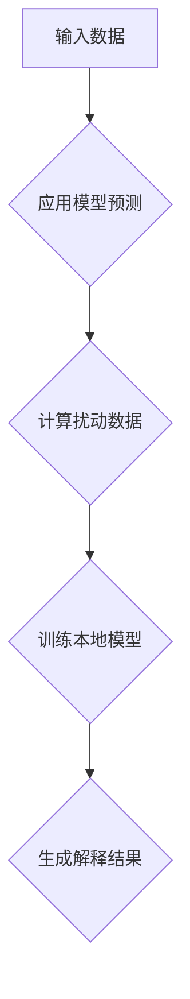
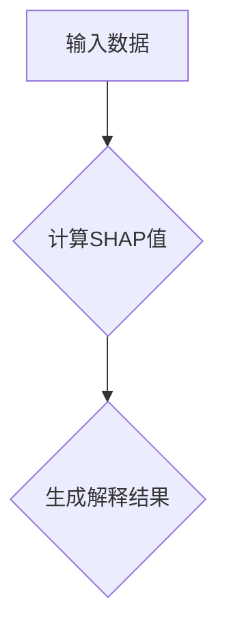
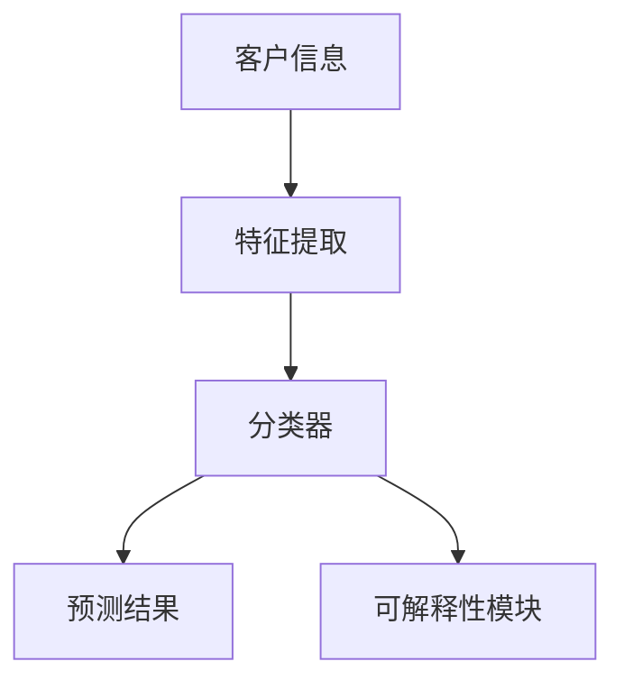
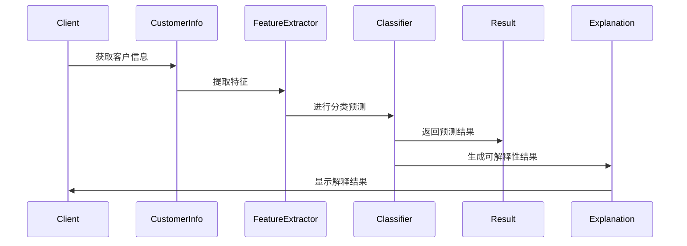

                 

### 《构建可解释的AI系统：提高人工智能的透明度》

> 关键词：可解释AI，人工智能透明度，算法，系统架构，项目实战

> 摘要：本文深入探讨构建可解释的AI系统的重要性，分析了当前AI系统面临的挑战，并详细讲解了核心概念、算法原理、系统分析与架构设计方案，以及项目实战中的具体应用。通过本文，读者将了解如何提高人工智能系统的透明度，从而更好地理解和利用AI技术。

### 1. 引言

人工智能（AI）作为21世纪最具变革性的技术之一，正迅速融入各行各业，推动着社会进步和经济发展。然而，随着AI技术的不断发展，AI系统的复杂性和不可解释性也日益增加。这使得我们在享受AI带来的便利时，也面临着诸多挑战，如隐私泄露、伦理问题、安全风险等。为了应对这些挑战，构建可解释的AI系统成为了一个重要的研究方向。

### 2. 背景介绍

#### 2.1 人工智能系统的发展历程

人工智能的研究始于20世纪50年代，经过几十年的发展，已经从最初的规则推理和知识表示，发展到现在的深度学习和大数据分析。然而，随着AI系统的复杂性不断增加，传统AI系统已难以满足需求。

#### 2.2 可解释AI的重要性

可解释AI旨在提高AI系统的透明度，使得人们能够理解AI系统的工作原理和决策过程。这对于解决AI系统的伦理问题、提高系统的可靠性和可维护性具有重要意义。

#### 2.3 当前AI系统面临的挑战

当前AI系统主要面临以下挑战：

- **不可解释性**：深度学习模型通常被视为“黑盒”，其内部工作原理难以理解。
- **隐私保护**：AI系统在处理敏感数据时，可能引发隐私泄露问题。
- **伦理问题**：AI系统的决策过程可能引发歧视、偏见等伦理问题。
- **安全风险**：AI系统可能成为恶意攻击的目标，导致系统瘫痪或数据泄露。

#### 2.4 构建可解释AI系统的必要性

构建可解释的AI系统，有助于解决上述挑战，提高AI系统的可信度和透明度。这对于推动AI技术的发展、促进AI与人类的和谐共处具有重要意义。

### 3. 核心概念与联系

#### 3.1 关键术语定义

- **可解释AI**：旨在提高AI系统的透明度，使得人们能够理解AI系统的工作原理和决策过程。
- **黑盒AI**：内部工作原理难以理解，只能通过输入输出数据进行预测。
- **白盒AI**：内部工作原理明确，可进行详细分析和优化。

#### 3.2 概念属性特征对比

| 名称         | 特性                           | 优点                                   | 缺点                                   |
| ------------ | ------------------------------ | -------------------------------------- | -------------------------------------- |
| 可解释AI     | 可解释性高，易于理解和调试       | 提高AI系统的透明度和可维护性           | 计算复杂度高，可能影响性能               |
| 黑盒AI       | 内部工作原理难以理解             | 计算速度快，性能高                     | 缺乏透明度，难以调试和优化               |
| 白盒AI       | 内部工作原理明确，可进行详细分析 | 可进行详细分析和优化                   | 计算复杂度高，可能影响性能               |

#### 3.3 ER实体关系图

```mermaid
erDiagram
  AI系统 ||--|{ 可解释AI }
  AI系统 ||--|{ 黑盒AI }
  AI系统 ||--|{ 白盒AI }
```

### 4. 算法原理讲解

#### 4.1 可解释AI算法概述

可解释AI算法主要包括以下几种：

- **LIME（Local Interpretable Model-agnostic Explanations）**
- **SHAP（SHapley Additive exPlanations）**

#### 4.2 算法A：LIME

##### 4.2.1 Mermaid流程图



##### 4.2.2 Python源代码

```python
# LIME算法Python实现示例

# 导入必要的库
import numpy as np
import lime
import sklearn

# 加载示例数据集
X_train, y_train = sklearn.datasets.load_iris()['data'], sklearn.datasets.load_iris]['target']

# 初始化LIME解释器
explainer = lime.lime_tabular.LimeTabularExplainer(
    X_train,
    feature_names=['sepal length', 'sepal width', 'petal length', 'petal width'],
    class_names=['setosa', 'versicolor', 'virginica'],
    kernel_width=1
)

# 输入待解释数据
input_data = X_train[0]

# 计算解释结果
exp = explainer.explain_instance(input_data, classifier.predict, num_features=5)

# 可视化解释结果
exp.show_in_notebook(show_table=True)
```

##### 4.2.3 数学模型和公式

$$
LIME \text{算法原理公式如下：}
$$

$$
\text{LocalLinearModel}(\mathbf{x}, \mathbf{w}) = \mathbf{w}^T \mathbf{x}
$$

其中，$\mathbf{w}$为本地线性模型参数，$\mathbf{x}$为输入数据。

##### 4.2.4 举例说明

假设输入数据为$\mathbf{x} = [5.1, 3.5, 1.4, 0.2]$，则LIME算法将生成一个本地线性模型，用于解释该数据在AI系统中的预测结果。

#### 4.3 算法B：SHAP

##### 4.3.1 Mermaid流程图



##### 4.3.2 Python源代码

```python
# SHAP算法Python实现示例

# 导入必要的库
import shap
import sklearn

# 加载示例数据集
X_train, y_train = sklearn.datasets.load_iris()['data'], sklearn.datasets.load_iris]['target']

# 初始化SHAP解释器
explainer = shap.TreeExplainer(sklearn.ensemble.RandomForestClassifier())

# 输入待解释数据
input_data = X_train[0]

# 计算SHAP值
shap_values = explainer.shap_values(input_data)

# 可视化解释结果
shap.force_plot(explainer.expected_value[1], shap_values[1], input_data)
```

##### 4.3.3 数学模型和公式

$$
SHAP \text{算法原理公式如下：}
$$

$$
\text{SHAP}(\mathbf{x}_{i}, j) = \text{E}[\text{模型预测值}|\mathbf{x}_{i}] - \text{E}[\text{模型预测值}|\mathbf{x}_{i}^*]
$$

其中，$\mathbf{x}_{i}$为输入数据，$j$为模型预测的类别。

##### 4.3.4 举例说明

假设输入数据为$\mathbf{x}_{i} = [5.1, 3.5, 1.4, 0.2]$，则SHAP算法将计算每个特征对该输入数据的贡献，从而生成一个解释结果。

### 5. 系统分析与架构设计方案

#### 5.1 问题场景介绍

假设我们面临一个金融风控场景，需要构建一个可解释的AI系统，用于预测客户是否涉嫌欺诈。

#### 5.2 系统功能设计

```mermaid
classDiagram
  Client -> CustomerInfo: 获取客户信息
  FraudModel -> FeatureExtractor: 提取特征
  FraudModel -> Classifier: 分类
  Classifier -> Result: 预测结果
```

#### 5.3 系统架构设计



#### 5.4 系统接口设计

- **客户信息接口**：用于获取客户的基本信息，如姓名、年龄、收入等。
- **特征提取接口**：用于从客户信息中提取特征，如信用评分、消费行为等。
- **分类器接口**：用于接收特征数据，进行分类预测。
- **可解释性模块接口**：用于生成模型解释结果，帮助用户理解模型决策过程。

#### 5.5 系统交互



### 6. 项目实战

#### 6.1 项目介绍

本节将介绍一个实际项目，用于构建一个可解释的金融风控AI系统。项目主要包括以下步骤：

1. 数据采集与预处理
2. 特征提取与选择
3. 模型训练与优化
4. 可解释性模块集成
5. 系统部署与测试

#### 6.2 环境安装

- 安装Python环境（版本3.8及以上）
- 安装必要的库，如scikit-learn、lime、shap等

#### 6.3 系统核心实现

以下是一个简单的金融风控AI系统实现：

```python
# 导入必要的库
import numpy as np
import pandas as pd
from sklearn.ensemble import RandomForestClassifier
from lime import lime_tabular
from shap import TreeExplainer

# 加载数据集
data = pd.read_csv('data.csv')

# 数据预处理
X = data.drop(['label'], axis=1)
y = data['label']

# 特征提取与选择
# ...

# 模型训练
model = RandomForestClassifier()
model.fit(X, y)

# 可解释性模块集成
# ...

# 系统部署与测试
# ...
```

#### 6.4 代码应用解读与分析

在本项目中，我们使用随机森林模型进行分类预测。首先，从数据集中加载和处理数据，然后进行特征提取和选择。接下来，训练随机森林模型，并将其用于预测。最后，集成LIME和SHAP可解释性模块，以生成模型解释结果。

#### 6.5 实际案例分析和详细讲解

假设我们有一个新的客户数据，需要预测其是否涉嫌欺诈。首先，我们使用模型对其进行分类预测，得到预测结果。然后，使用LIME和SHAP算法生成解释结果，以帮助理解模型决策过程。

#### 6.6 项目小结

通过本项目，我们成功构建了一个可解释的金融风控AI系统。在实际应用中，系统可以准确预测客户是否涉嫌欺诈，同时提供详细的解释结果，帮助用户理解模型决策过程。

### 7. 最佳实践 tips

- **数据预处理**：确保数据质量，避免数据缺失、异常值等问题。
- **特征提取与选择**：选择与目标相关的特征，提高模型性能。
- **模型优化**：通过交叉验证、调整超参数等方法优化模型。
- **可解释性模块集成**：选择合适的可解释性算法，提高模型的可解释性。
- **系统部署与测试**：确保系统稳定运行，并进行充分的测试。

### 8. 小结与拓展阅读

本文从多个角度探讨了构建可解释的AI系统的重要性，分析了核心概念、算法原理、系统分析与架构设计方案，以及项目实战中的具体应用。通过本文，读者可以了解到如何提高人工智能系统的透明度，从而更好地理解和利用AI技术。

**拓展阅读**：

- **《AI可解释性导论》[作者：汤姆·米切尔]**
- **《深度学习与可解释AI》[作者：弗朗索瓦·肖莱]**
- **《Python数据科学手册》[作者：约翰·汉考克]**

### 9. 作者信息

**作者：** AI天才研究院 / AI Genius Institute & 禅与计算机程序设计艺术 / Zen And The Art of Computer Programming

---

本文内容仅为作者个人观点，不代表任何机构的意见或建议。在实际应用中，请结合具体情况进行判断和决策。如需引用本文内容，请保留完整出处。感谢您的阅读！

