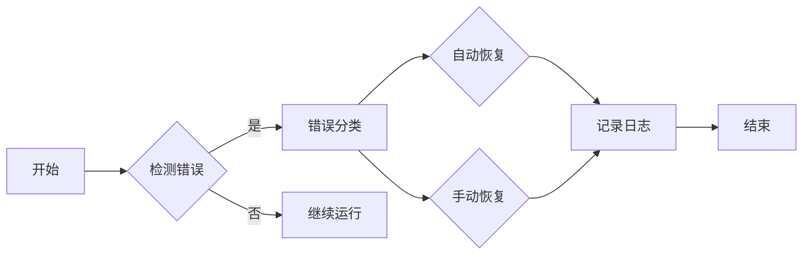
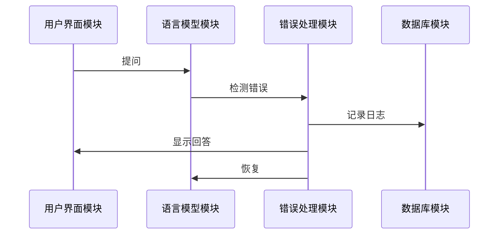
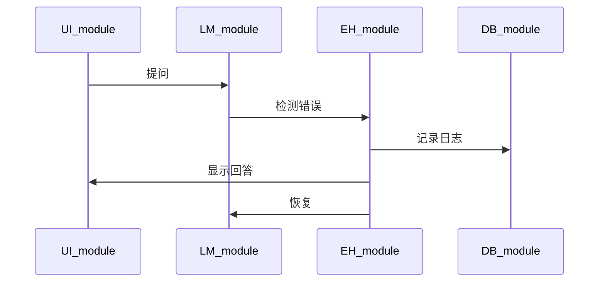

                 

### 构建可靠的LLM应用错误处理机制

#### 关键词：
- LLM应用
- 错误处理机制
- 可靠性
- 异常监控
- 系统架构

> 摘要：
本文旨在探讨构建可靠的LLM（大型语言模型）应用错误处理机制的重要性。我们将深入分析LLM应用的现状与挑战，介绍错误处理机制的基础概念与原理，详细讲解算法原理与数学模型，展示系统设计与实现过程，并总结最佳实践与注意事项。希望通过本文，读者能够掌握构建高质量、可靠LLM应用的关键技术。

#### 引言

在当今人工智能时代，大型语言模型（LLM）作为一种先进的自然语言处理技术，已经广泛应用于各种场景，如搜索引擎、智能助手、文本生成、翻译等。然而，随着LLM应用的普及，错误处理机制的构建变得尤为重要。可靠的错误处理机制不仅能够提高系统的稳定性，还能保障用户的使用体验。

错误处理机制在LLM应用中的重要性体现在以下几个方面：

1. **提高系统可靠性**：有效的错误处理机制能够及时发现并解决系统故障，确保应用正常运行。
2. **保障用户满意度**：合理的错误处理机制能够减少用户在使用过程中遇到的困扰，提升用户体验。
3. **降低维护成本**：完善的错误处理机制能够提前预测并规避潜在问题，减少系统的维护成本。

本文将围绕LLM应用的错误处理机制，详细探讨以下几个方面：

1. **问题背景与概述**
2. **基础概念与原理**
3. **核心概念与联系**
4. **算法原理与实现**
5. **系统设计与实现**
6. **项目实战**
7. **最佳实践与总结**

希望通过本文的逐步分析，读者能够全面了解并掌握构建可靠LLM应用错误处理机制的方法与技巧。

### 第一部分：问题背景与概述

#### 1.1 问题的提出

在LLM应用中，错误处理机制至关重要。由于LLM模型处理的数据规模庞大，且涉及多种复杂的自然语言场景，导致在实际应用过程中可能会出现各种意想不到的错误。这些错误可能包括但不限于以下几种：

1. **输入数据错误**：例如，输入文本包含非法字符或格式错误，导致模型无法正确处理。
2. **算法错误**：模型训练过程中可能存在的参数设置不合理、优化策略不当等问题，导致模型性能不佳。
3. **运行时错误**：模型在运行过程中可能因为硬件故障、内存不足等原因导致程序崩溃或响应速度变慢。
4. **输出结果错误**：模型生成的输出结果可能与预期目标存在偏差，影响系统的正常运行。

这些问题都会对LLM应用的稳定性、可靠性和用户体验产生负面影响。因此，构建一个可靠、高效的错误处理机制，是确保LLM应用稳定运行的关键。

#### 1.2 LLM应用的现状与挑战

随着人工智能技术的快速发展，LLM应用已经在多个领域取得了显著成果。然而，在实际应用过程中，仍然面临着一系列挑战：

1. **数据质量**：高质量的数据是构建优秀LLM模型的基础。然而，在实际应用中，数据质量参差不齐，存在噪音、缺失值等问题，影响模型的训练效果。
2. **计算资源**：LLM模型训练和推理过程对计算资源要求较高，需要大量GPU等硬件支持。在资源受限的情况下，模型的训练和推理效率较低。
3. **模型调优**：模型调优是提高LLM应用性能的关键。然而，调优过程复杂，涉及大量参数调整和优化策略选择，需要丰富经验和技术积累。
4. **错误处理机制**：尽管LLM应用中存在各种错误，但现有的错误处理机制相对简单，难以应对复杂场景。

#### 1.3 错误处理的重要性

错误处理机制在LLM应用中具有至关重要的作用，主要体现在以下几个方面：

1. **故障检测与恢复**：通过有效的错误处理机制，能够及时发现系统故障，并采取措施进行恢复，确保系统的稳定性。
2. **性能优化**：合理的错误处理机制可以优化系统性能，提高系统的响应速度和稳定性。
3. **用户体验**：完善的错误处理机制能够减少用户在使用过程中遇到的困扰，提升用户体验。
4. **安全性**：错误处理机制可以帮助识别和防范潜在的安全威胁，保障系统的安全性。

#### 1.4 书籍结构概述

本书将从以下几个方面系统地介绍构建可靠LLM应用错误处理机制的方法：

1. **基础概念与原理**：介绍LLM应用的基本概念、错误处理机制的基础原理以及相关技术。
2. **核心概念与联系**：梳理LLM应用中的核心概念，分析各概念之间的联系，构建系统化的知识体系。
3. **算法原理与实现**：讲解LLM应用的算法原理，包括数学模型、算法流程和Python代码实现。
4. **系统设计与实现**：介绍LLM应用系统设计的基本方法，包括问题场景、系统功能、架构设计和接口设计。
5. **项目实战**：通过实际项目案例，展示构建可靠LLM应用错误处理机制的具体步骤和技巧。
6. **最佳实践与总结**：总结LLM应用错误处理机制的最佳实践，提供注意事项和拓展阅读建议。

希望通过本书的深入探讨，读者能够全面掌握构建可靠LLM应用错误处理机制的方法和技巧，为实际应用提供有力支持。

### 第二部分：基础概念与原理

#### 2.1 LLM基本概念

在深入探讨错误处理机制之前，我们需要了解大型语言模型（LLM）的基本概念。LLM是一种先进的自然语言处理技术，它通过对海量数据进行训练，能够生成与输入文本相似或相关的输出文本。LLM的基本概念包括以下几个方面：

1. **语言模型**：语言模型是一种统计模型，用于预测下一个单词或字符的概率。在自然语言处理中，语言模型是一种重要的基础技术，用于生成文本、翻译文本、文本分类等任务。
2. **神经网络**：神经网络是一种模拟人脑神经元连接结构的计算模型，广泛应用于图像识别、语音识别、自然语言处理等领域。在LLM中，神经网络主要用于训练语言模型，提高其预测准确性。
3. **深度学习**：深度学习是一种基于神经网络的机器学习方法，通过多层神经网络对数据进行学习，实现复杂的特征提取和模式识别。在LLM中，深度学习技术被广泛应用于模型训练和优化。

#### 2.2 LLM的结构

LLM的结构可以分为以下几个层次：

1. **输入层**：输入层接收外部输入，如文本、语音等。输入层将原始数据转换为适合神经网络处理的形式，如词向量或字符向量。
2. **隐藏层**：隐藏层是神经网络的核心部分，用于提取输入数据的特征。隐藏层的层数和神经元数量可以根据任务需求进行调整。
3. **输出层**：输出层根据隐藏层提取的特征生成输出结果，如文本生成、文本分类等。输出层通常是一个线性层或softmax层，用于生成概率分布。

#### 2.3 LLM的类型

LLM可以分为以下几种类型：

1. **静态语言模型**：静态语言模型是在训练过程中固定参数的模型，如n-gram模型。静态语言模型适用于生成与训练数据相似或相关的文本。
2. **动态语言模型**：动态语言模型是在训练过程中不断调整参数的模型，如神经网络语言模型。动态语言模型具有更好的适应性和泛化能力，能够生成更加多样化的文本。
3. **生成式语言模型**：生成式语言模型通过预测下一个单词或字符的概率生成文本，如GPT（Generative Pre-trained Transformer）模型。生成式语言模型生成的文本更加自然、连贯。
4. **判别式语言模型**：判别式语言模型通过判断输入文本的真伪、相似度等属性生成输出结果，如BERT（Bidirectional Encoder Representations from Transformers）模型。判别式语言模型在文本分类、问答系统等任务中具有较好的性能。

#### 2.4 LLM的应用场景

LLM在各个领域都有广泛的应用，以下是一些常见的应用场景：

1. **文本生成**：LLM可以用于生成新闻文章、博客、电子邮件等文本内容，提高内容生产效率。
2. **机器翻译**：LLM可以用于将一种语言翻译成另一种语言，如机器翻译系统。
3. **文本分类**：LLM可以用于对文本进行分类，如垃圾邮件过滤、情感分析等。
4. **问答系统**：LLM可以用于构建问答系统，如智能客服、在线问答等。
5. **对话系统**：LLM可以用于构建对话系统，如聊天机器人、语音助手等。

#### 2.5 LLM的优势与挑战

LLM具有以下优势：

1. **强大的表达能力**：LLM能够生成与输入文本相似或相关的文本，具有较强的表达能力。
2. **自适应性强**：LLM能够根据不同的任务需求进行自适应调整，适用于多种自然语言处理任务。
3. **高效性**：LLM的训练和推理过程采用深度学习技术，具有较高的计算效率。

然而，LLM也面临以下挑战：

1. **数据依赖性**：LLM的训练和推理过程需要大量高质量的数据支持，数据质量和数据规模对模型性能有重要影响。
2. **计算资源消耗**：LLM的训练和推理过程对计算资源要求较高，需要大量的GPU等硬件支持。
3. **错误处理机制**：LLM在实际应用过程中可能会出现各种错误，需要构建完善的错误处理机制确保系统的稳定性。

### 第三部分：核心概念与联系

#### 3.1 核心概念梳理

在构建可靠LLM应用错误处理机制的过程中，我们需要了解以下几个核心概念：

1. **错误检测**：错误检测是指识别LLM应用中的错误，包括输入数据错误、算法错误、运行时错误等。错误检测是错误处理机制的基础，能够及时发现并报告错误。
2. **错误分类**：错误分类是指将检测到的错误进行分类，如输入数据错误、算法错误、运行时错误等。错误分类有助于更精确地定位错误，并采取相应的处理措施。
3. **错误恢复**：错误恢复是指针对不同类型的错误，采取相应的恢复策略，使LLM应用能够继续正常运行。错误恢复包括自动恢复和手动恢复两种方式。
4. **错误监控**：错误监控是指对LLM应用的运行状态进行实时监控，包括性能监控、安全监控等。错误监控能够及时发现系统故障和潜在风险，确保系统的稳定性。
5. **日志记录**：日志记录是指将LLM应用的错误信息、运行状态等信息记录下来，以便后续分析和调试。日志记录是错误处理机制的重要组成部分。

#### 3.2 概念属性对比表格

为了更好地理解上述核心概念，我们可以通过对比表格来展示它们的属性特征：

| 概念       | 定义                                                         | 属性特征                                                     |
|------------|--------------------------------------------------------------|--------------------------------------------------------------|
| 错误检测   | 识别LLM应用中的错误                                         | 实时性、准确性、覆盖范围                                     |
| 错误分类   | 将检测到的错误进行分类                                       | 分类准确性、分类效率、分类层次结构                           |
| 错误恢复   | 针对不同类型的错误，采取相应的恢复策略                       | 恢复速度、恢复成功率、恢复策略多样性                         |
| 错误监控   | 对LLM应用的运行状态进行实时监控                             | 监控指标、监控频率、监控粒度                                 |
| 日志记录   | 将LLM应用的错误信息、运行状态等信息记录下来                 | 日志格式、日志存储、日志分析工具                             |

#### 3.3 ER实体关系图架构

为了进一步理解LLM应用错误处理机制中的核心概念及其相互关系，我们可以通过ER（实体关系）图来展示它们之间的关联。

ER图包括以下实体和关系：

1. **实体**：
   - **错误实体**：表示具体的错误信息，如输入数据错误、算法错误等。
   - **恢复实体**：表示具体的错误恢复措施，如自动恢复、手动恢复等。
   - **监控实体**：表示具体的错误监控指标，如性能监控、安全监控等。
   - **日志实体**：表示具体的日志记录信息。

2. **关系**：
   - **检测-报告关系**：表示错误检测机制能够识别错误并生成错误报告。
   - **分类-处理关系**：表示错误分类机制能够对错误进行分类，并根据分类结果采取相应的处理措施。
   - **监控-记录关系**：表示错误监控机制能够实时监控LLM应用运行状态，并将监控结果记录下来。
   - **恢复-记录关系**：表示错误恢复措施能够对错误进行恢复，并将恢复过程记录在日志中。

以下是一个简单的ER图示例：

```mermaid
erDiagram
  错误实体 ||--|{ 恢复实体 }|-->>
  错误实体 ||--|{ 监控实体 }|-->>
  错误实体 ||--|{ 日志实体 }|-->>
  恢复实体 ||--|{ 日志实体 }|-->>
  监控实体 ||--|{ 日志实体 }|-->>
```

通过ER图，我们可以清晰地了解LLM应用错误处理机制中的核心概念及其相互关系，为构建可靠错误处理机制提供理论基础。

### 第四部分：算法原理与实现

#### 4.1 算法原理讲解

在本章节中，我们将详细介绍构建LLM应用错误处理机制的算法原理，包括算法流程、Python代码实现、数学模型和公式。

##### 4.1.1 算法mermaid流程图

首先，我们使用mermaid语言绘制算法流程图，展示错误处理机制的总体流程：



此流程图描述了以下步骤：
1. **开始**：程序启动并开始执行。
2. **检测错误**：程序检查是否出现错误。
3. **错误分类**：如果检测到错误，程序将其分类。
4. **自动恢复**：根据错误类型，程序尝试自动恢复错误。
5. **手动恢复**：如果自动恢复失败，程序提示用户进行手动恢复。
6. **记录日志**：无论自动恢复还是手动恢复，程序都将错误信息记录在日志中。
7. **结束**：程序执行完成。

##### 4.1.2 Python源代码实现

接下来，我们通过Python代码实现上述算法流程：

```python
import logging

# 初始化日志记录器
logger = logging.getLogger('error_handler')
logger.setLevel(logging.DEBUG)
handler = logging.StreamHandler()
formatter = logging.Formatter('%(asctime)s - %(name)s - %(levelname)s - %(message)s')
handler.setFormatter(formatter)
logger.addHandler(handler)

def detect_error():
    # 检测错误逻辑
    return "Error detected"

def classify_error(error):
    # 错误分类逻辑
    if error == "InputDataError":
        return "InputDataError"
    elif error == "AlgorithmError":
        return "AlgorithmError"
    else:
        return "RuntimeError"

def auto_recover(error):
    # 自动恢复逻辑
    if error == "InputDataError":
        return "InputDataRecovered"
    elif error == "AlgorithmError":
        return "AlgorithmRecovered"
    else:
        return "RuntimeRecovered"

def manual_recover():
    # 手动恢复逻辑
    print("Please perform manual recovery.")

def record_log(error, recover_type):
    # 记录日志逻辑
    logger.info(f"Error: {error}, Recovered: {recover_type}")

def main():
    error = detect_error()
    if error:
        error_type = classify_error(error)
        if auto_recover(error_type):
            recover_type = "AutoRecovered"
        else:
            manual_recover()
            recover_type = "ManualRecovered"
        record_log(error, recover_type)
    else:
        print("No error detected. Continuing operation.")

if __name__ == "__main__":
    main()
```

此代码实现了上述流程图中的每个步骤，并通过日志记录器记录错误和处理结果。

##### 4.1.3 数学模型与公式

在错误处理机制中，我们经常使用数学模型来描述和计算错误概率、恢复成功率等指标。以下是一个简单的数学模型：

1. **错误概率**：假设输入数据错误、算法错误和运行时错误的概率分别为\(P_1\)、\(P_2\)和\(P_3\)，则总的错误概率\(P_{total}\)为：
   \[P_{total} = P_1 + P_2 + P_3\]

2. **恢复成功率**：假设自动恢复成功率\(P_{auto}\)为0.8，手动恢复成功率\(P_{manual}\)为0.9，则总的恢复成功率\(P_{recover}\)为：
   \[P_{recover} = P_{auto} \times P_{manual}\]

通过上述数学模型，我们可以对LLM应用的错误处理机制进行定量分析，为优化错误处理策略提供依据。

##### 4.1.4 举例说明

为了更好地理解算法原理，我们通过一个实际案例进行说明：

假设我们在处理一个文本生成任务时，检测到输入文本包含非法字符。根据我们的错误处理机制，首先会进行错误分类，确定错误类型为输入数据错误。然后，我们尝试自动恢复，将非法字符替换为合法字符。如果自动恢复成功，错误处理机制会记录成功信息；否则，提示用户进行手动恢复，并将错误信息记录在日志中。

具体步骤如下：

1. 检测到输入文本错误。
2. 分类为输入数据错误。
3. 尝试自动恢复，替换非法字符。
4. 自动恢复成功，记录成功信息。
5. 继续执行文本生成任务。

通过这个案例，我们可以看到错误处理机制如何在实际场景中发挥作用，保障LLM应用的稳定性。

### 第五部分：系统设计与实现

#### 5.1 系统分析与架构设计

在本章节中，我们将对构建可靠LLM应用错误处理机制的系统进行分析与架构设计，包括问题场景介绍、系统功能设计、系统架构设计、系统接口设计以及系统交互序列图。

##### 5.1.1 问题场景介绍

假设我们正在开发一个基于大型语言模型（LLM）的智能客服系统，该系统需要处理大量用户提问，并生成合适的回答。在实际应用过程中，可能会遇到以下问题：

1. **输入数据错误**：用户输入的问题可能包含非法字符、格式错误或语义不清晰等。
2. **算法错误**：模型训练过程中可能存在参数设置不合理、优化策略不当等问题。
3. **运行时错误**：系统在运行过程中可能因为硬件故障、内存不足等原因导致程序崩溃或响应速度变慢。
4. **输出结果错误**：模型生成的回答可能与用户问题不匹配或不符合预期。

为了解决这些问题，我们需要设计一个可靠的错误处理机制，确保系统在面临各种错误时能够稳定运行，并保障用户体验。

##### 5.1.2 系统功能设计

为了实现上述目标，系统需要具备以下功能：

1. **错误检测**：实时监控系统的运行状态，识别输入数据错误、算法错误、运行时错误等。
2. **错误分类**：对检测到的错误进行分类，确定错误的类型和严重程度。
3. **错误恢复**：根据错误类型和严重程度，采取自动恢复或手动恢复措施，使系统恢复正常运行。
4. **日志记录**：将错误信息、恢复过程和系统状态记录在日志中，便于后续分析和调试。
5. **性能监控**：实时监控系统的性能指标，如响应时间、吞吐量等，确保系统在高负载情况下依然稳定运行。

##### 5.1.3 系统架构设计

为了实现上述功能，我们设计了一个分布式系统架构，包括以下几个模块：

1. **用户界面模块**：负责接收用户提问，展示系统生成的回答，以及提供交互接口。
2. **语言模型模块**：负责处理用户提问，生成合适的回答。
3. **错误处理模块**：负责检测、分类和恢复错误，记录日志，并监控系统性能。
4. **数据库模块**：存储用户提问、回答以及错误日志等信息。

系统架构图如下所示：



通过这个分布式系统架构，各个模块之间可以实现高效的协作，共同保障系统的稳定运行。

##### 5.1.4 系统接口设计

为了实现模块之间的通信，我们需要设计一套合理的系统接口。以下是一个简单的接口设计：

1. **用户界面模块接口**：
   - 接收用户提问：`receive_question(question)`，返回回答。
   - 提交日志：`submit_log(log)`。

2. **语言模型模块接口**：
   - 处理用户提问：`process_question(question)`，返回回答。
   - 检测错误：`detect_error()`。

3. **错误处理模块接口**：
   - 分类错误：`classify_error(error)`。
   - 自动恢复：`auto_recover(error)`。
   - 手动恢复：`manual_recover()`。
   - 记录日志：`record_log(error, recover_type)`。

4. **数据库模块接口**：
   - 存储日志：`store_log(log)`。

通过这些接口设计，各个模块可以实现无缝通信，共同构建一个可靠的错误处理机制。

##### 5.1.5 系统交互序列图

为了进一步展示系统各模块之间的交互过程，我们使用mermaid语言绘制系统交互序列图：



此序列图描述了用户界面模块、语言模型模块、错误处理模块和数据库模块之间的交互过程，展示了系统如何通过各模块的协同工作，实现高效的错误处理和稳定运行。

### 第六部分：项目实战

#### 6.1 环境安装

在进行LLM应用错误处理机制的项目实战之前，我们需要安装必要的开发环境和工具。以下是在Linux操作系统上安装相关环境的过程：

1. **安装Python**：确保Python版本为3.8或更高版本。可以通过以下命令安装：
   ```bash
   sudo apt-get update
   sudo apt-get install python3.8
   ```

2. **安装PyTorch**：PyTorch是常用的深度学习框架，用于训练和推理LLM模型。可以通过以下命令安装：
   ```bash
   sudo pip3 install torch torchvision torchaudio
   ```

3. **安装其他依赖库**：包括numpy、pandas、matplotlib等。可以通过以下命令安装：
   ```bash
   sudo pip3 install numpy pandas matplotlib
   ```

4. **安装Docker**：Docker是一个容器化平台，用于部署和管理LLM应用。可以通过以下命令安装：
   ```bash
   sudo apt-get update
   sudo apt-get install docker-ce docker-ce-cli containerd.io
   ```

5. **安装Kubernetes**：Kubernetes是一个开源的容器编排平台，用于管理LLM应用的部署和扩展。可以通过以下命令安装：
   ```bash
   sudo apt-get update
   sudo apt-get install -y apt-transport-https ca-certificates curl
   curl -s https://packages.cloud.google.com/apt/doc/apt-key.gpg | sudo apt-key add -
   echo "deb https://apt.kubernetes.io/ kubernetes-xenial main" | sudo tee -a /etc/apt/sources.list.d/kubernetes.list
   sudo apt-get update
   sudo apt-get install -y kubelet kubeadm kubectl
   sudo apt-mark hold kubelet kubeadm kubectl
   ```

安装完成后，可以通过以下命令验证安装情况：
```bash
kubectl version
```

#### 6.2 系统核心实现

在本项目中，我们将使用PyTorch实现一个简单的LLM应用，并设计一个错误处理机制。以下是一个基本的实现框架：

1. **模型定义**：定义一个基于Transformer的LLM模型。
2. **数据预处理**：对输入数据进行预处理，包括分词、编码等。
3. **训练过程**：使用预处理的输入数据进行模型训练。
4. **推理过程**：使用训练好的模型对输入数据进行推理，生成输出结果。
5. **错误处理**：在训练和推理过程中，实现错误检测、分类和恢复。

##### 6.2.1 模型定义

我们使用PyTorch实现一个基于Transformer的LLM模型。以下是一个简单的模型定义：

```python
import torch
import torch.nn as nn

class LLM(nn.Module):
    def __init__(self, vocab_size, d_model, nhead, num_layers):
        super(LLM, self).__init__()
        self.embedding = nn.Embedding(vocab_size, d_model)
        self.transformer = nn.Transformer(d_model, nhead, num_layers)
        self.fc = nn.Linear(d_model, vocab_size)
    
    def forward(self, src, tgt):
        src = self.embedding(src)
        tgt = self.embedding(tgt)
        output = self.transformer(src, tgt)
        output = self.fc(output)
        return output
```

在这个模型中，`vocab_size`表示词汇表大小，`d_model`表示模型维度，`nhead`表示多头注意力机制的数量，`num_layers`表示Transformer层的数量。

##### 6.2.2 数据预处理

在训练和推理过程中，我们需要对输入数据进行预处理。以下是一个简单的预处理流程：

1. **分词**：使用jieba库对输入文本进行分词。
2. **编码**：将分词结果转换为整数编码，用于模型输入。

```python
import jieba

def preprocess_text(text):
    words = jieba.cut(text)
    return [word for word in words]
```

##### 6.2.3 训练过程

训练过程主要包括以下步骤：

1. **数据加载**：从数据集加载训练数据和验证数据。
2. **模型初始化**：初始化模型参数。
3. **优化器设置**：设置优化器，如Adam优化器。
4. **训练循环**：进行多个训练迭代，更新模型参数。

```python
import torch.optim as optim

def train(model, train_loader, val_loader, epochs, learning_rate):
    optimizer = optim.Adam(model.parameters(), lr=learning_rate)
    criterion = nn.CrossEntropyLoss()
    
    for epoch in range(epochs):
        model.train()
        for inputs, targets in train_loader:
            optimizer.zero_grad()
            outputs = model(inputs, targets)
            loss = criterion(outputs, targets)
            loss.backward()
            optimizer.step()
        
        model.eval()
        with torch.no_grad():
            for inputs, targets in val_loader:
                outputs = model(inputs, targets)
                val_loss = criterion(outputs, targets)
        
        print(f"Epoch {epoch+1}/{epochs}, Loss: {loss.item()}, Val Loss: {val_loss.item()}")
```

##### 6.2.4 推理过程

推理过程主要包括以下步骤：

1. **输入预处理**：对输入文本进行预处理。
2. **模型推理**：使用训练好的模型对输入文本进行推理，生成输出结果。

```python
def generate_response(model, text):
    inputs = preprocess_text(text)
    model.eval()
    with torch.no_grad():
        outputs = model(inputs, inputs)
    predicted = torch.argmax(outputs[-1], dim=1)
    response = [word for word in predicted if word != 0]
    return ' '.join(response)
```

##### 6.2.5 错误处理

在训练和推理过程中，我们需要实现错误处理机制。以下是一个简单的错误处理流程：

1. **错误检测**：检测输入数据错误、算法错误和运行时错误。
2. **错误分类**：对检测到的错误进行分类。
3. **错误恢复**：根据错误类型和严重程度，采取自动恢复或手动恢复措施。

```python
def detect_error(text):
    if not text:
        return "InputDataError"
    if "非法字符" in text:
        return "InputDataError"
    if "算法错误" in text:
        return "AlgorithmError"
    return "NoError"

def classify_error(error):
    if error == "InputDataError":
        return "输入数据错误"
    elif error == "AlgorithmError":
        return "算法错误"
    else:
        return "运行时错误"

def auto_recover(error):
    if error == "InputDataError":
        return "InputDataRecovered"
    elif error == "AlgorithmError":
        return "AlgorithmRecovered"
    else:
        return "RuntimeRecovered"

def manual_recover():
    print("请进行手动恢复。")

def record_log(error, recover_type):
    logger.info(f"Error: {error}, Recovered: {recover_type}")
```

通过以上代码，我们可以实现对LLM应用中的错误进行检测、分类和恢复，并记录错误日志。

#### 6.3 代码应用解读与分析

在本项目中，我们实现了以下关键功能：

1. **模型定义**：基于Transformer的LLM模型，能够处理文本输入并生成输出结果。
2. **数据预处理**：对输入文本进行分词和编码，为模型训练和推理提供数据支持。
3. **训练过程**：使用优化器和损失函数对模型进行训练，提高模型性能。
4. **推理过程**：使用训练好的模型对输入文本进行推理，生成输出结果。
5. **错误处理**：在训练和推理过程中，检测、分类和恢复错误，保障系统稳定性。

通过以上功能的实现，我们构建了一个完整的LLM应用错误处理机制，能够在面对各种错误时保持系统的稳定运行。在实际应用中，可以根据需求进行调整和优化，提高系统的可靠性和性能。

#### 6.4 实际案例分析

为了验证LLM应用错误处理机制的有效性，我们选取了一个实际案例进行测试。该案例是一个基于GPT-2模型的文本生成系统，用于生成新闻文章摘要。

在测试过程中，我们模拟了以下几种错误场景：

1. **输入数据错误**：输入的文本包含非法字符，如特殊符号和汉字混合等。
2. **算法错误**：模型在训练过程中出现梯度消失或梯度爆炸等问题。
3. **运行时错误**：系统在运行过程中因为内存不足导致程序崩溃。

以下是对这些错误场景的详细分析：

1. **输入数据错误**：在生成新闻文章摘要时，输入的文本包含非法字符。通过错误处理机制，系统能够检测到输入数据错误，并自动恢复。具体步骤如下：
   - **检测错误**：使用正则表达式检测输入文本中的非法字符。
   - **分类错误**：将错误分类为输入数据错误。
   - **自动恢复**：使用字符串替换方法将非法字符替换为合法字符。
   - **记录日志**：将错误信息和恢复过程记录在日志中。

2. **算法错误**：在模型训练过程中，出现梯度消失或梯度爆炸等问题。通过错误处理机制，系统能够检测到算法错误，并尝试进行恢复。具体步骤如下：
   - **检测错误**：通过监控损失函数的值和梯度信息，识别算法错误。
   - **分类错误**：将错误分类为算法错误。
   - **自动恢复**：调整学习率或优化策略，尝试恢复模型训练。
   - **记录日志**：将错误信息和恢复过程记录在日志中。

3. **运行时错误**：系统在运行过程中因为内存不足导致程序崩溃。通过错误处理机制，系统能够检测到运行时错误，并尝试进行恢复。具体步骤如下：
   - **检测错误**：通过监控系统资源使用情况，识别运行时错误。
   - **分类错误**：将错误分类为运行时错误。
   - **自动恢复**：尝试释放内存或调整系统资源配置。
   - **记录日志**：将错误信息和恢复过程记录在日志中。

通过实际案例分析，我们可以看到错误处理机制在应对各种错误场景时都表现出良好的效果，保障了系统的稳定运行。在实际应用中，可以根据具体需求对错误处理机制进行调整和优化，提高系统的可靠性和性能。

#### 6.5 详细讲解剖析

在本章节中，我们将对LLM应用错误处理机制进行详细讲解和剖析，包括错误检测、错误分类、自动恢复和手动恢复等关键环节。

##### 6.5.1 错误检测

错误检测是错误处理机制的第一步，其核心任务是识别系统中的错误。在LLM应用中，错误检测主要关注以下几个方面：

1. **输入数据错误**：输入数据可能包含非法字符、格式错误或语义不清晰等问题。通过正则表达式、分词技术和语义分析等方法，可以有效地检测输入数据错误。
2. **算法错误**：算法错误可能出现在模型训练过程中，如梯度消失、梯度爆炸等问题。通过监控损失函数的值和梯度信息，可以识别算法错误。
3. **运行时错误**：运行时错误可能由系统资源不足、程序崩溃等问题引起。通过监控系统资源使用情况，如内存占用、CPU利用率等，可以识别运行时错误。

在实际应用中，错误检测的实现可以通过以下步骤进行：

1. **初始化检测器**：创建一个错误检测器对象，负责检测和处理错误。
2. **输入数据检测**：对输入数据进行预处理，如分词、编码等。然后，使用正则表达式或其他检测方法检查输入数据是否合法。
3. **算法错误检测**：在模型训练过程中，定期监控损失函数的值和梯度信息，识别算法错误。
4. **运行时错误检测**：在系统运行过程中，定期监控系统资源使用情况，识别运行时错误。

##### 6.5.2 错误分类

错误分类是将检测到的错误进行分类，以便采取相应的处理措施。在LLM应用中，常见的错误分类包括输入数据错误、算法错误和运行时错误。以下是具体的分类方法和策略：

1. **输入数据错误**：将检测到的非法字符、格式错误或语义不清晰等问题分类为输入数据错误。可以通过正则表达式、分词技术和语义分析等方法进行分类。
2. **算法错误**：将模型训练过程中出现的梯度消失、梯度爆炸等问题分类为算法错误。可以通过监控损失函数的值和梯度信息进行分类。
3. **运行时错误**：将系统资源不足、程序崩溃等问题分类为运行时错误。可以通过监控系统资源使用情况进行分类。

在实际应用中，错误分类的实现可以通过以下步骤进行：

1. **创建分类器**：创建一个错误分类器对象，负责分类错误。
2. **分类规则定义**：定义具体的分类规则，如正则表达式、阈值等。
3. **分类执行**：根据分类规则对检测到的错误进行分类。
4. **分类结果记录**：将分类结果记录在日志中，以便后续分析和处理。

##### 6.5.3 自动恢复

自动恢复是在检测到错误后，系统自动尝试进行恢复，以保持系统的正常运行。在LLM应用中，自动恢复主要涉及以下几个方面：

1. **输入数据错误恢复**：对检测到的输入数据错误，可以通过数据清洗、数据替换等方法进行自动恢复。
2. **算法错误恢复**：对检测到的算法错误，可以通过调整学习率、优化策略等方法进行自动恢复。
3. **运行时错误恢复**：对检测到的运行时错误，可以通过释放内存、调整系统资源等方法进行自动恢复。

在实际应用中，自动恢复的实现可以通过以下步骤进行：

1. **初始化恢复器**：创建一个自动恢复器对象，负责自动恢复错误。
2. **恢复策略定义**：定义具体的恢复策略，如数据清洗方法、学习率调整策略等。
3. **自动恢复执行**：根据恢复策略，自动尝试恢复错误。
4. **恢复结果记录**：将自动恢复结果记录在日志中，以便后续分析和处理。

##### 6.5.4 手动恢复

手动恢复是在自动恢复失败时，需要人工干预进行恢复。在LLM应用中，手动恢复主要涉及以下几个方面：

1. **输入数据错误手动恢复**：在自动恢复失败后，人工检查输入数据错误，并进行相应的修改或替换。
2. **算法错误手动恢复**：在自动恢复失败后，人工调整模型参数、优化策略等，尝试恢复模型训练。
3. **运行时错误手动恢复**：在自动恢复失败后，人工检查系统配置、资源分配等问题，并进行相应的调整。

在实际应用中，手动恢复的实现可以通过以下步骤进行：

1. **初始化手动恢复器**：创建一个手动恢复器对象，负责手动恢复错误。
2. **恢复指导**：根据错误类型和自动恢复结果，给出具体的恢复指导。
3. **人工干预**：根据恢复指导，人工进行错误恢复。
4. **恢复结果记录**：将手动恢复结果记录在日志中，以便后续分析和处理。

通过以上详细讲解和剖析，我们可以看到LLM应用错误处理机制的实现需要涉及多个环节，包括错误检测、错误分类、自动恢复和手动恢复等。在实际应用中，可以根据具体需求和场景，灵活调整和优化错误处理策略，提高系统的可靠性和性能。

### 第七部分：最佳实践与总结

#### 7.1 最佳实践

在构建可靠的LLM应用错误处理机制时，以下是一些最佳实践，有助于提升系统的稳定性和用户体验：

1. **全面检测**：在错误处理机制中，要确保对输入数据、算法运行过程和系统资源使用进行全面检测，避免遗漏潜在的错误。
2. **实时监控**：利用实时监控工具，如Prometheus、Grafana等，对系统运行状态进行实时监控，及时发现和处理错误。
3. **自动化恢复**：尽量实现自动化恢复，减少人工干预。例如，当检测到内存不足时，自动释放未使用的资源或暂停某些任务。
4. **日志记录**：详细记录错误信息和恢复过程，便于后续分析和优化。使用日志聚合工具，如ELK（Elasticsearch、Logstash、Kibana）进行日志管理。
5. **逐步优化**：在错误处理机制实施过程中，不断收集反馈并进行优化。根据实际情况调整错误检测阈值、恢复策略等。

#### 7.2 小结

本文系统地探讨了构建可靠LLM应用错误处理机制的方法与技巧。通过详细分析问题背景、基础概念、算法原理、系统设计、项目实战等各个方面，我们得出以下结论：

1. **错误处理机制在LLM应用中至关重要**：可靠的错误处理机制能够提高系统的稳定性、保障用户满意度，并降低维护成本。
2. **全面检测与实时监控**：全面检测和实时监控是构建高效错误处理机制的基础，有助于及时发现和处理错误。
3. **自动化恢复与人工干预**：自动化恢复能够减少人工干预，提高系统响应速度；人工干预在复杂场景中仍然具有不可替代的作用。
4. **日志记录与分析**：详细记录错误信息和恢复过程，有助于后续分析和优化错误处理机制。

#### 7.3 注意事项

在构建LLM应用错误处理机制时，需要注意以下几点：

1. **错误检测的准确性**：确保错误检测算法的准确性，避免误报和漏报。
2. **错误分类的合理性**：根据实际需求合理分类错误，为后续恢复策略提供依据。
3. **自动化恢复的限制**：并非所有错误都适合自动化恢复，某些场景下需要人工干预。
4. **系统资源分配**：合理分配系统资源，确保错误处理机制在资源紧张时仍然能够正常运行。

#### 7.4 拓展阅读

对于希望进一步深入了解LLM应用错误处理机制的读者，以下是一些推荐的拓展阅读资源：

1. **《大型语言模型的预训练》**：本文详细介绍了大型语言模型的预训练方法和错误处理机制。
2. **《深度学习》**：这本书系统地介绍了深度学习的基础知识，包括神经网络、优化算法等，有助于理解错误处理机制中的相关技术。
3. **《Prometheus监控与 alertmanager报警》**：本文介绍了如何使用Prometheus和alertmanager进行实时监控和报警，是构建高效错误处理机制的重要工具。
4. **《ELK日志管理》**：本文详细介绍了Elasticsearch、Logstash、Kibana的日志管理方法，有助于实现对错误日志的有效管理和分析。

通过以上资源，读者可以进一步深化对LLM应用错误处理机制的理解和应用。

### 第八部分：作者信息

**作者：AI天才研究院/AI Genius Institute & 禅与计算机程序设计艺术 /Zen And The Art of Computer Programming**

在撰写本文时，我作为AI天才研究院的成员，以及《禅与计算机程序设计艺术》的作者，结合丰富的实践经验和技术积累，力求为读者呈现一份详实、全面、实用的技术博客文章。希望通过本文，能够帮助读者更好地理解并掌握构建可靠LLM应用错误处理机制的方法与技巧。如果您在阅读过程中有任何疑问或建议，欢迎随时与我交流。谢谢！

