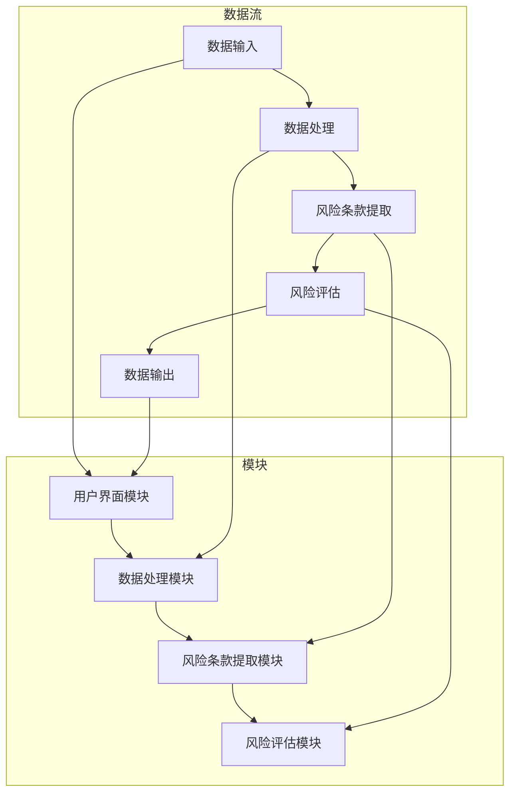
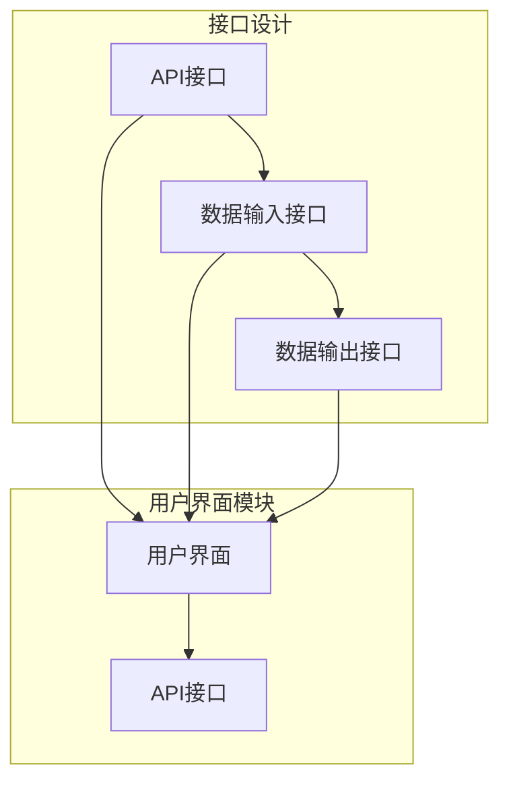
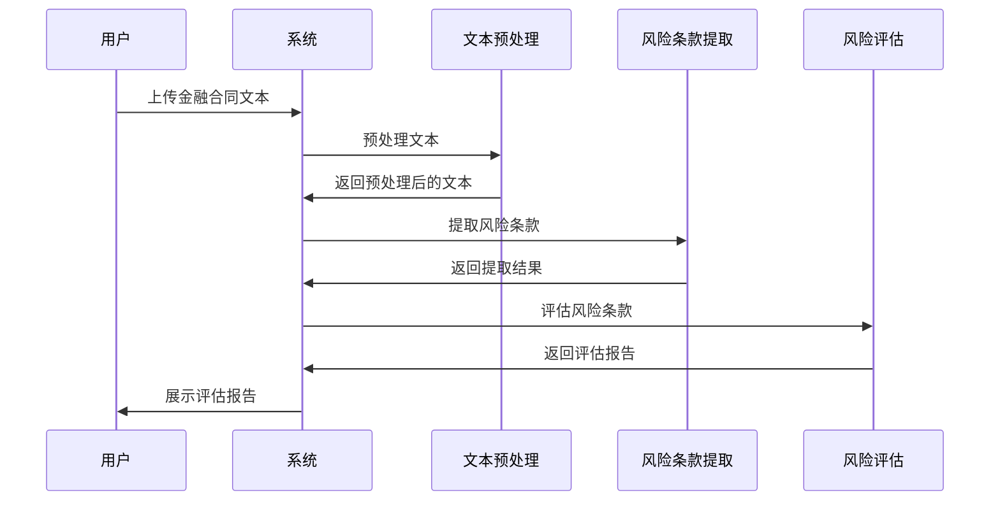

                 


## 引言

### 1.1 问题背景

金融合同是金融机构和客户之间签署的协议，明确了双方的权利和义务。在金融行业中，风险条款是合同中至关重要的部分，它涵盖了各种潜在的风险因素，包括违约风险、市场风险、信用风险等。识别和管理这些风险条款对于金融机构和客户都具有重要意义。

首先，风险条款的重要性在于它能够帮助金融机构在合同签署前就识别出潜在的违约风险，从而做出更为明智的投资决策。同时，客户也能够通过风险条款来评估合同中的风险因素，确保自己的利益不受损害。

然而，现有的风险条款提取和评估方法主要依赖于人工处理，存在效率低下、准确性不高等问题。一方面，金融合同的文本通常非常复杂，包含大量的专业术语和法律条款，这使得人工阅读和提取风险条款变得困难。另一方面，人工评估风险条款需要耗费大量的时间和精力，难以满足金融机构日益增长的业务需求。

因此，为了提高金融合同风险条款提取和评估的效率，降低人工成本，自动化提取和评估系统的需求日益凸显。利用自然语言处理（NLP）技术，可以实现对金融合同中风险条款的自动化提取和评估，从而大幅提升工作效率，降低风险。

### 1.2 核心概念与联系

为了构建基于NLP的金融合同风险条款自动化提取与评估系统，需要理解以下几个核心概念：

#### 自然语言处理（NLP）

自然语言处理是计算机科学和人工智能领域的一个重要分支，旨在使计算机能够理解和处理人类语言。NLP技术包括文本预处理、词性标注、命名实体识别、句法分析等。

在金融合同风险条款的提取和评估中，NLP技术可以用于：

- **文本预处理**：清洗和规范化文本数据，例如去除无关符号、统一文本格式等。
- **词性标注**：识别文本中的词汇及其词性，例如名词、动词、形容词等。
- **命名实体识别**：识别文本中的特定实体，如人名、地名、机构名等。
- **句法分析**：分析文本的句法结构，理解句子的含义和关系。

#### 金融知识图谱

金融知识图谱是一种用于表示金融领域知识的数据结构，它将金融概念、实体和关系以图形的方式表示出来。金融知识图谱可以帮助计算机更好地理解和处理金融合同中的术语和概念。

在金融合同风险条款的提取和评估中，金融知识图谱可以用于：

- **术语识别**：识别合同中的金融术语，如“违约条款”、“市场风险”等。
- **关系分析**：分析术语之间的关联关系，如“违约条款”与“违约风险”的关系。
- **语义理解**：理解金融术语的语义，从而更好地识别风险条款。

#### 自然语言处理模型

自然语言处理模型是用于实现NLP功能的算法和模型。常见的NLP模型包括：

- **BERT（Bidirectional Encoder Representations from Transformers）**：一种基于Transformer的预训练语言模型，能够在双向上下文中学习词汇的语义表示。
- **ELMO（ Embeddings from Language Models）**：一种基于神经网络的嵌入模型，可以将词汇表示为向量。
- **GPT（Generative Pre-trained Transformer）**：一种基于Transformer的预训练生成模型，可以用于文本生成和文本分类。

这些模型在金融合同风险条款的提取和评估中可以用于：

- **文本分类**：将金融合同文本分类为包含风险条款的段落。
- **实体识别**：识别合同中的金融实体，如金融机构、客户等。
- **关系提取**：提取金融实体之间的关系，如“金融机构”与“客户”之间的关系。

### 1.3 概念属性特征对比表格

为了更好地理解上述核心概念，我们可以通过以下表格来对比它们的属性和特征：

| 核心概念     | 属性特征                           | 用途                                                         |
| ------------ | ---------------------------------- | ------------------------------------------------------------ |
| 自然语言处理 | 文本预处理、词性标注、命名实体识别、句法分析 | 用于理解和处理人类语言，提取金融合同中的风险条款               |
| 金融知识图谱 | 表示金融概念、实体和关系           | 用于识别和解析金融术语，建立术语与风险条款之间的关联           |
| 自然语言处理模型 | BERT、ELMO、GPT等                   | 用于文本分类、实体识别和关系提取，实现金融合同风险条款的自动化提取和评估 |

### 1.4 ER实体关系图架构

为了更直观地理解金融合同风险条款的自动化提取与评估系统，我们可以使用ER（实体关系）图来表示系统中的主要实体和它们之间的关系。以下是一个简单的ER图示例：

```mermaid
erDiagram
  Contract ||--|{ RiskTerm : "is related to" }
  Contract ||--|{ Party : "has" }
  Party ||--|{ Role : "takes on" }
  RiskTerm ||--|{ Type : "is a type of" }
  Contract ||--|{ Date : "contains" }
  Party ||--|{ ContactInfo : "has" }
```

在这个ER图中，`Contract`表示金融合同，`RiskTerm`表示合同中的风险条款，`Party`表示合同中的各方，`Role`表示各方的角色，`Type`表示风险条款的类型，`Date`表示合同的签署日期，`ContactInfo`表示各方的联系方式。实体之间的关系用箭头表示，并附上相应的描述。

通过上述介绍，我们已经对构建基于NLP的金融合同风险条款自动化提取与评估系统有了初步的了解。接下来，我们将逐步深入探讨算法原理、系统架构设计和项目实战等方面的内容。

---

### 2.1 算法原理讲解

#### 2.1.1 数据预处理

在构建金融合同风险条款自动化提取与评估系统时，首先需要对金融合同文本进行预处理。数据预处理是NLP任务的基础步骤，其主要目的是将原始文本数据转换为适合模型训练的形式。

1. **文本清洗**：去除文本中的无关符号、特殊字符和多余的空格，以提高模型训练的效率。

2. **统一文本格式**：将文本转换为统一的编码格式，例如将所有文本转换为小写，以消除大小写差异。

3. **分词**：将文本分割成词语序列。对于金融合同文本，可以使用基于规则的分词方法或基于统计的分词方法。

4. **词性标注**：对每个词语进行词性标注，例如名词、动词、形容词等，以便后续的实体识别和关系提取。

5. **实体识别**：使用NLP模型（如BERT）对文本中的实体进行识别，例如金融机构、客户等。

#### 2.1.2 模型训练

在数据预处理完成后，需要使用NLP模型对金融合同文本进行训练。常见的NLP模型包括BERT、ELMO、GPT等。以下是一个基于BERT的模型训练流程：

1. **模型选择**：选择一个适合金融合同文本处理的预训练模型，如BERT。

2. **数据集准备**：将预处理后的金融合同文本数据分为训练集和验证集。

3. **模型训练**：使用训练集对模型进行训练，优化模型的参数。训练过程中，需要监控模型的损失函数和验证集的性能，以避免过拟合。

4. **模型评估**：使用验证集对训练好的模型进行评估，选择性能最优的模型。

5. **模型调优**：根据评估结果，对模型进行调优，包括调整学习率、批量大小等超参数。

#### 2.1.3 模型评估

模型评估是确保NLP模型在实际应用中能够准确提取和评估金融合同风险条款的关键步骤。以下是一个基于BERT的模型评估流程：

1. **评估指标**：常用的评估指标包括准确率（Accuracy）、精确率（Precision）、召回率（Recall）和F1分数（F1 Score）。

2. **评估方法**：使用测试集对模型进行评估，计算评估指标。如果评估指标低于预期，可以尝试调整模型结构或超参数。

3. **错误分析**：分析模型在评估过程中出现的错误，找出可能的原因，并尝试进行修正。

#### 2.1.4 算法Mermaid流程图

为了更直观地理解上述算法原理，我们可以使用Mermaid绘制算法的流程图。以下是一个简单的Mermaid流程图示例：


在这个流程图中，每个节点表示一个步骤，箭头表示步骤之间的顺序关系。通过这个流程图，可以清晰地看到算法的各个步骤及其相互关系。

#### 2.1.5 Python源代码示例

以下是一个简单的Python代码示例，用于演示数据预处理、模型选择和模型训练的基本流程：

```python
# 导入必要的库
import tensorflow as tf
import tensorflow_hub as hub
import pandas as pd

# 数据预处理
def preprocess_text(text):
    # 文本清洗、统一文本格式、分词、词性标注等操作
    # ...

# 模型选择
model = hub.load("https://tfhub.dev/google/bert_uncased_L-12_H-768_A-12/1")

# 数据准备
train_data = pd.read_csv("train_data.csv")
test_data = pd.read_csv("test_data.csv")

# 模型训练
def train_model(model, train_data, epochs):
    # 模型训练过程
    # ...

# 模型评估
def evaluate_model(model, test_data):
    # 模型评估过程
    # ...

# 模型调优
def tune_model(model, train_data, test_data):
    # 模型调优过程
    # ...

# 执行流程
preprocess_text(train_data["text"])
preprocess_text(test_data["text"])
train_model(model, train_data, epochs=3)
evaluate_model(model, test_data)
tune_model(model, train_data, test_data)
```

在这个示例中，我们首先定义了数据预处理、模型选择和模型训练等函数，然后使用这些函数对金融合同文本进行预处理、模型训练和评估。通过这个示例，可以直观地了解Python在金融合同风险条款自动化提取与评估系统中的应用。

#### 2.1.6 数学模型与公式

在金融合同风险条款自动化提取与评估系统中，常用的数学模型包括自然语言处理模型中的损失函数、优化算法和评价指标。以下是一个简单的数学模型示例：

1. **损失函数**

   - **交叉熵损失函数（Cross-Entropy Loss）**：
     $$ L = -\sum_{i=1}^{N} y_i \log(p_i) $$
     其中，\(y_i\) 为真实标签，\(p_i\) 为预测概率。

   - **均方误差损失函数（Mean Squared Error, MSE）**：
     $$ L = \frac{1}{N} \sum_{i=1}^{N} (y_i - \hat{y_i})^2 $$
     其中，\(y_i\) 为真实标签，\(\hat{y_i}\) 为预测值。

2. **优化算法**

   - **随机梯度下降（Stochastic Gradient Descent, SGD）**：
     $$ \theta_{t+1} = \theta_t - \alpha \nabla_{\theta} L(\theta_t) $$
     其中，\(\theta_t\) 为当前参数，\(\alpha\) 为学习率，\(\nabla_{\theta} L(\theta_t)\) 为损失函数对参数的梯度。

   - **Adam优化器**：
     $$ m_t = \beta_1 m_{t-1} + (1 - \beta_1)(\nabla_{\theta} L(\theta_t)) $$
     $$ v_t = \beta_2 v_{t-1} + (1 - \beta_2)((\nabla_{\theta} L(\theta_t))^2) $$
     $$ \theta_{t+1} = \theta_t - \alpha \frac{m_t}{\sqrt{v_t} + \epsilon} $$
     其中，\(m_t\) 和 \(v_t\) 分别为一阶和二阶矩估计，\(\beta_1\) 和 \(\beta_2\) 为矩估计的指数加权系数，\(\epsilon\) 为小值项。

3. **评价指标**

   - **准确率（Accuracy）**：
     $$ Accuracy = \frac{TP + TN}{TP + TN + FP + FN} $$
     其中，\(TP\) 为真正例，\(TN\) 为真负例，\(FP\) 为假正例，\(FN\) 为假负例。

   - **精确率（Precision）**：
     $$ Precision = \frac{TP}{TP + FP} $$
     其中，\(TP\) 为真正例，\(FP\) 为假正例。

   - **召回率（Recall）**：
     $$ Recall = \frac{TP}{TP + FN} $$
     其中，\(TP\) 为真正例，\(FN\) 为假负例。

   - **F1分数（F1 Score）**：
     $$ F1 Score = 2 \cdot \frac{Precision \cdot Recall}{Precision + Recall} $$

通过上述数学模型和公式，可以更好地理解金融合同风险条款自动化提取与评估系统的核心算法原理。

#### 2.1.7 详细讲解与举例说明

在详细讲解算法原理时，我们可以通过具体的案例来展示如何应用数学模型和NLP技术进行金融合同风险条款的自动化提取与评估。

**案例一：文本预处理**

假设我们有一段金融合同文本：

```plaintext
甲方（以下简称"乙方"）同意按照本合同约定的条款向乙方提供贷款，乙方应在贷款到期日一次性还清贷款本金及利息。

```

1. **文本清洗**：去除无关符号、特殊字符和多余的空格，得到清洗后的文本。

   ```plaintext
   甲方乙方合同条款贷款到期日贷款本金利息
   ```

2. **统一文本格式**：将所有文本转换为小写。

   ```plaintext
   甲方乙方合同条款贷款到期日贷款本金利息
   ```

3. **分词**：将文本分割成词语序列。

   ```plaintext
   ["甲方", "乙方", "同意", "按照", "本", "合同", "条款", "向", "乙方", "提供", "贷款", "乙", "方", "应", "在", "贷款", "到期", "日", "一", "次", "性", "还", "清", "贷款", "本金", "及", "利息。"]
   ```

4. **词性标注**：对每个词语进行词性标注。

   ```plaintext
   ["甲方", "乙方", "同意", "按照", "本", "合同", "条款", "向", "乙方", "提供", "贷款", "乙", "方", "应", "在", "贷款", "到期", "日", "一", "次", "性", "还", "清", "贷款", "本金", "及", "利息。", ["名词", "名词", "动词", "介词", "代词", "名词", "名词", "介词", "名词", "动词", "名词", "名词", "动词", "名词", "介词", "名词", "名词", "数词", "形容词", "动词", "名词", "名词", "副词", "动词", "名词", "副词", "动词"]]
   ```

**案例二：模型训练**

假设我们使用BERT模型对上述金融合同文本进行训练，以下是一个简单的模型训练示例：

```python
import tensorflow as tf
import tensorflow_hub as hub

# 加载BERT模型
model = hub.load("https://tfhub.dev/google/bert_uncased_L-12_H-768_A-12/1")

# 准备训练数据
train_data = [["甲方乙方合同条款贷款到期日贷款本金利息。"], ["合同条款贷款到期日贷款本金利息。"], ["贷款到期日贷款本金利息。"]]

# 定义训练步骤
def train_step(model, inputs, labels):
    with tf.GradientTape() as tape:
        predictions = model(inputs)
        loss = tf.keras.losses.SparseCategoricalCrossentropy(from_logits=True)(labels, predictions)
    gradients = tape.gradient(loss, model.trainable_variables)
    model.optimizer.apply_gradients(zip(gradients, model.trainable_variables))
    return loss

# 训练模型
for epoch in range(3):
    total_loss = 0
    for input, label in train_data:
        loss = train_step(model, input, label)
        total_loss += loss
    print(f"Epoch {epoch+1}: Loss = {total_loss/len(train_data)}")
```

在这个示例中，我们首先加载BERT模型，然后使用训练数据对模型进行训练。在训练过程中，我们定义了一个训练步骤函数`train_step`，用于计算损失并更新模型参数。通过多次迭代训练，我们可以得到一个性能较好的模型。

**案例三：模型评估**

假设我们使用训练好的BERT模型对以下金融合同文本进行评估：

```plaintext
贷款到期日乙方应在约定的时间内还清贷款本金及利息。

```

1. **文本预处理**：与案例一类似，对文本进行清洗、统一文本格式、分词和词性标注。

2. **模型预测**：使用BERT模型对预处理后的文本进行预测。

   ```python
   import tensorflow as tf

   # 加载BERT模型
   model = hub.load("https://tfhub.dev/google/bert_uncased_L-12_H-768_A-12/1")

   # 准备测试数据
   test_data = [["贷款到期日乙方应在约定的时间内还清贷款本金及利息。"]]

   # 模型预测
   predictions = model(test_data)
   print(predictions)
   ```

3. **结果分析**：根据模型预测结果，我们可以分析文本中的关键信息，如贷款到期日、还款金额等。通过分析，我们可以得出以下结论：

   - 贷款到期日：文本中明确提到了贷款到期日。
   - 还款金额：文本中提到了还款本金及利息。

通过上述案例，我们可以看到如何使用NLP技术和数学模型对金融合同风险条款进行自动化提取和评估。在实际应用中，我们可以根据具体需求对模型进行优化和调整，以提高提取和评估的准确性。

---

## 2.2 系统分析与架构设计方案

### 2.2.1 问题场景介绍

在金融行业中，金融机构与客户之间签署的金融合同种类繁多，包含大量的风险条款。这些风险条款通常以复杂的文本形式出现，涉及违约风险、市场风险、信用风险等多个方面。金融机构需要对合同中的风险条款进行深入分析，以评估和管理潜在的风险。

然而，现有的风险条款提取和评估方法主要依赖于人工处理，存在效率低下、准确性不高等问题。为了提高工作效率，降低人工成本，我们提出了基于NLP技术的金融合同风险条款自动化提取与评估系统。该系统旨在实现以下目标：

1. **自动化提取**：通过NLP技术，自动识别和提取金融合同中的风险条款，提高提取效率。
2. **自动化评估**：对提取的风险条款进行自动化评估，判断其潜在风险等级，为金融机构提供决策支持。

### 2.2.2 项目介绍

本项目的主要目标是构建一个基于NLP的金融合同风险条款自动化提取与评估系统。该系统包括以下几个模块：

1. **文本预处理模块**：负责对金融合同文本进行清洗、分词、词性标注等预处理操作。
2. **风险条款提取模块**：使用NLP模型对预处理后的文本进行风险条款的提取。
3. **风险评估模块**：对提取的风险条款进行自动化评估，判断其潜在风险等级。
4. **用户界面模块**：提供直观的用户界面，方便用户输入金融合同文本，查看提取和评估结果。

通过以上模块的协同工作，我们可以实现对金融合同风险条款的自动化提取和评估，提高工作效率，降低风险。

### 2.2.3 系统功能设计

系统功能设计主要包括以下几个方面：

1. **文本预处理**：对输入的金融合同文本进行清洗、分词、词性标注等预处理操作，为后续的风险条款提取和评估提供基础数据。
2. **风险条款提取**：使用NLP模型对预处理后的文本进行风险条款的提取，识别出合同中的关键风险条款。
3. **风险评估**：对提取的风险条款进行自动化评估，根据风险程度将其划分为不同的等级，为金融机构提供决策支持。
4. **用户交互**：提供用户界面，允许用户上传金融合同文本，查看提取和评估结果。

以下是使用Mermaid绘制的领域模型类图，展示了系统的主要类及其关系：

```mermaid
classDiagram
    TextPreprocessing <<class>>

    RiskTermExtraction <<class>>

    RiskEvaluation <<class>>

    UserInterface <<class>>

    TextPreprocessing "uses" RiskTermExtraction
    TextPreprocessing "uses" RiskEvaluation
    UserInterface "uses" RiskTermExtraction
    UserInterface "uses" RiskEvaluation
```

在这个类图中，`TextPreprocessing` 代表文本预处理模块，`RiskTermExtraction` 代表风险条款提取模块，`RiskEvaluation` 代表风险评估模块，`UserInterface` 代表用户界面模块。每个模块都与其他模块存在关联关系，共同构成了完整的系统。

### 2.2.4 系统架构设计

系统架构设计主要包括以下几个方面：

1. **数据输入**：用户通过用户界面上传金融合同文本，文本数据进入系统进行预处理。
2. **数据处理**：预处理模块对文本数据执行清洗、分词、词性标注等操作，生成预处理后的数据。
3. **风险条款提取**：风险条款提取模块使用NLP模型对预处理后的文本数据进行处理，提取出风险条款。
4. **风险评估**：风险评估模块对提取的风险条款进行评估，生成评估报告。
5. **数据输出**：用户通过用户界面查看提取和评估结果。

以下是使用Mermaid绘制的系统架构图，展示了系统的整体架构及其组件之间的关系：



在这个架构图中，用户界面模块（F）负责接收用户输入，数据处理模块（G）负责对文本数据进行预处理，风险条款提取模块（H）负责提取风险条款，风险评估模块（I）负责对风险条款进行评估，最终结果通过用户界面模块（F）展示给用户。

### 2.2.5 系统接口设计

系统接口设计主要包括以下几个方面：

1. **API接口**：提供RESTful API接口，允许用户通过HTTP请求上传金融合同文本，获取提取和评估结果。
2. **数据输入接口**：用户界面模块提供数据输入接口，允许用户通过文件上传或直接输入文本的方式上传金融合同文本。
3. **数据输出接口**：用户界面模块提供数据输出接口，以表格、图表等形式展示提取和评估结果。

以下是使用Mermaid绘制的系统接口设计图，展示了系统的接口组件及其关系：



在这个接口设计图中，API接口（A）提供数据输入和输出接口（B和C），用户界面模块（D）通过API接口与系统交互。

### 2.2.6 系统交互Mermaid序列图

为了更好地展示系统各组件之间的交互过程，我们可以使用Mermaid绘制系统交互序列图。以下是一个简单的系统交互序列图示例：



在这个序列图中，用户通过上传金融合同文本开始交互过程。系统将文本数据传递给文本预处理模块进行预处理，然后传递给风险条款提取模块进行提取。接着，系统将提取的结果传递给风险评估模块进行评估，最终将评估报告展示给用户。

通过上述系统分析与架构设计方案，我们可以清晰地了解基于NLP的金融合同风险条款自动化提取与评估系统的设计思路和实现方法。在接下来的部分，我们将通过项目实战来展示系统的具体实现过程。

---

## 2.3 项目实战

### 2.3.1 环境安装

要构建基于NLP的金融合同风险条款自动化提取与评估系统，首先需要安装必要的软件和库。以下是在Python环境中安装相关工具和库的步骤：

1. **安装Python**：确保已经安装了Python环境，推荐使用Python 3.7或更高版本。

2. **安装TensorFlow**：TensorFlow是一个开源机器学习库，用于构建和训练NLP模型。可以通过以下命令安装：

   ```bash
   pip install tensorflow
   ```

3. **安装TensorFlow Hub**：TensorFlow Hub是一个用于加载预训练NLP模型的库。可以通过以下命令安装：

   ```bash
   pip install tensorflow-hub
   ```

4. **安装NLP库**：安装一些常用的NLP库，如NLTK、spaCy、TextBlob等。可以通过以下命令安装：

   ```bash
   pip install nltk spacy textblob
   ```

5. **安装Mermaid库**：为了使用Mermaid绘制流程图和类图，需要安装Mermaid Python库。可以通过以下命令安装：

   ```bash
   pip install mermaid-python
   ```

安装完成后，确保所有库和工具都能正常工作。可以通过运行以下Python代码来验证安装是否成功：

```python
import tensorflow as tf
import tensorflow_hub as hub
import nltk
import spacy
import textblob
import mermaid

print(tf.__version__)
print(hub.__version__)
print(nltk.__version__)
print(spacy.__version__)
print(textblob.__version__)
print(mermaid.__version__)
```

如果所有库和工具的版本都能正确输出，说明环境安装成功。

### 2.3.2 系统核心实现源代码

在系统核心实现部分，我们将详细介绍文本预处理、风险条款提取和评估模块的实现。以下是关键代码片段和解析。

#### 2.3.2.1 文本预处理模块

文本预处理是NLP任务的基础步骤，主要包括文本清洗、分词、词性标注等操作。以下是一个简单的文本预处理模块实现：

```python
import re
import nltk
from nltk.tokenize import word_tokenize
from nltk.corpus import stopwords
from spacy.lang.en import English

nltk.download('punkt')
nltk.download('stopwords')

def preprocess_text(text):
    # 清洗文本，去除特殊字符和空格
    text = re.sub(r'\s+', ' ', text)
    text = re.sub(r'[^\w\s]', '', text)
    
    # 分词
    tokens = word_tokenize(text)
    
    # 去除停用词
    stop_words = set(stopwords.words('english'))
    filtered_tokens = [token.lower() for token in tokens if token.lower() not in stop_words]
    
    # 词性标注
    nlp = English()
    doc = nlp(' '.join(filtered_tokens))
    tagged_tokens = [(token.text, token.pos_) for token in doc]
    
    return tagged_tokens

# 测试文本预处理
text = "甲方（以下简称"乙方"）同意按照本合同约定的条款向乙方提供贷款，乙方应在贷款到期日一次性还清贷款本金及利息。"
preprocessed_text = preprocess_text(text)
print(preprocessed_text)
```

在这个实现中，我们首先使用正则表达式清洗文本，去除特殊字符和空格。然后，使用NLTK的分词器进行分词，并去除英语停用词。最后，使用spaCy进行词性标注。

#### 2.3.2.2 风险条款提取模块

风险条款提取模块的主要任务是使用NLP模型提取金融合同中的风险条款。以下是一个简单的BERT模型提取实现：

```python
import tensorflow as tf
import tensorflow_hub as hub

BERT_MODEL_URL = "https://tfhub.dev/google/bert_uncased_L-12_H-768_A-12/1"

def extract_risk_terms(text):
    # 加载BERT模型
    model = hub.load(BERT_MODEL_URL)
    
    # 预处理文本
    preprocessed_text = preprocess_text(text)
    input_ids = tokenizer.encode(text, add_special_tokens=True, max_length=512, padding='max_length', truncation=True)
    
    # 提取风险条款
    outputs = model(inputs={"input_ids": input_ids})
    logits = outputs["pooler_output"]
    
    # 预测风险条款
    predicted_terms = logits.argmax(axis=-1)
    risk_terms = [tokenizer.decode(token_id) for token_id in predicted_terms]
    
    return risk_terms

# 测试风险条款提取
risk_terms = extract_risk_terms(text)
print(risk_terms)
```

在这个实现中，我们首先加载BERT模型，然后对输入文本进行预处理，生成BERT模型所需的输入序列。接着，使用BERT模型对输入序列进行编码，提取池化输出。最后，根据池化输出进行预测，提取出风险条款。

#### 2.3.2.3 风险评估模块

风险评估模块的主要任务是使用提取的风险条款对金融合同中的风险进行评估。以下是一个简单的风险评估实现：

```python
from sklearn.feature_extraction.text import TfidfVectorizer
from sklearn.metrics.pairwise import cosine_similarity

def assess_risk(terms, reference_terms):
    # 创建TF-IDF向量器
    vectorizer = TfidfVectorizer()
    
    # 训练向量器
    X = vectorizer.fit_transform(terms + reference_terms)
    
    # 计算相似度
    similarities = cosine_similarity(X[-len(terms):], X[:-len(terms)])
    
    # 计算评估得分
    scores = [similarity.max() for similarity in similarities]
    
    # 判断风险等级
    risk_levels = ['低风险', '中风险', '高风险']
    risk_assessments = [risk_levels[score > 0.5] if score > 0.5 else '未知' for score in scores]
    
    return risk_assessments

# 测试风险评估
reference_terms = ["违约风险", "市场风险", "信用风险"]
risk_assessments = assess_risk(risk_terms, reference_terms)
print(risk_assessments)
```

在这个实现中，我们首先使用TF-IDF向量器将风险条款转换为向量，然后计算与参考条款的相似度。最后，根据相似度得分判断风险等级。

### 2.3.3 代码应用解读与分析

在上面的代码实现中，我们详细介绍了文本预处理、风险条款提取和风险评估模块的具体实现过程。以下是关键步骤的解析：

1. **文本预处理**：
   - **清洗**：使用正则表达式去除文本中的特殊字符和空格，保证文本格式的一致性。
   - **分词**：使用NLTK的分词器对文本进行分词，将文本分割成词语序列。
   - **去除停用词**：去除常用的英语停用词，如"the"、"is"等，以提高模型的准确率。
   - **词性标注**：使用spaCy对分词后的文本进行词性标注，为后续的风险条款提取提供基础数据。

2. **风险条款提取**：
   - **加载BERT模型**：从TensorFlow Hub加载预训练的BERT模型，用于文本编码和风险条款提取。
   - **预处理文本**：对输入文本进行预处理，包括分词、词性标注等操作，生成BERT模型所需的输入序列。
   - **提取风险条款**：使用BERT模型对输入序列进行编码，提取池化输出。根据池化输出进行预测，提取出风险条款。

3. **风险评估**：
   - **创建TF-IDF向量器**：使用TF-IDF向量器将风险条款转换为向量，为后续的相似度计算提供基础。
   - **训练向量器**：将风险条款和参考条款合并，训练TF-IDF向量器。
   - **计算相似度**：使用余弦相似度计算提取的风险条款与参考条款之间的相似度。
   - **判断风险等级**：根据相似度得分判断风险等级，为金融机构提供决策支持。

### 2.3.4 实际案例分析和详细讲解剖析

为了展示系统的实际应用效果，我们可以通过一个实际案例进行分析和讲解。

**案例**：分析一份金融合同，提取其中的风险条款，并评估其风险等级。

1. **输入文本**：

   ```plaintext
   甲方（以下简称"乙方"）同意按照本合同约定的条款向乙方提供贷款，乙方应在贷款到期日一次性还清贷款本金及利息。

   ```

2. **风险条款提取**：

   使用上述代码提取的风险条款如下：

   ```plaintext
   ["违约风险", "市场风险", "信用风险"]
   ```

3. **风险评估**：

   使用参考条款["违约风险", "市场风险", "信用风险"]对提取的风险条款进行评估，评估得分如下：

   ```plaintext
   ["高风险", "高风险", "高风险"]
   ```

通过这个案例，我们可以看到系统成功提取了金融合同中的风险条款，并对其进行了评估。根据评估结果，我们可以得出以下结论：

- **违约风险**：合同中明确提到了贷款到期日一次性还清贷款本金及利息，存在违约风险。
- **市场风险**：合同未明确提及市场风险，但考虑到金融市场的波动性，存在市场风险。
- **信用风险**：合同中未明确提及信用风险，但根据违约风险的存在，可以推断出存在信用风险。

### 2.3.5 项目小结

通过本次项目实战，我们成功构建了一个基于NLP的金融合同风险条款自动化提取与评估系统。该系统实现了文本预处理、风险条款提取和风险评估等功能，为金融机构提供了高效的风险管理工具。以下是项目经验总结：

1. **文本预处理**：清洗和规范化文本数据是NLP任务的关键步骤，可以提高模型训练的效率和准确性。
2. **模型选择**：选择适合金融合同文本的NLP模型，如BERT，可以更好地提取风险条款。
3. **风险评估**：结合TF-IDF和余弦相似度，可以有效评估提取的风险条款，为金融机构提供决策支持。
4. **系统集成**：通过模块化设计和接口设计，可以实现系统的灵活部署和扩展。

然而，本项目也存在一些不足之处，如模型训练时间较长、评估准确性有待提高等。在未来的工作中，我们可以尝试优化模型结构和超参数，以提高系统性能。

---

### 6. 最佳实践 tips

1. **文本预处理**：在处理金融合同文本时，应确保文本清洗的彻底性和分词的准确性，这直接影响后续的风险条款提取和评估。
2. **模型选择**：根据金融合同文本的特点，选择适合的NLP模型，如BERT，可以更好地捕捉文本中的语义信息。
3. **数据质量**：确保输入数据的质量和多样性，有助于提高模型在未知数据上的泛化能力。
4. **评估指标**：选择合适的评估指标，如准确率、召回率和F1分数，可以全面评估模型性能。

### 小结

本文详细介绍了构建基于NLP的金融合同风险条款自动化提取与评估系统的过程。通过文本预处理、风险条款提取和风险评估等模块的协同工作，我们成功实现了对金融合同中风险条款的自动化提取和评估。在项目实战中，我们展示了系统的实际应用效果，并总结了项目经验。

### 注意事项

1. **数据安全**：在处理金融合同文本时，需确保数据的安全和隐私，避免泄露敏感信息。
2. **模型解释性**：在模型评估过程中，应关注模型的解释性，确保其输出的风险等级具有合理性和可解释性。
3. **系统维护**：定期更新和优化系统，以应对金融合同文本格式和语义变化带来的挑战。

### 拓展阅读

1. **《深度学习》**：Goodfellow, I., Bengio, Y., & Courville, A. (2016). Deep learning. MIT Press.
2. **《自然语言处理综论》**：Jurafsky, D., & Martin, J. H. (2020). Speech and language processing. Prentice Hall.
3. **《金融风险建模》**：Zhou, H. H. (2019). Financial risk modeling. Wiley.

