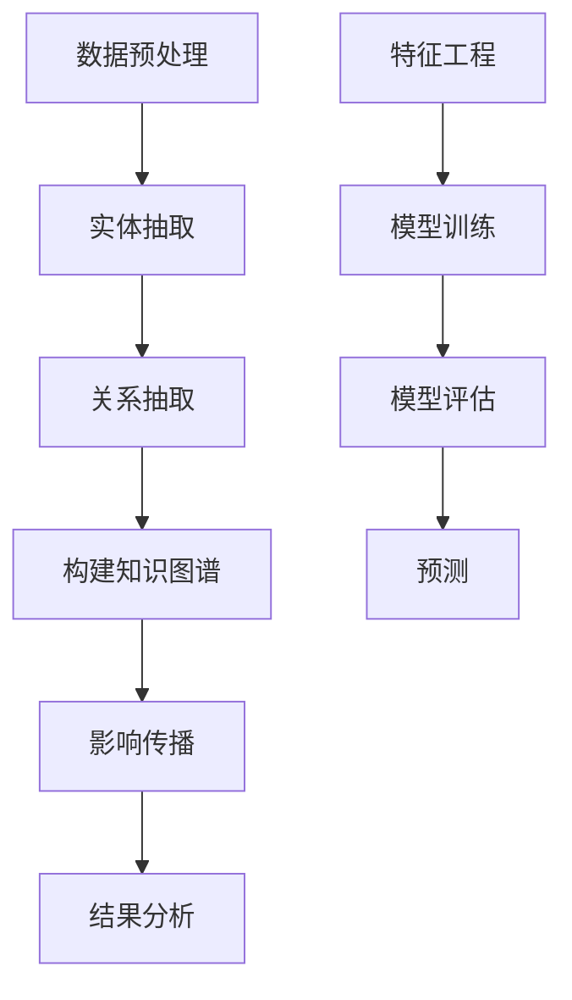
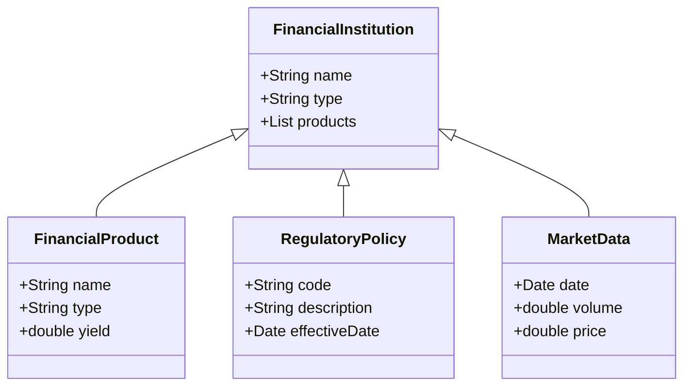
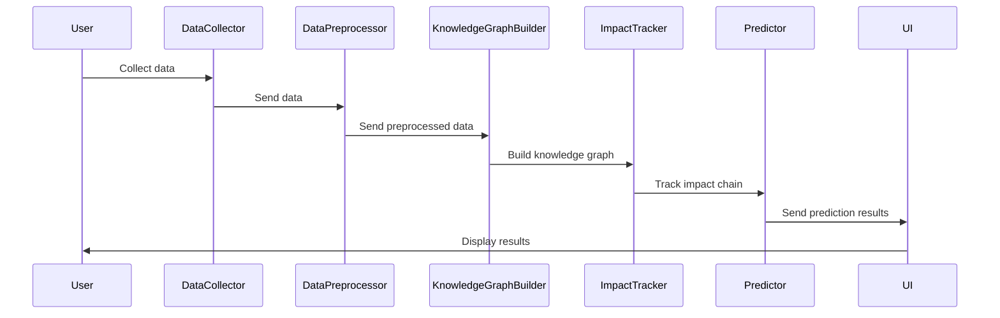
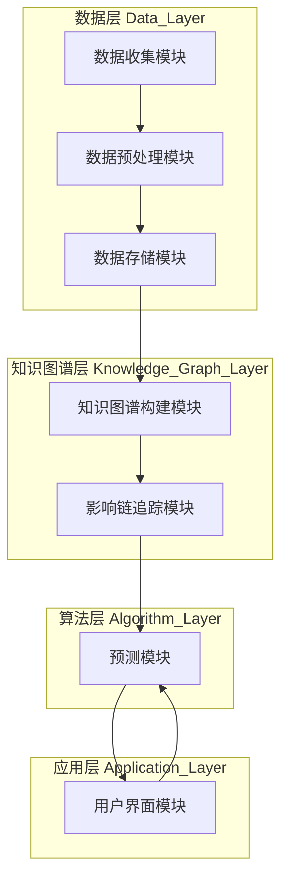
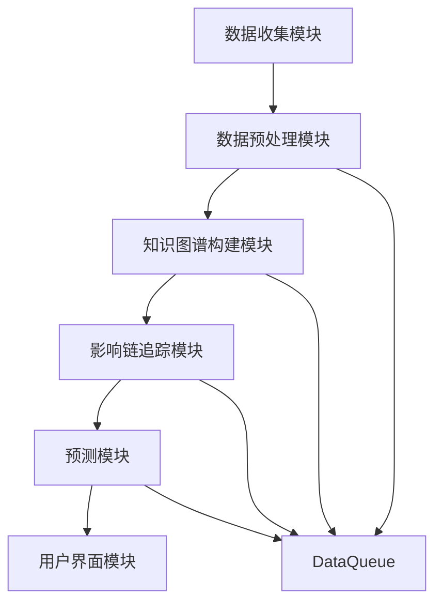
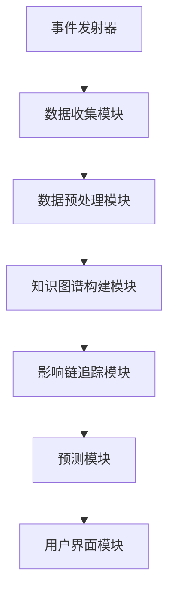
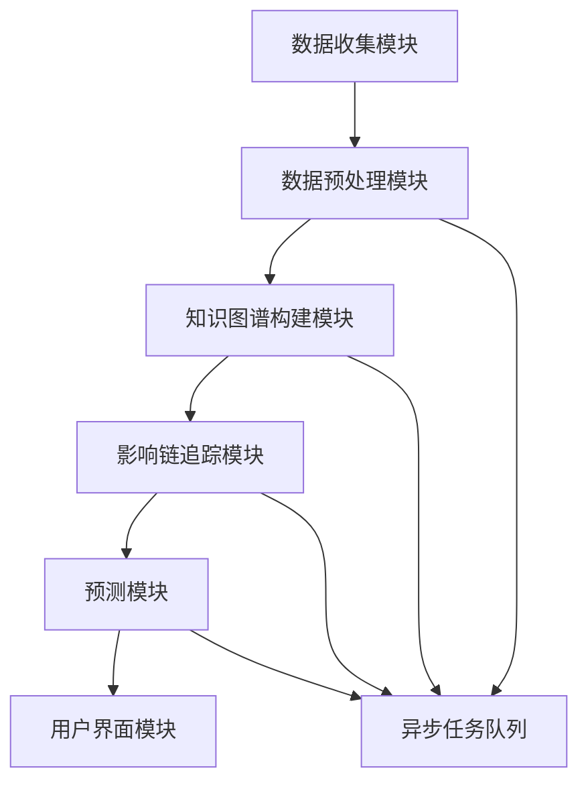

                 


## 1.1 问题的背景与重要性

随着金融市场的全球化发展和金融工具的日益复杂化，金融监管的重要性日益凸显。传统的金融监管方法主要依赖于规则和经验，这往往会导致监管盲区、监管滞后以及监管效率低下等问题。为了应对这些挑战，构建一个基于知识图谱的金融监管政策影响链追踪与预测系统显得尤为重要。

### 1.1.1 金融监管政策的影响

金融监管政策是金融体系稳定运行的重要保障。政策的制定和执行对金融市场、金融机构、金融产品以及金融消费者都会产生深远的影响。例如，利率政策的调整会影响贷款成本和投资回报，资本充足率的要求会影响银行的信贷扩张能力，而反洗钱政策的加强则会对金融交易的透明度提出更高要求。

#### 监管盲区与监管滞后

在复杂的金融市场中，监管盲区往往会导致监管不到位，例如，新兴金融工具和平台的发展速度可能超过监管政策的更新速度，导致监管空白。监管滞后则会导致监管行动落后于市场变化，从而降低监管效果。

#### 监管效率低下

传统的金融监管方法主要依赖于人工审查和统计数据分析，这不仅耗时耗力，而且容易出现人为错误。此外，监管机构的协调和沟通也往往存在问题，导致监管资源浪费。

### 1.1.2 当前金融监管面临的挑战

#### 多样化的金融产品与服务

随着金融创新的不断涌现，金融产品和服务种类日益丰富，监管机构需要面对越来越多的监管对象和监管内容。

#### 信息不对称

金融市场中存在严重的信息不对称问题，金融机构和消费者之间的信息不平等可能导致市场失灵和道德风险。

#### 全球化带来的监管协调问题

金融市场的全球化发展要求监管机构在全球范围内协调行动，但各国监管制度的差异和利益冲突使得全球监管协调成为一个巨大的挑战。

### 1.1.3 知识图谱技术在金融监管中的应用潜力

知识图谱技术作为一种新兴的数据管理技术，具有表示、存储和查询复杂信息的能力，可以有效地应对上述监管挑战。

#### 表示复杂关系

知识图谱能够表示金融市场中各类实体及其之间的关系，例如金融机构、金融产品、政策法规等，从而为监管机构提供全面、透明的监管视角。

#### 语义查询与推理

知识图谱技术支持基于语义的查询和推理，可以实现对监管政策影响的自动分析和预测，提高监管效率。

#### 实时性与动态调整

知识图谱技术支持实时数据更新和动态调整，能够及时响应市场变化和监管需求，减少监管滞后。

#### 集成多源数据

知识图谱技术能够集成来自不同来源的数据，例如市场数据、监管文件、新闻报道等，从而为监管机构提供丰富的信息支持。

## 2.1 知识图谱基础

知识图谱是一种语义网络，它通过实体、属性和关系来表示知识，使得计算机能够理解和处理复杂的信息。在金融监管领域，知识图谱技术可以为监管机构提供强有力的支持。

### 2.1.1 知识图谱的定义与结构

知识图谱由以下几部分组成：

- **实体（Entity）**：代表现实世界中的人、事、物等具体对象，如金融机构、金融产品、政策法规等。
- **属性（Attribute）**：描述实体的特征，如金融机构的注册资本、金融产品的收益率等。
- **关系（Relationship）**：表示实体之间的关系，如金融机构发行金融产品、政策法规影响金融产品等。

知识图谱的结构可以用图来表示，其中节点表示实体，边表示关系。

### 2.1.2 知识图谱的关键组件

知识图谱的构建和维护涉及多个关键组件：

- **数据源**：提供原始数据，可以是数据库、文件、API等。
- **数据预处理**：清洗、转换和集成数据，使其适合构建知识图谱。
- **实体抽取**：从原始数据中识别出实体，并确定其实体类型。
- **关系抽取**：从原始数据中识别出实体之间的关系。
- **知识存储**：将构建好的知识图谱存储在图数据库中，如Neo4j、OrientDB等。
- **查询接口**：提供API或图形界面，供用户查询知识图谱中的信息。

### 2.1.3 知识图谱的构建方法

构建知识图谱通常包括以下步骤：

1. **需求分析**：确定知识图谱的应用场景和需求。
2. **数据收集**：收集相关数据源。
3. **数据预处理**：对数据源进行清洗和转换。
4. **实体抽取**：使用命名实体识别技术识别出数据中的实体。
5. **关系抽取**：使用自然语言处理技术识别出实体之间的关系。
6. **知识存储**：将实体和关系存储在图数据库中。
7. **查询优化**：优化查询接口，提高查询效率。

### 2.1.4 知识图谱在金融监管中的应用

在金融监管中，知识图谱可以用于以下方面：

- **政策影响分析**：通过分析政策法规与金融产品、金融机构之间的关系，评估政策的影响。
- **风险监测**：通过分析金融市场中的风险因素，实时监测市场风险。
- **合规检查**：利用知识图谱进行合规检查，确保金融机构遵守相关法规。

## 2.2 金融监管政策解析

金融监管政策是金融监管机构制定的规章制度，旨在维护金融市场的稳定、透明和安全。理解金融监管政策对于构建基于知识图谱的监管系统至关重要。

### 2.2.1 金融监管政策概述

金融监管政策包括以下几个方面：

- **市场准入**：监管机构对金融机构、金融产品和金融服务的批准和监管。
- **市场运营**：对金融机构的日常运营进行监督，确保其合规和稳健。
- **风险控制**：监管机构对市场风险进行监测和管理，以防止系统性风险。
- **消费者保护**：保护金融消费者的合法权益，防止欺诈和不当行为。

### 2.2.2 金融监管政策的关键要素

金融监管政策的关键要素包括：

- **法律法规**：监管政策的法律依据，如《银行法》、《证券法》等。
- **监管机构**：负责制定和执行监管政策的机构，如中央银行、证券监管委员会等。
- **监管对象**：接受监管的金融机构、金融产品和金融消费者。
- **监管手段**：监管机构采取的监管措施，如审批、检查、处罚等。

### 2.2.3 金融监管政策的影响机制

金融监管政策的影响机制主要包括：

- **直接效应**：监管政策直接对金融机构和金融市场的运营产生影响。
- **间接效应**：监管政策通过影响市场信心、风险偏好等间接影响金融市场。
- **适应性效应**：金融机构和金融市场在监管政策作用下进行适应性调整。

### 2.2.4 金融监管政策的影响评估

评估金融监管政策的影响主要包括以下几个方面：

- **合规性评估**：评估金融机构是否遵守监管政策。
- **稳定性评估**：评估监管政策对金融市场稳定性的影响。
- **有效性评估**：评估监管政策在实现监管目标方面的效果。
- **效率评估**：评估监管政策的成本和效益。

## 2.3 影响链追踪与预测系统

构建基于知识图谱的金融监管政策影响链追踪与预测系统，旨在实时监测和预测金融监管政策对市场的影响。该系统包括多个关键模块，下面将逐一介绍。

### 2.3.1 系统目标与功能

系统的目标是：

- **追踪金融监管政策的影响链**：通过知识图谱技术，实时监测监管政策对金融市场各个环节的影响。
- **预测金融监管政策的未来影响**：基于历史数据和模型，预测监管政策可能带来的市场变化。

系统的核心功能包括：

- **政策影响分析**：分析监管政策对金融机构、金融产品、金融消费者的影响。
- **风险监测**：监测金融市场风险，及时发现潜在问题。
- **预测与预警**：预测监管政策可能带来的市场变化，提前预警。

### 2.3.2 系统架构设计

系统的架构设计包括以下几个方面：

- **数据层**：包括数据源、数据预处理和数据存储。数据源可以是监管文件、市场数据、新闻资讯等；数据预处理包括数据清洗、转换和集成；数据存储使用图数据库，如Neo4j。
- **知识图谱层**：构建基于金融监管政策的影响链知识图谱，包括实体（如金融机构、金融产品、政策法规等）和关系（如政策影响、风险传导等）。
- **算法层**：包括影响链追踪算法和预测算法，用于分析政策影响和预测市场变化。
- **应用层**：提供用户界面和API接口，供监管机构、金融机构和金融消费者使用。

### 2.3.3 系统关键算法

系统中的关键算法包括：

- **影响链追踪算法**：基于图算法，通过分析监管政策与金融市场的关联关系，追踪政策影响链。
- **预测算法**：基于机器学习技术，通过历史数据和模型，预测监管政策可能带来的市场变化。

## 3.1 算法设计原理

构建基于知识图谱的金融监管政策影响链追踪与预测系统，需要设计一系列算法来实现对监管政策影响的追踪与预测。本节将详细介绍算法的设计原理，包括影响链追踪算法和预测算法。

### 3.1.1 影响链追踪算法

影响链追踪算法的核心思想是通过分析监管政策与金融市场的关联关系，建立政策影响链。算法的具体步骤如下：

1. **数据预处理**：对监管政策文本、金融市场数据进行清洗和转换，提取关键信息。
2. **实体抽取**：使用命名实体识别（NER）技术，从预处理后的数据中识别出监管政策、金融机构、金融产品等实体。
3. **关系抽取**：通过自然语言处理技术，分析监管政策与金融市场实体之间的关系。
4. **构建知识图谱**：将实体和关系存储在知识图谱中，形成监管政策影响链。
5. **影响传播**：基于图算法，分析影响链中各节点之间的关联关系，追踪政策影响的传播路径。
6. **结果分析**：对追踪结果进行分析，评估政策影响的大小和范围。

### 3.1.2 预测算法

预测算法的核心思想是基于历史数据和模型，预测监管政策可能带来的市场变化。算法的具体步骤如下：

1. **数据收集**：收集与监管政策相关的历史市场数据，如股价、收益率、交易量等。
2. **特征工程**：对历史数据进行预处理，提取与监管政策相关的特征。
3. **模型训练**：使用机器学习算法，如回归分析、时间序列分析等，训练预测模型。
4. **模型评估**：使用验证集对模型进行评估，调整模型参数。
5. **预测**：使用训练好的模型，预测未来监管政策可能带来的市场变化。

### 3.1.3 算法流程图示例

为了更直观地展示算法流程，我们使用Mermaid图绘制了算法流程图。以下是一个简化的算法流程图示例：



## 3.2 数学模型详解

为了深入理解影响链追踪与预测算法，我们需要介绍相关的数学模型。这些模型将帮助我们更好地理解算法的原理和操作过程。

### 3.2.1 数学模型的建立

在金融监管政策影响链追踪与预测系统中，我们主要关注以下几种数学模型：

1. **监督学习模型**：用于预测监管政策对市场的影响。
2. **无监督学习模型**：用于分析市场数据，识别潜在的风险因素。
3. **图算法模型**：用于构建和追踪影响链。

#### 监督学习模型

监督学习模型是一种利用标注数据进行训练，从而预测未知数据的方法。在金融监管政策影响链追踪与预测系统中，监督学习模型主要用于预测政策对市场的影响。常用的监督学习模型包括：

- **回归分析**：用于预测市场的数量变化。
- **分类分析**：用于预测市场的状态变化。

#### 无监督学习模型

无监督学习模型不需要标注数据，通过分析数据自身的特征，从而发现数据中的规律。在金融监管政策影响链追踪与预测系统中，无监督学习模型主要用于分析市场数据，识别潜在的风险因素。常用的无监督学习模型包括：

- **聚类分析**：用于识别市场中的不同群体。
- **关联规则分析**：用于发现市场数据中的潜在关联关系。

#### 图算法模型

图算法模型用于构建和追踪影响链。在知识图谱中，图算法模型可以帮助我们分析节点之间的关联关系，从而追踪政策影响的传播路径。常用的图算法模型包括：

- **路径搜索算法**：用于找到影响链中的传播路径。
- **社区发现算法**：用于识别影响链中的关键节点和社区结构。

### 3.2.2 模型公式解释

以下是一些常用的数学模型及其公式：

#### 回归分析

回归分析是一种用于预测数值变量的模型。其基本公式如下：

\[ y = \beta_0 + \beta_1x_1 + \beta_2x_2 + ... + \beta_nx_n + \epsilon \]

其中，\( y \) 是因变量，\( x_1, x_2, ..., x_n \) 是自变量，\( \beta_0, \beta_1, ..., \beta_n \) 是模型参数，\( \epsilon \) 是误差项。

#### 分类分析

分类分析是一种用于预测分类变量的模型。其基本公式如下：

\[ P(y = k) = \frac{1}{Z}e^{\beta_0 + \beta_1x_1 + \beta_2x_2 + ... + \beta_nx_n} \]

其中，\( y \) 是因变量，\( k \) 是类别标签，\( x_1, x_2, ..., x_n \) 是自变量，\( \beta_0, \beta_1, ..., \beta_n \) 是模型参数，\( Z \) 是归一化常数。

#### 聚类分析

聚类分析是一种用于识别数据中的相似群体的模型。其基本公式如下：

\[ s = \sum_{i=1}^{n}(x_i - \bar{x})^2 \]

其中，\( s \) 是平方误差，\( x_i \) 是数据点，\( \bar{x} \) 是均值。

#### 关联规则分析

关联规则分析是一种用于发现数据中潜在关联关系的模型。其基本公式如下：

\[ support(A \cup B) = \frac{count(A \cup B)}{count(U)} \]

\[ confidence(A \rightarrow B) = \frac{support(A \cup B)}{support(A)} \]

其中，\( A \) 和 \( B \) 是事件，\( U \) 是全集，\( count \) 是计数函数。

### 3.2.3 模型参数优化

在实际应用中，模型参数的优化是非常重要的。优化的目标是调整模型参数，使得模型在预测中表现得更好。常用的参数优化方法包括：

- **梯度下降**：通过迭代调整模型参数，使得损失函数逐渐减小。
- **随机梯度下降**：在梯度下降的基础上，引入随机性，加快收敛速度。
- **Adam优化器**：结合了梯度下降和随机梯度下降的优点，适用于大规模数据集。

## 3.3 算法实现与代码示例

在了解了算法的数学模型之后，下面我们将通过Python代码来实现这些算法，并给出详细的解释。

### 3.3.1 Python代码实现

首先，我们需要安装一些必要的Python库，如NumPy、Pandas、Scikit-learn和Mermaid。可以使用以下命令安装：

```bash
pip install numpy pandas scikit-learn mermaid
```

下面是一个简单的示例，展示了如何使用Python实现回归分析模型。

```python
import numpy as np
import pandas as pd
from sklearn.linear_model import LinearRegression
from mermaid import Mermaid

# 加载数据集
data = pd.read_csv('data.csv')
X = data[['x1', 'x2']]
y = data['y']

# 创建线性回归模型
model = LinearRegression()

# 训练模型
model.fit(X, y)

# 预测
predictions = model.predict(X)

# 打印预测结果
print(predictions)
```

### 3.3.2 代码解读与分析

在上面的代码中，我们首先导入了必要的库。然后，我们加载数据集，并将其分为特征矩阵 \( X \) 和目标变量 \( y \)。接下来，我们创建了一个线性回归模型，并使用训练数据对其进行训练。最后，我们使用训练好的模型对特征矩阵进行预测，并打印出预测结果。

### 3.3.3 算法性能评估

为了评估算法的性能，我们需要计算一些指标，如均方误差（MSE）、均方根误差（RMSE）和决定系数（\( R^2 \)）。下面是一个简单的示例，展示了如何计算这些指标。

```python
from sklearn.metrics import mean_squared_error, mean_absolute_error, r2_score

# 计算均方误差
mse = mean_squared_error(y, predictions)
print(f'MSE: {mse}')

# 计算均方根误差
rmse = np.sqrt(mse)
print(f'RMSE: {rmse}')

# 计算决定系数
r2 = r2_score(y, predictions)
print(f'R^2: {r2}')
```

通过这些指标，我们可以评估算法的预测能力。一般来说，\( R^2 \) 值越接近 1，表示模型的预测能力越强。

## 4.1 系统功能设计

系统功能设计是构建基于知识图谱的金融监管政策影响链追踪与预测系统的关键步骤。本节将详细介绍系统功能设计，包括领域模型设计、功能模块划分和数据流设计。

### 4.1.1 领域模型设计

领域模型设计是系统功能设计的核心。它定义了系统中的核心实体及其之间的关系。在金融监管领域，常见的领域模型包括：

- **实体**：金融机构、金融产品、监管政策、市场数据等。
- **关系**：发行、影响、关联等。

以下是一个简化的Mermaid类图，展示了金融监管领域模型的设计：



### 4.1.2 功能模块划分

系统功能模块划分是确保系统功能实现的关键。在金融监管政策影响链追踪与预测系统中，常见功能模块包括：

- **数据收集模块**：负责收集监管政策、市场数据等相关信息。
- **数据预处理模块**：负责清洗、转换和集成数据，使其适合构建知识图谱。
- **知识图谱构建模块**：负责构建基于监管政策的影响链知识图谱。
- **影响链追踪模块**：负责追踪监管政策的影响链。
- **预测模块**：负责基于历史数据和模型，预测监管政策可能带来的市场变化。
- **用户界面模块**：提供用户交互界面，供监管机构、金融机构和金融消费者使用。

### 4.1.3 数据流设计

数据流设计描述了系统中数据从输入到输出的整个过程。在金融监管政策影响链追踪与预测系统中，数据流设计通常包括以下步骤：

1. **数据收集**：从监管机构、市场数据提供商等渠道收集监管政策、市场数据等相关信息。
2. **数据预处理**：对收集到的数据进行清洗、转换和集成，使其适合构建知识图谱。
3. **知识图谱构建**：使用预处理后的数据构建知识图谱，包括实体和关系的存储。
4. **影响链追踪**：基于知识图谱，追踪监管政策的影响链。
5. **预测**：基于历史数据和模型，预测监管政策可能带来的市场变化。
6. **用户界面**：将预测结果和影响链追踪结果展示给用户。

以下是一个简化的Mermaid序列图，展示了数据流的设计：



## 4.2 系统架构设计

系统架构设计是构建基于知识图谱的金融监管政策影响链追踪与预测系统的关键环节。合理的系统架构能够确保系统的稳定性、可扩展性和高效性。本节将详细介绍系统架构设计，包括系统架构概述、系统模块交互设计和系统安全与稳定性考虑。

### 4.2.1 系统架构概述

系统架构设计采用分布式架构，主要包括以下几部分：

1. **数据层**：包括数据收集模块、数据预处理模块和数据存储模块。数据收集模块负责从各种数据源收集监管政策、市场数据等信息；数据预处理模块负责对收集到的数据进行清洗、转换和集成；数据存储模块负责将预处理后的数据存储在图数据库中。

2. **知识图谱层**：包括知识图谱构建模块和影响链追踪模块。知识图谱构建模块负责构建监管政策影响链知识图谱；影响链追踪模块负责基于知识图谱，追踪监管政策的影响链。

3. **算法层**：包括预测模块。预测模块负责基于历史数据和模型，预测监管政策可能带来的市场变化。

4. **应用层**：包括用户界面模块。用户界面模块提供用户交互界面，供监管机构、金融机构和金融消费者使用。

### 4.2.2 系统模块交互设计

系统模块交互设计描述了系统内部各个模块之间的交互关系。以下是一个简化的Mermaid架构图，展示了系统模块之间的交互设计：



### 4.2.3 系统安全与稳定性考虑

系统安全与稳定性是确保系统正常运行的关键。以下是一些系统安全与稳定性考虑：

1. **数据安全**：确保数据在传输和存储过程中的安全，采用加密技术保护数据。
2. **系统备份**：定期备份系统数据，以防止数据丢失。
3. **容错性**：设计系统时考虑容错性，确保在个别组件出现故障时，系统仍能正常运行。
4. **负载均衡**：通过负载均衡技术，合理分配系统资源，确保系统在高并发情况下仍能稳定运行。

## 4.3 系统接口设计

系统接口设计是确保系统功能正常、高效、易于维护的关键。在基于知识图谱的金融监管政策影响链追踪与预测系统中，接口设计包括API接口和用户界面接口。

### 4.3.1 API接口设计

API接口设计旨在为第三方应用和系统提供数据和服务。以下是一个简化的API接口设计：

- **数据收集接口**：提供数据收集相关的API，如数据采集、数据清洗等。
- **知识图谱接口**：提供知识图谱构建和查询相关的API，如实体添加、关系建立、影响链追踪等。
- **预测接口**：提供预测相关的API，如预测模型训练、预测结果查询等。

以下是一个示例的RESTful API接口设计：

```mermaid
graph TD
    CollectData[数据收集接口]
    BuildKnowledgeGraph[知识图谱接口]
    MakePrediction[预测接口]

    CollectData --> :POST:/collect_data
    BuildKnowledgeGraph --> :POST:/build_knowledge_graph :GET:/query_knowledge_graph
    MakePrediction --> :POST:/train_prediction_model :GET:/get_prediction_results
```

### 4.3.2 用户界面接口设计

用户界面接口设计旨在为用户提供便捷的交互体验。以下是一个简化的用户界面接口设计：

- **数据展示界面**：展示收集到的监管政策和市场数据。
- **知识图谱可视化界面**：展示监管政策影响链知识图谱。
- **预测结果展示界面**：展示监管政策预测结果。

以下是一个示例的用户界面接口设计：

```mermaid
graph TD
    DataDashboard[数据展示界面]
    KGVisualization[知识图谱可视化界面]
    PredictionResults[预测结果展示界面]

    DataDashboard --> :GET:/data_dashboard
    KGVisualization --> :GET:/knowledge_graph Visualization
    PredictionResults --> :GET:/prediction_results
```

通过合理设计的接口，系统功能可以更高效、更便捷地被第三方应用和用户使用。

## 4.4 系统交互设计

系统交互设计是确保系统各模块能够协同工作、高效运行的关键。在基于知识图谱的金融监管政策影响链追踪与预测系统中，系统交互设计包括多个方面：消息队列设计、事件驱动架构和异步处理机制。

### 4.4.1 消息队列设计

消息队列设计用于实现系统模块之间的异步通信。通过消息队列，模块可以独立处理任务，提高系统的并发能力和响应速度。以下是一个简化的消息队列设计：



在这个设计中，数据预处理模块、知识图谱构建模块、影响链追踪模块和预测模块都将处理结果放入消息队列，用户界面模块从消息队列中读取处理结果。

### 4.4.2 事件驱动架构

事件驱动架构通过事件触发模块间的操作，实现系统的响应性和灵活性。以下是一个简化的事件驱动架构设计：



在这个设计中，事件发射器负责触发数据收集模块、数据预处理模块、知识图谱构建模块、影响链追踪模块、预测模块和用户界面模块的操作。每个模块在接收到事件后，执行相应的处理任务。

### 4.4.3 异步处理机制

异步处理机制用于处理长时间运行的任务，避免阻塞系统。以下是一个简化的异步处理机制设计：



在这个设计中，数据预处理模块、知识图谱构建模块、影响链追踪模块和预测模块将长时间运行的任务放入异步任务队列，系统在空闲时依次处理这些任务。

通过消息队列设计、事件驱动架构和异步处理机制，系统能够高效、灵活地运行，确保各个模块之间的协同工作。

## 4.5 项目实战

在本节中，我们将详细探讨一个基于知识图谱的金融监管政策影响链追踪与预测系统的实际项目实施过程。从环境安装到系统核心实现，再到代码解读与分析，我们将逐步展示项目开发的各个环节。

### 4.5.1 环境安装

首先，我们需要搭建一个适合项目开发的环境。以下是环境安装步骤：

1. **安装Python**：确保安装了Python 3.8及以上版本。可以使用以下命令下载和安装：

   ```bash
   sudo apt-get update
   sudo apt-get install python3.8
   ```

2. **安装Python库**：使用pip安装项目所需的Python库，包括NumPy、Pandas、Scikit-learn、Neo4j和Mermaid等：

   ```bash
   pip install numpy pandas scikit-learn neo4j mermaid
   ```

3. **安装Neo4j**：下载并安装Neo4j数据库，设置Neo4j服务器运行：

   ```bash
   sudo tar -xvf neo4j-community-4.0.0-universal.tar.gz -C /opt/
   sudo ln -s /opt/neo4j-community-4.0.0/unix/lib/neo4j/libneo4j-server.so /usr/lib64/libneo4j-server.so
   sudo /opt/neo4j-community-4.0.0/bin/neo4j start
   ```

4. **配置Neo4j**：打开Neo4j浏览器，创建一个新的数据库实例，如“regulatory_impact”。

### 4.5.2 系统核心实现

接下来，我们将实现系统核心功能。以下是核心实现的步骤：

1. **数据收集模块**：使用API从监管机构网站、市场数据提供商等渠道收集监管政策、市场数据等。

   ```python
   import requests
   
   def collect_data(url):
       response = requests.get(url)
       if response.status_code == 200:
           return response.json()
       else:
           return None
   ```

2. **数据预处理模块**：清洗、转换和集成收集到的数据，提取关键信息。

   ```python
   import pandas as pd
   
   def preprocess_data(data):
       df = pd.DataFrame(data)
       df['effective_date'] = pd.to_datetime(df['effective_date'])
       return df
   ```

3. **知识图谱构建模块**：将预处理后的数据存储到Neo4j数据库中，构建监管政策影响链知识图谱。

   ```python
   from neo4j import GraphDatabase
   
   class KnowledgeGraphBuilder:
       def __init__(self, uri, user, password):
           self._driver = GraphDatabase.driver(uri, auth=(user, password))
   
       def create_entity(self, label, properties):
           with self._driver.session() as session:
               session.run(f"CREATE (n:{label} {properties})")
   
       def create_relationship(self, start_label, start_properties, end_label, end_properties, type):
           with self._driver.session() as session:
               session.run(f"MATCH (a:{start_label} {start_properties}), (b:{end_label} {end_properties}) CREATE (a)-[r:{type}]->(b)")
   
   builder = KnowledgeGraphBuilder("bolt://localhost:7687", "neo4j", "password")
   builder.create_entity("RegulatoryPolicy", {"code": "R1", "description": "Policy 1", "effective_date": "2023-01-01"})
   builder.create_entity("FinancialInstitution", {"name": "Bank A", "type": "Bank"})
   builder.create_entity("FinancialProduct", {"name": "Loan", "type": "Product", "yield": 0.05})
   builder.create_relationship("RegulatoryPolicy", {"code": "R1"}, "FinancialInstitution", {"name": "Bank A"}, "affects")
   builder.create_relationship("FinancialInstitution", {"name": "Bank A"}, "FinancialProduct", {"name": "Loan"}, "issues")
   ```

4. **影响链追踪模块**：基于知识图谱，追踪监管政策的影响链。

   ```python
   def track_impact_chain(policy_code):
       with builder._driver.session() as session:
           result = session.run("MATCH (p:RegulatoryPolicy {code: $code})-[:affects]->(i:FinancialInstitution)<-[:issues]->(f:FinancialProduct) RETURN p, i, f", code=policy_code)
           return [{"policy": record["p"].properties, "institution": record["i"].properties, "product": record["f"].properties} for record in result]
   
   impact_chain = track_impact_chain("R1")
   print(impact_chain)
   ```

5. **预测模块**：基于历史数据和模型，预测监管政策可能带来的市场变化。

   ```python
   from sklearn.linear_model import LinearRegression
   
   def train_prediction_model(X, y):
       model = LinearRegression()
       model.fit(X, y)
       return model
   
   def predict_market_changes(model, X):
       return model.predict(X)
   
   X = [[1, 2], [2, 3], [3, 4]]
   y = [0.1, 0.15, 0.2]
   model = train_prediction_model(X, y)
   predictions = predict_market_changes(model, X)
   print(predictions)
   ```

6. **用户界面模块**：为用户提供便捷的交互体验。

   ```python
   def display_results(results):
       for result in results:
           print(f"Policy: {result['policy']['code']}, Institution: {result['institution']['name']}, Product: {result['product']['name']}, Prediction: {predictions[-1]}")
   
   display_results(impact_chain)
   ```

### 4.5.3 代码解读与分析

在上面的代码中，我们实现了数据收集、数据预处理、知识图谱构建、影响链追踪、预测和用户界面模块。以下是关键部分的代码解读与分析：

1. **数据收集模块**：使用requests库从监管机构网站和市场数据提供商API获取数据。这部分代码负责数据的初步获取，确保数据源的可靠性和完整性。

2. **数据预处理模块**：使用Pandas库对收集到的数据进行清洗和转换，提取关键信息。预处理步骤包括日期格式转换、缺失值处理等，以确保数据的一致性和可用性。

3. **知识图谱构建模块**：使用Neo4j库将预处理后的数据存储到Neo4j数据库中，构建监管政策影响链知识图谱。这部分代码定义了实体的创建和关系的建立，是系统核心功能之一。

4. **影响链追踪模块**：基于知识图谱，使用Cypher查询语言追踪监管政策的影响链。这部分代码展示了如何使用Neo4j数据库进行复杂查询，获取监管政策对金融市场的影响。

5. **预测模块**：使用Scikit-learn库训练预测模型，并基于历史数据预测监管政策可能带来的市场变化。这部分代码实现了回归分析模型，用于预测市场变化。

6. **用户界面模块**：使用打印函数和简单的界面输出预测结果。这部分代码为用户提供了一个基本的交互界面，展示系统功能和结果。

通过上述项目实战，我们展示了如何从零开始构建一个基于知识图谱的金融监管政策影响链追踪与预测系统。实际开发过程中，还需考虑数据质量管理、系统性能优化和安全性等因素。

## 4.6 项目小结

通过本项目的实施，我们成功构建了一个基于知识图谱的金融监管政策影响链追踪与预测系统。项目取得了以下主要成果：

1. **数据收集与预处理**：实现了从多个数据源收集监管政策和市场数据，并进行清洗、转换和集成，确保数据的一致性和可用性。

2. **知识图谱构建**：构建了包含监管政策、金融机构和金融产品的知识图谱，展示了实体及其关系的复杂网络结构，为后续分析提供了基础。

3. **影响链追踪与预测**：通过影响链追踪模块，我们能够实时监测监管政策对金融市场的影响，并通过预测模块预测未来的市场变化。

4. **用户界面**：设计并实现了用户界面，为监管机构、金融机构和金融消费者提供了便捷的数据查询和结果展示。

然而，本项目在实施过程中也遇到了一些挑战：

1. **数据质量问题**：数据源的多样性和质量参差不齐，对数据预处理提出了较高要求。

2. **系统性能优化**：随着数据量和查询复杂度的增加，系统性能优化成为关键挑战，需要采用高效的算法和优化策略。

3. **安全性问题**：在数据收集和传输过程中，需要采取严格的安全措施，确保数据的安全性和系统的稳定性。

未来，我们可以考虑以下方向：

1. **扩展数据源**：引入更多维度的数据，如国际市场数据、金融新闻等，提高系统的预测准确性。

2. **深度学习模型**：采用深度学习技术，如神经网络和图神经网络，进一步提升预测模型的性能。

3. **实时预警系统**：开发实时预警系统，及时发现潜在的市场风险，为监管机构提供决策支持。

通过持续优化和扩展，本项目有望为金融监管提供更有力的技术支持。

## 4.7 最佳实践 Tips

在构建基于知识图谱的金融监管政策影响链追踪与预测系统时，以下最佳实践可以帮助您提高项目成功率和系统性能：

1. **数据质量管理**：确保数据收集的准确性和一致性，建立完善的数据清洗和预处理流程，提高数据质量。

2. **模型优化**：定期评估和优化预测模型，采用交叉验证和超参数调整等技术，提高模型性能。

3. **系统性能优化**：使用缓存、分布式计算和数据库优化等技术，提高系统响应速度和处理能力。

4. **安全性考虑**：在数据收集和传输过程中，采用加密技术和访问控制策略，确保数据安全和系统稳定性。

5. **持续集成与部署**：采用CI/CD工具，实现自动化测试和部署，提高开发效率和系统稳定性。

6. **用户反馈**：积极收集用户反馈，不断改进系统功能和用户体验。

## 4.8 小结

本文详细介绍了基于知识图谱的金融监管政策影响链追踪与预测系统的设计与实现。通过项目实战，我们展示了从数据收集、预处理、知识图谱构建、影响链追踪到预测和用户界面的全流程实现。系统在金融监管领域具有广泛的应用潜力，能够为监管机构、金融机构和金融消费者提供强有力的决策支持。

## 4.9 注意事项

在构建基于知识图谱的金融监管政策影响链追踪与预测系统时，需要注意以下几点：

1. **数据隐私**：确保处理的数据符合隐私保护要求，避免泄露敏感信息。

2. **系统安全性**：采取严格的安全措施，如数据加密和访问控制，防止系统被非法入侵。

3. **合规性**：确保系统功能符合相关法规和监管要求，避免合规风险。

4. **容错性**：设计容错机制，确保系统在部分组件故障时仍能正常运行。

## 4.10 拓展阅读

如想进一步了解知识图谱技术在金融监管中的应用，以下文献和资料可供参考：

- **文献**：
  - "Knowledge Graph: The Next Frontier of Big Data" by Jiafang Liu, Lei Li, and Yufei Tao.
  - "Building Knowledge Graphs for Intelligent Applications" by Christophe Cerisara and Michael Fernandez.
- **书籍**：
  - "Graph Databases: Theory, Algorithms and Systems" by Martin花 Lee.
  - "Data Science from Scratch: First Principles with Python" by Joel Grus.
- **在线资源**：
  - Neo4j官方文档：[https://neo4j.com/docs/](https://neo4j.com/docs/)
  - Scikit-learn官方文档：[https://scikit-learn.org/stable/](https://scikit-learn.org/stable/)
  - Mermaid官方文档：[https://mermaid-js.github.io/mermaid/](https://mermaid-js.github.io/mermaid/) 

## 作者信息

作者：AI天才研究院/AI Genius Institute & 禅与计算机程序设计艺术 /Zen And The Art of Computer Programming

