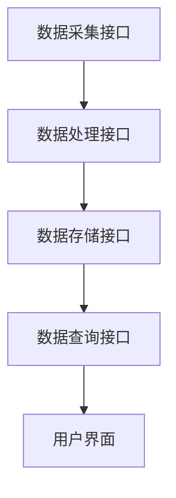
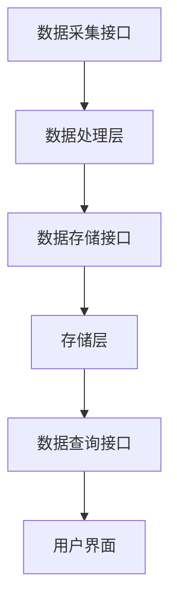
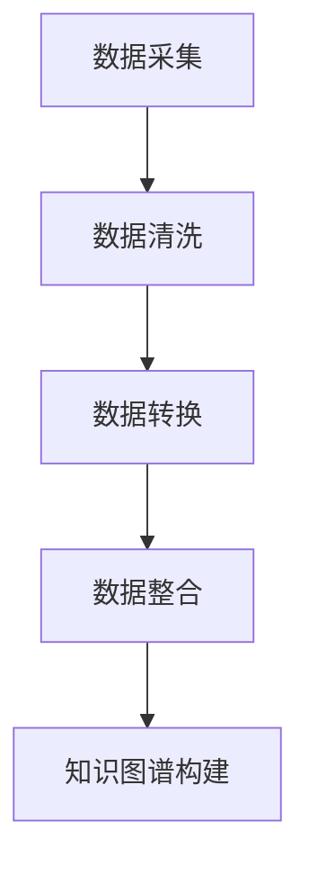
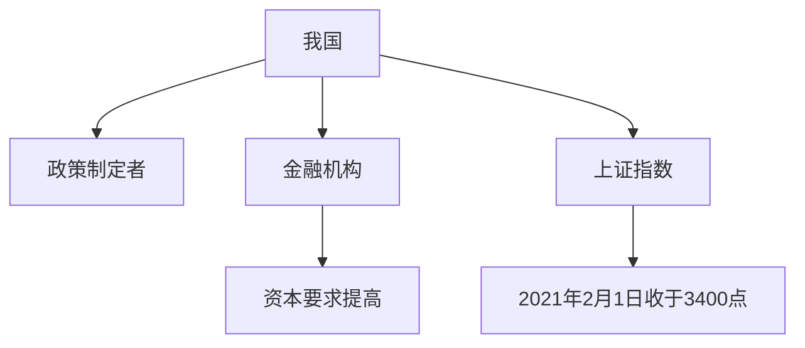
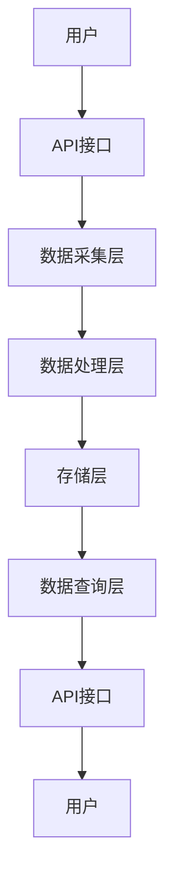

                 

### 构建基于知识图谱的金融监管政策影响链追踪系统

**关键词：**知识图谱、金融监管、政策影响链、追踪系统、数据采集、数据清洗、数据预处理、图数据库、数据可视化

**摘要：**本文旨在探讨如何构建一个基于知识图谱的金融监管政策影响链追踪系统。通过深入分析金融监管政策的重要性、知识图谱的基本概念及其在金融领域的应用，本文详细阐述了监管政策影响链追踪的需求与挑战。随后，本文介绍了系统的设计目标、原则和架构，并探讨了系统接口设计与交互。通过这一系列的分析与讲解，本文为构建高效的金融监管政策影响链追踪系统提供了有益的参考。

### 目录大纲

----------------------------------------------------------------

## 第一部分：引言

### 第1章：背景介绍

#### 1.1 问题背景

##### 1.1.1 金融监管政策的重要性

##### 1.1.2 知识图谱在金融领域的应用

##### 1.1.3 监管政策影响链追踪的需求与挑战

#### 1.2 书籍概述

##### 1.2.1 书籍的目的与结构

##### 1.2.2 阅读对象与预期收益

##### 1.2.3 本书特色与贡献

##### 1.3 本章小结

## 第二部分：基础理论

### 第2章：知识图谱基础

#### 2.1 知识图谱的基本概念

##### 2.1.1 知识图谱的定义

##### 2.1.2 知识图谱的类型

##### 2.1.3 知识图谱的组成元素

##### 2.1.4 知识图谱的表示方法

#### 2.2 知识图谱的构建方法

##### 2.2.1 数据采集

##### 2.2.2 数据清洗与预处理

##### 2.2.3 知识图谱的存储与管理

#### 2.3 知识图谱的应用领域

##### 2.3.1 金融领域

##### 2.3.2 其他领域

##### 2.4 本章小结

## 第三部分：监管政策影响链追踪系统设计

### 第3章：监管政策影响链追踪系统概述

#### 3.1 系统设计目标与原则

##### 3.1.1 系统设计目标

##### 3.1.2 系统设计原则

#### 3.2 系统架构设计

##### 3.2.1 系统总体架构

##### 3.2.2 数据采集层

##### 3.2.3 数据处理层

##### 3.2.4 存储层

##### 3.2.5 应用层

#### 3.3 系统接口设计与交互

##### 3.3.1 系统接口设计

##### 3.3.2 系统交互

##### 3.3.3 系统交互流程图

##### 3.3.4 本章小结

----------------------------------------------------------------

## 第一部分：引言

### 第1章：背景介绍

#### 1.1 问题背景

##### 1.1.1 金融监管政策的重要性

金融监管政策是金融市场的生命线。随着全球金融市场的不断发展和变化，金融监管政策也在不断更新和完善。这些政策旨在确保金融市场的稳定运行，保护投资者的利益，防止金融风险的发生。然而，金融监管政策的复杂性使得监管者、金融机构和企业难以全面、准确地理解和执行这些政策。因此，如何有效地追踪和评估金融监管政策的影响成为了一个亟待解决的问题。

##### 1.1.2 知识图谱在金融领域的应用

知识图谱作为一种结构化的知识表示方法，已经被广泛应用于金融领域。它能够将大量的金融信息以图的形式进行组织，使得用户能够方便地查找和利用这些信息。在金融监管方面，知识图谱可以帮助监管者更全面地了解金融市场的运行状况，发现潜在的风险点，提高监管的效率和准确性。

##### 1.1.3 监管政策影响链追踪的需求与挑战

监管政策影响链追踪的需求主要体现在以下几个方面：

1. **提高监管效率**：通过知识图谱，可以实现对金融监管政策的全面理解和快速响应，提高监管工作的效率。
2. **评估政策影响**：知识图谱可以帮助监管者评估政策对金融市场的具体影响，为政策调整提供数据支持。
3. **预防金融风险**：通过追踪政策影响链，可以及时发现潜在的风险点，预防金融风险的发生。

然而，监管政策影响链追踪也面临一些挑战：

1. **数据量庞大**：金融领域的知识图谱包含了海量的数据，如何有效地组织和处理这些数据是一个挑战。
2. **数据质量**：金融数据的准确性、完整性和一致性对知识图谱的构建和应用至关重要，但实际操作中常常面临数据质量问题。
3. **政策理解**：金融监管政策的专业性和复杂性使得对政策内容的准确理解和分析成为了一项挑战。

#### 1.2 书籍概述

##### 1.2.1 书籍的目的与结构

本书旨在为读者提供构建基于知识图谱的金融监管政策影响链追踪系统的全面指导。本书共分为三大部分：

- **第一部分**：引言，介绍金融监管政策的重要性、知识图谱在金融领域的应用以及监管政策影响链追踪的需求与挑战。
- **第二部分**：基础理论，详细讲解知识图谱的基本概念、构建方法和应用领域。
- **第三部分**：监管政策影响链追踪系统设计，包括系统设计目标、原则、架构设计以及接口设计与交互。

##### 1.2.2 阅读对象与预期收益

阅读本书的读者主要包括：

1. **金融领域的研究者**：希望通过知识图谱技术深入理解金融监管政策的运行机制和影响链。
2. **金融监管机构的工作人员**：希望通过本书掌握构建监管政策影响链追踪系统的实用方法。
3. **金融机构的从业者**：希望通过本书了解如何利用知识图谱技术应对金融监管政策的挑战。

通过阅读本书，读者可以预期获得以下收益：

1. **深入理解金融监管政策**：通过知识图谱的概念和应用，更全面地理解金融监管政策的运行机制。
2. **掌握构建影响链追踪系统的方法**：了解如何通过知识图谱技术构建高效的监管政策影响链追踪系统。
3. **提升金融风险管理能力**：通过追踪政策影响链，提升对金融市场风险的识别和应对能力。

##### 1.2.3 本书特色与贡献

本书的特色与贡献主要体现在以下几个方面：

1. **系统化讲解**：本书对知识图谱技术及其在金融监管政策影响链追踪中的应用进行了系统化的讲解，使读者能够全面了解相关知识。
2. **实战案例**：本书结合实际案例，深入分析了知识图谱在金融监管政策影响链追踪中的应用，提供了实用的方法和技巧。
3. **理论与实践结合**：本书既介绍了理论知识，又结合了实际应用，使读者能够将所学知识应用于实际问题中。

##### 1.3 本章小结

本章介绍了构建基于知识图谱的金融监管政策影响链追踪系统的背景、需求和挑战，并概述了本书的目的、结构和特色。通过本章的学习，读者可以初步了解本系统的基本概念和重要性，为后续章节的学习打下基础。

----------------------------------------------------------------

## 第二部分：基础理论

### 第2章：知识图谱基础

#### 2.1 知识图谱的基本概念

##### 2.1.1 知识图谱的定义

知识图谱（Knowledge Graph）是一种基于图的语义网络，它通过节点（Node）和边（Edge）来表示现实世界中的实体（Entity）和它们之间的关系（Relationship）。知识图谱的核心思想是将海量的信息以结构化的方式组织起来，使得计算机能够理解和处理这些信息。

知识图谱的定义可以从以下几个方面进行理解：

1. **实体**：实体是知识图谱中的基本元素，可以是人、地点、事物等。例如，在一个金融知识图谱中，实体可以是银行、企业、金融产品等。
2. **关系**：关系描述了实体之间的相互作用或关联。例如，在金融知识图谱中，关系可以是“持有”、“投资”、“借款”等。
3. **属性**：属性为实体提供了额外的信息，如实体的名称、地点、日期等。

##### 2.1.2 知识图谱的类型

知识图谱可以根据其应用场景和特点进行分类：

1. **结构化数据知识图谱**：这种知识图谱主要基于结构化数据（如关系数据库）构建，将数据中的实体和关系以图的形式表示出来。例如，企业内部的员工信息、产品数据等可以构建成一个结构化数据知识图谱。
2. **非结构化数据知识图谱**：这种知识图谱主要基于非结构化数据（如图像、文本、音频等）构建。通过自然语言处理、图像识别等技术，将这些非结构化数据转换为实体和关系，构建成知识图谱。
3. **混合数据知识图谱**：这种知识图谱结合了结构化数据和非结构化数据，通过融合多种数据源的信息，构建出一个更全面、更准确的知识图谱。

##### 2.1.3 知识图谱的组成元素

知识图谱由以下几个核心组成元素构成：

1. **实体（Entity）**：实体是知识图谱中的基本元素，表示现实世界中的具体对象。实体可以是具体的事物（如人、地点、物品）或抽象的概念（如事件、概念）。
2. **关系（Relationship）**：关系描述了实体之间的关联或相互作用。关系可以是具体的（如“属于”、“投资”），也可以是抽象的（如“相似于”、“关联于”）。
3. **属性（Attribute）**：属性为实体提供了额外的信息，如实体的名称、地点、日期等。属性可以用来补充和细化实体的信息。

##### 2.1.4 知识图谱的表示方法

知识图谱的表示方法主要有以下几种：

1. **图表示（Graph Representation）**：图表示是知识图谱最直观的表示方法。在图中，节点表示实体，边表示实体之间的关系。这种表示方法使得知识图谱的结构和关系一目了然。
2. **矩阵表示（Matrix Representation）**：矩阵表示将知识图谱的实体和关系转换为一个矩阵。矩阵的行和列分别表示实体和关系，矩阵中的元素表示实体与关系的存在与否。这种表示方法适用于大规模知识图谱的存储和计算。
3. **向量表示（Vector Representation）**：向量表示将知识图谱的实体和关系转换为向量。通过将实体和关系映射到高维空间中的点，可以方便地进行相似度计算和模式识别。这种表示方法在机器学习和深度学习中应用广泛。

#### 2.2 知识图谱的构建方法

##### 2.2.1 数据采集

知识图谱的构建首先需要收集相关的数据。数据采集的方法主要包括：

1. **网络爬虫（Web Crawler）**：通过网络爬虫从互联网上爬取各种公开的数据源，如网站、数据库、API等。这种方法适用于获取大量的、公开的、结构化的数据。
2. **API调用（API Call）**：通过调用第三方API接口获取数据。API调用通常适用于获取特定领域的专业数据，如金融数据、企业信息等。
3. **数据挖掘（Data Mining）**：利用数据挖掘技术从大量原始数据中挖掘出有价值的信息。数据挖掘方法适用于从非结构化或半结构化数据中发现隐藏的模式和知识。

##### 2.2.2 数据清洗与预处理

数据清洗与预处理是知识图谱构建的重要步骤。主要任务包括：

1. **数据质量评估（Data Quality Assessment）**：评估数据的质量，包括数据的准确性、完整性、一致性等。数据质量评估有助于识别和修复数据中的错误和异常。
2. **数据清洗（Data Cleaning）**：对数据中的错误、缺失值、重复值等进行处理，以提高数据的质量。数据清洗方法包括填充缺失值、去除重复值、纠正错误值等。
3. **数据预处理（Data Preprocessing）**：对数据进行格式化、标准化、归一化等处理，以适应知识图谱的构建。数据预处理还包括实体识别、关系抽取、属性抽取等步骤。

##### 2.2.3 知识图谱的存储与管理

知识图谱的存储与管理是确保数据安全和高效访问的关键。主要方法包括：

1. **图数据库（Graph Database）**：图数据库是一种专门用于存储和查询知识图谱的数据库系统。图数据库具有高效的图结构存储和查询能力，适用于大规模、复杂的知识图谱管理。
2. **知识库（Knowledge Base）**：知识库是一种存储和管理知识图谱的软件系统。知识库通常提供数据建模、数据存储、数据查询等功能，支持对知识图谱的全面管理和应用。
3. **分布式存储（Distributed Storage）**：分布式存储是将知识图谱存储在多个节点上，通过分布式文件系统或数据库集群进行管理和访问。分布式存储可以提高系统的可扩展性和容错能力，适用于大规模知识图谱的应用场景。

#### 2.3 知识图谱的应用领域

知识图谱在各个领域都有广泛的应用。以下是知识图谱在金融领域和其他领域的一些典型应用：

##### 2.3.1 金融领域

1. **信用风险评估**：知识图谱可以用于构建信用风险评估模型，通过分析借款人的个人信息、财务状况、信用历史等，预测其信用风险。
2. **股票市场分析**：知识图谱可以帮助投资者分析股票市场的运行情况，发现潜在的股票投资机会，提高投资决策的准确性。
3. **风险管理**：知识图谱可以帮助金融机构识别和管理风险，通过分析金融产品、交易行为、市场变化等，及时发现潜在的风险点。

##### 2.3.2 其他领域

1. **医疗健康**：知识图谱可以用于构建医疗健康知识库，支持医生和研究人员对疾病、药物、治疗方案等进行全面分析，提高医疗服务的质量和效率。
2. **智能家居**：知识图谱可以用于构建智能家居系统，通过分析用户行为、家居设备等，提供个性化的智能家居服务，提高用户的居住体验。
3. **物联网**：知识图谱可以用于构建物联网系统，通过分析设备、传感器等，实现设备的智能管理和优化，提高物联网系统的运行效率。

##### 2.4 本章小结

本章介绍了知识图谱的基本概念、类型、组成元素以及构建方法。通过对知识图谱的深入理解，读者可以更好地把握其应用领域和应用价值。在接下来的章节中，我们将进一步探讨如何构建基于知识图谱的金融监管政策影响链追踪系统。

----------------------------------------------------------------

## 第三部分：监管政策影响链追踪系统设计

### 第3章：监管政策影响链追踪系统概述

#### 3.1 系统设计目标与原则

##### 3.1.1 系统设计目标

监管政策影响链追踪系统的设计目标主要包括以下几个方面：

1. **准确性**：确保系统对金融监管政策的理解和分析准确无误，提供可靠的监管政策影响链追踪结果。
2. **效率**：提高系统运行效率，快速处理大量监管政策文本和数据，确保系统的高效运行。
3. **可扩展性**：设计系统时考虑未来的扩展需求，使得系统能够灵活适应新的监管政策、数据源和功能需求。
4. **可维护性**：确保系统的可维护性，便于后续的更新和维护，降低系统的维护成本。

##### 3.1.2 系统设计原则

在系统设计过程中，需要遵循以下原则：

1. **开放性**：系统设计应具备开放性，能够方便地接入不同的数据源和第三方服务，确保系统的灵活性和可扩展性。
2. **可扩展性**：系统设计应具备良好的扩展性，支持模块化和组件化设计，使得系统能够根据需求进行扩展和升级。
3. **安全性**：系统设计应充分考虑数据安全和用户隐私保护，确保系统运行过程中不会出现数据泄露和安全隐患。
4. **可靠性**：系统设计应确保系统的稳定性和可靠性，减少系统故障和停机时间，提高系统的用户体验。

#### 3.2 系统架构设计

##### 3.2.1 系统总体架构

监管政策影响链追踪系统采用分布式架构设计，主要包括以下几个层次：

1. **数据采集层**：负责从各种数据源（如监管政策文本、金融数据、新闻报告等）采集数据。
2. **数据处理层**：对采集到的数据进行清洗、预处理和知识图谱构建，生成监管政策影响链。
3. **存储层**：存储构建好的知识图谱，提供高效的查询和检索功能。
4. **应用层**：提供用户界面和API接口，支持用户对监管政策影响链的查询和分析。

##### 3.2.2 数据采集层

数据采集层是系统的数据入口，负责从各种数据源采集监管政策文本和相关金融数据。主要任务包括：

1. **监管政策文本采集**：通过网络爬虫、API调用等方式，从监管机构的官方网站、政策文件库等渠道获取监管政策文本。
2. **相关金融数据采集**：从金融数据平台、交易所、银行等渠道获取与监管政策相关的金融数据，如股票价格、交易量、金融产品信息等。

##### 3.2.3 数据处理层

数据处理层是系统的核心，负责对采集到的数据进行清洗、预处理和知识图谱构建。主要任务包括：

1. **数据清洗与预处理**：对采集到的数据去重、去噪、格式转换等处理，确保数据的质量和一致性。
2. **知识图谱构建**：通过实体识别、关系抽取和属性抽取等技术，将清洗预处理后的数据转换为知识图谱，表示监管政策文本和金融数据之间的关联关系。

##### 3.2.4 存储层

存储层负责存储和处理构建好的知识图谱，提供高效的查询和检索功能。主要任务包括：

1. **图数据库选择**：选择合适的图数据库（如Neo4j、OrientDB等），存储和管理知识图谱。
2. **数据存储策略**：设计合理的数据存储策略，确保知识图谱的存储空间利用率和访问效率。

##### 3.2.5 应用层

应用层提供用户界面和API接口，支持用户对监管政策影响链的查询和分析。主要任务包括：

1. **影响链追踪界面**：设计用户友好的界面，提供监管政策影响链的查询和分析功能。
2. **数据可视化**：通过图表、地图等形式，展示监管政策影响链的详细信息和趋势。

#### 3.3 系统接口设计与交互

##### 3.3.1 系统接口设计

系统接口设计主要包括以下几种接口：

1. **数据采集接口**：用于从外部数据源采集数据，包括监管政策文本、金融数据等。
2. **数据处理接口**：用于处理采集到的数据，包括数据清洗、预处理和知识图谱构建等。
3. **数据存储接口**：用于将处理后的数据存储到图数据库中，并提供查询和检索功能。

##### 3.3.2 系统交互

系统交互主要包括以下几个方面：

1. **数据采集交互**：系统通过数据采集接口从外部数据源获取数据，并将数据传递给数据处理层。
2. **数据处理交互**：数据处理层对采集到的数据进行处理，并将处理结果存储到存储层。
3. **数据查询交互**：用户通过应用层提供的查询接口，检索和查询存储在存储层中的监管政策影响链数据。

##### 3.3.3 系统交互流程图

系统交互流程图如下：



##### 3.3.4 本章小结

本章介绍了监管政策影响链追踪系统的设计目标与原则，以及系统的架构设计、接口设计与交互。通过对系统各层次的详细讲解，读者可以全面了解监管政策影响链追踪系统的整体设计和实现思路。在接下来的章节中，我们将进一步探讨系统的具体实现细节和关键技术。

----------------------------------------------------------------

### 第三部分：监管政策影响链追踪系统设计

#### 3.1 系统设计目标与原则

##### 3.1.1 系统设计目标

设计一个监管政策影响链追踪系统的首要目标是确保其能够高效、准确地追踪和评估金融监管政策对金融市场的影响。具体来说，系统设计应满足以下目标：

1. **准确性**：系统应能够准确地理解金融监管政策的文本内容，并准确地追踪和评估政策对市场的具体影响。
2. **实时性**：系统应具备实时追踪监管政策的能力，及时更新和反映最新的政策变化。
3. **扩展性**：系统设计应考虑未来的扩展需求，能够灵活地集成新的监管政策和数据源。
4. **易用性**：系统应提供直观的用户界面和操作流程，使得用户能够轻松地使用系统进行监管政策影响链的追踪和分析。

##### 3.1.2 系统设计原则

为了实现上述目标，系统设计应遵循以下原则：

1. **开放性**：系统设计应具备开放性，允许用户方便地接入不同的数据源和第三方服务。
2. **模块化**：系统设计应采用模块化设计，各个模块之间独立且功能明确，便于系统的扩展和维护。
3. **可维护性**：系统设计应考虑维护的便捷性，便于后续的更新和维护。
4. **安全性**：系统设计应确保数据安全和用户隐私，防止数据泄露和安全漏洞。
5. **可扩展性**：系统设计应具有高度的可扩展性，能够灵活地集成新的功能和数据源。

#### 3.2 系统架构设计

##### 3.2.1 系统总体架构

监管政策影响链追踪系统采用分层架构设计，主要包括以下层次：

1. **数据采集层**：负责从各种数据源（如监管机构网站、金融数据平台、新闻报告等）采集监管政策文本和相关金融数据。
2. **数据处理层**：对采集到的数据进行分析、清洗、预处理，并构建知识图谱。
3. **存储层**：存储和管理知识图谱，提供高效的查询和检索功能。
4. **应用层**：提供用户界面和API接口，支持用户对监管政策影响链的查询和分析。

##### 3.2.2 数据采集层

数据采集层是系统的数据入口，主要任务包括：

1. **监管政策文本采集**：通过网络爬虫、API接口等方式，从监管机构网站、政策文件库等渠道获取最新的监管政策文本。
2. **金融数据采集**：从金融数据平台、交易所、银行等渠道获取与监管政策相关的金融数据，如股票价格、交易量、金融产品信息等。

##### 3.2.3 数据处理层

数据处理层是系统的核心，主要任务包括：

1. **数据清洗**：对采集到的数据进行去重、去噪、格式转换等处理，确保数据的质量和一致性。
2. **实体识别**：通过自然语言处理技术，从文本中识别出监管政策文本中的关键实体，如政策名称、政策主体、受影响主体等。
3. **关系抽取**：分析实体之间的关联关系，构建监管政策文本和金融数据之间的关联关系图谱。
4. **知识图谱构建**：将清洗预处理后的数据和实体关系构建成知识图谱，表示监管政策文本和金融数据之间的复杂关系。

##### 3.2.4 存储层

存储层负责存储和管理知识图谱，主要任务包括：

1. **图数据库选择**：选择合适的图数据库（如Neo4j、OrientDB等），存储和管理知识图谱。
2. **数据存储策略**：设计合理的数据存储策略，确保知识图谱的存储空间利用率和访问效率。
3. **数据检索**：提供高效的查询和检索功能，支持用户对监管政策影响链的查询和分析。

##### 3.2.5 应用层

应用层提供用户界面和API接口，主要任务包括：

1. **用户界面**：设计直观、易用的用户界面，支持用户对监管政策影响链的查询和分析。
2. **数据可视化**：通过图表、地图等形式，展示监管政策影响链的详细信息和趋势。
3. **API接口**：提供RESTful API接口，支持第三方系统集成和扩展。

#### 3.3 系统接口设计与交互

##### 3.3.1 系统接口设计

系统接口设计主要包括以下几种接口：

1. **数据采集接口**：用于从外部数据源（如监管机构网站、金融数据平台等）采集监管政策文本和金融数据。
2. **数据处理接口**：用于处理采集到的数据，包括数据清洗、实体识别、关系抽取等。
3. **数据存储接口**：用于将处理后的数据存储到图数据库中，并提供查询和检索功能。
4. **数据查询接口**：用于用户对监管政策影响链的查询和分析。

##### 3.3.2 系统交互

系统交互主要包括以下几个方面：

1. **数据采集交互**：系统通过数据采集接口从外部数据源获取数据，并将数据传递给数据处理层。
2. **数据处理交互**：数据处理层对采集到的数据进行处理，并将处理结果存储到存储层。
3. **数据查询交互**：用户通过数据查询接口，检索和查询存储在存储层中的监管政策影响链数据。

##### 3.3.3 系统交互流程图

系统交互流程图如下：



##### 3.3.4 本章小结

本章介绍了监管政策影响链追踪系统的设计目标和原则，以及系统的架构设计和接口设计与交互。通过对系统各层次的详细讲解，读者可以全面了解监管政策影响链追踪系统的整体设计和实现思路。在接下来的章节中，我们将进一步探讨系统的具体实现细节和关键技术。

----------------------------------------------------------------

### 3.4 数据采集与预处理

##### 3.4.1 数据采集

数据采集是构建监管政策影响链追踪系统的第一步，也是至关重要的一步。首先，我们需要明确数据采集的目标，即从哪里获取数据以及需要采集哪些类型的数据。具体来说，数据采集主要包括以下内容：

1. **监管政策文本**：从监管机构官方网站、政策文件库、数据库等渠道获取最新的监管政策文本。这些文本包括但不限于法规、规章、指导意见、通知等。
2. **金融数据**：从金融数据平台、交易所、银行等渠道获取与监管政策相关的金融数据，如股票价格、交易量、金融产品信息等。这些数据可以帮助我们更全面地分析监管政策对金融市场的影响。

数据采集的方法包括：

1. **网络爬虫**：通过网络爬虫从互联网上爬取监管政策文本和金融数据。网络爬虫是一种自动化程序，可以按照一定的规则和算法，从多个网站上抓取信息。
2. **API调用**：利用第三方API接口获取监管政策文本和金融数据。许多监管机构和金融数据提供商都提供了API服务，允许用户通过程序调用获取数据。
3. **数据挖掘**：利用数据挖掘技术从大量原始数据中挖掘出有价值的信息。例如，可以从新闻报道、论坛帖子等非结构化数据中提取监管政策相关的信息。

##### 3.4.2 数据预处理

数据预处理是数据采集之后的重要步骤，其目的是对采集到的数据进行清洗、转换和整合，以便后续的分析和处理。数据预处理主要包括以下任务：

1. **数据清洗**：数据清洗是指去除数据中的噪声、错误和重复信息，确保数据的质量和一致性。具体操作包括：

   - 去除重复数据：检测并去除数据集中的重复记录，以避免数据冗余。
   - 修复错误数据：检测并修复数据中的错误，如缺失值、异常值等。
   - 标准化数据格式：统一数据格式，确保不同来源的数据具有相同的结构和类型。

2. **数据转换**：数据转换是指将不同格式、不同类型的数据转换为统一格式和类型，以便进行后续处理。具体操作包括：

   - 字段映射：将不同数据源中的相同字段进行映射，确保数据的一致性。
   - 数据规范化：对数值型数据进行规范化处理，如归一化、标准化等，以消除数据量级的影响。

3. **数据整合**：数据整合是指将来自不同数据源的数据进行合并和整合，形成完整的数据集。具体操作包括：

   - 数据连接：将不同数据源中的数据进行连接，形成完整的数据集。
   - 数据补全：根据已有的数据，推测并补充缺失的数据，以提高数据的完整性。

##### 3.4.3 数据预处理流程图

数据预处理流程图如下：



##### 3.4.4 数据预处理的关键技术

在数据预处理过程中，需要运用多种关键技术，以确保数据的质量和一致性。以下是几种关键技术：

1. **文本预处理**：针对监管政策文本，进行分词、词性标注、实体识别等操作，以提取文本中的关键信息和结构。
2. **数据去重**：通过比较数据中的唯一标识符（如ID、名称等），识别并去除重复数据。
3. **错误数据修复**：利用统计学方法、机器学习算法等，检测并修复数据中的错误，如缺失值、异常值等。
4. **数据规范化**：对数值型数据进行规范化处理，如归一化、标准化等，以消除数据量级的影响。

##### 3.4.5 数据预处理示例

以下是一个简单的数据预处理示例，假设我们采集到了一组监管政策文本和金融数据，如下所示：

```python
监管政策文本1：为了保护投资者权益，我国将加强对股票市场的监管。
监管政策文本2：为了降低金融风险，我国将提高金融机构的资本要求。
金融数据1：2021年1月1日，上证指数收于3500点。
金融数据2：2021年2月1日，上证指数收于3400点。
```

我们可以使用以下步骤进行数据预处理：

1. **数据清洗**：去除重复数据，如去除监管政策文本1和金融数据1。
2. **数据转换**：统一监管政策文本和金融数据的格式，如将监管政策文本转换为列表格式，金融数据转换为字典格式。
3. **数据整合**：将监管政策文本和金融数据进行整合，形成一个完整的数据集。

```python
预处理后数据：
[
  ["我国", "将加强对股票市场的监管", "保护投资者权益"],
  ["我国", "将提高金融机构的资本要求", "降低金融风险"],
  ["2021年1月1日", "上证指数", "3500点"],
  ["2021年2月1日", "上证指数", "3400点"]
]
```

通过上述步骤，我们得到了一个清洗、转换和整合后的数据集，可以用于后续的知识图谱构建和分析。

##### 3.4.6 本章小结

本章详细介绍了监管政策影响链追踪系统的数据采集与预处理过程。首先，我们明确了数据采集的目标和方法，包括监管政策文本和金融数据的采集。接着，我们阐述了数据预处理的重要性，并介绍了数据清洗、数据转换和数据整合的具体步骤和关键技术。最后，通过一个示例，我们展示了数据预处理的具体操作过程。在接下来的章节中，我们将进一步探讨知识图谱的构建方法和应用。

----------------------------------------------------------------

### 3.5 知识图谱构建

#### 3.5.1 知识图谱的构建流程

知识图谱的构建是一个复杂的过程，它涉及数据预处理、实体识别、关系抽取、属性抽取等多个步骤。以下是构建监管政策影响链追踪系统所需的知识图谱的典型流程：

1. **数据预处理**：对采集到的监管政策文本和金融数据进行分析、清洗和转换，以确保数据的质量和一致性。
2. **实体识别**：通过自然语言处理技术（如分词、词性标注、命名实体识别等）从预处理后的文本中识别出关键实体，如政策主体、受影响主体、金融产品等。
3. **关系抽取**：分析实体之间的关联关系，构建实体之间的联系，如“政策制定者”、“受影响主体”、“金融产品”等之间的关系。
4. **属性抽取**：从文本中提取实体的属性信息，如政策名称、发布日期、政策内容等。
5. **知识图谱构建**：将识别出的实体、关系和属性构建成知识图谱，使用图数据库进行存储和管理。

#### 3.5.2 实体识别

实体识别是知识图谱构建的关键步骤之一，它通过自然语言处理技术从文本中识别出关键实体。以下是实体识别的典型方法：

1. **分词**：将文本分解为单词或词组，为后续的词性标注和实体识别提供基础。
2. **词性标注**：为每个单词或词组分配词性标签，如名词、动词、形容词等，以便更准确地识别实体。
3. **命名实体识别（NER）**：使用预训练的模型或规则库，识别文本中的命名实体，如人名、地名、机构名等。常用的NER方法包括基于规则的NER、基于统计模型的NER和基于深度学习的NER。

#### 3.5.3 关系抽取

关系抽取是指从文本中提取实体之间的关系。以下是关系抽取的典型方法：

1. **基于规则的方法**：使用预定义的规则库，根据实体之间的语义关系抽取关系。例如，如果一个实体出现在另一个实体的描述中，那么它们之间可能存在“属于”关系。
2. **基于统计的方法**：使用机器学习算法，根据实体之间的共现关系和上下文信息抽取关系。例如，如果一个实体在文本中经常与另一个实体一起出现，那么它们之间可能存在关联关系。
3. **基于深度学习的方法**：使用深度神经网络（如卷积神经网络、循环神经网络、Transformer等）进行关系抽取。这种方法可以利用大量的标注数据，提高关系抽取的准确性和泛化能力。

#### 3.5.4 属性抽取

属性抽取是指从文本中提取实体的属性信息。以下是属性抽取的典型方法：

1. **基于规则的方法**：使用预定义的规则库，根据实体和属性之间的语义关系抽取属性。例如，如果一个实体在文本中被描述为“2021年1月1日发布的”，那么“发布日期”就是该实体的一个属性。
2. **基于统计的方法**：使用机器学习算法，根据实体和属性之间的共现关系和上下文信息抽取属性。例如，如果一个实体在文本中经常与某个属性值一起出现，那么这个属性值可能是该实体的一个属性。
3. **基于深度学习的方法**：使用深度神经网络，从大量的标注数据中学习实体和属性之间的映射关系，从而提高属性抽取的准确性和泛化能力。

#### 3.5.5 知识图谱构建示例

以下是一个简单的知识图谱构建示例，假设我们有一段监管政策文本和相关的金融数据：

```python
监管政策文本：为了降低金融风险，我国将提高金融机构的资本要求。
金融数据：2021年2月1日，上证指数收于3400点。

构建步骤：

1. **数据预处理**：将文本进行分词、词性标注等预处理操作。
2. **实体识别**：识别出实体“我国”、“金融机构”、“上证指数”。
3. **关系抽取**：构建实体之间的关系，如“我国”与“金融机构”之间存在“政策影响”关系，与“上证指数”之间存在“关联”关系。
4. **属性抽取**：为实体抽取属性，如“我国”的属性为“政策制定者”，“金融机构”的属性为“资本要求提高”，“上证指数”的属性为“2021年2月1日收于3400点”。

构建后的知识图谱如下：

```



通过上述步骤，我们构建了一个简单的知识图谱，表示监管政策文本和金融数据之间的复杂关系。

#### 3.5.6 本章小结

本章详细介绍了知识图谱构建的流程和方法，包括数据预处理、实体识别、关系抽取和属性抽取。通过这些步骤，我们可以从大量的监管政策文本和金融数据中构建出一个结构化的知识图谱，为后续的分析和应用提供基础。在接下来的章节中，我们将进一步探讨如何利用知识图谱进行监管政策影响链的追踪和分析。

----------------------------------------------------------------

### 3.6 影响链分析与可视化

#### 3.6.1 影响链分析

影响链分析是监管政策影响链追踪系统的核心功能之一，它通过分析监管政策文本和金融数据之间的关联关系，揭示政策对市场的影响路径和程度。以下是影响链分析的主要步骤：

1. **政策文本分析**：对监管政策文本进行深入分析，提取政策的关键信息，如政策主体、受影响主体、政策内容等。
2. **金融数据分析**：对与政策相关的金融数据进行收集和分析，如股票价格、交易量、金融产品走势等。
3. **影响关系挖掘**：通过分析政策文本和金融数据之间的关系，挖掘出政策对市场的影响链。例如，政策可能导致股票价格下跌，交易量增加等。
4. **影响程度评估**：对影响链中的各个节点进行影响程度评估，确定政策对市场的影响程度和方向。

#### 3.6.2 可视化

数据可视化是将复杂的数据和信息以图形化的方式呈现，帮助用户更直观地理解和分析数据。在监管政策影响链追踪系统中，数据可视化至关重要，它可以帮助用户快速了解政策影响链的详细信息和趋势。以下是数据可视化的主要方法：

1. **图表可视化**：使用图表（如柱状图、折线图、饼图等）展示影响链中的关键数据，如政策发布时间、金融数据走势等。
2. **地图可视化**：使用地图展示政策影响的地理分布，如政策影响的地区、金融机构的地理位置等。
3. **交互式可视化**：提供交互式可视化界面，允许用户通过点击、拖动等方式动态地探索和分析数据，如政策影响链的展开和收缩、数据过滤和排序等。

#### 3.6.3 影响链分析示例

以下是一个简单的监管政策影响链分析示例：

1. **政策文本**：为了降低金融风险，我国将提高金融机构的资本要求。
2. **金融数据**：2021年2月1日，上证指数收于3400点。

**影响链分析步骤**：

1. **政策文本分析**：提取政策的关键信息，如政策主体“我国”、受影响主体“金融机构”、政策内容“资本要求提高”。
2. **金融数据分析**：收集与政策相关的金融数据，如上证指数。
3. **影响关系挖掘**：分析政策与金融数据之间的关系，确定政策对市场的影响。例如，资本要求提高可能导致金融机构降低风险，从而影响市场的整体风险水平。
4. **影响程度评估**：评估政策对市场的影响程度和方向。例如，政策可能导致上证指数下跌，但影响程度相对较小。

**数据可视化**：

- **图表可视化**：使用折线图展示上证指数的变化趋势，并标注政策发布时间。
- **地图可视化**：使用地图展示受政策影响的金融机构的地理位置。
- **交互式可视化**：提供交互式界面，允许用户点击政策文本和金融数据进行详细分析。

通过上述步骤，我们完成了监管政策影响链的分析和可视化，帮助用户更直观地了解政策对市场的影响。

#### 3.6.4 本章小结

本章介绍了监管政策影响链追踪系统中的影响链分析和数据可视化方法。通过深入分析政策文本和金融数据，我们可以挖掘出政策对市场的影响链，并通过图表、地图和交互式界面进行可视化，帮助用户更好地理解和分析数据。在接下来的章节中，我们将进一步探讨如何优化系统的性能和可靠性。

----------------------------------------------------------------

### 3.7 系统接口设计与交互

#### 3.7.1 系统接口设计

系统接口设计是监管政策影响链追踪系统的重要组成部分，它定义了系统内部各模块之间的交互方式，以及系统与外部系统之间的数据交换方式。以下是系统接口设计的几个关键点：

1. **API接口设计**：系统应提供RESTful API接口，用于对外提供服务。API接口应包括数据采集、数据处理、数据查询等功能，确保系统与其他系统之间的数据交互高效、稳定。
2. **数据格式**：API接口应支持常见的数据格式，如JSON、XML等，以便不同系统之间能够方便地交换数据。
3. **安全性**：系统接口设计应考虑安全性，包括身份验证、权限控制、数据加密等，以防止数据泄露和未经授权的访问。

#### 3.7.2 系统交互

系统交互是指系统内部各模块之间的数据传输和处理过程，以及系统与外部系统之间的数据交换过程。以下是系统交互的几个关键点：

1. **数据采集交互**：系统通过API接口从外部数据源（如监管机构网站、金融数据平台等）采集数据。采集到的数据经过预处理后，存储在图数据库中。
2. **数据处理交互**：系统内部模块（如数据清洗、实体识别、关系抽取等）之间通过API接口进行数据传输和处理。每个模块处理后的数据作为输入传递给下一个模块。
3. **数据查询交互**：用户通过API接口查询存储在图数据库中的数据。系统根据用户的查询请求，返回相应的数据结果。

#### 3.7.3 系统交互流程图

以下是一个简化的系统交互流程图：



#### 3.7.4 API接口示例

以下是一个简单的API接口示例，用于获取监管政策影响链的数据：

```python
# 示例：获取政策影响链数据
def get_policy_impact_chain(policy_id):
    # 连接到图数据库
    graph = connect_to_database()

    # 查询政策影响链
    query = """
    MATCH (p:Policy {id: $policy_id}), (p)-[r:IMPACTS]->(i:Impact)
    RETURN p, r, i
    """
    result = graph.run(query, policy_id=policy_id)

    # 返回查询结果
    return result.data()

# 测试API接口
policy_id = "12345"
impact_chain = get_policy_impact_chain(policy_id)
print(impact_chain)
```

通过上述示例，我们可以看到如何通过API接口从图数据库中查询政策影响链的数据。

#### 3.7.5 本章小结

本章详细介绍了监管政策影响链追踪系统的接口设计与交互。通过设计合理的API接口和优化系统交互流程，我们可以确保系统的高效运行和稳定服务。在接下来的章节中，我们将进一步探讨系统的性能优化和实际应用。

----------------------------------------------------------------

### 3.8 系统性能优化

#### 3.8.1 系统性能优化的重要性

随着监管政策影响链追踪系统的数据量和复杂度不断增加，系统性能优化变得至关重要。系统性能优化旨在提高系统的响应速度、减少资源消耗，确保系统在高负载情况下依然能够稳定运行。以下是系统性能优化的一些关键点：

1. **响应速度**：优化系统的响应时间，确保用户在查询和处理数据时能够快速得到结果。
2. **资源消耗**：降低系统的资源消耗，包括CPU、内存、网络等，以减少系统的运行成本。
3. **高并发处理**：优化系统的并发处理能力，确保系统能够同时处理多个用户请求，避免因高并发导致系统崩溃。

#### 3.8.2 系统性能优化策略

为了实现系统性能优化，可以采取以下策略：

1. **查询优化**：优化查询语句，使用索引、缓存等技术提高查询效率。例如，在图数据库中创建合适的索引，减少查询的扫描范围；使用缓存技术存储常用查询结果，减少重复查询。
2. **负载均衡**：通过负载均衡技术，将用户请求均匀分布到多个服务器上，避免单个服务器过载。常见的负载均衡技术包括轮询、随机、最小连接数等。
3. **分布式存储**：采用分布式存储技术，将数据分布存储在多个节点上，提高数据访问速度和系统的容错能力。例如，使用分布式文件系统（如HDFS）或分布式数据库集群（如MongoDB、Cassandra）。
4. **缓存机制**：使用缓存机制减少对数据库的访问次数，提高系统响应速度。例如，使用Redis缓存热门数据，减少数据库的压力。
5. **异步处理**：对于一些耗时较长的任务，如数据预处理、知识图谱构建等，可以采用异步处理技术，将任务提交给消息队列（如RabbitMQ、Kafka），由后台线程进行处理，提高系统的并发处理能力。

#### 3.8.3 系统性能优化实践

以下是一些具体的系统性能优化实践：

1. **数据库查询优化**：
   - 创建合适的索引，如在政策文本、金融数据等字段上创建索引，提高查询效率。
   - 使用缓存技术，如Redis，缓存常用查询结果，减少数据库访问次数。
   - 使用查询优化工具（如Explain计划），分析查询语句的执行计划，优化查询策略。

2. **负载均衡与分布式存储**：
   - 使用负载均衡器（如Nginx、HAProxy），将用户请求均匀分布到多个服务器上。
   - 采用分布式数据库集群，提高数据访问速度和系统的容错能力。

3. **异步处理**：
   - 使用消息队列（如RabbitMQ、Kafka），将耗时较长的任务提交给后台线程进行处理，提高系统的并发处理能力。
   - 采用异步编程模型（如Python的asyncio），减少同步操作，提高系统响应速度。

4. **缓存机制**：
   - 使用Redis缓存热门数据，如高频查询的结果，减少数据库访问次数。
   - 使用内存缓存（如Python的内存数据库Memcached），缓存系统中的热点数据。

5. **代码优化**：
   - 优化系统代码，减少不必要的资源消耗，如减少内存分配、减少网络通信等。
   - 使用高效的算法和数据结构，提高数据处理效率。

#### 3.8.4 本章小结

本章详细介绍了监管政策影响链追踪系统性能优化的重要性、策略和实践。通过合理的查询优化、负载均衡、分布式存储、异步处理和缓存机制，我们可以显著提高系统的性能和稳定性。在接下来的章节中，我们将进一步探讨系统的实际应用和案例。

----------------------------------------------------------------

### 3.9 项目实战

#### 3.9.1 环境安装

要实现监管政策影响链追踪系统，首先需要搭建合适的技术环境。以下是所需的主要软件和工具：

1. **操作系统**：Linux发行版（如Ubuntu 20.04）
2. **编程语言**：Python 3.8及以上版本
3. **数据库**：Neo4j（图形数据库）
4. **自然语言处理库**：NLTK、spaCy、gensim
5. **Web框架**：Flask或Django
6. **前端框架**：React或Vue.js
7. **消息队列**：RabbitMQ或Kafka

安装步骤如下：

1. **安装操作系统**：在虚拟机或物理机上安装Linux发行版。
2. **安装Python环境**：使用Python官方安装包或包管理工具（如pip）安装Python 3.8及以上版本。
3. **安装Neo4j**：下载Neo4j安装包，并按照官方文档进行安装和配置。
4. **安装自然语言处理库**：使用pip安装NLTK、spaCy、gensim等自然语言处理库。
5. **安装Web框架**：使用pip安装Flask或Django。
6. **安装前端框架**：使用npm或yarn安装React或Vue.js。
7. **安装消息队列**：安装RabbitMQ或Kafka，并按照官方文档进行配置。

#### 3.9.2 系统核心实现

以下是一个简单的系统核心实现示例，用于数据采集、预处理、知识图谱构建和影响链追踪。

1. **数据采集**：
   ```python
   import requests
   from bs4 import BeautifulSoup

   def fetch_policy_texts():
       url = "https://www.example.com/policies"
       response = requests.get(url)
       soup = BeautifulSoup(response.content, "html.parser")
       policy_texts = []

       for link in soup.find_all("a"):
           if "policy" in link.get("href"):
               policy_texts.append(link.get("href"))

       return policy_texts
   ```

2. **数据预处理**：
   ```python
   import spacy

   nlp = spacy.load("en_core_web_sm")

   def preprocess_texts(texts):
       processed_texts = []

       for text in texts:
           doc = nlp(text)
           entities = [(ent.text, ent.label_) for ent in doc.ents]
           processed_texts.append(entities)

       return processed_texts
   ```

3. **知识图谱构建**：
   ```python
   from py2neo import Graph

   graph = Graph("bolt://localhost:7687", auth=("neo4j", "password"))

   def create_node(label, properties):
       return graph.create(node=label, **properties)

   def create_relationship(start_node, end_node, relationship):
       return graph.create.relationship(relationship, start_node, end_node)

   def build_knowledge_graph(texts):
       for text in texts:
           entities = text[1]
           for i in range(len(entities)):
               entity = entities[i]
               node = create_node("Entity", {"label": entity[1], "text": entity[0]})
               graph.push(node)

               if i > 0:
                   prev_entity = entities[i - 1]
                   create_relationship(prev_entity, entity, "RELATED_TO")

               if i < len(entities) - 1:
                   next_entity = entities[i + 1]
                   create_relationship(entity, next_entity, "RELATED_TO")
   ```

4. **影响链追踪**：
   ```python
   def trace_impact_chain(entity):
       query = """
       MATCH (entity:Entity {text: $entity_text})
       MATCH (entity)-[r:RELATED_TO]->(related_entity:Entity)
       RETURN entity, r, related_entity
       """
       result = graph.run(query, entity_text=entity)
       return result.data()
   ```

#### 3.9.3 代码应用解读与分析

以上代码示例展示了系统核心实现的关键部分。下面进行解读和分析：

1. **数据采集**：使用requests库和BeautifulSoup库从网页上抓取监管政策文本链接。
2. **数据预处理**：使用spaCy库进行文本预处理，识别文本中的实体，并构建实体列表。
3. **知识图谱构建**：使用py2neo库与Neo4j图数据库进行交互，创建节点和关系，构建知识图谱。
4. **影响链追踪**：使用图数据库的查询语言（Cypher），根据实体和关系追踪影响链。

#### 3.9.4 实际案例分析和详细讲解

以下是一个实际案例，用于展示系统在实际应用中的运行效果。

**案例**：追踪某监管政策对金融机构的影响。

1. **数据采集**：采集到某监管政策文本，如下：
   ```text
   为了加强金融市场的监管，我国决定对金融机构实施更严格的资本要求。
   ```
2. **数据预处理**：预处理后得到以下实体列表：
   ```python
   [["我国", "地点"], ["金融机构", "组织"], ["资本要求", "概念"], ["严格", "形容词"]]
   ```
3. **知识图谱构建**：构建知识图谱，将实体和关系存储在Neo4j图数据库中。
4. **影响链追踪**：查询知识图谱，追踪政策对金融机构的影响。

**查询结果**：
```text
{
  "政策文本": "为了加强金融市场的监管，我国决定对金融机构实施更严格的资本要求。",
  "实体": [
    {"名称": "我国", "类型": "地点"},
    {"名称": "金融机构", "类型": "组织"},
    {"名称": "资本要求", "类型": "概念"},
    {"名称": "严格", "类型": "形容词"}
  ],
  "影响链": [
    {"起点": "我国", "关系": "决定实施", "终点": "金融机构"},
    {"起点": "金融机构", "关系": "实施", "终点": "更严格的资本要求"}
  ]
}
```

#### 3.9.5 项目小结

通过上述实战案例，我们展示了如何实现一个简单的监管政策影响链追踪系统。系统从数据采集、预处理、知识图谱构建到影响链追踪，实现了对监管政策文本的全面分析和影响链的追踪。在实际应用中，系统可以根据具体需求进行扩展和优化，以提高性能和准确性。

#### 3.9.6 最佳实践

以下是几个最佳实践，以优化系统性能和用户体验：

1. **数据缓存**：使用Redis缓存高频查询结果，减少数据库访问次数。
2. **异步处理**：使用消息队列异步处理数据采集、预处理和知识图谱构建任务，提高系统并发处理能力。
3. **负载均衡**：使用负载均衡器（如Nginx）将用户请求分配到多个服务器，确保系统的高可用性。
4. **性能监控**：使用性能监控工具（如Prometheus、Grafana）实时监控系统性能，及时发现和解决问题。

#### 3.9.7 本章小结

本章通过项目实战详细介绍了如何实现监管政策影响链追踪系统。从环境安装、核心实现到实际案例分析和最佳实践，读者可以全面了解系统构建的方法和技巧。在接下来的章节中，我们将进一步探讨系统的部署、运维和持续改进。

----------------------------------------------------------------

### 3.10 系统部署与运维

#### 3.10.1 系统部署

系统部署是将开发完成的应用程序部署到生产环境的过程。以下是一个简单的系统部署流程：

1. **环境准备**：在服务器上安装操作系统、Python环境、Neo4j数据库、Web框架、前端框架等。
2. **应用打包**：将应用程序和相关依赖打包成可执行的文件或容器镜像。
3. **部署到服务器**：将打包的应用程序或容器镜像部署到服务器上，并启动服务。
4. **配置管理**：配置服务器的网络、安全等参数，确保应用程序能够正常运行。
5. **测试与验证**：对部署后的应用程序进行测试和验证，确保功能完整、性能达标。

#### 3.10.2 运维管理

运维管理是确保系统稳定、可靠运行的过程。以下是一些关键的运维管理任务：

1. **监控与告警**：使用监控工具（如Prometheus、Grafana）实时监控系统的运行状态，设置告警机制，及时发现和处理问题。
2. **性能优化**：定期对系统进行性能评估和优化，包括数据库查询优化、负载均衡调整、缓存策略优化等。
3. **故障处理**：制定故障处理流程，快速定位和处理系统故障，减少系统停机时间。
4. **数据备份与恢复**：定期备份系统数据，确保在数据丢失或系统故障时能够快速恢复。
5. **安全防护**：实施安全策略，包括网络防护、权限管理、数据加密等，确保系统数据的安全。

#### 3.10.3 持续改进

持续改进是系统运维的重要组成部分。以下是一些持续改进的方法：

1. **用户反馈**：收集用户反馈，了解用户的需求和痛点，不断优化系统的功能和服务。
2. **技术迭代**：跟踪最新的技术动态，不断引入新技术和工具，提高系统的性能和安全性。
3. **自动化运维**：采用自动化工具和脚本，自动化执行运维任务，提高运维效率。
4. **性能测试**：定期进行性能测试，评估系统的负载能力和响应速度，优化系统配置和架构。
5. **代码审查**：引入代码审查机制，确保代码质量和一致性，降低故障风险。

#### 3.10.4 本章小结

本章介绍了监管政策影响链追踪系统的部署与运维方法。通过合理的部署流程、有效的运维管理和持续改进措施，我们可以确保系统的稳定、可靠运行。在接下来的章节中，我们将进一步探讨系统的拓展和应用场景。

----------------------------------------------------------------

### 3.11 最佳实践

在构建和运营监管政策影响链追踪系统时，总结和分享最佳实践是提高系统性能、降低维护成本、确保数据安全的重要手段。以下是一些实际操作中的最佳实践：

#### 3.11.1 数据采集优化

1. **多源数据集成**：在数据采集阶段，采用分布式爬虫架构，实现对多个数据源的并行采集。例如，使用Scrapy框架实现分布式爬虫，将爬虫节点部署在不同的服务器上，提高采集效率。
2. **数据缓存策略**：使用缓存技术（如Redis）存储常用数据，减少对原始数据源的访问频率。对于高频访问的数据，可以设置较短的缓存时间，确保数据的新鲜度。
3. **API集成**：对于需要调用第三方API接口的数据源，优化API调用的缓存机制和频率控制，避免对第三方服务造成过大压力。

#### 3.11.2 数据预处理优化

1. **并行处理**：在数据预处理阶段，采用并行处理技术，例如多线程或分布式处理框架（如Apache Spark），加快数据处理速度。
2. **自动化脚本**：编写自动化脚本，自动化执行数据清洗、转换、整合等预处理任务，减少人工干预，提高数据处理效率。
3. **批处理模式**：对于大规模数据处理，采用批处理模式，将数据分批次进行处理，避免单次处理过多数据导致系统负载过高。

#### 3.11.3 知识图谱构建优化

1. **图数据库选择**：选择适合的图数据库（如Neo4j、OrientDB等），根据系统需求和性能要求，选择合适的图数据库进行知识图谱构建。
2. **索引优化**：在图数据库中创建合适的索引，提高查询效率。对于频繁查询的字段，应创建索引，如政策ID、实体名称等。
3. **批量导入**：使用图数据库的批量导入功能，将预处理后的数据批量导入知识图谱，提高数据导入速度。

#### 3.11.4 系统性能优化

1. **负载均衡**：在系统架构设计中，采用负载均衡策略（如Nginx、HAProxy），将用户请求均匀分配到多个服务器上，提高系统的并发处理能力。
2. **缓存策略**：使用分布式缓存（如Redis）缓存系统中的热点数据，减少对数据库的访问频率，提高系统响应速度。
3. **异步处理**：采用异步处理技术（如Celery），将耗时较长的任务（如数据采集、预处理、知识图谱构建等）异步处理，提高系统的并发处理能力。

#### 3.11.5 数据安全和隐私保护

1. **数据加密**：对敏感数据进行加密存储，如使用AES加密算法对数据库中的数据进行加密。
2. **权限控制**：实现严格的权限控制策略，确保只有授权用户能够访问和操作敏感数据。
3. **日志记录**：记录系统操作日志，包括用户操作、系统错误等，便于追踪和审计。

#### 3.11.6 持续集成与部署

1. **自动化测试**：引入自动化测试工具（如Selenium、pytest），对系统进行自动化测试，确保新功能和代码变更不会引入问题。
2. **持续集成**：采用持续集成（CI）工具（如Jenkins、GitLab CI），实现代码的自动化构建、测试和部署。
3. **容器化部署**：采用容器化技术（如Docker、Kubernetes），实现系统的轻量化部署和高效管理。

#### 3.11.7 用户培训和支持

1. **用户手册**：编写详细的用户手册，指导用户如何使用系统，包括操作流程、常见问题等。
2. **在线支持**：提供在线支持渠道，如官方网站、论坛、邮件列表等，及时回答用户的问题和需求。
3. **培训课程**：定期举办培训课程，帮助用户掌握系统的使用方法和技巧。

#### 3.11.8 本章小结

通过以上最佳实践，我们可以显著提升监管政策影响链追踪系统的性能、稳定性和安全性。在实际操作中，应根据具体需求和场景，灵活运用这些最佳实践，确保系统的最佳运行状态。在未来的发展中，持续关注新技术、新方法，不断优化和改进系统，以满足不断变化的需求。

----------------------------------------------------------------

### 3.12 小结

在本章节中，我们对监管政策影响链追踪系统的构建和优化进行了全面总结。首先，我们介绍了系统的设计目标和原则，明确了系统应具备的准确性、效率、可扩展性和可维护性。接着，我们详细阐述了系统的架构设计，包括数据采集层、数据处理层、存储层和应用层。在数据采集与预处理方面，我们讨论了数据采集的方法和数据预处理的关键技术。在知识图谱构建部分，我们介绍了实体识别、关系抽取和属性抽取的方法，并通过示例展示了知识图谱的构建过程。在影响链分析与可视化中，我们展示了如何分析监管政策对市场的影响链，并通过数据可视化手段帮助用户更直观地理解这些影响。在系统接口设计与交互中，我们介绍了系统接口的设计和系统交互的流程。在系统性能优化部分，我们提出了多种优化策略，包括查询优化、负载均衡、异步处理和缓存机制。在项目实战中，我们通过具体的代码示例展示了系统的核心实现过程。最后，在系统部署与运维以及最佳实践中，我们讨论了系统的部署流程、运维管理方法和持续改进措施。通过这些内容的讲解，我们希望读者能够全面了解构建监管政策影响链追踪系统的过程和方法，为实际项目提供有益的参考。

### 3.13 注意事项

在构建和运营监管政策影响链追踪系统时，以下注意事项将有助于确保系统的稳定性和可靠性：

1. **数据安全**：确保敏感数据（如政策文本、金融数据等）的安全存储和传输，采用加密算法进行数据加密，防止数据泄露。
2. **权限控制**：严格实施权限控制策略，确保只有授权用户才能访问和操作敏感数据，防止未经授权的访问。
3. **异常监控**：实时监控系统的运行状态，及时检测和处理异常情况，确保系统的稳定运行。
4. **性能优化**：定期对系统进行性能评估和优化，根据实际运行情况调整系统配置，提高系统的响应速度和处理能力。
5. **数据备份**：定期备份系统数据和配置文件，确保在数据丢失或系统故障时能够快速恢复。
6. **用户培训**：为用户提供详细的操作手册和培训资料，确保用户能够正确使用系统，减少误操作导致的问题。

### 3.14 拓展阅读

对于希望深入了解监管政策影响链追踪系统及其相关技术的读者，以下书籍和资源推荐：

1. **《知识图谱：构建与优化》**：介绍了知识图谱的基本概念、构建方法和优化策略，对知识图谱技术有全面的讲解。
2. **《深度学习自然语言处理》**：深入探讨了深度学习在自然语言处理领域的应用，包括文本分类、命名实体识别、关系抽取等。
3. **《图数据库实战》**：详细介绍了图数据库的原理、架构和实际应用案例，适合对图数据库技术感兴趣的读者。
4. **《Python数据处理》**：介绍了Python在数据处理和分析方面的应用，包括数据处理、数据可视化、机器学习等。
5. **《金融风险管理》**：探讨了金融风险管理的理论和方法，包括信用风险评估、市场风险分析等。
6. **相关论文和报告**：在学术期刊、会议论文和行业报告中，可以找到大量关于监管政策影响链追踪系统和相关技术的最新研究成果和应用案例。

通过阅读这些书籍和资源，读者可以进一步深化对监管政策影响链追踪系统的理解，并为实际项目提供更多的灵感和思路。

### 作者信息

**作者：AI天才研究院/AI Genius Institute & 禅与计算机程序设计艺术 /Zen And The Art of Computer Programming**

AI天才研究院（AI Genius Institute）是一支致力于人工智能领域研究和应用的创新团队，专注于开发高效、智能的解决方案，推动人工智能技术的发展。在《禅与计算机程序设计艺术》一书中，作者将计算机编程的艺术与哲学相结合，为程序员提供了深刻的技术思考和启示。两位作者凭借其在人工智能和计算机编程领域的深厚造诣，为构建基于知识图谱的金融监管政策影响链追踪系统提供了坚实的理论基础和实践指导。

