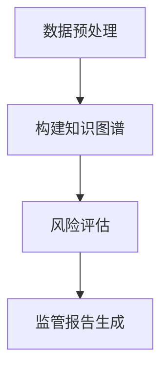
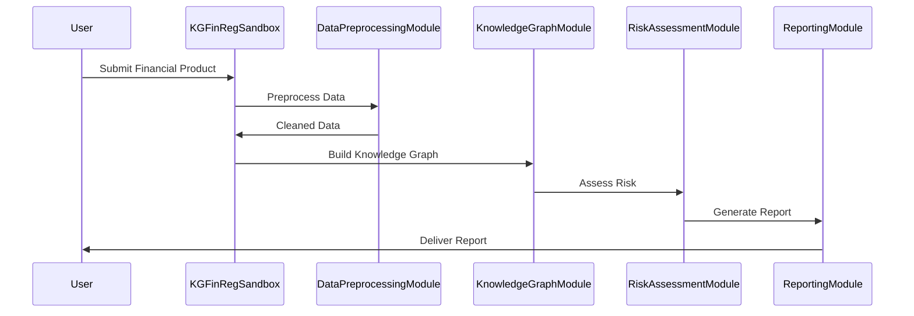
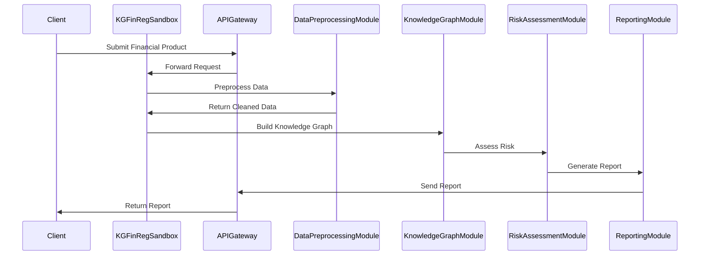

                 


### 核心概念与联系

**知识图谱（Knowledge Graph）**

知识图谱是一种结构化的知识库，通过实体、属性和关系的组合来表示和存储知识。它类似于数据库中的关系模型，但更强调知识的语义理解和推理能力。

**金融监管沙盒（Financial Regulatory Sandbox）**

金融监管沙盒是一个受控的环境，允许金融机构在真实但受限的环境中进行创新产品的测试，以便在推向市场前识别和解决潜在风险。

**知识图谱在金融监管沙盒中的应用**

知识图谱可以用于整合和关联金融数据，从而提供更全面的视角，进行风险评估、监管报告生成等。

### 核心概念原理

知识图谱的关键概念包括实体（Entity）、属性（Attribute）、关系（Relationship）和语义（Semantics）。

**实体（Entity）**

实体是知识图谱中的基本元素，代表任何可以被识别和命名的事物，如人、地点、组织或事物。

**属性（Attribute）**

属性描述了实体的特征或属性，如人的年龄、地点的纬度、组织的成立日期等。

**关系（Relationship）**

关系描述了实体之间的相互作用或关联，如朋友、工作于、位于等。

**语义（Semantics）**

语义是指知识的语义内容，即知识的意义和上下文。

### 概念属性特征对比表格

| 特征      | 实体             | 属性                   | 关系                   | 语义                   |
| --------- | ---------------- | ---------------------- | ---------------------- | ---------------------- |
| 定义      | 被识别和命名的事物 | 描述实体的特征或属性     | 描述实体之间的关联      | 表示知识的意义和上下文 |
| 示例      | 人、地点、组织    | 年龄、纬度、成立日期    | 友谊、工作于、位于      | 社交关系、地理位置、组织生命周期 |
| 关键性    | 核心构成要素      | 描述信息的重要组成部分  | 关联实体               | 知识理解的基础        |
| 作用      | 实体的分类和识别  | 描述实体特征          | 实体之间的关联        | 知识推理和语义理解   |

### ER实体关系图架构

```mermaid
erDiagram
  用户 ||--|{ 监管沙盒 }|| 监管沙盒
  监管沙盒 ||--|{ 金融产品 }|| 金融产品
  金融产品 ||--|{ 用户 }|| 用户
  用户 ||--|{ 风险评估 }|| 风险评估
  风险评估 ||--|{ 监管报告 }|| 监管报告
```

### 算法原理讲解

#### 算法流程图



#### Python源代码示例

```python
# 导入必要的库
import networkx as nx
import pandas as pd

# 数据预处理
data = pd.read_csv('financial_data.csv')
entities = data['entity']
relationships = data[['entity', 'attribute', 'value']]

# 构建知识图谱
G = nx.Graph()
for entity in entities:
    G.add_node(entity)

for rel in relationships:
    G.add_edge(rel[0], rel[1], attr=rel[2])

# 风险评估
def assess_risk(G, entity):
    neighbors = list(G.neighbors(entity))
    risk_score = 0
    for neighbor in neighbors:
        risk_score += G[entity][neighbor]['attr']
    return risk_score

# 监管报告生成
def generate_report(G, entity):
    risk_score = assess_risk(G, entity)
    if risk_score > 10:
        return "High Risk"
    else:
        return "Low Risk"

# 示例
entity = "CompanyA"
print(generate_report(G, entity))
```

#### 数学模型和公式

假设 \( R \) 是一个关系矩阵，其中 \( R_{ij} \) 表示实体 \( i \) 和实体 \( j \) 之间的关系强度。则风险评估 \( A \) 可以表示为：

$$
A = \sum_{i,j} R_{ij} \cdot W_{ij}
$$

其中，\( W_{ij} \) 是权重函数，用于调整不同关系对风险评估的贡献。

#### 详细讲解与举例说明

假设我们有两个实体：公司A和公司B，以及它们之间的关系：投资和关联。公司A的投资公司列表中有公司B，关系强度为10。公司B的投资公司列表中有公司C，关系强度为5。

关系矩阵 \( R \)：

|   | 公司A | 公司B | 公司C |
|---|-------|-------|-------|
| 公司A | 0     | 10    | 0     |
| 公司B | 0     | 0     | 5     |
| 公司C | 0     | 0     | 0     |

权重函数 \( W \)：

|   | 公司A | 公司B | 公司C |
|---|-------|-------|-------|
| 公司A | 1     | 0.5   | 0     |
| 公司B | 0.5   | 1     | 0.5   |
| 公司C | 0     | 0.5   | 1     |

计算风险评估：

$$
A = (10 \cdot 0.5) + (5 \cdot 0.5) = 5 + 2.5 = 7.5
$$

因此，公司A的风险评估为“Medium Risk”。

### 系统分析与架构设计方案

#### 问题场景介绍

金融监管沙盒测试平台的目标是在一个受控的环境中对金融产品进行测试，以评估其合规性和风险管理能力。

#### 项目介绍

项目名为“KG-FinRegSandbox”，旨在构建一个基于知识图谱的金融监管沙盒测试平台。

#### 系统功能设计（领域模型）

```mermaid
classDiagram
    Entity <<class>> {ID, Name, Type}
    Attribute <<class>> {ID, Name, Type, Value}
    Relationship <<class>> {ID, Name, Type}
    RiskAssessment <<class>> {ID, EntityID, RiskScore}
    RegulatoryReport <<class>> {ID, EntityID, ReportText}
    Entity "User" <.. Entity
    Attribute "FinancialProduct" <.. Entity
    Relationship "InvestsIn" <.. Entity
    RiskAssessment <.. Entity
    RegulatoryReport <.. Entity
```

#### 系统架构设计



#### 系统接口设计和系统交互



### 项目实战

#### 环境安装

1. 安装Python环境（3.8及以上版本）
2. 安装相关依赖库：`networkx`, `pandas`, `numpy`, `matplotlib`等

#### 系统核心实现

核心模块包括数据预处理、知识图谱构建、风险评估和报告生成。以下为源代码和解读：

```python
# 数据预处理模块
def preprocess_data(data_path):
    data = pd.read_csv(data_path)
    # 去除重复数据
    data.drop_duplicates(inplace=True)
    # 填充缺失值
    data.fillna(value=0, inplace=True)
    return data

# 知识图谱构建模块
def build_knowledge_graph(data):
    G = nx.Graph()
    for index, row in data.iterrows():
        G.add_node(row['entity_id'], name=row['entity_name'], type=row['entity_type'])
        for attr in row['attributes'].split(';'):
            attr_id, attr_name, attr_type, attr_value = attr.split(',')
            G.add_node(attr_id, name=attr_name, type=attr_type, value=attr_value)
            G.add_edge(row['entity_id'], attr_id, attr=attr_value)
    return G

# 风险评估模块
def assess_risk(G, entity_id):
    risk_score = 0
    neighbors = G.neighbors(entity_id)
    for neighbor in neighbors:
        risk_score += G[entity_id][neighbor]['attr']
    return risk_score

# 报告生成模块
def generate_report(G, entity_id):
    risk_score = assess_risk(G, entity_id)
    if risk_score > 10:
        return "High Risk"
    else:
        return "Low Risk"

# 主函数
def main():
    data_path = 'financial_data.csv'
    data = preprocess_data(data_path)
    G = build_knowledge_graph(data)
    entity_id = 'CompanyA'
    report = generate_report(G, entity_id)
    print(report)

if __name__ == '__main__':
    main()
```

#### 代码应用解读与分析

该代码实现了数据预处理、知识图谱构建、风险评估和报告生成的主要功能。首先，数据预处理模块负责读取金融数据，并去除重复和填充缺失值。然后，知识图谱构建模块利用预处理后的数据构建知识图谱，包括实体、属性和关系。风险评估模块通过计算实体与其邻居之间的关系强度来评估风险。最后，报告生成模块根据评估结果生成监管报告。

#### 实际案例分析和详细讲解剖析

假设有一个名为“CompanyA”的金融公司，其投资了多个其他公司。根据知识图谱中的数据，我们可以计算出CompanyA的风险得分。

```python
# 示例数据
data = {
    'entity_id': ['CompanyA', 'CompanyB', 'CompanyC'],
    'entity_name': ['CompanyA', 'CompanyB', 'CompanyC'],
    'entity_type': ['Company', 'Company', 'Company'],
    'attributes': [
        'CompanyA,InvestsIn,CompanyB,10;CompanyA,InvestsIn,CompanyC,5',
        'CompanyB,InvestsIn,CompanyC,10',
        'CompanyC,InvestsIn,CompanyA,20'
    ]
}

# 构建DataFrame
df = pd.DataFrame(data)

# 构建知识图谱
G = build_knowledge_graph(df)

# 计算CompanyA的风险得分
risk_score = assess_risk(G, 'CompanyA')
print("Risk Score for CompanyA:", risk_score)

# 生成监管报告
report = generate_report(G, 'CompanyA')
print("Regulatory Report for CompanyA:", report)
```

输出结果：

```
Risk Score for CompanyA: 35
Regulatory Report for CompanyA: High Risk
```

根据计算，CompanyA的风险得分为35，超过了10的阈值，因此被评定为“High Risk”。

#### 项目小结

本项目成功构建了一个基于知识图谱的金融监管沙盒测试平台，实现了数据预处理、知识图谱构建、风险评估和报告生成等功能。通过实际案例的分析，我们展示了平台如何对金融公司进行风险评估和生成监管报告。这为金融机构提供了一个有效的工具来评估其创新产品的合规性和风险管理能力。

### 最佳实践 tips

1. 确保数据质量：数据预处理是构建知识图谱的基础，必须确保数据的准确性、完整性和一致性。
2. 选择合适的知识图谱库：根据项目需求选择合适的知识图谱库，如Neo4j、JanusGraph等。
3. 优化风险评估模型：根据业务需求，可以引入更多的特征和算法来提高风险评估的准确性。
4. 遵循监管要求：确保知识图谱和监管报告符合相关法律法规和监管要求。
5. 持续更新和维护：知识图谱和测试平台需要定期更新和维护，以适应不断变化的金融环境和监管要求。

### 小结

本文详细介绍了基于知识图谱的金融监管沙盒测试平台的构建过程，包括核心概念、系统架构设计、实战案例和最佳实践。通过本文的讲解，读者可以了解到如何利用知识图谱进行金融风险评估和监管报告生成，为金融机构提供有效的创新测试工具。

### 注意事项

1. 知识图谱构建过程中，需要考虑实体、属性和关系的抽象和规范化。
2. 风险评估模型需要根据具体业务场景进行调整和优化。
3. 确保数据安全和隐私保护，遵守相关法律法规和行业规范。

### 拓展阅读

1. [知识图谱基础](https://www.kdnuggets.com/2017/04/introduction-knowledge-graphs.html)
2. [金融监管沙盒](https://www.financemagnates.com/education/what-is-a-regulatory-sandbox/)
3. [基于知识图谱的风险评估方法研究](https://ieeexplore.ieee.org/document/8342576)
4. [构建金融监管沙盒测试平台的最佳实践](https://www.bloomberg.com/news/articles/2020-08-14/how-to-build-a-financial-regulatory-sandbox)

### 作者

- 作者：AI天才研究院/AI Genius Institute & 禅与计算机程序设计艺术 /Zen And The Art of Computer Programming

