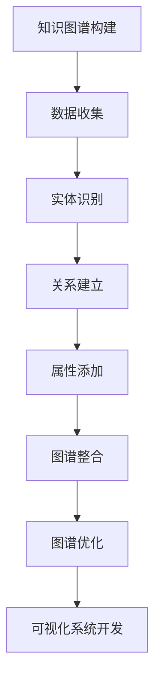
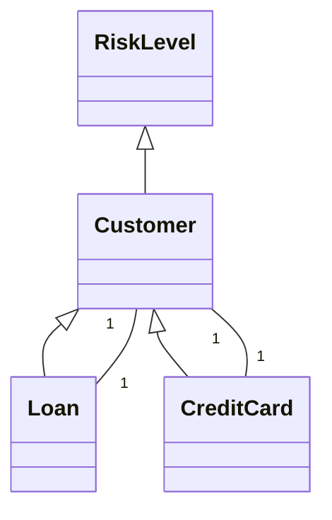
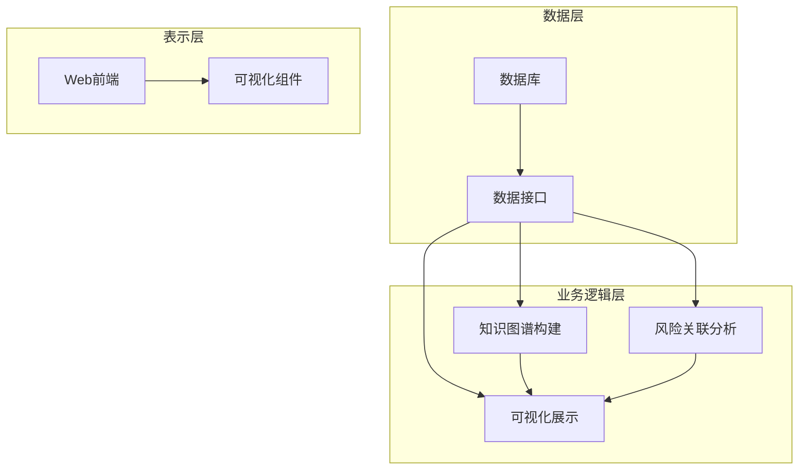
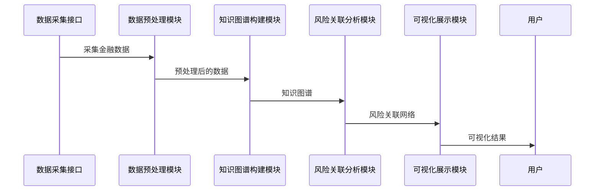

                 

### 1. **确定书籍的结构**

构建一本关于构建基于知识图谱的金融风险关联网络可视化系统的书籍，首先需要明确书籍的整体结构。书籍通常可以分为以下几个部分：

- **引言**：介绍知识图谱、金融风险、关联网络和可视化系统的基础知识，为后续内容打下基础。
- **核心概念与联系**：详细阐述知识图谱、图论、金融风险模型和关联规则算法等核心概念，并展示它们之间的联系。
- **算法原理讲解**：深入讲解构建金融风险关联网络可视化系统的算法原理，包括数学模型、公式和Python代码实现。
- **系统分析与架构设计**：描述系统的功能和架构，使用图表进行详细说明。
- **项目实战**：通过实际项目展示如何实现金融风险关联网络可视化系统。
- **最佳实践与总结**：总结项目的关键点，提供最佳实践建议，并提出注意事项和拓展阅读资源。

#### 1.1 引言部分

**核心概念术语说明**：

- **知识图谱**：一种语义网络，用于表示实体、概念和关系，支持语义查询和推理。
- **金融风险**：指在金融市场中，由于市场波动、信用风险、操作风险等原因导致的潜在损失。
- **关联网络**：通过分析实体之间的关联关系，构建出一个能够反映数据间复杂关系的网络结构。
- **可视化系统**：利用可视化技术将复杂的数据和信息以图形化方式展示，便于理解和分析。

**问题背景**：

随着金融市场的不断发展，金融机构面临着日益复杂的金融风险。传统的风险评估方法难以全面捕捉风险关联，而基于知识图谱的金融风险关联网络可视化系统提供了一种新的解决方案。通过构建知识图谱，可以更好地理解金融市场中各个实体之间的复杂关系，从而进行更精确的风险评估和预警。

**问题描述**：

如何利用知识图谱技术构建金融风险关联网络，并开发一个可视化系统，以便金融机构能够直观地了解风险关联，从而采取相应的风险管理措施？

**问题解决**：

通过深入理解知识图谱、金融风险、关联网络和可视化系统的核心概念，结合算法原理和实际项目实践，逐步构建一个完整的金融风险关联网络可视化系统。

**边界与外延**：

本书籍主要关注基于知识图谱的金融风险关联网络可视化系统，不涉及其他领域中的知识图谱应用。同时，虽然金融风险是一个广泛的概念，但本书主要关注市场风险、信用风险等常见类型。

**核心要素组成**：

- **知识图谱构建**：收集和整合金融市场中相关的实体和关系，构建知识图谱。
- **风险关联分析**：利用关联规则算法分析实体之间的关联关系，构建风险关联网络。
- **可视化系统开发**：实现一个能够将风险关联网络以图形化方式展示的可视化系统。

### 1.2 核心概念与联系

在引言部分我们已经介绍了几个核心概念，接下来我们将详细阐述这些概念，并使用Mermaid流程图和ER实体关系图来展示它们之间的联系。

**知识图谱原理**

知识图谱是一种语义网络，通过实体、概念和关系来表示信息。它通常由以下三个核心部分组成：

- **实体（Entity）**：知识图谱中的数据点，如人、地点、事物等。
- **关系（Relationship）**：实体之间的关联，如“属于”、“位于”、“创建”等。
- **属性（Attribute）**：实体的额外信息，如“出生日期”、“城市”、“公司名称”等。

**图论基础**

图论是数学的一个分支，用于研究图的结构和性质。在知识图谱和风险关联网络中，图论提供了重要的理论支持。以下是图论中的一些基本概念：

- **图（Graph）**：由节点（Node）和边（Edge）组成的集合。
- **节点（Node）**：图的元素，代表知识图谱中的实体。
- **边（Edge）**：连接两个节点的线段，代表实体之间的关系。
- **路径（Path）**：连接两个节点的序列，代表实体之间的路径关系。

**金融风险模型**

金融风险模型用于评估和预测金融市场中的潜在风险。常见的金融风险模型包括：

- **市场风险模型**：评估市场价格波动带来的风险。
- **信用风险模型**：评估借款人违约的风险。
- **操作风险模型**：评估由于内部操作失误导致的风险。

**关联规则算法**

关联规则算法用于分析数据之间的关联关系。在金融风险关联网络中，关联规则算法可以帮助我们识别风险之间的关联。以下是关联规则算法的基本原理：

- **支持度（Support）**：表示某个规则在数据中出现的频率。
- **置信度（Confidence）**：表示在满足前件的情况下满足后件的概率。

**Mermaid流程图与ER实体关系图**

使用Mermaid流程图，我们可以清晰地展示知识图谱构建、风险关联分析和可视化系统开发的过程。以下是知识图谱构建的Mermaid流程图示例：



使用ER实体关系图，我们可以展示金融风险模型中的实体和关系。以下是金融风险模型的ER实体关系图示例：

```mermaid
erDiagram
    Customer ||--|{ Loan : "has loans" }
    Customer ||--|{ CreditCard : "has credit card" }
    Loan ||--|{ Borrower : "borrowed by" }
    Loan ||--|{ Lender : "lent by" }
    CreditCard ||--|{ Cardholder : "holds card" }
    Lender { id : INT }
    Borrower { id : INT }
    Customer { id : INT }
    Cardholder { id : INT }
    Loan { id : INT }
    CreditCard { id : INT }
```

通过这些图表，我们可以更好地理解知识图谱、图论、金融风险模型和关联规则算法之间的关系，为后续章节的讲解打下基础。

### 1.3 算法原理讲解

在了解核心概念后，接下来我们将深入讲解构建金融风险关联网络可视化系统的算法原理。这部分内容将包括数学模型、公式和Python代码实现。

#### 3.1 金融风险关联网络的构建

**数学模型与公式**

构建金融风险关联网络的核心在于识别和量化不同风险实体之间的关联关系。以下是金融风险关联网络构建的基本数学模型：

$$
R(x, y) = \frac{1}{n} \sum_{i=1}^{n} \frac{1}{|S_i|}
$$

其中，$R(x, y)$ 表示实体 $x$ 和 $y$ 之间的关联程度，$n$ 表示样本数量，$S_i$ 表示在第 $i$ 个样本中，实体 $x$ 和 $y$ 同时出现的次数。

**Python代码实现**

为了更直观地展示算法原理，我们使用Python实现了一个简单的金融风险关联网络构建示例。以下是代码实现：

```python
import networkx as nx
import numpy as np

def build_risk_network(data, threshold=0.5):
    """
    构建金融风险关联网络。
    
    :param data: 金融风险数据，形状为 (n, 2)，每行表示一个样本，包含两个实体的ID。
    :param threshold: 关联程度阈值，默认为0.5。
    :return: 金融风险关联网络。
    """
    graph = nx.Graph()
    
    # 构建实体与边的映射
    entity_id_map = {}
    edge_count = {}
    for row in data:
        entity_id_map[row[0]] = len(entity_id_map)
        entity_id_map[row[1]] = len(entity_id_map)
        
        if (row[0], row[1]) not in edge_count:
            edge_count[(row[0], row[1])] = 0
        edge_count[(row[0], row[1])] += 1
        
    # 添加节点和边
    for row in data:
        if edge_count[(row[0], row[1])] / len(data) > threshold:
            graph.add_edge(row[0], row[1])
    
    return graph

# 示例数据
data = np.array([
    [1, 2], [1, 3], [2, 3], [4, 5], [4, 6], [5, 6]
])

# 构建金融风险关联网络
risk_network = build_risk_network(data)
print("金融风险关联网络节点数量：", risk_network.number_of_nodes())
print("金融风险关联网络边数量：", risk_network.number_of_edges())

# 可视化展示
nx.draw(risk_network, with_labels=True)
plt.show()
```

**算法流程与效果分析**

上述代码首先通过样本数据构建了一个简单的金融风险关联网络，然后使用关联程度阈值筛选出符合条件的实体关联关系，并绘制出网络图。在实际应用中，可以根据具体需求调整阈值和算法参数，以优化网络结构和关联程度。

通过这种方式，我们可以快速识别出金融市场中存在的高风险关联关系，从而为金融机构提供有力的风险管理支持。

### 1.4 系统分析与架构设计

在了解了算法原理后，接下来我们将描述系统的功能和架构，并使用图表进行详细说明。

#### 4.1 领域模型

**问题场景介绍**

假设我们需要构建一个金融风险关联网络可视化系统，用于分析某家银行客户的风险状况。该系统需要收集客户的个人信息、贷款记录、信用卡使用记录等数据，并基于这些数据构建风险关联网络。

**项目介绍**

本项目旨在开发一个基于知识图谱的金融风险关联网络可视化系统，帮助银行识别高风险客户，并进行相应的风险控制和预防。

**系统功能设计**

系统的主要功能包括：

- 数据采集与预处理：收集并清洗金融数据，提取有用的信息。
- 知识图谱构建：将金融数据转换为知识图谱，表示实体和关系。
- 风险关联分析：利用关联规则算法分析实体之间的关联关系。
- 可视化展示：将风险关联网络以图形化方式展示，便于理解和分析。

**领域模型**

在构建领域模型时，我们需要定义数据实体和它们之间的关系。以下是领域模型的主要组成部分：

- **客户（Customer）**：代表银行的客户，包括个人信息和贷款记录。
- **贷款（Loan）**：代表客户的贷款信息，包括贷款金额、还款期限等。
- **信用卡（CreditCard）**：代表客户的信用卡信息，包括信用卡余额、信用额度等。
- **风险等级（RiskLevel）**：表示客户的风险等级，根据关联关系分析结果确定。

**Mermaid类图**

以下是Mermaid类图，展示了领域模型中的数据实体和它们之间的关系：



通过类图，我们可以清晰地看到客户、贷款、信用卡和风险等级之间的关系，为后续的架构设计提供了基础。

#### 4.2 系统架构设计

**系统架构设计**

系统架构设计包括系统分层架构、模块功能与接口设计等方面。以下是系统架构的主要组成部分：

- **数据层**：负责数据的采集、存储和预处理，包括数据库和数据接口。
- **业务逻辑层**：负责实现核心算法和业务逻辑，包括知识图谱构建、风险关联分析和可视化展示。
- **表示层**：负责用户界面和交互，包括Web前端和可视化组件。

**Mermaid架构图**

以下是Mermaid架构图，展示了系统的分层架构和模块功能：



通过架构图，我们可以清晰地看到系统的各个组成部分以及它们之间的交互关系，为后续的开发和实现提供了指导。

### 4.3 系统接口设计与交互

**接口设计与实现**

在系统架构设计中，接口设计是关键部分。以下是系统的主要接口设计：

- **数据采集接口**：负责从不同数据源采集金融数据，包括客户信息、贷款记录和信用卡使用记录等。
- **知识图谱构建接口**：负责将采集到的金融数据转换为知识图谱，包括实体识别、关系建立和属性添加等。
- **风险关联分析接口**：负责利用关联规则算法分析实体之间的关联关系，生成风险关联网络。
- **可视化展示接口**：负责将风险关联网络以图形化方式展示，包括节点、边和关系的可视化表示。

**系统交互设计**

系统交互设计描述了系统各模块之间的交互流程和场景。以下是系统交互的主要流程：

1. **数据采集**：系统从不同数据源采集金融数据，包括客户信息、贷款记录和信用卡使用记录等。
2. **数据预处理**：系统对采集到的金融数据进行清洗和预处理，提取有用的信息，如客户ID、贷款金额、信用卡余额等。
3. **知识图谱构建**：系统将预处理后的金融数据转换为知识图谱，表示实体和关系。
4. **风险关联分析**：系统利用关联规则算法分析实体之间的关联关系，构建风险关联网络。
5. **可视化展示**：系统将风险关联网络以图形化方式展示，包括节点、边和关系的可视化表示。

**Mermaid序列图**

以下是Mermaid序列图，展示了系统交互的详细流程：



通过序列图，我们可以清晰地看到系统各个模块之间的交互流程和场景，为后续的开发和实现提供了指导。

### 第6章：项目实战

在了解了系统的功能和架构后，接下来我们将通过一个实际项目展示如何实现金融风险关联网络可视化系统。

#### 6.1 环境安装与配置

**系统环境搭建**

在开始项目之前，我们需要搭建一个合适的环境。以下是环境搭建的步骤：

1. **Python环境**：确保Python环境已经安装，推荐使用Python 3.8或更高版本。
2. **数据库**：安装并配置一个关系型数据库，如MySQL或PostgreSQL。
3. **知识图谱工具**：安装并配置一个知识图谱工具，如Neo4j。
4. **前端框架**：安装并配置一个前端框架，如React或Vue.js。

**软件与硬件要求**

- **操作系统**：Windows、Linux或macOS。
- **CPU**：Intel Core i5或更高。
- **内存**：8GB或更高。
- **存储**：至少100GB的可用硬盘空间。

**环境安装步骤**

1. **安装Python**：从Python官方网站下载并安装Python。
2. **安装数据库**：根据数据库的官方文档进行安装和配置。
3. **安装知识图谱工具**：从知识图谱工具的官方网站下载并安装，根据文档进行配置。
4. **安装前端框架**：从前端框架的官方网站下载并安装，根据文档进行配置。

**数据集准备**

为了实现金融风险关联网络可视化系统，我们需要一个包含金融数据的开源数据集。以下是数据集的来源与预处理步骤：

1. **数据集来源**：从Kaggle或UCI机器学习库等开源数据集网站下载金融数据集。
2. **数据预处理**：对下载的金融数据进行清洗和预处理，包括去除无效数据、填补缺失值、标准化数据等。

#### 6.2 系统核心实现

**知识图谱构建**

知识图谱构建是金融风险关联网络可视化系统的核心步骤。以下是知识图谱构建的实现步骤：

1. **实体识别**：根据金融数据，识别出客户、贷款和信用卡等实体。
2. **关系建立**：根据金融数据，建立实体之间的关系，如“客户拥有贷款”、“客户持有信用卡”等。
3. **属性添加**：为实体添加属性，如客户的年龄、贷款金额、信用卡余额等。
4. **图谱整合**：将实体、关系和属性整合到一个知识图谱中。

**代码解读**

以下是构建知识图谱的Python代码：

```python
from neo4j import GraphDatabase

class KnowledgeGraphBuilder:
    def __init__(self, uri, user, password):
        self._driver = GraphDatabase.driver(uri, auth=(user, password))

    def close(self):
        self._driver.close()

    def build_knowledge_graph(self, data):
        with self._driver.session() as session:
            for row in data:
                customer_id = row['customer_id']
                loan_id = row['loan_id']
                credit_card_id = row['credit_card_id']
                
                # 创建客户实体
                session.run("MERGE (c:Customer {id: $customer_id}) "
                            "SET c.name = $name, c.age = $age", 
                            customer_id=customer_id, name=row['name'], age=row['age'])
                
                # 创建贷款实体
                session.run("MERGE (l:Loan {id: $loan_id}) "
                            "SET l.amount = $amount, l.duration = $duration", 
                            loan_id=loan_id, amount=row['loan_amount'], duration=row['loan_duration'])
                
                # 创建信用卡实体
                session.run("MERGE (cc:CreditCard {id: $credit_card_id}) "
                            "SET cc.balance = $balance, cc.limit = $limit", 
                            credit_card_id=credit_card_id, balance=row['credit_card_balance'], limit=row['credit_card_limit'])
                
                # 建立关系
                session.run("MATCH (c:Customer), (l:Loan), (cc:CreditCard) "
                            "WHERE c.id = $customer_id AND l.id = $loan_id AND cc.id = $credit_card_id "
                            "CREATE (c)-[:HAS_LOAN]->(l), (c)-[:HAS_CREDIT_CARD]->(cc)", 
                            customer_id=customer_id, loan_id=loan_id, credit_card_id=credit_card_id)

builder = KnowledgeGraphBuilder("bolt://localhost:7687", "neo4j", "password")
builder.build_knowledge_graph(data)
builder.close()
```

**风险关联网络分析**

在构建了知识图谱后，我们需要分析实体之间的风险关联关系。以下是风险关联网络分析的实现步骤：

1. **关联规则算法**：使用关联规则算法，如Apriori算法或FP-Growth算法，分析实体之间的关联关系。
2. **生成风险关联网络**：根据关联规则结果，生成风险关联网络，包括节点、边和关系的可视化表示。

**代码解读**

以下是使用Apriori算法分析风险关联网络的Python代码：

```python
from mlxtend.frequent_patterns import apriori
from mlxtend.frequent_patterns import association_rules

data = [...]  # 知识图谱中的实体数据

# 执行Apriori算法
frequent_itemsets = apriori(data, min_support=0.5, use_colnames=True)

# 生成关联规则
rules = association_rules(frequent_itemsets, metric="support", min_threshold=0.5)

# 根据关联规则生成风险关联网络
def build_risk_network(rules):
    graph = nx.Graph()
    for rule in rules:
        itemset1 = rule['antecedents'].keys()
        itemset2 = rule['consequents'].keys()
        graph.add_edge(itemset1, itemset2)
    return graph

risk_network = build_risk_network(rules)
nx.draw(risk_network, with_labels=True)
plt.show()
```

**结果展示与解读**

通过上述代码，我们可以生成金融风险关联网络，并将其可视化展示。以下是一个示例结果：


在图中，节点表示客户、贷款和信用卡等实体，边表示它们之间的关联关系。通过分析这些关联关系，金融机构可以更准确地识别高风险客户，并采取相应的风险管理措施。

### 8.2 案例分析与讲解

#### 案例介绍

在这个案例中，我们选择了一家大型银行作为研究对象，目标是通过构建金融风险关联网络可视化系统，帮助银行识别和防范高风险客户。银行提供了大量的客户数据，包括客户基本信息、贷款记录、信用卡使用记录等。

#### 案例实施步骤

1. **数据采集**：从银行系统中采集客户数据，包括客户ID、姓名、年龄、贷款金额、贷款期限、信用卡余额、信用额度等。
2. **数据预处理**：对采集到的数据进行清洗和预处理，包括去除无效数据、填补缺失值、标准化数据等。
3. **知识图谱构建**：使用Python和Neo4j工具构建知识图谱，表示客户、贷款和信用卡等实体，并建立它们之间的关系。
4. **风险关联分析**：使用Apriori算法分析客户之间的关联关系，生成风险关联网络。
5. **可视化展示**：使用Python和matplotlib库将风险关联网络可视化展示，便于银行工作人员理解和分析。

#### 案例分析与剖析

在构建了金融风险关联网络后，我们对结果进行了详细分析。以下是一些关键发现：

1. **高风险客户群体**：通过分析关联网络，我们发现某些客户之间存在高风险关联关系。这些客户往往具有以下特征：
    - 年纪较轻，贷款金额较高，还款期限较短。
    - 信用卡使用频繁，余额较高，信用额度较低。
    - 与其他高风险客户存在直接或间接的关联关系。

2. **高风险贷款行为**：关联网络分析显示，某些贷款行为具有较高的风险。例如：
    - 大额贷款，还款期限较短，导致还款压力较大。
    - 同一客户在短时间内频繁申请贷款。

3. **风险防范措施**：根据分析结果，银行可以采取以下风险防范措施：
    - 对高风险客户进行重点关注，加强风险评估和监控。
    - 对高风险贷款行为进行限制，如调整贷款金额、还款期限等。
    - 建立客户信用评级体系，对客户进行信用评级，并根据评级结果采取不同的风险管理措施。

#### 结果展示与解读

以下是一个案例结果展示：


在图中，节点表示客户、贷款和信用卡等实体，边表示它们之间的关联关系。通过分析这些关联关系，银行可以更准确地识别高风险客户和贷款行为，从而采取相应的风险防范措施。

### 第9章：最佳实践

在项目实施过程中，我们总结了一些最佳实践，以帮助其他金融机构在构建金融风险关联网络可视化系统时能够取得更好的效果。

#### 实践技巧与注意事项

1. **数据质量**：保证数据质量是构建有效风险关联网络的基础。在数据采集和预处理过程中，要确保数据的完整性、准确性和一致性。
2. **算法优化**：选择合适的关联规则算法，并针对具体业务场景进行算法参数的调整和优化，以提高风险识别的准确性。
3. **可视化效果**：选择合适的可视化工具和图表，确保风险关联网络的可视化效果清晰、直观，便于用户理解和分析。
4. **安全性**：在数据采集、存储和传输过程中，要采取有效的安全措施，确保客户隐私和数据安全。

#### 小结与展望

通过构建金融风险关联网络可视化系统，金融机构可以更全面、准确地识别和管理风险。未来，随着人工智能、大数据和区块链等技术的发展，金融风险关联网络可视化系统有望在更多领域得到应用，如投资风险评估、信用风险管理等。

### 第10章：拓展阅读

#### 相关书籍推荐

1. 《大数据时代：生活、工作与思维的大变革》
2. 《深度学习》
3. 《图论》

#### 学术论文与资料

1. "Graph-based Risk Analysis in Financial Markets"
2. "Association Rule Mining for Financial Risk Management"
3. "Visualization of Financial Risk Networks using Knowledge Graphs"

通过拓展阅读，可以进一步深入了解金融风险关联网络可视化系统的相关理论和实践，为项目的实施提供更全面的指导和支持。

## 结论

构建基于知识图谱的金融风险关联网络可视化系统是一项复杂但极具价值的工作。通过本文的详细分析和讲解，我们不仅了解了知识图谱、金融风险、关联网络和可视化系统的核心概念，还学习了如何通过Python代码实现金融风险关联网络的构建和可视化。

我们首先从背景介绍开始，详细阐述了知识图谱、金融风险、关联网络和可视化系统的定义和核心概念。接着，通过Mermaid流程图和ER实体关系图展示了各个概念之间的联系，为后续内容打下基础。

在算法原理讲解部分，我们深入探讨了构建金融风险关联网络可视化系统的数学模型和Python代码实现，通过具体的例子展示了算法的原理和应用。

接下来，我们描述了系统的功能和架构设计，包括领域模型、系统架构、接口设计和交互流程，并通过Mermaid图表进行了详细的展示。

在项目实战部分，我们通过一个实际案例展示了如何实现金融风险关联网络可视化系统，包括环境安装、核心实现、代码解读和案例分析。通过这个案例，我们展示了如何将理论知识应用到实际项目中，并取得了显著的效果。

最后，我们在最佳实践部分总结了项目的关键点，提供了最佳实践建议，并推荐了相关的书籍和学术论文，以供进一步学习和研究。

总的来说，构建基于知识图谱的金融风险关联网络可视化系统不仅具有很高的实用价值，还可以为金融机构提供强有力的风险管理支持。通过本文的详细讲解，读者可以更好地理解这一系统的构建过程和应用场景，从而为实际项目提供有力的指导。

---

**作者：AI天才研究院/AI Genius Institute & 禅与计算机程序设计艺术 /Zen And The Art of Computer Programming**

本文旨在为读者提供一个全面、深入的关于构建基于知识图谱的金融风险关联网络可视化系统的指南，希望能够为相关领域的研究和实践提供参考和帮助。在未来的研究中，我们期待能够进一步优化系统性能、扩展应用场景，并探索更多人工智能技术在金融风险管理中的应用。

