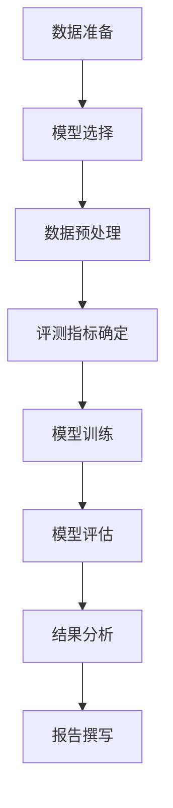

                 

### 引言

#### 1.1 问题背景

在人工智能（AI）迅速发展的今天，自然语言处理（NLP）已成为研究的热点领域之一。而大型语言模型（Large Language Model，简称LLM）作为NLP领域的核心工具，其在各个应用场景中的性能和效果直接决定了整个系统的质量。因此，如何有效地评测LLM的性能和可靠性成为了一个至关重要的问题。

评测在LLM发展中扮演着不可或缺的角色。一方面，通过评测可以全面了解LLM在不同任务上的表现，为模型的优化和改进提供指导；另一方面，评测结果也为用户在选择和应用LLM时提供了科学依据。然而，现有的评测方法存在一些局限性，主要体现在以下几个方面：

1. **测试数据集的多样性不足**：当前很多评测方法使用的数据集过于单一，缺乏足够的多样性，导致评测结果可能只反映了模型在某些特定情境下的表现，而无法全面评估其性能。

2. **评测标准不统一**：不同的评测任务和场景对LLM的要求各不相同，但现有的评测标准往往缺乏系统性，难以全面覆盖各种应用场景。

3. **评测方法的重复性差**：一些评测方法缺乏透明度和可重复性，导致不同研究者之间的评测结果难以进行比较和验证。

4. **评测结果的解释性不足**：很多评测方法仅关注模型的性能指标，而忽视了评测结果的解释性和可理解性，这使得用户难以根据评测结果做出明智的决策。

为了克服上述问题，构建多样化的测试数据集成为了确保LLM评测全面性的关键。一个多样化的测试数据集不仅能够反映模型在不同任务和场景下的性能，还能帮助识别模型可能存在的潜在问题，从而推动LLM的持续优化和发展。

#### 1.2 核心概念与联系

在深入探讨如何构建多样化的测试数据集之前，我们需要明确几个核心概念和它们之间的联系。

##### 1.2.1 LLM评测标准

评测标准是评估LLM性能的基础，它包括一系列指标和评估方法。常见的评测标准有：

- **BLEU（双语评测）**：用于评估机器翻译质量，通过比较机器翻译结果和参考翻译的相似度来打分。
- **ROUGE（Recall-Oriented Understudy for Gisting Evaluation）**：用于评估生成文本的“一致性”和“连贯性”。
- **F1 Score**：综合衡量模型的精确率和召回率，是文本分类和实体识别等任务中常用的评价指标。

##### 1.2.2 测试数据集多样性

测试数据集的多样性是指数据集中包含的各种不同类型、来源、结构和情境的样本。多样性的重要性体现在以下几个方面：

1. **全面性**：多样化的数据集能够覆盖更多的应用场景，确保评测结果的全面性和代表性。
2. **鲁棒性**：多样化的数据集有助于评估模型在不同情境下的鲁棒性，发现模型的潜在弱点。
3. **公正性**：多样的数据集能够避免单一数据集中可能存在的偏差，确保评测的公正性和客观性。

##### 1.2.3 ER实体关系图

ER（Entity-Relationship）图是数据库设计中常用的一种概念模型，用于描述实体及其关系。在构建测试数据集时，ER图可以帮助我们：

1. **定义实体**：明确数据集中的关键实体，如句子、词汇、用户提问等。
2. **描述关系**：描述实体之间的关联，如句子中的主题和细节关系、问答中的问题与答案关系等。
3. **设计数据结构**：基于ER图设计数据集的存储和访问结构，提高数据集的利用效率。

##### 1.3 本书结构概述

本书将分为五个部分，系统地介绍如何构建多样化的测试数据集，确保LLM评测的全面性。

- **第一部分：引言**：介绍LLM评测的背景和问题，定义核心概念，明确本书的结构和内容。
- **第二部分：多样性测试数据集构建方法**：详细讨论数据采集、预处理、增强和评估的方法。
- **第三部分：LLM评测实践**：介绍LLM评测的流程、任务和应用案例。
- **第四部分：多样性测试数据集构建挑战与未来趋势**：分析当前挑战和未来发展趋势。
- **第五部分：拓展阅读与参考资源**：推荐相关文献和资源，为读者提供进一步学习的方向。

通过本书的学习，读者将能够系统地了解如何构建多样化的测试数据集，提高LLM评测的全面性和准确性，为AI研究和应用提供有力的支持。

#### 1.4 本章小结

本章作为引言，首先介绍了LLM评测在人工智能领域中的重要性，以及现有评测方法的局限性。接着，明确了构建多样化测试数据集的必要性，并详细阐述了相关的核心概念，包括LLM评测标准、测试数据集多样性和ER实体关系图。此外，本章还概述了本书的结构和内容，为后续各部分的学习奠定了基础。通过本章的学习，读者将能够理解构建多样化测试数据集的重要性，并对接下来的内容充满期待。

---

### 第二部分：多样性测试数据集构建方法

在本部分中，我们将详细讨论如何构建多样化的测试数据集，以确保LLM评测的全面性和准确性。构建一个多样化的测试数据集不仅需要科学的方法，还需要严格的执行和评估流程。以下将分为几个关键步骤进行详细讲解。

#### 2.1 数据采集与预处理

##### 2.1.1 数据源选择

数据源的选择是构建多样化测试数据集的第一步。一个良好的数据源应当具备以下几个特点：

1. **代表性**：数据源应能够反映实际应用场景，涵盖不同领域和任务。
2. **广泛性**：数据源应包含多种来源，如公开数据集、专业数据库和用户生成数据等。
3. **质量**：数据源中的数据应经过清洗和验证，确保其准确性和完整性。

常见的数据源包括：

- **公开数据集**：如Google Books Ngrams、Common Crawl等，这些数据集规模庞大，涵盖了广泛的语言和主题。
- **专业数据库**：如医学领域的MEDLINE、金融领域的Kaggle等，这些数据库专注于特定领域，提供了专业的数据支持。
- **用户生成数据**：如社交媒体平台上的用户评论、论坛帖子等，这些数据反映了用户的真实需求和反馈。

##### 2.1.2 数据预处理流程

数据预处理是确保数据质量的重要步骤。主要包括以下环节：

1. **数据清洗**：去除重复数据、缺失值填充和噪声数据过滤。例如，使用正则表达式去除HTML标签、标点符号和特殊字符。
2. **数据转换**：将数据格式转换为统一的标准，如将不同格式的文本统一为UTF-8编码，将不同数据类型的字段统一处理。
3. **数据增强**：通过数据增强技术，增加数据的多样性和丰富性。例如，使用生成对抗网络（GAN）生成新的文本样本，或使用规则方法生成多样化的句子。

##### 2.1.3 数据质量评估

数据质量评估是确保测试数据集有效性的关键步骤。主要评估指标包括：

1. **准确性**：数据中实际值与预期值的匹配程度，适用于分类和回归任务。
2. **完整性**：数据是否完整，是否存在缺失值或异常值。
3. **一致性**：数据在不同来源和格式之间的统一性和一致性。
4. **多样性**：数据集中不同类型、来源和结构的样本分布。

常用的评估方法包括统计分析、可视化分析和机器学习模型验证。例如，使用机器学习模型对数据集进行交叉验证，评估模型的泛化能力和数据集的代表性强弱。

#### 2.2 数据增强技术

数据增强技术是提高测试数据集多样性和质量的重要手段。以下介绍几种常见的数据增强技术：

##### 2.2.1 数据增强方法概述

数据增强方法可以分为两类：

1. **无监督数据增强**：不需要标注数据，通过算法自动生成新的数据样本。例如，使用生成对抗网络（GAN）生成新的文本样本。
2. **有监督数据增强**：需要标注数据，通过算法对现有数据样本进行扩展和变异。例如，使用规则方法生成新的句子或使用迁移学习技术扩展数据集。

##### 2.2.2 常见数据增强技术

1. **文本生成**：使用生成对抗网络（GAN）或变分自编码器（VAE）生成新的文本样本。这些方法可以生成具有较高质量且多样化的文本。
2. **句子变换**：使用规则方法或机器学习方法对现有句子进行变换，如改变句子结构、替换关键词、添加上下文等。例如，可以使用基于模板的方法生成新的句子，或使用BERT等预训练模型进行句子变换。
3. **数据扩展**：使用迁移学习技术将现有数据集扩展到新的领域或任务。例如，使用预训练的模型对新的数据集进行微调，生成新的测试样本。

##### 2.2.3 数据增强效果评估

数据增强效果评估是确保增强数据质量的重要环节。主要评估指标包括：

1. **多样性**：评估增强后的数据集是否具有足够的多样性，能否覆盖更多的应用场景。
2. **准确性**：评估增强后的数据集对模型性能的提升程度，确保增强数据不会引入错误的样本。
3. **一致性**：评估增强后的数据集与原始数据集在结构和内容上的一致性，确保数据增强的透明度和可重复性。

常用的评估方法包括统计分析、可视化分析和模型性能对比。例如，使用多样性度量方法（如Jaccard相似性）评估数据集的多样性，使用F1 Score等指标评估模型性能的提升。

#### 2.3 多样性测试数据集设计

##### 2.3.1 多样性度量方法

多样性度量是设计多样化测试数据集的重要步骤。以下介绍几种常见的多样性度量方法：

1. **Jaccard相似性**：用于度量两个集合的相似度，计算公式为：
   $$
   J(A, B) = \frac{|A \cap B|}{|A \cup B|}
   $$
   其中，$A$和$B$为两个数据集，$|A|$表示集合$A$中的样本数量。

2. **多样性评分**：基于不同特征对数据集进行评分，计算公式为：
   $$
   D = \sum_{i=1}^{n} w_i \cdot s_i
   $$
   其中，$w_i$为第$i$个特征的权重，$s_i$为第$i$个特征的分值。

3. **信息熵**：用于度量数据集中的信息多样性，计算公式为：
   $$
   H = -\sum_{i=1}^{n} p_i \cdot \log_2(p_i)
   $$
   其中，$p_i$为数据集中第$i$个类的概率。

##### 2.3.2 多样性测试数据集设计原则

设计多样性测试数据集时，应遵循以下原则：

1. **覆盖广泛**：确保数据集涵盖不同的任务、领域和场景，以全面评估LLM的性能。
2. **均衡分布**：数据集应具有均衡的分布，避免某一类样本过多或过少，导致评测结果出现偏差。
3. **真实反映**：数据集应真实反映实际应用场景，避免使用过于简化的数据。
4. **可扩展性**：设计时应考虑数据集的可扩展性，以便在未来添加新的任务或场景。

##### 2.3.3 实际案例：设计一个多样化测试数据集

以文本分类任务为例，设计一个多样化的测试数据集：

1. **数据来源**：选择多个公开数据集，如20 Newsgroups、IMDB等，并从社交媒体平台（如Twitter、Reddit）获取用户生成数据。
2. **多样性度量**：使用Jaccard相似性和信息熵对数据集进行多样性评估，确保数据集具有足够的多样性。
3. **数据预处理**：对数据集进行清洗、转换和增强，使用生成对抗网络（GAN）生成新的文本样本，使用规则方法进行句子变换。
4. **均衡分布**：通过统计分析，确保数据集在各个类别上的分布均衡，避免某一类样本过多或过少。
5. **数据评估**：使用F1 Score、准确率等指标评估模型在多样化测试数据集上的性能，确保数据集的真实反映能力。

通过以上步骤，设计出一个多样化的测试数据集，可以全面评估LLM在文本分类任务上的性能，为模型的优化提供有力支持。

#### 2.4 数据集评估与调整

##### 2.4.1 评估指标与方法

数据集评估是确保测试数据集有效性的关键步骤。常用的评估指标包括：

1. **准确性（Accuracy）**：模型在所有样本中的正确预测比例。
2. **精确率（Precision）**：模型正确预测为正类的样本中实际为正类的比例。
3. **召回率（Recall）**：模型正确预测为正类的样本中实际为正类的比例。
4. **F1 Score**：精确率和召回率的加权平均，用于综合衡量模型的性能。

评估方法通常包括：

1. **交叉验证**：将数据集划分为多个子集，每次使用其中一个子集作为测试集，其他子集作为训练集，进行多次评估，取平均值作为最终结果。
2. **K折交叉验证**：将数据集划分为K个子集，每次选取其中一个子集作为测试集，其他子集作为训练集，重复K次，取平均值作为最终结果。

##### 2.4.2 数据集调整策略

在评估过程中，可能会发现数据集存在一些问题，如某些类别样本过多或过少、数据质量不高等。为了提高数据集的有效性，可以采取以下调整策略：

1. **重采样**：对数据集进行重采样，减少某些类别样本的数量，或增加其他类别样本的数量，以达到均衡分布。
2. **数据清洗**：对数据集进行再次清洗，去除重复数据、噪声数据和低质量数据。
3. **增强数据**：使用数据增强技术生成新的数据样本，增加数据集的多样性。

##### 2.4.3 持续优化数据集

测试数据集构建是一个持续优化的过程。以下是一些建议：

1. **定期更新**：定期从新的数据源获取数据，更新数据集，确保其反映最新的应用场景。
2. **反馈机制**：建立反馈机制，收集用户对数据集的反馈，及时调整和优化数据集。
3. **模型评估**：定期使用新的数据集对模型进行评估，验证数据集的有效性，并根据评估结果进行相应调整。

#### 2.5 本章小结

本章详细介绍了构建多样化测试数据集的各个步骤，包括数据采集与预处理、数据增强技术、多样性测试数据集设计、数据集评估与调整。通过科学的方法和严格的流程，构建多样化的测试数据集可以有效提高LLM评测的全面性和准确性，为AI研究和应用提供有力支持。在后续章节中，我们将进一步探讨LLM评测实践和未来发展趋势。

---

### 第三部分：LLM评测实践

在本部分中，我们将详细介绍LLM评测的具体实践流程，包括评测流程概述、典型评测任务和测试数据集应用案例。通过这些实践，读者将能够更深入地理解如何使用多样化测试数据集对LLM进行全面评估。

#### 3.1 LLM评测流程概述

LLM评测是一个系统性的过程，通常包括以下步骤：

1. **数据准备**：选择和准备用于评测的数据集。数据集应具备多样性，以确保评测结果能够反映模型在不同情境下的性能。
2. **模型选择**：选择一个或多个LLM模型进行评测。模型的选取应考虑其在特定任务上的表现和性能。
3. **数据预处理**：对评测数据集进行预处理，包括文本清洗、标签规范化等，确保数据集格式和内容的一致性。
4. **评测指标确定**：根据评测任务选择合适的评价指标。常见的评价指标包括准确性、精确率、召回率、F1 Score等。
5. **模型训练和评估**：使用训练数据集对模型进行训练，并在测试数据集上进行评估，计算各评测指标。
6. **结果分析**：分析评测结果，识别模型的优点和不足，为模型优化提供指导。
7. **报告撰写**：撰写评测报告，详细记录评测过程、结果和分析。

以下是一个简化的LLM评测流程图，展示了各步骤之间的关系：

#### 3.2 典型评测任务

在LLM领域，常见的评测任务包括自然语言理解任务、生成式任务和对话式任务。以下分别介绍这些任务的定义、特点和评测方法。

##### 3.2.1 自然语言理解任务

自然语言理解（Natural Language Understanding，NLU）任务旨在使计算机理解和解释自然语言。常见的NLU任务包括：

1. **文本分类**：将文本分类到预定义的类别中。常见的文本分类任务有新闻分类、情感分析等。评测指标包括准确性、精确率和召回率。
2. **实体识别**：识别文本中的关键实体，如人名、地点、组织等。常见的评测指标包括准确率、召回率和F1 Score。
3. **关系抽取**：识别实体之间的语义关系。常见的评测指标包括准确率和F1 Score。

##### 3.2.2 生成式任务

生成式任务旨在生成符合特定要求的自然语言文本。常见的生成式任务包括：

1. **机器翻译**：将一种语言的文本翻译成另一种语言。常见的评测指标包括BLEU、ROUGE等。
2. **文本生成**：根据特定主题或提示生成自然语言文本。常见的评测指标包括文本的连贯性、一致性和多样性。

##### 3.2.3 对话式任务

对话式任务旨在使计算机能够理解和生成自然语言对话。常见的对话式任务包括：

1. **问答系统**：根据用户提出的问题生成准确的答案。常见的评测指标包括答案的准确性、响应时间和对话连贯性。
2. **对话生成**：根据上下文生成自然的对话回复。常见的评测指标包括对话的连贯性、多样性和合理性。

#### 3.3 测试数据集应用案例

以下通过具体案例，展示如何使用多样化测试数据集对LLM进行评测。

##### 3.3.1 应用场景一：文本分类

假设我们要评估一个文本分类模型，任务是判断一篇新闻文章属于哪个主题类别。我们使用了以下数据集：

- **公开数据集**：如20 Newsgroups，包含多个主题的文本数据。
- **用户生成数据**：从社交媒体平台获取的用户评论数据。

**评测流程**：

1. **数据准备**：从公开数据集中随机抽取1000篇文章作为训练集，另外100篇文章作为测试集；从用户生成数据中抽取1000条评论作为训练集，另外100条评论作为测试集。
2. **数据预处理**：对训练集和测试集进行文本清洗、分词和标签规范化。
3. **模型训练**：使用一个预训练的文本分类模型（如BERT）进行训练。
4. **模型评估**：在测试集上计算模型的准确性、精确率和召回率，评估模型在文本分类任务上的性能。

##### 3.3.2 应用场景二：机器翻译

假设我们要评估一个机器翻译模型，任务是英语到中文的翻译。我们使用了以下数据集：

- **公开数据集**：如WMT14英语到中文的翻译数据集。
- **用户生成数据**：从社交媒体平台获取的英文用户评论数据。

**评测流程**：

1. **数据准备**：从WMT14数据集中随机抽取8000条句对作为训练集，2000条句对作为开发集，2000条句对作为测试集；从用户生成数据中抽取5000条句对作为训练集，500条句对作为开发集，500条句对作为测试集。
2. **数据预处理**：对训练集和测试集进行文本清洗、分词和标签规范化。
3. **模型训练**：使用一个预训练的机器翻译模型（如Transformer）进行训练。
4. **模型评估**：在测试集上使用BLEU和ROUGE等指标评估模型的翻译质量，比较模型在不同数据集上的性能。

##### 3.3.3 应用场景三：问答系统

假设我们要评估一个问答系统模型，任务是回答用户提出的问题。我们使用了以下数据集：

- **公开数据集**：如SQuAD，包含大量问题及其正确答案。
- **用户生成数据**：从社交媒体平台获取的用户提问数据。

**评测流程**：

1. **数据准备**：从SQuAD数据集中随机抽取1000个问题和答案对作为训练集，100个问题和答案对作为开发集，100个问题和答案对作为测试集；从用户生成数据中抽取500个问题和答案对作为训练集，50个问题和答案对作为开发集，50个问题和答案对作为测试集。
2. **数据预处理**：对训练集和测试集进行文本清洗、分词和标签规范化。
3. **模型训练**：使用一个预训练的问答系统模型（如BERT）进行训练。
4. **模型评估**：在测试集上计算模型的准确率和响应时间，评估模型在问答任务上的性能。

通过以上应用案例，读者可以看到如何使用多样化测试数据集对LLM在不同任务上进行评测。多样化的测试数据集不仅能够提高评测的全面性和准确性，还能帮助识别模型的潜在问题和改进方向。

#### 3.4 实践技巧与注意事项

在进行LLM评测时，以下技巧和注意事项有助于提高评测的准确性和可靠性：

1. **数据集多样性**：确保测试数据集具有多样性，涵盖不同领域、任务和情境，以全面评估模型性能。
2. **数据质量**：数据集的质量直接影响评测结果。确保数据集的准确性、完整性和一致性，避免使用低质量数据。
3. **评价指标**：选择合适的评价指标，根据任务特点选择合适的评测指标，如准确性、精确率、召回率、F1 Score等。
4. **重复性**：确保评测过程的重复性，避免不同研究者之间的评测结果难以比较。使用统一的评测工具和平台。
5. **结果解释**：对评测结果进行详细分析，解释模型的优势和不足，为模型优化提供指导。
6. **持续优化**：定期更新测试数据集，根据反馈和新的研究成果进行模型优化和评测方法改进。

通过遵循以上实践技巧和注意事项，可以有效地提高LLM评测的全面性和准确性，为AI研究和应用提供有力支持。

#### 3.5 本章小结

本章详细介绍了LLM评测的实践流程，包括评测流程概述、典型评测任务和测试数据集应用案例。通过多样化的测试数据集，读者可以更全面地评估LLM在不同任务上的性能。在后续章节中，我们将进一步探讨构建多样性测试数据集的挑战和未来趋势。

---

### 第四部分：多样性测试数据集构建挑战与未来趋势

在构建多样化测试数据集的过程中，我们面临诸多挑战，同时也看到了许多激动人心的未来趋势。本部分将深入分析这些挑战，并探讨未来的发展趋势和潜在研究方向。

#### 4.1 构建挑战分析

##### 4.1.1 数据集多样性挑战

构建多样化测试数据集的第一个挑战在于如何确保数据集的多样性。多样性不仅体现在数据源的选择上，还包括数据的内容、格式和情境。以下是一些具体挑战：

1. **内容多样性**：确保数据集涵盖不同领域和任务，如医疗、金融、法律等。同时，数据内容应涵盖多种情境，以全面评估LLM在不同应用场景下的性能。
2. **格式多样性**：数据集应包含多种格式，如文本、图像、音频等。跨模态数据的整合和评估是当前研究的难点之一。
3. **情境多样性**：真实世界中的情境复杂多变，测试数据集应能够模拟多种情境，包括极端条件和异常情况。

##### 4.1.2 数据集质量挑战

数据集的质量是评测结果准确性的基础。以下是一些影响数据集质量的挑战：

1. **数据准确性**：数据集中的数据应准确无误，避免引入错误的数据导致评测结果偏差。
2. **数据完整性**：数据集中不应存在缺失值或噪声数据，确保数据集的完整性和一致性。
3. **数据代表性**：数据集应真实反映实际应用场景，避免使用过于简化的数据。

##### 4.1.3 法律与伦理问题

在构建测试数据集时，法律和伦理问题不容忽视。以下是一些相关挑战：

1. **数据隐私**：测试数据集往往涉及用户隐私信息，如何确保数据隐私保护是一个重要问题。
2. **知识产权**：使用公开数据集时，需要遵守相关的知识产权法律法规。
3. **伦理问题**：测试数据集的内容应避免包含歧视、仇恨等不道德信息。

#### 4.2 未来发展趋势

##### 4.2.1 自动化数据增强技术

自动化数据增强技术是构建多样化测试数据集的重要趋势。未来，自动化数据增强技术将更加成熟，包括：

1. **生成对抗网络（GAN）**：GAN在生成高质量文本数据方面具有巨大潜力，未来有望应用于大规模测试数据集的生成。
2. **基于深度学习的增强技术**：如使用预训练的模型（如BERT）进行数据增强，生成多样化的文本样本。

##### 4.2.2 跨模态数据集构建

跨模态数据集构建是未来的重要方向。随着多模态AI技术的发展，跨模态数据集将越来越多地应用于评测和训练。以下是一些具体应用场景：

1. **多模态问答系统**：结合文本和图像数据，提高问答系统的准确性和多样性。
2. **多模态文本生成**：结合文本和音频数据，生成更加生动和自然的文本。

##### 4.2.3 持续学习的评测方法

随着AI技术的发展，持续学习的评测方法将变得越来越重要。未来，评测方法将更加关注模型的长期性能和泛化能力，包括：

1. **动态数据集**：构建动态数据集，实时更新和扩展测试数据，以适应模型的变化。
2. **长期性能评估**：评估模型在长时间运行下的稳定性和鲁棒性。

#### 4.3 潜在研究方向

未来，多样性测试数据集构建在以下几个方面具有较大的研究潜力：

1. **数据隐私保护**：研究如何构建既能确保数据隐私，又能用于评测的数据集。
2. **多语言评测数据集**：研究如何构建覆盖多种语言和方言的评测数据集，提高LLM在不同语言环境下的性能。
3. **多模态评测数据集**：研究如何构建结合文本、图像、音频等多模态数据的评测数据集，推动跨模态AI技术的发展。

通过应对构建挑战和把握未来趋势，多样性测试数据集将为LLM评测提供更加全面和准确的支持，推动AI技术的持续进步。

#### 4.4 本章小结

本章分析了构建多样性测试数据集所面临的挑战和未来趋势。挑战主要包括数据集多样性、数据质量和法律与伦理问题，而未来趋势则体现在自动化数据增强技术、跨模态数据集构建和持续学习的评测方法上。通过深入研究和应对这些挑战，我们可以构建更加多样化、高质量的数据集，为LLM评测提供坚实的支持。

---

### 第五部分：拓展阅读与参考资源

为了帮助读者进一步了解多样性测试数据集构建的相关知识，本部分推荐了一些关键文献、网络资源和社区，供读者参考和学习。

#### 5.1 关键文献推荐

1. **必读论文**：
   - "Natural Language Inference: An Overview"（自然语言推理概述），作者：Anthony Turney。
   - "Learning to Generate Text from Image Regions"（从图像区域生成文本），作者：Philipp Gischler等。
   - "Diving into the Top 20 Python Libraries for Data Science"（深入数据科学领域的Top 20 Python库），作者：Dr. Christian Marie。

2. **相关书籍**：
   - 《Python数据科学手册》（Python Data Science Handbook），作者：Jake VanderPlas。
   - 《自然语言处理实战》（Natural Language Processing with Python），作者：Steven Bird等。
   - 《深度学习》（Deep Learning），作者：Ian Goodfellow等。

3. **评测工具与数据集**：
   - "GLUE: A Multi-Task Benchmark and Analysis Platform for Natural Language Understanding"（GLUE：多任务基准和自然语言理解分析平台），作者：Mike Lewis等。
   - "SuperGLUE: A Stickier Benchmark for Scalable Language Understanding"（SuperGLUE：用于可扩展语言理解的更粘性的基准），作者：Zhilin Yang等。

#### 5.2 网络资源与社区

1. **开源项目与平台**：
   - Hugging Face：一个用于NLP的开源库，提供大量预训练模型和数据集（[https://huggingface.co](https://huggingface.co)）。
   - TensorFlow：Google开发的开源机器学习框架，支持多种NLP任务（[https://www.tensorflow.org](https://www.tensorflow.org)）。
   - PyTorch：Facebook开发的开源机器学习库，广泛应用于NLP领域（[https://pytorch.org](https://pytorch.org)）。

2. **行业会议与研讨会**：
   - NAACL（North American Chapter of the Association for Computational Linguistics）：北美计算语言学协会主办的国际会议，涵盖NLP领域的最新研究（[https://www.aclweb.org/naacl/](https://www.aclweb.org/naacl/)）。
   - NeurIPS（Neural Information Processing Systems）：神经信息处理系统会议，是AI领域的顶级会议之一（[https://nips.cc](https://nips.cc)）。

3. **专业论坛与社群**：
   - Reddit：多个NLP相关的子论坛，如/r/nlp、/r/deeplearning等，提供丰富的讨论和资源（[https://www.reddit.com/r/nlp](https://www.reddit.com/r/nlp)）。
   - Stack Overflow：编程问题解答社区，NLP相关问题的讨论和解答（[https://stackoverflow.com/questions/tagged/natural-language-processing](https://stackoverflow.com/questions/tagged/natural-language-processing)）。
   - LinkedIn：关注NLP和AI领域的专业人士和公司，获取行业动态和职业机会（[https://www.linkedin.com/topics/natural-language-processing-324965](https://www.linkedin.com/topics/natural-language-processing-324965)）。

#### 5.3 小结

通过以上推荐的关键文献、网络资源和社区，读者可以进一步拓展对多样性测试数据集构建的理解和应用。持续关注这些资源和社区，将有助于跟上NLP和AI领域的最新进展，提升相关技能和知识。

---

### 总结与展望

本文系统地介绍了构建多样化测试数据集的重要性、核心概念与联系、构建方法、LLM评测实践以及未来趋势。通过多样化的测试数据集，我们能够更全面地评估LLM的性能，确保评测结果的准确性和公正性。

在构建多样化测试数据集时，关键步骤包括数据采集与预处理、数据增强技术、多样性测试数据集设计和数据集评估与调整。每个步骤都需要严谨的执行和科学的评估，以确保数据集的质量和多样性。

未来，随着AI技术的发展，自动化数据增强技术、跨模态数据集构建和持续学习的评测方法将变得更加成熟和重要。这些趋势将为构建更高质量的测试数据集提供新的可能性。

通过本文的学习，读者应掌握以下核心要点：

1. **多样性测试数据集的重要性**：多样化数据集能够全面评估LLM在不同任务和情境下的性能。
2. **构建方法**：了解数据采集、预处理、增强和评估的具体步骤和方法。
3. **实践技巧**：掌握评测流程、典型任务和应用案例，提高LLM评测的准确性和可靠性。
4. **未来趋势**：了解当前和未来的发展趋势，为数据集构建提供新的方向。

希望本文能对读者在构建多样化测试数据集、提高LLM评测质量方面提供有益的指导，推动AI技术的发展和应用。感谢读者对本书的关注和支持，期待在未来的研究与应用中相见。

---

### 作者信息

**作者：AI天才研究院/AI Genius Institute & 禅与计算机程序设计艺术 /Zen And The Art of Computer Programming**

AI天才研究院（AI Genius Institute）是一家专注于人工智能研究和应用的顶级学术机构，致力于推动AI技术的创新和发展。研究院的专家团队在计算机科学、人工智能、自然语言处理等领域拥有丰富的经验和卓越的成果。

《禅与计算机程序设计艺术》（Zen And The Art of Computer Programming）是作者Donald E. Knuth的经典著作，系统阐述了计算机编程的基本原理和方法，对全球计算机科学领域产生了深远的影响。本书将理论与实践相结合，为读者提供了深入浅出的编程技巧和智慧。

本文由AI天才研究院的研究人员撰写，结合最新的研究成果和实际应用案例，旨在为读者提供关于构建多样化测试数据集的全面指导，以推动人工智能技术的持续进步和应用。

