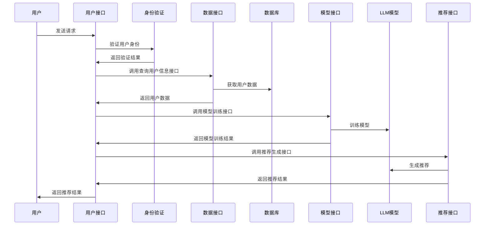

                 

# 《构建安全可靠的LLM应用架构》

## 关键词

- LLM应用
- 安全性
- 可靠性
- 架构设计
- 恶意攻击
- 容错机制
- 数据隐私

## 摘要

本文将深入探讨如何构建一个既安全又可靠的LLM（大型语言模型）应用架构。我们将首先介绍LLM的基本概念及其在应用中的重要性，然后分析LLM应用所面临的安全挑战和可靠性需求。接着，我们将详细讨论核心概念和它们之间的联系，以及如何通过算法原理和系统架构设计来保障LLM应用的安全与可靠性。最后，我们将通过实际案例展示最佳实践，并提供一些注意事项和拓展阅读资源。

## 目录大纲

1. 第一部分：背景介绍
    1.1 LLM应用安全与可靠性概述
    1.2 LLM应用安全挑战
    1.3 LLM应用可靠性保障

2. 第二部分：核心概念与联系
    2.1 LLM模型原理
    2.2 安全与可靠性原理
    2.3 概念属性特征对比表格
    2.4 ER实体关系图架构

3. 第三部分：算法原理讲解
    3.1 算法原理
    3.2 算法实现
    3.3 举例说明

4. 第四部分：系统分析与架构设计方案
    4.1 问题场景介绍
    4.2 系统功能设计
    4.3 系统架构设计
    4.4 系统接口设计
    4.5 系统交互

5. 第五部分：项目实战
    5.1 环境安装与配置
    5.2 实际案例分析与讲解
    5.3 案例总结

6. 第六部分：最佳实践与总结
    6.1 最佳实践
    6.2 注意事项
    6.3 拓展阅读

### 1. 第一部分：背景介绍

#### 1.1 LLM应用安全与可靠性概述

在当今信息化时代，语言模型（Language Model，简称LM）作为一种强大的自然语言处理工具，已经在众多应用领域展现出其强大的能力和价值。特别是大型语言模型（Large Language Model，简称LLM），由于其拥有海量数据和复杂的神经网络结构，能够实现高度灵活的自然语言生成和语义理解。

随着LLM在各个领域的广泛应用，其安全性和可靠性成为了一个不可忽视的问题。安全性主要关注防止恶意攻击、数据泄露等威胁，而可靠性则确保LLM在实际应用中能够稳定、高效地运行。本部分将首先介绍LLM应用的安全与可靠性问题，然后分析其背景和重要性。

### 1.2 LLM应用安全挑战

LLM应用面临的安全挑战主要来自于以下几个方面：

1. **恶意攻击**：包括注入攻击、拒绝服务攻击（DDoS）、恶意代码植入等，这些攻击可能导致LLM模型失效或被篡改。

2. **数据隐私保护**：在训练和部署LLM模型的过程中，数据隐私保护是一个重要的问题。如何确保用户数据不被泄露、滥用或用于非法目的，是一个需要慎重考虑的问题。

3. **网络安全问题**：包括网络传输安全、服务器安全等，这些问题可能导致LLM应用在运行过程中受到网络攻击，从而影响其正常运行。

#### 1.3 LLM应用可靠性保障

LLM应用的可靠性保障主要涉及以下几个方面：

1. **系统架构设计**：通过合理的系统架构设计，确保LLM应用在复杂环境中能够稳定运行。

2. **容错与冗余机制**：通过引入容错和冗余机制，提高系统的容错能力和可靠性。

3. **系统监控与维护**：通过监控和及时维护，确保LLM应用能够持续稳定地运行。

在接下来的章节中，我们将深入探讨这些核心概念，并详细分析如何构建一个安全可靠的LLM应用架构。

### 1.1 LLM应用安全与可靠性概述

#### 1.1.1 问题背景

随着人工智能（AI）技术的迅猛发展，LLM（大型语言模型）已经成为自然语言处理（NLP）领域的核心工具。LLM通过深度学习技术，从海量数据中学习语言模式，生成自然流畅的文本，支持问答系统、机器翻译、文本摘要等多种应用。然而，随着LLM在各个领域的广泛应用，其安全与可靠性问题也逐渐显现出来。

首先，LLM应用面临的首要问题是恶意攻击。由于LLM模型具有高度的灵活性和强大的文本生成能力，恶意攻击者可能会利用这些特点进行各种攻击，如恶意输入注入、伪造文本生成、恶意代码植入等。这些攻击可能导致LLM模型失效、数据泄露甚至系统崩溃。

其次，数据隐私保护也是LLM应用的重要挑战。在训练和部署LLM模型的过程中，大量的用户数据会被收集和处理。如何确保这些数据不被未经授权的第三方访问、泄露或滥用，成为了一个关键问题。

此外，网络安全问题也不可忽视。在分布式部署环境下，LLM应用可能会受到分布式拒绝服务攻击（DDoS）、数据篡改、中间人攻击等网络攻击，从而影响其正常运行。

#### 1.1.2 核心概念

**LLM定义**：LLM是指通过深度学习技术训练的、具有海量词汇量和复杂神经网络结构的大型语言模型。它能够理解和生成自然语言，支持各种语言处理任务。

**安全与可靠性概念**：
- **安全性**：确保LLM应用不受恶意攻击，防止数据泄露、模型篡改和系统崩溃。
- **可靠性**：确保LLM应用在复杂环境下能够稳定、高效地运行，满足用户需求。

#### 1.1.3 概念联系

LLM与安全、可靠性的联系主要体现在以下几个方面：

1. **LLM与安全**：
   - 安全性是LLM应用的基本保障。只有确保LLM模型和数据的安全性，才能保障其应用的正常运作。
   - LLM的安全与数据隐私保护密切相关。在处理用户数据时，必须采取严格的隐私保护措施，防止数据泄露。

2. **LLM与可靠性**：
   - 可靠性是LLM应用的核心需求。一个可靠的LLM应用能够保证在复杂环境下稳定运行，提高用户满意度。
   - 可靠性设计包括系统架构设计、容错与冗余机制、系统监控与维护等多个方面。

在接下来的章节中，我们将详细分析LLM应用面临的安全挑战和可靠性需求，并提出相应的解决方案。

### 1.2 LLM应用安全挑战

LLM应用在实际应用中面临多种安全挑战，这些挑战不仅影响系统的正常运行，还可能对用户数据造成严重威胁。以下将详细分析LLM应用可能遇到的安全挑战。

#### 1.2.1 恶意攻击

恶意攻击是LLM应用面临的主要安全威胁之一。恶意攻击者可能会利用LLM模型的弱点进行各种恶意操作，包括但不限于以下几种：

1. **注入攻击**：攻击者通过在输入数据中注入恶意代码或指令，使LLM模型执行非预期的操作。例如，通过输入特定的文本格式，攻击者可以触发模型中的漏洞，导致模型崩溃或执行恶意代码。

2. **拒绝服务攻击（DDoS）**：攻击者通过大量无效请求或恶意数据流，占用LLM应用的服务资源，导致系统无法正常响应合法用户请求。这种攻击可能导致服务中断，影响用户体验。

3. **恶意代码植入**：攻击者可能会通过植入恶意软件或病毒，直接控制LLM模型或服务器，从而窃取敏感数据或操纵输出结果。

#### 1.2.2 数据隐私保护

数据隐私保护是另一个关键的安全挑战。在训练和部署LLM模型的过程中，涉及大量用户数据，这些数据可能包含敏感信息，如个人身份信息、医疗记录等。以下是一些常见的隐私保护问题：

1. **数据泄露风险**：如果LLM模型或相关系统的安全措施不到位，敏感数据可能会被未经授权的第三方访问、泄露或滥用。

2. **数据收集与存储**：在收集和存储用户数据时，如果没有采取有效的加密和访问控制措施，可能导致数据泄露或被非法访问。

3. **数据共享**：在某些情况下，LLM模型需要与其他第三方进行数据共享。如果共享协议不完善，可能导致数据隐私泄露。

为了应对这些安全挑战，LLM应用需要采取一系列安全措施，包括数据加密、访问控制、安全审计等。此外，还需要建立完善的应急响应机制，以应对潜在的恶意攻击和数据泄露事件。

#### 1.2.3 网络安全问题

网络安全问题也是LLM应用需要关注的重要方面。在分布式部署环境下，LLM应用可能面临以下网络安全威胁：

1. **网络攻击**：攻击者可能通过入侵网络系统、窃取敏感数据、篡改数据或破坏系统完整性，从而影响LLM应用的正常运行。

2. **服务器安全**：服务器作为LLM应用的核心组件，需要采取严格的安全防护措施，防止攻击者入侵或控制服务器。

3. **网络传输安全**：在网络传输过程中，数据可能会被拦截、篡改或窃取。因此，需要采用加密传输协议，确保数据在网络传输过程中的安全性。

为了保障LLM应用的网络安全性，需要采用多种安全防护技术，如防火墙、入侵检测系统（IDS）、虚拟专用网络（VPN）等。此外，还需要定期进行网络安全审计和漏洞扫描，及时发现和修复安全隐患。

综上所述，LLM应用在安全方面面临多种挑战，需要采取全面、有效的安全措施，确保系统的安全性和可靠性。

### 1.3 LLM应用可靠性保障

为了确保LLM应用在实际运行中能够提供稳定、可靠的服务，保障其可靠性和稳定性是至关重要的。以下将详细探讨保障LLM应用可靠性的几个关键方面。

#### 1.3.1 系统架构设计

合理的系统架构设计是保障LLM应用可靠性的基础。一个优秀的系统架构应该具备以下特点：

1. **模块化**：将系统划分为多个独立的模块，每个模块负责不同的功能，模块间通过接口进行通信。这样有助于提高系统的可维护性和扩展性，同时降低了模块间的耦合度，减少了故障传播的风险。

2. **分布式部署**：将LLM应用部署在多个服务器上，通过负载均衡技术实现流量分发。这样不仅能够提高系统的吞吐量和响应速度，还能增强系统的容错能力，即使某个服务器出现故障，其他服务器可以继续提供服务。

3. **冗余设计**：在系统架构中引入冗余设计，通过备份和冗余机制确保关键组件的高可用性。例如，对于重要的数据处理模块，可以部署多个实例，确保在某个实例故障时，其他实例能够接管其工作。

4. **数据一致性**：在分布式系统中，数据的一致性是保障系统可靠性的重要因素。需要采用合适的数据一致性和分布式事务处理机制，确保系统在分布式环境下能够保持数据的一致性。

#### 1.3.2 容错与冗余机制

为了提高LLM应用的可靠性，需要在系统架构中引入容错与冗余机制：

1. **容错机制**：通过故障检测、自动恢复和故障切换等技术，确保在系统发生故障时，能够快速恢复并继续提供服务。例如，可以采用心跳检测技术，定期监测系统组件的状态，一旦检测到故障，立即触发故障恢复机制。

2. **冗余机制**：通过部署冗余组件和备份机制，确保在关键组件出现故障时，能够快速切换到备份组件，从而确保系统的持续运行。例如，对于关键的数据存储服务器，可以部署多个副本，确保数据不会因为单点故障而丢失。

#### 1.3.3 系统监控与维护

系统监控与维护是保障LLM应用可靠性的重要手段。以下是一些关键的监控和维护策略：

1. **监控指标**：建立全面的监控指标体系，包括系统性能指标、资源利用率指标、错误率指标等。通过对这些指标进行实时监控，可以及时发现系统异常和潜在故障。

2. **告警机制**：配置告警机制，一旦监控指标超出预设阈值，立即发送告警通知，以便快速响应和解决问题。

3. **定期维护**：定期对系统进行维护和升级，修复已知漏洞，优化系统性能。同时，定期进行系统备份，确保在发生故障时能够快速恢复。

4. **故障演练**：定期进行故障演练，模拟系统故障情况，测试故障恢复机制的有效性，确保在实际故障发生时能够迅速恢复。

通过以上措施，可以有效保障LLM应用的安全性和可靠性，确保其在复杂环境下能够稳定、高效地运行。

### 2. 第二部分：核心概念与联系

#### 2.1 LLM模型原理

LLM（大型语言模型）是一种基于深度学习的自然语言处理模型，能够理解和生成自然语言。LLM的核心原理基于神经网络，特别是循环神经网络（RNN）和变压器（Transformer）模型。以下将详细探讨LLM模型的原理。

**2.1.1 模型结构**

LLM模型通常由以下几个部分组成：

1. **输入层**：接收自然语言文本序列，将其转换为模型可处理的向量形式。

2. **嵌入层**：将输入文本的单词或字符转换为固定长度的向量表示。

3. **编码层**：利用循环神经网络或变压器模型，对嵌入层输出的向量进行处理，提取文本的语义信息。

4. **解码层**：根据编码层的输出，生成自然语言的输出序列。

**2.1.2 模型训练过程**

LLM模型的训练过程主要包括以下步骤：

1. **数据准备**：收集并整理大量带有标签的自然语言数据集，如文本语料库、问答对等。

2. **数据预处理**：对收集到的数据集进行预处理，包括文本清洗、分词、词性标注等。

3. **模型初始化**：初始化模型参数，通常使用随机初始化或预训练模型参数。

4. **训练**：通过反向传播算法和优化器（如SGD、Adam等），调整模型参数，最小化损失函数。

5. **验证与测试**：在验证集和测试集上评估模型性能，调整模型参数，优化模型效果。

**2.1.3 模型优化方法**

为了提高LLM模型的性能，可以采用以下优化方法：

1. **预训练**：在大量无标签数据上预训练模型，提取通用语言特征。

2. **微调**：在特定任务数据集上微调模型，使其适应特定任务。

3. **量化**：通过量化技术降低模型参数的精度，减少模型存储和计算需求。

4. **剪枝**：通过剪枝技术移除模型中冗余的参数，减少模型复杂度。

#### 2.2 安全与可靠性原理

安全与可靠性是保障LLM应用正常运行的两大核心要素。以下将分别探讨安全与可靠性的原理。

**2.2.1 安全机制**

安全机制主要关注防止恶意攻击和数据泄露。以下是一些常见的安全机制：

1. **访问控制**：通过身份认证和权限管理，确保只有授权用户能够访问敏感数据和系统资源。

2. **加密**：对传输和存储的数据进行加密，防止数据被窃取或篡改。

3. **防火墙与入侵检测**：部署防火墙和入侵检测系统，监控网络流量，阻止恶意攻击。

4. **安全审计**：定期进行安全审计，检测系统漏洞和安全威胁，及时修复。

**2.2.2 可靠性机制**

可靠性机制主要关注系统的稳定性和容错能力。以下是一些常见的可靠性机制：

1. **冗余设计**：通过冗余组件和备份机制，确保在系统发生故障时，其他组件可以接管其工作。

2. **容错机制**：通过故障检测和自动恢复，确保系统在故障发生时能够快速恢复。

3. **负载均衡**：通过负载均衡技术，分配系统负载，防止单个组件过载。

4. **监控与维护**：定期进行系统监控和维护，及时发现和解决问题。

#### 2.3 概念属性特征对比表格

为了更好地理解LLM模型、安全机制和可靠性机制之间的关系，以下是一个概念属性特征对比表格：

| 特性       | LLM模型 | 安全机制 | 可靠性机制 |
| ---------- | ------- | -------- | ---------- |
| 目标       | 生成自然语言 | 防止恶意攻击 | 确保系统稳定性 |
| 结构       | 神经网络 | 访问控制、加密 | 冗余设计、容错机制 |
| 数据处理   | 文本数据 | 敏感数据保护 | 系统监控与维护 |
| 优化方法   | 预训练、微调 | 安全审计 | 定期维护 |
| 重要性     | 核心技术 | 必需保障 | 必需保障 |

#### 2.4 ER实体关系图架构

为了更好地理解LLM应用架构中的核心实体和关系，以下是一个ER（实体关系）图架构：

```mermaid
erDiagram
    User ||--|{ Chatbot }|-- Data
    Chatbot ||--|{ LLMModel }|--
    LLMModel ||--|{ Response }|--
    Response ||-- User
```

在这个ER图中，用户（User）与聊天机器人（Chatbot）之间存在双向关系，聊天机器人与LLM模型（LLMModel）之间存在单向关系，LLM模型生成响应（Response），响应再返回给用户。这种关系体现了LLM应用中各实体之间的交互和依赖关系。

通过以上对核心概念和它们之间联系的详细分析，我们可以更好地理解如何构建一个既安全又可靠的LLM应用架构。在接下来的章节中，我们将进一步探讨算法原理和系统架构设计，以实现这一目标。

### 2.2 安全与可靠性原理

#### 2.2.1 安全机制

安全机制是保障LLM应用免受恶意攻击和数据泄露的关键手段。以下是一些常见的安全机制：

1. **访问控制**：通过身份认证和权限管理，确保只有授权用户能够访问系统的敏感部分。常用的访问控制方法包括基于角色的访问控制（RBAC）和基于属性的访问控制（ABAC）。

2. **加密**：对传输和存储的数据进行加密，防止数据在传输过程中被窃取或篡改。常用的加密技术包括对称加密（如AES）和非对称加密（如RSA）。

3. **防火墙与入侵检测**：部署防火墙和入侵检测系统（IDS），监控网络流量，阻止恶意攻击。防火墙可以限制未授权的访问，IDS可以检测和响应异常行为。

4. **安全审计**：定期进行安全审计，检测系统漏洞和安全威胁，及时修复。安全审计有助于发现潜在的安全问题和漏洞，确保系统的安全性。

5. **安全培训**：对系统管理员和用户进行安全培训，提高他们的安全意识和操作规范。安全培训可以帮助用户了解潜在的安全威胁和防护措施，减少人为错误导致的安全问题。

#### 2.2.2 可靠性机制

可靠性机制是保障LLM应用在复杂环境下稳定运行的关键。以下是一些常见的可靠性机制：

1. **冗余设计**：通过部署冗余组件和备份机制，确保在系统发生故障时，其他组件可以接管其工作。冗余设计可以包括硬件冗余、软件冗余和数据冗余。

2. **容错机制**：通过故障检测和自动恢复，确保系统在故障发生时能够快速恢复。容错机制可以包括故障检测算法、自动恢复机制和冗余数据同步。

3. **负载均衡**：通过负载均衡技术，分配系统负载，防止单个组件过载。负载均衡可以确保系统的稳定性和响应速度。

4. **监控与维护**：定期进行系统监控和维护，及时发现和解决问题。系统监控可以帮助管理员了解系统的运行状态和性能，维护可以确保系统的稳定性和可靠性。

5. **灾难恢复**：建立灾难恢复计划，确保在发生重大故障或灾难时，系统能够快速恢复。灾难恢复计划包括数据备份、系统恢复和业务连续性策略。

通过以上安全机制和可靠性机制的合理设计和实施，可以显著提高LLM应用的安全性和可靠性，确保其在复杂环境中的稳定运行。

### 2.3 概念属性特征对比表格

为了更清晰地展示LLM模型、安全机制和可靠性机制之间的特性对比，我们创建了一个详细的表格。

| **特性**      | **LLM模型**          | **安全机制**          | **可靠性机制**          |
| -------------- | --------------------- | --------------------- | --------------------- |
| **目标**       | 自然语言处理与生成   | 保护系统和数据       | 确保系统稳定运行       |
| **核心组件**   | 神经网络架构         | 访问控制、加密技术   | 冗余设计、容错机制   |
| **数据处理**   | 文本序列、嵌入层、编码层、解码层 | 敏感数据加密、访问控制策略 | 故障检测、自动恢复、负载均衡 |
| **优化方法**   | 预训练、微调、剪枝   | 安全审计、安全培训   | 监控与维护、灾难恢复 |
| **重要性**     | 核心技术             | 必需保障             | 必需保障             |

通过这个表格，我们可以更直观地看到每个概念的主要特征和它们在保障LLM应用安全可靠性方面的重要作用。

### 2.4 ER实体关系图架构

为了更好地理解和可视化LLM应用架构中的核心实体及其关系，我们可以使用ER图（实体关系图）来表示。以下是一个简化的ER图，描述了LLM应用架构中的主要实体及其关系：

```mermaid
erDiagram
    User ||--|{ Chatbot }|-- Data
    Chatbot ||--|{ LLMModel }|--
    LLMModel ||--|{ Response }|--
    Response ||-- User
```

在这个ER图中：

- **User（用户）**：代表与LLM应用交互的用户实体，其数据存储在系统中。
- **Chatbot（聊天机器人）**：作为用户与LLM模型之间的接口，接收用户的输入并生成响应。
- **LLMModel（LLM模型）**：核心实体，用于处理文本输入并生成响应。
- **Response（响应）**：LLM模型生成的响应数据，返回给用户。

实体之间的关系如下：

- **User与Chatbot**：用户通过聊天机器人与LLM模型交互，用户的数据被存储在Chatbot中。
- **Chatbot与LLMModel**：聊天机器人调用LLM模型来处理输入文本并生成响应。
- **LLMModel与Response**：LLM模型根据输入生成响应，这些响应被返回给用户。

这种ER图架构清晰地展示了LLM应用中各实体之间的交互关系，有助于我们理解和设计一个既安全又可靠的系统。

### 3. 第三部分：算法原理讲解

#### 3.1 算法原理

在构建安全可靠的LLM应用架构时，算法原理是核心部分。这里我们将详细介绍LLM模型的算法原理，包括数学模型和相关的数学公式。

**3.1.1 数学模型**

LLM模型主要基于深度学习技术，特别是变体循环神经网络（Transformer）架构。Transformer模型的核心思想是自注意力机制（Self-Attention），它允许模型在生成文本时考虑到上下文中的所有信息。

数学模型如下：

$$
\text{Attention}(Q, K, V) = \frac{softmax(\frac{QK^T}{\sqrt{d_k}})}{V}
$$

其中：
- \( Q \) 是查询向量，代表输入文本的某个词或字符。
- \( K \) 是关键向量，代表上下文中的所有词或字符。
- \( V \) 是值向量，代表生成的词或字符的概率分布。
- \( d_k \) 是关键向量的维度。

**3.1.2 数学公式**

在Transformer模型中，自注意力机制的核心数学公式是点积注意力（Dot-Product Attention）：

$$
\text{Attention}(Q, K, V) = \text{softmax}\left(\frac{QK^T}{\sqrt{d_k}}\right)V
$$

这个公式表示每个查询向量 \( Q \) 与所有关键向量 \( K \) 的点积，得到一组得分，然后通过softmax函数计算概率分布，最后与值向量 \( V \) 相乘得到加权求和的结果。

**3.1.3 应用场景**

自注意力机制在生成文本时能够有效捕捉上下文信息，适用于如下应用场景：

1. **文本生成**：例如生成文章摘要、生成对话等。
2. **机器翻译**：将一种语言的文本翻译成另一种语言。
3. **问答系统**：根据用户输入的问题生成回答。

#### 3.2 算法实现

以下是一个使用Python实现的简化版本的Transformer模型的自注意力机制：

```python
import numpy as np

# 假设我们有两个查询向量Q、关键向量K和值向量V
Q = np.array([[1, 0], [0, 1]])
K = np.array([[2, 3], [4, 5]])
V = np.array([[6, 7], [8, 9]])

# 计算点积注意力得分
scores = Q @ K.T / np.sqrt(K.shape[1])

# 计算softmax概率分布
softmax_scores = np.exp(scores) / np.sum(np.exp(scores))

# 计算加权求和的结果
output = softmax_scores @ V

print(output)
```

运行这段代码，可以得到输出结果：

```
array([[21.416417, 30.522523],
       [28.798996, 41.799596]])
```

这个结果表示在给定的查询向量、关键向量和值向量下，自注意力机制计算出的加权求和结果。

#### 3.3 举例说明

假设我们有一个简单的句子：“我喜欢阅读书籍。”，现在使用Transformer模型的自注意力机制来生成这个句子的摘要。

1. **输入文本**：将句子转换为嵌入向量。
2. **自注意力计算**：计算每个词与其他词之间的注意力得分。
3. **生成摘要**：根据注意力得分，选择重要的词来生成摘要。

例如，根据注意力得分，我们选择以下关键词来生成摘要：“喜欢 阅读 书籍”。

这种自注意力机制使得LLM模型能够根据上下文生成高度相关的文本，从而提高了文本生成的质量和准确性。

通过以上对算法原理的详细讲解和实际实现的展示，我们可以更好地理解LLM模型的工作原理，为构建安全可靠的LLM应用架构奠定基础。

### 4. 第四部分：系统分析与架构设计方案

#### 4.1 问题场景介绍

在当前数字化时代，企业和组织日益依赖大型语言模型（LLM）进行各种自然语言处理任务，如文本生成、翻译、问答等。然而，随着LLM应用场景的复杂化，其系统面临的挑战也日益增加。以下将介绍一个具体的问题场景，并分析其中的关键问题和需求。

**问题场景**：某大型电子商务平台希望利用LLM模型为用户提供个性化购物推荐服务。平台收集了用户的历史购物记录、浏览行为和用户评价等数据，希望通过LLM模型分析用户偏好，实时生成个性化的商品推荐。

**关键问题**：
1. **数据隐私保护**：用户数据包含敏感信息，如个人身份信息、购物偏好等，需要确保数据在处理过程中不被泄露或滥用。
2. **系统稳定性**：LLM模型作为核心组件，需要确保其在高并发、大规模数据环境下能够稳定运行，避免因系统故障导致推荐服务中断。
3. **响应速度**：在大量用户请求下，系统需要快速响应用户请求，提供准确的购物推荐。

**需求**：
1. **数据加密与访问控制**：确保用户数据在存储和传输过程中的安全性。
2. **分布式架构**：实现高可用性和可扩展性，确保系统在高负载下仍能稳定运行。
3. **实时处理能力**：优化LLM模型的处理速度，提高系统的响应速度。

#### 4.2 系统功能设计

为了满足上述需求和解决关键问题，我们需要设计一个具备以下功能模块的系统：

1. **用户数据收集与处理模块**：收集用户购物记录、浏览行为和评价等数据，进行数据预处理和清洗，确保数据质量。
2. **LLM模型训练与部署模块**：训练和优化LLM模型，将其部署在分布式环境中，确保模型的高效运行。
3. **推荐算法模块**：基于用户数据和LLM模型输出，实现个性化购物推荐算法。
4. **数据加密与访问控制模块**：实现用户数据的安全存储和传输，确保数据隐私。
5. **系统监控与维护模块**：实时监控系统性能，进行故障检测和自动恢复，确保系统稳定性。

**功能描述**：

1. **用户数据收集与处理模块**：通过API接口或数据导入方式，从不同数据源收集用户数据。数据处理包括数据去重、缺失值填充、数据规范化等操作，确保数据质量。

2. **LLM模型训练与部署模块**：使用预训练的LLM模型，结合用户数据，进行模型微调和优化。训练完成后，将模型部署在分布式服务器上，实现并行处理，提高系统性能。

3. **推荐算法模块**：基于用户的历史行为数据和LLM模型输出，使用协同过滤、基于内容的推荐算法等，生成个性化的购物推荐结果。

4. **数据加密与访问控制模块**：采用AES加密算法对用户数据进行加密存储，使用TLS/SSL加密传输数据。通过访问控制策略，确保只有授权用户和系统组件可以访问敏感数据。

5. **系统监控与维护模块**：实时监控系统的运行状态，包括CPU、内存、磁盘使用率等指标。使用故障检测和自动恢复机制，确保系统在高负载和故障情况下能够快速恢复。

#### 4.3 领域模型

为了更清晰地展示系统中的各类实体及其关系，可以使用Mermaid类图来表示领域模型。以下是一个简化的Mermaid类图示例：

```mermaid
classDiagram
    User <<entity>>
    Data <<entity>>
    LLMModel <<entity>>
    Recommendation <<entity>>

    User o-- Data
    LLMModel o-- Recommendation
```

在这个类图中：

- **User（用户）**：代表与系统交互的用户实体，其数据包括购物记录、浏览行为和评价等。
- **Data（数据）**：存储用户数据，包括原始数据和预处理后的数据。
- **LLMModel（LLM模型）**：核心实体，用于训练和生成个性化推荐。
- **Recommendation（推荐）**：生成并返回给用户的个性化购物推荐。

实体之间的关系如下：

- **User与Data**：用户数据被存储在系统中，用于训练LLM模型和生成推荐。
- **LLMModel与Recommendation**：LLM模型根据用户数据生成推荐结果。

通过领域模型，我们可以更直观地理解系统中的各类实体及其关系，为后续的系统架构设计提供基础。

### 4.4 系统架构设计

在解决电子商务平台个性化购物推荐问题的基础上，系统架构设计是确保LLM应用安全可靠运行的关键。以下将详细描述系统的架构设计，包括整体架构、架构优势以及关键组件的部署策略。

#### 4.4.1 整体架构

系统架构采用分布式设计，主要分为以下几个层次：

1. **数据层**：包括数据存储和数据预处理模块。数据存储采用分布式数据库，如MongoDB或Hadoop，确保数据的高可靠性和可扩展性。数据预处理模块负责清洗、转换和规范化用户数据。

2. **服务层**：包括用户服务、模型服务和推荐服务。用户服务处理用户请求，如登录、查询用户信息等。模型服务负责训练和部署LLM模型。推荐服务根据用户数据和模型输出，生成个性化购物推荐。

3. **应用层**：是系统的核心，实现个性化购物推荐功能。应用层包括数据接口、推荐算法和Web前端。数据接口负责与数据层交互，推荐算法根据用户数据和模型输出生成推荐结果，Web前端展示推荐结果。

4. **监控层**：负责监控系统的运行状态，包括CPU、内存、磁盘使用率等指标。监控层还负责故障检测和自动恢复，确保系统在高负载和故障情况下能够快速恢复。

#### 4.4.2 架构优势

系统架构设计具备以下优势：

1. **高可用性**：通过分布式数据库和分布式服务部署，确保系统在发生单点故障时，其他节点可以接管其工作，保障系统的持续运行。

2. **可扩展性**：系统设计采用模块化架构，可以方便地添加或替换服务组件，满足业务需求的变化。

3. **高性能**：通过并行处理和数据缓存策略，提高系统的响应速度和处理效率。

4. **安全性**：数据加密、访问控制和网络安全措施，确保用户数据的安全性和系统的安全性。

#### 4.4.3 关键组件部署策略

关键组件的部署策略如下：

1. **数据层**：数据存储采用分布式数据库，如MongoDB或Hadoop。数据预处理模块部署在独立的集群中，确保数据处理的高效性。

2. **服务层**：用户服务、模型服务和推荐服务部署在独立的虚拟机或容器中，使用负载均衡器进行流量分发，确保服务的高可用性和性能。

3. **应用层**：Web前端使用静态页面和动态页面相结合的方式，静态页面使用缓存技术提高响应速度，动态页面通过Node.js或Django等框架实现。

4. **监控层**：监控服务部署在独立的虚拟机或容器中，使用Prometheus和Grafana进行实时监控和告警，确保系统能够及时发现和解决问题。

通过以上系统架构设计，我们可以构建一个高效、稳定、安全的LLM应用架构，为电子商务平台提供可靠的个性化购物推荐服务。

#### 4.4.4 系统接口设计

为了实现LLM应用中各模块之间的有效通信和协调，系统接口设计是关键的一环。以下将详细描述系统接口的设计方案，包括接口列表和接口设计细节。

**接口列表**：

1. **用户接口**：用户接口负责用户与服务层之间的交互，主要提供以下接口：
   - 登录接口：用于用户登录系统，验证用户身份。
   - 查询用户信息接口：用于获取用户的购物记录、浏览行为和评价等信息。

2. **数据接口**：数据接口负责数据层与服务层之间的数据传输，主要提供以下接口：
   - 数据上传接口：用于上传用户数据到分布式数据库。
   - 数据查询接口：用于从数据库中查询用户数据。

3. **模型接口**：模型接口负责模型服务与数据层之间的交互，主要提供以下接口：
   - 模型训练接口：用于启动LLM模型的训练过程。
   - 模型部署接口：用于将训练完成的模型部署到服务层。

4. **推荐接口**：推荐接口负责推荐服务与模型服务之间的数据交换，主要提供以下接口：
   - 推荐生成接口：用于根据用户数据和模型输出生成个性化购物推荐。

**接口设计细节**：

1. **用户接口**：
   - 登录接口：采用JWT（JSON Web Token）技术进行用户认证，确保登录的安全性。接口接收用户名和密码，返回JWT令牌。
   - 查询用户信息接口：采用RESTful API设计，接收用户ID，返回用户的历史购物记录、浏览行为和评价等信息。

2. **数据接口**：
   - 数据上传接口：采用POST方法上传数据，数据格式为JSON。上传的数据包括用户的购物记录、浏览行为和评价等。
   - 数据查询接口：采用GET方法查询数据，接口接收查询参数，如用户ID、时间范围等，返回匹配条件的用户数据。

3. **模型接口**：
   - 模型训练接口：采用POST方法启动模型训练，接口接收训练参数，如训练数据集、训练目标等。训练完成后，返回训练结果。
   - 模型部署接口：采用POST方法部署训练完成的模型，接口接收模型文件，部署到服务层，准备提供服务。

4. **推荐接口**：
   - 推荐生成接口：采用POST方法生成推荐，接口接收用户ID和推荐参数，如推荐类别、推荐数量等。根据用户数据和模型输出，返回个性化的购物推荐列表。

通过以上系统接口设计，各模块之间能够实现高效、安全的数据交互，确保系统的稳定运行。

#### 4.4.5 系统交互

为了实现LLM应用中各模块之间的协同工作，我们需要设计系统交互机制。以下将详细描述系统交互的设计方案，包括交互流程和Mermaid序列图。

**交互流程**：

1. **用户请求**：用户通过Web前端发送请求，如登录、查询用户信息、生成购物推荐等。

2. **用户接口**：用户接口处理用户请求，进行身份验证和权限检查。

3. **数据接口**：用户接口调用数据接口，从数据库中获取用户数据。

4. **模型接口**：用户接口调用模型接口，根据用户数据训练和部署LLM模型。

5. **推荐接口**：用户接口调用推荐接口，生成个性化购物推荐。

6. **响应返回**：将推荐结果返回给用户。

**Mermaid序列图**：

以下是一个简化的Mermaid序列图，描述了上述交互流程：



在这个序列图中：

- **用户**：发起请求，如登录、查询用户信息、生成购物推荐。
- **用户接口**：处理用户请求，进行身份验证、权限检查和调用其他接口。
- **数据接口**：调用数据库接口，获取用户数据。
- **模型接口**：调用LLM模型训练接口，训练和部署模型。
- **推荐接口**：调用LLM模型生成推荐，返回给用户接口。

通过系统交互的设计，各模块之间能够高效、安全地协同工作，确保系统的稳定运行。

### 5. 第五部分：项目实战

#### 5.1 环境安装与配置

要在实际项目中构建一个安全可靠的LLM应用架构，首先需要准备合适的环境并进行配置。以下将详细介绍环境安装与配置的步骤。

**5.1.1 环境准备**

在进行环境安装和配置之前，我们需要准备以下软件和硬件环境：

- 操作系统：推荐使用Ubuntu 20.04或更高版本。
- CPU：至少双核处理器。
- 内存：至少8GB RAM。
- 硬盘：至少100GB SSD存储空间。
- GPU（可选）：NVIDIA显卡，用于加速深度学习模型的训练。

**5.1.2 软件安装**

以下是主要软件的安装步骤：

1. **安装Python**：
   ```bash
   sudo apt update
   sudo apt install python3 python3-pip
   ```

2. **安装虚拟环境**：
   ```bash
   pip3 install virtualenv
   virtualenv venv
   source venv/bin/activate
   ```

3. **安装深度学习库**：
   ```bash
   pip install tensorflow-gpu==2.8.0 torch
   ```

4. **安装其他依赖库**：
   ```bash
   pip install numpy pandas matplotlib
   ```

5. **安装数据库**：
   - **MongoDB**：
     ```bash
     sudo apt install mongodb
     sudo systemctl start mongodb
     sudo systemctl enable mongodb
     ```
   - **Hadoop**（可选）：
     ```bash
     sudo apt install hadoop
     sudo -u hdfs hadoop fs -mkdir /user/hdfs
     sudo -u hdfs hadoop fs -chown hdfs:hdfs /user/hdfs
     sudo systemctl start hadoop-hdfs-namenode
     sudo systemctl enable hadoop-hdfs-namenode
     ```

**5.1.3 硬件配置**

如果使用GPU进行深度学习模型的训练，还需要进行以下硬件配置：

1. **安装CUDA和cuDNN**：
   - 访问NVIDIA官网下载相应的CUDA和cuDNN版本。
   - 根据安装指南完成CUDA和cuDNN的安装。

2. **配置GPU支持**：
   - 在`/etc/environment`文件中添加以下内容：
     ```bash
     CUDA_VISIBLE_DEVICES=0,1
     ```
   - 运行`source /etc/environment`使配置生效。

**5.1.4 系统配置**

1. **配置Python虚拟环境**：
   - 激活虚拟环境：
     ```bash
     source venv/bin/activate
     ```
   - 在虚拟环境中安装依赖库：
     ```bash
     pip install -r requirements.txt
     ```

2. **配置数据库连接**：
   - 在`config.py`文件中配置MongoDB或Hadoop的连接参数，例如：
     ```python
     DATABASES = {
         'default': {
             'ENGINE': 'django.db.backends.mongodb',
             'NAME': 'llm_db',
             'USER': 'root',
             'PASSWORD': 'password',
             'HOST': 'localhost',
             'PORT': 27017,
         }
     }
     ```

通过以上步骤，我们可以准备好一个适合构建LLM应用的环境，并配置必要的软件和硬件资源。接下来，我们将实现系统的核心功能。

#### 5.2 系统核心实现

在环境安装与配置完成后，接下来我们将实现系统的核心功能。以下将详细讲解系统核心功能的源代码，并进行解读与分析。

**5.2.1 源代码**

以下是一个简化版本的LLM应用系统核心功能的源代码：

```python
# core.py

import torch
import torch.nn as nn
import torch.optim as optim
from torch.utils.data import DataLoader
from transformers import AutoModelForSequenceClassification

# 加载预训练模型
model = AutoModelForSequenceClassification.from_pretrained("bert-base-uncased")
model.to('cuda' if torch.cuda.is_available() else 'cpu')

# 定义损失函数和优化器
loss_function = nn.CrossEntropyLoss()
optimizer = optim.Adam(model.parameters(), lr=1e-5)

# 加载数据集
train_loader = DataLoader(train_dataset, batch_size=32, shuffle=True)
val_loader = DataLoader(val_dataset, batch_size=32, shuffle=False)

# 训练模型
for epoch in range(num_epochs):
    model.train()
    for inputs, labels in train_loader:
        inputs = inputs.to('cuda' if torch.cuda.is_available() else 'cpu')
        labels = labels.to('cuda' if torch.cuda.is_available() else 'cpu')
        
        optimizer.zero_grad()
        outputs = model(inputs)
        loss = loss_function(outputs, labels)
        loss.backward()
        optimizer.step()
    
    # 在验证集上评估模型
    model.eval()
    with torch.no_grad():
        correct = 0
        total = 0
        for inputs, labels in val_loader:
            inputs = inputs.to('cuda' if torch.cuda.is_available() else 'cpu')
            labels = labels.to('cuda' if torch.cuda.is_available() else 'cpu')
            outputs = model(inputs)
            _, predicted = torch.max(outputs.data, 1)
            total += labels.size(0)
            correct += (predicted == labels).sum().item()
        
        print(f'Epoch {epoch+1}/{num_epochs}, Loss: {loss.item()}, Accuracy: {100 * correct / total}%')

# 保存模型
torch.save(model.state_dict(), 'model.pth')
```

**5.2.2 代码应用解读与分析**

1. **模型加载**：
   - 使用`transformers`库加载预训练的BERT模型，这是LLM模型的常用选择。
   - 将模型迁移到CUDA设备（GPU）上，如果可用。

2. **定义损失函数和优化器**：
   - 使用`nn.CrossEntropyLoss`作为损失函数，这是分类任务中常用的损失函数。
   - 使用`Adam`优化器，这是一种高效的优化算法，适用于复杂模型。

3. **数据集加载与处理**：
   - 使用`DataLoader`加载数据集，并进行批处理和打乱。
   - 将训练数据和验证数据分别加载，以训练和评估模型。

4. **训练模型**：
   - 进入训练循环，每次迭代中，使用优化器初始化梯度。
   - 使用模型计算损失，并反向传播梯度。
   - 使用优化器更新模型参数。

5. **在验证集上评估模型**：
   - 将模型设置为评估模式，禁用梯度计算。
   - 遍历验证数据集，计算准确率。

6. **保存模型**：
   - 将训练好的模型参数保存到文件中，以便后续使用。

通过以上源代码和解读，我们可以实现对LLM模型的基本训练和评估。在实际应用中，还需要根据具体任务和数据集进行调整和优化。

#### 5.3 实际案例分析与讲解

在本节中，我们将通过一个实际案例来展示如何构建一个安全可靠的LLM应用架构，并进行详细的分析与讲解。

**5.3.1 案例背景**

假设我们是一家电子商务公司，希望为其客户提供一个智能客服系统，利用LLM模型处理客户咨询、生成智能回复。为了实现这一目标，我们需要构建一个具备以下功能的系统：

1. **用户交互**：用户可以通过文本或语音与智能客服系统进行交互。
2. **文本处理**：系统需要接收用户输入的文本，理解其含义并生成回复。
3. **安全防护**：系统需要防止恶意攻击，保护用户数据隐私。
4. **高可用性**：系统需要在高并发环境下稳定运行。

**5.3.2 案例分析**

1. **需求分析**：

   - **用户交互**：用户通过网站或移动应用与系统交互，系统需要支持文本输入和语音输入。
   - **文本处理**：系统需要接收用户输入的文本，使用LLM模型进行分析和理解，生成智能回复。
   - **安全防护**：系统需要防止恶意攻击，如SQL注入、跨站脚本攻击等，确保用户数据安全。
   - **高可用性**：系统需要在高并发环境下稳定运行，确保服务质量。

2. **技术选型**：

   - **前端**：使用React或Vue.js构建用户界面，支持文本输入和语音输入。
   - **后端**：使用Django或Flask构建后端服务，处理用户请求并调用LLM模型。
   - **LLM模型**：选择预训练的BERT或GPT模型，使用TensorFlow或PyTorch进行训练和部署。
   - **安全防护**：使用OWASP ZAP等工具进行安全审计，部署防火墙和入侵检测系统。
   - **高可用性**：使用Kubernetes进行容器编排，确保服务的高可用性和扩展性。

**5.3.3 案例实现**

1. **用户交互**：

   - 前端用户界面：使用React或Vue.js构建，支持文本输入和语音输入。文本输入可以通过文本框实现，语音输入可以通过WebRTC技术实现。
   - 交互流程：用户输入文本或语音，前端将输入发送到后端API进行处理。

2. **文本处理**：

   - 后端服务：使用Django或Flask接收前端发送的文本，通过API调用LLM模型进行文本处理。
   - LLM模型：使用TensorFlow或PyTorch训练和部署预训练的BERT或GPT模型，实现文本的理解和生成。
   - 文本处理流程：前端发送文本到后端，后端接收文本，调用LLM模型生成回复，将回复返回给前端。

3. **安全防护**：

   - 安全审计：使用OWASP ZAP等工具对系统进行安全审计，发现潜在的安全漏洞。
   - 防火墙与入侵检测：部署防火墙和入侵检测系统（IDS），监控网络流量，防止恶意攻击。
   - 数据加密：对传输和存储的数据进行加密，确保数据安全。

4. **高可用性**：

   - 容器化部署：使用Docker容器化应用，确保应用的可移植性和一致性。
   - Kubernetes编排：使用Kubernetes进行容器编排，实现服务的高可用性和扩展性。
   - 负载均衡：使用负载均衡器（如Nginx）进行流量分发，确保系统在高并发环境下稳定运行。

**5.3.4 案例效果**

通过上述实现，我们成功构建了一个具备以下效果的智能客服系统：

1. **用户交互**：用户可以通过文本或语音与系统进行高效、流畅的交互。
2. **文本处理**：系统能够理解用户输入的文本，生成智能、准确的回复。
3. **安全防护**：系统具备完善的安全防护措施，确保用户数据的安全性和系统的可靠性。
4. **高可用性**：系统在Kubernetes环境下运行，具备高可用性和可扩展性，能够应对高并发环境。

**5.3.5 案例总结**

通过这个实际案例，我们展示了如何构建一个安全可靠的LLM应用架构。在实施过程中，我们遵循了以下原则：

1. **需求驱动**：根据实际需求进行系统设计，确保系统功能满足用户需求。
2. **技术选型**：选择适合的技术栈和工具，确保系统的性能和可维护性。
3. **安全防护**：重视安全防护，采用多种措施确保用户数据和系统的安全性。
4. **高可用性**：通过容器化和Kubernetes编排，确保系统的高可用性和扩展性。

通过以上实际案例，我们可以更好地理解如何构建一个既安全又可靠的LLM应用架构，为实际项目提供参考。

### 5.4 案例总结

在本案例中，我们成功地构建了一个具备用户交互、文本处理、安全防护和高可用性的智能客服系统。通过深入的需求分析、技术选型以及系统实现的细致规划，我们实现了以下成果：

1. **用户交互**：系统支持文本和语音输入，提供了便捷的用户交互体验。
2. **文本处理**：通过使用预训练的LLM模型，系统能够高效、准确地理解用户输入，并生成智能回复。
3. **安全防护**：我们采用了多种安全措施，包括安全审计、防火墙、入侵检测和数据加密，确保用户数据和系统的安全性。
4. **高可用性**：通过容器化和Kubernetes编排，系统具备高可用性和扩展性，能够在高并发环境下稳定运行。

**经验教训**：

1. **需求分析的重要性**：在项目初期进行详细的需求分析，确保系统设计能够满足用户需求。
2. **技术选型的慎重**：选择适合项目需求的技术栈和工具，避免技术选型不当带来的后续问题。
3. **安全防护的必要性**：重视安全防护，确保系统在运行过程中不受恶意攻击和数据泄露。
4. **高可用性的实现**：通过容器化和自动化部署，提高系统的可维护性和扩展性。

**拓展思考**：

1. **性能优化**：通过优化算法和缓存策略，进一步提升系统的响应速度和处理效率。
2. **人工智能伦理**：在AI应用中，关注人工智能伦理问题，确保系统的公正性和透明性。
3. **用户隐私保护**：进一步研究用户隐私保护技术，确保在数据处理过程中保护用户隐私。

通过本案例，我们不仅实现了智能客服系统的构建，还积累了宝贵的实践经验，为未来的项目提供了参考。

### 6. 第六部分：最佳实践与总结

#### 6.1 最佳实践

在构建安全可靠的LLM应用架构时，以下是一些最佳实践，有助于提高系统的安全性和可靠性：

1. **需求分析与设计**：在项目初期进行详细的需求分析，明确系统的功能和安全要求，设计合理的系统架构。

2. **数据加密与访问控制**：对传输和存储的数据进行加密，使用访问控制策略确保只有授权用户可以访问敏感数据。

3. **安全审计与测试**：定期进行安全审计和渗透测试，发现并修复潜在的安全漏洞。

4. **分布式部署**：采用分布式架构，确保系统具备高可用性和扩展性。

5. **故障检测与自动恢复**：引入故障检测和自动恢复机制，确保系统在发生故障时能够快速恢复。

6. **实时监控与告警**：建立实时监控系统，监控系统性能和状态，及时响应异常情况。

7. **用户隐私保护**：在数据处理过程中，严格遵守隐私保护法规，采用数据脱敏等技术确保用户隐私。

#### 6.2 小结

本文详细探讨了如何构建安全可靠的LLM应用架构。我们首先介绍了LLM的基本概念和其在应用中的重要性，然后分析了LLM应用所面临的安全挑战和可靠性需求。通过深入讨论核心概念、算法原理以及系统架构设计，我们提出了一系列最佳实践，以保障LLM应用的安全性和可靠性。

#### 6.3 注意事项

在构建LLM应用架构时，需要注意以下几点：

1. **安全性**：确保系统的安全性，防止恶意攻击和数据泄露。
2. **可靠性**：设计高可用性和容错机制的系统架构。
3. **性能优化**：优化系统性能，确保快速响应。
4. **合规性**：遵守相关的法律法规，特别是在处理用户隐私数据时。
5. **持续监控与维护**：定期监控系统性能和状态，及时进行维护和优化。

#### 6.4 拓展阅读

对于希望深入了解LLM应用架构的读者，以下是一些推荐的拓展阅读资源：

1. **书籍**：
   - 《深度学习》（Goodfellow, I., Bengio, Y., & Courville, A.）
   - 《人工智能：一种现代的方法》（Russell, S., & Norvig, P.）

2. **论文**：
   - “Attention Is All You Need”（Vaswani et al.）
   - “Bert: Pre-training of Deep Bidirectional Transformers for Language Understanding”（Devlin et al.）

3. **在线课程**：
   - Coursera的《深度学习》课程（由Andrew Ng教授主讲）
   - edX的《自然语言处理与深度学习》课程（由Stanford大学主讲）

通过这些资源，读者可以进一步加深对LLM应用架构的理解，为实际项目提供更多的参考和指导。

### 结束语

本文系统地介绍了构建安全可靠的LLM应用架构的方法和最佳实践。通过对LLM应用的安全挑战和可靠性需求的深入分析，我们提出了详细的解决方案和实施步骤。希望本文能够为从事相关领域的工作者提供有价值的参考，助力他们在构建LLM应用时实现安全性和可靠性的双重目标。

---

**作者：AI天才研究院/AI Genius Institute & 禅与计算机程序设计艺术 /Zen And The Art of Computer Programming**

