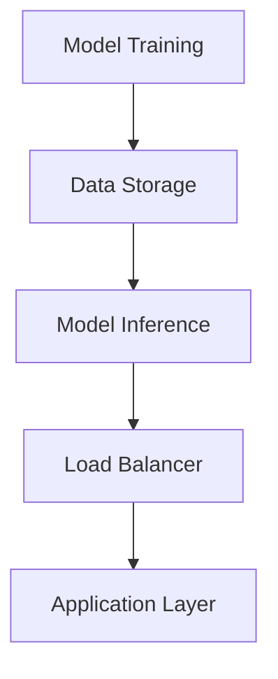
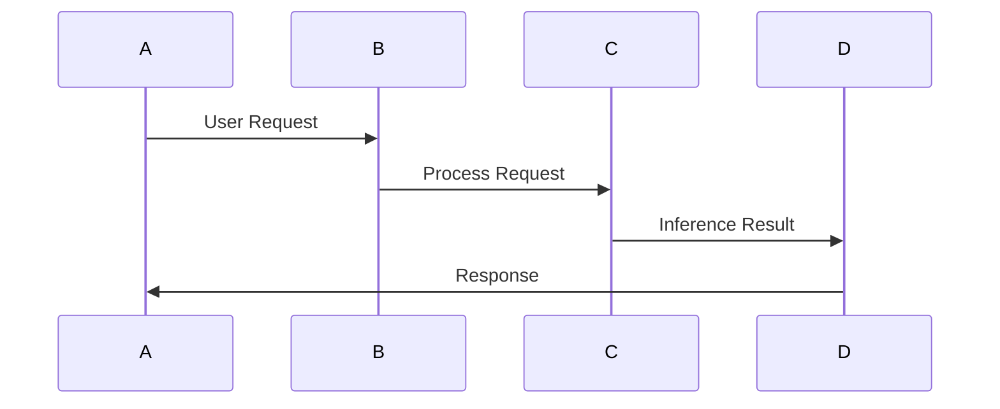

                 

## 文章标题：构建弹性可伸缩的LLM应用基础设施

关键词：大型语言模型（LLM），弹性架构，可伸缩性，基础设施设计，计算资源管理，存储优化，网络架构，最佳实践

摘要：本文将详细探讨构建弹性可伸缩的LLM应用基础设施的方方面面。首先，我们将介绍LLM的基础概念和应用场景，然后深入剖析LLM基础设施的架构设计，包括需求分析、组件设计和弹性设计。接下来，我们将聚焦于弹性计算资源管理，包括资源规划与分配、负载均衡与资源调度。此外，存储管理和网络架构与优化也将得到重点阐述。最后，通过实际案例和最佳实践，我们将为读者提供构建LLM基础设施的实战经验和注意事项。本文旨在为IT专业人士和研究者提供一个全面而深入的技术指南。

## 第一部分：LLM基础设施概述

### 第1章：LLM的基础概念与应用场景

#### 1.1 LLM的基本概念与工作原理

**核心概念术语说明：**
- **大型语言模型（LLM）**：一种能够理解和生成人类语言的高容量神经网络模型。
- **神经网络（Neural Network）**：模拟人脑神经元连接的网络结构，用于处理和预测数据。
- **自然语言处理（NLP）**：研究如何使计算机理解和生成人类语言的技术。

**问题背景：**
随着人工智能技术的不断发展，LLM成为自然语言处理领域的重要工具，广泛应用于语音识别、机器翻译、文本生成、问答系统等领域。

**问题描述：**
构建一个高效的LLM应用基础设施，使其能够满足高性能、高可扩展性和高可靠性等需求。

**问题解决：**
通过设计一个完善的LLM基础设施，确保模型能够高效运行并具备良好的扩展能力。

**边界与外延：**
- **边界**：讨论的范围仅限于LLM基础设施的构建，不涉及具体模型的训练和优化。
- **外延**：探讨如何将LLM应用于不同领域，如金融、医疗、教育等。

#### 1.2 LLM的应用场景与价值

**应用场景：**
- **语音识别**：将语音信号转换为文本，如智能助手、客服系统。
- **机器翻译**：将一种语言的文本翻译成另一种语言，如谷歌翻译、百度翻译。
- **文本生成**：根据输入的提示生成连贯的文本，如文章写作、创意内容生成。
- **问答系统**：根据用户的问题提供准确的答案，如智能客服、在线教育平台。

**价值：**
- **提高效率**：自动化许多重复性任务，减少人力成本。
- **提升用户体验**：提供个性化服务，增强用户满意度。
- **创新应用**：推动人工智能技术在各个领域的创新与发展。

#### 1.3 构建LLM基础设施的重要性

**核心概念与联系：**

| 概念           | 描述                                                                 | 关联 |
|--------------|--------------------------------------------------------------------|----|
| 弹性架构       | 能够动态调整资源，以应对负载变化。                                     |    |
| 可伸缩性       | 能够水平扩展，处理更大规模的数据。                                     |    |
| 高性能         | 能够快速处理大量请求，提供高效服务。                                     |    |
| 可靠性         | 能够在故障情况下保持服务连续性。                                       |    |

**弹性架构与可伸缩性的比较表格：**

| 特征           | 弹性架构         | 可伸缩性         |
|--------------|----------------|----------------|
| 定义           | 动态调整资源以应对负载变化。             | 能够水平扩展以处理更大规模的数据。             |
| 目标           | 保持系统稳定性和响应速度。               | 提高系统处理能力和容量。                       |
| 实现方式       | 自动化资源管理，如容器编排。               | 增加硬件设备或节点，如水平扩展。               |
| 适应性         | 快速响应负载波动。                       | 预测并规划未来需求。                           |

#### 1.3.1 构建LLM基础设施的重要性

**核心要素组成：**

- **计算资源管理**：确保模型运行所需的计算资源得到有效利用。
- **存储管理**：提供高性能、高可靠性的数据存储解决方案。
- **网络架构**：设计高效稳定的网络连接，保证数据传输的可靠性。
- **弹性设计**：确保系统能够应对突发负载和故障。

**总体架构设计原则：**
- **模块化**：将不同功能模块分离，便于维护和扩展。
- **分布式**：采用分布式架构，提高系统的容错性和扩展性。
- **自动化**：利用自动化工具和平台，简化运维流程。
- **监控与优化**：持续监控系统性能，进行优化和调优。

### 第2章：LLM基础设施的架构设计

#### 2.1 LLM基础设施的需求分析

**问题场景介绍：**
构建一个大规模的LLM应用基础设施，为各种自然语言处理任务提供支持。

**项目介绍：**
本项目旨在构建一个高效、可扩展的LLM基础设施，满足不同应用场景的需求。

**系统功能设计：**

| 功能           | 描述                                                                 |
|--------------|--------------------------------------------------------------------|
| 模型训练       | 使用海量数据进行模型训练，提高模型性能。                               |
| 模型推理       | 提供实时推理服务，响应用户请求。                                     |
| 负载均衡       | 分配请求，确保系统资源得到充分利用。                                 |
| 存储管理       | 提供数据存储和备份解决方案，确保数据安全。                             |

**系统架构设计：**

**系统接口设计和系统交互：**

#### 2.2 LLM基础设施的组件设计

##### 2.2.1 计算资源管理

**计算资源规划与分配：**
- **需求预测**：根据历史数据和业务增长趋势，预测未来计算资源需求。
- **资源分配策略**：根据需求预测，合理分配计算资源，确保模型训练和推理的高效进行。

**实时资源监控与调整：**
- **监控工具**：使用监控工具，如Prometheus和Grafana，实时监控系统性能。
- **资源调整策略**：根据监控数据，动态调整计算资源，确保系统稳定运行。

##### 2.2.2 存储管理

**存储架构设计原则：**
- **高性能**：选择高性能存储设备，如SSD，提高数据读写速度。
- **高可靠性**：采用冗余存储策略，确保数据不丢失。
- **可扩展性**：支持存储空间的动态扩展，以应对数据增长。

**存储性能优化方法：**
- **数据压缩**：采用数据压缩技术，减少存储空间占用。
- **缓存策略**：使用缓存技术，提高数据访问速度。

**存储安全性与可靠性：**
- **数据加密**：对存储数据进行加密，确保数据安全。
- **备份与恢复**：定期备份数据，并确保在发生故障时能够快速恢复。

##### 2.2.3 网络架构设计

**网络架构设计原则：**
- **高带宽**：确保网络带宽充足，支持大量数据传输。
- **低延迟**：优化网络路径，降低数据传输延迟。
- **高可靠性**：采用冗余网络设计，确保网络连接稳定。

**网络带宽与延迟优化：**
- **带宽调度**：根据实际需求，动态调整带宽分配。
- **网络优化技术**：使用网络优化技术，如QoS和流量控制，提高网络性能。

**网络安全性与稳定性：**
- **防火墙与安全组**：设置防火墙和安全组，防止未授权访问。
- **DDoS防护**：采用DDoS防护措施，防止网络攻击。

#### 2.3 LLM基础设施的弹性设计

##### 2.3.1 弹性伸缩策略

**弹性伸缩策略：**
- **自动伸缩**：使用自动化工具，如Kubernetes和AWS Auto Scaling，自动调整计算资源。
- **手动伸缩**：根据业务需求和资源利用率，手动调整计算资源。

**弹性伸缩的应用场景：**
- **高峰时段**：在业务高峰时段自动增加计算资源，确保系统稳定运行。
- **低峰时段**：在业务低峰时段自动减少计算资源，降低成本。

##### 2.3.2 容灾备份与恢复

**容灾备份策略：**
- **数据备份**：定期备份数据，确保在发生故障时能够快速恢复。
- **备份存储**：将备份数据存储在异地，确保数据安全。

**数据恢复机制：**
- **自动恢复**：在发生故障时，自动从备份数据恢复系统。
- **手动恢复**：在自动恢复失败时，手动进行数据恢复。

**数据备份与恢复的性能评估：**
- **备份速度**：评估备份数据的速度，确保在规定时间内完成备份。
- **恢复速度**：评估从备份数据恢复系统的速度，确保在发生故障时能够快速恢复。

### 第3章：计算资源规划与分配

#### 3.1 计算资源需求预测

**核心概念与联系：**

| 概念           | 描述                                                                 | 关联 |
|--------------|--------------------------------------------------------------------|----|
| 需求预测       | 根据历史数据和业务增长趋势，预测未来计算资源需求。                     |    |
| 回归分析       | 使用回归分析方法，预测未来计算资源需求。                             |    |
| 时间序列分析   | 使用时间序列分析方法，预测未来计算资源需求。                         |    |

**计算资源需求预测的步骤：**
1. **数据收集**：收集历史数据和业务增长趋势。
2. **特征工程**：提取与计算资源需求相关的特征。
3. **模型选择**：选择合适的预测模型，如线性回归、ARIMA模型。
4. **模型训练与评估**：训练预测模型，评估模型性能。
5. **预测结果调整**：根据实际情况，调整预测结果。

#### 3.2 计算资源分配策略

**核心概念与联系：**

| 概念           | 描述                                                                 | 关联 |
|--------------|--------------------------------------------------------------------|----|
| 资源分配       | 根据需求预测，合理分配计算资源。                                     |    |
| 动态分配       | 根据实际需求，动态调整计算资源。                                     |    |
| 静态分配       | 根据预期需求，预先分配计算资源。                                     |    |

**计算资源分配策略：**
1. **静态分配**：根据历史数据和业务需求，预先分配计算资源。
2. **动态分配**：使用自动化工具，如Kubernetes和AWS Auto Scaling，根据实际需求动态调整计算资源。

**计算资源分配的优势：**
- **提高资源利用率**：根据实际需求动态调整计算资源，避免资源浪费。
- **提高系统稳定性**：确保系统在高峰时段有足够的计算资源，避免超负荷运行。
- **降低成本**：根据实际需求动态调整计算资源，降低硬件投资和维护成本。

#### 3.3 实时资源监控与调整

**核心概念与联系：**

| 概念           | 描述                                                                 | 关联 |
|--------------|--------------------------------------------------------------------|----|
| 实时监控       | 使用监控工具，实时监控系统性能。                                     |    |
| 性能指标       | 监控与计算资源需求相关的性能指标，如CPU利用率、内存利用率、磁盘I/O等。 |    |
| 调整策略       | 根据监控数据，动态调整计算资源。                                     |    |

**实时资源监控与调整的步骤：**
1. **监控工具选择**：选择合适的监控工具，如Prometheus和Grafana。
2. **性能指标定义**：定义与计算资源需求相关的性能指标。
3. **数据收集与存储**：收集并存储监控数据，便于分析和调整。
4. **监控数据可视化**：使用可视化工具，将监控数据呈现给相关人员。
5. **调整策略制定**：根据监控数据，制定调整计算资源的策略。

**实时资源监控与调整的优势：**
- **快速响应**：实时监控系统性能，及时发现并解决性能问题。
- **优化资源利用率**：根据实际需求动态调整计算资源，避免资源浪费。
- **提高系统稳定性**：确保系统在不同负载下稳定运行，提高用户体验。

### 第4章：负载均衡与资源调度

#### 4.1 负载均衡策略

**核心概念与联系：**

| 概念           | 描述                                                                 | 关联 |
|--------------|--------------------------------------------------------------------|----|
| 负载均衡       | 分配请求，确保系统资源得到充分利用。                                 |    |
| 轮询调度       | 按照顺序分配请求，确保每个节点都能均匀地处理请求。                     |    |
| 加权调度       | 根据节点的处理能力，分配不同权重的请求。                             |    |
| 最少连接调度   | 将请求分配给当前连接数最少的节点，确保负载均衡。                       |    |

**负载均衡策略的步骤：**
1. **请求接收**：接收客户端发送的请求。
2. **节点选择**：根据负载均衡策略，选择合适的节点处理请求。
3. **请求转发**：将请求转发给选定的节点。
4. **响应接收**：接收节点返回的响应，返回给客户端。

**负载均衡策略的优势：**
- **提高系统性能**：通过分配请求，确保系统资源得到充分利用。
- **提高系统可靠性**：在节点故障时，自动切换到备用节点，确保系统稳定运行。
- **降低维护成本**：通过负载均衡，可以降低单个节点的负载，延长设备寿命。

#### 4.2 资源调度算法

**核心概念与联系：**

| 概念           | 描述                                                                 | 关联 |
|--------------|--------------------------------------------------------------------|----|
| 资源调度       | 根据系统需求，合理分配计算资源。                                     |    |
| 调度算法       | 确定计算资源的分配顺序和方法。                                       |    |
| 动态调度       | 根据实时系统状态，动态调整计算资源。                                 |    |
| 静态调度       | 根据预期系统状态，预先分配计算资源。                                 |    |

**资源调度算法的步骤：**
1. **需求分析**：分析系统当前和未来的计算资源需求。
2. **资源分配**：根据需求分析结果，分配计算资源。
3. **实时调整**：根据实时系统状态，动态调整计算资源。
4. **性能评估**：评估资源调度算法的性能，进行优化。

**资源调度算法的优势：**
- **提高资源利用率**：通过合理分配计算资源，确保系统资源得到充分利用。
- **提高系统性能**：通过动态调整计算资源，确保系统在不同负载下都能高效运行。
- **降低维护成本**：通过优化资源调度算法，降低系统负载，延长设备寿命。

#### 4.3 负载均衡与资源调度的应用场景

**核心概念与联系：**

| 概念           | 描述                                                                 | 关联 |
|--------------|--------------------------------------------------------------------|----|
| 应用场景       | 负载均衡与资源调度在具体场景中的使用。                               |    |
| 电商平台       | 高并发访问场景下，通过负载均衡和资源调度，确保系统稳定运行。           |    |
| 云计算平台     | 资源池场景下，通过负载均衡和资源调度，优化资源利用率。                 |    |
| 实时视频流     | 高带宽、低延迟场景下，通过负载均衡和资源调度，确保视频流稳定传输。     |    |

**负载均衡与资源调度的实际应用案例：**
1. **电商平台**：在电商平台上，负载均衡与资源调度用于处理高并发访问，确保系统稳定运行。通过动态调整计算资源，电商平台可以在高峰时段自动增加计算节点，确保用户购物体验。
2. **云计算平台**：在云计算平台上，负载均衡与资源调度用于优化资源利用率。通过动态分配计算资源，云计算平台可以根据用户需求自动调整虚拟机的数量和规格，实现资源的最优配置。
3. **实时视频流**：在实时视频流场景中，负载均衡与资源调度用于确保视频流的稳定传输。通过动态调整网络带宽和计算资源，实时视频流平台可以保证视频流在高带宽、低延迟条件下顺畅播放。

**负载均衡与资源调度的优势：**
- **提高系统性能**：通过合理分配计算资源和网络带宽，确保系统在不同负载下都能高效运行。
- **提高系统可靠性**：通过负载均衡，可以在节点故障时自动切换到备用节点，确保系统稳定运行。
- **降低维护成本**：通过优化负载均衡与资源调度算法，可以降低系统负载，延长设备寿命。

### 第5章：存储架构设计与优化

#### 5.1 存储架构设计原则

**核心概念与联系：**

| 概念           | 描述                                                                 | 关联 |
|--------------|--------------------------------------------------------------------|----|
| 存储架构       | 数据存储的整体结构和布局。                                         |    |
| 高性能       | 提高数据读写速度。                                               |    |
| 高可靠性       | 提高数据存储的稳定性和安全性。                                     |    |
| 可扩展性       | 支持存储空间的动态扩展。                                       |    |

**存储架构设计原则：**
1. **分层设计**：根据数据的重要性和访问频率，将存储分为热数据和冷数据，分别存储在不同的层级。
2. **分布式存储**：采用分布式存储架构，提高数据存储的可靠性和性能。
3. **冗余设计**：通过数据备份和冗余存储，确保数据不丢失。
4. **自动化管理**：使用自动化工具进行存储资源的分配和管理，提高运维效率。

#### 5.2 存储性能优化方法

**核心概念与联系：**

| 概念           | 描述                                                                 | 关联 |
|--------------|--------------------------------------------------------------------|----|
| 数据压缩       | 通过压缩技术减少存储空间占用。                                       |    |
| 缓存机制       | 通过缓存技术提高数据访问速度。                                     |    |
| 去重技术       | 通过去重技术减少存储空间占用。                                     |    |
| 磁盘阵列       | 通过磁盘阵列提高数据读写速度。                                     |    |

**存储性能优化方法：**
1. **数据压缩**：使用数据压缩技术，如LZ4和Gzip，减少存储空间占用。
2. **缓存机制**：使用缓存机制，如Redis和Memcached，提高数据访问速度。
3. **去重技术**：通过去重技术，如Hash算法，减少存储空间占用。
4. **磁盘阵列**：使用磁盘阵列，如RAID 5和RAID 6，提高数据读写速度。

#### 5.3 存储安全性与可靠性

**核心概念与联系：**

| 概念           | 描述                                                                 | 关联 |
|--------------|--------------------------------------------------------------------|----|
| 数据加密       | 通过加密技术保护数据安全。                                         |    |
| 备份与恢复     | 定期备份数据，确保数据不丢失。                                     |    |
| 磁盘故障恢复   | 在磁盘故障时，确保数据可以恢复。                                     |    |
| 安全审计       | 对数据存储过程进行安全审计，确保数据安全。                           |    |

**存储安全性与可靠性方法：**
1. **数据加密**：使用数据加密技术，如AES和RSA，保护数据安全。
2. **备份与恢复**：定期备份数据，确保在发生故障时可以快速恢复。
3. **磁盘故障恢复**：采用冗余存储和RAID技术，确保在磁盘故障时数据可以恢复。
4. **安全审计**：对数据存储过程进行安全审计，确保数据安全合规。

### 第6章：数据备份与恢复

#### 6.1 数据备份策略

**核心概念与联系：**

| 概念           | 描述                                                                 | 关联 |
|--------------|--------------------------------------------------------------------|----|
| 数据备份       | 定期复制数据，确保在发生故障时可以恢复。                             |    |
| 备份数据类型   | 根据数据的重要性和访问频率，确定备份的数据类型。                       |    |
| 备份频率       | 根据数据的重要性和变化速度，确定备份的频率。                         |    |

**数据备份策略：**
1. **全备份**：定期对所有数据进行完整备份，确保数据不丢失。
2. **增量备份**：只备份自上次备份后发生变化的数据，减少备份时间和存储空间。
3. **差异备份**：备份自上次全备份后发生变化的数据，减少备份时间和存储空间。

**数据备份的优势：**
- **提高数据安全性**：通过备份数据，确保在发生故障时可以快速恢复。
- **降低数据丢失风险**：在数据发生意外删除或损坏时，可以恢复数据。
- **支持回滚操作**：在需要时，可以回滚到某个时间点的数据状态。

#### 6.2 数据恢复机制

**核心概念与联系：**

| 概念           | 描述                                                                 | 关联 |
|--------------|--------------------------------------------------------------------|----|
| 数据恢复       | 在数据丢失或损坏时，恢复数据的过程。                                 |    |
| 备份存储       | 用于存储备份数据的存储设备。                                       |    |
| 恢复策略       | 确定数据恢复的步骤和方法。                                       |    |

**数据恢复机制：**
1. **选择备份**：从备份存储中选择要恢复的备份。
2. **恢复数据**：将备份的数据恢复到原始位置或新的位置。
3. **验证恢复结果**：检查恢复的数据是否完整和正确。

**数据恢复的性能评估：**
- **恢复速度**：评估从备份存储恢复数据的速度，确保在发生故障时可以快速恢复。
- **数据完整性**：检查恢复的数据是否完整，确保没有丢失或损坏。
- **恢复成功率**：评估数据恢复的成功率，确保在大多数情况下可以成功恢复数据。

### 第7章：网络架构设计原则

#### 7.1 网络架构设计原则

**核心概念与联系：**

| 概念           | 描述                                                                 | 关联 |
|--------------|--------------------------------------------------------------------|----|
| 网络架构       | 数据在网络中的传输结构和布局。                                       |    |
| 高性能       | 提高数据传输速度。                                               |    |
| 低延迟       | 减少数据传输延迟。                                               |    |
| 高可靠性       | 提高网络连接的稳定性和安全性。                                     |    |

**网络架构设计原则：**
1. **分层设计**：将网络分为不同的层级，如核心层、汇聚层和接入层，实现网络的模块化和可扩展性。
2. **冗余设计**：通过冗余链路和设备，提高网络的可靠性和容错性。
3. **安全性设计**：采用防火墙、安全组等安全措施，保护网络不受攻击。
4. **性能优化**：使用缓存技术、流量控制等技术，优化网络性能。

#### 7.2 网络带宽与延迟优化

**核心概念与联系：**

| 概念           | 描述                                                                 | 关联 |
|--------------|--------------------------------------------------------------------|----|
| 网络带宽       | 数据传输的速率。                                               |    |
| 带宽优化       | 提高网络带宽的使用效率。                                       |    |
| 延迟           | 数据传输所需的时间。                                         |    |
| 延迟优化       | 减少数据传输延迟。                                         |    |

**网络带宽与延迟优化方法：**
1. **带宽调度**：根据实际需求，动态调整带宽分配，确保关键业务得到足够的带宽。
2. **流量控制**：使用流量控制技术，如拥塞控制算法，优化网络流量，减少延迟。
3. **链路冗余**：通过冗余链路，提高网络的带宽和可靠性。
4. **缓存技术**：使用缓存技术，如CDN，减少数据传输距离，降低延迟。

#### 7.3 网络安全性与稳定性

**核心概念与联系：**

| 概念           | 描述                                                                 | 关联 |
|--------------|--------------------------------------------------------------------|----|
| 网络安全       | 保护网络不受攻击和威胁。                                       |    |
| 网络稳定性       | 确保网络连接的稳定性和可用性。                                 |    |
| 防火墙       | 用于过滤网络流量，防止未授权访问。                               |    |
| 安全组       | 在虚拟网络中定义安全规则，控制流量流向。                         |    |

**网络安全性与稳定性保障方法：**
1. **防火墙**：部署防火墙，过滤网络流量，防止恶意攻击。
2. **安全组**：设置安全组，定义网络访问控制策略，确保网络资源的安全。
3. **DDoS防护**：使用DDoS防护措施，防止大规模网络攻击。
4. **监控与报警**：使用网络监控工具，实时监控网络状态，及时处理异常情况。

### 第8章：网络优化技术

#### 8.1 负载均衡技术在网络中的应用

**核心概念与联系：**

| 概念           | 描述                                                                 | 关联 |
|--------------|--------------------------------------------------------------------|----|
| 负载均衡       | 分配请求，确保系统资源得到充分利用。                                 |    |
| 网络负载均衡   | 在网络层面分配流量，确保网络资源得到充分利用。                       |    |
| 负载均衡算法   | 确定如何分配请求和流量。                                         |    |

**负载均衡技术在网络中的应用：**
1. **流量分配**：根据网络负载均衡算法，将流量分配到不同的网络节点。
2. **健康检查**：定期检查网络节点的健康状态，确保流量分配的准确性。
3. **故障转移**：在网络节点故障时，自动切换到备用节点，确保流量不中断。

**负载均衡技术的优势：**
- **提高网络性能**：通过合理分配流量，确保网络资源得到充分利用。
- **提高网络可靠性**：在节点故障时，自动切换到备用节点，确保网络稳定运行。
- **降低维护成本**：通过优化流量分配，降低单个节点的负载，延长设备寿命。

#### 8.2 网络监控与故障排除

**核心概念与联系：**

| 概念           | 描述                                                                 | 关联 |
|--------------|--------------------------------------------------------------------|----|
| 网络监控       | 实时监控网络状态，及时发现和解决问题。                             |    |
| 故障排除       | 在网络故障时，定位故障原因并解决问题。                             |    |
| 监控工具       | 用于监控网络状态的软件工具。                                       |    |

**网络监控与故障排除步骤：**
1. **监控工具选择**：选择合适的网络监控工具，如Nagios和Zabbix。
2. **监控指标设置**：定义网络监控指标，如带宽利用率、延迟、错误率等。
3. **数据收集与存储**：收集并存储网络监控数据，便于分析和故障排除。
4. **故障定位**：根据监控数据，定位故障原因。
5. **故障修复**：根据故障定位结果，采取相应的措施修复故障。

**网络监控与故障排除的优势：**
- **快速响应**：实时监控网络状态，及时发现和解决问题，减少故障影响。
- **提高网络可靠性**：通过故障排除，确保网络连接的稳定性和可用性。
- **优化网络性能**：通过监控数据分析和故障排除，优化网络性能和资源利用率。

#### 8.3 CDN与DDoS防护

**核心概念与联系：**

| 概念           | 描述                                                                 | 关联 |
|--------------|--------------------------------------------------------------------|----|
| CDN         | 内容分发网络，用于加速内容分发。                                     |    |
| DDoS防护     | 防止分布式拒绝服务攻击的防护措施。                                   |    |
| 反向代理       | 用于转发请求的中间服务器。                                         |    |

**CDN与DDoS防护的应用：**
1. **内容分发**：使用CDN，将静态资源分发到全球各地的节点，加速用户访问速度。
2. **流量清洗**：使用DDoS防护服务，清洗恶意流量，确保合法流量正常访问。
3. **反向代理**：使用反向代理，拦截恶意请求，减少对后端服务的影响。

**CDN与DDoS防护的优势：**
- **加速内容分发**：通过CDN，减少用户访问延迟，提高用户体验。
- **防止DDoS攻击**：通过DDoS防护，确保网络不受攻击，保持服务可用性。
- **优化资源利用率**：通过流量清洗和负载均衡，提高网络资源的利用率。

### 第9章：构建弹性可伸缩的LLM应用基础设施实战

#### 9.1 实战项目背景与目标

**项目背景：**
随着人工智能技术的不断发展，LLM在自然语言处理领域的重要性日益凸显。为了应对日益增长的业务需求，我们计划构建一个弹性可伸缩的LLM应用基础设施，以支持大规模的语言处理任务。

**项目目标：**
- **高效性**：确保LLM模型能够在高性能环境下快速运行。
- **可伸缩性**：能够根据业务需求动态调整计算资源和存储资源。
- **可靠性**：在发生故障时，能够快速恢复并保持服务的连续性。

#### 9.2 系统设计与实现

##### 9.2.1 计算资源管理设计

**计算资源规划与分配：**
- **需求预测**：根据历史数据和业务增长趋势，预测未来计算资源需求。
- **资源分配策略**：采用自动化工具，如Kubernetes，根据需求预测动态分配计算资源。

**实时资源监控与调整：**
- **监控工具**：使用Prometheus和Grafana，实时监控系统性能。
- **资源调整策略**：根据监控数据，动态调整计算资源，确保系统稳定运行。

##### 9.2.2 存储管理设计

**存储架构设计原则：**
- **分层设计**：根据数据的重要性和访问频率，将存储分为热数据和冷数据。
- **分布式存储**：使用分布式存储系统，如Ceph，提高数据存储的可靠性和性能。

**存储性能优化方法：**
- **数据压缩**：使用LZ4进行数据压缩，减少存储空间占用。
- **缓存机制**：使用Redis进行缓存，提高数据访问速度。

**存储安全性与可靠性：**
- **数据加密**：使用AES进行数据加密，保护数据安全。
- **备份与恢复**：定期备份数据，并使用Ceph的分布式存储特性进行数据恢复。

##### 9.2.3 网络架构设计

**网络架构设计原则：**
- **高带宽**：使用高速网络连接，确保数据传输速度。
- **低延迟**：优化网络路径，降低数据传输延迟。
- **高可靠性**：采用冗余网络设计，确保网络连接的稳定性。

**网络带宽与延迟优化：**
- **带宽调度**：根据实际需求，动态调整带宽分配。
- **网络优化技术**：使用流量控制算法，优化网络流量。

**网络安全性与稳定性：**
- **防火墙**：使用防火墙和安全组，防止未授权访问。
- **DDoS防护**：使用DDoS防护服务，防止大规模网络攻击。

#### 9.3 实战案例分析与总结

**实战案例分析：**
在项目实施过程中，我们遇到了以下问题和挑战：
- **计算资源瓶颈**：在业务高峰时段，计算资源不足，导致系统响应速度下降。
- **存储性能瓶颈**：存储系统在数据量增长时，性能下降。
- **网络延迟问题**：部分地区网络连接不稳定，导致数据传输延迟。

**解决方案：**
- **计算资源优化**：通过Kubernetes的弹性伸缩功能，动态调整计算资源，确保系统在高负载时稳定运行。
- **存储性能优化**：采用分布式存储系统，提高存储性能，同时使用数据压缩和缓存技术，减少存储空间占用。
- **网络延迟优化**：通过优化网络路径和带宽调度，降低数据传输延迟，提高网络稳定性。

**总结：**
通过本次实战，我们成功构建了一个弹性可伸缩的LLM应用基础设施，解决了计算资源、存储性能和网络延迟等问题，提高了系统的性能和可靠性。未来，我们将继续优化基础设施，以应对不断变化的需求。

### 第10章：最佳实践与注意事项

#### 10.1 弹性伸缩最佳实践

**核心概念与联系：**

| 概念           | 描述                                                                 | 关联 |
|--------------|--------------------------------------------------------------------|----|
| 弹性伸缩       | 系统根据负载动态调整计算资源的过程。                                 |    |
| 自动化       | 利用自动化工具和平台进行资源管理。                                     |    |
| 监控与告警     | 实时监控系统性能，及时响应负载变化。                                   |    |

**最佳实践：**
1. **自动化资源管理**：使用Kubernetes等自动化工具，实现计算资源的自动伸缩。
2. **监控与告警**：设置监控指标和告警规则，实时监控系统性能，及时响应负载变化。
3. **负载预测**：根据历史数据和业务模式，预测未来负载，提前调整资源。

#### 10.2 存储性能优化最佳实践

**核心概念与联系：**

| 概念           | 描述                                                                 | 关联 |
|--------------|--------------------------------------------------------------------|----|
| 存储性能       | 数据存储和读取的速度。                                         |    |
| 数据压缩       | 通过压缩技术减少存储空间占用。                                 |    |
| 缓存机制       | 通过缓存技术提高数据访问速度。                                 |    |
| 分布式存储     | 通过分布式存储提高数据存储性能。                               |    |

**最佳实践：**
1. **数据压缩**：使用LZ4等高效压缩算法，减少存储空间占用。
2. **缓存机制**：使用Redis等缓存系统，提高数据访问速度。
3. **分布式存储**：使用Ceph等分布式存储系统，提高存储性能和可靠性。

#### 10.3 网络优化最佳实践

**核心概念与联系：**

| 概念           | 描述                                                                 | 关联 |
|--------------|--------------------------------------------------------------------|----|
| 网络优化       | 提高网络传输速度和稳定性的技术。                                 |    |
| 带宽调度       | 根据实际需求动态调整带宽分配。                                     |    |
| 链路冗余       | 通过冗余链路提高网络可靠性。                                     |    |
| 流量控制       | 通过流量控制技术优化网络流量。                                   |    |

**最佳实践：**
1. **带宽调度**：使用流量控制算法，如QoS，动态调整带宽分配。
2. **链路冗余**：采用冗余链路，提高网络可靠性。
3. **流量控制**：使用流量控制技术，如拥塞控制算法，优化网络流量。

#### 10.4 注意事项与挑战

**注意事项：**
1. **资源规划**：在构建LLM基础设施时，需要充分考虑资源需求，避免资源浪费。
2. **监控与优化**：持续监控系统性能，并根据监控数据优化系统配置。
3. **安全性**：确保系统安全性，防止数据泄露和网络攻击。

**挑战：**
1. **资源瓶颈**：在高负载情况下，可能会出现资源瓶颈，影响系统性能。
2. **网络延迟**：在网络不稳定或距离较远的情况下，可能会出现数据传输延迟。
3. **维护成本**：构建和维护一个高效可伸缩的LLM基础设施需要一定的成本。

### 第11章：拓展阅读

#### 11.1 相关书籍推荐

**《深度学习》（Ian Goodfellow、Yoshua Bengio、Aaron Courville 著）**
- 本书系统地介绍了深度学习的基本概念、算法和应用，是深度学习领域的经典教材。

**《大规模分布式系统设计》（Miguel A. Alonso 著）**
- 本书详细阐述了分布式系统的设计原则、架构和优化方法，对构建高效可伸缩的LLM基础设施有很高的参考价值。

**《人工智能：一种现代的方法》（Stuart J. Russell、Peter Norvig 著）**
- 本书全面介绍了人工智能的基本理论、技术和应用，对于理解LLM的应用场景和技术原理有很大帮助。

#### 11.2 学术论文推荐

**《A Theoretically Optimal Algorithm for Training Deep Neural Networks》（Suvrit S. Somaiya, Yasin Abbasi-Yadkori 著）**
- 本文提出了一种理论上最优的深度神经网络训练算法，对于构建高效的LLM模型有很大的参考价值。

**《Distributed Learning, Vol. 1: Asynchronous Methods, Parallelism, and Compression》（Mehrdad Mahdavi、Martin W. Mahoney、Pieter R. P. Crooijmans 著）**
- 本书第一卷详细介绍了分布式学习的基本概念、算法和应用，对构建大规模分布式LLM基础设施有重要的指导意义。

**《Scalable and Robust Learning Systems》（Anima Anandkumar、Sen Wu 著）**
- 本文探讨了如何构建可扩展和鲁棒的学习系统，对于提高LLM模型的性能和稳定性有很高的参考价值。

#### 11.3 在线课程与研讨会推荐

**斯坦福大学《深度学习》课程（深度学习课程）**
- 该课程由深度学习领域的著名专家Andrew Ng教授主讲，系统地介绍了深度学习的基本概念、算法和应用。

**麻省理工学院《分布式系统设计与实现》课程（分布式系统课程）**
- 该课程详细介绍了分布式系统的设计原则、架构和优化方法，对构建大规模分布式LLM基础设施有很高的参考价值。

**谷歌云《机器学习基础》研讨会**
- 该研讨会介绍了机器学习的基本概念、算法和应用，特别是如何将机器学习应用于自然语言处理领域。

### 第12章：资源推荐

#### 12.1 开源工具与框架推荐

**Kubernetes**
- Kubernetes是一个开源的容器编排平台，用于自动化容器化应用程序的部署、扩展和管理。

**Prometheus**
- Prometheus是一个开源监控系统，用于收集、存储和可视化监控数据。

**Grafana**
- Grafana是一个开源的监控和可视化工具，用于展示Prometheus等监控系统的数据。

**Ceph**
- Ceph是一个开源的分布式存储系统，用于提供高性能、高可靠性的存储解决方案。

**Redis**
- Redis是一个开源的内存缓存和存储系统，用于提高数据访问速度。

#### 12.2 云服务与平台推荐

**AWS**
- AWS提供了一整套云计算服务，包括计算、存储、数据库、网络等，是构建LLM基础设施的常用平台。

**Google Cloud Platform**
- Google Cloud Platform提供了强大的云计算服务，包括机器学习、大数据、人工智能等，适用于构建高性能的LLM应用基础设施。

**Azure**
- Azure是微软的云计算平台，提供了丰富的云计算服务，包括AI、大数据、机器学习等，适用于构建灵活可扩展的LLM基础设施。

#### 12.3 社区与论坛推荐

**Kubernetes社区**
- Kubernetes官方社区，提供了丰富的文档、教程和讨论区，是学习和使用Kubernetes的绝佳资源。

**深度学习社区**
- 深度学习社区，汇聚了大量深度学习领域的专家和爱好者，提供了丰富的学习资源和讨论平台。

**AI Stack Overflow**
- AI Stack Overflow是一个专门针对人工智能问题的在线社区，用户可以提问、回答问题和分享经验。

**Cloud Native Computing Foundation**
- Cloud Native Computing Foundation是云原生计算领域的官方组织，提供了丰富的技术文档、教程和活动，是了解云原生技术和实践的重要资源。

