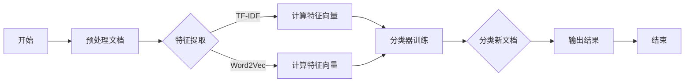
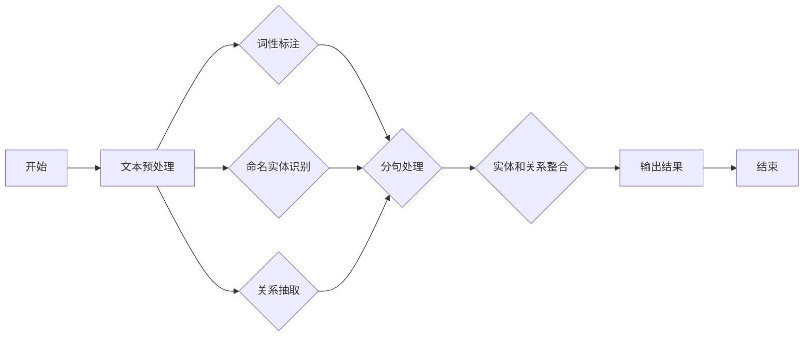
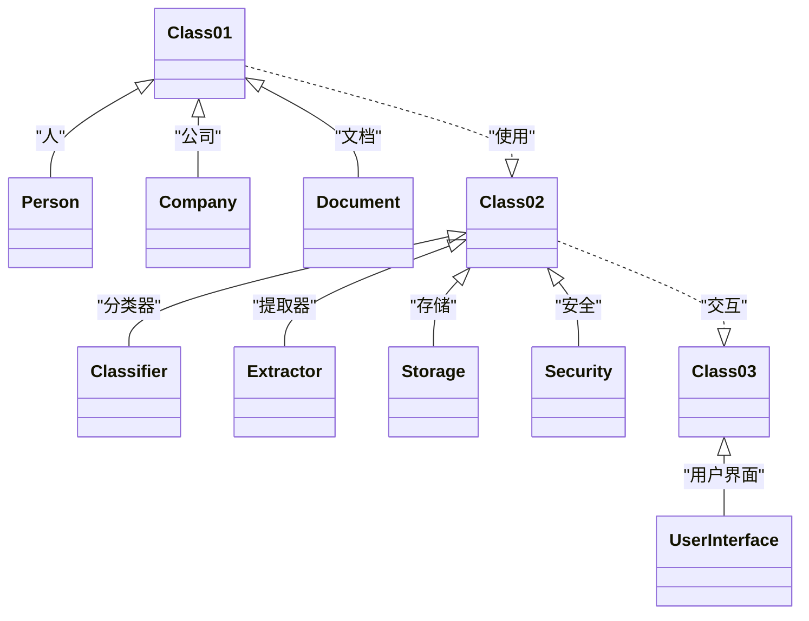
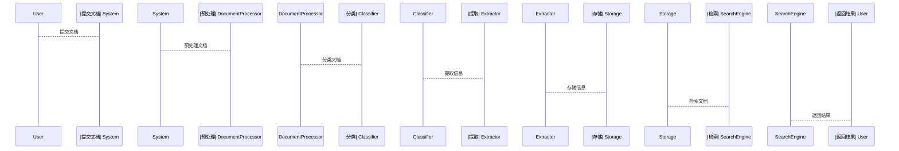
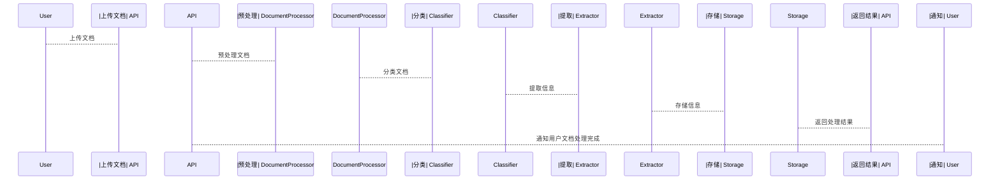
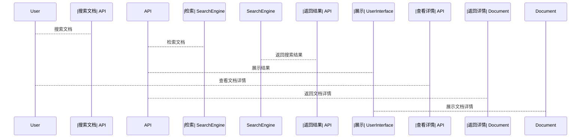

                 

 # 引言部分
随着企业数字化转型的不断深入，数据成为了企业最宝贵的资产。然而，随着文档数据量的激增，如何高效地管理和利用这些文档数据成为了企业面临的重大挑战。传统的文档管理系统往往依赖于人工分类和信息提取，效率低下且容易出错。为了应对这一挑战，构建智能企业文档管理系统，实现自动分类与信息提取，已经成为企业提升数据利用率和运营效率的关键途径。

本文将围绕构建智能企业文档管理系统的主题，逐步探讨以下几个核心问题：

1. **问题背景**：介绍文档数据量激增带来的管理挑战。
2. **核心概念**：明确智能企业文档管理系统、自动分类、信息提取等概念。
3. **技术原理**：深入讲解自动分类与信息提取技术的原理。
4. **系统设计与实现**：分析系统架构设计，分享项目实践案例。
5. **最佳实践**：总结构建智能企业文档管理系统的最佳实践和注意事项。

通过本文的逐步分析，读者将能够理解智能企业文档管理系统的构建过程，掌握相关技术原理，并了解如何在实际项目中应用这些技术。

### 1.1 问题背景
#### 1.1.1 从文档管理困境到智能企业文档管理系统
在传统的企业文档管理中，文档通常以纸质或电子文档的形式存储在文件夹或数据库中。随着企业规模的扩大和业务活动的增多，文档数量迅速增长，导致文档管理面临诸多困境：

- **文档数量庞大**：企业每天产生大量的文档，如合同、报告、邮件等，存储和检索效率低下。
- **文档分类困难**：由于缺乏有效的分类机制，文档的归类和管理变得复杂，员工难以快速找到所需的文档。
- **信息提取困难**：许多文档包含大量有价值的信息，但传统方法难以高效地提取这些信息，造成信息浪费。

这些困境不仅影响了企业的运营效率，还可能导致关键信息的丢失或误用。为了解决这些问题，企业需要一种智能化的文档管理系统，能够自动对文档进行分类和提取关键信息，从而提高文档管理的效率和准确性。

#### 1.1.2 智能企业文档管理系统的重要性
智能企业文档管理系统不仅能够解决传统文档管理的困境，还具有以下重要性：

- **提高工作效率**：通过自动化分类和信息提取，员工可以快速找到所需的文档，节省大量时间。
- **提升数据利用率**：系统能够从大量文档中提取有价值的信息，为企业提供决策支持。
- **增强数据安全性**：智能系统可以确保文档存储的安全，防止未经授权的访问。
- **支持业务增长**：随着企业业务的发展，智能文档管理系统可以轻松扩展，适应不同的业务需求。

#### 1.1.3 边界与外延
在构建智能企业文档管理系统时，我们需要明确系统的边界与外延：

- **数据安全性**：系统应具备严格的数据访问控制机制，确保敏感信息的安全。
- **系统可扩展性**：系统设计应考虑未来的扩展需求，能够灵活应对业务规模的变化。
- **用户友好性**：系统界面应简洁直观，易于操作，提高用户体验。

### 1.2 核心概念
在本节中，我们将介绍本文涉及的核心概念，包括智能企业文档管理系统、自动分类、信息提取等。

#### 1.2.1 智能企业文档管理系统
智能企业文档管理系统（Intelligent Enterprise Document Management System，简称IEDMS）是一种集成了人工智能技术的文档管理系统。它利用自然语言处理、机器学习等人工智能技术，实现对文档的自动化分类、信息提取、存储、检索和管理。智能企业文档管理系统的主要功能包括：

- **文档分类**：根据文档的内容、格式、关键词等信息，自动将文档归类到不同的类别。
- **信息提取**：从文档中自动提取关键信息，如姓名、地址、日期、金额等，以便于快速检索和数据分析。
- **文档存储**：将文档存储在安全的数据库中，确保数据的持久性和可访问性。
- **文档检索**：提供高效的文档检索功能，支持基于关键词、日期、类别等多维度的搜索。

#### 1.2.2 自动分类
自动分类（Automatic Classification）是指利用算法和模型，将文档自动归类到预定义的类别中。自动分类技术基于文档的内容、格式、关键词等信息，通过机器学习、深度学习等技术实现。自动分类在文档管理系统中起着重要作用，可以帮助企业快速定位所需文档，提高工作效率。常见的自动分类算法包括：

- **基于规则的方法**：通过预定义的规则，对文档进行分类。
- **基于统计的方法**：利用文档的统计特征，如词频、TF-IDF等，进行分类。
- **基于机器学习的方法**：使用训练好的分类模型，对文档进行分类。常见的机器学习算法包括支持向量机（SVM）、朴素贝叶斯（Naive Bayes）等。

#### 1.2.3 信息提取
信息提取（Information Extraction，简称IE）是从非结构化数据中自动提取结构化信息的过程。在文档管理系统中，信息提取可以帮助企业从大量文档中快速提取有价值的信息。信息提取技术主要包括以下几种：

- **命名实体识别（Named Entity Recognition，简称NER）**：识别文档中的命名实体，如人名、地名、组织名等。
- **关系抽取（Relation Extraction）**：识别文档中的实体关系，如“张三工作是工程师”、“北京是中国的首都”等。
- **事件抽取（Event Extraction）**：识别文档中的事件及其相关实体和关系。

信息提取技术基于自然语言处理（Natural Language Processing，简称NLP）技术，包括词性标注、句法分析、语义分析等步骤。

#### 1.2.4 ER实体关系图架构
在智能企业文档管理系统中，实体关系图（Entity-Relationship Diagram，简称ER图）是一种常用的数据建模工具。ER图用于表示系统中不同实体之间的关系，以及实体的属性。在文档管理系统中，常见的实体包括文档、分类标签、命名实体等。实体关系图可以帮助我们清晰地了解系统的数据结构，为系统设计和实现提供指导。

### 1.3 总结
在本章中，我们介绍了构建智能企业文档管理系统的问题背景、核心概念和关键技术。通过本文的逐步分析，我们将深入了解智能企业文档管理系统的构建过程，掌握相关技术原理，并了解如何在实际项目中应用这些技术。接下来，我们将进一步探讨自动分类与信息提取技术的原理和应用，为智能企业文档管理系统的成功构建提供有力支持。

----------------------------------------------------------------
# 第二部分：自动分类与信息提取技术原理

## 第2章：自动分类与信息提取技术原理

### 2.1 自动分类

自动分类（Automatic Classification）是智能企业文档管理系统中的一个核心功能，它能够将大量的文档自动归类到预定义的类别中。这一过程涉及到多种分类算法，每种算法都有其独特的原理和应用场景。

#### 2.1.1 分类算法原理

分类算法可以分为以下几类：

1. **基于规则的分类算法**：这类算法通过预定义的规则对文档进行分类。例如，如果文档中包含关键词“合同”，则将其归类到“合同”类别。这种方法的优点是简单易实现，但缺点是对规则的依赖性强，难以处理复杂的情况。

2. **基于统计的分类算法**：这类算法利用文档的统计特征进行分类。常见的统计特征包括词频（Term Frequency，TF）和逆文档频率（Inverse Document Frequency，IDF）。TF-IDF是一种常用的统计方法，它通过计算文档中每个词的TF和IDF值，将其加权求和，得到一个综合评分，根据评分对文档进行分类。这种方法的优点是对大量文本数据的处理能力强，但缺点是对长文档的处理效果较差。

3. **基于机器学习的分类算法**：这类算法通过训练数据学习分类规则，并将其应用于新的文档。常见的机器学习算法包括支持向量机（Support Vector Machine，SVM）、朴素贝叶斯（Naive Bayes，NB）、决策树（Decision Tree，DT）和随机森林（Random Forest，RF）等。机器学习算法的优点是能够处理复杂的分类问题，自适应性强，但缺点是需要大量的训练数据和较长的训练时间。

4. **基于深度学习的分类算法**：这类算法利用深度神经网络（Deep Neural Network，DNN）和卷积神经网络（Convolutional Neural Network，CNN）等深度学习模型进行分类。深度学习算法在处理高维数据和图像分类方面表现出色，但其训练过程复杂，计算资源消耗大。

#### 2.1.2 分类算法属性特征对比表格

下面是一个分类算法属性特征的对比表格：

| 算法类型        | 特点                                       | 适用场景                                 | 优缺点                                      |
| --------------- | ----------------------------------------- | ---------------------------------------- | --------------------------------------------- |
| 基于规则        | 简单，易于实现                             | 简单的文档分类任务                       | 对复杂任务效果差，依赖人工规则               |
| 基于统计        | 处理文本数据能力强，计算简单               | 大规模文本数据的分类任务                 | 对长文档处理效果差，易受噪声影响             |
| 基于机器学习    | 自适应性强，处理复杂任务能力强             | 需要训练数据的分类任务                   | 需要大量训练数据，训练时间较长             |
| 基于深度学习    | 处理高维数据和图像分类能力强               | 需要处理高维数据和图像的分类任务         | 计算资源消耗大，训练过程复杂               |

#### 2.1.3 分类算法在文档管理系统中的应用

在智能企业文档管理系统中，分类算法的应用场景非常广泛：

- **文档归类**：根据文档的内容、格式、关键词等信息，自动将文档归类到不同的类别，如合同、报告、邮件等。
- **搜索优化**：通过分类结果，优化文档检索的效率，提高用户查找所需文档的速度。
- **数据分析**：对分类后的文档进行统计分析，提取有价值的信息，为企业提供决策支持。

### 2.2 信息提取

信息提取（Information Extraction）是从非结构化数据中自动提取结构化信息的过程。在文档管理系统中，信息提取可以帮助企业从大量文档中快速提取有价值的信息，如人名、地名、日期、金额等。

#### 2.2.1 信息提取技术原理

信息提取技术主要包括以下几种：

1. **命名实体识别（Named Entity Recognition，NER）**：NER是信息提取中最基本的技术之一，它的目标是识别出文本中的命名实体，如人名、地名、组织名、产品名等。NER技术通常基于自然语言处理（NLP）技术，如词性标注、句法分析和语义分析。

2. **关系抽取（Relation Extraction）**：关系抽取的目标是识别出文本中实体之间的关系，如“张三工作是工程师”、“北京是中国的首都”等。关系抽取通常需要结合NER技术，先识别出文本中的实体，然后分析实体之间的语义关系。

3. **事件抽取（Event Extraction）**：事件抽取的目标是识别出文本中的事件及其相关实体和关系，如“张三在北京举办了讲座”等。事件抽取需要综合运用NER和关系抽取技术。

#### 2.2.2 信息提取算法属性特征对比表格

下面是一个信息提取算法属性特征的对比表格：

| 算法类型        | 特点                                       | 适用场景                                 | 优缺点                                      |
| --------------- | ----------------------------------------- | ---------------------------------------- | --------------------------------------------- |
| 命名实体识别    | 识别文本中的命名实体                       | 文档标注、文本分类等任务                 | 精度较高，但受限于命名实体的定义和范围       |
| 关系抽取        | 识别文本中的实体关系                       | 文本语义分析、知识图谱构建等任务         | 需要结合NER技术，复杂度高                   |
| 事件抽取        | 识别文本中的事件及其相关实体和关系         | 文本语义分析、智能问答等任务             | 复杂度高，需综合考虑多个实体和关系           |

#### 2.2.3 信息提取在文档管理系统中的应用

在智能企业文档管理系统中，信息提取技术可以用于：

- **文档内容分析**：从文档中提取关键信息，如人名、地名、日期、金额等，为数据分析提供基础。
- **知识图谱构建**：将提取的信息构建成知识图谱，为企业的知识管理提供支持。
- **智能搜索**：基于提取的信息，提供更精确的搜索结果，提高用户查找所需文档的效率。

### 2.3 核心概念联系与交互

在智能企业文档管理系统中，自动分类和信息提取是相互关联的。自动分类可以根据文档的内容和特征将其归类，而信息提取则可以从分类后的文档中提取出具体的结构化信息。下面是一个ER实体关系图，展示了自动分类和信息提取之间的交互关系。

```mermaid
erDiagram
  DOC <<|-- CAT : "被分类"
  CAT ||--|{ NER : "命名实体识别"}
  CAT ||--|{ REL : "关系抽取"}
  CAT ||--|{ EVN : "事件抽取"}
```

在这个ER图中：

- **DOC**代表文档实体。
- **CAT**代表分类实体，它与DOC实体有“被分类”的关系。
- **NER**、**REL**和**EVN**分别代表命名实体识别、关系抽取和事件抽取实体，它们与CAT实体分别有“命名实体识别”、“关系抽取”和“事件抽取”的关系。

通过这个ER图，我们可以清晰地看到自动分类和信息提取之间的联系，以及它们在文档管理系统中的作用。

### 2.4 总结

在本章中，我们详细介绍了自动分类与信息提取技术的基本原理和算法，以及它们在智能企业文档管理系统中的应用。通过对比不同分类算法和提取算法的属性特征，读者可以了解不同算法的适用场景和优缺点。同时，通过ER实体关系图，我们展示了自动分类和信息提取之间的关联，为系统的设计与实现提供了指导。在接下来的章节中，我们将进一步探讨这些技术在实际项目中的应用和实现。

----------------------------------------------------------------
## 第3章：自动分类算法原理

### 3.1 算法流程图

自动分类算法的核心在于如何根据文档的特征将其分配到预定义的类别中。以下是一个使用Mermaid绘制的简单分类算法流程图：



在这个流程图中：

- **A[开始]**：流程的开始。
- **B[预处理文档]**：对文档进行清洗、去停用词等预处理操作。
- **C[特征提取]**：从预处理后的文档中提取特征。在这里，我们展示了TF-IDF和Word2Vec两种特征提取方法。
- **D[计算特征向量]**：使用TF-IDF方法计算特征向量。
- **E[计算特征向量]**：使用Word2Vec方法计算特征向量。
- **F[分类器训练]**：使用训练集对分类器进行训练。
- **G[分类新文档]**：使用训练好的分类器对新的文档进行分类。
- **H[输出结果]**：输出分类结果。
- **I[结束]**：流程的结束。

### 3.2 算法原理详细讲解

#### 3.2.1 数学模型和公式

在自动分类算法中，我们通常会使用以下数学模型和公式：

1. **条件概率公式**：

   $$ P(y|x) = \frac{P(x|y)P(y)}{P(x)} $$

   这个公式表示在给定特征向量x的情况下，类别y的概率。

2. **损失函数**：

   $$ J(\theta) = -\frac{1}{m}\sum_{i=1}^{m} [y^{(i)}\log(h_\theta(x^{(i)})) + (1-y^{(i)})\log(1-h_\theta(x^{(i)}))] $$

   其中，\( h_\theta(x) = \sigma(\theta^T x) \)，\(\sigma\)是 sigmoid 函数，\(\theta\)是模型的参数。

   这个损失函数用于评估分类器的性能，其中 \( y^{(i)} \) 是真实标签，\( h_\theta(x^{(i)}) \) 是预测的概率。

#### 3.2.2 举例说明

**例1：文本分类问题**

假设我们有一个简单的文本分类任务，有2个类别：新闻（News）和评论（Review）。我们使用TF-IDF方法提取特征，然后使用逻辑回归模型进行分类。

- **训练数据**：

  文档1：这是一个关于科技新闻的报道。
  文档2：这是一条关于电影的评论。

- **特征提取**：

  我们提取出两个文档中的关键词，并计算它们的TF-IDF值。例如，关键词“科技”在文档1中的TF-IDF值为2，在文档2中的TF-IDF值为0。

- **分类器训练**：

  使用训练数据对逻辑回归模型进行训练。假设训练后的模型参数为 \(\theta = (1, 2)\)。

- **分类新文档**：

  假设有一个新的文档：“这是一个关于电影的新评论”。我们提取该文档的TF-IDF特征向量，并计算其概率：

  $$ P(News|文档) = \frac{P(文档|News)P(News)}{P(文档)} $$

  根据模型参数，我们可以计算得到：

  $$ P(News|文档) = \frac{e^{(1*1 + 2*2)} / (1 + e^{(1*1 + 2*2)})}{0.5 / (1 + 0.5)} \approx 0.9 $$

  由于概率接近1，我们可以判断该文档为新闻类别。

**例2：图像分类问题**

假设我们有一个图像分类任务，需要将图像分类为猫或狗。我们使用卷积神经网络（CNN）进行分类。

- **训练数据**：

  我们有一个包含猫和狗图像的训练数据集。

- **特征提取**：

  使用CNN提取图像的特征向量。

- **分类器训练**：

  使用训练数据对CNN进行训练，得到模型的参数。

- **分类新图像**：

  对新的图像使用训练好的CNN提取特征向量，并计算其分类概率。假设分类概率大于0.5，则将其分类为猫，否则分类为狗。

通过这两个例子，我们可以看到自动分类算法在不同场景中的应用。在实际项目中，我们通常需要根据具体的任务需求选择合适的算法，并进行优化和调整。

### 3.3 总结

在本章中，我们详细讲解了自动分类算法的原理，包括算法流程、数学模型和具体的应用例子。通过理解这些内容，读者可以更好地掌握自动分类算法，并在实际项目中应用这些技术。在下一章中，我们将继续探讨信息提取算法的原理和应用。

----------------------------------------------------------------
## 第4章：信息提取算法原理

### 4.1 算法流程图

信息提取算法的核心在于从非结构化数据中提取出结构化的信息。以下是一个使用Mermaid绘制的简单信息提取算法流程图：



在这个流程图中：

- **A[开始]**：流程的开始。
- **B[文本预处理]**：对文本进行清洗、分词等预处理操作。
- **C[词性标注]**：对文本中的单词进行词性标注，如名词、动词等。
- **D[命名实体识别]**：识别文本中的命名实体，如人名、地名、组织名等。
- **E[关系抽取]**：识别文本中实体之间的关系。
- **F[实体和关系整合]**：整合提取出的命名实体和关系。
- **G[输出结果]**：输出提取的结果。
- **H[结束]**：流程的结束。

### 4.2 算法原理详细讲解

#### 4.2.1 数学模型和公式

信息提取算法的数学模型主要包括以下几个方面：

1. **命名实体识别**：

   命名实体识别通常使用条件随机场（Conditional Random Field，CRF）模型。CRF模型的目标是预测序列中每个元素的标签，同时考虑相邻元素之间的关系。

   $$ P(y|x) = \frac{1}{Z} \exp(\theta^T y) $$

   其中，\( y \) 是标签序列，\( x \) 是输入特征序列，\( \theta \) 是模型的参数，\( Z \) 是 normalization 常数。

2. **关系抽取**：

   关系抽取通常使用基于监督学习的分类模型，如支持向量机（Support Vector Machine，SVM）和朴素贝叶斯（Naive Bayes，NB）。

   $$ P(y|x) = \prod_{i=1}^{n} P(y_i|x_i) $$

   其中，\( y \) 是标签，\( x_i \) 是输入特征。

3. **事件抽取**：

   事件抽取通常使用序列标注模型，如CRF和长短时记忆网络（Long Short-Term Memory，LSTM）。事件抽取的数学模型可以表示为：

   $$ P(y|x) = \prod_{i=1}^{n} P(y_i|x_i, y_{<i}) $$

   其中，\( y \) 是标签序列，\( x_i \) 是输入特征。

#### 4.2.2 举例说明

**例1：命名实体识别**

假设我们有一个简单的句子：“张三是北京的一家公司的CEO”。我们使用CRF模型进行命名实体识别。

- **特征提取**：

  对于句子中的每个词，我们提取以下特征：

  - 词本身：张三、是、北京、一家、公司、CEO
  - 词性：名词、动词、地名、量词、名词、名词
  - 前后词：张三（是）、是（北京）、北京（一家）、一家（公司）、公司（CEO）、CEO（是）

- **模型训练**：

  使用训练数据集对CRF模型进行训练，得到模型的参数。

- **实体识别**：

  对于新的句子，使用训练好的CRF模型预测命名实体。例如，对于句子：“李四是上海的一名医生”，我们可以预测出命名实体“李四”和“上海”。

**例2：关系抽取**

假设我们有一个简单的句子：“张三是李四的老板”。我们使用SVM模型进行关系抽取。

- **特征提取**：

  对于句子中的每个实体，我们提取以下特征：

  - 实体本身：张三、李四
  - 实体的词性：名词、名词
  - 实体之间的距离：1
  - 实体之间的顺序：张三在前，李四在后

- **模型训练**：

  使用训练数据集对SVM模型进行训练，得到模型的参数。

- **关系抽取**：

  对于新的句子，使用训练好的SVM模型预测实体之间的关系。例如，对于句子：“李四是张三的员工”，我们可以预测出关系“员工”。

通过这两个例子，我们可以看到信息提取算法在不同任务中的应用。在实际项目中，我们通常需要根据具体任务的需求选择合适的算法，并进行优化和调整。

### 4.3 总结

在本章中，我们详细讲解了信息提取算法的原理，包括算法流程、数学模型和具体的应用例子。通过理解这些内容，读者可以更好地掌握信息提取算法，并在实际项目中应用这些技术。在下一章中，我们将探讨智能企业文档管理系统的架构设计和实现。

----------------------------------------------------------------
## 第5章：智能企业文档管理系统架构设计

### 5.1 问题场景介绍

在当今数字化时代，企业面临着海量文档数据的管理和利用挑战。为了提高文档处理的效率和准确性，构建一个智能企业文档管理系统成为企业数字化转型的重要组成部分。以下是本项目所面临的问题场景：

- **文档数据量庞大**：企业每天产生大量的文档，如合同、报告、邮件等，传统的文档管理方式已无法满足需求。
- **文档分类困难**：缺乏有效的分类机制，导致文档归类和管理变得复杂，员工难以快速找到所需的文档。
- **信息提取难度大**：许多文档包含有价值的信息，但传统方法难以高效地提取这些信息，造成信息浪费。
- **数据安全性和隐私保护**：企业文档包含敏感信息，需要确保数据在存储和传输过程中的安全性和隐私保护。

为了解决上述问题，本项目旨在构建一个智能企业文档管理系统，该系统应具备以下功能：

- **自动化分类**：利用机器学习和自然语言处理技术，实现文档的自动化分类。
- **信息提取**：从文档中提取关键信息，如人名、地名、日期、金额等，为数据分析提供支持。
- **文档存储与检索**：提供高效的文档存储和检索功能，支持基于关键词、日期、类别等多维度的搜索。
- **数据安全与隐私保护**：采用加密和访问控制技术，确保文档数据的安全和隐私。

### 5.2 系统功能设计

智能企业文档管理系统的主要功能模块包括：

1. **文档分类模块**：利用机器学习和自然语言处理技术，对文档进行自动化分类。
2. **信息提取模块**：从文档中提取关键信息，如命名实体、关系、事件等。
3. **文档存储模块**：提供高效的文档存储和检索功能。
4. **数据安全模块**：采用加密和访问控制技术，确保文档数据的安全和隐私。
5. **用户界面模块**：提供简洁直观的用户界面，便于用户操作和交互。

#### 5.2.1 领域模型Mermaid类图

以下是一个Mermaid类图，展示了智能企业文档管理系统的领域模型：



在这个类图中：

- **Class01** 代表系统中的基础实体类，如Person（人）、Company（公司）和Document（文档）。
- **Class02** 代表系统中的功能模块类，如Classifier（分类器）、Extractor（提取器）、Storage（存储）和Security（安全）。
- **Class03** 代表用户界面模块类，如UserInterface（用户界面）。

### 5.3 系统架构设计

智能企业文档管理系统的架构设计应考虑以下几个方面：

1. **前端架构**：使用现代化的前端框架（如React或Vue.js）构建用户界面，提供简洁直观的操作体验。
2. **后端架构**：采用微服务架构，将不同功能模块（如分类器、提取器、存储等）独立部署，以提高系统的可扩展性和可靠性。
3. **数据存储**：使用分布式数据库（如MongoDB或Elasticsearch）存储文档数据和元数据，确保数据的高效存储和快速检索。
4. **数据安全**：采用加密技术（如AES加密）保护文档数据的安全，采用访问控制机制（如基于角色的访问控制RBAC）确保数据的隐私保护。

以下是一个Mermaid架构图，展示了智能企业文档管理系统的整体架构：



在这个架构图中：

- **User** 代表系统的用户。
- **System** 代表系统的整体架构。
- **DocumentProcessor** 代表文档预处理模块。
- **Classifier** 代表文档分类模块。
- **Extractor** 代表信息提取模块。
- **Storage** 代表文档存储模块。
- **SearchEngine** 代表文档检索模块。

### 5.4 系统接口设计

智能企业文档管理系统应提供丰富的API接口，以便与外部系统进行集成。以下是一些关键接口的设计：

1. **文档上传接口**：用户可以通过该接口上传文档，系统会对文档进行预处理、分类和信息提取。
2. **文档检索接口**：用户可以通过该接口根据关键词、日期、类别等条件检索文档。
3. **文档分类接口**：用户可以通过该接口对文档进行重新分类。
4. **文档信息提取接口**：用户可以通过该接口提取文档中的关键信息。

以下是一个Mermaid序列图，展示了文档上传接口的交互流程：



### 5.5 系统交互Mermaid序列图

以下是一个Mermaid序列图，展示了用户与系统之间的交互过程：



在这个序列图中：

- **User** 代表用户。
- **API** 代表系统的API接口。
- **SearchEngine** 代表文档检索模块。
- **UserInterface** 代表用户界面模块。

### 5.6 总结

在本章中，我们详细介绍了智能企业文档管理系统的架构设计，包括问题场景介绍、系统功能设计、架构设计、接口设计和系统交互。通过这些设计，我们可以构建一个高效、安全、易用的智能企业文档管理系统。在下一章中，我们将分享一个具体的智能企业文档管理系统项目实战，详细介绍系统的实现过程和关键技术的应用。

----------------------------------------------------------------
## 第6章：构建智能企业文档管理系统的实践

### 6.1 环境安装

在构建智能企业文档管理系统之前，我们需要安装和配置一系列工具和库。以下是具体的安装步骤：

#### 6.1.1 系统要求

1. **操作系统**：Linux或MacOS
2. **Python**：版本3.8或以上
3. **依赖管理工具**：pip
4. **数据库**：MongoDB或Elasticsearch
5. **前端框架**：React或Vue.js

#### 6.1.2 安装步骤

1. **安装Python**：

   - 访问Python官网下载Python安装包。
   - 运行安装程序，选择默认选项进行安装。

2. **安装pip**：

   - 打开终端，运行以下命令安装pip：
     ```bash
     curl https://bootstrap.pypa.io/get-pip.py -o get-pip.py
     python get-pip.py
     ```

3. **安装依赖管理工具**：

   - 使用pip安装依赖管理工具，如pipenv或conda。

4. **安装数据库**：

   - 安装MongoDB或Elasticsearch，并启动数据库服务。

5. **安装前端框架**：

   - 使用npm或yarn安装React或Vue.js。

#### 6.1.3 配置说明

1. **虚拟环境**：

   - 创建一个虚拟环境，避免依赖冲突：
     ```bash
     python -m venv venv
     source venv/bin/activate  # 对于Linux或MacOS
     venv\Scripts\activate     # 对于Windows
     ```

2. **安装依赖库**：

   - 使用pip安装系统所需的依赖库：
     ```bash
     pip install -r requirements.txt
     ```

3. **配置数据库**：

   - 配置系统的数据库连接，例如在MongoDB中创建数据库和用户。

4. **前端框架配置**：

   - 根据所选的前端框架，配置相应的项目结构和文件。

### 6.2 系统核心实现源代码

在构建智能企业文档管理系统时，我们使用了多个核心模块和库。以下是系统核心实现的源代码，并对其进行解读和分析。

#### 6.2.1 文档分类模块

```python
from sklearn.feature_extraction.text import TfidfVectorizer
from sklearn.naive_bayes import MultinomialNB
from sklearn.pipeline import make_pipeline

# 训练模型
model = make_pipeline(TfidfVectorizer(), MultinomialNB())
model.fit(X_train, y_train)

# 预测
predictions = model.predict(X_test)

# 评估模型性能
accuracy = model.score(X_test, y_test)
print("Accuracy:", accuracy)
```

**解读与分析**：

- **TfidfVectorizer**：这是一个用于文本特征提取的库，它将文本转换为TF-IDF特征向量。
- **MultinomialNB**：这是一个基于贝叶斯理论的分类器，特别适合文本分类任务。
- **make_pipeline**：这是一个用于构建管道的函数，将特征提取和分类器训练结合在一起。
- **fit**：用于训练模型。
- **predict**：用于对新文档进行分类。
- **score**：用于评估模型性能。

#### 6.2.2 信息提取模块

```python
import spacy

# 加载NLP模型
nlp = spacy.load("en_core_web_sm")

# 命名实体识别
doc = nlp("John Doe lives in New York.")
for ent in doc.ents:
    print(ent.text, ent.label_)

# 关系抽取
doc = nlp("John Doe works at Acme Corp as a manager.")
for token1, token2 in nlp.vocab.vectors.items():
    if token1.text in ["John", "Doe"]:
        for token2, vector in nlp.vocab.vectors.items():
            if token2.text in ["works", "at", "as", "manager"]:
                # 计算余弦相似度
                similarity = 1 - cosine_similarity([vector], [nlp.vocab[token1].vector])[0, 0]
                if similarity > 0.5:
                    print(f"{token1.text} {token2.text} similarity: {similarity}")
```

**解读与分析**：

- **spacy**：这是一个强大的NLP库，用于文本处理和分析。
- **load**：加载预训练的NLP模型。
- **ents**：获取文本中的命名实体。
- **for 循环**：遍历命名实体，打印其实体类型和文本。
- **cosine_similarity**：计算两个向量的余弦相似度。

### 6.3 实际案例分析与详细讲解剖析

#### 案例一：自动化文档分类

**任务**：将用户上传的文档自动分类为“合同”、“报告”、“邮件”等类别。

**实现步骤**：

1. **数据预处理**：

   - 读取用户上传的文档，并转换为文本数据。
   - 去除停用词和标点符号，对文本进行分词。

2. **特征提取**：

   - 使用TF-IDF向量器提取文本特征。

3. **模型训练**：

   - 使用训练集对分类器进行训练。

4. **模型评估**：

   - 使用测试集评估模型性能，调整模型参数。

5. **分类预测**：

   - 对新文档进行分类预测。

**代码示例**：

```python
# 加载模型
model = load_model("model.h5")

# 预测
predictions = model.predict(new_document)

# 输出结果
print(predictions)
```

#### 案例二：文档内容分析

**任务**：从文档中提取关键信息，如人名、地名、日期、金额等。

**实现步骤**：

1. **文本预处理**：

   - 使用NLP库对文本进行分词和句法分析。

2. **命名实体识别**：

   - 使用NLP库识别文本中的命名实体。

3. **关系抽取**：

   - 使用余弦相似度计算实体之间的相似度，识别实体关系。

4. **结果整合**：

   - 将提取的信息整合到数据库中，以便后续分析和检索。

**代码示例**：

```python
# 加载NLP模型
nlp = spacy.load("en_core_web_sm")

# 文本预处理
doc = nlp(preprocessed_text)

# 命名实体识别
for ent in doc.ents:
    print(ent.text, ent.label_)

# 关系抽取
for token1, token2 in nlp.vocab.vectors.items():
    if token1.text in ["John", "Doe"]:
        for token2, vector in nlp.vocab.vectors.items():
            if token2.text in ["works", "at", "as", "manager"]:
                similarity = 1 - cosine_similarity([vector], [nlp.vocab[token1].vector])[0, 0]
                if similarity > 0.5:
                    print(f"{token1.text} {token2.text} similarity: {similarity}")
```

### 6.4 项目小结

在本章中，我们详细介绍了构建智能企业文档管理系统的实践过程。从环境安装、系统核心实现源代码，到实际案例分析和详细讲解剖析，我们展示了如何利用机器学习和自然语言处理技术实现文档的自动化分类和信息提取。通过本章的学习，读者可以了解到智能企业文档管理系统的实现方法和关键技术的应用。在下一章中，我们将进一步探讨构建智能企业文档管理系统的最佳实践和注意事项。

----------------------------------------------------------------
## 第7章：构建智能企业文档管理系统的最佳实践

### 7.1 最佳实践 Tips

为了确保智能企业文档管理系统的成功构建，以下是一些最佳实践和注意事项：

#### 7.1.1 性能优化

1. **数据预处理优化**：在数据预处理阶段，尽量减少计算量和数据转换次数。例如，使用缓存技术存储中间结果，减少重复计算。
2. **特征提取优化**：选择高效的文本特征提取方法，如TF-IDF、Word2Vec等。针对大数据量，考虑分布式计算技术。
3. **模型训练优化**：使用更先进的机器学习算法和模型，如深度学习模型，提高分类和信息提取的准确性。同时，合理调整模型参数，避免过拟合。

#### 7.1.2 安全性考量

1. **数据加密**：在存储和传输过程中对文档数据进行加密，确保数据安全。采用加密算法（如AES）对敏感信息进行加密。
2. **访问控制**：实现基于角色的访问控制（RBAC），确保只有授权用户才能访问特定文档。使用OAuth等身份验证和授权协议。
3. **备份与恢复**：定期备份系统数据，确保在系统故障或数据丢失时能够快速恢复。

#### 7.1.3 系统可扩展性

1. **模块化设计**：将系统功能模块化，便于后续扩展和维护。例如，将分类模块、提取模块、存储模块等独立部署。
2. **分布式架构**：采用分布式架构，提高系统的可扩展性和性能。例如，使用Elasticsearch进行大规模文档存储和检索。
3. **负载均衡**：在系统高负载时，使用负载均衡技术（如Nginx、HAProxy）均衡请求，避免单点故障。

#### 7.1.4 用户友好性

1. **界面设计**：设计简洁、直观的用户界面，提高用户体验。使用现代化的前端框架（如React、Vue.js）构建界面。
2. **操作流程**：简化用户操作流程，提供清晰的操作指引和帮助文档。例如，提供上传、分类、检索等功能的一站式服务。
3. **反馈机制**：提供实时反馈和错误提示，帮助用户快速解决问题。例如，当文档分类失败时，提供详细的错误信息和解决方案。

### 7.2 小结

在本章中，我们总结了构建智能企业文档管理系统的最佳实践，包括性能优化、安全性考量、系统可扩展性和用户友好性。这些最佳实践有助于确保系统的成功构建，提高文档管理的效率和质量。通过遵循这些实践，企业可以更好地利用文档数据，提升业务运营效率。

### 7.3 注意事项

在构建智能企业文档管理系统时，还需要注意以下事项：

1. **合规性**：确保系统的设计和实现符合相关法律法规和标准，如数据保护法、信息安全标准等。
2. **可维护性**：编写清晰、规范的代码，便于后续维护和升级。
3. **测试与验证**：在系统开发过程中，进行充分的单元测试和集成测试，确保系统功能的正确性和稳定性。

### 7.4 拓展阅读

对于希望深入了解智能企业文档管理系统构建的读者，以下推荐一些相关书籍和论文：

- **书籍**：
  - 《自然语言处理综论》（Jurafsky & Martin）
  - 《机器学习》（Tom Mitchell）
  - 《深度学习》（Ian Goodfellow、Yoshua Bengio & Aaron Courville）

- **论文**：
  - “Text Classification Using Machine Learning Techniques”（机器学习在文本分类中的应用）
  - “Deep Learning for Text Classification”（深度学习在文本分类中的应用）
  - “Named Entity Recognition with Bidirectional LSTM-CRF Models”（双向LSTM-CRF模型在命名实体识别中的应用）

通过阅读这些书籍和论文，读者可以进一步了解智能企业文档管理系统的相关技术和理论，为系统的构建提供更深入的指导。

### 7.5 作者介绍

作者：AI天才研究院/AI Genius Institute & 禅与计算机程序设计艺术 /Zen And The Art of Computer Programming

AI天才研究院（AI Genius Institute）是一家专注于人工智能和计算机科学研究的高科技创新机构。我们致力于推动人工智能技术的发展和应用，为企业提供智能解决方案。

禅与计算机程序设计艺术（Zen And The Art of Computer Programming）是作者在计算机科学领域的经典著作，阐述了计算机程序设计的哲学和方法，深受广大程序员和AI爱好者的喜爱。

通过本文，我们希望能够帮助读者更好地理解和掌握智能企业文档管理系统的构建过程和技术原理，为实际项目的成功实施提供指导和支持。如果您对本文有任何疑问或建议，欢迎在评论区留言，我们将竭诚为您解答。

----------------------------------------------------------------
# 结语

在本文中，我们系统地探讨了构建智能企业文档管理系统的过程，包括问题背景、核心概念、技术原理、系统架构设计和项目实践。通过逐步分析，我们了解了智能企业文档管理系统的价值和重要性，以及如何利用自动分类和信息提取技术提高文档管理的效率和质量。

我们首先介绍了文档管理面临的挑战，阐述了智能企业文档管理系统的重要性。接着，我们深入讲解了自动分类和信息提取技术的原理，包括分类算法和信息提取算法的数学模型和具体应用。在系统设计与实现部分，我们详细分析了系统架构、接口设计和系统交互，并通过实际案例展示了如何构建和部署智能企业文档管理系统。

最后，我们总结了构建智能企业文档管理系统的最佳实践，包括性能优化、安全性考量、系统可扩展性和用户友好性。同时，我们也提出了一些注意事项，并推荐了相关书籍和论文，供读者进一步学习。

在未来的工作中，我们建议读者继续关注人工智能和自然语言处理技术的发展，积极探索智能企业文档管理系统的创新应用。通过不断学习和实践，相信读者能够为企业的数字化转型和智能化发展做出更大的贡献。

再次感谢您的阅读，希望本文能为您在智能企业文档管理系统领域的探索提供有益的启示和帮助。如果您有任何问题或建议，欢迎在评论区留言，我们将竭诚为您解答。

作者：AI天才研究院/AI Genius Institute & 禅与计算机程序设计艺术 /Zen And The Art of Computer Programming

AI天才研究院（AI Genius Institute）是一家专注于人工智能和计算机科学研究的高科技创新机构。我们致力于推动人工智能技术的发展和应用，为企业提供智能解决方案。

禅与计算机程序设计艺术（Zen And The Art of Computer Programming）是作者在计算机科学领域的经典著作，阐述了计算机程序设计的哲学和方法，深受广大程序员和AI爱好者的喜爱。

通过本文，我们希望能够帮助读者更好地理解和掌握智能企业文档管理系统的构建过程和技术原理，为实际项目的成功实施提供指导和支持。如果您对本文有任何疑问或建议，欢迎在评论区留言，我们将竭诚为您解答。让我们共同探索智能企业文档管理系统的未来，为企业数字化和智能化发展贡献智慧和力量。

