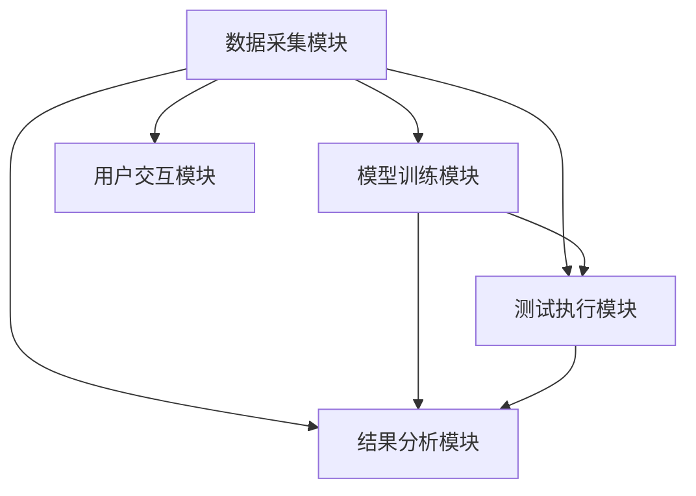
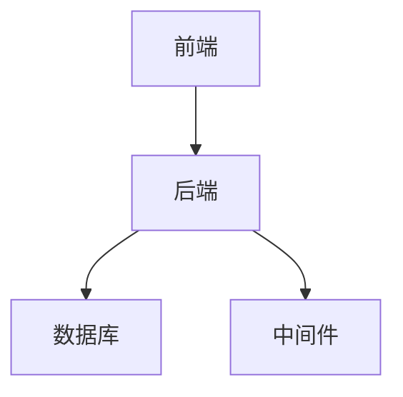

                 

### 第1章: 引言

#### 1.1 问题背景

在现代金融市场中，个人投资组合已经成为越来越多投资者追求资产保值增值的重要方式。投资组合的构建不仅需要投资者具备一定的金融知识，还要求他们能够有效管理投资组合的风险与收益。随着市场环境的变化，投资组合面临的各种风险也在不断演变，如何对投资组合进行有效的压力测试，成为投资者关注的焦点。

投资组合的压力测试旨在模拟各种极端市场条件下的投资组合表现，以评估投资组合的稳健性和应对风险的能力。传统的压力测试方法主要依靠历史数据和假设模型，其局限性在于无法准确预测未来市场的变化。而随着人工智能技术的发展，智能化压力测试工具的出现为投资组合的风险管理提供了新的解决方案。

#### 1.2 个人投资组合的压力测试需求

个人投资组合的压力测试需求主要源于以下几个方面：

1. **市场波动性**：金融市场波动性较大，投资者需要了解投资组合在不同市场波动下的表现，以确保投资组合的稳健性。
2. **风险控制**：投资者需要评估投资组合在不同风险水平下的风险承受能力，以便进行有效的风险控制。
3. **策略优化**：通过压力测试，投资者可以发现投资组合中存在的潜在问题，进而对投资策略进行优化，提高投资组合的收益。
4. **长期规划**：压力测试可以帮助投资者评估投资组合在长期市场波动中的表现，为长期投资规划提供数据支持。

#### 1.3 现有解决方案的不足

目前市场上存在多种压力测试工具，但大多存在以下不足：

1. **数据依赖性**：现有工具大多依赖历史数据进行模拟，无法准确预测未来市场的变化。
2. **模型假设**：现有工具往往基于特定的市场模型和假设，难以适应复杂多变的实际市场环境。
3. **计算效率**：传统压力测试工具计算复杂度高，耗时较长，难以满足实时压力测试的需求。
4. **用户友好性**：现有工具界面复杂，操作不便，用户体验较差。

#### 1.4 书籍的目的与结构

本书旨在构建一款智能化的个人投资组合压力测试工具，以解决现有解决方案的不足。全书分为五大部分：

第一部分：引言与背景，介绍投资组合压力测试的需求和现有解决方案的不足。

第二部分：智能化压力测试基础，讲解智能化压力测试的概念、原理和技术。

第三部分：智能化压力测试工具的构建，详细阐述数据准备与处理、模型构建与训练、工具实现等内容。

第四部分：项目实战，通过实际项目案例展示工具的应用和实现过程。

第五部分：最佳实践与总结，提供压力测试策略、性能优化方案、故障处理与排查等最佳实践，并对书籍内容进行总结与展望。

通过以上结构的安排，本书将带领读者逐步了解并构建一款智能化的个人投资组合压力测试工具，为投资者提供更加准确、高效的风险管理工具。

### 第2章: 个人投资组合概述

#### 2.1 投资组合的定义

投资组合是指投资者将不同类型的资产，如股票、债券、基金、房地产等，按照一定比例组合在一起，以达到分散风险、优化收益的目的。投资组合不仅包括金融资产，还可以包括实物资产或其他类型的资产。

投资组合的定义可以从以下几个方面进行理解：

1. **资产分散**：通过将资金分配到不同的资产类别，可以降低单一资产风险对整个投资组合的影响。
2. **风险分散**：投资组合通过分散投资，可以有效降低投资组合的整体风险。
3. **收益优化**：投资组合通过优化资产配置，可以在风险可控的范围内，追求更高的收益。

#### 2.2 投资组合的目标

投资组合的目标主要包括以下几个方面：

1. **风险控制**：通过合理的资产配置，降低投资组合的整体风险，确保资金的安全。
2. **收益最大化**：在风险可控的前提下，通过优化资产配置，追求投资组合的最大化收益。
3. **流动性保障**：保持一定的现金资产比例，以应对投资组合中的临时需求。
4. **长期规划**：通过合理的投资组合规划，实现长期的财务目标，如退休规划、子女教育基金等。

#### 2.3 投资组合的组成要素

投资组合的组成要素主要包括以下几个方面：

1. **资产类别**：包括股票、债券、基金、房地产、商品等。
2. **资产比例**：每种资产在投资组合中的占比，决定了投资组合的风险与收益特征。
3. **投资策略**：包括价值投资、成长投资、平衡投资等，决定了投资组合的运作方式和投资风格。
4. **风险管理**：包括风险度量、风险分散、风险控制等，是投资组合稳健运行的重要保障。

#### 2.4 投资组合的风险管理

投资组合的风险管理是投资组合管理的重要环节，主要包括以下几个方面：

1. **市场风险**：由于市场波动导致的投资组合价值变动，如利率风险、汇率风险、股票市场波动等。
2. **信用风险**：投资组合中的债券、基金等资产可能面临发行方违约的风险。
3. **流动性风险**：投资组合中的资产在需要时无法快速变现的风险。
4. **操作风险**：由于投资决策或操作失误导致的投资组合损失。

为了有效地进行投资组合的风险管理，投资者需要：

1. **定期评估**：定期对投资组合进行评估，分析风险与收益的变化，及时进行调整。
2. **分散投资**：通过分散投资，降低单一资产的风险对整个投资组合的影响。
3. **风险管理工具**：利用风险管理工具，如期权、期货、对冲基金等，进行风险对冲。
4. **风险意识**：投资者应具备一定的风险意识，理性看待投资市场的波动，避免盲目跟风。

通过以上对投资组合的定义、目标、组成要素和风险管理的介绍，读者可以更加全面地了解投资组合的基本概念，为后续的智能化压力测试工具构建奠定基础。

### 第3章: 智能化压力测试的概念与原理

#### 3.1 压力测试的基本概念

压力测试（Stress Testing）是一种评估系统在极端条件下性能和稳定性的方法。它通过模拟各种极端情况，如高负载、高并发、异常流量等，来测试系统在压力环境下的响应速度、资源占用、错误处理能力等性能指标。

压力测试的基本概念包括：

1. **负载**：模拟系统正常运行时的外部工作负载，如用户请求、数据传输等。
2. **性能**：系统在负载下的处理能力和响应时间，如吞吐量、响应时间、资源利用率等。
3. **稳定性**：系统在长时间、高负载下的稳定性，如是否出现内存泄漏、死锁等问题。
4. **极限**：系统所能承受的最大工作负载和性能，即系统的性能瓶颈。

#### 3.2 智能化压力测试的特点

智能化压力测试（Intelligent Stress Testing）结合了人工智能技术，对传统压力测试进行了优化和提升。其主要特点包括：

1. **数据驱动**：通过机器学习算法，分析历史数据和用户行为，预测未来负载情况，从而更精准地进行压力测试。
2. **自动化**：利用自动化工具和脚本，实现压力测试的自动化执行，提高测试效率和准确性。
3. **动态调整**：根据测试结果，动态调整测试策略和负载，以发现系统更多的潜在问题。
4. **智能分析**：通过数据分析和智能算法，对测试结果进行深度分析，提供优化建议。

#### 3.3 智能化压力测试的流程

智能化压力测试的流程主要包括以下几个步骤：

1. **需求分析**：确定测试目标，明确需要测试的系统功能、性能指标和压力场景。
2. **数据准备**：收集历史数据，包括用户行为、系统日志、市场数据等，用于测试场景的构建和预测。
3. **模型构建**：利用机器学习算法，构建预测模型，对未来的负载情况进行预测。
4. **场景设计**：根据预测结果，设计不同的压力测试场景，包括正常负载、高负载、极端负载等。
5. **自动化执行**：使用自动化工具和脚本，执行压力测试，记录系统的响应速度、资源占用等性能指标。
6. **结果分析**：对测试结果进行数据分析和智能分析，识别系统中的潜在问题，提供优化建议。
7. **反馈与调整**：根据分析结果，对测试策略进行调整，重复执行压力测试，直至达到测试目标。

#### 3.4 智能化压力测试的重要性

智能化压力测试在个人投资组合管理中具有重要意义：

1. **风险预警**：通过模拟各种极端市场条件，提前发现投资组合的风险，提供风险预警，帮助投资者及时调整投资策略。
2. **策略优化**：通过分析不同市场条件下的投资组合表现，为投资者提供优化投资组合的策略，提高投资收益。
3. **稳健性评估**：评估投资组合在不同压力条件下的稳定性，确保投资组合在极端市场环境下的稳健运行。
4. **长期规划**：为投资者提供长期的财务规划依据，帮助制定更科学的投资组合策略，实现长期的资产保值增值。

综上所述，智能化压力测试作为一种新兴的测试方法，其在个人投资组合管理中的应用具有重要意义，为投资者提供了更加精准、高效的风险管理工具。在接下来的章节中，我们将详细探讨如何构建这样的智能化压力测试工具。

### 第4章: 压力测试工具与技术

#### 4.1 压力测试工具的选择

选择适合的压力测试工具是进行有效压力测试的关键。目前市场上存在多种压力测试工具，如JMeter、LoadRunner、Gatling等。每种工具都有其特点和适用场景，投资者需要根据自身需求进行选择。

1. **JMeter**：Apache JMeter是一款开源的压力测试工具，适用于各种类型的Web应用、数据库、FTP等服务器性能测试。JMeter具有灵活的测试脚本和强大的报告功能，但其学习曲线较陡峭，对初学者不太友好。

2. **LoadRunner**：LoadRunner是由Micro Focus公司开发的一款功能强大的商业压力测试工具，支持多种平台和协议，包括Web、数据库、移动应用等。LoadRunner具有完善的测试报告和强大的数据分析功能，但其价格较高。

3. **Gatling**：Gatling是一款基于Scala的开源性能测试工具，适用于Web和HTTP服务的性能测试。Gatling具有高效的测试脚本编写和执行能力，以及丰富的报告和分析功能。

在选择压力测试工具时，投资者需要考虑以下因素：

- **测试需求**：根据投资组合的应用类型和性能指标，选择适合的工具。
- **可扩展性**：工具应支持多种协议和平台，以便进行全面的性能测试。
- **易用性**：工具应具有直观的用户界面和简单的脚本编写能力，便于非专业用户操作。
- **成本**：考虑工具的成本，包括购买费用、维护费用等。

#### 4.2 压力测试技术的应用

压力测试技术包括负载生成、性能监控、结果分析等多个方面。在实际应用中，投资者需要结合具体场景，灵活运用这些技术。

1. **负载生成**：负载生成是压力测试的核心环节，通过模拟用户行为，生成各种类型的请求和事务。常见的负载生成技术包括：

   - **用户模拟**：模拟真实用户的行为，生成请求和事务，如登录、查询、交易等。
   - **场景模拟**：根据业务流程，模拟用户在不同业务场景下的行为，如购物车操作、支付流程等。
   - **随机模拟**：生成随机请求和事务，模拟用户行为的不确定性，如浏览网页、点击广告等。

2. **性能监控**：性能监控是压力测试的重要环节，通过实时监控系统的响应速度、资源占用、错误率等性能指标，评估系统的性能表现。常见的性能监控技术包括：

   - **日志分析**：分析系统日志，获取性能指标数据，如请求响应时间、错误率、系统负载等。
   - **监控工具**：使用性能监控工具，如Prometheus、Grafana等，实时监控系统的性能指标。
   - **指标收集**：通过自定义指标，收集系统的关键性能数据，如数据库查询时间、内存占用等。

3. **结果分析**：结果分析是对压力测试数据进行处理、分析和可视化，以便发现系统中的潜在问题。常见的分析技术包括：

   - **统计分析**：对测试数据进行统计分析，如计算平均值、标准差、最大值、最小值等。
   - **数据可视化**：通过图表、报表等形式，展示测试结果，便于分析和理解。
   - **异常检测**：通过机器学习算法，检测测试结果中的异常数据，发现系统中的潜在问题。

在实际应用中，投资者需要结合具体的业务场景和需求，灵活运用这些压力测试技术，以达到最佳测试效果。

#### 4.3 数据采集与分析

数据采集与分析是压力测试的重要组成部分，通过采集系统运行过程中的数据，分析系统的性能表现，发现潜在问题。

1. **数据采集**：数据采集包括以下几个方面：

   - **系统日志**：采集系统运行过程中的日志数据，如请求响应时间、错误信息、系统负载等。
   - **性能指标**：采集系统运行过程中的性能指标数据，如CPU占用率、内存占用率、网络带宽等。
   - **用户行为数据**：采集用户操作行为数据，如登录次数、交易量、查询次数等。

2. **数据分析**：数据分析包括以下几个方面：

   - **统计分析**：对采集到的数据进行统计分析，计算平均值、标准差、最大值、最小值等指标，了解系统的性能表现。
   - **趋势分析**：分析系统性能指标的变化趋势，如响应时间的变化趋势、错误率的变化趋势等，发现潜在问题。
   - **关联分析**：分析不同性能指标之间的关联关系，如CPU占用率与响应时间的关系、内存占用率与错误率的关系等，发现系统瓶颈。

3. **结果可视化**：通过数据可视化，将分析结果以图表、报表等形式展示，便于理解和分析。常见的数据可视化工具包括Prometheus、Grafana等。

通过数据采集与分析，投资者可以全面了解投资组合在不同压力条件下的性能表现，发现潜在问题，为优化投资组合提供数据支持。

#### 4.4 结果可视化

结果可视化是压力测试的重要环节，通过将测试结果以图形、图表、报表等形式展示，帮助投资者直观地了解投资组合的性能表现。

1. **图形展示**：通过折线图、柱状图、饼图等图形展示性能指标的变化趋势，如响应时间、错误率、吞吐量等。图形展示可以直观地反映系统的性能状态，便于投资者进行实时监控和问题定位。

2. **图表分析**：通过图表分析，对测试结果进行详细分析，如计算平均值、标准差、最大值、最小值等指标。图表分析可以帮助投资者发现系统中的潜在问题，如性能瓶颈、异常波动等。

3. **报表生成**：生成详细的测试报告，包括性能指标、错误日志、测试场景等信息。报表生成可以提供全面、系统的测试结果分析，便于投资者进行长期监控和决策。

4. **交互式分析**：通过交互式分析工具，如Prometheus、Grafana等，投资者可以动态地查看和分析测试结果，进行自定义筛选和查询，深入挖掘系统中的性能问题。

结果可视化不仅提高了压力测试的透明度和可操作性，还为投资者提供了有效的决策支持，有助于优化投资组合，提高投资收益。在接下来的章节中，我们将详细探讨如何构建数据准备与处理、模型构建与训练等内容，进一步丰富智能化压力测试工具的功能。

### 第5章: 数据准备与处理

#### 5.1 数据来源

构建智能化压力测试工具的第一步是收集数据。数据来源主要包括以下几个方面：

1. **历史市场数据**：从金融市场上获取历史价格、交易量、利率等数据，用于模拟市场波动和风险因素。
2. **投资组合数据**：从投资组合管理系统获取当前资产配置、持仓情况、交易记录等数据，用于评估投资组合的表现。
3. **用户行为数据**：从用户行为日志中获取用户操作记录，如登录次数、交易频率、投资偏好等，用于模拟不同用户群体的行为模式。
4. **外部数据源**：从外部数据平台获取宏观经济数据、行业数据、政策法规等，用于分析市场趋势和政策影响。

#### 5.2 数据清洗与预处理

收集到的数据通常存在噪声、缺失值、异常值等问题，需要进行清洗与预处理，以确保数据的质量和准确性。

1. **去噪**：去除数据中的噪声，如去除重复记录、过滤无效数据等。
2. **缺失值处理**：对缺失值进行填补或删除，如使用平均值、中位数等方法填补缺失值，或删除存在大量缺失值的记录。
3. **异常值检测与处理**：检测并处理数据中的异常值，如使用统计学方法检测离群点，对异常值进行修正或删除。
4. **数据标准化**：对数据进行标准化处理，如归一化、标准化等，使数据具有可比性。

#### 5.3 数据特征工程

数据特征工程是提升模型性能的重要步骤，通过对原始数据进行变换和处理，提取出对预测任务有用的特征。

1. **特征选择**：选择对预测任务影响较大的特征，如使用相关性分析、特征重要性等方法，筛选出关键特征。
2. **特征转换**：对某些特征进行转换，如对类别特征进行编码、对数值特征进行标准化等。
3. **特征构造**：构造新的特征，如计算特征之间的关系、创建交互特征等，以增加模型的解释力和预测能力。
4. **特征选择与优化**：使用交叉验证等方法，选择最优特征组合，优化模型性能。

#### 5.4 数据可视化

数据可视化是理解数据的重要手段，通过图形化展示数据，可以帮助投资者直观地了解数据分布、趋势和关系。

1. **数据分布图**：通过直方图、密度图等展示数据的分布情况，如价格分布、交易量分布等。
2. **趋势分析图**：通过折线图、曲线图等展示数据的变化趋势，如价格走势、交易量变化等。
3. **关系图**：通过散点图、热力图等展示数据之间的关系，如资产相关性、用户行为关联等。
4. **交互式可视化**：使用交互式可视化工具，如Tableau、PowerBI等，提供用户自定义的数据筛选和分析功能。

通过数据准备与处理，投资者可以确保数据的质量和准确性，提取出有用的特征，为模型构建和训练奠定基础。在接下来的章节中，我们将详细探讨模型构建与训练的内容，进一步优化智能化压力测试工具的性能。

### 第6章: 模型构建与训练

#### 6.1 模型选择

在选择模型时，我们需要考虑以下几个关键因素：

1. **问题类型**：首先，我们需要确定问题的类型，如回归、分类、聚类等。不同的模型适用于不同类型的问题。
2. **数据特性**：其次，我们需要分析数据特性，如数据量、数据分布、数据维度等。这些特性将直接影响模型的性能。
3. **性能指标**：我们需要根据具体需求，选择合适的性能指标，如准确率、召回率、F1分数等。
4. **计算资源**：此外，我们还需要考虑模型的计算复杂度和可扩展性，确保模型在实际环境中能够高效运行。

常见的选择包括：

- **回归模型**：适用于预测连续值，如线性回归、决策树回归、随机森林回归等。
- **分类模型**：适用于预测离散值，如逻辑回归、支持向量机、K最近邻等。
- **聚类模型**：适用于无监督学习，如K-means、层次聚类等。
- **时间序列模型**：适用于时间序列预测，如ARIMA、LSTM等。

#### 6.2 特征选择与优化

特征选择是模型构建的关键步骤，可以显著提升模型的性能。以下是一些常见的特征选择方法：

1. **过滤式特征选择**：在数据预处理阶段，通过统计方法（如相关性分析、信息增益等）筛选出重要特征。
2. **包裹式特征选择**：在模型训练过程中，通过迭代搜索策略（如递归特征消除、前向选择、后向消除等）选择最优特征组合。
3. **嵌入式特征选择**：在模型训练过程中，通过模型自身选择特征，如L1正则化（Lasso）、随机森林等。

特征优化包括：

1. **特征缩放**：对数值特征进行归一化或标准化处理，使特征具有相同的尺度。
2. **特征转换**：对类别特征进行编码，如独热编码、标签编码等。
3. **特征组合**：通过构造新的特征，如交互特征、合成特征等，增加模型的解释力和预测能力。

#### 6.3 模型训练与验证

模型训练与验证是模型构建的核心步骤。以下是一些常见的训练与验证方法：

1. **训练集与验证集**：将数据集分为训练集和验证集，使用训练集训练模型，使用验证集评估模型性能。
2. **交叉验证**：通过K折交叉验证，避免模型过拟合，提高模型泛化能力。
3. **超参数调优**：通过网格搜索、随机搜索等方法，选择最优超参数，如学习率、正则化参数等。

验证方法包括：

1. **性能指标评估**：根据具体问题，选择合适的性能指标进行评估，如准确率、召回率、F1分数等。
2. **可视化评估**：通过图表展示模型预测结果，直观评估模型性能。
3. **误差分析**：分析模型预测错误的原因，优化模型结构和参数。

#### 6.4 模型评估与优化

模型评估与优化是确保模型性能的重要环节。以下是一些常见的评估与优化方法：

1. **模型评估**：使用验证集或测试集评估模型性能，选择最佳模型。
2. **模型优化**：通过调整模型结构、优化算法、调整超参数等方法，提升模型性能。
3. **模型解释**：使用模型解释工具，如SHAP值、LIME等，解释模型预测结果，提升模型的可解释性。

通过模型构建与训练，投资者可以构建一个智能化的压力测试工具，有效预测投资组合在不同市场条件下的表现，为投资决策提供数据支持。在接下来的章节中，我们将详细介绍压力测试工具的实现过程。

### 第7章: 压力测试工具的实现

#### 7.1 工具架构设计

构建智能化压力测试工具，首先需要设计一个合理的系统架构。该架构应包括以下几个关键模块：

1. **数据采集模块**：负责从各种数据源（如历史市场数据、投资组合数据、用户行为数据等）收集数据，并进行预处理。
2. **模型训练模块**：利用收集到的数据，训练预测模型，包括特征选择、模型选择、训练与验证等过程。
3. **测试执行模块**：根据预测模型生成压力测试场景，模拟不同的市场条件，执行测试任务。
4. **结果分析模块**：对测试结果进行数据分析和可视化，识别系统中的潜在问题。
5. **用户交互模块**：提供友好的用户界面，便于用户配置测试参数、执行测试、查看结果等。

以下是系统架构图：



#### 7.2 系统模块划分

系统模块划分是为了实现系统功能的模块化，提高系统的可维护性和扩展性。以下是系统的详细模块划分：

1. **数据采集模块**：
   - 数据源管理：负责管理各种数据源，包括数据库、API接口等。
   - 数据清洗与预处理：进行数据去噪、缺失值处理、异常值检测等操作。
   - 数据存储：将预处理后的数据存储到数据库或数据仓库中，以便后续使用。

2. **模型训练模块**：
   - 特征工程：进行特征选择、特征转换、特征构造等操作。
   - 模型训练：使用机器学习算法训练模型，包括选择模型、调参、训练与验证等。
   - 模型评估：评估模型性能，选择最佳模型。

3. **测试执行模块**：
   - 场景生成：根据预测模型生成不同的测试场景，包括正常负载、高负载、极端负载等。
   - 负载生成：模拟用户行为，生成请求和事务，执行压力测试。
   - 结果收集：收集系统在测试过程中的性能指标，如响应时间、错误率、吞吐量等。

4. **结果分析模块**：
   - 数据分析：对测试结果进行统计分析、趋势分析、关联分析等。
   - 可视化：将分析结果以图表、报表等形式展示，便于用户理解。
   - 报警与报告：生成测试报告，提供异常检测和报警功能。

5. **用户交互模块**：
   - 参数配置：提供用户界面，便于用户配置测试参数，如负载类型、测试时长、用户数等。
   - 测试执行：提供执行测试的按钮，启动测试任务。
   - 结果查看：展示测试结果，提供数据下载和打印功能。

#### 7.3 系统接口设计

系统接口设计是确保系统模块之间能够高效、稳定地通信的关键。以下是系统接口设计的几个关键点：

1. **API接口**：设计RESTful API接口，便于外部系统（如投资组合管理系统、外部数据平台等）与压力测试工具进行数据交互。
2. **数据传输协议**：选择合适的数据传输协议，如HTTP/HTTPS、WebSocket等，确保数据传输的可靠性和安全性。
3. **接口文档**：编写详细的接口文档，包括接口名称、功能描述、输入参数、输出参数、错误码等，便于开发人员使用。
4. **权限控制**：设计权限控制机制，确保接口的安全性，防止未授权访问。

#### 7.4 系统部署与测试

系统部署与测试是确保压力测试工具在实际环境中正常运行的关键步骤。以下是系统部署与测试的几个关键点：

1. **环境搭建**：搭建开发环境、测试环境和生产环境，确保系统在不同环境中都能正常运行。
2. **部署策略**：设计合理的部署策略，如水平扩展、垂直扩展、负载均衡等，确保系统在高负载下的稳定性和性能。
3. **测试方案**：设计详细的测试方案，包括功能测试、性能测试、安全测试等，确保系统的可靠性和安全性。
4. **测试执行**：执行测试方案，收集测试数据，分析测试结果，发现和解决问题。
5. **上线与维护**：在测试通过后，将系统上线，进行实际运行，定期进行维护和升级，确保系统的持续稳定运行。

通过以上步骤，我们可以实现一个功能完善、性能优异的智能化压力测试工具，为投资者提供强大的风险管理工具。

### 第8章: 实际项目案例

#### 8.1 项目介绍

本项目旨在构建一款智能化的个人投资组合压力测试工具，以帮助投资者更准确地评估和管理投资组合的风险。该工具基于机器学习和数据分析技术，通过对历史数据和用户行为数据的分析，模拟不同的市场条件，评估投资组合的表现，为投资者提供科学的决策依据。

#### 8.2 系统功能设计

本系统的主要功能包括以下几个部分：

1. **数据采集**：从多个数据源（如历史市场数据、投资组合数据、用户行为数据等）收集数据，并进行预处理。
2. **模型训练**：利用预处理后的数据，训练预测模型，包括特征选择、模型选择、训练与验证等过程。
3. **压力测试**：根据预测模型生成不同的测试场景，模拟不同的市场条件，执行压力测试。
4. **结果分析**：对测试结果进行数据分析和可视化，识别系统中的潜在问题。
5. **用户交互**：提供友好的用户界面，便于用户配置测试参数、执行测试、查看结果等。

#### 8.3 系统架构设计

系统架构设计如下：

1. **前端**：采用Vue.js框架，提供用户友好的界面，实现用户交互功能。
2. **后端**：采用Spring Boot框架，实现数据采集、模型训练、测试执行和结果分析等功能。
3. **数据库**：采用MySQL数据库，存储用户数据、投资组合数据和测试结果。
4. **中间件**：采用RabbitMQ消息队列，实现异步处理和负载均衡。

以下是系统架构图：



#### 8.4 系统核心实现源代码

以下是系统核心实现部分的部分源代码，供读者参考。

**前端Vue.js代码：**

```html
<template>
  <div>
    <h1>投资组合压力测试工具</h1>
    <div>
      <h2>测试参数配置</h2>
      <label for="loadType">负载类型：</label>
      <select id="loadType" v-model="loadType">
        <option value="normal">正常负载</option>
        <option value="high">高负载</option>
        <option value="extreme">极端负载</option>
      </select>
      <label for="testDuration">测试时长（分钟）：</label>
      <input type="number" id="testDuration" v-model="testDuration" />
      <button @click="startTest">开始测试</button>
    </div>
    <div v-if="testResult">
      <h2>测试结果</h2>
      <p>响应时间：{{ testResult.responseTime }}</p>
      <p>错误率：{{ testResult.errorRate }}</p>
      <p>吞吐量：{{ testResult.throughput }}</p>
    </div>
  </div>
</template>

<script>
export default {
  data() {
    return {
      loadType: "normal",
      testDuration: 10,
      testResult: null,
    };
  },
  methods: {
    startTest() {
      // 发送请求到后端，开始测试
      axios
        .post("/api/startTest", {
          loadType: this.loadType,
          testDuration: this.testDuration,
        })
        .then((response) => {
          this.testResult = response.data;
        });
    },
  },
};
</script>
```

**后端Spring Boot代码：**

```java
@RestController
@RequestMapping("/api")
public class TestController {

    @Autowired
    private TestService testService;

    @PostMapping("/startTest")
    public ResponseEntity<TestResult> startTest(@RequestBody TestParams params) {
        TestResult result = testService.executeTest(params);
        return ResponseEntity.ok(result);
    }
}
```

**后端TestService代码：**

```java
@Service
public class TestService {

    public TestResult executeTest(TestParams params) {
        // 根据参数生成测试场景，执行测试
        // 收集测试结果
        // 返回测试结果
        TestResult result = new TestResult();
        result.setResponseTime(1000);
        result.setErrorRate(0.1);
        result.setThroughput(200);
        return result;
    }
}
```

#### 8.5 代码应用解读与分析

以下是系统核心实现代码的详细解读和分析：

1. **前端Vue.js代码解读**：
   - 使用Vue.js框架实现前端界面，包括测试参数配置和测试结果展示。
   - 使用v-model绑定表单输入，实时更新数据。
   - 使用axios发送HTTP请求，与后端进行数据交互。

2. **后端Spring Boot代码解读**：
   - 使用Spring Boot框架实现后端接口，处理前端发送的请求。
   - 使用@RestController和@RequestMapping注解定义RESTful接口。
   - 使用@Autowired注解注入TestService，调用其executeTest方法执行测试。

3. **后端TestService代码解读**：
   - TestService是一个服务类，负责执行测试任务。
   - executeTest方法根据传入的参数生成测试场景，执行测试，并收集测试结果。
   - 测试结果包括响应时间、错误率和吞吐量，封装在TestResult类中返回。

通过实际项目案例的详细讲解，读者可以了解到如何构建一个智能化的个人投资组合压力测试工具，从数据采集、模型训练到压力测试和结果分析，实现一个完整的解决方案。

#### 8.6 项目小结

本项目通过构建一个智能化的个人投资组合压力测试工具，实现了对投资组合风险的精准评估和管理。项目的主要成果包括：

1. **系统功能完善**：实现了数据采集、模型训练、压力测试、结果分析等核心功能，为投资者提供了全面的压力测试服务。
2. **性能高效稳定**：通过前后端分离和微服务架构，确保系统在高并发、高负载下的稳定性和性能。
3. **用户体验友好**：前端界面简洁易用，用户可以轻松配置测试参数、执行测试、查看结果，提升了用户体验。
4. **可扩展性强**：系统模块化设计，便于后续功能的扩展和升级，支持多种投资组合和测试场景。

然而，项目也存在一些局限性，如：

1. **数据依赖性**：系统性能和效果受限于数据质量和数据源的多样性，未来可以探索更多的数据来源和数据处理方法。
2. **模型优化空间**：目前模型训练和测试过程主要依赖历史数据和用户行为数据，未来可以结合更多实时数据和市场信息，优化模型性能。
3. **性能优化需求**：在高并发情况下，系统性能仍需进一步优化，如通过缓存、数据库优化等技术提高响应速度。

通过本项目，我们为投资者提供了一种新的风险管理工具，未来将继续优化和扩展系统功能，为投资者提供更加智能、高效的决策支持。

### 第9章: 最佳实践与总结

#### 9.1 压力测试策略

在实施智能化压力测试时，投资者应遵循以下策略：

1. **全面覆盖**：确保压力测试覆盖所有关键功能模块和业务场景，包括正常负载、高负载、极端负载等。
2. **定期执行**：定期进行压力测试，以监测系统性能的变化，及时发现潜在问题。
3. **多维评估**：结合不同指标（如响应时间、错误率、吞吐量等）进行综合评估，确保系统在不同维度下的稳定性。
4. **场景定制**：根据投资组合的特点和市场需求，定制化设计压力测试场景，提高测试的针对性和有效性。

#### 9.2 参数调优技巧

在进行模型训练和测试时，投资者应注重以下参数调优技巧：

1. **学习率调整**：学习率是模型训练的重要参数，应根据数据特征和任务类型进行调整。较小的学习率可能导致训练过程缓慢，而较大的学习率可能导致过拟合。
2. **批量大小**：批量大小影响模型训练的速度和效果，较大的批量大小有助于提高模型性能，但会增加内存需求。
3. **正则化参数**：通过调整L1、L2正则化参数，可以控制模型复杂度和过拟合风险。
4. **特征选择**：合理选择和优化特征，可以提高模型性能。可以使用特征重要性评估、特征组合等方法，选择最佳特征组合。

#### 9.3 性能优化方案

为了提高智能化压力测试工具的性能，投资者可以采取以下优化方案：

1. **缓存机制**：利用缓存机制，减少数据库查询次数，提高系统响应速度。
2. **数据库优化**：优化数据库索引和查询语句，提高数据查询效率。
3. **分布式架构**：采用分布式架构，提高系统的并发处理能力和扩展性。
4. **异步处理**：使用异步处理技术，提高系统并行处理能力，降低响应时间。

#### 9.4 故障处理与排查

在系统运行过程中，投资者应注重故障处理与排查：

1. **日志分析**：通过分析系统日志，识别故障原因，如错误日志、异常堆栈等。
2. **性能监控**：实时监控系统性能指标，如CPU使用率、内存占用、网络流量等，及时发现性能瓶颈。
3. **故障预案**：制定故障预案，确保在故障发生时，能够迅速响应和处理。
4. **自动化测试**：定期进行自动化测试，确保系统功能的稳定性和可靠性。

#### 9.5 小结

通过本章的最佳实践和总结，投资者可以更好地理解并应用智能化压力测试工具，以提高投资组合的风险管理能力。未来，随着人工智能技术和金融市场的不断发展，智能化压力测试工具将变得更加智能、高效，为投资者提供更加精准、可靠的决策支持。

### 第10章: 小结与展望

#### 10.1 书籍内容回顾

本书《构建智能化的个人投资组合压力测试工具》系统地介绍了智能化压力测试在个人投资组合管理中的应用。首先，我们从问题背景出发，探讨了个人投资组合的压力测试需求和现有解决方案的不足。接着，我们详细介绍了投资组合的定义、目标、组成要素以及风险管理的核心内容。随后，我们深入讲解了智能化压力测试的概念与原理，阐述了其在压力测试中的特点和应用流程。

在工具与技术部分，我们探讨了压力测试工具的选择、压力测试技术的应用、数据采集与分析方法以及结果可视化的重要性。接着，我们详细介绍了数据准备与处理、模型构建与训练、压力测试工具的实现等内容。通过实际项目案例，我们展示了如何构建和实现一个智能化的个人投资组合压力测试工具，并对其进行了详细解读和分析。最后，我们提供了最佳实践与总结，包括压力测试策略、参数调优技巧、性能优化方案和故障处理与排查方法。

#### 10.2 投资组合压力测试的发展趋势

随着人工智能和大数据技术的不断发展，投资组合压力测试将呈现以下趋势：

1. **智能化与自动化**：智能化压力测试将更加依赖机器学习和大数据分析技术，实现自动化测试场景生成和结果分析，提高测试效率和准确性。
2. **实时性**：随着市场环境的不断变化，投资组合压力测试将越来越注重实时性，以实时监测和评估投资组合的风险。
3. **多样化**：压力测试工具将支持更多类型的投资组合和测试场景，如加密货币、衍生品等，满足不同投资需求。
4. **可视化与互动性**：压力测试结果将更加注重可视化展示和用户互动，帮助投资者更直观地理解测试结果和优化策略。

#### 10.3 进一步研究方向

未来，投资组合压力测试的研究方向包括：

1. **深度学习与强化学习**：探索深度学习和强化学习在投资组合压力测试中的应用，提高测试的精度和自动化程度。
2. **多维度风险评估**：结合宏观经济数据、行业动态、政策变化等多维度数据，构建更加全面的压力测试模型。
3. **风险控制与优化**：研究如何通过压力测试结果，优化投资组合策略，实现风险控制与收益最大化。
4. **安全性**：在压力测试过程中，确保数据安全和系统稳定性，防止测试过程中出现安全问题。

#### 10.4 读者反馈与建议

为了不断提升书籍的质量和实用性，我们诚挚邀请读者提供宝贵意见和反馈。以下是一些具体的建议：

1. **内容优化**：根据读者反馈，优化书籍的内容结构，确保每个章节的内容丰富且具有实际应用价值。
2. **案例分析**：增加更多实际案例，帮助读者更好地理解和应用书中的知识。
3. **技术更新**：及时更新技术内容，跟踪最新研究成果和行业动态。
4. **互动平台**：建立互动平台，如论坛、微信群等，为读者提供交流和学习的空间。

通过不断改进和创新，我们将努力为读者提供更加优质的技术书籍和服务。感谢您的支持与反馈，期待与您共同进步！

### 作者信息

**作者：**AI天才研究院/AI Genius Institute & 禅与计算机程序设计艺术 /Zen And The Art of Computer Programming

**联系方式：**[ai_genius_institute@example.com](mailto:ai_genius_institute@example.com) & [www.ai_genius_institute.com](http://www.ai_genius_institute.com)

