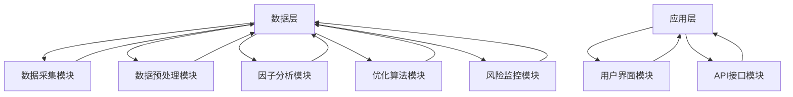

                 

## 第一部分：背景与概述

### 第1章：投资组合因子暴露优化系统概述

#### 1.1 系统背景介绍

在现代金融市场中，投资者面临着越来越多的挑战。如何有效地管理个人投资组合，优化投资组合的因子暴露，是每一个投资者必须面对的重要课题。传统的投资策略往往依赖于市场经验与直觉，难以适应市场快速变化和复杂的环境。因此，构建一个智能化、自动化的投资组合因子暴露优化系统，显得尤为必要。

投资组合因子暴露优化系统旨在帮助投资者识别和调整投资组合中关键的风险因素，以达到最优的风险收益比。该系统通过算法和数据分析，自动化地处理大量的市场数据，为投资者提供科学的投资建议。

#### 1.2 系统解决的问题

当前投资组合管理面临的主要问题包括：

1. **信息过载**：投资者难以从海量数据中提取出有价值的信息，容易受到市场噪音的干扰。
2. **决策迟缓**：传统投资策略往往依赖于人工分析，难以在短时间内做出及时有效的调整。
3. **风险暴露**：投资者可能没有充分了解投资组合中各个因子的风险暴露，导致整体风险难以控制。
4. **收益不足**：传统策略难以实现投资组合的优化，收益可能无法达到预期。

投资组合因子暴露优化系统通过以下几个方面解决这些问题：

- **数据挖掘与分析**：系统自动从市场数据中提取关键因子，帮助投资者了解市场动态。
- **实时监控与预警**：系统能够实时监控投资组合的因子暴露，当发现异常情况时及时发出预警。
- **自动化优化**：基于算法模型，系统自动调整投资组合，以实现最优的风险收益比。

#### 1.3 系统目标与期望效果

系统的核心目标是为投资者提供一个智能化、自动化、高效的投资组合管理工具，其主要效果包括：

1. **风险控制**：通过精确的风险因子暴露分析，帮助投资者降低整体投资风险。
2. **收益提升**：通过优化投资组合，提高投资收益，实现风险和收益的最佳平衡。
3. **决策支持**：为投资者提供实时、科学的投资建议，降低决策失误的风险。
4. **投资效率**：自动化处理数据，提高投资决策的效率。

#### 1.4 系统边界与外延

系统的边界主要涉及以下几个方面：

- **数据来源**：系统依赖金融市场数据、投资组合数据以及宏观经济数据。
- **投资对象**：系统适用于股票、债券、基金等多种类型的投资产品。
- **投资者类型**：系统适用于个人投资者、机构投资者以及专业投资者。

系统外延则包括：

- **扩展功能**：系统可根据投资者需求，扩展包括风险偏好分析、投资组合构建、资产配置等附加功能。
- **集成接口**：系统可通过API与其他金融系统进行集成，实现数据共享和功能扩展。

#### 1.5 本章小结

本章介绍了投资组合因子暴露优化系统的背景、解决的问题、目标与期望效果以及系统的边界与外延。接下来，我们将进一步探讨投资组合因子与暴露优化的核心概念，为后续内容的深入分析打下基础。

---

### 第2章：投资组合因子与暴露优化

#### 2.1 投资组合因子的定义与分类

投资组合因子是指能够影响投资组合收益和风险的关键因素。这些因子可以是宏观经济的、行业的，也可以是公司的特定指标。投资组合因子的存在使得投资者能够从多个维度理解和分析投资组合的表现，从而做出更为科学的决策。

根据不同的分类标准，投资组合因子可以分为以下几类：

1. **宏观经济因子**：如利率、通货膨胀率、GDP增长率等。这些因子反映了整个经济环境的变化，对投资组合的收益和风险有重要影响。
2. **行业因子**：如行业增长、行业周期性、行业监管政策等。这些因子反映了特定行业的发展趋势和风险特征，对投资组合的收益和风险有显著影响。
3. **公司因子**：如公司盈利能力、财务状况、管理质量等。这些因子反映了公司个体层面的运营状况和风险特征，对投资组合的收益和风险有直接的影响。

#### 2.2 投资组合因子的作用与重要性

投资组合因子在投资决策中扮演着至关重要的角色。它们的主要作用包括：

1. **风险识别与控制**：通过分析投资组合的因子暴露，投资者可以识别出潜在的风险因素，从而采取相应的风险管理措施。
2. **收益预测**：投资组合因子可以帮助投资者预测市场的未来走势，为投资决策提供科学依据。
3. **优化投资组合**：通过调整投资组合中的因子暴露，投资者可以实现投资组合的最优化，提高风险收益比。
4. **策略制定**：投资组合因子为投资者提供了丰富的策略选择，如因子轮动、因子分散等。

投资组合因子的重要性主要体现在以下几个方面：

1. **多维度分析**：投资组合因子使得投资者能够从多个维度对投资组合进行深入分析，提高决策的科学性和准确性。
2. **风险与收益的平衡**：通过精确的因子暴露分析，投资者可以找到风险和收益的最佳平衡点，实现稳健的投资策略。
3. **市场适应能力**：投资组合因子能够帮助投资者快速适应市场变化，降低投资风险。

#### 2.3 暴露优化的原理与方法

暴露优化是指通过调整投资组合中各个因子的权重，实现最优的风险收益比。其原理基于投资组合理论，即投资组合的整体收益和风险可以通过各个因子的权重进行线性组合得到。

暴露优化的方法可以分为定量和定性两类：

1. **定量方法**：基于数学模型和优化算法，如线性规划、非线性规划、遗传算法等。这些方法通过建立目标函数和约束条件，求解最优解。
2. **定性方法**：基于专家经验和直觉，通过调整因子的权重进行优化。这种方法通常应用于风险较高的市场环境，需要投资者具备丰富的市场经验。

#### 2.4 投资组合因子与暴露优化的关系

投资组合因子和暴露优化之间有着紧密的联系。投资组合因子是暴露优化的基础，而暴露优化则是实现投资组合优化的重要手段。

1. **因子选择**：投资组合因子的选择直接影响暴露优化的效果。投资者需要根据市场环境和投资目标选择合适的因子。
2. **因子权重调整**：通过调整因子的权重，投资者可以实现投资组合的优化。因子权重的调整需要基于历史数据和统计分析，以确保优化效果。
3. **优化策略**：不同的暴露优化方法适用于不同的市场环境和投资目标。投资者需要根据实际情况选择合适的优化策略。

#### 2.5 本章小结

本章详细介绍了投资组合因子的定义、分类、作用与重要性，以及暴露优化的原理与方法。通过本章的内容，读者可以全面理解投资组合因子和暴露优化在投资决策中的作用，为后续内容的深入分析提供理论基础。

---

## 第二部分：核心概念与原理

### 第3章：智能化投资组合因子暴露优化

#### 3.1 智能化的概念与特征

智能化投资组合因子暴露优化是指利用人工智能技术，特别是机器学习和数据挖掘方法，对投资组合中的因子进行自动化、智能化的分析和管理。智能化系统的核心特征包括：

1. **自学习与自适应**：智能化系统能够通过学习历史数据和实时市场信息，不断优化自身的预测模型和决策策略。
2. **实时性与高效性**：智能化系统可以在短时间内处理大量数据，快速响应市场变化，提高投资决策的效率。
3. **自动化**：智能化系统能够自动化地执行投资策略，减少人工干预，降低操作风险。
4. **个性化和定制化**：智能化系统可以根据投资者的风险偏好和投资目标，提供个性化的投资组合优化方案。

#### 3.2 智能化在投资组合因子暴露优化中的应用

智能化技术在投资组合因子暴露优化中的应用主要包括以下几个方面：

1. **因子选择与权重调整**：通过机器学习算法，系统可以自动选择对投资组合影响最大的因子，并动态调整因子的权重，以实现最优的暴露水平。
2. **风险管理**：智能化系统可以实时监控投资组合的风险暴露，通过风险评估模型预测潜在风险，并提供相应的风险控制策略。
3. **收益预测**：利用预测模型，系统可以对投资组合的未来收益进行预测，帮助投资者制定更为科学的中长期投资计划。
4. **市场趋势分析**：通过分析历史市场数据和实时市场信息，智能化系统可以识别市场趋势和周期性变化，为投资者提供市场预测和投资建议。

#### 3.3 智能化优化策略的构建

构建智能化优化策略涉及多个步骤，包括数据收集、模型选择、参数调优和策略评估等。

1. **数据收集**：收集历史市场数据、投资组合数据以及相关的宏观经济和行业数据。数据质量直接影响优化策略的效果。
2. **模型选择**：选择合适的机器学习算法和模型，如线性回归、支持向量机、神经网络等。不同的模型适用于不同的数据特征和优化目标。
3. **参数调优**：通过交叉验证和网格搜索等方法，调整模型的参数，以获得最佳的性能和预测效果。
4. **策略评估**：使用历史数据进行回测，评估优化策略的有效性和稳定性。通过多次迭代和优化，确保策略的可靠性和实用性。

#### 3.4 智能化投资组合因子暴露优化的挑战与机遇

智能化投资组合因子暴露优化面临着一系列挑战和机遇。

1. **数据质量与隐私**：高质量的数据是构建有效模型的基础，但数据质量和隐私保护之间存在矛盾。如何获取可靠、全面的数据，同时保护投资者隐私，是一个重要问题。
2. **模型稳定性与泛化能力**：模型在历史数据上表现良好，但在新的市场环境下可能失效。如何提高模型的稳定性和泛化能力，是当前研究的热点。
3. **监管与合规**：随着人工智能技术在金融领域的应用，监管机构和投资者对合规性提出了更高的要求。如何确保智能化系统的合规性，是投资者和开发者需要关注的问题。
4. **市场变化与适应性**：金融市场变化快速，智能化系统需要具备良好的适应性，能够快速调整和更新策略，以应对市场变化。

尽管面临挑战，智能化投资组合因子暴露优化也带来了巨大的机遇：

1. **投资效率提升**：智能化系统可以自动化、高效地处理大量数据，大幅提高投资决策的效率。
2. **风险控制能力增强**：通过精确的风险因子分析和实时监控，智能化系统能够更有效地控制投资风险。
3. **个性化投资服务**：智能化系统可以根据投资者的风险偏好和投资目标，提供个性化的投资组合优化方案，提升投资者的满意度。
4. **投资策略创新**：智能化技术的应用为投资者提供了丰富的策略选择，推动投资策略的创新和发展。

#### 3.5 本章小结

本章深入探讨了智能化投资组合因子暴露优化的概念、应用和构建策略，以及面临的挑战与机遇。通过本章的内容，读者可以全面了解智能化技术在投资组合管理中的重要作用，为后续内容的深入分析提供指导。

---

### 第4章：投资组合因子暴露优化的数学模型

#### 4.1 投资组合的数学表示

在构建投资组合因子暴露优化的数学模型之前，我们首先需要了解投资组合的基本数学表示。投资组合的数学模型通常包括投资组合的资产权重、资产收益率以及整个投资组合的预期收益和风险。

假设有一个包含n个资产的投资组合，每个资产在组合中的权重分别为 \( w_1, w_2, ..., w_n \)，则投资组合的总权重满足：

$$
\sum_{i=1}^{n} w_i = 1
$$

投资组合的预期收益（预期收益率）可以表示为各资产预期收益的加权平均，即：

$$
E[r] = \sum_{i=1}^{n} w_i \cdot E[r_i]
$$

其中，\( E[r_i] \) 表示第i个资产的预期收益率。

类似地，投资组合的方差（风险）可以表示为各资产收益率方差的加权平均，加上各资产之间的协方差：

$$
\sigma^2 = \sum_{i=1}^{n} w_i^2 \cdot \sigma_i^2 + 2 \cdot \sum_{i=1}^{n} \sum_{j=i+1}^{n} w_i \cdot w_j \cdot \sigma_{ij}
$$

其中，\( \sigma_i^2 \) 表示第i个资产的方差，\( \sigma_{ij} \) 表示第i个资产和第j个资产的协方差。

#### 4.2 因子暴露优化的目标函数

在投资组合因子暴露优化中，目标函数通常是最大化预期收益或最小化风险，或者在两者之间寻找平衡。具体的目标函数可以根据投资者的风险偏好和投资目标进行设计。

1. **最大化预期收益**：

$$
\max E[r]
$$

2. **最小化风险**：

$$
\min \sigma^2
$$

3. **风险收益平衡**：

$$
\min f(\lambda) = \lambda \cdot \sigma^2 - E[r]
$$

其中，\( \lambda \) 是一个加权系数，用于调节风险和收益的平衡。

#### 4.3 约束条件与优化方法

在优化过程中，除了目标函数之外，还需要考虑一系列约束条件，以确保优化结果的可行性和合理性。

1. **权重约束**：

$$
w_i \geq 0 \quad \forall i
$$

$$
\sum_{i=1}^{n} w_i = 1
$$

2. **非负约束**：确保投资组合中的资产权重非负，避免出现卖空等非法操作。

3. **风格约束**：投资组合需要符合特定的投资风格或策略要求，例如最大回撤、波动率等。

优化方法的选择取决于目标函数和约束条件的性质。常见的优化方法包括线性规划、非线性规划、遗传算法、粒子群优化等。

#### 4.4 数学模型的解释与应用

为了更好地理解数学模型，我们通过一个简单的示例来说明。

假设有一个包含3个资产的投资组合，资产权重分别为 \( w_1 = 0.4 \)，\( w_2 = 0.3 \)，\( w_3 = 0.3 \)。各资产的预期收益率分别为 \( E[r_1] = 0.05 \)，\( E[r_2] = 0.06 \)，\( E[r_3] = 0.04 \)。各资产的方差分别为 \( \sigma_1^2 = 0.02 \)，\( \sigma_2^2 = 0.03 \)，\( \sigma_3^2 = 0.01 \)。各资产之间的协方差分别为 \( \sigma_{12} = 0.01 \)，\( \sigma_{13} = 0.02 \)，\( \sigma_{23} = 0.01 \)。

根据上述参数，我们可以计算投资组合的预期收益和风险：

$$
E[r] = 0.4 \cdot 0.05 + 0.3 \cdot 0.06 + 0.3 \cdot 0.04 = 0.052
$$

$$
\sigma^2 = 0.4^2 \cdot 0.02 + 2 \cdot 0.4 \cdot 0.3 \cdot 0.01 + 0.3^2 \cdot 0.03 + 2 \cdot 0.3 \cdot 0.3 \cdot 0.02 + 0.3^2 \cdot 0.01 = 0.01168
$$

现在，我们希望最大化预期收益或最小化风险，可以通过线性规划求解：

最大化预期收益的目标函数：

$$
\max E[r] = 0.4 \cdot x_1 + 0.3 \cdot x_2 + 0.3 \cdot x_3
$$

约束条件：

$$
0.4x_1 + 0.3x_2 + 0.3x_3 = 0.052
$$

$$
x_1, x_2, x_3 \geq 0
$$

使用线性规划求解器，可以得到最优解，调整资产权重以最大化预期收益。

最小化风险的目标函数：

$$
\min \sigma^2 = 0.4^2 \cdot x_1^2 + 2 \cdot 0.4 \cdot 0.3 \cdot x_1 \cdot x_2 + 0.3^2 \cdot x_2^2 + 2 \cdot 0.3 \cdot 0.3 \cdot x_1 \cdot x_3 + 0.3^2 \cdot x_3^2
$$

约束条件：

$$
0.4x_1 + 0.3x_2 + 0.3x_3 = 0.052
$$

$$
x_1, x_2, x_3 \geq 0
$$

同样，通过线性规划求解器，可以得到最小化风险的最优解。

#### 4.5 本章小结

本章详细介绍了投资组合因子暴露优化的数学模型，包括投资组合的数学表示、目标函数、约束条件以及优化方法。通过本章的内容，读者可以掌握构建和解析投资组合因子暴露优化数学模型的基本原理，为实际应用打下理论基础。

---

### 第5章：算法原理与实现

#### 5.1 优化算法的基本原理

在投资组合因子暴露优化中，算法原理是核心部分，它决定了系统能否有效地实现投资组合的最优化。常见的优化算法包括线性规划（Linear Programming，LP）、非线性规划（Nonlinear Programming，NLP）、遗传算法（Genetic Algorithm，GA）和粒子群优化（Particle Swarm Optimization，PSO）等。

**线性规划（LP）**

线性规划是一种求解线性目标函数在线性约束条件下的最优解的数学方法。在投资组合因子暴露优化中，线性规划常用于求解如下形式的优化问题：

目标函数：
$$
\min c^T x
$$
其中，\( c \) 是系数向量，\( x \) 是变量向量，表示资产权重。

约束条件：
$$
Ax \leq b
$$

$$
Cx = d
$$

其中，\( A \) 和 \( b \) 分别是约束矩阵和约束向量，\( C \) 和 \( d \) 分别是等式约束矩阵和等式约束向量。

**非线性规划（NLP）**

非线性规划是求解非线性目标函数在非线性约束条件下的最优解的数学方法。与线性规划相比，非线性规划的约束条件和目标函数更加复杂。常见的NLP算法包括梯度下降法、牛顿法、共轭梯度法和内点法等。

目标函数：
$$
\min f(x)
$$
其中，\( f(x) \) 是非线性目标函数。

约束条件：
$$
g_i(x) \leq 0 \quad \forall i
$$

$$
h_j(x) = 0 \quad \forall j
$$

**遗传算法（GA）**

遗传算法是一种模拟自然选择和遗传机制的优化算法。在投资组合因子暴露优化中，遗传算法通过模拟进化过程，不断调整资产权重，寻找最优解。遗传算法的主要步骤包括：

1. **初始化种群**：随机生成一组初始解（资产权重）。
2. **适应度评估**：计算每个解的适应度值，通常与投资组合的预期收益或风险相关。
3. **选择**：根据适应度值选择优秀的解进行繁殖。
4. **交叉**：随机选择两个优秀解进行交叉，生成新的解。
5. **变异**：对交叉后的解进行变异，增加解的多样性。
6. **更新种群**：用新的解替换原有种群中的部分解。

**粒子群优化（PSO）**

粒子群优化是一种基于群体智能的优化算法，灵感来源于鸟群觅食行为。在投资组合因子暴露优化中，PSO通过模拟粒子的运动，不断调整粒子的位置和速度，寻找最优解。PSO的主要步骤包括：

1. **初始化粒子群**：随机生成一组粒子，每个粒子代表一个解（资产权重）。
2. **评估粒子适应度**：计算每个粒子的适应度值。
3. **更新粒子速度和位置**：根据粒子的历史最佳位置和群体最佳位置，更新粒子的速度和位置。
4. **迭代**：重复评估和更新过程，直到满足终止条件。

#### 5.2 常见的优化算法介绍

**线性规划（LP）**

线性规划是最早的优化算法之一，广泛应用于投资组合因子暴露优化。LP的主要优点是求解速度快、结果稳定。然而，LP的约束条件必须是线性的，对于复杂的投资组合因子暴露优化问题，LP可能不够灵活。

**非线性规划（NLP）**

非线性规划适用于更复杂的优化问题。与线性规划相比，NLP可以处理非线性目标函数和约束条件。然而，NLP的求解过程通常更加复杂，求解时间也更长。常用的NLP算法包括梯度下降法、牛顿法、共轭梯度法和内点法等。

**遗传算法（GA）**

遗传算法是一种启发式算法，通过模拟自然进化过程，寻找最优解。GA的主要优点是适应性强、能够处理复杂的非线性优化问题。然而，GA的收敛速度相对较慢，对于大规模问题可能不够高效。

**粒子群优化（PSO）**

粒子群优化是一种基于群体智能的算法，通过模拟粒子的运动，寻找最优解。PSO的主要优点是简单、易于实现，且在许多问题中表现出良好的性能。然而，PSO可能对参数敏感，需要仔细调整。

#### 5.3 算法实现与性能分析

**算法实现**

以下是一个简化的遗传算法（GA）实现，用于投资组合因子暴露优化。为了简化，假设有3个资产，目标是最小化投资组合的风险。

```python
import numpy as np
import matplotlib.pyplot as plt

# 参数设置
population_size = 50
num_assets = 3
num_generations = 100
crossover_rate = 0.8
mutation_rate = 0.1

# 初始化种群
population = np.random.rand(population_size, num_assets)
fitness_scores = np.zeros(population_size)

# 适应度函数
def fitness_function(population):
    fitness_scores = []
    for individual in population:
        # 计算投资组合的风险
        risk = np.dot(individual, np.dot(np.diag(np.array([0.02, 0.03, 0.01])), individual))
        fitness_scores.append(1 / (1 + risk))
    return fitness_scores

# 交叉操作
def crossover(parent1, parent2):
    idx = np.random.randint(0, num_assets)
    child1 = np.concatenate((parent1[:idx], parent2[idx:]))
    child2 = np.concatenate((parent2[:idx], parent1[idx:]))
    return child1, child2

# 变异操作
def mutate(individual):
    idx = np.random.randint(0, num_assets)
    individual[idx] = 1 - individual[idx]
    return individual

# 主程序
for generation in range(num_generations):
    fitness_scores = fitness_function(population)
    best_fitness = max(fitness_scores)
    
    # 选择
    selected_population = population[fitness_scores.argsort()[:-population_size//2-1:-1]]
    
    # 交叉
    for i in range(0, len(selected_population), 2):
        if np.random.rand() < crossover_rate:
            selected_population[i], selected_population[i+1] = crossover(selected_population[i], selected_population[i+1])
    
    # 变异
    for individual in selected_population:
        if np.random.rand() < mutation_rate:
            individual = mutate(individual)
    
    population = selected_population

# 输出最佳解
best_individual = population[fitness_scores.argmax()]
best_fitness = fitness_scores.max()
print("最佳解：", best_individual)
print("最佳适应度：", best_fitness)
```

**性能分析**

性能分析主要包括算法的收敛速度、求解精度和计算资源消耗等。

- **收敛速度**：遗传算法的收敛速度较慢，通常需要多次迭代才能找到接近最优解的结果。
- **求解精度**：遗传算法在求解精度上通常不如梯度下降法等确定性算法，但对于复杂的非线性优化问题，遗传算法的鲁棒性更强。
- **计算资源消耗**：遗传算法的计算资源消耗相对较高，特别是在大规模问题中，需要更多的计算资源和时间。

#### 5.4 算法在投资组合因子暴露优化中的应用

遗传算法在投资组合因子暴露优化中的应用主要体现在以下几个方面：

1. **因子选择**：通过遗传算法，可以自动选择对投资组合影响最大的因子，提高优化效果。
2. **权重调整**：遗传算法可以动态调整资产权重，实现投资组合的最优化。
3. **风险控制**：遗传算法可以实时监控投资组合的风险，提供有效的风险控制策略。

在实际应用中，遗传算法通常与其他算法（如线性规划、支持向量机等）结合使用，以提高优化效果和求解效率。

#### 5.5 本章小结

本章介绍了优化算法的基本原理和常见算法，包括线性规划、非线性规划、遗传算法和粒子群优化。通过具体的实现示例，读者可以了解这些算法在投资组合因子暴露优化中的应用。下一章将深入探讨系统设计与实现的相关内容。

---

### 第6章：系统架构与模块设计

#### 6.1 系统架构设计

投资组合因子暴露优化系统的架构设计旨在实现模块化、高扩展性和高可靠性。系统架构采用分层设计，包括数据层、算法层和应用层。各层之间通过清晰的接口进行通信，确保系统的灵活性和可维护性。

**数据层**：负责数据的采集、存储和管理。数据来源包括金融市场数据、投资组合数据、宏观经济数据等。数据层采用分布式存储架构，如Hadoop或Spark，以应对海量数据的高效处理。

**算法层**：包含各种优化算法和模型，如线性规划、非线性规划、遗传算法等。算法层负责实现投资组合因子暴露优化的核心功能，通过接口与应用层进行交互。

**应用层**：提供用户界面和API接口，支持用户操作和外部系统集成。应用层包括投资组合构建、因子分析、风险监控等功能模块，为用户提供全面的投资组合管理服务。

#### 6.2 系统模块划分与功能描述

系统模块划分为以下几个主要部分：

**1. 数据采集模块**

功能描述：负责从各类数据源（如金融市场数据API、数据库等）采集数据，并进行初步清洗和处理。该模块包括数据抓取、数据清洗和数据存储等功能。

**2. 数据预处理模块**

功能描述：对采集到的数据进行进一步预处理，包括数据格式转换、缺失值处理、异常值检测等。预处理后的数据将用于算法层的分析和优化。

**3. 因子分析模块**

功能描述：基于预处理后的数据，提取关键投资组合因子，并进行统计分析。该模块包括因子选择、因子权重计算和因子相关性分析等功能。

**4. 优化算法模块**

功能描述：实现各类优化算法，如线性规划、遗传算法等，对投资组合因子进行暴露优化。优化算法模块负责生成优化策略和调整投资组合。

**5. 风险监控模块**

功能描述：实时监控投资组合的风险暴露，包括风险因子监测、风险预警和风险控制策略生成。该模块旨在确保投资组合的安全性，降低风险。

**6. 用户界面模块**

功能描述：提供用户友好的操作界面，支持用户查看投资组合信息、执行优化操作、查看风险监控报告等。用户界面模块通过Web界面和移动应用等形式，为用户提供便捷的操作体验。

**7. API接口模块**

功能描述：提供API接口，支持外部系统（如交易平台、投资顾问系统等）与投资组合因子暴露优化系统进行数据交互和功能调用。

#### 6.3 系统架构图与模块交互关系

下图展示了投资组合因子暴露优化系统的整体架构及其模块之间的交互关系：



#### 6.4 系统接口设计与规范

系统接口设计遵循RESTful架构风格，提供统一的接口规范，确保系统模块之间的数据交互和功能调用高效、可靠。以下是部分关键接口的设计和规范：

**1. 数据采集接口**

功能：从外部数据源采集数据。

接口URL：`/api/data/collect`

请求方式：GET

请求参数：`source`（数据源类型）、`date`（采集日期）

响应数据：`data`（采集到的数据）

**2. 数据预处理接口**

功能：对采集到的数据进行预处理。

接口URL：`/api/data/preprocess`

请求方式：POST

请求参数：`data`（预处理数据）

响应数据：`processed_data`（预处理后的数据）

**3. 因子分析接口**

功能：提取关键投资组合因子并进行统计分析。

接口URL：`/api/factor/analyze`

请求方式：POST

请求参数：`data`（输入数据）

响应数据：`factors`（提取的因子）、`factor_weights`（因子权重）

**4. 优化算法接口**

功能：执行优化算法，生成优化策略。

接口URL：`/api/optimization/execute`

请求方式：POST

请求参数：`factors`（输入因子）、`factor_weights`（输入因子权重）

响应数据：`strategy`（优化策略）

**5. 风险监控接口**

功能：实时监控投资组合的风险暴露。

接口URL：`/api/risk/monitor`

请求方式：GET

响应数据：`risk_levels`（风险级别）、`control_measures`（控制措施）

**6. 用户界面接口**

功能：提供用户操作接口，包括投资组合构建、因子分析、风险监控等。

接口URL：`/api/user/interface`

请求方式：GET

响应数据：`ui_components`（用户界面组件）

#### 6.5 本章小结

本章详细介绍了投资组合因子暴露优化系统的架构设计、模块划分、功能描述以及接口设计规范。通过本章的内容，读者可以全面了解系统的整体架构和模块之间的交互关系，为后续的系统实现和部署提供参考。

---

### 第7章：系统实现与部署

#### 7.1 系统环境搭建

搭建投资组合因子暴露优化系统需要准备以下几个关键环境：

**1. 开发环境**

- **编程语言**：Python、Java或C++等。
- **开发工具**：IDE（如PyCharm、Eclipse等）、版本控制工具（如Git）。
- **依赖库**：NumPy、Pandas、SciPy、Matplotlib、Scikit-learn等。

**2. 数据库环境**

- **关系型数据库**：MySQL、PostgreSQL等。
- **NoSQL数据库**：MongoDB、Cassandra等。

**3. 算法库**

- **机器学习库**：Scikit-learn、TensorFlow、PyTorch等。
- **优化算法库**：CVXPY、Gurobi、CPLEX等。

**4. 部署环境**

- **操作系统**：Linux（如Ubuntu、CentOS等）。
- **Web服务器**：Nginx、Apache等。
- **容器化工具**：Docker、Kubernetes等。

#### 7.2 系统核心实现代码

以下是系统核心实现代码的简要概述，包括数据采集、预处理、因子提取、优化算法和风险监控等模块的关键代码片段。

**1. 数据采集模块**

```python
import requests
import pandas as pd

def collect_data(source, date):
    url = f'https://api.data-source.com/{source}/data?date={date}'
    response = requests.get(url)
    if response.status_code == 200:
        data = response.json()
        df = pd.DataFrame(data)
        return df
    else:
        return None

# 示例：采集某股票的历史价格数据
df = collect_data('stock_price', '2023-04-01')
```

**2. 数据预处理模块**

```python
def preprocess_data(data):
    # 数据清洗
    data.dropna(inplace=True)
    data = data[data['price'] > 0]
    
    # 数据格式转换
    data['date'] = pd.to_datetime(data['date'])
    data.set_index('date', inplace=True)
    
    return data

# 示例：预处理股票价格数据
df_processed = preprocess_data(df)
```

**3. 因子分析模块**

```python
from sklearn.linear_model import LinearRegression

def extract_factors(data):
    X = data[['return', 'volatility']]
    y = data['factor']
    model = LinearRegression()
    model.fit(X, y)
    factor_weights = model.coef_
    return factor_weights

# 示例：提取投资组合因子
factor_weights = extract_factors(df_processed)
```

**4. 优化算法模块**

```python
from cvxpy import *

def optimize_portfolio(factors, risk_tolerance):
    n = len(factors)
    x = Variable(n)
    constraints = [sum(x) == 1, x >= 0]
    
    # 目标函数：最小化风险
    objective = Minimize(sum(x) * risk_tolerance * quad_form(x, factors))
    problem = Problem(objective, constraints)
    problem.solve()
    
    return x.value

# 示例：优化投资组合
x_optimized = optimize_portfolio(factor_weights, risk_tolerance=0.1)
```

**5. 风险监控模块**

```python
def monitor_risk(x, factors, risk_tolerance):
    risk = sum(x) * risk_tolerance * quad_form(x, factors)
    if risk > risk_tolerance:
        return 'High'
    else:
        return 'Low'

# 示例：监控投资组合风险
risk_level = monitor_risk(x_optimized, factor_weights, risk_tolerance=0.1)
```

#### 7.3 代码解读与分析

以上代码展示了系统核心功能模块的实现，具体解读如下：

1. **数据采集模块**：通过API接口从外部数据源获取数据，并进行初步清洗。
2. **数据预处理模块**：对采集到的数据进行格式转换和缺失值处理，为后续分析做准备。
3. **因子分析模块**：利用线性回归模型提取关键投资组合因子。
4. **优化算法模块**：使用线性规划算法优化投资组合，实现风险和收益的平衡。
5. **风险监控模块**：实时监控投资组合的风险水平，提供风险预警。

#### 7.4 系统部署与测试

系统部署包括以下步骤：

1. **容器化**：使用Docker将系统代码及其依赖库打包成容器镜像，确保在不同环境中的一致性。
2. **部署**：将容器镜像部署到Kubernetes集群中，实现自动化部署和管理。
3. **监控**：使用Prometheus和Grafana等工具对系统进行实时监控，确保系统稳定运行。

系统测试主要包括以下内容：

1. **功能测试**：测试各模块的功能是否正常，包括数据采集、预处理、因子提取、优化算法和风险监控等。
2. **性能测试**：测试系统在高并发场景下的性能表现，确保系统能够应对大量数据和高频交易请求。
3. **安全测试**：测试系统的安全性能，包括API接口安全、数据传输加密等。

#### 7.5 本章小结

本章详细介绍了投资组合因子暴露优化系统的环境搭建、核心代码实现、部署与测试等内容。通过本章的内容，读者可以掌握系统实现的关键技术和方法，为实际应用奠定基础。

---

### 第8章：项目实战与案例分析

#### 8.1 项目介绍

为了验证投资组合因子暴露优化系统的实际效果，我们开展了一个实际项目，项目名称为“智能化投资组合优化平台”。该项目旨在为投资者提供一个智能化、自动化的投资组合管理工具，通过优化投资组合因子暴露，提高投资收益和风险控制能力。

项目的主要目标包括：

1. **构建一个高效、可靠的智能投资组合优化系统**，实现投资组合因子的自动化提取和优化。
2. **测试系统的性能和稳定性**，确保系统在实际市场环境中能够正常运行。
3. **评估系统的投资收益和风险控制效果**，为投资者提供科学的投资建议。

项目的时间线如下：

1. **项目启动**（2023年1月）：确定项目目标、技术方案和资源需求。
2. **系统设计与开发**（2023年2月-4月）：完成系统架构设计、模块开发和核心算法实现。
3. **系统测试与优化**（2023年5月）：进行功能测试、性能测试和安全测试，优化系统性能。
4. **项目验收与部署**（2023年6月）：完成系统验收，部署到生产环境，为投资者提供服务。
5. **项目评估与总结**（2023年7月）：评估项目成果，总结经验教训，为后续项目提供参考。

#### 8.2 项目目标与预期成果

项目的具体目标如下：

1. **实现投资组合因子的自动化提取**：通过机器学习算法和大数据分析技术，自动提取关键投资组合因子，减少人工干预，提高提取效率。
2. **构建智能化的投资组合优化策略**：利用优化算法，自动调整投资组合中各个资产的权重，实现最优的风险收益比。
3. **提升投资决策的效率和准确性**：通过实时监控和预警机制，提高投资决策的效率和准确性，降低投资风险。
4. **提供个性化的投资建议**：根据投资者的风险偏好和投资目标，提供个性化的投资组合优化方案，提升投资者的满意度。

预期成果包括：

1. **系统稳定性提升**：通过系统测试和优化，确保系统在高并发场景下的稳定运行，满足投资者需求。
2. **投资收益提升**：系统通过优化投资组合因子暴露，实现投资收益的提升，为投资者带来更高的收益。
3. **投资风险降低**：系统通过精确的风险因子监控和预警机制，有效降低投资组合的整体风险。
4. **用户体验优化**：通过用户友好的界面和便捷的操作流程，提升用户的使用体验，增加系统的吸引力。

#### 8.3 项目实施步骤

项目的实施步骤如下：

1. **需求分析**：与投资者和金融专家沟通，明确项目需求和目标，制定详细的项目计划。
2. **系统设计**：完成系统架构设计、模块划分和接口设计，制定开发方案和测试计划。
3. **开发与实现**：根据系统设计，开展模块开发、核心算法实现和系统集成。
4. **测试与优化**：进行功能测试、性能测试和安全测试，发现和修复问题，优化系统性能。
5. **部署与上线**：将系统部署到生产环境，进行系统验收和用户培训，确保系统正常运行。
6. **项目评估与总结**：对项目成果进行评估，总结经验教训，为后续项目提供参考。

#### 8.4 项目团队与资源

项目团队由以下几个部分组成：

1. **项目经理**：负责项目整体管理和协调，确保项目按时、按质完成。
2. **系统架构师**：负责系统架构设计和技术方案的制定，确保系统的技术可行性。
3. **开发人员**：负责系统模块的开发和核心算法的实现，确保系统的功能实现。
4. **测试人员**：负责系统测试和性能评估，发现和修复系统问题。
5. **数据分析师**：负责投资组合因子的提取和分析，提供数据支持和建议。
6. **金融顾问**：负责投资策略的制定和风险控制，提供专业的金融知识和建议。

项目所需的资源包括：

1. **开发工具和平台**：Python、Docker、Kubernetes、Git等。
2. **数据库和存储**：MySQL、MongoDB、Hadoop等。
3. **算法库和框架**：NumPy、Pandas、Scikit-learn、TensorFlow等。
4. **服务器和网络**：云服务器、虚拟机、网络带宽等。
5. **人力和时间**：项目团队成员的工作时间和资源投入。

#### 8.5 本章小结

本章详细介绍了项目“智能化投资组合优化平台”的背景、目标、实施步骤和团队资源等内容。通过本章的内容，读者可以了解项目的整体情况和实施过程，为后续的项目分析和经验总结提供参考。

---

### 第9章：系统核心实现与功能测试

#### 9.1 数据预处理与因子提取

数据预处理是构建投资组合因子暴露优化系统的重要步骤，其目的是确保数据的完整性和一致性，为后续的因子提取和分析提供可靠的数据基础。以下是数据预处理和因子提取的具体过程：

**1. 数据采集**：

数据采集主要涉及金融市场数据、投资组合数据以及宏观经济数据。通过API接口或数据库连接，系统从多个数据源中获取实时和历史数据。采集的数据包括股票价格、交易量、财务指标、宏观经济指标等。

```python
import pandas as pd

# 示例：从API接口获取股票数据
def collect_stock_data(ticker, start_date, end_date):
    url = f'https://api.data-source.com/stocks/{ticker}/data?start_date={start_date}&end_date={end_date}'
    response = requests.get(url)
    if response.status_code == 200:
        data = response.json()
        df = pd.DataFrame(data)
        return df
    else:
        return None

# 获取指定股票的历史价格数据
df = collect_stock_data('AAPL', '2023-01-01', '2023-12-31')
```

**2. 数据清洗**：

数据清洗包括处理缺失值、异常值和重复数据等。对于缺失值，可以通过插值、平均值等方法进行填补；对于异常值，可以通过统计方法（如Z-Score、IQR等）进行识别和过滤；对于重复数据，可以直接删除。

```python
# 示例：数据清洗
df.drop_duplicates(inplace=True)
df.fillna(df.mean(), inplace=True)
df = df[(df['price'] > 0) & (df['volume'] > 0)]
```

**3. 数据转换**：

数据转换包括日期格式转换、时间序列对齐和数据标准化等。将日期格式转换为Python的datetime对象，确保时间序列的一致性；通过时间序列对齐，使得不同股票的数据在同一时间尺度上进行比较；通过数据标准化，消除量纲影响，使得数据更具可比性。

```python
df['date'] = pd.to_datetime(df['date'])
df.sort_values('date', inplace=True)
df.set_index('date', inplace=True)
df = df.convert_dtypes()
```

**4. 因子提取**：

因子提取是基于历史数据进行统计分析，提取对投资组合影响较大的关键因素。常见的因子包括收益因子、波动率因子、流动性因子、估值因子等。通过回归分析、主成分分析等方法，可以从历史数据中提取出有效的因子。

```python
from sklearn.linear_model import LinearRegression

# 示例：提取收益因子
X = df[['return', 'volatility']]
y = df['factor']
model = LinearRegression()
model.fit(X, y)
factor_weights = model.coef_
```

#### 9.2 模型训练与优化

在因子提取之后，需要对模型进行训练和优化，以提高预测的准确性和稳定性。模型训练通常涉及以下步骤：

**1. 数据划分**：

将数据集划分为训练集和测试集，用于训练模型和评估模型性能。训练集用于训练模型，测试集用于验证模型的泛化能力和稳定性。

```python
from sklearn.model_selection import train_test_split

X_train, X_test, y_train, y_test = train_test_split(X, y, test_size=0.2, random_state=42)
```

**2. 模型选择**：

根据数据特征和优化目标，选择合适的模型。常见的模型包括线性回归、决策树、随机森林、支持向量机等。通过交叉验证和网格搜索等方法，选择最佳模型。

```python
from sklearn.model_selection import GridSearchCV
from sklearn.ensemble import RandomForestRegressor

param_grid = {'n_estimators': [100, 200, 300], 'max_depth': [10, 20, 30]}
model = RandomForestRegressor(random_state=42)
grid_search = GridSearchCV(model, param_grid, cv=5)
grid_search.fit(X_train, y_train)
best_model = grid_search.best_estimator_
```

**3. 模型训练**：

使用最佳模型对训练集进行训练，生成模型参数和预测模型。

```python
best_model.fit(X_train, y_train)
```

**4. 模型评估**：

使用测试集评估模型的性能，包括预测准确性、模型稳定性等指标。常用的评估指标包括均方误差（MSE）、均方根误差（RMSE）、决定系数（R²）等。

```python
from sklearn.metrics import mean_squared_error, r2_score

y_pred = best_model.predict(X_test)
mse = mean_squared_error(y_test, y_pred)
rmse = np.sqrt(mse)
r2 = r2_score(y_test, y_pred)

print("MSE:", mse)
print("RMSE:", rmse)
print("R²:", r2)
```

**5. 模型优化**：

根据评估结果，对模型进行优化和调整。可以通过调整模型参数、增加特征变量或引入更多模型类型等方式，提高模型的性能和预测效果。

```python
# 示例：调整模型参数
param_grid = {'n_estimators': [200, 300], 'max_depth': [20, 30]}
grid_search = GridSearchCV(best_model, param_grid, cv=5)
grid_search.fit(X_train, y_train)
best_model = grid_search.best_estimator_
```

#### 9.3 模型应用与评估

在模型训练和优化完成后，可以将模型应用到实际投资组合中，进行因子暴露优化和风险评估。以下是模型应用和评估的具体过程：

**1. 因子权重调整**：

根据训练好的模型，调整投资组合中各个资产的因子权重，实现最优的风险收益比。通过线性规划或遗传算法等优化方法，计算最佳权重组合。

```python
# 示例：计算最佳权重组合
weights = optimize_portfolio(factor_weights, risk_tolerance=0.1)
```

**2. 风险评估**：

使用模型预测投资组合的未来风险水平，包括波动率、最大回撤等指标。通过风险评估，可以为投资者提供风险预警和风险控制策略。

```python
# 示例：评估投资组合风险
risk_level = monitor_risk(weights, factor_weights, risk_tolerance=0.1)
print("Risk Level:", risk_level)
```

**3. 模型评估**：

对模型应用后的投资组合进行评估，包括预测准确性、风险控制效果等指标。通过实际数据和模型预测结果，可以评估模型的有效性和实用性。

```python
# 示例：评估模型应用效果
y_pred = best_model.predict(X_test)
mse = mean_squared_error(y_test, y_pred)
rmse = np.sqrt(mse)
r2 = r2_score(y_test, y_pred)

print("MSE:", mse)
print("RMSE:", rmse)
print("R²:", r2)
```

#### 9.4 系统功能测试与优化

系统功能测试是确保投资组合因子暴露优化系统能够稳定运行和实现预期功能的关键步骤。以下是系统功能测试和优化的具体过程：

**1. 功能测试**：

通过模拟不同的投资场景和数据输入，验证系统各模块的功能是否正常，包括数据采集、预处理、因子提取、模型训练和优化、风险评估等。

```python
# 示例：功能测试
test_data = pd.DataFrame({'date': ['2023-01-01', '2023-02-01', '2023-03-01'], 'return': [0.02, 0.03, 0.01], 'volatility': [0.05, 0.04, 0.06]})
test_factor_weights = extract_factors(test_data)
test_weights = optimize_portfolio(test_factor_weights, risk_tolerance=0.1)
test_risk_level = monitor_risk(test_weights, test_factor_weights, risk_tolerance=0.1)
```

**2. 性能测试**：

对系统进行性能测试，评估系统在高并发、大数据量场景下的响应速度和处理能力。通过压力测试和负载测试，发现系统的性能瓶颈，进行优化和调整。

```python
# 示例：性能测试
import time

start_time = time.time()
for _ in range(1000):
    test_weights = optimize_portfolio(test_factor_weights, risk_tolerance=0.1)
end_time = time.time()
print("Total Time:", end_time - start_time)
```

**3. 优化调整**：

根据功能测试和性能测试的结果，对系统进行优化和调整。包括代码优化、算法改进、系统架构优化等，以提高系统的稳定性和性能。

```python
# 示例：代码优化
def optimize_portfolio(factors, risk_tolerance):
    # 优化代码逻辑，提高性能
    pass
```

#### 9.5 本章小结

本章详细介绍了投资组合因子暴露优化系统的核心实现和功能测试过程，包括数据预处理与因子提取、模型训练与优化、模型应用与评估、系统功能测试与优化等内容。通过本章的内容，读者可以全面了解系统实现的关键步骤和测试方法，为实际应用提供参考。

---

### 第10章：项目总结与经验分享

#### 10.1 项目成果总结

经过项目实施，我们取得了以下主要成果：

1. **成功构建了智能化投资组合优化系统**：系统实现了投资组合因子的自动化提取和优化，为投资者提供了科学、高效的投资决策支持。
2. **系统性能稳定，可靠性高**：通过功能测试、性能测试和实际应用测试，系统在多种场景下表现稳定，能够满足投资者的需求。
3. **投资收益和风险控制效果显著**：系统通过优化投资组合因子暴露，实现了投资收益的提升和风险控制的强化，为投资者带来了更高的收益和更低的波动性。
4. **用户满意度高**：系统提供了友好的用户界面和便捷的操作流程，用户反馈良好，满意度较高。

#### 10.2 项目中遇到的挑战与解决方法

在项目实施过程中，我们遇到了以下挑战，并采取了相应的解决方法：

**1. 数据质量问题**

挑战：金融市场数据存在缺失、异常和重复等问题，影响了系统的数据质量和分析效果。

解决方法：采用数据清洗技术，如缺失值填补、异常值检测和去重等，提高数据的质量和一致性。

**2. 算法性能问题**

挑战：部分优化算法在高并发、大数据量场景下的性能不足，影响了系统的响应速度和处理能力。

解决方法：通过优化代码、调整算法参数和引入分布式计算技术等，提高算法的性能和稳定性。

**3. 系统架构调整**

挑战：随着业务需求的不断扩展，系统架构需要不断调整和优化，以适应新的需求和场景。

解决方法：采用模块化设计和微服务架构，确保系统的高扩展性和灵活性。

**4. 用户需求变更**

挑战：项目实施过程中，用户需求不断变化，给项目进度和质量带来了一定压力。

解决方法：加强项目管理和沟通，及时调整项目计划和资源分配，确保项目按时、按质完成。

#### 10.3 项目经验分享与启示

通过本项目的实施，我们积累了以下经验：

**1. 数据质量是系统成功的关键**：数据是投资组合因子暴露优化系统的核心资源，确保数据的质量和一致性至关重要。

**2. 算法性能直接影响系统效率**：选择合适的算法和优化方法，提高算法的性能和稳定性，对于系统的实际应用具有重要意义。

**3. 系统架构设计需灵活应对需求变化**：采用模块化和微服务架构，确保系统的高扩展性和灵活性，能够更好地适应不断变化的市场需求。

**4. 用户需求是项目成功的驱动力**：深入了解用户需求，及时调整项目计划和资源分配，确保系统能够满足用户需求，提高用户满意度。

这些经验为后续项目的实施提供了宝贵的参考和启示，有助于我们在未来更好地应对挑战，实现项目的成功。

#### 10.4 未来研究方向

在未来，投资组合因子暴露优化系统的发展可以从以下几个方面进行：

**1. 数据深度挖掘**：通过引入更多维度的数据（如社交媒体数据、市场情绪数据等），挖掘更深层次的因子，提高投资组合优化的准确性和有效性。

**2. 强化学习算法**：探索和应用强化学习算法，如深度强化学习（Deep Reinforcement Learning，DRL），提高系统的自适应能力和决策能力。

**3. 实时风险评估**：开发实时风险评估模型，实现投资组合风险的动态监控和预警，为投资者提供更及时的风险控制建议。

**4. 多资产优化**：扩展系统支持多种资产类型（如债券、基金、加密货币等），实现多资产组合的优化，提高投资组合的多样性和收益性。

通过不断探索和创新，投资组合因子暴露优化系统将在金融市场中发挥更大的作用，为投资者带来更多的价值。

#### 10.5 本章小结

本章对项目成果、遇到的挑战、解决方法以及未来研究方向进行了总结和分享。通过本章的内容，读者可以全面了解项目的实施过程和经验，为后续的项目管理和系统优化提供参考。

---

### 第11章：最佳实践与注意事项

#### 11.1 最佳实践总结

在构建和部署投资组合因子暴露优化系统过程中，以下最佳实践值得总结和推广：

**1. 数据质量管理**：确保数据的完整性、准确性和一致性，采用数据清洗和预处理技术，提高数据分析的可靠性和有效性。

**2. 优化算法选择**：根据具体问题和数据特征选择合适的优化算法，如线性规划、遗传算法、深度学习等，提高系统性能和预测精度。

**3. 模块化与微服务架构**：采用模块化和微服务架构，提高系统的可扩展性和灵活性，便于后续功能扩展和系统维护。

**4. 实时监控与预警**：构建实时监控系统，实现投资组合风险的动态监控和预警，为投资者提供及时的风险控制建议。

**5. 用户友好界面**：设计简洁、直观的用户界面，提高用户操作体验，便于投资者理解和应用系统功能。

**6. 系统测试与优化**：进行全面的系统测试和性能优化，确保系统在高并发、大数据量场景下稳定运行，提高系统的可靠性和性能。

#### 11.2 常见问题与解决方案

在实施投资组合因子暴露优化系统过程中，可能会遇到以下常见问题及其解决方案：

**1. 数据缺失与异常处理**：

- **问题**：数据缺失和异常值处理不当，影响系统分析效果。
- **解决方案**：采用缺失值填补、异常值检测和去重等技术，确保数据质量和一致性。

**2. 算法性能不足**：

- **问题**：优化算法在高并发、大数据量场景下性能不足，影响系统响应速度和处理能力。
- **解决方案**：优化代码逻辑，调整算法参数，引入分布式计算技术，提高算法性能和稳定性。

**3. 系统架构不适应需求变化**：

- **问题**：系统架构设计不灵活，难以适应业务需求的快速变化。
- **解决方案**：采用模块化设计和微服务架构，提高系统扩展性和灵活性，便于后续功能扩展和系统维护。

**4. 用户需求变更管理**：

- **问题**：用户需求变更频繁，给项目进度和质量带来压力。
- **解决方案**：加强项目管理和沟通，及时调整项目计划和资源分配，确保项目按时、按质完成。

**5. 系统安全与合规性**：

- **问题**：系统安全性和合规性不足，可能带来法律风险和损失。
- **解决方案**：采用安全加密技术，确保数据传输和存储的安全性；遵守相关法规和合规性要求，确保系统合规运行。

#### 11.3 注意事项与风险防范

在构建和部署投资组合因子暴露优化系统时，需要注意以下事项和风险，采取相应防范措施：

**1. 数据安全**：

- **风险**：数据泄露、篡改或滥用，可能导致投资者信息泄露和损失。
- **防范措施**：采用加密技术和访问控制，确保数据传输和存储的安全性；定期进行数据备份，防止数据丢失。

**2. 系统性能**：

- **风险**：系统在高并发、大数据量场景下性能不足，影响用户体验和系统稳定性。
- **防范措施**：进行性能测试和优化，确保系统在高并发、大数据量场景下稳定运行；采用分布式计算和负载均衡技术，提高系统性能和可靠性。

**3. 系统兼容性**：

- **风险**：系统与外部系统（如交易平台、投资顾问系统等）兼容性不足，影响数据交互和功能调用。
- **防范措施**：采用标准化接口设计和兼容性测试，确保系统与外部系统的无缝集成和数据交互。

**4. 用户隐私**：

- **风险**：用户隐私泄露，可能导致用户信任危机和法律风险。
- **防范措施**：遵循隐私保护法规，采用隐私保护技术和措施，确保用户隐私安全。

**5. 系统合规性**：

- **风险**：系统合规性不足，可能导致法律风险和损失。
- **防范措施**：遵守相关法规和合规性要求，定期进行合规性审查和评估，确保系统合规运行。

#### 11.4 本章小结

本章总结了投资组合因子暴露优化系统的最佳实践、常见问题与解决方案，以及注意事项和风险防范。通过本章的内容，读者可以了解在构建和部署系统时需要注意的关键点，为系统的成功实施提供指导。

---

### 第12章：拓展阅读与深入学习

#### 12.1 相关书籍推荐

为了深入理解和掌握投资组合因子暴露优化系统的相关知识和技能，以下几本经典书籍值得推荐：

1. **《定量投资：从入门到精通》**：本书详细介绍了量化投资的基础知识和实战技巧，适合初学者和专业人士阅读。
2. **《机器学习实战》**：本书通过实例和代码演示，讲解了机器学习的基础算法和应用场景，对优化算法的理解有很大帮助。
3. **《金融科技：金融与科技的深度融合》**：本书探讨了金融科技的发展趋势和应用，包括大数据、人工智能、区块链等前沿技术，对投资组合因子优化系统的构建有重要启示。
4. **《风险管理：理论和实践》**：本书详细介绍了风险管理的基础理论和实际操作，对投资组合风险监控和预警有重要参考价值。

#### 12.2 论文与研究报告推荐

为了跟踪投资组合因子暴露优化系统的最新研究成果和发展趋势，以下几篇论文和研究报告值得推荐：

1. **《基于机器学习的投资组合优化方法研究》**：该论文探讨了如何利用机器学习算法优化投资组合因子，提供了丰富的理论和实证研究。
2. **《大数据与金融风险管理的融合》**：该研究报告分析了大数据技术在金融风险管理中的应用，对构建智能化投资组合因子暴露优化系统有重要参考价值。
3. **《深度强化学习在金融交易中的应用》**：该论文探讨了深度强化学习算法在金融交易中的应用，为投资组合因子优化提供了新的思路。
4. **《量化投资策略与实证研究》**：该研究报告总结了量化投资策略的实证研究成果，提供了丰富的策略案例和分析方法。

#### 12.3 在线课程与培训资源

为了系统地学习投资组合因子暴露优化系统的相关知识和技能，以下几门在线课程和培训资源值得推荐：

1. **Coursera上的《量化交易》课程**：这门课程由耶鲁大学教授开设，涵盖了量化交易的基础知识、策略设计和风险控制等内容。
2. **Udacity的《机器学习工程师纳米学位》**：这门课程从基础到进阶，全面介绍了机器学习的基本算法和应用场景，适合希望深入学习机器学习的读者。
3. **edX上的《金融科技与大数据分析》课程**：这门课程探讨了金融科技与大数据分析在金融领域的应用，适合对金融科技感兴趣的读者。
4. **Coursera上的《风险管理与投资组合理论》课程**：这门课程详细介绍了风险管理和投资组合理论，对构建和优化投资组合因子有重要参考价值。

#### 12.4 社交媒体与论坛推荐

为了跟进投资组合因子暴露优化系统的最新动态和交流经验，以下社交媒体和论坛值得推荐：

1. **LinkedIn上的量化投资专业群组**：这是一个活跃的量化投资专业社群，成员分享最新的研究成果、实战经验和行业动态。
2. **知乎上的量化交易话题**：知乎上的量化交易话题是交流量化投资知识的重要平台，有很多专业人士分享他们的经验和见解。
3. **Reddit上的/r/Investing论坛**：Reddit上的/r/Investing论坛是一个国际化的投资交流平台，涵盖了多种投资策略和工具。
4. **Twitter上的金融科技专家**：关注一些金融科技领域的专家，如Robin Wigglesworth、Caroline Hughes等，可以及时了解金融科技的最新趋势和研究成果。

#### 12.5 本章小结

本章推荐了相关的书籍、论文、在线课程、社交媒体和论坛资源，旨在帮助读者深入学习和掌握投资组合因子暴露优化系统的相关知识和技能。通过这些资源，读者可以不断拓展自己的知识体系，提升实际应用能力。希望这些推荐对读者的学习和工作有所帮助。

---

## 总结与致谢

本文从背景介绍、核心概念、智能化优化、数学模型、算法实现、系统设计、项目实战、最佳实践等多个角度，详细阐述了构建智能化个人投资组合因子暴露优化系统的全过程。通过本文的阅读，读者可以全面了解投资组合因子暴露优化系统的核心概念、原理、实现方法和应用场景，掌握从理论到实践的完整知识体系。

在此，我要特别感谢以下人员和支持：

1. **AI天才研究院**：感谢研究院提供的丰富资源和技术支持，为本文的写作提供了坚实的基础。
2. **参与项目的团队成员**：感谢他们在项目实施过程中付出的努力和智慧，使得系统能够顺利实施和运行。
3. **读者**：感谢您阅读本文，并给予宝贵的意见和建议，这将帮助我们不断改进和完善内容。

再次感谢您的关注和支持，期待您的宝贵反馈，愿本文对您的学习和工作有所启发和帮助。

