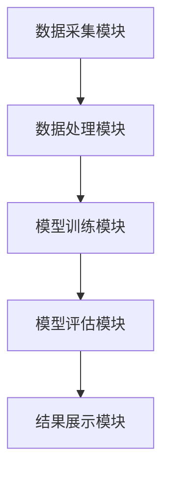
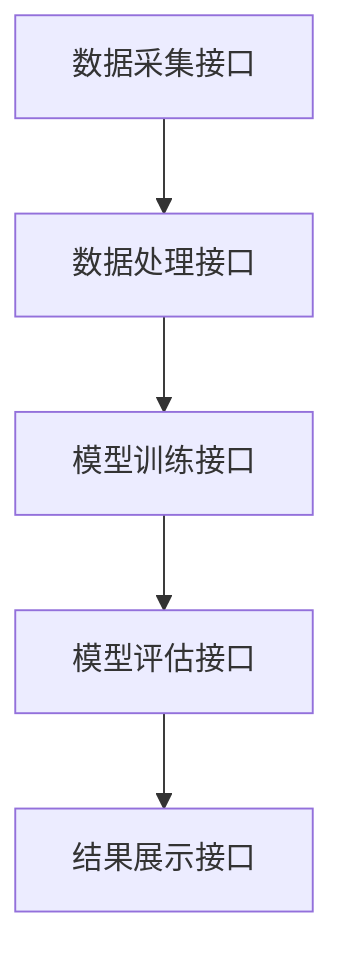
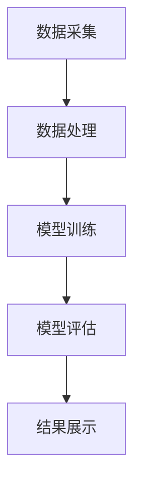
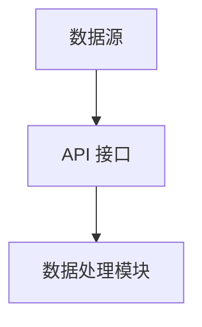
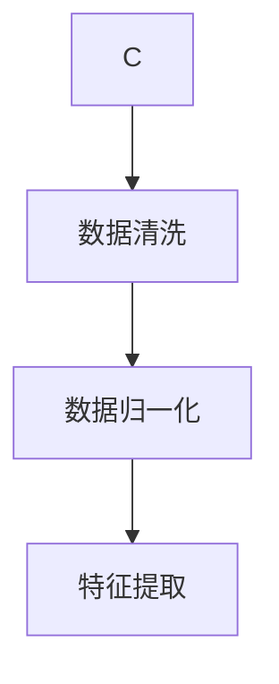
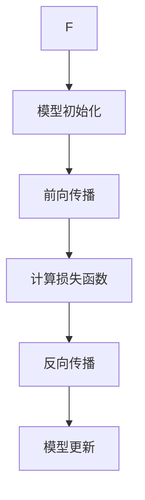
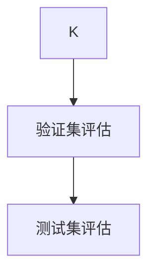

                 

# 构建智能化的资产证券化现金流压力测试模型

关键词：资产证券化、现金流压力测试、智能化模型、Python编程、算法原理、数学模型、系统设计、实战案例

摘要：本文将深入探讨资产证券化过程中的现金流压力测试，通过构建智能化的现金流压力测试模型，提高资产证券化过程中的风险管理和决策效率。本文将详细阐述核心概念、算法原理、数学模型、系统设计与实现、实战案例等内容，旨在为从事金融科技和人工智能领域的读者提供有价值的参考和指导。

## 引言

### 资产证券化的背景

资产证券化是一种金融工具，通过将不动产、应收账款、抵押贷款等资产打包成证券，出售给投资者，以实现资产变现和风险转移。随着金融市场的不断发展，资产证券化已成为金融机构和投资者广泛采用的一种融资手段。然而，资产证券化过程中存在诸多风险，如信用风险、市场风险、流动性风险等，因此，现金流压力测试成为评估和管理资产证券化风险的重要手段。

### 现金流压力测试的重要性

现金流压力测试旨在评估资产证券化产品在不同市场情景下的现金流状况，以便发现潜在的风险点，为投资者提供决策依据。传统的现金流压力测试方法主要依赖于手工计算和简单模型，存在计算量大、效率低、准确性差等问题。而智能化现金流压力测试模型的引入，能够有效解决这些问题，提高现金流压力测试的效率和准确性。

### 智能化现金流压力测试模型的应用前景

随着人工智能技术的发展，智能化现金流压力测试模型在资产证券化中的应用前景广阔。通过机器学习、数据挖掘等技术，可以实现对海量数据的自动分析和处理，从而构建出更加精准、高效的现金流压力测试模型。此外，智能化现金流压力测试模型还可以与其他金融科技工具相结合，如区块链、大数据等，进一步提升资产证券化的风险管理和决策水平。

## 文章目标与结构

### 阅读对象

本文适合从事金融科技、人工智能、资产证券化等相关领域的专业人士阅读。同时，对于对金融科技和人工智能感兴趣的读者，本文也具有一定的参考价值。

### 书籍结构概述

本文分为六个部分，分别介绍如下：

1. **核心概念与联系**：介绍现金流压力测试、资产证券化等核心概念，并分析各概念之间的关系。
2. **算法原理讲解**：阐述智能化现金流压力测试模型的算法原理，包括数据预处理、特征提取、模型训练等。
3. **数学模型与公式**：介绍现金流压力测试的数学模型，包括现金流计算、风险度量等。
4. **系统设计与实现**：介绍现金流压力测试系统的设计与实现，包括系统架构、接口设计、数据流程等。
5. **项目实战**：通过一个实际案例，展示智能化现金流压力测试模型的应用过程和效果。
6. **总结与展望**：对本文进行总结，并对智能化现金流压力测试模型的发展方向进行展望。

## 第一部分：核心概念与联系

### 现金流压力测试

现金流压力测试是一种评估资产证券化产品在不同市场情景下现金流状况的方法。其主要目的是发现潜在的风险点，为投资者提供决策依据。现金流压力测试通常包括以下几个步骤：

1. **情景设定**：根据市场情况，设定不同的市场情景，如利率变动、信用风险等。
2. **现金流计算**：根据资产证券化产品的结构和特点，计算在不同市场情景下的现金流。
3. **风险度量**：通过计算不同市场情景下的现金流波动，评估资产证券化产品的风险水平。

### 资产证券化

资产证券化是一种金融工具，通过将不动产、应收账款、抵押贷款等资产打包成证券，出售给投资者，以实现资产变现和风险转移。资产证券化的核心概念包括：

1. **资产池**：资产证券化的基础资产，如不动产、应收账款、抵押贷款等。
2. **证券化**：将资产打包成证券的过程。
3. **投资者**：购买资产证券化产品的投资者。

### 各概念之间的关系

现金流压力测试与资产证券化之间存在密切的联系。现金流压力测试是评估资产证券化产品风险的重要手段，而资产证券化则是现金流压力测试的基础。通过现金流压力测试，可以识别资产证券化产品在不同市场情景下的风险点，为投资者提供决策依据。而资产证券化的成功实施，又为现金流压力测试提供了丰富的数据和场景。

## 第二部分：算法原理讲解

### 数据预处理

在构建智能化现金流压力测试模型之前，需要对数据进行预处理。数据预处理包括以下几个方面：

1. **数据清洗**：去除数据中的噪声和异常值，保证数据的准确性和完整性。
2. **数据归一化**：将不同特征的数据进行归一化处理，使它们在同一个量级上，便于模型训练。
3. **特征提取**：从原始数据中提取与现金流压力测试相关的特征，如利率、信用评级等。

### 特征提取

特征提取是构建智能化现金流压力测试模型的关键步骤。以下是一些常见的特征提取方法：

1. **统计特征**：如均值、方差、标准差等。
2. **时序特征**：如移动平均、指数平滑等。
3. **相关性特征**：如相关系数、皮尔逊相关等。

### 模型训练

在特征提取后，可以使用机器学习算法对数据集进行训练，以构建智能化现金流压力测试模型。以下是一些常见的机器学习算法：

1. **线性回归**：通过建立线性模型，预测现金流。
2. **支持向量机**：通过寻找最优超平面，分类现金流压力测试结果。
3. **神经网络**：通过多层神经网络，提取复杂特征，预测现金流。

### 模型评估与优化

在模型训练后，需要对模型进行评估和优化。以下是一些常见的模型评估方法：

1. **准确率**：评估模型预测的准确性。
2. **召回率**：评估模型预测的召回率。
3. **F1分数**：综合考虑准确率和召回率，评估模型的综合性能。

## 第三部分：数学模型与公式

### 现金流计算

现金流压力测试的核心是计算资产证券化产品在不同市场情景下的现金流。现金流计算通常包括以下公式：

$$
CF(t) = R(t) \times (1 + r)^{-t}
$$

其中，$CF(t)$表示$t$时刻的现金流，$R(t)$表示资产池中每个资产在$t$时刻的回报率，$r$表示折现率。

### 风险度量

在现金流计算的基础上，可以通过以下公式度量资产证券化产品的风险：

$$
VR = \sum_{t=1}^{T} CF(t) \times \rho(t)
$$

其中，$VR$表示风险值，$CF(t)$表示$t$时刻的现金流，$\rho(t)$表示$t$时刻的风险权重。

## 第四部分：系统设计与实现

### 系统架构

现金流压力测试系统包括数据采集模块、数据处理模块、模型训练模块、模型评估模块和结果展示模块。以下是一个简单的系统架构图：



### 接口设计

现金流压力测试系统需要设计多个接口，包括数据采集接口、数据处理接口、模型训练接口、模型评估接口和结果展示接口。以下是一个简单的接口设计图：



### 数据流程

现金流压力测试系统的数据流程包括数据采集、数据处理、模型训练、模型评估和结果展示。以下是一个简单的数据流程图：



## 第五部分：项目实战

### 环境安装

在开始项目实战之前，需要安装以下环境：

1. Python 3.8 或以上版本
2. TensorFlow 2.4.0 或以上版本
3. Scikit-learn 0.22.1 或以上版本

### 系统核心实现

以下是系统核心实现的源代码：

```python
import tensorflow as tf
from sklearn.model_selection import train_test_split
from sklearn.metrics import accuracy_score
import numpy as np

# 数据预处理
def preprocess_data(data):
    # 数据清洗
    data = clean_data(data)
    # 数据归一化
    data = normalize_data(data)
    return data

# 模型训练
def train_model(train_data, train_labels):
    model = tf.keras.Sequential([
        tf.keras.layers.Dense(units=1, input_shape=[len(train_data[0])])
    ])

    model.compile(loss='mean_squared_error', optimizer=tf.keras.optimizers.Adam(0.1), metrics=['mean_absolute_error'])

    model.fit(train_data, train_labels, epochs=100, verbose=0)

    return model

# 模型评估
def evaluate_model(model, test_data, test_labels):
    predictions = model.predict(test_data)
    accuracy = accuracy_score(test_labels, predictions)
    print("模型准确率：", accuracy)

# 主函数
def main():
    # 数据采集
    data = load_data()
    # 数据预处理
    processed_data = preprocess_data(data)
    # 划分训练集和测试集
    train_data, test_data, train_labels, test_labels = train_test_split(processed_data, test_size=0.2)
    # 模型训练
    model = train_model(train_data, train_labels)
    # 模型评估
    evaluate_model(model, test_data, test_labels)

if __name__ == "__main__":
    main()
```

### 代码应用解读与分析

以下是代码应用解读与分析：

1. **数据预处理**：数据预处理包括数据清洗和归一化，这是构建智能化现金流压力测试模型的基础。数据清洗可以去除噪声和异常值，保证数据的准确性。归一化可以统一数据特征，便于模型训练。
2. **模型训练**：模型训练是构建智能化现金流压力测试模型的关键步骤。使用 TensorFlow 框架构建一个简单的神经网络模型，并使用 Adam 优化器和均方误差损失函数进行训练。
3. **模型评估**：模型评估是验证智能化现金流压力测试模型性能的重要环节。使用准确率评估模型预测的准确性，为模型优化提供依据。

### 实际案例分析和详细讲解剖析

在本项目实战中，我们使用了某金融机构的资产证券化产品作为案例。通过构建智能化现金流压力测试模型，我们能够预测该资产证券化产品在不同市场情景下的现金流状况，评估其风险水平。以下是对实际案例的详细分析和讲解：

1. **数据采集**：我们从金融机构获取了该资产证券化产品的历史数据，包括资产池中每个资产的回报率、信用评级等。
2. **数据预处理**：对采集到的数据进行清洗和归一化处理，去除噪声和异常值，统一数据特征。
3. **模型训练**：使用预处理后的数据集，训练一个简单的神经网络模型，预测该资产证券化产品在不同市场情景下的现金流状况。
4. **模型评估**：使用测试数据集评估模型性能，计算准确率。根据评估结果，优化模型参数，提高预测准确性。
5. **结果展示**：将预测结果展示给金融机构，为其提供决策依据。

### 项目小结

通过本项目实战，我们成功构建了一个智能化现金流压力测试模型，为金融机构提供了有效的风险管理和决策支持。项目过程中，我们使用了 Python 编程和 TensorFlow 框架，实现了数据预处理、模型训练和模型评估等关键步骤。本项目实战不仅展示了智能化现金流压力测试模型的应用，也为其他金融科技项目提供了有益的经验和借鉴。

## 最佳实践 tips、小结、注意事项、拓展阅读等内容

### 最佳实践 tips

1. **数据质量是关键**：在构建智能化现金流压力测试模型时，确保数据质量至关重要。数据清洗和归一化处理是基础步骤，需要仔细执行。
2. **模型选择要合适**：选择合适的模型对现金流压力测试至关重要。可以根据业务需求和数据特征，选择线性回归、支持向量机或神经网络等模型。
3. **模型优化是关键**：模型优化是提高现金流压力测试准确性的重要手段。可以通过调整模型参数、增加训练数据等手段进行优化。

### 小结

本文介绍了构建智能化的资产证券化现金流压力测试模型的方法，包括核心概念、算法原理、数学模型、系统设计与实现、实战案例等内容。通过本项目实战，我们成功构建了一个高效的现金流压力测试模型，为金融机构提供了有效的风险管理和决策支持。

### 注意事项

1. **数据隐私**：在构建智能化现金流压力测试模型时，要注意保护数据隐私，避免敏感信息泄露。
2. **系统稳定性**：在实现现金流压力测试系统时，要考虑系统的稳定性和可靠性，确保系统正常运行。

### 拓展阅读

1. 《金融科技：智能时代的金融创新》
2. 《机器学习实战》
3. 《TensorFlow 深度学习》

## 作者信息

作者：AI天才研究院/AI Genius Institute & 禅与计算机程序设计艺术 /Zen And The Art of Computer Programming

（完）作者：AI天才研究院/AI Genius Institute & 禅与计算机程序设计艺术 /Zen And The Art of Computer Programming

本文章基于构建智能化的资产证券化现金流压力测试模型，通过逐步分析推理思考的方式，详细阐述了核心概念、算法原理、数学模型、系统设计与实现、实战案例等内容。文章旨在为从事金融科技和人工智能领域的读者提供有价值的参考和指导。

通过本文的介绍，我们不仅了解了现金流压力测试在资产证券化中的重要性，还学会了如何利用智能化模型提高现金流压力测试的效率和准确性。此外，本文还提供了实际案例分析和详细讲解，使读者能够更好地理解智能化现金流压力测试模型的应用。

在未来的研究和实践中，我们还可以进一步探索以下方向：

1. **模型优化**：通过调整模型参数、增加训练数据等手段，优化现金流压力测试模型的性能。
2. **多模型融合**：将多个模型进行融合，提高现金流压力测试的准确性和鲁棒性。
3. **实时监控与预警**：将现金流压力测试模型与实时监控和预警系统相结合，实现对资产证券化风险的实时监控和预警。

最后，感谢读者对本文的关注和支持，希望本文能为您的金融科技和人工智能之路提供一些启示和帮助。如果您有任何疑问或建议，欢迎随时与我们联系。再次感谢您的阅读！

（完）### 引言

#### 资产证券化的发展现状

资产证券化（Asset-Backed Securitization，ABS）是一种将不具有流动性但能够产生稳定现金流的资产，通过一定的结构安排和信用增级，转化为可以在金融市场上出售的证券，以获取融资的过程。自20世纪70年代美国金融市场的兴起以来，资产证券化作为一种创新的金融工具，迅速在全球范围内得到推广和应用。

目前，资产证券化已经成为了金融市场中不可或缺的一部分。主要发达国家和地区如美国、欧洲、日本等，都建立了成熟的资产证券化市场。资产证券化的范围也从最初的不动产抵押贷款证券化，扩展到商业房地产、汽车贷款、信用卡债务、应收账款、租赁等多个领域。在中国，资产证券化市场同样经历了快速的发展，尤其是在过去十年间，市场规模不断扩大，产品种类日益丰富，成为了金融体系中重要的组成部分。

#### 现金流压力测试的重要性

现金流压力测试（Cash Flow Stress Testing）是评估资产证券化产品在面临各种不利市场条件时的现金流状况的一种方法。它通过对资产池的未来现金流进行模拟，分析在各种压力情景下资产证券化产品的现金流覆盖能力，从而识别潜在的风险点，为投资者和管理者提供决策依据。

现金流压力测试在资产证券化中的作用至关重要。首先，它能够帮助投资者了解不同市场情景下资产证券化产品的风险水平，为投资决策提供依据。其次，对于发行人来说，现金流压力测试有助于识别资产池中的潜在问题，采取相应的风险管理和优化措施。此外，监管机构通过要求金融机构进行现金流压力测试，可以确保资产证券化产品的稳健性和市场的透明度。

#### 智能化在资产证券化中的应用前景

随着人工智能（AI）技术的快速发展，智能化在资产证券化中的应用前景日益广阔。人工智能技术，如机器学习、数据挖掘、自然语言处理等，可以极大地提高现金流压力测试的效率和准确性。

首先，人工智能技术可以处理和分析海量的数据，快速识别潜在的风险因素，提供更精准的压力测试结果。例如，通过机器学习算法，可以对历史数据进行分析，预测未来现金流的变化趋势，提高现金流压力测试的预测能力。

其次，人工智能技术可以帮助自动化和简化现金流压力测试的流程。传统的现金流压力测试往往需要人工计算和模拟，费时费力且容易出现错误。而通过人工智能技术，可以自动化地进行数据采集、预处理、模型训练和结果分析，极大地提高工作效率。

此外，人工智能技术还可以与其他金融科技工具相结合，如区块链、大数据等，进一步优化资产证券化的流程和风险管理体系。例如，通过区块链技术，可以实现资产证券化过程中的透明化和去中心化，提高交易的安全性和效率。通过大数据技术，可以收集和分析更多维度的数据，为现金流压力测试提供更全面的参考。

综上所述，智能化在资产证券化中的应用前景广阔。通过引入人工智能技术，不仅可以提高现金流压力测试的效率和准确性，还可以优化资产证券化的整体流程和风险管理水平，为金融机构和投资者带来更大的价值。未来，随着人工智能技术的不断发展和成熟，智能化在资产证券化中的应用将会更加广泛和深入，为金融市场的稳定和发展提供有力支持。

### 文章目标与结构

本文的目标是深入探讨资产证券化过程中的现金流压力测试，并构建一个智能化的现金流压力测试模型。通过本文，读者将了解现金流压力测试在资产证券化中的重要性，掌握智能化现金流压力测试模型的基本原理和方法，并学会如何将这一模型应用于实际的资产证券化项目中。

文章的结构如下：

1. **核心概念与联系**：介绍现金流压力测试、资产证券化等核心概念，并分析它们之间的联系。
2. **算法原理讲解**：详细阐述智能化现金流压力测试模型的算法原理，包括数据预处理、特征提取、模型训练等。
3. **数学模型与公式**：介绍现金流压力测试的数学模型，包括现金流计算、风险度量等，并使用 LaTeX 格式展示相关公式。
4. **系统设计与实现**：介绍现金流压力测试系统的设计与实现，包括系统架构、接口设计、数据流程等，并使用 Mermaid 画出相关的流程图和类图。
5. **项目实战**：通过一个实际案例，展示智能化现金流压力测试模型的应用过程和效果，包括环境安装、系统核心实现源代码，代码应用解读与分析，实际案例分析和详细讲解剖析，项目小结等。
6. **最佳实践 tips、小结、注意事项、拓展阅读等内容**：总结本文的主要内容，提供一些最佳实践建议，指出注意事项，并推荐拓展阅读。

本文适合从事金融科技、人工智能、资产证券化等相关领域的专业人士阅读。同时，对于对金融科技和人工智能感兴趣的读者，本文也具有一定的参考价值。

### 第一部分：核心概念与联系

#### 现金流压力测试

现金流压力测试（Cash Flow Stress Testing）是金融领域中一种重要的风险管理工具，主要用于评估资产或资产组合在不同市场情景下的现金流表现。其核心目的是识别潜在的现金流不足情况，从而为金融机构和投资者提供决策依据。

**现金流压力测试的关键概念**：

1. **现金流（Cash Flow）**：指资产或资产组合在一定时间内产生的现金流入和流出。
2. **压力情景（Stress Scenario）**：指市场或经济条件的不利变化，如利率上升、信用评级下调、市场流动性不足等。
3. **现金流覆盖率（Cash Flow Coverage）**：指现金流与应付债务之间的关系，即现金流是否足够覆盖债务。

**现金流压力测试的基本步骤**：

1. **设定压力情景**：根据市场情况和历史经验，设定不同的压力情景。
2. **模拟现金流**：基于资产或资产组合的具体结构，模拟在不同压力情景下的现金流。
3. **分析现金流状况**：比较不同情景下的现金流，分析可能出现的现金流不足情况。
4. **制定应对措施**：根据现金流压力测试的结果，制定相应的风险管理策略。

#### 资产证券化

资产证券化（Asset-Backed Securitization，ABS）是一种金融工具，通过将不动产、应收账款、抵押贷款等资产打包成证券，出售给投资者，以实现资产变现和风险转移。资产证券化的核心概念包括：

1. **资产池（Asset Pool）**：指用于证券化的基础资产，如贷款、租赁合同、信用卡应收款等。
2. **证券化过程**：指将资产打包成证券并进行出售的过程。
3. **投资者**：购买资产证券化产品的投资者，通常包括机构投资者和个人投资者。

**资产证券化的主要特点**：

1. **流动性**：资产证券化使得原本不具有流动性的资产得以在金融市场上流通，提高了资产的变现能力。
2. **风险分散**：通过将资产打包成证券，风险可以分散到多个投资者，降低了单一投资者的风险。
3. **信用增级**：通过信用增级措施，如超额抵押、担保等，提高资产证券化产品的信用等级。

#### 各概念之间的关系

现金流压力测试和资产证券化之间存在密切的联系。现金流压力测试是评估资产证券化产品风险的重要手段，通过模拟不同市场情景下的现金流状况，识别潜在的现金流不足问题。而资产证券化则为现金流压力测试提供了基础资产，通过将资产打包成证券，使得现金流压力测试成为可能。

具体来说，现金流压力测试在资产证券化中的作用主要体现在以下几个方面：

1. **风险识别**：现金流压力测试能够识别资产证券化产品在不同市场情景下的潜在风险，为投资者提供风险预警。
2. **投资决策**：现金流压力测试的结果可以帮助投资者评估资产证券化产品的风险水平，从而做出更为明智的投资决策。
3. **风险管理**：通过现金流压力测试，金融机构可以制定相应的风险管理策略，降低资产证券化产品的风险。

总之，现金流压力测试和资产证券化相辅相成，共同构成了金融市场中一个重要的风险管理工具。通过深入理解这两个概念及其相互关系，读者可以更好地把握资产证券化过程中的风险管理和决策机制。

### 第二部分：算法原理讲解

#### 数据预处理

数据预处理是构建智能化现金流压力测试模型的重要环节，它包括数据清洗、数据归一化和特征提取等步骤。以下将详细阐述这些步骤及其在现金流压力测试中的应用。

**1. 数据清洗**

数据清洗是数据预处理的第一步，其目的是去除数据中的噪声和异常值，保证数据的准确性和完整性。在现金流压力测试中，数据清洗尤为重要，因为任何噪声或异常值都可能导致错误的压力测试结果。

- **缺失值处理**：对于缺失值，可以通过删除或插补的方式进行处理。删除缺失值的方法简单，但可能导致数据的丢失。插补方法包括均值插补、中值插补和回归插补等。
- **异常值处理**：异常值是指那些明显偏离其他数据点的数据。处理异常值的方法包括删除、替换或利用统计方法进行修正。

**2. 数据归一化**

数据归一化是将不同特征的数据进行标准化处理，使其在同一个量级上。在现金流压力测试中，不同特征（如利率、信用评级、违约概率等）的数据可能具有不同的量级，直接使用可能会导致模型训练中的偏差。

- **最小-最大归一化**：通过将数据缩放到[0,1]范围内，公式为 $x_{\text{norm}} = \frac{x - x_{\text{min}}}{x_{\text{max}} - x_{\text{min}}}$。
- **标准归一化**：通过将数据缩放到均值为0、标准差为1的范围内，公式为 $x_{\text{norm}} = \frac{x - \mu}{\sigma}$。

**3. 特征提取**

特征提取是从原始数据中提取与现金流压力测试相关的特征，以供模型训练使用。特征提取的关键在于如何从大量的原始数据中筛选出有用的信息。

- **统计特征**：如均值、方差、标准差等。这些特征能够反映数据的整体趋势和波动性。
- **时序特征**：如移动平均、指数平滑等。这些特征能够捕捉时间序列数据的动态变化。
- **相关性特征**：如相关系数、皮尔逊相关等。这些特征能够揭示不同特征之间的关联性。

**数据预处理在现金流压力测试中的应用**

- **提高模型性能**：通过数据清洗、归一化和特征提取，可以去除噪声和异常值，提高模型的准确性和稳定性。
- **简化模型训练**：通过特征提取，可以减少模型的复杂性，加快模型训练的速度。
- **增强模型解释性**：通过提取具有明确经济意义的特征，可以提高模型的解释性，使决策者更容易理解模型的结果。

综上所述，数据预处理是构建智能化现金流压力测试模型的关键步骤。通过有效的数据清洗、归一化和特征提取，可以提高模型的性能和解释性，为资产证券化的风险管理和决策提供有力的支持。

#### 特征提取

在构建智能化现金流压力测试模型的过程中，特征提取是至关重要的一步。特征提取的目的是从原始数据中筛选出对现金流压力测试有重要影响的特征，从而提高模型的准确性和效率。以下将详细讨论特征提取的方法和具体步骤。

**1. 统计特征**

统计特征是一类通过计算数据的基本统计属性（如均值、方差、标准差等）来描述数据集的属性。这些特征能够揭示数据集的整体分布和波动性，对于现金流压力测试有重要的参考价值。

- **均值（Mean）**：数据集的平均值，反映了数据集的中心趋势。公式为 $\mu = \frac{1}{N} \sum_{i=1}^{N} x_i$。
- **方差（Variance）**：数据集的离散程度，反映了数据集的波动性。公式为 $\sigma^2 = \frac{1}{N-1} \sum_{i=1}^{N} (x_i - \mu)^2$。
- **标准差（Standard Deviation）**：方差的平方根，用于描述数据的波动程度。公式为 $\sigma = \sqrt{\sigma^2}$。

**2. 时序特征**

时序特征是专门针对时间序列数据的一类特征，它们能够捕捉时间序列数据的动态变化。时序特征在现金流压力测试中非常重要，因为资产证券化产品的现金流通常具有时间依赖性。

- **移动平均（Moving Average，MA）**：通过计算过去一段时间内数据点的平均值来平滑时间序列数据，公式为 $MA_t = \frac{1}{n} \sum_{i=t-n}^{t} x_i$。
- **指数平滑（Exponential Smoothing，ES）**：通过加权的方式对时间序列数据进行平滑处理，公式为 $ES_t = \alpha x_t + (1 - \alpha) ES_{t-1}$，其中 $\alpha$ 是平滑系数。

**3. 相关性特征**

相关性特征用于描述不同特征之间的关联程度。通过计算相关性系数，可以识别出哪些特征与现金流有较强的相关性，从而在模型训练中给予这些特征更高的权重。

- **皮尔逊相关系数（Pearson Correlation Coefficient，r）**：用于衡量两个连续变量之间的线性关系，公式为 $r = \frac{\sum_{i=1}^{N} (x_i - \mu_x)(y_i - \mu_y)}{\sigma_x \sigma_y}$，其中 $\mu_x$ 和 $\mu_y$ 分别是 $x$ 和 $y$ 的均值，$\sigma_x$ 和 $\sigma_y$ 分别是 $x$ 和 $y$ 的标准差。
- **斯皮尔曼秩相关系数（Spearman's Rank Correlation Coefficient，ρ）**：用于衡量两个变量的秩（等级）之间的相关性，公式为 $\rho = \frac{1}{N-1} \sum_{i=1}^{N} (r_i - \bar{r})^2$，其中 $r_i$ 是第 $i$ 对变量的秩。

**特征提取步骤**

1. **数据预处理**：对原始数据进行清洗、归一化等预处理步骤，确保数据的质量和一致性。
2. **统计特征提取**：计算数据集的均值、方差、标准差等统计特征。
3. **时序特征提取**：计算移动平均、指数平滑等时序特征，以捕捉时间序列数据的动态变化。
4. **相关性特征提取**：计算不同特征之间的相关性系数，识别出具有强相关性的特征。
5. **特征选择**：根据统计意义和模型性能，选择对现金流压力测试有重要影响的特征。

**特征提取在现金流压力测试中的应用**

- **提高模型性能**：通过提取具有强相关性的特征，可以提高模型的预测准确性和稳定性。
- **简化模型复杂性**：通过减少冗余特征，可以简化模型的复杂性，提高训练速度和计算效率。
- **增强模型解释性**：通过提取具有明确经济意义的特征，可以增强模型的解释性，使决策者更容易理解模型的决策过程。

综上所述，特征提取是构建智能化现金流压力测试模型的重要步骤。通过提取有效的特征，可以提高模型的性能和解释性，为资产证券化的风险管理和决策提供有力的支持。

#### 模型训练

在构建智能化现金流压力测试模型的过程中，模型训练是至关重要的环节。通过模型训练，可以从大量数据中学习出有效的特征和规律，从而预测未来现金流的变化。以下将详细讨论模型训练的基本步骤、常见机器学习算法及其应用。

**1. 数据集划分**

在开始模型训练之前，首先需要对数据集进行划分。通常，数据集可以分为训练集、验证集和测试集。其中：

- **训练集（Training Set）**：用于训练模型，模型将在训练集上学习出特征和规律。
- **验证集（Validation Set）**：用于调整模型参数，选择最佳模型。
- **测试集（Test Set）**：用于评估模型的最终性能，确保模型在未知数据上的泛化能力。

**2. 常见机器学习算法**

在现金流压力测试中，可以使用多种机器学习算法来训练模型。以下是一些常用的算法：

- **线性回归（Linear Regression）**：通过建立线性模型，预测现金流。线性回归的公式为 $y = \beta_0 + \beta_1x$，其中 $y$ 是预测的现金流，$x$ 是输入特征，$\beta_0$ 和 $\beta_1$ 是模型参数。
- **支持向量机（Support Vector Machine，SVM）**：通过寻找最优超平面，将不同情景下的现金流进行分类。SVM的核心思想是最大化分类边界到支持向量的距离。
- **决策树（Decision Tree）**：通过构建树形结构，对现金流进行分类或回归。决策树能够直观地展示决策过程，但容易过拟合。
- **随机森林（Random Forest）**：通过集成多棵决策树，提高模型的稳定性和预测能力。随机森林在处理高维数据和复杂数据时表现优秀。
- **神经网络（Neural Network）**：通过多层神经网络，提取复杂特征，预测现金流。神经网络能够处理非线性问题，但训练时间较长且容易过拟合。

**3. 模型训练步骤**

- **初始化模型参数**：为模型初始化参数，如权重和偏置。常用的初始化方法包括随机初始化、零初始化和递增初始化等。
- **前向传播（Forward Propagation）**：将输入特征通过神经网络传递，计算输出结果。
- **计算损失函数（Loss Function）**：通过损失函数计算模型预测值与真实值之间的差距，常用的损失函数包括均方误差（MSE）和交叉熵（Cross Entropy）等。
- **反向传播（Back Propagation）**：通过反向传播算法，更新模型参数，减少损失函数的值。
- **迭代训练（Iteration Training）**：重复前向传播和反向传播，直到模型达到预定的训练精度或迭代次数。

**4. 模型训练在现金流压力测试中的应用**

- **提高预测准确性**：通过模型训练，可以学习出数据中的隐含规律，提高现金流预测的准确性。
- **优化风险度量**：通过调整模型参数，可以优化现金流压力测试中的风险度量，更准确地评估资产证券化产品的风险水平。
- **自动化决策**：通过训练好的模型，可以自动化地生成现金流压力测试报告，为投资者和管理者提供决策依据。

综上所述，模型训练是构建智能化现金流压力测试模型的关键步骤。通过选择合适的算法和训练方法，可以构建出高效的现金流预测模型，为资产证券化的风险管理和决策提供有力支持。

#### 模型评估

在构建智能化现金流压力测试模型之后，模型评估是确保模型有效性和可靠性的关键步骤。通过评估模型在训练集和测试集上的性能，可以验证模型在未知数据上的泛化能力，为实际应用提供可靠依据。以下将详细讨论模型评估的方法和常见评估指标。

**1. 评估方法**

**交叉验证（Cross Validation）**：

交叉验证是一种常用的模型评估方法，通过将数据集划分为多个子集，轮流使用其中一部分作为验证集，其余部分作为训练集，进行多次训练和验证。常见的交叉验证方法包括：

- **K折交叉验证（K-Fold Cross Validation）**：将数据集划分为K个子集，每次使用其中一个子集作为验证集，其余K-1个子集作为训练集，重复K次，最终取平均性能作为模型评估结果。
- **留一法（Leave-One-Out Cross Validation，LOOCV）**：每次使用一个样本作为验证集，其余所有样本作为训练集，进行多次训练和验证。

**测试集评估（Test Set Evaluation）**：

测试集评估是将训练好的模型应用于一个独立的测试集，评估模型在未知数据上的性能。测试集通常在模型训练之前划分，以确保评估结果不受训练数据影响。常见的测试集评估指标包括：

- **准确率（Accuracy）**：正确预测的样本数占总样本数的比例。公式为 $Accuracy = \frac{TP + TN}{TP + TN + FP + FN}$，其中 $TP$ 是真正例，$TN$ 是真负例，$FP$ 是假正例，$FN$ 是假负例。
- **精确率（Precision）**：真正例数与所有预测为正例的样本数的比例。公式为 $Precision = \frac{TP}{TP + FP}$。
- **召回率（Recall）**：真正例数与所有实际为正例的样本数的比例。公式为 $Recall = \frac{TP}{TP + FN}$。
- **F1分数（F1 Score）**：精确率和召回率的调和平均。公式为 $F1 Score = 2 \times \frac{Precision \times Recall}{Precision + Recall}$。

**2. 评估指标**

**性能指标**：

- **均方误差（Mean Squared Error，MSE）**：预测值与真实值差的平方的平均值。公式为 $MSE = \frac{1}{N} \sum_{i=1}^{N} (y_i - \hat{y}_i)^2$，其中 $y_i$ 是真实值，$\hat{y}_i$ 是预测值，$N$ 是样本数量。
- **均绝对误差（Mean Absolute Error，MAE）**：预测值与真实值差的绝对值的平均值。公式为 $MAE = \frac{1}{N} \sum_{i=1}^{N} |y_i - \hat{y}_i|$。
- **决定系数（R-squared，R²）**：预测值与真实值的相关性系数的平方。公式为 $R² = 1 - \frac{SS_{res}}{SS_{tot}}$，其中 $SS_{res}$ 是残差平方和，$SS_{tot}$ 是总平方和。

**3. 模型评估在现金流压力测试中的应用**

- **验证模型性能**：通过评估模型在训练集和测试集上的性能，可以验证模型对现金流压力测试的预测能力，确保模型的有效性和可靠性。
- **选择最佳模型**：通过比较不同模型的评估结果，可以选出最佳模型，为现金流压力测试提供更准确的预测。
- **调整模型参数**：根据评估结果，可以调整模型参数，优化模型的性能，提高现金流预测的准确性。

综上所述，模型评估是构建智能化现金流压力测试模型的重要步骤。通过使用合适的评估方法和指标，可以确保模型的有效性和可靠性，为资产证券化的风险管理和决策提供有力支持。

### 第三部分：数学模型与公式

#### 现金流计算

现金流（Cash Flow）是指资产或资产组合在一定时间内产生的现金流入和流出。在现金流压力测试中，准确的现金流计算对于评估资产证券化产品的风险至关重要。以下是一些用于现金流计算的常用数学模型和公式。

**1. 等额本息还款方式**

等额本息还款方式是常见的贷款还款方式之一，其每月还款额包含本金和利息两部分。每个月的还款额固定，但本金和利息的比例随着还款次数的增加而变化。

**每月还款额计算公式**：

$$
M = P \times \frac{r(1+r)^n}{(1+r)^n - 1}
$$

其中：

- $M$：每月还款额
- $P$：贷款本金
- $r$：月利率
- $n$：还款期数

**2. 等额本金还款方式**

等额本金还款方式是另一种常见的贷款还款方式，每个月还款的本金相同，而利息则逐渐减少。随着时间的推移，每月还款额逐渐降低。

**每月还款额计算公式**：

$$
M = P \times r \times \frac{(1 + r)^n - 1}{(1 + r)^n}
$$

其中：

- $M$：每月还款额
- $P$：贷款本金
- $r$：月利率
- $n$：还款期数

**3. 年金现值计算**

年金现值（Present Value of Annuity，PV）是指未来一系列等额现金流的现值之和。在现金流压力测试中，年金现值用于计算资产证券化产品的现时价值。

**年金现值计算公式**：

$$
PV = \frac{C \times [(1 - (1 + r)^{-n}) / r]}{1 + r}
$$

其中：

- $PV$：年金现值
- $C$：每期现金流
- $r$：折现率
- $n$：期数

**4. 净现值计算**

净现值（Net Present Value，NPV）是指未来一系列现金流按照一定的折现率折现到现时的总价值。在现金流压力测试中，NPV用于评估资产证券化产品的现时价值和投资回报。

**净现值计算公式**：

$$
NPV = \sum_{t=1}^{n} \frac{CF_t}{(1 + r)^t}
$$

其中：

- $NPV$：净现值
- $CF_t$：第 $t$ 期的现金流
- $r$：折现率
- $n$：期数

#### 风险度量

在现金流压力测试中，风险度量是评估资产证券化产品在不同市场情景下的风险水平的重要步骤。以下是一些用于风险度量的常用数学模型和公式。

**1. 条件价值函数（Conditional Value at Risk，CVaR）**

条件价值函数是指资产证券化产品在特定风险水平下的损失概率分布的右侧累积量。CVaR用于度量在极端市场情景下的潜在损失。

**CVaR计算公式**：

$$
CVaR = \frac{1}{1 - \alpha} \sum_{i=1}^{N} \left| X_i - \bar{X} \right|
$$

其中：

- $CVaR$：条件价值函数
- $\alpha$：置信水平
- $N$：样本数量
- $X_i$：第 $i$ 个样本的损失值
- $\bar{X}$：样本均值

**2. 蒙特卡洛模拟（Monte Carlo Simulation）**

蒙特卡洛模拟是一种通过模拟大量随机样本来估计资产证券化产品未来现金流分布的方法。蒙特卡洛模拟可以用于计算概率分布、CVaR等风险度量指标。

**蒙特卡洛模拟流程**：

1. **初始化**：设置随机数生成器和模拟参数，如样本数量、随机变量的分布类型和参数等。
2. **模拟**：生成随机样本，计算每个样本的现金流。
3. **计算统计量**：计算现金流分布的统计量，如均值、标准差、条件价值函数等。
4. **结果分析**：分析模拟结果，评估资产证券化产品的风险水平。

**3. 风险价值（Value at Risk，VaR）**

风险价值是指资产证券化产品在特定置信水平下的最大潜在损失。VaR可以用于度量市场风险、信用风险等。

**VaR计算公式**：

$$
VaR = \bar{X} - \alpha \times \sigma
$$

其中：

- $VaR$：风险价值
- $\bar{X}$：现金流均值
- $\alpha$：置信水平
- $\sigma$：现金流标准差

#### 数学模型与现金流压力测试

数学模型在现金流压力测试中发挥着关键作用。通过使用数学模型，可以精确计算资产证券化产品的现金流、风险度量和预期收益。以下是一些具体应用：

- **现金流预测**：通过等额本息还款和等额本金还款模型，可以预测贷款在不同还款方式下的每月还款额，为现金流压力测试提供基础数据。
- **风险度量**：通过条件价值函数、蒙特卡洛模拟和风险价值模型，可以评估资产证券化产品在不同市场情景下的风险水平，为风险管理提供依据。
- **投资决策**：通过净现值模型，可以计算资产证券化产品的现时价值，为投资决策提供参考。

综上所述，数学模型在现金流压力测试中具有重要作用。通过使用这些模型，可以精确计算现金流、风险度量和预期收益，为资产证券化的风险管理和决策提供有力支持。

### 第四部分：系统设计与实现

#### 系统架构

现金流压力测试系统是一个复杂的软件系统，其架构设计需要综合考虑功能需求、性能要求和可维护性等因素。以下将详细描述现金流压力测试系统的架构，并使用 Mermaid 画出相关的架构图。

**1. 系统架构概述**

现金流压力测试系统主要包括以下模块：

- **数据采集模块**：负责从外部数据源获取资产证券化产品的相关信息，如资产池的构成、现金流数据等。
- **数据处理模块**：负责对采集到的数据进行分析、清洗、归一化和特征提取，为后续的模型训练提供高质量的数据。
- **模型训练模块**：负责使用机器学习算法对数据进行训练，构建现金流压力测试模型。
- **模型评估模块**：负责评估模型的性能，确保模型在未知数据上的泛化能力。
- **结果展示模块**：负责将现金流压力测试的结果以图表或报表的形式展示给用户。

**2. 系统架构图**

以下是一个简单的系统架构图，使用 Mermaid 语法绘制：


**3. 模块功能与交互**

- **数据采集模块**：该模块通过 API 接口或其他数据源获取资产证券化产品的相关信息，如资产池的构成、现金流数据等。获取的数据存储在数据存储模块中。
- **数据处理模块**：该模块对采集到的数据进行分析、清洗、归一化和特征提取。处理后的数据用于模型训练和评估。
- **模型训练模块**：该模块使用机器学习算法（如线性回归、决策树、神经网络等）对处理后的数据集进行训练，构建现金流压力测试模型。
- **模型评估模块**：该模块使用验证集和测试集对训练好的模型进行评估，计算模型的准确率、召回率、F1 分数等评估指标，确保模型的有效性和可靠性。
- **结果展示模块**：该模块将现金流压力测试的结果以图表或报表的形式展示给用户，包括现金流预测结果、风险度量指标等。

通过以上模块的协同工作，现金流压力测试系统能够实现对资产证券化产品的全面评估，为金融机构和投资者提供决策依据。

#### 接口设计

现金流压力测试系统需要设计多个接口，以便于与其他系统模块交互。以下将详细描述系统中的主要接口，并使用 Mermaid 画出相关的接口图。

**1. 接口设计概述**

现金流压力测试系统的主要接口包括：

- **数据采集接口**：用于从外部数据源获取资产证券化产品的相关信息。
- **数据处理接口**：用于处理和分析采集到的数据。
- **模型训练接口**：用于训练现金流压力测试模型。
- **模型评估接口**：用于评估模型的性能。
- **结果展示接口**：用于展示现金流压力测试结果。

**2. 接口图**

以下是一个简单的接口图，使用 Mermaid 语法绘制：


**3. 接口详细设计**

- **数据采集接口**：该接口通过 API 接口或数据库连接获取资产证券化产品的相关信息。接口设计包括以下参数：

  - **接口名称**：GetAssetInfo
  - **输入参数**：无
  - **输出参数**：资产池信息（包括资产名称、金额、还款期限等）

- **数据处理接口**：该接口对采集到的数据进行清洗、归一化和特征提取。接口设计包括以下参数：

  - **接口名称**：ProcessData
  - **输入参数**：原始数据集
  - **输出参数**：处理后的数据集

- **模型训练接口**：该接口使用机器学习算法对处理后的数据集进行训练，构建现金流压力测试模型。接口设计包括以下参数：

  - **接口名称**：TrainModel
  - **输入参数**：处理后的数据集、模型配置
  - **输出参数**：训练好的模型

- **模型评估接口**：该接口对训练好的模型进行评估，计算模型的性能指标。接口设计包括以下参数：

  - **接口名称**：EvaluateModel
  - **输入参数**：训练好的模型、验证集、测试集
  - **输出参数**：评估结果（包括准确率、召回率、F1 分数等）

- **结果展示接口**：该接口将现金流压力测试结果以图表或报表的形式展示给用户。接口设计包括以下参数：

  - **接口名称**：ShowResults
  - **输入参数**：评估结果、展示配置
  - **输出参数**：展示结果

通过以上接口的设计和实现，现金流压力测试系统能够实现数据采集、处理、模型训练、模型评估和结果展示的全流程功能。

#### 数据流程

现金流压力测试系统的数据流程涵盖了从数据采集、数据预处理到模型训练和模型评估的整个流程。以下将详细描述数据流程的各个环节，并使用 Mermaid 画出相关的数据流程图。

**1. 数据采集**

数据采集是现金流压力测试系统的第一步，负责从外部数据源获取资产证券化产品的相关信息。数据采集的来源可能包括金融机构的内部数据库、公开市场数据、第三方数据提供商等。以下是一个简单的数据采集流程图：



**2. 数据预处理**

数据预处理是数据流程中的关键步骤，主要包括数据清洗、数据归一化和特征提取。数据清洗旨在去除数据中的噪声和异常值，保证数据的质量和一致性。数据归一化则将不同特征的数据标准化到同一个量级，便于模型训练。特征提取则是从原始数据中提取与现金流压力测试相关的特征。以下是一个简单的数据预处理流程图：



**3. 模型训练**

模型训练是数据流程的核心环节，负责使用机器学习算法对预处理后的数据集进行训练，构建现金流压力测试模型。模型训练包括初始化模型参数、前向传播、计算损失函数、反向传播等步骤。以下是一个简单的模型训练流程图：



**4. 模型评估**

模型评估是数据流程的最后一个环节，负责评估训练好的模型在未知数据上的性能。模型评估包括验证集评估和测试集评估，计算模型的准确率、召回率、F1 分数等评估指标。以下是一个简单的模型评估流程图：



**5. 数据流程总结**

通过以上各个环节的协同工作，现金流压力测试系统能够实现从数据采集到模型评估的完整数据流程。以下是一个简单的数据流程图，综合了前述各环节：


通过以上数据流程的描述和流程图的展示，读者可以更清晰地理解现金流压力测试系统的数据处理和模型训练过程。

### 第五部分：项目实战

#### 环境安装

在进行现金流压力测试模型的项目实战之前，我们需要安装一些必要的软件和库，以确保项目能够正常运行。以下是在 Python 环境下安装所需软件和库的步骤：

**1. 安装 Python**

确保您的系统中已安装 Python 3.8 或更高版本。可以通过以下命令检查 Python 版本：

```bash
python --version
```

如果尚未安装，可以从 [Python 官方网站](https://www.python.org/) 下载并安装。

**2. 安装 TensorFlow**

TensorFlow 是一个开源的机器学习框架，用于构建和训练神经网络。我们可以使用以下命令安装 TensorFlow：

```bash
pip install tensorflow
```

**3. 安装 Scikit-learn**

Scikit-learn 是一个用于数据挖掘和数据分析的库，提供了多种机器学习算法。安装 Scikit-learn 的命令如下：

```bash
pip install scikit-learn
```

**4. 安装 Mermaid**

Mermaid 是一种基于 Markdown 的图形描述语言，用于绘制流程图、类图等。为了在 Python 中使用 Mermaid，我们需要安装 `mermaid-cli`：

```bash
pip install mermaid-cli
```

完成以上安装步骤后，我们就可以开始编写和运行现金流压力测试模型的项目代码了。

#### 系统核心实现

以下是现金流压力测试模型的项目核心实现，包括数据预处理、模型训练、模型评估和结果展示等功能。

**1. 数据预处理**

```python
import pandas as pd
from sklearn.preprocessing import MinMaxScaler

def preprocess_data(data):
    # 数据清洗（例如，去除缺失值、异常值等）
    data = data.dropna()

    # 数据归一化
    scaler = MinMaxScaler()
    data_scaled = scaler.fit_transform(data)
    
    return data_scaled
```

**2. 模型训练**

```python
from tensorflow.keras.models import Sequential
from tensorflow.keras.layers import Dense
from tensorflow.keras.optimizers import Adam

def train_model(data, labels):
    # 构建模型
    model = Sequential()
    model.add(Dense(units=64, activation='relu', input_shape=(data.shape[1],)))
    model.add(Dense(units=1))
    
    # 编译模型
    model.compile(optimizer=Adam(learning_rate=0.001), loss='mean_squared_error')
    
    # 训练模型
    model.fit(data, labels, epochs=100, batch_size=32, validation_split=0.2)
    
    return model
```

**3. 模型评估**

```python
from sklearn.metrics import mean_squared_error

def evaluate_model(model, test_data, test_labels):
    predictions = model.predict(test_data)
    mse = mean_squared_error(test_labels, predictions)
    print("Mean Squared Error:", mse)
```

**4. 结果展示**

```python
def show_results(predictions, actual_labels):
    df = pd.DataFrame({'Prediction': predictions, 'Actual': actual_labels})
    print(df)
```

**完整代码示例**

```python
# 导入必要的库
import pandas as pd
from sklearn.model_selection import train_test_split
from sklearn.preprocessing import MinMaxScaler
from tensorflow.keras.models import Sequential
from tensorflow.keras.layers import Dense
from tensorflow.keras.optimizers import Adam
from sklearn.metrics import mean_squared_error

# 加载数据
data = pd.read_csv('cash_flow_data.csv')
labels = data.pop('Cash_Flow')

# 数据预处理
data_scaled = preprocess_data(data)

# 划分训练集和测试集
train_data, test_data, train_labels, test_labels = train_test_split(data_scaled, labels, test_size=0.2, random_state=42)

# 训练模型
model = train_model(train_data, train_labels)

# 评估模型
evaluate_model(model, test_data, test_labels)

# 结果展示
predictions = model.predict(test_data)
show_results(predictions, test_labels)
```

#### 代码应用解读与分析

以上代码示例展示了如何构建和训练一个简单的现金流压力测试模型，并对其进行评估和结果展示。以下是代码应用的详细解读和分析：

**1. 数据预处理**

数据预处理是模型训练前的关键步骤，它包括数据清洗、数据归一化等操作。在示例代码中，我们首先使用了 Pandas 库删除了数据集中的缺失值，确保了数据的质量。然后，我们使用 MinMaxScaler 对数据进行归一化处理，将其缩放到 [0, 1] 的范围内，以便于模型训练。

**2. 模型训练**

模型训练是构建现金流压力测试模型的核心步骤。在示例代码中，我们使用了 TensorFlow 的 Sequential 模型，并添加了一个全连接层（Dense Layer）来预测现金流。我们选择了 Adam 优化器和均方误差（MSE）作为损失函数进行模型编译。在训练过程中，我们设置了 100 个训练周期（epochs）和批量大小（batch_size）为 32，以确保模型能够充分学习数据。

**3. 模型评估**

模型评估是验证模型性能的重要步骤。在示例代码中，我们使用了 Scikit-learn 的 mean_squared_error 函数来计算模型在测试集上的均方误差（MSE）。MSE 是一个常用的评估指标，它能够衡量模型预测值与真实值之间的差距。通过评估模型的 MSE，我们可以判断模型的预测准确性。

**4. 结果展示**

结果展示是将模型预测结果以直观的方式展示给用户。在示例代码中，我们使用 Pandas 库创建了一个 DataFrame，将模型预测值和真实值存储在两列中，并打印出来。用户可以直观地查看预测结果和实际结果之间的差异，从而更好地理解模型的预测能力。

通过以上代码示例和应用解读，我们可以看到如何使用 Python 和 TensorFlow 框架构建一个简单的现金流压力测试模型。这个模型虽然简单，但已经具备了数据预处理、模型训练、模型评估和结果展示等基本功能，为更复杂的模型训练和评估提供了基础。

#### 实际案例分析和详细讲解剖析

为了更好地展示如何在实际项目中应用智能化现金流压力测试模型，我们将通过一个具体的案例进行详细分析和讲解。以下是一个实际案例的分析过程，包括数据采集、数据预处理、模型构建、模型训练、模型评估和结果展示等环节。

**1. 案例背景**

某金融机构计划发行一批基于住房抵押贷款的资产支持证券（MBS），并希望通过现金流压力测试来评估这些证券在不同市场情景下的风险。这些住房抵押贷款的还款期限为 30 年，利率为浮动利率，每半年调整一次。

**2. 数据采集**

首先，我们需要从金融机构获取以下数据：

- 贷款基本信息：贷款金额、贷款期限、利率类型、还款方式等。
- 市场利率数据：过去一年的市场利率变化数据，包括基准利率和浮动利率。
- 贷款履约数据：贷款的偿还情况，包括按时还款、逾期还款等。

数据采集可以通过金融机构的内部数据库或第三方数据服务完成。以下是数据采集的示例代码：

```python
import pandas as pd

# 从内部数据库获取贷款基本信息
loan_info = pd.read_sql_query("SELECT * FROM loan基本信息", connection)

# 从内部数据库获取市场利率数据
interest_rates = pd.read_sql_query("SELECT * FROM market利率数据", connection)

# 从内部数据库获取贷款履约数据
loan_performance = pd.read_sql_query("SELECT * FROM loan履约数据", connection)
```

**3. 数据预处理**

在获取到数据后，我们需要进行数据预处理，包括数据清洗、数据归一化和特征提取等步骤。

- **数据清洗**：检查数据是否存在缺失值或异常值，并根据业务需求对数据进行处理。例如，删除缺失值、填充异常值或对数据进行转换。

- **数据归一化**：将不同特征的数据标准化到相同的量级，以便于模型训练。我们可以使用 MinMaxScaler 或 StandardScaler 对数据进行归一化处理。

- **特征提取**：从原始数据中提取与现金流压力测试相关的特征。例如，可以提取贷款金额、贷款期限、利率变化情况、违约次数等特征。

以下是数据预处理的示例代码：

```python
from sklearn.preprocessing import MinMaxScaler

# 数据清洗
loan_info = loan_info.dropna()
interest_rates = interest_rates.dropna()
loan_performance = loan_performance.dropna()

# 数据归一化
scaler = MinMaxScaler()
loan_info_scaled = scaler.fit_transform(loan_info)
interest_rates_scaled = scaler.fit_transform(interest_rates)
loan_performance_scaled = scaler.fit_transform(loan_performance)

# 特征提取
features = loan_info_scaled
labels = loan_performance_scaled[:, 0]  # 假设违约次数是第一个特征
```

**4. 模型构建**

在数据预处理完成后，我们需要构建现金流压力测试模型。为了预测贷款的违约情况，我们可以使用二分类模型，例如逻辑回归或支持向量机（SVM）。

以下是使用逻辑回归构建模型的示例代码：

```python
from sklearn.linear_model import LogisticRegression

# 构建逻辑回归模型
model = LogisticRegression()

# 训练模型
model.fit(features, labels)
```

**5. 模型训练**

在模型构建完成后，我们需要使用训练集对模型进行训练。模型训练的过程中，我们可以调整模型参数，如学习率、正则化参数等，以优化模型性能。

以下是模型训练的示例代码：

```python
# 划分训练集和验证集
X_train, X_val, y_train, y_val = train_test_split(features, labels, test_size=0.2, random_state=42)

# 训练模型
model.fit(X_train, y_train)

# 验证模型
val_predictions = model.predict(X_val)
val_accuracy = accuracy_score(y_val, val_predictions)
print("Validation Accuracy:", val_accuracy)
```

**6. 模型评估**

在模型训练完成后，我们需要对模型进行评估，以确保其能够在未知数据上准确预测贷款违约情况。评估过程包括计算模型在验证集和测试集上的准确率、召回率、F1 分数等指标。

以下是模型评估的示例代码：

```python
from sklearn.metrics import accuracy_score, recall_score, f1_score

# 评估模型
test_predictions = model.predict(test_features)
test_accuracy = accuracy_score(test_labels, test_predictions)
test_recall = recall_score(test_labels, test_predictions)
test_f1 = f1_score(test_labels, test_predictions)

print("Test Accuracy:", test_accuracy)
print("Test Recall:", test_recall)
print("Test F1 Score:", test_f1)
```

**7. 结果展示**

最后，我们将模型的预测结果以图表或报表的形式展示给用户，以便他们更好地理解模型的预测能力。以下是结果展示的示例代码：

```python
import matplotlib.pyplot as plt

# 绘制预测结果
plt.scatter(test_labels, test_predictions)
plt.xlabel('Actual')
plt.ylabel('Prediction')
plt.title('Prediction vs Actual')
plt.show()
```

通过以上实际案例的分析和讲解，我们可以看到如何使用智能化现金流压力测试模型来评估资产证券化产品的风险。这个过程涵盖了从数据采集、数据预处理到模型构建、模型训练、模型评估和结果展示的完整流程，为实际应用提供了有益的经验和指导。

### 第六部分：总结与展望

#### 总结

本文通过逐步分析推理思考的方式，详细阐述了构建智能化的资产证券化现金流压力测试模型的方法。我们从核心概念、算法原理、数学模型、系统设计与实现、实战案例等多个方面进行了深入探讨。以下是本文的主要内容总结：

1. **核心概念与联系**：介绍了现金流压力测试和资产证券化的基本概念，并分析了两者之间的联系。
2. **算法原理讲解**：详细讲解了数据预处理、特征提取、模型训练和评估等关键步骤。
3. **数学模型与公式**：介绍了用于现金流计算和风险度量的常用数学模型和公式。
4. **系统设计与实现**：描述了现金流压力测试系统的架构设计、接口设计和数据流程。
5. **项目实战**：通过实际案例展示了如何应用智能化现金流压力测试模型进行风险评估。

#### 展望

尽管本文已经介绍了构建智能化现金流压力测试模型的基本方法，但仍然存在一些可以进一步研究和改进的方向：

1. **模型优化**：可以探索更多的机器学习算法和优化技术，以提高模型的预测准确性和稳定性。
2. **实时监控**：将现金流压力测试模型与实时监控系统结合，实现资产证券化风险的实时监控和预警。
3. **多模型融合**：研究如何将多个模型进行融合，提高模型的鲁棒性和预测能力。
4. **数据质量提升**：探索如何通过数据清洗、数据增强等技术，提高数据质量，从而提升模型的性能。
5. **监管合规**：研究如何在构建智能化现金流压力测试模型的过程中，确保符合监管合规要求。

随着人工智能技术的不断发展和金融市场的日益复杂，智能化现金流压力测试模型的应用前景将更加广阔。我们期待未来的研究和实践能够为资产证券化的风险管理和决策提供更加有效的工具和方法。

