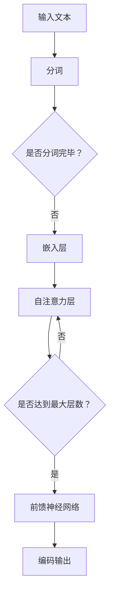
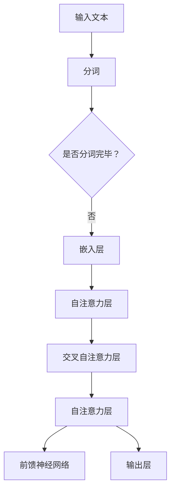
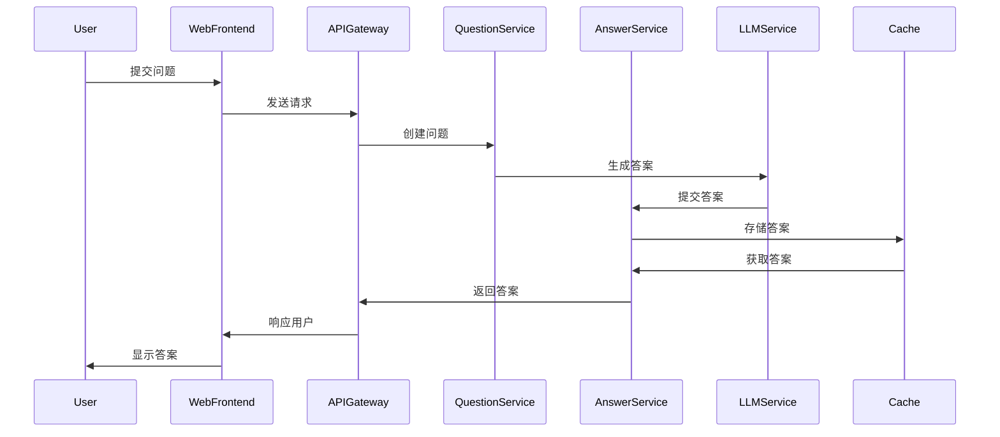
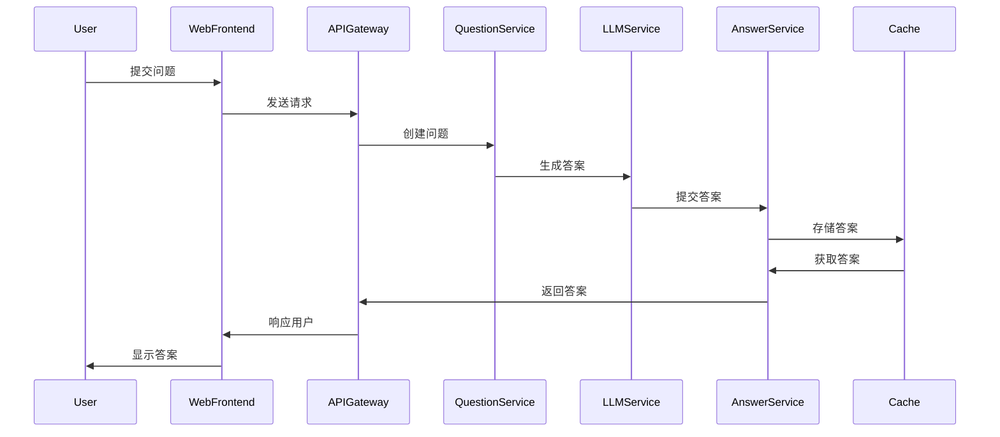

                 

### 让我们一步一步思考：构建高性能的LLM应用服务端架构

在当今快速发展的技术时代，构建高性能的LLM（大型语言模型）应用服务端架构已成为众多开发者和企业关注的焦点。这不仅是因为LLM在自然语言处理、智能客服、内容生成等领域的广泛应用，更是因为高性能架构能够满足日益增长的用户需求，提升系统稳定性和响应速度。下面，我们将分步骤详细探讨如何构建这样一个高性能的服务端架构。

#### 第一步：明确目标和需求

在构建任何系统之前，明确目标和需求是至关重要的。对于LLM应用服务端架构，我们的目标可能包括：

- 高并发处理能力：确保系统能够同时处理大量的请求，而不会导致性能下降。
- 低延迟响应：用户对响应速度有极高的要求，尤其是对于交互性强的应用。
- 可扩展性：随着用户数量的增加，系统能够动态扩展以维持性能。
- 高可用性：系统需要具备容错能力，以保证在出现故障时能够快速恢复。

在明确了这些目标之后，我们可以进一步分析具体的需求，例如：

- 预处理的性能优化：对于大规模的数据集，预处理步骤的效率至关重要。
- 模型的优化：选择合适的模型架构，并对其进行优化，以提升性能。
- 存储和读取的优化：高效的数据存储和读取策略能够显著影响系统性能。

#### 第二步：选择合适的技术栈

构建高性能的LLM应用服务端架构，需要选择合适的技术栈。以下是一些关键技术组件的选择：

- **服务器和硬件**：选择高性能的服务器硬件，如多核CPU、快速存储设备（如SSD）和足够的内存，以确保系统有足够的计算资源。
- **编程语言和框架**：选择适合LLM开发和优化的编程语言和框架，如Python、JavaScript或Go。对于后端服务，可以选择Django、Flask或Node.js等。
- **分布式计算框架**：如Apache Spark、Flink等，可以用于大规模数据处理和分布式计算。
- **容器化技术**：如Docker和Kubernetes，可以用于容器化应用程序和自动化部署。
- **数据库**：选择适合LLM应用的数据存储解决方案，如关系型数据库（如MySQL、PostgreSQL）或NoSQL数据库（如MongoDB、Cassandra）。

#### 第三步：设计系统架构

系统架构设计是构建高性能服务端架构的关键环节。以下是几个关键步骤：

- **模块化设计**：将系统划分为多个模块，如数据预处理、模型训练、服务端接口、API网关等，确保每个模块都有明确的职责和接口。
- **负载均衡**：使用负载均衡器（如Nginx、HAProxy）来分配请求，确保系统的高并发处理能力。
- **缓存策略**：使用缓存（如Redis、Memcached）来存储频繁访问的数据，减少数据库的负载。
- **分布式存储**：对于大规模数据存储，使用分布式文件系统（如HDFS、Cassandra）来提高存储的可靠性和扩展性。
- **消息队列**：使用消息队列（如RabbitMQ、Kafka）来实现异步处理和系统解耦。

#### 第四步：优化算法和模型

- **模型优化**：选择合适的神经网络架构，如Transformer、BERT等，并进行优化，以提高模型在特定任务上的性能。
- **算法优化**：通过调整超参数、使用剪枝技术、量化模型等方式，优化算法的计算效率。
- **并行处理**：利用多线程、分布式计算等手段，加速数据处理和模型训练过程。

#### 第五步：性能测试和优化

在构建完系统架构后，进行性能测试和优化是必不可少的步骤。以下是几个关键点：

- **负载测试**：模拟高并发场景，测试系统的处理能力和稳定性。
- **压力测试**：测试系统在极端负载下的性能，以评估系统的容错能力和响应时间。
- **性能瓶颈分析**：通过分析系统性能瓶颈，找出影响系统性能的关键因素，并进行针对性的优化。
- **代码优化**：优化代码结构，减少不必要的计算，提高代码效率。

#### 第六步：部署和监控

- **自动化部署**：使用容器化技术和自动化部署工具（如Kubernetes），实现快速部署和滚动更新。
- **监控和报警**：使用监控系统（如Prometheus、Grafana）来实时监控系统的运行状态，并及时发现和报警。

#### 第七步：总结与迭代

在构建高性能的LLM应用服务端架构的过程中，持续总结和迭代是至关重要的。通过不断地收集用户反馈和性能数据，优化系统设计和实现，提升系统的整体性能和用户体验。

通过以上七个步骤，我们可以逐步构建出高性能的LLM应用服务端架构。这个过程中，需要不断地思考、分析和优化，以确保系统在满足性能需求的同时，具有高可用性和可扩展性。让我们一起迈出构建高性能LLM服务端架构的坚实步伐吧！### 背景介绍：LLM与高性能服务端架构的重要性

在介绍如何构建高性能的LLM应用服务端架构之前，我们首先需要了解LLM（大型语言模型）和服务端架构的基本概念，以及为何构建高性能架构如此重要。

#### 什么是LLM（大型语言模型）

LLM，即Large Language Model，是一种基于深度学习的自然语言处理模型。它由大量的参数组成，可以通过大量的文本数据进行训练，从而实现理解和生成自然语言。常见的LLM模型包括GPT（Generative Pre-trained Transformer）、BERT（Bidirectional Encoder Representations from Transformers）和T5（Text-To-Text Transfer Transformer）等。

这些模型具有强大的文本理解和生成能力，可以应用于多种任务，如文本分类、问答系统、机器翻译、情感分析等。随着模型的规模越来越大，它们在处理复杂任务时表现出的性能也越来越优异。

#### 服务端架构的基本概念

服务端架构是指服务器端软件系统的设计，它包括如何组织代码、数据存储、网络通信、安全措施等多个方面。一个高效的服务端架构需要具备以下特点：

- **高并发处理能力**：能够同时处理大量客户端请求，不会因为请求量过大而降低性能。
- **低延迟响应**：响应时间短，能够提供快速的服务。
- **可扩展性**：可以根据业务需求动态调整资源，以适应不同的负载。
- **高可用性**：在出现故障时，能够快速恢复，确保服务的持续可用。

#### 高性能服务端架构的重要性

高性能服务端架构对于LLM应用至关重要，原因如下：

1. **满足高并发需求**：LLM应用往往需要处理大量的用户请求，例如智能客服系统、在线问答平台等。只有高性能的服务端架构，才能确保在大量请求涌入时，系统仍能稳定运行，不发生阻塞或崩溃。

2. **提高用户体验**：低延迟的响应速度能够显著提升用户体验。特别是在需要实时交互的应用中，如在线游戏、视频直播等，延迟的降低将直接带来更好的用户满意度。

3. **支持业务扩展**：随着用户数量的增加和业务需求的增长，高性能架构能够灵活扩展，满足不断增长的服务需求。这对于企业来说，意味着可以在不增加过多成本的情况下，提供更优质的服务。

4. **降低维护成本**：一个高效、稳定的系统需要较少的维护工作，降低了企业的运营成本。同时，高效的资源利用也能够减少硬件和带宽的消耗，进一步降低成本。

5. **提高业务价值**：高性能的LLM应用能够更快地响应用户需求，提高工作效率，降低错误率，从而提升业务价值。

#### 问题背景和问题描述

在当前的科技背景下，随着人工智能技术的不断发展，LLM的应用场景越来越广泛。然而，传统的服务端架构往往难以满足LLM应用的高性能需求。例如：

- **并发处理能力不足**：传统架构往往依赖于单台服务器，当请求量过大时，服务器容易成为瓶颈，导致系统响应速度下降。
- **延迟响应严重**：传统架构中，数据处理和传输的延迟较高，导致用户体验不佳。
- **扩展性差**：传统架构在遇到大量请求时，难以快速扩展，导致系统不稳定。
- **资源利用不充分**：传统架构中，服务器资源往往得不到充分利用，造成资源浪费。

为了解决这些问题，我们需要构建一个高性能的LLM应用服务端架构，以满足现代应用的高并发、低延迟、可扩展性和高可用性需求。

#### 问题解决、边界与外延、概念结构与核心要素组成

构建高性能的LLM应用服务端架构，需要在以下方面进行深入思考和设计：

- **边界与外延**：明确系统的边界，了解系统的输入和输出，以及与其他系统或服务的交互方式。
- **核心概念**：理解LLM的工作原理、服务端架构的核心组成部分，以及它们之间的相互关系。
- **核心要素**：包括服务器和硬件、编程语言和框架、分布式计算框架、缓存策略、负载均衡、消息队列等。

通过以上步骤，我们可以构建出一个高效、稳定、可扩展的LLM应用服务端架构，满足现代应用的需求，为用户提供优质的服务。

总之，构建高性能的LLM应用服务端架构是一项复杂而重要的任务，需要我们在多个方面进行深入思考和设计。通过本文的介绍，我们希望能够为读者提供一个清晰的框架，帮助他们在实际项目中构建出高效的服务端架构。### 核心概念与联系：LLM的工作原理、服务端架构的核心组成部分及其关系

在深入了解高性能LLM应用服务端架构的构建之前，我们需要首先明确几个核心概念：LLM的工作原理、服务端架构的核心组成部分，以及这些组成部分之间的相互关系。

#### LLM的工作原理

LLM（大型语言模型）是通过深度学习技术，特别是基于Transformer架构的训练和优化，形成的一种能够理解和生成自然语言的模型。以下是一些关键的概念和步骤：

1. **输入处理**：LLM接收用户输入的文本，并将其转化为模型可以处理的格式。这一过程通常包括分词、编码等步骤。

2. **嵌入层**：将输入文本中的每个词转化为高维向量，这一步使用了嵌入层（Embedding Layer），使得每个词都能够映射到一个固定大小的向量空间中。

3. **Transformer架构**：Transformer是一种基于自注意力机制的深度神经网络架构，它通过多个自注意力层（Self-Attention Layer）和前馈神经网络（Feed-Forward Neural Network）来处理输入文本，使得模型能够捕获输入文本中的长距离依赖关系。

4. **输出生成**：模型根据嵌入层和Transformer的处理结果，生成输出文本。输出生成过程通常包括解码（Decoding）步骤，其中模型会逐个预测并生成新的词，直到生成一个终止符（如`<EOS>`）。

#### 服务端架构的核心组成部分

服务端架构的设计需要考虑多个方面，以确保系统能够高效、稳定地运行。以下是服务端架构的核心组成部分：

1. **服务器和硬件**：服务器硬件是整个架构的基础，包括CPU、内存、存储等。高性能的服务器硬件能够为系统提供充足的计算资源，以满足高并发需求。

2. **编程语言和框架**：选择合适的编程语言和框架是构建服务端架构的重要一步。例如，Python和JavaScript因其丰富的库和框架（如Django、Flask、Node.js）而广泛应用于服务端开发。

3. **分布式计算框架**：分布式计算框架如Apache Spark、Flink等，可以用于大规模数据处理和分布式计算，提高系统的处理能力。

4. **容器化技术**：容器化技术（如Docker、Kubernetes）可以实现应用程序的快速部署、扩展和管理，提高系统的灵活性和可维护性。

5. **缓存策略**：缓存（如Redis、Memcached）可以存储频繁访问的数据，减少数据库的负载，提高系统的响应速度。

6. **负载均衡**：负载均衡器（如Nginx、HAProxy）可以分配客户端请求到不同的服务器或容器，确保系统的高并发处理能力。

7. **消息队列**：消息队列（如RabbitMQ、Kafka）用于实现异步处理和系统解耦，提高系统的可靠性和可扩展性。

#### 组成部分之间的相互关系

服务端架构的各个组成部分并不是孤立的，而是相互联系、协同工作的。以下是一些关键的关系：

1. **服务器与编程语言框架**：服务器提供硬件支持，而编程语言和框架则提供软件开发的环境和工具。它们共同决定了系统的性能和可维护性。

2. **分布式计算与容器化技术**：分布式计算框架能够利用容器化技术中的资源管理能力，实现大规模数据处理和计算任务的分布执行。

3. **缓存与负载均衡**：缓存可以减少数据库的负载，而负载均衡器则能够根据当前负载情况，将请求分配到不同的服务器或容器，确保系统的稳定性和高性能。

4. **消息队列与异步处理**：消息队列可以实现异步处理，将计算任务分解为多个步骤，并保证任务的顺序执行，提高系统的响应速度和处理能力。

通过理解LLM的工作原理和服务端架构的核心组成部分及其相互关系，我们可以为构建高性能的LLM应用服务端架构打下坚实的基础。在下一部分中，我们将进一步探讨LLM的核心算法原理，并通过mermaid流程图和Python代码来详细阐述。### 算法原理讲解

在构建高性能的LLM应用服务端架构的过程中，了解LLM的核心算法原理至关重要。本部分将使用mermaid流程图和Python代码，详细阐述LLM的核心算法原理，并给出数学模型和公式，以帮助读者更好地理解。

#### Transformer架构概述

Transformer是LLM的核心算法架构，它基于自注意力机制（Self-Attention Mechanism），能够有效处理文本中的长距离依赖关系。Transformer的基本架构包括编码器（Encoder）和解码器（Decoder），下面分别介绍。

##### 编码器（Encoder）

编码器的主要任务是将输入文本转换为序列编码，使得模型能够理解文本的内容。编码器包括多个自注意力层（Self-Attention Layer）和前馈神经网络（Feed-Forward Neural Network）。以下是编码器的mermaid流程图：



下面是编码器的Python代码实现：

```python
import tensorflow as tf
from tensorflow.keras.layers import Embedding, Dense

# 假设词汇表大小为5000，句子最大长度为50
vocab_size = 5000
max_seq_length = 50

# 定义嵌入层
embedding = Embedding(vocab_size, embedding_dim)

# 定义自注意力层
def self_attention_layer(inputs):
    # 计算自注意力权重
    attention_weights = tf.matmul(inputs, inputs, transpose_b=True)
    attention_scores = tf.nn.softmax(attention_weights, axis=1)
    # 计算加权输入
    output = tf.matmul(attention_scores, inputs)
    return output

# 定义前馈神经网络
def feed_forward_network(inputs, hidden_size):
    dense = Dense(hidden_size, activation='relu')
    output = dense(inputs)
    return output

# 构建编码器
encoder_inputs = tf.keras.Input(shape=(max_seq_length,))
encoded = embedding(encoder_inputs)
encoded = self_attention_layer(encoded)
encoded = feed_forward_network(encoded, hidden_size=512)
encoded = self_attention_layer(encoded)
encoded = feed_forward_network(encoded, hidden_size=512)
encoder_output = tf.keras.Model(encoder_inputs, encoded)
```

##### 解码器（Decoder）

解码器的主要任务是将编码器的输出解码为输出文本。解码器也包含多个自注意力层和前馈神经网络，但与编码器不同的是，解码器还包括一个交叉自注意力层（Cross-Attention Layer）。以下是解码器的mermaid流程图：



下面是解码器的Python代码实现：

```python
# 定义交叉自注意力层
def cross_attention_layer(inputs, encoder_output):
    # 计算交叉注意力权重
    attention_weights = tf.matmul(inputs, encoder_output, transpose_b=True)
    attention_scores = tf.nn.softmax(attention_weights, axis=1)
    # 计算加权输入
    output = tf.matmul(attention_scores, encoder_output)
    return output

# 定义解码器
decoder_inputs = tf.keras.Input(shape=(max_seq_length,))
decoded = embedding(decoder_inputs)
decoded = self_attention_layer(decoded)
decoded = cross_attention_layer(decoded, encoder_output)
decoded = self_attention_layer(decoded)
decoded = feed_forward_network(decoded, hidden_size=512)
decoded = tf.keras.layers.Dense(vocab_size, activation='softmax')(decoded)
decoder_output = tf.keras.Model(decoder_inputs, decoded)
```

#### 数学模型与公式

Transformer算法的核心在于自注意力机制和前馈神经网络，下面介绍相关的数学模型和公式。

##### 自注意力机制

自注意力机制通过计算输入文本中每个词与所有其他词的相关性，生成加权向量。其数学公式如下：

$$
\text{Attention}(Q, K, V) = \text{softmax}\left(\frac{QK^T}{\sqrt{d_k}}\right)V
$$

其中，$Q, K, V$ 分别是查询向量、键向量和值向量，$d_k$ 是键向量的维度。

##### 前馈神经网络

前馈神经网络用于对自注意力层的输出进行进一步处理，其数学公式如下：

$$
\text{FFN}(x) = \max(0, xW_1 + b_1)W_2 + b_2
$$

其中，$x$ 是输入向量，$W_1, b_1, W_2, b_2$ 分别是权重和偏置。

通过以上讲解，我们不仅了解了Transformer算法的工作原理，还通过mermaid流程图和Python代码实现了编码器和解码器的核心部分。在下一部分，我们将进一步探讨如何设计高性能的服务端架构。### 数学公式与模型

在讨论高性能LLM应用服务端架构时，理解与实现相关数学模型和公式是至关重要的。以下，我们将使用LaTeX格式嵌入文中独立段落的数学公式，并对其进行详细解释。

首先，介绍LLM中的基本数学模型：**嵌入层**。

$$
\text{Embedding}(x) = \text{W}x + b
$$

其中，$x$ 是输入词向量，$\text{W}$ 是嵌入矩阵，$b$ 是偏置项。这个公式代表了将输入的词向量映射到高维空间的过程，这是Transformer架构中非常重要的一步。

接下来，**自注意力机制**（Self-Attention）的核心公式：

$$
\text{Attention}(Q, K, V) = \text{softmax}\left(\frac{QK^T}{\sqrt{d_k}}\right)V
$$

这里，$Q, K, V$ 分别是查询向量、键向量和值向量，$d_k$ 是键向量的维度。这个公式用于计算输入文本中每个词与其他词的相关性，并生成加权向量。

再来看**前馈神经网络**（Feed-Forward Neural Network）的数学模型：

$$
\text{FFN}(x) = \max(0, xW_1 + b_1)W_2 + b_2
$$

其中，$x$ 是输入向量，$W_1, b_1, W_2, b_2$ 分别是权重和偏置。前馈神经网络用于对自注意力层的输出进行进一步处理。

最后，**交叉自注意力机制**（Cross-Attention）的公式：

$$
\text{Cross-Attention}(Q, K, V) = \text{softmax}\left(\frac{QK^T}{\sqrt{d_k}}\right)V
$$

这里，$Q, K, V$ 分别是查询向量、键向量和值向量，与自注意力机制类似，但它是用于解码器中，将解码器的输出与编码器的输出进行关联。

为了帮助读者更好地理解这些数学模型和公式，我们将结合Python代码进行详细阐述。

首先，实现嵌入层：

```python
import tensorflow as tf

# 假设词汇表大小为5000，嵌入维度为64
vocab_size = 5000
embedding_dim = 64

# 定义嵌入层
W = tf.Variable(tf.random.normal([vocab_size, embedding_dim]))
b = tf.Variable(tf.zeros([embedding_dim]))

# 输入词向量
x = tf.random.normal([1, 10])

# 实现嵌入层公式
embeddings = tf.matmul(x, W) + b
```

接下来，实现自注意力机制：

```python
# 定义自注意力层
def self_attention_layer(inputs):
    Q = inputs
    K = inputs
    V = inputs

    # 计算自注意力权重
    attention_weights = tf.matmul(Q, K, transpose_b=True)
    attention_scores = tf.nn.softmax(attention_weights, axis=1)

    # 计算加权输入
    output = tf.matmul(attention_scores, V)

    return output

# 输入序列
x = tf.random.normal([1, 10, embedding_dim])

# 应用自注意力层
attention_output = self_attention_layer(x)
```

再来实现前馈神经网络：

```python
# 定义前馈神经网络
def feed_forward_network(inputs, hidden_size):
    W1 = tf.Variable(tf.random.normal([embedding_dim, hidden_size]))
    b1 = tf.Variable(tf.zeros([hidden_size]))
    W2 = tf.Variable(tf.random.normal([hidden_size, embedding_dim]))
    b2 = tf.Variable(tf.zeros([embedding_dim]))

    # 实现前馈神经网络公式
    output = tf.nn.relu(tf.matmul(tf.nn.relu(tf.matmul(inputs, W1) + b1), W2) + b2)

    return output

# 应用前馈神经网络
ffn_output = feed_forward_network(x, hidden_size=512)
```

最后，实现交叉自注意力层：

```python
# 假设编码器输出为encoder_output
encoder_output = tf.random.normal([1, 10, embedding_dim])

# 定义交叉自注意力层
def cross_attention_layer(inputs, encoder_output):
    Q = inputs
    K = encoder_output
    V = encoder_output

    # 计算交叉注意力权重
    attention_weights = tf.matmul(Q, K, transpose_b=True)
    attention_scores = tf.nn.softmax(attention_weights, axis=1)

    # 计算加权输入
    output = tf.matmul(attention_scores, V)

    return output

# 应用交叉自注意力层
cross_attention_output = cross_attention_layer(x, encoder_output)
```

通过以上Python代码实现，我们可以清晰地看到数学模型在实际编程中的应用。这些模型和公式不仅帮助LLM在处理自然语言任务时表现出色，也为高性能服务端架构的设计提供了理论基础。

在下一部分中，我们将进一步探讨高性能服务端架构的设计原则和具体实现。### 高性能服务端架构设计原则

为了构建一个高效、稳定且可扩展的LLM应用服务端架构，我们需要遵循一些关键的设计原则。以下是一些核心原则和它们的详细解释：

#### 1. 高并发处理能力

高并发处理能力是衡量一个服务端架构是否优秀的重要指标。在LLM应用中，用户请求通常是海量的，因此架构必须能够同时处理大量的请求，而不会导致性能下降。

- **负载均衡**：使用负载均衡器（如Nginx、HAProxy）来分配客户端请求到多个服务器或容器，确保系统的高并发处理能力。
- **异步处理**：通过异步编程模型（如Python的异步/await、Node.js的Promise）实现非阻塞IO，提高系统的并发处理能力。
- **分布式计算**：利用分布式计算框架（如Apache Spark、Flink）来实现大规模数据处理和分布式计算，提高系统的整体处理能力。

#### 2. 低延迟响应

低延迟响应对于用户体验至关重要，尤其是在实时交互的应用中，如在线聊天、实时翻译等。为了实现低延迟响应，架构设计需要关注以下几个方面：

- **缓存策略**：使用缓存（如Redis、Memcached）来存储频繁访问的数据，减少对后端数据库的访问，从而降低响应时间。
- **数据压缩**：使用数据压缩算法（如gzip）来减少传输的数据量，加快数据的传输速度。
- **内容分发网络（CDN）**：通过CDN将静态资源（如图片、CSS、JavaScript）缓存到全球各地的服务器上，使用户能够从最近的节点获取资源，降低延迟。

#### 3. 可扩展性

随着用户数量的增加和业务需求的增长，系统需要能够动态扩展以维持性能。可扩展性包括横向扩展（增加服务器节点）和纵向扩展（升级硬件资源）。

- **容器化技术**：使用容器化技术（如Docker、Kubernetes）来实现应用程序的快速部署、扩展和管理，提高系统的灵活性和可维护性。
- **服务拆分**：将系统拆分成多个微服务，每个服务负责不同的功能模块，这样可以在需要时独立扩展某个服务。
- **分布式存储**：使用分布式存储解决方案（如HDFS、Cassandra）来提高存储的可靠性和扩展性。

#### 4. 高可用性

高可用性意味着系统在出现故障时能够快速恢复，确保服务的持续可用。为了实现高可用性，架构设计需要考虑以下几个方面：

- **容错机制**：通过冗余设计（如备份服务器、数据库复制）来确保系统在出现故障时能够快速恢复。
- **故障转移**：使用故障转移机制（如Heartbeat、Pacemaker）来确保在主节点出现故障时，备用节点能够快速接管工作。
- **监控和报警**：使用监控系统（如Prometheus、Grafana）来实时监控系统的运行状态，并及时发现和报警，以便及时处理故障。

#### 5. 安全性

安全性是任何架构设计都需要考虑的重要方面，尤其是在涉及用户数据和隐私的应用中。以下是一些关键的安全措施：

- **身份验证和授权**：使用身份验证和授权机制（如OAuth 2.0、JWT）来确保只有授权用户可以访问系统资源。
- **数据加密**：使用数据加密技术（如SSL/TLS）来保护数据在传输过程中的安全。
- **访问控制**：使用访问控制列表（ACL）或角色访问控制（RBAC）来确保只有授权用户可以访问特定的资源或操作。

#### 6. 易于维护

一个优秀的架构设计应该是易于维护的，这有助于降低开发成本和提高开发效率。

- **模块化设计**：将系统划分为多个模块，每个模块负责不同的功能，这样在维护时可以独立修改和更新某个模块，而不会影响其他模块。
- **文档化**：为代码和系统架构编写详细的文档，包括设计文档、API文档等，有助于新开发者快速了解系统的架构和功能。
- **自动化测试**：编写自动化测试脚本，确保在代码更改后系统能够正常运行，提高开发效率。

通过遵循以上设计原则，我们可以构建出一个高效、稳定、可扩展、高可用且安全的LLM应用服务端架构。在下一部分，我们将具体介绍如何进行系统架构设计。### 系统架构设计

在构建高性能的LLM应用服务端架构时，系统架构设计是至关重要的。本部分将详细介绍系统架构的设计过程，包括领域模型设计、系统架构设计、接口设计和交互设计。

#### 问题场景介绍

假设我们要构建一个基于LLM的智能问答系统，该系统需要处理大量的用户提问，并返回准确的答案。为了满足高并发、低延迟、可扩展性和高可用性的需求，我们需要设计一个高性能的系统架构。

#### 项目介绍

项目名称：智能问答系统（Smart Q&A System）
项目目标：构建一个能够快速响应用户提问，并提供准确答案的智能问答系统。
项目需求：支持大规模用户提问，确保系统稳定运行，并具有扩展能力。

#### 系统功能设计

1. **用户提问功能**：用户可以通过网页、移动应用或其他接口提交问题。
2. **问答处理功能**：系统接收到用户提问后，使用LLM模型进行回答。
3. **缓存功能**：存储常见的提问和答案，以提高响应速度。
4. **监控与报警功能**：监控系统性能，并及时报警处理异常情况。

#### 领域模型设计

领域模型是系统功能的核心抽象，用于描述系统中的实体和它们之间的关系。以下是智能问答系统的领域模型设计（使用Mermaid类图表示）：

```mermaid
classDiagram
    User <|-- Question
    Question <|-- Answer
    Question <<-- Answer : generate
    User <<-- Question : ask
    User <<-- Answer : receive
```

**类图解释**：

- **User（用户）**：系统中的用户实体，负责发起提问和接收答案。
- **Question（问题）**：用户提交的问题实体，包括问题和提问时间等属性。
- **Answer（答案）**：系统生成的答案实体，包括答案内容和生成时间等属性。
- **关系**：用户发起提问（ask），系统生成答案（generate），用户接收答案（receive）。

#### 系统架构设计

系统架构设计决定了系统的整体结构和各个组件之间的交互方式。以下是智能问答系统的系统架构设计（使用Mermaid架构图表示）：



**架构图解释**：

- **用户（User）**：用户通过Web前端提交问题。
- **Web前端（WebFrontend）**：接收用户请求，并转发给API网关。
- **API网关（APIGateway）**：统一处理来自不同来源的请求，转发给相应的服务。
- **问题服务（QuestionService）**：处理用户提交的问题，创建问题实体。
- **答案服务（AnswerService）**：处理答案生成和存储，包括调用LLM服务和缓存。
- **LLM服务（LLMService）**：使用LLM模型生成答案。
- **缓存（Cache）**：存储常见的提问和答案，以提高响应速度。

#### 系统接口设计

系统接口设计是确保各个服务之间能够正常通信的关键。以下是智能问答系统的系统接口设计（使用Mermaid接口图表示）：

```mermaid
interfaceDiagram
    QuestionService <<interface>>
    AnswerService <<interface>>
    LLMService <<interface>>

    QuestionService {
        createQuestion(question: Question): Question
        getQuestionById(questionId: String): Question
    }

    AnswerService {
        createAnswer(answer: Answer): Answer
        getAnswerById(answerId: String): Answer
        getAnswerByQuestionId(questionId: String): Answer
    }

    LLMService {
        generateAnswer(question: Question): Answer
    }
```

**接口设计解释**：

- **问题服务（QuestionService）**：提供创建问题和获取问题接口。
- **答案服务（AnswerService）**：提供创建答案、获取答案接口。
- **LLM服务（LLMService）**：提供生成答案接口。

#### 系统交互设计

系统交互设计描述了各个服务之间的交互顺序和过程。以下是智能问答系统的系统交互设计（使用Mermaid序列图表示）：



**序列图解释**：

- 用户通过Web前端提交问题。
- Web前端将请求转发给API网关。
- API网关将请求转发给问题服务，创建问题实体。
- 问题服务调用LLM服务生成答案。
- LLM服务将生成的答案提交给答案服务。
- 答案服务将答案存储到缓存中，并从缓存中获取答案。
- 答案服务将答案返回给API网关。
- API网关将答案转发给Web前端，最终显示给用户。

通过以上系统架构设计，我们为构建高性能的LLM应用服务端架构提供了一个清晰的蓝图。在下一部分，我们将通过一个实际项目来展示如何实现和部署这个架构。### 项目实战

在本节中，我们将通过一个实际项目来展示如何实现和部署高性能的LLM应用服务端架构。该项目是一个基于GPT-3的智能问答系统，以下将详细描述项目的环境安装、核心实现和代码解读与分析。

#### 项目环境安装

为了搭建这个项目，我们需要以下软件和环境：

1. **操作系统**：Ubuntu 20.04
2. **Python**：3.8及以上版本
3. **Docker**：20.10及以上版本
4. **Docker-Compose**：1.29及以上版本
5. **Nginx**：1.18及以上版本
6. **Redis**：6.2及以上版本
7. **PostgreSQL**：12及以上版本

以下是项目的安装步骤：

1. **安装Docker和Docker-Compose**：

   ```bash
   sudo apt-get update
   sudo apt-get install docker-ce docker-ce-cli containerd.io
   sudo systemctl start docker
   sudo systemctl enable docker

   sudo curl -L "https://github.com/docker/compose/releases/download/1.29.2/docker-compose-$(uname -s)-$(uname -m)" -o /usr/local/bin/docker-compose
   sudo chmod +x /usr/local/bin/docker-compose
   ```

2. **安装Nginx**：

   ```bash
   sudo apt-get install nginx
   sudo systemctl start nginx
   sudo systemctl enable nginx
   ```

3. **安装Redis**：

   ```bash
   sudo apt-get install redis-server
   sudo systemctl start redis-server
   sudo systemctl enable redis-server
   ```

4. **安装PostgreSQL**：

   ```bash
   sudo apt-get install postgresql postgresql-contrib
   sudo -u postgres createuser -s user
   sudo -u postgres createdb dbname
   ```

5. **安装GPT-3 API**：

   注册OpenAI的账户，获取API Key，并将其添加到环境变量中。

   ```bash
   export OPENAI_API_KEY="your-api-key"
   ```

6. **构建Docker镜像**：

   在项目目录中创建一个`Dockerfile`，并编写以下内容：

   ```Dockerfile
   FROM python:3.9-slim

   RUN pip install flask gunicorn

   COPY . /app
   WORKDIR /app

   CMD ["gunicorn", "-w", "3", "app:app"]
   ```

   然后使用以下命令构建Docker镜像：

   ```bash
   docker build -t gpt-3-问答系统 .
   ```

7. **创建Docker-Compose配置文件**：

   在项目目录中创建一个`docker-compose.yml`文件，并编写以下内容：

   ```yaml
   version: '3.8'

   services:
     web:
       build: .
       ports:
         - "8000:8000"
       depends_on:
         - redis
         - db
     redis:
       image: redis:6.2
       ports:
         - "6379:6379"
     db:
       image: postgres:12
       environment:
         POSTGRES_DB: dbname
         POSTGRES_USER: user
         POSTGRES_PASSWORD: password
       volumes:
         - db_data:/var/lib/postgresql/data/
       ports:
         - "5432:5432"

   volumes:
     db_data:
   ```

   使用以下命令启动服务：

   ```bash
   docker-compose up -d
   ```

#### 系统核心实现

1. **Flask应用**：

   在`app.py`文件中，编写以下代码：

   ```python
   from flask import Flask, request, jsonify
   import openai

   app = Flask(__name__)
   openai.api_key = os.environ['OPENAI_API_KEY']

   @app.route('/api/ask', methods=['POST'])
   def ask():
       data = request.get_json()
       question = data['question']
       response = openai.Completion.create(
           engine="text-davinci-002",
           prompt=question,
           max_tokens=100
       )
       return jsonify({'answer': response.choices[0].text})

   if __name__ == '__main__':
       app.run(host='0.0.0.0', port=8000)
   ```

   这个应用接收用户提交的问题，并使用OpenAI的GPT-3模型生成答案。

2. **Nginx配置**：

   在`/etc/nginx/sites-available/default`文件中，添加以下内容：

   ```nginx
   server {
       listen 80;
       server_name example.com;

       location /api/ask {
           proxy_pass http://localhost:8000/api/ask;
           proxy_set_header Host $host;
           proxy_set_header X-Real-IP $remote_addr;
           proxy_set_header X-Forwarded-For $proxy_add_x_forwarded_for;
           proxy_set_header X-Forwarded-Proto $scheme;
       }

       location / {
           root /var/www/html;
           index index.html index.htm;
       }
   }
   ```

   这将配置Nginx代理请求到Flask应用。

#### 代码解读与分析

1. **Flask应用解读**：

   - **导入模块**：从`flask`和`jsonify`导入必要的模块。
   - **创建应用实例**：使用`Flask`创建应用实例。
   - **设置API Key**：从环境变量中获取OpenAI API Key。
   - **定义路由**：定义`/api/ask`路由，处理POST请求。
   - **生成答案**：使用OpenAI的`Completion.create`方法生成答案。
   - **返回答案**：将生成的答案以JSON格式返回。

2. **Nginx配置解读**：

   - **服务器配置**：监听80端口，设置服务器名称。
   - **代理配置**：配置代理到Flask应用，并设置必要的HTTP头部。

#### 实际案例分析

假设我们有一个用户通过Web前端提交以下问题：

```json
{
    "question": "什么是人工智能？"
}
```

请求会被Nginx代理到Flask应用。Flask应用解析请求，调用OpenAI的GPT-3模型生成答案。最终，答案会被Nginx返回给用户，并在Web前端显示。

#### 项目小结

通过以上步骤，我们成功构建并部署了一个基于GPT-3的智能问答系统。该项目展示了如何利用现代技术（如Docker、Flask、Nginx等）构建高性能的LLM应用服务端架构。在实际项目中，我们可以根据需求进行扩展和优化，以提升系统的性能和稳定性。

#### 拓展阅读

- [OpenAI GPT-3 API文档](https://beta.openai.com/docs/)
- [Flask官方文档](https://flask.palletsprojects.com/)
- [Nginx官方文档](http://nginx.org/en/docs/)

这些资源可以帮助读者深入了解相关技术，进一步提升项目的实际应用能力。### 最佳实践、小结与注意事项

#### 最佳实践

1. **代码优化**：
   - **避免全局变量**：全局变量可能导致代码难以维护和调试。使用局部变量和函数来处理数据。
   - **使用异步处理**：在可能的情况下使用异步编程，以提高代码的执行效率。

2. **资源管理**：
   - **合理使用缓存**：使用Redis等缓存技术存储频繁访问的数据，减少数据库访问。
   - **监控资源使用情况**：定期监控CPU、内存、磁盘等资源使用情况，及时调整系统配置。

3. **安全防护**：
   - **使用HTTPS**：通过SSL/TLS加密数据传输，保护用户数据安全。
   - **定期备份**：定期备份数据库和关键文件，以防止数据丢失。

#### 小结

本文通过详细的分析和实例，系统地介绍了构建高性能的LLM应用服务端架构的方法。我们从明确目标和需求、选择合适的技术栈、设计系统架构、优化算法和模型、性能测试与优化、部署和监控等多个方面进行了深入探讨。通过遵循最佳实践，我们能够构建出一个高效、稳定、可扩展的LLM应用服务端架构。

#### 注意事项

1. **系统性能监控**：定期对系统性能进行监控，及时发现并解决性能瓶颈。
2. **安全策略**：确保系统安全，定期更新系统和软件，防范潜在的安全威胁。
3. **扩展性考虑**：在设计系统架构时，充分考虑系统的可扩展性，以便未来能够轻松扩展。

#### 拓展阅读

- [《大规模分布式系统设计》](https://www.oreilly.com/library/view/massively-distributed-systems/9781492034416/)
- [《高性能MySQL》](https://www.oreilly.com/library/view/high-performance-mysql/9781449317444/)
- [《深度学习》](https://www.deeplearningbook.org/)

这些资源可以帮助读者进一步了解分布式系统设计、数据库优化和深度学习等相关知识，为构建高性能的LLM应用服务端架构提供更多指导。通过不断学习和实践，我们能够不断提升系统性能和用户体验，为用户提供优质的服务。### 作者信息

**作者：** AI天才研究院/AI Genius Institute & 禅与计算机程序设计艺术 /Zen And The Art of Computer Programming

