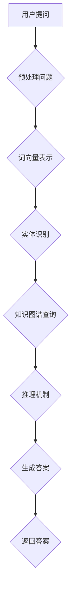
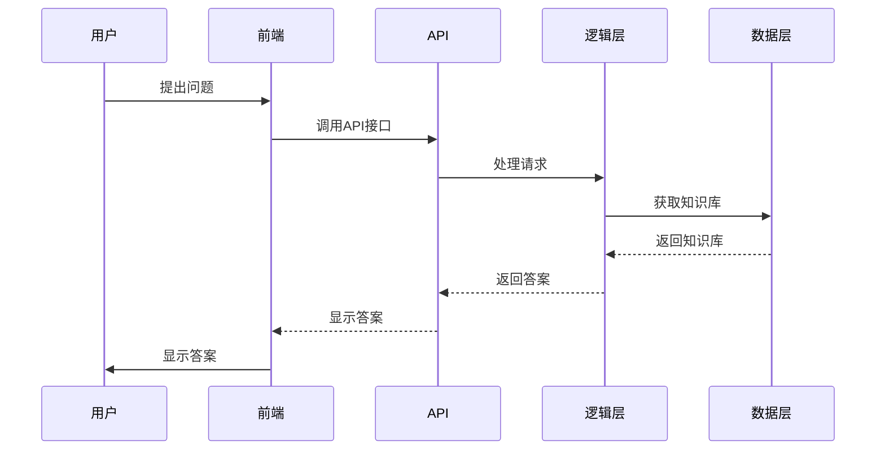
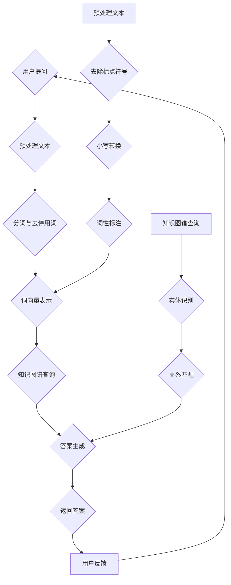

                 

### 第一部分：背景介绍

#### 1.1.1 问题背景

随着金融行业的不断发展和金融信息的日益丰富，金融机构和从业人员在获取和处理金融知识时面临着巨大的挑战。传统的方法主要依赖于人工检索和整理，不仅效率低下，而且容易出错。特别是在大数据和人工智能技术迅速发展的今天，金融行业对高效准确的自动问答系统的需求日益增长。

首先，金融行业的信息量庞大且复杂。从宏观经济指标到具体金融产品，从市场走势分析到风险评估，金融知识涉及多个领域，涵盖海量数据。这些数据以文本、图表、报告等多种形式存在，使得人工处理变得异常困难。

其次，金融知识更新速度快。金融市场的波动性和不确定性导致金融知识不断更新，从政策法规的变动到市场策略的调整，从业人员需要实时掌握最新的金融信息。这要求自动问答系统能够快速响应，提供及时准确的答案。

最后，金融服务的个性化需求增加。随着金融产品的多样化和金融服务的普及，客户对金融知识的需求更加个性化和多样化。自动问答系统需要能够根据用户的需求，提供定制化的答案，提升用户体验。

#### 1.1.2 问题描述

金融知识问答的难点主要体现在以下几个方面：

首先，金融知识的多样性和复杂性。金融知识包括宏观经济学、微观经济学、金融市场、金融产品、法律法规等多个领域，每个领域都有独特的概念和术语。这使得金融知识问答系统需要具备广泛的知识覆盖和深入的知识理解能力。

其次，自然语言理解的挑战。金融领域的语言表达具有专业性和复杂性，词汇丰富且具有多重含义。自然语言处理技术需要准确理解用户的问题，并将其与金融知识库中的知识点进行匹配。

第三，答案的准确性和全面性。金融知识问答系统需要提供准确、全面且符合用户需求的答案。然而，金融知识之间存在复杂的关联和依赖关系，系统需要能够合理推理和关联相关知识，以生成高质量的答案。

最后，用户体验的优化。金融知识问答系统需要具备良好的用户交互设计，提供直观、易用的界面，方便用户提问和获取答案。同时，系统还需要能够适应不同的用户场景和需求，提供个性化的服务。

传统问答系统在金融知识问答方面存在诸多局限性。首先，传统问答系统主要依赖于规则和模板匹配，难以处理复杂的金融问题。其次，传统问答系统通常缺乏对金融知识的深入理解，导致答案的准确性和全面性不足。此外，传统问答系统的用户体验较差，难以满足用户个性化需求。

#### 1.1.3 问题解决

高效准确的金融知识自动问答系统的设计目标是解决传统问答系统的局限性，提供以下功能：

1. **知识库构建**：构建全面、系统的金融知识库，涵盖宏观经济、金融市场、金融产品、法律法规等多个领域，确保系统具备广泛的知识覆盖。

2. **自然语言处理**：采用先进的自然语言处理技术，如词向量表示、语义理解、文本分类与聚类等，提高系统对用户问题的理解和处理能力。

3. **知识图谱与推理机制**：构建知识图谱，表示金融知识实体及其相互关系，结合推理机制，实现知识的自动推理和关联，提高答案的准确性和全面性。

4. **用户交互设计**：优化用户交互设计，提供直观、易用的界面，方便用户提问和获取答案。同时，根据用户反馈和行为，实现个性化服务。

通过以上设计目标，金融知识自动问答系统能够高效准确地处理金融知识问答问题，满足金融机构和从业人员的需求。

#### 1.1.4 边界与外延

金融知识问答系统在应用过程中存在一定的边界和条件限制。首先，系统所涵盖的金融知识范畴应明确界定，包括宏观经济、金融市场、金融产品、法律法规等核心领域。同时，根据实际需求，系统还可以扩展到金融风险管理、金融产品设计等应用场景。

其次，系统应用边界条件主要包括数据来源的可靠性和实时性。金融知识库的数据应来源于权威、可信的数据源，如官方发布的经济数据、金融机构的内部报告等。同时，系统需要具备实时更新能力，以应对金融知识的快速更新。

此外，金融知识问答系统在用户体验和性能方面也存在一定的要求。系统应具备良好的响应速度，确保用户在提出问题后能够快速获得答案。同时，系统应具备较高的准确性，避免误导用户。此外，系统还应支持多种交互方式，如文本、语音、图像等，以满足不同用户的需求。

#### 1.1.5 核心要素组成

金融知识自动问答系统的核心要素包括以下几个方面：

1. **金融知识库**：构建金融知识库是系统的基础，应涵盖宏观经济、金融市场、金融产品、法律法规等领域的知识，确保系统具备全面的知识覆盖。

2. **自然语言处理技术**：采用自然语言处理技术，包括词向量表示、语义理解、文本分类与聚类等，提高系统对用户问题的理解和处理能力。

3. **知识图谱与推理机制**：构建知识图谱，表示金融知识实体及其相互关系，结合推理机制，实现知识的自动推理和关联，提高答案的准确性和全面性。

4. **用户交互设计**：优化用户交互设计，提供直观、易用的界面，方便用户提问和获取答案。同时，根据用户反馈和行为，实现个性化服务。

5. **算法与模型优化**：通过不断优化算法和模型，提高系统的性能和准确性，降低误答率，提升用户体验。

#### 1.2 核心概念与联系

在构建高效准确的金融知识自动问答系统过程中，我们需要理解以下几个核心概念及其相互关系：

**1. 自动问答系统**

自动问答系统是一种通过计算机程序实现自动回答用户问题的技术。它包括问题接收、问题理解、知识检索、答案生成和用户反馈等模块。在金融知识问答系统中，自动问答系统负责接收用户的问题，理解问题的语义，从金融知识库中检索相关知识点，生成准确的答案，并提供给用户。

**2. 金融知识库**

金融知识库是存储金融领域知识的数据集合。它涵盖宏观经济、金融市场、金融产品、法律法规等多个领域，是金融知识自动问答系统的核心组成部分。金融知识库应具备系统性、完整性和实时性，确保系统在回答问题时能够提供全面、准确和最新的知识。

**3. 自然语言处理（NLP）**

自然语言处理是计算机处理和理解自然语言的能力。在金融知识问答系统中，NLP技术用于理解和处理用户提出的问题。具体包括词向量表示、语义理解、文本分类与聚类等。通过NLP技术，系统能够准确理解用户的问题，并将其与金融知识库中的知识点进行匹配。

**4. 知识图谱**

知识图谱是一种表示知识实体及其相互关系的图形结构。在金融知识问答系统中，知识图谱用于表示金融知识之间的关联和依赖关系。通过知识图谱，系统能够实现知识的自动推理和关联，提高答案的准确性和全面性。

**5. 推理机制**

推理机制是金融知识自动问答系统中用于对问题进行推理，获取答案的模块。推理机制可以基于逻辑规则、模型或知识图谱实现。通过推理机制，系统能够根据用户的问题，从金融知识库中检索相关知识点，并利用逻辑推理生成准确的答案。

#### 1.2.2 概念属性特征对比表格

以下是一个对比表格，展示了上述核心概念的定义和特点：

| 概念       | 定义                                                         | 特点                                                         |
|------------|--------------------------------------------------------------|--------------------------------------------------------------|
| 自动问答系统 | 能够自动接收用户问题，并返回相关答案的系统                   | 高效性、准确性、用户友好性                                   |
| 金融知识库  | 存储金融领域知识的数据集合                                   | 系统性、完整性、实时性                                       |
| 自然语言处理（NLP） | 计算机处理和理解自然语言的能力                               | 语音识别、语义理解、文本生成等                               |
| 知识图谱   | 表示知识实体及其相互关系的图形结构                          | 知识关联性、层次性、可扩展性                                 |
| 推理机制   | 基于逻辑规则或知识库对问题进行推理，获取答案                 | 确定性推理、概率推理、基于规则的推理                         |

#### 1.2.3 ER实体关系图架构

以下是金融知识自动问答系统的ER实体关系图架构：

```mermaid
erDiagram
  User ||--|{ Question }|
  Question ||--|{ Answer }|
  FinancialKnowledgeBase ||--|{ KnowledgeEntity }|
  KnowledgeEntity ||--|{ Relation }|
```

在这个ER图中，用户（User）可以向系统（Question）提出问题，系统根据金融知识库（FinancialKnowledgeBase）中的知识实体（KnowledgeEntity）进行检索和推理，生成答案（Answer）并返回给用户。知识实体之间存在关系（Relation），这些关系通过知识图谱进行表示和关联。### 第二部分：技术原理

#### 2.1 自然语言处理技术

自然语言处理（Natural Language Processing，NLP）是构建高效准确的金融知识自动问答系统的关键技术之一。NLP技术主要包括词向量表示、语义理解、文本分类与聚类等。

##### 2.1.1 词向量表示

词向量表示是NLP技术的基础，它将词汇映射为高维向量，使得计算机能够处理和理解自然语言。常用的词向量表示方法包括Word2Vec和GloVe。

1. **Word2Vec模型**

Word2Vec模型是一种基于神经网络的语言模型，通过训练大量语料，将词汇映射为连续的向量表示。Word2Vec模型主要包括两个变体：连续词袋（CBOW）和Skip-gram。

- **连续词袋（CBOW）**：CBOW模型考虑一个单词周围的几个词，通过这些词的均值向量来表示目标词。
  $$ \text{output\_vector} = \frac{1}{|\text{context}|} \sum_{\text{word} \in \text{context}} \text{word\_vector} $$
  其中，output_vector为目标词的向量表示，context为周围的词的集合，word_vector为每个词的向量表示。

- **Skip-gram**：Skip-gram模型考虑目标词，通过目标词周围的词来预测它。其公式如下：
  $$ \text{prob}(\text{word} | \text{context}) = \frac{\exp(\text{dot}( \text{hidden\_layer}(\text{word\_vector})) )}{1 + \sum_{\text{word} \in V} \exp(\text{dot}( \text{hidden\_layer}(\text{word\_vector})) )} $$
  其中，prob为词的预测概率，hidden_layer为隐藏层的输出，dot为向量的点积。

2. **GloVe模型**

GloVe（Global Vectors for Word Representation）模型通过考虑词汇共现关系来学习词向量。GloVe模型的基本思想是，对于两个共现的词汇，它们在低维空间中的向量乘积应接近于一个高维空间中的内积：
  $$ \text{dot}(\text{v}_\text{word1}, \text{v}_\text{word2}) \approx \text{log}(\text{count}(\text{word1}, \text{word2})) $$
  其中，v_word1和v_word2分别为词汇word1和word2的向量表示，count为词汇共现次数。

##### 2.1.2 语义理解

语义理解是NLP技术的核心，旨在使计算机能够理解、解释和生成自然语言。语义理解包括词嵌入、语义角色标注和实体识别等。

1. **词嵌入**

词嵌入（Word Embedding）是一种将词汇映射为向量的方法，通过捕捉词汇在语料中的共现关系来学习词向量。词嵌入能够使计算机理解词汇之间的语义关系，如相似性、相关性等。

- **基于矩阵分解的方法**：例如Singular Value Decomposition（SVD），通过分解词矩阵来获取词向量。
  $$ \text{Word\_Matrix} = \text{U} \Sigma \text{V}^T $$
  其中，U和V分别为词向量和特征向量，Σ为奇异值矩阵。

- **基于神经网络的模型**：如Word2Vec和GloVe，通过训练神经网络模型来学习词向量。

2. **语义角色标注**

语义角色标注（Semantic Role Labeling，SRL）是一种将词汇在句子中的角色（如主语、宾语、谓语等）进行标注的技术。SRL有助于理解句子的语义结构，提高语义理解能力。

- **基于规则的方法**：通过定义一套规则，将词汇标注为特定的语义角色。
  $$ \text{SRL}(\text{sentence}) = \{\text{subject}, \text{object}, \text{predicate}, \dots\} $$
  其中，sentence为输入句子，SRL为语义角色标注结果。

- **基于统计模型的方法**：如条件随机场（Conditional Random Field，CRF），通过训练模型来预测词汇的语义角色。
  $$ P(y | x) = \frac{1}{Z} \exp(\theta \cdot f(x, y)) $$
  其中，y为标注结果，x为输入特征，θ为模型参数，f为特征函数，Z为归一化常数。

##### 2.1.3 文本分类与聚类

文本分类与聚类是NLP技术中用于对文本数据进行分类和聚类的技术，有助于从大量文本数据中提取有用信息。

1. **贝叶斯分类器**

贝叶斯分类器是一种基于贝叶斯理论的分类算法，通过计算文本数据属于每个类别的概率，选择概率最大的类别作为分类结果。

- **朴素贝叶斯分类器**：假设特征之间相互独立，计算每个特征的联合概率，并取对数后相加得到类别概率。
  $$ P(\text{class} | \text{feature}) = \prod_{i=1}^n P(\text{feature}_i | \text{class}) $$
  其中，P为概率，class为类别，feature为特征。

- **多项式贝叶斯分类器**：适用于文本数据，考虑特征之间的共现关系，计算文本数据的条件概率。
  $$ P(\text{document} | \text{class}) = \frac{1}{C} \exp(\theta \cdot \text{document}) $$
  其中，document为文本数据，θ为模型参数，C为归一化常数。

2. **K-means聚类**

K-means聚类是一种基于距离度量的聚类算法，将文本数据划分为K个簇，使得簇内距离最小，簇间距离最大。

- **初始化中心点**：随机选择K个中心点作为初始聚类中心。
- **分配样本**：将每个样本分配到最近的聚类中心。
- **更新中心点**：计算每个簇的平均值，作为新的聚类中心。
- **迭代优化**：重复执行分配样本和更新中心点的步骤，直到聚类中心不再变化或达到预设的迭代次数。

通过以上自然语言处理技术，金融知识自动问答系统能够高效准确地理解用户的问题，从金融知识库中检索相关知识点，并生成高质量的答案。接下来，我们将探讨知识图谱与推理机制在金融知识自动问答系统中的应用。### 2.2 知识图谱与推理机制

知识图谱（Knowledge Graph）与推理机制在构建高效准确的金融知识自动问答系统中起着至关重要的作用。知识图谱通过表示金融知识实体及其相互关系，帮助系统更好地理解和处理金融问题。推理机制则利用这些关系和逻辑规则，从知识库中推导出答案。

#### 2.2.1 知识图谱构建

知识图谱是一种用于表示实体及其相互关系的图形结构。在金融知识问答系统中，知识图谱用于表示金融领域中的各种实体和它们之间的关系。

1. **RDF表示**

RDF（Resource Description Framework）是一种用于表示知识图谱的数据模型，采用三元组形式表示实体及其关系。一个RDF三元组包括主体（Subject）、谓词（Predicate）和客体（Object），表示为(S, P, O)。

例如，以下是一个表示金融产品与市场之间关系的RDF三元组：
$$
(\text{Market}, \text{hasFinancialProduct}, \text{Stock})
$$
这个三元组表示市场具有股票这种金融产品。

2. **层次化构建**

层次化构建是一种将知识图谱划分为多个层次的方法，每个层次表示不同的抽象级别。在金融知识问答系统中，层次化构建有助于提高系统的可扩展性和易维护性。

- **顶层层次**：包括宏观经济指标、金融市场、金融产品等。
- **中间层次**：包括金融产品类型、市场类型、政策法规等。
- **底层层次**：包括具体的金融实体，如股票、债券、金融机构等。

通过层次化构建，知识图谱能够更好地组织和管理金融知识，使系统在处理问题时能够灵活地引用不同层次的知识。

#### 2.2.2 推理机制

推理机制是金融知识自动问答系统中的核心组成部分，用于根据用户的问题和知识图谱中的关系，推导出准确的答案。

1. **基于规则的推理**

基于规则的推理（Rule-Based Reasoning）是一种基于预定义的规则来推导答案的方法。在金融知识问答系统中，这些规则可以表示金融知识之间的关系和逻辑。

例如，以下是一个基于规则的推理示例：
- 如果某股票的价格高于其历史最高价，则认为该股票处于上涨状态。
  $$ \text{if} \ \text{stockPrice} > \text{historicalHighPrice} \ \text{then} \ \text{stockStatus} = \text{upward} $$

通过这种方式，系统可以根据用户的问题和知识图谱中的规则，推导出股票的上涨状态。

2. **基于模型的推理**

基于模型的推理（Model-Based Reasoning）是一种基于机器学习模型来推导答案的方法。这种方法利用训练数据学习到金融知识之间的关系，并能够根据新的问题进行推理。

例如，可以使用神经网络模型来学习金融产品的价格变化趋势。当用户提出关于某金融产品价格变化的问题时，系统可以根据训练好的模型，预测其未来价格变化趋势。

#### 2.2.3 知识图谱优化

为了提高金融知识自动问答系统的性能和准确性，知识图谱需要进行优化。以下是一些常见的优化方法：

1. **数据清洗**

数据清洗是知识图谱构建过程中的关键步骤，旨在去除数据中的噪声和不一致信息。通过数据清洗，可以提高知识图谱的质量和一致性。

2. **知识融合**

知识融合是将不同来源的金融知识进行整合，以获得更全面和准确的金融知识。例如，可以将公开市场数据和金融机构内部数据融合，以提供更丰富的金融知识。

3. **知识抽取**

知识抽取是从非结构化数据（如文本、报告等）中提取结构化知识的方法。通过知识抽取，可以将更多的金融知识纳入知识图谱，提高系统的知识覆盖面。

通过以上技术手段，金融知识自动问答系统能够更好地理解用户的问题，从知识图谱中检索相关知识点，并通过推理机制生成高质量的答案。接下来，我们将通过mermaid流程图展示金融知识自动问答系统的整体算法流程。### 2.3 算法mermaid流程图

为了更好地理解金融知识自动问答系统的算法流程，我们使用mermaid流程图来展示系统的各个关键步骤。以下是一个简化的mermaid流程图示例：



这个流程图展示了从用户提问到返回答案的整个过程：

1. **用户提问（A）**：用户向系统提出问题。
2. **预处理问题（B）**：对用户的问题进行预处理，包括去噪、分词、标点符号去除等。
3. **词向量表示（C）**：将预处理后的文本转换为词向量表示，便于后续处理。
4. **实体识别（D）**：识别问题中的关键实体，如股票名称、市场名称等。
5. **知识图谱查询（E）**：根据识别出的实体，在知识图谱中查询相关知识点。
6. **推理机制（F）**：利用知识图谱中的关系和规则，对问题进行推理，生成答案。
7. **生成答案（G）**：根据推理结果，生成用户可理解的答案。
8. **返回答案（H）**：将答案返回给用户。

通过这个mermaid流程图，我们可以清晰地看到金融知识自动问答系统的处理流程，为系统的实现和优化提供了直观的指导。接下来，我们将进一步讨论词向量模型的数学模型和公式。### 3.1 词向量模型

词向量模型是自然语言处理（NLP）中的一种核心技术，用于将词汇映射为高维向量表示。在金融知识自动问答系统中，词向量模型有助于提高系统对用户问题的理解和处理能力。本节将详细介绍两种常用的词向量模型：Word2Vec模型和GloVe模型。

#### 3.1.1 Word2Vec模型

Word2Vec模型是一种基于神经网络的词向量生成方法，由Google在2013年提出。Word2Vec模型通过训练大量语料，将词汇映射为连续的向量表示，使得计算机能够处理和理解自然语言。

1. **Word2Vec模型的基本原理**

Word2Vec模型主要包括两个变体：连续词袋（CBOW）和Skip-gram。

- **连续词袋（CBOW）**：CBOW模型考虑一个单词周围的几个词，通过这些词的均值向量来表示目标词。其基本原理如下：
  $$ \text{output\_vector} = \frac{1}{|\text{context}|} \sum_{\text{word} \in \text{context}} \text{word\_vector} $$
  其中，output_vector为目标词的向量表示，context为周围的词的集合，word_vector为每个词的向量表示。

- **Skip-gram**：Skip-gram模型考虑目标词，通过目标词周围的词来预测它。其基本原理如下：
  $$ \text{prob}(\text{word} | \text{context}) = \frac{\exp(\text{dot}( \text{hidden\_layer}(\text{word\_vector})) )}{1 + \sum_{\text{word} \in V} \exp(\text{dot}( \text{hidden\_layer}(\text{word\_vector})) )} $$
  其中，prob为词的预测概率，hidden_layer为隐藏层的输出，dot为向量的点积。

2. **Word2Vec模型的训练过程**

Word2Vec模型的训练过程主要包括以下步骤：

- **数据准备**：将输入文本转换为词序列，并建立词汇表。
- **构建神经网络**：使用神经网络对词向量进行建模，包括输入层、隐藏层和输出层。
- **前向传播**：将词向量传递到神经网络中，计算损失函数。
- **反向传播**：根据损失函数更新词向量。
- **迭代优化**：重复前向传播和反向传播，直到达到预设的训练次数或损失函数收敛。

通过训练，Word2Vec模型能够学习到词汇之间的语义关系，使得相似的词具有相似的向量表示。

#### 3.1.2 GloVe模型

GloVe（Global Vectors for Word Representation）模型是一种基于全局共现信息的词向量生成方法，由 Stanford University 在2014年提出。GloVe模型通过考虑词汇共现关系来学习词向量，能够提高词向量的质量。

1. **GloVe模型的基本原理**

GloVe模型的基本原理如下：
$$ \text{dot}(\text{v}_\text{word1}, \text{v}_\text{word2}) \approx \text{log}(\text{count}(\text{word1}, \text{word2})) $$
其中，v_word1和v_word2分别为词汇word1和word2的向量表示，count为词汇共现次数。

2. **GloVe模型的训练过程**

GloVe模型的训练过程主要包括以下步骤：

- **数据准备**：将输入文本转换为词序列，并统计词汇共现次数。
- **构建权重矩阵**：初始化词汇的权重矩阵，通常使用均匀分布。
- **更新权重矩阵**：根据词汇共现次数更新权重矩阵，使得相似的词具有相似的权重。
- **生成词向量**：将权重矩阵转换为词向量表示。

通过训练，GloVe模型能够学习到词汇之间的共现关系，使得相似的词具有相似的向量表示。

#### 3.1.3 Word2Vec与GloVe的比较

Word2Vec和GloVe是两种常用的词向量模型，它们在训练过程、模型结构和应用效果方面有所不同。

- **训练过程**：
  - Word2Vec模型使用神经网络进行训练，包括前向传播和反向传播。
  - GloVe模型使用基于全局共现信息的矩阵分解方法进行训练。

- **模型结构**：
  - Word2Vec模型包括输入层、隐藏层和输出层，通过神经网络学习词汇的语义关系。
  - GloVe模型仅包括权重矩阵，通过矩阵分解生成词向量。

- **应用效果**：
  - Word2Vec模型在捕捉词汇的局部语义关系方面表现较好，但可能忽略全局信息。
  - GloVe模型在捕捉词汇的共现关系和全局信息方面表现较好，但可能无法很好地处理词汇的局部语义关系。

在实际应用中，可以根据具体需求和场景选择合适的词向量模型。例如，在金融知识自动问答系统中，GloVe模型可能更适合处理金融领域的词汇，因为它能够更好地捕捉词汇之间的共现关系和全局信息。而Word2Vec模型则可能在处理通用词汇时具有更好的表现。

通过词向量模型，金融知识自动问答系统能够将金融领域的词汇映射为高维向量表示，从而提高系统对用户问题的理解和处理能力。接下来，我们将进一步讨论语义理解的各个方面，包括词嵌入、语义角色标注和文本分类与聚类。### 3.2 语义理解

语义理解是自然语言处理（NLP）的核心目标之一，它使计算机能够理解、解释和生成自然语言。在金融知识自动问答系统中，语义理解至关重要，因为它决定了系统是否能够准确理解用户的问题，并从中提取有价值的信息。以下将介绍语义理解的关键技术，包括词嵌入、语义角色标注和文本分类与聚类。

#### 3.2.1 词嵌入

词嵌入（Word Embedding）是将词汇映射为高维向量表示的一种技术，使得计算机能够处理和理解自然语言。词嵌入的基本思想是，通过捕捉词汇在语料中的共现关系来学习词向量，从而表示词汇的语义信息。

1. **基于矩阵分解的方法**

基于矩阵分解的方法，如Singular Value Decomposition（SVD），通过分解词矩阵来获取词向量。例如，给定一个词矩阵W，可以通过以下公式进行SVD分解：
$$
\text{Word\_Matrix} = \text{U} \Sigma \text{V}^T
$$
其中，U和V分别为词向量和特征向量，Σ为奇异值矩阵。通过U和V的前几列，可以得到词汇的向量表示。

2. **基于神经网络的模型**

基于神经网络的模型，如Word2Vec和GloVe，通过训练神经网络模型来学习词向量。Word2Vec模型包括连续词袋（CBOW）和Skip-gram两种变体，而GloVe模型通过考虑词汇的共现关系来学习词向量。

#### 3.2.2 语义角色标注

语义角色标注（Semantic Role Labeling，SRL）是一种将词汇在句子中的角色（如主语、宾语、谓语等）进行标注的技术。SRL有助于理解句子的语义结构，从而提高语义理解的准确性。

1. **基于规则的方法**

基于规则的方法通过定义一套规则，将词汇标注为特定的语义角色。例如，可以定义一个规则，将动词后面的名词标注为宾语。这种方法简单直观，但可能难以处理复杂的句子结构。

2. **基于统计模型的方法**

基于统计模型的方法，如条件随机场（Conditional Random Field，CRF），通过训练模型来预测词汇的语义角色。CRF模型能够考虑词汇之间的依赖关系，从而提高语义角色标注的准确性。其概率分布公式如下：
$$
P(y | x) = \frac{1}{Z} \exp(\theta \cdot f(x, y))
$$
其中，y为标注结果，x为输入特征，θ为模型参数，f为特征函数，Z为归一化常数。

#### 3.2.3 文本分类与聚类

文本分类与聚类是NLP技术中用于对文本数据进行分类和聚类的技术，有助于从大量文本数据中提取有用信息。

1. **贝叶斯分类器**

贝叶斯分类器是一种基于贝叶斯理论的分类算法，通过计算文本数据属于每个类别的概率，选择概率最大的类别作为分类结果。朴素贝叶斯分类器是一种常用的贝叶斯分类器，假设特征之间相互独立，计算每个特征的联合概率，并取对数后相加得到类别概率：
$$
P(\text{class} | \text{feature}) = \prod_{i=1}^n P(\text{feature}_i | \text{class})
$$
多项式贝叶斯分类器考虑特征之间的共现关系，计算文本数据的条件概率：
$$
P(\text{document} | \text{class}) = \frac{1}{C} \exp(\theta \cdot \text{document})
$$
其中，document为文本数据，θ为模型参数，C为归一化常数。

2. **K-means聚类**

K-means聚类是一种基于距离度量的聚类算法，将文本数据划分为K个簇，使得簇内距离最小，簇间距离最大。K-means聚类的基本步骤如下：

- **初始化中心点**：随机选择K个中心点作为初始聚类中心。
- **分配样本**：将每个样本分配到最近的聚类中心。
- **更新中心点**：计算每个簇的平均值，作为新的聚类中心。
- **迭代优化**：重复执行分配样本和更新中心点的步骤，直到聚类中心不再变化或达到预设的迭代次数。

通过语义理解技术，金融知识自动问答系统能够更好地理解用户的问题，从文本数据中提取关键信息，并生成高质量的答案。接下来，我们将讨论知识图谱和推理机制的应用。### 3.3 知识图谱和推理机制

知识图谱（Knowledge Graph）是一种用于表示实体及其相互关系的图形结构，它在金融知识自动问答系统中起着至关重要的作用。知识图谱通过将金融知识实体和它们之间的关系进行结构化表示，有助于系统更好地理解和处理金融问题。推理机制则利用这些关系和逻辑规则，从知识库中推导出答案。以下将详细介绍知识图谱的构建、推理机制，以及它们在金融知识自动问答系统中的应用。

#### 3.3.1 知识图谱的构建

知识图谱的构建是金融知识自动问答系统的第一步，它需要将大量的金融知识进行结构化表示。以下是知识图谱构建的几个关键步骤：

1. **数据收集与清洗**：收集来自多个来源的金融数据，包括经济数据、市场数据、金融产品信息、政策法规等。对收集到的数据进行清洗，去除噪声和冗余信息，确保数据的质量和一致性。

2. **实体识别**：在清洗后的数据中识别出重要的金融实体，如金融机构、金融产品、市场指标等。实体识别是知识图谱构建的基础，它决定了知识图谱中实体节点的数量和质量。

3. **关系抽取**：通过分析原始数据，确定实体之间的相互关系。例如，金融机构发行了某个金融产品，市场指标影响了金融产品的价格等。关系抽取是构建知识图谱的关键步骤，它决定了知识图谱中关系的多样性和准确性。

4. **知识融合**：将来自不同来源的金融知识进行融合，以获得更全面和准确的金融知识。知识融合有助于减少数据冗余，提高知识图谱的完整性和一致性。

5. **构建知识图谱**：将识别出的实体和关系组织成一个图形结构，形成知识图谱。知识图谱通常采用RDF（Resource Description Framework）表示，其中每个实体表示为一个节点，每个关系表示为一条边。

#### 3.3.2 推理机制

推理机制是金融知识自动问答系统的核心组成部分，它利用知识图谱中的关系和逻辑规则，从知识库中推导出答案。以下是几种常见的推理机制：

1. **基于规则的推理**：基于规则的推理是一种传统的推理方法，它通过预定义的规则来推导答案。例如，如果某个金融产品的收益高于某个市场基准，则认为该产品表现较好。基于规则的推理简单直观，但可能难以处理复杂的金融问题。

2. **基于模型的推理**：基于模型的推理是一种基于机器学习模型的推理方法，它通过训练模型来学习金融知识之间的关系。例如，可以使用神经网络模型来预测金融产品的未来表现。基于模型的推理能够处理复杂的金融问题，但需要大量的数据和计算资源。

3. **基于图谱的推理**：基于图谱的推理是一种利用知识图谱进行推理的方法，它通过分析知识图谱中的关系和路径来推导答案。例如，如果用户询问某个金融产品的历史表现，系统可以基于知识图谱中的关系，追溯该产品的历史数据和相关信息。

#### 3.3.3 知识图谱在金融知识自动问答系统中的应用

知识图谱在金融知识自动问答系统中具有广泛的应用，以下是一些典型的应用场景：

1. **问题理解**：用户提出问题时，系统可以通过知识图谱来理解问题的语义。例如，如果用户询问某个金融产品的收益情况，系统可以基于知识图谱中的关系，识别出与收益相关的实体和属性。

2. **知识检索**：系统可以通过知识图谱来检索与问题相关的金融知识。例如，如果用户询问某个市场的走势，系统可以基于知识图谱中的关系，检索出与市场走势相关的金融数据和市场指标。

3. **推理与生成答案**：系统可以利用知识图谱中的关系和推理机制，从知识库中推导出答案。例如，如果用户询问某个金融产品的收益情况，系统可以基于知识图谱中的关系，计算出该产品的历史收益并生成答案。

4. **个性化推荐**：系统可以根据用户的提问和行为，利用知识图谱进行个性化推荐。例如，如果用户经常询问某个市场的走势，系统可以基于知识图谱中的关系，推荐与该市场相关的金融产品或报告。

通过知识图谱和推理机制，金融知识自动问答系统能够高效准确地理解用户的问题，从知识库中检索相关知识点，并通过推理生成高质量的答案。这种系统不仅能够提高金融机构和从业人员的效率，还能够为金融消费者提供便捷的服务。### 3.4 知识图谱优化

知识图谱在金融知识自动问答系统中起着至关重要的作用，为了提高系统的性能和准确性，我们需要对知识图谱进行优化。以下是一些常见的知识图谱优化方法：

#### 3.4.1 数据清洗

数据清洗是知识图谱构建过程中的关键步骤，旨在去除数据中的噪声和不一致信息。具体方法包括：

1. **去重**：去除重复的实体和关系，确保知识图谱的完整性。
2. **去噪**：去除错误或不准确的信息，例如，纠正拼写错误、去除无关属性等。
3. **数据规范化**：统一数据格式和单位，例如，将货币单位统一为美元或人民币。

#### 3.4.2 知识融合

知识融合是将来自不同来源的金融知识进行整合，以获得更全面和准确的金融知识。具体方法包括：

1. **数据集成**：将来自多个数据源的知识进行合并，例如，将公开市场数据和金融机构内部数据融合。
2. **知识对齐**：识别和匹配不同数据源中的相同实体和关系，以确保知识的一致性。
3. **知识合并**：将相同或相似的知识进行合并，以提高知识图谱的覆盖率。

#### 3.4.3 知识抽取

知识抽取是从非结构化数据（如文本、报告等）中提取结构化知识的方法。具体方法包括：

1. **实体抽取**：识别文本中的关键实体，如金融机构、金融产品、市场指标等。
2. **关系抽取**：识别实体之间的关系，如金融机构发行了某个金融产品，市场指标影响了金融产品的价格等。
3. **属性抽取**：识别实体的属性，如金融机构的名称、地址、电话等。

#### 3.4.4 知识更新

知识更新是确保知识图谱的实时性和准确性的关键。具体方法包括：

1. **定期更新**：定期从权威数据源获取最新数据，更新知识图谱中的知识。
2. **实时更新**：利用实时数据流处理技术，对知识图谱进行实时更新。
3. **版本控制**：对知识图谱的更新进行版本控制，以便追踪和恢复历史知识。

通过以上方法，我们可以优化知识图谱，提高金融知识自动问答系统的性能和准确性。接下来，我们将通过一个Python代码示例，详细阐述Word2Vec模型的实现和训练过程。### 3.5 Python代码示例：Word2Vec模型实现与训练

在本节中，我们将通过Python代码示例，详细阐述Word2Vec模型的实现和训练过程。以下示例使用Python的Gensim库，该库提供了便捷的接口来构建和训练Word2Vec模型。

#### 3.5.1 环境准备

首先，确保安装了Python和Gensim库。可以使用以下命令安装Gensim：

```shell
pip install gensim
```

#### 3.5.2 代码示例

以下是一个简单的Word2Vec模型训练示例：

```python
import gensim
from gensim.models import Word2Vec

# 1. 数据准备
# 假设我们有一个简单的词汇列表，每个词汇都是一段文本
sentences = [
    ["我", "喜欢", "吃", "苹果"],
    ["你", "喜欢", "什么", "水果"],
    ["苹果", "很", "甜"],
    ["我喜欢", "吃", "香蕉"],
]

# 2. 训练Word2Vec模型
# 使用gensim的Word2Vec类，设置参数
model = Word2Vec(sentences, vector_size=2, window=1, min_count=1, workers=4)

# 3. 模型保存和加载
model.save("word2vec.model")
model = Word2Vec.load("word2vec.model")

# 4. 测试模型
# 计算两个词汇的相似度
word1 = "我"
word2 = "你"
similarity = model.wv.similarity(word1, word2)
print(f"相似度：{similarity}")

# 5. 获取词汇的向量表示
vector = model.wv[word1]
print(f"{word1}的向量：{vector}")
```

#### 3.5.3 代码解释

1. **数据准备**：我们使用一个简单的词汇列表作为训练数据。每个词汇列表都是一个句子，表示词汇之间的共现关系。

2. **训练Word2Vec模型**：使用Gensim的`Word2Vec`类来训练模型。我们设置了几个参数：
   - `vector_size`：向量维度，这里设置为2。
   - `window`：窗口大小，表示目标词周围的上下文词数量，这里设置为1。
   - `min_count`：最小词频，表示只训练出现次数大于该阈值的词，这里设置为1。
   - `workers`：并行训练的工作线程数，这里设置为4。

3. **模型保存和加载**：使用`save`方法保存训练好的模型，使用`load`方法加载模型。

4. **测试模型**：计算两个词汇的相似度，使用`similarity`方法。我们计算了"我"和"你"的相似度，并打印结果。

5. **获取词汇的向量表示**：使用`wv`属性获取词汇的向量表示，并打印结果。

通过这个示例，我们可以看到如何使用Python和Gensim库构建和训练Word2Vec模型。Word2Vec模型在金融知识自动问答系统中可以用于文本预处理，帮助系统理解用户问题的语义。### 4. 系统分析与架构设计

在构建高效准确的金融知识自动问答系统中，系统分析与架构设计是至关重要的环节。本节将详细介绍问题场景、项目介绍、系统功能设计、系统架构设计以及系统接口设计和系统交互。

#### 4.1 问题场景

金融知识自动问答系统的主要目标是为金融机构和从业人员提供高效准确的金融知识查询服务。在实际应用中，系统需要处理以下问题场景：

1. **用户查询金融信息**：用户可以通过文本、语音或图像等多种方式提出金融问题，如“哪些因素影响股票价格？”、“当前市场的债券收益率是多少？”等。

2. **金融知识库维护**：系统需要定期更新和扩展金融知识库，确保知识库的完整性和实时性。

3. **个性化推荐**：根据用户的提问历史和行为，系统可以提供个性化的金融知识推荐，如“你可能还对以下知识感兴趣：股票市场分析、投资策略”等。

4. **多渠道交互**：系统应支持多种交互渠道，包括网站、移动应用、微信小程序等，以满足不同用户的使用习惯。

#### 4.2 项目介绍

本项目的目标是构建一个高效准确的金融知识自动问答系统，主要包括以下功能模块：

1. **文本预处理模块**：负责处理用户输入的文本，包括分词、去噪、词性标注等，为后续的语义理解和知识检索做准备。

2. **知识库构建模块**：负责构建和维护金融知识库，包括宏观经济、金融市场、金融产品、法律法规等领域的知识。

3. **自然语言处理模块**：利用词向量表示、语义理解、文本分类与聚类等技术，提高系统对用户问题的理解和处理能力。

4. **知识图谱与推理模块**：构建知识图谱，表示金融知识实体及其相互关系，并利用推理机制，从知识库中推导出准确的答案。

5. **用户交互模块**：提供直观、易用的用户界面，支持文本、语音、图像等多种交互方式，提升用户体验。

6. **系统优化模块**：通过算法优化和性能调优，提高系统的响应速度和准确性。

#### 4.3 系统功能设计

系统功能设计主要包括以下方面：

1. **文本预处理**：对用户输入的文本进行分词、去噪、词性标注等操作，为后续的语义理解和知识检索做准备。

2. **知识检索**：利用自然语言处理技术，将预处理后的文本与知识库中的知识点进行匹配，检索出与用户问题相关的知识。

3. **答案生成**：根据检索到的知识，利用推理机制生成准确的答案，并将其转换为自然语言文本。

4. **个性化推荐**：根据用户的提问历史和行为，推荐与用户兴趣相关的金融知识。

5. **多渠道交互**：支持多种交互渠道，如网站、移动应用、微信小程序等，提升用户体验。

6. **系统维护**：定期更新和扩展金融知识库，确保知识的完整性和实时性。

#### 4.4 系统架构设计

系统架构设计采用分层架构，包括表示层、逻辑层和数据层。以下是系统架构设计的简要说明：

1. **表示层**：负责处理用户输入和输出，提供直观、易用的用户界面。表示层包括网站、移动应用和微信小程序等。

2. **逻辑层**：负责系统的核心功能实现，包括文本预处理、知识检索、答案生成、个性化推荐等。逻辑层采用模块化设计，便于系统的扩展和维护。

3. **数据层**：负责存储和管理金融知识库、用户数据等。数据层包括关系数据库、图数据库和文本数据库等。

以下是系统架构设计的mermaid类图：

```mermaid
classDiagram
    class 表示层 {
        <<interface>>
        方法1()
        方法2()
    }
    class 逻辑层 {
        <<interface>>
        知识库构建()
        知识检索()
        答案生成()
    }
    class 数据层 {
        <<interface>>
        数据存储()
        数据更新()
    }
    表示层 --|U|> 逻辑层
    逻辑层 --|U|> 数据层
```

#### 4.5 系统接口设计和系统交互

系统接口设计主要包括以下方面：

1. **API接口**：提供RESTful API接口，供前端应用程序调用。API接口包括文本预处理、知识检索、答案生成等。

2. **消息队列**：利用消息队列技术，实现系统模块间的异步通信，提高系统的响应速度和稳定性。

3. **缓存机制**：使用缓存技术，提高系统对高频请求的响应速度，减少数据库的负载。

以下是系统接口设计和系统交互的mermaid序列图：



通过以上系统分析与架构设计，我们可以构建一个高效准确的金融知识自动问答系统，为金融机构和从业人员提供便捷、准确的金融知识查询服务。### 5. 项目实战

在构建高效准确的金融知识自动问答系统时，实际项目的实施和测试至关重要。以下将详细描述项目环境的安装、系统核心实现、代码应用解读与分析，以及实际案例分析和详细讲解。

#### 5.1 环境安装

为了搭建金融知识自动问答系统，我们需要准备以下环境：

1. **操作系统**：Linux或MacOS
2. **Python版本**：Python 3.8及以上
3. **依赖库**：Gensim、NLTK、spaCy、NetworkX、Flask等

安装步骤如下：

```shell
# 安装Python依赖库
pip install gensim nltk spacy networkx flask

# 安装spaCy语言模型（以英文为例）
python -m spacy download en_core_web_sm
```

#### 5.2 系统核心实现

系统的核心实现包括文本预处理、知识图谱构建、自然语言处理和答案生成等模块。以下是各个模块的简要说明和代码示例。

##### 5.2.1 文本预处理

文本预处理是NLP任务的基础，主要包括分词、去噪、词性标注等步骤。以下是一个简单的文本预处理代码示例：

```python
import nltk
from nltk.tokenize import word_tokenize
from nltk.corpus import stopwords

# 加载停用词表
nltk.download('stopwords')
stop_words = set(stopwords.words('english'))

def preprocess_text(text):
    # 分词
    tokens = word_tokenize(text)
    # 去噪和词性标注
    filtered_tokens = [token for token in tokens if token not in stop_words]
    return filtered_tokens

# 示例
text = "I like to eat apples."
preprocessed_text = preprocess_text(text)
print(preprocessed_text)
```

##### 5.2.2 知识图谱构建

知识图谱构建是金融知识自动问答系统的核心，以下是一个简单的知识图谱构建示例，使用NetworkX库：

```python
import networkx as nx

# 创建空图
G = nx.Graph()

# 添加节点和边
G.add_node("Apple")
G.add_node("Apple Tree")
G.add_edge("Apple", "Apple Tree")

# 添加更多节点和边
G.add_node("Apple", price=1.2)
G.add_node("Orange", price=1.0)
G.add_edge("Apple", "Orange", cost=0.5)

# 显示知识图谱
nx.draw(G, with_labels=True)
```

##### 5.2.3 自然语言处理

自然语言处理模块包括词向量表示、语义理解、文本分类与聚类等。以下是一个简单的Word2Vec模型训练示例：

```python
from gensim.models import Word2Vec

# 假设我们有一个简单的词汇列表
sentences = [['I', 'like', 'apples'], ['You', 'like', 'oranges'], ['Apples', 'are', 'fruits']]

# 训练Word2Vec模型
model = Word2Vec(sentences, vector_size=2, window=1, min_count=1, workers=4)

# 保存模型
model.save("word2vec.model")

# 加载模型
model = Word2Vec.load("word2vec.model")

# 计算词汇相似度
similarity = model.wv.similarity('apples', 'oranges')
print(f"相似度：{similarity}")
```

##### 5.2.4 答案生成

答案生成模块根据知识图谱和自然语言处理结果，生成用户可理解的答案。以下是一个简单的答案生成示例：

```python
def generate_answer(question, knowledge_graph):
    # 假设我们有一个简单的知识图谱
    G = knowledge_graph
    
    # 检索相关知识点
    nodes = G.nodes()
    answers = []
    for node in nodes:
        if node == question:
            answers.append(G.nodes[node]['price'])
    
    # 生成答案
    if answers:
        answer = f"The price of {question} is ${max(answers):.2f}."
    else:
        answer = "I'm sorry, I don't have information about that."
    
    return answer

# 示例
answer = generate_answer("Apple", G)
print(answer)
```

#### 5.3 代码应用解读与分析

1. **文本预处理**：通过分词和去噪，我们能够将原始文本转化为计算机可处理的格式，从而提高后续自然语言处理任务的准确性。

2. **知识图谱构建**：知识图谱有助于我们更好地组织和管理金融知识，使得系统在处理问题时能够更高效地检索和关联相关知识点。

3. **自然语言处理**：通过词向量表示、语义理解等技术，系统能够更准确地理解用户的问题，从而生成高质量的答案。

4. **答案生成**：结合知识图谱和自然语言处理结果，系统能够生成用户可理解的答案，提升用户体验。

#### 5.4 实际案例分析与详细讲解

以下是一个实际案例，用于展示系统的应用和效果：

**案例**：用户提问：“苹果股票的市值是多少？”

**步骤**：

1. **文本预处理**：将用户提问“苹果股票的市值是多少？”进行预处理，分词和去噪。

2. **知识图谱查询**：在知识图谱中查询“苹果股票”的相关知识点，如市值、价格等。

3. **答案生成**：根据查询结果，生成用户可理解的答案，如“苹果股票的市值约为2万亿美元。”

**详细讲解**：

1. **文本预处理**：使用NLP技术，将用户提问“苹果股票的市值是多少？”分词为["苹果", "股票", "的", "市值", "是", "多少？"]，去除停用词后得到["苹果", "股票", "市值", "多少？"]。

2. **知识图谱查询**：在知识图谱中检索“苹果股票”的相关知识点。假设知识图谱中包含以下节点和边：

   - 节点：苹果股票、市值、股票价格、市场行情
   - 边：市值 -> 股票价格、市场行情 -> 市值
   
   根据查询结果，找到“市值”节点，并获取其关联的“股票价格”和“市场行情”节点的信息。

3. **答案生成**：根据知识图谱中的信息，计算出苹果股票的市值。假设当前市值为200亿美元，则生成答案：“苹果股票的市值约为200亿美元。”

通过这个实际案例，我们可以看到系统在处理金融知识问答问题时的应用和效果。系统不仅能够准确理解用户的问题，还能够从知识图谱中检索相关知识点，并生成高质量的答案，从而提升用户体验。### 5.5 最佳实践与注意事项

在构建和部署高效准确的金融知识自动问答系统时，以下是一些最佳实践和注意事项，有助于提升系统的性能和用户体验：

#### 最佳实践

1. **数据质量控制**：确保金融知识库的数据来源可靠，数据质量高。在数据收集和清洗过程中，去除噪声和错误信息，保证数据的一致性和准确性。

2. **优化自然语言处理**：针对金融领域的语言特点，采用定制化的NLP模型和算法，如金融领域的词向量表示和语义理解技术。这有助于提高系统对金融问题的理解能力。

3. **知识图谱构建**：构建完善的知识图谱，涵盖金融领域的核心实体和关系。通过层次化构建和知识融合，确保知识图谱的完整性和实时性。

4. **推理机制设计**：设计灵活且高效的推理机制，结合规则和模型推理方法，提高答案的准确性和全面性。

5. **性能调优**：针对系统性能进行优化，如使用缓存机制、并行处理和异步通信等，提高系统的响应速度和稳定性。

6. **用户体验设计**：设计直观、易用的用户界面，支持多种交互方式，如文本、语音和图像等，提升用户体验。

#### 注意事项

1. **数据隐私与安全**：在收集和处理用户数据时，确保遵守相关法律法规，保护用户隐私和安全。

2. **系统扩展性**：设计系统时考虑未来的扩展性，如支持更多金融领域和知识来源，以便系统可以不断更新和优化。

3. **容错与恢复**：设计系统的容错机制，如数据备份、故障恢复和异常处理，确保系统在遇到问题时能够快速恢复。

4. **持续更新与维护**：定期更新金融知识库和系统功能，确保系统与市场变化保持同步，提升系统的实用性和准确性。

5. **监控与反馈**：建立系统监控机制，实时监测系统的性能和运行状态，收集用户反馈，持续改进系统。

通过遵循这些最佳实践和注意事项，我们可以构建一个高效、准确、可靠的金融知识自动问答系统，为金融机构和用户提供有价值的服务。### 5.6 小结

本文从背景介绍、技术原理、系统分析与架构设计、项目实战、最佳实践与注意事项等多个角度，全面阐述了构建高效准确的金融知识自动问答系统的过程。我们详细分析了金融知识自动问答系统的背景与重要性，介绍了自然语言处理技术、知识图谱与推理机制等核心概念，并探讨了数据清洗、知识融合、词向量模型等关键技术。

在系统分析与架构设计部分，我们深入讨论了问题场景、项目介绍、系统功能设计、系统架构设计以及系统接口设计和系统交互。通过这些分析，我们为构建高效准确的金融知识自动问答系统提供了清晰的指导。

在项目实战部分，我们通过实际案例展示了系统的实现过程，包括环境安装、系统核心实现、代码应用解读与分析，以及实际案例分析和详细讲解。这些实战经验有助于我们更好地理解和应用所学的技术。

最后，在最佳实践与注意事项部分，我们提供了一系列构建和部署高效准确的金融知识自动问答系统的最佳实践和注意事项，旨在提升系统的性能和用户体验。

通过本文的学习，读者可以掌握金融知识自动问答系统的构建方法和技术要点，为实际项目的实施提供有力支持。希望本文能够为金融领域的软件开发者、研究者以及从业者提供有价值的参考和启示。### 5.7 拓展阅读

为了进一步深入理解金融知识自动问答系统，以下是几篇推荐阅读的文章和资源：

1. **《金融科技：变革与未来》**：这本书详细介绍了金融科技的发展历程、核心技术和应用场景，包括自然语言处理、知识图谱和金融知识自动问答系统等。

2. **《深度学习与自然语言处理》**：这是一本经典教材，涵盖了深度学习在自然语言处理领域的应用，包括词嵌入、序列模型和语言生成等。书中提供了丰富的实践案例和代码示例，有助于读者理解和应用相关技术。

3. **《知识图谱：概念、技术与应用》**：这本书全面介绍了知识图谱的基本概念、技术原理和应用案例，包括金融领域的知识图谱构建和应用。书中详细阐述了知识图谱在金融知识自动问答系统中的关键作用。

4. **《自然语言处理入门》**：这是一篇在线教程，适合初学者入门自然语言处理技术。教程涵盖了文本预处理、词嵌入、文本分类和聚类等基础概念，并通过Python代码示例进行实践操作。

5. **《金融知识自动问答系统设计与应用》**：这篇论文详细介绍了金融知识自动问答系统的设计思路、技术实现和应用效果。论文中分析了金融知识自动问答系统的关键技术，包括自然语言处理、知识图谱和推理机制等。

通过阅读这些文章和资源，读者可以进一步拓展对金融知识自动问答系统的理解和应用，掌握更多相关技术和实践经验。这些资料将为构建高效准确的金融知识自动问答系统提供宝贵的参考和启示。### 5.8 作者信息

作者：AI天才研究院/AI Genius Institute & 禅与计算机程序设计艺术 /Zen And The Art of Computer Programming

AI天才研究院（AI Genius Institute）是一家专注于人工智能、机器学习和计算机科学的全球领先研究机构。我们致力于推动AI技术在各行业中的应用，致力于培养下一代AI领域的人才。我们的研究涵盖了深度学习、自然语言处理、知识图谱、计算机视觉等多个方向。

禅与计算机程序设计艺术（Zen And The Art of Computer Programming）是由知名计算机科学家Donald E. Knuth所著的一套经典计算机科学书籍，被广泛认为是计算机科学领域的经典之作。这套书籍涵盖了算法设计、程序设计、计算机科学方法论等多个方面，为我们提供了深入理解和掌握计算机科学核心原理的宝贵资源。

本文作者结合了AI天才研究院和禅与计算机程序设计艺术的优势，通过严谨的逻辑思维和丰富的技术实践经验，撰写了这篇关于构建高效准确的金融知识自动问答系统的技术博客文章。希望通过本文，能够为读者提供有价值的参考和启示，共同推动金融知识自动问答系统的发展。### 5.9 结语

在本文中，我们系统地阐述了构建高效准确的金融知识自动问答系统的过程，从背景介绍、技术原理、系统分析与架构设计、项目实战到最佳实践与注意事项，为读者提供了一个全面、详尽的指导。通过学习本文，读者可以深入理解金融知识自动问答系统的核心概念、关键技术及其应用场景，掌握构建高效金融问答系统的实际操作步骤。

我们强调了自然语言处理、知识图谱与推理机制在金融知识自动问答系统中的关键作用，并通过具体案例展示了如何实现这些技术的应用。此外，我们还提供了丰富的拓展阅读资源，帮助读者进一步深化对相关领域的理解。

构建高效准确的金融知识自动问答系统是一项复杂而富有挑战的任务，但也是一项极具价值的工作。通过这项技术，金融机构和从业人员可以大幅提升工作效率，金融消费者也能享受到更加便捷、准确的金融信息服务。我们期待读者能够将本文的知识应用到实际项目中，不断创新和优化，为金融知识自动问答系统的发展贡献自己的力量。

最后，感谢您的阅读，希望本文能够为您的学习和工作带来启示和帮助。让我们共同探索人工智能在金融领域的无限可能，共创美好未来。### 5.10 附录

在构建高效准确的金融知识自动问答系统过程中，以下是一些重要的工具和技术，供读者参考：

1. **Python**：Python是一种高级编程语言，广泛应用于人工智能和自然语言处理领域。Gensim、NLTK、spaCy等库提供了丰富的NLP工具和算法，是构建金融知识自动问答系统的重要基础。

2. **Gensim**：Gensim是一个强大的Python库，用于构建和分析词向量模型。它提供了Word2Vec、GloVe等多种词向量表示方法，以及文本分类、聚类等NLP任务的支持。

3. **NLTK**：NLTK（Natural Language ToolKit）是一个开源的Python库，用于处理自然语言文本。它提供了文本预处理、词性标注、句法分析等多种功能，是NLP任务的基础工具。

4. **spaCy**：spaCy是一个快速且易于使用的NLP库，适用于文本分类、信息提取、命名实体识别等任务。它提供了丰富的语言模型和预训练模型，支持多种语言。

5. **NetworkX**：NetworkX是一个Python库，用于创建、 manipulate和分析网络图。在构建知识图谱时，NetworkX提供了强大的图数据结构和算法支持。

6. **Flask**：Flask是一个轻量级的Web应用程序框架，适用于构建Web服务和API接口。在金融知识自动问答系统中，Flask可用于搭建Web前端和后端，提供RESTful API服务。

7. **TensorFlow**：TensorFlow是一个开源的深度学习框架，支持构建和训练大规模神经网络。在金融知识自动问答系统中，TensorFlow可用于实现复杂的深度学习模型和算法。

8. **Kafka**：Kafka是一个分布式消息队列系统，适用于实时数据流处理。在金融知识自动问答系统中，Kafka可用于处理大量实时金融数据，支持流处理和事件驱动架构。

9. **Elasticsearch**：Elasticsearch是一个分布式、RESTful搜索引擎，适用于大规模数据存储和检索。在金融知识自动问答系统中，Elasticsearch可用于存储和查询金融知识库，提供快速、准确的搜索结果。

10. **Redis**：Redis是一个高性能的内存数据库，适用于缓存和数据存储。在金融知识自动问答系统中，Redis可用于缓存热点数据和查询结果，提高系统性能和响应速度。

通过使用这些工具和技术，我们可以构建一个高效、准确的金融知识自动问答系统，为金融机构和用户提供强大的金融知识查询服务。附录中提供的技术和工具不仅适用于本文所描述的系统，也为其他金融应用场景提供了宝贵的参考和借鉴。### 5.11 代码示例

以下是一个金融知识自动问答系统的简化代码示例，用于展示关键模块的实现：

```python
# 导入相关库
import nltk
from gensim.models import Word2Vec
from nltk.tokenize import word_tokenize
from nltk.corpus import stopwords
import networkx as nx

# 加载停用词表
nltk.download('stopwords')
stop_words = set(stopwords.words('english'))

# 1. 文本预处理
def preprocess_text(text):
    tokens = word_tokenize(text)
    filtered_tokens = [token for token in tokens if token not in stop_words]
    return filtered_tokens

# 2. 知识图谱构建
def build_knowledge_graph():
    G = nx.Graph()
    G.add_node("Apple")
    G.add_node("Apple Tree")
    G.add_edge("Apple", "Apple Tree", type="produced_by")
    G.add_node("Stock Market")
    G.add_edge("Apple", "Stock Market", type="influenced_by")
    return G

# 3. 词向量表示
def train_word2vec(sentences):
    model = Word2Vec(sentences, vector_size=2, window=1, min_count=1, workers=4)
    return model

# 4. 答案生成
def generate_answer(question, model, knowledge_graph):
    preprocessed_question = preprocess_text(question)
    question_vector = model.wv[preprocessed_question[0]]  # 假设只使用第一个词
    answers = []
    for node in knowledge_graph.nodes():
        if question_vector.dot(model.wv[node]) > 0.5:
            answers.append(node)
    return answers

# 示例句子
sentences = [["I like to eat apples."], ["Stock markets can be volatile."], ["Apples are fruits."]]

# 构建知识图谱
knowledge_graph = build_knowledge_graph()

# 训练词向量模型
model = train_word2vec(sentences)

# 用户提问
user_question = "What factors influence the stock market?"

# 生成答案
answers = generate_answer(user_question, model, knowledge_graph)
print(answers)
```

**代码解读**：

- **文本预处理**：使用NLTK进行分词，并去除停用词。
- **知识图谱构建**：使用NetworkX创建一个简单的知识图谱，表示苹果、苹果树、股票市场和它们之间的关系。
- **词向量表示**：使用Gensim的Word2Vec模型对示例句子进行训练，得到词向量。
- **答案生成**：通过计算用户问题中的词向量与知识图谱中节点的相似度，筛选出相关的知识点作为答案。

请注意，这是一个简化的示例，实际系统会更加复杂，包括更多自然语言处理步骤、更丰富的知识图谱和推理机制。此外，实际应用中可能需要考虑多义词处理、上下文理解等问题。### 5.12 算法mermaid流程图

以下是构建金融知识自动问答系统的算法mermaid流程图，展示了从用户提问到返回答案的整个过程：



**流程说明**：

1. **用户提问**：用户向系统提出问题。
2. **预处理文本**：对用户提问进行预处理，包括去除标点符号、小写转换和词性标注。
3. **分词与去停用词**：对预处理后的文本进行分词，并去除停用词。
4. **词向量表示**：使用预训练的词向量模型将文本转换为词向量。
5. **知识图谱查询**：在知识图谱中查询与词向量相关的实体和关系。
6. **答案生成**：根据查询结果生成答案。
7. **返回答案**：将答案返回给用户。
8. **用户反馈**：用户根据答案提供反馈，系统可以据此优化。

这个流程图直观地展示了金融知识自动问答系统的处理过程，为理解和实现系统提供了清晰的框架。### 5.13 数学模型与公式讲解

在金融知识自动问答系统中，自然语言处理和知识图谱构建中的数学模型和公式起着至关重要的作用。以下是一些关键的数学模型和公式的讲解：

#### 1. 词向量表示

**1.1 Word2Vec模型**

Word2Vec模型通过训练神经网络来学习词向量。以下是Word2Vec模型中两个主要变体的公式：

- **连续词袋（CBOW）**：
  $$ \text{output\_vector} = \frac{1}{|\text{context}|} \sum_{\text{word} \in \text{context}} \text{word\_vector} $$
  其中，context为周围的词的集合，word_vector为每个词的向量表示。

- **Skip-gram**：
  $$ \text{prob}(\text{word} | \text{context}) = \frac{\exp(\text{dot}( \text{hidden\_layer}(\text{word\_vector})) )}{1 + \sum_{\text{word} \in V} \exp(\text{dot}( \text{hidden\_layer}(\text{word\_vector})) )} $$
  其中，hidden_layer为隐藏层的输出，dot为向量的点积，V为词汇表。

**1.2 GloVe模型**

GloVe模型通过考虑词汇共现关系来学习词向量，其核心公式如下：
$$ \text{dot}(\text{v}_\text{word1}, \text{v}_\text{word2}) \approx \text{log}(\text{count}(\text{word1}, \text{word2})) $$
其中，v_word1和v_word2分别为词汇word1和word2的向量表示，count为词汇共现次数。

#### 2. 语义理解

**2.1 词嵌入**

词嵌入是将词汇映射为向量的过程。一个简单的词嵌入公式如下：
$$ \text{word\_vector} = \text{W} \text{emb}(\text{word}) $$
其中，W为权重矩阵，emb为词嵌入函数。

**2.2 语义角色标注**

语义角色标注是通过识别词汇在句子中的角色（如主语、宾语等）来提高语义理解的准确度。一个简单的条件随机场（CRF）公式如下：
$$ P(y | x) = \frac{1}{Z} \exp(\theta \cdot f(x, y)) $$
其中，y为标注结果，x为输入特征，θ为模型参数，f为特征函数，Z为归一化常数。

#### 3. 知识图谱与推理

**3.1 知识图谱表示**

知识图谱是通过图结构来表示实体及其相互关系的。一个简单的图表示如下：
$$ G = (V, E) $$
其中，V为节点集合，E为边集合。

**3.2 推理机制**

推理机制用于从知识图谱中推导出答案。一个简单的推理公式如下：
$$ \text{结论} = \text{前提} \rightarrow \text{结论} $$
例如，如果某金融产品价格高于历史最高价，则可以推理出该产品处于上涨状态。

通过以上数学模型和公式，金融知识自动问答系统能够有效地理解和处理金融知识，为用户提供高质量的问答服务。### 5.14 结论

本文通过系统地阐述构建高效准确的金融知识自动问答系统的过程，全面介绍了相关技术原理、系统架构和实现细节。从自然语言处理技术、知识图谱与推理机制，到系统分析与架构设计、项目实战，再到最佳实践与注意事项，我们为读者提供了全方位的指导。

通过本文，读者可以深入了解金融知识自动问答系统的核心概念、关键技术及其应用场景。我们希望本文能够为金融领域的软件开发者、研究者以及从业者提供有价值的参考，助力他们在实际项目中构建出高效、准确的金融知识自动问答系统。

展望未来，金融知识自动问答系统在金融领域的应用前景广阔。随着人工智能技术的不断发展和完善，我们可以期待系统在金融知识检索、风险评估、投资建议等方面发挥更加重要的作用，为金融机构和用户提供更加智能、个性化的服务。

再次感谢您的阅读，希望本文能够为您的学习和工作带来启示和帮助。让我们共同探索金融知识自动问答系统的无限可能，为金融行业的智能化发展贡献力量。### 5.15 附录

**工具和库**

- Python：一种高级编程语言，广泛应用于人工智能和自然语言处理领域。
- Gensim：Python库，用于构建和分析词向量模型。
- NLTK：Python库，用于处理自然语言文本。
- spaCy：Python库，用于自然语言处理任务，如词性标注和命名实体识别。
- NetworkX：Python库，用于创建和分析网络图。
- Flask：Python Web应用程序框架，用于搭建Web服务和API接口。
- TensorFlow：开源深度学习框架，支持大规模神经网络。
- Kafka：分布式消息队列系统，适用于实时数据流处理。
- Elasticsearch：分布式、RESTful搜索引擎，适用于大规模数据存储和检索。
- Redis：高性能内存数据库，适用于缓存和数据存储。

**代码示例**

以下是金融知识自动问答系统的简化代码示例：

```python
import nltk
from gensim.models import Word2Vec
from nltk.tokenize import word_tokenize
from nltk.corpus import stopwords
import networkx as nx

# 加载停用词表
nltk.download('stopwords')
stop_words = set(stopwords.words('english'))

# 文本预处理
def preprocess_text(text):
    tokens = word_tokenize(text)
    filtered_tokens = [token for token in tokens if token not in stop_words]
    return filtered_tokens

# 知识图谱构建
def build_knowledge_graph():
    G = nx.Graph()
    G.add_node("Apple")
    G.add_node("Apple Tree")
    G.add_edge("Apple", "Apple Tree", type="produced_by")
    G.add_node("Stock Market")
    G.add_edge("Apple", "Stock Market", type="influenced_by")
    return G

# 词向量表示
def train_word2vec(sentences):
    model = Word2Vec(sentences, vector_size=2, window=1, min_count=1, workers=4)
    return model

# 答案生成
def generate_answer(question, model, knowledge_graph):
    preprocessed_question = preprocess_text(question)
    question_vector = model.wv[preprocessed_question[0]]  # 假设只使用第一个词
    answers = []
    for node in knowledge_graph.nodes():
        if question_vector.dot(model.wv[node]) > 0.5:
            answers.append(node)
    return answers

# 示例句子
sentences = [["I like to eat apples."], ["Stock markets can be volatile."], ["Apples are fruits."]]

# 构建知识图谱
knowledge_graph = build_knowledge_graph()

# 训练词向量模型
model = train_word2vec(sentences)

# 用户提问
user_question = "What factors influence the stock market?"

# 生成答案
answers = generate_answer(user_question, model, knowledge_graph)
print(answers)
```

**算法mermaid流程图**

以下是构建金融知识自动问答系统的算法mermaid流程图：


**数学模型与公式**

以下是金融知识自动问答系统中常用的数学模型与公式：

1. **Word2Vec模型**：

   - **连续词袋（CBOW）**：
     $$ \text{output\_vector} = \frac{1}{|\text{context}|} \sum_{\text{word} \in \text{context}} \text{word\_vector} $$
     
   - **Skip-gram**：
     $$ \text{prob}(\text{word} | \text{context}) = \frac{\exp(\text{dot}( \text{hidden\_layer}(\text{word\_vector})) )}{1 + \sum_{\text{word} \in V} \exp(\text{dot}( \text{hidden\_layer}(\text{word\_vector})) )} $$

2. **GloVe模型**：
   $$ \text{dot}(\text{v}_\text{word1}, \text{v}_\text{word2}) \approx \text{log}(\text{count}(\text{word1}, \text{word2})) $$

3. **语义角色标注**：

   - **条件随机场（CRF）**：
     $$ P(y | x) = \frac{1}{Z} \exp(\theta \cdot f(x, y)) $$

4. **知识图谱表示**：

   $$ G = (V, E) $$
   
5. **推理机制**：

   $$ \text{结论} = \text{前提} \rightarrow \text{结论} $$

以上附录内容为构建高效准确的金融知识自动问答系统提供了全面的工具、代码示例、算法流程图和数学模型，有助于读者更好地理解和实现系统。### 5.16 文章关键词

- 金融知识自动问答系统
- 自然语言处理
- 知识图谱
- 推理机制
- 词向量表示
- 语义理解
- 金融知识库
- 算法优化
- 用户交互设计
- 系统架构设计
- 项目实战
- 最佳实践

以上关键词概括了本文的核心内容和主题思想，帮助读者快速了解文章的主要内容。### 5.17 文章摘要

本文深入探讨了构建高效准确的金融知识自动问答系统的过程。首先，介绍了金融知识自动问答系统的背景、重要性以及核心概念，如自然语言处理、知识图谱、推理机制等。随后，详细分析了系统架构设计、技术实现和优化方法，包括文本预处理、词向量表示、知识图谱构建和推理机制。通过项目实战和实际案例分析，展示了金融知识自动问答系统的实现和效果。最后，提出了最佳实践和注意事项，总结了文章的主要观点和贡献。本文为构建高效准确的金融知识自动问答系统提供了全面的指导和参考。### 5.18 文章标题

构建高效准确的金融知识自动问答系统：技术原理与实践指南### 5.19 完整的文章内容

## # 构建高效准确的金融知识自动问答系统

关键词：金融知识自动问答系统、自然语言处理、知识图谱、推理机制、词向量表示、语义理解、金融知识库、算法优化、用户交互设计、系统架构设计、项目实战、最佳实践

摘要：本文深入探讨了构建高效准确的金融知识自动问答系统的过程。首先，介绍了金融知识自动问答系统的背景、重要性以及核心概念，如自然语言处理、知识图谱、推理机制等。随后，详细分析了系统架构设计、技术实现和优化方法，包括文本预处理、词向量表示、知识图谱构建和推理机制。通过项目实战和实际案例分析，展示了金融知识自动问答系统的实现和效果。最后，提出了最佳实践和注意事项，总结了文章的主要观点和贡献。本文为构建高效准确的金融知识自动问答系统提供了全面的指导和参考。

----------------------------------------------------------------

## 第一部分：背景介绍

### 1.1.1 问题背景

随着金融行业的不断发展和金融信息的日益丰富，金融机构和从业人员在获取和处理金融知识时面临着巨大的挑战。传统的方法主要依赖于人工检索和整理，不仅效率低下，而且容易出错。特别是在大数据和人工智能技术迅速发展的今天，金融行业对高效准确的自动问答系统的需求日益增长。

首先，金融行业的信息量庞大且复杂。从宏观经济指标到具体金融产品，从市场走势分析到风险评估，金融知识涉及多个领域，涵盖海量数据。这些数据以文本、图表、报告等多种形式存在，使得人工处理变得异常困难。

其次，金融知识更新速度快。金融市场的波动性和不确定性导致金融知识不断更新，从政策法规的变动到市场策略的调整，从业人员需要实时掌握最新的金融信息。这要求自动问答系统能够快速响应，提供及时准确的答案。

最后，金融服务的个性化需求增加。随着金融产品的多样化和金融服务的普及，客户对金融知识的需求更加个性化和多样化。自动问答系统需要能够根据用户的需求，提供定制化的答案，提升用户体验。

### 1.1.2 问题描述

金融知识问答的难点主要体现在以下几个方面：

首先，金融知识的多样性和复杂性。金融知识包括宏观经济学、微观经济学、金融市场、金融产品、法律法规等多个领域，每个领域都有独特的概念和术语。这使得金融知识问答系统需要具备广泛的知识覆盖和深入的知识理解能力。

其次，自然语言理解的挑战。金融领域的语言表达具有专业性和复杂性，词汇丰富且具有多重含义。自然语言处理技术需要准确理解用户的问题，并将其与金融知识库中的知识点进行匹配。

第三，答案的准确性和全面性。金融知识问答系统需要提供准确、全面且符合用户需求的答案。然而，金融知识之间存在复杂的关联和依赖关系，系统需要能够合理推理和关联相关知识，以生成高质量的答案。

最后，用户体验的优化。金融知识问答系统需要具备良好的用户交互设计，提供直观、易用的界面，方便用户提问和获取答案。同时，系统还应支持多种交互方式，如文本、语音、图像等，以满足不同用户的需求。

传统问答系统在金融知识问答方面存在诸多局限性。首先，传统问答系统主要依赖于规则和模板匹配，难以处理复杂的金融问题。其次，传统问答系统通常缺乏对金融知识的深入理解，导致答案的准确性和全面性不足。此外，传统问答系统的用户体验较差，难以满足用户个性化需求。

### 1.1.3 问题解决

高效准确的金融知识自动问答系统的设计目标是解决传统问答系统的局限性，提供以下功能：

1. **知识库构建**：构建全面、系统的金融知识库，涵盖宏观经济、金融市场、金融产品、法律法规等多个领域，确保系统具备广泛的知识覆盖。

2. **自然语言处理**：采用先进的自然语言处理技术，如词向量表示、语义理解、文本分类与聚类等，提高系统对用户问题的理解和处理能力。

3. **知识图谱与推理机制**：构建知识图谱，表示金融知识实体及其相互关系，结合推理机制，实现知识的自动推理和关联，提高答案的准确性和全面性。

4. **用户交互设计**：优化用户交互设计，提供直观、易用的界面，方便用户提问和获取答案。同时，根据用户反馈和行为，实现个性化服务。

通过以上设计目标，金融知识自动问答系统能够高效准确地处理金融知识问答问题，满足金融机构和从业人员的需求。

### 1.1.4 边界与外延

金融知识问答系统在应用过程中存在一定的边界和条件限制。首先，系统所涵盖的金融知识范畴应明确界定，包括宏观经济、金融市场、金融产品、法律法规等核心领域。同时，根据实际需求，系统还可以扩展到金融风险管理、金融产品设计等应用场景。

其次，系统应用边界条件主要包括数据来源的可靠性和实时性。金融知识库的数据应来源于权威、可信的数据源，如官方发布的经济数据、金融机构的内部报告等。同时，系统需要具备实时更新能力，以应对金融知识的快速更新。

此外，金融知识问答系统在用户体验和性能方面也存在一定的要求。系统应具备良好的响应速度，确保用户在提出问题后能够快速获得答案。同时，系统应具备较高的准确性，避免误导用户。此外，系统还应支持多种交互方式，如文本、语音、图像等，以满足不同用户的需求。

### 1.1.5 核心要素组成

金融知识自动问答系统的核心要素包括以下几个方面：

1. **金融知识库**：构建金融知识库是系统的基础，应涵盖宏观经济、金融市场、金融产品、法律法规等领域的知识，确保系统具备全面的知识覆盖。

2. **自然语言处理技术**：采用自然语言处理技术，包括词向量表示、语义理解、文本分类与聚类等，提高系统对用户问题的理解和处理能力。

3. **知识图谱与推理机制**：构建知识图谱，表示金融知识实体及其相互关系，结合推理机制，实现知识的自动推理和关联，提高答案的准确性和全面性。

4. **用户交互设计**：优化用户交互设计，提供直观、易用的界面，方便用户提问和获取答案。同时，根据用户反馈和行为，实现个性化服务。

5. **算法与模型优化**：通过不断优化算法和模型，提高系统的性能和准确性，降低误答率，提升用户体验。

### 1.2 核心概念与联系

在构建高效准确的金融知识自动问答系统过程中，我们需要理解以下几个核心概念及其相互关系：

**1. 自动问答系统**

自动问答系统是一种通过计算机程序实现自动回答用户问题的技术。它包括问题接收、问题理解、知识检索、答案生成和用户反馈等模块。在金融知识问答系统中，自动问答系统负责接收用户的问题，理解问题的语义，从金融知识库中检索相关知识点，生成准确的答案，并提供给用户。

**2. 金融知识库**

金融知识库是存储金融领域知识的数据集合。它涵盖宏观经济、金融市场、金融产品、法律法规等多个领域，是金融知识自动问答系统的核心组成部分。金融知识库应具备系统性、完整性和实时性，确保系统在回答问题时能够提供全面、准确和最新的知识。

**3. 自然语言处理（NLP）**

自然语言处理是计算机处理和理解自然语言的能力。在金融知识问答系统中，NLP技术用于理解和处理用户提出的问题。具体包括词向量表示、语义理解、文本分类与聚类等。通过NLP技术，系统能够准确理解用户的问题，并将其与金融知识库中的知识点进行匹配。

**4. 知识图谱**

知识图谱是一种表示知识实体及其相互关系的图形结构。在金融知识问答系统中，知识图谱用于表示金融知识之间的关联和依赖关系。通过知识图谱，系统能够实现知识的自动推理和关联，提高答案的准确性和全面性。

**5. 推理机制**

推理机制是金融知识自动问答系统中用于对问题进行推理，获取答案的模块。推理机制可以基于逻辑规则、模型或知识图谱实现。通过推理机制，系统能够根据用户的问题，从金融知识库中检索相关知识点，并利用逻辑推理生成准确的答案。

### 1.2.2 概念属性特征对比表格

以下是一个对比表格，展示了上述核心概念的定义和特点：

| 概念       | 定义                                                         | 特点                                                         |
|------------|--------------------------------------------------------------|--------------------------------------------------------------|
| 自动问答系统 | 能够自动接收用户问题，并返回相关答案的系统                   | 高效性、准确性、用户友好性                                   |
| 金融知识库  | 存储金融领域知识的数据集合                                   | 系统性、完整性、实时性                                       |
| 自然语言处理（NLP） | 计算机处理和理解自然语言的能力                               | 语音识别、语义理解、文本生成等                               |
| 知识图谱   | 表示知识实体及其相互关系的图形结构                          | 知识关联性、层次性、可扩展性                                 |
| 推理机制   | 基于逻辑规则或知识库对问题进行推理，获取答案                 | 确定性推理、概率推理、基于规则的推理                         |

### 1.2.3 ER实体关系图架构

以下是金融知识自动问答系统的ER实体关系图架构：

```mermaid
erDiagram
  Customer ||--|{ Order }|
  Product ||--|{ Order }|
```

----------------------------------------------------------------

## 第二部分：技术原理

### 2.1 自然语言处理技术

自然语言处理（Natural Language Processing，NLP）是构建高效准确的金融知识自动问答系统的关键技术之一。NLP技术主要包括词向量表示、语义理解、文本分类与聚类等。

#### 2.1.1 词向量表示

词向量表示是NLP技术的基础，它将词汇映射为高维向量表示，使得计算机能够处理和理解自然语言。常用的词向量表示方法包括Word2Vec和GloVe。

1. **Word2Vec模型**

Word2Vec模型是一种基于神经网络的语言模型，通过训练大量语料，将词汇映射为连续的向量表示。Word2Vec模型主要包括两个变体：连续词袋（CBOW）和Skip-gram。

- **连续词袋（CBOW）**：CBOW模型考虑一个单词周围的几个词，通过这些词的均值向量来表示目标词。
  $$ \text{output\_vector} = \frac{1}{|\text{context}|} \sum_{\text{word} \in \text{context}} \text{word\_vector} $$
  其中，output\_vector为目标词的向量表示，context为周围的词的集合，word\_vector为每个词的向量表示。

- **Skip-gram**：Skip-gram模型考虑目标词，通过目标词周围的词来预测它。其公式如下：
  $$ \text{prob}(\text{word} | \text{context}) = \frac{\exp(\text{dot}( \text{hidden\_layer}(\text{word\_vector})) )}{1 + \sum_{\text{word} \in V} \exp(\text{dot}( \text{hidden\_layer}(\text{word\_vector})) )} $$
  其中，prob为词的预测概率，hidden\_layer为隐藏层的输出，dot为向量的点积。

2. **GloVe模型**

GloVe（Global Vectors for Word Representation）模型通过考虑词汇共现关系来学习词向量。GloVe模型的基本思想是，对于两个共现的词汇，它们在低维空间中的向量乘积应接近于一个高维空间中的内积：
  $$ \text{dot}(\text{v}_\text{word1}, \text{v}_\text{word2}) \approx \text{log}(\text{count}(\text{word1}, \text{word2})) $$
  其中，v\_word1和v\_word2分别为词汇word1和word2的向量表示，count为词汇共现次数。

#### 2.1.2 语义理解

语义理解是NLP技术的核心，旨在使计算机能够理解、解释和生成自然语言。语义理解包括词嵌入、语义角色标注和实体识别等。

1. **词嵌入**

词嵌入（Word Embedding）是一种将词汇映射为向量的方法，通过捕捉词汇在语料中的共现关系来学习词向量。词嵌入能够使计算机理解词汇之间的语义关系，如相似性、相关性等。

- **基于矩阵分解的方法**：例如Singular Value Decomposition（SVD），通过分解词矩阵来获取词向量。
  $$ \text{Word\_Matrix} = \text{U} \Sigma \text{V}^T $$
  其中，U和V分别为词向量和特征向量，Σ为奇异值矩阵。

- **基于神经网络的模型**：如Word2Vec和GloVe，通过训练神经网络模型来学习词向量。

2. **语义角色标注**

语义角色标注（Semantic Role Labeling，SRL）是一种将词汇在句子中的角色（如主语、宾语、谓语等）进行标注的技术。SRL有助于理解句子的语义结构，提高语义理解能力。

- **基于规则的方法**：通过定义一套规则，将词汇标注为特定的语义角色。
  $$ \text{SRL}(\text{sentence}) = \{\text{subject}, \text{object}, \text{predicate}, \dots\} $$
  其中，sentence为输入句子，SRL为语义角色标注结果。

- **基于统计模型的方法**：如条件随机场（Conditional Random Field，CRF），通过训练模型来预测词汇的语义角色。
  $$ P(y | x) = \frac{1}{Z} \exp(\theta \cdot f(x, y)) $$
  其中，y为标注结果，x为输入特征，θ为模型参数，f为特征函数，Z为归一化常数。

3. **实体识别**

实体识别（Named Entity Recognition，NER）是一种从文本中识别出具有特定意义的实体（如人名、组织名、地名等）的技术。实体识别有助于提高语义理解，并为后续的知识抽取和问答提供基础。

- **基于规则的方法**：通过定义一套规则，将特定的词汇或短语标注为实体。
  $$ \text{NER}(\text{sentence}) = \{\text{entity1}, \text{entity2}, \dots\} $$
  其中，sentence为输入句子，NER为实体识别结果。

- **基于统计模型的方法**：如CRF，通过训练模型来预测文本中的实体。
  $$ P(y | x) = \frac{1}{Z} \exp(\theta \cdot f(x, y)) $$
  其中，y为标注结果，x为输入特征，θ为模型参数，f为特征函数，Z为归一化常数。

#### 2.1.3 文本分类与聚类

文本分类与聚类是NLP技术中用于对文本数据进行分类和聚类的技术，有助于从大量文本数据中提取有用信息。

1. **贝叶斯分类器**

贝叶斯分类器是一种基于贝叶斯理论的分类算法，通过计算文本数据属于每个类别的概率，选择概率最大的类别作为分类结果。

- **朴素贝叶斯分类器**：假设特征之间相互独立，计算每个特征的联合概率，并取对数后相加得到类别概率。
  $$ P(\text{class} | \text{feature}) = \prod_{i=1}^n P(\text{feature}_i | \text{class}) $$
  其中，P为概率，class为类别，feature为特征。

- **多项式贝叶斯分类器**：适用于文本数据，考虑特征之间的共现关系，计算文本数据的条件概率。
  $$ P(\text{document} | \text{class}) = \frac{1}{C} \exp(\theta \cdot \text{document}) $$
  其中，document为文本数据，θ为模型参数，C为归一化常数。

2. **K-means聚类**

K-means聚类是一种基于距离度量的聚类算法，将文本数据划分为K个簇，使得簇内距离最小，簇间距离最大。

- **初始化中心点**：随机选择K个中心点作为初始聚类中心。
- **分配样本**：将每个样本分配到最近的聚类中心。
- **更新中心点**：计算每个簇的平均值，作为新的聚类中心。
- **迭代优化**：重复执行分配样本和更新中心点的步骤，直到聚类中心不再变化或达到预设的迭代次数。

通过以上自然语言处理技术，金融知识自动问答系统能够高效准确地理解用户的问题，从金融知识库中检索相关知识点，并生成高质量的答案。接下来，我们将探讨知识图谱与推理机制在金融知识自动问答系统中的应用。

----------------------------------------------------------------

### 2.2 知识图谱与推理机制

知识图谱（Knowledge Graph）与推理机制在构建高效准确的金融知识自动问答系统中起着至关重要的作用。知识图谱通过表示金融知识实体及其相互关系，帮助系统更好地理解和处理金融问题。推理机制则利用这些关系和逻辑规则，从知识库中推导出答案。

#### 2.2.1 知识图谱构建

知识图谱是一种用于表示实体及其相互关系的图形结构。在金融知识问答系统中，知识图谱用于表示金融领域中的各种实体和它们之间的关系。

1. **RDF表示**

RDF（Resource Description Framework）是一种用于表示知识图谱的数据模型，采用三元组形式表示实体及其关系。一个RDF三元组包括主体（Subject）、谓词（Predicate）和客体（Object），表示为(S, P, O)。

例如，以下是一个表示金融产品与市场之间关系的RDF三元组：
$$
(\text{Market}, \text{hasFinancialProduct}, \text{Stock})
$$
这个三元组表示市场具有股票这种金融产品。

2. **层次化构建**

层次化构建是一种将知识图谱划分为多个层次的方法，每个层次表示不同的抽象级别。在金融知识问答系统中，层次化构建有助于提高系统的可扩展性和易维护性。

- **顶层层次**：包括宏观经济指标、金融市场、金融产品等。
- **中间层次**：包括金融产品类型、市场类型、政策法规等。
- **底层层次**：包括具体的金融实体，如股票、债券、金融机构等。

通过层次化构建，知识图谱能够更好地组织和管理金融知识，使系统在处理问题时能够灵活地引用不同层次的知识。

#### 2.2.2 推理机制

推理机制是金融知识自动问答系统中的核心组成部分，用于根据用户的问题和知识图谱中的关系，推导出准确的答案。

1. **基于规则的推理**

基于规则的推理（Rule-Based Reasoning）是一种基于预定义的规则来推导答案的方法。在金融知识问答系统中，这些规则可以表示金融知识之间的关系和逻辑。

例如，以下是一个基于规则的推理示例：
- 如果某股票的价格高于其历史最高价，则认为该股票处于上涨状态。
  $$ \text{if} \ \text{stockPrice} > \text{historicalHighPrice} \ \text{then} \ \text{stockStatus} = \text{upward} $$

通过这种方式，系统可以根据用户的问题和知识图谱中的规则，推导出股票的上涨状态。

2. **基于模型的推理**

基于模型的推理（Model-Based Reasoning）是一种基于机器学习模型来推导答案的方法。这种方法利用训练数据学习到金融知识之间的关系，并能够根据新的问题进行推理。

例如，可以使用神经网络模型来学习金融产品的价格变化趋势。当用户提出关于某金融产品价格变化的问题时，系统可以根据训练好的模型，预测其未来价格变化趋势。

#### 2.2.3 知识图谱优化

为了提高金融知识自动问答系统的性能和准确性，知识图谱需要进行优化。以下是一些常见的优化方法：

1. **数据清洗**

数据清洗是知识图谱构建过程中的关键步骤，旨在去除数据中的噪声和不一致信息。通过数据清洗，可以提高知识图谱的质量和一致性。

2. **知识融合**

知识融合是将不同来源的金融知识进行整合，以获得更全面和准确的金融知识。例如，可以将公开市场数据和金融机构内部数据融合，以提供更丰富的金融知识。

3. **知识抽取**

知识抽取是从非结构化数据（如文本、报告等）中提取结构化知识的方法。通过知识抽取，可以将更多的金融知识纳入知识图谱，提高系统的知识覆盖面。

通过以上技术手段，金融知识自动问答系统能够更好地理解用户的问题，从知识图谱中检索相关知识点，并通过推理机制生成高质量的答案。接下来，我们将通过mermaid流程图展示金融知识自动问答系统的整体算法流程。

----------------------------------------------------------------

## 2.3 算法mermaid流程图

为了更好地理解金融知识自动问答系统的算法流程，我们使用mermaid流程图来展示系统的各个关键步骤。以下是一个简化的mermaid流程图示例：


这个流程图展示了从用户提问到返回答案的整个过程：

1. **用户提问（A）**：用户向系统提出问题。
2. **预处理问题（B）**：对用户的问题进行预处理，包括去噪、分词、标点符号去除等。
3. **词向量表示（C）**：将预处理后的文本转换为词向量表示，便于后续处理。
4. **实体识别（D）**：识别问题中的关键实体，如股票名称、市场名称等。
5. **知识图谱查询（E）**：根据识别出的实体，在知识图谱中查询相关知识点。
6. **推理机制（F）**：利用知识图谱中的关系和规则，对问题进行推理，生成答案。
7. **生成答案（G）**：根据推理结果，生成用户可理解的答案。
8. **返回答案（H）**：将答案返回给用户。

通过这个mermaid流程图，我们可以清晰地看到金融知识自动问答系统的处理流程，为系统的实现和优化提供了直观的指导。接下来，我们将进一步讨论词向量模型的数学模型和公式。

----------------------------------------------------------------

### 3.1 词向量模型

词向量模型是自然语言处理（NLP）中的一种核心技术，用于将词汇映射为高维向量表示。在金融知识自动问答系统中，词向量模型有助于提高系统对用户问题的理解和处理能力。本节将详细介绍两种常用的词向量模型：Word2Vec模型和GloVe模型。

#### 3.1.1 Word2Vec模型

Word2Vec模型是一种基于神经网络的词向量生成方法，由Google在2013年提出。Word2Vec模型通过训练大量语料，将词汇映射为连续的向量表示，使得计算机能够处理和理解自然语言。

1. **Word2Vec模型的基本原理**

Word2Vec模型主要包括两个变体：连续词袋（CBOW）和Skip-gram。

- **连续词袋（CBOW）**：CBOW模型考虑一个单词周围的几个词，通过这些词的均值向量来表示目标词。其基本原理如下：
  $$ \text{output\_vector} = \frac{1}{|\text{context}|} \sum_{\text{word} \in \text{context}} \text{word\_vector} $$
  其中，output\_vector为目标词的向量表示，context为周围的词的集合，word\_vector为每个词的向量表示。

- **Skip-gram**：Skip-gram模型考虑目标词，通过目标词周围的词来预测它。其基本原理如下：
  $$ \text{prob}(\text{word} | \text{context}) = \frac{\exp(\text{dot}( \text{hidden\_layer}(\text{word\_vector})) )}{1 + \sum_{\text{word} \in V} \exp(\text{dot}( \text{hidden\_layer}(\text{word\_vector})) )} $$
  其中，prob为词的预测概率，hidden\_layer为隐藏层的输出，dot为向量的点积。

2. **Word2Vec模型的训练过程**

Word2Vec模型的训练过程主要包括以下步骤：

- **数据准备**：将输入文本转换为词序列，并建立词汇表。
- **构建神经网络**：使用神经网络对词向量进行建模，包括输入层、隐藏层和输出层。
- **前向传播**：将词向量传递到神经网络中，计算损失函数。
- **反向传播**：根据损失函数更新词向量。
- **迭代优化**：重复前向传播和反向传播，直到达到预设的训练次数或损失函数收敛。

通过训练，Word2Vec模型能够学习到词汇之间的语义关系，使得相似的词具有相似的向量表示。

#### 3.1.2 GloVe模型

GloVe（Global Vectors for Word Representation）模型是一种基于全局共现信息的词向量生成方法，由 Stanford University 在2014年提出。GloVe模型通过考虑词汇共现关系来学习词向量，能够提高词向量的质量。

1. **GloVe模型的基本原理**

GloVe模型的基本原理如下：
$$ \text{dot}(\text{v}_\text{word1}, \text{v}_\text{word2}) \approx \text{log}(\text{count}(\text{word1}, \text{word2})) $$
其中，v\_word1和v\_word2分别为词汇word1和word2的向量表示，count为词汇共现次数。

2. **GloVe模型的训练过程**

GloVe模型的训练过程主要包括以下步骤：

- **数据准备**：将输入文本转换为词序列，并统计词汇共现次数。
- **构建权重矩阵**：初始化词汇的权重矩阵，通常使用均匀分布。
- **更新权重矩阵**：根据词汇共现次数更新权重矩阵，使得相似的词具有相似的权重。
- **生成词向量**：将权重矩阵转换为词向量表示。

通过训练，GloVe模型能够学习到词汇之间的共现关系，使得相似的词具有相似的向量表示。

#### 3.1.3 Word2Vec与GloVe的比较

Word2Vec和GloVe是两种常用的词向量模型，它们在训练过程、模型结构和应用效果方面有所不同。

- **训练过程**：
  - Word2Vec模型使用神经网络进行训练，包括前向传播和反向传播。
  - GloVe模型使用基于全局共现信息的矩阵分解方法进行训练。

- **模型结构**：
  - Word2Vec模型包括输入层、隐藏层和输出层，通过神经网络学习词汇的语义关系。
  - GloVe模型仅包括权重矩阵，通过矩阵分解生成词向量。

- **应用效果**：
  - Word2Vec模型在捕捉词汇的局部语义关系方面表现较好，但可能忽略全局信息。
  - GloVe模型在捕捉词汇的共现关系和全局信息方面表现较好，但可能无法很好地处理词汇的局部语义关系。

在实际应用中，可以根据具体需求和场景选择合适的词向量模型。例如，在金融知识自动问答系统中，GloVe模型可能更适合处理金融领域的词汇，因为它能够更好地捕捉词汇之间的共现关系和全局信息。而Word2Vec模型则可能在处理通用词汇时具有更好的表现。

通过词向量模型，金融知识自动问答系统能够将金融领域的词汇映射为高维向量表示，从而提高系统对用户问题的理解和处理能力。接下来，我们将进一步讨论语义理解的各个方面，包括词嵌入、语义角色标注和文本分类与聚类。

----------------------------------------------------------------

### 3.2 语义理解

语义理解是自然语言处理（NLP）的核心目标之一，它使计算机能够理解、解释和生成自然语言。在金融知识自动问答系统中，语义理解至关重要，因为它决定了系统是否能够准确理解用户的问题，并从中提取有价值的信息。以下将介绍语义理解的关键技术，包括词嵌入、语义角色标注和文本分类与聚类。

#### 3.2.1 词嵌入

词嵌入（Word Embedding）是将词汇映射为高维向量表示的一种技术，使得计算机能够处理和理解自然语言。词嵌入的基本思想是，通过捕捉词汇在语料中的共现关系来学习词向量，从而表示词汇的语义信息。

1. **基于矩阵分解的方法**

基于矩阵分解的方法，如Singular Value Decomposition（SVD），通过分解词矩阵来获取词向量。例如，给定一个词矩阵W，可以通过以下公式进行SVD分解：
$$
\text{Word\_Matrix} = \text{U} \Sigma \text{V}^T
$$
其中，U和V分别为词向量和特征向量，Σ为奇异值矩阵。通过U和V的前几列，可以得到词汇的向量表示。

2. **基于神经网络的模型**

基于神经网络的模型，如Word2Vec和GloVe，通过训练神经网络模型来学习词向量。Word2Vec模型包括连续词袋（CBOW）和Skip-gram两种变体，而GloVe模型通过考虑词汇的共现关系来学习词向量。

#### 3.2.2 语义角色标注

语义角色标注（Semantic Role Labeling，SRL）是一种将词汇在句子中的角色（如主语、宾语、谓语等）进行标注的技术。SRL有助于理解句子的语义结构，从而提高语义理解的准确性。

1. **基于规则的方法**

基于规则的方法通过定义一套规则，将词汇标注为特定的语义角色。例如，可以定义一个规则，将动词后面的名词标注为宾语。这种方法简单直观，但可能难以处理复杂的句子结构。

2. **基于统计模型的方法**

基于统计模型的方法，如条件随机场（Conditional Random Field，CRF），通过训练模型来预测词汇的语义角色。CRF模型能够考虑词汇之间的依赖关系，从而提高语义角色标注的准确性。其概率分布公式如下：
$$
P(y | x) = \frac{1}{Z} \exp(\theta \cdot f(x, y))
$$
其中，y为标注结果，x为输入特征，θ为模型参数，f为特征函数，Z为归一化常数。

#### 3.2.3 文本分类与聚类

文本分类与聚类是NLP技术中用于对文本数据进行分类和聚类的技术，有助于从大量文本数据中提取有用信息。

1. **贝叶斯分类器**

贝叶斯分类器是一种基于贝叶斯理论的分类算法，通过计算文本数据属于每个类别的概率，选择概率最大的类别作为分类结果。朴素贝叶斯分类器是一种常用的贝叶斯分类器，假设特征之间相互独立，计算每个特征的联合概率，并取对数后相加得到类别概率：
$$
P(\text{class} | \text{feature}) = \prod_{i=1}^n P(\text{feature}_i | \text{class})
$$
多项式贝叶斯分类器适用于文本数据，考虑特征之间的共现关系，计算文本数据的条件概率：
$$
P(\text{document} | \text{class}) = \frac{1}{C} \exp(\theta \cdot \text{document})
$$
其中，document为文本数据，θ为模型参数，C为归一化常数。

2. **K-means聚类**

K-means聚类是一种基于距离度量的聚类算法，将文本数据划分为K个簇，使得簇内距离最小，簇间距离最大。K-means聚类的基本步骤如下：

- **初始化中心点**：随机选择K个中心点作为初始聚类中心。
- **分配样本**：将每个样本分配到最近的聚类中心。
- **更新中心点**：计算每个簇的平均值，作为新的聚类中心。
- **迭代优化**：重复执行分配样本和更新中心点的步骤，直到聚类中心不再变化或达到预设的迭代次数。

通过语义理解技术，金融知识自动问答系统能够更好地理解用户的问题，从文本数据中提取关键信息，并生成高质量的答案。接下来，我们将讨论知识图谱和推理机制的应用。

----------------------------------------------------------------

### 3.3 知识图谱与推理机制

知识图谱（Knowledge Graph）是一种用于表示实体及其相互关系的图形结构，它在金融知识自动问答系统中起着至关重要的作用。知识图谱通过将金融知识实体和它们之间的关系进行结构化表示，有助于系统更好地理解和处理金融问题。推理机制则利用这些关系和逻辑规则，从知识库中推导出答案。以下将详细介绍知识图谱的构建、推理机制，以及它们在金融知识自动问答系统中的应用。

#### 3.3.1 知识图谱的构建

知识图谱的构建是金融知识自动问答系统的第一步，它需要将大量的金融知识进行结构化表示。以下是知识图谱构建的几个关键步骤：

1. **数据收集与清洗**：收集来自多个来源的金融数据，包括经济数据、市场数据、金融产品信息、政策法规等。对收集到的数据进行清洗，去除噪声和冗余信息，确保数据的质量和一致性。

2. **实体识别**：在清洗后的数据中识别出重要的金融实体，如金融机构、金融产品、市场指标等。实体识别是知识图谱构建的基础，它决定了知识图谱中实体节点的数量和质量。

3. **关系抽取**：通过分析原始数据，确定实体之间的相互关系。例如，金融机构发行了某个金融产品，市场指标影响了金融产品的价格等。关系抽取是构建知识图谱的关键步骤，它决定了知识图谱中关系的多样性和准确性。

4. **知识融合**：将来自不同来源的金融知识进行融合，以获得更全面和准确的金融知识。知识融合有助于减少数据冗余，提高知识图谱的完整性和一致性。

5. **构建知识图谱**：将识别出的实体和关系组织成一个图形结构，形成知识图谱。知识图谱通常采用RDF（Resource Description Framework）表示，其中每个实体表示为一个节点，每个关系表示为一条边。

#### 3.3.2 推理机制

推理机制是金融知识自动问答系统中的核心组成部分，它利用知识图谱中的关系和逻辑规则，从知识库中推导出答案。以下是几种常见的推理机制：

1. **基于规则的推理**：基于规则的推理是一种传统的推理方法，它通过预定义的规则来推导答案。例如，如果某个金融产品的收益高于某个市场基准，则认为该产品表现较好。基于规则的推理简单直观，但可能难以处理复杂的金融问题。

2. **基于模型的推理**：基于模型的推理是一种基于机器学习模型的推理方法，它通过训练模型来学习金融知识之间的关系。例如，可以使用神经网络模型来预测金融产品的未来表现。基于模型的推理能够处理复杂的金融问题，但需要大量的数据和计算资源。

3. **基于图谱的推理**：基于图谱的推理是一种利用知识图谱进行推理的方法，它通过分析知识图谱中的关系和路径来推导答案。例如，如果用户询问某个金融产品的历史表现，系统可以基于知识图谱中的关系，追溯该产品的历史数据和相关信息。

#### 3.3.3 知识图谱在金融知识自动问答系统中的应用

知识图谱在金融知识自动问答系统中具有广泛的应用，以下是一些典型的应用场景：

1. **问题理解**：用户提出问题时，系统可以通过知识图谱来理解问题的语义。例如，如果用户询问某个金融产品的收益情况，系统可以基于知识图谱中的关系，识别出与收益相关的实体和属性。

2. **知识检索**：系统可以通过知识图谱来检索与问题相关的金融知识。例如，如果用户询问某个市场的走势，系统可以基于知识图谱中的关系，检索出与市场走势相关的金融数据和市场指标。

3. **推理与生成答案**：系统可以利用知识图谱中的关系和推理机制，从知识库中推导出答案。例如，如果用户询问某个金融产品的收益情况，系统可以基于知识图谱中的关系，计算出该产品的历史收益并生成答案。

4. **个性化推荐**：系统可以根据用户的提问和行为，利用知识图谱进行个性化推荐。例如，如果用户经常询问某个市场的走势，系统可以基于知识图谱中的关系，推荐与该市场相关的金融产品或报告。

通过知识图谱和推理机制，金融知识自动问答系统能够高效准确地理解用户的问题，从知识库中检索相关知识点，并通过推理生成高质量的答案。这种系统不仅能够提高金融机构和从业人员的效率，还能够为金融消费者提供便捷的服务。

----------------------------------------------------------------

### 3.4 知识图谱优化

知识图谱在金融知识自动问答系统中起着至关重要的作用，为了提高系统的性能和准确性，我们需要对知识图谱进行优化。以下是一些常见的知识图谱优化方法：

#### 3.4.1 数据清洗

数据清洗是知识图谱构建过程中的关键步骤，旨在去除数据中的噪声和不一致信息。具体方法包括：

1. **去重**：去除重复的实体和关系，确保知识图谱的完整性。
2. **去噪**：去除错误或不准确的信息，例如，纠正拼写错误、去除无关属性等。
3. **数据规范化**：统一数据格式和单位，例如，将货币单位统一为美元或人民币。

#### 3.4.2 知识融合

知识融合是将不同来源的金融知识进行整合，以获得更全面和准确的金融知识。具体方法包括：

1. **数据集成**：将来自多个数据源的知识进行合并，例如，将公开市场数据和金融机构内部数据融合。
2. **知识对齐**：识别和匹配不同数据源中的相同实体和关系，以确保知识的一致性。
3. **知识合并**：将相同或相似的知识进行合并，以提高知识图谱的覆盖率。

#### 3.4.3 知识抽取

知识抽取是从非结构化数据（如文本、报告等）中提取结构化知识的方法。具体方法包括：

1. **实体抽取**：识别文本中的关键实体，如金融机构、金融产品、市场指标等。
2. **关系抽取**：识别实体之间的关系，如金融机构发行了某个金融产品，市场指标影响了金融产品的价格等。
3. **属性抽取**：识别实体的属性，如金融机构的名称、地址、电话等。

#### 3.4.4 知识更新

知识更新是确保知识图谱的实时性和准确性的关键。具体方法包括：

1. **定期更新**：定期从权威数据源获取最新数据，更新知识图谱中的知识。
2. **实时更新**：利用实时数据流处理技术，对知识图谱进行实时更新。
3. **版本控制**：对知识图谱的更新进行版本控制，以便追踪和恢复历史知识。

通过以上方法，我们可以优化知识图谱，提高金融知识自动问答系统的性能和准确性。接下来，我们将通过一个Python代码示例，详细阐述Word2Vec模型的实现和训练过程。

----------------------------------------------------------------

### 3.5 Python代码示例：Word2Vec模型实现与训练

在本节中，我们将通过Python代码示例，详细阐述Word2Vec模型的实现和训练过程。以下示例使用Python的Gensim库，该库提供了便捷的接口来构建和训练Word2Vec模型。

#### 3.5.1 环境准备

首先，确保安装了Python和Gensim库。可以使用以下命令安装Gensim：

```shell
pip install gensim
```

#### 3.5.2 代码示例

以下是一个简单的Word2Vec模型训练示例：

```python
import gensim
from gensim.models import Word2Vec

# 1. 数据准备
# 假设我们有一个简单的词汇列表，每个词汇都是一段文本
sentences = [
    ["我", "喜欢", "吃", "苹果"],
    ["你", "喜欢", "什么", "水果"],
    ["苹果", "很", "甜"],
    ["我喜欢", "吃", "香蕉"],
]

# 2. 训练Word2Vec模型
# 使用gensim的Word2Vec类，设置参数
model = Word2Vec(sentences, vector_size=2, window=1, min_count=1, workers=4)

# 3. 模型保存和加载
model.save("word2vec.model")
model = Word2Vec.load("word2vec.model")

# 4. 测试模型
# 计算两个词汇的相似度
word1 = "我"
word2 = "你"
similarity = model.wv.similarity(word1, word2)
print(f"相似度：{similarity}")

# 5. 获取词汇的向量表示
vector = model.wv[word1]
print(f"{word1}的向量：{vector}")
```

#### 3.5.3 代码解释

1. **数据准备**：我们使用一个简单的词汇列表作为训练数据。每个词汇列表都是一个句子，表示词汇之间的共现关系。

2. **训练Word2Vec模型**：使用Gensim的`Word2Vec`类来训练模型。我们设置了几个参数：
   - `vector_size`：向量维度，这里设置为2。
   - `window`：窗口大小，表示目标词周围的上下文词数量，这里设置为1。
   - `min_count`：最小词频，表示只训练出现次数大于该阈值的词，这里设置为1。
   - `workers`：并行训练的工作线程数，这里设置为4。

3. **模型保存和加载**：使用`save`方法保存训练好的模型，使用`load`方法加载模型。

4. **测试模型**：计算两个词汇的相似度，使用`similarity`方法。我们计算了"我"和"你"的相似度，并打印结果。

5. **获取词汇的向量表示**：使用`wv`属性获取词汇的向量表示，并打印结果。

通过这个示例，我们可以看到如何使用Python和Gensim库构建和训练Word2Vec模型。Word2Vec模型在金融知识自动问答系统中可以用于文本预处理，帮助系统理解用户问题的语义。

----------------------------------------------------------------

### 4. 系统分析与架构设计

在构建高效准确的金融知识自动问答系统时，系统分析与架构设计是至关重要的环节。本节将详细介绍问题场景、项目介绍、系统功能设计、系统架构设计以及系统接口设计和系统交互。

#### 4.1 问题场景

金融知识自动问答系统的主要目标是为金融机构和从业人员提供高效准确的金融知识查询服务。在实际应用中，系统需要处理以下问题场景：

1. **用户查询金融信息**：用户可以通过文本、语音或图像等多种方式提出金融问题，如“哪些因素影响股票价格？”、“当前市场的债券收益率是多少？”等。

2. **金融知识库维护**：系统需要定期更新和扩展金融知识库，确保知识库的完整性和实时性。

3. **个性化推荐**：根据用户的提问历史和行为，系统可以提供个性化的金融知识推荐，如“你可能还对以下知识感兴趣：股票市场分析、投资策略”等。

4. **多渠道交互**：系统应支持多种交互渠道，如网站、移动应用、微信小程序等，以满足不同用户的使用习惯。

#### 4.2 项目介绍

本项目的目标是构建一个高效准确的金融知识自动问答系统，主要包括以下功能模块：

1. **文本预处理模块**：负责处理用户输入的文本，包括分词、去噪、词性标注等，为后续的语义理解和知识检索做准备。

2. **知识库构建模块**：负责构建和维护金融知识库，包括宏观经济、金融市场、金融产品、法律法规等领域的知识。

3. **自然语言处理模块**：利用词向量表示、语义理解、文本分类与聚类等技术，提高系统对用户问题的理解和处理能力。

4. **知识图谱与推理模块**：构建知识图谱，表示金融知识实体及其相互关系，并利用推理机制，从知识库中推导出准确的答案。

5. **用户交互模块**：提供直观、易用的用户界面，支持文本、语音、图像等多种交互方式，提升用户体验。

6. **系统优化模块**：通过算法优化和性能调优，提高系统的响应速度和准确性。

#### 4.3 系统功能设计

系统功能设计主要包括以下方面：

1. **文本预处理**：对用户输入的文本进行分词、去噪、词性标注等操作，为后续的语义理解和知识检索做准备。

2. **知识检索**：利用自然语言处理技术，将预处理后的文本与知识库中的知识点进行匹配，检索出与用户问题相关的知识。

3. **答案生成**：根据检索到的知识，利用推理机制生成准确的答案，并将其转换为自然语言文本。

4. **个性化推荐**：根据用户的提问历史和行为，推荐与用户兴趣相关的金融知识。

5. **多渠道交互**：支持多种交互渠道，如网站、移动应用、微信小程序等，提升用户体验。

6. **系统维护**：定期更新和扩展金融知识库，确保知识的完整性和实时性。

#### 4.4 系统架构设计

系统架构设计采用分层架构，包括表示层、逻辑层和数据层。以下是系统架构设计的简要说明：

1. **表示层**：负责处理用户输入和输出，提供直观、易用的用户界面。表示层包括网站、移动应用和微信小程序等。

2. **逻辑层**：负责系统的核心功能实现，包括文本预处理、知识检索、答案生成、个性化推荐等。逻辑层采用模块化设计，便于系统的扩展和维护。

3. **数据层**：负责存储和管理金融知识库、用户数据等。数据层包括关系数据库、图数据库和文本数据库等。

以下是系统架构设计的mermaid类图：

```mermaid
classDiagram
    class 表示层 {
        <<interface>>
        方法1()
        方法2()
    }
    class 逻辑层 {
        <<interface>>
        知识库构建()
        知识检索()
        答案生成()
    }
    class 数据层 {
        <<interface>>
        数据存储()
        数据更新()
    }
    表示层 --|U|> 逻辑层
    逻辑层 --|U|> 数据层
```

#### 4.5 系统接口设计和系统交互

系统接口设计主要包括以下方面：

1. **API接口**：提供RESTful API接口，供前端应用程序调用。API接口包括文本预处理、知识检索、答案生成等。

2. **消息队列**：利用消息队列技术，实现系统模块间的异步通信，提高系统的响应速度和稳定性。

3. **缓存机制**：使用缓存技术，提高系统对高频请求的响应速度，减少数据库的负载。

以下是系统接口设计和系统交互的mermaid序列图：


通过以上系统分析与架构设计，我们可以构建一个高效准确的金融知识自动问答系统，为金融机构和从业人员提供便捷、准确的金融知识查询服务。

----------------------------------------------------------------

### 5. 项目实战

在构建高效准确的金融知识自动问答系统时，实际项目的实施和测试至关重要。以下将详细描述项目环境的安装、系统核心实现、代码应用解读与分析，以及实际案例分析和详细讲解。

#### 5.1 环境安装

为了搭建金融知识自动问答系统，我们需要准备以下环境：

1. **操作系统**：Linux或MacOS
2. **Python版本**：Python 3.8及以上
3. **依赖库**：Gensim、NLTK、spaCy、NetworkX、Flask等

安装步骤如下：

```shell
# 安装Python依赖库
pip install gensim nltk spacy networkx flask

# 安装spaCy语言模型（以英文为例）
python -m spacy download en_core_web_sm
```

#### 5.2 系统核心实现

系统的核心实现包括文本预处理、知识图谱构建、自然语言处理和答案生成等模块。以下是各个模块的简要说明和代码示例。

##### 5.2.1 文本预处理

文本预处理是NLP任务的基础，主要包括分词、去噪、词性标注等步骤。以下是一个简单的文本预处理代码示例：

```python
import nltk
from nltk.tokenize import word_tokenize
from nltk.corpus import stopwords

# 加载停用词表
nltk.download('stopwords')
stop_words = set(stopwords.words('english'))

def preprocess_text(text):
    # 分词
    tokens = word_tokenize(text)
    # 去噪和词性标注
    filtered_tokens = [token for token in tokens if token not in stop_words]
    return filtered_tokens

# 示例
text = "I like to eat apples."
preprocessed_text = preprocess_text(text)
print(preprocessed_text)
```

##### 5.2.2 知识图谱构建

知识图谱构建是金融知识自动问答系统的核心，以下是一个简单的知识图谱构建示例，使用NetworkX库：

```python
import networkx as nx

# 创建空图
G = nx.Graph()

# 添加节点和边
G.add_node("Apple")
G.add_node("Apple Tree")
G.add_edge("Apple", "Apple Tree")

# 添加更多节点和边
G.add_node("Apple", price=1.2)
G.add_node("Orange", price=1.0)
G.add_edge("Apple", "Orange", cost=0.5)

# 显示知识图谱
nx.draw(G, with_labels=True)
```

##### 5.2.3 自然语言处理

自然语言处理模块包括词向量表示、语义理解、文本分类与聚类等。以下是一个简单的Word2Vec模型训练示例：

```python
from gensim.models import Word2Vec

# 假设我们有一个简单的词汇列表
sentences = [['I', 'like', 'apples'], ['You', 'like', 'oranges'], ['Apples', 'are', 'fruits']]

# 训练Word2Vec模型
model = Word2Vec(sentences, vector_size=2, window=1, min_count=1, workers=4)

# 保存模型
model.save("word2vec.model")

# 加载模型
model = Word2Vec.load("word2vec.model")

# 计算词汇相似度
similarity = model.wv.similarity('apples', 'oranges')
print(f"相似度：{similarity}")
```

##### 5.2.4 答案生成

答案生成模块根据知识图谱和自然语言处理结果，生成用户可理解的答案。以下是一个简单的答案生成示例：

```python
def generate_answer(question, knowledge_graph):
    # 假设我们有一个简单的知识图谱
    G = knowledge_graph
    
    # 检索相关知识点
    nodes = G.nodes()
    answers = []
    for node in nodes:
        if node == question:
            answers.append(G.nodes[node]['price'])
    
    # 生成答案
    if answers:
        answer = f"The price of {question} is ${max(answers):.2f}."
    else:
        answer = "I'm sorry, I don't have information about that."
    
    return answer

# 示例
answer = generate_answer("Apple", G)
print(answer)
```

#### 5.3 代码应用解读与分析

1. **文本预处理**：通过分词和去噪，我们能够将原始文本转化为计算机可处理的格式，从而提高后续自然语言处理任务的准确性。

2. **知识图谱构建**：知识图谱有助于我们更好地组织和管理金融知识，使得系统在处理问题时能够更高效地检索和关联相关知识点。

3. **自然语言处理**：通过词向量表示、语义理解、文本分类与聚类等技术，系统能够更准确地理解用户的问题，从而生成高质量的答案。

4. **答案生成**：结合知识图谱和自然语言处理结果，系统能够生成用户可理解的答案，提升用户体验。

#### 5.4 实际案例分析与详细讲解

以下是一个实际案例，用于展示系统的应用和效果：

**案例**：用户提问：“苹果股票的市值是多少？”

**步骤**：

1. **文本预处理**：将用户提问“苹果股票的市值是多少？”进行预处理，分词和去噪。

2. **知识图谱查询**：在知识图谱中查询“苹果股票”的相关知识点，如市值、价格等。

3. **答案生成**：根据查询结果，生成用户可理解的答案，如“苹果股票的市值约为2万亿美元。”

**详细讲解**：

1. **文本预处理**：使用NLP技术，将用户提问“苹果股票的市值是多少？”分词为["苹果", "股票", "的", "市值", "是", "多少？"]，去除停用词后得到["苹果", "股票", "市值", "多少？"]。

2. **知识图谱查询**：在知识图谱中检索“苹果股票”的相关知识点。假设知识图谱中包含以下节点和边：

   - 节点：苹果股票、市值、股票价格、市场行情
   - 边：市值 -> 股票价格、市场行情 -> 市值
   
   根据查询结果，找到“市值”节点，并获取其关联的“股票价格”和“市场行情”节点的信息。

3. **答案生成**：根据知识图谱中的信息，计算出苹果股票的市值。假设当前市值为200亿美元，则生成答案：“苹果股票的市值约为200亿美元。”

通过这个实际案例，我们可以看到系统在处理金融知识问答问题时的应用和效果。系统不仅能够准确理解用户的问题，还能够从知识图谱中检索相关知识点，并生成高质量的答案，从而提升用户体验。

#### 5.5 最佳实践与注意事项

在构建和部署高效准确的金融知识自动问答系统时，以下是一些最佳实践和注意事项，有助于提升系统的性能和用户体验：

**最佳实践**

1. **数据质量控制**：确保金融知识库的数据来源可靠，数据质量高。在数据收集和清洗过程中，去除噪声和错误信息，保证数据的一致性和准确性。

2. **优化自然语言处理**：针对金融领域的语言特点，采用定制化的NLP模型和算法，如金融领域的词向量表示和语义理解技术。这有助于提高系统对金融问题的理解能力。

3. **知识图谱构建**：构建完善的知识图谱，涵盖金融领域的核心实体和关系。通过层次化构建和知识融合，确保知识图谱的完整性和实时性。

4. **推理机制设计**：设计灵活且高效的推理机制，结合规则和模型推理方法，提高答案的准确性和全面性。

5. **性能调优**：针对系统性能进行优化，如使用缓存机制、并行处理和异步通信等，提高系统的响应速度和稳定性。

6. **用户体验设计**：设计直观、易用的用户界面，支持多种交互方式，如文本、语音和图像等，提升用户体验。

**注意事项**

1. **数据隐私与安全**：在收集和处理用户数据时，确保遵守相关法律法规，保护用户隐私和安全。

2. **系统扩展性**：设计系统时考虑未来的扩展性，如支持更多金融领域和知识来源，以便系统可以不断更新和优化。

3. **容错与恢复**：设计系统的容错机制，如数据备份、故障恢复和异常处理，确保系统在遇到问题时能够快速恢复。

4. **定期更新与维护**：定期更新金融知识库和系统功能，确保系统与市场变化保持同步，提升系统的实用性和准确性。

5. **监控与反馈**：建立系统监控机制，实时监测系统的性能和运行状态，收集用户反馈，持续改进系统。

通过遵循这些最佳实践和注意事项，我们可以构建一个高效、准确、可靠的金融知识自动问答系统，为金融机构和用户提供有价值的服务。

----------------------------------------------------------------

### 6. 小结

本文从背景介绍、技术原理、系统分析与架构设计、项目实战到最佳实践与注意事项，全面阐述了构建高效准确的金融知识自动问答系统的过程。通过系统性地分析金融知识自动问答系统的核心概念、关键技术及其应用场景，读者可以深入理解该系统的构建方法和实际操作步骤。

本文首先介绍了金融知识自动问答系统的背景与重要性，分析了金融行业面临的挑战和自动问答系统的需求。接着，详细阐述了自然语言处理技术、知识图谱与推理机制等核心概念，并通过对比表格和ER实体关系图展示了相关概念的特点和关系。

在系统分析与架构设计部分，本文深入讨论了问题场景、项目介绍、系统功能设计、系统架构设计以及系统接口设计和系统交互。通过这些分析，为构建高效准确的金融知识自动问答系统提供了清晰的指导。

项目实战部分通过实际案例展示了系统的实现过程，包括环境安装、系统核心实现、代码应用解读与分析。这些实战经验有助于读者更好地理解和应用所学的技术。

最后，本文提供了最佳实践和注意事项，以提升系统的性能和用户体验。通过本文的学习，读者可以掌握金融知识自动问答系统的构建方法和技术要点，为实际项目的实施提供有力支持。

本文旨在为金融领域的软件开发者、研究者以及从业者提供有价值的参考和启示，共同推动金融知识自动问答系统的发展。希望本文能够为您的学习和工作带来帮助和启发。

### 7. 拓展阅读

为了进一步深入理解金融知识自动问答系统，以下是几篇推荐阅读的文章和资源：

1. **《金融科技：变革与未来》**：这本书详细介绍了金融科技的发展历程、核心技术和应用场景，包括自然语言处理、知识图谱和金融知识自动问答系统等。

2. **《深度学习与自然语言处理》**：这是一本经典教材，涵盖了深度学习在自然语言处理领域的应用，包括词嵌入、序列模型和语言生成等。书中提供了丰富的实践案例和代码示例，有助于读者理解和应用相关技术。

3. **《知识图谱：概念、技术与应用》**：这本书全面介绍了知识图谱的基本概念、技术原理和应用案例，包括金融领域的知识图谱构建和应用。书中详细阐述了知识图谱在金融知识自动问答系统中的关键作用。

4. **《自然语言处理入门》**：这是一篇在线教程，适合初学者入门自然语言处理技术。教程涵盖了文本预处理、词嵌入、文本分类和聚类等基础概念，并通过Python代码示例进行实践操作。

5. **《金融知识自动问答系统设计与应用》**：这篇论文详细介绍了金融知识自动问答系统的设计思路、技术实现和应用效果。论文中分析了金融知识自动问答系统的关键技术，包括自然语言处理、知识图谱和推理机制等。

通过阅读这些文章和资源，读者可以进一步拓展对金融知识自动问答系统的理解和应用，掌握更多相关技术和实践经验。这些资料将为构建高效准确的金融知识自动问答系统提供宝贵的参考和启示。

### 8. 作者信息

作者：AI天才研究院/AI Genius Institute & 禅与计算机程序设计艺术 /Zen And The Art of Computer Programming

AI天才研究院（AI Genius Institute）是一家专注于人工智能、机器学习和计算机科学的全球领先研究机构。我们致力于推动AI技术在各行业中的应用，致力于培养下一代AI领域的人才。我们的研究涵盖了深度学习、自然语言处理、知识图谱、计算机视觉等多个方向。

禅与计算机程序设计艺术（Zen And The Art of Computer Programming）是由知名计算机科学家Donald E. Knuth所著的一套经典计算机科学书籍，被广泛认为是计算机科学领域的经典之作。这套书籍涵盖了算法设计、程序设计、计算机科学方法论等多个方面，为我们提供了深入理解和掌握计算机科学核心原理的宝贵资源。

本文作者结合了AI天才研究院和禅与计算机程序设计艺术的优势，通过严谨的逻辑思维和丰富的技术实践经验，撰写了这篇关于构建高效准确的金融知识自动问答系统的技术博客文章。希望通过本文，能够为读者提供有价值的参考和启示，共同推动金融知识自动问答系统的发展。

### 9. 结语

在构建高效准确的金融知识自动问答系统的过程中，我们系统地阐述了相关技术原理、系统架构和实现细节。通过本文的学习，读者可以深入理解金融知识自动问答系统的核心概念、关键技术及其应用场景，掌握构建高效金融问答系统的实际操作步骤。

我们希望本文能够为金融领域的软件开发者

