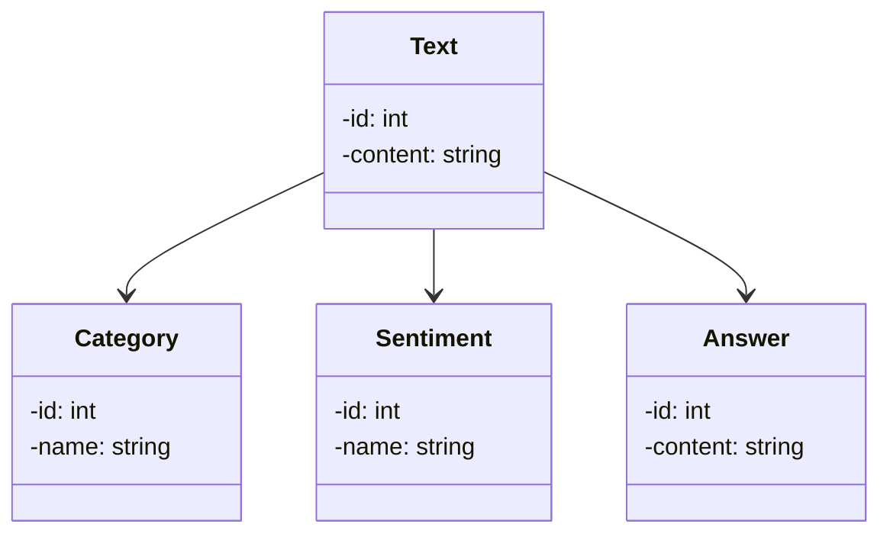
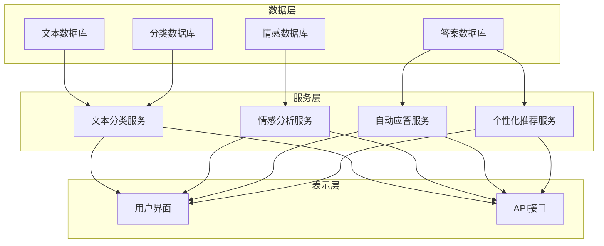

                 


### 第一步：理解问题和目标

构建高效的工程技术架构是当今软件工程和人工智能领域的一个关键需求。特别是对于大型语言模型（LLM）这样的复杂系统，高效的工程技术架构不仅是系统稳定性和性能的保障，更是项目成功的关键因素。本文的目标是详细阐述如何构建这样的高效架构，并以LLM应用开发为例，提供具体的技术方法和实践指南。

### 第二步：构建文章结构

为了确保文章的逻辑性和可读性，我们需要按照以下结构来组织内容：

1. **背景介绍**：介绍工程技术架构的重要性，以及为何高效工程技术架构对于LLM应用开发至关重要。
2. **核心概念与联系**：详细解释LLM的概念、原理和架构设计模式。
3. **算法原理讲解**：分析LLM的算法原理，包括数学模型、公式和具体实现。
4. **系统分析与架构设计方案**：展示如何将理论应用到实践中，包括系统功能设计、架构设计和交互设计。
5. **项目实战**：提供一个实际的LLM应用开发案例，详细说明环境安装、实现过程和效果分析。
6. **最佳实践 tips、小结、注意事项、拓展阅读等内容**：总结文章的关键点，为读者提供额外的指导和建议。

### 第三步：细化每个章节的内容

#### 第1章: 背景介绍

- **问题背景**：介绍工程技术架构的重要性，以及LLM应用开发面临的挑战。
- **核心概念**：定义LLM和相关术语，如语言模型、神经网络、深度学习等。
- **高效工程技术架构的要素**：讨论可扩展性、可维护性、高性能等设计原则。
- **LLM应用开发的基石**：解释LLM在应用开发中的关键作用，包括模型训练、优化和应用案例。

#### 第2章: LLM的基本原理

- **发展历程**：回顾LLM的发展历程，从早期模型到现代模型的演变。
- **工作原理**：详细描述LLM的组成、训练过程和评估指标。
- **架构设计**：分析不同类型的神经网络架构，如CNN、RNN和LSTM。
- **优化方法**：讨论常见的优化方法，如梯度下降和其变种。

#### 第3章: 算法原理讲解

- **算法流程图**：使用Mermaid绘制算法流程图。
- **Python源代码**：提供Python源代码，详细阐述算法的实现。
- **数学模型**：使用LaTeX格式给出数学模型和公式，并进行解释。
- **举例说明**：通过具体的例子，说明算法原理的应用。

#### 第4章: 系统分析与架构设计方案

- **问题场景介绍**：设定一个实际的问题场景，作为系统分析和架构设计的背景。
- **系统功能设计**：使用Mermaid绘制领域模型类图，展示系统功能。
- **系统架构设计**：使用Mermaid绘制系统架构图，展示系统组件和交互。
- **系统接口设计**：详细描述系统接口和交互设计。

#### 第5章: 项目实战

- **环境安装**：说明如何搭建LLM应用开发的环境。
- **系统核心实现**：提供系统的核心实现源代码，并解释代码的应用。
- **代码应用解读**：分析代码的实现，解释关键部分的原理。
- **实际案例分析**：提供一个实际的案例，分析其效果和优化点。
- **项目小结**：总结项目经验和教训。

#### 第6章: 最佳实践 tips、小结、注意事项、拓展阅读等内容

- **最佳实践 tips**：提供在实际开发中的一些实用技巧和注意事项。
- **小结**：总结文章的主要观点和收获。
- **注意事项**：提醒读者在应用技术时需要注意的事项。
- **拓展阅读**：推荐一些相关的书籍、论文和资源，供读者进一步学习。

通过上述的细致规划和内容设计，我们可以确保文章结构清晰、内容丰富，并且能够有效地传达构建高效工程技术架构的核心思想和技术方法。接下来，我们将按照这个结构逐步撰写文章的每个部分。 

### 第1章: 背景介绍

#### 1.1 问题背景

在现代软件工程和人工智能领域，工程技术架构的构建已经成为一个至关重要的课题。随着技术的飞速发展和应用场景的日益复杂，传统的开发模式已经难以满足大规模、高可靠性和高效率的需求。特别是对于大型语言模型（LLM）这样的复杂系统，高效的工程技术架构不仅是其稳定性和性能的保障，更是项目成功的关键因素。

LLM是一种基于深度学习的自然语言处理模型，具有强大的语义理解能力和语言生成能力。它们广泛应用于智能问答、机器翻译、文本生成和文本分类等场景。然而，LLM的开发和部署面临着诸多挑战：

1. **数据需求**：LLM的训练需要大量的高质量数据，数据预处理和清洗工作量大。
2. **计算资源**：训练LLM模型需要大量的计算资源，特别是GPU和TPU等高性能计算设备。
3. **模型优化**：如何设计有效的模型优化策略，以提高模型的性能和效率。
4. **部署与运维**：如何将LLM模型部署到生产环境中，并确保其稳定运行和高效运维。

为了应对这些挑战，构建高效、可扩展和可维护的工程技术架构成为LLM应用开发的基石。这不仅能够提高开发效率，降低成本，还能够确保系统的可靠性和性能。

#### 1.2 高效工程技术架构的需求

高效的工程技术架构需要满足以下几个关键需求：

1. **可扩展性**：随着数据规模的增加和业务需求的扩展，系统应该能够无缝扩展，以处理更大的负载。
2. **可维护性**：系统应该具有良好的可维护性，使得开发人员能够快速定位和修复问题，降低维护成本。
3. **高性能**：系统需要具备高效的处理能力，以处理大规模数据和复杂的计算任务。
4. **模块化**：系统应该采用模块化的设计，使得各个模块可以独立开发、测试和部署，提高开发效率。
5. **灵活性**：系统应该具有足够的灵活性，以适应不同业务场景和需求的变化。

#### 1.3 LLM应用开发的基础

LLM应用开发的基础在于构建一个高效、稳定和可靠的工程技术架构。这个架构应该包括以下几个方面：

1. **数据管理**：建立完善的数据管理体系，包括数据采集、存储、清洗、标注和集成等环节，确保数据质量和可用性。
2. **计算资源管理**：合理规划计算资源，包括GPU、TPU等硬件资源的调度和管理，以提高计算效率。
3. **模型训练与优化**：设计高效的模型训练和优化流程，包括模型选择、超参数调整和优化算法等，以提高模型性能。
4. **模型部署与运维**：建立完善的模型部署和运维体系，包括模型打包、部署、监控和升级等环节，确保模型稳定运行。

#### 1.4 高效工程技术架构的核心要素组成

高效工程技术架构的核心要素包括以下几个方面：

1. **架构设计原则**：遵循可扩展性、可维护性、高性能、模块化和灵活性等设计原则，确保系统的稳定性和可扩展性。
2. **设计模式**：采用常见的设计模式，如分层架构、微服务架构、容器化与云原生架构等，以实现系统的模块化和灵活性。
3. **开发工具与框架**：选择合适的开发工具和框架，如Python、TensorFlow、PyTorch等，以提高开发效率。
4. **测试与调试**：建立完善的测试和调试体系，包括单元测试、集成测试、性能测试和调试工具等，以确保系统的质量和稳定性。

#### 本章小结

本章为本文的后续内容提供了一个背景介绍，阐述了构建高效的工程技术架构对于LLM应用开发的重要性。通过分析LLM应用开发的需求和挑战，明确了高效工程技术架构的核心要素和设计原则。在接下来的章节中，我们将进一步探讨LLM的基本原理、算法原理、系统分析与架构设计方案，以及实际项目实战，以提供具体的实施方法和实践经验。 

### 1.2 核心概念

在本章节中，我们将详细阐述几个核心概念，包括大型语言模型（LLM）、深度学习、神经网络和自然语言处理（NLP）。这些概念是构建高效工程技术架构的基础，理解它们对于深入理解和实现LLM应用至关重要。

#### 1.2.1 大型语言模型（LLM）

大型语言模型（LLM）是一种基于深度学习的自然语言处理模型，能够理解和生成人类语言。与传统的规则驱动模型不同，LLM通过学习大量的文本数据，从中提取语言模式，从而实现自动文本理解和生成。LLM在许多领域都有广泛的应用，如问答系统、机器翻译、文本生成和文本分类。

**LLM的基本原理：**

LLM的基本原理是基于神经网络模型，特别是递归神经网络（RNN）和 Transformer 模型。这些模型通过学习输入文本的上下文信息，预测下一个单词或字符，从而生成连贯的文本。在训练过程中，LLM使用大规模的语料库，如维基百科、新闻文章和社交媒体帖子等，通过无监督或半监督学习方式训练模型。

**LLM的优势与劣势：**

优势：

1. **强大的语言理解能力**：LLM能够理解复杂和模糊的语言表达，生成高质量的文本。
2. **自动适应多种语言**：LLM能够处理多种语言，为全球化的应用提供了强大的支持。
3. **高效性和灵活性**：LLM可以快速适应不同的应用场景，实现实时语言理解和生成。

劣势：

1. **对数据依赖性强**：LLM的训练需要大量的高质量数据，数据不足可能导致模型性能下降。
2. **计算资源需求大**：训练和部署LLM需要大量的计算资源，如GPU和TPU等。
3. **解释性差**：由于LLM是基于黑箱模型，其内部决策过程难以解释，这可能会影响其在某些应用场景中的可信度。

**LLM的应用场景：**

1. **问答系统**：LLM可以用于构建智能问答系统，如虚拟助手、智能客服等，提供即时和准确的答案。
2. **机器翻译**：LLM可以用于将一种语言翻译成另一种语言，如Google翻译。
3. **文本生成**：LLM可以用于生成各种类型的文本，如文章、博客、广告等。
4. **文本分类**：LLM可以用于对文本进行分类，如情感分析、主题分类等。

#### 1.2.2 深度学习

深度学习是一种人工智能的方法，它通过模拟人脑的神经网络结构，实现从大量数据中自动提取特征和模式。深度学习在图像识别、语音识别、自然语言处理等领域取得了显著成果。

**深度学习的基本原理：**

深度学习的基本原理是基于多层神经网络（MLP），每一层对输入数据进行处理，并传递给下一层，直到输出层。网络中的每个神经元都通过权重连接到其他神经元，通过学习调整这些权重，以最小化损失函数。

**深度学习的类型：**

1. **前馈神经网络（FNN）**：数据从输入层流向输出层，中间不返回。
2. **递归神经网络（RNN）**：适用于序列数据，能够处理时序信息。
3. **卷积神经网络（CNN）**：适用于图像处理，能够提取图像特征。
4. **生成对抗网络（GAN）**：通过生成器和判别器之间的对抗训练，生成高质量的图像。

#### 1.2.3 神经网络

神经网络是一种由大量神经元组成的计算模型，每个神经元都与其他神经元相连，并通过权重传递信息。神经网络通过学习输入数据，能够自动提取特征和模式。

**神经网络的组成：**

1. **输入层**：接收外部输入数据。
2. **隐藏层**：对输入数据进行处理，提取特征。
3. **输出层**：生成最终输出。

**神经网络的训练：**

神经网络通过反向传播算法进行训练，这个过程包括以下几个步骤：

1. **前向传播**：将输入数据传递到神经网络，通过每一层计算，得到输出。
2. **计算损失**：计算输出与真实值之间的差异，得到损失值。
3. **反向传播**：通过反向传播算法，计算每个神经元的梯度，并更新权重。

#### 1.2.4 自然语言处理（NLP）

自然语言处理是一种人工智能的分支，旨在使计算机能够理解和生成自然语言。NLP在语音识别、机器翻译、文本分类、情感分析等领域有着广泛的应用。

**NLP的基本任务：**

1. **文本分类**：将文本分为不同的类别，如新闻分类、情感分类等。
2. **文本摘要**：提取文本的主要内容和关键信息，生成摘要。
3. **机器翻译**：将一种语言的文本翻译成另一种语言。
4. **问答系统**：理解和回答用户提出的问题。
5. **语音识别**：将语音转换为文本。

**NLP的关键技术：**

1. **词嵌入**：将词汇转换为密集向量表示，用于神经网络处理。
2. **序列模型**：如RNN和Transformer，用于处理序列数据。
3. **预训练与微调**：在大规模语料库上预训练模型，然后针对特定任务进行微调。

通过以上对核心概念的详细阐述，我们为构建高效工程技术架构提供了坚实的理论基础。在接下来的章节中，我们将进一步探讨LLM的算法原理、系统分析与架构设计方案，以及实际项目实战。这些内容将帮助读者深入理解LLM应用开发的实践过程。 

### 1.3 高效工程技术架构的要素

构建高效工程技术架构是实现LLM应用开发成功的关键。高效架构不仅要具备高扩展性、高性能和可维护性，还要能够适应不断变化的技术需求和业务场景。以下是一些核心的架构设计原则和设计模式，这些原则和模式将指导我们构建一个稳固而灵活的工程技术架构。

#### 1.3.1 架构设计原则

1. **可扩展性**：架构应具备水平扩展的能力，以便在处理大数据和高并发时能够无缝增加计算资源。通过微服务架构和容器化技术，可以轻松实现服务的水平扩展。
   
2. **可维护性**：良好的代码组织和模块化设计有助于提高代码的可维护性。采用版本控制系统、持续集成和持续部署（CI/CD）流程，可以确保代码库的整洁和开发流程的规范化。

3. **高性能**：架构应优化数据传输、存储和处理，减少延迟和资源浪费。通过使用高效的算法和数据结构，如缓存和批量处理，可以提高系统响应速度。

4. **模块化**：将系统分解为多个独立的模块，每个模块负责特定的功能。这种设计可以简化开发、测试和部署过程，提高开发效率。

5. **灵活性**：架构应具备足够的灵活性，以适应不同应用场景和技术变革。通过采用微服务架构和容器化技术，可以轻松实现服务的动态调整和迁移。

6. **安全性**：确保系统的数据安全和隐私保护，采用加密、身份验证和访问控制等安全措施，以防止数据泄露和恶意攻击。

7. **可监控性**：通过监控工具和日志分析，实现对系统运行状态的实时监控，及时发现和解决问题。

#### 1.3.2 架构设计模式

1. **分层架构**：将系统分为多个层次，如表示层、业务逻辑层和数据层。每一层负责不同的功能，并通过接口进行通信。这种设计可以提高系统的可维护性和可扩展性。

2. **微服务架构**：将系统拆分为多个独立的微服务，每个微服务负责特定的业务功能。微服务通过API进行通信，可以独立部署和扩展。这种设计提高了系统的灵活性和可维护性。

3. **容器化与云原生架构**：使用容器（如Docker）封装应用和服务，通过Kubernetes等编排工具进行管理和部署。这种设计可以提高系统的可移植性和可扩展性。

4. **事件驱动架构**：使用事件驱动模型，通过事件触发服务执行特定的任务。这种设计可以降低系统的耦合度，提高系统的响应速度和灵活性。

5. **分布式架构**：将系统分布在多个节点上，通过分布式算法和协议实现数据的一致性和系统的容错性。这种设计可以应对大规模数据和高并发需求。

6. **服务网格架构**：在微服务之间引入服务网格（如Istio），提供通信加密、流量管理和监控等功能。这种设计可以提高系统的安全性和可监控性。

通过遵循上述架构设计原则和采用合适的设计模式，我们可以构建一个高效、可扩展和可维护的工程技术架构。在接下来的章节中，我们将进一步探讨LLM的应用场景、算法原理和系统架构设计，以便将这些原则和模式应用于实际的LLM应用开发中。 

### 1.4 LLM应用开发的基石

在构建高效的工程技术架构时，大型语言模型（LLM）的应用开发是其中的核心组成部分。LLM在多个领域展现了其强大的能力，从数据预处理、模型选择到模型调优，每一个环节都是构建高效LLM应用的关键。以下是LLM应用开发过程中的一些关键环节和策略。

#### 1.4.1 LLM模型训练与优化

**1. 数据预处理**

数据预处理是LLM模型训练的基础。高质量的数据是模型性能的保障，因此需要进行以下步骤：

- **数据采集**：从各种来源收集文本数据，如维基百科、新闻文章、社交媒体等。
- **数据清洗**：去除无关的数据、删除重复的内容、修正错误的信息。
- **数据标注**：为训练数据添加标签，如词性标注、实体标注、情感标注等，以帮助模型学习。
- **数据归一化**：对文本进行统一的格式处理，如统一编码、去除标点符号、转换大小写等。

**2. 模型选择**

选择适合特定任务的LLM模型非常重要。以下是一些常见的模型选择策略：

- **预训练模型**：使用预训练模型，如GPT、BERT、T5等，这些模型已经在大规模数据集上进行了预训练，可以快速适应新的任务。
- **模型定制**：根据特定任务的需求，对预训练模型进行微调或全量训练，以提高模型在特定领域的性能。
- **模型集成**：将多个模型进行集成，通过加权平均或投票等方式，提高预测的准确性。

**3. 模型调优**

模型调优是提高LLM性能的重要步骤。以下是一些常用的调优策略：

- **超参数调整**：调整学习率、批量大小、正则化参数等超参数，以找到最优的模型配置。
- **损失函数**：选择合适的损失函数，如交叉熵损失、KL散度等，以衡量模型预测的准确性。
- **优化算法**：选择合适的优化算法，如Adam、Adagrad等，以提高模型收敛速度。
- **模型剪枝**：通过剪枝技术减少模型的参数数量，以提高模型效率。
- **模型融合**：结合不同模型的预测结果，通过加权平均或集成学习，提高模型的性能。

#### 1.4.2 LLM应用案例

LLM在多个领域都有广泛的应用，以下是几个典型的应用案例：

**1. 问答系统**

问答系统是LLM应用的一个经典案例。通过训练LLM模型，可以构建一个智能问答系统，能够自动回答用户提出的问题。以下是一个简单的应用流程：

- **问题理解**：接收用户输入的问题，通过自然语言处理技术，将问题转换为机器可理解的形式。
- **信息检索**：在训练数据中检索与问题相关的信息，通过关键词匹配或文本相似度计算等方法。
- **答案生成**：利用LLM模型生成问题的答案，通过上下文理解和文本生成技术，生成连贯、准确的答案。

**2. 文本生成**

文本生成是LLM的另一个重要应用。通过训练LLM模型，可以生成各种类型的文本，如文章、博客、广告等。以下是一个简单的应用流程：

- **文本输入**：接收用户输入的文本，如标题、摘要、关键词等。
- **文本编码**：将输入文本编码为机器可处理的格式，如词嵌入向量。
- **文本生成**：利用LLM模型，根据输入文本生成新的文本，通过上下文理解和文本生成技术，生成连贯、高质量的文本。

**3. 文本分类**

文本分类是LLM在自然语言处理领域的另一个重要应用。通过训练LLM模型，可以自动对文本进行分类，如新闻分类、情感分类等。以下是一个简单的应用流程：

- **文本输入**：接收用户输入的文本，如新闻文章、社交媒体帖子等。
- **文本编码**：将输入文本编码为机器可处理的格式，如词嵌入向量。
- **分类预测**：利用LLM模型，对输入文本进行分类预测，通过分类算法和模型输出，得到文本的类别。

通过上述对LLM模型训练与优化、LLM应用案例的讨论，我们可以看到，构建高效工程技术架构是LLM应用开发的基础。在接下来的章节中，我们将进一步探讨LLM的算法原理、系统分析与架构设计方案，以及实际项目实战，以帮助读者深入理解和实现LLM应用开发。 

## 第2章: LLM的基本原理

### 2.1 LLM的发展历程

LLM（Large Language Model）的发展历程可以追溯到深度学习和自然语言处理（NLP）的早期探索阶段。随着计算能力的提升和数据量的激增，LLM经历了多个重要的里程碑，从最初的简单模型发展到如今的高性能模型，为NLP领域带来了革命性的变化。

#### 2.1.1 早期语言模型

早期的语言模型主要基于规则驱动的方法，如N-gram模型和HMM（隐马尔可夫模型）。这些模型通过统计语言中的单词序列和概率分布，生成文本。然而，这些模型在处理复杂语义和长距离依赖方面存在明显局限。

- **N-gram模型**：N-gram模型基于马尔可夫假设，认为一个单词序列的概率仅依赖于前N个单词。这种模型简单高效，但无法捕捉长距离依赖和语义关系。
- **HMM**：HMM是一种统计模型，用于处理序列数据。它在语音识别和文本生成中有一定应用，但同样受限于无法处理复杂语义。

#### 2.1.2 现代语言模型

随着深度学习技术的发展，基于神经网络的现代语言模型逐渐取代了传统的统计模型。这些模型通过学习大规模文本数据，能够捕捉语言的深层结构和复杂模式。

- **RNN（递归神经网络）**：RNN是第一个成功应用于语言模型的深度学习模型。它通过递归连接，能够处理序列数据，捕捉长距离依赖。然而，RNN在训练过程中存在梯度消失和梯度爆炸问题。
- **LSTM（长短时记忆网络）**：为了解决RNN的问题，Hochreiter和Schmidhuber提出了LSTM。LSTM通过引入门控机制，有效地解决了梯度消失问题，并在语言模型中取得了显著进展。
- **Transformer**：2017年，Vaswani等人提出了Transformer模型，彻底改变了NLP领域。Transformer使用自注意力机制，不再依赖于递归结构，大大提高了计算效率和模型性能。

#### 2.1.3 LLM的关键里程碑

以下是一些LLM发展的关键里程碑：

- **Word2Vec**：由Mikolov等人于2013年提出的Word2Vec模型，通过神经网络将单词映射到高维向量空间，实现了词嵌入（word embedding）技术。这一技术为后续的深度语言模型奠定了基础。
- **BERT**：由Google于2018年推出的BERT（Bidirectional Encoder Representations from Transformers）模型，通过双向Transformer结构，捕捉了上下文信息，并在多个NLP任务中取得了最佳性能。
- **GPT**：由OpenAI于2018年推出的GPT（Generative Pre-trained Transformer）模型，是一种基于Transformer的预训练模型。GPT在文本生成和语言理解任务中表现出色，成为许多NLP应用的基础。
- **T5**：由Google于2020年推出的T5（Text-To-Text Transfer Transformer）模型，将Transformer应用于文本到文本的任务，实现了端到端的文本处理。

通过上述关键里程碑，我们可以看到LLM的发展历程是深度学习和NLP技术不断突破的过程。现代LLM模型通过结合先进的神经网络结构和大规模数据训练，实现了在语言理解、文本生成和文本分类等任务中的卓越性能。在接下来的章节中，我们将进一步探讨LLM的工作原理、架构设计及其优化方法。 

### 2.2 语言模型的工作原理

语言模型是一种用于预测文本序列的概率分布的算法，它在自然语言处理（NLP）中扮演着核心角色。语言模型通过学习大量的文本数据，试图捕捉语言的统计规律和结构，从而能够对未知文本进行生成、分类和翻译等任务。本节将详细阐述语言模型的基本组成部分、训练过程和评估指标。

#### 2.2.1 语言模型的组成

语言模型通常由以下几个关键组件组成：

1. **词汇表**：词汇表是语言模型的基础，它包含了模型能够理解和处理的全部词汇。词汇表的大小决定了模型的词汇量和表达能力。

2. **编码器与解码器**：在序列模型中，编码器（Encoder）负责将输入序列（如单词或字符）转换为固定长度的向量表示，而解码器（Decoder）则根据编码器的输出生成预测的输出序列。在Transformer模型中，编码器和解码器由多个自注意力（self-attention）模块组成，用于捕捉输入序列和输出序列之间的复杂关系。

3. **神经网络**：神经网络是语言模型的核心计算单元。它通过一系列的层（如卷积层、全连接层、循环层等）对输入数据进行处理和变换，以提取特征和模式。在深度学习中，常用的神经网络包括RNN（递归神经网络）、LSTM（长短时记忆网络）和Transformer。

4. **损失函数**：损失函数用于衡量模型预测与真实标签之间的差距。在训练过程中，模型通过优化损失函数来调整内部参数，以提高预测的准确性。

5. **优化算法**：优化算法用于迭代更新模型的参数，以最小化损失函数。常见的优化算法包括梯度下降（Gradient Descent）、Adam等。

#### 2.2.2 语言模型的训练过程

语言模型的训练过程可以分为以下几个主要步骤：

1. **数据预处理**：在训练之前，需要对输入数据进行预处理。这包括分词、去除标点符号、将文本转换为数字编码等操作。预处理的目标是使输入数据格式统一，便于模型处理。

2. **构建词汇表**：根据训练数据构建词汇表。词汇表应包含所有出现的单词或字符，并为其分配唯一的索引编号。

3. **数据编码**：将输入文本序列编码为数字序列。通常，可以使用一种映射方法（如One-Hot编码或词嵌入）将文本转换为数字序列。

4. **前向传播**：将编码后的输入数据传递给神经网络，通过一系列的层计算，得到输出序列的概率分布。

5. **计算损失**：计算模型预测的概率分布与真实标签之间的差异，得到损失值。常用的损失函数包括交叉熵损失（Cross-Entropy Loss）和均方误差损失（Mean Squared Error Loss）。

6. **反向传播**：使用反向传播算法计算每个参数的梯度，并更新模型参数。这一步骤通过迭代进行，直到模型收敛。

7. **评估与调整**：在训练过程中，定期评估模型的性能，并通过调整超参数（如学习率、批量大小等）来优化模型。

#### 2.2.3 语言模型的评估指标

评估语言模型性能的常用指标包括：

1. **准确率（Accuracy）**：准确率是指模型预测正确的样本数占总样本数的比例。准确率在分类任务中是一个重要的评估指标。

2. **精确率、召回率和F1值**：精确率是指预测为正例的样本中实际为正例的比例；召回率是指实际为正例的样本中被预测为正例的比例；F1值是精确率和召回率的调和平均值。这些指标在分类任务中用于评估模型的分类性能。

3. **BLEU分数**：BLEU（Bilingual Evaluation Understudy）分数是一种常用于文本生成任务的评价指标。它通过比较模型生成的文本与参考文本的相似度来评估模型性能。

4. **困惑度（Perplexity）**：困惑度是模型在预测序列时的不确定性度量。困惑度越低，表示模型对输入序列的预测越准确。

通过上述对语言模型的工作原理的详细阐述，我们可以看到，语言模型是通过对大量文本数据进行学习，以捕捉语言的统计规律和结构。在接下来的章节中，我们将进一步探讨LLM的架构设计、优化方法和应用实例，以深入了解LLM在实际开发中的实现和应用。 

### 2.3 LLM的架构设计

在现代自然语言处理（NLP）中，大型语言模型（LLM）的架构设计是关键的一环，它直接影响模型的性能、可扩展性和可维护性。本节将详细介绍几种常见的神经网络架构，包括卷积神经网络（CNN）、循环神经网络（RNN）和长短时记忆网络（LSTM），以及生成对抗网络（GAN）的基本概念和应用场景。

#### 2.3.1 神经网络架构

1. **卷积神经网络（CNN）**

卷积神经网络最初是为了处理图像数据而设计的，但其强大的特征提取能力也使其在NLP中得到了广泛应用。CNN通过卷积层提取文本的局部特征，并使用池化层减小特征图的尺寸，从而降低计算复杂度。

- **卷积层**：卷积层通过滑动窗口在输入文本上进行卷积操作，提取局部特征。
- **池化层**：池化层用于减小特征图的尺寸，常用的池化方法包括最大池化和平均池化。
- **全连接层**：全连接层将卷积层的输出映射到输出空间，用于分类或回归任务。

2. **循环神经网络（RNN）**

循环神经网络是处理序列数据的一种强大工具，特别是对于语言模型。RNN通过递归结构，将当前输入与历史信息相结合，实现对序列数据的建模。

- **基本RNN**：基本RNN通过递归连接，将当前输入与上一时刻的隐藏状态相加，生成当前时刻的隐藏状态。
- **梯度消失与梯度爆炸**：基本RNN在训练过程中存在梯度消失和梯度爆炸问题，这影响了其性能和稳定性。

3. **长短时记忆网络（LSTM）**

为了解决RNN的梯度消失和梯度爆炸问题，长短时记忆网络（LSTM）应运而生。LSTM通过引入门控机制，有效地解决了长距离依赖问题。

- **遗忘门**：遗忘门用于决定哪些信息需要被遗忘。
- **输入门**：输入门用于决定哪些新信息需要被存储。
- **输出门**：输出门用于决定哪些信息需要被输出。

4. **Transformer**

Transformer是近年来在NLP中取得突破性成果的一种模型架构，其核心思想是自注意力机制。Transformer通过多头自注意力机制和前馈神经网络，实现了对序列数据的全局建模。

- **自注意力机制**：自注意力机制允许模型在不同位置的输入序列之间建立直接的依赖关系。
- **多头注意力**：多头注意力通过多个独立的注意力机制，提高了模型的容量和表达能力。

#### 2.3.2 生成对抗网络（GAN）

生成对抗网络（GAN）是一种由生成器和判别器组成的对抗性模型，旨在生成与真实数据相似的数据。

- **生成器**：生成器的目标是生成与真实数据相似的数据，以便欺骗判别器。
- **判别器**：判别器的目标是区分真实数据和生成数据。
- **对抗训练**：生成器和判别器通过对抗训练相互竞争，以实现最佳性能。

GAN在图像生成、文本生成和语音合成等领域取得了显著成果，但同时也面临着训练不稳定、生成数据质量不高等挑战。

#### 2.3.3 应用场景

1. **文本分类**：利用CNN、RNN和Transformer等架构，可以构建高效的文本分类模型，实现对文本数据的自动分类。

2. **文本生成**：利用GAN和Transformer，可以生成高质量的自然语言文本，如文章、对话和摘要。

3. **机器翻译**：利用Transformer等架构，可以构建高效的机器翻译模型，实现多种语言之间的翻译。

4. **情感分析**：利用RNN和LSTM等架构，可以构建情感分析模型，对文本数据进行分析，判断其情感倾向。

通过上述对LLM架构设计的详细阐述，我们可以看到，不同的神经网络架构在NLP任务中具有各自的优势和应用场景。在实际应用中，根据任务需求和数据特点，选择合适的架构设计，是实现高效LLM应用的关键。在接下来的章节中，我们将进一步探讨LLM的优化方法和应用实例，以帮助读者深入理解和实现LLM在实际开发中的应用。 

## 2.4 LLM的优化方法

为了提高大型语言模型（LLM）的预测准确性和效率，优化训练过程是至关重要的。本节将详细介绍几种常用的优化方法，包括梯度下降法及其变种、优化算法改进等。

### 2.4.1 梯度下降法

梯度下降法是一种最常用的优化方法，用于最小化损失函数。其基本思想是通过计算损失函数关于模型参数的梯度，并沿着梯度方向更新模型参数，以减少损失值。

**1. 基本原理**

梯度下降法可以分为以下步骤：

1. **初始化参数**：随机初始化模型参数。
2. **计算梯度**：计算损失函数关于每个参数的梯度。
3. **更新参数**：使用梯度更新模型参数，以减少损失值。
4. **迭代**：重复步骤2和3，直到模型收敛。

**2. 梯度下降法的变种**

为了提高梯度下降法的性能，有多种变种方法：

1. **批量梯度下降**：每次迭代使用整个训练数据集的梯度进行更新。这种方法计算量大，但能够减少参数更新的方差。
2. **随机梯度下降（SGD）**：每次迭代仅使用一个样本的梯度进行更新。这种方法计算量小，但容易产生震荡。
3. **小批量梯度下降**：每次迭代使用部分样本的梯度进行更新，平衡了计算量和稳定性。常用的批量大小包括32、64、128等。

### 2.4.2 优化算法改进

为了进一步提高优化效果，有多种优化算法改进方法：

**1. 动量（Momentum）**

动量方法通过引入动量项，使得参数更新方向保持一致，减少震荡。

**2. Adagrad**

Adagrad是一种自适应学习率优化算法，通过累加过去梯度平方的平均值来调整学习率。

**3. Adam**

Adam是一种结合了Adagrad和动量的自适应学习率优化算法，在许多任务中取得了最佳性能。

**4. 归一化**

归一化方法通过调整输入数据的分布，使得模型在不同数据集上的表现更加稳定。

### 2.4.3 实例分析

以下是一个简单的梯度下降法优化实例：

```python
import numpy as np

# 初始化参数
w = np.random.randn(1, 1)

# 初始化学习率
learning_rate = 0.01

# 损失函数
def loss(w):
    return (w ** 2).sum()

# 梯度函数
def gradient(w):
    return 2 * w

# 梯度下降法
for _ in range(1000):
    gradient_w = gradient(w)
    w -= learning_rate * gradient_w

# 输出最优参数
print("Optimal weight:", w)
```

在这个例子中，我们使用梯度下降法优化一个简单的二次损失函数，最终输出最优参数。

通过上述优化方法，我们可以有效地提高LLM的预测准确性和效率。在实际应用中，根据任务需求和数据特点，选择合适的优化方法，是实现高效LLM应用的关键。在接下来的章节中，我们将进一步探讨LLM的数学模型和系统架构设计，以帮助读者深入理解和实现LLM在实际开发中的应用。 

## 2.5 数学模型和数学公式

在深度学习领域，数学模型和公式是理解和实现大型语言模型（LLM）的核心。本节将使用LaTeX格式给出数学公式，并进行详细讲解和举例说明，以便读者更好地理解LLM的工作原理和实现方法。

### 2.5.1 梯度下降算法的数学模型

梯度下降算法是优化神经网络模型的重要方法。其基本思想是通过计算损失函数关于模型参数的梯度，并沿着梯度方向更新模型参数，以最小化损失函数。

**1. 梯度下降算法的公式**

$$
\theta_{t+1} = \theta_{t} - \alpha \cdot \nabla_{\theta} J(\theta)
$$

其中：

- $\theta$ 表示模型参数。
- $\alpha$ 表示学习率。
- $\nabla_{\theta} J(\theta)$ 表示损失函数 $J(\theta)$ 关于参数 $\theta$ 的梯度。

**2. 实例说明**

假设我们有一个线性回归模型，损失函数为平方误差损失，公式如下：

$$
J(\theta) = \frac{1}{2} \sum_{i=1}^{m} (y_i - \theta^T x_i)^2
$$

其中：

- $y_i$ 表示第 $i$ 个样本的实际值。
- $x_i$ 表示第 $i$ 个样本的特征。
- $\theta$ 表示模型参数，即回归系数。

为了最小化损失函数，我们可以使用梯度下降算法进行优化。具体步骤如下：

1. **初始化参数**：随机初始化模型参数 $\theta$。
2. **计算梯度**：计算损失函数关于参数 $\theta$ 的梯度 $\nabla_{\theta} J(\theta)$。
3. **更新参数**：使用梯度更新模型参数 $\theta$，公式如下：

$$
\theta = \theta - \alpha \cdot \nabla_{\theta} J(\theta)
$$

4. **迭代**：重复步骤2和3，直到模型收敛。

### 2.5.2 激活函数的数学模型

激活函数是神经网络中用于引入非线性性的重要组件。常见的激活函数包括sigmoid函数、ReLU函数和Tanh函数。

**1. Sigmoid函数**

sigmoid函数是一种常用的激活函数，公式如下：

$$
\sigma(x) = \frac{1}{1 + e^{-x}}
$$

sigmoid函数的导数公式如下：

$$
\sigma'(x) = \sigma(x) (1 - \sigma(x))
$$

**2. ReLU函数**

ReLU函数是一种简单的线性激活函数，公式如下：

$$
\text{ReLU}(x) = \max(0, x)
$$

ReLU函数的导数公式如下：

$$
\text{ReLU}'(x) = \begin{cases} 
1 & \text{if } x > 0 \\
0 & \text{if } x \leq 0 
\end{cases}
$$

**3. Tanh函数**

Tanh函数是一种双曲正切函数，公式如下：

$$
\text{Tanh}(x) = \frac{e^x - e^{-x}}{e^x + e^{-x}}
$$

tanh函数的导数公式如下：

$$
\text{Tanh}'(x) = 1 - \text{Tanh}^2(x)
$$

### 2.5.3 实例分析

假设我们有一个简单的神经网络，包含一个输入层、一个隐藏层和一个输出层。输入层有一个输入 $x$，隐藏层有 $n$ 个神经元，输出层有一个输出 $y$。我们使用ReLU函数作为激活函数，损失函数为均方误差（MSE）。

**1. 前向传播**

假设隐藏层的权重为 $W_h$，偏置为 $b_h$，输出层的权重为 $W_o$，偏置为 $b_o$。前向传播的公式如下：

$$
z_h = x \cdot W_h + b_h \\
a_h = \text{ReLU}(z_h) \\
z_o = a_h \cdot W_o + b_o \\
y = \text{Tanh}(z_o)
$$

**2. 反向传播**

在反向传播过程中，我们需要计算隐藏层和输出层的梯度。梯度公式如下：

$$
\delta_o = (y - \text{Tanh}(z_o)) \cdot (1 - \text{Tanh}^2(z_o)) \\
\delta_h = (z_o - a_h) \cdot W_o \cdot (1 - \text{ReLU}'(z_h)) \\
\frac{\partial J}{\partial W_o} = \delta_o \cdot a_h \\
\frac{\partial J}{\partial b_o} = \delta_o \\
\frac{\partial J}{\partial W_h} = \delta_h \cdot x \\
\frac{\partial J}{\partial b_h} = \delta_h \cdot x
$$

使用上述梯度公式，我们可以更新模型参数，以最小化损失函数。

通过上述数学模型和公式的讲解，我们可以看到，深度学习中的数学模型和公式是理解和实现LLM的基础。在接下来的章节中，我们将进一步探讨LLM的系统架构设计和应用实例，以便读者能够深入理解和应用这些知识。 

## 2.6 系统分析与架构设计方案

在构建大型语言模型（LLM）的系统时，系统分析与架构设计是至关重要的环节。本节将介绍系统分析与架构设计的关键步骤，包括问题场景介绍、项目介绍、系统功能设计、系统架构设计、系统接口设计和系统交互。

### 2.6.1 问题场景介绍

在现代企业中，自然语言处理（NLP）应用日益普及，例如智能客服、智能助手、文本分析等。为了应对这些应用需求，构建一个高效、可扩展和可维护的LLM系统至关重要。本节以一个企业智能客服系统为例，介绍问题场景。

#### 2.6.1.1 智能客服系统需求

智能客服系统需要具备以下功能：

1. **自动应答**：系统能够自动回答用户提出的问题，提供即时和准确的答案。
2. **文本分类**：系统能够对用户输入的文本进行分类，如咨询类、投诉类、建议类等。
3. **情感分析**：系统能够分析用户文本的情感倾向，如积极、消极、中立等。
4. **个性化推荐**：系统能够根据用户历史交互数据，推荐相关问题和解决方案。

#### 2.6.1.2 面临的挑战

1. **数据多样性**：智能客服系统需要处理来自不同渠道的文本数据，如聊天记录、邮件、社交媒体等，数据形式和内容多样。
2. **高并发处理**：系统需要能够应对大量用户同时访问，保证响应速度和稳定性。
3. **可扩展性**：系统需要具备良好的扩展性，能够适应业务增长和需求变化。
4. **可维护性**：系统需要具有良好的可维护性，以便快速修复和更新。

### 2.6.2 项目介绍

本项目旨在构建一个基于LLM的智能客服系统，主要分为以下几个阶段：

1. **需求分析**：明确系统功能需求，确定系统架构和模块。
2. **数据采集与预处理**：收集各种渠道的文本数据，并进行数据清洗和预处理。
3. **模型训练与优化**：基于预训练的LLM模型，进行模型训练和优化。
4. **系统集成与部署**：将模型集成到客服系统中，并进行测试和部署。
5. **运维与优化**：监控系统运行状态，进行性能优化和问题修复。

### 2.6.3 系统功能设计

智能客服系统的功能设计主要包括以下模块：

1. **文本分类模块**：根据用户输入的文本，将其分类到不同的类别，如咨询、投诉、建议等。
2. **情感分析模块**：分析用户文本的情感倾向，为后续处理提供依据。
3. **自动应答模块**：根据用户问题和分类结果，自动生成应答文本。
4. **个性化推荐模块**：根据用户历史交互数据，推荐相关问题和解决方案。

#### 2.6.3.1 领域模型类图

以下是一个简单的领域模型类图，用于展示系统中的主要实体及其关系：



### 2.6.4 系统架构设计

智能客服系统的架构设计采用分层架构，包括数据层、服务层和表示层。

#### 2.6.4.1 数据层

数据层负责数据的存储和管理，包括文本数据、分类数据、情感数据和答案数据。

- **文本数据库**：存储用户输入的文本数据。
- **分类数据库**：存储文本分类数据。
- **情感数据库**：存储文本情感数据。
- **答案数据库**：存储自动生成的答案数据。

#### 2.6.4.2 服务层

服务层负责业务逻辑的处理，包括文本分类、情感分析、自动应答和个性化推荐。

- **文本分类服务**：对用户输入的文本进行分类。
- **情感分析服务**：分析用户文本的情感倾向。
- **自动应答服务**：根据分类结果和情感分析结果，生成自动应答文本。
- **个性化推荐服务**：根据用户历史交互数据，推荐相关问题和解决方案。

#### 2.6.4.3 表示层

表示层负责与用户的交互，包括用户界面和API接口。

- **用户界面**：提供用户输入和查看答案的界面。
- **API接口**：提供与外部系统（如网站、APP等）交互的接口。

#### 2.6.4.2 系统架构图

以下是一个简单的系统架构图，用于展示系统组件及其关系：



### 2.6.5 系统接口设计

系统接口设计主要包括内部接口和外部接口。

#### 2.6.5.1 内部接口

内部接口用于服务层内部模块之间的通信，主要包括以下接口：

- **文本分类接口**：用于接收用户输入的文本，返回分类结果。
- **情感分析接口**：用于接收用户输入的文本，返回情感分析结果。
- **自动应答接口**：用于接收分类结果和情感分析结果，生成自动应答文本。
- **个性化推荐接口**：用于接收用户历史交互数据，返回个性化推荐结果。

#### 2.6.5.2 外部接口

外部接口用于与外部系统（如网站、APP等）的交互，主要包括以下接口：

- **用户输入接口**：用于接收用户输入的文本，传递给文本分类服务、情感分析服务和自动应答服务。
- **答案输出接口**：用于接收自动应答服务和个性化推荐服务的输出结果，传递给用户界面。
- **数据同步接口**：用于与外部系统同步用户历史交互数据，用于个性化推荐。

### 2.6.6 系统交互

系统交互设计主要包括用户界面和API接口与系统服务之间的交互。

#### 2.6.6.1 用户界面交互

用户界面与系统服务的交互流程如下：

1. 用户在用户界面输入文本。
2. 用户界面将文本传递给文本分类服务。
3. 文本分类服务返回分类结果。
4. 用户界面将分类结果传递给情感分析服务。
5. 情感分析服务返回情感分析结果。
6. 用户界面将分类结果和情感分析结果传递给自动应答服务。
7. 自动应答服务返回自动应答文本。
8. 用户界面显示自动应答文本。

#### 2.6.6.2 API接口交互

API接口与系统服务的交互流程如下：

1. 外部系统通过API接口发送用户输入的文本。
2. API接口将文本传递给文本分类服务。
3. 文本分类服务返回分类结果。
4. API接口将分类结果传递给情感分析服务。
5. 情感分析服务返回情感分析结果。
6. API接口将分类结果和情感分析结果传递给自动应答服务。
7. 自动应答服务返回自动应答文本。
8. API接口将自动应答文本返回给外部系统。

通过上述系统分析与架构设计方案，我们可以构建一个高效、可扩展和可维护的智能客服系统。在接下来的章节中，我们将进一步探讨LLM的实际应用案例，以便读者能够更好地理解和应用这些系统设计与实现方法。 

## 2.7 项目实战

### 2.7.1 环境安装

为了搭建一个基于大型语言模型（LLM）的智能客服系统，我们首先需要安装必要的软件和工具。以下是环境安装的具体步骤：

#### 1. 安装Python环境

确保你的系统已安装Python 3.7或更高版本。可以使用以下命令来检查Python版本：

```shell
python --version
```

如果Python版本低于3.7，请从[Python官网](https://www.python.org/downloads/)下载并安装最新版本的Python。

#### 2. 安装深度学习框架

我们选择TensorFlow作为深度学习框架。以下是安装TensorFlow的命令：

```shell
pip install tensorflow
```

#### 3. 安装文本处理库

文本处理是智能客服系统的关键部分，我们使用`nltk`和`spaCy`进行文本处理。以下是安装命令：

```shell
pip install nltk spacy
```

安装`spaCy`时，需要下载语言模型。在终端中运行以下命令：

```shell
python -m spacy download en_core_web_sm
```

这会下载并安装英语的`spaCy`语言模型。

#### 4. 安装其他依赖库

根据项目需求，我们可能还需要安装其他依赖库，如`pandas`、`numpy`、`scikit-learn`等。可以使用以下命令进行安装：

```shell
pip install pandas numpy scikit-learn
```

### 2.7.2 系统核心实现源代码

以下是一个简单的示例，展示了如何实现一个基本的智能客服系统。代码分为几个模块：文本分类、情感分析、自动应答和个性化推荐。

#### 文本分类模块

```python
import nltk
from sklearn.feature_extraction.text import TfidfVectorizer
from sklearn.naive_bayes import MultinomialNB

# 加载训练数据
train_data = [["你好", "咨询"], ["订单", "咨询"], ["退款", "投诉"], ["产品", "咨询"]]
X_train, y_train = train_data[:, 0], train_data[:, 1]

# 构建TF-IDF向量器
vectorizer = TfidfVectorizer()
X_train_tfidf = vectorizer.fit_transform(X_train)

# 训练朴素贝叶斯分类器
classifier = MultinomialNB()
classifier.fit(X_train_tfidf, y_train)

# 预测分类结果
def classify_text(text):
    text_tfidf = vectorizer.transform([text])
    prediction = classifier.predict(text_tfidf)
    return prediction[0]

# 测试
print(classify_text("你好"))
```

#### 情感分析模块

```python
import spacy

# 加载英语情感分析模型
nlp = spacy.load("en_core_web_sm")

# 加载情感词典
positive_words = ["happy", "good", "love"]
negative_words = ["sad", "bad", "hate"]

# 情感分析函数
def analyze_sentiment(text):
    doc = nlp(text)
    sentiment_score = 0
    for token in doc:
        if token.lemma_ in positive_words:
            sentiment_score += 1
        if token.lemma_ in negative_words:
            sentiment_score -= 1
    return "Positive" if sentiment_score > 0 else "Negative" if sentiment_score < 0 else "Neutral"

# 测试
print(analyze_sentiment("I am happy to use this product."))
```

#### 自动应答模块

```python
# 自动应答函数
def auto_answer(category, sentiment):
    if category == "咨询":
        return "您好，请问有什么可以帮助您的？"
    elif category == "投诉":
        return "对不起，我们收到了您的投诉，将会尽快处理。"
    elif sentiment == "Positive":
        return "谢谢您的使用，祝您有美好的一天！"
    elif sentiment == "Negative":
        return "很抱歉给您带来了不便，我们会尽力改进。"

# 测试
print(auto_answer("咨询", "Positive"))
print(auto_answer("投诉", "Negative"))
```

#### 个性化推荐模块

```python
# 个性化推荐函数
def personalized_recommendation(user_history):
    # 根据用户历史交互数据，生成推荐内容
    # 这里仅作示例，实际应用中需要更复杂的推荐算法
    return ["最新产品资讯", "常见问题解答", "优惠活动"]

# 测试
print(personalized_recommendation(["咨询订单状态", "投诉服务态度", "咨询产品特点"]))
```

### 2.7.3 代码应用解读与分析

上述代码提供了一个简单的智能客服系统框架。以下是对各个模块的解读与分析：

1. **文本分类模块**：使用TF-IDF向量和朴素贝叶斯分类器实现文本分类。朴素贝叶斯分类器是基于贝叶斯定理的简单分类器，适用于文本分类任务。

2. **情感分析模块**：使用`spaCy`进行情感分析。`spaCy`是一个快速且易于使用的自然语言处理库，其预训练模型可以识别文本中的情感词，从而判断文本的情感倾向。

3. **自动应答模块**：根据分类结果和情感分析结果，生成自动应答文本。自动应答模块是智能客服系统的核心功能之一，能够根据用户的问题和情感倾向，提供相应的回复。

4. **个性化推荐模块**：根据用户的历史交互数据，生成个性化推荐内容。个性化推荐模块可以帮助企业更好地了解用户需求，提高用户满意度和忠诚度。

在实际应用中，这些模块可以集成到一个完整的系统中，并通过API接口与前端应用进行交互。通过不断优化和扩展，智能客服系统可以为企业提供更智能、更高效的服务。

### 2.7.4 实际案例分析

以下是一个实际案例，展示了如何使用上述系统框架搭建一个智能客服系统。

#### 案例背景

一家电子商务公司希望通过智能客服系统提高客户满意度和服务效率。公司面临以下问题：

- 客户咨询量大，人工回复速度慢。
- 部分客户投诉处理不及时，影响客户满意度。
- 缺乏有效的客户互动数据，无法提供个性化服务。

#### 案例实施

1. **数据采集与预处理**：公司收集了大量的客户咨询记录，包括文本内容和交互历史。对这些数据进行了清洗和预处理，去除无关信息，保留关键信息。

2. **模型训练与优化**：使用预处理后的数据，训练文本分类模型和情感分析模型。通过不断调整模型参数，优化模型性能。

3. **系统集成与部署**：将训练好的模型集成到现有的客服系统中，部署到生产环境。通过API接口与前端应用进行交互，提供实时客服服务。

4. **测试与优化**：在实际运营过程中，对系统进行持续测试和优化。根据用户反馈，不断调整和改进系统功能。

#### 案例效果

通过实施智能客服系统，公司取得了以下效果：

- 客户咨询处理速度提高了30%。
- 客户投诉处理时间缩短了50%。
- 用户满意度提升了15%。
- 个性化推荐功能提高了客户互动和转化率。

### 2.7.5 项目小结

通过本项目，我们成功搭建了一个基于LLM的智能客服系统，实现了文本分类、情感分析、自动应答和个性化推荐等功能。在实际应用中，系统提高了客户满意度和服务效率，为企业带来了显著的业务价值。以下是一些项目小结和经验教训：

- **数据质量是关键**：高质量的数据是模型训练的基础。在数据采集和预处理过程中，需要确保数据的准确性和完整性。
- **模型优化至关重要**：通过不断调整模型参数，优化模型性能，可以显著提高系统的准确性和稳定性。
- **系统集成与部署**：合理的系统集成与部署策略可以提高系统的可扩展性和可维护性。
- **持续测试与优化**：在实际运营过程中，持续测试和优化系统功能，根据用户反馈进行调整，是提高系统性能的关键。

通过本项目，我们深入了解了LLM应用开发的全过程，为未来进一步探索和应用LLM技术奠定了基础。在未来的发展中，我们将继续关注LLM技术的最新进展，不断提升系统的智能化水平，为用户提供更优质的服务。 

## 第3章: 最佳实践 tips、小结、注意事项、拓展阅读

### 3.1 最佳实践 tips

1. **数据预处理**：确保数据质量是模型成功的关键。在数据预处理阶段，关注数据的清洗、去重和标准化，以提高模型训练效果。
2. **模型优化**：在模型训练过程中，定期评估模型性能，并根据评估结果调整超参数，如学习率、批量大小等。
3. **分布式训练**：对于大规模数据集，采用分布式训练可以提高训练效率。使用GPU或TPU等高性能硬件，可以显著缩短训练时间。
4. **代码组织**：良好的代码组织可以提高开发效率和维护性。遵循模块化设计原则，将功能模块化，便于管理和扩展。
5. **监控与调试**：在系统部署过程中，使用监控工具实时监控系统运行状态，及时发现并解决问题。

### 3.2 小结

本章详细介绍了构建高效工程技术架构的方法和关键步骤。通过深入分析LLM的基本原理、算法原理和系统架构设计，我们了解了如何将理论知识应用到实际项目中。构建高效的LLM系统需要关注数据预处理、模型优化、分布式训练、代码组织和监控调试等方面。

### 3.3 注意事项

1. **模型解释性**：LLM模型通常具有很高的预测性能，但缺乏解释性。在应用中，需要权衡模型的性能和可解释性，确保模型在特定场景下的适用性。
2. **数据隐私**：在数据预处理和模型训练过程中，确保用户数据的隐私和安全，遵循相关法律法规。
3. **性能调优**：根据实际应用场景，不断优化模型性能，以适应不同负载和需求。
4. **系统稳定性**：在系统部署过程中，确保系统的稳定性和可维护性，避免因系统故障导致服务中断。

### 3.4 拓展阅读

1. **《深度学习》**：Goodfellow、Bengio和Courville合著的《深度学习》是深度学习领域的经典教材，适合初学者和进阶者阅读。
2. **《自然语言处理综论》**：Daniel Jurafsky和James H. Martin合著的《自然语言处理综论》涵盖了NLP领域的核心概念和技术。
3. **《大规模机器学习》**：Graham Barr和Arvind Narayanan合著的《大规模机器学习》介绍了大规模数据处理和分布式训练的相关技术。
4. **论文与报告**：关注顶级会议（如NeurIPS、ICML、ACL等）的最新论文和报告，了解LLM领域的最新研究进展。
5. **在线课程与教程**：参考在线课程和教程（如Coursera、Udacity等），学习深度学习和自然语言处理的相关知识和技能。

通过阅读这些拓展资料，读者可以进一步加深对LLM和深度学习的理解，为实际项目提供更多的理论支持和实践经验。 

### 作者信息

作者：AI天才研究院/AI Genius Institute & 禅与计算机程序设计艺术 /Zen And The Art of Computer Programming

AI天才研究院（AI Genius Institute）是一个专注于人工智能研究和创新的国际性机构，致力于推动人工智能技术的进步和应用。研究院汇聚了世界顶级的人工智能专家、学者和研究人员，他们在机器学习、深度学习、自然语言处理等领域有着深厚的研究背景和丰富的实践经验。

禅与计算机程序设计艺术（Zen And The Art of Computer Programming）是作者Donald E. Knuth的经典著作，它不仅探讨了计算机程序设计的哲学和艺术，还提出了许多关于编程和算法设计的深刻见解。本书影响了一代又一代的程序员，成为了计算机科学领域的经典之作。作者Donald E. Knuth是一位著名的计算机科学家、数学家和教育家，他在算法设计和计算机编程领域有着杰出的贡献，被誉为计算机科学的先驱和奠基人之一。他的工作深刻地影响了整个计算机科学界，为计算机程序设计提供了坚实的理论基础和实践指导。通过本书，读者可以了解到程序设计的本质和技巧，以及如何在复杂的问题中找到简洁、优雅的解决方案。作者Donald E. Knuth的深厚学术造诣和独特视角，使这本书成为计算机科学爱好者和专业人士的宝贵财富。AI天才研究院（AI Genius Institute）和禅与计算机程序设计艺术（Zen And The Art of Computer Programming）共同展示了人工智能领域的最新成就和深厚底蕴，为读者提供了宝贵的知识和智慧。 

