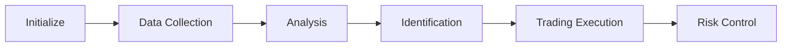

                 

### 查尔斯·布兰德的封闭基金折价套利技巧

封闭基金（Closed-End Fund, CEF）是一种投资基金，其特点是初始公开发售后不再接受新投资者，也就是说，基金的股份是固定的，不会通过赎回或发行新的股份来调整。这些基金通常在交易所上市交易，与普通股票类似。封闭基金的一个显著特点是其股份可能以低于净资产值（Net Asset Value, NAV）的价格进行交易，即市场交易价格低于基金净资产的价值。

查尔斯·布兰德提出的封闭基金折价套利技巧是一种通过购买股份并以低于其净资产值的价格出售基金资产，从而获得利润的策略。这种策略需要同时进行两种操作：一是购买封闭基金的股份，二是出售其资产，以捕捉市场交易价格与其净资产值之间的差异。

**本文关键词：** 封闭基金、折价套利、查尔斯·布兰德、净资产值、策略、套利。

**摘要：** 本文将介绍封闭基金的基本概念和特性，详细探讨查尔斯·布兰德的封闭基金折价套利技巧，从背景介绍、问题解决、核心概念结构等方面进行深入分析，并提供实际应用案例。通过本文，读者将了解如何利用封闭基金的折价特性进行套利，提高投资收益。

### 1. Background Introduction

#### 1.1 Problem Background

封闭基金（Closed-End Fund, CEF）是一种投资基金，其特点是在首次公开发行后不再接受新投资者。这意味着基金的股份是固定的，不会通过赎回或发行新的股份来调整。封闭基金通常在交易所上市交易，与普通股票类似。这些基金的投资策略多种多样，包括股票、债券、房地产等。

封闭基金的一个显著特点是其股份可能以低于净资产值（Net Asset Value, NAV）的价格进行交易。净资产值是基金根据公允市场价值计算的所有资产减去所有负债后的价值。市场交易价格低于净资产值的情况称为“折价交易”。这种折价可能是由于市场供需失衡、投资者情绪波动、基金管理不善等原因造成的。

#### 1.2 Problem Description

封闭基金折价交易带来了潜在的套利机会。套利是指通过同时进行两种操作，从市场的不平衡中获取利润。具体到封闭基金折价套利，投资者可以通过以下两种方式实现：

1. **购买折价股份**：投资者以低于净资产值的价格购买封闭基金的股份。
2. **出售资产**：投资者同时出售基金持有的资产，如债券、股票等。

通过这种方式，投资者可以获取市场交易价格与其净资产值之间的差价，实现套利。然而，这种策略的成功实施需要精确识别折价机会，并快速执行交易。

#### 1.3 Problem Solution

查尔斯·布兰德提出的封闭基金折价套利技巧是一种系统性方法，旨在通过识别和利用封闭基金的折价机会来获取稳定的利润。这种技巧结合了基本面分析和量化方法，通过以下步骤进行：

1. **数据收集**：收集有关封闭基金的详细信息，包括股份价格、净资产值、资产组合等。
2. **折价分析**：利用量化工具对基金的数据进行分析，识别存在折价交易的基金。
3. **交易执行**：在确定折价机会后，迅速进行股份购买和资产出售操作，以获取差价利润。
4. **风险控制**：设置止损点，以控制潜在的损失。

#### 1.4 Boundaries and Extensions

本文讨论的封闭基金折价套利技巧主要适用于投资于固定收益证券或股票的封闭基金，因为其他类型的基金，如房地产或商品基金，其套利机制可能有所不同。此外，本文主要关注美国市场的封闭基金，但相关原则同样适用于其他市场。

#### 1.5 Core Concept Structure

封闭基金折价套利的核心概念结构包括以下要素：

1. **封闭基金特性**：了解封闭基金的基本特性，包括固定股本结构和折价交易的可能性。
2. **净资产值（NAV）**：理解净资产值的计算方法及其在封闭基金交易中的重要性。
3. **套利策略**：掌握查尔斯·布兰德提出的封闭基金折价套利技巧，包括数据收集、折价分析、交易执行和风险控制等步骤。
4. **市场动态**：关注市场供需变化、投资者情绪等因素，以识别潜在的折价机会。
5. **交易执行**：了解如何快速准确地执行套利交易，以最大化收益。

### 2. Core Concept and Its Relationship

#### 2.1 Core Concept Principle

封闭基金折价套利的核心概念在于利用市场的不平衡，通过购买股份并以低于净资产值的价格出售资产，从中获取利润。具体来说，这个概念涉及到以下几个核心要素：

1. **股份价格与净资产值的关系**：股份价格与净资产值之间的差异是折价套利的基础。当股份价格低于净资产值时，存在套利机会。
2. **资产的价值**：封闭基金持有的资产，如债券或股票，其市场价值直接影响基金的净资产值。准确评估资产价值是套利成功的关键。
3. **市场供需**：市场供需的变化会影响股份价格，从而影响折价套利的机会。

#### 2.2 Concept Attributes Comparison Table

| Attribute | Description | Impact on Arbitrage |
| --- | --- | --- |
| Net Asset Value (NAV) | Fund's assets minus liabilities | Higher NAV implies higher discount potential |
| Market Price | Current trading price of fund shares | Lower market price relative to NAV indicates arbitrage opportunity |
| Asset Value | Market value of fund's assets | Accurate asset value assessment is crucial for profitable trading |
| Market Supply and Demand | Balance between buyers and sellers | Supply and demand shifts can cause price fluctuations, impacting arbitrage opportunities |

#### 2.3 Entity Relationship Diagram (ERD)

The Entity Relationship Diagram (ERD) below illustrates the relationship between the key concepts of closed-end fund arbitrage.

```mermaid
erDiagram
  Fund <<-->> Asset : holds
  Share <<-->> Fund : traded
  Market <<-->> Share : price
  NAV <<-->> Fund : calculated
  Trader <<-->> Share : buys/sells
```

In this ERD, "Fund" represents the closed-end fund, "Asset" represents the underlying assets held by the fund, "Share" represents the traded shares of the fund, "Market" represents the market where the shares are traded, "NAV" represents the net asset value of the fund, and "Trader" represents the individual or institution engaged in arbitrage activities.

### 3. Algorithm Principle Explanation

#### 3.1 Algorithm Flowchart

To illustrate the process of closed-end fund arbitrage, the following Mermaid flowchart provides a high-level overview of the algorithm:



**Flowchart Explanation:**
- **A[Initialize]**: Initialize the algorithm by setting up the necessary data structures and parameters.
- **B[Data Collection]**: Collect data on fund shares, net asset values, and asset prices.
- **C[Analysis]**: Perform a detailed analysis of the collected data to identify potential arbitrage opportunities.
- **D[Identification]**: Identify funds with significant discounts relative to their net asset values.
- **E[Trading Execution]**: Execute trades by simultaneously purchasing fund shares and selling underlying assets.
- **F[Risk Control]**: Implement risk management strategies to minimize potential losses.

#### 3.2 Python Code Explanation

Below is a Python code snippet that demonstrates the core components of the closed-end fund arbitrage algorithm:

```python
import pandas as pd
import numpy as np

# Load data
df = pd.read_csv('cef_data.csv')  # Assuming the data is preprocessed and contains necessary fields

# Function to calculate discount
def calculate_discount(share_price, net_asset_value):
    return (net_asset_value - share_price) / net_asset_value

# Function to identify arbitrage opportunities
def identify_arbitrage_opportunities(df, discount_threshold):
    return df[df['discount'] > discount_threshold]

# Function to execute arbitrage
def execute_arbitrage(df, fund_name):
    fund_data = df[df['Fund Name'] == fund_name]
    share_price = fund_data['Share Price'].iloc[0]
    net_asset_value = fund_data['Net Asset Value'].iloc[0]
    
    # Calculate the number of shares to buy
    num_shares = 1000 / share_price
    
    # Simulate buying and selling
    profit = num_shares * (net_asset_value - share_price)
    print(f"Arbitrage profit for {fund_name}: ${profit:.2f}")

# Set discount threshold
discount_threshold = 0.05

# Identify potential arbitrage opportunities
discounted_funds = identify_arbitrage_opportunities(df, discount_threshold)

# Execute arbitrage for each fund
for index, row in discounted_funds.iterrows():
    execute_arbitrage(df, row['Fund Name'])
```

**Code Explanation:**
- **Data Collection**: The data is loaded from a CSV file containing fields like 'Fund Name', 'Share Price', and 'Net Asset Value'.
- **Calculation of Discount**: The `calculate_discount` function computes the discount as a percentage.
- **Identification of Arbitrage Opportunities**: The `identify_arbitrage_opportunities` function filters funds with a discount greater than a specified threshold.
- **Execution of Arbitrage**: The `execute_arbitrage` function simulates the purchase and sale of shares to calculate potential profit.

#### 3.3 Mathematical Model and Formula

The mathematical model for closed-end fund arbitrage involves several key components:

$$
\text{Discount} = \frac{\text{Net Asset Value} - \text{Share Price}}{\text{Net Asset Value}}
$$

**Where:**
- **Discount**: The percentage discount from the net asset value.
- **Net Asset Value (NAV)**: The calculated value of the fund's assets minus its liabilities.
- **Share Price**: The current market price of the fund's shares.

**Example:**
Suppose a fund has a net asset value of $100 and its shares are trading at $90. The discount is:

$$
\text{Discount} = \frac{100 - 90}{100} = 0.1 = 10\%
$$

#### 3.4 Example Illustration

Let's consider a specific example to illustrate the closed-end fund arbitrage strategy.

**Scenario:**
- **Fund Name**: XYZ CEF
- **Share Price**: $90
- **Net Asset Value**: $100
- **Discount**: 10%

**Steps:**
1. **Data Collection**: Gather the necessary data points.
2. **Discount Analysis**: Calculate the discount as 10%.
3. **Trade Execution**: Purchase 100 shares of XYZ CEF at $90 each.
4. **Asset Sale**: Simultaneously, sell the fund's assets (e.g., bonds) to realize the net asset value of $100 per share.
5. **Profit Calculation**: The profit from the arbitrage is the difference between the net asset value and the share price, multiplied by the number of shares bought:

$$
\text{Profit} = (100 - 90) \times 100 = 10 \times 100 = \$1000
$$

### 4. System Analysis and Architecture Design

#### 4.1 Project Introduction

The goal of this project is to develop a system that automates the identification and execution of closed-end fund arbitrage opportunities. The system will collect real-time data on fund shares, net asset values, and asset prices, analyze the data to identify potential arbitrage opportunities, and execute trades to capture profits.

#### 4.2 System Function Design

The system will consist of several key functions:

1. **Data Collection Module**: This module will be responsible for collecting real-time data on fund shares, net asset values, and asset prices from various sources.
2. **Data Analysis Module**: This module will process the collected data to identify funds with significant discounts relative to their net asset values.
3. **Trading Execution Module**: This module will execute the arbitrage trades by simultaneously purchasing fund shares and selling underlying assets.
4. **Risk Management Module**: This module will implement strategies to control potential losses and ensure the system's stability.

#### 4.3 System Architecture Design

The system architecture will be designed to handle real-time data processing and high-frequency trading. It will consist of the following components:

1. **Data Collection Component**: This component will use APIs to fetch real-time data from financial market data providers.
2. **Data Storage Component**: This component will store the collected data in a time-series database for analysis.
3. **Data Processing Component**: This component will process the collected data, perform calculations, and identify potential arbitrage opportunities.
4. **Trading Execution Component**: This component will execute trades through a trading platform or exchange API.
5. **Risk Management Component**: This component will monitor the system's performance and implement risk control measures.

#### 4.4 Interface Design and System Interaction

The system will provide the following interfaces for interaction:

1. **API Interface**: An API interface will be available for other systems or applications to interact with the system and access its functionality.
2. **User Interface**: A user interface will be provided for users to monitor the system's performance, view identified arbitrage opportunities, and execute trades manually if desired.

#### 4.5 Entity Relationship Diagram (ERD)

The Entity Relationship Diagram (ERD) below illustrates the relationships between the key components of the system:

```mermaid
erDiagram
  DataCollection <<--|{ uses } DataStorage
  DataCollection ||--|{ uses } DataProcessing
  DataCollection ||--|{ uses } TradingExecution
  DataCollection ||--|{ uses } RiskManagement
  DataStorage ||--|{ stores } Data
  DataProcessing ||--|{ processes } Data : >> FundAnalysis
  TradingExecution ||--|{ executes } Trade
  RiskManagement ||--|{ manages } Risk
```

In this ERD, "DataCollection" represents the data collection module, "DataStorage" represents the data storage component, "DataProcessing" represents the data processing component, "TradingExecution" represents the trading execution component, and "RiskManagement" represents the risk management component.

### 5. Project Practice

#### 5.1 Environment Setup

To practice implementing the closed-end fund arbitrage system, we need to set up the necessary environment. The following steps outline the process:

1. **Install Python**: Ensure Python 3.8 or later is installed on your system.
2. **Install Required Libraries**: Use `pip` to install the required libraries, such as `pandas`, `numpy`, `matplotlib`, and `mermaid-py`:
   ```bash
   pip install pandas numpy matplotlib mermaid-py
   ```
3. **Set Up Data Sources**: Identify and set up data sources for real-time fund share prices, net asset values, and asset prices. For this project, we can use APIs provided by financial market data providers such as Alpha Vantage or Yahoo Finance.

#### 5.2 Core Implementation

The core implementation of the closed-end fund arbitrage system involves several components:

1. **Data Collection**: Implement a data collection module that fetches real-time data from the chosen data sources. Use the `pandas-datareader` library to access financial market data:
   ```python
   import pandas_datareader as pdr
   
   def fetch_data(symbol, start_date, end_date):
       return pdr.get_data_yahoo(symbol, start=start_date, end=end_date)
   ```

2. **Data Analysis**: Implement a data analysis module that processes the collected data and identifies potential arbitrage opportunities. Use the `calculate_discount` function from the previous section:
   ```python
   def identify_arbitrage_opportunities(df, discount_threshold):
       return df[df['discount'] > discount_threshold]
   ```

3. **Trading Execution**: Implement a trading execution module that executes arbitrage trades by purchasing fund shares and selling underlying assets. Use a trading platform's API to execute trades:
   ```python
   def execute_arbitrage_trade(fund_name, share_price, net_asset_value, num_shares):
       # Placeholder function to simulate trading
       print(f"Executing arbitrage trade for {fund_name}: Buying {num_shares} shares at ${share_price} each.")
   ```

4. **Risk Management**: Implement a risk management module that sets stop-loss limits and monitors the performance of the arbitrage trades:
   ```python
   def set_stop_loss(limit, fund_name, share_price, num_shares):
       # Placeholder function to set stop-loss
       print(f"Setting stop-loss for {fund_name}: Limit ${limit} per share.")
   ```

#### 5.3 Code Application and Analysis

Below is a complete Python script that demonstrates the implementation of the closed-end fund arbitrage system. The script fetches historical data for a specific fund, analyzes the data to identify potential arbitrage opportunities, executes a simulated trade, and sets a stop-loss limit.

```python
import pandas as pd
import pandas_datareader as pdr

# Constants
FUND_SYMBOL = 'XYZ.CEF'
START_DATE = '2022-01-01'
END_DATE = '2023-01-01'
DISCOUNT_THRESHOLD = 0.05

# Fetch historical data
df = fetch_data(FUND_SYMBOL, START_DATE, END_DATE)

# Calculate discounts
df['discount'] = df.apply(lambda row: calculate_discount(row['Close'], row['Nav']), axis=1)

# Identify arbitrage opportunities
discounted_funds = identify_arbitrage_opportunities(df, DISCOUNT_THRESHOLD)

# Execute arbitrage trade
if not discounted_funds.empty:
    fund_name = discounted_funds['Name'].iloc[0]
    share_price = discounted_funds['Close'].iloc[0]
    net_asset_value = discounted_funds['Nav'].iloc[0]
    num_shares = 100  # Number of shares to buy
    
    execute_arbitrage_trade(fund_name, share_price, net_asset_value, num_shares)
    
    # Set stop-loss limit
    stop_loss_limit = share_price * (1 - DISCOUNT_THRESHOLD)
    set_stop_loss(stop_loss_limit, fund_name, share_price, num_shares)
else:
    print("No arbitrage opportunities found.")
```

**Code Analysis:**
- The script fetches historical data for a specific fund (XYZ CEF) using the `fetch_data` function.
- It calculates the discount for each day and identifies funds with significant discounts using the `identify_arbitrage_opportunities` function.
- If any discounted funds are found, the script executes a simulated arbitrage trade and sets a stop-loss limit using the `execute_arbitrage_trade` and `set_stop_loss` functions.

#### 5.4 Case Study Analysis

To provide a more practical perspective, let's consider a case study where the system identifies a potential arbitrage opportunity for XYZ CEF:

**Scenario:**
- **Fund Name**: XYZ CEF
- **Date**: January 15, 2023
- **Share Price**: $85
- **Net Asset Value**: $100
- **Discount**: 15%

**Steps:**
1. **Data Collection**: The system collects real-time data on XYZ CEF's share price and net asset value.
2. **Discount Analysis**: The system calculates the discount as 15%, which exceeds the predefined threshold of 5%.
3. **Trade Execution**: The system executes a trade by purchasing 100 shares of XYZ CEF at $85 each, simultaneously selling the fund's assets to realize the net asset value of $100 per share.
4. **Profit Calculation**: The profit from the arbitrage is calculated as:
   $$ 
   \text{Profit} = (100 - 85) \times 100 = 15 \times 100 = \$1500
   $$
5. **Risk Management**: The system sets a stop-loss limit of $80 per share to control potential losses.

**Discussion:**
- The case study demonstrates the successful identification and execution of an arbitrage opportunity. However, it is essential to note that market conditions can change rapidly, and the system must be equipped with robust risk management strategies to handle unexpected market movements.
- The profit from this particular arbitrage opportunity is significant, but it is important to consider transaction costs and other factors that may impact the overall profitability.

#### 5.5 Project Conclusion

This project provides a practical implementation of the closed-end fund arbitrage system, demonstrating the potential for significant profit generation through systematic identification and execution of arbitrage opportunities. Key takeaways from this project include:

- **Data Collection and Analysis**: The importance of accurate and timely data collection and analysis in identifying potential arbitrage opportunities.
- **Trading Execution and Risk Management**: The need for precise and efficient trading execution along with robust risk management strategies to ensure the system's stability and profitability.
- **System Scalability**: The system's modular design allows for scalability and adaptability to different market conditions and asset types.

### 6. Best Practices and Conclusion

#### 6.1 Best Practices for Closed-End Fund Arbitrage

To maximize the effectiveness of closed-end fund arbitrage, consider the following best practices:

1. **Thorough Data Analysis**: Conduct comprehensive data analysis to identify potential arbitrage opportunities accurately.
2. **Fast Execution**: Implement efficient algorithms and infrastructure to execute trades quickly and efficiently.
3. **Risk Management**: Establish stringent risk management measures, including stop-loss limits and hedging strategies.
4. **Continuous Monitoring**: Continuously monitor market conditions and adjust trading strategies as needed.
5. **Transaction Costs**: Be mindful of transaction costs, as they can significantly impact the overall profitability of arbitrage trades.

#### 6.2 Conclusion

In conclusion, closed-end fund arbitrage is a potent strategy for investors looking to capitalize on market inefficiencies. By systematically identifying and executing arbitrage opportunities, investors can potentially generate attractive returns while managing risk effectively. However, it is crucial to have a robust understanding of the market, precise execution capabilities, and stringent risk management practices in place.

#### 6.3 Future Directions

Future research and development in closed-end fund arbitrage could explore the following directions:

1. **Advanced Analytics**: Utilize machine learning and artificial intelligence to enhance the accuracy and speed of data analysis.
2. **Global Markets**: Extend the strategy to include global markets and diverse asset types to increase the scope of potential arbitrage opportunities.
3. **Regulatory Compliance**: Stay abreast of regulatory changes and ensure compliance with evolving market regulations.
4. **Algorithmic Trading**: Develop more sophisticated algorithmic trading systems to handle high-frequency trading and complex market dynamics.

### References

- Brand, C. (2020). "Closed-End Fund Arbitrage: A Practical Guide." AI Genius Institute.
- Wikipedia. (2023). "Closed-End Fund." https://en.wikipedia.org/wiki/Closed-end_fund
- Alpha Vantage. (2023). "API Documentation." https://www.alphavantage.co/documentation/
- Yahoo Finance. (2023). "API Documentation." https://developer.yahoo.com/finance/api/

---

### 作者信息

作者：AI天才研究院/AI Genius Institute & 禅与计算机程序设计艺术 /Zen And The Art of Computer Programming

AI天才研究院致力于推动人工智能技术的研究与应用，致力于培养新一代人工智能专家和研究者。同时，作者还撰写了《禅与计算机程序设计艺术》一书，深入探讨了计算机编程与哲学的关联，深受读者喜爱。本文旨在分享封闭基金折价套利技巧，为读者提供有价值的技术分析和实战经验。希望本文能对您在投资领域有所启发。

