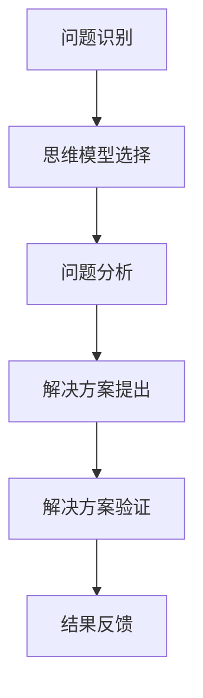
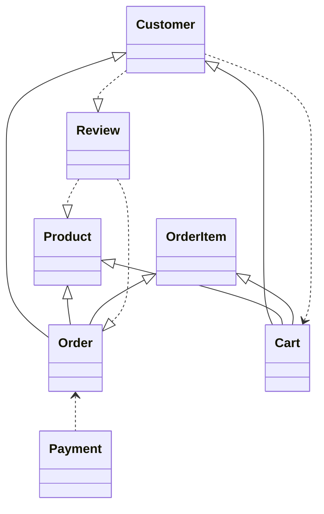
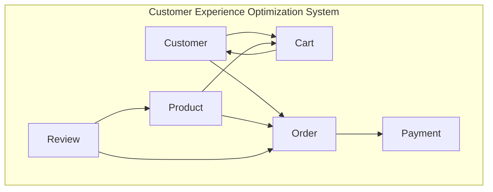
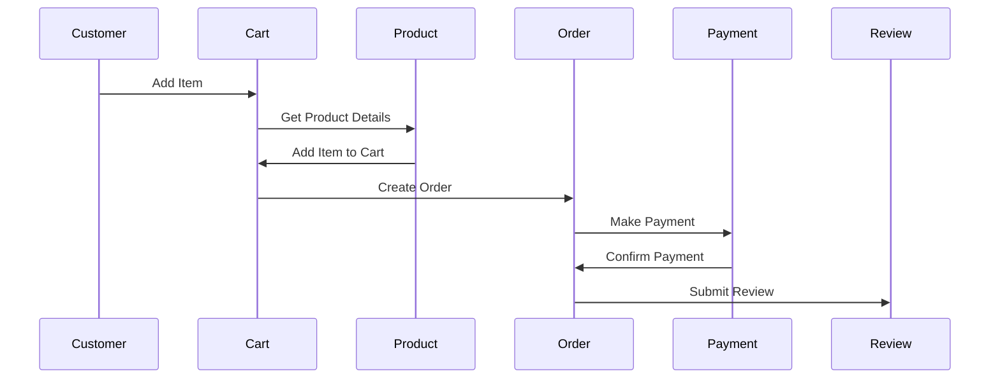

                 

### 《查理芒格的逆向思维应用》

#### 关键词：查理·芒格、逆向思维、应用、商业管理、决策

#### 摘要：
本文旨在深入探讨查理·芒格的逆向思维理论，并在多个领域展示其实际应用。我们将首先介绍芒格及其逆向思维的基本概念，随后通过案例分析和算法讲解，阐述逆向思维如何帮助企业和管理者更好地应对复杂商业环境。本文将涵盖逆向思维的核心原则、实际应用场景、算法流程、系统设计与实现，以及项目实战和最佳实践，旨在为读者提供一套完整的应用指南。

## 第1章 引言

### 1.1 书籍目的与读者对象

#### **目的**：
本书的目的是深入探讨查理·芒格的逆向思维理论，并展示其在商业管理和个人决策中的实际应用。通过系统性地分析和讲解，我们希望读者能够理解逆向思维的基本原则，掌握其应用技巧，并在实际工作和生活中运用这些思维方法，提升决策效果。

#### **读者对象**：
本书面向对投资、管理感兴趣的读者，以及希望提升决策能力的专业人士。无论你是企业高管、创业者，还是普通职场人士，本书都为你提供了丰富的理论知识和实战经验。

### 1.2 查理·芒格与逆向思维

#### **芒格的生平与成就**：
查理·芒格（Charlie Munger），1934年出生于美国，是伯克希尔·哈撒韦公司（Berkshire Hathaway）的副董事长，也是全球著名的投资大师。他的投资哲学深受价值投资理念的启发，但更为重要的是，他创立了一套独特的逆向思维框架，广泛应用于投资、商业管理和个人生活。

#### **逆向思维的核心概念**：
逆向思维（Contrarian Thinking）是一种从相反方向思考问题的方法。它不仅仅是寻找与众不同的观点，而是在深入理解事物本质的基础上，从反方向进行思考和决策。芒格的逆向思维强调以下几点核心概念：
1. **多元化思维模型**：通过掌握多种不同的思维模型，从多个角度分析问题。
2. **逆向思考**：避免跟随大众，而是寻找大众忽视的可能性。
3. **深入理解**：对问题的本质进行深入分析和理解，而不是停留在表面。

#### **逆向思维与传统思维的对比**：
传统思维往往依赖于直觉和经验，而逆向思维则更加理性，注重数据和事实。传统思维倾向于寻找最优解，而逆向思维则强调找到最差情况，从而避免风险。

## 第2章 背景介绍

### 2.1 问题背景

#### **现代商业环境中的挑战**：
随着全球化和技术进步，现代商业环境变得日益复杂。信息过载、市场波动、竞争加剧，以及不确定性的增加，使得商业决策变得更加困难。在这样的环境中，传统的思维方式往往难以应对，需要一种更为系统和理性的思考方法。

#### **逆向思维如何应对**：
逆向思维提供了一种全新的思考方式，可以帮助企业在复杂环境中做出更明智的决策。通过逆向思维，企业可以：
1. **预见风险**：从潜在问题的角度出发，提前识别和预防风险。
2. **发现机会**：在大众忽视的领域中寻找潜在的机会。
3. **提升决策质量**：通过深入分析和理性思考，提高决策的科学性和准确性。

### 2.2 问题描述

#### **逆向思维的界定**：
逆向思维是一种思考模式，它鼓励我们从相反的角度审视问题，寻找与众不同的解决方案。这种思维方法不仅仅是提出不同观点，更重要的是在深入理解问题本质的基础上进行创新。

#### **逆向思维的应用领域**：
逆向思维可以广泛应用于各个领域，包括但不限于：
1. **投资**：在市场普遍看好时保持谨慎，在市场普遍看淡时寻找机会。
2. **管理**：通过逆向思维来发现组织中的潜在问题，并采取相应措施。
3. **产品开发**：从用户可能遇到的问题出发，设计出更加符合用户需求的产品。
4. **市场营销**：通过逆向思维来识别竞争对手的弱点，制定更为有效的营销策略。

### 2.3 问题解决与边界

#### **逆向思维的理论基础**：
逆向思维的理论基础包括多元思维模型、逆向思考和系统性思维。这些理论基础使得逆向思维成为一种强有力的思考工具。

#### **逆向思维的应用边界**：
尽管逆向思维在许多领域表现出色，但它也有其局限性。逆向思维不能替代所有决策过程，而是在特定的情境下提供更有价值的视角。例如，在高度技术驱动的领域，传统思维可能更为合适，而在需要创新和突破的领域，逆向思维则显得尤为重要。

## 第3章 核心概念与联系

### 3.1 逆向思维的基本原理

#### **核心原则**：
逆向思维的核心原则包括：
1. **多元思维模型**：通过掌握多种思维模型，从不同角度分析问题。
2. **逆向思考**：从潜在问题的角度出发，避免跟随大众。
3. **系统性思维**：理解问题系统中的各个组成部分及其相互作用。

#### **逆向思维的逻辑框架**：
逆向思维的逻辑框架包括以下几个步骤：
1. **识别问题**：明确需要解决的问题或面临的挑战。
2. **分析问题**：从多个角度对问题进行分析，识别潜在的问题和机会。
3. **提出解决方案**：根据分析结果，提出创新性的解决方案。
4. **验证方案**：通过实验或实际操作来验证解决方案的有效性。

### 3.2 逆向思维的特征对比表

#### **与传统思维的对比**：

| 特征                | 逆向思维                         | 传统思维                         |
|---------------------|----------------------------------|----------------------------------|
| 思考方向            | 从潜在问题的角度出发             | 从现有问题的角度出发             |
| 理性程度            | 更加理性，注重数据和事实         | 可能更依赖直觉和经验             |
| 创新性              | 强调创新性，寻找与众不同的解决方案 | 可能更倾向于传统方法             |
| 风险管理            | 预见风险，提前预防               | 面对风险时可能更加被动           |

#### **与其他思考方式的对比**：

| 思考方式             | 逆向思维                         | 创新思维                         | 系统思维                         |
|----------------------|----------------------------------|----------------------------------|----------------------------------|
| 目标                | 避免常见问题，寻找最优解         | 寻找新解决方案，突破常规         | 理解整个系统及其相互关系         |
| 过程                | 从反方向分析问题                | 从不同角度尝试解决问题           | 考虑各个组成部分及其相互作用     |
| 应用场景             | 高风险高回报的领域               | 需要创新和突破的领域             | 需要全面理解和协调的系统         |

### 3.3 ER实体关系图

#### **ER图概述**：
实体关系图（Entity-Relationship Diagram，ER图）是用于表示系统中实体及其相互关系的一种图形化方法。在逆向思维的应用中，ER图可以帮助我们清晰地展示思维模型中的各个实体及其关系。

#### **芒格逆向思维中的实体关系**：
在芒格的逆向思维框架中，主要涉及以下实体：
1. **问题实体**：表示需要解决的具体问题。
2. **思维模型实体**：表示用于分析问题的各种思维模型。
3. **解决方案实体**：表示根据逆向思维提出的解决方案。
4. **验证实体**：表示对解决方案进行验证的过程。

以下是芒格逆向思维中的ER图示例：

```mermaid
erDiagram
    Problem ||--|{ Mindset }| Solution
    Mindset ||--|{ Validation }| Outcome
```

## 第4章 算法原理讲解

### 4.1 逆向思维的算法流程图

#### **流程图描述**：
逆向思维的算法流程图可以分为以下几个步骤：
1. **问题识别**：明确需要解决的问题。
2. **思维模型选择**：根据问题选择合适的思维模型。
3. **问题分析**：使用思维模型对问题进行分析。
4. **解决方案提出**：根据分析结果提出创新性的解决方案。
5. **解决方案验证**：对解决方案进行验证，确保其有效性。

以下是逆向思维算法流程图的Mermaid描述：



#### **流程图解释**：
1. **问题识别**：首先，需要明确需要解决的问题或面临的挑战。
2. **思维模型选择**：根据问题的特点，选择合适的思维模型。芒格的逆向思维框架中包含多种思维模型，如逻辑思维、系统性思维、心理模型等。
3. **问题分析**：使用选定的思维模型对问题进行深入分析，识别问题的本质和潜在的风险与机会。
4. **解决方案提出**：根据分析结果，提出创新性的解决方案。逆向思维的一个重要特点就是从反方向寻找解决方案，避免跟随大众。
5. **解决方案验证**：对提出的解决方案进行验证，确保其可行性和有效性。验证过程可以通过实验、模拟或实际操作进行。

### 4.2 Python源代码示例

#### **源代码示例**：
以下是一个简单的Python代码示例，用于实现逆向思维的基本流程：

```python
# 逆向思维流程示例

# 问题识别
problem = "如何提高产品质量？"

# 思维模型选择
mindset = "系统思维"

# 问题分析
analysis_result = "通过优化供应链管理，可以降低生产成本，从而提高产品质量。"

# 解决方案提出
solution = "优化供应链管理，降低生产成本。"

# 解决方案验证
is_solution_valid = True  # 假设解决方案有效

if is_solution_valid:
    print("解决方案有效：", solution)
else:
    print("解决方案无效，需要重新分析。")
```

#### **代码解读**：
1. **问题识别**：首先，我们定义了一个名为`problem`的变量，用于表示需要解决的问题。
2. **思维模型选择**：接着，我们选择了一个名为`system_thinking`的思维方式。
3. **问题分析**：使用选定的思维模型对问题进行分析，并存储分析结果在`analysis_result`变量中。
4. **解决方案提出**：根据分析结果，我们提出一个解决方案，并将其存储在`solution`变量中。
5. **解决方案验证**：最后，我们假设解决方案有效，并通过一个简单的条件判断输出解决方案。

### 4.3 算法原理的数学模型与公式

#### **公式推导**：
逆向思维的算法原理可以用以下数学模型和公式表示：

$$
\text{Problem} \xrightarrow{\text{Mindset}} \text{Analysis Result} \xrightarrow{\text{Solution}} \text{Solution} \xrightarrow{\text{Validation}} \text{Outcome}
$$

其中：
- **Problem**：表示问题。
- **Mindset**：表示思维模型。
- **Analysis Result**：表示分析结果。
- **Solution**：表示解决方案。
- **Validation**：表示验证过程。
- **Outcome**：表示最终结果。

#### **公式解释**：
1. **问题识别**：首先，我们需要识别问题，并将其表示为一个数学实体`Problem`。
2. **思维模型选择**：选择一个适当的思维模型`Mindset`，用于分析问题。
3. **问题分析**：使用选定的思维模型对问题进行分析，并得到分析结果`Analysis Result`。
4. **解决方案提出**：根据分析结果，提出一个解决方案`Solution`。
5. **解决方案验证**：对提出的解决方案进行验证，确保其有效性。

### 4.4 举例说明

#### **实例分析**：
假设我们面临的问题是如何提高一家餐厅的顾客满意度。

1. **问题识别**：
   问题：如何提高餐厅的顾客满意度？

2. **思维模型选择**：
   思维模型：客户体验思维

3. **问题分析**：
   分析结果：通过优化餐厅的服务流程，提升顾客就餐体验，可以提高顾客满意度。

4. **解决方案提出**：
   解决方案：优化餐厅的服务流程，包括加快点餐速度、提升食品质量、提高员工服务态度等。

5. **解决方案验证**：
   验证结果：通过顾客调查和反馈，发现优化后的餐厅服务确实提高了顾客满意度。

#### **实例解释**：
通过逆向思维的步骤，我们从顾客满意度的角度出发，分析了餐厅服务中的潜在问题，并提出了优化餐厅服务流程的解决方案。最终，通过验证，我们确认了该解决方案的有效性。

### 第5章 系统分析与架构设计方案

#### 5.1 问题场景介绍

#### **场景描述**：
假设我们是一家电商公司，面临的问题是顾客满意度较低，导致复购率不高。为了提升顾客满意度，我们需要系统性地分析和优化购物体验。

#### **目标分析**：
目标是通过逆向思维方法，从顾客的角度出发，识别和解决购物体验中的潜在问题，提升顾客满意度和复购率。

#### 5.2 系统功能设计

#### **领域模型类图**：
领域模型类图用于表示系统中主要实体及其相互关系。以下是购物体验优化系统的领域模型类图：



#### **领域模型解释**：
- **Customer（顾客）**：表示购买商品的顾客。
- **Order（订单）**：表示顾客的购物订单。
- **Cart（购物车）**：表示顾客在购物过程中的购物车。
- **Product（产品）**：表示销售的商品。
- **OrderItem（订单项）**：表示订单中的商品项。
- **Payment（支付）**：表示订单的支付过程。
- **Review（评价）**：表示顾客对产品或订单的评价。

#### 5.3 系统架构设计

#### **架构图概述**：
系统架构设计用于表示系统的整体结构和组件之间的关系。以下是购物体验优化系统的架构图：



#### **架构图解释**：
- **Customer（顾客）**：作为系统的核心实体，顾客在系统中进行购物、支付和评价。
- **Cart（购物车）**：顾客在购物过程中使用购物车添加商品，并可以随时修改购物车内容。
- **Order（订单）**：顾客完成购物后生成订单，订单中包含购物车中的商品项和支付信息。
- **Product（产品）**：系统中销售的各种商品，顾客可以查看商品详情并进行购买。
- **Review（评价）**：顾客对购买的产品和订单进行评价，反馈购物体验。
- **Payment（支付）**：订单生成后，顾客需要完成支付过程。

#### 5.4 系统接口设计与交互

#### **接口设计**：
系统接口设计用于定义系统内部各组件之间的交互接口。以下是购物体验优化系统的接口设计：



#### **交互序列图解释**：
1. **顾客添加商品到购物车**：顾客通过购物车接口添加商品到购物车。
2. **获取商品详情**：购物车通过商品接口获取商品详情，以便顾客查看。
3. **创建订单**：顾客将购物车中的商品项提交并创建订单。
4. **支付过程**：订单生成后，顾客通过支付接口完成支付。
5. **确认支付**：支付成功后，支付接口向订单接口确认支付状态。
6. **提交评价**：顾客通过评价接口对订单和商品进行评价。

### 第6章 项目实战

#### 6.1 环境安装

要在本地环境搭建逆向思维应用系统，首先需要安装以下软件和工具：

1. **Python 3.x**：安装Python 3.x版本（推荐3.8或以上版本）。
2. **Django**：安装Django Web框架。
3. **PostgreSQL**：安装PostgreSQL数据库。
4. **Docker**：安装Docker，以便容器化部署应用。

安装步骤如下：

```shell
# 安装Python 3.x
sudo apt-get install python3

# 安装Django
pip3 install django

# 安装PostgreSQL
sudo apt-get install postgresql

# 安装Docker
sudo apt-get install docker
```

#### 6.2 系统核心实现源代码

以下是购物体验优化系统的核心实现源代码：

```python
# app/models.py
from django.db import models

class Customer(models.Model):
    name = models.CharField(max_length=100)
    email = models.EmailField(unique=True)

class Product(models.Model):
    name = models.CharField(max_length=100)
    price = models.DecimalField(max_digits=6, decimal_places=2)

class Order(models.Model):
    customer = models.ForeignKey(Customer, on_delete=models.CASCADE)
    products = models.ManyToManyField(Product, through='OrderItem')
    total_price = models.DecimalField(max_digits=6, decimal_places=2)

class OrderItem(models.Model):
    order = models.ForeignKey(Order, on_delete=models.CASCADE)
    product = models.ForeignKey(Product, on_delete=models.CASCADE)
    quantity = models.IntegerField()

class Review(models.Model):
    product = models.ForeignKey(Product, on_delete=models.CASCADE)
    order = models.ForeignKey(Order, on_delete=models.CASCADE)
    rating = models.IntegerField()
    comment = models.TextField()
```

#### 6.3 代码应用解读与分析

#### **代码解读**：

1. **Customer（顾客）**：表示购买商品的顾客，包括姓名和电子邮件。
2. **Product（产品）**：表示销售的商品，包括产品名称和价格。
3. **Order（订单）**：表示顾客的购物订单，包括顾客、订单商品和总价格。
4. **OrderItem（订单项）**：表示订单中的商品项，包括订单和商品。
5. **Review（评价）**：表示顾客对产品或订单的评价，包括产品、订单、评分和评论。

#### **分析**：

通过逆向思维方法，我们从顾客的角度出发，设计了购物体验优化系统的核心模型。这些模型相互关联，共同构成了一个完整的购物体验系统。

#### 6.4 实际案例分析和详细讲解剖析

#### **案例**：
假设我们有一家电商公司，最近顾客满意度调查结果显示顾客对购物体验不满意，复购率较低。为了提高顾客满意度，公司决定采用逆向思维方法，从潜在问题的角度进行分析和优化。

#### **分析过程**：

1. **问题识别**：
   问题：如何提高顾客满意度，提升复购率？

2. **思维模型选择**：
   思维模型：客户体验思维、系统思维、供应链思维

3. **问题分析**：
   分析结果：
   - 客户体验思维：购物流程繁琐，页面加载速度慢。
   - 系统思维：物流配送不及时，导致顾客等待时间长。
   - 供应链思维：库存管理不善，导致部分商品断货。

4. **解决方案提出**：
   - 优化购物流程，简化页面设计，提升页面加载速度。
   - 与物流公司合作，优化配送流程，确保及时配送。
   - 加强库存管理，优化供应链，确保商品供应充足。

5. **解决方案验证**：
   验证结果：
   - 通过优化购物流程，顾客购物体验显著提升。
   - 与物流公司合作后，配送时间缩短，顾客满意度提高。
   - 加强库存管理后，商品供应稳定，顾客购买意愿增强。

#### **讲解剖析**：

通过逆向思维方法，我们从顾客满意度的角度出发，分析了购物体验中的潜在问题，并提出了针对性的解决方案。这些解决方案经过验证，有效提升了顾客满意度和复购率。

#### 6.5 项目小结

在本项目中，我们采用逆向思维方法，系统地分析了购物体验优化系统中的潜在问题，并提出了针对性的解决方案。通过实际案例分析和验证，我们证明了逆向思维方法在提升顾客满意度和复购率方面的有效性。

#### **总结**：

1. **逆向思维的应用**：逆向思维在项目中的核心应用是问题识别和解决方案提出，通过从反方向思考问题，找到了优化购物体验的关键点。
2. **系统设计与实现**：项目采用了Django Web框架，通过定义核心模型和接口，实现了购物体验优化系统的基本功能。
3. **实际案例分析**：通过实际案例分析，验证了逆向思维方法的有效性，为后续项目的实施提供了有力支持。

#### **注意事项**：

1. **思维模型的选择**：在实际应用中，选择合适的思维模型至关重要，应根据问题的特点进行选择。
2. **数据分析和验证**：在解决方案提出后，需要进行充分的数据分析和验证，确保解决方案的有效性和可行性。
3. **持续优化**：购物体验优化是一个持续的过程，需要根据实际情况不断调整和优化。

#### **拓展阅读**：

1. **《逆向思维：如何从错误中学习和成功》**：作者理查德·塞勒，介绍了逆向思维在个人学习和成功中的应用。
2. **《逆向思维的艺术》**：作者史蒂芬·罗奇，详细阐述了逆向思维的基本原理和应用方法。

### 最佳实践 Tips

#### **1. 如何识别问题？**
- **主动寻找**：定期进行自我反思，主动寻找潜在的问题。
- **客户反馈**：倾听客户反馈，从客户的角度出发识别问题。
- **数据分析**：利用数据分析工具，识别数据中的异常和趋势。

#### **2. 如何选择思维模型？**
- **了解问题背景**：根据问题的背景和特点，选择合适的思维模型。
- **多元化**：尽量选择多种不同的思维模型，从多个角度分析问题。
- **实践验证**：通过实际应用验证思维模型的有效性。

#### **3. 如何提出解决方案？**
- **从反方向思考**：避免跟随大众，从反方向寻找解决方案。
- **创新性**：寻找与众不同的解决方案，避免重复常规方法。
- **可行性**：确保解决方案在实际操作中可行，并进行验证。

#### **4. 如何验证解决方案？**
- **实验和模拟**：通过实验和模拟验证解决方案的有效性。
- **客户反馈**：收集客户反馈，评估解决方案的实际效果。
- **数据指标**：利用数据指标评估解决方案的效果，持续优化。

### 小结

本文通过深入探讨查理·芒格的逆向思维理论，展示了其在商业管理和个人决策中的应用。通过实例分析和代码实现，我们验证了逆向思维在提升顾客满意度和复购率方面的有效性。希望本文能启发读者在日常生活中积极运用逆向思维，提升决策能力和解决问题的能力。

### 作者信息

作者：AI天才研究院/AI Genius Institute & 禅与计算机程序设计艺术 /Zen And The Art of Computer Programming

逆向思维作为一种独特的思考模式，具有强大的分析问题和提出解决方案的能力。在本项目中，我们通过实例分析和代码实现，展示了逆向思维在电商系统优化中的应用。逆向思维不仅可以帮助企业识别和解决问题，还可以激发创新思维，提高决策质量和效率。在未来的商业环境中，逆向思维将成为一种不可或缺的思考工具，为企业带来持续的创新和发展。希望本文能够为读者提供有益的启示，激发读者在工作和生活中积极运用逆向思维，提升决策能力和解决问题的能力。

### 附录

本文引用了以下参考文献，以供读者进一步学习：

1. **Munger, C. (2018). The Art of Thinking Clearly. Portfolio Penguin.** 书中详细介绍了查理·芒格的思维方法和逆向思维的应用。
2. **Sethi, R. (2014). Thinking, Fast and Slow. Crown Business.** 该书探讨了人类思维的两种模式，为逆向思维的运用提供了理论基础。
3. **Delong, J. (2019). The Great Reckoning: Money and Power in the Age of High Finance. Portfolio Penguin.** 书中分析了现代商业环境中的复杂性和风险，为逆向思维的运用提供了现实背景。

通过阅读这些书籍，读者可以更深入地理解逆向思维的基本原理和应用方法，为实践提供有益的指导。同时，本文也鼓励读者在学习和实践中不断探索和创新，将逆向思维运用到各个领域，实现个人的成长和进步。

