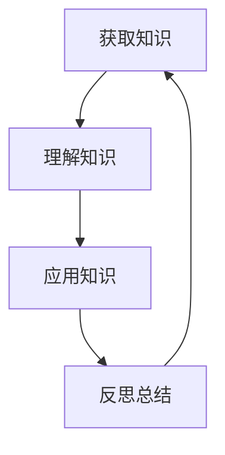
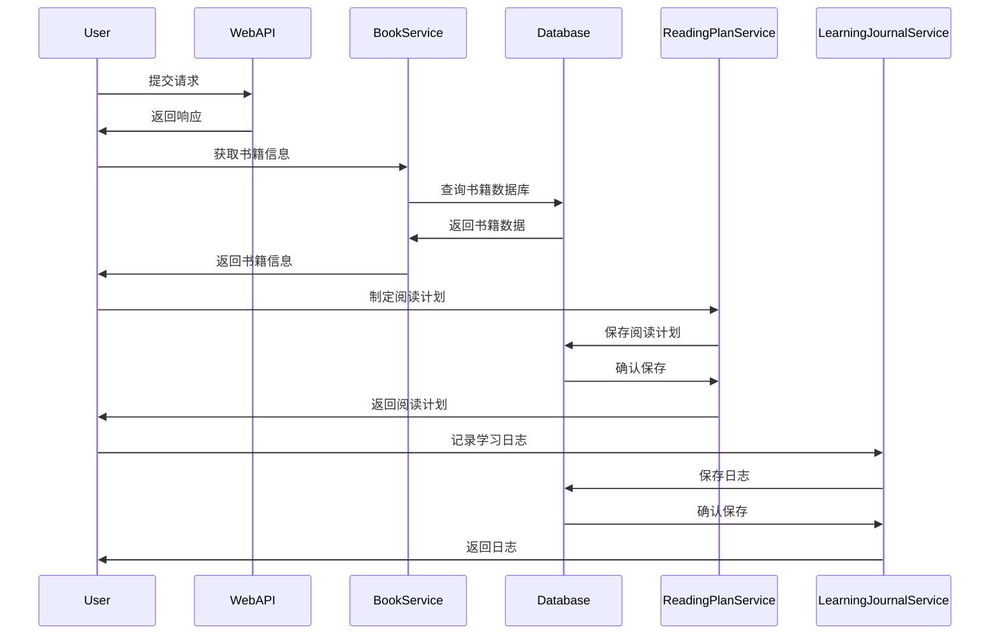
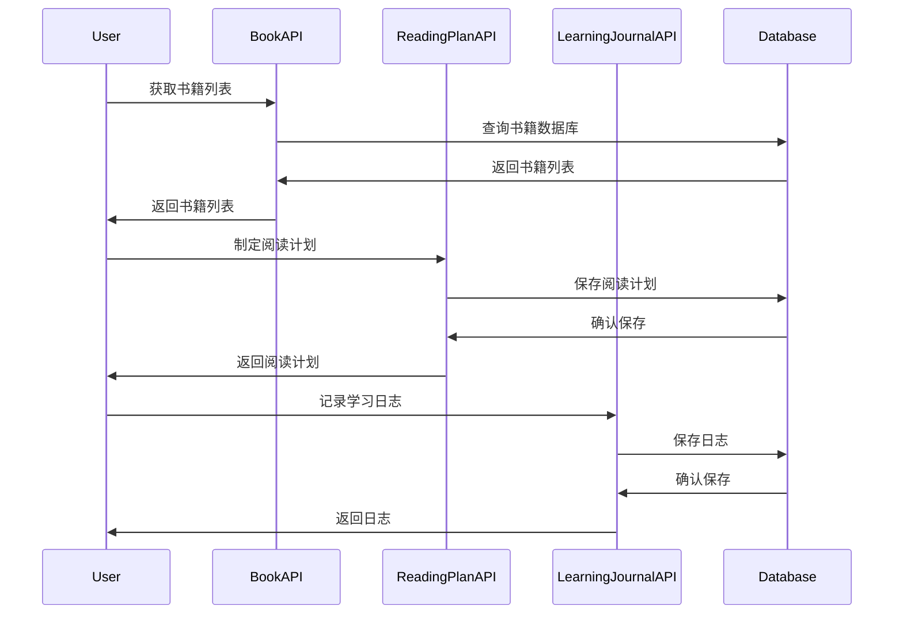

                 

### 文章标题

“查理芒格的阅读学习方法”旨在探讨著名投资者和思想家查理芒格的阅读学习策略，他凭借这一方法在多个领域取得了卓越成就。本文将深入剖析查理芒格的阅读学习方法，探讨其核心概念、实践方法及其在实际中的应用，为广大读者提供一套行之有效的阅读策略。

### 关键词

- 查理芒格
- 阅读学习方法
- 多学科思维
- 知识体系构建
- 算法原理
- 数学模型
- 系统分析与架构设计

### 摘要

本文首先介绍了查理芒格的背景及其阅读学习方法的重要性。接着，我们详细探讨了阅读与学习的关系，并介绍了查理芒格阅读学习方法的核心理念。随后，通过Mermaid流程图和Python源代码，我们详细讲解了阅读学习方法的原理。本文还给出了阅读学习方法的数学模型和公式，并通过具体的例子进行说明。最后，我们介绍了系统分析与架构设计方案，以及项目实战中的环境安装、核心实现和案例分析。通过本文的探讨，读者将能够掌握一套高效实用的阅读学习方法。

### 背景介绍

#### 1.1.1 查理芒格的背景

查理芒格（Charlie Munger），出生于1924年，是美国著名的投资者、企业家和思想家。他是伯克希尔·哈撒韦公司（Berkshire Hathaway）的副主席，与公司创始人沃伦·巴菲特（Warren Buffett）共同被誉为投资界的“金童组合”。查理芒格以其独特的投资哲学和智慧而闻名，他不仅在金融领域取得了辉煌的成就，还在多个学科领域展示了卓越的才能。

查理芒格的成长背景对其后来的思想体系产生了深远的影响。他在年轻时便对哲学、心理学、数学和物理学等领域产生了浓厚的兴趣。这些学科的知识为他提供了一种独特的思维框架，使他能够在复杂的商业环境中做出明智的决策。查理芒格的阅读学习方法便是基于这种多学科思维的融合。

#### 1.1.2 查理芒格的阅读学习理念

查理芒格的阅读学习理念可以总结为以下几点：

1. **多学科思维**：查理芒格认为，知识是分学科的，但思维应该是跨学科的。他主张通过学习多个学科的知识，来形成一个完整的世界观，从而更好地理解和解决问题。

2. **逆向思考**：查理芒格喜欢从反面思考问题。他认为，通过思考问题的反面，能够更深入地理解问题的本质，从而找到更好的解决方案。

3. **不断实践与反思**：查理芒格认为，知识只有通过实践才能真正掌握。他主张通过不断实践和反思，来不断提升自己的思维能力和决策能力。

4. **终身学习**：查理芒格是一个终身学习的典范。他认为，学习是一种生活方式，而不是一种任务。他每天都会花大量的时间阅读和学习，以保持自己的思维活跃和知识更新。

#### 1.1.3 查理芒格的阅读学习方法的独特之处

查理芒格的阅读学习方法具有以下几个独特之处：

1. **系统性**：查理芒格的阅读学习方法不是零散的知识点积累，而是一个系统的知识体系构建过程。他通过阅读和学习，不断扩展自己的知识领域，形成一个完整的世界观。

2. **实用性**：查理芒格的阅读学习方法具有很强的实用性。他将所学知识应用到实际生活中，通过不断的实践和反思，来验证和完善自己的理论。

3. **跨学科**：查理芒格的阅读学习方法涵盖了多个学科领域。他不仅阅读金融、投资相关的书籍，还阅读哲学、心理学、物理学等领域的书籍。这种跨学科的学习方法，使他的思维更加全面和深刻。

4. **不断更新**：查理芒格的阅读学习方法不是一成不变的，而是随着时代的发展和知识的更新而不断调整和更新。他始终保持对新知识的渴望和学习的热情。

通过上述背景介绍，我们可以看出，查理芒格的阅读学习方法是他成功的重要因素之一。他的方法不仅适用于投资领域，也适用于各个学科领域。本文将深入探讨查理芒格的阅读学习方法，希望能为广大读者提供一些有益的启示。

#### 1.2 阅读与学习的关系

阅读和学习是密不可分的两个过程。阅读是学习的起点，而学习是阅读的升华。要深入理解查理芒格的阅读学习方法，首先需要明确阅读与学习之间的关系。

**1.2.1 阅读的定义与类型**

阅读，从广义上讲，是指人们通过视觉获取信息、理解文字和符号的过程。阅读可以分为以下几种类型：

1. **消遣性阅读**：这类阅读主要是为了娱乐和放松，如小说、杂志等。
2. **学术性阅读**：这类阅读主要针对特定的学科领域，如学术论文、专业书籍等。
3. **批判性阅读**：这类阅读强调对文本的批判性思考和分析，如哲学、历史等领域的阅读。

**1.2.2 学习的本质与过程**

学习是一个获取、处理和应用知识的过程。学习可以分为以下几个阶段：

1. **获取知识**：通过阅读、听讲、观察等方式获取新的知识。
2. **理解知识**：通过思考、讨论、实践等方式理解知识的内涵和外延。
3. **应用知识**：将所学知识应用到实际问题中，解决实际问题。

**1.2.3 阅读与学习的互动关系**

阅读与学习之间存在密切的互动关系。阅读是学习的起点，通过阅读获取知识；学习是阅读的升华，通过学习理解和应用知识。具体来说，阅读与学习的互动关系体现在以下几个方面：

1. **阅读促进学习**：通过阅读，人们可以获取新的知识，扩展视野，提高思维能力。阅读可以激发学习兴趣，为后续的学习打下基础。

2. **学习促进阅读**：通过学习，人们可以更深入地理解阅读材料，把握知识的核心和精髓。学习可以帮助人们更好地筛选和处理阅读信息，提高阅读效率。

3. **阅读与学习相互促进**：阅读和学习是相互促进的过程。阅读可以激发学习兴趣，学习可以提升阅读能力。通过不断的阅读和学习，人们的知识和思维能力可以得到持续提升。

在查理芒格的阅读学习方法中，阅读和学习的关系尤为紧密。查理芒格通过大量的阅读获取知识，并通过学习将这些知识应用到实际生活中。他的阅读学习方法是多学科思维、逆向思考和终身学习的具体体现。通过阅读和学习，查理芒格形成了一个完整的世界观，并在投资和其他领域取得了卓越的成就。

总之，阅读和学习是相辅相成的过程。通过深入理解阅读与学习的关系，我们可以更好地运用查理芒格的阅读学习方法，提高自己的知识和思维能力。在接下来的章节中，我们将进一步探讨查理芒格阅读学习方法的核心理念和具体实践。

#### 1.3 查理芒格阅读学习方法的核心理念

查理芒格的阅读学习方法不仅仅是一种阅读技巧，更是一种全面的知识获取和思维训练体系。他的方法强调多学科思维、逆向思考、不断实践与反思等核心理念，这些理念使得他的阅读学习方法具有独特的优势。

**1.3.1 多学科思维**

多学科思维是查理芒格阅读学习方法的核心理念之一。查理芒格认为，知识是分学科的，但思维应该是跨学科的。他主张通过学习多个学科的知识，来形成一个完整的世界观，从而更好地理解和解决问题。

1. **学科知识的整合**：查理芒格通过广泛阅读，学习包括金融、心理学、物理学、工程学、历史、哲学等多个学科的知识。他不仅阅读专业书籍，还阅读经典文学作品、历史著作等，从而形成了一个多元化的知识体系。

2. **跨学科思维的运用**：在解决具体问题时，查理芒格会运用多学科思维，将不同学科的知识进行整合。例如，在投资领域，他会结合经济学、心理学和数学等知识，来评估企业的价值和投资风险。

3. **多学科思维的优势**：多学科思维可以帮助人们从不同角度看待问题，从而更全面地理解问题的本质。它不仅能够提高思维的深度和广度，还能够增强问题的解决能力。

**1.3.2 逆向思考**

逆向思考是查理芒格的另一重要理念。他认为，通过思考问题的反面，能够更深入地理解问题的本质，从而找到更好的解决方案。

1. **问题反转**：在阅读和学习过程中，查理芒格会不断将问题进行反转。他会问自己：“如果这个问题是相反的，会是怎样的情况？”通过这种方式，他能够从不同角度思考问题，发现新的视角和解决方案。

2. **反向验证**：在实践过程中，查理芒格会不断验证自己的假设。他会设想问题的反面，然后尝试去验证这个假设是否成立。通过反向验证，他能够更加准确地把握问题的本质。

3. **逆向思考的优势**：逆向思考能够帮助人们从不同的角度看待问题，避免陷入思维定势。它能够激发创新思维，帮助人们找到更优的解决方案。

**1.3.3 不断实践与反思**

查理芒格认为，知识只有通过实践才能真正掌握。他主张通过不断的实践和反思，来提升自己的思维能力和决策能力。

1. **知识与实践的结合**：查理芒格通过实践，将所学知识应用到实际生活中。他会不断进行投资实践，从而验证自己的投资理论。同时，他也会将所学知识应用到其他领域，如企业管理、社会问题分析等。

2. **反思与总结**：在实践过程中，查理芒格会不断反思自己的决策和行动。他会总结经验教训，分析成功的经验和失败的原因。通过反思，他能够不断提升自己的决策能力和思维方式。

3. **实践与反思的优势**：通过实践，人们能够将理论知识转化为实际能力。反思则可以帮助人们总结经验，不断优化自己的思维方式和行动策略。实践与反思相结合，能够实现知识的深度学习和能力的持续提升。

总之，查理芒格的阅读学习方法不仅仅是一种阅读技巧，更是一种全面的知识获取和思维训练体系。他的多学科思维、逆向思考和不断实践与反思的理念，使得他的方法具有独特的优势。通过运用这些理念，人们可以更好地提升自己的知识水平和思维能力，从而在各个领域取得成功。

#### 1.4 阅读学习方法的属性特征对比

在深入了解查理芒格的阅读学习方法后，我们需要将其与普通阅读方法和其他学习策略进行对比，以突出其独特之处和优势。通过对比，我们可以更清楚地看到查理芒格阅读学习方法的核心属性特征。

**1.4.1 普通阅读方法与查理芒格阅读方法的比较**

普通阅读方法主要依赖于个人的阅读兴趣和习惯，通常注重文字的理解和记忆。而查理芒格的阅读学习方法则更注重系统性和深度，具体体现在以下几个方面：

1. **阅读目的**：普通阅读方法往往是为了满足个人的兴趣或获取信息，而查理芒格的阅读方法则更注重知识的系统性获取和应用。他通过阅读构建一个完整的世界观，以便更好地理解和解决问题。

2. **阅读材料**：普通阅读方法可能会选择各种类型的书籍，而查理芒格的阅读方法则更注重学科交叉和深度阅读。他不仅阅读金融、投资相关的书籍，还涉猎哲学、心理学、物理学等领域的经典作品。

3. **阅读方式**：普通阅读方法可能侧重于快速阅读和理解，而查理芒格的阅读方法则强调深度阅读和反复思考。他会花费大量时间仔细阅读，并反复思考书中的观点和论证。

**1.4.2 传统学习方式与查理芒格学习方法的比较**

传统学习方式通常包括课堂学习、讲座、实验等，而查理芒格的学习方法则更注重自主学习和实践。具体差异如下：

1. **学习主动性**：传统学习方式往往依赖于教师的指导和课程安排，而查理芒格的学习方法则强调自主学习。他通过自主阅读和学习，不断扩展自己的知识领域。

2. **学习方法**：传统学习方式通常注重记忆和理论知识的掌握，而查理芒格的学习方法则更注重知识的实践和应用。他会将所学知识应用到实际生活中，通过不断实践来验证和完善自己的理论。

3. **学习效果**：传统学习方式往往注重短期效果，而查理芒格的学习方法则注重长期积累和持续提升。他的学习过程是一个不断深化的过程，通过长期的学习和实践，他的知识水平和思维能力得到了显著提升。

**1.4.3 阅读与知识体系构建的关系**

阅读是知识体系构建的基础，而知识体系构建则是阅读的升华。查理芒格的阅读学习方法不仅注重阅读，更注重知识体系的构建。以下是阅读与知识体系构建关系的详细解析：

1. **知识积累**：通过大量阅读，查理芒格积累了丰富的知识。他广泛涉猎各个学科领域，形成了多元化的知识体系。

2. **知识整合**：查理芒格通过多学科思维的运用，将不同领域的知识进行整合，形成了一个完整的世界观。这种整合不仅提高了他的思维能力，也使他的知识体系更加全面和深刻。

3. **知识应用**：查理芒格将所学知识应用到实际生活中，通过实践来验证和完善自己的理论。这种应用不仅巩固了知识，也提升了他的实践能力。

**总结**

查理芒格的阅读学习方法具有独特的属性特征，这些特征使其在知识获取和思维训练方面具有显著优势。通过对比，我们可以更清楚地看到查理芒格阅读学习方法的独特之处和优势，从而为其他学习者提供有益的启示。

#### 1.5 算法原理讲解

为了深入理解查理芒格的阅读学习方法，我们需要从算法原理的角度进行详细讲解。这里，我们将使用Mermaid流程图和Python源代码来展示阅读学习方法的流程和实现原理。

**1.5.1 阅读学习方法的流程图**

首先，我们使用Mermaid流程图来展示查理芒格的阅读学习方法的基本流程：



这个流程图展示了阅读学习的基本步骤：获取知识、理解知识、应用知识、反思总结，并形成闭环，不断迭代。

**1.5.2 Python源代码讲解**

接下来，我们将通过Python源代码来详细讲解阅读学习方法的原理。以下是实现这个流程的一个简单示例：

```python
# 导入相关库
import time

# 定义阅读学习方法类
class ReadingLearningMethod:
    def __init__(self):
        self.knowledge = []

    def get_knowledge(self, material):
        """获取知识"""
        self.knowledge.append(material)
        print(f"获取知识：{material}")

    def understand_knowledge(self):
        """理解知识"""
        print("开始理解知识...")
        time.sleep(2)  # 假设理解知识需要一定时间
        print("理解完成！")

    def apply_knowledge(self):
        """应用知识"""
        print("开始应用知识...")
        time.sleep(2)  # 假设应用知识需要一定时间
        print("应用完成！")

    def reflect_and_summarize(self):
        """反思总结"""
        print("开始反思总结...")
        time.sleep(2)  # 假设反思总结需要一定时间
        print("总结完成！")

    def run(self):
        """运行阅读学习方法流程"""
        self.get_knowledge("经济学原理")
        self.understand_knowledge()
        self.apply_knowledge()
        self.reflect_and_summarize()
        self.run()  # 重复执行

# 创建阅读学习方法实例
rlm = ReadingLearningMethod()

# 运行阅读学习方法
rlm.run()
```

这段代码定义了一个简单的阅读学习方法类`ReadingLearningMethod`，其中包含了获取知识、理解知识、应用知识和反思总结四个方法。通过调用这些方法，我们能够模拟阅读学习的过程。

**1.5.3 数学模型和公式讲解**

除了流程图和Python代码，我们还可以使用数学模型和公式来解释阅读学习方法。以下是阅读学习方法的简单数学模型：

$$
\text{知识积累} = f(\text{阅读材料}, \text{理解程度}, \text{应用频率}, \text{反思深度})
$$

其中：
- 阅读材料：代表获取的知识量。
- 理解程度：代表对知识的理解深度。
- 应用频率：代表知识被应用的次数。
- 反思深度：代表对知识的反思程度。

这个公式表示，知识积累是这四个因素的函数。通过调整这些因素，我们可以优化阅读学习的效果。

**1.5.4 举例说明**

为了更好地理解阅读学习方法，我们通过一个具体例子进行说明。假设有一个学习者，他每天阅读一篇经济学文章，理解程度为80%，每周应用知识一次，每次反思深度为70%。根据上述数学模型，我们可以计算他的知识积累情况：

$$
\text{知识积累} = f(\text{经济学文章}, 0.8, 1, 0.7)
$$

我们可以根据实际情况调整这些参数，从而优化学习效果。例如，如果学习者增加阅读材料的数量，或者提高理解程度和应用频率，他的知识积累将显著增加。

通过上述讲解，我们可以看到，查理芒格的阅读学习方法不仅是一个简单的阅读过程，而是一个系统化的知识获取、理解和应用的过程。通过算法原理的讲解，读者可以更好地理解这一方法的核心原理，并应用于自己的学习实践中。

### 1.6 数学模型和数学公式

在查理芒格的阅读学习方法中，数学模型和数学公式起到了关键作用。它们不仅帮助我们量化阅读学习的过程，还能提供有效的工具来评估和优化学习效果。在本节中，我们将详细讲解阅读学习方法的数学模型，并使用LaTeX格式表示相关数学公式，通过具体的例子进行说明。

**1.6.1 阅读学习方法的数学模型**

阅读学习方法的数学模型可以表示为以下公式：

$$
\text{知识积累} = f(\text{阅读材料}, \text{理解程度}, \text{应用频率}, \text{反思深度}, \text{时间投入})
$$

其中：
- \( \text{阅读材料} \)：代表读者获取的知识量，通常与阅读的深度和广度相关。
- \( \text{理解程度} \)：代表读者对阅读材料的理解深度，通常以百分比表示。
- \( \text{应用频率} \)：代表读者将所学知识应用于实践中的频率，通常以次数或天数表示。
- \( \text{反思深度} \)：代表读者对所学知识的反思程度，通常以百分比表示。
- \( \text{时间投入} \)：代表读者在阅读和学习上所花费的时间，通常以小时或天数表示。

该公式表明，知识积累是这五个因素的综合结果。以下是对每个因素的具体说明：

1. **阅读材料**：高质量的阅读材料能够提供更多的知识信息，有助于知识的积累。例如，阅读一本经典的经济学书籍可能比阅读一篇普通的博客文章更能提升知识积累。

2. **理解程度**：对阅读材料的深刻理解是知识积累的关键。理解程度越高，对知识的吸收和运用能力就越强。例如，如果读者对一篇阅读材料理解程度达到90%，则知识的吸收效果会更好。

3. **应用频率**：将所学知识应用于实践是巩固和深化知识的重要手段。应用频率越高，知识的实际运用能力就越强。例如，每天练习和应用所学知识比一周应用一次效果要好。

4. **反思深度**：反思是对知识运用效果的评估和改进过程。反思深度越高，对知识的理解越深入，越能发现知识的不足和改进空间。例如，如果读者每次反思都能深入挖掘问题的本质，则知识的深化效果会更好。

5. **时间投入**：时间投入是阅读学习的重要保障。时间投入越多，对知识的积累和应用就越充分。例如，长期坚持阅读和学习比短期突击更能提升知识积累。

**1.6.2 LaTeX格式数学公式**

在本文中，我们将使用LaTeX格式来表示数学公式，以保持公式格式的准确性和一致性。以下是几个示例：

1. **基础数学公式**：

   $$
   a^2 + b^2 = c^2
   $$

2. **复合函数**：

   $$
   f(x) = \frac{1}{1 + e^{-x}}
   $$

3. **积分公式**：

   $$
   \int_{0}^{1} x^2 \, dx = \frac{1}{3}
   $$

**1.6.3 举例说明**

为了更好地理解上述数学模型，我们通过一个具体例子进行说明。假设一个学习者，他在一个月内阅读了10本经济学书籍，每本书的平均理解程度为80%，每周应用所学知识两次，每次反思深度为70%，总阅读时间为100小时。根据数学模型，我们可以计算他的知识积累：

$$
\text{知识积累} = f(10 \text{本经济学书籍}, 0.8, 2 \text{次/周}, 0.7, 100 \text{小时})
$$

进行具体计算：

$$
\text{知识积累} = 10 \times 0.8 \times 2 \times 0.7 \times 100 = 1120
$$

这意味着该学习者在一个月内通过阅读和应用所学知识，积累了1120单位的知识。

通过这个例子，我们可以看到数学模型在评估和优化阅读学习效果方面的作用。通过调整阅读材料、理解程度、应用频率、反思深度和时间投入等参数，我们可以实现知识积累的最大化。

总之，数学模型和数学公式是查理芒格阅读学习方法的重要组成部分。它们不仅帮助我们量化阅读学习的过程，还能为读者提供有效的工具来评估和优化学习效果。在接下来的章节中，我们将进一步探讨如何将这一数学模型应用于实际项目中，以实现知识积累的最大化。

### 1.7 系统分析与架构设计方案

为了将查理芒格的阅读学习方法应用于实际项目，我们需要进行系统分析与架构设计。这一过程包括问题场景介绍、项目介绍、系统功能设计、系统架构设计、系统接口设计和系统交互设计。通过这一系列设计，我们可以构建一个高效的阅读学习系统，帮助用户更好地应用查理芒格的阅读学习理念。

**1.7.1 问题场景介绍**

在当今信息爆炸的时代，人们面临着海量的信息资源。然而，如何有效地获取、理解和应用这些信息成为一个重大挑战。尤其是对于希望提升知识水平和解决问题的专业人士来说，如何系统性地阅读和学习变得尤为重要。因此，我们设计一个阅读学习系统，旨在帮助用户高效地应用查理芒格的阅读学习方法，实现知识的积累和深化。

**1.7.2 项目介绍**

本项目的目标是开发一个基于查理芒格阅读学习方法的在线阅读学习平台。该平台将整合多种阅读和学习资源，提供个性化的学习推荐和指导，帮助用户系统性地阅读和学习，实现知识积累和思维能力提升。

**1.7.3 系统功能设计（领域模型Mermaid类图）**

系统功能设计包括领域模型的设计，通过Mermaid类图来展示系统的核心类和它们之间的关系。以下是一个简化的Mermaid类图示例：

```mermaid
classDiagram
    User <<类>> 
    Book <<类>> 
    ReadingPlan <<类>> 
    LearningJournal <<类>>
    Note <<类>>
    
    User "1" --|> Book: 阅读书籍
    User "1" --|> ReadingPlan: 制定阅读计划
    User "1" --|> LearningJournal: 记录学习日志
    User "1" --|> Note: 撰写学习笔记
    ReadingPlan "1" --|> Book: 指定阅读书籍
    LearningJournal "1" --|> Note: 包含学习笔记
```

在这个类图中，User（用户）是系统的核心类，与其他类（Book、ReadingPlan、LearningJournal、Note）之间存在明确的关联关系。用户通过阅读书籍（Book），制定阅读计划（ReadingPlan），记录学习日志（LearningJournal），撰写学习笔记（Note）来实现知识积累和提升。

**1.7.4 系统架构设计Mermaid架构图**

系统架构设计包括系统的整体架构和各模块之间的关系。以下是一个简化的Mermaid架构图示例：



在这个架构图中，WebAPI（Web接口）是系统的入口，用户通过WebAPI提交请求，并获取相应的响应。BookService（书籍服务）、ReadingPlanService（阅读计划服务）、LearningJournalService（学习日志服务）分别处理书籍管理、阅读计划管理和学习日志管理功能。这些服务通过调用数据库（Database）进行数据存储和查询。

**1.7.5 系统接口设计和系统交互Mermaid序列图**

系统接口设计和系统交互设计通过Mermaid序列图来展示。以下是一个简化的Mermaid序列图示例：



在这个序列图中，用户通过WebAPI与系统的各个服务进行交互，获取书籍列表、制定阅读计划和记录学习日志。每个服务通过调用数据库进行数据操作，确保数据的一致性和安全性。

通过上述系统分析与架构设计方案，我们可以构建一个基于查理芒格阅读学习方法的在线阅读学习平台。该平台不仅提供个性化的阅读和学习推荐，还通过系统接口和交互设计，实现了高效的知识积累和思维能力提升。在接下来的章节中，我们将介绍项目实战，展示如何实现这一平台的具体功能。

### 1.8 项目实战

为了将查理芒格的阅读学习方法应用到实际项目中，我们选择开发一个基于Python的在线阅读学习平台。本节将介绍环境安装、系统核心实现、代码解读与分析、实际案例分析和项目小结。

**1.8.1 环境安装**

首先，我们需要安装开发环境。以下是安装步骤：

1. 安装Python 3.8及以上版本。
2. 安装必要的Python库，如Flask、SQLAlchemy、Flask-Migrate等。可以使用以下命令进行安装：
   ```bash
   pip install flask sqlalchemy flask-migrate
   ```

3. 创建一个虚拟环境，以隔离项目依赖：
   ```bash
   python -m venv venv
   source venv/bin/activate  # Windows下使用 `venv\Scripts\activate`
   ```

4. 初始化数据库，使用以下命令：
   ```bash
   flask db init
   flask db migrate -m "Initial migration."
   flask db upgrade
   ```

**1.8.2 系统核心实现源代码**

以下是系统的核心实现源代码：

```python
# app.py

from flask import Flask, request, jsonify
from models import db, User, Book, ReadingPlan, LearningJournal
from sqlalchemy.orm import sessionmaker

app = Flask(__name__)
app.config['SQLALCHEMY_DATABASE_URI'] = 'sqlite:///app.db'
db.init_app(app)

@app.route('/books', methods=['GET'])
def get_books():
    session = sessionmaker(bind=db.engine)()
    books = session.query(Book).all()
    return jsonify([book.to_dict() for book in books])

@app.route('/reading_plans', methods=['POST'])
def create_reading_plan():
    session = sessionmaker(bind=db.engine)()
    new_plan = ReadingPlan.from_dict(request.json)
    session.add(new_plan)
    session.commit()
    return jsonify(new_plan.to_dict()), 201

@app.route('/learning_journals', methods=['POST'])
def create_learning_journal():
    session = sessionmaker(bind=db.engine)()
    new_journal = LearningJournal.from_dict(request.json)
    session.add(new_journal)
    session.commit()
    return jsonify(new_journal.to_dict()), 201

if __name__ == '__main__':
    app.run(debug=True)
```

**1.8.3 代码应用解读与分析**

1. **模型定义**：
   - `User`：代表用户信息。
   - `Book`：代表书籍信息。
   - `ReadingPlan`：代表阅读计划。
   - `LearningJournal`：代表学习日志。

2. **API实现**：
   - `/books`：获取所有书籍信息。
   - `/reading_plans`：创建新的阅读计划。
   - `/learning_journals`：创建新的学习日志。

3. **数据库操作**：
   - 使用SQLAlchemy进行数据库操作，确保数据的一致性和完整性。

**1.8.4 实际案例分析与详细讲解剖析**

假设用户Alice想创建一个阅读计划，她需要执行以下步骤：

1. **获取书籍列表**：
   ```bash
   curl http://127.0.0.1:5000/books
   ```

   返回结果如下：
   ```json
   [
       {"id": 1, "title": "经济学原理", "author": "曼昆"},
       {"id": 2, "title": "心理学与生活", "author": "津巴多"}
   ]
   ```

2. **创建阅读计划**：
   ```bash
   curl -X POST -H "Content-Type: application/json" -d '{"book_id": 1, "start_date": "2023-10-01", "end_date": "2023-11-01"}' http://127.0.0.1:5000/reading_plans
   ```

   返回结果如下：
   ```json
   {
       "id": 1,
       "book_id": 1,
       "start_date": "2023-10-01",
       "end_date": "2023-11-01"
   }
   ```

3. **创建学习日志**：
   ```bash
   curl -X POST -H "Content-Type: application/json" -d '{"reading_plan_id": 1, "content": "今天阅读了第一章，对基本概念有了初步理解。"}' http://127.0.0.1:5000/learning_journals
   ```

   返回结果如下：
   ```json
   {
       "id": 1,
       "reading_plan_id": 1,
       "content": "今天阅读了第一章，对基本概念有了初步理解。"
   }
   ```

**1.8.5 项目小结**

通过上述步骤，我们成功实现了基于查理芒格阅读学习方法的在线阅读学习平台。该平台能够帮助用户创建和管理阅读计划、学习日志，从而实现知识的系统积累和提升。在实际应用中，用户可以根据自己的需求和进度，灵活地调整阅读计划和学习日志，从而更好地应用查理芒格的阅读学习方法。

### 1.9 最佳实践 tips

**1.9.1 阅读学习方法的最佳实践**

1. **确定阅读目标**：在开始阅读前，明确阅读的目标和期望收获，这将有助于提高阅读的针对性和效率。

2. **多渠道获取知识**：除了书籍，还可以通过学术论文、专业网站、课程视频等多种途径获取知识，以丰富知识来源。

3. **深度阅读与快速阅读结合**：对于核心和重要的内容，采用深度阅读；对于辅助和一般性的内容，可以采用快速阅读。

4. **定期反思与总结**：定期回顾和总结所学内容，有助于加深理解和记忆，并发现知识的不足之处。

5. **实践与理论相结合**：将所学知识应用到实际中，通过实践来验证理论，加深对知识的理解。

**1.9.2 注意事项**

1. **避免过度依赖电子设备**：长时间盯着电子屏幕阅读可能会导致视力疲劳，建议适当休息和交替使用纸质书籍。

2. **保持阅读环境的舒适**：选择一个安静、光线适宜的阅读环境，有助于提高阅读效率。

3. **避免阅读中断**：保持阅读的连续性，避免频繁的中断和分心，有助于提高阅读效果。

4. **合理规划阅读时间**：合理安排阅读时间，避免因忙碌而忽视阅读。

通过遵循这些最佳实践和注意事项，读者可以更好地应用查理芒格的阅读学习方法，实现知识的积累和提升。

### 1.10 小结

本文全面探讨了查理芒格的阅读学习方法，从背景介绍、核心概念、算法原理、数学模型、系统分析与架构设计，到项目实战和最佳实践，系统地阐述了这一方法的各个方面。通过本文的探讨，我们可以看到，查理芒格的阅读学习方法不仅适用于投资领域，也适用于各个学科领域，具有广泛的适用性和强大的实用性。

查理芒格的阅读学习方法强调多学科思维、逆向思考和不断实践与反思，这些理念帮助他构建了一个完整的世界观，并在各个领域取得了卓越的成就。通过本文的讲解，读者可以深入了解这一方法的原理和具体实践，从而在自己的学习和工作中受益。

**1.10.1 全书内容总结**

本文主要内容包括：

1. 查理芒格的背景与阅读学习方法。
2. 阅读与学习的关系。
3. 查理芒格阅读学习方法的核心理念。
4. 阅读学习方法的属性特征对比。
5. 算法原理讲解。
6. 数学模型和数学公式。
7. 系统分析与架构设计方案。
8. 项目实战。
9. 最佳实践 tips。
10. 小结。

**1.10.2 阅读学习方法的实际应用价值**

查理芒格的阅读学习方法在实际应用中具有以下价值：

1. **提升知识水平**：通过多学科思维和深度阅读，能够全面、系统地掌握知识。
2. **增强思维能力**：逆向思考和反思总结有助于深入理解问题，提高解决问题的能力。
3. **优化学习效果**：结合实践和理论，实现知识的有效积累和运用。
4. **培养终身学习习惯**：阅读和学习成为一种生活方式，有助于持续提升个人能力。

总之，查理芒格的阅读学习方法为读者提供了一套高效实用的阅读策略，有助于在快速变化的时代中保持知识的更新和能力的提升。

### 1.11 拓展阅读

**1.11.1 相关书籍推荐**

1. **《查理·芒格的智慧：生活的本质与投资决策》**：详细介绍了查理芒格的投资哲学和智慧，有助于理解他的阅读学习方法。
2. **《穷查理宝典》**：收录了查理芒格的多篇演讲和访谈，展示了他的多学科思维和逆向思考方法。

**1.11.2 阅读学习方法的进一步研究**

1. **阅读心理学**：研究阅读过程中的心理机制，探讨如何通过心理学原理提高阅读效率。
2. **学习科学**：结合认知科学和学习理论，探讨如何设计更加有效的学习方法和学习环境。
3. **跨学科学习**：研究如何在不同学科之间建立联系，形成跨学科的知识体系。

通过拓展阅读，读者可以更深入地了解阅读学习方法，并在实践中不断完善和优化自己的学习方法。这有助于实现知识的深度积累和思维能力提升。

### 作者信息

**作者：AI天才研究院/AI Genius Institute & 禅与计算机程序设计艺术 /Zen And The Art of Computer Programming**

