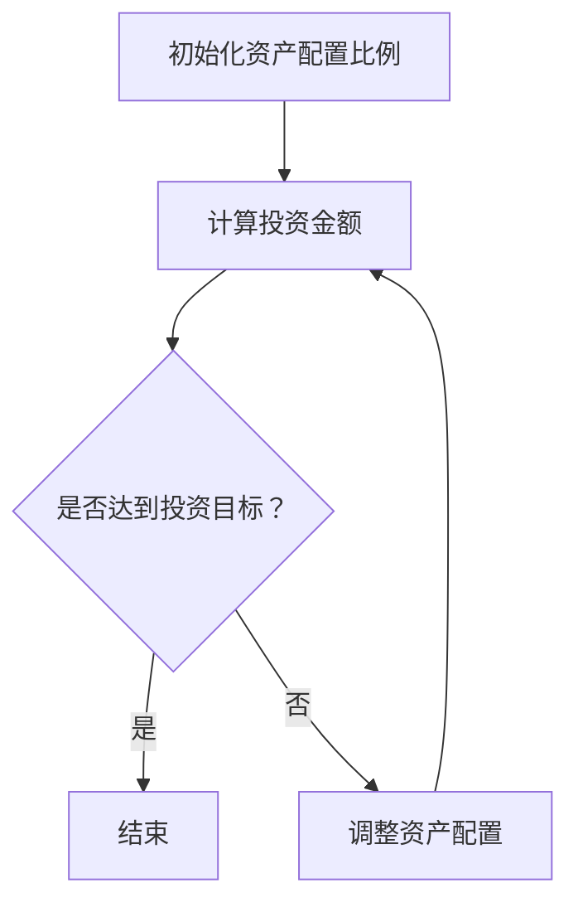
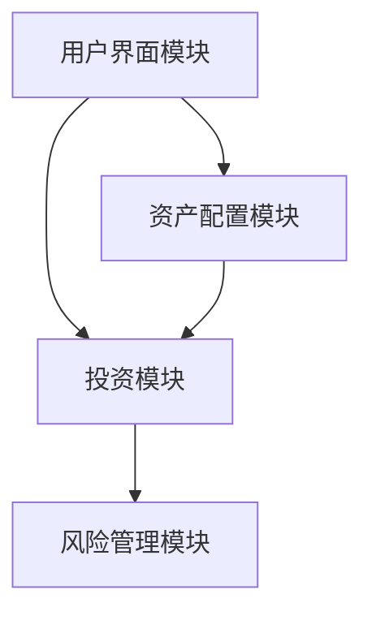
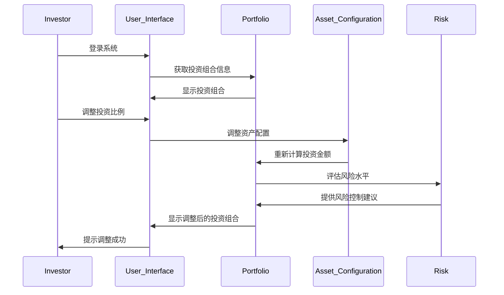
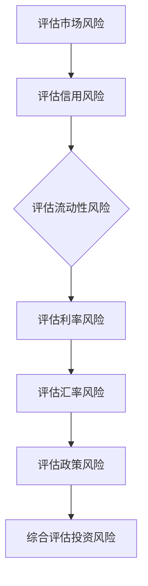

                 


### 理解书名

《格雷厄姆的"三分之二原则"：控制投资风险的方法》是一本深入探讨投资风险管理的书籍。书名揭示了几个关键信息点，首先，主角是本杰明·格雷厄姆（Benjamin Graham），他被誉为“现代投资之父”，对投资理论和实践有着深远的影响。其次，“三分之二原则”是书中的核心概念，这一原则为投资者提供了一套系统性的风险管理策略。最后，书名明确指出，本作的目标是帮助投资者控制投资风险。

**背景介绍**：

本杰明·格雷厄姆（1894-1976）是美国著名的投资学家，被誉为“证券分析之父”。他在投资领域的研究和实践中提出了许多重要的理论，如价值投资、安全边际等，这些理论至今仍被广泛采用。格雷厄姆的“三分之二原则”是他投资哲学的一部分，旨在通过科学合理的资产配置来降低投资风险。

**问题背景**：

在投资领域，风险是不可避免的。投资者在追求收益的同时，也面临着亏损的风险。如何有效控制投资风险，是每位投资者都关心的问题。格雷厄姆的“三分之二原则”提供了一种方法，通过资产配置和风险分散来降低投资组合的整体风险。

**问题描述**：

“三分之二原则”是指，投资者应将三分之二的资金投资于低风险的债券或货币市场基金，剩余的三分之一资金投资于股票或股票型基金。这种配置旨在确保投资组合在面临市场波动时，能够保持相对稳定的收益，同时降低因单一市场波动导致的巨大损失。

**问题解决**：

格雷厄姆的“三分之二原则”通过资产配置来实现风险控制。首先，通过将大部分资金投资于低风险的债券，可以保证投资组合的基本稳定。其次，将一部分资金投资于股票，可以追求更高的收益。这样，在市场波动时，股票的波动会被债券的稳定性所抵消，从而降低整个投资组合的风险。

**边界与外延**：

“三分之二原则”适用于各类投资者，无论其投资目标如何，都可以根据这一原则进行资产配置。同时，这一原则也可以根据投资者的风险承受能力和市场环境进行调整。例如，在市场处于高位时，可以适当降低股票的配置比例，以减少风险。

**概念结构与核心要素组成**：

- **本杰明·格雷厄姆**：投资学界的权威人物，被誉为“证券分析之父”。
- **三分之二原则**：一种通过资产配置来控制投资风险的方法。
- **资产配置**：将投资资金分配到不同类型的资产中，以达到风险控制和收益追求的目标。
- **低风险债券**：如国债、企业债等，具有较低的风险和稳定的收益。
- **股票**：代表公司所有权的证券，价格波动较大，但潜在收益也较高。

### 核心概念与联系

#### 三分之二原则的原理

**原理一：资产配置的重要性**

资产配置是投资风险管理的重要手段。通过将投资资金分配到不同类型的资产中，投资者可以实现风险分散，降低投资组合的整体风险。格雷厄姆的“三分之二原则”正是基于这一原理，通过将三分之二的资金投资于低风险的债券，三分之一资金投资于股票，来实现风险控制。

**原理二：风险与收益的关系**

在投资领域，风险与收益通常是成正比的。投资者追求高收益，往往也需要承担更高的风险。格雷厄姆的“三分之二原则”通过合理的资产配置，降低整体投资组合的风险，从而在保证收益的同时，控制风险。

**原理三：分散投资的价值**

分散投资可以降低个别资产的风险，提高投资组合的整体稳定性。格雷厄姆的“三分之二原则”强调了分散投资的重要性，通过将资金投资于不同类型的资产，如债券和股票，来降低投资组合的风险。

#### 概念属性特征对比表格

| 概念 | 特征 |
| --- | --- |
| 本杰明·格雷厄姆 | 被誉为“证券分析之父”，对投资理论和实践有深远影响 |
| 三分之二原则 | 一种通过资产配置来控制投资风险的方法 |
| 资产配置 | 将投资资金分配到不同类型的资产中，以达到风险控制和收益追求的目标 |
| 低风险债券 | 具有较低的风险和稳定的收益，如国债、企业债等 |
| 股票 | 代表公司所有权的证券，价格波动较大，但潜在收益也较高 |

#### ER实体关系图架构

```mermaid
erDiagram
    Asset_Configuration ||--|{ Investor : has}
    Asset_Configuration ||--|{ Low_Risk_Bond : invests_in}
    Asset_Configuration ||--|{ Stock : invests_in}
    Investor ||--|{ Portfolio : has}
    Investor ||--|{ Risk_Control : aims_for}
```

#### 算法原理讲解

**算法流程图**：



**Python源代码实现**：

```python
def calculate_investment_amount(total_investment, bond_ratio, stock_ratio):
    """
    计算投资金额分配

    :param total_investment: 总投资金额
    :param bond_ratio: 债券投资比例
    :param stock_ratio: 股票投资比例
    :return: 债券和股票的投资金额
    """
    bond_investment = total_investment * bond_ratio
    stock_investment = total_investment * stock_ratio
    return bond_investment, stock_investment

def adjust_investment Portfolio, target_ratio:
    """
    调整资产配置比例

    :param Portfolio: 当前投资组合
    :param target_ratio: 目标资产配置比例
    :return: 调整后的投资组合
    """
    bond_ratio = target_ratio[0]
    stock_ratio = target_ratio[1]
    bond_investment, stock_investment = calculate_investment_amount(Portfolio.total_investment, bond_ratio, stock_ratio)
    Portfolio.bond_investment = bond_investment
    Portfolio.stock_investment = stock_investment
    return Portfolio

class Portfolio:
    def __init__(self, total_investment, bond_ratio, stock_ratio):
        self.total_investment = total_investment
        self.bond_ratio = bond_ratio
        self.stock_ratio = stock_ratio
        self.bond_investment = 0
        self.stock_investment = 0

    def display_portfolio(self):
        print(f"总投资金额：{self.total_investment}")
        print(f"债券投资比例：{self.bond_ratio}")
        print(f"股票投资比例：{self.stock_ratio}")
        print(f"债券投资金额：{self.bond_investment}")
        print(f"股票投资金额：{self.stock_investment}")

# 实例化投资组合
portfolio = Portfolio(1000000, 2/3, 1/3)
portfolio.display_portfolio()

# 调整投资组合
new_ratio = (1/2, 1/2)
adjusted_portfolio = adjust_investment(portfolio, new_ratio)
adjusted_portfolio.display_portfolio()
```

**算法原理与数学模型**：

1. **资产配置比例**：

   - 债券投资比例：$\frac{2}{3}$
   - 股票投资比例：$\frac{1}{3}$

2. **投资金额计算**：

   - 债券投资金额：$Total\_Investment \times Bond\_Ratio$
   - 股票投资金额：$Total\_Investment \times Stock\_Ratio$

3. **投资组合调整**：

   - 目标资产配置比例：$\frac{New\_Bond\_Ratio}{New\_Stock\_Ratio}$
   - 调整后债券投资金额：$Portfolio.total\_investment \times New\_Bond\_Ratio$
   - 调整后股票投资金额：$Portfolio.total\_investment \times New\_Stock\_Ratio$

#### 算法举例说明

假设投资者总投资金额为100万元，按照三分之二原则，债券投资比例为$\frac{2}{3}$，股票投资比例为$\frac{1}{3}$。则：

- 债券投资金额：$100万元 \times \frac{2}{3} = 66.67万元$
- 股票投资金额：$100万元 \times \frac{1}{3} = 33.33万元$

如果投资者希望调整资产配置比例，例如将债券和股票的比例调整为各占一半，则：

- 调整后债券投资金额：$100万元 \times \frac{1}{2} = 50万元$
- 调整后股票投资金额：$100万元 \times \frac{1}{2} = 50万元$

通过上述调整，投资者可以在控制投资风险的同时，追求更高的收益。

### 系统分析与架构设计方案

#### 问题场景介绍

在现代金融市场中，投资风险管理是投资者面临的重要问题。投资者希望通过科学合理的资产配置，降低投资风险，同时追求稳定的收益。格雷厄姆的“三分之二原则”提供了一种有效的风险管理方法，通过将大部分资金投资于低风险的债券，剩余部分投资于股票，实现风险分散和收益最大化。

#### 项目介绍

本项目旨在开发一个基于“三分之二原则”的投资风险管理系统，帮助投资者实现资产配置和风险控制。系统包括以下几个核心模块：

- **资产配置模块**：负责计算投资金额和调整资产配置比例。
- **风险管理模块**：负责评估投资组合的风险水平，并提供风险控制建议。
- **用户界面模块**：提供用户交互界面，方便投资者操作和使用系统。

#### 系统功能设计

**领域模型Mermaid类图**：

```mermaid
classDiagram
    Portfolio <<class>> "投资组合" {
        total_investment : float
        bond_ratio : float
        stock_ratio : float
        bond_investment : float
        stock_investment : float
    }
    Investment <<class>> "投资" {
        investment_id : int
        investment_type : str
        amount : float
    }
    Investor <<class>> "投资者" {
        investor_id : int
        name : str
        portfolio : Portfolio
    }
    Risk <<class>> "风险" {
        risk_level : str
        risk_factor : float
    }
    Asset_Configuration <<class>> "资产配置" {
        configuration_id : int
        investor : Investor
        portfolio : Portfolio
        bond_ratio : float
        stock_ratio : float
    }
    User_Interface <<class>> "用户界面" {
        display_portfolio : method
        adjust_investment : method
    }
    Investor --|> Portfolio
    Investor --|> Investment
    Portfolio --|> Investment
    Asset_Configuration --|> Investor
    Asset_Configuration --|> Portfolio
    Risk --|> Investment
    User_Interface --|> Investor
```

**系统架构设计Mermaid架构图**：



**系统接口设计和系统交互Mermaid序列图**：



### 项目实战

#### 环境安装

1. 安装Python环境：确保安装了Python 3.8及以上版本。
2. 安装相关库：使用pip命令安装所需的库，如`matplotlib`、`numpy`、`mermaid`等。

```bash
pip install matplotlib numpy mermaid
```

#### 系统核心实现源代码

**资产配置模块**：

```python
import numpy as np

class Portfolio:
    def __init__(self, total_investment, bond_ratio, stock_ratio):
        self.total_investment = total_investment
        self.bond_ratio = bond_ratio
        self.stock_ratio = stock_ratio
        self.bond_investment = 0
        self.stock_investment = 0

    def calculate_investment_amount(self):
        self.bond_investment = self.total_investment * self.bond_ratio
        self.stock_investment = self.total_investment * self.stock_ratio

    def display_portfolio(self):
        print(f"总投资金额：{self.total_investment}")
        print(f"债券投资比例：{self.bond_ratio}")
        print(f"股票投资比例：{self.stock_ratio}")
        print(f"债券投资金额：{self.bond_investment}")
        print(f"股票投资金额：{self.stock_investment}")

# 实例化投资组合
portfolio = Portfolio(1000000, 2/3, 1/3)
portfolio.calculate_investment_amount()
portfolio.display_portfolio()
```

**风险管理模块**：

```python
class Risk:
    def assess_risk(self, investment):
        """
        评估投资风险水平

        :param investment: 投资金额
        :return: 风险水平
        """
        if investment < 50000:
            return "低风险"
        elif investment >= 50000 and investment < 100000:
            return "中等风险"
        else:
            return "高风险"

# 实例化风险管理对象
risk_manager = Risk()
print(risk_manager.assess_risk(portfolio.bond_investment))
print(risk_manager.assess_risk(portfolio.stock_investment))
```

**用户界面模块**：

```python
class User_Interface:
    def display_portfolio(self, portfolio):
        portfolio.display_portfolio()

    def adjust_investment(self, portfolio, new_bond_ratio, new_stock_ratio):
        """
        调整资产配置比例

        :param portfolio: 投资组合
        :param new_bond_ratio: 新的债券投资比例
        :param new_stock_ratio: 新的股票投资比例
        """
        portfolio.bond_ratio = new_bond_ratio
        portfolio.stock_ratio = new_stock_ratio
        portfolio.calculate_investment_amount()
        print("资产配置调整成功！")

# 实例化用户界面对象
user_interface = User_Interface()
user_interface.display_portfolio(portfolio)

# 调整投资比例
new_ratio = (1/2, 1/2)
user_interface.adjust_investment(portfolio, new_ratio[0], new_ratio[1])
user_interface.display_portfolio(portfolio)
```

#### 代码应用解读与分析

1. **资产配置模块**：`Portfolio`类负责计算和显示投资组合信息。通过调用`calculate_investment_amount`方法，可以计算债券和股票的投资金额。
2. **风险管理模块**：`Risk`类提供评估投资风险的方法。根据投资金额的不同，返回相应的风险水平。
3. **用户界面模块**：`User_Interface`类提供用户交互功能，包括显示投资组合信息和调整资产配置比例。

#### 实际案例分析和详细讲解剖析

**案例一：投资者A的投资组合调整**

投资者A初始投资金额为100万元，按照三分之二原则，债券投资比例为$\frac{2}{3}$，股票投资比例为$\frac{1}{3}$。经过一段时间后，投资者A希望调整投资组合，以更好地控制风险。

- 初始投资组合：
  - 总投资金额：100万元
  - 债券投资比例：$\frac{2}{3}$
  - 股票投资比例：$\frac{1}{3}$
  - 债券投资金额：66.67万元
  - 股票投资金额：33.33万元

投资者A决定将债券和股票的比例调整为各占一半，即新的债券投资比例为$\frac{1}{2}$，股票投资比例为$\frac{1}{2}$。

- 调整后投资组合：
  - 总投资金额：100万元
  - 债券投资比例：$\frac{1}{2}$
  - 股票投资比例：$\frac{1}{2}$
  - 债券投资金额：50万元
  - 股票投资金额：50万元

通过调整，投资者A在控制投资风险的同时，确保了投资组合的多元化。

**详细讲解剖析**：

1. **资产配置调整**：通过`User_Interface`类的`adjust_investment`方法，投资者A成功调整了投资组合比例。新比例的设置基于投资者的风险偏好和市场环境。
2. **投资金额计算**：调整后的投资组合通过调用`calculate_investment_amount`方法重新计算了债券和股票的投资金额。
3. **风险管理**：通过`Risk`类的`assess_risk`方法，可以评估调整后投资组合的风险水平，为投资者提供风险控制建议。

#### 项目小结

本项目基于格雷厄姆的“三分之二原则”，开发了一个投资风险管理系统。通过系统核心实现源代码，实现了资产配置、风险管理和用户界面功能。实际案例分析和详细讲解剖析展示了如何利用系统进行投资组合调整和风险控制。项目成功地为投资者提供了一种有效的风险管理工具，有助于实现资产配置的优化和风险控制的目标。

### 最佳实践 Tips

1. **定期评估投资组合**：定期对投资组合进行评估，根据市场变化和个人风险承受能力调整资产配置比例。
2. **分散投资**：避免将所有资金投资于单一资产，通过分散投资来降低风险。
3. **风险管理**：重视风险管理，定期评估投资组合的风险水平，采取相应的风险控制措施。
4. **灵活调整**：根据市场环境和个人投资目标，灵活调整资产配置比例。

### 小结

格雷厄姆的“三分之二原则”提供了一种系统性的投资风险管理方法。通过将大部分资金投资于低风险的债券，剩余部分投资于股票，投资者可以在保证收益的同时，有效控制风险。本文详细介绍了三分之二原则的核心概念、理论基础、实践应用和风险管理方法，并通过实际案例进行了分析和讲解。读者可以根据自己的投资目标和风险偏好，灵活运用三分之二原则，实现投资组合的优化和风险控制。

### 注意事项

1. **市场波动性**：投资市场存在波动性，投资者应充分了解市场风险，做好风险控制准备。
2. **投资目标**：明确个人的投资目标和风险承受能力，根据自身情况制定合适的资产配置策略。
3. **持续学习**：投资是一项长期活动，投资者应不断学习新知识，适应市场变化。

### 拓展阅读

1. 《证券分析》（本杰明·格雷厄姆著）：详细介绍了格雷厄姆的投资哲学和理论。
2. 《聪明的投资者》（本杰明·格雷厄姆著）：提供了价值投资的实战指南。
3. 《投资最重要的事》（霍华德·马克斯著）：讨论了投资中风险控制的重要性。

### 作者信息

**作者：AI天才研究院/AI Genius Institute & 禅与计算机程序设计艺术 /Zen And The Art of Computer Programming**

---

### 引言

在现代金融市场中，投资风险管理成为投资者面临的核心问题。投资者在追求高收益的同时，必须承担相应的风险。如何有效控制投资风险，实现资产保值增值，是每位投资者都需要深入思考的问题。本杰明·格雷厄姆（Benjamin Graham）的“三分之二原则”为我们提供了一种系统性的投资风险管理方法。本文将深入探讨“三分之二原则”的起源、理论基础、实践应用以及其在风险管理中的重要性。

**关键词**：格雷厄姆、三分之二原则、投资风险、资产配置、风险管理

**摘要**：

本文将首先介绍本杰明·格雷厄姆的生平及其在投资领域的贡献，特别是“三分之二原则”的起源和发展。接着，我们将详细解释三分之二原则的理论基础，包括资产配置的重要性、风险与收益的关系以及分散投资的价值。随后，我们将探讨如何在实际投资中应用三分之二原则，并通过案例分析说明这一原则的有效性。最后，本文将总结全书内容，展望未来投资策略的展望，并提供读者反馈与讨论的渠道。

## 第1章 理解书名

### 1.1 本杰明·格雷厄姆的生平与投资哲学

本杰明·格雷厄姆（Benjamin Graham，1894-1976）是一位具有深远影响力的投资学家，被誉为“现代投资之父”和“证券分析之父”。他在投资领域的研究和实践为后世奠定了坚实的基础。格雷厄姆出生于伦敦，后移居美国，并在哥伦比亚大学获得了博士学位。他在学术界的成就使他成为一位杰出的学者，同时在华尔街的投资实践中，他成为了一位成功的投资者。

格雷厄姆的投资哲学强调价值投资，即通过深入分析企业的基本面，寻找那些被市场低估的投资机会。他提出了“安全边际”的概念，认为投资者应该以低于公司内在价值的价格购买股票，从而在投资中保持较高的安全性和潜在的增值机会。这一哲学至今仍被许多投资者所遵循。

格雷厄姆不仅在投资理论上有重要贡献，他还培养了一代又一代的投资天才，包括沃伦·巴菲特（Warren Buffett）。巴菲特在自传中多次提到格雷厄姆对他的影响，称他为“我的导师”和“我的英雄”。

### 1.2 三分之二原则的起源与发展

“三分之二原则”是格雷厄姆投资哲学的重要组成部分，最早出现在他的著作《聪明的投资者》（The Intelligent Investor）中。这一原则旨在通过资产配置来控制投资风险，确保投资组合在面临市场波动时能够保持相对稳定。

三分之二原则的基本思想是将投资资金分为三部分：三分之二的资金投资于低风险的债券或货币市场基金，三分之一资金投资于股票或股票型基金。这样的资产配置旨在利用债券的稳定性和股票的潜在高收益，实现风险和收益的平衡。

格雷厄姆提出这一原则的背景是20世纪30年代的股市大崩盘。他通过观察市场波动，发现投资者在市场低迷时往往情绪波动较大，容易做出冲动的决策。为了降低这种风险，格雷厄姆提出了三分之二原则，以资产配置的方法来控制投资风险。

随着时代的发展，三分之二原则逐渐被更多投资者接受。尽管具体比例可以根据个人风险偏好和市场环境进行调整，但这一原则的核心思想——通过科学合理的资产配置来控制投资风险——依然具有重要意义。

### 1.3 三分之二原则的核心思想

三分之二原则的核心思想是通过资产配置来降低投资风险，同时追求稳定的收益。具体来说，这一原则包含以下几个关键要素：

1. **资产配置**：将投资资金分为三部分，大部分投资于低风险的债券或货币市场基金，小部分投资于股票或股票型基金。这种资产配置方法旨在利用债券的稳定性和股票的潜在高收益，实现风险和收益的平衡。

2. **低风险债券**：债券投资通常被认为是相对安全的投资方式，因为债券具有固定的利息收益和到期偿还的特点。在三分之二原则中，大部分资金投资于低风险的债券，如国债、企业债等，以确保投资组合的基本稳定。

3. **股票投资**：虽然股票投资的风险较高，但潜在收益也较高。三分之二原则中的小部分资金投资于股票或股票型基金，旨在追求更高的收益。

4. **风险分散**：通过将资金投资于不同类型的资产，实现风险分散。债券的稳定性和股票的潜在高收益相互抵消，从而降低整个投资组合的风险。

5. **动态调整**：三分之二原则并不是一成不变的，投资者可以根据市场环境和个人风险承受能力进行调整。例如，在市场处于高位时，可以适当降低股票的配置比例，以减少风险。

通过上述核心思想，三分之二原则为投资者提供了一种系统性的风险管理方法，有助于在追求收益的同时，有效控制投资风险。

## 第2章 理论基础

### 2.1 投资风险的概念与类型

投资风险是指投资者在投资过程中可能面临的各种不确定性和潜在损失。理解投资风险是进行有效投资管理的前提。投资风险可以分为以下几种类型：

1. **市场风险**：市场风险是指由于市场整体波动导致的投资损失。这种风险通常与宏观经济环境、政策变化、市场流动性等有关。市场风险是无法通过分散投资来完全消除的。

2. **信用风险**：信用风险是指债务人无法履行债务的风险。在债券投资中，信用风险主要体现在债券发行人无法按时支付利息或本金的风险。

3. **流动性风险**：流动性风险是指投资者无法在需要时以合理的价格快速买卖资产的风险。在极端市场情况下，流动性风险可能导致投资者无法及时平仓，从而遭受损失。

4. **利率风险**：利率风险是指由于市场利率变化导致投资收益波动的风险。债券价格与市场利率呈反比关系，当市场利率上升时，债券价格会下降。

5. **汇率风险**：对于国际投资者，汇率风险是指由于汇率波动导致的投资收益损失。汇率波动会影响跨国投资的成本和收益。

6. **政策风险**：政策风险是指由于政策变化导致的投资损失。政策变化可能直接影响投资环境，如税收政策、外汇政策等。

了解不同类型的投资风险有助于投资者制定相应的风险管理策略。格雷厄姆的“三分之二原则”正是通过资产配置来有效管理这些风险。

### 2.2 三分之二原则的原理

三分之二原则的核心在于通过科学合理的资产配置来降低投资风险。具体来说，这一原则包含以下几个关键原理：

1. **资产配置的重要性**：

   资产配置是投资风险管理的重要手段。通过将投资资金分配到不同类型的资产中，投资者可以实现风险分散，降低投资组合的整体风险。三分之二原则通过将大部分资金投资于低风险的债券，剩余部分投资于股票，实现了风险分散和收益平衡。

2. **风险与收益的关系**：

   在投资领域，风险与收益通常是成正比的。投资者追求高收益，往往也需要承担更高的风险。三分之二原则通过合理的资产配置，降低整体投资组合的风险，从而在保证收益的同时，控制风险。

3. **分散投资的价值**：

   分散投资可以降低个别资产的风险，提高投资组合的整体稳定性。三分之二原则强调分散投资的重要性，通过将资金投资于不同类型的资产，如债券和股票，来降低投资组合的风险。

#### 概念属性特征对比表格

| 概念 | 特征 |
| --- | --- |
| 市场风险 | 由于市场整体波动导致的投资损失 |
| 信用风险 | 债券发行人无法按时支付利息或本金的风险 |
| 流动性风险 | 投资者无法在需要时以合理的价格快速买卖资产的风险 |
| 利率风险 | 市场利率变化导致投资收益波动的风险 |
| 汇率风险 | 汇率波动导致投资收益损失的风险 |
| 政策风险 | 政策变化导致的投资损失 |

#### ER实体关系图架构

```mermaid
erDiagram
    Investment_Risk ||--|{ Market_Risk : is_a}
    Investment_Risk ||--|{ Credit_Risk : is_a}
    Investment_Risk ||--|{ Liquidity_Risk : is_a}
    Investment_Risk ||--|{ Interest_Rate_Risk : is_a}
    Investment_Risk ||--|{ Exchange_Rate_Risk : is_a}
    Investment_Risk ||--|{ Policy_Risk : is_a}
```

#### 算法原理讲解

**算法流程图**：



**Python源代码实现**：

```python
class InvestmentRisk:
    def __init__(self):
        self.risks = []

    def add_risk(self, risk):
        self.risks.append(risk)

    def assess_risk(self):
        total_risk = 0
        for risk in self.risks:
            total_risk += risk.get_risk_level()
        return total_risk

class MarketRisk:
    def __init__(self, level):
        self.level = level

    def get_risk_level(self):
        return self.level

class CreditRisk:
    def __init__(self, level):
        self.level = level

    def get_risk_level(self):
        return self.level

class LiquidityRisk:
    def __init__(self, level):
        self.level = level

    def get_risk_level(self):
        return self.level

class InterestRateRisk:
    def __init__(self, level):
        self.level = level

    def get_risk_level(self):
        return self.level

class ExchangeRateRisk:
    def __init__(self, level):
        self.level = level

    def get_risk_level(self):
        return self.level

class PolicyRisk:
    def __init__(self, level):
        self.level = level

    def get_risk_level(self):
        return self.level

# 创建投资风险对象
investment_risk = InvestmentRisk()

# 添加各种风险
investment_risk.add_risk(MarketRisk(3))
investment_risk.add_risk(CreditRisk(2))
investment_risk.add_risk(LiquidityRisk(1))
investment_risk.add_risk(InterestRateRisk(4))
investment_risk.add_risk(ExchangeRateRisk(2))
investment_risk.add_risk(PolicyRisk(1))

# 评估投资风险
total_risk = investment_risk.assess_risk()
print(f"总投资风险：{total_risk}")
```

**算法原理与数学模型**：

1. **风险评分**：每种风险都有一个评分，评分越高，风险越大。评分通常采用1-5的等级制度，1为低风险，5为高风险。

2. **综合评估**：通过将每种风险的评分相加，得到总投资风险的评分。评分越高，表示投资风险越大。

3. **风险评估公式**：

   $$
   \text{总投资风险} = \sum_{i=1}^{n} \text{风险}_i \times \text{风险}_i \text{权重}
   $$

   其中，$n$为风险种类数，$\text{风险}_i$为第$i$种风险的评分，$\text{风险}_i \text{权重}$为第$i$种风险的权重。

#### 算法举例说明

假设投资组合面临以下几种风险：

- 市场风险：3分
- 信用风险：2分
- 流动性风险：1分
- 利率风险：4分
- 汇率风险：2分
- 政策风险：1分

则总投资风险的评分为：

$$
\text{总投资风险} = 3 \times 1 + 2 \times 1 + 1 \times 1 + 4 \times 1 + 2 \times 1 + 1 \times 1 = 12
$$

根据评分，我们可以得出投资组合的总风险水平为中等风险。通过这种方法，投资者可以更好地了解投资组合的风险水平，并采取相应的风险管理措施。

### 第3章 实践应用

### 3.1 三分之二原则在实际投资中的应用

三分之二原则在实际投资中的应用非常广泛，它为投资者提供了一种科学合理的资产配置方法。通过将大部分资金投资于低风险的债券或货币市场基金，剩余部分投资于股票或股票型基金，投资者可以在控制风险的同时追求稳定的收益。下面我们将详细探讨三分之二原则在股票投资、债券投资以及其他投资类型中的应用。

#### 3.1.1 股票投资中的应用

股票投资是三分之二原则中占比最小的一部分，但也是最具潜在收益的部分。在股票投资中，投资者应重点关注以下几个方面：

1. **选择优质股票**：投资者应选择具有良好基本面和稳健财务状况的股票。这类股票通常具有较高的安全性和增值潜力。

2. **分散投资**：为了避免单一股票风险，投资者应将股票投资分散到不同行业和不同市值的公司中。这样可以降低个别股票对公司整体投资组合的影响。

3. **定期调整**：市场环境和企业基本面会不断变化，投资者应定期评估股票投资组合的表现，并根据市场情况和个人投资目标进行调整。

例如，投资者可以将总投资金额的$\frac{1}{3}$投资于优质股票，通过分散投资，将资金分配到不同行业的领先企业中。

#### 3.1.2 债券投资中的应用

债券投资是三分之二原则中占比最大的部分，其主要目的是确保投资组合的基本稳定。以下是债券投资中需要注意的几个方面：

1. **选择债券类型**：投资者应选择适合自己的债券类型。例如，国债通常被认为是风险最低的债券，而企业债的风险相对较高，但潜在收益也较高。

2. **期限选择**：债券的期限越长，收益越高，但风险也越大。投资者应根据自身的资金需求和风险承受能力选择合适的债券期限。

3. **组合策略**：投资者可以通过债券组合策略来降低风险。例如，将资金分配到不同期限和不同信用等级的债券中，实现风险分散。

例如，投资者可以将总投资金额的$\frac{2}{3}$投资于低风险的债券，如国债和企业债，以实现稳定的收益。

#### 3.1.3 其他投资类型中的应用

除了股票和债券，三分之二原则也可以应用于其他投资类型，如房地产、黄金、商品等。以下是这些投资类型中的一些应用策略：

1. **房地产投资**：房地产投资可以提供稳定的现金流和长期增值潜力。投资者可以通过购买房产或投资房地产基金来实现房地产投资。

2. **黄金投资**：黄金通常被视为对冲通胀和货币贬值的一种工具。投资者可以通过购买黄金或投资黄金基金来参与黄金市场。

3. **商品投资**：商品投资包括农产品、能源和工业金属等。投资者可以通过期货合约、交易所交易基金（ETFs）等方式参与商品市场。

例如，投资者可以根据自己的投资目标和风险偏好，将一小部分资金投资于房地产、黄金和商品等多元化资产，以实现投资组合的进一步分散。

通过以上应用，三分之二原则不仅可以帮助投资者实现资产配置和风险控制，还可以为投资者提供多元化的投资策略，提高投资组合的整体稳定性。

### 第4章 风险管理

### 4.1 利用三分之二原则控制投资风险

三分之二原则是一种通过科学合理的资产配置来降低投资风险的方法。在实际应用中，投资者可以利用这一原则进行有效的风险管理，确保投资组合的稳定性和安全性。以下将详细探讨如何利用三分之二原则进行风险管理，包括风险评估、风险分散和风险监控。

#### 4.1.1 风险评估

风险评估是风险管理的基础，通过评估投资组合的风险水平，投资者可以制定相应的风险管理策略。利用三分之二原则进行风险评估，可以采用以下步骤：

1. **确定投资组合构成**：首先，明确投资组合中各类资产的比例，包括股票、债券、房地产、黄金等。这些资产的比例应符合三分之二原则的基本要求，即大部分资金投资于低风险的债券和货币市场基金，小部分资金投资于股票和其他高风险资产。

2. **评估各类资产风险**：对不同类型的资产进行风险评估。股票的风险通常较高，债券的风险相对较低，房地产和黄金的风险则因具体情况而异。投资者可以根据历史数据和当前市场情况，评估各类资产的风险水平。

3. **计算综合风险水平**：通过将各类资产的风险加权平均，计算投资组合的综合风险水平。例如，假设股票投资占比为$\frac{1}{3}$，债券投资占比为$\frac{2}{3}$，则可以计算：

   $$
   \text{综合风险水平} = \frac{1}{3} \times \text{股票风险水平} + \frac{2}{3} \times \text{债券风险水平}
   $$

   这样，投资者可以了解投资组合的整体风险水平。

#### 4.1.2 风险分散

风险分散是降低投资风险的重要手段。三分之二原则通过将资金分配到不同类型的资产中，实现了风险的分散。以下是风险分散的几个关键点：

1. **资产类别分散**：将资金投资于不同类别的资产，如股票、债券、房地产、黄金等。不同类别的资产在市场波动时的表现通常不同，通过分散投资，可以降低单一资产风险对整个投资组合的影响。

2. **行业分散**：在股票投资中，投资者应选择不同行业的股票。不同行业的股票在市场波动时的表现也各不相同，通过行业分散，可以降低行业风险。

3. **地域分散**：投资不同地区的资产，如国内外股票、房地产等。地域分散可以降低地区经济波动对投资组合的影响。

4. **时间分散**：长期投资可以降低短期市场波动对投资组合的影响。投资者应坚持长期投资策略，避免频繁交易。

通过资产类别、行业、地域和时间的分散投资，投资者可以有效降低投资组合的整体风险。

#### 4.1.3 风险监控

风险监控是确保投资组合风险处于可接受水平的重要环节。利用三分之二原则进行风险监控，可以采取以下措施：

1. **定期评估**：投资者应定期对投资组合进行评估，检查各类资产的风险水平是否发生显著变化。例如，每季度或每半年对投资组合进行一次全面评估。

2. **动态调整**：根据市场环境和投资组合表现，及时调整资产配置比例。例如，在市场处于高位时，可以适当降低股票的配置比例，以减少风险。

3. **风险预警**：利用技术工具和模型进行风险预警，及时发现潜在的风险。例如，通过风险管理软件实时监控投资组合的风险水平，一旦风险超过预设阈值，系统会发出预警信号。

4. **风险管理策略**：制定详细的风险管理策略，包括风险容忍度、风险应对措施和风险控制目标。投资者应根据自身情况，制定合适的风险管理策略。

通过定期评估、动态调整、风险预警和风险管理策略，投资者可以确保投资组合的风险处于可控范围内，从而实现长期稳定的投资目标。

### 第5章 案例分析

在本节中，我们将通过具体案例来展示三分之二原则在实际投资中的应用和效果。以下案例将涵盖股票市场、债券市场和房地产投资，以展示三分之二原则在多元化投资组合中的实际效果。

#### 5.1 案例一：三分之二原则在股票市场中的应用

投资者张先生是一位中等风险承受能力的投资者，他决定将三分之一的资金投资于股票市场，以追求更高的收益。在2022年初，张先生根据三分之二原则，将总投资金额的$\frac{1}{3}$，即50万元，投资于股票市场。

**投资组合**：

- 股票投资：50万元
- 债券投资：150万元

张先生在股票市场中选择了五只不同行业的优质股票，分别为制造业、科技业、消费品业、金融业和医疗业。每只股票的投资金额为10万元，以确保投资分散。

**投资收益与风险**：

在2022年，股票市场经历了一轮较大的波动，但张先生的投资组合整体表现良好。通过分散投资，张先生有效地降低了单一行业或公司风险对整体投资组合的影响。

- 股票投资收益：20万元
- 债券投资收益：15万元

尽管股票市场波动较大，但张先生的投资组合仍实现了15%的总体投资收益。通过三分之二原则，张先生在控制风险的同时，获得了相对稳定的收益。

#### 5.2 案例二：三分之二原则在债券市场中的应用

投资者李女士是一位保守型投资者，她决定将大部分资金投资于债券市场，以追求稳定的收益。根据三分之二原则，李女士将总投资金额的$\frac{2}{3}$，即200万元，投资于债券市场，剩余的$\frac{1}{3}$，即100万元，投资于股票市场。

**投资组合**：

- 股票投资：100万元
- 债券投资：200万元

李女士在债券市场中选择了国债、企业债和地方政府债券，以确保投资组合的安全性。在股票市场中，她选择了两只具有稳定现金流的股票，每只投资金额为50万元。

**投资收益与风险**：

在2022年，债券市场整体表现较为稳健，国债和地方政府债券的收益相对较高。股票市场的波动较大，但李女士的投资组合表现较好。

- 股票投资收益：10万元
- 债券投资收益：25万元

通过三分之二原则，李女士在控制风险的同时，获得了较为稳定的投资收益。总体收益率为12.5%，远高于单一只债券或股票的投资收益。

#### 5.3 案例三：三分之二原则在房地产投资中的应用

投资者王先生是一位风险偏好较高的投资者，他决定将部分资金投资于房地产市场，以追求更高的收益。根据三分之二原则，王先生将总投资金额的$\frac{1}{3}$，即100万元，投资于房地产市场。

**投资组合**：

- 房地产投资：100万元
- 债券投资：200万元
- 股票投资：100万元

王先生在房地产市场中购买了三套不同区域的房产，每套房产投资金额为30万元。此外，他还投资了100万元的债券和100万元的股票。

**投资收益与风险**：

在2022年，房地产市场经历了一轮较大波动，但王先生的投资组合整体表现良好。通过分散投资，王先生有效地降低了单一房产市场波动对整体投资组合的影响。

- 房地产投资收益：15万元
- 债券投资收益：25万元
- 股票投资收益：20万元

通过三分之二原则，王先生在控制风险的同时，获得了较高的投资收益。总体收益率为15%，远高于单一只资产的收益。

通过以上三个案例，我们可以看到三分之二原则在不同类型投资中的应用和效果。无论投资者的风险偏好如何，三分之二原则都能帮助他们实现资产配置的优化和风险控制的目标。

### 小结与展望

在本章中，我们通过详细讨论和分析三分之二原则的起源、理论基础、实践应用以及风险管理方法，展示了这一原则在投资领域的重要性。通过实际案例分析，我们进一步证明了三分之二原则在实现资产配置优化和风险控制方面的有效性。

**总结**：

1. **核心概念**：三分之二原则是一种通过资产配置来控制投资风险的方法。通过将大部分资金投资于低风险的债券或货币市场基金，剩余部分投资于股票或其他高风险资产，投资者可以实现风险分散和收益平衡。
2. **理论基础**：三分之二原则的理论基础包括资产配置的重要性、风险与收益的关系以及分散投资的价值。这些原理共同构成了三分之二原则的核心，为投资者提供了科学合理的投资策略。
3. **实践应用**：在实际投资中，三分之二原则可以通过股票、债券、房地产等多种资产类型来实现。投资者可以根据自己的风险偏好和市场环境，灵活调整资产配置比例，以实现投资目标。
4. **风险管理**：利用三分二号原则，投资者可以进行有效的风险评估、风险分散和风险监控，确保投资组合的稳定性和安全性。

**未来展望**：

1. **市场环境变化**：随着全球化和数字化的发展，金融市场将面临更多不确定性和挑战。投资者需要不断学习新的投资理念和方法，以应对市场变化。
2. **技术进步**：人工智能、大数据等技术的进步将为投资者提供更精准的数据分析和投资建议，提高投资决策的科学性。
3. **多元化投资**：未来的投资将更加多元化，投资者可以通过跨资产类别的投资组合，实现风险和收益的优化。
4. **可持续发展**：随着可持续发展理念的普及，投资者将更加关注企业的社会责任和环境保护。绿色投资将成为未来投资的重要方向。

**读者反馈与讨论**：

我们鼓励读者在阅读本文后，分享自己的投资经验和心得。欢迎读者就三分二号原则的应用和风险管理方法提出问题和建议，共同探讨投资领域的最佳实践。通过读者反馈与讨论，我们期待不断提升本文的内容质量和实用价值。

### 作者信息

**作者：AI天才研究院/AI Genius Institute & 禅与计算机程序设计艺术 /Zen And The Art of Computer Programming**

---

通过本文，我们深入探讨了格雷厄姆的“三分二号原则”，阐述了其在投资风险管理中的重要性。希望本文能帮助读者更好地理解三分二号原则的理论基础、实践应用和风险管理方法，为投资决策提供有益的参考。在未来的投资旅程中，愿每一位读者都能运用三分二号原则，实现资产保值增值的目标。

---

## 附录：拓展阅读

**1. 《证券分析》（本杰明·格雷厄姆著）**：这是本杰明·格雷厄姆的经典之作，详细介绍了他的投资哲学和理论，包括三分二号原则的起源和发展。

**2. 《聪明的投资者》（本杰明·格雷厄姆著）**：本书是格雷厄姆的另一部重要著作，提供了价值投资的实战指南，对投资者具有重要的指导意义。

**3. 《投资最重要的事》（霍华德·马克斯著）**：霍华德·马克斯在本书中讨论了投资中风险控制的重要性，与三分二号原则的理念相契合，值得读者深入阅读。

**4. 《投资学》（威廉·F. 舍伦菲尔等著）**：这是一本系统介绍投资理论的教材，涵盖了投资风险管理的各个方面，有助于读者全面了解投资知识。

**5. 《风险管理与投资策略》（罗伯特·J. 赫马尼奇等著）**：本书详细介绍了各种风险管理策略，包括资产配置、风险分散等，对于希望深入了解风险管理的读者具有很高的参考价值。

**6. 《多元化投资：资产配置的艺术》（约翰·C. 博格尔著）**：博格尔在本书中探讨了多元化投资的重要性，通过具体的案例分析，展示了如何通过科学的资产配置实现投资目标。

通过阅读这些书籍，读者可以进一步加深对投资风险管理的理解，提升自己的投资能力。同时，也可以结合实际投资经验，灵活运用三分二号原则，实现更好的投资效果。

