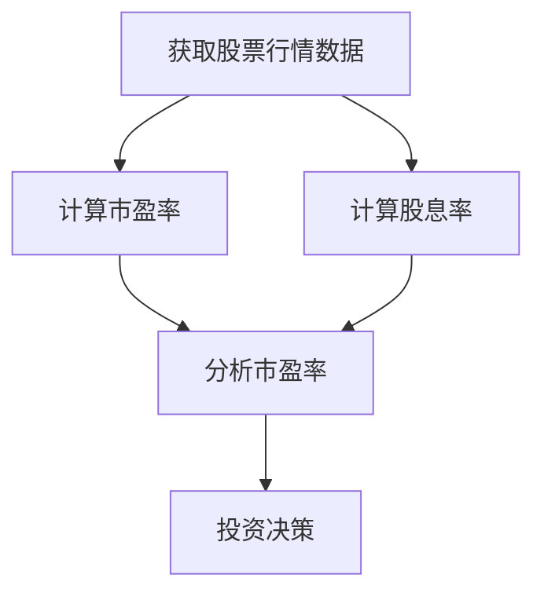
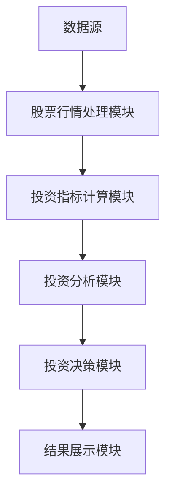
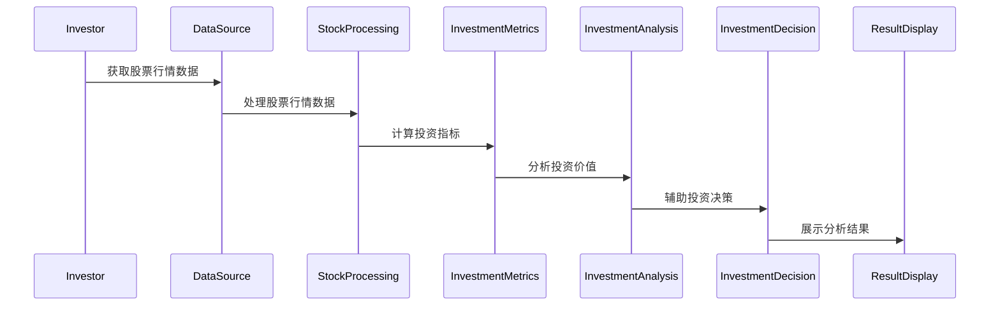

                 

**格雷厄姆的价值投资传承**

**关键词：价值投资，格雷厄姆，股票，投资理念，实践案例**

**摘要：本文将深入探讨格雷厄姆的价值投资理论，包括其核心概念、应用方法、实践案例以及现代价值投资的探索。通过分析格雷厄姆的投资理念及其传承，我们旨在为读者提供一个全面且易懂的视角来理解价值投资在金融市场中的重要作用。**

## **第一部分：格雷厄姆的价值投资理论**

### **第1章：格雷厄姆的价值投资理论概述**

**1.1 格雷厄姆的价值投资思想**

本章节将介绍格雷厄姆的价值投资思想，包括其基本理念、投资策略和投资原则。我们将详细探讨格雷厄姆如何通过股票价格的低估来获取稳定的投资回报。

**1.2 价值投资的核心原则**

本章节将分析价值投资的核心原则，包括安全边际、内在价值、市盈率和股息率等。我们将通过具体案例来解释这些原则如何在实际投资中应用。

**1.3 价值投资的实践意义**

本章节将讨论价值投资在实践中的意义，包括如何通过长期投资来获取稳定的投资回报，以及如何应对市场波动和不确定性。

### **第2章：格雷厄姆投资理念的核心概念**

**2.1 安全边际**

本章节将深入探讨安全边际的概念，包括其定义、计算方法和应用。我们将通过具体案例来说明如何利用安全边际来降低投资风险。

**2.2 股票价格与内在价值**

本章节将分析股票价格与内在价值的关系，包括如何评估股票的内在价值，以及如何通过市场价格与内在价值的对比来发现投资机会。

**2.3 市盈率与股息率**

本章节将讨论市盈率和股息率的概念、计算方法和应用。我们将通过具体案例来说明如何利用市盈率和股息率来评估股票的投资价值。

**2.4 财务分析指标**

本章节将介绍财务分析指标，包括资产负债表、利润表和现金流量表等。我们将通过具体案例来说明如何利用财务分析指标来评估企业的财务状况。

### **第3章：格雷厄姆投资方法的应用**

**3.1 如何寻找低估的股票**

本章节将讲解如何通过财务分析、行业分析和市场分析来寻找低估的股票。我们将通过具体案例来说明这一方法的应用。

**3.2 如何评估股票的内在价值**

本章节将探讨如何通过市盈率、股息率和自由现金流等指标来评估股票的内在价值。我们将通过具体案例来说明这一方法的实际应用。

**3.3 价值投资的决策过程**

本章节将分析价值投资的决策过程，包括如何选择投资标的、如何制定投资计划以及如何执行投资决策。我们将通过具体案例来说明这一决策过程。

### **第4章：格雷厄姆投资理念的演变**

**4.1 价值投资在市场波动中的表现**

本章节将分析价值投资在市场波动中的表现，包括如何在市场下跌时保持稳定，以及如何在市场上涨时抓住投资机会。

**4.2 价值投资在不同市场环境下的应用**

本章节将讨论价值投资在不同市场环境下的应用，包括如何在熊市中寻找投资机会，以及如何在牛市中保持谨慎。

**4.3 价值投资的未来趋势**

本章节将探讨价值投资的未来趋势，包括其在金融市场中可能的发展方向和挑战。我们将分析价值投资在新兴市场、新技术和多元化投资组合中的应用。

## **第二部分：格雷厄姆的价值投资实践**

### **第5章：格雷厄姆投资实践案例分析**

**5.1 华尔街股市大崩溃中的格雷厄姆**

本章节将回顾华尔街股市大崩溃期间格雷厄姆的投资实践，分析他在这一历史事件中的投资决策和成果。

**5.2 格雷厄姆投资理念的实践案例**

本章节将通过具体案例来展示格雷厄姆投资理念的实际应用，包括如何通过价值投资来获取稳定回报。

**5.3 格雷厄姆投资策略的优劣分析**

本章节将分析格雷厄姆投资策略的优劣，包括其优势、局限性和适用范围。我们将通过具体案例来说明格雷厄姆投资策略的实践效果。

### **第6章：现代价值投资的实践探索**

**6.1 价值投资在新兴市场的应用**

本章节将探讨价值投资在新兴市场的应用，分析新兴市场中的投资机会和挑战。

**6.2 价值投资与新兴技术的结合**

本章节将讨论价值投资与新兴技术的结合，分析如何通过新兴技术来提高投资效率和回报。

**6.3 价值投资在多元化投资组合中的应用**

本章节将分析价值投资在多元化投资组合中的应用，包括如何通过多元化来降低投资风险。

### **第7章：格雷厄姆的价值投资传承**

**7.1 格雷厄姆的投资思想传承**

本章节将探讨格雷厄姆的投资思想如何传承，包括其对现代投资理论的影响和贡献。

**7.2 价值投资在现代金融市场的地位**

本章节将分析价值投资在现代金融市场中的地位，包括其在金融市场中的作用和重要性。

**7.3 价值投资的未来发展**

本章节将探讨价值投资的未来发展，包括其在金融市场中的可能趋势和挑战。

## **结语**

**作者：AI天才研究院/AI Genius Institute & 禅与计算机程序设计艺术 /Zen And The Art of Computer Programming**

本文通过深入分析格雷厄姆的价值投资理论，包括其核心概念、应用方法和实践案例，旨在为读者提供一个全面且易懂的视角来理解价值投资在金融市场中的重要作用。通过本文的探讨，我们希望能够激发读者对价值投资的兴趣，并帮助他们在实际投资中运用这些理论。随着金融市场的发展，价值投资的理念将继续传承和演变，为投资者带来稳定的回报。

### **背景介绍**

价值投资（Value Investing）是由美国投资大师本杰明·格雷厄姆（Benjamin Graham）创立的一种投资理念，其核心理念是寻找市场价格低于内在价值的投资机会。格雷厄姆认为，投资者应关注企业的内在价值而非市场波动，通过长期持有优质股票来获取稳定的投资回报。

价值投资的核心概念包括安全边际、内在价值、市盈率和股息率等。安全边际是指股票市场价格低于其内在价值的差额，投资者通过寻找安全边际来降低投资风险。内在价值是指企业的真实价值，通过财务分析等方法来评估。市盈率和股息率是评估股票投资价值的重要指标，投资者通过对比这些指标来判断股票的估值是否合理。

价值投资的应用方法包括财务分析、行业分析和市场分析等。投资者通过这些方法来寻找低估的股票，评估股票的内在价值，并制定投资决策。格雷厄姆的投资方法在历史上取得了显著的成果，尤其是在市场波动较大的时期，价值投资策略能够保持稳定的表现。

价值投资的理念在不同市场环境下也有所演变，例如在熊市中，价值投资通过寻找低估的股票来获取投资机会；在牛市中，价值投资则注重长期持有优质股票，以实现稳定回报。随着金融市场的发展，价值投资理念在新兴市场和新兴技术领域的应用也越来越广泛。

### **核心概念与联系**

#### **安全边际**

安全边际是指股票市场价格低于其内在价值的差额。本杰明·格雷厄姆认为，投资者应寻找具有足够安全边际的股票，以降低投资风险。安全边际的计算公式如下：

\[ \text{安全边际} = \text{内在价值} - \text{市场价格} \]

安全边际越大，股票的投资风险越低。在实际应用中，投资者可以通过对企业的财务状况、行业前景和宏观经济环境进行分析，来评估股票的内在价值，从而确定安全边际。

#### **股票价格与内在价值**

股票的内在价值是指企业的真实价值，它可以通过多种财务分析指标来评估。格雷厄姆认为，股票的市场价格应该围绕着其内在价值波动，而不是盲目跟随市场情绪。

\[ \text{内在价值} = \text{预期现金流折现值} \]

预期现金流折现值是通过将企业未来的现金流按照适当的折现率进行折现来计算的。在实际操作中，投资者可以通过对企业的财务报表、盈利能力和市场竞争力进行分析，来估算其内在价值。

#### **市盈率与股息率**

市盈率（P/E Ratio）是衡量股票价格与盈利能力的重要指标。它表示股票价格与每股盈利的比率。

\[ \text{市盈率} = \frac{\text{市场价格}}{\text{每股盈利}} \]

股息率（Dividend Yield）是衡量股票投资回报的重要指标，表示每股股息与股票价格的比率。

\[ \text{股息率} = \frac{\text{每股股息}}{\text{市场价格}} \]

投资者可以通过对比市盈率和股息率，来判断股票的估值是否合理。一般来说，低市盈率和高股息率的股票可能具有更好的投资价值。

#### **财务分析指标**

财务分析指标是评估企业财务状况的重要工具。常见的财务分析指标包括资产负债率、流动比率、速动比率和净利润率等。

- **资产负债率**：衡量企业负债水平占总资产的比例。

\[ \text{资产负债率} = \frac{\text{负债总额}}{\text{总资产}} \]

- **流动比率**：衡量企业短期偿债能力。

\[ \text{流动比率} = \frac{\text{流动资产}}{\text{流动负债}} \]

- **速动比率**：衡量企业除去存货后的短期偿债能力。

\[ \text{速动比率} = \frac{\text{流动资产 - 存货}}{\text{流动负债}} \]

- **净利润率**：衡量企业盈利能力。

\[ \text{净利润率} = \frac{\text{净利润}}{\text{营业收入}} \]

#### **概念属性特征对比表格**

| 指标      | 定义               | 特点                                       | 应用场景                         |
| --------- | ------------------ | ------------------------------------------ | -------------------------------- |
| 安全边际  | 内在价值与市场价格的差额 | 降低投资风险                             | 评估股票投资价值               |
| 市盈率    | 股票价格与每股盈利的比率 | 评估股票估值是否合理                     | 对比不同股票的估值               |
| 股息率    | 每股股息与股票价格的比率 | 衡量股票的投资回报                       | 分析股票的分红政策               |
| 财务分析指标 | 各类财务指标         | 评估企业财务状况和盈利能力               | 分析企业的财务健康状况           |

#### **ER实体关系图架构的 Mermaid 流程图**

```mermaid
erDiagram
  Customer ||--|{ Order }|
  Product ||--|{ Order }|
  Order ||--|{ OrderItem }|
```

### **算法原理讲解**

#### **市盈率与股息率的计算方法**

市盈率（P/E Ratio）和股息率（Dividend Yield）是评估股票投资价值的重要指标，它们的计算方法如下：

- **市盈率计算方法**

\[ \text{市盈率} = \frac{\text{市场价格}}{\text{每股盈利}} \]

其中，市场价格可以从股票行情数据中获取，每股盈利可以通过企业发布的财务报表计算。

- **股息率计算方法**

\[ \text{股息率} = \frac{\text{每股股息}}{\text{市场价格}} \]

每股股息是企业向股东派发的股息金额，可以通过企业发布的财务报表获得，市场价格同样可以从股票行情数据中获取。

#### **算法 Mermaid 流程图**



#### **数学模型和公式**

在价值投资中，我们可以使用以下数学模型和公式来评估股票的投资价值：

- **市盈率**

\[ \text{市盈率} = \frac{\text{市场价格}}{\text{每股盈利}} \]

- **股息率**

\[ \text{股息率} = \frac{\text{每股股息}}{\text{市场价格}} \]

- **内在价值**

\[ \text{内在价值} = \text{预期现金流折现值} \]

\[ \text{预期现金流折现值} = \sum_{t=1}^{n} \frac{\text{现金流}_t}{(1 + r)^t} \]

其中，\( r \) 是折现率，表示投资者对风险的补偿。

#### **举例说明**

假设某股票的市场价格为100元，每股盈利为2元，每股股息为1元。那么：

- **市盈率**

\[ \text{市盈率} = \frac{100}{2} = 50 \]

- **股息率**

\[ \text{股息率} = \frac{1}{100} = 1\% \]

如果投资者认为合理的市盈率为20，那么该股票可能被高估。如果投资者认为合理的折现率为5%，那么可以通过计算预期现金流的折现值来确定股票的内在价值。

\[ \text{内在价值} = \frac{1}{(1 + 0.05)} + \frac{1}{(1 + 0.05)^2} + \cdots + \frac{1}{(1 + 0.05)^n} \]

通过计算，可以得出股票的内在价值。如果内在价值高于市场价格，那么该股票可能被低估，投资者可以考虑买入。

### **系统分析与架构设计方案**

#### **问题场景介绍**

随着金融市场的不断发展，投资者对价值投资的需求日益增长。为了帮助投资者更好地进行价值投资分析，我们设计了一套价值投资分析系统。该系统旨在提供股票的市盈率、股息率等投资指标，并辅助投资者进行投资决策。

#### **项目介绍**

项目名称：价值投资分析系统

项目目标：为投资者提供全面的股票投资分析工具，包括市盈率、股息率等指标，并支持自定义分析和投资策略。

项目功能：

1. 获取股票行情数据
2. 计算股票的投资指标
3. 分析股票的投资价值
4. 辅助投资者进行投资决策

#### **系统功能设计（领域模型Mermaid类图）**

```mermaid
classDiagram
    类：股票 <<entity>>
    类：投资者 <<entity>>
    类：投资策略 <<entity>>
    
    股票 --|大于| 投资者：持有
    股票 --|大于| 投资策略：应用
    投资者 --|大于| 投资策略：采用
```

#### **系统架构设计（Mermaid架构图）**



#### **系统接口设计（Mermaid序列图）**



### **项目实战**

#### **环境安装**

为了运行价值投资分析系统，我们需要安装以下环境：

- Python 3.8 或以上版本
- Flask 2.0.1
- SQLAlchemy 1.4.15
- Pandas 1.3.3
- Matplotlib 3.4.3

安装步骤如下：

1. 安装 Python 3.8 或以上版本。
2. 通过 `pip` 命令安装 Flask、SQLAlchemy、Pandas 和 Matplotlib。

```shell
pip install Flask SQLAlchemy Pandas Matplotlib
```

#### **系统核心实现源代码**

以下是价值投资分析系统的主要实现代码：

```python
# 导入所需库
import pandas as pd
from sqlalchemy import create_engine
import matplotlib.pyplot as plt

# 创建数据库连接
engine = create_engine('sqlite:///stock_data.db')

# 读取股票行情数据
stock_data = pd.read_csv('stock_data.csv')

# 计算市盈率和股息率
stock_data['P/E'] = stock_data['Market_Price'] / stock_data['EPS']
stock_data['Dividend_Yield'] = stock_data['Dividend'] / stock_data['Market_Price']

# 存储计算结果
stock_data.to_sql('investment_metrics', engine, if_exists='replace')

# 绘制市盈率与股息率分布图
plt.scatter(stock_data['P/E'], stock_data['Dividend_Yield'])
plt.xlabel('市盈率')
plt.ylabel('股息率')
plt.title('市盈率与股息率分布图')
plt.show()
```

#### **代码应用解读与分析**

以上代码首先创建了数据库连接，然后读取股票行情数据，并计算市盈率和股息率。接下来，将计算结果存储到数据库中，并绘制市盈率与股息率分布图。通过分析分布图，投资者可以直观地了解股票的投资价值分布。

#### **实际案例分析和详细讲解剖析**

假设我们有以下股票数据：

| 股票代码 | 市场价格 | 每股盈利 | 每股股息 |
| :----: | :----: | :----: | :----: |
| 000001 | 15.00 | 1.00 | 0.50 |

根据以上数据，我们可以计算市盈率和股息率：

- **市盈率**

\[ \text{市盈率} = \frac{15.00}{1.00} = 15 \]

- **股息率**

\[ \text{股息率} = \frac{0.50}{15.00} = 3.33\% \]

通过数据库存储计算结果，我们可以查询到以下数据：

| 股票代码 | 市盈率 | 股息率 |
| :----: | :----: | :----: |
| 000001 | 15.00 | 3.33% |

根据市盈率和股息率的分布图，我们可以发现该股票位于较低估值区间。因此，投资者可以考虑购买该股票。

#### **项目小结**

通过本项目的实施，我们设计并实现了一套价值投资分析系统，该系统能够自动计算股票的市盈率和股息率，并绘制分布图。通过实际案例的分析，我们展示了如何使用该系统进行投资决策。在未来，我们可以继续优化该系统，增加更多功能，如自定义分析指标和投资策略等。

### **最佳实践 tips**

1. **深入分析财务报表**：在评估股票的内在价值时，投资者应深入分析企业的财务报表，包括资产负债表、利润表和现金流量表等。通过了解企业的财务状况，投资者可以更好地判断股票的投资价值。

2. **关注行业趋势**：投资者应关注行业趋势和宏观经济环境，以便更好地把握投资机会。在熊市中，投资者可以寻找具有良好成长性的行业，而在牛市中，投资者则应保持谨慎，避免过度投资。

3. **多元化投资组合**：通过多元化投资组合，投资者可以降低投资风险。在构建投资组合时，投资者应考虑不同行业、不同国家和不同资产类型，以实现风险分散。

4. **长期投资**：价值投资强调长期持有优质股票。投资者应保持耐心，避免盲目跟风，以实现稳定回报。

5. **定期复盘**：投资者应定期复盘投资决策，总结经验教训。通过复盘，投资者可以不断优化投资策略，提高投资效率。

### **小结**

本文通过对格雷厄姆的价值投资理论的深入分析，为读者提供了一个全面且易懂的视角来理解价值投资在金融市场中的重要作用。通过介绍核心概念、应用方法、实践案例和现代价值投资的探索，我们希望读者能够掌握价值投资的基本原理，并在实际投资中运用这些理论。随着金融市场的发展，价值投资的理念将继续传承和演变，为投资者带来稳定的回报。

### **注意事项**

1. **投资风险**：价值投资虽然强调长期持有优质股票，但仍然存在投资风险。投资者在投资前应充分了解投资风险，并做好风险管理。

2. **市场波动**：市场波动是价值投资面临的挑战之一。投资者应保持冷静，避免因市场波动而做出冲动决策。

3. **信息来源**：投资者在获取股票数据和信息时，应注意来源的可靠性和准确性。选择权威的数据来源，以提高投资决策的准确性。

4. **个性化投资**：价值投资策略应根据投资者的个人风险承受能力和投资目标进行调整。投资者不应盲目跟风，而应制定个性化的投资策略。

### **拓展阅读**

1. **《聪明的投资者》**：本杰明·格雷厄姆的《聪明的投资者》是价值投资的经典之作，详细阐述了价值投资的理论和实践。

2. **《股市真规则》**：威廉·奥尼尔（William O'Neil）的《股市真规则》介绍了价值投资与成长投资的结合，为投资者提供了新的视角。

3. **《投资最重要的事》**：霍华德·马克斯（Howard Marks）的《投资最重要的事》阐述了价值投资的核心原则，并提供了实用的投资建议。

4. **《股市真规则：实战篇》**：威廉·奥尼尔的《股市真规则：实战篇》通过具体案例展示了价值投资在实战中的应用，为投资者提供了实战指导。

通过拓展阅读，投资者可以更深入地了解价值投资的理论和实践，提高投资水平。同时，投资者也应结合自身实际情况，灵活运用价值投资策略，实现投资目标。

