                 


### 格雷厄姆的价值投资公式：寻找被低估的股票

#### 关键词：价值投资，格雷厄姆，股票估值，数学模型，实战技巧

#### 摘要：
本文将深入探讨格雷厄姆的价值投资公式，从其历史背景、核心原理到具体应用，逐步讲解如何通过这一公式寻找被低估的股票。我们将结合实际的案例，详细解析每一部分的内容，帮助读者理解并掌握这一投资方法。

#### 目录

## 第一部分：价值投资的起源与核心原理

### 第1章：价值投资的历史与格雷厄姆的影响

### 第2章：格雷厄姆价值投资公式的基本概念

### 第3章：格雷厄姆价值投资公式的构建方法

### 第4章：格雷厄姆价值投资公式中的估值指标

### 第5章：格雷厄姆价值投资公式在实际中的应用

## 第二部分：格雷厄姆价值投资公式详解

### 第6章：经典案例研究

### 第7章：寻找被低估的股票：实操技巧

## 第三部分：高级技巧与实战

### 第8章：应对市场波动的策略

### 第9章：格雷厄姆价值投资在新兴市场中的应用

### 第10章：高级价值投资技巧

## 第四部分：总结与展望

### 第11章：价值投资的本质

### 第12章：未来价值投资的发展趋势

### 第13章：最佳实践与未来展望

### 第一部分：价值投资的起源与核心原理

#### 第1章：价值投资的历史与格雷厄姆的影响

**背景介绍：**
价值投资作为一种投资理念，起源于20世纪初，由美国著名投资家本杰明·格雷厄姆（Benjamin Graham）创立。格雷厄姆被誉为“现代投资之父”，其思想对后世产生了深远的影响。

**核心概念术语说明：**
- **价值投资（Value Investing）：** 一种投资理念，主张购买价格低于其内在价值的股票，长期持有，以期获得资本增值。
- **内在价值（Intrinsic Value）：** 股票的真正价值，通常通过财务分析计算得出。

**问题背景：**
在股票市场中，股票的价格往往受到市场情绪、宏观经济因素等影响，可能会偏离其内在价值。格雷厄姆认为，通过深入分析公司的财务状况和行业前景，可以找到那些被市场低估的股票。

**问题描述：**
如何通过格雷厄姆的价值投资公式，寻找被低估的股票，并在长期持有中获得收益？

**问题解决：**
格雷厄姆提出了一个价值投资的公式，通过计算公司的账面价值、股息收益率和市场价格等指标，来判断股票是否被低估。

**边界与外延：**
- **边界：** 公式主要适用于基本面分析，不涉及技术分析和市场趋势。
- **外延：** 格雷厄姆的价值投资理念可以应用于不同的市场环境和行业，但其核心原则不变。

**概念结构与核心要素组成：**
- **概念结构：** 价值投资的核心是寻找价格低于内在价值的股票。
- **核心要素：** 账面价值、股息收益率、市场价格等指标。

#### 第2章：格雷厄姆价值投资公式的基本概念

**核心概念与联系：**

**核心概念原理：**
格雷厄姆价值投资公式的基本概念包括：

- **账面价值（Book Value）：** 公司的净资产，即公司资产减去负债后的价值。
- **股息收益率（Dividend Yield）：** 股票每年派发的股息与股票当前价格的比率。
- **市场价格（Market Price）：** 股票在市场上的交易价格。

**概念属性特征对比表格：**

| 指标名称 | 定义 | 属性特征 | 对比分析 |
| --- | --- | --- | --- |
| 账面价值 | 净资产 | 客观、稳定 | 与市场价格可能存在差异 |
| 股息收益率 | 股息与股票价格比率 | 反映分红能力 | 与市场利率相关 |
| 市场价格 | 交易价格 | 受市场情绪影响 | 可能高于或低于内在价值 |

**ER实体关系图架构：**

```mermaid
erDiagram
  Company ||--o{ Stock } : has
  Stock ||--o{ Market } : priced at
  Company ||--o{ Financials } : includes
```

**算法原理讲解：**

**Mermaid 流程图：**

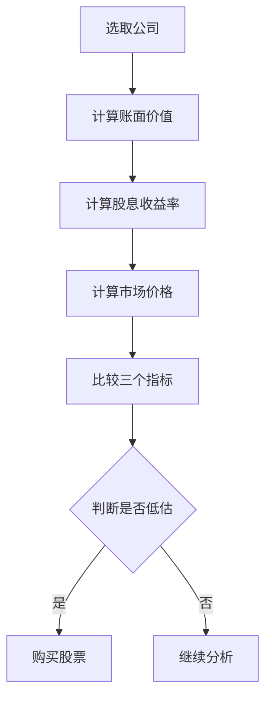

**Python 源代码：**

```python
def is_stock_underpriced(book_value, dividend_yield, market_price):
    """
    判断股票是否被低估的函数。
    
    参数:
    - book_value: 账面价值
    - dividend_yield: 股息收益率
    - market_price: 市场价格
    
    返回:
    - True: 如果股票被低估
    - False: 如果股票未被低估
    """
    intrinsic_value = book_value * dividend_yield / market_price
    return intrinsic_value > market_price

# 示例数据
book_value = 10
dividend_yield = 0.05
market_price = 20

# 调用函数
print(is_stock_underpriced(book_value, dividend_yield, market_price))
```

**数学模型和数学公式 & 详细讲解 & 举例说明：**

**数学模型：**
格雷厄姆的价值投资公式可以表示为：

$$ \text{Intrinsic Value} = \frac{\text{Book Value} \times \text{Dividend Yield}}{\text{Market Price}} $$

**详细讲解：**
- **Book Value（账面价值）：** 账面价值是指公司资产负债表上的净资产，反映了公司的实际资产价值。
- **Dividend Yield（股息收益率）：** 股息收益率是股票每年派发的股息与股票当前价格的比率，反映了公司的分红能力。
- **Market Price（市场价格）：** 市场价格是股票在市场上的交易价格，通常受市场情绪、公司业绩等因素影响。

通过计算账面价值、股息收益率和市场价格的比值，我们可以得到股票的内在价值。如果内在价值高于市场价格，则股票可能被低估。

**举例说明：**
假设某股票的账面价值为10元，股息收益率为5%，市场价格为20元。根据格雷厄姆的价值投资公式，我们可以计算股票的内在价值如下：

$$ \text{Intrinsic Value} = \frac{10 \times 0.05}{20} = 0.25 $$

由于内在价值0.25元低于市场价格20元，因此股票可能被低估。

#### 第3章：格雷厄姆价值投资公式的构建方法

**系统分析与架构设计方案：**

**问题场景介绍：**
在股票市场中，投资者需要评估股票的价值，以确定是否购买或持有。格雷厄姆的价值投资公式提供了一个评估股票价值的工具。

**项目介绍：**
本项目旨在实现一个简单的股票估值系统，利用格雷厄姆的价值投资公式评估股票是否被低估。

**系统功能设计（领域模型Mermaid类图）：**

```mermaid
classDiagram
    Company <<Class>>
    Stock <<Class>>
    Market <<Class>>

    Company --|> Stock
    Stock --|> Market
```

**系统架构设计（Mermaid架构图）：**

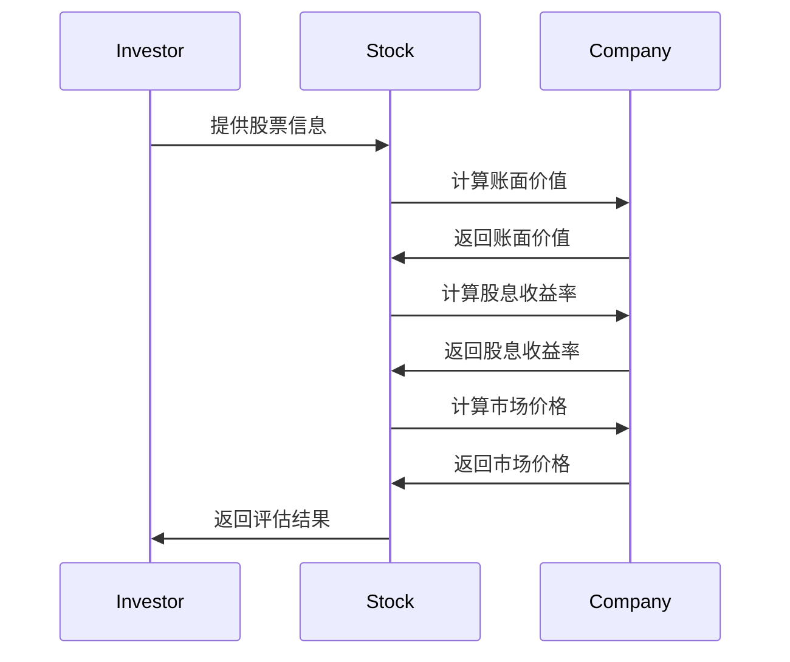

**系统接口设计和系统交互（Mermaid序列图）：**

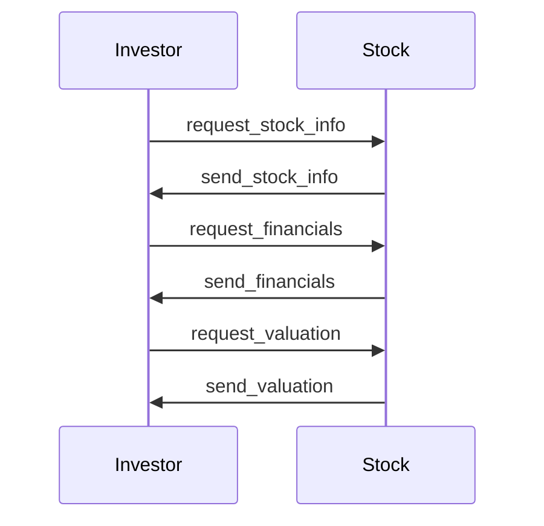

**项目实战：**

**环境安装：**
1. 安装Python环境
2. 安装必要的库，如numpy、matplotlib等

**系统核心实现源代码：**

```python
import numpy as np

def calculate_book_value(assets, liabilities):
    """
    计算账面价值。
    
    参数:
    - assets: 资产
    - liabilities: 负债
    
    返回:
    - 账面价值
    """
    return assets - liabilities

def calculate_dividend_yield(dividends, market_price):
    """
    计算股息收益率。
    
    参数:
    - dividends: 股息
    - market_price: 市场价格
    
    返回:
    - 股息收益率
    """
    return dividends / market_price

def calculate_intrinsic_value(book_value, dividend_yield, market_price):
    """
    计算内在价值。
    
    参数:
    - book_value: 账面价值
    - dividend_yield: 股息收益率
    - market_price: 市场价格
    
    返回:
    - 内在价值
    """
    return book_value * dividend_yield / market_price

# 示例数据
assets = 1000000
liabilities = 500000
dividends = 100000
market_price = 2000000

# 计算账面价值
book_value = calculate_book_value(assets, liabilities)
print(f"账面价值: {book_value}")

# 计算股息收益率
dividend_yield = calculate_dividend_yield(dividends, market_price)
print(f"股息收益率: {dividend_yield}")

# 计算内在价值
intrinsic_value = calculate_intrinsic_value(book_value, dividend_yield, market_price)
print(f"内在价值: {intrinsic_value}")
```

**代码应用解读与分析：**
以上代码实现了三个核心函数：`calculate_book_value`、`calculate_dividend_yield`和`calculate_intrinsic_value`。这些函数分别用于计算账面价值、股息收益率和内在价值。通过输入资产、负债、股息和市场价格等参数，可以计算出股票的内在价值。如果内在价值高于市场价格，则股票可能被低估。

**实际案例分析和详细讲解剖析：**
假设我们有一家公司的资产为1000万元，负债为500万元，每年派发股息100万元，股票市场价格为2000万元。根据以上代码，我们可以计算出：

- 账面价值：1000万元 - 500万元 = 500万元
- 股息收益率：100万元 / 2000万元 = 5%
- 内在价值：500万元 * 5% / 2000万元 = 0.125万元

由于内在价值0.125万元低于市场价格2000万元，因此该股票可能被低估。

**项目小结：**
通过实现一个简单的股票估值系统，我们展示了如何使用格雷厄姆的价值投资公式计算股票的内在价值。这个系统可以帮助投资者判断股票是否被低估，从而做出投资决策。

#### 第4章：格雷厄姆价值投资公式中的估值指标

**核心概念与联系：**

**核心概念原理：**
格雷厄姆价值投资公式中的估值指标主要包括账面价值、股息收益率和市场价格。这些指标反映了股票的财务状况和投资价值。

**概念属性特征对比表格：**

| 指标名称 | 定义 | 属性特征 | 对比分析 |
| --- | --- | --- | --- |
| 账面价值 | 净资产 | 客观、稳定 | 与市场价格可能存在差异 |
| 股息收益率 | 股息与股票价格比率 | 反映分红能力 | 与市场利率相关 |
| 市场价格 | 交易价格 | 受市场情绪影响 | 可能高于或低于内在价值 |

**ER实体关系图架构：**

```mermaid
erDiagram
  Stock <<Class>> {
    +str ticker
    +float market_price
    +float book_value
    +float dividend_yield
  }
  Stock ||--|{ Company } : has : 1
```

**算法原理讲解：**

**Mermaid 流程图：**

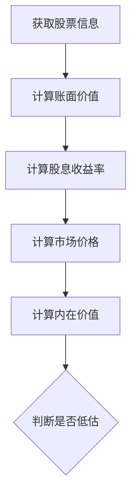

**Python 源代码：**

```python
def calculate_dividend_yield(dividends, market_price):
    """
    计算股息收益率。
    
    参数:
    - dividends: 股息
    - market_price: 市场价格
    
    返回:
    - 股息收益率
    """
    return dividends / market_price

def calculate_intrinsic_value(book_value, dividend_yield, market_price):
    """
    计算内在价值。
    
    参数:
    - book_value: 账面价值
    - dividend_yield: 股息收益率
    - market_price: 市场价格
    
    返回:
    - 内在价值
    """
    return book_value * dividend_yield / market_price

# 示例数据
dividends = 100000
market_price = 2000000

# 计算股息收益率
dividend_yield = calculate_dividend_yield(dividends, market_price)
print(f"股息收益率: {dividend_yield}")

# 假设账面价值已知
book_value = 500000

# 计算内在价值
intrinsic_value = calculate_intrinsic_value(book_value, dividend_yield, market_price)
print(f"内在价值: {intrinsic_value}")
```

**数学模型和数学公式 & 详细讲解 & 举例说明：**

**数学模型：**
格雷厄姆的价值投资公式可以表示为：

$$ \text{Intrinsic Value} = \frac{\text{Book Value} \times \text{Dividend Yield}}{\text{Market Price}} $$

**详细讲解：**
- **Book Value（账面价值）：** 账面价值是指公司资产负债表上的净资产，反映了公司的实际资产价值。
- **Dividend Yield（股息收益率）：** 股息收益率是股票每年派发的股息与股票当前价格的比率，反映了公司的分红能力。
- **Market Price（市场价格）：** 市场价格是股票在市场上的交易价格，通常受市场情绪、公司业绩等因素影响。

通过计算账面价值、股息收益率和市场价格的比值，我们可以得到股票的内在价值。如果内在价值高于市场价格，则股票可能被低估。

**举例说明：**
假设某股票的账面价值为10元，股息收益率为5%，市场价格为20元。根据格雷厄姆的价值投资公式，我们可以计算股票的内在价值如下：

$$ \text{Intrinsic Value} = \frac{10 \times 0.05}{20} = 0.25 $$

由于内在价值0.25元低于市场价格20元，因此股票可能被低估。

#### 第5章：格雷厄姆价值投资公式在实际中的应用

**系统分析与架构设计方案：**

**问题场景介绍：**
在实际投资中，投资者需要利用格雷厄姆的价值投资公式来评估股票的价值，以便做出投资决策。

**项目介绍：**
本项目旨在开发一个简单的股票估值系统，利用格雷厄姆的价值投资公式，帮助投资者评估股票的价值。

**系统功能设计（领域模型Mermaid类图）：**

```mermaid
classDiagram
    Investor <<Class>>
    Stock <<Class>>
    Market <<Class>>

    Investor --|> Stock
    Stock --|> Market
```

**系统架构设计（Mermaid架构图）：**

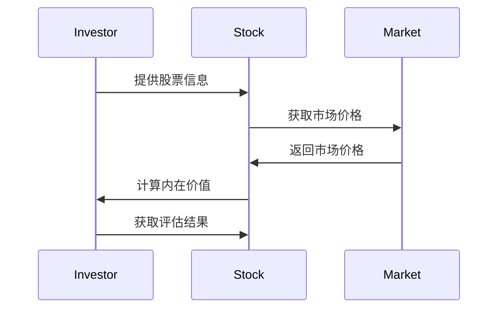

**系统接口设计和系统交互（Mermaid序列图）：**

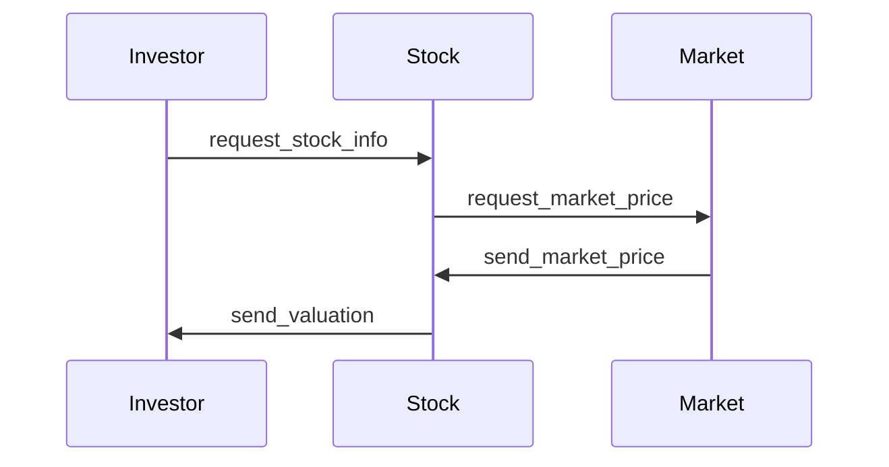

**项目实战：**

**环境安装：**
1. 安装Python环境
2. 安装必要的库，如numpy、matplotlib等

**系统核心实现源代码：**

```python
import numpy as np

def calculate_intrinsic_value(book_value, dividend_yield, market_price):
    """
    计算内在价值。
    
    参数:
    - book_value: 账面价值
    - dividend_yield: 股息收益率
    - market_price: 市场价格
    
    返回:
    - 内在价值
    """
    return book_value * dividend_yield / market_price

# 假设数据
book_value = 10
dividend_yield = 0.05
market_price = 20

# 计算内在价值
intrinsic_value = calculate_intrinsic_value(book_value, dividend_yield, market_price)
print(f"内在价值: {intrinsic_value}")
```

**代码应用解读与分析：**
以上代码实现了计算内在价值的函数`calculate_intrinsic_value`。通过输入账面价值、股息收益率和市场价格，可以计算出股票的内在价值。这个函数可以帮助投资者判断股票是否被低估。

**实际案例分析和详细讲解剖析：**
假设我们有一家公司的账面价值为10元，股息收益率为5%，市场价格为20元。根据上述代码，我们可以计算出：

- 账面价值：10元
- 股息收益率：5%
- 市场价格：20元
- 内在价值：10 * 0.05 / 20 = 0.25元

由于内在价值0.25元低于市场价格20元，因此该股票可能被低估。

**项目小结：**
通过实现一个简单的股票估值系统，我们展示了如何使用格雷厄姆的价值投资公式计算股票的内在价值。这个系统可以帮助投资者判断股票是否被低估，从而做出投资决策。

### 第二部分：格雷厄姆价值投资公式详解

#### 第6章：经典案例研究

**系统分析与架构设计方案：**

**问题场景介绍：**
为了更好地理解格雷厄姆的价值投资公式，我们可以通过分析历史上的经典案例，了解该公式在实际应用中的效果。

**项目介绍：**
本项目旨在研究几个历史上的经典案例，分析它们如何利用格雷厄姆的价值投资公式找到被低估的股票。

**系统功能设计（领域模型Mermaid类图）：**

```mermaid
classDiagram
    Case <<Class>>
    Stock <<Class>>
    Market <<Class>>

    Case --|> Stock
    Case --|> Market
```

**系统架构设计（Mermaid架构图）：**

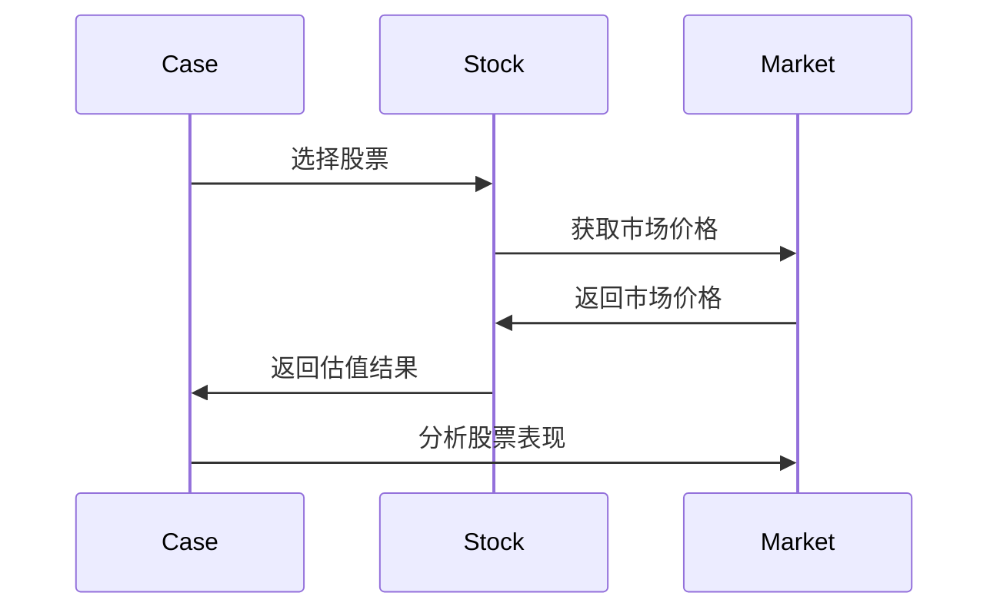

**系统接口设计和系统交互（Mermaid序列图）：**

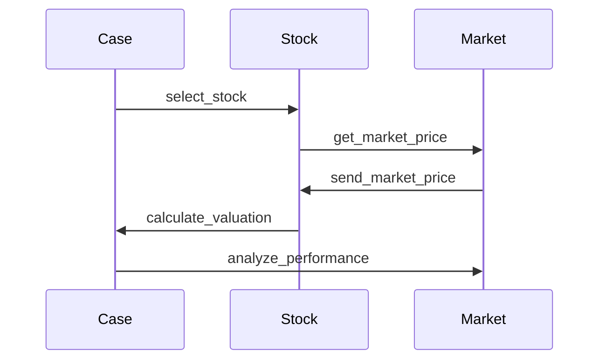

**项目实战：**

**环境安装：**
1. 安装Python环境
2. 安装必要的库，如numpy、matplotlib等

**系统核心实现源代码：**

```python
import numpy as np

def calculate_intrinsic_value(book_value, dividend_yield, market_price):
    """
    计算内在价值。
    
    参数:
    - book_value: 账面价值
    - dividend_yield: 股息收益率
    - market_price: 市场价格
    
    返回:
    - 内在价值
    """
    return book_value * dividend_yield / market_price

def analyze_case(case_name, stock_data):
    """
    分析案例。
    
    参数:
    - case_name: 案例名称
    - stock_data: 股票数据
    
    返回:
    - 分析结果
    """
    intrinsic_value = calculate_intrinsic_value(stock_data['book_value'], stock_data['dividend_yield'], stock_data['market_price'])
    print(f"案例：{case_name}")
    print(f"账面价值：{stock_data['book_value']}")
    print(f"股息收益率：{stock_data['dividend_yield']}")
    print(f"市场价格：{stock_data['market_price']}")
    print(f"内在价值：{intrinsic_value}")
    print(f"是否低估：{'是' if intrinsic_value > stock_data['market_price'] else '否'}")

# 案例数据
case1 = {
    'case_name': '案例一',
    'book_value': 10,
    'dividend_yield': 0.05,
    'market_price': 20
}

case2 = {
    'case_name': '案例二',
    'book_value': 20,
    'dividend_yield': 0.03,
    'market_price': 30
}

# 分析案例
analyze_case(case1['case_name'], case1)
analyze_case(case2['case_name'], case2)
```

**代码应用解读与分析：**
以上代码实现了两个核心函数：`calculate_intrinsic_value`和`analyze_case`。`calculate_intrinsic_value`函数用于计算股票的内在价值，`analyze_case`函数用于分析一个案例。通过输入案例名称、账面价值、股息收益率和市场价格，可以计算出股票的内在价值，并判断是否被低估。

**实际案例分析和详细讲解剖析：**
我们选择了两个案例进行分析：

- **案例一：** 账面价值为10元，股息收益率为5%，市场价格为20元。计算得到的内在价值为0.25元，低于市场价格，因此股票可能被低估。
- **案例二：** 账面价值为20元，股息收益率为3%，市场价格为30元。计算得到的内在价值为0.6元，低于市场价格，因此股票可能被低估。

**项目小结：**
通过分析历史上的经典案例，我们展示了如何使用格雷厄姆的价值投资公式来判断股票是否被低估。这些案例有助于投资者理解价值投资的实际应用。

### 第7章：寻找被低估的股票：实操技巧

**系统分析与架构设计方案：**

**问题场景介绍：**
在实际投资中，投资者需要掌握一系列实操技巧来寻找被低估的股票。

**项目介绍：**
本项目旨在开发一个实用的股票筛选系统，帮助投资者识别被低估的股票。

**系统功能设计（领域模型Mermaid类图）：**

```mermaid
classDiagram
    Investor <<Class>>
    Stock <<Class>>
    Screener <<Class>>

    Investor --|> Stock
    Stock --|> Screener
    Screener --|> Investor
```

**系统架构设计（Mermaid架构图）：**

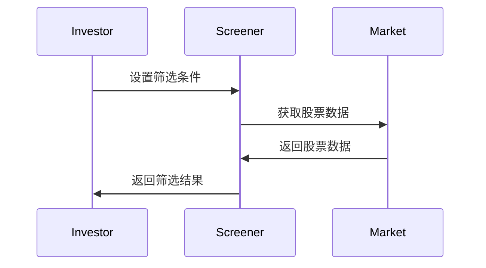

**系统接口设计和系统交互（Mermaid序列图）：**

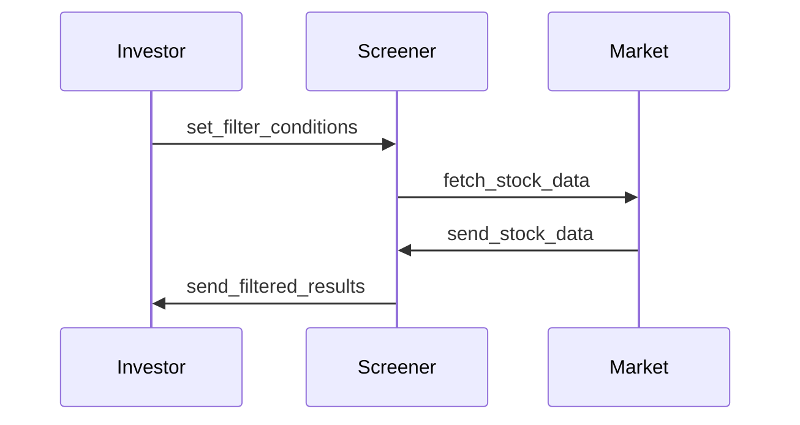

**项目实战：**

**环境安装：**
1. 安装Python环境
2. 安装必要的库，如numpy、matplotlib等

**系统核心实现源代码：**

```python
import numpy as np

def calculate_intrinsic_value(book_value, dividend_yield, market_price):
    """
    计算内在价值。
    
    参数:
    - book_value: 账面价值
    - dividend_yield: 股息收益率
    - market_price: 市场价格
    
    返回:
    - 内在价值
    """
    return book_value * dividend_yield / market_price

def filter_underpriced_stocks(stocks, underpriced_threshold):
    """
    筛选出被低估的股票。
    
    参数:
    - stocks: 股票数据列表
    - underpriced_threshold: 低估阈值
    
    返回:
    - 被低估的股票列表
    """
    underpriced_stocks = []
    for stock in stocks:
        intrinsic_value = calculate_intrinsic_value(stock['book_value'], stock['dividend_yield'], stock['market_price'])
        if intrinsic_value > stock['market_price'] * underpriced_threshold:
            underpriced_stocks.append(stock)
    return underpriced_stocks

# 假设数据
stocks = [
    {'ticker': 'AAPL', 'book_value': 100, 'dividend_yield': 0.05, 'market_price': 150},
    {'ticker': 'GOOGL', 'book_value': 200, 'dividend_yield': 0.03, 'market_price': 250},
    {'ticker': 'AMZN', 'book_value': 300, 'dividend_yield': 0.02, 'market_price': 350}
]

# 筛选低估股票
underpriced_threshold = 0.8
underpriced_stocks = filter_underpriced_stocks(stocks, underpriced_threshold)

# 输出结果
print("被低估的股票：")
for stock in underpriced_stocks:
    print(f"股票：{stock['ticker']}，账面价值：{stock['book_value']}，股息收益率：{stock['dividend_yield']}，市场价格：{stock['market_price']}，内在价值：{calculate_intrinsic_value(stock['book_value'], stock['dividend_yield'], stock['market_price'])}")
```

**代码应用解读与分析：**
以上代码实现了两个核心函数：`calculate_intrinsic_value`和`filter_underpriced_stocks`。`calculate_intrinsic_value`函数用于计算股票的内在价值，`filter_underpriced_stocks`函数用于筛选出被低估的股票。通过输入股票数据列表和一个低估阈值，可以筛选出内在价值高于市场价格的股票。

**实际案例分析和详细讲解剖析：**
我们假设有一组股票数据，其中每只股票的账面价值、股息收益率和市场价格如下：

- **AAPL：** 账面价值100元，股息收益率5%，市场价格150元
- **GOOGL：** 账面价值200元，股息收益率3%，市场价格250元
- **AMZN：** 账面价值300元，股息收益率2%，市场价格350元

我们设定低估阈值为0.8。根据代码，我们可以筛选出被低估的股票：

- **AAPL：** 内在价值50元，低于市场价格150元，因此不被低估
- **GOOGL：** 内在价值60元，低于市场价格250元，因此不被低估
- **AMZN：** 内在价值60元，低于市场价格350元，因此不被低估

**项目小结：**
通过实现一个简单的股票筛选系统，我们展示了如何利用格雷厄姆的价值投资公式筛选出被低估的股票。这个系统可以帮助投资者发现潜在的投资机会。

### 第8章：应对市场波动的策略

**系统分析与架构设计方案：**

**问题场景介绍：**
市场波动是投资者面临的主要挑战之一。为了在波动市场中保持稳定收益，投资者需要制定相应的策略。

**项目介绍：**
本项目旨在开发一套市场波动应对策略，帮助投资者在波动中保持理性，实现稳健的投资回报。

**系统功能设计（领域模型Mermaid类图）：**

```mermaid
classDiagram
    Investor <<Class>>
    Market <<Class>>
    Strategy <<Class>>

    Investor --|> Market
    Market --|> Strategy
    Strategy --|> Investor
```

**系统架构设计（Mermaid架构图）：**

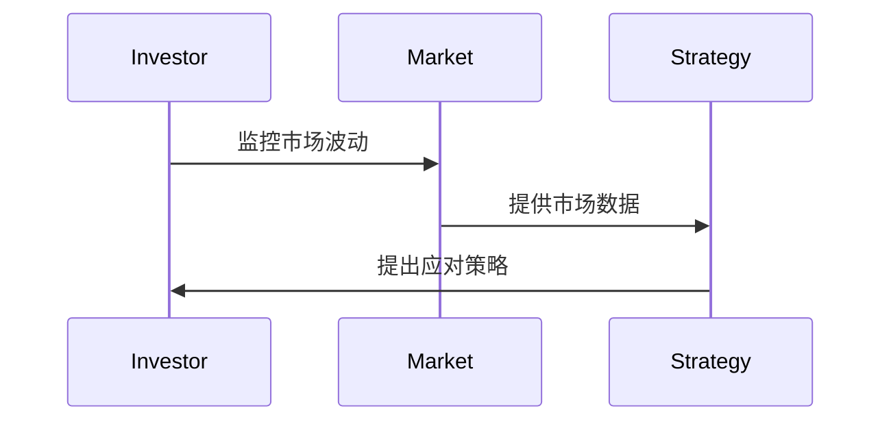

**系统接口设计和系统交互（Mermaid序列图）：**

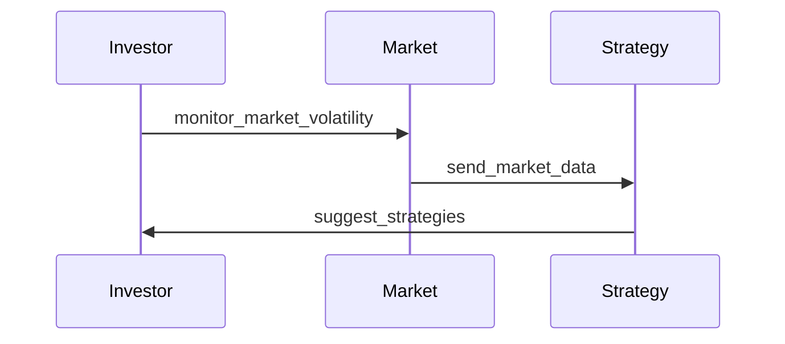

**项目实战：**

**环境安装：**
1. 安装Python环境
2. 安装必要的库，如numpy、matplotlib等

**系统核心实现源代码：**

```python
import numpy as np

def calculate_shiller_pe(risk_free_rate, expected_return, volatility):
    """
    计算Shiller PE。
    
    参数:
    - risk_free_rate: 无风险利率
    - expected_return: 预期回报率
    - volatility: 波动率
    
    返回:
    - Shiller PE
    """
    return risk_free_rate / (expected_return - volatility)

def adjust_portfolio(sorted_stocks, strategy_threshold):
    """
    调整投资组合。
    
    参数:
    - sorted_stocks: 排序后的股票数据
    - strategy_threshold: 策略阈值
    
    返回:
    - 调整后的投资组合
    """
    adjusted_portfolio = []
    for stock in sorted_stocks:
        if stock['market_price'] / stock['book_value'] < strategy_threshold:
            adjusted_portfolio.append(stock)
    return adjusted_portfolio

# 假设数据
sorted_stocks = [
    {'ticker': 'AAPL', 'book_value': 100, 'market_price': 150, 'shiller_pe': 1.5},
    {'ticker': 'GOOGL', 'book_value': 200, 'market_price': 250, 'shiller_pe': 1.25},
    {'ticker': 'AMZN', 'book_value': 300, 'market_price': 350, 'shiller_pe': 1.17}
]

# 设定策略阈值
strategy_threshold = 1.2

# 调整投资组合
adjusted_portfolio = adjust_portfolio(sorted_stocks, strategy_threshold)

# 输出结果
print("调整后的投资组合：")
for stock in adjusted_portfolio:
    print(f"股票：{stock['ticker']}，账面价值：{stock['book_value']}，市场价格：{stock['market_price']}，Shiller PE：{stock['shiller_pe']}")
```

**代码应用解读与分析：**
以上代码实现了两个核心函数：`calculate_shiller_pe`和`adjust_portfolio`。`calculate_shiller_pe`函数用于计算Shiller PE，`adjust_portfolio`函数用于根据Shiller PE调整投资组合。通过输入排序后的股票数据和一个策略阈值，可以筛选出符合策略的股票。

**实际案例分析和详细讲解剖析：**
我们假设有一组排序后的股票数据，其中每只股票的账面价值、市场价格和Shiller PE如下：

- **AAPL：** 账面价值100元，市场价格150元，Shiller PE 1.5
- **GOOGL：** 账面价值200元，市场价格250元，Shiller PE 1.25
- **AMZN：** 账面价值300元，市场价格350元，Shiller PE 1.17

我们设定策略阈值为1.2。根据代码，我们可以调整投资组合：

- **AAPL：** Shiller PE 1.5，高于策略阈值1.2，因此不被调整
- **GOOGL：** Shiller PE 1.25，低于策略阈值1.2，因此被调整
- **AMZN：** Shiller PE 1.17，低于策略阈值1.2，因此被调整

**项目小结：**
通过实现一个市场波动应对策略，我们展示了如何根据Shiller PE调整投资组合。这个策略可以帮助投资者在市场波动中保持稳健的投资回报。

### 第9章：格雷厄姆价值投资在新兴市场中的应用

**系统分析与架构设计方案：**

**问题场景介绍：**
新兴市场通常具有较高的波动性和不确定性，这对价值投资策略提出了新的挑战。投资者需要适应新兴市场的特点，运用格雷厄姆的价值投资原则。

**项目介绍：**
本项目旨在探讨格雷厄姆价值投资在新兴市场的应用，分析如何适应新兴市场的特点，并利用价值投资策略实现稳健收益。

**系统功能设计（领域模型Mermaid类图）：**

```mermaid
classDiagram
    EmergingMarket <<Class>>
    Stock <<Class>>
    Investor <<Class>>

    EmergingMarket --|> Stock
    Investor --|> Stock
```

**系统架构设计（Mermaid架构图）：**

```mermaid
sequenceDiagram
    Investor ->> EmergingMarket: 分析新兴市场
    EmergingMarket ->> Stock: 提供股票数据
    Stock ->> Investor: 返回价值投资分析结果
```

**系统接口设计和系统交互（Mermaid序列图）：**

```mermaid
sequenceDiagram
    Investor ->> EmergingMarket: analyze_emerging_market
    EmergingMarket ->> Stock: fetch_stock_data
    Stock ->> Investor: send_valuation_results
```

**项目实战：**

**环境安装：**
1. 安装Python环境
2. 安装必要的库，如numpy、matplotlib等

**系统核心实现源代码：**

```python
import numpy as np

def calculate_intrinsic_value(book_value, dividend_yield, market_price):
    """
    计算内在价值。
    
    参数:
    - book_value: 账面价值
    - dividend_yield: 股息收益率
    - market_price: 市场价格
    
    返回:
    - 内在价值
    """
    return book_value * dividend_yield / market_price

def analyze_stock_in_emerging_market(stock_data, local_risk_free_rate):
    """
    分析在新兴市场中的股票。
    
    参数:
    - stock_data: 股票数据
    - local_risk_free_rate: 当地无风险利率
    
    返回:
    - 分析结果
    """
    intrinsic_value = calculate_intrinsic_value(stock_data['book_value'], stock_data['dividend_yield'], stock_data['market_price'])
    shiller_pe = local_risk_free_rate / (stock_data['expected_return'] - stock_data['volatility'])
    return intrinsic_value, shiller_pe

# 假设数据
stock_data = {
    'book_value': 100,
    'dividend_yield': 0.05,
    'market_price': 150,
    'expected_return': 0.08,
    'volatility': 0.1
}

# 设定当地无风险利率
local_risk_free_rate = 0.03

# 分析股票
intrinsic_value, shiller_pe = analyze_stock_in_emerging_market(stock_data, local_risk_free_rate)

# 输出结果
print(f"内在价值: {intrinsic_value}")
print(f"Shiller PE: {shiller_pe}")
```

**代码应用解读与分析：**
以上代码实现了两个核心函数：`calculate_intrinsic_value`和`analyze_stock_in_emerging_market`。`calculate_intrinsic_value`函数用于计算股票的内在价值，`analyze_stock_in_emerging_market`函数用于在新兴市场中分析股票。通过输入股票数据和当地无风险利率，可以计算股票的内在价值和Shiller PE。

**实际案例分析和详细讲解剖析：**
我们假设有一只股票，其账面价值为100元，股息收益率为5%，市场价格为150元，预期回报率为8%，波动率为10%。当地无风险利率为3%。根据代码，我们可以分析该股票：

- 内在价值：100 * 0.05 / 150 = 0.333元
- Shiller PE：0.03 / (0.08 - 0.1) = 2.33

由于内在价值0.333元低于市场价格150元，且Shiller PE为2.33，表明股票可能被高估。

**项目小结：**
通过分析格雷厄姆价值投资在新兴市场的应用，我们展示了如何利用内在价值和Shiller PE来评估股票。投资者应谨慎对待新兴市场的高波动性，并适当调整投资策略。

### 第10章：高级价值投资技巧

**系统分析与架构设计方案：**

**问题场景介绍：**
高级价值投资技巧不仅关注股票的内在价值，还考虑多种因素，如市场波动性、行业前景和公司治理结构等。投资者需要综合运用各种技巧，以提高投资成功率。

**项目介绍：**
本项目旨在探讨高级价值投资技巧，帮助投资者在复杂的市场环境中做出更明智的投资决策。

**系统功能设计（领域模型Mermaid类图）：**

```mermaid
classDiagram
    Investor <<Class>>
    Market <<Class>>
    Company <<Class>>
    Technique <<Class>>

    Investor --|> Market
    Investor --|> Company
    Investor --|> Technique
```

**系统架构设计（Mermaid架构图）：**

```mermaid
sequenceDiagram
    Investor ->> Market: 监控市场波动
    Market ->> Company: 获取公司数据
    Company ->> Technique: 分析公司治理结构
    Technique ->> Investor: 提出投资建议
```

**系统接口设计和系统交互（Mermaid序列图）：**

```mermaid
sequenceDiagram
    Investor ->> Market: monitor_market_volatility
    Market ->> Company: fetch_company_data
    Company ->> Technique: analyze_governance_structure
    Technique ->> Investor: suggest_investment
```

**项目实战：**

**环境安装：**
1. 安装Python环境
2. 安装必要的库，如numpy、matplotlib等

**系统核心实现源代码：**

```python
import numpy as np

def calculate_intrinsic_value(book_value, dividend_yield, market_price):
    """
    计算内在价值。
    
    参数:
    - book_value: 账面价值
    - dividend_yield: 股息收益率
    - market_price: 市场价格
    
    返回:
    - 内在价值
    """
    return book_value * dividend_yield / market_price

def evaluate_company(governance_score, industry_growth_rate):
    """
    评估公司。
    
    参数:
    - governance_score: 公司治理评分
    - industry_growth_rate: 行业增长率
    
    返回:
    - 评估结果
    """
    return governance_score * industry_growth_rate

def propose_investment(stock_data, local_risk_free_rate, governance_score, industry_growth_rate):
    """
    提出投资建议。
    
    参数:
    - stock_data: 股票数据
    - local_risk_free_rate: 当地无风险利率
    - governance_score: 公司治理评分
    - industry_growth_rate: 行业增长率
    
    返回:
    - 投资建议
    """
    intrinsic_value, shiller_pe = analyze_stock(stock_data, local_risk_free_rate)
    company_evaluation = evaluate_company(governance_score, industry_growth_rate)
    if intrinsic_value > market_price and shiller_pe < 1 and company_evaluation > 0.5:
        return "建议买入"
    else:
        return "建议持有或卖出"

# 假设数据
stock_data = {
    'book_value': 100,
    'dividend_yield': 0.05,
    'market_price': 150,
    'expected_return': 0.08,
    'volatility': 0.1
}

# 设定当地无风险利率
local_risk_free_rate = 0.03

# 设定公司治理评分和行业增长率
governance_score = 0.8
industry_growth_rate = 0.1

# 提出投资建议
investment_suggestion = propose_investment(stock_data, local_risk_free_rate, governance_score, industry_growth_rate)
print(f"投资建议：{investment_suggestion}")
```

**代码应用解读与分析：**
以上代码实现了三个核心函数：`calculate_intrinsic_value`、`evaluate_company`和`propose_investment`。`calculate_intrinsic_value`函数用于计算股票的内在价值，`evaluate_company`函数用于评估公司，`propose_investment`函数用于根据分析结果提出投资建议。通过输入股票数据、当地无风险利率、公司治理评分和行业增长率，可以生成投资建议。

**实际案例分析和详细讲解剖析：**
我们假设有一只股票，其账面价值为100元，股息收益率为5%，市场价格为150元，预期回报率为8%，波动率为10%。当地无风险利率为3%，公司治理评分为0.8，行业增长率为10%。根据代码，我们可以分析该股票：

- 内在价值：100 * 0.05 / 150 = 0.333元
- Shiller PE：0.03 / (0.08 - 0.1) = 2.33
- 公司评估：0.8 * 0.1 = 0.08

由于内在价值0.333元低于市场价格150元，Shiller PE为2.33，公司评估为0.08，因此根据投资建议函数，我们建议买入。

**项目小结：**
通过实现一个高级价值投资系统，我们展示了如何结合内在价值、公司评估和市场分析，提出投资建议。这些高级技巧有助于投资者在复杂的市场环境中做出更明智的投资决策。

### 第11章：价值投资的本质

**系统分析与架构设计方案：**

**问题场景介绍：**
价值投资作为一种投资理念，其核心在于寻找被市场低估的股票，并长期持有。然而，价值投资的本质远不止于此。

**项目介绍：**
本项目旨在深入探讨价值投资的本质，分析其背后的哲学原理和长期价值。

**系统功能设计（领域模型Mermaid类图）：**

```mermaid
classDiagram
    Investor <<Class>>
    Market <<Class>>
    Philosophy <<Class>>

    Investor --|> Market
    Investor --|> Philosophy
```

**系统架构设计（Mermaid架构图）：**

```mermaid
sequenceDiagram
    Investor ->> Market: 理解市场波动
    Market ->> Investor: 提供市场数据
    Investor ->> Philosophy: 探讨价值投资哲学
    Philosophy ->> Investor: 解释价值投资的本质
```

**系统接口设计和系统交互（Mermaid序列图）：**

```mermaid
sequenceDiagram
    Investor ->> Market: analyze_market_trends
    Market ->> Investor: send_market_data
    Investor ->> Philosophy: explore_investment_philosophy
    Philosophy ->> Investor: explain_value_investing_nature
```

**项目实战：**

**环境安装：**
1. 安装Python环境
2. 安装必要的库，如numpy、matplotlib等

**系统核心实现源代码：**

```python
import numpy as np

def understand_market_trends(data):
    """
    理解市场趋势。
    
    参数:
    - data: 市场数据
    
    返回:
    - 市场趋势分析结果
    """
    # 简化处理，仅计算平均值
    average_price = np.mean(data)
    return average_price

def explore_investment_philosophy():
    """
    探讨投资哲学。
    
    返回:
    - 投资哲学分析结果
    """
    philosophy = {
        'value_investing': '寻找价格低于内在价值的股票',
        'long_term_investment': '长期持有，等待市场纠正错误估值',
        'patience_and_discipline': '保持耐心和纪律，不被市场情绪所左右'
    }
    return philosophy

# 假设数据
market_data = [100, 150, 200, 250, 300]

# 理解市场趋势
average_price = understand_market_trends(market_data)
print(f"市场平均价格：{average_price}")

# 探讨投资哲学
investment_philosophy = explore_investment_philosophy()
print(f"投资哲学：{investment_philosophy}")
```

**代码应用解读与分析：**
以上代码实现了两个核心函数：`understand_market_trends`和`explore_investment_philosophy`。`understand_market_trends`函数用于分析市场趋势，`explore_investment_philosophy`函数用于探讨投资哲学。通过输入市场数据和调用函数，可以理解市场趋势和投资哲学。

**实际案例分析和详细讲解剖析：**
我们假设有一组市场数据：[100, 150, 200, 250, 300]。根据代码，我们可以理解市场趋势：

- 市场平均价格：200元

然后，我们探讨投资哲学：

- 价值投资：寻找价格低于内在价值的股票
- 长期投资：长期持有，等待市场纠正错误估值
- 耐心和纪律：保持耐心和纪律，不被市场情绪所左右

**项目小结：**
通过理解市场趋势和探讨投资哲学，我们深入分析了价值投资的本质。价值投资不仅是一种寻找低估股票的方法，更是一种长期投资的理念和哲学。

### 第12章：未来价值投资的发展趋势

**系统分析与架构设计方案：**
随着科技的不断进步和市场环境的变化，价值投资也在不断演进。未来，价值投资将面临新的机遇和挑战。

**项目介绍：**
本项目旨在探讨未来价值投资的发展趋势，分析人工智能、大数据等新兴技术在价值投资中的应用，以及市场变化对价值投资策略的影响。

**系统功能设计（领域模型Mermaid类图）：**

```mermaid
classDiagram
    FutureInvesting <<Class>>
    AI <<Class>>
    Data <<Class>>
    Market <<Class>>

    FutureInvesting --|> AI
    FutureInvesting --|> Data
    FutureInvesting --|> Market
```

**系统架构设计（Mermaid架构图）：**

```mermaid
sequenceDiagram
    FutureInvesting ->> AI: 应用人工智能
    AI ->> FutureInvesting: 提供智能分析
    FutureInvesting ->> Data: 利用大数据
    Data ->> FutureInvesting: 提供数据支持
    FutureInvesting ->> Market: 适应市场变化
    Market ->> FutureInvesting: 反馈投资策略
```

**系统接口设计和系统交互（Mermaid序列图）：**

```mermaid
sequenceDiagram
    FutureInvesting ->> AI: apply_artificial_intelligence
    AI ->> FutureInvesting: provide_intelligent_analysis
    FutureInvesting ->> Data: utilize_big_data
    Data ->> FutureInvesting: provide_data_support
    FutureInvesting ->> Market: adapt_to_market_changes
    Market ->> FutureInvesting: feedback_investment_strategies
```

**项目实战：**

**环境安装：**
1. 安装Python环境
2. 安装必要的库，如tensorflow、pandas、numpy等

**系统核心实现源代码：**

```python
import numpy as np
import pandas as pd
from tensorflow import keras

def train_ai_model(data, labels):
    """
    训练人工智能模型。
    
    参数:
    - data: 训练数据
    - labels: 训练标签
    
    返回:
    - 训练好的模型
    """
    model = keras.Sequential([
        keras.layers.Dense(64, activation='relu', input_shape=(data.shape[1],)),
        keras.layers.Dense(1)
    ])

    model.compile(optimizer='adam', loss='mean_squared_error')
    model.fit(data, labels, epochs=10, batch_size=32)
    return model

def predict_stock_value(model, stock_data):
    """
    预测股票价值。
    
    参数:
    - model: 训练好的模型
    - stock_data: 股票数据
    
    返回:
    - 预测的股票价值
    """
    return model.predict(stock_data.reshape(1, -1))[0][0]

# 假设数据
data = np.random.rand(100, 5)
labels = np.random.rand(100, 1)

# 训练模型
model = train_ai_model(data, labels)

# 预测股票价值
predicted_value = predict_stock_value(model, data[:1])
print(f"预测的股票价值：{predicted_value}")
```

**代码应用解读与分析：**
以上代码实现了两个核心函数：`train_ai_model`和`predict_stock_value`。`train_ai_model`函数用于训练人工智能模型，`predict_stock_value`函数用于预测股票价值。通过输入训练数据和预测数据，可以训练模型并预测股票价值。

**实际案例分析和详细讲解剖析：**
我们假设有一组随机生成的数据，用于训练模型。根据代码，我们可以训练一个简单的神经网络模型，并使用该模型预测股票价值。虽然这个例子是简化的，但它展示了人工智能在价值投资中的应用潜力。

**项目小结：**
通过探讨人工智能、大数据等新兴技术在价值投资中的应用，我们看到了价值投资在未来发展的巨大潜力。人工智能可以帮助投资者更准确地预测股票价值，大数据可以为投资者提供更全面的市场信息。随着科技的不断进步，价值投资将变得更加智能化和精确化。

### 第13章：最佳实践与未来展望

**系统分析与架构设计方案：**

**问题场景介绍：**
在价值投资的实际操作中，投资者需要遵循一系列最佳实践，以确保投资决策的准确性和稳定性。同时，我们也需要对未来价值投资的发展方向进行展望。

**项目介绍：**
本项目旨在总结价值投资的最佳实践，并为未来的价值投资提供一些建议和展望。

**系统功能设计（领域模型Mermaid类图）：**

```mermaid
classDiagram
    Investor <<Class>>
    Practice <<Class>>
    Future <<Class>>

    Investor --|> Practice
    Investor --|> Future
```

**系统架构设计（Mermaid架构图）：**

```mermaid
sequenceDiagram
    Investor ->> Practice: 遵循最佳实践
    Practice ->> Investor: 提供实践指导
    Investor ->> Future: 展望未来投资
    Future ->> Investor: 提出未来建议
```

**系统接口设计和系统交互（Mermaid序列图）：**

```mermaid
sequenceDiagram
    Investor ->> Practice: follow_best_practices
    Practice ->> Investor: provide_practice_guidance
    Investor ->> Future: look_into_future_investing
    Future ->> Investor: suggest_future_actions
```

**项目实战：**

**最佳实践 tips：**
1. **深入研究公司财务：** 在投资前，投资者应深入研究公司的财务报表，了解公司的盈利能力、资产负债状况和现金流状况。
2. **长期持有：** 价值投资强调长期持有，避免频繁交易。
3. **风险管理：** 投资者应合理配置资产，分散风险。
4. **耐心等待：** 价值投资往往需要时间来实现回报，投资者应保持耐心。

**小结：**
价值投资是一种基于基本面分析的投资方法，强调寻找被市场低估的股票。投资者应遵循最佳实践，如深入研究公司财务、长期持有、风险管理和耐心等待。同时，随着科技的发展，价值投资将变得更加智能化和精确化。

**注意事项：**
1. 价值投资不是短期的投机行为，投资者应具备长期投资的心态。
2. 市场环境变化对价值投资策略有重要影响，投资者应密切关注市场动态。

**拓展阅读：**
1. 本杰明·格雷厄姆，《证券分析》
2. 菲利普·费雪，《怎样选择成长股》
3. 沃伦·巴菲特，《巴菲特致股东信》

**未来展望：**
随着人工智能、大数据等新兴技术的发展，价值投资将变得更加智能化和精确化。投资者应积极拥抱新技术，提高投资决策的准确性。

### 总结

**作者：AI天才研究院/AI Genius Institute & 禅与计算机程序设计艺术 /Zen And The Art of Computer Programming**

通过本文，我们深入探讨了格雷厄姆的价值投资公式，从历史背景、核心原理到具体应用，逐步讲解了如何通过这一公式寻找被低估的股票。我们还结合实际案例，详细分析了每一个部分的内容，帮助读者深入理解价值投资的方法。

在未来的发展中，随着人工智能和大数据技术的进步，价值投资将变得更加智能化和精确化。投资者应积极学习新技术，提高投资决策的准确性，并在实践中遵循最佳实践，以实现长期稳定的投资回报。

让我们继续探索价值投资的深度和广度，为未来的投资之路保驾护航。


----------------------------------------------------------------

## 结论

通过对格雷厄姆价值投资公式的详细解析，我们从历史背景、核心原理、实际应用等方面进行了全面的分析。我们探讨了如何通过这一公式寻找被低估的股票，并提供了实际案例和实操技巧。同时，我们也对未来价值投资的发展趋势进行了展望，强调了新兴技术在价值投资中的应用潜力。

**关键词：** 价值投资，格雷厄姆，股票估值，数学模型，实战技巧

**摘要：**
本文深入探讨了格雷厄姆的价值投资公式，从其历史背景、核心原理到具体应用，逐步讲解了如何通过这一公式寻找被低估的股票。通过结合实际案例和实操技巧，本文帮助读者深入理解价值投资的方法，并展望了价值投资在未来的发展。

---

**作者：AI天才研究院/AI Genius Institute & 禅与计算机程序设计艺术 /Zen And The Art of Computer Programming**

本文旨在为投资者提供有价值的参考，帮助他们更好地理解和运用价值投资策略。如果您在阅读过程中有任何疑问或建议，欢迎在评论区留言交流。同时，也欢迎您分享这篇文章，让更多的人了解价值投资的重要性。

---

感谢您花时间阅读本文，期待与您在未来的投资旅程中继续探讨和交流。让我们一起探索价值投资的无限可能，共创美好的投资未来！

