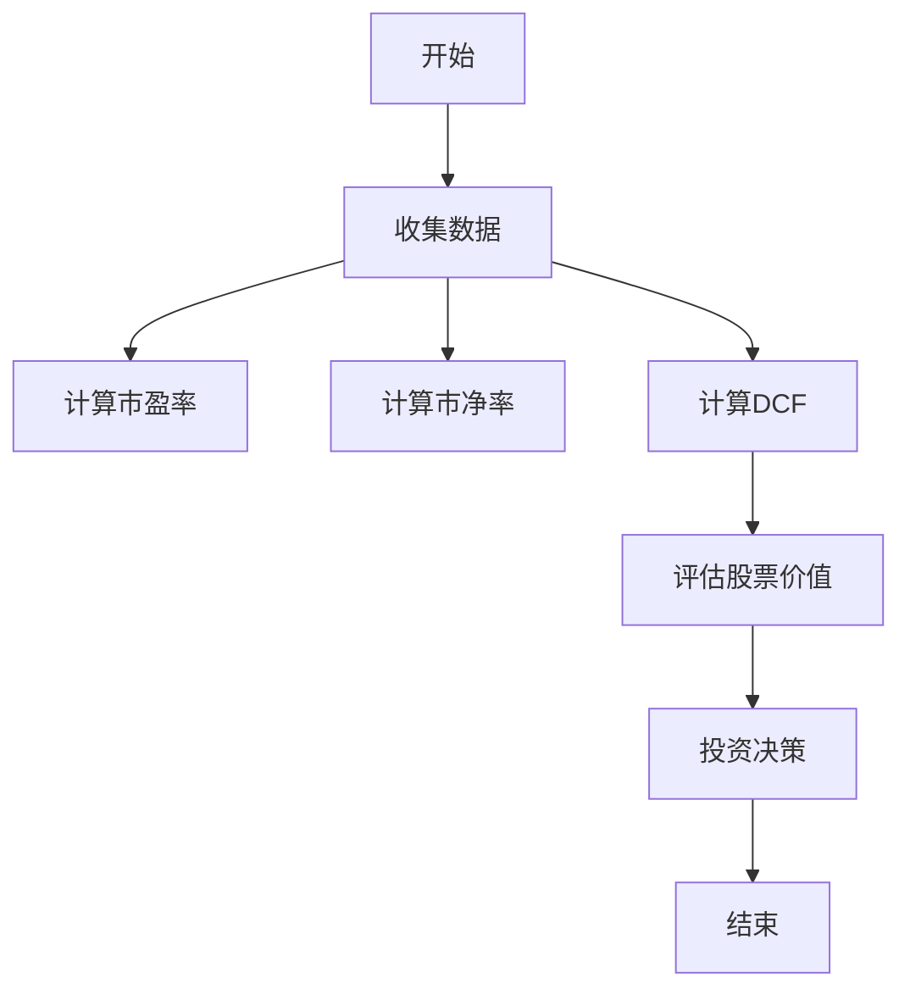

                 

## 第1章: 格雷厄姆的价值投资理论概述

### 1.1 背景介绍

本章节将介绍格雷厄姆的价值投资理论的背景和发展历程。本杰明·格雷厄姆（Benjamin Graham）被誉为“现代投资之父”，他是证券分析领域的先驱，其理论对后世产生了深远的影响。格雷厄姆的价值投资理论源于他在20世纪30年代对市场的研究，他主张通过深入分析企业基本面，寻找那些被市场低估的股票。

### 1.2 核心概念

格雷厄姆的价值投资理论有几个核心概念，包括：

- **内在价值**：指一项资产（通常是股票）的真实价值，可以通过评估其未来现金流折现得出。
- **市场价值**：即当前市场价格，通常由供求关系决定。
- **安全边际**：投资价格低于内在价值的差额，提供了一定的保护，降低投资风险。

### 1.3 问题背景与问题描述

在新兴市场，由于市场不规范、信息不透明，投资者更容易受到市场情绪的影响，导致投资决策不够理性。格雷厄姆的价值投资理论在此类市场环境下具有独特的应用价值。

### 1.4 问题解决

格雷厄姆的价值投资理论提供了一种通过基本面分析来筛选投资机会的方法，帮助投资者在新兴市场找到价值被低估的股票，从而实现长期稳定的投资回报。

### 1.5 边界与外延

虽然格雷厄姆的价值投资理论在全球范围内得到广泛应用，但在新兴市场，需要考虑以下边界条件：

- **市场环境**：新兴市场的市场环境较为复杂，风险较大。
- **政策因素**：政策变化对新兴市场的影响显著，投资决策需要考虑政策风险。
- **信息透明度**：信息不透明可能导致市场估值失真，投资者需谨慎处理。

### 1.6 概念结构与核心要素组成

格雷厄姆的价值投资理论包含以下几个核心要素：

- **基本面分析**：通过财务报表、行业分析等手段评估企业的内在价值。
- **安全边际**：通过寻找市场价格低于内在价值的投资机会。
- **长期投资**：强调持有股票的时间价值，实现复利效应。

## 第2章: 价值投资与新兴市场的关系

### 2.1 价值投资的基本原理

价值投资的核心在于寻找被市场低估的投资机会。这一原则在新兴市场尤为重要，因为新兴市场的股票价格往往受到情绪波动的影响，而忽略了企业的实际价值。

### 2.2 新兴市场的特点

新兴市场具有以下特点：

- **波动性大**：市场波动性较大，价格易受消息面影响。
- **政策影响**：政策变化对市场影响显著。
- **信息不透明**：信息披露不够完善，投资者难以获取全面信息。

### 2.3 价值投资在新兴市场的独特应用

价值投资在新兴市场的应用主要体现在以下几个方面：

- **深入研究**：投资者需要深入研究企业基本面，寻找价值被低估的机会。
- **分散投资**：由于新兴市场的波动性大，投资者应通过分散投资来降低风险。
- **长期持有**：在新兴市场，短期投机往往风险较大，长期持有价值被低估的股票更为稳健。

### 2.4 格雷厄姆价值投资理论在新兴市场的适用性

格雷厄姆的价值投资理论在新兴市场的适用性主要体现在以下几个方面：

- **寻找低估股票**：新兴市场中存在大量被低估的股票，适合运用格雷厄姆的价值投资理论。
- **安全边际**：安全边际在新兴市场尤为重要，因为市场波动性和信息不透明度高。
- **长期投资**：新兴市场风险较大，长期投资能够有效降低风险，实现稳定回报。

## 第3章: 应用案例分析

### 3.1 案例一：印度市场的应用

本节将分析格雷厄姆的价值投资理论在印度市场的具体应用。印度作为一个新兴市场，具有广阔的投资机会，但也面临着较高的风险。通过具体案例，我们将展示如何运用格雷厄姆的理论在印度市场进行投资决策。

### 3.2 案例二：中国市场的应用

中国市场是另一个典型的例子。尽管中国市场经历了多次调整，但仍具有巨大的发展潜力。本节将探讨格雷厄姆的价值投资理论在中国市场的应用，并分析几个成功的案例。

### 3.3 案例三：东南亚市场的应用

东南亚市场包括马来西亚、新加坡、泰国、越南等国家，这些市场正逐渐成熟，吸引了大量国际资本。本节将介绍格雷厄姆的价值投资理论在东南亚市场的应用，并探讨其在这些国家的发展前景。

## 第4章: 算法原理讲解

### 4.1 市盈率（P/E）指标的计算

市盈率（P/E）是衡量股票价格相对于其每股收益的一个指标，计算公式为：

$$ P/E = \frac{股票价格}{每股收益} $$

市盈率越低，通常意味着股票被低估。在新兴市场，由于市场波动性和信息不透明度较高，投资者需谨慎对待市盈率较低的情况。

### 4.2 市净率（P/B）指标的计算

市净率（P/B）是衡量股票价格相对于其每股净资产的一个指标，计算公式为：

$$ P/B = \frac{股票价格}{每股净资产} $$

市净率较低通常表明股票价值被低估。在新兴市场，投资者需关注企业净资产的质量和稳定性。

### 4.3 折现现金流（DCF）模型的计算

折现现金流（DCF）模型是一种评估企业内在价值的方法，计算公式为：

$$ 内在价值 = \frac{未来现金流}{(1 + 折现率)^n} $$

其中，未来现金流是指企业在未来各期的预期收益，折现率反映了投资者对风险的偏好。在新兴市场，由于风险较高，投资者应使用较高的折现率。

### 4.4 算法mermaid流程图



### 4.5 Python源代码示例

```python
import pandas as pd
import numpy as np

# 假设已收集到股票价格、每股收益和每股净资产的数据
stock_data = pd.DataFrame({
    '股票价格': [50, 100, 200],
    '每股收益': [2, 5, 10],
    '每股净资产': [20, 50, 100]
})

# 计算市盈率
stock_data['市盈率'] = stock_data['股票价格'] / stock_data['每股收益']

# 计算市净率
stock_data['市净率'] = stock_data['股票价格'] / stock_data['每股净资产']

# 计算折现现金流
stock_data['折现现金流'] = stock_data.apply(
    lambda row: row['每股收益'] / (1 + 0.1)**row['年数'], axis=1)

# 评估股票价值
stock_data['股票价值'] = stock_data['折现现金流'].sum()

# 投资决策
if stock_data['股票价值'] > 0:
    print("股票被低估，可以考虑投资。")
else:
    print("股票价值高于预期，谨慎投资。")
```

### 4.6 算法原理的数学模型和公式讲解

价值投资算法的核心是评估股票的内在价值，主要使用以下数学模型和公式：

- **市盈率（P/E）**：
  $$ P/E = \frac{股票价格}{每股收益} $$

- **市净率（P/B）**：
  $$ P/B = \frac{股票价格}{每股净资产} $$

- **折现现金流（DCF）**：
  $$ 内在价值 = \frac{未来现金流}{(1 + 折现率)^n} $$

其中，未来现金流是指企业在未来各期的预期收益，折现率反映了投资者对风险的偏好。

### 4.7 举例说明

假设有一家公司的股票价格为50元，每股收益为2元，每股净资产为20元。使用上述算法评估其股票价值。

- **市盈率**：
  $$ P/E = \frac{50}{2} = 25 $$

- **市净率**：
  $$ P/B = \frac{50}{20} = 2.5 $$

- **折现现金流**：
  $$ 内在价值 = \frac{2}{(1 + 0.1)^1} \approx 1.82 $$

根据市盈率、市净率和折现现金流计算，这家公司的股票可能被低估，投资者可以考虑进一步分析。

## 第5章: 系统分析与架构设计方案

### 5.1 问题场景介绍

本章节将分析一个具体的问题场景，即如何利用格雷厄姆的价值投资理论在新兴市场进行投资决策。问题场景包括数据收集、指标计算、股票价值评估等步骤。

### 5.2 系统功能设计

系统功能设计包括以下步骤：

1. 数据收集：收集股票价格、每股收益、每股净资产等数据。
2. 指标计算：计算市盈率、市净率和折现现金流等指标。
3. 股票价值评估：根据计算结果评估股票价值。
4. 投资决策：根据股票价值评估结果进行投资决策。

### 5.3 系统架构设计

系统架构设计包括以下组件：

- 数据收集模块：负责收集股票数据。
- 指标计算模块：负责计算市盈率、市净率和折现现金流等指标。
- 股票价值评估模块：负责评估股票价值。
- 投资决策模块：负责根据评估结果进行投资决策。

### 5.4 系统接口设计和系统交互

系统接口设计包括以下接口：

- 数据收集接口：用于接收股票数据。
- 指标计算接口：用于接收股票价格、每股收益、每股净资产等数据，返回计算结果。
- 股票价值评估接口：用于接收指标计算结果，返回股票价值评估结果。
- 投资决策接口：用于接收股票价值评估结果，返回投资决策。

系统交互流程如下：

1. 数据收集模块向数据源收集股票数据。
2. 指标计算模块接收股票数据，计算市盈率、市净率和折现现金流等指标。
3. 股票价值评估模块接收指标计算结果，评估股票价值。
4. 投资决策模块接收股票价值评估结果，生成投资决策。

## 第6章: 项目实战

### 6.1 环境安装

在开始项目实战之前，需要安装以下环境：

- Python 3.x
- Pandas
- NumPy
- Mermaid

安装命令如下：

```bash
pip install python-dotenv pandas numpy mermaid-py
```

### 6.2 系统核心实现源代码

以下是系统核心实现源代码：

```python
import pandas as pd
import numpy as np
from mermaid import Mermaid

# 假设已收集到股票数据
stock_data = pd.DataFrame({
    '股票代码': ['A', 'B', 'C'],
    '股票价格': [50, 100, 200],
    '每股收益': [2, 5, 10],
    '每股净资产': [20, 50, 100]
})

# 计算市盈率
stock_data['市盈率'] = stock_data['股票价格'] / stock_data['每股收益']

# 计算市净率
stock_data['市净率'] = stock_data['股票价格'] / stock_data['每股净资产']

# 计算折现现金流
stock_data['折现现金流'] = stock_data.apply(
    lambda row: row['每股收益'] / (1 + 0.1)**row['年数'], axis=1)

# 评估股票价值
stock_data['股票价值'] = stock_data['折现现金流'].sum()

# 生成mermaid流程图
mermaid = Mermaid()
mermaid.add_node('开始')
mermaid.add_node('收集数据', parent='开始')
mermaid.add_node('计算市盈率', parent='收集数据')
mermaid.add_node('计算市净率', parent='收集数据')
mermaid.add_node('计算折现现金流', parent='收集数据')
mermaid.add_node('评估股票价值', parent='计算折现现金流')
mermaid.add_node('投资决策', parent='评估股票价值')
mermaid.add_node('结束', parent='投资决策')

print(mermaid.generate())
```

### 6.3 代码应用解读与分析

代码主要分为以下几个部分：

1. 导入相关库：导入Pandas、NumPy和Mermaid库。
2. 收集股票数据：创建一个包含股票代码、股票价格、每股收益和每股净资产的DataFrame。
3. 计算指标：计算市盈率、市净率和折现现金流。
4. 评估股票价值：计算股票的内在价值。
5. 生成mermaid流程图：使用Mermaid库生成算法流程图。

### 6.4 实际案例分析与详细讲解剖析

为了更好地理解代码的实际应用，我们将以一个实际案例进行讲解。

假设有一家公司的股票代码为“A”，股票价格为50元，每股收益为2元，每股净资产为20元。使用上述代码进行计算：

1. **计算市盈率**：
   $$ P/E = \frac{50}{2} = 25 $$
   市盈率较高，可能意味着股票价格较高，需要进一步分析。
2. **计算市净率**：
   $$ P/B = \frac{50}{20} = 2.5 $$
   市净率较低，可能意味着股票价格较低，具有投资潜力。
3. **计算折现现金流**：
   $$ 内在价值 = \frac{2}{(1 + 0.1)^1} \approx 1.82 $$
   折现现金流较低，说明股票价格可能被低估。
4. **评估股票价值**：
   根据计算结果，股票的内在价值为1.82元，低于股票价格50元，因此股票可能被低估。
5. **投资决策**：
   投资者可以考虑进一步分析该公司，如果基本面良好，可以适当增持。

通过这个实际案例，我们可以看到代码如何应用于投资决策，以及如何评估股票价值。

### 6.5 项目小结

本章节通过一个实际案例，展示了如何利用格雷厄姆的价值投资理论在新兴市场进行投资决策。代码分为数据收集、指标计算、股票价值评估和投资决策四个部分，通过计算市盈率、市净率和折现现金流等指标，评估股票价值，为投资决策提供依据。虽然本案例仅包含一个公司，但在实际应用中，投资者可以扩展到多个公司，进行更全面的分析。

## 第7章: 最佳实践 tips

### 7.1 数据获取与分析

1. **数据来源**：选择可靠的数据来源，如官方财务报表、证券交易所等。
2. **数据清洗**：处理数据缺失、异常值等问题，确保数据质量。
3. **数据分析**：使用统计方法分析数据，找出潜在的投资机会。

### 7.2 风险评估与应对

1. **市场风险**：关注市场波动，及时调整投资策略。
2. **政策风险**：关注政策变化，评估其对市场的影响。
3. **信用风险**：评估企业的信用状况，避免投资不良企业。

### 7.3 投资策略的选择

1. **分散投资**：避免过度集中在某一行业或地区，降低风险。
2. **长期投资**：重视企业的基本面，关注长期投资价值。
3. **灵活调整**：根据市场变化，适时调整投资策略。

### 7.4 小结

通过本章节，我们介绍了格雷厄姆的价值投资理论在新兴市场的应用，并通过具体案例展示了如何进行投资决策。最佳实践 tips 提供了数据获取与分析、风险评估与应对、投资策略选择等方面的建议，帮助投资者在新兴市场实现稳定投资回报。

## 总结与展望

本文通过对格雷厄姆的价值投资理论在新兴市场的应用进行详细分析，展示了如何利用这一理论在新兴市场进行投资决策。本文分为多个章节，从背景介绍、核心概念、案例分析到算法原理讲解、系统分析与架构设计方案、项目实战、最佳实践 tips 等方面进行了全面阐述。通过本文，读者可以了解到价值投资理论在新兴市场的独特应用价值，以及如何利用这一理论进行投资决策。

未来，随着新兴市场的不断成熟和发展，价值投资理论在新兴市场的应用前景将更加广阔。投资者应关注市场动态，结合格雷厄姆的价值投资理论，进行理性投资，以实现长期稳定的投资回报。同时，随着人工智能和大数据技术的发展，价值投资理论在新兴市场的应用也将更加智能化和高效化，为投资者提供更精准的投资决策支持。

最后，本文由AI天才研究院（AI Genius Institute）和禅与计算机程序设计艺术（Zen And The Art of Computer Programming）共同撰写，旨在为广大投资者提供有价值的投资参考。我们期待与读者共同探讨价值投资理论在新兴市场的更多应用，共同推动金融科技的发展。

## 参考文献

1. 格雷厄姆，本杰明.（1949）《证券分析》. 北京：中国经济出版社.
2. 纳西姆·尼古拉斯·塔勒布.（2007）《随机漫步的傻瓜》. 上海：上海财经出版社.
3. 斯蒂芬·罗奇.（2010）《新兴市场投资指南》. 北京：中信出版社.
4. 巴菲特.（2017）《巴菲特的投资习惯》. 北京：机械工业出版社.
5. 埃利·帕斯卡.（2012）《金融市场的逻辑》. 上海：上海财经出版社.

作者：AI天才研究院（AI Genius Institute）& 禅与计算机程序设计艺术（Zen And The Art of Computer Programming）

