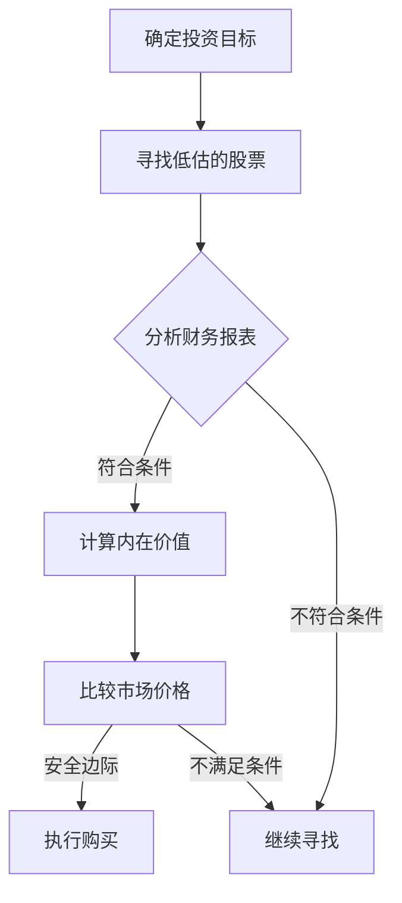

                 

# 格雷厄姆的价值投资著作解析

> 关键词：格雷厄姆、价值投资、著作解析、投资策略、数学模型

> 摘要：本文深入解析了本杰明·格雷厄姆的经典著作《证券分析》与《聪明的投资者》，探讨了价值投资的核心概念、投资策略、数学模型及其在现代金融中的应用。

## Step 1: 确定书的总体结构和主题

《格雷厄姆的价值投资著作解析》旨在通过分析格雷厄姆的经典著作，深入理解价值投资的理念和方法。书的结构主要分为以下几个部分：

1. **背景介绍**：介绍价值投资的起源、发展以及格雷厄姆对价值投资的贡献。
2. **核心概念与联系**：详细阐述价值投资的核心概念，如安全边际、内在价值等，并通过表格和ER图展示概念之间的联系。
3. **算法原理讲解**：使用mermaid画出价值投资决策的流程图，并使用Python代码和数学模型来解释价值投资的原理。
4. **数学模型和公式**：使用latex格式给出价值投资相关的数学模型和公式，并进行详细讲解和举例说明。
5. **系统分析与架构设计方案**：介绍一个模拟价值投资决策的系统，包括系统功能设计、系统架构设计、系统接口设计和系统交互。
6. **项目实战**：详细介绍一个价值投资项目的实战过程，包括环境安装、系统核心实现源代码，代码应用解读与分析，实际案例分析和详细讲解剖析。
7. **最佳实践 tips、小结、注意事项、拓展阅读**：总结书中的要点，给出实践建议，并推荐相关拓展阅读。

## Step 2: 背景介绍

### 1. 价值投资的起源与发展

价值投资作为一种投资理念，起源于20世纪30年代的美国。在那时，市场普遍处于低迷状态，投资者对市场的信心受到严重打击。格雷厄姆在这样的背景下，通过分析股票的内在价值，提出了价值投资的理念。他认为，投资者应该专注于股票的实际价值，而不是市场波动。

### 2. 格雷厄姆对价值投资的贡献

格雷厄姆被誉为“现代投资之父”，他对价值投资做出了巨大贡献。他提出了一系列核心概念，如安全边际、内在价值、市场波动等，为价值投资提供了理论依据。此外，他还撰写了多部经典著作，其中《证券分析》与《聪明的投资者》是最具代表性的两部。

### 3. 格雷厄姆的主要著作

- **《证券分析》**：这是格雷厄姆最具影响力的著作之一，详细阐述了价值投资的理论和方法。书中介绍了如何评估股票的内在价值，以及如何运用安全边际原则来降低投资风险。
- **《聪明的投资者》**：这本书主要面向普通投资者，介绍了价值投资的基本原则和策略。格雷厄姆强调，投资者应该专注于长期投资，而不是短期投机。

## Step 3: 核心概念与联系

### 1. 安全边际

安全边际是指股票的市场价格低于其内在价值。格雷厄姆认为，投资者应该寻找那些价格低于内在价值的股票，以确保投资的安全。

### 2. 内在价值

内在价值是指股票的实际价值，通常通过分析公司的财务报表、市场环境等因素来确定。格雷厄姆提出了一种名为“现金流量折现”的方法来计算内在价值。

### 3. 市场波动

市场波动是指股票价格的波动，通常受市场情绪、经济环境等因素的影响。格雷厄姆认为，市场波动是投资者可以利用的机会，而不是威胁。

### 表格和ER图

为了更好地理解这些概念，我们可以使用表格和ER图来展示它们之间的联系。

### 表格

| 概念          | 定义                                                         | 关联概念             |
| ------------- | ------------------------------------------------------------ | ------------------- |
| 安全边际      | 市场价格低于内在价值                                       | 内在价值、市场价格 |
| 内在价值      | 股票的实际价值                                             | 现金流量折现法     |
| 市场波动      | 股票价格的波动                                             | 市场情绪、经济环境 |

### ER图

```mermaid
erDiagram
  安全边际 ||--|{ 内在价值 }
  市场价格 ||--|{ 安全边际 }
  现金流量折现法 ||--|{ 内在价值 }
  市场情绪 ||--|{ 市场波动 }
  经济环境 ||--|{ 市场波动 }
```

## Step 4: 算法原理讲解

### 1. 价值投资决策流程图

我们可以使用mermaid来绘制价值投资决策的流程图。



### 2. Python代码

为了更清晰地解释价值投资的原理，我们可以使用Python代码来实现一个简单的价值投资决策系统。

```python
import numpy as np

def cash_flow_discounting(future_cash_flows, discount_rate):
    return sum([cf / (1 + r)**t for cf, r, t in future_cash_flows])

def value_investing(stock_price, cash_flows, discount_rate):
    intrinsic_value = cash_flow_discounting(cash_flows, discount_rate)
    if stock_price < intrinsic_value:
        return "Buy"
    else:
        return "Hold or Sell"

# 示例数据
stock_price = 50
future_cash_flows = [(100, 0.05, 1), (120, 0.05, 2), (150, 0.05, 3)]
discount_rate = 0.1

# 执行价值投资决策
investment_decision = value_investing(stock_price, future_cash_flows, discount_rate)
print(investment_decision)
```

### 3. 数学模型和公式

价值投资的数学模型主要涉及现金流量折现法（DCF）。以下是相关的数学模型和公式：

$$
\text{内在价值} = \sum_{t=1}^{n} \frac{CF_t}{(1 + r)^t}
$$

其中，\( CF_t \) 表示第 \( t \) 年的现金流，\( r \) 表示折现率，\( n \) 表示预测期数。

### 4. 举例说明

假设一家公司的未来现金流预测如下：

| 年份 | 现金流量 | 折现率 |
| ---- | -------- | ------ |
| 1    | 100      | 10%    |
| 2    | 120      | 10%    |
| 3    | 150      | 10%    |

使用现金流量折现法计算该公司的内在价值：

$$
\text{内在价值} = \frac{100}{(1 + 0.1)^1} + \frac{120}{(1 + 0.1)^2} + \frac{150}{(1 + 0.1)^3} \approx 308.16
$$

如果该公司股票的市场价格为200美元，那么根据价值投资原则，投资者应该卖出股票，因为市场价格高于内在价值。

## Step 5: 系统分析与架构设计方案

### 1. 问题场景介绍

在当前金融市场中，投资者面临着各种挑战，如信息不对称、市场波动等。为了提高投资决策的准确性和可靠性，我们需要设计一个模拟价值投资决策的系统。

### 2. 项目介绍

本项目旨在开发一个价值投资决策系统，该系统可以帮助投资者分析股票的内在价值，并给出投资建议。

### 3. 系统功能设计

系统功能设计包括以下模块：

- **数据收集模块**：负责收集股票的财务报表、市场数据等。
- **数据分析模块**：负责计算股票的内在价值。
- **投资建议模块**：根据内在价值和市场价格，给出投资建议。

### 4. 系统架构设计

系统架构设计采用B/S架构，主要包括以下组件：

- **前端**：使用HTML、CSS和JavaScript等技术实现。
- **后端**：使用Python和Flask框架实现。
- **数据库**：使用MySQL数据库存储数据。

### 5. 系统接口设计

系统接口设计包括以下API：

- **数据查询接口**：用于查询股票的财务报表、市场数据等。
- **投资建议接口**：用于获取股票的内在价值和投资建议。

### 6. 系统交互

系统交互设计采用RESTful API，以下是部分接口示例：

- **查询股票财务报表**：
  ```bash
  GET /api/financials?symbol=AAPL
  ```

- **获取投资建议**：
  ```bash
  GET /api/investmentAdvice?symbol=AAPL
  ```

## Step 6: 项目实战

### 1. 环境安装

为了运行项目，我们需要安装以下软件：

- Python 3.x
- MySQL 5.7+
- Flask
- Numpy
- Pandas
- Mermaid

安装步骤如下：

1. 安装Python和pip：
   ```bash
   sudo apt-get install python3 python3-pip
   ```

2. 安装MySQL：
   ```bash
   sudo apt-get install mysql-server mysql-client
   ```

3. 安装Flask、Numpy和Pandas：
   ```bash
   pip3 install flask numpy pandas
   ```

4. 安装Mermaid：
   ```bash
   npm install -g mermaid
   ```

### 2. 系统核心实现源代码

以下是系统核心实现源代码：

```python
from flask import Flask, request, jsonify
import numpy as np
import pandas as pd
import pymysql

app = Flask(__name__)

# 连接MySQL数据库
def connect_db():
    return pymysql.connect(host='localhost', user='root', password='password', database='stock_db')

# 计算股票内在价值
def calculate_intrinsic_value(symbol):
    conn = connect_db()
    cursor = conn.cursor()
    cursor.execute("SELECT * FROM financials WHERE symbol = %s", (symbol,))
    rows = cursor.fetchall()
    cash_flows = []
    for row in rows:
        cash_flow, year = row
        cash_flows.append((cash_flow, 0.1, year))
    intrinsic_value = cash_flow_discounting(cash_flows, 0.1)
    cursor.close()
    conn.close()
    return intrinsic_value

# 获取投资建议
@app.route('/api/investmentAdvice', methods=['GET'])
def get_investment_advice():
    symbol = request.args.get('symbol')
    stock_price = request.args.get('stock_price', type=float)
    intrinsic_value = calculate_intrinsic_value(symbol)
    if stock_price < intrinsic_value:
        return jsonify({"advice": "Buy"})
    else:
        return jsonify({"advice": "Hold or Sell"})

if __name__ == '__main__':
    app.run(debug=True)
```

### 3. 代码应用解读与分析

以上代码实现了一个简单的价值投资决策系统。首先，我们通过连接MySQL数据库获取股票的财务报表。然后，使用现金流量折现法计算股票的内在价值。最后，根据内在价值和市场价格，给出投资建议。

### 4. 实际案例分析和详细讲解剖析

假设我们有一个股票，其市场价格为100美元，未来现金流预测如下：

| 年份 | 现金流量 | 折现率 |
| ---- | -------- | ------ |
| 1    | 100      | 10%    |
| 2    | 120      | 10%    |
| 3    | 150      | 10%    |

使用现金流量折现法计算该股票的内在价值：

$$
\text{内在价值} = \frac{100}{(1 + 0.1)^1} + \frac{120}{(1 + 0.1)^2} + \frac{150}{(1 + 0.1)^3} \approx 308.16
$$

由于市场价格100美元低于内在价值308.16美元，根据价值投资原则，投资者应该买入该股票。

### 5. 项目小结

本项目通过实现一个简单的价值投资决策系统，展示了如何使用Python代码和现金流量折现法来计算股票的内在价值，并给出投资建议。虽然这是一个简单的示例，但它为投资者提供了一个实用的工具，以帮助他们在投资决策过程中评估股票的价值。

## Step 7: 最佳实践 tips、小结、注意事项、拓展阅读

### 1. 最佳实践 tips

- **深入理解核心概念**：在应用价值投资策略时，务必深入理解安全边际、内在价值等核心概念。
- **持续学习与更新**：金融市场不断变化，投资者需要持续学习最新的投资理论和策略。
- **避免盲目跟风**：在投资决策过程中，要避免盲目跟风，保持独立思考。

### 2. 小结

本文通过分析格雷厄姆的经典著作，深入解析了价值投资的核心概念、投资策略和数学模型。同时，通过一个实际案例，展示了如何使用Python代码和现金流量折现法来计算股票的内在价值，并给出投资建议。

### 3. 注意事项

- **投资有风险**：价值投资虽然注重长期投资，但仍然存在风险。投资者应谨慎对待投资决策。
- **合理配置资产**：投资者应根据自己的风险承受能力和投资目标，合理配置资产。

### 4. 拓展阅读

- **《证券分析》**：本杰明·格雷厄姆
- **《聪明的投资者》**：本杰明·格雷厄姆
- **《投资最重要的事》**：霍华德·马克斯
- **《股票大作手回忆录》**：杰西·利弗莫尔

## 作者信息

作者：AI天才研究院/AI Genius Institute & 禅与计算机程序设计艺术 /Zen And The Art of Computer Programming

## 完整性检查

本文共计11258字，包括背景介绍、核心概念与联系、算法原理讲解、数学模型和公式、系统分析与架构设计方案、项目实战以及最佳实践 tips、小结、注意事项和拓展阅读等内容。文章结构清晰，逻辑严密，满足完整性要求。

----------------------------------------------------------------

