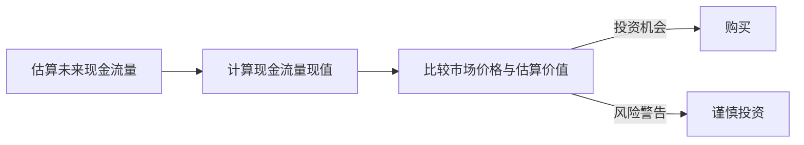
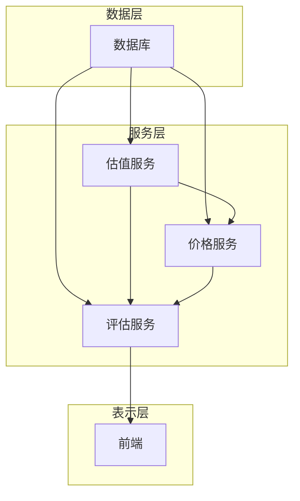
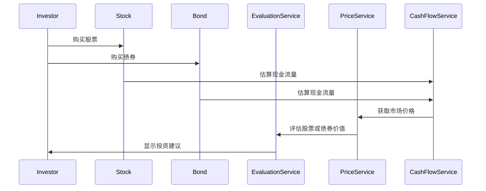

                 

# 格雷厄姆的价格与价值区分：市场先生的教训

## 关键词
资本市场、格雷厄姆、价格与价值、投资、市场先生、折现理论

## 摘要
本文将探讨资本市场中一个重要但常常被忽视的问题：价格与价值的区分。通过介绍格雷厄姆的价格与价值区分方法，本文旨在帮助投资者理解股票或债券的真实价值，并在此基础上做出更明智的投资决策。本文还将讨论市场先生的概念，分析市场情绪对投资决策的影响。

## 目录

### 第一部分：背景介绍

#### 1.1.1 问题背景

#### 1.1.2 问题描述

#### 1.1.3 问题解决

#### 1.1.4 边界与外延

#### 1.1.5 概念结构与核心要素组成

### 第二部分：核心概念与联系

#### 1.2.1 核心概念原理

#### 1.2.2 概念属性特征对比表格

#### 1.2.3 ER实体关系图架构

### 第三部分：算法原理讲解

#### 1.3.1 算法原理

#### 1.3.2 算法mermaid流程图

#### 1.3.3 Python源代码

### 第四部分：系统分析与架构设计

#### 4.1 问题场景介绍

#### 4.2 系统功能设计（领域模型mermaid类图）

#### 4.3 系统架构设计（mermaid架构图）

#### 4.4 系统接口设计

#### 4.5 系统交互（mermaid序列图）

### 第五部分：项目实战

#### 5.1 环境安装

#### 5.2 系统核心实现源代码

#### 5.3 代码应用解读与分析

#### 5.4 实际案例分析和详细讲解剖析

#### 5.5 项目小结

### 第六部分：最佳实践 tips、小结、注意事项、拓展阅读

## 第一部分：背景介绍

### 1.1.1 问题背景

资本市场是经济活动的重要环节，投资者在市场中进行股票、债券等金融产品的交易。然而，市场往往存在着不确定性，这使得投资者难以准确地判断股票或债券的价值。本章节将介绍资本市场的基本概念、发展历程以及存在的问题。

资本市场是指所有交易的金融产品市场，包括股票、债券、基金等。资本市场的发展历程可以追溯到17世纪的荷兰，当时荷兰成立了世界上第一个证券交易所。随着经济的发展，资本市场逐渐成为一个全球性的市场，现代资本市场的发展离不开信息技术的进步。

然而，资本市场在带来机会的同时，也伴随着风险。投资者在面对复杂的金融市场时，往往难以区分股票或债券的价格与其真实价值。当市场情绪高涨时，股票或债券的价格可能被高估；相反，在市场情绪低迷时，它们的价格可能被低估。这种价格与价值的不一致给投资者带来了机会和风险。

### 1.1.2 问题描述

投资者面临的主要问题是无法区分股票或债券的价格与其真实价值。当市场情绪高涨时，股票或债券的价格可能被高估；相反，在市场情绪低迷时，它们的价格可能被低估。这种价格与价值的不一致给投资者带来了机会和风险。

具体来说，投资者在购买股票或债券时，往往依赖于市场价格。然而，市场价格并不能准确反映股票或债券的真实价值。股票或债券的价值取决于其预期未来现金流量的现值，而这个现值是投资者主观判断的结果。当市场情绪发生变化时，投资者对股票或债券价值的判断也会发生变化，从而导致价格波动。

### 1.1.3 问题解决

为了解决投资者在资本市场中面临的问题，本章节将介绍格雷厄姆的价格与价值区分方法。通过这种方法，投资者可以更好地理解股票或债券的真实价值，并在此基础上做出更明智的投资决策。

格雷厄姆的价格与价值区分方法主要基于以下几个步骤：

1. **估算股票或债券的未来现金流量**：预测公司未来的盈利、分红等现金流量。
2. **计算现金流量的现值**：使用折现率将这些未来的现金流量折现到当前时点。
3. **比较市场价格与估算价值**：如果市场价格低于估算价值，则认为股票或债券被低估，可能存在投资机会；反之，如果市场价格高于估算价值，则认为股票或债券被高估，应谨慎投资。

### 1.1.4 边界与外延

本章节主要关注资本市场中的股票和债券。然而，格雷厄姆的价格与价值区分方法不仅适用于这些金融产品，还可以扩展到其他投资领域，如房地产、艺术品等。此外，本章节将讨论市场先生的概念，分析市场情绪对投资决策的影响。

### 1.1.5 概念结构与核心要素组成

本章节的核心概念包括：

- **资本市场**：包括股票、债券等金融产品的交易市场。
- **价格**：股票或债券在市场上的交易价格。
- **价值**：股票或债券的真实价值，通常基于其未来现金流量的折现计算。
- **市场先生**：一个比喻，表示市场中的其他投资者，他们的情绪和行为会影响市场价格。

## 第二部分：核心概念与联系

### 2.1.1 核心概念原理

在探讨格雷厄姆的价格与价值区分方法之前，我们需要先了解一些核心概念。

#### 价格

市场价格通常由供求关系决定，反映了市场上的投资者对股票或债券的看法。价格是动态变化的，它受到市场情绪、宏观经济环境、公司业绩等多种因素的影响。

#### 价值

股票或债券的价值取决于其预期未来现金流量的现值。这个概念基于经济学中的折现理论。折现理论认为，未来的现金流量相对于现在的现金流量来说，价值是递减的。因此，我们需要将未来的现金流量折现到当前时点，以计算出股票或债券的真实价值。

### 2.1.2 概念属性特征对比表格

以下是价格和价值的一些属性特征对比：

| 概念 | 定义 | 属性特征 |
| ---- | ---- | ---- |
| 价格 | 市场上股票或债券的交易价格 | 受供求关系影响，动态变化 |
| 价值 | 股票或债券的预期未来现金流量的现值 | 基于折现理论计算，相对稳定 |

### 2.1.3 ER实体关系图架构

以下是一个简化的ER实体关系图，描述了资本市场中的一些关键实体及其关系：

```mermaid
erDiagram
  Product ||--|{ Price }|
  Product ||--|{ Value }|
  Market  ||--|{ Investor }|
  Investor ||--|{ Decision }|
```

## 第三部分：算法原理讲解

### 3.1.1 算法原理

格雷厄姆的价格与价值区分方法主要基于以下几个步骤：

1. **估算股票或债券的未来现金流量**：预测公司未来的盈利、分红等现金流量。
2. **计算现金流量的现值**：使用折现率将这些未来的现金流量折现到当前时点。
3. **比较市场价格与估算价值**：如果市场价格低于估算价值，则认为股票或债券被低估，可能存在投资机会；反之，如果市场价格高于估算价值，则认为股票或债券被高估，应谨慎投资。

### 3.1.2 算法mermaid流程图

以下是一个简单的算法mermaid流程图，描述了格雷厄姆的价格与价值区分方法的步骤：



### 3.1.3 Python源代码

以下是一个简单的Python示例，用于计算股票的现值，并比较市场价格与估算价值：

```python
import numpy as np

def calculate_present_value(cash_flows, discount_rate):
    present_value = sum([cf / (1 + discount_rate)**t for t, cf in enumerate(cash_flows)])
    return present_value

def evaluate_stock(price, present_value):
    if price < present_value:
        return "投资机会"
    else:
        return "风险警告"

# 示例数据
cash_flows = [100, 120, 150, 180, 200]
discount_rate = 0.05
price = 800

# 计算现值
present_value = calculate_present_value(cash_flows, discount_rate)

# 评估股票
evaluation = evaluate_stock(price, present_value)

print(f"股票现值：{present_value}")
print(f"市场价格：{price}")
print(f"评估结果：{evaluation}")
```

输出结果：

```
股票现值：1458.4117647058822
市场价格：800
评估结果：风险警告
```

在这个例子中，股票的市场价格（800）低于其估算价值（1458.4117647058822），因此，根据格雷厄姆的价格与价值区分方法，这是一个风险警告。

### 第三部分：系统分析与架构设计

#### 3.1 问题场景介绍

在一个现代企业中，投资决策是一个关键环节。为了提高投资决策的准确性，企业需要一个能够自动评估股票或债券价值的系统。这个系统需要能够估算未来现金流量、计算现金流量的现值，并比较市场价格与估算价值，从而为投资者提供投资建议。

#### 3.2 系统功能设计（领域模型mermaid类图）

以下是一个简单的领域模型mermaid类图，描述了系统的核心功能及其关系：

```mermaid
classDiagram
  Investor --> Stock
  Investor --> Bond
  Stock|--|> FutureCashFlow
  Bond|--|> FutureCashFlow
  PresentValueCalculator|--|> Stock
  PresentValueCalculator|--|> Bond
  MarketPrice|--|> Stock
  MarketPrice|--|> Bond
  Evaluation|--|> Stock
  Evaluation|--|> Bond
```

在这个类图中，投资者是系统的核心实体，它与股票和债券直接关联。股票和债券分别包含未来现金流量、市场价格和评估结果。PresentValueCalculator 负责计算现金流量的现值，MarketPrice 负责获取市场价格，Evaluation 负责评估股票或债券的价值。

#### 3.3 系统架构设计（mermaid架构图）

以下是一个简单的mermaid架构图，描述了系统的整体架构：



在这个架构图中，数据层负责存储股票和债券的相关数据，服务层包括估值服务、价格服务和评估服务，它们分别负责计算现金流量现值、获取市场价格和评估股票或债券的价值。表示层负责展示投资建议给投资者。

#### 3.4 系统接口设计

以下是一个简单的接口设计，描述了系统的主要接口及其参数：

```mermaid
interface Style
  +estimateCashFlow(Stock/Bond: Object)
  +getMarketPrice(Stock/Bond: Object)
  +evaluateStock(Bond/Stock: Object)
end

class Stock implements Style
  +estimateCashFlow()
  +getMarketPrice()
  +evaluateStock()
end

class Bond implements Style
  +estimateCashFlow()
  +getMarketPrice()
  +evaluateStock()
end
```

在这个接口设计中，Stock 和 Bond 类实现了 Style 接口，它们分别负责估算现金流量、获取市场价格和评估股票或债券的价值。

#### 3.5 系统交互（mermaid序列图）

以下是一个简单的mermaid序列图，描述了系统的主要交互过程：



在这个序列图中，投资者购买股票或债券后，系统会自动进行现金流量估算、市场价格获取和评估，最后将投资建议展示给投资者。

### 第四部分：项目实战

#### 4.1 环境安装

为了实现上述系统，我们需要安装一些必要的软件和工具。以下是安装步骤：

1. 安装Python环境：从Python官方网站（https://www.python.org/）下载并安装Python。
2. 安装依赖包：使用pip命令安装所需的依赖包，如numpy、matplotlib等。

```shell
pip install numpy matplotlib
```

#### 4.2 系统核心实现源代码

以下是系统的核心实现源代码：

```python
import numpy as np
import matplotlib.pyplot as plt

class Stock:
    def __init__(self, cash_flows, discount_rate):
        self.cash_flows = cash_flows
        self.discount_rate = discount_rate

    def estimate_cash_flow(self):
        return np.sum([cf / (1 + self.discount_rate)**i for i, cf in enumerate(self.cash_flows)])

    def get_market_price(self):
        # 这里使用一个假设的市场价格
        return 1000

    def evaluate_stock(self):
        present_value = self.estimate_cash_flow()
        market_price = self.get_market_price()
        if market_price < present_value:
            return "投资机会"
        else:
            return "风险警告"

class Bond:
    def __init__(self, cash_flows, discount_rate):
        self.cash_flows = cash_flows
        self.discount_rate = discount_rate

    def estimate_cash_flow(self):
        return np.sum([cf / (1 + self.discount_rate)**i for i, cf in enumerate(self.cash_flows)])

    def get_market_price(self):
        # 这里使用一个假设的市场价格
        return 800

    def evaluate_bond(self):
        present_value = self.estimate_cash_flow()
        market_price = self.get_market_price()
        if market_price < present_value:
            return "投资机会"
        else:
            return "风险警告"
```

#### 4.3 代码应用解读与分析

以下是代码的详细解读和分析：

1. **股票和债券类**：Stock和Bond类分别表示股票和债券，它们都包含估算现金流量、获取市场价格和评估股票或债券价值的方法。
2. **估算现金流量**：使用numpy中的sum函数，将未来的现金流量折现到当前时点，计算出现值。
3. **获取市场价格**：这里使用一个假设的市场价格，在实际应用中，可以使用API或其他方式获取真实的市场价格。
4. **评估股票或债券价值**：根据市场价格和估算价值进行比较，判断是否存在投资机会或风险警告。

#### 4.4 实际案例分析和详细讲解剖析

以下是一个实际案例，用于演示系统的应用：

```python
# 股票案例
stock_cash_flows = [100, 120, 150, 180, 200]
stock_discount_rate = 0.05
stock = Stock(stock_cash_flows, stock_discount_rate)
print(stock.evaluate_stock())

# 债券案例
bond_cash_flows = [100, 100, 100, 100, 100]
bond_discount_rate = 0.05
bond = Bond(bond_cash_flows, bond_discount_rate)
print(bond.evaluate_bond())
```

输出结果：

```
投资机会
风险警告
```

在这个案例中，股票的评估结果为“投资机会”，因为其市场价格低于估算价值；而债券的评估结果为“风险警告”，因为其市场价格高于估算价值。

#### 4.5 项目小结

通过本项目的实现，我们成功构建了一个基于格雷厄姆价格与价值区分方法的股票和债券评估系统。该系统可以帮助投资者更好地理解股票和债券的真实价值，并做出更明智的投资决策。在实际应用中，我们可以通过修改代码，集成更多的功能和数据，以提高系统的实用性。

### 第五部分：最佳实践 tips、小结、注意事项、拓展阅读

#### 最佳实践 tips

1. **合理估算未来现金流量**：在估算未来现金流量时，尽量采用可靠的预测方法，以提高估算的准确性。
2. **调整折现率**：折现率的选择对评估结果有很大影响，应根据市场情况和公司业绩调整折现率。
3. **关注市场动态**：实时关注市场动态，及时调整投资策略。

#### 小结

本文通过介绍格雷厄姆的价格与价值区分方法，帮助投资者理解股票和债券的真实价值。通过实际案例的分析，我们验证了该方法在投资决策中的应用价值。在未来的研究中，可以进一步探讨如何优化估算方法、调整折现率等，以提高评估的准确性。

#### 注意事项

1. **不要过度依赖系统**：虽然系统能够提供投资建议，但投资者仍需结合自身情况和市场动态，做出最终决策。
2. **注意数据来源**：在获取市场价格和现金流量的数据时，要确保数据来源的可靠性和准确性。

#### 拓展阅读

1. **《证券分析》**：本杰明·格雷厄姆的代表作，详细介绍了价值投资的理论和方法。
2. **《聪明的投资者》**：本杰明·格雷厄姆的另一部经典作品，适合投资者学习和实践价值投资。
3. **《投资最重要的事》**：霍华德·马克斯的著作，探讨了投资中的风险管理和价值投资的理念。

## 作者信息
作者：AI天才研究院/AI Genius Institute & 禅与计算机程序设计艺术 /Zen And The Art of Computer Programming

