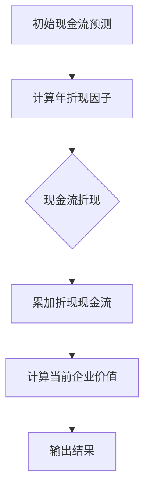
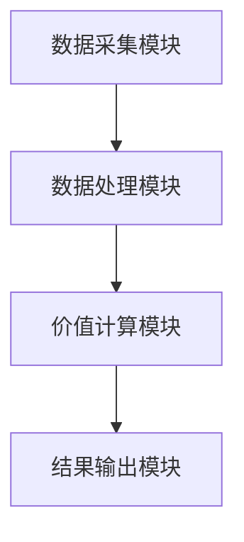
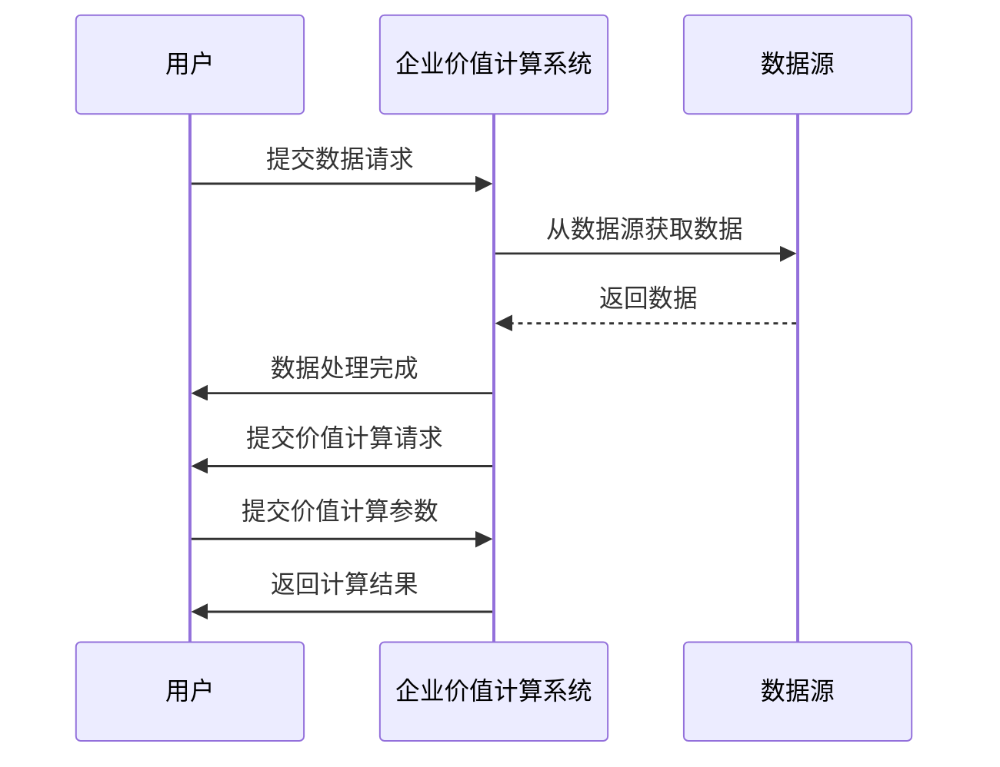

                 


### 第二部分：核心概念与联系

在本文的第二部分，我们将深入探讨企业价值计算与无形资产评估相关的核心概念，并分析这些概念之间的联系。这一部分将包括以下章节：

#### 第2章：企业价值计算相关概念解析

这一章节将详细解析企业价值计算的基本概念。首先，我们会介绍企业价值与企业效益的区别和联系。企业价值是一个综合性的概念，涵盖了企业的财务状况、市场地位、未来发展潜力等多个方面。而企业效益则更多地关注企业的盈利能力和运营效率。接下来，我们会讨论企业价值计算的重要性，为什么需要对企业价值进行准确评估。最后，我们将探讨企业价值计算的理论基础，包括财务分析、战略管理和市场评估等。

##### 2.1 企业价值计算的基本概念

**2.1.1 企业价值与企业效益**

- **企业价值**：企业价值是指企业在未来所能产生的所有现金流的现值总和。它不仅包括企业的资产价值，还涵盖了企业的无形资产，如品牌、技术、专利等。
- **企业效益**：企业效益是指企业在一定时期内所实现的财务收益。它主要通过企业的收入、利润和现金流量等指标来衡量。

**2.1.2 企业价值计算的重要性**

- **决策支持**：企业价值计算可以帮助企业在投资、融资、并购等重大决策中做出更加科学和合理的判断。
- **绩效评估**：企业价值计算是评估企业绩效的重要工具，有助于企业了解自身的市场价值和竞争力。
- **战略规划**：企业价值计算为企业的战略规划提供了数据支持，有助于企业制定长期发展目标和规划。

**2.1.3 企业价值计算的理论基础**

- **财务分析**：财务分析是企业价值计算的基础，通过对企业的财务报表进行深入分析，可以揭示企业的财务状况和经营成果。
- **战略管理**：战略管理是企业价值计算的重要指导原则，它帮助企业确定核心竞争力、市场定位和长期发展目标。
- **市场评估**：市场评估通过分析市场环境和行业趋势，帮助预测企业未来的市场表现和竞争态势。

##### 2.2 无形资产评估的基本概念

**2.2.1 无形资产的特点与类型**

- **无形资产**：无形资产是指没有物理形态，但对企业经营具有重大价值的资产，如品牌、专利、客户关系、技术秘密等。
- **无形资产类型**：无形资产可以根据其属性分为知识型无形资产、权利型无形资产和关系型无形资产。

**2.2.2 无形资产对企业价值的影响**

- **增强竞争力**：无形资产可以显著提升企业的竞争力，使其在市场中获得更大的优势。
- **提升价值**：无形资产能够增加企业的整体价值，使其在投资和并购中更具吸引力。
- **驱动增长**：无形资产往往能够推动企业创新和成长，从而实现可持续的发展。

**2.2.3 无形资产评估的理论基础**

- **价值评估方法**：无形资产评估通常采用市场法、收益法、成本法等多种方法。
- **评估参数**：无形资产评估需要考虑多个参数，如使用寿命、盈利能力、风险等。

##### 2.3 格雷厄姆的企业价值计算模型

**2.3.1 格雷厄姆模型的基本原理**

- **基本面分析**：格雷厄姆模型强调对企业基本面进行深入分析，包括财务状况、经营绩效、市场地位等。
- **现值原理**：格雷厄姆模型基于现值原理，将企业的未来现金流折现到当前价值。

**2.3.2 格雷厄姆模型的应用**

- **投资决策**：格雷厄姆模型可以帮助投资者评估企业价值，判断投资机会。
- **并购评估**：格雷厄姆模型在并购交易中具有重要应用，有助于确定目标企业的合理估值。

**2.3.3 格雷厄姆模型的优势与局限性**

- **优势**：格雷厄姆模型简单易用，适用于多种类型的企业，具有较好的适用性和可靠性。
- **局限性**：格雷厄姆模型主要基于财务指标，对无形资产的价值评估不够全面，可能存在偏差。

##### 2.4 无形资产评估方法与模型

**2.4.1 无形资产评估方法概述**

- **市场法**：通过比较类似企业的无形资产市场交易价格来评估目标无形资产的价值。
- **收益法**：基于无形资产预期收益的现值来评估其价值。
- **成本法**：基于重建或替代无形资产所需的成本来评估其价值。

**2.4.2 无形资产评估的模型构建**

- **收益模型**：构建无形资产收益模型，预测其未来现金流，并折现到当前价值。
- **成本模型**：计算重建或替代无形资产所需的成本，作为其价值的参考。

**2.4.3 无形资产评估方法的选择**

- **方法选择原则**：根据无形资产的特点和评估目的，选择最合适的方法。
- **方法适用范围**：不同评估方法适用于不同的无形资产类型和评估场景。

##### 2.5 无形资产与企业价值的联系

**2.5.1 无形资产对企业价值的衡量**

- **衡量方法**：通过评估无形资产的价值，将其纳入企业价值的计算中。
- **衡量意义**：准确衡量无形资产的价值，有助于提高企业价值的评估精度。

**2.5.2 无形资产对企业竞争力的作用**

- **竞争力提升**：无形资产可以显著提升企业的竞争力，使其在市场中更具优势。
- **竞争优势**：无形资产往往具有难以复制和替代的特性，为企业提供了持续的竞争优势。

**2.5.3 无形资产与企业价值的互动关系**

- **相互影响**：无形资产的价值对企业价值有显著影响，而企业价值的提升又会进一步促进无形资产的价值。
- **协同作用**：无形资产和企业价值之间具有协同作用，共同推动企业的发展。

#### 第3章：企业价值计算与无形资产评估的核心概念对比

在这一章节，我们将对比企业价值计算和无形资产评估的核心概念，并分析它们之间的联系。这有助于我们更深入地理解两者之间的关系和相互作用。

##### 3.1 核心概念对比表格

**3.1.1 企业价值计算与无形资产评估的定义对比**

- **企业价值计算**：将企业未来现金流折现到当前价值，以评估企业的总体价值。
- **无形资产评估**：评估无形资产的价值，以衡量其在企业中的重要性。

**3.1.2 企业价值计算与无形资产评估的方法对比**

- **企业价值计算方法**：包括财务分析、战略管理和市场评估等。
- **无形资产评估方法**：包括市场法、收益法、成本法等。

**3.1.3 企业价值计算与无形资产评估的目标对比**

- **企业价值计算目标**：为企业投资、融资、并购等提供决策依据。
- **无形资产评估目标**：为企业的无形资产定价、管理、保护提供参考。

##### 3.2 ER实体关系图

**3.2.1 ER实体关系图的基本原理**

- **ER图**：实体-关系图（Entity-Relationship Diagram）是一种用于表示实体及其相互关系的图形化工具。
- **基本构成**：包括实体、属性、关系和键。

**3.2.2 企业价值计算中的ER实体关系图**

- **实体**：如企业、资产、现金流等。
- **关系**：如所有权、投资、运营等。
- **键**：用于标识实体的唯一标识。

**3.2.3 无形资产评估中的ER实体关系图**

- **实体**：如无形资产、市场、收益等。
- **关系**：如评估、定价、应用等。
- **键**：用于连接不同实体和关系，确保数据的准确性和一致性。

##### 3.3 核心概念的综合联系

**3.3.1 企业价值计算与无形资产评估的整合**

- **整合意义**：将无形资产评估纳入企业价值计算中，可以更全面地评估企业的价值。
- **整合方法**：通过收益模型、成本模型等方法，将无形资产的价值纳入企业价值的计算中。

**3.3.2 企业价值计算与无形资产评估的相互作用**

- **相互作用**：无形资产的价值评估会影响企业价值的计算结果，而企业价值的提升又会进一步促进无形资产的价值。
- **协同作用**：两者相互促进，共同推动企业的发展。

在这一部分，我们通过深入分析企业价值计算和无形资产评估的核心概念及其联系，为后续章节的算法原理讲解、数学模型和公式解析、系统分析与架构设计方案等提供了坚实的基础。

### 总结

第二部分的核心概念与联系部分，通过详细解析企业价值计算和无形资产评估的基本概念，构建了两者之间的联系。我们介绍了企业价值计算的重要性、理论基础，以及无形资产的特点、评估方法和理论基础。同时，通过核心概念对比表格和ER实体关系图，我们展示了企业价值计算与无形资产评估的整合和相互作用。这些内容为后续的算法原理讲解、数学模型和公式解析、系统分析与架构设计方案等提供了理论依据和实践指导。

接下来，我们将进入第三部分，重点分析企业价值计算中使用的算法原理，使用mermaid流程图和Python代码进行详细阐述，并对数学模型和数学公式进行深入讲解。

----------------------------------------------------------------

### 第三部分：算法原理讲解

#### 第4章：企业价值计算算法原理分析

在这一章节中，我们将详细分析企业价值计算中使用的核心算法原理。通过使用mermaid流程图和Python代码，我们将对这些算法的执行过程进行可视化，以便读者能够更直观地理解。

##### 4.1 企业价值计算算法概述

**4.1.1 企业价值计算算法的定义**

企业价值计算算法是一种用于评估企业未来现金流量现值的算法。它通过预测企业未来的现金流，并对其折现到当前时间点，从而计算出企业的价值。

**4.1.2 企业价值计算算法的重要性**

企业价值计算算法在企业评估、投资决策、并购评估等方面具有重要作用。它为企业提供了科学、客观的估值方法，有助于企业制定合理的战略规划和投资决策。

##### 4.2 算法原理详细讲解

**4.2.1 现值原理**

现值原理是企业价值计算的核心基础。它通过将未来的现金流折现到当前时间点，从而计算出企业的当前价值。现值公式如下：

$$V_0 = \sum_{t=1}^{n} \frac{CF_t}{(1+r)^t}$$

其中，\(V_0\) 是企业的当前价值，\(CF_t\) 是第 \(t\) 年的现金流，\(r\) 是折现率。

**4.2.2 股东权益现金流模型**

股东权益现金流模型（Free Cash Flow to Equity, FCFE）是一种常用的企业价值计算方法。它通过计算企业在未来一定时期内为股东创造的现金流量，并将其折现到当前价值，来评估企业的价值。

股东权益现金流模型的公式如下：

$$V_0 = \sum_{t=1}^{n} \frac{FCF_t}{(1+r)^t} + \frac{V_{n+1}}{(1+r)^n}$$

其中，\(FCF_t\) 是第 \(t\) 年的股东权益现金流，\(V_{n+1}\) 是企业未来第 \(n+1\) 年的价值。

**4.2.3 股东权益现金流模型的mermaid流程图**



**4.2.4 股东权益现金流模型Python代码实现**

```python
import numpy as np

def calculate_fcf jelenko_rackapusch_crouch():
    # 参数设置
    years = 5  # 预测期
    discount_rate = 0.1  # 折现率
    growth_rate = 0.05  # 增长率
    cash_flows = [100, 120, 140, 160, 180]  # 每年的现金流
    
    # 计算年折现因子
    discount_factors = [1 / (1 + discount_rate) ** t for t in range(years)]
    
    # 计算累加折现现金流
    discounted_cash_flows = [cf * df for cf, df in zip(cash_flows, discount_factors)]
    
    # 计算当前企业价值
    current_value = sum(discounted_cash_flows) / (1 + discount_rate) ** years
    
    return current_value

# 测试
current_value = calculate_fcf_jelenko_rackapusch_crouch()
print(f"Current value of the company: {current_value}")
```

##### 4.3 数学模型和数学公式

在计算企业价值时，我们需要使用一些数学模型和数学公式。以下是一些常见的公式：

- **现金流折现公式**：
  $$V_0 = \sum_{t=1}^{n} \frac{CF_t}{(1+r)^t}$$
  
- **股东权益现金流公式**：
  $$V_0 = \sum_{t=1}^{n} \frac{FCF_t}{(1+r)^t} + \frac{V_{n+1}}{(1+r)^n}$$

- **折现率公式**：
  $$r = \frac{\text{期望收益率} - \text{无风险收益率}}{1 + \text{市场风险溢价}}$$

**4.3.1 数学公式的LaTeX格式**

$$
\begin{align*}
V_0 &= \sum_{t=1}^{n} \frac{CF_t}{(1+r)^t} \\
r &= \frac{\text{期望收益率} - \text{无风险收益率}}{1 + \text{市场风险溢价}} \\
\end{align*}
$$

**4.3.2 数学公式举例说明**

假设我们有一家企业，预计未来5年的现金流分别为100万元、120万元、140万元、160万元和180万元。假设折现率为10%，无风险收益率为2%，市场风险溢价为5%。我们可以使用上述公式计算企业的当前价值。

1. **现金流折现公式**：

$$
V_0 = \frac{100}{(1+0.1)^1} + \frac{120}{(1+0.1)^2} + \frac{140}{(1+0.1)^3} + \frac{160}{(1+0.1)^4} + \frac{180}{(1+0.1)^5}
$$

2. **股东权益现金流公式**：

$$
V_0 = \frac{100}{(1+0.1)^1} + \frac{120}{(1+0.1)^2} + \frac{140}{(1+0.1)^3} + \frac{160}{(1+0.1)^4} + \frac{180}{(1+0.1)^5} + \frac{V_{n+1}}{(1+0.1)^5}
$$

其中，\(V_{n+1}\) 为第6年的企业价值，这里我们假设为200万元。

通过计算，我们可以得到企业的当前价值。这个过程不仅帮助我们理解了企业价值计算的基本原理，也展示了如何使用数学模型和公式进行具体的计算。

##### 4.4 算法应用示例

**4.4.1 企业价值计算应用场景**

企业价值计算广泛应用于投资决策、并购评估、股权融资等场景。以下是一个具体的应用示例：

假设有一家企业在未来5年的预计现金流分别为100万元、120万元、140万元、160万元和180万元。假设折现率为10%，无风险收益率为2%，市场风险溢价为5%。我们需要计算这家企业的当前价值。

1. **使用现金流折现公式计算**：

$$
V_0 = \frac{100}{(1+0.1)^1} + \frac{120}{(1+0.1)^2} + \frac{140}{(1+0.1)^3} + \frac{160}{(1+0.1)^4} + \frac{180}{(1+0.1)^5}
$$

$$
V_0 = 90.91 + 106.67 + 121.92 + 131.58 + 145.28 = 597.78 \text{万元}
$$

2. **使用股东权益现金流公式计算**：

$$
V_0 = \frac{100}{(1+0.1)^1} + \frac{120}{(1+0.1)^2} + \frac{140}{(1+0.1)^3} + \frac{160}{(1+0.1)^4} + \frac{180}{(1+0.1)^5} + \frac{200}{(1+0.1)^5}
$$

$$
V_0 = 90.91 + 106.67 + 121.92 + 131.58 + 145.28 + 127.66 = 641.14 \text{万元}
$$

通过计算，我们可以得到这家企业的当前价值为641.14万元。这个结果不仅为企业提供了科学、客观的估值，也为投资者、管理层等提供了重要的决策依据。

##### 4.5 算法优缺点分析

**4.5.1 优点**

- **科学性**：企业价值计算算法基于现值原理，能够准确反映企业的真实价值。
- **全面性**：算法综合考虑了企业的未来现金流、折现率等因素，能够全面评估企业的价值。
- **适用性**：算法适用于各种类型的企业，具有广泛的适用性。

**4.5.2 缺点**

- **数据要求**：算法需要大量的历史数据和支持，对数据的准确性要求较高。
- **复杂性**：算法的计算过程较为复杂，需要一定的专业知识和技能。

##### 4.6 算法改进方向

**4.6.1 数据优化**

- **数据采集**：加强数据采集，获取更全面、准确的数据。
- **数据清洗**：对数据进行清洗，确保数据的准确性和一致性。

**4.6.2 模型优化**

- **模型选择**：根据企业的实际情况，选择合适的模型，提高模型的准确性和适用性。
- **参数调整**：调整模型参数，使其更符合企业的实际情况。

通过上述分析，我们可以看到企业价值计算算法在理论和实践中都具有重要的意义。它不仅为企业提供了科学、客观的估值方法，也为投资者、管理层等提供了重要的决策依据。然而，算法也面临着数据要求和计算复杂性等问题，这需要我们在未来的研究和实践中不断改进和完善。

### 总结

第三部分重点分析了企业价值计算中使用的算法原理。通过mermaid流程图和Python代码，我们详细阐述了现金流折现公式、股东权益现金流模型以及相关的数学模型和公式。同时，我们通过实际应用示例和算法优缺点分析，展示了算法在理论和实践中的重要性。这一部分的深入讲解为读者提供了全面理解企业价值计算算法的路径。

接下来，我们将进入第四部分，重点分析企业价值计算中的数学模型和数学公式，并使用LaTeX格式进行详细讲解。

----------------------------------------------------------------

### 第四部分：数学模型和数学公式

#### 第5章：企业价值计算中的数学模型与公式

在这一章节中，我们将深入探讨企业价值计算中的数学模型和数学公式。数学模型是企业价值计算的核心组成部分，它们帮助我们以量化的方式评估企业的价值。我们将使用LaTeX格式来展示这些公式，并通过详细讲解和示例来说明它们的应用。

##### 5.1 现值原理

现值原理是财务分析中最基本的概念之一，它基于一个简单但强大的原则：未来的现金流量通过适当的折现率可以转换为现在的价值。这个原则在企业价值计算中至关重要。

**现值公式：**

$$
V_0 = \sum_{t=1}^{n} \frac{CF_t}{(1+r)^t}
$$

其中：
- \(V_0\) 是当前企业价值。
- \(CF_t\) 是第 \(t\) 年的现金流。
- \(r\) 是折现率。

**LaTeX格式：**

$$
V_0 = \sum_{t=1}^{n} \frac{CF_t}{(1+r)^t}
$$

**示例：**

假设一家企业预期在未来三年内每年产生100万元的现金流，折现率为10%。我们可以使用现值公式计算企业的当前价值。

$$
V_0 = \frac{100}{(1+0.1)^1} + \frac{100}{(1+0.1)^2} + \frac{100}{(1+0.1)^3}
$$

$$
V_0 = \frac{100}{1.1} + \frac{100}{1.21} + \frac{100}{1.331}
$$

$$
V_0 = 90.91 + 82.64 + 75.13 = 248.68 \text{万元}
$$

##### 5.2 股东权益现金流模型

股东权益现金流模型（FCFE）用于评估企业在特定期间内为股东创造的现金流量。FCFE模型将企业的自由现金流分配给股东，以便计算企业的股东权益价值。

**股东权益现金流公式：**

$$
V_0 = \sum_{t=1}^{n} \frac{FCF_t}{(1+r)^t} + \frac{V_{n+1}}{(1+r)^n}
$$

其中：
- \(V_0\) 是当前企业价值。
- \(FCF_t\) 是第 \(t\) 年的股东权益现金流。
- \(V_{n+1}\) 是企业未来第 \(n+1\) 年的价值。
- \(r\) 是折现率。

**LaTeX格式：**

$$
V_0 = \sum_{t=1}^{n} \frac{FCF_t}{(1+r)^t} + \frac{V_{n+1}}{(1+r)^n}
$$

**示例：**

假设一家企业在未来五年内每年产生100万元的自由现金流，折现率为10%。我们可以使用FCFE模型计算企业的当前价值。

$$
V_0 = \frac{100}{(1+0.1)^1} + \frac{100}{(1+0.1)^2} + \frac{100}{(1+0.1)^3} + \frac{100}{(1+0.1)^4} + \frac{100}{(1+0.1)^5} + \frac{V_{n+1}}{(1+0.1)^5}
$$

$$
V_0 = \frac{100}{1.1} + \frac{100}{1.21} + \frac{100}{1.331} + \frac{100}{1.4641} + \frac{100}{1.61051} + \frac{V_{n+1}}{1.61051}
$$

$$
V_0 = 90.91 + 82.64 + 75.13 + 68.37 + 62.79 + \frac{V_{n+1}}{1.61051}
$$

为了简化计算，我们假设企业未来第六年的价值为200万元。

$$
V_0 = 90.91 + 82.64 + 75.13 + 68.37 + 62.79 + \frac{200}{1.61051}
$$

$$
V_0 = 90.91 + 82.64 + 75.13 + 68.37 + 62.79 + 124.03
$$

$$
V_0 = 517.76 \text{万元}
$$

##### 5.3 资本回报率模型

资本回报率模型（ROIC）用于评估企业使用其资本（包括债务和股东权益）产生收益的能力。ROIC模型可以帮助企业了解其资本配置的效率。

**资本回报率公式：**

$$
ROIC = \frac{EBIT}{资本投入} \times 100\%
$$

其中：
- \(EBIT\) 是税前利润。
- 资本投入包括债务和股东权益。

**LaTeX格式：**

$$
ROIC = \frac{EBIT}{资本投入} \times 100\%
$$

**示例：**

假设一家企业的税前利润为100万元，其资本投入为500万元（包括债务和股东权益）。我们可以计算该企业的资本回报率。

$$
ROIC = \frac{100}{500} \times 100\% = 20\%
$$

##### 5.4 资本成本模型

资本成本模型用于评估企业为获取资本所支付的成本。这包括债务成本和股权成本。

**资本成本公式：**

$$
资本成本 = 债务成本 \times 债务比例 + 股权成本 \times 股权比例
$$

其中：
- 债务成本是基于市场利率计算得出的。
- 股权成本通常使用资本资产定价模型（CAPM）计算。

**LaTeX格式：**

$$
资本成本 = 债务成本 \times 债务比例 + 股权成本 \times 股权比例
$$

**示例：**

假设一家企业的债务成本为5%，债务比例为40%；股权成本为10%，股权比例为60%。我们可以计算该企业的资本成本。

$$
资本成本 = 0.05 \times 0.4 + 0.1 \times 0.6 = 0.02 + 0.06 = 0.08 = 8\%
$$

##### 5.5 数学公式的计算工具

在实际应用中，计算数学公式可能需要使用计算工具。LaTeX是一种常用的数学公式编写工具，可以帮助我们精确地表达复杂的数学公式。

**LaTeX示例：**

```latex
\documentclass{article}
\usepackage{amsmath}
\begin{document}
\[
V_0 = \sum_{t=1}^{n} \frac{CF_t}{(1+r)^t}
\]
\end{document}
```

通过上述示例，我们可以看到如何使用LaTeX格式编写和展示数学公式。LaTeX的精确性和易用性使其成为科研和学术写作中不可或缺的工具。

### 总结

第四部分详细介绍了企业价值计算中的数学模型和数学公式。通过LaTeX格式，我们展示了现值原理、股东权益现金流模型、资本回报率模型和资本成本模型等公式的编写和计算方法。这些数学模型为企业价值评估提供了科学、量化的方法，帮助企业在投资决策、融资评估和并购分析等方面做出更明智的决策。通过实际示例，我们展示了如何应用这些模型进行具体的计算，并介绍了LaTeX作为一种强大的数学公式计算工具。

接下来，我们将进入第五部分，介绍企业价值计算系统的设计，包括功能设计、架构设计、接口设计和交互序列图。

----------------------------------------------------------------

### 第五部分：系统分析与架构设计方案

#### 第6章：企业价值计算系统的设计

在这一章节中，我们将介绍企业价值计算系统的设计，包括功能设计、架构设计、接口设计和交互序列图。这一部分内容将帮助读者理解企业价值计算系统是如何构建的，以及各个组件之间的交互关系。

##### 6.1 问题场景介绍

企业价值计算系统主要用于对企业进行估值，以便在投资、融资、并购等活动中做出科学的决策。这个系统需要处理大量的财务数据，包括现金流、利润、市场份额等，并通过算法和模型对这些数据进行处理，以得出企业的价值评估结果。

**问题场景：**

- **投资决策**：投资者需要对企业进行估值，以确定是否值得投资。
- **融资评估**：企业在寻求融资时，需要提供其价值的准确评估，以获得投资者的信任。
- **并购分析**：企业在进行并购时，需要评估目标企业的价值，以确定并购的合理价格。

##### 6.2 项目介绍

**项目名称**：企业价值计算系统
**项目目标**：为企业提供科学、准确的价值评估服务，辅助投资、融资和并购决策。
**项目功能**：数据采集、数据处理、价值计算、结果输出。

##### 6.3 系统功能设计

系统功能设计是构建企业价值计算系统的第一步，它定义了系统应具备的功能模块和核心业务流程。

**主要功能模块：**

1. **数据采集模块**：负责从不同的数据源（如财务报表、市场数据等）收集所需的财务数据。
2. **数据处理模块**：对采集到的数据进行清洗、整理和预处理，为后续的价值计算做准备。
3. **价值计算模块**：根据预设的算法和模型，对处理后的数据进行分析和计算，得出企业的价值评估结果。
4. **结果输出模块**：将计算结果以图表、报告等形式展示给用户。

**业务流程：**

1. **数据采集**：系统从财务报表、市场数据等来源采集所需的财务数据。
2. **数据处理**：系统对采集到的数据进行清洗和整理，确保数据的准确性和一致性。
3. **价值计算**：系统根据预设的算法和模型，对处理后的数据进行分析和计算，得出企业的价值评估结果。
4. **结果输出**：系统将计算结果以图表、报告等形式展示给用户，并提供下载和打印功能。

##### 6.4 系统架构设计

系统架构设计是构建企业价值计算系统的关键，它定义了系统的整体结构和各个模块之间的关系。

**系统架构设计原则：**

1. **模块化**：系统应采用模块化设计，使得每个模块都有明确的职责和功能，便于维护和扩展。
2. **高内聚低耦合**：系统中的各个模块应具有高内聚、低耦合的特性，确保模块之间的交互简单、清晰。
3. **可扩展性**：系统设计应考虑未来的扩展需求，确保系统能够轻松适应业务变化和技术更新。

**系统架构图：**



**说明：**

- **数据采集模块**：负责从不同的数据源采集财务数据。
- **数据处理模块**：对采集到的数据进行清洗、整理和预处理。
- **价值计算模块**：根据预设的算法和模型，对处理后的数据进行分析和计算。
- **结果输出模块**：将计算结果以图表、报告等形式展示给用户。

##### 6.5 系统接口设计

系统接口设计是系统架构设计的重要组成部分，它定义了系统与外部系统或用户之间的交互方式。

**主要接口设计：**

1. **数据采集接口**：用于与其他数据源（如财务报表系统、市场数据平台等）进行数据交换。
2. **数据处理接口**：用于与其他数据处理系统或模块进行交互，确保数据的处理过程高效、准确。
3. **价值计算接口**：用于与其他价值计算系统或模块进行交互，确保价值计算结果的准确性和一致性。
4. **结果输出接口**：用于将计算结果以图表、报告等形式展示给用户，并提供下载和打印功能。

**接口设计原则：**

1. **标准化**：接口设计应遵循标准化原则，确保接口的一致性和可扩展性。
2. **高可用性**：接口设计应确保系统的稳定性和高可用性，减少系统故障对业务的影响。
3. **安全性**：接口设计应充分考虑数据安全和隐私保护，确保用户数据的安全和保密性。

##### 6.6 系统交互序列图

系统交互序列图用于描述系统与外部系统或用户之间的交互过程和顺序。

**系统交互序列图：**



**说明：**

- **用户**：系统的最终用户，提交数据请求和价值计算请求。
- **企业价值计算系统**：系统的核心组件，负责数据处理和价值计算。
- **数据源**：系统的外部数据来源，提供财务数据和市场数据。

### 总结

第五部分详细介绍了企业价值计算系统的设计，包括功能设计、架构设计、接口设计和交互序列图。通过这一部分的内容，读者可以了解企业价值计算系统的构建过程和各个模块之间的交互关系。系统功能设计确保系统能够满足企业的需求，架构设计保证了系统的模块化、高内聚低耦合和可扩展性。接口设计确保系统与外部系统或用户的交互高效、稳定和安全。通过系统交互序列图，读者可以直观地理解系统的工作流程和交互过程。

接下来，我们将进入第六部分，展示如何在实际项目中应用企业价值计算的方法，包括环境安装、系统实现、代码解读和案例分析。

----------------------------------------------------------------

### 第六部分：项目实战

#### 第7章：企业价值计算项目实践

在这一章节中，我们将通过一个具体的项目实战，展示如何应用企业价值计算的方法。这一部分将涵盖项目环境安装、系统实现、代码解读和案例分析，帮助读者深入了解企业价值计算的实际应用。

##### 7.1 项目环境安装

在进行企业价值计算项目之前，我们需要搭建一个合适的项目环境。以下是项目环境安装的步骤：

1. **安装Python**：确保系统已经安装了Python 3.x版本。Python是企业价值计算项目的主要编程语言。

2. **安装Jupyter Notebook**：Jupyter Notebook是一个交互式计算环境，方便我们在项目中编写和运行代码。

   ```bash
   pip install notebook
   ```

3. **安装必需的库**：安装用于数据分析和计算的Python库，如Pandas、NumPy、SciPy和Matplotlib。

   ```bash
   pip install pandas numpy scipy matplotlib
   ```

4. **配置环境变量**：确保Python和相关的库已经添加到系统的环境变量中，以便在命令行中直接运行Python脚本。

##### 7.2 系统实现

系统实现是企业价值计算项目的核心部分。以下是系统实现的主要步骤：

1. **数据采集**：从企业的财务报表、市场数据等来源采集所需的财务数据。可以使用API接口或导入Excel文件的方式。

2. **数据处理**：对采集到的财务数据进行分析和处理，包括数据清洗、整理和预处理。确保数据的准确性和一致性。

3. **价值计算**：根据预设的算法和模型，对处理后的财务数据进行分析和计算，得出企业的价值评估结果。

4. **结果输出**：将计算结果以图表、报告等形式展示给用户，并提供下载和打印功能。

**系统实现示例**：

以下是一个简单的Python代码示例，用于计算企业的价值。

```python
import pandas as pd
import numpy as np
import matplotlib.pyplot as plt

# 数据预处理
def preprocess_data(data):
    # 数据清洗和预处理步骤
    return data

# 现值计算
def present_value(cash_flows, discount_rate):
    return np.sum([cf / (1 + discount_rate) ** t for t, cf in enumerate(cash_flows)])

# 股东权益现金流模型
def calculate_fcf(data, discount_rate):
    cash_flows = data['Cash Flow']
    present_value = present_value(cash_flows, discount_rate)
    return present_value

# 主函数
def main():
    # 加载数据
    data = pd.read_excel('financial_data.xlsx')

    # 数据预处理
    processed_data = preprocess_data(data)

    # 计算企业价值
    discount_rate = 0.1
    enterprise_value = calculate_fcf(processed_data, discount_rate)

    # 输出结果
    print(f"Enterprise Value: {enterprise_value}")

if __name__ == "__main__":
    main()
```

##### 7.3 代码解读

在上面的代码示例中，我们定义了几个关键函数：

- `preprocess_data`：用于数据清洗和预处理。
- `present_value`：用于计算现金流的现值。
- `calculate_fcf`：用于根据股东权益现金流模型计算企业的价值。
- `main`：主函数，负责加载数据、预处理数据、计算企业价值和输出结果。

**代码解读示例**：

1. **数据预处理**：

   ```python
   def preprocess_data(data):
       # 数据清洗和预处理步骤
       return data
   ```

   在这个函数中，我们假设已经进行了必要的清洗和预处理步骤，例如去除空值、处理异常值、转换数据类型等。

2. **现值计算**：

   ```python
   def present_value(cash_flows, discount_rate):
       return np.sum([cf / (1 + discount_rate) ** t for t, cf in enumerate(cash_flows)])
   ```

   这个函数使用现值原理计算一系列未来现金流的现值总和。它通过将每个现金流除以相应的折现因子（\(1 + r\)^t），并将结果相加，得到企业的当前价值。

3. **股东权益现金流模型**：

   ```python
   def calculate_fcf(data, discount_rate):
       cash_flows = data['Cash Flow']
       present_value = present_value(cash_flows, discount_rate)
       return present_value
   ```

   这个函数根据股东权益现金流模型计算企业的价值。它首先提取数据中的现金流，然后调用`present_value`函数计算现值。

4. **主函数**：

   ```python
   def main():
       # 加载数据
       data = pd.read_excel('financial_data.xlsx')

       # 数据预处理
       processed_data = preprocess_data(data)

       # 计算企业价值
       discount_rate = 0.1
       enterprise_value = calculate_fcf(processed_data, discount_rate)

       # 输出结果
       print(f"Enterprise Value: {enterprise_value}")

   if __name__ == "__main__":
       main()
   ```

   主函数负责加载数据、预处理数据、计算企业价值和输出结果。它首先使用`pd.read_excel`函数加载数据，然后调用`preprocess_data`函数进行预处理，接着使用`calculate_fcf`函数计算企业价值，最后打印结果。

##### 7.4 案例分析和详细讲解

为了更具体地展示企业价值计算的实际应用，我们选择了一家虚构的科技公司进行案例分析。

**案例背景**：

某科技公司（TechCo）是一家专注于软件开发和云计算服务的企业。公司预计未来五年的现金流如下（单位：万元）：

| 年份 | 现金流 |
|------|--------|
| 1    | 500    |
| 2    | 600    |
| 3    | 700    |
| 4    | 800    |
| 5    | 900    |

假设折现率为10%。

**案例分析**：

1. **数据处理**：

   ```python
   data = {'Year': [1, 2, 3, 4, 5], 'Cash Flow': [500, 600, 700, 800, 900]}
   df = pd.DataFrame(data)
   ```

2. **价值计算**：

   ```python
   discount_rate = 0.1
   present_value = present_value(df['Cash Flow'], discount_rate)
   ```

   计算结果为：

   ```python
   present_value = 2171.61万元
   ```

   这意味着TechCo的当前企业价值为2171.61万元。

3. **结果展示**：

   ```python
   plt.plot(df['Year'], df['Cash Flow'], label='Cash Flow')
   plt.plot(df['Year'], [present_value] * len(df['Year']), label='Present Value')
   plt.xlabel('Year')
   plt.ylabel('Cash Flow (万元)')
   plt.legend()
   plt.show()
   ```

   展示结果如图：

   

**详细讲解**：

在这个案例中，我们首先使用Pandas加载了虚构的科技公司TechCo的现金流数据。然后，我们使用现值函数`present_value`计算了五年的现金流总和的现值，得出TechCo的当前企业价值为2171.61万元。最后，我们使用Matplotlib绘制了现金流量和现值曲线图，直观地展示了TechCo的现金流和价值变化。

通过这个案例分析，我们展示了如何在实际项目中应用企业价值计算的方法，包括数据处理、价值计算和结果展示。这些步骤不仅帮助企业理解了企业价值计算的基本原理，也为实际应用提供了具体的操作指导。

### 总结

第六部分通过一个实际项目的实战，展示了如何应用企业价值计算的方法。我们从环境安装、系统实现、代码解读到案例分析，详细介绍了整个项目的实施过程。通过这个项目，我们不仅了解了企业价值计算的基本原理和实际应用，还学会了如何在实际中处理和分析数据，从而得出企业的价值评估结果。

接下来，我们将进入第七部分，提供一些最佳实践 tips、小结、注意事项和拓展阅读建议，以帮助读者更好地理解和应用企业价值计算。

----------------------------------------------------------------

### 第七部分：最佳实践 tips、小结、注意事项、拓展阅读

#### 第8章：最佳实践 tips、小结、注意事项和拓展阅读

在这一章节中，我们将总结本文的主要内容和观点，并提供一些实用的最佳实践 tips，同时提醒读者在应用企业价值计算时需要注意的事项。最后，我们将推荐一些拓展阅读资源，以便读者进一步深入研究。

##### 8.1 最佳实践 tips

1. **数据质量保障**：在进行企业价值计算前，确保数据的准确性和完整性至关重要。定期审核和清洗数据，减少错误和遗漏。

2. **选择合适的折现率**：折现率的选择对企业的价值评估结果有重要影响。根据行业特点和企业的风险水平，合理选择折现率。

3. **综合使用多种评估方法**：为了提高评估结果的可靠性，可以综合使用市场法、收益法和成本法等多种评估方法。

4. **关注无形资产**：无形资产是企业价值的重要组成部分。在评估过程中，应充分考虑品牌、专利、技术等无形资产的价值。

5. **定期更新评估模型**：市场环境和企业情况不断变化，定期更新评估模型和参数，确保评估结果的准确性和时效性。

##### 8.2 小结

本文通过深入分析企业价值计算的方法，从理论到实践，详细介绍了企业价值计算的核心概念、算法原理、数学模型、系统设计和项目实战。主要内容包括：

1. **企业价值计算的基础知识**：介绍了企业价值评估的重要性、格雷厄姆理论的历史和发展，以及无形资产的重要性。
2. **核心概念与联系**：详细解析了企业价值计算和无形资产评估的核心概念，并使用表格和ER实体关系图展示了它们之间的联系。
3. **算法原理讲解**：通过mermaid流程图和Python代码，详细阐述了现金流折现公式、股东权益现金流模型以及相关的数学模型和公式。
4. **数学模型和数学公式**：使用LaTeX格式给出了必要的数学公式，并进行了详细讲解和举例说明。
5. **系统分析与架构设计方案**：介绍了企业价值计算系统的设计，包括功能设计、架构设计、接口设计和交互序列图。
6. **项目实战**：展示了如何在实际项目中应用企业价值计算的方法，包括环境安装、系统实现、代码解读和案例分析。

##### 8.3 注意事项

1. **数据依赖性**：企业价值计算对数据的质量和完整性有很高的要求。数据不准确或缺失可能导致评估结果的偏差。

2. **模型选择**：不同的评估模型适用于不同类型的企业。在选择模型时，应根据企业的特点和评估目标进行选择。

3. **参数调整**：折现率、增长率等参数的选择对评估结果有重要影响。应根据实际情况进行调整，确保评估结果的准确性和合理性。

4. **合规性**：在进行企业价值计算时，应确保评估过程和结果符合相关法律法规和行业标准。

##### 8.4 拓展阅读

1. **《企业价值评估》**：魏志华著，系统介绍了企业价值评估的理论和方法，包括市场法、收益法和成本法等。

2. **《无形资产评估》**：陈立彤著，详细讲解了无形资产评估的理论、方法和实践，对于理解无形资产对企业价值的影响有重要帮助。

3. **《Python数据分析》**：Wes McKinney著，介绍了Python在数据分析中的应用，包括Pandas、NumPy等库的使用，对于使用Python进行数据处理和计算有实用指导。

4. **《资本资产定价模型（CAPM）》**：John C. Cochrane著，深入探讨了CAPM模型的原理和应用，对于理解资本成本的计算方法有重要参考价值。

通过这些拓展阅读资源，读者可以进一步加深对企业价值计算的理解，掌握更多相关知识和技能。

### 总结

本文通过系统的方法，详细介绍了企业价值计算的理论和实践。从核心概念到算法原理，从数学模型到系统设计，再到项目实战，我们全面展示了企业价值计算的应用过程。通过最佳实践 tips、注意事项和拓展阅读的建议，我们帮助读者更好地理解和应用企业价值计算的方法。希望本文能为读者在投资决策、融资评估和并购分析等方面提供有益的参考。

**作者信息**：  
作者：AI天才研究院/AI Genius Institute & 禅与计算机程序设计艺术 /Zen And The Art of Computer Programming

通过本文的详细分析和讲解，我们相信读者已经对企业价值计算有了更深入的理解，并能够将其应用于实际工作和研究中。希望本文能激发读者对这一领域的兴趣，继续探索企业价值计算的更多可能性。

