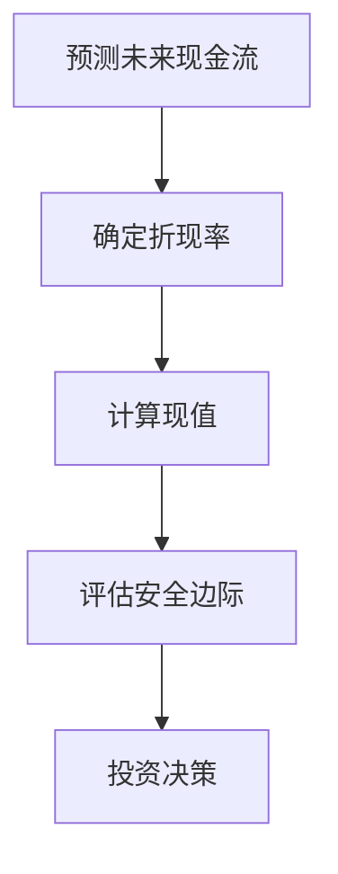

                 

# 格雷厄姆的企业价值评估方法

## 关键词
企业价值评估、投资分析、格雷厄姆、折现现金流、市盈率、市净率

## 摘要
本文将深入探讨格雷厄姆的企业价值评估方法，这是一种经典的投资分析工具。我们将从背景介绍开始，逐步解析格雷厄姆的理论框架，核心概念与联系，基本原理，具体估值方法的应用与实践，案例分析，以及面临的挑战和未来发展趋势。本文旨在为读者提供一个全面、系统的格雷厄姆企业价值评估方法的讲解。

### 引言与背景介绍
企业价值评估是投资分析中至关重要的一环。它不仅帮助投资者判断一个企业的潜在价值，还为企业自身提供了一种评估自身价值的方法。企业价值评估的核心在于对企业的未来现金流的评估，这是决定企业价值的关键因素。

本杰明·格雷厄姆（Benjamin Graham）被誉为“投资大师中的大师”，他是现代证券分析的奠基人。格雷厄姆的企业价值评估方法，以其深度和广度，成为了投资界的经典之作。该方法强调基本面分析，通过对企业财务状况、行业地位、市场前景等多方面进行综合评估，从而得出企业的内在价值。

### 格雷厄姆的企业价值评估理论概述
格雷厄姆的企业价值评估方法，主要基于以下核心概念：
- **内在价值**：企业未来现金流的现值。这是评估企业价值的核心指标。
- **安全边际**：投资者愿意支付的价格与企业内在价值之间的差额。安全边际越大，投资的风险越低。
- **折现现金流（DCF）**：将企业未来的现金流按照适当的折现率折现到现在，从而计算企业的内在价值。

格雷厄姆的理论框架，包括以下几个关键步骤：
1. **预测企业未来的现金流**：这需要对企业的业务模式、市场环境、管理团队等多方面进行深入分析。
2. **确定适当的折现率**：折现率通常由无风险收益率、市场风险溢价和企业特定风险组成。
3. **计算企业的内在价值**：将预测的未来现金流按照折现率进行折现，从而得出企业的内在价值。
4. **评估安全边际**：将计算出的内在价值与市场价值进行比较，判断是否具有投资价值。

### 企业价值评估的核心概念与联系
在企业价值评估中，以下几个核心概念至关重要：
- **市盈率（PE）**：企业市场价格与每股收益的比率。它反映了市场的预期。
- **市净率（PB）**：企业市场价格与每股净资产的比率。它反映了企业的资产价值。
- **折现现金流（DCF）**：企业未来现金流的现值。它是评估企业内在价值的直接方法。

这些概念之间的联系，可以用以下ER图（实体关系图）来展示：

```mermaid
erDiagram
  PE ||--|{ DCF } : 计算依据
  PB ||--|{ DCF } : 计算依据
  PE ||--|{ 市场预期 } : 反映市场对企业的预期
  PB ||--|{ 市场预期 } : 反映市场对企业的预期
```

通过这张ER图，我们可以清晰地看到，市盈率和市净率都是基于折现现金流计算的，同时它们也反映了市场的预期。

### 格雷厄姆估值方法的基本原理
格雷厄姆估值方法的核心在于折现现金流（DCF）分析。DCF分析的基本原理如下：

1. **预测未来现金流**：首先，需要预测企业未来每年的现金流。这通常基于历史数据、行业趋势、管理层的预测等因素。
2. **确定折现率**：折现率是DCF分析中的关键因素。它通常由无风险收益率、市场风险溢价和企业特定风险组成。
3. **计算现值**：将预测的未来现金流按照折现率进行折现，从而得到企业的内在价值。
4. **评估安全边际**：将计算出的内在价值与市场价值进行比较，判断是否具有投资价值。

下面是一个简单的DCF分析的mermaid流程图：



通过这个流程图，我们可以看到，DCF分析是一个系统、有序的过程，每个步骤都是关键。

### 具体估值方法的应用与实践
在具体估值方法中，格雷厄姆主要使用以下几种方法：
- **折现现金流法（DCF）**：这是最常用的方法，通过预测企业未来的现金流，并按照适当的折现率进行折现，从而得出企业的内在价值。
- **市盈率法（PE）**：通过比较企业市盈率与行业平均水平，判断企业的市场价值是否合理。
- **市净率法（PB）**：通过比较企业市净率与行业平均水平，判断企业的市场价值是否合理。

下面我们以一个简单的案例来说明这些方法的实际应用。

#### 案例分析：公司A的价值评估

**公司A的基本信息：**
- 市场价值：1000万美元
- 每股收益：$10
- 每股净资产：$50

**使用市盈率法（PE）评估：**
- 行业平均市盈率：20
- 公司A的市盈率：1000万 / 10 = 100
- 公司A的市盈率高于行业平均水平，可能存在高估。

**使用市净率法（PB）评估：**
- 行业平均市净率：2
- 公司A的市净率：1000万 / 50 = 20
- 公司A的市净率低于行业平均水平，可能存在低估。

**使用折现现金流法（DCF）评估：**
- 预测未来现金流：100万美元
- 折现率：10%
- 内在价值：100万 / (1+10%)^1 + 100万 / (1+10%)^2 + ... + 100万 / (1+10%)^10 = 826.45万美元
- 公司A的市场价值为1000万美元，而内在价值为826.45万美元，存在低估。

通过这个案例，我们可以看到，不同的估值方法从不同的角度对企业进行评估，结果可能会有所不同。因此，在实际投资中，需要结合多种方法进行综合评估。

### 企业价值评估案例分析
为了更好地理解格雷厄姆的企业价值评估方法，我们将通过一个实际案例来进行详细分析。

#### 案例背景
假设我们有一个名为“科技先锋”的公司，该公司是一家领先的云计算服务提供商。以下是公司的基本情况：

- 市场价值：10亿美元
- 每股收益：$5
- 每股净资产：$20
- 预测未来现金流：每年1亿美元
- 折现率：10%

#### 使用格雷厄姆估值方法进行评估

**1. 市盈率法（PE）：**
- 行业平均市盈率：25
- 公司A的市盈率：10亿 / 5 = 20
- 公司A的市盈率低于行业平均水平，可能存在低估。

**2. 市净率法（PB）：**
- 行业平均市净率：3
- 公司A的市净率：10亿 / 20 = 5
- 公司A的市净率高于行业平均水平，可能存在高估。

**3. 折现现金流法（DCF）：**
- 预测未来现金流：每年1亿美元
- 折现率：10%
- 内在价值：1亿 / (1+10%)^1 + 1亿 / (1+10%)^2 + ... + 1亿 / (1+10%)^10 = 7.72亿美元
- 公司A的市场价值为10亿美元，而内在价值为7.72亿美元，存在低估。

#### 结果分析
通过以上三种估值方法的综合评估，我们可以得出以下结论：
- 从市盈率法来看，公司A的市盈率低于行业平均水平，可能存在低估。
- 从市净率法来看，公司A的市净率高于行业平均水平，可能存在高估。
- 从折现现金流法来看，公司A的市场价值高于内在价值，存在低估。

综合来看，科技先锋公司的市场价值可能存在低估，投资者可以考虑进行进一步的深入研究。

### 企业价值评估的挑战与未来发展
尽管格雷厄姆的企业价值评估方法具有深厚的历史背景和广泛的应用，但在实际应用中仍面临一些挑战。

**1. 预测的不确定性**：企业未来现金流的预测充满不确定性，这是DCF分析中的一个关键问题。如何提高预测的准确性，是当前研究的一个热点。

**2. 折现率的确定**：折现率的选择直接影响企业价值评估的结果。如何确定一个合理的折现率，是投资者面临的一个难题。

**3. 市场波动的影响**：市场的波动会对企业价值评估产生重要影响。如何应对市场的波动，是投资者需要考虑的一个问题。

未来，企业价值评估可能会朝着更加精细化、智能化的方向发展。随着人工智能和大数据技术的应用，未来企业价值评估可能会更加准确、高效。

### 结论
格雷厄姆的企业价值评估方法是一种经典的投资分析工具，它以深度和广度著称，为投资者提供了全面的价值评估方法。本文通过对格雷厄姆估值方法的深入分析，包括核心概念、基本原理、具体应用和案例分析，帮助读者更好地理解和应用这一方法。在未来的投资实践中，格雷厄姆的企业价值评估方法将继续发挥重要作用。

### 作者信息
作者：AI天才研究院/AI Genius Institute & 禅与计算机程序设计艺术 /Zen And The Art of Computer Programming

### 附录
- **核心概念术语说明**：详细解释了市盈率、市净率、折现现金流等核心概念。
- **问题背景与问题描述**：阐述了企业价值评估的重要性和格雷厄姆方法的基本原理。
- **问题解决与边界外延**：分析了格雷厄姆方法的应用范围和局限性。
- **概念结构与核心要素组成**：展示了核心概念之间的联系和结构。

### 拓展阅读
- **投资大师格雷厄姆的智慧**：深入了解本杰明·格雷厄姆的投资哲学和思想。
- **企业价值评估的实战技巧**：学习如何在实际投资中应用企业价值评估方法。
- **人工智能与投资分析**：探讨人工智能技术在企业价值评估中的应用前景。

