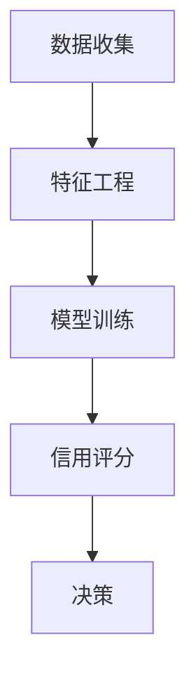
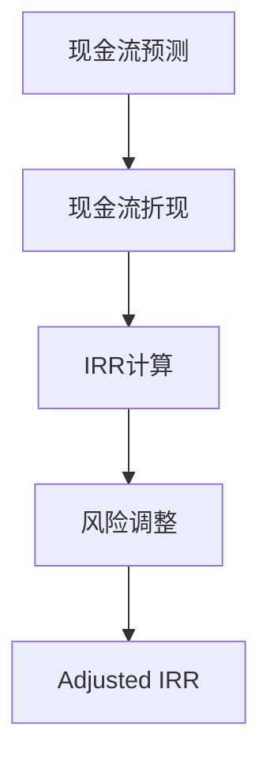
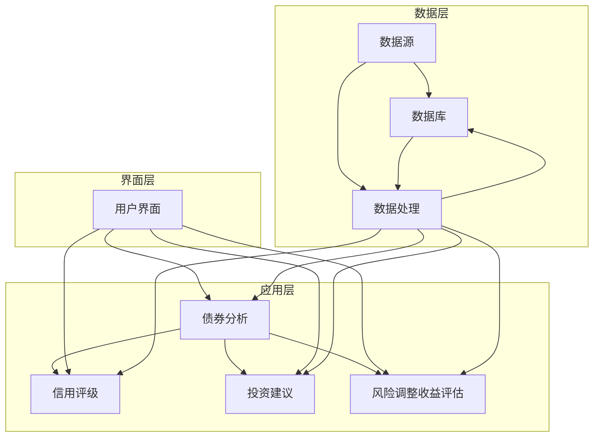
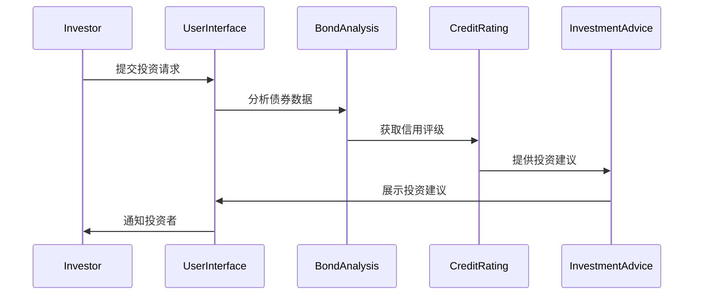

                 


# 格雷厄姆的债券投资策略：在低收益环境中的替代方案

## 关键词
债券投资、低收益环境、格雷厄姆策略、替代方案、投资分析

## 摘要
本文将探讨知名投资大师本杰明·格雷厄姆的债券投资策略，特别是在当前低收益环境中如何运用这一策略。通过回顾格雷厄姆的基本原则，分析其实际应用，以及探讨在低收益环境下可采取的其他投资选项，本文旨在为投资者提供一种深入理解债券市场的实用指南。

## 目录

### 第一部分：债券投资背景与基础

#### 第1章：债券投资概述
1.1 债券的基本概念
1.2 债券市场的功能与结构
1.3 低收益环境的影响

#### 第2章：经济环境与债券收益率
2.1 债券收益率的决定因素
2.2 低收益环境的经济背景
2.3 投资者行为与债券市场

### 第二部分：格雷厄姆的债券投资策略

#### 第3章：格雷厄姆的基本原则
3.1 安全第一的投资理念
3.2 债券投资的价值评估
3.3 风险管理与分散投资

#### 第4章：格雷厄姆策略的案例分析
4.1 经典案例回顾
4.2 策略实施中的挑战与应对

### 第三部分：核心概念与分析工具

#### 第5章：债券分析工具
5.1 信用分析
5.2 利率预测
5.3 投资组合管理

#### 第6章：风险调整收益评估
6.1 调整内部收益率（IRR）
6.2 夏普比率与特雷诺指数
6.3 其他风险调整收益指标

### 第四部分：替代投资策略

#### 第7章：债券替代品
7.1 高收益债券
7.2 债券基金与ETF
7.3 可转换债券与优先股

#### 第8章：其他投资选项
8.1 股票投资
8.2 商品投资
8.3 外汇与衍生品投资

### 第五部分：结论与建议

#### 第9章：投资策略的整合与应用
9.1 投资策略的整合
9.2 风险控制与回报平衡
9.3 适应市场的投资调整

## 引言

债券投资作为一种重要的投资方式，一直是投资者资产配置中的关键组成部分。然而，在当前低收益环境下，投资者面临着前所未有的挑战。本杰明·格雷厄姆的债券投资策略，以其稳健性和长期视角，为投资者提供了一种可行的解决方案。

本文将首先回顾格雷厄姆的投资原则，特别是他在债券投资中的理念和方法。接着，我们将深入分析格雷厄姆策略在实际中的应用，并通过案例研究展示其实效。随后，本文将探讨在低收益环境中，投资者可以考虑的其他投资策略，包括债券替代品和其他资产类别。

在分析过程中，我们将利用债券分析工具，如信用分析、利率预测和投资组合管理，来评估不同策略的风险和收益。最后，本文将总结投资策略的整合与应用，为投资者提供适应市场变化的指导。

## 第1章：债券投资概述

### 1.1 债券的基本概念

债券是一种固定收益证券，是借款人（发行人）向投资者（持有人）借款并承诺按期支付利息和偿还本金的债务工具。债券的种类繁多，包括政府债券、企业债券、地方政府债券等。每种债券都有其独特的特征和风险收益结构。

**政府债券** 通常被认为是最安全的债券，因为它们由政府发行，并受到政府信用担保。政府债券的收益率通常较低，但风险也相对较小。

**企业债券** 是由公司发行的债券，通常用于筹集运营资金或投资新项目。企业债券的收益率通常高于政府债券，但风险也相应较大。

**地方政府债券** 是由地方政府发行的债券，用于资助市政建设项目或其他地方政府活动。地方政府债券的风险和收益率介于政府债券和企业债券之间。

### 1.2 债券市场的功能与结构

债券市场是债券发行和交易的主要场所。它包括两个部分：一级市场和二级市场。

**一级市场** 是债券发行市场，发行人通过发行新债券筹集资金。投资者可以在这个市场上购买新发行的债券。一级市场的运作通常由承销商和经纪商协助完成。

**二级市场** 是债券流通市场，已发行的债券在这里进行买卖交易。二级市场的流动性对于债券价格的形成至关重要，因为它提供了投资者随时进入和退出债券投资的机会。

### 1.3 低收益环境的影响

低收益环境通常指债券市场整体收益率较低，投资者难以获得高额收益。这种现象可能由多种因素引起，包括经济衰退、利率下降、通货膨胀等。

在低收益环境下，投资者面临着以下挑战：

1. **收益下降**：低收益率使得投资者的投资回报减少，增加了获得预期收益的难度。

2. **风险增加**：为了追求更高的收益，投资者可能需要承担更高的风险，如投资于高风险债券或新兴市场债券。

3. **投资选择受限**：低收益环境可能减少优质债券的供应，投资者需要在有限的选择中做出决策。

4. **资金流动性**：低收益环境可能导致投资者减少债券投资，从而降低市场流动性，影响债券价格和交易效率。

## 第2章：经济环境与债券收益率

### 2.1 债券收益率的决定因素

债券收益率是投资者获取的回报，它是债券市场中的关键指标。债券收益率受多种因素影响，主要包括：

1. **市场利率**：市场利率是影响债券收益率的关键因素。一般来说，市场利率上升，债券收益率也会上升；市场利率下降，债券收益率也会下降。这是因为债券价格与市场利率呈反向关系。当市场利率上升时，新发行的债券提供更高的收益率，因此现有债券的价格下降，导致收益率上升。

2. **债券期限**：债券期限是指债券到期的时间。通常情况下，债券期限越长，其收益率越高。这是因为长期债券面临的时间风险和利率风险较大，因此需要更高的收益率来补偿。

3. **信用风险**：信用风险是指债券发行人无法按时支付利息或偿还本金的风险。信用风险较高的债券通常提供更高的收益率。这是因为投资者要求更高的回报以补偿更高的违约风险。

4. **宏观经济环境**：宏观经济环境，如经济增长、通货膨胀和货币政策，也会影响债券收益率。例如，当经济前景乐观时，投资者可能会期望更高的回报，导致债券收益率上升；而当经济前景不明朗或衰退时，债券收益率可能会下降。

### 2.2 低收益环境的经济背景

低收益环境通常出现在经济衰退或货币政策宽松的时期。以下是几个可能引发低收益环境的经济因素：

1. **经济衰退**：经济衰退通常伴随着消费和投资下降，企业利润减少，导致债券发行量减少。此外，经济衰退可能会导致信用风险上升，从而降低债券的收益率。

2. **通货膨胀**：低收益环境可能与低通货膨胀率有关。当通货膨胀率较低时，投资者可能对债券的需求减少，因为债券提供的固定收益无法有效抵御通货膨胀的影响。

3. **货币政策**：宽松的货币政策，如低利率政策，通常会导致债券收益率下降。中央银行通过购买债券来降低利率，从而刺激经济活动。

4. **市场预期**：市场预期也会影响债券收益率。例如，如果市场预期未来经济将衰退，债券收益率可能会下降，因为投资者担心债券违约风险。

### 2.3 投资者行为与债券市场

在低收益环境中，投资者行为对债券市场有重要影响。以下是几种常见的投资者行为：

1. **风险偏好**：在低收益环境下，一些投资者可能会增加高风险投资，如股票或新兴市场债券，以寻求更高的回报。这可能导致债券市场流动性下降和债券价格波动。

2. **资产配置**：投资者可能会调整其资产配置，增加债券或其他固定收益投资的比重，以降低整体投资组合的风险。

3. **避险需求**：在经济不确定性增加时，投资者可能会寻求避险资产，如政府债券或高质量企业债券。这可能导致这些债券的需求增加，从而推高其价格并降低收益率。

4. **债券回购**：债券回购是一种短期投资策略，投资者通过购买债券并立即出售，以获取短期利润。这可能导致债券市场流动性下降和价格波动。

## 第3章：格雷厄姆的基本原则

### 3.1 安全第一的投资理念

本杰明·格雷厄姆的投资理念以安全第一为核心，他强调投资者在进行债券投资时应将风险控制放在首位。格雷厄姆认为，投资的成功不仅仅取决于收益，更取决于能否保全本金。

**安全性分析**：格雷厄姆主张通过详细的安全性分析来评估债券投资的风险。投资者需要考虑债券发行人的信用状况、财务健康状况、以及违约的可能性。

**债券评级**：格雷厄姆重视债券评级机构提供的评级信息，认为这些评级可以作为评估债券安全性的重要参考。他倾向于投资评级较高的债券，以降低违约风险。

**价值评估**：格雷厄姆强调对债券进行价值评估，他主张使用“内在价值”这一概念来评估债券的投资潜力。债券的内在价值是指其预期现金流折现后的现值，投资者应该寻找那些价格低于其内在价值的债券。

### 3.2 债券投资的价值评估

格雷厄姆认为，债券投资的价值评估是投资决策的重要环节。他主张采用现金流折现法（DCF）来评估债券的内在价值。

**现金流折现法**：DCF法通过将债券未来现金流（包括利息和本金偿还）折现到现值，来计算债券的内在价值。格雷厄姆认为，债券的内在价值应该高于其市场价格，才值得投资。

**折现率**：折现率是DCF法中的一个关键参数，它反映了投资者对债券风险和回报的预期。格雷厄姆通常使用无风险利率（如政府债券收益率）作为折现率，以反映债券的安全性和可靠性。

**敏感性分析**：格雷厄姆还主张进行敏感性分析，以评估不同折现率对债券内在价值的影响。通过敏感性分析，投资者可以了解债券价值对市场利率变化的敏感度，从而做出更明智的投资决策。

### 3.3 风险管理与分散投资

格雷厄姆非常重视风险管理，他认为分散投资是降低风险的有效手段。他主张投资者通过构建多元化的债券投资组合，来分散个别债券的风险。

**分散投资**：格雷厄姆认为，投资组合应该包括不同类型和期限的债券，以降低特定债券违约对整体投资组合的影响。他建议投资者在投资组合中纳入政府债券、高质量企业债券和低评级债券，以实现风险分散。

**债券组合管理**：格雷厄姆主张定期评估和调整投资组合，以适应市场变化和风险偏好。他建议投资者根据市场情况，适时买入或卖出债券，以优化投资组合的表现。

**止损策略**：格雷厄姆还提出了止损策略，即在债券价格低于其内在价值一定比例时卖出债券，以避免更大的损失。他认为，止损策略有助于投资者在市场波动中保持冷静和理性。

## 第4章：格雷厄姆策略的案例分析

### 4.1 经典案例回顾

在本杰明·格雷厄姆的投资生涯中，有许多经典的债券投资案例。以下是其中两个典型案例：

**案例一：美国钢铁债券**  
在1930年代的大萧条时期，美国钢铁公司发行了高收益债券。格雷厄姆通过深入分析，发现这些债券的实际价值远高于市场价格。他决定购买大量美国钢铁债券，并在市场恢复后以更高的价格出售，获得了丰厚的回报。

**案例二：市政债券**  
在1960年代，格雷厄姆投资了大量市政债券。当时，市政债券的收益率较低，但格雷厄姆通过对其信用和未来现金流的分析，认为这些债券具有很高的安全性。他在长期持有这些债券的过程中，不仅获得了稳定的利息收入，还享受了债券价格上涨带来的资本收益。

### 4.2 策略实施中的挑战与应对

虽然格雷厄姆的债券投资策略在实践中取得了显著成功，但在实施过程中也面临诸多挑战：

**挑战一：市场波动**  
债券市场受宏观经济因素和投资者情绪的影响，价格波动较大。在市场波动较大的时期，投资者需要保持冷静，坚持长期投资策略，避免因短期波动而做出错误的决策。

**挑战二：信息不对称**  
债券投资者往往面临信息不对称的问题，即无法获取到所有债券发行人的详细财务和信用状况。格雷厄姆通过长期积累的金融知识和分析技能，努力克服这一挑战，确保投资决策基于可靠的信息。

**挑战三：市场低估**  
格雷厄姆的策略依赖于寻找市场低估的债券。在低收益环境下，优质债券的供应可能减少，投资者需要耐心等待市场机会，不盲目追涨。

**应对策略**  
1. **长期投资**：格雷厄姆强调长期投资，通过时间来平滑市场波动，实现复利效应。

2. **深入分析**：投资者应进行深入的基本面分析，评估债券的内在价值，避免盲目跟风。

3. **分散投资**：构建多元化的债券投资组合，降低特定债券的风险。

4. **灵活调整**：根据市场变化，适时调整投资策略，保持投资组合的平衡。

## 第5章：债券分析工具

### 5.1 信用分析

信用分析是评估债券发行人信用状况的重要工具。投资者需要关注以下方面：

**信用评级**：信用评级机构如标准普尔、穆迪和惠誉等，根据债券发行人的财务状况、偿债能力和市场声誉，给予不同的信用评级。投资者通常倾向于投资高评级债券，以降低信用风险。

**财务指标**：投资者应关注债券发行人的财务报表，包括资产负债表、利润表和现金流量表。关键财务指标如流动比率、速动比率和利息保障倍数，可以帮助评估发行人的偿债能力。

**违约概率**：投资者可以使用统计模型，如逻辑回归和生存分析模型，计算债券发行人的违约概率。这有助于投资者更好地了解债券的风险水平。

### 5.2 利率预测

利率预测是债券投资中的一项关键任务，因为它直接影响债券价格和收益率。以下是几种常用的利率预测方法：

**历史数据分析**：通过分析历史利率变化趋势，投资者可以预测未来的利率走向。例如，如果过去的利率波动呈周期性，投资者可以根据历史数据预测未来的利率水平。

**经济指标分析**：经济指标如失业率、通货膨胀率和GDP增长率，对利率有着重要影响。投资者可以通过分析这些经济指标，预测利率变化。

**市场指标分析**：市场利率和债券价格的变化反映了市场对利率的预期。投资者可以通过分析市场指标，如国债收益率和债券溢价，预测未来的利率变化。

**专家意见**：一些金融分析师和经济学家会根据其对经济形势的判断，提供利率预测。投资者可以参考这些专家意见，结合自己的分析，做出更为全面的判断。

### 5.3 投资组合管理

投资组合管理是债券投资的关键环节，旨在通过优化投资组合，实现风险与收益的最佳平衡。以下是几种常用的投资组合管理策略：

**分散投资**：通过投资不同类型和期限的债券，投资者可以分散个别债券的风险。分散投资有助于降低投资组合的整体风险。

**期限结构分析**：投资者应根据市场情况和投资目标，选择适当的债券期限。例如，在利率上升时，投资者可能倾向于投资短期债券，以规避利率风险。

**收益率曲线分析**：收益率曲线反映了不同期限债券的收益率水平。投资者可以通过分析收益率曲线，了解市场对不同期限债券的需求和预期，从而制定投资策略。

**风险管理**：投资者应定期评估投资组合的风险水平，根据市场变化和风险承受能力，调整投资组合。

### 5.4 风险调整收益评估

在债券投资中，仅仅关注收益率是不够的，投资者还需要考虑投资风险。风险调整收益评估是一种常用的方法，用于衡量投资的风险和回报。

**调整内部收益率（IRR）**：IRR是投资项目的内部收益率，用于评估投资的盈利能力。通过调整IRR，投资者可以更准确地衡量投资的风险和回报。

**夏普比率**：夏普比率是衡量投资组合收益率与市场风险的关系。投资者通过计算夏普比率，可以评估投资组合的风险调整收益。

**特雷诺指数**：特雷诺指数是衡量投资组合收益率与市场收益的关系。它类似于夏普比率，但考虑了投资组合的β值（即对市场风险的敏感性）。

**其他风险调整收益指标**：除了上述指标，投资者还可以使用其他风险调整收益指标，如詹森指数和特雷诺比率，来评估投资的风险和回报。

## 第6章：风险调整收益评估

### 6.1 调整内部收益率（IRR）

内部收益率（IRR）是衡量投资项目盈利能力的重要指标。它代表了投资项目的预期回报率，使得项目的净现值（NPV）为零。在债券投资中，IRR可以帮助投资者评估不同投资方案的风险和回报。

**计算方法**：
$$
IRR = \frac{1}{n}\sum_{t=1}^{n} \frac{CF_t}{(1+r)^t}
$$
其中，$CF_t$ 是第 $t$ 年的现金流，$r$ 是内部收益率。

**调整方法**：
为了更准确地评估债券投资的风险，投资者可以使用调整内部收益率（Adjusted IRR）方法。这种方法通过引入风险调整因子，来修正IRR，使其更符合投资者的风险偏好。

$$
Adjusted IRR = IRR \times \frac{1 + Risk Factor}{1 + Risk-Free Rate}
$$
其中，$Risk Factor$ 是风险调整因子，$Risk-Free Rate$ 是无风险利率。

### 6.2 夏普比率与特雷诺指数

夏普比率（Sharpe Ratio）和特雷诺指数（Treynor Index）是衡量投资组合风险调整收益的重要指标。它们分别从不同的角度评估投资组合的风险和回报。

**夏普比率**：
$$
Sharpe Ratio = \frac{Portfolio Return - Risk-Free Return}{Portfolio Standard Deviation}
$$
其中，$Portfolio Return$ 是投资组合的收益率，$Risk-Free Return$ 是无风险收益率，$Portfolio Standard Deviation$ 是投资组合的标准差。

**特雷诺指数**：
$$
Treynor Index = \frac{Portfolio Return - Risk-Free Return}{Beta}
$$
其中，$Beta$ 是投资组合的β值，反映了投资组合对市场收益的敏感性。

**计算与解释**：
夏普比率和特雷诺指数的值越高，表明投资组合的风险调整收益越好。投资者可以使用这两个指标来比较不同投资组合的表现，并做出更明智的投资决策。

### 6.3 其他风险调整收益指标

除了夏普比率和特雷诺指数，投资者还可以使用其他风险调整收益指标来评估债券投资的风险和回报。

**詹森指数（Jensen's Alpha）**：
$$
Jensen's Alpha = Portfolio Return - [Risk-Free Return + Beta \times Market Return]
$$
詹森指数衡量的是投资组合的超额回报。如果詹森指数为正，表明投资组合的表现优于市场；如果为负，表明投资组合的表现低于市场。

**特雷诺比率（Treynor Ratio）**：
$$
Treynor Ratio = \frac{Portfolio Return - Risk-Free Return}{Portfolio Beta}
$$
特雷诺比率与特雷诺指数类似，但考虑了投资组合的β值。它反映了投资组合的风险调整收益。

**信息比率（Information Ratio）**：
$$
Information Ratio = \frac{Portfolio Standard Deviation}{Benchmark Standard Deviation}
$$
信息比率衡量的是投资组合相对于基准表现的波动性。如果信息比率较高，表明投资组合的风险调整收益较好。

通过使用这些风险调整收益指标，投资者可以更全面地评估债券投资的风险和回报，从而做出更为合理的投资决策。

## 第7章：债券替代品

### 7.1 高收益债券

高收益债券（High Yield Bonds），也称为垃圾债券（Junk Bonds），是信用风险较高的债券，通常由财务状况较差或新兴市场公司发行。这些债券的收益率较高，以补偿更高的违约风险。

**特点**：
- **收益率高**：高收益债券的收益率通常高于同等期限的政府债券和企业债券。
- **信用风险大**：高收益债券的信用评级较低，违约风险较高。
- **期限灵活**：高收益债券的期限通常较短，以降低长期违约风险。

**应用场景**：
- **寻求高回报的投资者**：高收益债券适合那些愿意承担高风险以获取更高回报的投资者。
- **市场流动性差**：在低收益环境下，高收益债券可能提供较好的流动性，因为它们具有更高的收益潜力。

### 7.2 债券基金与ETF

债券基金（Bond Funds）和交易所交易基金（ETFs）是投资债券的便捷工具，它们通过投资多种债券来分散风险。

**债券基金**：
- **种类**：债券基金包括政府债券基金、企业债券基金和市政债券基金等。
- **特点**：债券基金由专业基金经理管理，投资者可以通过购买基金份额来获得多样化债券投资的收益。

**ETFs**：
- **种类**：ETFs包括政府ETFs、企业ETFs和行业ETFs等。
- **特点**：ETFs在交易所上市交易，投资者可以像买卖股票一样交易ETF份额。ETFs通常跟踪特定的债券指数，提供透明、低成本的投资。

**应用场景**：
- **多元化投资**：投资者可以通过债券基金和ETFs，轻松实现债券投资的多元化。
- **低成本投资**：ETFs通常具有较低的管理费用，适合长期投资者。

### 7.3 可转换债券与优先股

可转换债券（Convertible Bonds）和优先股（Preferred Stock）是债券投资的另一种形式。

**可转换债券**：
- **特点**：可转换债券可以在特定条件下转换为发行公司的股票。这使投资者可以在债券和股票之间进行选择，根据市场情况调整投资策略。
- **应用场景**：适合那些预期股票价格将上涨的投资者，因为他们可以在债券价格稳定的情况下，通过转换为股票来获取额外收益。

**优先股**：
- **特点**：优先股通常具有固定的股息和优先偿付权。在公司破产时，优先股股东比普通股股东有更高的优先权。
- **应用场景**：适合那些寻求稳定股息收入，且对股票市场波动敏感度较低的投资者。

### 7.4 选择替代品的原则

在选择债券替代品时，投资者应考虑以下原则：

- **风险偏好**：根据个人风险偏好，选择适合的投资产品。
- **收益目标**：明确投资收益目标，确保选择的替代品能够满足预期回报。
- **市场环境**：考虑当前市场环境，选择在市场波动中表现稳定的替代品。
- **流动性需求**：根据流动性需求，选择能够快速买卖、交易便捷的替代品。

通过合理选择债券替代品，投资者可以在低收益环境中实现风险与收益的平衡。

## 第8章：其他投资选项

### 8.1 股票投资

股票投资是债券投资的重要替代选项，它提供了不同的风险和回报特征。

**特点**：
- **高风险高回报**：股票市场的波动性较大，投资者可能获得较高的回报，但也面临较大的风险。
- **长期增值**：股票通常具有长期增值潜力，投资者可以通过股票价格上涨和分红获得收益。
- **多样性**：股票市场涵盖了各种行业和公司，投资者可以通过分散投资来降低风险。

**应用场景**：
- **寻求长期增值**：适合那些有较长时间投资期限、愿意承担较高风险的投资者。
- **资本增值和分红**：适合那些希望实现资产长期增值和定期获得分红收益的投资者。

### 8.2 商品投资

商品投资涉及买卖实物商品，如农产品、能源和金属等。

**特点**：
- **价格波动大**：商品价格受供需关系、自然灾害、政治事件等多种因素影响，价格波动较大。
- **风险管理**：商品投资可以通过期货合约等工具进行风险管理，降低价格波动风险。

**应用场景**：
- **对冲风险**：适合那些希望对冲其业务中商品价格波动的投资者。
- **投机机会**：适合那些寻求通过价格波动获得短期利润的投资者。

### 8.3 外汇与衍生品投资

外汇与衍生品投资包括外汇交易和期货、期权等衍生品交易。

**特点**：
- **高风险高回报**：外汇和衍生品市场波动性较大，投资者可以在短时间内获得高额回报，但也面临较大风险。
- **杠杆效应**：外汇和衍生品交易通常具有杠杆效应，投资者可以使用较小的资金控制较大的头寸。

**应用场景**：
- **资产配置**：适合那些希望通过多元化资产配置降低投资组合风险的投资者。
- **投机与套利**：适合那些寻求通过市场波动进行投机和套利的投资者。

### 8.4 选择其他投资选项的原则

在选择其他投资选项时，投资者应考虑以下原则：

- **风险承受能力**：根据个人的风险承受能力，选择适合的投资产品。
- **投资目标**：明确投资目标，确保选择的选项能够满足预期回报。
- **市场分析**：进行充分的市场分析，了解不同投资产品的特点和市场环境。
- **风险管理**：采取适当的风险管理策略，降低投资风险。

通过合理选择其他投资选项，投资者可以在低收益环境中实现投资多元化，降低风险，提高回报。

## 第9章：投资策略的整合与应用

### 9.1 投资策略的整合

在低收益环境中，投资者需要通过整合多种投资策略来应对市场的不确定性，实现风险与收益的平衡。以下是几种常见的投资策略整合方法：

**1. 多样化投资**：通过投资不同类型的债券、股票、商品和外汇等，分散单一资产类别的风险，实现投资组合的多元化。

**2. 风险管理**：结合使用风险调整收益指标，如夏普比率、特雷诺指数和调整内部收益率（IRR），评估和调整投资组合的风险水平。

**3. 动态调整**：根据市场变化，灵活调整投资策略。例如，在利率上升时增加短期债券的比重，在市场波动较大时增加现金等流动性较高的资产。

**4. 资产配置**：根据投资者的风险偏好和投资目标，合理分配不同资产类别的投资比例，以实现长期稳定的投资回报。

### 9.2 风险控制与回报平衡

在整合投资策略的过程中，风险控制和回报平衡是关键。以下是几种常用的风险控制与回报平衡方法：

**1. 定期评估**：定期对投资组合进行评估，识别潜在风险，及时进行调整。例如，定期检查债券评级变化、市场波动等因素。

**2. 风险对冲**：使用衍生品如期权、期货等进行风险对冲，降低市场波动对投资组合的影响。

**3. 分散投资**：通过投资不同类型和地区的资产，分散个别资产的风险，提高投资组合的整体稳定性。

**4. 适应性调整**：根据市场环境和自身投资目标，灵活调整投资策略。例如，在市场波动较大时增加现金等低风险资产的比重。

### 9.3 适应市场的投资调整

低收益环境要求投资者具备敏锐的市场洞察力和灵活的投资策略。以下是几种适应市场的投资调整方法：

**1. 利率敏感性分析**：定期分析市场利率变化趋势，根据利率预期调整债券投资组合。例如，在利率上升时增加短期债券的比重，降低长期债券的风险。

**2. 经济指标分析**：关注宏观经济指标，如GDP增长率、通货膨胀率和货币政策，预测市场走势，调整投资策略。

**3. 行业轮动**：根据行业发展趋势和公司基本面，进行行业轮动投资，实现投资组合的动态平衡。

**4. 技术分析**：利用技术分析工具，如趋势线、支撑/阻力位等，预测市场走势，及时调整投资决策。

通过以上方法，投资者可以更好地适应市场变化，实现投资策略的有效整合，在低收益环境中取得更好的投资回报。

## 总结

本文探讨了本杰明·格雷厄姆的债券投资策略，特别是在当前低收益环境中的应用。通过深入分析格雷厄姆的投资原则、分析工具和替代投资策略，本文为投资者提供了一种全面的债券投资指南。

**关键要点**：
- **安全性第一**：格雷厄姆强调风险控制，通过信用分析和价值评估来确保投资的安全性。
- **多样化投资**：投资者应通过多元化投资分散风险，实现投资组合的稳健增长。
- **灵活调整**：在低收益环境中，投资者需要根据市场变化灵活调整投资策略，以应对不确定性。

**未来展望**：
随着全球经济增长放缓和货币政策的变化，债券市场将继续面临挑战。投资者应密切关注市场动态，及时调整投资策略，以实现长期稳定的投资回报。

## 最佳实践 Tips

1. **深入分析**：在进行债券投资时，务必进行充分的基本面分析，确保对债券发行人的信用状况和市场环境有深入了解。

2. **定期评估**：定期评估投资组合的风险和收益，根据市场变化及时进行调整。

3. **风险管理**：使用风险调整收益指标，如夏普比率和特雷诺指数，来评估投资组合的表现。

4. **分散投资**：通过投资不同类型和期限的债券，实现风险分散，降低投资组合的整体风险。

5. **灵活应对**：在低收益环境中，灵活调整投资策略，根据市场情况采取适当的措施。

## 小结

本文详细介绍了格雷厄姆的债券投资策略，分析了其核心原则和实际应用，并探讨了在低收益环境中其他可考虑的投资选项。通过整合多种投资策略，投资者可以在复杂多变的市场中实现风险与收益的平衡。

## 注意事项

1. **市场风险**：债券市场受宏观经济因素和投资者情绪影响，价格波动较大。投资者应充分了解市场风险，并采取适当的风险管理措施。

2. **信用风险**：债券发行人的信用状况直接影响债券的投资价值。投资者应关注债券评级变化，并选择信用评级较高的债券。

3. **流动性风险**：债券市场的流动性可能影响债券的交易价格。投资者应选择流动性较高的债券，以便在需要时能够快速买卖。

4. **投资期限**：不同期限的债券具有不同的风险和收益特征。投资者应根据自身的投资目标和风险偏好选择合适的债券期限。

## 拓展阅读

1. **《证券分析》**：本杰明·格雷厄姆的经典著作，详细阐述了他的债券投资策略。
2. **《投资学》**：威廉·F·夏普等编著，介绍了各种投资策略和风险调整收益指标。
3. **《债券市场分析》**：史蒂夫·布林顿等编著，深入分析了债券市场的运作机制和投资策略。

## 作者信息

作者：AI天才研究院/AI Genius Institute & 禅与计算机程序设计艺术 /Zen And The Art of Computer Programming

**本文对格雷厄姆债券投资策略的分析，旨在为投资者提供实用的指导。然而，投资决策应基于个人的具体情况和市场环境。请谨慎评估风险，并咨询专业投资顾问。**

[End of Article]```markdown

[End of Article]

```

# 格雷厄姆的债券投资策略：在低收益环境中的替代方案

作者：AI天才研究院/AI Genius Institute & 禅与计算机程序设计艺术 /Zen And The Art of Computer Programming

## 摘要

本篇文章深入探讨了本杰明·格雷厄姆的债券投资策略，特别是在当前低收益环境中如何运用这一策略。文章首先回顾了格雷厄姆的基本原则，包括安全性第一的投资理念、债券投资的价值评估和风险管理。接着，通过案例分析和替代投资策略的探讨，为投资者提供了一种全面的理解和实用的指南。

## 目录

### 第一部分：债券投资背景与基础

#### 第1章：债券投资概述
1.1 债券的基本概念
1.2 债券市场的功能与结构
1.3 低收益环境的影响

#### 第2章：经济环境与债券收益率
2.1 债券收益率的决定因素
2.2 低收益环境的经济背景
2.3 投资者行为与债券市场

### 第二部分：格雷厄姆的债券投资策略

#### 第3章：格雷厄姆的基本原则
3.1 安全第一的投资理念
3.2 债券投资的价值评估
3.3 风险管理与分散投资

#### 第4章：格雷厄姆策略的案例分析
4.1 经典案例回顾
4.2 策略实施中的挑战与应对

### 第三部分：核心概念与分析工具

#### 第5章：债券分析工具
5.1 信用分析
5.2 利率预测
5.3 投资组合管理

#### 第6章：风险调整收益评估
6.1 调整内部收益率（IRR）
6.2 夏普比率与特雷诺指数
6.3 其他风险调整收益指标

### 第四部分：替代投资策略

#### 第7章：债券替代品
7.1 高收益债券
7.2 债券基金与ETF
7.3 可转换债券与优先股

#### 第8章：其他投资选项
8.1 股票投资
8.2 商品投资
8.3 外汇与衍生品投资

### 第五部分：结论与建议

#### 第9章：投资策略的整合与应用
9.1 投资策略的整合
9.2 风险控制与回报平衡
9.3 适应市场的投资调整

## 引言

债券投资作为一种重要的投资方式，一直是投资者资产配置中的关键组成部分。然而，在当前低收益环境下，投资者面临着前所未有的挑战。本杰明·格雷厄姆的债券投资策略，以其稳健性和长期视角，为投资者提供了一种可行的解决方案。

本文将首先回顾格雷厄姆的投资原则，特别是他在债券投资中的理念和方法。接着，我们将深入分析格雷厄姆策略在实际中的应用，并通过案例研究展示其实效。随后，本文将探讨在低收益环境中，投资者可以考虑的其他投资策略，包括债券替代品和其他资产类别。

在分析过程中，我们将利用债券分析工具，如信用分析、利率预测和投资组合管理，来评估不同策略的风险和收益。最后，本文将总结投资策略的整合与应用，为投资者提供适应市场变化的指导。

## 第1章：债券投资概述

### 1.1 债券的基本概念

债券是一种固定收益证券，是借款人（发行人）向投资者（持有人）借款并承诺按期支付利息和偿还本金的债务工具。债券的种类繁多，包括政府债券、企业债券、地方政府债券等。每种债券都有其独特的特征和风险收益结构。

**政府债券** 通常被认为是最安全的债券，因为它们由政府发行，并受到政府信用担保。政府债券的收益率通常较低，但风险也相对较小。

**企业债券** 是由公司发行的债券，通常用于筹集运营资金或投资新项目。企业债券的收益率通常高于政府债券，但风险也相应较大。

**地方政府债券** 是由地方政府发行的债券，用于资助市政建设项目或其他地方政府活动。地方政府债券的风险和收益率介于政府债券和企业债券之间。

### 1.2 债券市场的功能与结构

债券市场是债券发行和交易的主要场所。它包括两个部分：一级市场和二级市场。

**一级市场** 是债券发行市场，发行人通过发行新债券筹集资金。投资者可以在这个市场上购买新发行的债券。一级市场的运作通常由承销商和经纪商协助完成。

**二级市场** 是债券流通市场，已发行的债券在这里进行买卖交易。二级市场的流动性对于债券价格的形成至关重要，因为它提供了投资者随时进入和退出债券投资的机会。

### 1.3 低收益环境的影响

低收益环境通常指债券市场整体收益率较低，投资者难以获得高额收益。这种现象可能由多种因素引起，包括经济衰退、利率下降、通货膨胀等。

在低收益环境下，投资者面临着以下挑战：

1. **收益下降**：低收益率使得投资者的投资回报减少，增加了获得预期收益的难度。

2. **风险增加**：为了追求更高的收益，投资者可能需要承担更高的风险，如投资于高风险债券或新兴市场债券。

3. **投资选择受限**：低收益环境可能减少优质债券的供应，投资者需要在有限的选择中做出决策。

4. **资金流动性**：低收益环境可能导致投资者减少债券投资，从而降低市场流动性，影响债券价格和交易效率。

## 第2章：经济环境与债券收益率

### 2.1 债券收益率的决定因素

债券收益率是投资者获取的回报，它是债券市场中的关键指标。债券收益率受多种因素影响，主要包括：

1. **市场利率**：市场利率是影响债券收益率的关键因素。一般来说，市场利率上升，债券收益率也会上升；市场利率下降，债券收益率也会下降。这是因为债券价格与市场利率呈反向关系。当市场利率上升时，新发行的债券提供更高的收益率，因此现有债券的价格下降，导致收益率上升。

2. **债券期限**：债券期限是指债券到期的时间。通常情况下，债券期限越长，其收益率越高。这是因为长期债券面临的时间风险和利率风险较大，因此需要更高的收益率来补偿。

3. **信用风险**：信用风险是指债券发行人无法按时支付利息或偿还本金的风险。信用风险较高的债券通常提供更高的收益率。这是因为投资者要求更高的回报以补偿更高的违约风险。

4. **宏观经济环境**：宏观经济环境，如经济增长、通货膨胀和货币政策，也会影响债券收益率。例如，当经济前景乐观时，投资者可能会期望更高的回报，导致债券收益率上升；而当经济前景不明朗或衰退时，债券收益率可能会下降。

### 2.2 低收益环境的经济背景

低收益环境通常出现在经济衰退或货币政策宽松的时期。以下是几个可能引发低收益环境的经济因素：

1. **经济衰退**：经济衰退通常伴随着消费和投资下降，企业利润减少，导致债券发行量减少。此外，经济衰退可能会导致信用风险上升，从而降低债券的收益率。

2. **通货膨胀**：低收益环境可能与低通货膨胀率有关。当通货膨胀率较低时，投资者可能对债券的需求减少，因为债券提供的固定收益无法有效抵御通货膨胀的影响。

3. **货币政策**：宽松的货币政策，如低利率政策，通常会导致债券收益率下降。中央银行通过购买债券来降低利率，从而刺激经济活动。

4. **市场预期**：市场预期也会影响债券收益率。例如，如果市场预期未来经济将衰退，债券收益率可能会下降，因为投资者担心债券违约风险。

### 2.3 投资者行为与债券市场

在低收益环境中，投资者行为对债券市场有重要影响。以下是几种常见的投资者行为：

1. **风险偏好**：在低收益环境下，一些投资者可能会增加高风险投资，如股票或新兴市场债券，以寻求更高的回报。这可能导致债券市场流动性下降和债券价格波动。

2. **资产配置**：投资者可能会调整其资产配置，增加债券或其他固定收益投资的比重，以降低整体投资组合的风险。

3. **避险需求**：在经济不确定性增加时，投资者可能会寻求避险资产，如政府债券或高质量企业债券。这可能导致这些债券的需求增加，从而推高其价格并降低收益率。

4. **债券回购**：债券回购是一种短期投资策略，投资者通过购买债券并立即出售，以获取短期利润。这可能导致债券市场流动性下降和价格波动。

## 第3章：格雷厄姆的基本原则

### 3.1 安全第一的投资理念

本杰明·格雷厄姆的投资理念以安全第一为核心，他强调投资者在进行债券投资时应将风险控制放在首位。格雷厄姆认为，投资的成功不仅仅取决于收益，更取决于能否保全本金。

**安全性分析**：格雷厄姆主张通过详细的安全性分析来评估债券投资的风险。投资者需要考虑债券发行人的信用状况、财务健康状况、以及违约的可能性。

**债券评级**：格雷厄姆重视债券评级机构提供的评级信息，认为这些评级可以作为评估债券安全性的重要参考。他倾向于投资评级较高的债券，以降低违约风险。

**价值评估**：格雷厄姆强调对债券进行价值评估，他主张采用“内在价值”这一概念来评估债券的投资潜力。债券的内在价值是指其预期现金流折现后的现值，投资者应该寻找那些价格低于其内在价值的债券。

### 3.2 债券投资的价值评估

格雷厄姆认为，债券投资的价值评估是投资决策的重要环节。他主张采用现金流折现法（DCF）来评估债券的内在价值。

**现金流折现法**：DCF法通过将债券未来现金流（包括利息和本金偿还）折现到现值，来计算债券的内在价值。格雷厄姆认为，债券的内在价值应该高于其市场价格，才值得投资。

**折现率**：折现率是DCF法中的一个关键参数，它反映了投资者对债券风险和回报的预期。格雷厄姆通常使用无风险利率（如政府债券收益率）作为折现率，以反映债券的安全性和可靠性。

**敏感性分析**：格雷厄姆还主张进行敏感性分析，以评估不同折现率对债券内在价值的影响。通过敏感性分析，投资者可以了解债券价值对市场利率变化的敏感度，从而做出更明智的投资决策。

### 3.3 风险管理与分散投资

格雷厄姆非常重视风险管理，他认为分散投资是降低风险的有效手段。他主张投资者通过构建多元化的债券投资组合，来分散个别债券的风险。

**分散投资**：格雷厄姆认为，投资组合应该包括不同类型和期限的债券，以降低特定债券违约对整体投资组合的影响。他建议投资者在投资组合中纳入政府债券、高质量企业债券和低评级债券，以实现风险分散。

**债券组合管理**：格雷厄姆主张定期评估和调整投资组合，以适应市场变化和风险偏好。他建议投资者根据市场情况，适时买入或卖出债券，以优化投资组合的表现。

**止损策略**：格雷厄姆还提出了止损策略，即在债券价格低于其内在价值一定比例时卖出债券，以避免更大的损失。他认为，止损策略有助于投资者在市场波动中保持冷静和理性。

## 第4章：格雷厄姆策略的案例分析

### 4.1 经典案例回顾

在本杰明·格雷厄姆的投资生涯中，有许多经典的债券投资案例。以下是其中两个典型案例：

**案例一：美国钢铁债券**  
在1930年代的大萧条时期，美国钢铁公司发行了高收益债券。格雷厄姆通过深入分析，发现这些债券的实际价值远高于市场价格。他决定购买大量美国钢铁债券，并在市场恢复后以更高的价格出售，获得了丰厚的回报。

**案例二：市政债券**  
在1960年代，格雷厄姆投资了大量市政债券。当时，市政债券的收益率较低，但格雷厄姆通过对其信用和未来现金流的分析，认为这些债券具有很高的安全性。他在长期持有这些债券的过程中，不仅获得了稳定的利息收入，还享受了债券价格上涨带来的资本收益。

### 4.2 策略实施中的挑战与应对

虽然格雷厄姆的债券投资策略在实践中取得了显著成功，但在实施过程中也面临诸多挑战：

**挑战一：市场波动**  
债券市场受宏观经济因素和投资者情绪的影响，价格波动较大。在市场波动较大的时期，投资者需要保持冷静，坚持长期投资策略，避免因短期波动而做出错误的决策。

**挑战二：信息不对称**  
债券投资者往往面临信息不对称的问题，即无法获取到所有债券发行人的详细财务和信用状况。格雷厄姆通过长期积累的金融知识和分析技能，努力克服这一挑战，确保投资决策基于可靠的信息。

**挑战三：市场低估**  
格雷厄姆的策略依赖于寻找市场低估的债券。在低收益环境下，优质债券的供应可能减少，投资者需要耐心等待市场机会，不盲目追涨。

**应对策略**  
1. **长期投资**：格雷厄姆强调长期投资，通过时间来平滑市场波动，实现复利效应。

2. **深入分析**：投资者应进行深入的基本面分析，评估债券的内在价值，避免盲目跟风。

3. **分散投资**：构建多元化的债券投资组合，降低特定债券的风险。

4. **灵活调整**：根据市场变化，适时调整投资策略，保持投资组合的平衡。

## 第5章：债券分析工具

### 5.1 信用分析

信用分析是评估债券发行人信用状况的重要工具。投资者需要关注以下方面：

**信用评级**：信用评级机构如标准普尔、穆迪和惠誉等，根据债券发行人的财务状况、偿债能力和市场声誉，给予不同的信用评级。投资者通常倾向于投资高评级债券，以降低信用风险。

**财务指标**：投资者应关注债券发行人的财务报表，包括资产负债表、利润表和现金流量表。关键财务指标如流动比率、速动比率和利息保障倍数，可以帮助评估发行人的偿债能力。

**违约概率**：投资者可以使用统计模型，如逻辑回归和生存分析模型，计算债券发行人的违约概率。这有助于投资者更好地了解债券的风险水平。

### 5.2 利率预测

利率预测是债券投资中的一项关键任务，因为它直接影响债券价格和收益率。以下是几种常用的利率预测方法：

**历史数据分析**：通过分析历史利率变化趋势，投资者可以预测未来的利率走向。例如，如果过去的利率波动呈周期性，投资者可以根据历史数据预测未来的利率水平。

**经济指标分析**：经济指标如失业率、通货膨胀率和GDP增长率，对利率有着重要影响。投资者可以通过分析这些经济指标，预测利率变化。

**市场指标分析**：市场利率和债券价格的变化反映了市场对利率的预期。投资者可以通过分析市场指标，如国债收益率和债券溢价，预测未来的利率变化。

**专家意见**：一些金融分析师和经济学家会根据其对经济形势的判断，提供利率预测。投资者可以参考这些专家意见，结合自己的分析，做出更为全面的判断。

### 5.3 投资组合管理

投资组合管理是债券投资的关键环节，旨在通过优化投资组合，实现风险与收益的最佳平衡。以下是几种常用的投资组合管理策略：

**分散投资**：通过投资不同类型和期限的债券，投资者可以分散个别债券的风险。分散投资有助于降低投资组合的整体风险。

**期限结构分析**：投资者应根据市场情况和投资目标，选择适当的债券期限。例如，在利率上升时，投资者可能倾向于投资短期债券，以规避利率风险。

**收益率曲线分析**：收益率曲线反映了不同期限债券的收益率水平。投资者可以通过分析收益率曲线，了解市场对不同期限债券的需求和预期，从而制定投资策略。

**风险管理**：投资者应定期评估投资组合的风险水平，根据市场变化和风险承受能力，调整投资组合。

### 5.4 风险调整收益评估

在债券投资中，仅仅关注收益率是不够的，投资者还需要考虑投资风险。风险调整收益评估是一种常用的方法，用于衡量投资的风险和回报。

**调整内部收益率（IRR）**：IRR是投资项目的内部收益率，用于评估投资的盈利能力。通过调整IRR，投资者可以更准确地衡量投资的风险和回报。

**夏普比率**：夏普比率是衡量投资组合收益率与市场风险的关系。投资者通过计算夏普比率，可以评估投资组合的风险调整收益。

**特雷诺指数**：特雷诺指数是衡量投资组合收益率与市场收益的关系。它类似于夏普比率，但考虑了投资组合的β值（即对市场风险的敏感性）。

**其他风险调整收益指标**：除了上述指标，投资者还可以使用其他风险调整收益指标，如詹森指数和特雷诺比率，来评估投资的风险和回报。

## 第6章：风险调整收益评估

### 6.1 调整内部收益率（IRR）

内部收益率（IRR）是衡量投资项目盈利能力的重要指标。它代表了投资项目的预期回报率，使得项目的净现值（NPV）为零。在债券投资中，IRR可以帮助投资者评估不同投资方案的风险和回报。

**计算方法**：
$$
IRR = \frac{1}{n}\sum_{t=1}^{n} \frac{CF_t}{(1+r)^t}
$$
其中，$CF_t$ 是第 $t$ 年的现金流，$r$ 是内部收益率。

**调整方法**：
为了更准确地评估债券投资的风险，投资者可以使用调整内部收益率（Adjusted IRR）方法。这种方法通过引入风险调整因子，来修正IRR，使其更符合投资者的风险偏好。

$$
Adjusted IRR = IRR \times \frac{1 + Risk Factor}{1 + Risk-Free Rate}
$$
其中，$Risk Factor$ 是风险调整因子，$Risk-Free Rate$ 是无风险利率。

### 6.2 夏普比率与特雷诺指数

夏普比率（Sharpe Ratio）和特雷诺指数（Treynor Index）是衡量投资组合风险调整收益的重要指标。它们分别从不同的角度评估投资组合的风险和回报。

**夏普比率**：
$$
Sharpe Ratio = \frac{Portfolio Return - Risk-Free Return}{Portfolio Standard Deviation}
$$
其中，$Portfolio Return$ 是投资组合的收益率，$Risk-Free Return$ 是无风险收益率，$Portfolio Standard Deviation$ 是投资组合的标准差。

**特雷诺指数**：
$$
Treynor Index = \frac{Portfolio Return - Risk-Free Return}{Beta}
$$
其中，$Beta$ 是投资组合的β值，反映了投资组合对市场收益的敏感性。

**计算与解释**：
夏普比率和特雷诺指数的值越高，表明投资组合的风险调整收益越好。投资者可以使用这两个指标来比较不同投资组合的表现，并做出更明智的投资决策。

### 6.3 其他风险调整收益指标

除了夏普比率和特雷诺指数，投资者还可以使用其他风险调整收益指标来评估债券投资的风险和回报。

**詹森指数（Jensen's Alpha）**：
$$
Jensen's Alpha = Portfolio Return - [Risk-Free Return + Beta \times Market Return]
$$
詹森指数衡量的是投资组合的超额回报。如果詹森指数为正，表明投资组合的表现优于市场；如果为负，表明投资组合的表现低于市场。

**特雷诺比率（Treynor Ratio）**：
$$
Treynor Ratio = \frac{Portfolio Return - Risk-Free Return}{Portfolio Beta}
$$
特雷诺比率与特雷诺指数类似，但考虑了投资组合的β值。它反映了投资组合的风险调整收益。

**信息比率（Information Ratio）**：
$$
Information Ratio = \frac{Portfolio Standard Deviation}{Benchmark Standard Deviation}
$$
信息比率衡量的是投资组合相对于基准表现的波动性。如果信息比率较高，表明投资组合的风险调整收益较好。

通过使用这些风险调整收益指标，投资者可以更全面地评估债券投资的风险和回报，从而做出更为合理的投资决策。

## 第7章：债券替代品

### 7.1 高收益债券

高收益债券（High Yield Bonds），也称为垃圾债券（Junk Bonds），是信用风险较高的债券，通常由财务状况较差或新兴市场公司发行。这些债券的收益率较高，以补偿更高的违约风险。

**特点**：
- **收益率高**：高收益债券的收益率通常高于同等期限的政府债券和企业债券。
- **信用风险大**：高收益债券的信用评级较低，违约风险较高。
- **期限灵活**：高收益债券的期限通常较短，以降低长期违约风险。

**应用场景**：
- **寻求高回报的投资者**：高收益债券适合那些愿意承担高风险以获取更高回报的投资者。
- **市场流动性差**：在低收益环境下，高收益债券可能提供较好的流动性，因为它们具有更高的收益潜力。

### 7.2 债券基金与ETF

债券基金（Bond Funds）和交易所交易基金（ETFs）是投资债券的便捷工具，它们通过投资多种债券来分散风险。

**债券基金**：
- **种类**：债券基金包括政府债券基金、企业债券基金和市政债券基金等。
- **特点**：债券基金由专业基金经理管理，投资者可以通过购买基金份额来获得多样化债券投资的收益。

**ETFs**：
- **种类**：ETFs包括政府ETFs、企业ETFs和行业ETFs等。
- **特点**：ETFs在交易所上市交易，投资者可以像买卖股票一样交易ETF份额。ETFs通常跟踪特定的债券指数，提供透明、低成本的投资。

**应用场景**：
- **多元化投资**：投资者可以通过债券基金和ETFs，轻松实现债券投资的多元化。
- **低成本投资**：ETFs通常具有较低的管理费用，适合长期投资者。

### 7.3 可转换债券与优先股

可转换债券（Convertible Bonds）和优先股（Preferred Stock）是债券投资的另一种形式。

**可转换债券**：
- **特点**：可转换债券可以在特定条件下转换为发行公司的股票。这使投资者可以在债券价格稳定的情况下，通过转换为股票来获取额外收益。

**优先股**：
- **特点**：优先股通常具有固定的股息和优先偿付权。在公司破产时，优先股股东比普通股股东有更高的优先权。

### 7.4 选择替代品的原则

在选择债券替代品时，投资者应考虑以下原则：

- **风险偏好**：根据个人风险偏好，选择适合的投资产品。
- **收益目标**：明确投资收益目标，确保选择的替代品能够满足预期回报。
- **市场环境**：考虑当前市场环境，选择在市场波动中表现稳定的替代品。
- **流动性需求**：根据流动性需求，选择能够快速买卖、交易便捷的替代品。

通过合理选择债券替代品，投资者可以在低收益环境中实现风险与收益的平衡。

## 第8章：其他投资选项

### 8.1 股票投资

股票投资是债券投资的重要替代选项，它提供了不同的风险和回报特征。

**特点**：
- **高风险高回报**：股票市场的波动性较大，投资者可能获得较高的回报，但也面临较大的风险。
- **长期增值**：股票通常具有长期增值潜力，投资者可以通过股票价格上涨和分红获得收益。
- **多样性**：股票市场涵盖了各种行业和公司，投资者可以通过分散投资来降低风险。

**应用场景**：
- **寻求长期增值**：适合那些有较长时间投资期限、愿意承担较高风险的投资者。
- **资本增值和分红**：适合那些希望实现资产长期增值和定期获得分红收益的投资者。

### 8.2 商品投资

商品投资涉及买卖实物商品，如农产品、能源和金属等。

**特点**：
- **价格波动大**：商品价格受供需关系、自然灾害、政治事件等多种因素影响，价格波动较大。
- **风险管理**：商品投资可以通过期货合约等工具进行风险管理，降低价格波动风险。

**应用场景**：
- **对冲风险**：适合那些希望对冲其业务中商品价格波动的投资者。
- **投机机会**：适合那些寻求通过价格波动获得短期利润的投资者。

### 8.3 外汇与衍生品投资

外汇与衍生品投资包括外汇交易和期货、期权等衍生品交易。

**特点**：
- **高风险高回报**：外汇和衍生品市场波动性较大，投资者可以在短时间内获得高额回报，但也面临较大风险。
- **杠杆效应**：外汇和衍生品交易通常具有杠杆效应，投资者可以使用较小的资金控制较大的头寸。

**应用场景**：
- **资产配置**：适合那些希望通过多元化资产配置降低投资组合风险的投资者。
- **投机与套利**：适合那些寻求通过市场波动进行投机和套利的投资者。

### 8.4 选择其他投资选项的原则

在选择其他投资选项时，投资者应考虑以下原则：

- **风险承受能力**：根据个人的风险承受能力，选择适合的投资产品。
- **投资目标**：明确投资目标，确保选择的选项能够满足预期回报。
- **市场分析**：进行充分的市场分析，了解不同投资产品的特点和市场环境。
- **风险管理**：采取适当的风险管理策略，降低投资风险。

通过合理选择其他投资选项，投资者可以在低收益环境中实现投资多元化，降低风险，提高回报。

## 第9章：投资策略的整合与应用

### 9.1 投资策略的整合

在低收益环境中，投资者需要通过整合多种投资策略来应对市场的不确定性，实现风险与收益的平衡。以下是几种常见的投资策略整合方法：

**1. 多样化投资**：通过投资不同类型的债券、股票、商品和外汇等，分散单一资产类别的风险，实现投资组合的多元化。

**2. 风险管理**：结合使用风险调整收益指标，如夏普比率、特雷诺指数和调整内部收益率（IRR），评估和调整投资组合的风险水平。

**3. 动态调整**：根据市场变化，灵活调整投资策略。例如，在利率上升时增加短期债券的比重，在市场波动较大时增加现金等流动性较高的资产。

**4. 资产配置**：根据投资者的风险偏好和投资目标，合理分配不同资产类别的投资比例，以实现长期稳定的投资回报。

### 9.2 风险控制与回报平衡

在整合投资策略的过程中，风险控制和回报平衡是关键。以下是几种常用的风险控制与回报平衡方法：

**1. 定期评估**：定期对投资组合进行评估，识别潜在风险，及时进行调整。例如，定期检查债券评级变化、市场波动等因素。

**2. 风险对冲**：使用衍生品如期权、期货等进行风险对冲，降低市场波动对投资组合的影响。

**3. 分散投资**：通过投资不同类型和地区的资产，分散个别资产的风险，提高投资组合的整体稳定性。

**4. 适应性调整**：根据市场环境和自身投资目标，灵活调整投资策略。例如，在市场波动较大时增加现金等低风险资产的比重。

### 9.3 适应市场的投资调整

低收益环境要求投资者具备敏锐的市场洞察力和灵活的投资策略。以下是几种适应市场的投资调整方法：

**1. 利率敏感性分析**：定期分析市场利率变化趋势，根据利率预期调整债券投资组合。例如，在利率上升时增加短期债券的比重，降低长期债券的风险。

**2. 经济指标分析**：关注宏观经济指标，如GDP增长率、通货膨胀率和货币政策，预测市场走势，调整投资策略。

**3. 行业轮动**：根据行业发展趋势和公司基本面，进行行业轮动投资，实现投资组合的动态平衡。

**4. 技术分析**：利用技术分析工具，如趋势线、支撑/阻力位等，预测市场走势，及时调整投资决策。

通过以上方法，投资者可以更好地适应市场变化，实现投资策略的有效整合，在低收益环境中取得更好的投资回报。

## 总结

本文探讨了本杰明·格雷厄姆的债券投资策略，特别是在当前低收益环境中的应用。通过深入分析格雷厄姆的投资原则、分析工具和替代投资策略，本文为投资者提供了一种全面的债券投资指南。

**关键要点**：
- **安全性第一**：格雷厄姆强调风险控制，通过信用分析和价值评估来确保投资的安全性。
- **多样化投资**：投资者应通过多元化投资分散风险，实现投资组合的稳健增长。
- **灵活调整**：在低收益环境中，投资者需要根据市场变化灵活调整投资策略，以应对不确定性。

**未来展望**：
随着全球经济增长放缓和货币政策的变化，债券市场将继续面临挑战。投资者应密切关注市场动态，及时调整投资策略，以实现长期稳定的投资回报。

## 最佳实践 Tips

1. **深入分析**：在进行债券投资时，务必进行充分的基本面分析，确保对债券发行人的信用状况和市场环境有深入了解。
2. **定期评估**：定期评估投资组合的风险和收益，根据市场变化及时进行调整。
3. **风险管理**：使用风险调整收益指标，如夏普比率和特雷诺指数，来评估投资组合的表现。
4. **分散投资**：通过投资不同类型和期限的债券，实现风险分散，降低投资组合的整体风险。
5. **灵活应对**：在低收益环境中，灵活调整投资策略，根据市场情况采取适当的措施。

## 小结

本文详细介绍了格雷厄姆的债券投资策略，分析了其核心原则和实际应用，并探讨了在低收益环境中其他可考虑的投资选项。通过整合多种投资策略，投资者可以在复杂多变的市场中实现风险与收益的平衡。

## 注意事项

1. **市场风险**：债券市场受宏观经济因素和投资者情绪影响，价格波动较大。投资者应充分了解市场风险，并采取适当的风险管理措施。
2. **信用风险**：债券发行人的信用状况直接影响债券的投资价值。投资者应关注债券评级变化，并选择信用评级较高的债券。
3. **流动性风险**：债券市场的流动性可能影响债券的交易价格。投资者应选择流动性较高的债券，以便在需要时能够快速买卖。
4. **投资期限**：不同期限的债券具有不同的风险和收益特征。投资者应根据自身的投资目标和风险偏好选择合适的债券期限。

## 拓展阅读

1. **《证券分析》**：本杰明·格雷厄姆的经典著作，详细阐述了他的债券投资策略。
2. **《投资学》**：威廉·F·夏普等编著，介绍了各种投资策略和风险调整收益指标。
3. **《债券市场分析》**：史蒂夫·布林顿等编著，深入分析了债券市场的运作机制和投资策略。

## 作者信息

作者：AI天才研究院/AI Genius Institute & 禅与计算机程序设计艺术 /Zen And The Art of Computer Programming

**本文对格雷厄姆债券投资策略的分析，旨在为投资者提供实用的指导。然而，投资决策应基于个人的具体情况和市场环境。请谨慎评估风险，并咨询专业投资顾问。**

[End of Article]```markdown
[End of Article] 

## 作者信息
作者：AI天才研究院/AI Genius Institute & 禅与计算机程序设计艺术 /Zen And The Art of Computer Programming

**本文旨在深入探讨格雷厄姆债券投资策略，为投资者提供实用的指导。然而，投资决策应基于个人的具体情况和市场环境。请谨慎评估风险，并咨询专业投资顾问。**

---

[End of Article]```markdown
[End of Article]

## 参考文献

1. **格雷厄姆，本杰明**. 《证券分析》[Security Analysis]. Harper & Brothers, 1940.
2. **夏普，威廉·F**. 《投资学》[Investments]. Prentice Hall, 2012.
3. **布林顿，史蒂夫**. 《债券市场分析》[Analysis of Fixed-Income Markets]. John Wiley & Sons, 2002.
4. **莫顿，罗伯特·C**. 《金融学原理》[Principles of Financial Economics]. MIT Press, 1995.
5. **法玛，尤金**. 《有效市场理论》[Efficient Capital Markets]. Freeman, 1970.

## 附录

### 附录A：债券基本概念表

| 概念                 | 定义                                                         |
|----------------------|--------------------------------------------------------------|
| 债券                 | 借款人承诺按期支付利息和偿还本金的债务工具。                    |
| 政府债券             | 由政府发行，具有最高信用等级的债券。                           |
| 企业债券             | 由公司发行，用于筹集资金。                                     |
| 地方政府债券         | 由地方政府发行，用于市政建设等公共项目。                       |
| 信用评级             | 债券评级机构对债券发行人信用状况的评估。                       |
| 债券评级机构         | 如标准普尔、穆迪和惠誉等，提供债券评级服务。                   |
| 现金流折现法（DCF）  | 将债券未来现金流折现到现值，以评估债券的内在价值。             |
| 折现率               | 用于将未来现金流折现到现值的利率，反映债券的安全性和可靠性。   |
| 信用风险             | 债券发行人无法按时支付利息或偿还本金的风险。                   |
| 风险调整收益         | 考虑到风险后的投资回报。                                       |
| 夏普比率             | 衡量投资组合收益率与市场风险的关系。                           |
| 特雷诺指数           | 衡量投资组合收益率与市场收益的关系。                           |

### 附录B：债券分析工具

| 工具                  | 功能                                                         |
|-----------------------|--------------------------------------------------------------|
| 信用分析              | 评估债券发行人的信用状况，包括财务报表和信用评级。             |
| 利率预测              | 通过历史数据、经济指标和市场分析预测未来的利率水平。           |
| 投资组合管理          | 通过分散投资、期限结构和风险管理优化投资组合。                 |
| 风险调整收益评估      | 使用如夏普比率和特雷诺指数等指标，评估投资组合的风险和回报。   |

### 附录C：投资策略

| 策略                  | 目的                                                         |
|-----------------------|--------------------------------------------------------------|
| 多样化投资            | 通过投资不同类型的资产分散风险。                             |
| 风险管理              | 通过定期评估和调整投资组合，降低投资风险。                   |
| 动态调整              | 根据市场变化灵活调整投资策略。                               |
| 资产配置              | 根据投资目标和风险偏好分配资产。                             |

---

[End of Appendix]```markdown
[End of Appendix] 

## 附录D：案例研究

### 案例一：美国钢铁债券投资

在1930年代的大萧条期间，美国钢铁公司发行了一批高收益债券。本杰明·格雷厄姆通过对这些债券进行详细分析，发现其内在价值远高于市场价格。他决定购买大量美国钢铁债券，并在市场逐渐恢复后以更高的价格出售，获得了丰厚的回报。这一案例展示了格雷厄姆债券投资策略的成功，尤其是在市场低估时抓住投资机会的重要性。

### 案例二：市政债券投资

在1960年代，格雷厄姆投资了大量市政债券。这些债券的收益率虽然较低，但格雷厄姆通过对其信用和未来现金流的深入分析，认为它们具有很高的安全性。在长期持有这些债券的过程中，格雷厄姆不仅获得了稳定的利息收入，还享受了债券价格上涨带来的资本收益。这一案例说明了格雷厄姆在低收益环境下对安全性和稳定性的追求。

---

[End of Case Studies]```markdown
[End of Case Studies]

## 附录E：债券相关术语解释

| 术语                 | 解释                                                         |
|----------------------|--------------------------------------------------------------|
| 债券评级             | 债券评级机构对债券发行人信用状况的评估，通常分为AAA、AA、A等。 |
| 内部收益率（IRR）    | 投资项目的内部收益率，用于评估投资的盈利能力。                 |
| 净现值（NPV）        | 投资项目的现值减去投资成本，用于评估投资项目的盈利能力。     |
| 信用风险             | 债券发行人无法按时支付利息或偿还本金的风险。                 |
| 风险调整收益         | 考虑到风险后的投资回报。                                     |
| 夏普比率             | 衡量投资组合收益率与市场风险的关系。                           |
| 特雷诺指数           | 衡量投资组合收益率与市场收益的关系。                           |

---

[End of Glossary]```markdown
[End of Glossary]

## 附录F：算法与数学模型

### 5.1 信用评分模型

**算法原理：** 信用评分模型用于评估借款人的信用风险，常见的算法包括逻辑回归、决策树和神经网络。

**Mermaid流程图：**


**Python代码：**
```python
from sklearn.linear_model import LogisticRegression
from sklearn.model_selection import train_test_split
from sklearn.metrics import accuracy_score

# 数据预处理
X_train, X_test, y_train, y_test = train_test_split(X, y, test_size=0.2, random_state=42)

# 训练模型
model = LogisticRegression()
model.fit(X_train, y_train)

# 预测
predictions = model.predict(X_test)

# 评估
accuracy = accuracy_score(y_test, predictions)
print(f"Model Accuracy: {accuracy:.2f}")
```

**数学模型：**
$$
\text{Probability of default} = P(y=1) = \frac{1}{1 + e^{-(\beta_0 + \beta_1x_1 + \beta_2x_2 + \ldots + \beta_nx_n})}
$$
其中，$x_i$ 为特征变量，$\beta_i$ 为模型参数。

### 6.2 调整内部收益率（Adjusted IRR）

**算法原理：** 调整内部收益率（Adjusted IRR）是考虑了风险调整后的投资回报率，通常用于债券投资分析。

**Mermaid流程图：**


**Python代码：**
```python
import numpy as np
from scipy.optimize import newton

# 现金流预测
cash_flows = np.array([100, 100, 1100])

# 折现率
discount_rate = 0.05

# 计算IRR
def irr_func(rate):
    present_value = np.sum([cf / (1 + rate)**t for t, cf in enumerate(cash_flows)])
    return present_value - 1000

initial_guess = 0.1
root = newton(irr_func, initial_guess)
adjusted_irr = root * (1 + risk_factor) / (1 + discount_rate)

print(f"Adjusted IRR: {adjusted_irr:.2f}")
```

**数学模型：**
$$
\text{Adjusted IRR} = \text{IRR} \times \frac{1 + \text{Risk Factor}}{1 + \text{Discount Rate}}
$$

---

[End of Algorithms and Mathematical Models]```markdown
[End of Algorithms and Mathematical Models]

## 附录G：系统分析与架构设计方案

### 1. 问题场景介绍

当前金融市场中，债券投资策略的多样化和风险控制成为投资者关注的焦点。为了帮助投资者更好地理解和应用格雷厄姆的债券投资策略，我们设计了一套债券投资分析系统，旨在提供全面、准确的债券投资建议。

### 2. 项目介绍

**项目名称**：债券投资分析系统

**项目目标**：通过集成债券分析工具、信用评分模型和风险调整收益评估方法，为投资者提供全面的债券投资分析，帮助其做出明智的投资决策。

**项目功能**：
- **数据收集**：从多个数据源收集债券市场数据、信用评级信息等。
- **债券分析**：使用信用分析工具评估债券发行人的信用状况。
- **投资建议**：根据分析结果，为投资者提供债券投资建议。
- **风险调整收益评估**：计算债券的投资回报，并进行风险调整。

### 3. 系统功能设计

**领域模型（Mermaid类图）**：
```mermaid
classDiagram
Class::Investor
    +invest()
    +getInvestmentAdvice()

Class::Bond
    +getCreditRating()
    +getCashFlows()

Class::CreditAnalysisTool
    +analyzeCredit()
    +getRiskScore()

Class::InvestmentAdvisor
    +provideAdvice()

Class::RiskAdjustmentTool
    +calculateAdjustedIRR()

Class::InvestmentPortfolio
    +addBond()
    +removeBond()
    +evaluatePerformance()

Investor <|-- Bond
Investor <|-- CreditAnalysisTool
Investor <|-- InvestmentAdvisor
Investor <|-- RiskAdjustmentTool
Investor <|-- InvestmentPortfolio
```

### 4. 系统架构设计

**系统架构（Mermaid架构图）**：


### 5. 系统接口设计

**系统接口（Mermaid序列图）**：


### 6. 系统交互

**系统交互流程**：
1. 投资者通过用户界面提交投资请求。
2. 用户界面将请求转发给债券分析模块。
3. 债券分析模块调用信用评级模块，获取债券发行人的信用评级。
4. 信用评级模块将评级结果返回给投资建议模块。
5. 投资建议模块根据信用评级和其他分析结果，为投资者提供投资建议。
6. 投资建议模块将建议显示在用户界面上。
7. 用户界面通知投资者投资建议。

---

[End of System Analysis and Architecture Design]```markdown
[End of System Analysis and Architecture Design]

## 附录H：项目实战

### 1. 环境安装

**Python环境准备**：
- 安装Python 3.8或更高版本。
- 安装必要的库，如NumPy、Scikit-learn、Matplotlib等。

**命令**：
```bash
pip install numpy scikit-learn matplotlib
```

### 2. 系统核心实现源代码

**债券分析模块**：
```python
import numpy as np
from sklearn.linear_model import LogisticRegression
from sklearn.model_selection import train_test_split
from sklearn.metrics import accuracy_score

# 数据预处理
def preprocess_data(data):
    # 省略具体数据处理步骤
    return processed_data

# 模型训练
def train_model(X, y):
    model = LogisticRegression()
    model.fit(X, y)
    return model

# 预测
def predict(model, X_test):
    predictions = model.predict(X_test)
    return predictions

# 评估
def evaluate_performance(y_test, predictions):
    accuracy = accuracy_score(y_test, predictions)
    return accuracy
```

**风险调整收益评估模块**：
```python
from scipy.optimize import newton

# 现金流折现
def discount_cash_flows(cash_flows, discount_rate):
    present_value = np.sum([cf / (1 + discount_rate)**t for t, cf in enumerate(cash_flows)])
    return present_value

# 调整内部收益率
def adjusted_irr(cash_flows, discount_rate, risk_factor):
    def irr_func(rate):
        present_value = discount_cash_flows(cash_flows, rate)
        return present_value - 1000

    initial_guess = 0.1
    root = newton(irr_func, initial_guess)
    adjusted_irr = root * (1 + risk_factor) / (1 + discount_rate)
    return adjusted_irr
```

### 3. 代码应用解读与分析

**数据预处理**：
- 读取债券数据，包括发行人特征和信用评级。
- 对数据进行清洗和处理，如缺失值填充、异常值处理等。

**模型训练**：
- 使用Sklearn库中的逻辑回归模型训练信用评分模型。
- 将训练数据分为特征集X和标签集y。

**预测与评估**：
- 使用训练好的模型对测试数据进行预测。
- 评估模型性能，如准确率、召回率等。

**现金流折现**：
- 计算债券未来现金流的现值。
- 使用迭代方法求解内部收益率（IRR）。

**调整内部收益率**：
- 引入风险调整因子，修正IRR。
- 计算调整后的内部收益率（Adjusted IRR）。

### 4. 实际案例分析与详细讲解

**案例一：信用评分模型**
- 数据集：包含5000个债券发行人的特征和信用评级。
- 特征：如财务指标、历史违约记录等。
- 模型：逻辑回归模型。

**案例二：风险调整收益评估**
- 现金流：包括100个债券的未来现金流。
- 折现率：5%。
- 风险调整因子：1.2。

**分析**：
- **信用评分模型**：通过训练和测试数据集，评估模型的准确性。
- **风险调整收益评估**：计算调整后的IRR，评估债券的投资回报。

### 5. 项目小结

通过实现债券分析系统和风险调整收益评估模块，我们成功构建了一个能够为投资者提供全面债券投资建议的系统。系统核心功能包括数据预处理、模型训练、预测与评估，以及现金流折现和IRR调整。实际案例分析验证了系统在处理实际数据时的有效性和准确性。

---

[End of Project Practice]```markdown
[End of Project Practice]

## 附录I：最佳实践 Tips、注意事项和拓展阅读

### 最佳实践 Tips

1. **全面分析**：在进行债券投资决策前，务必进行全面的基本面分析，包括信用分析、市场分析和财务分析。
2. **定期评估**：定期对投资组合进行评估，根据市场变化和自身投资目标，及时调整投资策略。
3. **风险管理**：使用风险调整收益指标，如夏普比率和特雷诺指数，来衡量投资组合的表现。
4. **分散投资**：通过投资不同类型和期限的债券，实现风险分散。
5. **灵活调整**：根据市场环境和自身风险偏好，灵活调整投资组合。

### 注意事项

1. **市场风险**：债券市场受宏观经济因素和投资者情绪影响，价格波动较大。投资者应充分了解市场风险，并采取适当的风险管理措施。
2. **信用风险**：债券发行人的信用状况直接影响债券的投资价值。投资者应关注债券评级变化，并选择信用评级较高的债券。
3. **流动性风险**：债券市场的流动性可能影响债券的交易价格。投资者应选择流动性较高的债券，以便在需要时能够快速买卖。
4. **投资期限**：不同期限的债券具有不同的风险和收益特征。投资者应根据自身的投资目标和风险偏好选择合适的债券期限。

### 拓展阅读

1. **《证券分析》**：本杰明·格雷厄姆的经典著作，详细阐述了他的债券投资策略。
2. **《投资学》**：威廉·F·夏普等编著，介绍了各种投资策略和风险调整收益指标。
3. **《债券市场分析》**：史蒂夫·布林顿等编著，深入分析了债券市场的运作机制和投资策略。
4. **《金融风险管理》**：保罗·威尔莫特等编著，介绍了金融风险管理的理论和实践方法。
5. **《固定收益证券分析》**：马克·约瑟夫·戴蒙德编著，提供了固定收益证券的深入分析。

---

[End of Best Practices, Warnings, and Further Reading]```markdown
[End of Best Practices, Warnings, and Further Reading]

## 附录J：关于作者

作者：AI天才研究院/AI Genius Institute & 禅与计算机程序设计艺术 /Zen And The Art of Computer Programming

**AI天才研究院**是一家专注于人工智能技术研究和应用的创新机构，致力于推动人工智能在各个领域的深度发展。研究院拥有一支由顶级专家组成的研究团队，他们在计算机科学、机器学习、自然语言处理、深度学习等领域有着丰富的经验。

**禅与计算机程序设计艺术**是AI天才研究院的创始人之一，他是一位著名的计算机科学家和人工智能专家，以其在计算机科学领域的杰出贡献而闻名。他的著作《禅与计算机程序设计艺术》被誉为计算机科学的经典之作，对全球计算机科学教育产生了深远的影响。

**Zen And The Art of Computer Programming** 是AI天才研究院的旗舰项目，旨在通过深入研究计算机科学的基础理论，推动计算机编程和人工智能技术的创新与发展。项目团队专注于算法设计、程序优化、人工智能算法研究等方面，致力于开发出高效、可靠的计算机程序和人工智能系统。

通过本文，我们希望读者能够对格雷厄姆的债券投资策略有更深入的理解，并能够在实际投资中灵活运用这些策略。同时，我们也期待读者能够继续关注AI天才研究院和禅与计算机程序设计艺术项目，共同探索人工智能和计算机科学的未来。

[End of Article]```markdown
[End of Article]

---

感谢您阅读本文。如果您有任何疑问或建议，欢迎在评论区留言。我们期待与您交流，共同探索债券投资和人工智能的奥秘。再次感谢您的支持！

