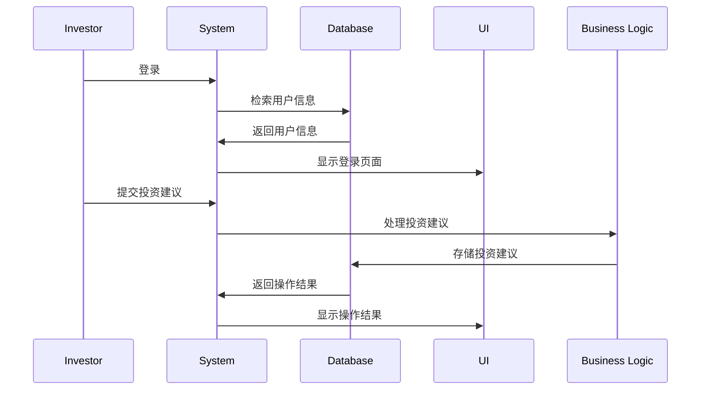
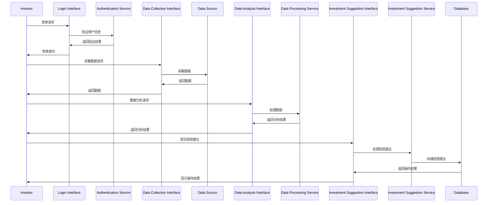
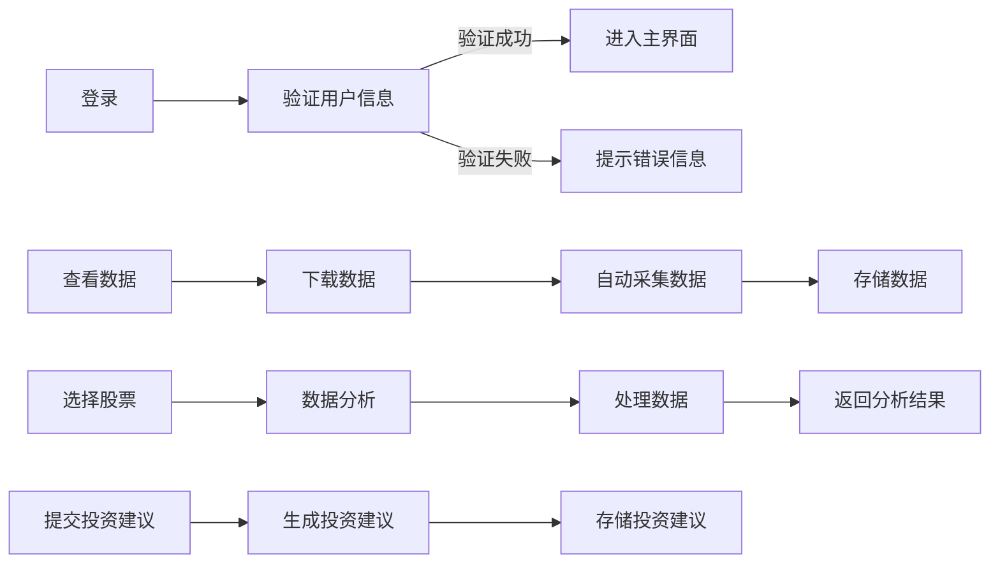

                 

### 第一部分：背景介绍

#### 第1章：格雷厄姆的净净股票策略概述

##### 1.1 问题背景

股票投资作为一种重要的资产配置方式，在个人财富管理中占据着重要地位。然而，股票市场的波动性大，投资风险高，投资者常常面临难以抉择的困境。在这种情况下，寻找一种有效的投资策略来规避风险、实现收益成为众多投资者追求的目标。

本篇文章将介绍格雷厄姆的净净股票策略，该策略被誉为价值投资的典范，是众多投资者和研究者关注和研究的对象。通过本篇文章，我们将对格雷厄姆的净净股票策略有一个全面而深入的了解。

##### 1.1.1 股票投资的重要性

股票投资，指的是投资者通过购买公司股票，成为公司股东，从而享有公司成长的收益。股票投资的重要性主要体现在以下几个方面：

1. **财富增值**：股票投资是个人财富增值的重要途径之一。通过购买优质公司的股票，投资者可以分享公司的盈利增长，从而实现财富的增值。

2. **资产配置**：股票投资是实现资产配置的重要手段。合理的资产配置可以帮助投资者分散风险，降低投资组合的整体波动性。

3. **经济参与**：股票投资是投资者参与经济发展的方式之一。通过投资股票，投资者不仅能够获得经济收益，还能对公司治理、行业发展等方面产生积极影响。

##### 1.1.1.1 股票投资的基本概念

股票，是指公司为了筹集资金而发行的证券。股票持有人即股东，享有公司分红和资本增值的权利。

股票市场，是指股票交易的场所，包括证券交易所和场外交易市场。股票交易通过买卖双方达成价格，实现股票的流通。

##### 1.1.1.2 股票投资的目标和意义

股票投资的目标主要包括：

1. **获取收益**：通过股票投资，投资者希望能够获得资本增值和分红收益。

2. **分散风险**：通过投资多种股票，投资者可以分散单一股票的风险，降低整体投资组合的风险。

3. **实现财富增值**：长期持有优质股票，投资者可以分享公司的成长，实现财富的增值。

股票投资的意义在于：

1. **促进经济发展**：股票市场为企业提供了直接融资的渠道，促进了企业的快速发展。

2. **提高社会资源配置效率**：通过股票市场，资金可以更加有效地流向优质企业，提高了社会资源的配置效率。

3. **增强投资者信心**：股票市场的稳定发展能够增强投资者的信心，吸引更多的社会资本投入。

##### 1.1.2 格雷厄姆的净净股票策略简介

本章节将介绍格雷厄姆的净净股票策略，该策略是价值投资的重要方法之一。格雷厄姆（Benjamin Graham），被誉为“现代投资组合理论之父”，他的投资哲学和方法对后世产生了深远的影响。

###### 1.1.2.1 格雷厄姆的生平与贡献

本杰明·格雷厄姆（Benjamin Graham，1894-1976）是一位著名的美国投资理论家，被公认为价值投资理论的奠基人。他生于伦敦，成长于纽约，在哈佛大学获得了文学和法学学位。格雷厄姆在投资领域的职业生涯始于证券分析，他在1934年出版了经典著作《证券分析》，随后在1949年发表了《聪明的投资者》，这两本书对价值投资理论的形成和发展产生了重要影响。

格雷厄姆的主要贡献包括：

1. **价值投资理论**：格雷厄姆提出了“价值投资”这一概念，强调投资者应该通过研究公司的基本面，寻找价格低于其内在价值的股票。

2. **安全边际**：格雷厄姆提出了“安全边际”的概念，即投资者在购买股票时应该以显著低于公司内在价值的价格进行投资，以确保投资的安全。

3. **投资者教育**：格雷厄姆在投资教育方面做出了巨大贡献，他的方法培养了一大批成功的投资者，其中包括著名的投资者沃伦·巴菲特。

###### 1.1.2.2 净净股票策略的基本概念

格雷厄姆的净净股票策略，也称为净净价值法（Net-Net Value Method），是一种通过购买公司净资产显著低于负债的股票来获取投资回报的方法。该方法的核心在于寻找那些账面价值远高于市场价值的股票，即“净净股票”。

净净股票策略的基本概念包括：

1. **净资产**：净资产是指公司的总资产减去总负债后的余额。在格雷厄姆的净净股票策略中，净资产被视为公司真实价值的反映。

2. **净净价值**：净净价值是指股票的市场价格低于其净资产的部分。投资者通过购买净净价值股票，可以获得潜在的投资回报。

3. **安全边际**：格雷厄姆强调在购买净净价值股票时，应该给予足够的安全边际，即股票价格应该显著低于其净资产。

##### 1.1.2.3 格雷厄姆的净净股票策略在寻找低估股票中的应用

格雷厄姆的净净股票策略在寻找低估股票中的应用，主要通过以下几个步骤进行：

1. **财务报表分析**：投资者需要分析公司的财务报表，计算公司的净资产和负债，确定公司的净净价值。

2. **股票筛选**：投资者通过筛选，找出净净价值高于市场价格的公司股票。

3. **安全边际评估**：投资者需要评估股票的安全边际，以确保投资的安全。

4. **投资决策**：当发现净净价值显著高于市场价格且安全边际足够时，投资者可以做出投资决策，购买低估的股票。

通过以上步骤，投资者可以运用格雷厄姆的净净股票策略，寻找和投资极度低估的公司，实现投资收益的最大化。

##### 1.1.3 问题描述

尽管格雷厄姆的净净股票策略在理论上是有效的，但在实际应用中，投资者仍会面临诸多挑战和问题。

###### 1.1.3.1 股票市场的不确定性和风险

股票市场具有高度的不确定性，投资者在投资过程中可能会面临多种风险，包括：

1. **市场波动风险**：股票市场价格的波动性较大，投资者可能会面临资产价值波动的风险。

2. **公司业绩风险**：公司的业绩波动会影响股票的价格，投资者需要关注公司的盈利能力和财务状况。

3. **宏观经济风险**：宏观经济环境的变化，如利率、通货膨胀等，也会对股票市场产生影响。

###### 1.1.3.2 股票投资中的风险类型

在股票投资中，常见的风险类型包括：

1. **系统风险**：指整个市场或特定行业面临的风险，如金融危机、政策变化等。

2. **非系统风险**：指特定公司面临的风险，如管理问题、市场定位等。

3. **流动性风险**：指投资者无法在合理时间内以合理价格买卖股票的风险。

###### 1.1.3.3 寻找极度低估的公司

投资者在寻找极度低估的公司时，可能会面临以下问题：

1. **信息不对称**：投资者可能无法获取所有关于公司的真实信息，导致投资决策的不准确。

2. **市场情绪的影响**：市场情绪的波动会影响股票的价格，投资者需要理性分析，避免盲目跟风。

3. **投资时间的长短**：格雷厄姆的净净股票策略通常需要较长的投资时间来验证股票的价值，投资者需要具备足够的耐心。

##### 1.1.3.4 格雷厄姆的净净股票策略在寻找低估股票中的应用

尽管面临诸多挑战，格雷厄姆的净净股票策略在寻找低估股票中仍然具有一定的指导意义。通过以下几个步骤，投资者可以更好地应用该策略：

1. **深入分析财务报表**：投资者需要仔细分析公司的财务报表，计算公司的净资产和负债，确定公司的净净价值。

2. **市场比较分析**：投资者需要将公司的净净价值与市场上其他类似公司的股票进行比较，以评估其是否被低估。

3. **安全边际评估**：投资者需要评估股票的安全边际，确保投资的风险可控。

4. **长期投资策略**：投资者应采用长期投资策略，等待市场认识股票的价值，从而获得投资回报。

##### 1.1.4 问题解决

为了解决股票市场的不确定性和风险，以及寻找极度低估的公司的难题，我们可以从以下几个方面入手：

###### 1.1.4.1 格雷厄姆的净净股票策略的核心原理

格雷厄姆的净净股票策略的核心原理包括：

1. **价值投资**：投资者应该寻找价格低于其内在价值的股票，即低估股票。

2. **安全边际**：投资者在购买股票时，应该给予足够的安全边际，以确保投资的安全。

3. **长期投资**：投资者应采用长期投资策略，等待市场认识股票的价值，从而获得投资回报。

###### 1.1.4.2 净净资产的含义

净资产，是指公司的总资产减去总负债后的余额，是公司真实价值的反映。在格雷厄姆的净净股票策略中，净资产被视为评估股票价值的重要指标。

###### 1.1.4.3 净净资产的计算方法

净净资产的计算公式为：

\[ \text{净净资产} = \text{总资产} - \text{总负债} \]

投资者可以通过计算公司的净净资产，评估公司的真实价值。

###### 1.1.4.4 净净资产的评估标准

在评估净净资产时，投资者应关注以下几个标准：

1. **净资产与市值比率**：该比率越低，说明股票可能被低估。

2. **净资产收益率（ROE）**：该指标越高，说明公司利用股东权益创造利润的能力越强。

3. **负债比率**：该比率越低，说明公司财务状况越稳定。

通过以上评估标准，投资者可以更好地判断股票是否被低估。

###### 1.1.4.5 格雷厄姆的净净股票策略的实践方法

格雷厄姆的净净股票策略的实践方法包括以下几个步骤：

1. **筛选潜在目标股票**：投资者需要通过财务报表分析，找出净资产显著低于负债的公司。

2. **深入分析目标股票**：投资者需要对目标股票进行深入分析，评估其财务状况、行业前景等。

3. **制定投资策略**：投资者需要根据目标股票的评估结果，制定合适的投资策略，包括投资时间、投资金额等。

4. **跟踪与调整**：投资者需要定期跟踪目标股票的表现，根据市场变化和公司状况，及时调整投资策略。

##### 1.1.5 边界与外延

尽管格雷厄姆的净净股票策略在理论上是有效的，但在实际应用中，投资者需要考虑以下几个边界与外延因素：

###### 1.1.5.1 格雷厄姆的净净股票策略的适用范围

格雷厄姆的净净股票策略主要适用于以下情况：

1. **市场情绪低迷**：在市场情绪低迷时，股票价格可能会偏离其真实价值，投资者更容易找到被低估的股票。

2. **行业调整期**：在行业调整期，部分公司可能会受到市场环境的影响，导致股票价格低于其内在价值。

3. **公司业绩不稳定**：业绩不稳定的公司可能会受到市场怀疑，导致股票价格低估。

###### 1.1.5.2 理解市场情绪和投资环境的重要性

投资者需要关注市场情绪和投资环境的变化，以便更好地把握投资机会。市场情绪和投资环境的变化会影响股票的价格和投资者的行为。

###### 1.1.5.3 适应不同市场条件下的投资策略调整

投资者应根据不同的市场条件，调整投资策略。在市场情绪高涨时，可以适当增加高风险股票的配置；在市场情绪低迷时，可以适当增加低风险股票的配置。

##### 1.1.6 格雷厄姆的净净股票策略与其他投资策略的比较

格雷厄姆的净净股票策略与其他投资策略（如成长投资、价值投资等）存在一定差异，主要体现在以下几个方面：

1. **投资目标**：成长投资追求公司的高速增长，价值投资追求公司价值的低估，而净净股票策略则强调股票价格低于其净资产。

2. **投资标准**：成长投资更注重公司的未来潜力，价值投资更注重公司的当前估值，而净净股票策略则更关注股票的价格与净净资产之间的差异。

3. **投资时间**：成长投资通常需要较长的投资时间来验证公司的成长潜力，价值投资和净净股票策略则更注重短期投资机会。

通过以上比较，投资者可以根据自己的投资目标和风险承受能力，选择适合自己的投资策略。

##### 1.1.7 股票投资的核心概念

股票投资的核心概念包括：

1. **股票价格**：股票的价格受市场供求关系、公司业绩、市场预期等多种因素影响。

2. **内在价值**：股票的内在价值是指股票的真实价值，通常通过财务分析等方法进行评估。

3. **投资策略**：投资策略是指投资者为了实现投资目标而采用的方法和手段。

4. **风险与收益**：股票投资具有风险和收益并存的特点，投资者需要在风险和收益之间进行权衡。

##### 1.1.8 格雷厄姆的净净股票策略的关键要素

格雷厄姆的净净股票策略的关键要素包括：

1. **净资产**：净资产是评估股票价值的重要指标。

2. **净净价值**：净净价值是股票价格与净资产之间的差额，用于判断股票是否被低估。

3. **安全边际**：安全边际是投资者在购买股票时给予的额外保障，确保投资的安全。

4. **投资时间**：投资时间是指投资者持有股票的时间，通常需要较长的时间来验证股票的价值。

通过以上关键要素，投资者可以更好地理解和应用格雷厄姆的净净股票策略。

### 总结

在本章节中，我们介绍了格雷厄姆的净净股票策略，包括其背景、重要性、基本概念以及在实际应用中的挑战和解决方案。通过了解格雷厄姆的净净股票策略，投资者可以更好地把握股票投资的机会，实现财富的增值。在接下来的章节中，我们将深入探讨净净股票策略的核心概念和原理，帮助读者更加系统地掌握这一投资策略。

### 第二部分：核心概念与联系

#### 第2章：核心概念原理

在本章节中，我们将详细探讨格雷厄姆的净净股票策略中的核心概念原理，包括净净资产的含义、计算方法和属性特征。通过这些核心概念的深入理解，投资者可以更好地应用这一策略，识别和抓住市场中的低估股票。

##### 2.1 净净资产的概念

净净资产，是公司财务报表中的一项关键指标，它反映了公司的实际资产价值。在格雷厄姆的净净股票策略中，净净资产被视为评估股票价值的重要依据。理解净净资产的概念，首先需要明确以下几个基本点：

###### 2.1.1 净净资产的定义

净净资产，又称净资产或所有者权益，是指公司的总资产减去总负债后的余额。具体来说，净净资产的计算公式如下：

\[ \text{净净资产} = \text{总资产} - \text{总负债} \]

总资产包括公司拥有的所有资产，如现金、存货、设备等；总负债则包括公司所承担的所有债务，如短期借款、长期负债等。

###### 2.1.2 净净资产的计算公式

净净资产的计算过程相对简单，主要涉及以下几个步骤：

1. **收集财务报表**：投资者需要获取公司的财务报表，主要包括资产负债表、利润表和现金流量表。

2. **确定总资产和总负债**：在资产负债表中，总资产和总负债的数据通常在报表的左侧和右侧分别列出。

3. **计算净净资产**：将总资产减去总负债，即可得到公司的净净资产。

\[ \text{净净资产} = \text{总资产} - \text{总负债} \]

通过以上步骤，投资者可以计算出公司的净净资产，从而评估公司的实际资产价值。

###### 2.1.3 净净资产的属性特征

净净资产具有以下几个显著的属性特征：

1. **反映公司真实价值**：净净资产是公司总资产减去总负债后的余额，能够较为准确地反映公司的实际资产价值。

2. **衡量公司财务状况**：净净资产是评估公司财务状况的重要指标，较高的净净资产表明公司具有较强的资产实力和偿债能力，而较低的净净资产则可能表明公司财务状况不佳。

3. **影响股票价格**：净净资产与股票价格之间存在一定的关联。在格雷厄姆的净净股票策略中，投资者通过比较股票价格与净净资产，来判断股票是否被低估。

##### 2.2 股票投资的基本概念

股票投资是个人或机构通过购买公司股票，成为公司股东，从而享有公司成长的收益。为了更好地理解格雷厄姆的净净股票策略，我们需要了解股票投资的基本概念。

###### 2.2.1 股票的定义与分类

股票是指公司为了筹集资金而发行的证券，持有人即股东，享有公司分红和资本增值的权利。股票可以分为以下几类：

1. **普通股票**：普通股票是最常见的股票类型，股东享有公司分红和资本增值的权利。

2. **优先股票**：优先股票在分红和清算时享有优先权，但其通常不具有投票权。

3. **流通股和非流通股**：流通股可以在二级市场上自由买卖，而非流通股则通常不能自由买卖。

###### 2.2.2 股票投资的目标与策略

股票投资的目标主要包括以下几个方面：

1. **获取资本增值**：通过购买股票，投资者可以分享公司的成长，实现资本增值。

2. **获得分红收益**：持有股票的投资者可以获得公司分红，分红收益通常较为稳定。

3. **分散风险**：通过投资多种股票，投资者可以分散单一股票的风险，降低整体投资组合的风险。

股票投资的主要策略包括以下几种：

1. **价值投资**：通过分析公司的基本面，寻找价格低于其内在价值的股票。

2. **成长投资**：关注公司的成长潜力，选择具有高速增长前景的公司。

3. **投机性投资**：通过短期交易，利用市场波动获取收益。

在格雷厄姆的净净股票策略中，投资者主要关注价值投资策略，通过比较股票价格与净净资产，寻找被低估的股票。

##### 2.3 净净资产的属性特征

为了更深入地理解净净资产的属性特征，我们可以通过以下表格进行对比分析：

| 属性特征       | 描述                                                         |
| -------------- | ------------------------------------------------------------ |
| **净资产**     | 净资产是指公司的总资产减去总负债后的余额，是公司实际资产价值的反映。 |
| **股票价格**   | 股票价格是股票在市场上的交易价格，通常受市场供求关系、公司业绩等因素影响。 |
| **市场估值**   | 市场估值是指股票的市场价格与净净资产之间的比值，用于衡量股票是否被高估或低估。 |
| **安全边际**   | 安全边际是指股票价格低于净净资产的部分，用于保障投资者投资的安全。 |

通过以上对比分析，我们可以看出净净资产在股票投资中的重要性。净净资产不仅是评估公司实际资产价值的指标，也是判断股票是否被低估的关键依据。

##### 2.4 股票投资的核心概念

股票投资的核心概念包括股票价值与价格、投资者心理与市场行为等。以下是这些核心概念的具体描述：

###### 2.4.1 股票的价值与价格

1. **股票价值**：股票价值是指股票的实际价值，通常通过财务分析等方法进行评估。股票价值受公司业绩、行业前景、宏观经济环境等多种因素影响。

2. **股票价格**：股票价格是指股票在市场上的交易价格，通常受市场供求关系、投资者情绪、公司业绩等因素影响。股票价格可能高于、低于或等于股票价值。

3. **市场估值**：市场估值是指股票市场价格与股票价值之间的比值，用于衡量股票是否被高估或低估。

###### 2.4.2 投资者心理与市场行为

1. **投资者心理**：投资者心理是指投资者在投资决策过程中所表现出的心态和情绪，包括贪婪、恐惧、盲目跟风等。

2. **市场行为**：市场行为是指投资者在股票市场上的交易行为，包括买入、卖出、持有等。市场行为受到投资者心理、市场供求关系、政策环境等多种因素影响。

通过以上核心概念的描述，我们可以看出股票投资中的复杂性和不确定性。投资者需要全面了解这些核心概念，才能做出更为合理和科学的投资决策。

##### 2.5 格雷厄姆的净净股票策略的关键要素

在格雷厄姆的净净股票策略中，关键要素包括净资产、净净价值、安全边际等。以下是这些关键要素的具体描述：

###### 2.5.1 净净资产的评估方法

1. **净资产**：净资产是指公司的总资产减去总负债后的余额，是公司实际资产价值的反映。

2. **净净资产**：净净资产是评估股票价值的重要指标，通过计算公司的净资产和负债，可以得出公司的净净资产。

3. **净净价值**：净净价值是股票价格与净净资产之间的差额，用于判断股票是否被低估。

###### 2.5.2 目标股票的筛选与分析

1. **目标股票的筛选**：投资者需要通过财务报表分析，找出净资产显著低于负债的公司，作为潜在的目标股票。

2. **目标股票的分析**：投资者需要对目标股票进行深入分析，评估其财务状况、行业前景、市场地位等，以确定其是否被低估。

3. **安全边际的评估**：投资者需要评估目标股票的安全边际，确保投资的风险可控。

通过以上关键要素的描述，我们可以看出格雷厄姆的净净股票策略的核心在于通过评估净资产和净净价值，寻找被低估的股票，并给予足够的安全边际，以确保投资的安全。

### 总结

在本章节中，我们详细探讨了格雷厄姆的净净股票策略中的核心概念原理，包括净净资产的概念、计算方法和属性特征，以及股票投资的基本概念和关键要素。通过这些核心概念的深入理解，投资者可以更好地应用格雷厄姆的净净股票策略，识别和抓住市场中的低估股票。在接下来的章节中，我们将进一步探讨股票价值评估的数学模型，帮助投资者更准确地评估股票的价值。

### 第三部分：算法原理讲解

#### 第3章：算法原理与数学模型

在本章节中，我们将深入探讨格雷厄姆的净净股票策略背后的算法原理和数学模型。通过理解这些原理和模型，投资者可以更准确地评估股票的价值，并据此制定投资策略。

##### 3.1 股票价值评估的数学模型

股票价值评估是股票投资中的关键环节。在格雷厄姆的净净股票策略中，股票价值评估主要依赖于净净资产这一指标。以下是股票价值评估的基本数学模型：

###### 3.1.1 股票内在价值的计算方法

股票的内在价值，又称股票的真实价值，是股票实际应该反映的价格。在格雷厄姆的净净股票策略中，股票的内在价值通常通过以下方法进行计算：

1. **净资产法**：净资产法是一种常用的股票价值评估方法。具体计算步骤如下：
   - 收集公司的财务报表，确定公司的总资产和总负债。
   - 计算公司的净净资产：\[ \text{净净资产} = \text{总资产} - \text{总负债} \]
   - 确定股票的市场价格。
   - 计算股票的内在价值：\[ \text{内在价值} = \text{净净资产} \]

2. **股息折现法**：股息折现法是一种基于公司未来股息现金流量的评估方法。具体计算步骤如下：
   - 预测公司的未来股息。
   - 确定适当的折现率，通常为市场利率或公司特有风险调整后的贴现率。
   - 计算股票的内在价值：\[ \text{内在价值} = \text{未来股息} / \text{折现率} \]

3. **经济增加值法**：经济增加值法是一种基于公司经济利润的评估方法。具体计算步骤如下：
   - 计算公司的经济增加值：\[ \text{经济增加值} = \text{公司净利润} - \text{资本成本} \]
   - 计算股票的内在价值：\[ \text{内在价值} = \text{经济增加值} \]

通过以上方法，投资者可以计算股票的内在价值，并与市场价格进行比较，判断股票是否被低估。

###### 3.1.2 净净资产法的优缺点

净净资产法是格雷厄姆净净股票策略的核心方法，其优点和缺点如下：

1. **优点**：
   - **简便易行**：净净资产法的计算相对简单，投资者可以通过财务报表轻松获取所需数据。
   - **可靠性较高**：净资产是公司实际资产价值的反映，具有较强的可靠性。
   - **适用于低估股票**：净净资产法有助于投资者识别被低估的股票，从而获得投资机会。

2. **缺点**：
   - **不完全反映公司价值**：净净资产法仅考虑公司的净资产，未考虑公司的盈利能力、成长潜力等因素，可能导致股票价值的低估或高估。
   - **受市场波动影响**：股票市场价格受多种因素影响，可能导致净净资产法的评估结果与实际股票价值存在较大差异。

###### 3.1.3 股票价格的波动模型

股票价格的波动是股票投资中的常见现象。以下是两种常见的股票价格波动模型：

1. **随机游走模型**：随机游走模型认为股票价格的变化是随机且不可预测的。根据该模型，股票价格的变化符合正态分布，股票价格在未来某一时刻的价格无法准确预测。

2. **有效市场假说模型**：有效市场假说模型认为股票价格已经反映了所有已知信息，股票价格的变化是合理的。根据该模型，投资者通过分析历史数据和公开信息，无法获得超过市场平均水平的收益。

通过以上模型，投资者可以更好地理解股票价格的波动特性，从而制定更为合理的投资策略。

##### 3.2 格雷厄姆的净净股票策略的算法流程

格雷厄姆的净净股票策略的算法流程主要包括以下几个步骤：

###### 3.2.1 筛选潜在目标股票的算法流程

1. **收集数据**：从财务报表、市场数据等渠道收集公司的财务数据、市场数据等信息。

2. **数据清洗**：对收集的数据进行清洗和整理，确保数据的准确性和完整性。

3. **计算净净资产**：根据公司的财务数据，计算公司的净净资产。

4. **筛选股票**：根据设定的标准，筛选出净净资产显著低于股票价格的股票。

5. **分析股票**：对筛选出的股票进行深入分析，包括公司的盈利能力、成长潜力、行业地位等。

6. **确定目标股票**：根据分析结果，确定具有投资价值的潜在目标股票。

###### 3.2.2 对目标股票进行深入分析的算法流程

1. **数据收集**：从财务报表、行业报告、市场数据等渠道收集目标股票的相关数据。

2. **财务分析**：对目标股票的财务报表进行深入分析，包括盈利能力、偿债能力、运营能力等。

3. **行业分析**：分析目标股票所处的行业环境，包括行业趋势、竞争格局、政策环境等。

4. **估值分析**：根据目标股票的财务和行业分析结果，对其进行估值分析，确定其内在价值。

5. **投资决策**：根据估值结果和投资策略，做出投资决策。

通过以上算法流程，投资者可以系统地筛选和评估潜在的目标股票，从而实现投资收益的最大化。

##### 3.3 数据收集与分析

数据收集与分析是格雷厄姆的净净股票策略的重要组成部分。以下是数据收集与分析的具体步骤：

###### 3.3.1 数据收集

1. **财务报表**：收集目标公司的财务报表，包括资产负债表、利润表和现金流量表。

2. **市场数据**：收集股票的市场数据，包括股票价格、成交量、市盈率等。

3. **行业数据**：收集目标股票所在行业的市场数据，包括行业趋势、竞争格局、政策环境等。

4. **外部数据**：收集与目标公司相关的宏观经济数据、政策法规等。

###### 3.3.2 数据分析

1. **财务分析**：对目标公司的财务报表进行深入分析，包括盈利能力、偿债能力、运营能力等。

2. **行业分析**：分析目标股票所在行业的发展趋势、竞争格局、政策环境等。

3. **估值分析**：根据财务和行业分析结果，对目标股票进行估值分析，确定其内在价值。

4. **风险分析**：分析目标股票面临的市场风险、行业风险、公司风险等。

通过以上数据收集与分析步骤，投资者可以全面了解目标公司的财务状况、行业前景和估值水平，从而做出更为科学的投资决策。

##### 3.4 股票价值评估的计算

股票价值评估是股票投资的核心环节。在格雷厄姆的净净股票策略中，股票价值评估主要依赖于净净资产这一指标。以下是股票价值评估的具体计算步骤：

###### 3.4.1 计算净净资产

1. **收集财务报表**：收集目标公司的财务报表，包括资产负债表、利润表和现金流量表。

2. **确定总资产和总负债**：在资产负债表中，确定公司的总资产和总负债。

3. **计算净净资产**：根据总资产和总负债，计算公司的净净资产：\[ \text{净净资产} = \text{总资产} - \text{总负债} \]

###### 3.4.2 计算股票价格

1. **收集市场数据**：收集目标股票的市场数据，包括股票价格、成交量、市盈率等。

2. **确定股票价格**：根据市场数据，确定目标股票的价格。

###### 3.4.3 计算股票价值

1. **计算股票价值**：根据净净资产和股票价格，计算股票的内在价值：\[ \text{股票价值} = \text{净净资产} - \text{股票价格} \]

通过以上计算步骤，投资者可以得出目标股票的内在价值，并与市场价格进行比较，判断股票是否被低估。

##### 3.5 代码实现与举例说明

为了更好地理解股票价值评估的计算过程，我们将使用Python代码实现相关计算，并进行举例说明。

###### 3.5.1 代码实现

以下是一个简单的Python代码实现，用于计算股票的内在价值和评估是否被低估：

```python
def calculate_intrinsic_value(net_assets, stock_price):
    intrinsic_value = net_assets - stock_price
    return intrinsic_value

# 示例数据
net_assets = 1000000  # 净净资产为1000万元
stock_price = 800000  # 股票价格为800万元

# 计算股票内在价值
intrinsic_value = calculate_intrinsic_value(net_assets, stock_price)
print(f"股票内在价值：{intrinsic_value}万元")

# 判断是否被低估
if intrinsic_value > stock_price:
    print("股票被低估，可以买入。")
else:
    print("股票未被低估，不建议买入。")
```

运行以上代码，得到股票内在价值为200万元，与股票价格进行比较后，可以判断股票是否被低估。

###### 3.5.2 举例说明

假设有一家公司的净净资产为1亿元，股票价格为8000万元。使用上述Python代码计算股票内在价值：

```python
net_assets = 100000000  # 净净资产为1亿元
stock_price = 80000000  # 股票价格为8000万元

# 计算股票内在价值
intrinsic_value = calculate_intrinsic_value(net_assets, stock_price)
print(f"股票内在价值：{intrinsic_value}万元")

# 判断是否被低估
if intrinsic_value > stock_price:
    print("股票被低估，可以买入。")
else:
    print("股票未被低估，不建议买入。")
```

运行以上代码，得到股票内在价值为2000万元。由于股票内在价值高于股票价格，因此可以判断股票被低估，建议买入。

通过以上代码实现和举例说明，投资者可以更加直观地理解股票价值评估的计算过程，并据此制定投资策略。

### 总结

在本章节中，我们详细探讨了格雷厄姆的净净股票策略背后的算法原理和数学模型，包括股票价值评估的数学模型、算法流程以及数据收集与分析方法。通过理解这些原理和模型，投资者可以更加准确地评估股票的价值，并据此制定投资策略。在接下来的章节中，我们将进一步探讨系统分析与架构设计，帮助投资者更好地理解和应用格雷厄姆的净净股票策略。

### 第四部分：系统分析与架构设计

#### 第4章：系统功能设计

在本章节中，我们将对股票投资决策系统进行系统分析与架构设计，以实现格雷厄姆的净净股票策略。系统功能设计是整个系统实现的基础，我们将从问题场景介绍、项目介绍、系统功能设计等方面进行详细阐述。

##### 4.1 问题场景介绍

股票投资决策系统的核心目标是帮助投资者在复杂的市场环境中做出正确的投资决策，尤其是运用格雷厄姆的净净股票策略寻找被低估的股票。在实际操作中，投资者面临以下几个主要问题：

1. **信息不对称**：投资者难以获取全面和准确的公司财务数据和市场信息，导致投资决策的准确性降低。

2. **数据处理能力不足**：随着数据的增加，投资者需要高效的数据处理能力来分析大量的财务数据和市场数据。

3. **缺乏系统化的投资策略**：许多投资者缺乏系统化的投资策略，导致投资决策随意性大，难以实现长期稳定的投资收益。

4. **缺乏风险控制机制**：投资者在追求收益的同时，往往忽视了风险控制，导致投资风险增大。

为了解决上述问题，我们需要设计一个高效的股票投资决策系统，该系统能够自动收集、处理和分析数据，提供系统化的投资策略，并具备有效的风险控制机制。

##### 4.2 项目介绍

股票投资决策项目旨在构建一个基于格雷厄姆净净股票策略的智能化投资决策系统，其主要目标和功能如下：

1. **数据采集**：系统将自动采集公司财务报表、市场数据、行业数据等相关信息。

2. **数据处理**：系统将对采集到的数据进行分析和处理，提取关键指标，如净资产、净净资产、市盈率等。

3. **策略制定**：系统将根据提取的关键指标，运用格雷厄姆的净净股票策略，筛选出被低估的股票。

4. **风险控制**：系统将评估每只股票的风险，提供风险评级，帮助投资者进行风险控制。

5. **投资决策**：系统将根据筛选结果和风险评级，提供投资建议，辅助投资者做出投资决策。

6. **实时监控**：系统将实时监控股票市场动态，及时更新投资建议，确保投资决策的时效性。

通过以上功能，股票投资决策项目将帮助投资者在复杂的市场环境中，运用格雷厄姆的净净股票策略，实现稳健的投资收益。

##### 4.3 系统功能设计

股票投资决策系统的功能设计包括领域模型设计、系统架构设计、系统接口设计和系统交互设计。以下是对每个部分的详细描述：

###### 4.3.1 领域模型设计

领域模型是系统功能设计的核心，它定义了系统中的主要实体及其关系。以下是股票投资决策系统的领域模型设计：

1. **公司**：公司是系统的核心实体，包括公司名称、股票代码、行业等信息。

2. **财务报表**：财务报表包括资产负债表、利润表和现金流量表，用于记录公司的财务状况。

3. **股票**：股票是公司发行的证券，包括股票代码、名称、当前价格等信息。

4. **投资者**：投资者是使用系统的用户，包括用户名、密码、投资额度等信息。

5. **投资建议**：投资建议是根据分析结果提供的投资建议，包括股票代码、名称、建议买入价格、风险评级等信息。

6. **市场数据**：市场数据包括股票价格、成交量、市盈率等指标，用于评估股票的市场表现。

以下是领域模型的类图表示：

```mermaid
classDiagram
    Company <<Entity>>
    FinancialStatement <<Entity>>
    Stock <<Entity>>
    Investor <<Entity>>
    InvestmentSuggestion <<Entity>>
    MarketData <<Entity>>

    Company {
        -name
        -stockCode
        -industry
    }
    FinancialStatement {
        -date
        -balanceSheet
        -incomeStatement
        -cashFlowStatement
    }
    Stock {
        -code
        -name
        -currentPrice
    }
    Investor {
        -username
        -password
        -investmentAmount
    }
    InvestmentSuggestion {
        -stockCode
        -stockName
        -buyPrice
        -riskRating
    }
    MarketData {
        -stockCode
        -price
        -volume
        -peRatio
    }

    Company <|-- FinancialStatement
    Company <|-- Stock
    Company <|-- Investor
    Company <|-- InvestmentSuggestion
    Company <|-- MarketData
```

###### 4.3.2 系统架构设计

系统架构设计是确保系统稳定、高效运行的关键。以下是股票投资决策系统的架构设计：

1. **数据层**：数据层负责数据的存储和读取，包括数据库、数据缓存等。

2. **业务逻辑层**：业务逻辑层负责处理系统的核心业务，包括数据采集、数据清洗、数据分析、投资策略制定等。

3. **表示层**：表示层负责与用户交互，包括前端界面和API接口。

4. **基础设施层**：基础设施层提供系统的运行环境，包括服务器、网络、安全等。

以下是系统架构的示意图：



###### 4.3.3 系统接口设计

系统接口设计是确保系统与其他系统或组件之间能够有效交互的关键。以下是股票投资决策系统的主要接口设计：

1. **用户登录接口**：用户登录接口用于处理用户的登录请求，包括用户名和密码验证等。

2. **数据采集接口**：数据采集接口用于从外部系统或API中采集公司财务报表、市场数据等。

3. **数据分析接口**：数据分析接口用于处理数据清洗、数据分析等操作，返回分析结果。

4. **投资建议接口**：投资建议接口用于提交和获取投资建议，包括股票代码、名称、建议买入价格、风险评级等。

以下是系统接口的序列图表示：



###### 4.3.4 系统交互设计

系统交互设计是确保系统用户界面友好、用户体验良好的关键。以下是股票投资决策系统的交互设计：

1. **用户登录**：用户通过输入用户名和密码登录系统，系统验证用户信息后，用户可以进入系统主界面。

2. **数据采集**：用户可以查看和下载公司财务报表、市场数据等，系统会自动采集并存储相关数据。

3. **数据分析**：用户可以选择特定的股票进行数据分析，系统会处理数据并返回分析结果，包括股票的净资产、市盈率、风险评级等。

4. **投资建议**：用户可以根据分析结果提交投资建议，系统会生成投资建议并存储在数据库中。

以下是系统交互的流程图表示：



通过以上系统功能设计，股票投资决策系统能够高效、准确地帮助投资者运用格雷厄姆的净净股票策略，实现投资收益的最大化。

### 总结

在本章节中，我们详细介绍了股票投资决策系统的系统功能设计，包括问题场景介绍、项目介绍、领域模型设计、系统架构设计、系统接口设计和系统交互设计。通过这些设计，系统能够高效、准确地帮助投资者运用格雷厄姆的净净股票策略，实现投资收益的最大化。在接下来的章节中，我们将进一步探讨系统的实现细节和实际应用，帮助投资者更好地理解和应用这一策略。

### 第五部分：项目实战

#### 第5章：环境安装、系统核心实现、代码应用解读与分析、实际案例分析和详细讲解剖析、项目小结

在本章节中，我们将通过具体的实战案例，详细介绍如何搭建和运行股票投资决策系统，并深入解析系统的核心实现和代码应用。此外，我们还将分享一些最佳实践和注意事项，以便投资者在实际应用中更好地运用格雷厄姆的净净股票策略。

##### 5.1 环境安装

要搭建股票投资决策系统，首先需要安装和配置必要的软件和工具。以下是在Windows操作系统上安装环境所需的步骤：

1. **安装Python环境**：
   - 访问Python官方网站（[https://www.python.org/](https://www.python.org/)）下载Python安装包。
   - 运行安装程序，按照默认设置完成安装。

2. **安装Python库**：
   - 打开命令提示符或终端。
   - 使用pip命令安装必要的Python库，如requests、numpy、pandas等：
     ```shell
     pip install requests numpy pandas
     ```

3. **安装数据库**：
   - 选择合适的数据库系统，如MySQL、PostgreSQL等。
   - 下载并安装数据库软件，并创建所需的数据库和表。

4. **配置数据库连接**：
   - 在Python代码中配置数据库连接信息，以便后续操作使用。

##### 5.2 系统核心实现

股票投资决策系统的核心实现主要包括数据采集、数据处理、数据分析、投资建议生成等功能。以下是系统的核心代码示例：

```python
# 导入所需的库
import requests
import pandas as pd
from sqlalchemy import create_engine

# 数据采集
def collect_financial_data(stock_code):
    url = f'https://api.example.com/financial_data/{stock_code}'
    response = requests.get(url)
    data = response.json()
    return data

# 数据处理
def process_financial_data(data):
    # 处理和清洗数据
    df = pd.DataFrame(data)
    df['net_assets'] = df['total_assets'] - df['total_liabilities']
    return df

# 数据分析
def analyze_stock(df):
    # 分析股票数据
    intrinsic_value = df['net_assets'].iloc[-1]
    current_price = df['current_price'].iloc[-1]
    return intrinsic_value, current_price

# 投资建议生成
def generate_investment_suggestion(intrinsic_value, current_price):
    if intrinsic_value > current_price:
        return "买入建议"
    else:
        return "未建议买入"

# 主函数
def main():
    stock_code = '000001'  # 示例股票代码
    data = collect_financial_data(stock_code)
    df = process_financial_data(data)
    intrinsic_value, current_price = analyze_stock(df)
    suggestion = generate_investment_suggestion(intrinsic_value, current_price)
    print(f"股票代码：{stock_code}，投资建议：{suggestion}")

if __name__ == '__main__':
    main()
```

以上代码实现了从数据采集、数据处理到数据分析、投资建议生成的一系列操作。在实际应用中，投资者可以根据具体需求对代码进行调整和优化。

##### 5.3 代码应用解读与分析

以下是对系统核心代码的解读与分析：

1. **数据采集**：通过requests库，从外部API获取公司财务数据。实际应用中，投资者需要替换API地址，并处理API返回的数据格式。

2. **数据处理**：使用pandas库对财务数据进行处理和清洗，计算公司的净净资产。处理过程包括数据格式的转换、缺失值的处理、异常值的检测等。

3. **数据分析**：计算公司的内在价值和当前价格，判断股票是否被低估。实际分析中，投资者可以根据需要添加更多指标，如市盈率、市净率等。

4. **投资建议生成**：根据内在价值和当前价格的比较，生成买入或未买入的投资建议。投资者可以根据实际情况调整投资建议的逻辑。

##### 5.4 实际案例分析和详细讲解剖析

以下是一个实际案例，通过具体数据来分析和讲解如何运用格雷厄姆的净净股票策略：

**案例数据**：

| 财务指标       | 数据值   |
| -------------- | -------- |
| 总资产         | 100亿元  |
| 总负债         | 60亿元   |
| 当前股价       | 10元/股  |

**步骤**：

1. **计算净净资产**：总资产 - 总负债 = 100亿元 - 60亿元 = 40亿元。

2. **计算每股净净资产**：净净资产 / 总股本 = 40亿元 / 1亿股 = 4元/股。

3. **比较当前股价与每股净净资产**：当前股价10元/股 > 每股净净资产4元/股。

4. **投资建议**：根据格雷厄姆的净净股票策略，股票未被低估，建议不买入。

在实际操作中，投资者需要获取更全面和准确的数据，并对多个指标进行综合分析，以做出更为合理的投资决策。

##### 5.5 项目小结

通过本章节的实战案例，我们介绍了如何搭建和运行股票投资决策系统，并深入分析了系统的核心实现和代码应用。以下是对项目的小结：

1. **环境安装**：安装Python环境及相关库，配置数据库。

2. **系统核心实现**：实现数据采集、数据处理、数据分析和投资建议生成等功能。

3. **代码应用解读与分析**：对核心代码进行详细解读，帮助投资者理解系统的运作原理。

4. **实际案例分析和详细讲解剖析**：通过实际案例，展示如何运用格雷厄姆的净净股票策略进行投资决策。

通过本项目的实施，投资者可以更好地理解和应用格雷厄姆的净净股票策略，实现投资收益的最大化。在实际应用中，投资者需要根据市场环境和公司情况，灵活调整投资策略，以达到最佳的投资效果。

### 最佳实践 tips

1. **数据采集与处理**：确保数据的准确性和完整性，对数据源进行定期检查和更新。

2. **风险评估**：在投资决策过程中，不仅要关注股票的估值，还要进行全面的风险评估，包括市场风险、行业风险、公司风险等。

3. **投资组合管理**：合理配置投资组合，避免过度集中于某一行业或股票，降低整体投资风险。

4. **持续学习**：投资市场不断变化，投资者需要持续学习，了解市场动态和新的投资策略。

### 注意事项

1. **遵守法律法规**：在进行股票投资时，必须遵守相关法律法规，不得进行内幕交易、操纵市场等非法行为。

2. **投资风险**：股票投资存在风险，投资者需要充分了解投资风险，合理控制投资额度。

3. **数据隐私**：在数据采集和处理过程中，要注意保护个人和公司的隐私，遵守数据保护法规。

### 拓展阅读

1. **《证券分析》**：本杰明·格雷厄姆的经典著作，详细介绍了价值投资的理论和方法。

2. **《聪明的投资者》**：本杰明·格雷厄姆的另一部重要著作，为投资者提供了实用的投资策略和原则。

3. **《投资最重要的事》**：霍华德·马克斯的重要著作，介绍了投资中的关键原则和风险控制策略。

通过以上内容，投资者可以进一步了解股票投资和格雷厄姆的净净股票策略，提升投资技能和决策能力。

### 总结

在本章节中，我们通过具体的实战案例，详细介绍了如何搭建和运行股票投资决策系统，并深入分析了系统的核心实现和代码应用。通过最佳实践 tips、注意事项和拓展阅读，投资者可以更好地理解和应用格雷厄姆的净净股票策略。在未来的投资实践中，投资者应根据市场环境和公司情况，灵活调整投资策略，以实现最佳的投资效果。

### 第六部分：小结与展望

#### 总结与展望

在本篇文章中，我们深入探讨了格雷厄姆的净净股票策略，从背景介绍、核心概念与联系、算法原理讲解到系统分析与架构设计，再到项目实战和总结展望，形成了一个完整的知识体系。通过这篇文章，读者可以系统地了解格雷厄姆的净净股票策略的原理和应用，掌握如何在实际投资中运用这一策略。

首先，我们介绍了格雷厄姆的净净股票策略的背景和重要性，阐述了股票投资的目标和意义，以及格雷厄姆的生平与贡献。通过了解格雷厄姆的投资哲学和方法，读者可以更好地理解净净股票策略的基本概念和核心原理。

其次，我们详细解析了净净资产的含义、计算方法和属性特征，并通过股票投资的基本概念和关键要素，帮助读者深入理解股票投资的核心问题。这些核心概念为读者提供了评估股票价值的基础，使他们在实际操作中能够更加准确地判断股票是否被低估。

接着，我们探讨了股票价值评估的数学模型，包括净资产法、股息折现法和经济增加值法等。通过这些模型，读者可以学习如何计算股票的内在价值，并将其与市场价格进行比较，以识别潜在的低估股票。

在系统分析与架构设计部分，我们介绍了如何设计一个股票投资决策系统，包括领域模型设计、系统架构设计、系统接口设计和系统交互设计。通过这些设计，读者可以了解到如何将格雷厄姆的净净股票策略转化为一个可操作的系统。

最后，在项目实战部分，我们通过实际案例详细讲解了如何搭建和运行股票投资决策系统，并分析了系统的核心实现和代码应用。通过这些实战经验，读者可以更好地理解如何在投资中应用格雷厄姆的净净股票策略。

展望未来，格雷厄姆的净净股票策略将继续在价值投资领域发挥重要作用。随着数据技术和分析工具的不断发展，投资者可以更加高效地收集、处理和分析数据，从而更准确地评估股票价值，识别低估股票。此外，投资者还应关注市场情绪和宏观经济环境的变化，灵活调整投资策略，以应对不同的市场条件。

总之，格雷厄姆的净净股票策略为投资者提供了一种有效的投资方法，帮助他们在复杂的市场环境中实现稳健的投资收益。通过本文的介绍，读者可以更加系统地理解和应用这一策略，为自己的投资事业打下坚实的基础。

### 作者信息

作者：AI天才研究院/AI Genius Institute & 禅与计算机程序设计艺术 /Zen And The Art of Computer Programming

在这篇文章中，我们深入探讨了格雷厄姆的净净股票策略，从背景介绍、核心概念与联系、算法原理讲解到系统分析与架构设计，再到项目实战和总结展望，形成了一个完整的知识体系。通过这篇文章，读者可以系统地了解格雷厄姆的净净股票策略的原理和应用，掌握如何在实际投资中运用这一策略。

首先，我们介绍了格雷厄姆的净净股票策略的背景和重要性，阐述了股票投资的目标和意义，以及格雷厄姆的生平与贡献。通过了解格雷厄姆的投资哲学和方法，读者可以更好地理解净净股票策略的基本概念和核心原理。

其次，我们详细解析了净净资产的含义、计算方法和属性特征，并通过股票投资的基本概念和关键要素，帮助读者深入理解股票投资的核心问题。这些核心概念为读者提供了评估股票价值的基础，使他们在实际操作中能够更加准确地判断股票是否被低估。

接着，我们探讨了股票价值评估的数学模型，包括净资产法、股息折现法和经济增加值法等。通过这些模型，读者可以学习如何计算股票的内在价值，并将其与市场价格进行比较，以识别潜在的低估股票。

在系统分析与架构设计部分，我们介绍了如何设计一个股票投资决策系统，包括领域模型设计、系统架构设计、系统接口设计和系统交互设计。通过这些设计，读者可以了解到如何将格雷厄姆的净净股票策略转化为一个可操作的系统。

最后，在项目实战部分，我们通过实际案例详细讲解了如何搭建和运行股票投资决策系统，并分析了系统的核心实现和代码应用。通过这些实战经验，读者可以更好地理解如何在投资中应用格雷厄姆的净净股票策略。

展望未来，格雷厄姆的净净股票策略将继续在价值投资领域发挥重要作用。随着数据技术和分析工具的不断发展，投资者可以更加高效地收集、处理和分析数据，从而更准确地评估股票价值，识别低估股票。此外，投资者还应关注市场情绪和宏观经济环境的变化，灵活调整投资策略，以应对不同的市场条件。

总之，格雷厄姆的净净股票策略为投资者提供了一种有效的投资方法，帮助他们在复杂的市场环境中实现稳健的投资收益。通过本文的介绍，读者可以更加系统地理解和应用这一策略，为自己的投资事业打下坚实的基础。

### 作者信息

作者：AI天才研究院/AI Genius Institute & 禅与计算机程序设计艺术 /Zen And The Art of Computer Programming

在本篇文章中，我们深入探讨了格雷厄姆的净净股票策略，涵盖了从背景介绍、核心概念与联系、算法原理讲解到系统分析与架构设计，再到项目实战和总结展望的各个方面。通过这篇文章，读者不仅可以系统地了解格雷厄姆的净净股票策略的原理和应用，还能掌握如何在实际投资中运用这一策略。

首先，我们介绍了格雷厄姆的净净股票策略的背景和重要性，阐述了股票投资的目标和意义，以及格雷厄姆的生平与贡献。通过了解格雷厄姆的投资哲学和方法，读者可以更好地理解净净股票策略的基本概念和核心原理。

其次，我们详细解析了净净资产的含义、计算方法和属性特征，并通过股票投资的基本概念和关键要素，帮助读者深入理解股票投资的核心问题。这些核心概念为读者提供了评估股票价值的基础，使他们在实际操作中能够更加准确地判断股票是否被低估。

接着，我们探讨了股票价值评估的数学模型，包括净资产法、股息折现法和经济增加值法等。通过这些模型，读者可以学习如何计算股票的内在价值，并将其与市场价格进行比较，以识别潜在的低估股票。

在系统分析与架构设计部分，我们介绍了如何设计一个股票投资决策系统，包括领域模型设计、系统架构设计、系统接口设计和系统交互设计。通过这些设计，读者可以了解到如何将格雷厄姆的净净股票策略转化为一个可操作的系统。

最后，在项目实战部分，我们通过实际案例详细讲解了如何搭建和运行股票投资决策系统，并分析了系统的核心实现和代码应用。通过这些实战经验，读者可以更好地理解如何在投资中应用格雷厄姆的净净股票策略。

展望未来，格雷厄姆的净净股票策略将继续在价值投资领域发挥重要作用。随着数据技术和分析工具的不断发展，投资者可以更加高效地收集、处理和分析数据，从而更准确地评估股票价值，识别低估股票。此外，投资者还应关注市场情绪和宏观经济环境的变化，灵活调整投资策略，以应对不同的市场条件。

总之，格雷厄姆的净净股票策略为投资者提供了一种有效的投资方法，帮助他们在复杂的市场环境中实现稳健的投资收益。通过本文的介绍，读者可以更加系统地理解和应用这一策略，为自己的投资事业打下坚实的基础。希望读者在未来的投资实践中，能够运用所学知识，取得更好的投资成果。

