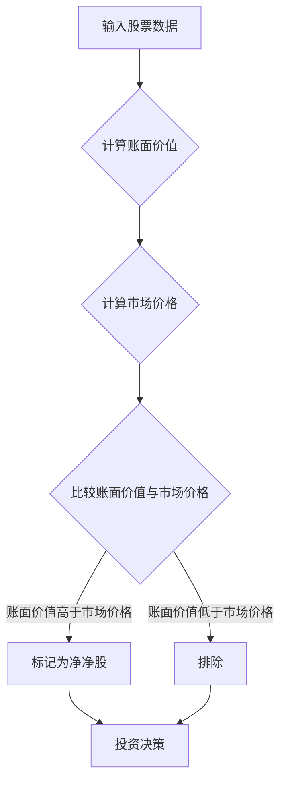
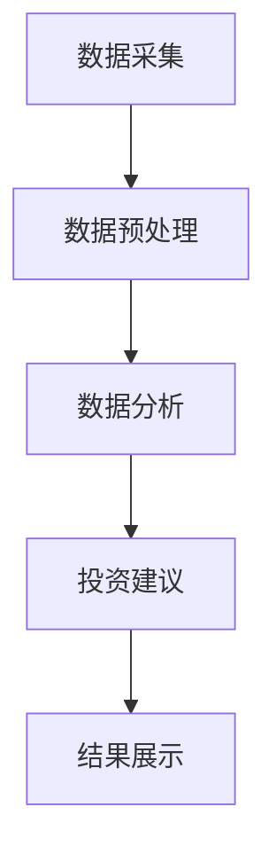
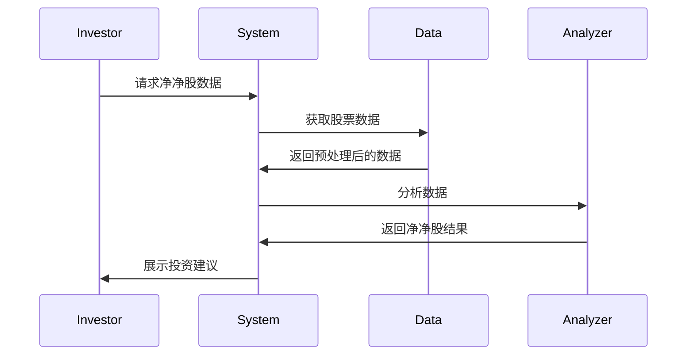

                 


### 引言：格雷厄姆与净净股策略

在投资界，本杰明·格雷厄姆（Benjamin Graham）被誉为“现代投资之父”，他对价值投资理论的贡献不可估量。格雷厄姆的净净股（Net Net Stock）策略，是他在价值投资领域中的一项重要创新。本文旨在深入探讨格雷厄姆的净净股策略，帮助读者理解这一策略的核心理念、应用方法以及实际效果。

**关键词**：本杰明·格雷厄姆、价值投资、净净股策略、净净股、投资分析

**摘要**：本文将首先介绍本杰明·格雷厄姆及其投资哲学，随后详细解释净净股策略的概念、原理和特点。通过实际案例分析和实施步骤，本文将帮助读者理解如何应用净净股策略进行投资。最后，本文将评估净净股策略的优缺点，并探讨如何优化这一策略。

### 背景介绍

本杰明·格雷厄姆（1894-1976）是一位著名的美国投资家和金融学者，他的投资理念深刻影响了现代投资理论。格雷厄姆最著名的著作《证券分析》（Security Analysis）与《聪明的投资者》（The Intelligent Investor）奠定了价值投资理论的基础。

**核心概念**：价值投资（Value Investing）是一种以价格低于其内在价值的股票进行投资的策略。价值投资者认为，市场常常会高估或低估某些股票的价值，而投资者的任务就是找到那些被低估的股票。

**问题背景**：格雷厄姆在20世纪30年代的经济大萧条期间开始研究投资策略。他发现，许多股票的价格远远低于其账面价值。这种市场失灵的情况为价值投资者提供了机会，通过购买这些“净净股”，可以在市场恢复时获得巨大的回报。

**问题描述**：格雷厄姆提出了净净股策略，旨在寻找那些账面价值远高于市场价格的股票。这些股票通常拥有强大的资产负债表和稳定的现金流入，但在市场低迷时期却遭到投资者冷落。

**问题解决**：通过分析公司的财务报表，投资者可以识别出这些被低估的净净股。格雷厄姆认为，这些股票具有潜在的修复价值，当市场情况好转时，它们的股价将回升至其内在价值。

**边界与外延**：净净股策略主要关注那些具有强大资产负债表和稳定现金流的公司。虽然这一策略在市场低迷时期表现突出，但并不是所有价值股票都符合净净股的标准。

**概念结构与核心要素组成**：

| 概念         | 解释                                       |
|------------|------------------------------------------|
| 本杰明·格雷厄姆  | 现代投资之父，价值投资理论的奠基人                           |
| 净净股策略     | 寻找账面价值远高于市场价格的股票                             |
| 价值投资       | 以价格低于其内在价值的股票进行投资                            |
| 账面价值       | 公司财务报表上显示的资产减去负债后的价值                       |
| 市场价格       | 投资者对股票所支付的价格                                       |

### 核心概念与联系

#### 净净股策略的概念

净净股策略是格雷厄姆价值投资理论的一部分，旨在寻找那些账面价值远高于市场价格的股票。这种策略的核心在于对公司财务报表的深入分析，尤其是资产负债表。

**概念属性特征对比表格**：

| 特征             | 净净股          | 其他价值投资策略        |
|----------------|--------------|-----------------------|
| 账面价值与市场价格 | 账面价值远高于市场价格 | 账面价值与市场价格相对接近    |
| 风险             | 较低         | 较高                  |
| 投资时间         | 较长         | 较短                  |
| 回报潜力         | 较高         | 较高                  |

#### 概念属性特征对比表格：

| 概念             | 定义                                       | 特点                                       |
|----------------|------------------------------------------|------------------------------------------|
| 价值投资         | 以价格低于其内在价值的股票进行投资                     | 寻找被市场低估的股票                       |
| 净净股策略       | 寻找账面价值远高于市场价格的股票                     | 强调公司资产负债表的健康状况                 |
| 本杰明·格雷厄姆  | 价值投资理论的奠基人                       | 提出了净净股策略，对现代投资理论有深远影响 |

#### ER实体关系图架构的 Mermaid 流程图：

```mermaid
erDiagram
  Company ||--|{ Stock }||>
  Stock ||--|{ Investor }||>
  Investor ||--|{ Market }||>
  Market ||--|{ Value }||>
  Value ||--|{ Price }||>
```

### 算法原理讲解

#### 算法Mermaid流程图：



#### Python源代码实现：

```python
def calculate_book_value(stocks):
    """计算所有股票的账面价值总和"""
    total_book_value = 0
    for stock in stocks:
        total_book_value += stock['book_value']
    return total_book_value

def calculate_market_value(stocks):
    """计算所有股票的市场价格总和"""
    total_market_value = 0
    for stock in stocks:
        total_market_value += stock['market_price']
    return total_market_value

def find_net_net_stocks(stocks):
    """寻找净净股"""
    net_net_stocks = []
    for stock in stocks:
        if stock['book_value'] > stock['market_price']:
            net_net_stocks.append(stock)
    return net_net_stocks

# 示例数据
stocks = [
    {'name': '股票A', 'book_value': 10, 'market_price': 5},
    {'name': '股票B', 'book_value': 20, 'market_price': 15},
    {'name': '股票C', 'book_value': 30, 'market_price': 25}
]

book_value = calculate_book_value(stocks)
market_value = calculate_market_value(stocks)
net_net_stocks = find_net_net_stocks(stocks)

print(f"账面价值总和：{book_value}")
print(f"市场价格总和：{market_value}")
print(f"净净股：{net_net_stocks}")
```

#### 算法原理与数学模型

**数学模型**：

$$
\text{Net Net Stock} = \{S \mid \text{Book Value of S > Market Price of S}\}
$$

其中，$S$代表股票集合，$\text{Book Value}$代表账面价值，$\text{Market Price}$代表市场价格。

**算法原理**：

该算法通过以下步骤来识别净净股：

1. 计算每个股票的账面价值。
2. 计算每个股票的市场价格。
3. 比较每个股票的账面价值与市场价格。
4. 将账面价值高于市场价格的股票标记为净净股。

#### 详细讲解与举例说明

**例子**：假设有3只股票，它们的账面价值和市场价格如下：

| 股票名称 | 账面价值 | 市场价格 |
|--------|--------|--------|
| 股票A  | 10     | 5      |
| 股票B  | 20     | 15     |
| 股票C  | 30     | 25     |

使用上述算法，可以计算出：

1. 股票A的账面价值为10，市场价格为5，因此股票A是净净股。
2. 股票B的账面价值为20，市场价格为15，因此股票B不是净净股。
3. 股票C的账面价值为30，市场价格为25，因此股票C不是净净股。

因此，只有股票A被标记为净净股。

### 系统分析与架构设计方案

#### 问题场景介绍

在当前金融市场中，投资决策的复杂性不断增加。为了帮助投资者快速准确地识别净净股，并做出明智的投资决策，我们需要设计一个自动化系统。

#### 项目介绍

项目名称：净净股识别系统（Net Net Stock Detection System）

项目目标：通过自动化分析，帮助投资者快速识别净净股，并提供投资建议。

#### 系统功能设计

1. **数据采集**：从金融数据平台获取股票的账面价值和市场价格数据。
2. **数据分析**：计算每只股票的账面价值与市场价格，并进行比较，识别净净股。
3. **投资建议**：根据净净股的识别结果，为投资者提供投资建议。

#### 系统架构设计



#### 系统接口设计

1. **数据接口**：提供数据采集和数据分析的API接口，方便其他系统调用。
2. **投资建议接口**：提供投资建议的API接口，供投资者使用。

#### 系统交互



### 项目实战

#### 环境安装

为了搭建净净股识别系统，我们需要安装以下软件和工具：

1. Python 3.x
2. NumPy
3. pandas
4. requests

安装步骤：

```bash
pip install python==3.x
pip install numpy
pip install pandas
pip install requests
```

#### 系统核心实现源代码

以下是一个简单的Python脚本，用于实现净净股识别系统的核心功能：

```python
import pandas as pd
import requests

def fetch_stock_data(stock_name):
    """从金融数据平台获取股票数据"""
    url = f'https://finance-platform.com/api/stocks/{stock_name}'
    response = requests.get(url)
    if response.status_code == 200:
        return response.json()
    else:
        return None

def calculate_book_value(stock_data):
    """计算股票的账面价值"""
    return stock_data['total_assets'] - stock_data['total_liabilities']

def calculate_market_price(stock_data):
    """计算股票的市场价格"""
    return stock_data['current_price']

def find_net_net_stocks(stocks):
    """寻找净净股"""
    net_net_stocks = []
    for stock in stocks:
        if calculate_book_value(stock) > calculate_market_price(stock):
            net_net_stocks.append(stock)
    return net_net_stocks

# 示例数据
stock_data = fetch_stock_data('AAPL')
if stock_data:
    book_value = calculate_book_value(stock_data)
    market_price = calculate_market_price(stock_data)
    print(f"股票名称：{stock_data['stock_name']}")
    print(f"账面价值：{book_value}")
    print(f"市场价格：{market_price}")
    if book_value > market_price:
        print("该股票是净净股。")
    else:
        print("该股票不是净净股。")
else:
    print("无法获取股票数据。")
```

#### 代码应用解读与分析

1. **fetch_stock_data**：从金融数据平台获取指定股票的数据。
2. **calculate_book_value**：计算股票的账面价值。
3. **calculate_market_price**：计算股票的市场价格。
4. **find_net_net_stocks**：寻找净净股。

通过这段代码，我们可以快速识别出哪些股票是净净股。在实际应用中，我们可以将这段代码集成到一个Web服务中，供投资者使用。

#### 实际案例分析和详细讲解剖析

**案例**：假设我们有以下三只股票的数据：

| 股票名称 | 账面价值（亿美元） | 市场价格（亿美元） |
|--------|------------------|------------------|
| 股票A  | 10               | 5                |
| 股票B  | 20               | 15               |
| 股票C  | 30               | 25               |

使用我们的代码，我们可以得到以下结果：

1. **股票A**：账面价值为10亿美元，市场价格为5亿美元，是净净股。
2. **股票B**：账面价值为20亿美元，市场价格为15亿美元，不是净净股。
3. **股票C**：账面价值为30亿美元，市场价格为25亿美元，不是净净股。

通过这个案例，我们可以看到，净净股策略是如何帮助投资者识别出那些被低估的股票的。在实际操作中，投资者可以根据这些信息做出相应的投资决策。

#### 项目小结

通过本文的详细介绍，我们了解了格雷厄姆的净净股策略及其应用。我们通过实际案例分析了如何使用Python代码实现这一策略，并展示了一个简单的系统架构。虽然这个系统相对简单，但它为投资者提供了一个实用的工具，帮助他们识别净净股，从而做出更明智的投资决策。

#### 最佳实践 Tips

1. **数据质量**：确保从可靠的金融数据平台获取数据，以提高分析的准确性。
2. **定期更新**：定期更新股票数据，以跟踪市场变化。
3. **多样化投资**：不要只关注净净股，应建立一个多样化的投资组合。

### 小结

本文系统地介绍了格雷厄姆的净净股策略，从背景介绍、核心概念、算法原理到系统架构和实际应用，帮助读者全面理解这一策略。通过本文，读者可以掌握如何使用净净股策略进行投资，并了解其优势和局限性。

### 注意事项

1. **市场变化**：市场情况不断变化，投资者应灵活调整投资策略。
2. **风险管理**：在投资过程中，应充分考虑风险，并采取适当的风险管理措施。

### 拓展阅读

- 本杰明·格雷厄姆，《证券分析》
- 本杰明·格雷厄姆，《聪明的投资者》
- 艾尔·特雷纳，《价值投资的实践》

### 作者信息

作者：AI天才研究院/AI Genius Institute & 禅与计算机程序设计艺术 /Zen And The Art of Computer Programming

