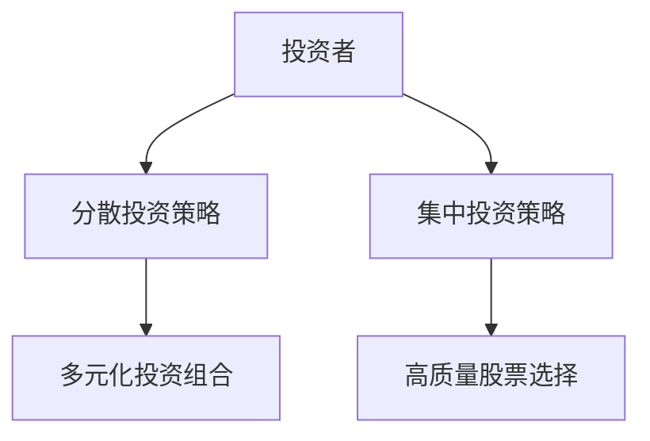

                 

### 第1章：引言

#### 1.1 问题背景

投资领域中的两位巨匠，本杰明·格雷厄姆和沃伦·巴菲特，各自提出了不同的投资策略：格雷厄姆倡导的分散投资原则和巴菲特的集中投资策略。分散投资强调通过投资多个不同的资产类别来降低风险，而集中投资则倾向于持有少数几只高质量股票。两种策略在投资界引发了广泛讨论，本文旨在深入探讨这两种策略的优劣，帮助投资者更好地理解如何权衡这两种投资原则。

#### 1.2 问题描述

分散投资和集中投资的核心问题在于如何在风险和回报之间取得平衡。分散投资可以降低单一市场波动带来的影响，但可能错失大额收益的机会；集中投资则可能带来更高的回报，但也伴随着更高的风险。投资者需要根据自身的风险承受能力和投资目标来选择合适的策略。

#### 1.3 问题解决

本文将分析格雷厄姆的分散投资原则和巴菲特的集中投资策略，从历史数据、理论依据、实际案例等多个角度进行深入探讨，帮助投资者更好地理解这两种策略的适用场景和效果。

#### 1.4 边界与外延

本文主要讨论股票市场的投资策略，但分散投资和集中投资的原则同样适用于其他类型的投资，如债券、房地产等。同时，本文将探讨在不同市场环境下（如牛市、熊市）两种策略的表现。

#### 1.5 概念结构与核心要素组成

##### 1.5.1 格雷厄姆的分散投资原则

- **核心概念**：通过投资多个不同的资产类别来降低风险。
- **核心要素**：多元化投资组合、长期投资、合理的资产配置。

##### 1.5.2 巴菲特的集中投资策略

- **核心概念**：通过深入研究，选择少量高质量股票进行长期持有。
- **核心要素**：深入分析、投资企业而非股票、长期持有。

#### 1.6 核心概念原理、概念属性特征对比表格和ER实体关系图架构

##### 1.6.1 格雷厄姆分散投资与巴菲特集中投资对比

| 特征对比 | 格雷厄姆分散投资 | 巴菲特集中投资 |
| --- | --- | --- |
| 投资策略 | 多元化投资组合 | 选择少数几只高质量股票 |
| 风险水平 | 较低 | 较高 |
| 收益预期 | 较稳定 | 较高 |
| 投资时间 | 长期 | 长期 |
| 研究深度 | 较浅 | 较深 |

##### 1.6.2 ER实体关系图

#### 1.7 本章小结

本章从问题背景、问题描述、问题解决等多个角度，介绍了本书的核心内容。接下来，我们将分别深入探讨格雷厄姆的分散投资原则和巴菲特的集中投资策略，帮助读者更好地理解这两种投资原则的内涵和应用。在后续章节中，我们将通过历史数据、理论依据、实际案例等多个维度，对这两种策略进行详细分析。

---

# 第2章：格雷厄姆的分散投资原则

#### 2.1 格雷厄姆及其投资哲学

##### 2.1.1 格雷厄姆的生平与成就

本杰明·格雷厄姆（Benjamin Graham），被誉为“现代投资之父”，是价值投资理念的奠基人。他生于1894年，是美国著名的投资家、经济学家和作家。格雷厄姆毕业于哥伦比亚大学，并在其职业生涯中发表了大量的投资理论和著作，其中最著名的包括《证券分析》（Security Analysis）和《聪明的投资者》（The Intelligent Investor）。

##### 2.1.2 格雷厄姆的投资哲学

格雷厄姆的投资哲学强调价值投资，即通过购买那些市场价格低于其内在价值的股票来实现投资回报。他主张投资者应该专注于企业的基本面分析，而非市场情绪或短期价格波动。格雷厄姆认为，股票的价格可能会偏离其内在价值，但长期来看，市场总是会回归其真实价值。

#### 2.2 分散投资原则的基本概念

##### 2.2.1 什么是分散投资

分散投资，即通过投资多种不同的资产类别和证券，以降低投资组合的整体风险。分散投资的核心思想是，不将所有资金投资在单一资产或市场，而是通过多元化的投资组合来分散风险。

##### 2.2.2 分散投资的优势

分散投资的优势包括：

1. **风险分散**：通过投资多个不同的资产，可以降低特定资产或市场波动带来的影响。
2. **增加收益潜力**：多元化的投资组合可能捕捉到不同市场或行业的机会，从而增加整体收益的潜力。
3. **提高投资稳定性**：即使在某个市场或资产类别表现不佳时，其他资产的表现可能有所补偿。

#### 2.3 格雷厄姆分散投资的实践与案例

##### 2.3.1 分散投资组合的构建

格雷厄姆主张投资者应该构建一个多元化的投资组合，包括股票、债券、现金等不同的资产类别。这种多元化不仅体现在资产类别上，还可以在行业和地理区域上进行分散。

###### **案例研究：格雷厄姆的投资组合**

在20世纪50年代，格雷厄姆曾为他的朋友、著名的投资家大卫·多德提供投资建议。格雷厄姆建议多德的投资组合中包含以下资产：

1. **股票**：约50%的投资应投资于股票，其中包括不同行业和市场的股票。
2. **债券**：约30%的投资应投资于债券，以提供稳定的收益。
3. **现金和现金等价物**：剩余的20%投资于现金或现金等价物，以保持流动性。

通过这样的资产配置，多德的投资组合在经历了多次市场波动后，仍保持了较高的稳定性和长期回报。

##### 2.3.2 长期投资的重要性

格雷厄姆强调长期投资的重要性，他认为投资者应该耐心持有股票，而不是频繁交易。这种长期投资策略有助于减少交易成本和市场波动的影响，从而提高投资组合的回报。

###### **案例研究：可口可乐股票的投资**

在1950年代，格雷厄姆开始投资可口可乐股票，并一直持有至去世。虽然在这段时间内，可口可乐股票的价格经历了多次波动，但格雷厄姆始终坚持长期持有的策略。最终，可口可乐股票为他带来了丰厚的回报。

#### 2.4 分散投资原则的优缺点分析

##### 2.4.1 优点

1. **风险分散**：通过投资多个不同的资产类别和证券，可以降低特定资产或市场波动带来的风险。
2. **增加收益潜力**：多元化的投资组合可能捕捉到不同市场或行业的机会，从而增加整体收益的潜力。
3. **提高投资稳定性**：在某个市场或资产类别表现不佳时，其他资产的表现可能有所补偿。

##### 2.4.2 缺点

1. **机会成本**：通过分散投资，可能会错失某些特定资产或市场的潜在高额回报。
2. **管理难度**：多元化的投资组合需要更多的研究和管理工作，这可能会增加投资者的时间和精力成本。

#### 2.5 本章小结

本章介绍了格雷厄姆的分散投资原则，包括他的生平和投资哲学、分散投资的基本概念和优势，以及实际案例和实践方法。通过分析格雷厄姆的投资组合和长期投资策略，我们看到了分散投资在降低风险和增加收益潜力方面的优势。然而，分散投资也有其缺点，如机会成本和管理难度。在接下来的章节中，我们将探讨巴菲特的集中投资策略，进一步比较这两种投资原则的优劣。

