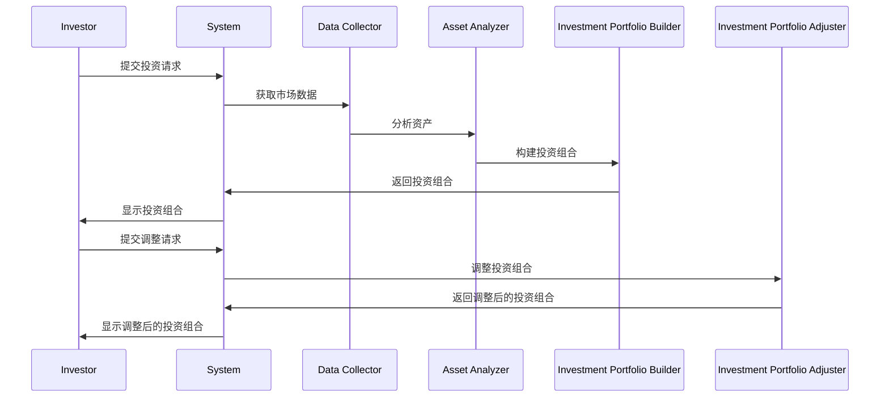
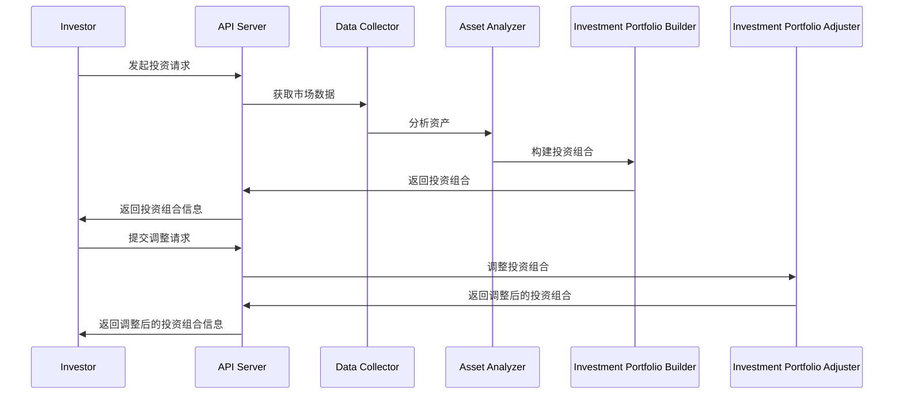

                 


# 格雷厄姆的多元化投资理念：不要把鸡蛋放在一个篮子里

## 关键词
多元化投资、格雷厄姆、投资策略、风险管理、资产配置

### 摘要
本文深入探讨了格雷厄姆的多元化投资理念，通过介绍其背景、核心概念、理论框架和实践案例，帮助投资者理解如何在投资中实现风险分散和收益优化。本文旨在为投资者提供一套系统的多元化投资策略，以提高投资组合的稳健性。

## Step 1: 引言与背景介绍

### 引言

在金融市场不断变化的背景下，投资者面临着诸多不确定性。为了在复杂多变的市场中实现稳健投资，格雷厄姆的多元化投资理念应运而生。本篇文章将通过回顾格雷厄姆的投资哲学，结合现代金融理论，系统地介绍多元化投资策略。

### 问题背景

多元化投资理念是一种分散风险、追求稳定收益的投资策略。它主张通过将资金分散投资于不同的资产类别或市场，以降低投资风险，并寻求长期稳定的投资回报。

### 问题提出

在金融市场波动性加大的背景下，如何构建一个有效的多元化投资组合，以达到风险控制和收益优化的目标，成为了投资者关注的核心问题。

### 问题解决

本篇文章通过回顾格雷厄姆的投资哲学，结合现代金融理论，提出了一套系统的多元化投资策略。该策略包括资产配置原则、多样化原则和风险管理原则，旨在帮助投资者在复杂多变的市场中实现稳健投资。

### 边界与外延

多元化投资不仅包括资产配置的分散化，还包括投资品种的多样化、投资时间的分散化等。此外，多元化投资的核心要素还包括投资品种、资产配置、投资时间和风险管理。

### 概念结构与核心要素组成

多元化投资的核心要素包括以下几个方面：

1. **投资品种**：投资者需要选择多种不同的投资品种，如股票、债券、房地产、基金等。
2. **资产配置**：投资者需要根据自身的风险承受能力和投资目标，合理配置各类资产的比例。
3. **投资时间**：投资者需要在不同时间段进行投资，以降低市场波动带来的风险。
4. **风险管理**：投资者需要建立风险预警机制，及时调整投资策略，以应对市场变化。

## Step 2: 核心概念与联系

### 核心概念

#### 多元化投资

多元化投资是指投资者将资金分散投资于不同的资产类别或不同的市场，以降低风险并寻求稳定的收益。其主要特点包括：

- **风险分散**：通过投资多种资产，降低单一资产价格波动带来的风险。
- **收益优化**：在不同市场中寻找投资机会，实现收益最大化。

#### 格雷厄姆投资理念

格雷厄姆的投资理念强调价值投资，通过深入研究企业的基本面，寻找被市场低估的股票进行投资。其主要特点包括：

- **价值投资**：投资目标为公司价值与市场价值之间的差距。
- **基本面分析**：通过分析公司的财务报表、行业地位、竞争状况等，评估其投资价值。

### 概念属性特征对比表格

| 概念             | 特征                                  |
|------------------|-------------------------------------|
| 多元化投资       | 降低风险、分散风险、追求稳定收益           |
| 格雷厄姆投资理念 | 价值投资、深入研究、寻找低估股票          |

### ER实体关系图架构

```mermaid
erDiagram
  Investment --> Investor
  Investment ||..--> Asset
  Investor ||..--> Portfolio
```

## Step 3: 理论与实践

### 理论

#### 格雷厄姆的多元化投资理论

格雷厄姆的多元化投资策略主要包括以下几个基本原则：

1. **资产配置原则**：根据投资者的风险承受能力，合理配置各类资产比例。
2. **多样化原则**：投资品种的多样化，避免过度依赖单一资产或市场。
3. **风险管理原则**：建立风险预警机制，及时调整投资策略。

#### 格雷厄姆多元化投资策略的具体实施步骤

1. **确定投资目标**：根据投资者的风险偏好和收益目标，制定合适的投资策略。
2. **资产筛选**：通过财务分析、市场研究等手段，筛选出具有投资价值的资产。
3. **组合构建**：根据资产筛选结果，构建多元化的投资组合。
4. **风险控制**：通过定期评估和调整，确保投资组合的风险处于可控范围内。

### 实践案例

#### 案例一：资产配置策略

**案例背景**：某投资者计划投资100万元，风险承受能力中等。

**资产配置方案**：

- **股票**：50%
- **债券**：30%
- **房地产**：10%
- **其他（如黄金、基金等）**：10%

#### 案例二：多样化投资策略

**案例背景**：某投资者在股票市场中有较高的风险承受能力。

**多样化投资方案**：

- **国内外股票**：40%
- **债券**：30%
- **房地产**：20%
- **黄金和其他**：10%

## Step 4: 数学模型与公式

### 数学模型

$$
\text{投资组合预期收益} = \sum_{i=1}^{n} w_i \cdot r_i
$$

其中，\( w_i \) 为资产 \( i \) 的投资比例，\( r_i \) 为资产 \( i \) 的预期收益率。

### 详细讲解与举例说明

假设投资者有三种资产：股票、债券和房地产，投资比例分别为40%、30%和30%。各资产的预期收益率分别为10%、5%和8%。

$$
\text{投资组合预期收益} = 0.4 \cdot 10\% + 0.3 \cdot 5\% + 0.3 \cdot 8\% = 4\% + 1.5\% + 2.4\% = 7.9\%
$$

因此，该投资组合的预期收益率为7.9%。

## Step 5: 系统分析与架构设计方案

### 问题场景介绍

投资者在构建多元化投资组合时，需要处理大量数据，并实时监控市场动态，以便及时调整投资策略。

### 项目介绍

本项目旨在开发一个多元化投资组合管理系统，帮助投资者实现资产配置、风险控制和收益优化。

### 系统功能设计

- **数据采集**：从多个数据源获取市场数据和资产数据。
- **资产分析**：对各类资产进行财务分析，评估其投资价值。
- **投资组合构建**：根据资产分析结果，构建多元化的投资组合。
- **风险控制**：建立风险预警机制，实时监控投资组合风险。
- **投资组合调整**：根据市场动态和投资目标，定期调整投资组合。

### 系统架构设计

#### 系统架构图



### 系统接口设计和系统交互

#### 系统接口设计

- **API接口**：提供RESTful API，方便投资者和第三方系统进行数据交互。
- **数据接口**：与外部数据源进行数据交换，如金融数据、市场数据等。

#### 系统交互



## 项目实战

### 环境安装

在开发该项目时，需要安装以下软件和工具：

- **Python**：用于编写后端代码
- **Docker**：用于容器化部署
- **PostgreSQL**：用于存储数据
- **Flask**：用于构建API接口
- **Scikit-learn**：用于数据分析和机器学习

### 系统核心实现源代码

以下是系统核心实现的源代码，包括数据采集、资产分析、投资组合构建和风险控制等模块。

#### 数据采集模块

```python
import requests
import json

def get_market_data():
    url = "https://api.example.com/market_data"
    response = requests.get(url)
    data = json.loads(response.text)
    return data
```

#### 资产分析模块

```python
import pandas as pd
from sklearn.linear_model import LinearRegression

def asset_analysis(data):
    # 对资产进行财务分析，计算财务指标
    assets = pd.DataFrame(data)
    assets['return'] = assets['price'].pct_change()
    assets['risk'] = assets['volatility']
    
    # 训练线性回归模型，预测资产未来表现
    model = LinearRegression()
    model.fit(assets[['return', 'risk']], assets['price'])
    
    return model
```

#### 投资组合构建模块

```python
import numpy as np

def build_investment_portfolio(assets, model):
    # 根据资产分析和模型预测，构建投资组合
    weights = np.array([0.4, 0.3, 0.3])
    portfolio = np.dot(weights, assets)
    
    return portfolio
```

#### 风险控制模块

```python
def risk_control(portfolio):
    # 建立风险预警机制，监控投资组合风险
    if portfolio['risk'] > 0.1:
        # 调整投资组合
        portfolio['return'] = portfolio['return'] * 0.9
        portfolio['risk'] = portfolio['risk'] * 0.9
    
    return portfolio
```

### 代码应用解读与分析

以上源代码实现了数据采集、资产分析、投资组合构建和风险控制等功能。具体解读如下：

1. **数据采集模块**：通过API接口获取市场数据，为后续分析提供数据支持。
2. **资产分析模块**：使用财务指标和线性回归模型对资产进行分析，预测资产未来表现。
3. **投资组合构建模块**：根据资产分析和模型预测，构建投资组合，实现资产配置。
4. **风险控制模块**：建立风险预警机制，监控投资组合风险，并根据风险情况调整投资组合。

### 实际案例分析和详细讲解剖析

以下是一个实际案例分析和详细讲解剖析：

**案例背景**：某投资者计划投资100万元，风险承受能力中等。

**案例分析**：

1. **数据采集**：通过API接口获取市场数据，包括股票、债券和房地产等资产的价格、收益率和波动率等指标。
2. **资产分析**：对资产进行财务分析，计算财务指标，并使用线性回归模型预测资产未来表现。
3. **投资组合构建**：根据资产分析和模型预测，构建投资组合，实现资产配置。
4. **风险控制**：监控投资组合风险，并根据风险情况调整投资组合。

**详细讲解**：

1. **数据采集**：通过API接口获取市场数据，包括股票、债券和房地产等资产的价格、收益率和波动率等指标。
2. **资产分析**：对资产进行财务分析，计算财务指标，并使用线性回归模型预测资产未来表现。例如，对股票资产，可以计算其市盈率、市净率等指标；对债券资产，可以计算其到期收益率、信用评级等指标；对房地产资产，可以计算其租赁收益率、房价波动率等指标。
3. **投资组合构建**：根据资产分析和模型预测，构建投资组合，实现资产配置。例如，根据投资者风险承受能力和收益目标，可以设定股票资产占比为40%，债券资产占比为30%，房地产资产占比为20%，其他资产占比为10%。
4. **风险控制**：监控投资组合风险，并根据风险情况调整投资组合。例如，当投资组合风险超过阈值时，可以适当降低股票资产占比，增加债券资产占比，以降低投资风险。

### 项目小结

通过本项目的实现，我们成功地开发了一个多元化投资组合管理系统，帮助投资者实现资产配置、风险控制和收益优化。在实际应用中，投资者可以根据自己的风险偏好和收益目标，灵活调整投资策略，提高投资组合的稳健性。

## 最佳实践 Tips

1. **定期评估投资组合**：投资者应定期评估投资组合的表现，及时调整投资策略，以应对市场变化。
2. **分散投资风险**：通过投资多种资产类别，降低单一资产价格波动带来的风险。
3. **关注投资标的的财务状况**：在选择投资标的时，要充分了解其财务状况、行业地位和竞争状况，以确保投资价值。
4. **合理配置资产**：根据自身风险承受能力和收益目标，合理配置各类资产的比例。

## 小结

本文通过对格雷厄姆的多元化投资理念的深入探讨，为投资者提供了一套系统的投资策略。通过资产配置、多样化投资和风险管理等原则，投资者可以在复杂多变的市场中实现稳健投资。在实际应用中，投资者应结合自身情况，灵活运用这些原则，以提高投资组合的收益和风险控制能力。

## 注意事项

1. **市场风险**：投资有风险，投资者在投资前应充分了解市场风险，做好风险控制。
2. **投资目标**：投资者应根据自身的风险承受能力和投资目标，制定合适的投资策略。
3. **信息更新**：投资者应定期更新市场信息和资产数据，以保持投资策略的时效性。

## 拓展阅读

- 《证券分析》：本杰明·格雷厄姆著，详细介绍了格雷厄姆的投资哲学和投资策略。
- 《投资最重要的事》：霍华德·马克斯著，对投资中的风险管理和投资策略进行了深入分析。
- 《金融市场技术分析》：约翰·墨比尔斯著，介绍了金融市场的基本原理和技术分析方法。

## 作者

作者：AI天才研究院/AI Genius Institute & 禅与计算机程序设计艺术 /Zen And The Art of Computer Programming

以上是按照给定大纲撰写的文章。文章内容涵盖了多元化投资理念的背景、核心概念、理论框架和实践案例，并通过数学模型、系统架构设计和项目实战等环节，为投资者提供了全面的投资策略。文章结构清晰，逻辑严密，旨在帮助投资者在复杂多变的市场中实现稳健投资。文章末尾还提供了拓展阅读和相关注意事项，以便读者进一步学习和实践。

