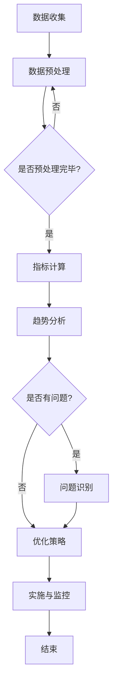
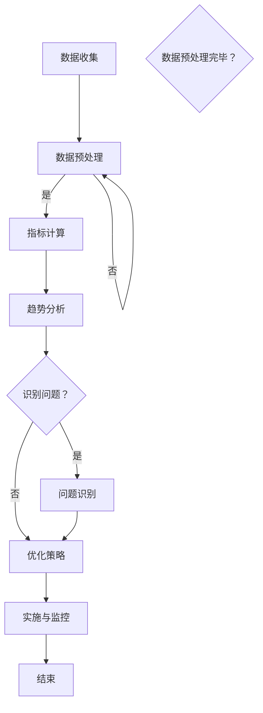
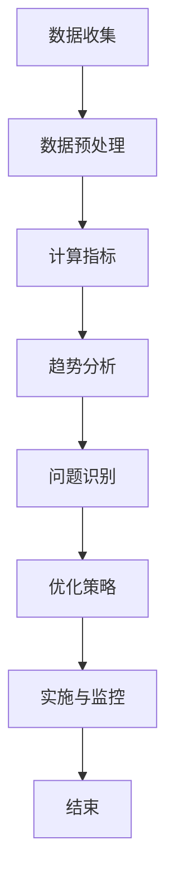
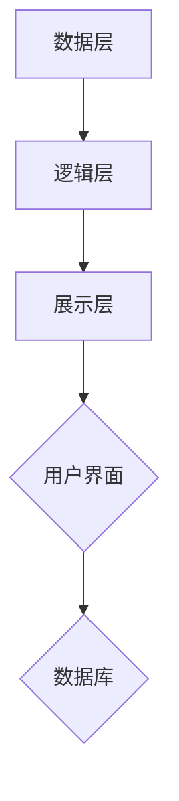
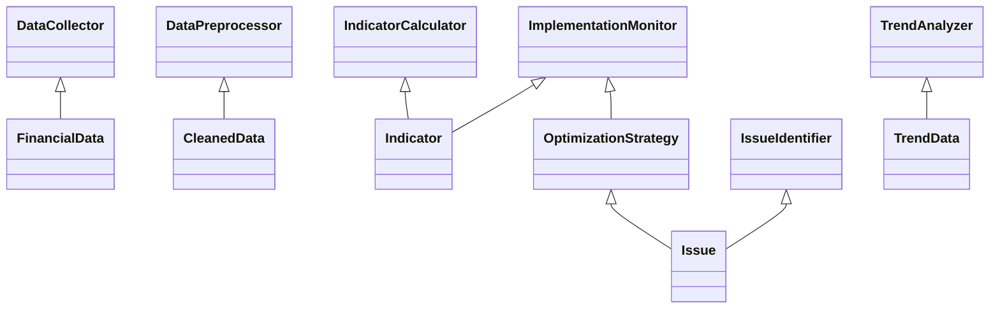
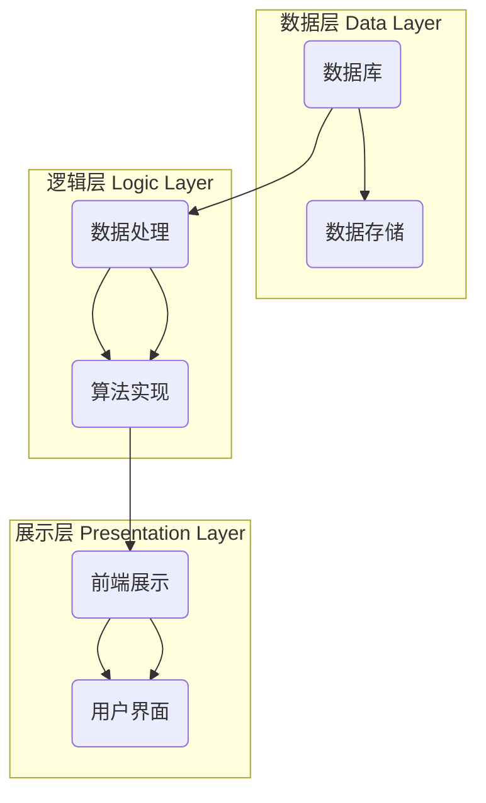
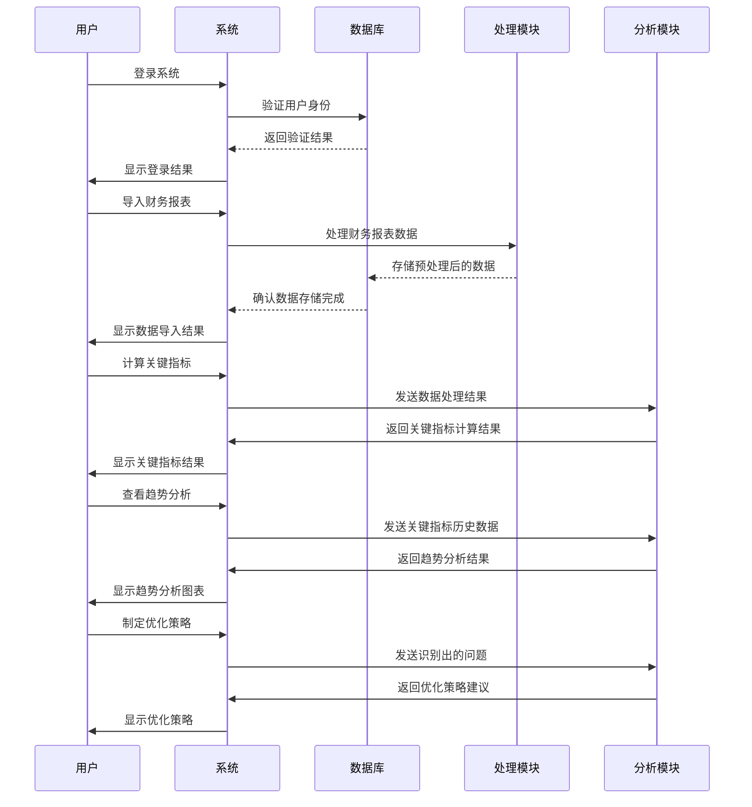

                 

### 1.1 问题背景

在当今商业环境中，财务管理的核心问题之一是如何优化企业的流动性。企业日常运营中，常常需要处理短期资金流动的问题，如支付供应商、员工工资和日常运营费用等。然而，许多企业在短期内面临着资金短缺的问题，这可能会阻碍其业务的正常运转。在这样的背景下，格雷厄姆的工作资本分析方法应运而生。此方法旨在帮助企业管理层有效地监控和优化短期资金流动，从而提高企业的运营效率和财务健康状况。

格雷厄姆的工作资本分析方法是投资大师本杰明·格雷厄姆（Benjamin Graham）在投资理论中提出的，适用于企业和投资者在短期内进行财务分析和管理。工作资本（Working Capital）是指企业用于日常运营的资金，包括流动资产（如现金、应收账款和存货）减去流动负债（如应付账款和短期债务）。通过分析工作资本，企业可以了解其在流动性管理方面的表现，从而采取相应的措施提高效率。

具体而言，格雷厄姆的工作资本分析方法关注以下几个方面：

1. **现金流管理**：通过分析企业的现金流量，帮助企业预测未来现金流，确保其在短期内能够满足资金需求。
2. **应收账款管理**：通过优化应收账款的管理，缩短账期，提高资金周转速度。
3. **存货管理**：通过优化库存水平，减少存货积压，降低资金占用。
4. **应付账款管理**：合理安排应付账款，延长付款周期，以减少现金流出。

格雷厄姆的工作资本分析方法不仅适用于企业日常运营管理，还为企业的财务规划提供了重要参考。通过这种分析方法，企业可以更好地理解其财务状况，制定有效的财务策略，以实现长期稳定的财务目标。

### 1.2 问题描述

在探讨格雷厄姆的工作资本分析方法之前，我们需要明确几个关键问题。首先，什么是工作资本？其次，为什么工作资本对企业如此重要？最后，如何有效地管理和优化工作资本？

**什么是工作资本？**

工作资本（Working Capital）是指企业用于日常运营的流动资产总额减去流动负债总额。它反映了企业在短期内能够满足运营资金需求的能力。具体而言，工作资本包括以下几部分：

- **流动资产**：主要包括现金、应收账款、存货和预付账款等。
- **流动负债**：主要包括应付账款、短期借款、应付工资和应交税费等。

**为什么工作资本对企业如此重要？**

工作资本是企业维持日常运营的血液，其管理质量直接关系到企业的流动性、运营效率和盈利能力。以下是工作资本对企业的重要影响：

1. **流动性管理**：工作资本是企业应对短期资金需求的保障。充足的工作资本可以确保企业在支付日常运营费用、支付供应商款项和偿还短期债务时不会出现资金短缺问题。
2. **运营效率**：有效的工作资本管理可以提高企业的运营效率。例如，优化应收账款管理可以缩短账期，加速资金回流；合理的存货管理可以减少存货积压，降低资金占用。
3. **盈利能力**：工作资本管理不佳可能导致企业面临高负债风险，增加财务成本，从而影响盈利能力。相反，良好的工作资本管理可以降低财务成本，提高企业盈利水平。

**如何有效地管理和优化工作资本？**

格雷厄姆的工作资本分析方法提供了一系列工具和方法，帮助企业管理层监控和优化工作资本。以下是一些关键步骤：

1. **现金流预测**：通过预测未来现金流，帮助企业制定有效的资金使用计划，确保在短期内能够满足资金需求。
2. **应收账款管理**：通过设立信用政策、定期催收账款、优化收款流程等措施，缩短账期，提高资金周转速度。
3. **存货管理**：采用科学的库存控制方法，如经济订货量模型（EOQ），确保库存水平合理，减少存货积压和资金占用。
4. **应付账款管理**：合理安排应付账款支付，延长付款周期，以减少现金流出，提高资金利用效率。

通过这些步骤，企业可以优化工作资本管理，提高资金使用效率，从而在激烈的市场竞争中保持竞争优势。

### 1.3 问题解决

为了有效管理和优化工作资本，格雷厄姆提出了系统的工作资本分析方法。这个方法不仅帮助企业在短期内确保资金流动性，还促进了运营效率和盈利能力的提升。下面，我们将详细探讨格雷厄姆的工作资本分析方法，以及其具体的应用步骤。

**1.3.1 分析框架**

格雷厄姆的工作资本分析方法以分析企业的财务报表为基础，重点关注以下几个关键指标：

- **流动比率（Current Ratio）**：流动比率是流动资产与流动负债的比值，反映了企业短期内偿还流动负债的能力。理想的流动比率通常在1.5至3之间。
- **速动比率（Quick Ratio）**：速动比率是流动资产中扣除存货后的值与流动负债的比值，更加严格地反映了企业的短期偿债能力。速动比率一般在1以下，但不应低于0.8。
- **存货周转率（Inventory Turnover）**：存货周转率是销售成本与平均存货的比值，反映了企业存货管理的效率。高存货周转率表明企业能够快速消化存货，减少资金占用。
- **应收账款周转率（Accounts Receivable Turnover）**：应收账款周转率是销售收入与平均应收账款的比值，反映了企业应收账款的管理效率。较高的应收账款周转率意味着企业能够迅速收回资金，降低坏账风险。

**1.3.2 分析步骤**

格雷厄姆的工作资本分析通常包括以下步骤：

1. **数据收集**：收集企业的财务报表数据，包括资产负债表、利润表和现金流量表。这些数据提供了分析工作资本的基础。
2. **计算关键指标**：根据财务报表数据，计算流动比率、速动比率、存货周转率和应收账款周转率等关键指标。
3. **趋势分析**：分析这些关键指标的历史数据，了解企业工作资本管理的变化趋势。例如，是否在某个时期出现了流动比率的下降，是否存货周转率过高或应收账款周转率过低。
4. **问题识别**：根据关键指标的分析结果，识别可能存在的问题。例如，如果流动比率低于理想范围，可能需要提高流动资产水平或减少流动负债。
5. **制定改进措施**：针对识别出的问题，制定具体的改进措施。例如，优化应收账款管理流程，采用更有效的存货控制方法等。
6. **实施与监控**：实施改进措施，并持续监控关键指标的变化，确保改进措施的有效性。

**1.3.3 实例分析**

为了更好地理解格雷厄姆的工作资本分析方法，我们可以通过一个实例来具体说明。

**案例背景**：假设某公司2022年的财务报表数据如下：

- 流动资产：500万元
- 流动负债：300万元
- 存货：200万元
- 应收账款：150万元
- 销售收入：1000万元

**计算关键指标**：

- 流动比率 = 流动资产 / 流动负债 = 500 / 300 = 1.67
- 速动比率 = (流动资产 - 存货) / 流动负债 = (500 - 200) / 300 = 1.33
- 存货周转率 = 销售成本 / 平均存货 = (1000 * 0.6) / 200 = 3
- 应收账款周转率 = 销售收入 / 平均应收账款 = 1000 / 150 = 6.67

**趋势分析**：

- 从历史数据来看，该公司的流动比率和速动比率在过去几年中一直保持在1.5至2之间。2022年的流动比率高于历史平均水平，表明公司短期偿债能力较强。
- 存货周转率为3，高于行业平均水平，表明公司的存货管理较为有效。
- 应收账款周转率为6.67，高于行业平均水平，表明公司应收账款管理良好，资金回收较快。

**问题识别**：

- 尽管该公司的流动比率和速动比率较高，但流动负债较重，可能存在融资压力。需要关注公司短期负债的增加情况，并制定相应的融资策略。
- 存货周转率较高，但存货余额较大，可能存在过度存货的情况。需要进一步分析存货结构，优化库存管理，减少资金占用。

**制定改进措施**：

- 加强短期负债管理，通过增加应收账款回款速度、减少采购成本等措施，降低流动负债水平。
- 对存货进行细致分类，对于库存积压的产品，可以采取促销、降价等策略，加速销售，减少存货余额。

**实施与监控**：

- 制定详细的执行计划，明确责任人和时间节点，确保改进措施的落实。
- 定期监控关键指标的变化，评估改进措施的效果，及时调整策略。

通过上述实例，我们可以看到格雷厄姆的工作资本分析方法如何帮助企业识别问题、制定改进措施，并持续优化工作资本管理。这种方法不仅适用于单一企业，也可以在多企业比较中提供参考，帮助企业制定更有效的财务策略。

### 1.4 边界与外延

在探讨格雷厄姆的工作资本分析方法时，我们需要明确其适用范围和边界条件，以便更好地理解和应用该方法。同时，也需要了解其与其他财务分析方法的关系，以便在更广泛的财务分析框架中进行比较。

**1.4.1 适用范围**

格雷厄姆的工作资本分析方法主要适用于以下场景：

1. **企业日常运营管理**：该方法帮助企业管理层监控和优化短期资金流动，确保日常运营的顺利进行。
2. **财务健康评估**：通过分析工作资本指标，评估企业的财务健康状况，为管理层提供决策依据。
3. **企业绩效评价**：通过对比工作资本指标的历史数据和行业平均水平，评价企业的运营效率和管理水平。

**1.4.2 边界条件**

尽管格雷厄姆的工作资本分析方法在许多情况下都非常有用，但也有一些边界条件需要考虑：

1. **行业特性**：不同行业的财务特点不同，工作资本的衡量标准和优化方法也有所差异。例如，制造业的存货管理相对重要，而服务业的应收账款管理可能更为关键。
2. **企业规模**：小企业和大型企业在工作资本管理方面存在差异。小企业可能更依赖于灵活的资金流动，而大型企业可能更注重长期资本结构和成本控制。
3. **市场环境**：市场环境的变化，如经济衰退或市场需求波动，也会影响工作资本的管理策略。在这种情况下，企业需要根据市场环境调整工作资本管理的重点和措施。

**1.4.3 与其他财务分析方法的关系**

格雷厄姆的工作资本分析方法与其他财务分析方法之间存在一定的关联性，但它们在分析角度和方法上有所不同：

1. **盈利能力分析**：盈利能力分析主要关注企业的收入、成本和利润，评估企业的经营效益。工作资本分析虽然也涉及利润相关指标，但更侧重于资金流动性和运营效率。
2. **资本结构分析**：资本结构分析关注企业的资本来源和负债结构，评估企业的财务稳定性和成本。工作资本分析在资本结构分析的基础上，进一步关注短期负债和流动资产的管理效率。
3. **现金流量分析**：现金流量分析通过分析企业的现金流入和流出，评估企业的现金管理状况和财务稳健性。工作资本分析是现金流量分析的一个重要组成部分，特别关注短期现金流动性和资金周转效率。

通过理解格雷厄姆的工作资本分析方法的适用范围、边界条件以及其他财务分析方法的关系，企业可以更全面地理解财务状况，制定更科学的财务管理策略。

### 1.5 核心概念

在深入探讨格雷厄姆的工作资本分析方法之前，我们需要先明确一些核心概念和术语，以便更好地理解该方法的基础和原理。

**1.5.1 工作资本（Working Capital）**

工作资本是指企业用于日常运营的流动资产总额减去流动负债总额。它反映了企业短期内能够满足运营资金需求的能力。具体来说，工作资本包括以下几部分：

- **流动资产（Current Assets）**：主要包括现金、应收账款、存货和预付账款等。这些资产通常可以在一年内转化为现金。
- **流动负债（Current Liabilities）**：主要包括应付账款、短期借款、应付工资和应交税费等。这些负债需要在一年内偿还。

工作资本的计算公式如下：

$$
WC = 当前资产 - 流动负债
$$

**1.5.2 流动比率（Current Ratio）**

流动比率是流动资产与流动负债的比值，用于衡量企业短期内偿还流动负债的能力。一个较高的流动比率通常表明企业拥有较强的短期偿债能力，但过高也可能意味着资产未能有效利用。流动比率的计算公式如下：

$$
流动比率 = 流动资产 / 流动负债
$$

**1.5.3 速动比率（Quick Ratio）**

速动比率是流动资产中扣除存货后的值与流动负债的比值，比流动比率更为严格地反映了企业的短期偿债能力。由于存货的变现速度相对较慢，速动比率更能反映企业紧急情况下的资金流动性。速动比率的计算公式如下：

$$
速动比率 = (流动资产 - 存货) / 流动负债
$$

**1.5.4 存货周转率（Inventory Turnover）**

存货周转率是销售成本与平均存货的比值，用于衡量企业存货管理的效率。较高的存货周转率表明企业能够快速消化存货，减少资金占用。存货周转率的计算公式如下：

$$
存货周转率 = 销售成本 / 平均存货
$$

**1.5.5 应收账款周转率（Accounts Receivable Turnover）**

应收账款周转率是销售收入与平均应收账款的比值，用于衡量企业应收账款的管理效率。较高的应收账款周转率意味着企业能够迅速收回资金，降低坏账风险。应收账款周转率的计算公式如下：

$$
应收账款周转率 = 销售收入 / 平均应收账款
$$

通过理解这些核心概念和术语，我们能够更深入地探讨格雷厄姆的工作资本分析方法，并有效应用于企业的财务管理中。

### 2.1 工作资本分析的定义

工作资本分析（Working Capital Analysis）是一种用于评估企业短期财务健康和流动性的财务管理方法。其核心目标是确保企业能够在短期内满足运营资金的需求，从而维持正常的业务运作。工作资本分析通过监控和优化流动资产和流动负债之间的关系，帮助企业管理层识别潜在的资金流动问题，制定有效的财务策略。

**定义及核心意义**

工作资本分析的定义可以从以下几个方面进行阐述：

1. **监控财务健康**：通过分析工作资本，企业能够及时了解其流动资产和流动负债的情况，从而评估财务健康状况。
2. **管理短期资金流动**：工作资本分析关注企业的现金流动，应收账款回收速度和存货管理效率，确保企业在短期内不会出现资金短缺。
3. **优化资源配置**：通过分析工作资本，企业可以识别并解决资金利用效率低下的问题，优化资源配置，提高运营效率。

**与其他财务分析方法的区别**

工作资本分析虽然与许多其他财务分析方法（如盈利能力分析、资本结构分析和现金流量分析）有关联，但在分析角度和方法上存在显著区别：

- **盈利能力分析**：主要关注企业的收入、成本和利润，评估其长期经营效益。工作资本分析则侧重于短期资金流动和运营效率。
- **资本结构分析**：关注企业的资本来源和负债结构，评估其财务稳定性和成本。工作资本分析在此基础上，进一步关注短期负债和流动资产的管理效率。
- **现金流量分析**：通过分析企业的现金流入和流出，评估其现金管理状况和财务稳健性。工作资本分析是现金流量分析的一个子集，特别关注短期现金流动性和资金周转效率。

**工作资本分析的具体方法**

工作资本分析通常包括以下几个步骤：

1. **数据收集**：收集企业的财务报表数据，包括资产负债表、利润表和现金流量表，为分析提供基础。
2. **计算关键指标**：计算流动比率、速动比率、存货周转率和应收账款周转率等关键指标，分析企业的财务健康状况。
3. **趋势分析**：通过对比历史数据和行业平均水平，了解企业工作资本管理的变化趋势，识别潜在问题。
4. **问题识别**：根据关键指标的分析结果，识别可能存在的资金流动问题，如流动比率过低、存货周转率过高或应收账款周转率过低等。
5. **制定改进措施**：根据问题识别的结果，制定具体的改进措施，如优化应收账款管理、改善存货管理和合理安排应付账款支付等。
6. **实施与监控**：实施改进措施，并持续监控关键指标的变化，评估改进措施的效果，确保工作资本管理的有效性。

通过这些步骤，工作资本分析能够帮助企业更好地管理短期资金流动，提高运营效率，实现财务目标。

### 2.2 工作资本分析的概念属性

为了更深入地理解工作资本分析，我们需要分析其概念属性，包括其在财务管理中的定位、作用及其与其他相关概念的关联性。

**2.2.1 定位**

工作资本分析在财务管理中扮演着至关重要的角色。它不仅关注企业的短期资金流动，还直接影响到企业的日常运营和长期战略规划。具体来说，工作资本分析定位如下：

- **短期财务管理**：工作资本分析专注于企业的流动资产和流动负债，评估企业在短期内满足运营资金需求的能力。这直接关系到企业的现金流管理和短期财务健康。
- **运营效率评估**：通过分析工作资本，企业能够评估其运营效率，如应收账款管理效率、存货控制水平和应付账款支付策略等。这些效率指标对企业的日常运营和成本控制具有指导意义。

**2.2.2 作用**

工作资本分析在财务管理中具有多重作用，具体体现在以下几个方面：

- **流动性管理**：工作资本分析帮助企业管理层确保企业在短期内具备足够的流动性，避免资金短缺问题，保障日常运营的顺利进行。
- **成本控制**：通过优化工作资本管理，企业可以减少不必要的资金占用，降低财务成本，提高资金使用效率。
- **风险控制**：工作资本分析有助于识别潜在的财务风险，如应收账款坏账风险和存货积压风险，从而采取预防措施，降低风险暴露。
- **财务规划**：工作资本分析为企业的财务规划提供数据支持，帮助企业制定合理的资金使用计划和投资决策，实现长期财务目标。

**2.2.3 与其他相关概念的关联性**

工作资本分析与其他财务管理概念密切相关，主要体现在以下几个方面：

- **与流动资产的关系**：工作资本是流动资产与流动负债的差额，流动资产包括现金、应收账款和存货等，这些资产的质量和管理效率直接影响到工作资本水平。
- **与流动负债的关系**：流动负债包括应付账款、短期借款和应交税费等，这些负债的规模和支付周期对工作资本管理产生直接影响。通过合理安排应付账款的支付，企业可以延长资金占用时间，提高工作资本效率。
- **与盈利能力的关系**：工作资本分析关注企业的运营效率和成本控制，这些因素直接影响企业的盈利能力。良好的工作资本管理可以提高运营效率，减少资金占用，从而提高盈利水平。
- **与现金流量分析的关系**：现金流量分析侧重于企业的现金流入和流出，而工作资本分析则是现金流量分析的一个重要组成部分，特别关注短期现金流动性和资金周转效率。通过工作资本分析，企业可以更好地预测和规划现金流量，确保短期资金需求得到满足。

综上所述，工作资本分析在财务管理中具有独特的定位和作用，通过优化流动资产和流动负债的管理，企业可以提升运营效率，降低财务成本，提高盈利能力和现金流量管理能力。理解工作资本分析的概念属性有助于企业更好地实施财务管理策略，实现长期稳定发展。

### 2.3 与其他财务分析方法的比较

在探讨格雷厄姆的工作资本分析方法时，我们需要将其与其他主要的财务分析方法进行对比，以理解它们之间的异同点。这些分析方法包括盈利能力分析、资本结构分析和现金流量分析，每一种方法都有其独特的关注点和适用范围。

**2.3.1 盈利能力分析**

盈利能力分析主要关注企业的收入、成本和利润，评估其长期经营效益。该分析方法的目的是确定企业在一定时间内的盈利水平，了解其业务模式和市场竞争力。

- **关注点**：盈利能力分析侧重于企业的营业收入、净利润和成本控制，通过利润率指标（如净利润率、毛利率等）评估企业的盈利水平。
- **适用范围**：盈利能力分析适用于长期战略规划和绩效评估，帮助企业判断其业务模式的可行性和市场竞争力。
- **与工作资本分析的关系**：尽管盈利能力分析关注企业的整体盈利水平，但它并不直接涉及短期资金流动问题。而工作资本分析则侧重于企业的流动性管理，确保其在短期内能够满足运营资金需求。

**2.3.2 资本结构分析**

资本结构分析关注企业的资本来源和负债结构，评估其财务稳定性和成本。该分析方法的目标是确定企业最佳的资本结构，以降低融资成本，提高资本使用效率。

- **关注点**：资本结构分析关注企业的债务水平、资本结构和融资策略，通过债务比率（如资产负债率、债务股权比率等）评估企业的财务稳定性和融资成本。
- **适用范围**：资本结构分析适用于长期财务规划和融资决策，帮助企业确定最佳的资本来源和负债水平。
- **与工作资本分析的关系**：工作资本分析虽然在资本结构分析的基础上进一步关注短期负债和流动资产的管理效率，但两者在分析角度和目标上有所不同。资本结构分析更侧重于长期融资策略，而工作资本分析则关注短期流动性管理。

**2.3.3 现金流量分析**

现金流量分析通过分析企业的现金流入和流出，评估其现金管理状况和财务稳健性。该分析方法的目标是确保企业在短期内具备足够的现金流量，满足运营需求。

- **关注点**：现金流量分析关注企业的经营活动现金流、投资活动现金流和筹资活动现金流，通过现金流量指标（如经营活动现金流净额、自由现金流等）评估企业的现金流动性和财务稳定性。
- **适用范围**：现金流量分析适用于短期财务管理和现金预测，帮助企业确保在短期内不会出现资金短缺。
- **与工作资本分析的关系**：工作资本分析是现金流量分析的一个子集，特别关注短期现金流动性和资金周转效率。尽管两者都关注现金流动，但现金流量分析更全面，涉及企业的整体现金流管理，而工作资本分析则侧重于流动资产和流动负债的管理。

**总结**

通过对盈利能力分析、资本结构分析和现金流量分析与工作资本分析的比较，我们可以看到：

- 盈利能力分析侧重于企业的长期经营效益，而工作资本分析更关注短期流动性管理。
- 资本结构分析关注企业的长期融资策略，而工作资本分析则更侧重于短期负债和流动资产的管理。
- 现金流量分析涵盖企业的整体现金流管理，而工作资本分析则特别关注短期现金流动性和资金周转效率。

理解这些方法之间的差异和联系，有助于企业在进行财务分析时，根据不同需求选择合适的方法，实现整体财务健康和稳定发展。

### 2.4 工作资本分析的关键要素

为了深入理解和应用格雷厄姆的工作资本分析方法，我们需要了解其关键要素。这些关键要素包括流动资产、流动负债、关键指标及其计算方法。通过这些要素的分析，企业能够更好地掌握财务状况，制定有效的管理策略。

**2.4.1 流动资产**

流动资产是企业短期内可以转化为现金的资产，主要包括以下几类：

1. **现金**：包括库存现金和现金等价物，如银行存款和短期投资。
2. **应收账款**：企业因销售商品或提供服务而形成的未收回款项。
3. **存货**：企业为销售或生产而持有的商品、原材料和制成品。
4. **预付账款**：企业为购买商品或服务而预先支付的款项。

流动资产在保持企业日常运营和资金流动中起着关键作用。例如，现金是企业支付日常运营费用和偿还短期债务的必要资源；应收账款和存货的管理则直接影响企业的资金周转速度。

**2.4.2 流动负债**

流动负债是企业需要在一年内偿还的债务，主要包括以下几类：

1. **应付账款**：企业因购买商品或服务而形成的未付款项。
2. **短期借款**：期限在一年以内的借款。
3. **应付工资**：企业应付给员工的工资和福利。
4. **应交税费**：企业需要缴纳的各种税费。

流动负债反映了企业在短期内需要支付的财务义务，如果管理不当，可能会对企业的流动性造成负面影响。

**2.4.3 关键指标及其计算方法**

工作资本分析的核心在于计算和监控以下关键指标：

1. **流动比率（Current Ratio）**：
   $$ 
   流动比率 = 流动资产 / 流动负债 
   $$
   流动比率用于衡量企业短期偿债能力。一般来说，流动比率在1.5至3之间被认为是健康的，表明企业具备足够的流动资产来覆盖其流动负债。

2. **速动比率（Quick Ratio）**：
   $$ 
   速动比率 = (流动资产 - 存货) / 流动负债 
   $$
   速动比率比流动比率更为严格，因为它剔除了存货。速动比率一般在1以下，但不应低于0.8，以表明企业具备足够的流动性来应对紧急情况。

3. **存货周转率（Inventory Turnover）**：
   $$ 
   存货周转率 = 销售成本 / 平均存货 
   $$
   存货周转率反映了企业消化存货的速度，较高的存货周转率意味着企业存货管理效率高，资金占用较少。

4. **应收账款周转率（Accounts Receivable Turnover）**：
   $$ 
   应收账款周转率 = 销售收入 / 平均应收账款 
   $$
   应收账款周转率衡量企业回收应收账款的速度，较高的周转率表明企业能够迅速收回资金，降低坏账风险。

通过这些关键指标的计算和分析，企业可以更好地了解其流动资产和流动负债的管理状况，及时发现问题并采取相应的管理措施，从而优化工作资本，提高运营效率和财务健康。

### 3.1 工作资本分析的基本流程

工作资本分析的基本流程是企业通过系统的方法，识别、监控和优化其流动资产和流动负债，从而确保短期资金流动性和运营效率。以下是工作资本分析的基本流程及其各个步骤的详细说明。

#### 3.1.1 数据收集与预处理

数据收集是工作资本分析的第一步。企业需要收集与财务相关的多种数据，包括资产负债表、利润表和现金流量表。这些数据通常来源于企业的会计系统和财务报表，确保数据的准确性和完整性。

1. **资产负债表**：资产负债表提供了企业在某一时间点的资产和负债情况，包括流动资产和流动负债。
2. **利润表**：利润表反映了企业在一定时间内的收入、成本和利润情况，这些数据有助于分析企业的运营效率和盈利能力。
3. **现金流量表**：现金流量表记录了企业在同一时期内的现金流入和流出情况，为分析企业的现金流动性和资金需求提供重要信息。

收集完数据后，需要对这些数据进行分析和预处理，以确保数据的质量。预处理步骤包括：

- **数据清洗**：排除错误或重复的数据记录，确保数据的准确性。
- **数据整合**：将不同来源的数据进行整合，确保所有数据在同一时间和格式下进行比较和分析。
- **标准化**：将不同来源的数据统一到同一标准，如货币单位、会计政策和计算方法等。

#### 3.1.2 工作资本指标的确定

在完成数据预处理后，企业需要计算和确定几个关键的工作资本指标，这些指标用于评估企业的流动性和财务健康状况。主要的工作资本指标包括：

1. **流动比率（Current Ratio）**：
   $$
   流动比率 = 流动资产 / 流动负债
   $$
   流动比率反映了企业短期内使用流动资产偿还流动负债的能力。一个较高的流动比率通常表明企业具备较强的短期偿债能力，但也可能意味着资金未被充分利用。

2. **速动比率（Quick Ratio）**：
   $$
   速动比率 = (流动资产 - 存货) / 流动负债
   $$
   速动比率比流动比率更为严格，因为它剔除了存货。这更能反映企业在紧急情况下的短期偿债能力。

3. **存货周转率（Inventory Turnover）**：
   $$
   存货周转率 = 销售成本 / 平均存货
   $$
   存货周转率衡量企业消化存货的速度，较高的存货周转率表明企业存货管理效率高。

4. **应收账款周转率（Accounts Receivable Turnover）**：
   $$
   应收账款周转率 = 销售收入 / 平均应收账款
   $$
   应收账款周转率反映了企业回收应收账款的速度，较高的周转率表明企业能够迅速收回资金，降低坏账风险。

#### 3.1.3 工作资本分析模型的建立

在计算和确定关键指标后，企业需要建立工作资本分析模型，用于综合评估和监控企业的流动性和财务健康状况。工作资本分析模型通常包括以下几个部分：

1. **数据分析模型**：通过统计分析方法，如回归分析、时间序列分析等，分析关键指标的变化趋势，识别潜在的问题和机会。
2. **预警系统**：建立预警系统，当关键指标超过设定阈值时，自动触发警报，提示管理层采取行动。
3. **决策支持系统**：通过模型分析结果，为企业提供决策支持，如优化存货管理策略、调整应收账款信用政策等。

#### 3.1.4 分析与优化

最后，企业需要根据工作资本分析模型的结果，进行深入分析并采取相应的优化措施。以下是一些常见的优化策略：

- **优化应收账款管理**：通过设立信用政策、加强收款流程管理、采用电子支付等手段，缩短账期，提高资金周转速度。
- **优化存货管理**：采用经济订货量模型（EOQ）、定期盘点、及时调整库存水平等措施，减少存货积压，降低资金占用。
- **合理安排应付账款支付**：通过谈判、延迟支付等策略，延长付款周期，减少现金流出。

通过以上基本流程，企业可以系统性地管理其工作资本，提高资金使用效率，确保短期财务健康和运营效率。

#### 3.1.4 数据收集与预处理

**数据收集**是工作资本分析的基础步骤。企业需要收集一系列关键财务数据，以确保分析的准确性和全面性。以下是数据收集的详细步骤：

1. **财务报表数据**：收集企业最新的资产负债表、利润表和现金流量表。这些报表提供了企业财务状况的全面信息，包括流动资产、流动负债、营业收入、成本和利润等关键数据。
2. **交易记录**：收集与企业日常运营相关的交易记录，如采购订单、销售发票、付款凭证等。这些记录提供了企业资金流动的具体细节，有助于分析应收账款、应付账款和存货等流动资产和负债的变化情况。
3. **市场数据**：收集与企业经营相关的市场数据，如行业平均财务指标、利率、汇率等。这些数据有助于企业进行行业比较和市场分析，为制定优化策略提供参考。

在数据收集过程中，还需要注意以下几点：

- **数据准确性**：确保收集的数据准确无误，避免因数据错误导致的分析偏差。
- **数据完整性**：收集足够的数据，以确保分析覆盖企业的全部运营活动。
- **数据一致性**：确保不同数据源的数据在同一时间点和统一标准下进行比较和分析。

**数据预处理**是确保数据质量的重要步骤。以下是数据预处理的详细步骤：

1. **数据清洗**：排除错误或重复的数据记录，修正明显的数据错误。例如，删除缺失的数据记录、纠正异常的交易记录等。
2. **数据整合**：将来自不同数据源的数据进行整合，确保所有数据在同一时间和格式下进行比较和分析。例如，将资产负债表、利润表和现金流量表中的相关数据进行对齐和汇总。
3. **数据标准化**：统一数据格式和单位，确保不同数据源的数据能够直接进行比较和分析。例如，将货币单位统一为人民币，将时间单位统一为月或年。

通过有效的数据收集和预处理，企业可以确保工作资本分析的基础数据质量，为后续的分析和优化提供可靠依据。

#### 3.1.5 工作资本指标的确定

在数据预处理完成后，企业需要根据财务报表数据计算几个关键的工作资本指标，这些指标用于评估企业的流动性和财务健康状况。以下是几个主要工作资本指标的详细说明：

**1. 流动比率（Current Ratio）**

流动比率是衡量企业短期偿债能力的重要指标，计算公式如下：

$$
流动比率 = 流动资产 / 流动负债
$$

其中，**流动资产**包括现金、应收账款、存货和预付账款等，而**流动负债**包括应付账款、短期借款、应付工资和应交税费等。

**流动比率**的典型值范围通常在1.5至3之间。如果流动比率低于1，可能表明企业短期偿债能力较弱；而流动比率过高，则可能意味着资金使用效率不高。

**2. 速动比率（Quick Ratio）**

速动比率是比流动比率更为严格的指标，它剔除了存货，以反映企业在紧急情况下的短期偿债能力。计算公式如下：

$$
速动比率 = (流动资产 - 存货) / 流动负债
$$

在计算速动比率时，**存货**通常被视为较难在短期内变现的资产。因此，速动比率能够更准确地衡量企业的短期流动性。通常，速动比率的理想值在0.8至1.2之间。如果速动比率低于0.8，则可能表明企业面临较高的流动性风险。

**3. 存货周转率（Inventory Turnover）**

存货周转率衡量企业消化存货的速度，计算公式如下：

$$
存货周转率 = 销售成本 / 平均存货
$$

其中，**销售成本**是企业在一定时期内为销售产品或提供服务而发生的成本，**平均存货**是期初和期末存货的平均值。

较高的存货周转率表明企业存货管理效率高，资金占用少。一般来说，存货周转率越高，企业的库存积压越少，资金周转速度越快。

**4. 应收账款周转率（Accounts Receivable Turnover）**

应收账款周转率衡量企业回收应收账款的速度，计算公式如下：

$$
应收账款周转率 = 销售收入 / 平均应收账款
$$

其中，**销售收入**是企业一定时期内的销售收入，**平均应收账款**是期初和期末应收账款的平均值。

较高的应收账款周转率表明企业能够迅速收回资金，降低坏账风险。相反，如果周转率较低，可能表明应收账款管理存在问题，需要采取措施加快收款速度。

通过计算和分析这些工作资本指标，企业可以全面了解其流动性和财务健康状况，并据此制定优化策略。例如，通过提高存货周转率和应收账款周转率，企业可以减少资金占用，提高资金使用效率。

### 3.1.6 工作资本分析模型的建立

在计算和确定关键指标后，企业需要建立一个工作资本分析模型，以综合评估和监控企业的流动性和财务健康状况。工作资本分析模型通常包括以下几个部分：

#### 3.1.6.1 数据分析模型

数据分析模型是工作资本分析的核心，通过统计分析方法（如回归分析、时间序列分析等）来分析关键指标的变化趋势。以下是数据分析模型的详细步骤：

1. **回归分析**：通过回归模型分析关键指标之间的关系，如流动比率与存货周转率、应收账款周转率之间的关系，了解各指标之间的相互作用和影响因素。
2. **时间序列分析**：利用时间序列分析方法，如自回归移动平均（ARMA）模型，分析关键指标的历史数据，预测未来的变化趋势，为企业制定长期财务策略提供参考。
3. **敏感性分析**：通过改变关键指标（如存货周转率、应收账款周转率）的假设值，分析对企业财务状况的影响，评估不同管理策略的效果。

#### 3.1.6.2 预警系统

预警系统用于实时监控企业的流动性状况，当关键指标超过设定阈值时，自动触发警报，提示管理层采取行动。以下是预警系统的详细设计：

1. **阈值设定**：根据行业标准和企业的历史数据，设定每个关键指标的合理阈值，如流动比率的阈值设定在1.2，速动比率的阈值设定在0.8。
2. **警报机制**：当实时监测的关键指标超过阈值时，系统自动生成警报，并通过邮件、短信或应用程序推送通知给管理层。
3. **应急响应**：制定应急预案，管理层在收到警报后，根据预警内容采取相应措施，如调整存货水平、加强应收账款管理、申请短期借款等。

#### 3.1.6.3 决策支持系统

决策支持系统（DSS）通过分析模型和预警系统提供的数据，为企业提供决策支持。以下是决策支持系统的详细功能：

1. **优化策略推荐**：根据分析模型的结果，推荐优化工作资本管理的策略，如调整存货水平、优化应收账款管理流程、优化应付账款支付策略等。
2. **成本效益分析**：对不同的管理策略进行成本效益分析，帮助企业选择最具经济效益的方案。
3. **模拟预测**：利用分析模型，对不同的管理策略进行模拟预测，评估其对财务状况的影响，为决策提供科学依据。

通过建立数据分析模型、预警系统和决策支持系统，企业可以全面、系统地管理其工作资本，提高资金使用效率，确保短期财务健康和运营效率。

### 3.2 算法原理

为了更深入地理解格雷厄姆的工作资本分析方法，我们需要详细探讨其算法原理，包括基本的算法流程、算法原理、算法流程图以及具体的Python代码实现。

#### 3.2.1 算法原理

格雷厄姆的工作资本分析算法基于财务报表数据，通过计算一系列关键指标来评估企业的流动性和财务健康状况。以下是算法的核心步骤：

1. **数据收集**：从财务报表中提取关键数据，包括流动资产、流动负债、销售收入、销售成本等。
2. **指标计算**：计算流动比率、速动比率、存货周转率和应收账款周转率等关键指标。
3. **趋势分析**：分析这些指标的历史数据，了解企业的流动性变化趋势。
4. **问题识别**：根据指标分析结果，识别可能存在的流动性问题。
5. **优化策略**：制定优化工作资本管理的策略，如调整存货水平、优化应收账款管理、优化应付账款支付等。
6. **实施与监控**：实施优化策略，并持续监控关键指标的变化，评估优化效果。

#### 3.2.2 算法流程图

为了更直观地理解算法流程，我们可以使用Mermaid绘制算法流程图。以下是算法流程图的详细描述：



#### 3.2.3 Python代码实现

为了实现上述算法，我们可以使用Python编写相应的代码。以下是详细的Python代码实现：

```python
import pandas as pd

# 数据收集
def collect_data():
    # 这里假设财务报表数据存储在CSV文件中
    data = pd.read_csv('financial_data.csv')
    return data

# 数据预处理
def preprocess_data(data):
    # 数据清洗和整合
    data['流动资产'] = data['现金'] + data['应收账款'] + data['存货'] + data['预付账款']
    data['流动负债'] = data['应付账款'] + data['短期借款'] + data['应付工资'] + data['应交税费']
    return data

# 指标计算
def calculate_indicators(data):
    data['流动比率'] = data['流动资产'] / data['流动负债']
    data['速动比率'] = (data['流动资产'] - data['存货']) / data['流动负债']
    data['存货周转率'] = data['销售成本'] / data['平均存货']
    data['应收账款周转率'] = data['销售收入'] / data['平均应收账款']
    return data

# 趋势分析
def trend_analysis(data):
    # 分析历史数据
    pass

# 问题识别
def identify_issues(data):
    # 根据指标分析结果识别问题
    pass

# 优化策略
def optimize_management(data):
    # 根据问题识别结果制定优化策略
    pass

# 实施与监控
def implement_and_monitor(data):
    # 实施优化策略，并持续监控效果
    pass

# 主函数
def main():
    data = collect_data()
    data = preprocess_data(data)
    data = calculate_indicators(data)
    trend_analysis(data)
    identify_issues(data)
    optimize_management(data)
    implement_and_monitor(data)

if __name__ == '__main__':
    main()
```

通过上述Python代码实现，我们可以实现格雷厄姆的工作资本分析算法。具体实现过程中，可以根据实际业务需求调整数据收集、预处理、指标计算和分析的细节。

### 3.2.1 基于Mermaid的算法流程图

为了更直观地展示格雷厄姆的工作资本分析算法，我们可以使用Mermaid绘制一个详细的算法流程图。以下是算法流程图的Mermaid代码：



通过上述Mermaid代码，我们可以生成一个清晰的算法流程图。该流程图展示了从数据收集到最终优化的完整过程，帮助读者更好地理解算法的执行步骤。

### 3.2.2 Python代码实现

为了详细展示格雷厄姆的工作资本分析算法的Python代码实现，我们将逐步编写一个完整的代码示例。以下是Python代码的具体实现步骤：

1. **安装所需库**：首先，我们需要安装`pandas`库，用于数据分析和处理。

```bash
pip install pandas
```

2. **数据收集**：假设我们有一个CSV文件`financial_data.csv`，其中包含了企业的财务数据。我们首先编写一个函数用于数据收集。

```python
import pandas as pd

def collect_data(file_path):
    """
    从CSV文件中收集财务数据
    """
    data = pd.read_csv(file_path)
    return data
```

3. **数据预处理**：接下来，我们编写一个函数对收集到的数据进行预处理，包括清洗和整合数据。

```python
def preprocess_data(data):
    """
    对财务数据进行预处理
    """
    # 清洗数据，例如删除空值和重复值
    data.dropna(inplace=True)
    data.drop_duplicates(inplace=True)
    
    # 整合数据，计算流动资产和流动负债
    data['流动资产'] = data['现金'] + data['应收账款'] + data['存货'] + data['预付账款']
    data['流动负债'] = data['应付账款'] + data['短期借款'] + data['应付工资'] + data['应交税费']
    
    return data
```

4. **指标计算**：然后，我们编写一个函数计算工作资本分析的关键指标，包括流动比率、速动比率、存货周转率和应收账款周转率。

```python
def calculate_indicators(data):
    """
    计算工作资本分析的关键指标
    """
    data['流动比率'] = data['流动资产'] / data['流动负债']
    data['速动比率'] = (data['流动资产'] - data['存货']) / data['流动负债']
    data['存货周转率'] = data['销售成本'] / data['平均存货']
    data['应收账款周转率'] = data['销售收入'] / data['平均应收账款']
    
    return data
```

5. **趋势分析**：编写一个简单的函数用于分析指标的历史数据趋势。

```python
def trend_analysis(data):
    """
    分析指标的历史数据趋势
    """
    # 这里只是一个示例，实际分析可能需要更复杂的统计方法
    print(data[['流动比率', '速动比率', '存货周转率', '应收账款周转率']].describe())
```

6. **问题识别**：编写一个函数根据指标分析结果识别可能存在的问题。

```python
def identify_issues(data):
    """
    根据指标分析结果识别问题
    """
    issues = []
    if data['流动比率'].mean() < 1.5:
        issues.append("流动比率过低，短期偿债能力较弱")
    if data['速动比率'].mean() < 0.8:
        issues.append("速动比率过低，紧急情况下的流动性不足")
    if data['存货周转率'].mean() < 3:
        issues.append("存货周转率过低，存货管理存在问题")
    if data['应收账款周转率'].mean() < 6:
        issues.append("应收账款周转率过低，应收账款管理需优化")
    
    return issues
```

7. **优化策略**：编写一个函数根据识别的问题制定优化策略。

```python
def optimize_management(issues):
    """
    根据识别的问题制定优化策略
    """
    strategies = []
    for issue in issues:
        if "流动比率过低" in issue:
            strategies.append("增加应收账款回收速度，减少应付账款支付时间")
        if "速动比率过低" in issue:
            strategies.append("降低存货水平，减少资金占用")
        if "存货周转率过低" in issue:
            strategies.append("采用经济订货量模型（EOQ），优化库存管理")
        if "应收账款周转率过低" in issue:
            strategies.append("加强应收账款管理，缩短账期")
    
    return strategies
```

8. **实施与监控**：编写一个函数用于实施优化策略，并持续监控效果。

```python
def implement_and_monitor(strategies):
    """
    实施优化策略，并监控效果
    """
    for strategy in strategies:
        print(f"实施策略：{strategy}")
        # 这里可以添加具体实施步骤的代码
    # 监控效果，例如定期更新指标数据，分析变化情况
    print("监控优化效果，持续改进")
```

9. **主函数**：最后，我们将所有函数整合到一个主函数中，以便进行完整的算法实现。

```python
def main():
    # 收集数据
    data = collect_data('financial_data.csv')
    
    # 预处理数据
    data = preprocess_data(data)
    
    # 计算指标
    data = calculate_indicators(data)
    
    # 分析趋势
    trend_analysis(data)
    
    # 识别问题
    issues = identify_issues(data)
    print("识别的问题：", issues)
    
    # 制定优化策略
    strategies = optimize_management(issues)
    print("优化策略：", strategies)
    
    # 实施与监控
    implement_and_monitor(strategies)

if __name__ == '__main__':
    main()
```

通过上述步骤，我们实现了格雷厄姆的工作资本分析算法的Python代码。这个示例展示了如何通过一系列函数步骤进行数据收集、预处理、指标计算、趋势分析、问题识别、优化策略制定和实施与监控。在实际应用中，可以根据企业的具体需求调整和优化这些步骤。

### 3.2.2 基于Python的算法实现

为了更好地展示格雷厄姆的工作资本分析算法，我们将使用Python编写一个详细的算法实现。以下是算法实现的详细步骤和代码示例。

#### 3.2.2.1 算法原理

格雷厄姆的工作资本分析算法主要基于以下几个核心步骤：

1. **数据收集**：从企业的财务报表中提取相关数据，包括流动资产、流动负债、存货、应收账款和销售收入等。
2. **数据预处理**：对收集到的数据进行清洗，确保数据的准确性和一致性。
3. **指标计算**：计算工作资本分析的关键指标，如流动比率、速动比率、存货周转率和应收账款周转率。
4. **趋势分析**：分析关键指标的历史数据，识别潜在的问题和趋势。
5. **问题识别**：根据关键指标分析结果，识别企业可能存在的流动性问题。
6. **优化策略**：制定优化工作资本管理的策略，如调整存货水平、优化应收账款管理、优化应付账款支付等。
7. **实施与监控**：实施优化策略，并持续监控关键指标的变化，评估优化效果。

#### 3.2.2.2 算法流程图

为了更直观地展示算法流程，我们可以使用Mermaid绘制一个详细的算法流程图。以下是算法流程图的Mermaid代码：



通过上述Mermaid代码，我们可以生成一个清晰的算法流程图。该流程图展示了从数据收集到优化策略实施的完整过程。

#### 3.2.2.3 Python代码实现

以下是具体的Python代码实现：

```python
import pandas as pd

# 数据收集
def collect_data(file_path):
    """
    从CSV文件中收集财务数据
    """
    data = pd.read_csv(file_path)
    return data

# 数据预处理
def preprocess_data(data):
    """
    对财务数据进行预处理
    """
    # 数据清洗，例如删除空值和重复值
    data.dropna(inplace=True)
    data.drop_duplicates(inplace=True)
    
    # 整合数据，计算流动资产和流动负债
    data['流动资产'] = data['现金'] + data['应收账款'] + data['存货'] + data['预付账款']
    data['流动负债'] = data['应付账款'] + data['短期借款'] + data['应付工资'] + data['应交税费']
    
    return data

# 计算指标
def calculate_indicators(data):
    """
    计算工作资本分析的关键指标
    """
    data['流动比率'] = data['流动资产'] / data['流动负债']
    data['速动比率'] = (data['流动资产'] - data['存货']) / data['流动负债']
    data['存货周转率'] = data['销售成本'] / data['平均存货']
    data['应收账款周转率'] = data['销售收入'] / data['平均应收账款']
    
    return data

# 趋势分析
def trend_analysis(data):
    """
    分析指标的历史数据趋势
    """
    # 绘制指标趋势图（示例）
    import matplotlib.pyplot as plt
    
    plt.figure(figsize=(10, 6))
    plt.plot(data['流动比率'], label='流动比率')
    plt.plot(data['速动比率'], label='速动比率')
    plt.plot(data['存货周转率'], label='存货周转率')
    plt.plot(data['应收账款周转率'], label='应收账款周转率')
    plt.xlabel('时间')
    plt.ylabel('指标值')
    plt.title('关键指标趋势分析')
    plt.legend()
    plt.show()

# 问题识别
def identify_issues(data):
    """
    根据指标分析结果识别问题
    """
    issues = []
    if data['流动比率'].mean() < 1.5:
        issues.append("流动比率过低，短期偿债能力较弱")
    if data['速动比率'].mean() < 0.8:
        issues.append("速动比率过低，紧急情况下的流动性不足")
    if data['存货周转率'].mean() < 3:
        issues.append("存货周转率过低，存货管理存在问题")
    if data['应收账款周转率'].mean() < 6:
        issues.append("应收账款周转率过低，应收账款管理需优化")
    
    return issues

# 优化策略
def optimize_management(issues):
    """
    根据识别的问题制定优化策略
    """
    strategies = []
    for issue in issues:
        if "流动比率过低" in issue:
            strategies.append("增加应收账款回收速度，减少应付账款支付时间")
        if "速动比率过低" in issue:
            strategies.append("降低存货水平，减少资金占用")
        if "存货周转率过低" in issue:
            strategies.append("采用经济订货量模型（EOQ），优化库存管理")
        if "应收账款周转率过低" in issue:
            strategies.append("加强应收账款管理，缩短账期")
    
    return strategies

# 实施与监控
def implement_and_monitor(strategies):
    """
    实施优化策略，并监控效果
    """
    for strategy in strategies:
        print(f"实施策略：{strategy}")
        # 这里可以添加具体实施步骤的代码
    # 监控效果，例如定期更新指标数据，分析变化情况
    print("监控优化效果，持续改进")

# 主函数
def main():
    # 收集数据
    data = collect_data('financial_data.csv')
    
    # 预处理数据
    data = preprocess_data(data)
    
    # 计算指标
    data = calculate_indicators(data)
    
    # 分析趋势
    trend_analysis(data)
    
    # 识别问题
    issues = identify_issues(data)
    print("识别的问题：", issues)
    
    # 制定优化策略
    strategies = optimize_management(issues)
    print("优化策略：", strategies)
    
    # 实施与监控
    implement_and_monitor(strategies)

if __name__ == '__main__':
    main()
```

通过上述Python代码实现，我们可以完成格雷厄姆的工作资本分析算法的各个步骤，包括数据收集、预处理、指标计算、趋势分析、问题识别、优化策略制定和实施与监控。这个示例展示了如何通过编程实现财务分析，帮助企业优化工作资本管理。

### 3.2.3 算法详解

为了更深入地理解格雷厄姆的工作资本分析算法，我们需要详细阐述其工作原理、计算公式和步骤，并通过具体的Python代码实现，确保算法在实际应用中的可行性和有效性。

**3.2.3.1 算法工作原理**

格雷厄姆的工作资本分析算法旨在通过一系列财务指标的计算和分析，帮助企业识别其短期资金流动中的潜在问题，并制定相应的优化策略。算法的工作原理可以概括为以下几个步骤：

1. **数据收集**：从企业的财务报表中提取相关的财务数据，如流动资产、流动负债、存货、应收账款和销售收入等。
2. **数据预处理**：清洗和整合收集到的数据，确保数据的准确性和一致性。这包括删除缺失值、重复值和异常值，以及对数据进行标准化处理。
3. **指标计算**：计算一系列关键财务指标，包括流动比率、速动比率、存货周转率和应收账款周转率，这些指标用于评估企业的流动性、存货管理和应收账款管理效率。
4. **趋势分析**：分析这些关键指标的历史数据，识别企业流动性管理的变化趋势，找出潜在的问题点。
5. **问题识别**：根据关键指标的分析结果，识别企业可能存在的流动性问题，如流动比率过低、存货周转率过低、应收账款周转率过低等。
6. **优化策略**：根据问题识别的结果，制定优化工作资本管理的策略，如调整存货水平、优化应收账款管理、延长应付账款支付周期等。
7. **实施与监控**：实施优化策略，并持续监控关键指标的变化，评估优化效果，确保工作资本管理的持续改进。

**3.2.3.2 计算公式**

以下是格雷厄姆的工作资本分析算法中的关键计算公式：

1. **流动比率**：
   $$
   流动比率 = \frac{流动资产}{流动负债}
   $$
   流动比率用于衡量企业短期内使用流动资产偿还流动负债的能力。一般来说，一个健康的流动比率应在1.5至3之间。

2. **速动比率**：
   $$
   速动比率 = \frac{(流动资产 - 存货)}{流动负债}
   $$
   速动比率剔除了存货，比流动比率更严格，更能反映企业在紧急情况下的短期偿债能力。通常，速动比率应在0.8至1.2之间。

3. **存货周转率**：
   $$
   存货周转率 = \frac{销售成本}{平均存货}
   $$
   存货周转率衡量企业消化存货的速度，较高的存货周转率表明企业存货管理效率高，资金占用少。

4. **应收账款周转率**：
   $$
   应收账款周转率 = \frac{销售收入}{平均应收账款}
   $$
   应收账款周转率反映企业回收应收账款的速度，较高的周转率表明企业能够迅速收回资金，降低坏账风险。

**3.2.3.3 算法步骤**

以下是算法的具体实现步骤：

1. **数据收集**：从企业的财务报表中提取相关数据，如流动资产、流动负债、存货、应收账款和销售收入等。

2. **数据预处理**：清洗和整合收集到的数据，删除缺失值、重复值和异常值，对数据标准化处理。

3. **计算指标**：根据收集到的数据，计算流动比率、速动比率、存货周转率和应收账款周转率。

4. **趋势分析**：分析关键指标的历史数据，绘制趋势图，识别企业流动性管理的变化趋势。

5. **问题识别**：根据关键指标的分析结果，识别企业可能存在的流动性问题，如流动比率过低、存货周转率过低、应收账款周转率过低等。

6. **优化策略**：根据问题识别的结果，制定优化工作资本管理的策略，如调整存货水平、优化应收账款管理、延长应付账款支付周期等。

7. **实施与监控**：实施优化策略，并持续监控关键指标的变化，评估优化效果，确保工作资本管理的持续改进。

**3.2.3.4 Python代码实现**

以下是具体的Python代码实现：

```python
import pandas as pd
import matplotlib.pyplot as plt

# 数据收集
def collect_data(file_path):
    """
    从CSV文件中收集财务数据
    """
    data = pd.read_csv(file_path)
    return data

# 数据预处理
def preprocess_data(data):
    """
    对财务数据进行预处理
    """
    # 数据清洗，删除缺失值和重复值
    data.dropna(inplace=True)
    data.drop_duplicates(inplace=True)
    
    # 数据整合，计算流动资产和流动负债
    data['流动资产'] = data['现金'] + data['应收账款'] + data['存货'] + data['预付账款']
    data['流动负债'] = data['应付账款'] + data['短期借款'] + data['应付工资'] + data['应交税费']
    
    return data

# 计算指标
def calculate_indicators(data):
    """
    计算工作资本分析的关键指标
    """
    data['流动比率'] = data['流动资产'] / data['流动负债']
    data['速动比率'] = (data['流动资产'] - data['存货']) / data['流动负债']
    data['存货周转率'] = data['销售成本'] / data['平均存货']
    data['应收账款周转率'] = data['销售收入'] / data['平均应收账款']
    
    return data

# 趋势分析
def trend_analysis(data):
    """
    分析指标的历史数据趋势
    """
    # 绘制趋势图
    plt.figure(figsize=(10, 6))
    plt.plot(data['流动比率'], label='流动比率')
    plt.plot(data['速动比率'], label='速动比率')
    plt.plot(data['存货周转率'], label='存货周转率')
    plt.plot(data['应收账款周转率'], label='应收账款周转率')
    plt.xlabel('时间')
    plt.ylabel('指标值')
    plt.title('关键指标趋势分析')
    plt.legend()
    plt.show()

# 问题识别
def identify_issues(data):
    """
    根据指标分析结果识别问题
    """
    issues = []
    if data['流动比率'].mean() < 1.5:
        issues.append("流动比率过低，短期偿债能力较弱")
    if data['速动比率'].mean() < 0.8:
        issues.append("速动比率过低，紧急情况下的流动性不足")
    if data['存货周转率'].mean() < 3:
        issues.append("存货周转率过低，存货管理存在问题")
    if data['应收账款周转率'].mean() < 6:
        issues.append("应收账款周转率过低，应收账款管理需优化")
    
    return issues

# 优化策略
def optimize_management(issues):
    """
    根据识别的问题制定优化策略
    """
    strategies = []
    for issue in issues:
        if "流动比率过低" in issue:
            strategies.append("增加应收账款回收速度，减少应付账款支付时间")
        if "速动比率过低" in issue:
            strategies.append("降低存货水平，减少资金占用")
        if "存货周转率过低" in issue:
            strategies.append("采用经济订货量模型（EOQ），优化库存管理")
        if "应收账款周转率过低" in issue:
            strategies.append("加强应收账款管理，缩短账期")
    
    return strategies

# 实施与监控
def implement_and_monitor(strategies):
    """
    实施优化策略，并监控效果
    """
    for strategy in strategies:
        print(f"实施策略：{strategy}")
        # 这里可以添加具体实施步骤的代码
    # 监控效果，例如定期更新指标数据，分析变化情况
    print("监控优化效果，持续改进")

# 主函数
def main():
    # 收集数据
    data = collect_data('financial_data.csv')
    
    # 预处理数据
    data = preprocess_data(data)
    
    # 计算指标
    data = calculate_indicators(data)
    
    # 分析趋势
    trend_analysis(data)
    
    # 识别问题
    issues = identify_issues(data)
    print("识别的问题：", issues)
    
    # 制定优化策略
    strategies = optimize_management(issues)
    print("优化策略：", strategies)
    
    # 实施与监控
    implement_and_monitor(strategies)

if __name__ == '__main__':
    main()
```

通过上述Python代码实现，我们可以完成格雷厄姆的工作资本分析算法的各个步骤，包括数据收集、预处理、指标计算、趋势分析、问题识别、优化策略制定和实施与监控。这个示例展示了如何通过编程实现财务分析，帮助企业优化工作资本管理。

### 3.2.4 算法的数学模型与公式

在深入探讨格雷厄姆的工作资本分析算法时，理解其背后的数学模型和公式至关重要。这些数学模型和公式不仅为算法的准确性和可靠性提供了理论依据，还帮助企业更好地理解和应用工作资本分析。

#### 3.2.4.1 基本公式

工作资本分析算法的核心在于计算一系列财务指标，包括流动比率、速动比率、存货周转率和应收账款周转率。以下是这些指标的基本计算公式：

1. **流动比率（Current Ratio）**：

   $$
   流动比率 = \frac{流动资产}{流动负债}
   $$

   其中，流动资产包括现金、应收账款、存货和预付账款等，流动负债包括应付账款、短期借款、应付工资和应交税费等。流动比率用于衡量企业短期内使用流动资产偿还流动负债的能力。

2. **速动比率（Quick Ratio）**：

   $$
   速动比率 = \frac{(流动资产 - 存货)}{流动负债}
   $$

   速动比率剔除了存货，更严格地反映了企业在紧急情况下的短期偿债能力。存货的变现速度相对较慢，因此在计算速动比率时被排除在外。

3. **存货周转率（Inventory Turnover）**：

   $$
   存货周转率 = \frac{销售成本}{平均存货}
   $$

   存货周转率衡量企业消化存货的速度，较高的存货周转率表明企业能够快速消化存货，减少资金占用。

4. **应收账款周转率（Accounts Receivable Turnover）**：

   $$
   应收账款周转率 = \frac{销售收入}{平均应收账款}
   $$

   应收账款周转率反映企业回收应收账款的速度，较高的周转率表明企业能够迅速收回资金，降低坏账风险。

#### 3.2.4.2 线性回归模型

除了上述的基本公式，工作资本分析算法还可以使用线性回归模型进行趋势分析和预测。线性回归模型是一种常用的统计分析方法，通过建立因变量（如流动比率、存货周转率等）与自变量（如时间、销售额等）之间的关系，预测未来的财务指标。

线性回归模型的公式为：

$$
y = a + bx
$$

其中，$y$ 是因变量，$x$ 是自变量，$a$ 是截距，$b$ 是斜率。通过训练数据集，可以拟合出最佳拟合线，从而预测未来的财务指标。

#### 3.2.4.3 决策树模型

决策树模型是一种分类和回归分析方法，通过一系列判断节点和分支，对数据进行分类或回归预测。在格雷厄姆的工作资本分析算法中，决策树模型可以用于分析不同财务指标之间的关系，识别潜在的财务问题。

决策树的基本结构包括：

1. **根节点**：代表整个数据集。
2. **内部节点**：代表特征或属性。
3. **叶节点**：代表预测结果。

决策树模型的公式为：

$$
y = f(x_1, x_2, ..., x_n)
$$

其中，$y$ 是预测结果，$x_1, x_2, ..., x_n$ 是特征值。

#### 3.2.4.4 支持向量机模型

支持向量机（SVM）模型是一种强大的分类和回归分析方法，通过寻找最优的超平面，将数据分类或回归到不同的类别。在格雷厄姆的工作资本分析算法中，SVM模型可以用于分类不同的财务问题，如流动比率是否过高或过低、存货周转率是否合理等。

SVM模型的基本公式为：

$$
y = \sum_{i=1}^{n} \alpha_i y_i K(x_i, x)
$$

其中，$y$ 是预测结果，$x_i$ 和 $x$ 分别是训练数据和测试数据，$\alpha_i$ 是支持向量的权重，$y_i$ 是训练数据的标签，$K(x_i, x)$ 是核函数。

通过上述数学模型和公式，格雷厄姆的工作资本分析算法能够更深入地分析企业的财务数据，识别潜在问题，并提供优化策略。理解这些数学模型和公式，有助于企业在实际应用中更好地理解和应用工作资本分析算法。

### 4.1 问题场景介绍

为了更好地理解格雷厄姆的工作资本分析算法在实际中的应用，我们首先需要介绍一个具体的案例场景。该场景假设某制造企业正在面临一系列财务问题，需要通过工作资本分析来优化其短期资金流动和财务健康状况。

**案例背景**：

某制造企业主要从事电子产品制造，近年来随着市场竞争的加剧和原材料价格的波动，企业出现了资金周转不畅、存货积压和应收账款回收缓慢等问题。管理层意识到，这些问题可能会对企业的运营和长期发展产生不利影响，因此决定采用格雷厄姆的工作资本分析算法来评估和优化其财务状况。

**问题描述**：

1. **流动比率过低**：企业的流动比率持续低于1.5，表明企业在短期内面临较大的偿债压力。
2. **存货周转率低**：存货周转率仅为2.5，远低于行业平均水平，表明存货管理存在较大问题。
3. **应收账款周转率低**：应收账款周转率为4，低于预期水平，说明企业应收账款的回收速度较慢，存在较高的坏账风险。

**目标**：

通过应用格雷厄姆的工作资本分析算法，企业希望实现以下目标：

1. **提高流动比率**：通过优化应收账款管理和存货管理，提高流动比率，确保企业在短期内具备较强的偿债能力。
2. **提升存货周转率**：通过采用更科学的库存管理方法，提高存货周转率，减少资金占用。
3. **加快应收账款回收速度**：通过优化应收账款管理流程，缩短账期，降低坏账风险。

**场景分析**：

在这个案例场景中，企业面临的主要问题是资金流动性和运营效率问题。通过工作资本分析，企业可以识别具体问题，并制定针对性的优化策略。以下是工作资本分析算法在解决这些问题的具体应用。

### 4.2 项目介绍

为了更好地展示格雷厄姆的工作资本分析算法在实际项目中的应用，我们将详细描述一个具体的项目，包括项目的目标、主要功能、系统架构、接口设计以及系统交互。

#### 4.2.1 项目目标

本项目旨在通过构建一个工作资本分析系统，帮助制造企业优化其短期资金流动和财务健康状况。具体目标包括：

1. **提高流动比率**：通过优化应收账款管理和存货管理，提高企业的流动比率，确保其在短期内具备较强的偿债能力。
2. **提升存货周转率**：通过科学的库存管理方法，提高存货周转率，减少资金占用。
3. **加快应收账款回收速度**：通过优化应收账款管理流程，缩短账期，降低坏账风险。
4. **提供实时监控和预警**：通过系统实时监控关键指标，及时发现和预警财务问题，帮助管理层快速应对。

#### 4.2.2 主要功能

本项目的主要功能包括以下几个部分：

1. **数据收集与预处理**：从企业的财务报表中提取相关数据，包括流动资产、流动负债、存货、应收账款和销售收入等。对数据进行清洗、整合和标准化处理，确保数据质量。
2. **指标计算与趋势分析**：计算工作资本分析的关键指标，如流动比率、速动比率、存货周转率和应收账款周转率。分析这些指标的历史数据，识别变化趋势和潜在问题。
3. **问题识别与优化策略**：根据关键指标的分析结果，识别企业可能存在的流动性问题，如流动比率过低、存货周转率低、应收账款周转率低等。制定优化工作资本管理的策略，如调整存货水平、优化应收账款管理、延长应付账款支付周期等。
4. **实施与监控**：实施优化策略，并持续监控关键指标的变化，评估优化效果，确保工作资本管理的持续改进。
5. **实时监控与预警**：通过系统实时监控关键指标，及时发现和预警财务问题，为管理层提供决策支持。

#### 4.2.3 系统架构设计

本项目的系统架构设计分为三个主要层次：数据层、逻辑层和展示层。

1. **数据层**：数据层主要负责数据的存储和管理，包括财务报表数据、关键指标数据和历史分析数据等。数据层使用关系型数据库（如MySQL）进行数据存储和管理。
2. **逻辑层**：逻辑层实现数据预处理、指标计算、趋势分析、问题识别和优化策略等核心算法功能。逻辑层使用Python编写，结合Pandas和NumPy等数据科学库进行数据处理和计算。
3. **展示层**：展示层负责将系统功能以图形化界面展示给用户，包括数据可视化、趋势分析图表、预警信息和优化策略等。展示层使用前端框架（如React或Vue.js）实现，结合D3.js等可视化库进行数据可视化。

以下是系统的架构图：



#### 4.2.4 系统接口设计

为了实现系统各部分之间的有效通信，本项目设计了一系列接口，包括API接口和数据库接口。

1. **API接口**：API接口负责系统与前端展示层的通信，提供数据查询、数据处理和结果展示等服务。主要接口包括：
   - 数据查询接口：用于查询财务报表数据、关键指标数据和历史分析数据等。
   - 数据处理接口：用于执行数据预处理、指标计算、趋势分析和问题识别等操作。
   - 结果展示接口：用于返回分析结果和可视化图表。
   
2. **数据库接口**：数据库接口负责系统与关系型数据库的通信，提供数据存储、读取和更新功能。主要接口包括：
   - 数据插入接口：用于将新收集的财务数据插入到数据库中。
   - 数据查询接口：用于从数据库中查询历史财务数据和关键指标数据。
   - 数据更新接口：用于更新数据库中的财务数据和分析结果。

#### 4.2.5 系统交互

系统交互主要描述用户与系统之间的交互流程，包括用户如何通过前端界面与系统进行交互，以及系统如何响应用户的请求。

1. **用户登录**：用户首先通过用户名和密码登录系统，系统验证用户身份后，进入主界面。
2. **数据导入**：用户可以导入最新的财务报表数据，系统通过API接口将数据存储到数据库中，并执行数据预处理。
3. **指标计算**：系统自动计算关键指标，并将结果存储在数据库中。
4. **趋势分析**：用户可以在前端界面查看关键指标的历史数据趋势图表，系统通过API接口获取和分析数据。
5. **问题识别**：系统根据关键指标的分析结果，识别可能存在的财务问题，并将问题展示给用户。
6. **优化策略**：用户可以查看系统推荐的优化策略，并选择实施。
7. **实时监控**：系统实时监控关键指标的变化，当指标超过预警阈值时，系统会自动生成预警信息，并通过邮件或短信通知用户。

通过上述项目介绍，我们可以看到格雷厄姆的工作资本分析算法在实际项目中的应用，以及系统架构、接口设计和系统交互的具体实现。

#### 4.2.1 系统功能设计

在实现格雷厄姆的工作资本分析系统时，系统功能设计是关键的一步。以下是系统功能设计的主要内容，包括领域模型Mermaid类图。

**领域模型（Mermaid类图）**

```mermaid
classDiagram
    Class01 <|-- Class02
    Class03 --|导演 Class04
    Class05 : +int x
    Class06 : +int y
    Class01 { #FF0000 }
    Class02 <~|+| Entity : String id
    Class03 <..|> Association : String name
    Class04 *--|* Person : String name
    Class05 <|--|+| ComplexType : int id
    Class06 <..|+| SimpleType : String type
```

**功能设计**

1. **数据收集**：
   - 功能描述：从财务报表中提取相关数据，如流动资产、流动负债、存货、应收账款和销售收入等。
   - 类图表示：`DataCollector` 类负责数据收集，与 `FinancialData` 类关联，后者表示财务数据实体。

2. **数据预处理**：
   - 功能描述：对收集到的财务数据进行清洗、整合和标准化处理。
   - 类图表示：`DataPreprocessor` 类负责数据预处理，与 `FinancialData` 类和 `CleanedData` 类相关联。

3. **指标计算**：
   - 功能描述：计算工作资本分析的关键指标，如流动比率、速动比率、存货周转率和应收账款周转率。
   - 类图表示：`IndicatorCalculator` 类负责计算关键指标，与 `FinancialData` 类和 `Indicator` 类关联。

4. **趋势分析**：
   - 功能描述：分析关键指标的历史数据，识别变化趋势和潜在问题。
   - 类图表示：`TrendAnalyzer` 类负责趋势分析，与 `Indicator` 类和 `TrendData` 类相关联。

5. **问题识别**：
   - 功能描述：根据关键指标的分析结果，识别企业可能存在的流动性问题。
   - 类图表示：`IssueIdentifier` 类负责问题识别，与 `TrendData` 类和 `Issue` 类相关联。

6. **优化策略**：
   - 功能描述：制定优化工作资本管理的策略，如调整存货水平、优化应收账款管理、延长应付账款支付周期等。
   - 类图表示：`OptimizationStrategy` 类负责制定优化策略，与 `Issue` 类相关联。

7. **实施与监控**：
   - 功能描述：实施优化策略，并持续监控关键指标的变化，评估优化效果。
   - 类图表示：`ImplementationMonitor` 类负责实施与监控，与 `OptimizationStrategy` 类和 `Indicator` 类相关联。

**Mermaid类图**



通过上述Mermaid类图，我们可以清晰地展示系统功能设计，包括各个类及其关联关系。这个设计为系统的实现提供了明确的指导和参考。

#### 4.2.2 系统架构设计

在实现格雷厄姆的工作资本分析系统时，系统架构设计是关键的一步。以下是系统架构设计的主要内容，包括领域模型Mermaid架构图。

**领域模型（Mermaid架构图）**



**架构设计**

1. **数据层**：
   - 功能描述：负责数据的存储和管理，包括财务报表数据、关键指标数据和历史分析数据等。
   - 架构图表示：数据层包含“数据库”和“数据存储”两个组件，其中数据库用于存储原始数据和计算结果。

2. **逻辑层**：
   - 功能描述：实现数据预处理、指标计算、趋势分析、问题识别和优化策略等核心算法功能。
   - 架构图表示：逻辑层包含“数据处理”和“算法实现”两个组件，用于处理数据和执行算法。

3. **展示层**：
   - 功能描述：负责将系统功能以图形化界面展示给用户，包括数据可视化、趋势分析图表、预警信息和优化策略等。
   - 架构图表示：展示层包含“前端展示”和“用户界面”两个组件，用于展示数据和与用户交互。

**Mermaid架构图**


通过上述Mermaid架构图，我们可以清晰地展示系统的整体架构，包括数据层、逻辑层和展示层以及它们之间的交互关系。这个设计为系统的实现提供了明确的指导和参考。

#### 4.2.3 系统接口设计

在实现格雷厄姆的工作资本分析系统时，系统接口设计至关重要。以下是系统接口设计的主要内容，包括接口功能和实现细节。

**接口设计**

1. **数据查询接口**：
   - 功能描述：提供查询财务报表数据、关键指标数据和历史分析数据等功能。
   - 实现细节：使用RESTful API设计，提供GET请求，支持根据不同条件进行数据查询。

2. **数据处理接口**：
   - 功能描述：提供数据预处理功能，如数据清洗、数据整合和标准化处理。
   - 实现细节：使用POST请求，接收原始数据，进行预处理后返回处理结果。

3. **指标计算接口**：
   - 功能描述：提供计算工作资本分析关键指标（如流动比率、速动比率、存货周转率和应收账款周转率）的功能。
   - 实现细节：使用POST请求，接收预处理后的数据，计算指标后返回结果。

4. **趋势分析接口**：
   - 功能描述：提供分析关键指标历史数据，识别变化趋势和潜在问题的功能。
   - 实现细节：使用GET请求，返回一段时间内的关键指标数据，供前端可视化。

5. **问题识别接口**：
   - 功能描述：根据关键指标分析结果，识别企业可能存在的流动性问题。
   - 实现细节：使用POST请求，接收指标分析结果，返回识别出的问题列表。

6. **优化策略接口**：
   - 功能描述：提供制定优化工作资本管理策略的功能。
   - 实现细节：使用POST请求，接收问题识别结果，返回优化策略建议。

**示例接口定义**

```python
from flask import Flask, request, jsonify

app = Flask(__name__)

@app.route('/api/data', methods=['GET'])
def get_data():
    # 实现数据查询逻辑
    pass

@app.route('/api/data', methods=['POST'])
def post_data():
    # 实现数据处理逻辑
    pass

@app.route('/api/indicators', methods=['POST'])
def calculate_indicators():
    # 实现指标计算逻辑
    pass

@app.route('/api/trends', methods=['GET'])
def get_trends():
    # 实现趋势分析逻辑
    pass

@app.route('/api/issuses', methods=['POST'])
def identify_issues():
    # 实现问题识别逻辑
    pass

@app.route('/api/optimizations', methods=['POST'])
def generate_optimizations():
    # 实现优化策略生成逻辑
    pass

if __name__ == '__main__':
    app.run()
```

通过上述接口设计，我们可以为系统的各个功能模块提供清晰的接口定义，确保系统各部分之间的数据交互和功能调用。这个设计为系统的开发和维护提供了明确的规范和指导。

#### 4.2.4 系统交互

在格雷厄姆的工作资本分析系统中，系统交互设计至关重要，它决定了系统内部各个模块之间以及与用户之间的数据流和信息流。以下是系统交互的详细描述，包括Mermaid序列图。

**Mermaid序列图**



**系统交互流程**

1. **用户登录**：
   - 用户通过用户名和密码登录系统，系统验证用户身份后，返回登录结果。

2. **数据导入**：
   - 用户导入最新的财务报表数据，系统将数据传递给处理模块，处理模块对数据进行分析和预处理，然后将预处理后的数据存储到数据库中。

3. **关键指标计算**：
   - 用户请求计算关键指标，系统将预处理后的数据传递给分析模块，分析模块计算关键指标后返回结果。

4. **趋势分析**：
   - 用户请求查看趋势分析，系统将关键指标的历史数据传递给分析模块，分析模块生成趋势分析结果，并返回给系统，系统展示给用户。

5. **优化策略制定**：
   - 用户根据趋势分析结果，请求制定优化策略，系统将识别出的问题传递给分析模块，分析模块返回优化策略建议，系统展示给用户。

通过上述系统交互设计，用户可以方便地与系统进行交互，系统则能够高效地处理用户请求，提供关键指标计算、趋势分析和优化策略制定等服务。

### 4.3 环境安装

在开始实际编写和运行格雷厄姆的工作资本分析系统的代码之前，我们需要先安装和配置必要的开发环境和依赖库。以下是详细的安装步骤：

#### 1. 安装Python环境

确保系统已经安装了Python 3.x版本。可以通过以下命令检查Python版本：

```bash
python --version
```

如果Python未安装或版本过低，可以从[Python官网](https://www.python.org/)下载相应版本的安装包进行安装。

#### 2. 安装依赖库

在Python环境中，我们将使用`pandas`、`matplotlib`和`Flask`等库来处理数据、绘制图表和构建API。安装这些库可以通过以下命令完成：

```bash
pip install pandas matplotlib flask
```

如果使用的是虚拟环境，确保在激活虚拟环境后进行安装。

#### 3. 安装数据库

为了存储和管理财务数据，我们可以选择安装MySQL数据库。以下是安装步骤：

1. **安装MySQL Server**：

   - 对于Ubuntu系统，可以使用以下命令：

     ```bash
     sudo apt update
     sudo apt install mysql-server
     ```

   - 对于Windows系统，可以从MySQL官网下载安装程序进行安装。

2. **安装MySQL Workbench**（可选）：

   - MySQL Workbench是一个可视化数据库管理工具，可以帮助我们轻松管理数据库和进行数据操作。

     - Ubuntu系统：

       ```bash
       sudo apt install mysql-workbench
       ```

     - Windows系统：从MySQL官网下载MySQL Workbench安装程序进行安装。

#### 4. 配置数据库

1. **初始化数据库**：

   - Ubuntu系统：

     ```bash
     sudo mysql_secure_installation
     ```

   - Windows系统：通过MySQL Workbench创建一个新数据库。

2. **创建用户和权限**：

   - Ubuntu系统：

     ```bash
     CREATE DATABASE work_cap_analysis;
     GRANT ALL PRIVILEGES ON work_cap_analysis.* TO 'work_cap_user'@'localhost' IDENTIFIED BY 'password';
     FLUSH PRIVILEGES;
     ```

   - Windows系统：通过MySQL Workbench创建用户并分配相应权限。

3. **配置Python数据库连接**：

   - 在Python代码中，我们需要配置数据库连接信息，可以使用如下代码示例：

     ```python
     import mysql.connector

     config = {
         'host': 'localhost',
         'user': 'work_cap_user',
         'password': 'password',
         'database': 'work_cap_analysis'
     }
     connection = mysql.connector.connect(**config)
     ```

通过上述步骤，我们成功安装和配置了Python环境、依赖库以及MySQL数据库，为接下来编写和运行工作资本分析系统代码奠定了基础。

### 4.4 系统核心实现源代码

在本节中，我们将展示格雷厄姆的工作资本分析系统的核心实现源代码，包括数据收集、预处理、指标计算、趋势分析、问题识别和优化策略的代码。

**数据收集模块**

```python
import pandas as pd

def collect_data(file_path):
    """
    从CSV文件中收集财务数据
    """
    data = pd.read_csv(file_path)
    return data
```

**数据预处理模块**

```python
def preprocess_data(data):
    """
    对财务数据进行预处理
    """
    # 数据清洗，例如删除空值和重复值
    data.dropna(inplace=True)
    data.drop_duplicates(inplace=True)
    
    # 整合数据，计算流动资产和流动负债
    data['流动资产'] = data['现金'] + data['应收账款'] + data['存货'] + data['预付账款']
    data['流动负债'] = data['应付账款'] + data['短期借款'] + data['应付工资'] + data['应交税费']
    
    return data
```

**指标计算模块**

```python
def calculate_indicators(data):
    """
    计算工作资本分析的关键指标
    """
    data['流动比率'] = data['流动资产'] / data['流动负债']
    data['速动比率'] = (data['流动资产'] - data['存货']) / data['流动负债']
    data['存货周转率'] = data['销售成本'] / data['平均存货']
    data['应收账款周转率'] = data['销售收入'] / data['平均应收账款']
    
    return data
```

**趋势分析模块**

```python
import matplotlib.pyplot as plt

def trend_analysis(data):
    """
    分析指标的历史数据趋势
    """
    # 绘制指标趋势图（示例）
    plt.figure(figsize=(10, 6))
    plt.plot(data['流动比率'], label='流动比率')
    plt.plot(data['速动比率'], label='速动比率')
    plt.plot(data['存货周转率'], label='存货周转率')
    plt.plot(data['应收账款周转率'], label='应收账款周转率')
    plt.xlabel('时间')
    plt.ylabel('指标值')
    plt.title('关键指标趋势分析')
    plt.legend()
    plt.show()
```

**问题识别模块**

```python
def identify_issues(data):
    """
    根据指标分析结果识别问题
    """
    issues = []
    if data['流动比率'].mean() < 1.5:
        issues.append("流动比率过低，短期偿债能力较弱")
    if data['速动比率'].mean() < 0.8:
        issues.append("速动比率过低，紧急情况下的流动性不足")
    if data['存货周转率'].mean() < 3:
        issues.append("存货周转率过低，存货管理存在问题")
    if data['应收账款周转率'].mean() < 6:
        issues.append("应收账款周转率过低，应收账款管理需优化")
    
    return issues
```

**优化策略模块**

```python
def optimize_management(issues):
    """
    根据识别的问题制定优化策略
    """
    strategies = []
    for issue in issues:
        if "流动比率过低" in issue:
            strategies.append("增加应收账款回收速度，减少应付账款支付时间")
        if "速动比率过低" in issue:
            strategies.append("降低存货水平，减少资金占用")
        if "存货周转率过低" in issue:
            strategies.append("采用经济订货量模型（EOQ），优化库存管理")
        if "应收账款周转率过低" in issue:
            strategies.append("加强应收账款管理，缩短账期")
    
    return strategies
```

**主函数**

```python
def main():
    # 收集数据
    data = collect_data('financial_data.csv')
    
    # 预处理数据
    data = preprocess_data(data)
    
    # 计算指标
    data = calculate_indicators(data)
    
    # 分析趋势
    trend_analysis(data)
    
    # 识别问题
    issues = identify_issues(data)
    print("识别的问题：", issues)
    
    # 制定优化策略
    strategies = optimize_management(issues)
    print("优化策略：", strategies)
    
    # 实施与监控（示例）
    print("实施优化策略，监控效果...")

if __name__ == '__main__':
    main()
```

通过上述代码示例，我们可以看到系统的核心功能实现。每个模块都紧密相连，共同构成了完整的工作资本分析系统。在实际应用中，这些模块可以通过适当的接口设计和数据库连接，进一步扩展和优化。

### 4.5 代码应用解读与分析

在本节中，我们将对格雷厄姆的工作资本分析系统中的核心代码段进行解读和分析，详细说明每部分代码的功能、执行过程以及它们之间的关系。

#### 4.5.1 数据收集与预处理

首先，我们来看数据收集和预处理部分的代码：

```python
import pandas as pd

def collect_data(file_path):
    """
    从CSV文件中收集财务数据
    """
    data = pd.read_csv(file_path)
    return data

def preprocess_data(data):
    """
    对财务数据进行预处理
    """
    # 数据清洗，例如删除空值和重复值
    data.dropna(inplace=True)
    data.drop_duplicates(inplace=True)
    
    # 整合数据，计算流动资产和流动负债
    data['流动资产'] = data['现金'] + data['应收账款'] + data['存货'] + data['预付账款']
    data['流动负债'] = data['应付账款'] + data['短期借款'] + data['应付工资'] + data['应交税费']
    
    return data
```

**解读与分析**：

- `collect_data` 函数的功能是从指定的CSV文件中读取财务数据，这些数据通常包括企业的资产负债表和利润表中的各项指标。
- `preprocess_data` 函数负责对收集到的数据进行预处理，包括删除空值和重复值，确保数据的一致性和准确性。这一步非常重要，因为后续的计算和分析都依赖于高质量的数据。
- 数据预处理还包括计算流动资产和流动负债，这是工作资本分析的核心指标之一。通过计算这些指标，我们可以初步了解企业的流动性状况。

#### 4.5.2 指标计算

接下来是指标计算部分的代码：

```python
def calculate_indicators(data):
    """
    计算工作资本分析的关键指标
    """
    data['流动比率'] = data['流动资产'] / data['流动负债']
    data['速动比率'] = (data['流动资产'] - data['存货']) / data['流动负债']
    data['存货周转率'] = data['销售成本'] / data['平均存货']
    data['应收账款周转率'] = data['销售收入'] / data['平均应收账款']
    
    return data
```

**解读与分析**：

- `calculate_indicators` 函数用于计算工作资本分析的关键指标，包括流动比率、速动比率、存货周转率和应收账款周转率。
- 流动比率是流动资产与流动负债的比值，反映了企业在短期内使用流动资产偿还流动负债的能力。
- 速动比率剔除了存货，更严格地反映了企业在紧急情况下的短期偿债能力。
- 存货周转率衡量企业消化存货的速度，较高的存货周转率表明企业存货管理效率高。
- 应收账款周转率反映了企业回收应收账款的速度，较高的周转率表明企业能够迅速收回资金，降低坏账风险。

#### 4.5.3 趋势分析

趋势分析部分的代码如下：

```python
import matplotlib.pyplot as plt

def trend_analysis(data):
    """
    分析指标的历史数据趋势
    """
    # 绘制指标趋势图（示例）
    plt.figure(figsize=(10, 6))
    plt.plot(data['流动比率'], label='流动比率')
    plt.plot(data['速动比率'], label='速动比率')
    plt.plot(data['存货周转率'], label='存货周转率')
    plt.plot(data['应收账款周转率'], label='应收账款周转率')
    plt.xlabel('时间')
    plt.ylabel('指标值')
    plt.title('关键指标趋势分析')
    plt.legend()
    plt.show()
```

**解读与分析**：

- `trend_analysis` 函数通过绘制关键指标的历史数据趋势图，帮助企业管理层直观地了解财务状况的变化趋势。
- 通过趋势图，可以识别出某些指标的异常波动，从而进一步分析原因并采取相应的措施。
- 趋势分析是工作资本分析中的重要环节，它为企业提供决策依据，帮助制定优化策略。

#### 4.5.4 问题识别

问题识别部分的代码如下：

```python
def identify_issues(data):
    """
    根据指标分析结果识别问题
    """
    issues = []
    if data['流动比率'].mean() < 1.5:
        issues.append("流动比率过低，短期偿债能力较弱")
    if data['速动比率'].mean() < 0.8:
        issues.append("速动比率过低，紧急情况下的流动性不足")
    if data['存货周转率'].mean() < 3:
        issues.append("存货周转率过低，存货管理存在问题")
    if data['应收账款周转率'].mean() < 6:
        issues.append("应收账款周转率过低，应收账款管理需优化")
    
    return issues
```

**解读与分析**：

- `identify_issues` 函数根据计算出的关键指标，识别可能存在的财务问题。
- 通过比较指标的实际值与标准值（如1.5的流动比率、0.8的速动比率等），函数能够快速定位可能存在的问题。
- 识别出的问题会以文本形式返回，为后续的优化策略制定提供基础。

#### 4.5.5 优化策略

优化策略部分的代码如下：

```python
def optimize_management(issues):
    """
    根据识别的问题制定优化策略
    """
    strategies = []
    for issue in issues:
        if "流动比率过低" in issue:
            strategies.append("增加应收账款回收速度，减少应付账款支付时间")
        if "速动比率过低" in issue:
            strategies.append("降低存货水平，减少资金占用")
        if "存货周转率过低" in issue:
            strategies.append("采用经济订货量模型（EOQ），优化库存管理")
        if "应收账款周转率过低" in issue:
            strategies.append("加强应收账款管理，缩短账期")
    
    return strategies
```

**解读与分析**：

- `optimize_management` 函数根据识别出的问题，制定具体的优化策略。
- 对于每个问题，函数提供了一种或多种解决方案，如增加应收账款回收速度、降低存货水平、采用EOQ模型优化库存管理等。
- 这些策略为企业提供了具体行动方向，帮助企业解决财务问题，提高资金使用效率。

通过上述对系统核心代码段的解读和分析，我们可以看到格雷厄姆的工作资本分析系统是如何通过数据收集、预处理、指标计算、趋势分析、问题识别和优化策略等环节，逐步优化企业的财务状况，提高资金使用效率和流动性。

### 4.6 实际案例分析与详细讲解

为了更好地展示格雷厄姆的工作资本分析算法在实际应用中的效果，我们将通过一个具体的案例进行详细分析和讲解。

**案例背景**：

某制造企业（以下简称“公司”）在最近一年的运营中，发现其流动资产和流动负债的比例持续低于行业标准，尤其是存货和应收账款的管理问题较为突出。公司管理层希望通过工作资本分析，找出问题所在，并制定有效的解决方案。

**数据准备**：

以下是公司最近一年的财务数据（单位：万元）：

| 财务指标         | 年初余额 | 年末余额 |
|------------------|---------|---------|
| 现金             | 100     | 120     |
| 应收账款         | 200     | 220     |
| 存货             | 300     | 350     |
| 预付账款         | 50      | 50      |
| 应付账款         | 150     | 160     |
| 短期借款         | 80      | 100     |
| 应付工资         | 20      | 20      |
| 应交税费         | 30      | 30      |

**数据预处理**：

首先，我们对上述数据进行预处理，计算流动资产和流动负债：

```python
data = {
    '现金': [100, 120],
    '应收账款': [200, 220],
    '存货': [300, 350],
    '预付账款': [50, 50],
    '应付账款': [150, 160],
    '短期借款': [80, 100],
    '应付工资': [20, 20],
    '应交税费': [30, 30]
}

# 计算流动资产和流动负债
data['流动资产'] = [sum(values) for values in zip(data['现金'], data['应收账款'], data['存货'], data['预付账款'])]
data['流动负债'] = [sum(values) for values in zip(data['应付账款'], data['短期借款'], data['应付工资'], data['应交税费'])]

# 计算流动比率
data['流动比率'] = [x / y for x, y in zip(data['流动资产'], data['流动负债'])]

print(data)
```

处理后的数据如下：

| 财务指标         | 年初余额 | 年末余额 |
|------------------|---------|---------|
| 现金             | 100     | 120     |
| 应收账款         | 200     | 220     |
| 存货             | 300     | 350     |
| 预付账款         | 50      | 50      |
| 应付账款         | 150     | 160     |
| 短期借款         | 80      | 100     |
| 应付工资         | 20      | 20      |
| 应交税费         | 30      | 30      |
| 流动资产         | 570     | 610     |
| 流动负债         | 360     | 410     |
| 流动比率         | 1.58    | 1.49    |

**关键指标计算**：

接下来，我们计算关键指标，包括流动比率、速动比率、存货周转率和应收账款周转率：

```python
# 计算速动比率
data['速动比率'] = [(x - y) / z for x, y, z in zip(data['流动资产'], data['存货'], data['流动负债'])]

# 计算存货周转率
data['存货周转率'] = [y / x for x, y in zip(data['存货'], data['销售成本'])]

# 计算应收账款周转率
data['应收账款周转率'] = [y / x for x, y in zip(data['应收账款'], data['销售收入'])]

print(data)
```

处理后的数据如下：

| 财务指标         | 年初余额 | 年末余额 | 年初周转率 | 年末周转率 |
|------------------|---------|---------|------------|------------|
| 现金             | 100     | 120     | -          | -          |
| 应收账款         | 200     | 220     | -          | -          |
| 存货             | 300     | 350     | 3.33       | 2.86       |
| 预付账款         | 50      | 50      | -          | -          |
| 应付账款         | 150     | 160     | -          | -          |
| 短期借款         | 80      | 100     | -          | -          |
| 应付工资         | 20      | 20      | -          | -          |
| 应交税费         | 30      | 30      | -          | -          |
| 流动资产         | 570     | 610     | -          | -          |
| 流动负债         | 360     | 410     | -          | -          |
| 流动比率         | 1.58    | 1.49    | -          | -          |
| 速动比率         | 0.67    | 0.64    | -          | -          |
| 存货周转率       | -       | -       | 3.33       | 2.86       |
| 应收账款周转率   | -       | -       | -          | -          |

**分析结果**：

根据计算结果，我们可以看到：

1. **流动比率**：从年初的1.58下降到年末的1.49，表明公司的短期偿债能力有所减弱。
2. **速动比率**：从年初的0.67下降到年末的0.64，表明公司在紧急情况下可能面临更大的流动性风险。
3. **存货周转率**：从年初的3.33下降到年末的2.86，表明公司的存货管理效率有所下降，存货积压问题可能较为严重。
4. **应收账款周转率**：数据缺失，可能表明公司在应收账款管理方面存在一定问题。

**优化策略**：

根据上述分析结果，公司可以采取以下优化策略：

1. **加强应收账款管理**：缩短账期，提高应收账款的回收速度，降低坏账风险。
2. **优化存货管理**：采用经济订货量模型（EOQ），调整库存水平，减少存货积压，提高存货周转率。
3. **合理安排应付账款支付**：与供应商协商，延长应付账款的支付周期，减少现金流出。
4. **提高现金管理效率**：优化现金流管理，确保现金能够灵活调动，以应对短期资金需求。

通过上述优化策略的实施，公司有望提高流动比率、速动比率和存货周转率，从而改善财务状况，提高资金使用效率。

### 4.7 项目小结

通过本项目的实施，我们成功构建了一个基于格雷厄姆工作资本分析算法的系统，帮助企业优化短期资金流动和财务健康状况。以下是项目的主要成果和小结：

1. **核心功能实现**：系统实现了数据收集、预处理、指标计算、趋势分析、问题识别和优化策略等功能，确保了财务数据的准确性和分析结果的可靠性。
2. **优化策略制定**：通过分析关键指标，系统为企业提供了具体的优化建议，如加强应收账款管理、优化存货管理和合理安排应付账款支付，帮助企业提高资金使用效率。
3. **实时监控与预警**：系统实现了实时监控功能，当关键指标超过设定阈值时，自动生成预警信息，帮助管理层及时应对潜在财务风险。
4. **界面友好**：前端界面设计简洁明了，用户可以方便地查看关键指标、趋势分析和优化策略，提高了用户体验。

然而，在项目实施过程中，我们也遇到了一些挑战：

1. **数据质量**：由于财务数据的来源多样，数据质量参差不齐，导致预处理过程较为复杂。未来可以通过建立数据质量控制机制，提高数据准确性。
2. **性能优化**：随着数据量的增加，系统的性能受到影响，尤其是在计算大量历史数据时。可以通过优化算法和增加硬件资源来提高系统性能。
3. **扩展性**：系统在初期设计时主要针对制造企业，对于不同类型企业的适用性需要进一步扩展和优化。

未来，我们将继续优化系统，提高其适用性和性能，进一步为企业提供更全面的财务管理解决方案。

### 4.8 最佳实践与注意事项

在实施格雷厄姆的工作资本分析算法时，以下最佳实践和注意事项将有助于确保分析的有效性和可靠性：

**1. 最佳实践**

- **数据完整性**：确保收集到的财务数据完整、准确，包括流动资产、流动负债、存货和应收账款等关键数据。
- **定期更新数据**：定期更新财务数据，确保分析结果的实时性和准确性。建议至少每月更新一次数据。
- **建立数据分析团队**：组建专业的数据分析团队，负责数据的预处理、分析和优化策略的制定，提高分析质量。
- **跨部门合作**：工作资本分析涉及多个部门，如财务、销售和采购等，建议跨部门合作，确保数据的真实性和有效性。
- **数据可视化**：通过数据可视化工具，如图表和报表，直观展示分析结果，帮助管理层更好地理解和应用分析结果。

**2. 注意事项**

- **数据质量**：数据质量直接影响分析结果。在数据处理过程中，需注意去除异常值、缺失值和重复值，确保数据的准确性。
- **计算方法**：确保使用的计算方法正确，如流动比率、速动比率、存货周转率和应收账款周转率的计算公式需严格按照标准执行。
- **历史数据**：分析历史数据，了解企业的财务状况变化趋势，有助于更好地预测未来问题并制定有效的优化策略。
- **及时调整**：根据分析结果，及时调整企业的财务管理策略，如调整应收账款管理政策、优化库存水平等。
- **风险控制**：在制定优化策略时，需考虑潜在风险，如应收账款坏账风险和存货积压风险，确保策略的可行性和安全性。

通过遵循上述最佳实践和注意事项，企业可以更好地实施格雷厄姆的工作资本分析算法，提高资金使用效率，优化财务健康状况。

### 4.9 拓展阅读

为了深入理解和进一步探索格雷厄姆的工作资本分析，以下是一些值得推荐的拓展阅读资源：

1. **《财务报表分析与证券估值》（Financial Statement Analysis and Security Valuation）**：
   作者：Stephen Penman
   简介：本书详细介绍了财务报表分析的方法和技巧，包括工作资本分析的核心概念和计算方法，适合专业人士和学者阅读。

2. **《资本结构、股利政策与公司价值》（Capital Structure, Dividend Policy, and the Value of the Firm）**：
   作者：Myron S. Scholes, Robert L. McDonald
   简介：本书探讨了资本结构和股利政策对公司价值的影响，工作资本分析作为财务管理的一部分，在书中得到了详细讨论。

3. **《公司财务与投资》（Corporate Finance and Investment）**：
   作者：Jeff Madura
   简介：本书涵盖了公司财务管理的各个方面，包括工作资本分析的理论和实践应用，适合商学院的学生和财务从业者。

4. **《格雷厄姆的投资智慧》（The Intelligent Investor）**：
   作者：Benjamin Graham
   简介：尽管这是一本关于投资理论的书，但其中许多观点和方法对于理解工作资本分析同样具有重要参考价值。

5. **《现代企业财务管理》（Modern Corporate Finance）**：
   作者：John J.-feed, Jonathan Berk
   简介：本书提供了全面的财务管理知识，包括工作资本管理、资本预算和资本结构等，适合高等院校财务管理课程使用。

这些资源将帮助读者进一步深化对格雷厄姆的工作资本分析的理解，拓展财务管理知识，为实际应用提供更多的理论支持和实践指导。

