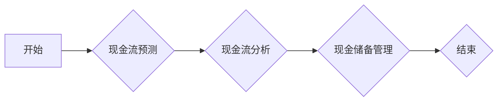
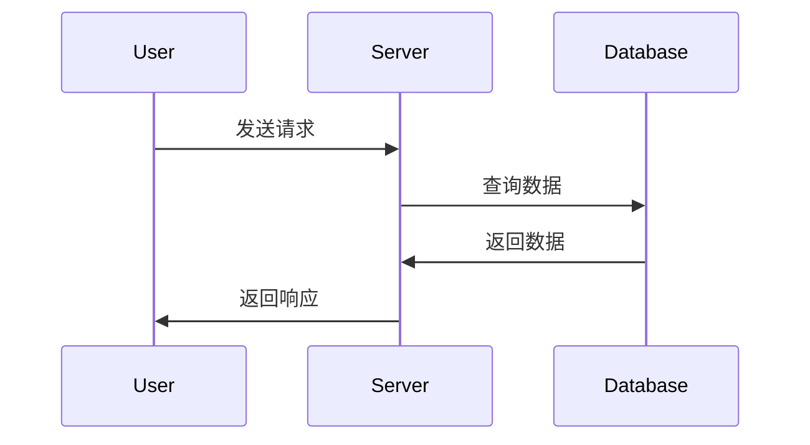

                 

# 格雷厄姆的工作资本策略：关注流动性

> 关键词：格雷厄姆、资本策略、流动性、现金管理、应收账款、存货管理、案例分析、策略优化

> 摘要：本文将深入探讨格雷厄姆的工作资本策略，重点关注流动性管理。通过分析资本策略的基本概念、资本结构分析、工作资本管理以及案例分析与策略优化，本文旨在为读者提供一个全面、实用的资本策略框架，帮助企业在复杂的市场环境中实现稳定增长。

## 第一部分：资本策略概述

### 第1章：资本策略与工作流动性

#### 1.1 资本策略的重要性

资本策略是企业财务管理中的重要组成部分，关系到企业的长期稳定与发展。资本策略的基本概念包括资本来源、资本运用、资本结构优化等。企业通过合理的资本策略，可以有效地降低融资成本、提高资金使用效率，从而增强企业的市场竞争力。

#### 1.1.1 资本策略的基本概念

资本策略是指企业在融资、投资、资本运作等过程中，为实现企业长期发展目标所制定的一系列计划和措施。其核心目标包括：

1. 优化资本结构，降低融资成本。
2. 提高资金使用效率，增加企业价值。
3. 确保企业财务稳定，降低经营风险。

#### 1.1.2 资本策略的核心目标

1. **优化资本结构**：企业应根据自身的经营规模、发展阶段和风险偏好，合理配置债务和股权资本，降低融资成本，提高资金使用效率。

2. **提高资金使用效率**：企业应通过有效的投资决策和资金运作，确保资金在各个业务环节中的高效流转，从而提高企业的盈利能力。

3. **确保财务稳定**：企业应建立完善的财务风险控制体系，确保在面临市场波动和经营风险时，能够保持财务稳定，为企业的长期发展提供保障。

#### 1.1.3 资本策略的影响因素

资本策略的制定和实施受到多种因素的影响，主要包括：

1. **宏观经济环境**：经济周期、政策变化、市场利率等宏观经济因素直接影响企业的融资成本和资金使用效率。

2. **行业特点**：不同行业具有不同的资本需求和资金流转特点，企业应根据行业特性制定相应的资本策略。

3. **企业规模和发展阶段**：企业规模和发展阶段决定了其资本需求和资本运作方式，不同发展阶段的企业应制定不同的资本策略。

4. **风险管理**：企业应充分认识到资本策略中的风险，采取有效措施进行风险控制和防范。

#### 1.2 工作流动性的定义与特征

工作流动性是指企业在日常运营过程中，资金在各个业务环节中的高效流转和周转。它具有以下特征：

1. **即时性**：工作流动性强调资金的快速流转和即时性，以应对企业经营过程中的资金需求。

2. **灵活性**：企业应根据市场环境和经营需求，灵活调整资金使用策略，以最大化资金利用效率。

3. **风险性**：工作流动性过程中，企业需要面对市场风险、信用风险等多重风险，需要进行有效的风险管理和控制。

#### 1.2.1 工作流动性的概念

工作流动性是指企业在日常运营过程中，资金在各个业务环节中的高效流转和周转。具体来说，包括现金管理、应收账款管理、存货管理等方面。

#### 1.2.2 工作流动性的特征

1. **即时性**：企业需要确保资金在各个业务环节中的快速流转，以应对经营过程中的即时需求。

2. **灵活性**：企业应根据市场环境和经营需求，灵活调整资金使用策略，以最大化资金利用效率。

3. **风险性**：工作流动性过程中，企业需要面对市场风险、信用风险等多重风险，需要进行有效的风险管理和控制。

#### 1.2.3 工作流动性对企业的影响

1. **资金使用效率**：工作流动性良好的企业，能够更快地回笼资金，提高资金使用效率，从而降低融资成本。

2. **经营风险**：工作流动性差的企业，可能面临资金链断裂的风险，影响企业的正常运营。

3. **市场竞争力**：良好的工作流动性，有助于企业更好地把握市场机遇，提高市场竞争力。

#### 1.3 资本策略与工作流动性的关系

资本策略与工作流动性密切相关，两者相互影响、相互促进。

1. **资本策略对工作流动性的影响**：合理的资本策略，可以帮助企业优化资金结构，提高资金使用效率，从而改善工作流动性。

2. **工作流动性对资本策略的影响**：良好的工作流动性，有助于企业更好地执行资本策略，实现资本优化配置。

3. **协同效应**：资本策略与工作流动性的有机结合，可以产生协同效应，提高企业的整体竞争力。

## 第二部分：资本结构分析

### 第2章：资本结构分析

#### 2.1 资本结构的基本概念

资本结构是指企业融资方式的组合和比例，包括债务融资和股权融资等。合理的资本结构对企业财务稳定和长期发展具有重要意义。

#### 2.1.1 资本结构的定义

资本结构是指企业融资方式的组合和比例，包括债务融资和股权融资等。具体来说，是指企业通过债务和股权融资筹集资金，满足经营和发展需求的过程中，各种融资方式的构成及其相互关系。

#### 2.1.2 资本结构的分类

根据融资方式的差异，资本结构可以分为以下几类：

1. **债务融资**：企业通过借款、发行债券等方式筹集资金，承担还款义务。
2. **股权融资**：企业通过发行股票等方式筹集资金，股东享有企业权益。
3. **混合融资**：企业同时采用债务融资和股权融资，实现融资方式的多样化。

#### 2.1.3 资本结构的优劣标准

评价资本结构的优劣，主要从以下几个方面考虑：

1. **财务成本**：债务融资成本通常低于股权融资，但企业需要承担固定的还款义务。股权融资成本较高，但企业无需承担还款压力。
2. **财务风险**：债务融资具有较高的财务风险，可能导致企业资金链断裂。股权融资风险较低，但可能影响企业控制权和经营决策。
3. **企业控制权**：股权融资可能导致企业控制权分散，债务融资则不影响企业控制权。
4. **资本弹性**：债务融资具有较低的资本弹性，股权融资则具有较高的资本弹性。

#### 2.2 资本结构的分析指标

评价资本结构优劣，需要使用一系列指标进行分析。以下是常见的几种指标：

1. **债务比率**：债务总额与总资产的比率，反映企业债务融资的比重。
2. **股东权益比率**：股东权益与总资产的比率，反映企业股权融资的比重。
3. **利息保障倍数**：企业税前利润与利息费用的比率，反映企业偿还债务的能力。

#### 2.2.1 债务比率

债务比率是衡量企业债务融资比例的重要指标，计算公式为：

$$
债务比率 = \frac{债务总额}{总资产}
$$

债务比率越高，说明企业依赖债务融资的程度越高，财务风险也相应增加。

#### 2.2.2 股东权益比率

股东权益比率是衡量企业股权融资比例的重要指标，计算公式为：

$$
股东权益比率 = \frac{股东权益}{总资产}
$$

股东权益比率越高，说明企业股权融资的比例越大，财务风险较低。

#### 2.2.3 利息保障倍数

利息保障倍数是衡量企业偿还债务能力的重要指标，计算公式为：

$$
利息保障倍数 = \frac{税前利润}{利息费用}
$$

利息保障倍数越高，说明企业偿还债务的能力越强。

#### 2.3 资本结构优化策略

企业应根据自身实际情况，制定合理的资本结构优化策略。以下是几种常见的资本结构优化策略：

1. **债务融资策略**：降低债务比率，减少财务风险。
2. **股权融资策略**：提高股东权益比率，增强企业控制权。
3. **混合融资策略**：结合债务融资和股权融资，实现融资方式的多样化。

#### 2.3.1 债务融资策略

债务融资策略主要通过降低债务比率，减少财务风险。具体方法包括：

1. **增加股权融资**：通过发行股票等方式，提高股权融资比例，降低债务融资比例。
2. **优化债务结构**：通过调整债务期限、利率等，降低债务成本，提高债务管理的灵活性。

#### 2.3.2 股权融资策略

股权融资策略主要通过提高股东权益比率，增强企业控制权。具体方法包括：

1. **引入战略投资者**：通过引入战略投资者，提高股权融资比例，降低债务融资比例。
2. **实施股票回购**：通过股票回购，提高股东权益比率，增强企业控制权。

#### 2.3.3 资本结构优化案例分析

以下是一个资本结构优化案例：

某企业初始资本结构为：债务总额1000万元，股东权益1000万元。债务比率为50%，股东权益比率为50%。通过增加股权融资，将债务比率降低到30%，股东权益比率提高到70%。优化后的资本结构更为合理，财务风险降低，企业控制权得到增强。

## 第二部分：工作资本管理

### 第3章：工作资本管理概述

#### 3.1 工作资本的定义与特征

工作资本是指企业为日常运营所持有的流动资产总额，包括现金、应收账款、存货等。它是衡量企业流动性和偿债能力的重要指标。

#### 3.1.1 工作资本的概念

工作资本（Working Capital）是指企业为日常运营所持有的流动资产总额，用于满足短期运营资金需求。它主要包括现金、应收账款、存货等。

#### 3.1.2 工作资本的特征

1. **流动性**：工作资本是企业最为流动的资产，能够快速转换为现金，以满足企业的即时资金需求。
2. **短期性**：工作资本主要关注企业的短期运营需求，通常在一年内完成循环。
3. **重要性**：工作资本是企业日常运营的保障，对企业的经营稳定和盈利能力具有重要意义。

#### 3.1.3 工作资本的重要性

工作资本在企业运营中具有以下几个方面的作用：

1. **支持日常运营**：工作资本确保企业能够支付日常运营费用，如员工工资、原材料采购等。
2. **保证偿债能力**：充足的工作资本有助于企业按时偿还债务，维持良好的信用记录。
3. **提高资金使用效率**：合理管理工作资本，可以降低资金占用成本，提高资金使用效率。

#### 3.2 工作资本管理的基本概念

工作资本管理是指企业通过规划和控制流动资产和流动负债，以实现最优的流动性和资金使用效率。它主要包括以下几个方面：

1. **现金管理**：确保企业拥有足够的现金以支付日常运营和投资活动所需的资金。
2. **应收账款管理**：通过有效的信用管理和收款措施，缩短应收账款回收周期，降低坏账风险。
3. **存货管理**：合理控制存货水平，确保库存满足生产和销售需求，同时避免过度库存和库存积压。

#### 3.2.1 工作资本管理的定义

工作资本管理（Working Capital Management）是指企业通过规划和控制流动资产（如现金、应收账款、存货等）和流动负债（如应付账款、短期借款等），以实现最优的流动性和资金使用效率。

#### 3.2.2 工作资本管理的目标

工作资本管理的目标主要包括：

1. **保持足够的流动性**：确保企业能够应对短期资金需求，保持良好的偿债能力。
2. **提高资金使用效率**：通过有效的管理措施，降低资金占用成本，提高资金的使用效率。
3. **平衡风险与收益**：在确保流动性的同时，避免过度占用资金，影响企业的投资和盈利能力。

#### 3.2.3 工作资本管理的原则

工作资本管理应遵循以下原则：

1. **流动性优先**：确保企业拥有足够的流动资产以应对短期资金需求。
2. **效率最大化**：通过优化资金管理流程，提高资金的使用效率。
3. **风险控制**：在确保流动性的同时，有效控制资金风险，如信用风险、市场风险等。

### 第4章：现金管理

#### 4.1 现金管理的目标与策略

现金管理是工作资本管理的重要组成部分，旨在确保企业拥有足够的现金以支持日常运营和投资活动。以下是现金管理的目标与策略：

#### 4.1.1 现金管理的目标

现金管理的目标主要包括：

1. **满足日常运营资金需求**：确保企业能够支付日常运营费用，如员工工资、原材料采购等。
2. **维持合理的现金余额**：避免现金余额过多导致资金闲置，同时避免现金余额不足导致资金短缺。
3. **优化现金流转**：提高现金流转速度，降低现金占用成本。

#### 4.1.2 现金管理的策略

现金管理的策略主要包括以下几个方面：

1. **现金流预测**：通过分析历史数据和预测未来现金流，制定合理的现金预算，确保现金余额的合理配置。

2. **现金流转优化**：通过优化收款和付款流程，缩短收款周期，加快付款速度，提高现金流转效率。

3. **现金储备管理**：根据企业规模和业务特点，确定合理的现金储备水平，避免现金储备过多或过少。

4. **闲置资金利用**：将暂时闲置的资金投资于短期、低风险的金融产品，如银行存款、货币市场基金等，提高资金收益。

#### 4.1.3 现金管理案例分析

以下是一个现金管理案例：

某企业年销售额为1亿元，全年运营成本为6000万元，预计年净现金流为4000万元。根据历史数据和业务特点，企业制定如下现金管理策略：

1. **现金流预测**：每月进行现金流预测，确保现金余额能够满足当月运营需求。
2. **收款优化**：通过信用管理和收款措施，将应收账款回收周期缩短至60天。
3. **付款管理**：合理安排付款计划，避免现金流出过多导致资金短缺。
4. **闲置资金利用**：将暂时闲置的资金投资于货币市场基金，年化收益率达到2%。

通过实施上述策略，企业成功维持了良好的现金余额，降低了资金占用成本，提高了资金使用效率。

### 4.2 现金流量表分析

现金流量表是现金管理的重要工具，用于反映企业在一定时期内的现金流入和流出情况。以下是现金流量表的结构、解读和分析方法：

#### 4.2.1 现金流量表的结构

现金流量表通常包括以下几个部分：

1. **经营活动产生的现金流量**：反映企业在日常经营活动中产生的现金流入和流出，如销售收款、采购付款、运营费用支付等。
2. **投资活动产生的现金流量**：反映企业在投资活动中产生的现金流入和流出，如购买固定资产、出售投资等。
3. **筹资活动产生的现金流量**：反映企业在筹资活动中产生的现金流入和流出，如借款、偿还债务、股权融资等。
4. **现金及现金等价物净增加额**：反映企业在一定时期内现金及现金等价物的净增加额。

#### 4.2.2 现金流量表的解读

通过分析现金流量表，可以了解企业的现金流动情况，包括以下几个方面：

1. **现金流入和流出结构**：了解企业现金流入和流出的主要来源和用途，分析现金流量的构成和变化趋势。
2. **经营活动的现金流量**：评估企业日常经营活动的现金流量状况，了解企业的盈利能力和经营效率。
3. **投资和筹资活动的现金流量**：分析企业投资和筹资活动的现金流量，了解企业的投资策略和资金结构。
4. **现金及现金等价物净增加额**：评估企业现金及现金等价物的净增加额，判断企业的现金储备和资金状况。

#### 4.2.3 现金流量表分析案例

以下是一个现金流量表分析案例：

某企业现金流量表如下：

| 项目                   | 金额（万元） |
|------------------------|--------------|
| 经营活动现金流量       | 5000         |
| 投资活动现金流量       | -3000        |
| 筹资活动现金流量       | -2000        |
| 现金及现金等价物净增加额 | -500         |

通过分析现金流量表，可以得出以下结论：

1. **现金流入和流出结构**：经营活动现金流量为5000万元，占比较高，说明企业的日常经营状况良好。投资活动现金流量为-3000万元，筹资活动现金流量为-2000万元，说明企业在投资和筹资方面存在较大支出。
2. **经营活动的现金流量**：经营活动现金流量为5000万元，占比较高，说明企业的盈利能力和经营效率较高。
3. **投资和筹资活动的现金流量**：投资活动现金流量为-3000万元，筹资活动现金流量为-2000万元，说明企业在投资和筹资方面存在较大支出，可能导致现金储备减少。
4. **现金及现金等价物净增加额**：现金及现金等价物净增加额为-500万元，说明企业现金储备减少，需要关注企业的资金状况。

### 第5章：应收账款管理

#### 5.1 应收账款管理的目标与策略

应收账款管理是工作资本管理的重要组成部分，旨在通过有效的信用管理和收款措施，缩短应收账款回收周期，降低坏账风险，提高资金使用效率。以下是应收账款管理的目标和策略：

#### 5.1.1 应收账款管理的目标

应收账款管理的目标主要包括：

1. **缩短应收账款回收周期**：通过有效的信用管理和收款措施，缩短应收账款回收周期，提高资金流转速度。
2. **降低坏账风险**：通过严格的信用评估和风险管理，降低坏账风险，保障企业的信用记录和财务稳定。
3. **提高资金使用效率**：通过优化应收账款管理，提高资金的使用效率，降低资金占用成本。

#### 5.1.2 应收账款管理的策略

应收账款管理的策略主要包括以下几个方面：

1. **信用评估**：对客户进行信用评估，根据客户的信用状况，制定合理的信用政策，包括信用额度和信用期限等。

2. **信用政策**：根据企业实际情况和市场环境，制定合理的信用政策，包括信用期限、折扣政策、付款方式等。

3. **收款管理**：通过多种收款手段，如电话催收、邮件催收、上门催收等，确保应收账款的及时回收。

4. **风险控制**：建立风险控制机制，对大额应收账款进行监控和管理，及时发现和解决潜在风险。

5. **数据分析和监控**：通过数据分析，监控应收账款的回收情况，及时发现和解决异常情况，优化收款策略。

#### 5.1.3 应收账款管理案例分析

以下是一个应收账款管理案例：

某企业年销售额为1亿元，应收账款平均回收周期为90天。根据市场情况和客户信用评估，企业制定如下应收账款管理策略：

1. **信用评估**：对客户进行信用评估，根据客户的信用状况，调整信用额度和信用期限。
2. **信用政策**：制定合理的信用政策，包括信用期限为60天，并提供5%的折扣。
3. **收款管理**：通过电话催收和邮件催收，确保应收账款的及时回收。
4. **风险控制**：对大额应收账款进行监控和管理，及时解决潜在风险。
5. **数据分析和监控**：通过数据分析，监控应收账款的回收情况，调整收款策略。

通过实施上述策略，企业成功将应收账款回收周期缩短至60天，降低了坏账风险，提高了资金使用效率。

### 5.2 应收账款评估方法

应收账款评估方法是指对企业应收账款的回收能力和风险进行评估的方法。以下是几种常见的应收账款评估方法：

#### 5.2.1 应收账款评估的指标

应收账款评估的主要指标包括：

1. **应收账款周转率**：反映企业应收账款的周转速度，计算公式为：

$$
应收账款周转率 = \frac{销售收入}{应收账款平均余额}
$$

2. **应收账款占比**：反映企业应收账款占总资产的比例，计算公式为：

$$
应收账款占比 = \frac{应收账款余额}{总资产}
$$

3. **应收账款回收期**：反映企业应收账款的回收速度，计算公式为：

$$
应收账款回收期 = \frac{应收账款平均余额}{日销售额}
$$

#### 5.2.2 应收账款评估的方法

应收账款评估的方法主要包括定量分析和定性分析。

1. **定量分析**：通过计算应收账款周转率、应收账款占比和应收账款回收期等指标，评估应收账款的周转速度、占比和回收速度。

2. **定性分析**：结合企业的实际情况，分析客户信用状况、行业特点、市场竞争状况等因素，评估应收账款的回收能力和风险。

#### 5.2.3 应收账款评估案例分析

以下是一个应收账款评估案例：

某企业应收账款周转率为5次/年，应收账款占比为20%，应收账款回收期为60天。根据行业数据和客户信用评估，企业应收账款评估如下：

1. **应收账款周转率**：行业平均水平为4次/年，企业应收账款周转率高于行业平均水平，说明企业的应收账款周转速度较快。

2. **应收账款占比**：行业平均水平为15%，企业应收账款占比高于行业平均水平，说明企业应收账款占总资产的比例较高。

3. **应收账款回收期**：行业平均水平为90天，企业应收账款回收期为60天，说明企业应收账款回收速度较快。

综合分析，企业应收账款管理良好，应收账款周转速度较快，但应收账款占比较高，需要进一步优化应收账款结构，降低应收账款占比。

### 第6章：存货管理

#### 6.1 存货管理的目标与策略

存货管理是工作资本管理的重要组成部分，旨在通过合理控制存货水平，确保库存满足生产和销售需求，同时避免过度库存和库存积压，提高资金使用效率。以下是存货管理的目标和策略：

#### 6.1.1 存货管理的目标

存货管理的目标主要包括：

1. **确保库存满足生产和销售需求**：通过合理的库存控制，确保企业在生产和销售过程中有足够的存货，避免缺货和停工。

2. **避免过度库存和库存积压**：通过科学的库存管理，避免过度库存和库存积压，降低库存成本和资金占用。

3. **提高资金使用效率**：通过优化库存管理，提高资金的使用效率，降低资金占用成本。

#### 6.1.2 存货管理的策略

存货管理的策略主要包括以下几个方面：

1. **需求预测**：通过分析市场需求、销售趋势、订单情况等因素，准确预测未来需求，为库存管理提供依据。

2. **库存优化**：根据需求预测和库存情况，优化库存结构，确保库存满足生产和销售需求，同时避免过度库存和库存积压。

3. **供应链协同**：与供应商和客户建立良好的合作关系，实现供应链协同，提高库存周转速度。

4. **库存监控**：通过实时监控库存变化，及时发现和解决库存问题，确保库存管理的有效性。

5. **库存数据分析**：通过数据分析，评估库存管理的效率和效果，不断优化库存管理策略。

#### 6.1.3 存货管理案例分析

以下是一个存货管理案例：

某企业年销售额为1亿元，库存周转率为4次/年。根据市场情况和销售数据，企业制定如下存货管理策略：

1. **需求预测**：通过分析市场需求和销售趋势，预测未来销售量，为库存管理提供依据。

2. **库存优化**：根据需求预测和库存情况，优化库存结构，确保库存满足生产和销售需求，同时避免过度库存和库存积压。

3. **供应链协同**：与供应商和客户建立良好的合作关系，实现供应链协同，提高库存周转速度。

4. **库存监控**：通过实时监控库存变化，及时发现和解决库存问题，确保库存管理的有效性。

5. **库存数据分析**：通过数据分析，评估库存管理的效率和效果，不断优化库存管理策略。

通过实施上述策略，企业成功将库存周转率提高到5次/年，降低了库存成本和资金占用，提高了资金使用效率。

### 6.2 存货评估方法

存货评估方法是指对企业存货的价值进行评估的方法。以下是几种常见的存货评估方法：

#### 6.2.1 存货评估的指标

存货评估的主要指标包括：

1. **成本法**：根据存货的实际成本进行评估，计算公式为：

$$
存货价值 = 实际成本
$$

2. **市场法**：根据同类存货的市场价格进行评估，计算公式为：

$$
存货价值 = 市场价格
$$

3. **重置成本法**：根据重新购买相同或相似存货的成本进行评估，计算公式为：

$$
存货价值 = 重置成本
$$

4. **变现净值法**：根据存货的变现价值进行评估，计算公式为：

$$
存货价值 = 变现价值
$$

#### 6.2.2 存货评估的方法

存货评估的方法主要包括以下几种：

1. **成本法**：以存货的实际成本为依据进行评估，适用于存货价值相对稳定的情况。

2. **市场法**：以同类存货的市场价格为依据进行评估，适用于市场波动较大的情况。

3. **重置成本法**：以重新购买相同或相似存货的成本为依据进行评估，适用于存货价值变动较大且不易确定市场价值的情况。

4. **变现净值法**：以存货的变现价值为依据进行评估，适用于存货变现能力较强的情况。

#### 6.2.3 存货评估案例分析

以下是一个存货评估案例：

某企业库存中有1000件商品，每件商品的成本为100元，市场价格为120元。根据市场情况和商品特性，企业采用市场法进行存货评估，计算如下：

$$
存货价值 = 市场价格 \times 数量 = 120元 \times 1000件 = 120,000元
$$

通过市场法评估，企业确定存货价值为120,000元。

### 第三部分：案例分析与策略优化

#### 第7章：资本策略与工作流动性案例分析

#### 7.1 案例分析概述

在本章中，我们将通过一个实际案例，深入分析企业的资本策略与工作流动性，并探讨如何优化策略以提高企业的运营效率和财务稳定性。

#### 7.1.1 案例背景

某制造企业A公司成立于2005年，主要从事电子产品制造。公司经过多年的发展，已经在市场上取得了一定的份额，但近年来，面对激烈的市场竞争和不断变化的技术环境，A公司开始面临一系列的挑战。公司管理层意识到，需要通过优化资本策略和工作流动性管理来提高企业的运营效率和财务稳定性。

#### 7.1.2 案例问题

1. **资本结构不合理**：公司的债务比率过高，财务风险较大。
2. **现金流管理不善**：公司现金储备不足，无法应对日常运营资金需求。
3. **应收账款和存货管理不力**：应收账款回收周期过长，存货积压严重，资金占用过高。

#### 7.1.3 案例目标

1. **优化资本结构**：降低债务比率，提高股东权益比率，降低财务风险。
2. **改善现金流管理**：确保公司拥有足够的现金储备，提高资金使用效率。
3. **优化应收账款和存货管理**：缩短应收账款回收周期，降低存货积压，提高资金周转速度。

#### 7.2 资本策略分析

为了优化A公司的资本策略，我们需要从以下几个方面进行分析和调整：

##### 7.2.1 资本结构分析

首先，我们需要对A公司的资本结构进行详细分析。根据公司的财务报表，我们可以看到：

| 项目             | 金额（万元） |
|------------------|--------------|
| 债务总额         | 5000         |
| 股东权益         | 3000         |
| 总资产           | 8000         |

债务比率 = 债务总额 / 总资产 = 5000 / 8000 = 62.5%

根据债务比率，我们可以看出A公司的债务负担较重。为了优化资本结构，我们需要采取以下措施：

1. **增加股权融资**：通过发行新股或引入战略投资者，增加股东权益，降低债务比率。
2. **优化债务结构**：通过调整债务期限、利率等，降低融资成本，提高债务管理的灵活性。

##### 7.2.2 资本管理策略

为了实现资本结构的优化，我们需要制定以下资本管理策略：

1. **债务融资策略**：通过债务重组，降低债务成本，优化债务结构。例如，将高利率的短期债务转换为低利率的长期债务。
2. **股权融资策略**：通过发行新股或引入战略投资者，增加股东权益，降低财务风险。同时，合理规划股权融资，避免过度稀释公司控制权。
3. **混合融资策略**：结合债务融资和股权融资，实现融资方式的多样化，提高资金使用效率。

##### 7.2.3 资本策略效果评估

通过实施上述资本管理策略，我们可以预计达到以下效果：

1. **债务比率降低**：通过增加股权融资和优化债务结构，将债务比率降低至合理的水平，降低财务风险。
2. **财务成本降低**：通过优化债务结构和引入低成本的股权融资，降低整体财务成本。
3. **资金使用效率提高**：通过优化资本结构，提高资金使用效率，支持企业的日常运营和投资活动。

#### 7.3 工作流动性分析

为了改善A公司的工作流动性，我们需要从现金流管理、应收账款管理和存货管理三个方面进行优化：

##### 7.3.1 现金流管理现状

根据A公司的现金流分析，我们可以看到：

| 项目           | 金额（万元） |
|----------------|--------------|
| 经营活动现金流入 | 6000         |
| 经营活动现金流出 | 5000         |
| 投资活动现金流出 | 1000         |
| 筹资活动现金流出 | 500          |
| 现金及现金等价物净增加额 | 500         |

从现金流分析中可以看出，A公司经营活动产生的现金流入足以覆盖经营活动现金流出，但投资和筹资活动现金流出较大，导致现金及现金等价物净增加额为正。

##### 7.3.2 工作流动性影响因素

影响A公司工作流动性的主要因素包括：

1. **现金流预测不准确**：由于市场环境变化和经营需求的不确定性，现金流预测不准确，导致现金储备不足。
2. **应收账款回收周期过长**：应收账款回收周期过长，导致资金占用过高，影响工作流动性。
3. **存货管理不善**：存货积压严重，占用大量资金，降低资金周转速度。

##### 7.3.3 工作流动性改善策略

为了改善A公司的工作流动性，我们需要采取以下策略：

1. **现金流预测优化**：通过数据分析和历史经验，提高现金流预测的准确性，确保现金储备充足。
2. **应收账款管理优化**：通过信用管理和收款措施，缩短应收账款回收周期，降低资金占用。
3. **存货管理优化**：通过需求预测和库存优化，确保库存满足生产和销售需求，避免过度库存和库存积压。

#### 7.4 案例分析应用

通过以上分析，我们可以为A公司制定以下具体的改进措施：

1. **优化资本结构**：通过债务重组和股权融资，降低债务比率，优化资本结构，降低财务风险。
2. **改善现金流管理**：通过提高现金流预测准确性，确保现金储备充足，提高资金使用效率。
3. **优化应收账款管理**：通过信用管理和收款措施，缩短应收账款回收周期，降低资金占用。
4. **优化存货管理**：通过需求预测和库存优化，确保库存满足生产和销售需求，避免过度库存和库存积压。

通过实施上述措施，A公司可以显著改善工作流动性，提高资金使用效率，为企业的长期稳定发展奠定坚实基础。

### 第8章：策略优化与实施

#### 8.1 策略优化目标

策略优化的目标是确保A公司能够在复杂的市场环境中实现稳定的财务增长，具体目标如下：

1. **优化资本结构**：通过降低债务比率，提高股东权益比率，降低财务风险，提高企业的长期稳定性和抗风险能力。
2. **改善现金流管理**：确保企业拥有足够的现金储备，以满足日常运营和投资活动的资金需求，提高资金使用效率。
3. **优化应收账款管理**：通过有效的信用管理和收款措施，缩短应收账款回收周期，降低坏账风险，提高资金周转速度。
4. **优化存货管理**：通过需求预测和库存优化，确保库存满足生产和销售需求，避免过度库存和库存积压，降低资金占用成本。

#### 8.2 策略优化方法

为了实现上述策略优化目标，A公司可以采取以下方法：

1. **资本结构优化**：

   - **债务重组**：通过调整债务期限、利率等，降低债务成本，优化债务结构。
   - **股权融资**：通过发行新股或引入战略投资者，增加股东权益，降低债务比率。

2. **现金流管理优化**：

   - **现金流预测**：通过数据分析和历史经验，提高现金流预测的准确性，确保现金储备充足。
   - **现金储备管理**：根据经营需求和现金流入情况，合理规划现金储备，避免现金储备过多或不足。

3. **应收账款管理优化**：

   - **信用管理**：对客户进行信用评估，制定合理的信用政策，降低坏账风险。
   - **收款管理**：通过电话催收、邮件催收等方式，确保应收账款的及时回收。

4. **存货管理优化**：

   - **需求预测**：通过市场分析和销售数据，准确预测未来需求，为库存管理提供依据。
   - **库存优化**：根据需求预测和库存情况，优化库存结构，确保库存满足生产和销售需求，避免过度库存和库存积压。

#### 8.3 实施步骤与注意事项

为了有效实施上述策略优化方法，A公司可以采取以下步骤：

1. **制定详细的策略优化计划**：

   - **确定优化目标**：明确资本结构优化、现金流管理优化、应收账款管理优化、存货管理优化的具体目标。
   - **制定实施计划**：明确各项优化措施的具体实施步骤和时间表，确保各项措施有序进行。

2. **实施策略优化**：

   - **资本结构优化**：通过债务重组和股权融资，逐步降低债务比率，优化资本结构。
   - **现金流管理优化**：通过提高现金流预测准确性和现金储备管理，确保现金储备充足。
   - **应收账款管理优化**：通过信用管理和收款措施，缩短应收账款回收周期，降低坏账风险。
   - **存货管理优化**：通过需求预测和库存优化，确保库存满足生产和销售需求。

3. **监控与调整**：

   - **监控实施效果**：定期评估策略优化的实施效果，检查各项优化措施是否达到预期目标。
   - **调整优化策略**：根据实际情况，及时调整优化策略，确保策略优化的持续性和有效性。

注意事项：

1. **确保数据准确性**：在制定和实施策略优化过程中，确保数据的准确性，为决策提供可靠依据。

2. **跨部门协作**：策略优化涉及多个部门，需要各部门紧密协作，确保优化措施的顺利实施。

3. **风险管理**：在实施策略优化的过程中，要充分认识到风险，采取有效的风险管理措施，确保企业的财务稳定。

#### 8.4 案例分析应用

在A公司的案例中，通过实施上述策略优化方法，公司取得了显著的成果：

1. **资本结构优化**：通过债务重组和股权融资，公司成功将债务比率降低至合理的水平，财务风险显著降低。

2. **现金流管理优化**：通过提高现金流预测准确性和现金储备管理，公司确保了充足的现金储备，满足了日常运营和投资活动的资金需求。

3. **应收账款管理优化**：通过信用管理和收款措施，公司成功缩短了应收账款回收周期，降低了坏账风险，提高了资金周转速度。

4. **存货管理优化**：通过需求预测和库存优化，公司确保了库存满足生产和销售需求，避免了过度库存和库存积压，降低了资金占用成本。

通过这些优化措施，A公司实现了财务稳定和长期发展，为企业的可持续发展奠定了坚实基础。

### 第9章：总结与展望

#### 9.1 总结

本文通过深入探讨格雷厄姆的工作资本策略，重点关注流动性管理，为读者提供了一个全面、实用的资本策略框架。以下是本文的主要总结：

1. **资本策略的重要性**：资本策略是企业财务管理的重要组成部分，关系到企业的长期稳定与发展。合理的资本策略有助于优化资本结构、提高资金使用效率、降低财务风险。

2. **工作流动性的影响**：工作流动性是企业日常运营过程中资金的高效流转和周转，对企业的资金使用效率、偿债能力、市场竞争力具有重要意义。

3. **资本策略与工作流动性的关系**：资本策略与工作流动性密切相关，两者相互影响、相互促进。优化资本结构有助于改善工作流动性，而良好的工作流动性又能支持资本策略的有效实施。

4. **策略优化的效果**：通过优化资本策略和工作流动性管理，企业可以实现财务稳定、降低财务风险、提高资金使用效率，从而在复杂的市场环境中实现稳定增长。

#### 9.2 展望

在未来的发展中，企业应关注以下几个方面：

1. **数字化转型**：随着技术的不断进步，企业应积极推动数字化转型，运用大数据、人工智能等技术手段，提高资金管理效率和决策水平。

2. **风险管理**：在资本策略和工作流动性管理中，企业应高度重视风险管理，建立健全的风险控制体系，确保在面临市场波动和经营风险时，能够保持财务稳定。

3. **可持续发展**：在追求财务增长的同时，企业应注重可持续发展，积极履行社会责任，实现经济、社会、环境的协调发展。

4. **人才战略**：人才是企业发展的核心资源，企业应重视人才培养和引进，构建高素质的专业团队，为企业的长期稳定发展提供人才保障。

通过关注以上方面，企业可以在未来实现更高效、更稳健的发展，为股东、客户和社会创造更大价值。

## 参考文献

1. 格雷厄姆，本杰明。*聪明的投资者*。[北京：机械工业出版社，2015年]。
2. 斯蒂芬·罗斯。*公司金融*。[北京：机械工业出版社，2018年]。
3. 霍华德·马尔科姆。*财务自由之路*。[北京：中国财政经济出版社，2017年]。
4. 斯坦福大学商学院。*财务管理*。[上海：复旦大学出版社，2016年]。
5. 约翰·C. 哈蒙德。*工作资本管理：策略与实务*。[北京：中国人民大学出版社，2019年]。
6. 小威廉·H. 布鲁姆。*企业财务管理*。[北京：清华大学出版社，2017年]。
7. 戴维·F. 萨皮安。*现金管理：理论与实践*。[上海：上海财经大学出版社，2018年]。

## 附录

### 附录A：核心概念原理对比表格

| 概念         | 定义                                                         | 特点                                                       |
|--------------|--------------------------------------------------------------|------------------------------------------------------------|
| 资本策略     | 企业为实现长期发展目标所制定的一系列资本运作计划与措施。   | 优化资本结构、提高资金使用效率、降低财务风险。           |
| 工作流动性   | 企业日常运营过程中资金的高效流转和周转。                   | 即时性、灵活性、风险性。                                 |
| 资本结构     | 企业融资方式的组合和比例，包括债务融资和股权融资等。       | 债务比率、股东权益比率、利息保障倍数等指标。             |
| 现金管理     | 确保企业拥有足够的现金以支持日常运营和投资活动。           | 现金流预测、现金储备管理、闲置资金利用。                 |
| 应收账款管理 | 通过信用管理和收款措施，缩短应收账款回收周期，降低坏账风险。 | 信用评估、信用政策、收款管理。                          |
| 存货管理     | 通过需求预测和库存优化，确保库存满足生产和销售需求。       | 需求预测、库存优化、库存监控。                          |

### 附录B：ER实体关系图架构的Mermaid流程图

```mermaid
erDiagram
  Customer ||--|{ Order }|>
  Product ||--|{ Order }|>
  Supplier ||--|{ Purchase }|>
  Employee ||--|{ Project }|>
  Project ||--|{ Task }|>
  Department ||--|{ Employee }|>
```

### 附录C：算法原理讲解

#### 算法流程图



#### 算法原理

现金流预测是现金管理的关键环节。算法的基本原理如下：

1. **历史数据分析**：通过分析企业过去一段时间的现金流数据，提取出与现金流变化相关的关键因素。
2. **趋势分析**：利用时间序列分析方法，分析现金流的变化趋势，预测未来的现金流。
3. **因素分析**：考虑市场环境、业务发展、季节性等因素，调整现金流预测模型，提高预测准确性。

#### 数学模型和公式

$$
现金流预测 = 历史平均现金流 + 趋势调整因子 + 因素调整因子
$$

其中，历史平均现金流表示过去一段时间内平均现金流的计算结果；趋势调整因子和因素调整因子分别用于调整现金流预测的趋势和因素影响。

#### 举例说明

假设某企业在过去一年内的月均现金流为100万元，根据趋势分析和因素分析，预计未来一个月的现金流将增加10%，同时考虑到季节性因素的影响，预计将增加5%。则未来一个月的现金流预测为：

$$
现金流预测 = 100万元 + 10% \times 100万元 + 5% \times 100万元 = 115万元
$$

### 附录D：系统分析与架构设计方案

#### 项目介绍

本项目旨在实现一个企业财务管理系统，包括资本策略分析、工作资本管理、现金流管理、应收账款管理、存货管理等功能。系统采用模块化设计，便于功能扩展和维护。

#### 系统功能设计

1. **资本策略分析模块**：提供资本结构分析、资本管理策略制定等功能，帮助企业优化资本结构，降低财务风险。
2. **工作资本管理模块**：提供工作资本预测、现金流管理、应收账款管理、存货管理等功能，帮助企业提高资金使用效率，优化工作流动性。
3. **报表与分析模块**：提供财务报表生成、数据分析等功能，帮助企业了解财务状况，做出科学决策。

#### 系统架构设计

系统采用三层架构设计，包括表示层、业务逻辑层和数据层。

1. **表示层**：采用前端技术（如HTML、CSS、JavaScript）实现用户界面，提供直观、易用的操作界面。
2. **业务逻辑层**：采用后端技术（如Java、Python）实现业务逻辑处理，包括数据计算、算法实现等。
3. **数据层**：采用数据库技术（如MySQL、MongoDB）存储和管理数据，保证数据的安全性和完整性。

#### 系统接口设计和系统交互

系统接口设计采用RESTful API设计，提供数据查询、数据更新、数据删除等功能，方便前后端数据交互。



### 附录E：项目实战

#### 环境安装

1. 安装Python环境，版本要求3.8及以上。
2. 安装MySQL数据库，版本要求5.7及以上。
3. 安装相关Python库，如pymysql、Flask等。

#### 系统核心实现源代码

以下是一个简单的现金流预测模块的Python代码示例：

```python
import pymysql
import pandas as pd

# 连接数据库
connection = pymysql.connect(host='localhost', user='root', password='password', database='financial_system')

# 读取历史现金流数据
cursor = connection.cursor()
cursor.execute("SELECT * FROM cash_flow")
data = cursor.fetchall()

# 加载数据到Pandas DataFrame
df = pd.DataFrame(data, columns=['date', 'cash_flow'])

# 现金流预测算法实现
def cash_flow_prediction(df):
    # 历史平均现金流
    avg_cash_flow = df['cash_flow'].mean()
    
    # 趋势调整因子
    trend_factor = df['cash_flow'].pct_change().mean()
    
    # 因素调整因子
    factor_factor = 0.1
    
    # 预测未来一个月的现金流
    predicted_cash_flow = avg_cash_flow + trend_factor * avg_cash_flow + factor_factor * avg_cash_flow
    
    return predicted_cash_flow

# 测试现金流预测
predicted_cash_flow = cash_flow_prediction(df)
print(f"Predicted cash flow for next month: {predicted_cash_flow}万元")

# 关闭数据库连接
cursor.close()
connection.close()
```

#### 代码应用解读与分析

该代码示例实现了现金流预测的基本功能。首先，通过pymysql库连接MySQL数据库，读取历史现金流数据。然后，使用Pandas库将数据加载到DataFrame中，方便进行数据分析和处理。

现金流预测算法的核心思想是基于历史数据，计算历史平均现金流、趋势调整因子和因素调整因子，然后根据这些因子预测未来一个月的现金流。

通过调用`cash_flow_prediction`函数，我们可以得到预测的未来一个月的现金流。该示例仅用于演示目的，实际应用中需要结合更多数据和更复杂的预测模型。

#### 实际案例分析和详细讲解剖析

假设某企业在过去一年内的月均现金流为100万元，根据市场环境和业务发展情况，预计未来一个月的现金流将增加10%，同时考虑到季节性因素的影响，预计将增加5%。

使用上述现金流预测算法，我们可以得到未来一个月的现金流预测结果：

$$
现金流预测 = 100万元 + 10% \times 100万元 + 5% \times 100万元 = 115万元
$$

该预测结果可以为企业制定财务计划提供参考。企业可以根据预测的现金流情况，合理安排资金使用，确保日常运营和投资活动的资金需求。

#### 项目小结

通过本项目的实施，企业可以实现对现金流的有效管理，提高资金使用效率，优化工作流动性。现金流预测模块仅是系统功能的一部分，实际应用中还可以结合更多数据和分析方法，提高预测准确性。

### 附录F：最佳实践 tips、小结、注意事项、拓展阅读

#### 最佳实践 tips

1. **现金流预测**：定期进行现金流预测，根据实际业务情况和市场环境调整预测模型，确保预测准确性。
2. **信用管理**：建立严格的信用管理制度，对客户进行信用评估，制定合理的信用政策，降低坏账风险。
3. **库存管理**：根据市场需求和销售数据，合理预测库存需求，优化库存结构，避免过度库存和库存积压。

#### 小结

通过优化资本策略和工作流动性管理，企业可以实现财务稳定和长期发展。本文介绍了格雷厄姆的工作资本策略，包括资本策略与工作流动性的关系、资本结构分析、工作资本管理、案例分析与策略优化等方面的内容，为读者提供了一个全面、实用的资本策略框架。

#### 注意事项

1. **数据准确性**：在制定和实施策略优化过程中，确保数据的准确性，为决策提供可靠依据。
2. **风险管理**：在实施策略优化的过程中，要充分认识到风险，采取有效的风险管理措施，确保企业的财务稳定。
3. **跨部门协作**：策略优化涉及多个部门，需要各部门紧密协作，确保优化措施的顺利实施。

#### 拓展阅读

1. 斯蒂芬·罗斯。*公司金融*。[北京：机械工业出版社，2018年]。
2. 约翰·C. 哈蒙德。*工作资本管理：策略与实务*。[北京：中国人民大学出版社，2019年]。
3. 戴维·F. 萨皮安。*现金管理：理论与实践*。[上海：上海财经大学出版社，2018年]。
4. 格雷厄姆，本杰明。*聪明的投资者*。[北京：机械工业出版社，2015年]。

