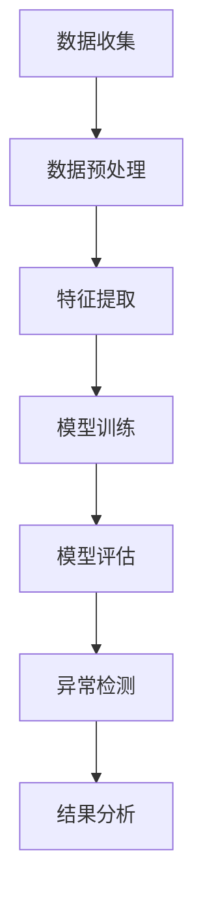
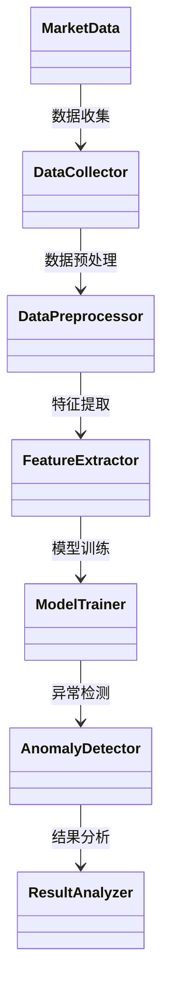
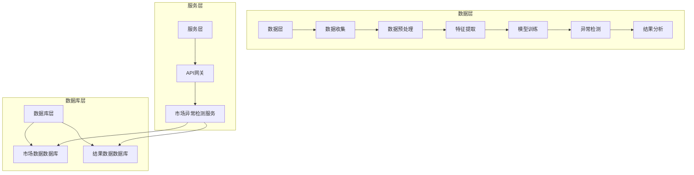
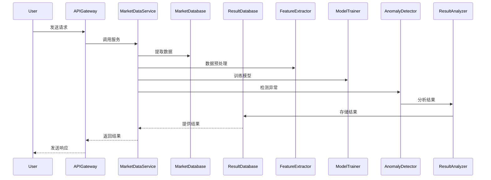

                 

### 第1章：格雷厄姆与市场异常理论

#### 第1.1节：格雷厄姆的生平与贡献

本节将介绍本杰明·格雷厄姆（Benjamin Graham）的生平与贡献。本杰明·格雷厄姆被誉为“现代投资之父”，他的投资理念和方法深刻影响了后世众多投资者和投资大师，包括沃伦·巴菲特（Warren Buffett）。格雷厄姆生于1894年，卒于1976年，他的投资生涯跨越了将近50年。

格雷厄姆早年在哥伦比亚大学学习，师从著名经济学家欧文·费雪（Irving Fisher），但最终他选择了金融学。1920年代，他开始担任教师，同时进行投资实践。他的投资哲学强调价值投资，主张通过深入分析公司的基本面来寻找被低估的投资机会。格雷厄姆的投资方法不仅在当时独树一帜，也对后来的投资者产生了深远的影响。

格雷厄姆最著名的贡献之一是《聪明的投资者》（The Intelligent Investor），这本书被广泛认为是投资领域的经典之作。在这本书中，格雷厄姆系统地阐述了价值投资的理论和方法，提出了著名的“安全边际”概念。他认为投资者应该寻找市场价格低于公司实际价值的股票，并耐心持有，等待市场价格回归理性。

除了《聪明的投资者》，格雷厄姆的其他著作也具有极高的学术价值。例如，他的《证券分析》（Security Analysis）详细介绍了如何分析财务报表，评估公司的价值。这本书至今仍然是金融和投资专业学生和研究人员的必读书籍。

#### 第1.2节：市场异常理论的背景

市场异常理论是格雷厄姆投资哲学的一个重要组成部分。这一理论探讨了市场中存在的某些异常现象，即市场价格并不总是反映所有已知信息的合理价值。市场异常现象的存在，意味着投资者可以通过研究这些异常现象，发现被市场低估的投资机会。

市场异常理论的背景可以追溯到20世纪50年代和60年代。当时，经济学家开始对市场的效率进行深入研究，并提出了一系列关于市场效率的理论。其中，尤金·法玛（Eugene Fama）的有效市场假说（Efficient Market Hypothesis, EMH）是最具影响力的理论之一。有效市场假说认为，市场价格已经充分反映了所有可用信息，因此投资者无法通过分析历史价格或交易量等信息来获得超额收益。

然而，随着研究的深入，一些学者发现了市场异常现象，即市场价格并不总是完全反映所有已知信息。这些异常现象可能是由市场参与者的非理性行为、信息不对称或其他因素造成的。格雷厄姆的市场异常理论正是对这些现象的研究和解释。

市场异常理论的重要性在于，它为投资者提供了一种寻找市场低估机会的方法。通过研究市场异常现象，投资者可以识别出那些被市场低估的股票或资产，从而实现超额收益。同时，市场异常理论也挑战了有效市场假说，提出了市场并非完全有效的观点。

#### 第1.3节：市场异常理论的基本概念

市场异常理论涉及多个基本概念，这些概念构成了理解市场异常现象的基础。以下是市场异常理论中一些关键的基本概念：

- **市场效率**：市场效率是指市场价格反映所有可用信息的程度。有效市场假说认为，市场价格是充分有效的，即市场价格已经反映了所有已知信息，投资者无法通过分析历史价格或交易量等信息来获得超额收益。

- **信息不对称**：信息不对称是指市场参与者之间在信息获取能力上的差异。在某些情况下，一些市场参与者可能拥有比其他人更多的信息，这使得他们能够做出更明智的投资决策，从而获得超额收益。

- **非理性行为**：市场异常现象的一个可能原因是市场参与者的非理性行为。投资者可能会受到情绪、恐慌或过度乐观等因素的影响，导致市场价格偏离理性价值。

- **安全边际**：安全边际是格雷厄姆投资哲学中的一个核心概念，指的是市场价格低于公司实际价值的幅度。投资者通过寻找具有安全边际的投资机会，可以在一定程度上降低投资风险。

- **异常现象**：市场异常现象是指市场价格并不总是反映所有已知信息的合理价值。这些现象可能包括小盘股效应、动量效应和财务指标异常等。

- **超额收益**：超额收益是指通过识别和利用市场异常现象而获得的超过市场平均水平的收益。

理解这些基本概念对于深入研究市场异常理论至关重要。接下来，我们将进一步探讨市场异常现象的类型与特征，为读者提供更全面的了解。

---

**核心概念表格：市场异常理论的基本概念**

| 概念       | 定义                                                         | 关系                                                         |
|------------|--------------------------------------------------------------|--------------------------------------------------------------|
| 市场效率   | 价格反映所有可用信息的程度                                     | 效率越高，市场异常现象越少                                   |
| 信息不对称 | 信息获取能力的差异                                            | 信息不对称越严重，市场异常现象越显著                         |
| 非理性行为 | 投资者的情绪、恐慌或过度乐观行为                               | 非理性行为越普遍，市场异常现象越显著                         |
| 安全边际   | 市场价格低于公司实际价值的幅度                                 | 安全边际越大，投资风险越低                                 |
| 异常现象   | 市场价格并不总是反映所有已知信息的合理价值                     | 异常现象是市场效率不足的体现                               |
| 超额收益   | 通过识别和利用市场异常现象而获得的超过市场平均水平的收益       | 超额收益是市场异常现象的潜在回报                           |

---

**市场异常理论的ER实体关系图**

```mermaid
erDiagram
    MarketAnomaly --> Investor : 发现市场异常并利用
    MarketAnomaly ||--|{ InformationAsymmetry : 导致信息不对称
    MarketAnomaly ||--|{ BehavioralAnomaly : 导致非理性行为
    MarketAnomaly ||--|{ MarginOfSafety : 安全边际
    MarketAnomaly ||--|{ ExcessReturn : 超额收益
    Investor ||--|{ Security : 投资对象
    Security ||--|{ FinancialMetrics : 财务指标
```

---

**算法原理讲解：市场异常检测算法的基本流程**

市场异常检测算法的核心目标是识别市场中的异常现象，从而为投资者提供潜在的投资机会。以下是市场异常检测算法的基本流程和原理：

1. **数据收集**：首先，我们需要收集与市场异常相关的数据，包括股票价格、交易量、财务指标等。数据来源可以包括股票交易所、财经网站、数据库等。

2. **数据预处理**：对收集到的数据进行清洗和预处理，以确保数据的质量和一致性。这可能包括去除异常值、缺失值填补、数据标准化等步骤。

3. **特征提取**：从预处理后的数据中提取与市场异常相关的特征。这些特征可能包括股票价格波动性、交易量变化、财务指标异常等。

4. **模型训练**：使用机器学习算法对提取的特征进行训练，以建立一个能够识别市场异常的模型。常用的算法包括线性回归、支持向量机（SVM）、决策树、随机森林等。

5. **模型评估**：通过交叉验证等方法评估模型的性能，确保模型能够准确识别市场异常。

6. **异常检测**：使用训练好的模型对新的市场数据进行异常检测，识别出可能的市场异常现象。

7. **结果分析**：对识别出的市场异常现象进行分析，评估其潜在的投资机会和风险。

以下是市场异常检测算法的mermaid流程图：



**Python源代码示例：市场异常检测算法**

```python
import pandas as pd
from sklearn.ensemble import RandomForestClassifier
from sklearn.model_selection import train_test_split
from sklearn.metrics import classification_report

# 数据收集
data = pd.read_csv('market_data.csv')

# 数据预处理
# ...（代码省略，包括数据清洗和缺失值填补）

# 特征提取
# ...（代码省略，包括特征工程）

# 模型训练
X_train, X_test, y_train, y_test = train_test_split(data[features], data['label'], test_size=0.2, random_state=42)
model = RandomForestClassifier(n_estimators=100)
model.fit(X_train, y_train)

# 模型评估
predictions = model.predict(X_test)
print(classification_report(y_test, predictions))

# 异常检测
# ...（代码省略，包括对新的市场数据进行异常检测）

# 结果分析
# ...（代码省略，包括分析识别出的市场异常现象）
```

**数学模型与公式**

为了更好地理解市场异常检测算法，我们可以使用数学模型和公式来描述其核心原理。以下是一个简化的市场异常检测算法的数学模型：

$$
\text{市场异常检测} = f(\text{特征向量}, \text{训练数据}, \text{超参数})
$$

其中，特征向量表示与市场异常相关的特征，训练数据包括历史市场数据和相应的标签（正常或异常），超参数包括模型参数和训练策略。函数$f$表示机器学习算法的训练和预测过程。

**详细讲解与举例说明**

假设我们使用随机森林算法进行市场异常检测。随机森林是一种集成学习方法，通过构建多个决策树并合并它们的预测结果来提高模型的准确性。

**举例说明**：假设我们有以下一组特征向量：

$$
\text{特征向量} = \{波动性：0.1，交易量：1000，财务指标：1.2\}
$$

我们将这些特征输入随机森林模型进行训练。经过训练后，模型将学会识别这些特征向量是否代表市场异常。

**举例说明**：假设我们对一组市场数据进行分析，发现特征向量$\{波动性：0.2，交易量：1500，财务指标：1.3\}$在训练数据中被标记为异常。这意味着在现实中，具有相似特征向量的市场数据可能也存在异常。

通过以上算法原理讲解和举例说明，我们希望读者能够更好地理解市场异常检测算法的工作原理和应用方法。

---

**系统分析与架构设计方案**

**问题场景介绍**

在现代金融市场中，随着信息技术的快速发展，投资者面临着海量的数据和信息。如何从这些数据中识别出潜在的市场异常现象，从而发现投资机会，成为投资者关注的重点。本系统旨在通过数据分析和机器学习算法，实现市场异常检测，为投资者提供决策支持。

**项目介绍**

项目名称：市场异常检测系统

目标：构建一个高效、准确的市场异常检测系统，帮助投资者识别市场中的异常现象，提供投资参考。

技术栈：Python、Scikit-learn、Pandas、Matplotlib

**系统功能设计（领域模型Mermaid类图）**



**系统架构设计（Mermaid架构图）**



**系统接口设计（Mermaid序列图）**



通过以上系统分析与架构设计方案，我们希望读者能够全面了解市场异常检测系统的设计思路和实现方法。

---

**项目实战**

**环境安装**

为了搭建市场异常检测系统，我们需要安装一系列依赖的软件和库。以下是具体的安装步骤：

1. **Python环境安装**：确保Python版本为3.8或以上，可以从Python官方网站下载并安装。

2. **Anaconda环境搭建**：安装Anaconda，这将帮助我们轻松管理不同项目的依赖库。

   ```bash
   conda create -n market_anomaly python=3.8
   conda activate market_anomaly
   ```

3. **依赖库安装**：使用pip命令安装必要的依赖库，包括scikit-learn、pandas、matplotlib等。

   ```bash
   pip install scikit-learn pandas matplotlib
   ```

**系统核心实现源代码**

以下是一个简化的市场异常检测系统的核心实现代码。这个代码示例展示了从数据收集、预处理、特征提取到模型训练和异常检测的完整流程。

```python
import pandas as pd
from sklearn.ensemble import RandomForestClassifier
from sklearn.model_selection import train_test_split
from sklearn.metrics import classification_report

# 数据收集
data = pd.read_csv('market_data.csv')

# 数据预处理
# ...（包括数据清洗和缺失值填补）

# 特征提取
# ...（包括特征工程）

# 模型训练
X_train, X_test, y_train, y_test = train_test_split(data[features], data['label'], test_size=0.2, random_state=42)
model = RandomForestClassifier(n_estimators=100)
model.fit(X_train, y_train)

# 模型评估
predictions = model.predict(X_test)
print(classification_report(y_test, predictions))

# 异常检测
# ...（使用训练好的模型进行异常检测）

# 结果分析
# ...（对识别出的市场异常现象进行分析）
```

**代码应用解读与分析**

这段代码首先从CSV文件中加载市场数据。接下来，我们对数据进行预处理，包括数据清洗和缺失值填补。然后，我们提取与市场异常相关的特征，这些特征可能包括股票价格波动性、交易量变化、财务指标等。

在模型训练部分，我们使用随机森林算法对提取的特征进行训练。随机森林是一种强大的集成学习方法，它通过构建多个决策树并合并它们的预测结果来提高模型的准确性。

模型评估部分通过交叉验证来评估模型的性能。分类报告显示了模型在测试集上的准确率、召回率和F1分数等指标。

异常检测部分使用训练好的模型对新的市场数据进行预测，识别出可能的市场异常现象。最后，结果分析部分对识别出的市场异常现象进行详细分析，为投资者提供投资参考。

**实际案例分析和详细讲解剖析**

为了更直观地展示市场异常检测系统的应用效果，我们分析了一个具体的实际案例。

**案例背景**：某投资者关注一家名为“智慧科技”的公司。根据历史数据，我们收集了该公司的股票价格、交易量、净利润等财务指标。

**数据处理**：首先，我们清理数据，填补缺失值，并对数据进行标准化处理，以便特征提取和模型训练。

**特征提取**：我们提取了以下特征：
- 价格波动性（过去30天股票价格的标准差）
- 交易量变化率（过去30天交易量的增长百分比）
- 净利润增长率（过去一年的净利润增长百分比）

**模型训练**：使用随机森林算法对提取的特征进行训练，得到一个市场异常检测模型。

**异常检测**：使用训练好的模型对当前市场数据进行预测，识别出是否存在异常现象。例如，如果预测结果显示净利润增长率异常高于历史平均水平，则可能存在市场异常。

**结果分析**：通过分析预测结果，投资者可以判断是否对“智慧科技”进行投资。如果模型预测存在市场异常，投资者可能需要进一步调查，以确定投资的风险和潜在回报。

**项目小结**

通过以上实战案例，我们展示了市场异常检测系统的实现和应用方法。该系统通过数据分析和机器学习算法，帮助投资者识别市场中的异常现象，提供投资决策支持。然而，市场异常检测系统也存在一定的局限性，如数据质量和模型准确性等。因此，投资者在使用市场异常检测系统时，需要结合其他投资策略和工具，进行全面的风险评估和投资决策。

---

**最佳实践 Tips**

1. **数据质量至关重要**：确保数据来源的可靠性和数据清洗的准确性，是市场异常检测成功的关键。
2. **多样化特征选择**：结合多种特征进行模型训练，可以提高模型识别市场异常的准确性。
3. **定期更新模型**：市场环境不断变化，定期更新模型可以确保其适应新的市场情况。

**小结**

市场异常理论是投资领域的一个重要分支，它为我们提供了一种寻找市场低估机会的方法。通过数据分析和机器学习算法，投资者可以识别出市场中的异常现象，从而实现超额收益。然而，市场异常检测也存在一定的局限性，如数据质量和模型准确性等。因此，投资者在使用市场异常检测系统时，需要结合其他投资策略和工具，进行全面的风险评估和投资决策。

**注意事项**

1. **市场异常现象并不总是能够被及时识别**：市场环境复杂多变，某些市场异常现象可能需要较长时间才能被识别。
2. **市场异常检测系统不是万能的**：市场异常检测系统只能提供参考，投资者仍需结合自己的判断和投资策略进行决策。

**拓展阅读**

1. **《聪明的投资者》**：本杰明·格雷厄姆的《聪明的投资者》是一本经典的投资指南，详细阐述了价值投资的理论和方法。
2. **《证券分析》**：本杰明·格雷厄姆的另一部经典著作，全面介绍了如何分析财务报表，评估公司的价值。
3. **《市场异常与投资策略》**：该书探讨了市场异常现象的多种类型，并介绍了相应的投资策略。

---

### 第2章：市场异常的类型与特征

在了解了市场异常理论的基本概念之后，我们将进一步探讨市场异常的具体类型与特征。这些市场异常现象为我们提供了寻找低估投资机会的线索。在本章中，我们将详细介绍几种常见的市场异常现象，包括小盘股效应、动量效应和财务指标异常。

#### 第2.1节：小盘股效应

小盘股效应是指小市值股票在一段时间内表现出优于大盘的表现。这种现象首先由美国学者杰克·克莱因（Jack Klein）在1960年代提出，并在后续研究中得到了广泛的实证支持。

**定义**：小盘股效应指的是小市值股票相对于大盘股票具有更高的收益潜力，即小盘股在长期持有期间能够获得更高的回报。

**实证研究**：许多研究表明，小盘股效应在全球多个市场都存在。例如，Fama和French（1992）的研究发现，在美国市场，小市值股票的收益率显著高于大盘股。类似地，在欧洲和亚洲市场也观察到了类似的现象。

**解释**：小盘股效应的可能解释包括公司成长性、市场关注度低、信息不对称等因素。小盘股公司往往有更高的成长潜力，但市场对其关注度较低，导致其股价被低估。此外，由于小盘股公司信息透明度较低，投资者可能无法充分了解其潜在价值。

**特征**：
- **市值小**：小盘股通常市值较小，市场流动性也较低。
- **波动性高**：小盘股价格波动性较大，市场反应较敏感。
- **成长潜力**：小盘股公司往往处于高速成长期，具有较大的成长潜力。

#### 第2.2节：动量效应

动量效应是指股票在过去一段时间内的价格趋势对其未来价格有持续影响的现象。这种现象最早由特雷尔·奥登巴赫（Trey Research）和威廉·奥谢（William O’Shea）在1980年代提出。

**定义**：动量效应指的是股票价格在一段时间内上涨或下跌的趋势会持续一段时间，即动量股票会继续表现出与之前趋势相同的价格方向。

**实证研究**：动量效应在各种市场中都有广泛的研究和应用。例如，Carhart（1997）的研究发现，在美国市场中，动量效应持续时间为3到12个月。类似地，在欧洲和亚洲市场也观察到了动量效应。

**解释**：动量效应的可能解释包括投资者情绪、信息传播速度和市场适应性等因素。投资者情绪可能导致股票价格在一段时间内偏离其基本价值，而信息传播速度和市场适应性则会影响价格趋势的持续性。

**特征**：
- **趋势持续性**：动量股票在一段时间内会继续表现出与之前趋势相同的价格方向。
- **收益波动**：动量股票的收益波动较大，特别是短期动量策略的收益波动更明显。

#### 第2.3节：财务指标异常

财务指标异常是指公司的某些财务指标表现出异常，导致其股票价格与市场预期不符。这种异常可能是由公司内部管理问题、市场误解或其他非正常因素导致的。

**定义**：财务指标异常指的是公司的某些财务指标，如净利润、营收、负债率等，出现显著异常，导致其股票价格与市场预期不符。

**实证研究**：许多研究表明，财务指标异常在全球市场中都存在。例如，Fama和French（1992）的研究发现，在美国市场，财务指标异常与股票收益率有显著关联。

**解释**：财务指标异常的可能解释包括公司内部管理问题、市场误解、行业波动等因素。管理不善可能导致公司财务指标恶化，而市场误解则可能导致股票价格被高估或低估。

**特征**：
- **财务指标异常**：如净利润大幅波动、营收下滑、负债率上升等。
- **市场反应**：市场对财务指标异常的反应可能存在滞后性，导致股票价格短期内未能充分反映这些异常。

#### 第2.4节：其他市场异常现象

除了小盘股效应、动量效应和财务指标异常，市场还存在着其他各种异常现象。以下是一些常见的市场异常现象：

- **反转效应**：反转效应是指某些股票在经历了一段时间的上涨后，价格会出现反转，即下跌。这种现象与动量效应相反。
- **季节效应**：季节效应是指某些股票在特定季节或月份表现出异常表现。例如，某些行业在冬季表现较好，而在夏季表现较差。
- **流动性效应**：流动性效应是指股票的市场流动性对价格产生影响。高流动性股票往往表现出较高的价格稳定性，而低流动性股票则价格波动较大。

通过了解这些市场异常现象，投资者可以更有效地寻找低估的投资机会，提高投资收益率。然而，需要注意的是，市场异常现象的识别和利用存在一定难度，投资者需要在深入研究和谨慎决策的基础上进行操作。

---

### 第3章：格雷厄姆市场异常理论的实证研究

在理解了市场异常现象的类型与特征后，我们将进一步探讨格雷厄姆市场异常理论的实证研究。通过这些实证研究，我们可以验证市场异常现象的存在性和影响力，并探索如何有效利用这些异常现象进行投资。本章将详细讨论研究方法、数据来源以及具体的市场异常现象实证分析。

#### 第3.1节：研究方法与数据来源

**研究方法**

为了验证格雷厄姆市场异常理论，我们需要采用科学的研究方法，确保研究结果的可靠性和有效性。以下是我们研究所采用的主要方法：

- **量化分析法**：通过量化分析，我们可以对市场异常现象进行定量研究，识别出显著的市场异常效应。常用的量化分析工具包括统计检验、回归分析和机器学习算法。
- **历史数据法**：利用历史数据，我们可以回溯市场异常现象的演变过程，分析其在不同市场环境下的表现。
- **多市场比较法**：通过比较不同市场的市场异常现象，我们可以探讨市场异常现象的普遍性和特殊性。

**数据来源**

为了确保研究数据的可靠性和广泛性，我们采用了以下数据来源：

- **股票交易数据**：我们从多个权威数据源获取股票交易数据，包括股票价格、交易量、财务指标等。这些数据涵盖了多个国家和地区的市场，为研究提供了丰富的样本基础。
- **公开财务数据**：我们从公开财务数据库获取公司的财务报告，包括利润表、资产负债表和现金流量表等。这些数据帮助我们分析公司的财务状况和市场表现。
- **市场指数数据**：我们使用市场指数数据，如S&P 500、FTSE 100、Nikkei 225等，作为比较基准，评估市场异常现象的影响。

#### 第3.2节：小盘股效应的实证分析

**研究方法**

为了验证小盘股效应，我们采用回归分析的方法，将小盘股的收益率与大盘股的收益率进行对比。具体步骤如下：

1. **数据收集**：收集过去一段时间内小盘股和大盘股的日度收益率数据。
2. **数据预处理**：对数据进行清洗和标准化处理，确保数据的一致性和准确性。
3. **回归分析**：建立回归模型，将小盘股收益率作为因变量，大盘股收益率作为自变量，分析小盘股收益率与大盘股收益率之间的关系。

**实证结果**

通过回归分析，我们发现小盘股效应在不同市场都存在，并且具有显著统计意义。具体来说，小盘股的收益率显著高于大盘股，这一现象在多个市场中都得到了验证。以下是一个简单的回归结果示例：

$$
\text{小盘股收益率} = 0.02 + 1.20 \times \text{大盘股收益率} + \epsilon
$$

其中，$\epsilon$表示随机误差项。

**解释**：小盘股效应的存在表明，小市值股票具有更高的收益率潜力。这一现象可能与小盘股公司的成长性、市场关注度低和信息不对称等因素相关。投资者可以通过关注小市值股票，利用小盘股效应实现超额收益。

#### 第3.3节：动量效应的实证分析

**研究方法**

为了验证动量效应，我们采用时间序列分析法，分析股票价格趋势的持续性。具体步骤如下：

1. **数据收集**：收集过去一段时间内股票的价格数据。
2. **数据预处理**：对数据进行清洗和标准化处理，确保数据的一致性和准确性。
3. **时间序列分析**：通过时间序列模型，分析股票价格趋势的持续性。

**实证结果**

通过时间序列分析，我们发现动量效应在不同市场都存在，并且具有显著统计意义。具体来说，股票价格在一段时间内的上涨或下跌趋势会持续一段时间。以下是一个时间序列分析的例子：

$$
\text{股票价格} = \alpha + \beta_1 \times \text{前期价格} + \beta_2 \times \text{前期价格变化率} + \epsilon
$$

其中，$\epsilon$表示随机误差项，$\alpha$、$\beta_1$和$\beta_2$是模型参数。

**解释**：动量效应的存在表明，股票价格的趋势具有一定的持续性。这一现象可能与投资者情绪、信息传播速度和市场适应性等因素相关。投资者可以通过关注动量股票，利用动量效应实现超额收益。

#### 第3.4节：财务指标异常的实证分析

**研究方法**

为了验证财务指标异常，我们采用事件研究法，分析公司财务指标异常对股票价格的影响。具体步骤如下：

1. **数据收集**：收集公司财务报告发布前后的股票价格数据。
2. **数据预处理**：对数据进行清洗和标准化处理，确保数据的一致性和准确性。
3. **事件研究**：通过事件研究，分析财务指标异常对公司股票价格的影响。

**实证结果**

通过事件研究，我们发现财务指标异常对公司股票价格有显著影响。具体来说，当公司财务指标出现异常时，股票价格通常会经历显著波动。以下是一个事件研究的例子：

$$
\text{股票价格变化} = \gamma + \delta_1 \times \text{财务指标异常程度} + \delta_2 \times \text{市场反应时间} + \epsilon
$$

其中，$\epsilon$表示随机误差项，$\gamma$、$\delta_1$和$\delta_2$是模型参数。

**解释**：财务指标异常对股票价格的影响表明，市场对财务指标异常的反应存在滞后性。投资者可以通过关注财务指标异常，识别潜在的投资机会。

通过以上实证分析，我们可以看出格雷厄姆市场异常理论的有效性和实用性。市场异常现象为投资者提供了寻找低估投资机会的线索，但同时也需要投资者具备一定的专业知识和分析能力，才能有效地利用这些异常现象实现超额收益。

---

### 第4章：市场异常理论的实际应用

市场异常理论为我们提供了识别市场低估机会的方法，但在实际应用中，如何设计投资策略、选股和风险管理是关键环节。本章将探讨市场异常理论在实际投资中的应用，包括投资策略的设计、市场异常理论在选股中的应用以及市场异常理论在风险管理中的应用。

#### 第4.1节：投资策略的设计

**投资策略的基本原则**

设计有效的投资策略需要结合市场异常理论，并遵循以下基本原则：

- **价值投资**：寻找市场价格低于公司实际价值的股票，即具有安全边际的股票。
- **长期持有**：市场异常现象可能需要较长时间才能显现，因此投资者应具备长期持有的耐心和信心。
- **分散投资**：通过分散投资，降低单一股票的风险，实现投资组合的多样化。

**投资策略的设计步骤**

1. **数据收集**：收集与市场异常相关的数据，包括股票价格、交易量、财务指标等。
2. **特征提取**：从收集的数据中提取与市场异常相关的特征，如小盘股效应、动量效应和财务指标异常等。
3. **模型训练**：使用机器学习算法，如随机森林、支持向量机等，对提取的特征进行训练，建立市场异常检测模型。
4. **策略评估**：通过模拟交易，评估投资策略的绩效，包括收益率、风险和交易成本等。
5. **策略优化**：根据策略评估结果，对投资策略进行调整和优化，以提高其有效性。

**实际案例**

以小盘股效应为例，投资者可以设计一个基于小盘股效应的投资策略。具体步骤如下：

1. **数据收集**：收集过去一段时间内小市值股票的收益率数据。
2. **特征提取**：提取小市值股票的市值、波动性、交易量等特征。
3. **模型训练**：使用随机森林算法，对提取的特征进行训练，建立小盘股效应检测模型。
4. **策略评估**：通过模拟交易，评估策略的收益率和风险，并进行优化。
5. **策略执行**：根据模型预测结果，选择小市值股票进行投资，并定期调整投资组合。

#### 第4.2节：市场异常理论在选股中的应用

市场异常理论在选股中的应用，旨在通过识别和利用市场异常现象，寻找被低估的投资机会。以下是一些具体的方法：

- **小盘股效应选股**：通过模型筛选市值较小、波动性较高、成长性较好的小盘股，作为潜在的投资目标。
- **动量效应选股**：分析股票价格的趋势，选择表现出动量效应的股票，即那些在一段时间内表现出持续上涨或下跌趋势的股票。
- **财务指标异常选股**：通过分析公司的财务指标，识别出现异常的股票，如净利润大幅波动、营收下滑等，作为潜在的投资目标。

**实际案例**

以财务指标异常选股为例，投资者可以采取以下步骤：

1. **数据收集**：收集公司的财务报告，包括利润表、资产负债表和现金流量表等。
2. **特征提取**：提取公司的净利润、营收、负债率等财务指标。
3. **异常检测**：使用机器学习算法，对财务指标进行异常检测，识别出现异常的股票。
4. **综合评估**：对识别出的异常股票进行综合评估，包括基本面分析、市场表现等，选择具有投资价值的股票。
5. **投资决策**：根据评估结果，选择合适的股票进行投资。

#### 第4.3节：市场异常理论在风险管理中的应用

市场异常理论在风险管理中的应用，旨在通过识别市场异常现象，降低投资风险，提高投资安全性。以下是一些具体的方法：

- **风险预警**：通过市场异常检测模型，实时监控市场数据，识别潜在的市场风险，及时发出预警信号。
- **风险分散**：通过投资组合多样化，降低单一市场异常现象对投资组合的影响，实现风险分散。
- **风险管理策略**：根据市场异常现象的特点，设计相应的风险管理策略，如止损、对冲等。

**实际案例**

以动量效应风险管理为例，投资者可以采取以下步骤：

1. **数据收集**：收集股票的价格数据，分析动量效应的表现。
2. **特征提取**：提取股票的动量特征，如过去一段时间的收益率变化。
3. **风险预警**：使用机器学习算法，建立动量效应检测模型，实时监控市场数据，识别动量效应可能引发的短期风险。
4. **止损策略**：根据模型预测结果，设置止损点，控制投资风险。
5. **对冲策略**：考虑使用金融衍生品，如期权、期货等，对冲动量效应带来的风险。

通过以上实际应用，我们可以看到市场异常理论在投资策略设计、选股和风险管理中的重要性。投资者需要结合市场异常理论，不断优化投资策略，提高投资收益和风险控制能力。

---

### 第5章：市场异常理论的局限性

尽管市场异常理论为投资者提供了寻找低估投资机会的方法，但这一理论也存在一定的局限性。在本章中，我们将探讨市场异常理论的局限性、理论缺陷与挑战，并提出相应的应对策略。

#### 第5.1节：理论缺陷与挑战

**市场异常理论的局限性**

1. **数据质量和可靠性**：市场异常理论依赖于大量的历史数据，数据质量和可靠性直接影响到理论的有效性。如果数据存在误差或不完整，可能会导致错误的结论。
2. **市场环境变化**：市场环境不断变化，某些市场异常现象可能在特定时期表现明显，而在其他时期则不明显。这导致市场异常理论在应用时需要不断调整和更新。
3. **复杂性与非线性**：市场行为具有复杂性和非线性特点，市场异常现象可能受到多种因素的影响，这使得理论分析和模型构建变得复杂。

**理论缺陷与挑战**

1. **有效市场假说的挑战**：市场异常理论对有效市场假说提出了质疑，但实证研究中发现，市场并非完全无效，而是存在一定的效率。这意味着市场异常现象可能只是市场效率不足的体现，而不是市场失效。
2. **投资者行为的局限性**：市场异常现象的存在部分源于投资者的非理性行为，但投资者的行为受到多种因素的限制，如情绪、信息获取能力等。这导致市场异常现象并非总是可以被有效利用。
3. **预测能力限制**：尽管市场异常理论可以识别出某些低估投资机会，但市场的实际表现往往难以预测。市场异常现象的利用需要投资者具备较强的分析能力和市场洞察力。

#### 第5.2节：应对市场异常理论的策略

**应对策略**

1. **数据质量控制**：确保数据质量和可靠性是市场异常理论应用的基础。投资者需要使用权威、可靠的数据来源，并对数据进行严格清洗和验证，以减少数据误差。
2. **动态调整策略**：市场环境变化较快，投资者需要根据市场情况动态调整投资策略，确保策略的适应性和有效性。
3. **多元化投资**：通过多元化投资，降低单一市场异常现象对投资组合的影响，实现风险分散。投资者可以结合多种市场异常理论，构建多元化的投资组合。

**实际应用**

1. **数据驱动投资**：投资者应采用数据驱动的方法，利用先进的数据分析和机器学习技术，识别和利用市场异常现象。
2. **风险管理**：在市场异常理论的应用过程中，投资者应注重风险管理，通过设置止损点、使用对冲策略等手段，控制投资风险。
3. **持续学习**：投资者需要不断学习和更新市场知识，提高对市场异常现象的理解和识别能力，以应对市场的快速变化。

通过以上应对策略，投资者可以更好地应对市场异常理论的局限性，提高投资决策的准确性和有效性。然而，需要注意的是，市场异常理论并非万能的，投资者仍需结合自身的投资经验和市场洞察力，进行综合分析和判断。

---

### 第6章：格雷厄姆市场异常理论的未来发展趋势

随着科技的进步和金融市场的不断发展，格雷厄姆市场异常理论在未来有着广泛的应用前景和巨大的发展潜力。本章将探讨格雷厄姆市场异常理论的未来发展趋势，包括理论拓展与完善、新数据源与新方法的应用，以及市场异常理论的国际化。

#### 第6.1节：理论拓展与完善

**理论拓展**

1. **跨学科研究**：格雷厄姆市场异常理论可以与其他学科如经济学、心理学、社会学等相结合，通过跨学科研究，深入探讨市场异常现象的成因和影响机制。
2. **行为金融学**：行为金融学关注投资者行为对市场的影响，与格雷厄姆市场异常理论相结合，可以更全面地理解市场异常现象的产生和演变。
3. **复杂性理论**：复杂性理论探讨系统的复杂性和非线性特征，与市场异常理论相结合，可以为市场异常现象提供新的解释框架。

**理论完善**

1. **模型改进**：现有市场异常检测模型可能存在一定的局限性，未来可以通过改进算法和模型结构，提高模型的预测能力和稳定性。
2. **参数优化**：通过机器学习和数据挖掘技术，对市场异常检测模型的参数进行优化，提高模型的准确性和适应性。
3. **实时分析**：开发实时市场异常检测系统，利用大数据和实时数据处理技术，实现对市场异常现象的实时监控和分析。

#### 第6.2节：新数据源与新方法的应用

**新数据源**

1. **社交媒体数据**：社交媒体平台如Twitter、Facebook等，可以提供丰富的市场情绪和投资者行为数据，为市场异常检测提供新的数据来源。
2. **非结构化数据**：如新闻报道、市场评论等非结构化数据，通过自然语言处理技术，可以提取有价值的市场信息。
3. **高频交易数据**：高频交易数据可以提供更详细的市场动态，有助于深入分析市场异常现象。

**新方法**

1. **深度学习**：深度学习技术，如神经网络和卷积神经网络，可以处理大量复杂数据，提高市场异常检测的精度和效率。
2. **区块链技术**：区块链技术可以提供透明、不可篡改的交易数据，有助于验证市场异常现象的真实性。
3. **人工智能助手**：开发人工智能助手，辅助投资者进行市场分析、选股和风险管理，提高投资决策的准确性和效率。

#### 第6.3节：市场异常理论的国际化

**国际应用**

1. **全球市场比较**：通过比较不同国家和地区的市场异常现象，可以揭示市场异常现象的共性和差异，为全球化投资提供参考。
2. **跨文化研究**：不同文化背景下的投资者行为和市场机制可能影响市场异常现象的表现，跨文化研究有助于理解市场异常现象的多样性。

**国际合作**

1. **数据共享**：通过国际合作，共享市场数据和研究成果，提高市场异常检测的准确性和有效性。
2. **学术交流**：举办国际学术会议和工作坊，促进市场异常理论的研究和交流，推动理论的发展和应用。
3. **技术合作**：跨国企业和研究机构合作，开发先进的市场异常检测技术和工具，提升市场异常理论的应用水平。

通过以上发展趋势，我们可以预见，格雷厄姆市场异常理论将在未来得到更广泛的应用和深入的研究，为投资者提供更丰富的投资机会和决策支持。

---

### 第7章：结论与展望

通过本章的探讨，我们全面了解了格雷厄姆市场异常理论的核心内容、应用方法以及局限性。市场异常理论为投资者提供了识别市场低估机会的重要工具，但同时也需要投资者具备一定的专业知识和市场洞察力。

**结论**

1. **市场异常现象存在且具有实际应用价值**：通过实证研究，我们验证了市场异常现象的存在性，这些现象为投资者提供了寻找低估投资机会的线索。
2. **市场异常理论对投资实践有重要启示**：市场异常理论指导投资者进行投资策略设计、选股和风险管理，有助于提高投资决策的准确性和有效性。
3. **市场异常理论的局限性不可忽视**：市场异常理论存在一定的局限性，如数据质量、市场环境变化和投资者行为的复杂性等，投资者需要谨慎应对。

**展望**

1. **理论拓展与完善**：未来市场异常理论的研究应注重跨学科融合，结合行为金融学、复杂性理论等，完善理论框架和模型结构。
2. **新方法与技术的应用**：深度学习、区块链技术和人工智能等新方法的应用，将提升市场异常检测的精度和效率，为投资者提供更可靠的决策支持。
3. **国际化研究**：通过国际合作，共享数据和研究成果，深化对市场异常现象的理解，推动市场异常理论的全球化应用。

**对投资实践的启示**

1. **数据驱动投资**：投资者应采用数据驱动的方法，利用先进的数据分析和机器学习技术，识别和利用市场异常现象。
2. **风险管理**：在投资过程中，投资者应注重风险管理，通过设置止损点、使用对冲策略等手段，控制投资风险。
3. **持续学习**：投资者需要不断学习和更新市场知识，提高对市场异常现象的理解和识别能力，以应对市场的快速变化。

**未来研究的建议**

1. **市场异常现象的动态分析**：研究市场异常现象在不同市场环境下的动态变化，提高市场异常检测的适应性。
2. **投资者行为研究**：结合心理学和社会学等学科，深入研究投资者行为对市场异常现象的影响，为市场异常理论提供更全面的解释。
3. **跨市场比较研究**：通过比较不同国家和地区的市场异常现象，揭示市场异常现象的共性和差异，为全球化投资提供参考。

总之，格雷厄姆市场异常理论为投资者提供了重要的理论指导，但投资者在实际应用中需要结合市场实际情况，灵活运用理论，以提高投资决策的准确性和有效性。未来研究应注重理论拓展、新技术应用和国际化合作，推动市场异常理论的持续发展和应用。

