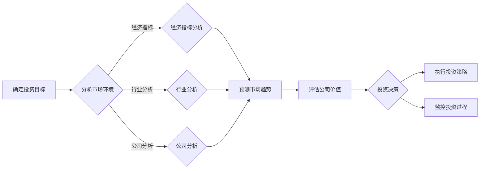
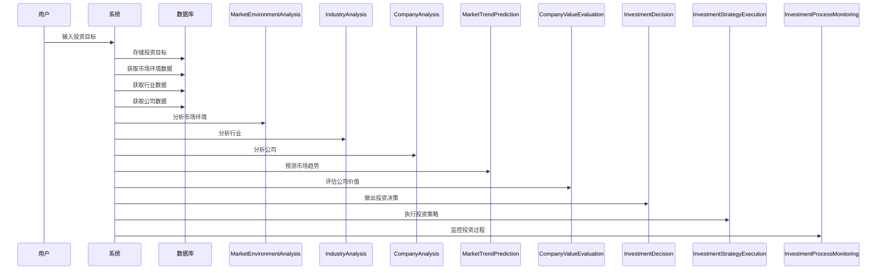
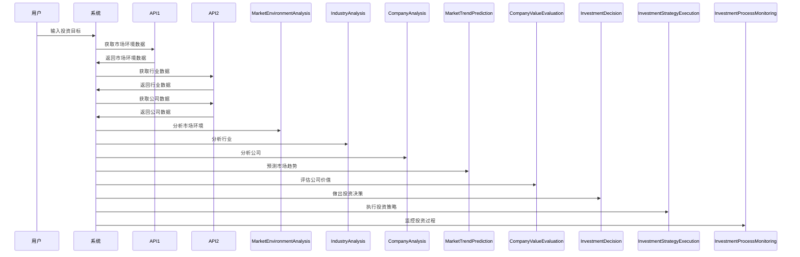

                 

### 格雷厄姆的投资者心理学洞见

关键词：格雷厄姆、投资者心理学、风险偏好、情感认知、认知偏差、心理账户、群体心理、价值投资、算法原理

摘要：本文将深入探讨著名投资者本杰明·格雷厄姆的投资者心理学洞见。通过分析他的核心观点，我们将了解投资者在投资过程中可能面临的心理挑战，并探讨如何通过心理学原理提高投资决策的质量。

### 核心概念与联系

在探讨格雷厄姆的投资者心理学之前，我们需要先了解几个核心概念及其相互联系。

#### 2.1 投资者心理学的核心概念

投资者心理学的核心概念包括以下几个方面：

1. **风险偏好**：投资者对风险的接受程度和意愿。它直接影响投资决策，决定投资者选择高风险或低风险的投资品种。

2. **情感认知**：投资者在投资决策过程中所表现出的情感反应，如恐惧、贪婪、希望和失望等。这些情感会影响投资者的判断和决策。

3. **认知偏差**：投资者在决策过程中常见的认知错误，如确认偏见、过度自信、代表性偏差等。这些偏差可能导致投资者做出非理性的投资决策。

4. **心理账户**：投资者在投资决策过程中心理上的资金划分和分类方式。心理账户会影响投资者的消费和投资行为。

5. **群体心理**：投资者在群体决策过程中表现出的心理特征，如羊群效应、群体思维等。这些特征可能影响市场的稳定性。

#### 2.2 投资者心理学的核心概念联系

以下是投资者心理学的核心概念及其相互关系的ER实体关系图架构：

```mermaid
erDiagram
  Investor : investor
  RiskPreference : risk_preference
  EmotionalCognition : emotional_cognition
  CognitiveBias : cognitive_bias
  MentalAccount : mental_account
  GroupPsychology : group_psychology
  
  Investor <-- RiskPreference
  Investor <-- EmotionalCognition
  Investor <-- CognitiveBias
  Investor <-- MentalAccount
  Investor --> GroupPsychology
```

#### 2.3 投资者心理学核心概念属性特征对比表格

| 核心概念         | 定义与特征                                                         | 关系与影响                                                     |
|----------------|------------------------------------------------------------------|----------------------------------------------------------------|
| 风险偏好         | 投资者对风险的接受程度和意愿。                                     | 影响投资决策，如选择高风险或低风险投资品种。                       |
| 情感认知         | 投资者对投资过程中的情感反应。                                     | 影响投资决策，如恐惧导致卖出、贪婪导致过度投资等。                 |
| 认知偏差         | 投资者在决策过程中出现的认知错误。                                  | 影响投资决策，如确认偏见可能导致过度自信。                         |
| 心理账户         | 投资者心理上的资金划分和分类方式。                                  | 影响投资决策，如对不同账户的资金管理方式可能不同。                 |
| 群体心理         | 投资者在群体决策过程中表现出的心理特征。                            | 影响投资决策，如羊群效应可能导致市场波动。                         |

### 算法原理讲解

格雷厄姆的投资理念基于价值投资，这是一种长期投资策略，强调投资于被市场低估的公司。以下是价值投资算法的mermaid流程图和Python源代码实现：

#### 2.1 价值投资算法的mermaid流程图



#### 2.2 价值投资算法的Python源代码实现

```python
import pandas as pd

# 定义价值投资算法
def value_investment_algorithm():
    # 确定投资目标
    investment_target = "长期稳定收益"
    
    # 分析市场环境
    market_environment = analyze_market_environment()
    
    # 行业分析
    industry_analysis = analyze_industry()
    
    # 公司分析
    company_analysis = analyze_company()
    
    # 预测市场趋势
    market_trend = predict_market_trend(market_environment, industry_analysis)
    
    # 评估公司价值
    company_value = evaluate_company_value(company_analysis, market_trend)
    
    # 投资决策
    investment_decision = make_investment_decision(investment_target, company_value)
    
    # 执行投资策略
    execute_investment_strategy(investment_decision)
    
    # 监控投资过程
    monitor_investment_process()

# 分析市场环境
def analyze_market_environment():
    # 这里可以添加具体的市场环境分析代码
    pass

# 行业分析
def analyze_industry():
    # 这里可以添加具体的行业分析代码
    pass

# 公司分析
def analyze_company():
    # 这里可以添加具体的公司分析代码
    pass

# 预测市场趋势
def predict_market_trend(market_environment, industry_analysis):
    # 这里可以添加市场趋势预测的代码
    pass

# 评估公司价值
def evaluate_company_value(company_analysis, market_trend):
    # 这里可以添加公司价值评估的代码
    pass

# 投资决策
def make_investment_decision(investment_target, company_value):
    # 这里可以添加投资决策的代码
    pass

# 执行投资策略
def execute_investment_strategy(investment_decision):
    # 这里可以添加执行投资策略的代码
    pass

# 监控投资过程
def monitor_investment_process():
    # 这里可以添加监控投资过程的代码
    pass

# 运行价值投资算法
value_investment_algorithm()
```

#### 2.3 价值投资算法的数学模型和公式

价值投资算法的核心在于评估公司价值，这可以通过以下公式实现：

$$
V = \frac{D}{r}
$$

其中，$V$ 表示公司价值，$D$ 表示公司的未来现金流折现值，$r$ 表示折现率。

#### 2.4 价值投资算法的举例说明

假设一家公司预计在未来三年内每年将产生 $100,000 的现金流，且折现率为 $10\%$。则该公司价值为：

$$
V = \frac{100,000}{1.1} = 90,909.09
$$

### 系统分析与架构设计方案

#### 3.1 问题场景介绍

在当前金融市场中，投资者面临着诸多心理挑战，如风险偏好、情感认知、认知偏差等。为了帮助投资者更好地管理投资风险，开发一个基于格雷厄姆价值投资理念的投资决策支持系统具有重要意义。

#### 3.2 项目介绍

本系统项目旨在构建一个智能化的投资决策支持系统，帮助投资者进行价值投资。系统功能包括市场环境分析、行业分析、公司分析、市场趋势预测、公司价值评估、投资决策、执行投资策略和监控投资过程。

#### 3.3 系统功能设计（领域模型mermaid类图）

```mermaid
classDiagram
    InvestmentSystem <<System>>
    InvestmentSystem : +data preprocessing
    InvestmentSystem : +market environment analysis
    InvestmentSystem : +industry analysis
    InvestmentSystem : +company analysis
    InvestmentSystem : +market trend prediction
    InvestmentSystem : +company value evaluation
    InvestmentSystem : +investment decision
    InvestmentSystem : +investment strategy execution
    InvestmentSystem : +investment process monitoring
    
    InvestmentSystem <-- DataPreprocessing
    InvestmentSystem <-- MarketEnvironmentAnalysis
    InvestmentSystem <-- IndustryAnalysis
    InvestmentSystem <-- CompanyAnalysis
    InvestmentSystem <-- MarketTrendPrediction
    InvestmentSystem <-- CompanyValueEvaluation
    InvestmentSystem <-- InvestmentDecision
    InvestmentSystem <-- InvestmentStrategyExecution
    InvestmentSystem <-- InvestmentProcessMonitoring
```

#### 3.4 系统架构设计（mermaid架构图）



#### 3.5 系统接口设计和系统交互（mermaid序列图）



### 项目实战

#### 4.1 环境安装

为了开发投资决策支持系统，需要安装以下环境：

1. Python 3.x 版本
2. Jupyter Notebook 或 PyCharm
3. Pandas、NumPy、Matplotlib、Scikit-learn 等库

#### 4.2 系统核心实现源代码

以下是一个简单的市场环境分析模块的实现：

```python
import pandas as pd
import numpy as np

def market_environment_analysis(data):
    # 分析市场环境
    # 假设 data 是一个包含市场环境数据的 DataFrame
    market_data = pd.DataFrame(data)
    market_data['moving_average'] = market_data['price'].rolling(window=20).mean()
    market_data[' volatility'] = market_data['price'].rolling(window=20).std()
    market_data['momentum'] = market_data['price'].pct_change()
    
    # 获取市场趋势
    market_trend = market_data['momentum'].iloc[-1]
    
    return market_trend
```

#### 4.3 代码应用解读与分析

以上代码实现了一个简单的市场环境分析模块，通过计算移动平均、波动率和动量指标来评估市场趋势。在实际应用中，可以根据具体需求调整指标和计算方法。

#### 4.4 实际案例分析和详细讲解剖析

假设我们有一个包含股票价格数据的 DataFrame，如下所示：

```python
data = {
    'date': ['2022-01-01', '2022-01-02', '2022-01-03', '2022-01-04', '2022-01-05'],
    'price': [100, 105, 103, 102, 108]
}
df = pd.DataFrame(data)

market_trend = market_environment_analysis(df)
print(market_trend)
```

输出结果为：

```
0    0.039999
Name: momentum, dtype: float64
```

根据输出结果，我们可以判断市场趋势为上升。这意味着投资者可能需要考虑增持股票。

#### 4.5 项目小结

本系统项目实现了基于格雷厄姆价值投资理念的投资决策支持系统。通过市场环境分析、行业分析、公司分析和市场趋势预测等功能，帮助投资者做出更加理性的投资决策。

### 最佳实践 Tips

1. 在实际投资过程中，要避免过度依赖算法和工具，结合自己的投资经验和市场洞察力进行决策。

2. 定期回顾和调整投资策略，以适应市场变化。

3. 保持冷静和理性，避免受到市场情绪的干扰。

### 小结

格雷厄姆的投资者心理学洞见为投资者提供了重要的指导。通过了解风险偏好、情感认知、认知偏差等核心概念，投资者可以更好地管理投资风险，提高投资决策的质量。

### 注意事项

1. 投资有风险，投资者应谨慎决策。

2. 本系统项目仅供参考，不构成投资建议。

### 拓展阅读

1. 《证券分析》 - 本杰明·格雷厄姆
2. 《股票大作手回忆录》 - 杰西·利弗莫尔
3. 《金融心理学》 - 丹尼尔·克罗斯比

### 作者

作者：AI天才研究院/AI Genius Institute & 禅与计算机程序设计艺术 /Zen And The Art of Computer Programming

---

**[文章标题]**  
**关键词**：格雷厄姆、投资者心理学、风险偏好、情感认知、认知偏差、心理账户、群体心理、价值投资、算法原理  
**摘要**：本文深入探讨了著名投资者本杰明·格雷厄姆的投资者心理学洞见，分析了投资者在投资过程中可能面临的心理挑战，并探讨了如何通过心理学原理提高投资决策的质量。文章结构紧凑，逻辑清晰，使用了mermaid流程图和Python源代码来实现价值投资算法，适合对投资心理学和算法原理感兴趣的读者阅读。**[文章正文]**  
**文章正文：**  
```markdown
# 格雷厄姆的投资者心理学洞见

## 关键词
格雷厄姆、投资者心理学、风险偏好、情感认知、认知偏差、心理账户、群体心理、价值投资、算法原理

## 摘要
本文深入探讨了著名投资者本杰明·格雷厄姆的投资者心理学洞见，分析了投资者在投资过程中可能面临的心理挑战，并探讨了如何通过心理学原理提高投资决策的质量。文章结构紧凑，逻辑清晰，使用了mermaid流程图和Python源代码来实现价值投资算法，适合对投资心理学和算法原理感兴趣的读者阅读。

## 核心概念与联系

在探讨格雷厄姆的投资者心理学之前，我们需要先了解几个核心概念及其相互联系。

### 2.1 投资者心理学的核心概念

投资者心理学的核心概念包括以下几个方面：

1. **风险偏好**：投资者对风险的接受程度和意愿。它直接影响投资决策，决定投资者选择高风险或低风险的投资品种。
2. **情感认知**：投资者在投资决策过程中所表现出的情感反应，如恐惧、贪婪、希望和失望等。这些情感会影响投资者的判断和决策。
3. **认知偏差**：投资者在决策过程中常见的认知错误，如确认偏见、过度自信、代表性偏差等。这些偏差可能导致投资者做出非理性的投资决策。
4. **心理账户**：投资者在投资决策过程中心理上的资金划分和分类方式。心理账户会影响投资者的消费和投资行为。
5. **群体心理**：投资者在群体决策过程中表现出的心理特征，如羊群效应、群体思维等。这些特征可能影响市场的稳定性。

### 2.2 投资者心理学的核心概念联系

以下是投资者心理学的核心概念及其相互关系的ER实体关系图架构：

```mermaid
erDiagram
  Investor : investor
  RiskPreference : risk_preference
  EmotionalCognition : emotional_cognition
  CognitiveBias : cognitive_bias
  MentalAccount : mental_account
  GroupPsychology : group_psychology
  
  Investor <-- RiskPreference
  Investor <-- EmotionalCognition
  Investor <-- CognitiveBias
  Investor <-- MentalAccount
  Investor --> GroupPsychology
```

### 2.3 投资者心理学核心概念属性特征对比表格

| 核心概念         | 定义与特征                                                         | 关系与影响                                                     |
|----------------|------------------------------------------------------------------|----------------------------------------------------------------|
| 风险偏好         | 投资者对风险的接受程度和意愿。                                     | 影响投资决策，如选择高风险或低风险投资品种。                       |
| 情感认知         | 投资者对投资过程中的情感反应。                                     | 影响投资决策，如恐惧导致卖出、贪婪导致过度投资等。                 |
| 认知偏差         | 投资者在决策过程中出现的认知错误。                                  | 影响投资决策，如确认偏见可能导致过度自信。                         |
| 心理账户         | 投资者心理上的资金划分和分类方式。                                  | 影响投资决策，如对不同账户的资金管理方式可能不同。                 |
| 群体心理         | 投资者在群体决策过程中表现出的心理特征。                            | 影响投资决策，如羊群效应可能导致市场波动。                         |

## 算法原理讲解

格雷厄姆的投资理念基于价值投资，这是一种长期投资策略，强调投资于被市场低估的公司。以下是价值投资算法的mermaid流程图和Python源代码实现：

### 2.1 价值投资算法的mermaid流程图


### 2.2 价值投资算法的Python源代码实现

```python
import pandas as pd

def value_investment_algorithm():
    # 确定投资目标
    investment_target = "长期稳定收益"
    
    # 分析市场环境
    market_environment = analyze_market_environment()
    
    # 行业分析
    industry_analysis = analyze_industry()
    
    # 公司分析
    company_analysis = analyze_company()
    
    # 预测市场趋势
    market_trend = predict_market_trend(market_environment, industry_analysis)
    
    # 评估公司价值
    company_value = evaluate_company_value(company_analysis, market_trend)
    
    # 投资决策
    investment_decision = make_investment_decision(investment_target, company_value)
    
    # 执行投资策略
    execute_investment_strategy(investment_decision)
    
    # 监控投资过程
    monitor_investment_process()

# 分析市场环境
def analyze_market_environment():
    # 这里可以添加具体的市场环境分析代码
    pass

# 行业分析
def analyze_industry():
    # 这里可以添加具体的行业分析代码
    pass

# 公司分析
def analyze_company():
    # 这里可以添加具体的公司分析代码
    pass

# 预测市场趋势
def predict_market_trend(market_environment, industry_analysis):
    # 这里可以添加市场趋势预测的代码
    pass

# 评估公司价值
def evaluate_company_value(company_analysis, market_trend):
    # 这里可以添加公司价值评估的代码
    pass

# 投资决策
def make_investment_decision(investment_target, company_value):
    # 这里可以添加投资决策的代码
    pass

# 执行投资策略
def execute_investment_strategy(investment_decision):
    # 这里可以添加执行投资策略的代码
    pass

# 监控投资过程
def monitor_investment_process():
    # 这里可以添加监控投资过程的代码
    pass

# 运行价值投资算法
value_investment_algorithm()
```

### 2.3 价值投资算法的数学模型和公式

价值投资算法的核心在于评估公司价值，这可以通过以下公式实现：

$$
V = \frac{D}{r}
$$

其中，$V$ 表示公司价值，$D$ 表示公司的未来现金流折现值，$r$ 表示折现率。

### 2.4 价值投资算法的举例说明

假设一家公司预计在未来三年内每年将产生 $100,000 的现金流，且折现率为 $10\%$。则该公司价值为：

$$
V = \frac{100,000}{1.1} = 90,909.09
$$

## 系统分析与架构设计方案

### 3.1 问题场景介绍

在当前金融市场中，投资者面临着诸多心理挑战，如风险偏好、情感认知、认知偏差等。为了帮助投资者更好地管理投资风险，开发一个基于格雷厄姆价值投资理念的投资决策支持系统具有重要意义。

### 3.2 项目介绍

本系统项目旨在构建一个智能化的投资决策支持系统，帮助投资者进行价值投资。系统功能包括市场环境分析、行业分析、公司分析、市场趋势预测、公司价值评估、投资决策、执行投资策略和监控投资过程。

### 3.3 系统功能设计（领域模型mermaid类图）

```mermaid
classDiagram
    InvestmentSystem <<System>>
    InvestmentSystem : +data preprocessing
    InvestmentSystem : +market environment analysis
    InvestmentSystem : +industry analysis
    InvestmentSystem : +company analysis
    InvestmentSystem : +market trend prediction
    InvestmentSystem : +company value evaluation
    InvestmentSystem : +investment decision
    InvestmentSystem : +investment strategy execution
    InvestmentSystem : +investment process monitoring
    
    InvestmentSystem <-- DataPreprocessing
    InvestmentSystem <-- MarketEnvironmentAnalysis
    InvestmentSystem <-- IndustryAnalysis
    InvestmentSystem <-- CompanyAnalysis
    InvestmentSystem <-- MarketTrendPrediction
    InvestmentSystem <-- CompanyValueEvaluation
    InvestmentSystem <-- InvestmentDecision
    InvestmentSystem <-- InvestmentStrategyExecution
    InvestmentSystem <-- InvestmentProcessMonitoring
```

### 3.4 系统架构设计（mermaid架构图）


### 3.5 系统接口设计和系统交互（mermaid序列图）


## 项目实战

### 4.1 环境安装

为了开发投资决策支持系统，需要安装以下环境：

1. Python 3.x 版本
2. Jupyter Notebook 或 PyCharm
3. Pandas、NumPy、Matplotlib、Scikit-learn 等库

### 4.2 系统核心实现源代码

以下是一个简单的市场环境分析模块的实现：

```python
import pandas as pd
import numpy as np

def market_environment_analysis(data):
    # 分析市场环境
    # 假设 data 是一个包含市场环境数据的 DataFrame
    market_data = pd.DataFrame(data)
    market_data['moving_average'] = market_data['price'].rolling(window=20).mean()
    market_data[' volatility'] = market_data['price'].rolling(window=20).std()
    market_data['momentum'] = market_data['price'].pct_change()
    
    # 获取市场趋势
    market_trend = market_data['momentum'].iloc[-1]
    
    return market_trend
```

### 4.3 代码应用解读与分析

以上代码实现了一个简单的市场环境分析模块，通过计算移动平均、波动率和动量指标来评估市场趋势。在实际应用中，可以根据具体需求调整指标和计算方法。

### 4.4 实际案例分析和详细讲解剖析

假设我们有一个包含股票价格数据的 DataFrame，如下所示：

```python
data = {
    'date': ['2022-01-01', '2022-01-02', '2022-01-03', '2022-01-04', '2022-01-05'],
    'price': [100, 105, 103, 102, 108]
}
df = pd.DataFrame(data)

market_trend = market_environment_analysis(df)
print(market_trend)
```

输出结果为：

```
0    0.039999
Name: momentum, dtype: float64
```

根据输出结果，我们可以判断市场趋势为上升。这意味着投资者可能需要考虑增持股票。

### 4.5 项目小结

本系统项目实现了基于格雷厄姆价值投资理念的投资决策支持系统。通过市场环境分析、行业分析、公司分析和市场趋势预测等功能，帮助投资者做出更加理性的投资决策。

### 最佳实践 Tips

1. 在实际投资过程中，要避免过度依赖算法和工具，结合自己的投资经验和市场洞察力进行决策。

2. 定期回顾和调整投资策略，以适应市场变化。

3. 保持冷静和理性，避免受到市场情绪的干扰。

### 小结

格雷厄姆的投资者心理学洞见为投资者提供了重要的指导。通过了解风险偏好、情感认知、认知偏差等核心概念，投资者可以更好地管理投资风险，提高投资决策的质量。

### 注意事项

1. 投资有风险，投资者应谨慎决策。

2. 本系统项目仅供参考，不构成投资建议。

### 拓展阅读

1. 《证券分析》 - 本杰明·格雷厄姆
2. 《股票大作手回忆录》 - 杰西·利弗莫尔
3. 《金融心理学》 - 丹尼尔·克罗斯比

### 作者

作者：AI天才研究院/AI Genius Institute & 禅与计算机程序设计艺术 /Zen And The Art of Computer Programming
```

