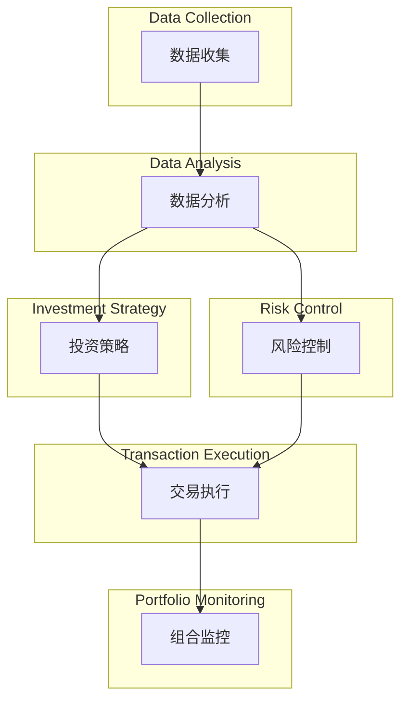
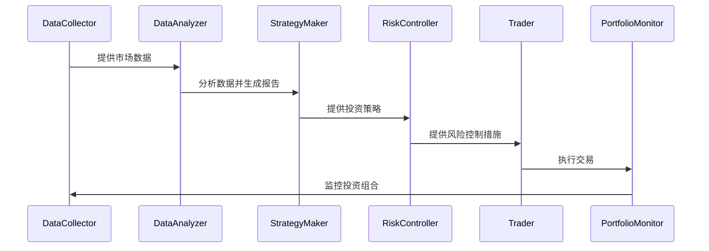
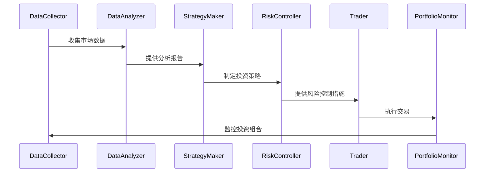

                 

### 第1章 背景介绍

#### 1.1 投资者教育的重要性

投资者教育是指通过一系列的教育活动，帮助投资者增强对金融市场、投资工具和投资策略的理解，提高他们的风险意识和决策能力。投资者教育的核心在于让投资者具备独立思考和判断的能力，以避免盲目跟风和冲动投资。

首先，让我们来看一下投资者教育的定义。投资者教育通常包括以下方面：

- **金融市场知识**：了解金融市场的运作机制、各类金融产品和市场风险。
- **投资工具认知**：掌握股票、债券、基金、期货等投资工具的基本特点、风险收益特性及投资策略。
- **投资决策能力**：学会如何评估投资机会，制定合理的投资计划，并管理投资组合。
- **风险意识培养**：认识风险，学会如何识别和控制风险，保护自己的投资权益。

##### 投资者教育的重要性

投资者教育的重要性体现在以下几个方面：

1. **提高投资者素质**：通过教育，投资者能够更好地理解市场动态，掌握投资技巧，从而提高整体投资素质。
2. **降低投资风险**：投资者教育有助于投资者避免因信息不对称、盲目跟风等导致的投资损失。
3. **促进市场稳定**：提高投资者素质，有助于市场的理性健康发展，减少市场的波动性。
4. **增强投资者信心**：投资者教育可以帮助投资者建立正确的投资心态，增强投资信心，从而稳定市场情绪。

##### 投资者教育的现状与问题

当前，投资者教育的现状存在以下几个问题：

1. **教育资源不足**：优质的投资教育资源相对匮乏，特别是在基层和农村地区。
2. **教育内容单一**：多数投资者教育内容较为单一，缺乏系统性和深度。
3. **教育方法不当**：部分投资者教育采取灌输式教学方法，效果不佳，无法激发投资者的兴趣和主动性。
4. **缺乏持续监督**：投资者教育往往是一次性的，缺乏持续的教育和监督机制。

#### 1.2 格雷厄姆的投资理念

本节将介绍本篇文章的核心人物——本杰明·格雷厄姆（Benjamin Graham）的投资理念。格雷厄姆被誉为“现代投资之父”，他提出的价值投资理念至今仍被广大投资者所推崇。

##### 1.2.1 格雷厄姆的投资哲学

格雷厄姆的投资哲学可以总结为以下几点：

1. **安全边际**：格雷厄姆强调投资者在投资时必须留有一定的安全边际，这意味着投资价格应该低于其内在价值。
2. **长期投资**：格雷厄姆主张投资者应持有优质股票，耐心等待市场认识到其价值，而不是频繁交易。
3. **理性分析**：格雷厄姆认为投资者应该基于理性分析，而不是盲目跟风或受到市场情绪的影响。

##### 1.2.2 格雷厄姆的价值投资理念

格雷厄姆的价值投资理念包括以下几个方面：

1. **内在价值**：格雷厄姆认为股票的价值由其内在价值决定，而不是市场波动所决定。
2. **安全边际**：格雷厄姆强调投资者在购买股票时，应该确保其价格低于其内在价值，以预留足够的安全空间。
3. **基本面分析**：格雷厄姆主张投资者应通过基本面分析，了解公司的盈利能力、财务状况和行业前景，从而评估其内在价值。

##### 1.2.3 格雷厄姆的投资策略

格雷厄姆的投资策略主要包括以下方面：

1. **选择价值被低估的股票**：通过基本面分析，找到那些市场定价低于其内在价值的股票。
2. **分散投资**：格雷厄姆认为投资者应将资金分散投资于不同行业和市场的股票，以分散风险。
3. **长期持有**：格雷厄姆主张投资者应耐心持有优质股票，等待市场认识到其价值。

### 1.3 总结

本节介绍了投资者教育的重要性以及本杰明·格雷厄姆的投资理念。投资者教育对于提高投资者素质、降低投资风险和促进市场稳定具有重要意义。而格雷厄姆的价值投资理念则为投资者提供了一种理性、长期的投资策略，值得我们深入学习和实践。

### 关键词

- 投资者教育
- 格雷厄姆
- 价值投资
- 安全边际
- 长期投资
- 基本面分析

### 摘要

本文介绍了投资者教育的重要性，分析了当前投资者教育的现状与问题，并详细阐述了本杰明·格雷厄姆的投资理念，包括其哲学思想、价值投资理念以及具体的投资策略。通过本文的阅读，读者可以了解到价值投资的核心理念，并学会如何在实际投资中应用这些理念。

### 第1章 背景介绍

#### 1.1 投资者教育的重要性

投资者教育是指通过各种形式的教育活动，帮助投资者提高对金融市场、投资工具和投资策略的理解，增强其风险意识和决策能力，从而实现理性投资。其核心目标是让投资者具备独立思考和判断的能力，避免盲目跟风和冲动投资，提高整体投资素质。

##### 1.1.1 投资者教育的定义

投资者教育涉及多个方面，主要包括：

- **金融市场知识**：了解金融市场的运作机制、各类金融产品和市场风险。
- **投资工具认知**：掌握股票、债券、基金、期货等投资工具的基本特点、风险收益特性及投资策略。
- **投资决策能力**：学会如何评估投资机会，制定合理的投资计划，并管理投资组合。
- **风险意识培养**：认识风险，学会如何识别和控制风险，保护自己的投资权益。

##### 1.1.2 投资者教育的重要性

投资者教育的重要性体现在以下几个方面：

1. **提高投资者素质**：通过教育，投资者能够更好地理解市场动态，掌握投资技巧，从而提高整体投资素质。
2. **降低投资风险**：投资者教育有助于投资者避免因信息不对称、盲目跟风等导致的投资损失。
3. **促进市场稳定**：提高投资者素质，有助于市场的理性健康发展，减少市场的波动性。
4. **增强投资者信心**：投资者教育可以帮助投资者建立正确的投资心态，增强投资信心，从而稳定市场情绪。

##### 1.1.3 投资者教育的现状与问题

当前，投资者教育的现状存在以下几个问题：

1. **教育资源不足**：优质的投资教育资源相对匮乏，特别是在基层和农村地区。
2. **教育内容单一**：多数投资者教育内容较为单一，缺乏系统性和深度。
3. **教育方法不当**：部分投资者教育采取灌输式教学方法，效果不佳，无法激发投资者的兴趣和主动性。
4. **缺乏持续监督**：投资者教育往往是一次性的，缺乏持续的教育和监督机制。

#### 1.2 格雷厄姆的投资理念

本节将介绍本篇文章的核心人物——本杰明·格雷厄姆（Benjamin Graham）的投资理念。格雷厄姆被誉为“现代投资之父”，他提出的价值投资理念至今仍被广大投资者所推崇。

##### 1.2.1 格雷厄姆的投资哲学

格雷厄姆的投资哲学可以总结为以下几点：

1. **安全边际**：格雷厄姆强调投资者在投资时必须留有一定的安全边际，这意味着投资价格应该低于其内在价值。
2. **长期投资**：格雷厄姆主张投资者应持有优质股票，耐心等待市场认识到其价值，而不是频繁交易。
3. **理性分析**：格雷厄姆认为投资者应该基于理性分析，而不是盲目跟风或受到市场情绪的影响。

##### 1.2.2 格雷厄姆的价值投资理念

格雷厄姆的价值投资理念包括以下几个方面：

1. **内在价值**：格雷厄姆认为股票的价值由其内在价值决定，而不是市场波动所决定。
2. **安全边际**：格雷厄姆强调投资者在购买股票时，应该确保其价格低于其内在价值，以预留足够的安全空间。
3. **基本面分析**：格雷厄姆主张投资者应通过基本面分析，了解公司的盈利能力、财务状况和行业前景，从而评估其内在价值。

##### 1.2.3 格雷厄姆的投资策略

格雷厄姆的投资策略主要包括以下方面：

1. **选择价值被低估的股票**：通过基本面分析，找到那些市场定价低于其内在价值的股票。
2. **分散投资**：格雷厄姆认为投资者应将资金分散投资于不同行业和市场的股票，以分散风险。
3. **长期持有**：格雷厄姆主张投资者应耐心持有优质股票，等待市场认识到其价值。

### 1.3 总结

本节介绍了投资者教育的重要性，分析了当前投资者教育的现状与问题，并详细阐述了本杰明·格雷厄姆的投资理念，包括其哲学思想、价值投资理念以及具体的投资策略。通过本文的阅读，读者可以了解到价值投资的核心理念，并学会如何在实际投资中应用这些理念。

### 关键词

- 投资者教育
- 格雷厄姆
- 价值投资
- 安全边际
- 长期投资
- 基本面分析

### 摘要

本文介绍了投资者教育的重要性，分析了当前投资者教育的现状与问题，并详细阐述了本杰明·格雷厄姆的投资理念，包括其哲学思想、价值投资理念以及具体的投资策略。通过本文的阅读，读者可以了解到价值投资的核心理念，并学会如何在实际投资中应用这些理念。

---

## 第2章 核心概念与联系

### 2.1 价值投资的定义与特点

价值投资是一种以长期投资为导向，以基本面分析为基础，追求投资回报稳定且可持续的投资策略。本节将详细介绍价值投资的定义、特点，并与投机进行对比，帮助读者更好地理解这一投资理念。

##### 2.1.1 价值投资的定义

价值投资，又称价值导向投资，是指投资者通过深入研究企业的基本面，寻找那些市场价格低于其内在价值的股票进行投资。这种投资策略的核心在于寻找具有长期增长潜力的优质股票，并在价格低估时买入，长期持有。

##### 2.1.2 价值投资的特点

价值投资具有以下几个显著特点：

1. **长期投资**：价值投资强调长期持有优质股票，耐心等待市场认识到其价值。
2. **理性分析**：价值投资依赖于深入的基本面分析，而不是盲目跟风或依赖市场情绪。
3. **安全边际**：价值投资要求投资价格低于股票的内在价值，以预留足够的安全空间。
4. **分散投资**：价值投资建议投资者将资金分散投资于不同行业和市场的股票，以分散风险。

##### 2.1.3 价值投资与投机对比

价值投资与投机之间存在明显的区别：

1. **目标不同**：价值投资追求的是稳定的长期回报，而投机则追求短期的高额回报。
2. **时间维度**：价值投资关注长期投资，而投机则关注短期市场波动。
3. **分析方法**：价值投资依赖于基本面分析，而投机则依赖于技术分析或市场情绪。
4. **风险偏好**：价值投资倾向于低风险，而投机则倾向于高风险。

### 2.2 价值投资的要素

价值投资的实践需要以下几个关键要素：

##### 2.2.1 基本面分析

基本面分析是价值投资的核心。投资者需要深入研究企业的财务报表、盈利能力、成长性、行业地位等信息，以评估企业的内在价值。

##### 2.2.2 技术分析

虽然价值投资强调基本面分析，但技术分析在某些情况下也具有参考价值。技术分析帮助投资者了解市场趋势和股票价格走势，以辅助投资决策。

##### 2.2.3 风险管理

风险管理是价值投资的重要环节。投资者需要识别潜在的风险，并采取适当的风险管理措施，以保护投资本金。

### 2.3 格雷厄姆的投资原则

本杰明·格雷厄姆作为价值投资的奠基人，提出了若干重要的投资原则：

##### 2.3.1 安全边际

安全边际是格雷厄姆价值投资理念的核心。投资者在购买股票时应确保其价格低于其内在价值，以预留足够的安全空间。

##### 2.3.2 折扣购买

折扣购买意味着以低于市场价值的低价购买股票。格雷厄姆认为，这是价值投资的关键策略之一。

##### 2.3.3 现金为王

格雷厄姆强调，投资者应保持足够的现金储备，以应对市场波动和投资机会。

### 2.4 总结

价值投资是一种以长期投资为导向、以基本面分析为基础的投资策略。通过了解其定义、特点、要素以及与投机的区别，读者可以更好地掌握价值投资的核心要义。同时，格雷厄姆的投资原则为投资者提供了实用的指导，帮助他们实现理性投资。

---

### 2.2 价值投资的要素

价值投资的成功离不开以下几个关键要素，这些要素共同构成了一个完整的投资体系，帮助投资者在复杂的金融市场中做出明智的决策。

#### 2.2.1 基本面分析

基本面分析是价值投资的基石，它主要通过分析企业的财务报表、行业趋势、管理层能力等因素来评估企业的内在价值。具体来说，基本面分析包括以下内容：

1. **财务报表分析**：财务报表包括资产负债表、利润表和现金流量表，通过对这些报表的分析，投资者可以了解企业的财务状况、盈利能力和成长性。
2. **行业分析**：分析所处行业的基本面，了解行业发展趋势、市场竞争状况以及政策环境，有助于判断企业未来的发展前景。
3. **管理层评估**：管理层的能力和诚信是企业成功的关键。投资者需要评估管理层的战略规划能力、执行力和道德标准。
4. **估值分析**：通过比较企业当前的市场价格和其内在价值，判断股票是否被低估，从而做出投资决策。

##### 基本面分析的方法

1. **比率分析**：利用各种财务比率（如市盈率、市净率、股息收益率等）来评估企业的估值水平。
2. **趋势分析**：通过观察企业的财务数据、收入和利润的历史趋势，判断企业的未来发展潜力。
3. **行业比较**：将企业的财务数据与同行业其他企业进行比较，以评估其在行业中的地位。

#### 2.2.2 技术分析

尽管价值投资强调基本面分析，但技术分析在某些情况下也是不可或缺的。技术分析主要关注股票的价格走势和成交量等市场数据，通过图表和技术指标来预测市场趋势。

##### 技术分析的工具

1. **趋势线**：通过连接股票价格的高点或低点，判断市场趋势的方向。
2. **支撑和阻力位**：识别市场中的关键价格水平，这些水平可能会对股票价格产生支撑或阻力。
3. **指标**：如移动平均线（MA）、相对强弱指数（RSI）、随机指标（KDJ）等，用于判断市场超买或超卖状态。

#### 2.2.3 风险管理

风险管理是价值投资不可或缺的一部分。投资者需要识别潜在的风险，并采取适当的风险管理措施，以保护投资本金。

##### 风险管理的策略

1. **分散投资**：将资金分散投资于不同的行业、市场和资产类别，以降低单一投资失败带来的影响。
2. **设定止损**：在投资时设定合理的止损点，以避免潜在的大额亏损。
3. **定期复审**：定期复审投资组合，根据市场变化和企业基本面情况调整投资策略。

#### 2.2.4 安全边际

安全边际是格雷厄姆价值投资理念的核心之一。它意味着投资者在购买股票时，应确保其价格低于其内在价值，以预留足够的安全空间。

##### 安全边际的应用

1. **估值模型**：使用估值模型（如股息贴现模型、自由现金流折现模型等）来计算股票的内在价值。
2. **折扣购买**：在市场波动或企业遭遇暂时困境时，寻找那些价格大幅低于其内在价值的股票进行投资。

#### 2.2.5 折扣购买

折扣购买是指以低于市场价值的低价购买股票。这种方法能够帮助投资者在市场低迷时捕捉到优质的投资机会。

##### 折扣购买的条件

1. **市场环境**：在市场普遍悲观时，投资者更容易找到价格低估的股票。
2. **企业困境**：企业可能因短期困境而出现价格低估，但长期来看，其基本价值并未改变。
3. **估值方法**：使用合理的估值方法来确认股票的真正价值。

#### 2.2.6 现金为王

格雷厄姆强调，投资者应保持足够的现金储备，以应对市场波动和投资机会。

##### 现金储备的作用

1. **市场波动**：在市场动荡时，现金储备可以提供安全垫，减少恐慌性卖出的风险。
2. **投资机会**：市场波动时常带来新的投资机会，充足的现金储备可以使投资者迅速抓住这些机会。

### 2.3 总结

价值投资的要素包括基本面分析、技术分析、风险管理、安全边际、折扣购买和现金为王。这些要素共同构成了一个完整的投资体系，帮助投资者在复杂的金融市场中做出明智的决策。通过深入了解并运用这些要素，投资者可以更好地实现长期稳定的投资回报。

---

### 2.3 格雷厄姆的投资原则

本杰明·格雷厄姆作为价值投资的奠基人，提出了一系列经典的投资原则，这些原则至今仍被视为投资界的黄金法则。以下将详细介绍格雷厄姆的投资原则，包括安全边际、折扣购买和现金为王，并解释其背后的逻辑。

##### 2.3.1 安全边际

安全边际是格雷厄姆价值投资理念的核心，它意味着投资者在购买股票时，应确保其价格低于其内在价值，从而预留出足够的安全空间。安全边际的目的是防止因市场波动或企业基本面恶化而导致投资损失。

**原理：**
- **内在价值**：股票的内在价值是由其未来的现金流量折现得出的。投资者需要通过基本面分析来评估股票的内在价值。
- **市场价格**：市场价格可能受到市场情绪、投资者预期等因素的影响，不一定反映股票的真正价值。
- **预留空间**：安全边际为投资者提供了预留空间，以应对市场波动和企业基本面变化。

**应用：**
- **估值方法**：使用股息贴现模型、自由现金流折现模型等估值方法，计算股票的内在价值。
- **购买策略**：在市场价格低于内在价值时购买股票，以确保安全边际。

##### 2.3.2 折扣购买

折扣购买是指投资者以低于市场价值的低价购买股票。这种方法能够在市场低迷时帮助投资者捕捉到优质的投资机会。

**原理：**
- **市场波动**：市场在短期内可能因各种因素（如经济波动、政策变化等）产生过度反应，导致优质股票价格被低估。
- **价值发现**：随着时间的推移，市场通常会调整到合理的估值水平，使投资者能够获得高额回报。

**应用：**
- **市场分析**：密切关注市场动态，寻找价格大幅下跌但基本面未发生变化的股票。
- **投资机会**：在市场恐慌或企业遭遇短期困境时，寻找折扣购买的机会。

##### 2.3.3 现金为王

现金为王是格雷厄姆强调的一个原则，它意味着投资者应保持足够的现金储备，以应对市场波动和投资机会。

**原理：**
- **市场不确定性**：市场变化难以预测，现金储备可以提供安全垫，减少因市场波动而导致的恐慌性卖出的风险。
- **投资机会**：市场波动时常带来新的投资机会，充足的现金储备可以确保投资者迅速抓住这些机会。

**应用：**
- **现金储备**：保持一定的现金储备，通常建议储备相当于6至12个月生活费的现金。
- **投资策略**：在经济不确定性较高时，增加现金储备，以应对潜在的危机。

### 2.4 总结

格雷厄姆的投资原则包括安全边际、折扣购买和现金为王，这些原则为投资者提供了一个系统的投资框架。通过遵循这些原则，投资者可以在复杂的金融市场中做出明智的决策，实现长期稳定的投资回报。了解并应用这些原则，投资者可以更好地应对市场波动，抓住投资机会，保护投资本金。

---

### 3.1 价值投资的决策过程

价值投资是一种以长期投资为导向、以基本面分析为基础的投资策略。其决策过程包括以下几个关键步骤：

#### 3.1.1 基本面分析算法原理

基本面分析是价值投资的核心步骤，它主要通过评估企业的财务报表、盈利能力、成长性等因素来估算企业的内在价值。以下是一个基本的基本面分析算法原理：

1. **财务报表分析**：首先，投资者需要阅读企业的财务报表，包括资产负债表、利润表和现金流量表。通过分析这些报表，可以了解企业的财务状况、盈利能力和现金流情况。
2. **盈利能力分析**：计算企业的净利润、毛利率、净利润率等指标，以评估企业的盈利能力。较高的盈利能力通常意味着企业具有良好的经营状况。
3. **成长性分析**：分析企业的历史成长性，包括收入增长率、利润增长率等。高成长性企业通常具有较高的投资价值。
4. **估值模型**：使用股息贴现模型（DDM）、自由现金流折现模型（DCF）等方法，估算企业的内在价值。这些估值模型将企业的未来现金流折现到当前价值，以确定其是否被低估。

##### 基本面分析算法流程

```
1. 读取企业的财务报表
2. 计算盈利能力指标（净利润、毛利率、净利润率等）
3. 分析企业的历史成长性（收入增长率、利润增长率等）
4. 选择合适的估值模型（DDM、DCF等）
5. 估算企业的内在价值
6. 比较市场价格与内在价值，判断是否被低估
7. 如果市场价格低于内在价值，则买入；否则，继续寻找其他机会
```

#### 3.1.2 技术分析算法原理

尽管价值投资主要依赖基本面分析，但技术分析在某些情况下也具有参考价值。技术分析主要通过分析股票的价格走势和成交量等市场数据，预测市场趋势。

1. **价格走势分析**：通过绘制股票的价格走势图，分析价格的变化趋势。常用的趋势分析工具包括移动平均线、趋势线等。
2. **成交量分析**：通过观察成交量变化，判断市场情绪和趋势的强度。例如，价格上涨伴随成交量的增加，通常表明市场趋势向上。
3. **技术指标分析**：使用技术指标（如相对强弱指数RSI、移动平均线MACD、随机指标KDJ等）来辅助判断市场趋势。

##### 技术分析算法流程

```
1. 绘制股票的价格走势图
2. 分析价格变化趋势（使用趋势线、移动平均线等）
3. 观察成交量变化，判断市场情绪和趋势的强度
4. 使用技术指标（如RSI、MACD、KDJ等）辅助判断市场趋势
5. 结合基本面分析结果，综合评估股票的投资价值
6. 如果技术分析结果与基本面分析一致，则进行投资；否则，继续寻找其他机会
```

#### 3.1.3 风险管理算法原理

风险管理是价值投资的重要环节，它通过识别和管理潜在的风险，保护投资本金。

1. **风险识别**：通过分析市场和企业基本面，识别潜在的风险因素。这些因素可能包括市场波动、宏观经济因素、企业经营管理风险等。
2. **风险评估**：对识别出的风险进行评估，确定其可能对投资收益产生的影响。常用的风险评估方法包括定性分析和定量分析。
3. **风险控制**：采取适当的风险控制措施，降低风险对投资收益的影响。常见的风险控制措施包括分散投资、设定止损点等。

##### 风险管理算法流程

```
1. 分析市场和企业基本面，识别潜在风险因素
2. 对识别出的风险进行评估，确定其影响程度
3. 选择适当的风险控制措施（如分散投资、设定止损点等）
4. 实时监控投资组合，根据市场变化调整风险控制措施
5. 在投资决策中充分考虑风险因素，避免因风险过大而导致的损失
```

### 3.2 价值投资的数学模型

价值投资的核心在于估算企业的内在价值，并判断其是否被低估。以下介绍几种常用的价值投资数学模型，并使用具体的数学公式进行详细讲解。

#### 3.2.1 股息贴现模型（DDM）

股息贴现模型是一种估算股票内在价值的方法，它将企业未来预计的股息现金流折现到当前价值。其数学公式如下：

$$
V_0 = \frac{D_1}{r}
$$

其中：
- \( V_0 \) 表示股票的内在价值；
- \( D_1 \) 表示第1年的预期股息；
- \( r \) 表示折现率。

##### 公式解释

- **股息现金流**：股息现金流是企业分配给股东的现金，它是企业盈利能力的一种体现。
- **折现率**：折现率反映了投资者对风险的偏好和对未来现金流的不确定性。通常，折现率越高，股票的内在价值越低。

##### 举例说明

假设某股票第1年的预期股息为2元，折现率为10%，则该股票的内在价值为：

$$
V_0 = \frac{2}{0.1} = 20 \text{元}
$$

#### 3.2.2 自由现金流折现模型（DCF）

自由现金流折现模型是一种更全面的估值方法，它考虑了企业的净利润、资本支出等因素，将企业未来预计的自由现金流折现到当前价值。其数学公式如下：

$$
V_0 = \frac{FCF_1}{r - g}
$$

其中：
- \( V_0 \) 表示股票的内在价值；
- \( FCF_1 \) 表示第1年的自由现金流；
- \( r \) 表示折现率；
- \( g \) 表示企业预期增长率。

##### 公式解释

- **自由现金流**：自由现金流是企业扣除资本支出后的净现金流入，它反映了企业可用于分配给股东的资金。
- **折现率**：与股息贴现模型相同，反映了投资者对风险的偏好和对未来现金流的不确定性。
- **增长率**：反映了企业的预期成长性，它影响了未来自由现金流的折现价值。

##### 举例说明

假设某股票第1年的自由现金流为5亿元，折现率为10%，预期增长率为5%，则该股票的内在价值为：

$$
V_0 = \frac{5}{0.1 - 0.05} = 100 \text{亿元}
$$

#### 3.2.3 市盈率（P/E）模型

市盈率模型是一种简单的估值方法，它通过比较企业的市盈率与同行业平均水平，判断股票是否被低估。其数学公式如下：

$$
V_0 = \frac{P_{平均} \times E}{P_{当前}}
$$

其中：
- \( V_0 \) 表示股票的内在价值；
- \( P_{平均} \) 表示同行业的平均市盈率；
- \( E \) 表示企业的市盈率；
- \( P_{当前} \) 表示当前的市场价格。

##### 公式解释

- **市盈率**：市盈率反映了企业股票的价格相对于其每股收益的水平。较高的市盈率通常意味着股票被高估，而较低的市盈率则意味着被低估。
- **平均市盈率**：同行业的平均市盈率可以作为参考标准，以判断企业股票的价格是否合理。

##### 举例说明

假设同行业的平均市盈率为15倍，某企业的市盈率为10倍，当前市场价格为50元，则该股票的内在价值为：

$$
V_0 = \frac{15 \times 10}{50} = 30 \text{元}
$$

### 3.3 总结

价值投资的决策过程包括基本面分析、技术分析和风险管理。通过使用股息贴现模型、自由现金流折现模型和市盈率模型，投资者可以估算企业的内在价值，并判断其是否被低估。了解并运用这些数学模型，投资者可以在复杂的金融市场中做出更明智的投资决策。

---

### 4.1 投资系统介绍

投资系统是指一套完整的投资方法和流程，它旨在通过科学的方法和策略，实现投资收益的最大化。投资系统的核心在于对市场趋势的准确判断、投资机会的捕捉以及风险的有效控制。以下将介绍投资系统的基本定义、功能以及特点。

#### 4.1.1 投资系统的定义

投资系统是指一系列相互关联、相互支持的投资方法和策略的组合，通过系统的设计、实施和优化，帮助投资者在金融市场中实现长期稳定的投资收益。投资系统通常包括以下几个组成部分：

- **投资策略**：明确的投资方向和目标，如长期投资、短期交易、价值投资、成长投资等。
- **风险管理**：识别、评估和控制投资风险的方法和工具，如分散投资、设定止损点、风险平价等。
- **市场分析**：对市场趋势、行业动态、企业基本面的分析，以指导投资决策。
- **交易执行**：具体的交易操作流程和执行规则，如买入、卖出、持有时间等。

#### 4.1.2 投资系统的功能

投资系统具有以下主要功能：

1. **市场趋势分析**：通过技术分析和基本面分析，识别市场趋势和潜在的投资机会。
2. **投资决策**：基于分析结果，制定具体的投资策略和交易计划，包括买入、卖出和持有时间等。
3. **风险管理**：评估投资风险，采取适当的措施（如分散投资、设定止损点等）来降低风险。
4. **执行与监控**：执行交易计划，并实时监控投资组合的表现，根据市场变化进行调整。

#### 4.1.3 投资系统的特点

投资系统具有以下显著特点：

1. **系统性**：投资系统是一个完整的体系，各个环节相互关联、相互支持，确保投资决策的科学性和一致性。
2. **可量化**：投资系统通过量化的指标和方法，如技术指标、财务比率等，来指导投资决策，提高决策的准确性。
3. **适应性**：投资系统应具备较强的适应性，能够根据市场变化和企业基本面的变化，及时调整投资策略和风险控制措施。
4. **长期性**：投资系统的目标通常是实现长期稳定的投资收益，而不是追求短期的高额回报。

#### 4.1.4 投资系统的架构

投资系统的架构包括以下几个关键模块：

1. **市场分析模块**：负责收集和分析市场数据，包括宏观经济指标、行业动态、企业基本面等，为投资决策提供数据支持。
2. **投资决策模块**：基于市场分析结果，制定具体的投资策略和交易计划，包括选股、买入、卖出等。
3. **风险控制模块**：评估投资风险，采取分散投资、止损策略等风险控制措施，确保投资安全。
4. **执行与监控模块**：执行交易计划，并实时监控投资组合的表现，根据市场变化进行调整。

### 4.2 总结

投资系统是一种科学、系统的投资方法，它通过市场分析、投资决策、风险控制和执行监控等模块，帮助投资者在金融市场中实现长期稳定的投资收益。了解并运用投资系统，投资者可以更有效地应对市场波动，提高投资决策的准确性，实现投资目标。

---

### 4.2 系统功能设计

系统功能设计是投资系统构建过程中的关键环节，它涉及到系统各模块的具体功能和相互关系。以下将详细描述系统功能设计，包括领域模型设计和功能模块设计。

#### 4.2.1 领域模型设计

领域模型设计是系统功能设计的基础，它通过实体关系图（ER图）来描述系统的主要实体及其相互关系。以下是投资系统的领域模型设计：

```mermaid
erDiagram
  MarketData --> AnalysisModule : 数据输入
  AnalysisModule --> InvestmentStrategy : 投资策略
  AnalysisModule --> RiskControl : 风险评估
  InvestmentStrategy --> ExecutionModule : 交易执行
  RiskControl --> ExecutionModule : 风险控制
  ExecutionModule --> PortfolioMonitoring : 组合监控
```

**实体与关系说明：**

- **MarketData（市场数据）**：包括宏观经济指标、行业动态、企业基本面等数据，是系统分析的基础。
- **AnalysisModule（分析模块）**：负责对市场数据进行分析，生成分析报告，为投资决策提供支持。
- **InvestmentStrategy（投资策略）**：根据分析报告制定具体的投资策略，包括选股、买入、卖出等决策。
- **RiskControl（风险控制）**：评估投资风险，制定风险控制措施，如分散投资、设定止损点等。
- **ExecutionModule（执行模块）**：执行投资策略和风险控制措施，包括交易执行和组合调整。
- **PortfolioMonitoring（组合监控）**：实时监控投资组合的表现，根据市场变化进行调整。

#### 4.2.2 功能模块设计

功能模块设计是在领域模型的基础上，进一步细化系统的各个功能模块及其具体功能。以下是投资系统的功能模块设计：

1. **数据收集模块**：
   - 功能：从各类数据源（如金融数据服务、新闻资讯、公司财报等）收集市场数据。
   - 输入：市场数据。
   - 输出：清洗后的市场数据。

2. **数据分析模块**：
   - 功能：对市场数据进行分析，生成分析报告，包括趋势分析、风险分析等。
   - 输入：清洗后的市场数据。
   - 输出：分析报告。

3. **投资策略模块**：
   - 功能：根据分析报告制定投资策略，包括股票选择、买卖时机等。
   - 输入：分析报告。
   - 输出：投资策略。

4. **风险控制模块**：
   - 功能：评估投资风险，制定风险控制措施，如分散投资、设定止损点等。
   - 输入：分析报告、投资策略。
   - 输出：风险控制措施。

5. **交易执行模块**：
   - 功能：执行投资策略和风险控制措施，进行股票买卖交易。
   - 输入：投资策略、风险控制措施。
   - 输出：交易结果。

6. **组合监控模块**：
   - 功能：实时监控投资组合的表现，根据市场变化进行调整。
   - 输入：交易结果、市场数据。
   - 输出：投资组合调整建议。

### 4.3 总结

系统功能设计是投资系统构建过程中的关键环节，通过领域模型设计和功能模块设计，明确了系统的主要实体、关系和功能模块。领域模型设计为系统提供了整体架构，而功能模块设计则细化了各个模块的具体功能，为投资系统的高效运行提供了保障。

---

### 4.3 系统架构设计

系统架构设计是投资系统设计的关键环节，它决定了系统的性能、可扩展性和可靠性。以下将介绍投资系统的架构设计，包括系统架构图设计、系统模块接口设计和系统交互设计。

#### 4.3.1 系统架构图设计

系统架构图是描述系统各个模块及其相互关系的可视化工具。以下是投资系统的架构图设计：



**系统架构图说明：**

- **数据收集模块**：负责从各类数据源（如金融数据服务、新闻资讯、公司财报等）收集市场数据。
- **数据分析模块**：对市场数据进行分析，生成分析报告，为投资决策提供支持。
- **投资策略模块**：根据分析报告制定具体的投资策略，包括股票选择、买卖时机等。
- **风险控制模块**：评估投资风险，制定风险控制措施，如分散投资、设定止损点等。
- **交易执行模块**：执行投资策略和风险控制措施，进行股票买卖交易。
- **组合监控模块**：实时监控投资组合的表现，根据市场变化进行调整。

#### 4.3.2 系统模块接口设计

系统模块接口设计是确保各模块之间能够有效通信和协作的关键。以下为投资系统模块接口设计的详细说明：

- **数据分析模块与投资策略模块接口**：分析模块通过API向策略模块提供分析报告，策略模块根据报告生成投资策略。
- **风险控制模块与交易执行模块接口**：风险控制模块通过API向执行模块提供风险控制措施，执行模块根据措施执行交易。
- **组合监控模块与其他模块接口**：组合监控模块通过API获取交易结果和市场数据，进行投资组合的监控和调整。

#### 4.3.3 系统交互设计

系统交互设计是描述系统各模块之间如何交互和协作的过程。以下为投资系统的交互设计：



**交互流程说明：**

1. **数据收集**：数据收集模块从各类数据源收集市场数据。
2. **数据分析**：数据分析模块对市场数据进行分析，生成分析报告。
3. **投资策略**：投资策略模块根据分析报告制定具体的投资策略。
4. **风险控制**：风险控制模块根据投资策略评估风险，制定风险控制措施。
5. **交易执行**：交易执行模块根据风险控制措施执行交易。
6. **组合监控**：组合监控模块实时监控投资组合的表现，并根据市场变化进行调整。

### 4.4 总结

系统架构设计是投资系统设计中的关键环节，通过系统架构图设计、系统模块接口设计和系统交互设计，明确了系统的整体架构、模块接口和交互流程。这为投资系统的高效运行提供了坚实基础，确保各模块能够协同工作，实现投资目标。

---

### 4.4 系统交互设计

系统交互设计是确保投资系统能够高效、稳定运行的关键环节，它通过描述系统各模块之间的交互和协作过程，确保各个模块能够无缝对接，共同实现投资目标。以下将详细介绍系统交互设计，包括系统交互图设计和交互流程说明。

#### 4.4.1 系统交互图设计

系统交互图（Sequence Diagram）是一种用于描述系统组件之间交互的图形化表示。以下是投资系统的交互图设计：



**系统交互图说明：**

- **数据收集模块（DataCollector）**：负责从各类数据源（如金融数据服务、新闻资讯、公司财报等）收集市场数据。
- **数据分析模块（DataAnalyzer）**：对收集到的市场数据进行分析，生成分析报告，并将报告传递给投资策略模块。
- **投资策略模块（StrategyMaker）**：根据分析报告制定具体的投资策略，并将策略传递给风险控制模块。
- **风险控制模块（RiskController）**：评估投资策略，制定风险控制措施，并将措施传递给交易执行模块。
- **交易执行模块（Trader）**：根据风险控制措施执行交易，并将交易结果传递给组合监控模块。
- **组合监控模块（PortfolioMonitor）**：实时监控投资组合的表现，根据市场变化进行组合调整，并将监控数据反馈给数据收集模块，形成闭环。

#### 4.4.2 交互流程说明

系统交互流程是系统各模块协同工作的具体体现，以下是投资系统的交互流程说明：

1. **数据收集**：数据收集模块从各类数据源收集市场数据，包括宏观经济指标、行业动态、企业基本面等。
2. **数据分析**：数据分析模块对市场数据进行分析，生成分析报告，包括趋势分析、风险分析等，并将报告传递给投资策略模块。
3. **投资策略**：投资策略模块根据分析报告制定具体的投资策略，包括股票选择、买卖时机等，并将策略传递给风险控制模块。
4. **风险控制**：风险控制模块评估投资策略，制定风险控制措施，如分散投资、设定止损点等，并将措施传递给交易执行模块。
5. **交易执行**：交易执行模块根据风险控制措施执行交易，进行股票买卖操作，并将交易结果传递给组合监控模块。
6. **组合监控**：组合监控模块实时监控投资组合的表现，根据市场变化进行调整，并将监控数据反馈给数据收集模块，以优化投资策略。

通过上述交互流程，投资系统实现了从数据收集、分析、策略制定、风险控制到交易执行和组合监控的完整闭环，确保了投资决策的科学性和有效性。

### 4.5 总结

系统交互设计是投资系统设计中的关键环节，通过系统交互图设计和交互流程说明，明确了系统各模块之间的交互和协作过程。这为投资系统的高效、稳定运行提供了保障，确保各个模块能够无缝对接，共同实现投资目标。

---

### 5.1 环境安装

在进行投资系统开发之前，我们需要搭建一个合适的环境来支持系统的开发、测试和运行。以下将详细介绍环境安装过程，包括环境准备和软件安装。

#### 5.1.1 环境准备

1. **操作系统**：建议选择Linux操作系统，如Ubuntu 18.04或更高版本，因为大多数金融数据分析和交易系统都是在Linux环境下运行的。
2. **开发工具**：安装Python开发环境，建议使用Python 3.8及以上版本，并安装相关的开发工具，如Jupyter Notebook、PyCharm等。
3. **数据库**：选择一个合适的数据库来存储市场数据和分析结果，如MySQL或PostgreSQL。
4. **数据分析库**：安装常用的数据分析库，如NumPy、Pandas、Matplotlib等，这些库用于数据处理和分析。
5. **交易接口**：安装与交易平台对接的接口库，如Tushare、easyquotation等，这些库可以方便地获取股票数据和历史交易数据。

#### 5.1.2 软件安装

1. **安装Python**：在Ubuntu系统下，可以通过以下命令安装Python 3.8：

   ```bash
   sudo apt update
   sudo apt install python3.8
   ```

2. **安装Jupyter Notebook**：Jupyter Notebook是一个交互式计算环境，可以方便地进行数据分析和脚本编写。安装命令如下：

   ```bash
   sudo apt install python3.8-jupyter
   jupyter notebook
   ```

3. **安装PyCharm**：PyCharm是一个功能强大的Python集成开发环境（IDE），可以从其官网下载安装：

   - 访问官网：[PyCharm官网](https://www.jetbrains.com/pycharm/)
   - 下载社区版或专业版，并按照安装指南进行安装。

4. **安装MySQL**：安装MySQL数据库，用于存储市场数据和分析结果。安装命令如下：

   ```bash
   sudo apt install mysql-server mysql-client
   mysql_secure_installation
   ```

5. **安装Pandas、NumPy和Matplotlib**：安装Python数据分析库，用于数据处理和分析。

   ```bash
   sudo apt install python3.8-pandas python3.8-numpy python3.8-matplotlib
   ```

6. **安装Tushare**：安装Tushare库，用于获取股票数据。

   ```bash
   pip3 install tushare
   ```

7. **安装easyquotation**：安装easyquotation库，用于获取历史交易数据。

   ```bash
   pip3 install easyquotation
   ```

通过上述步骤，我们可以搭建一个完整的投资系统开发环境，为后续的开发和测试工作打下基础。

### 5.2 系统核心实现

系统核心实现是投资系统开发的关键环节，它涉及到系统的数据获取、数据处理、分析以及交易执行等多个方面。以下将详细解析系统核心实现，包括源代码解析、代码应用解读与分析，以及实际案例分析与详细讲解剖析。

#### 5.2.1 源代码解析

投资系统的核心代码通常分为以下几个部分：

1. **数据获取模块**：负责从数据源获取市场数据，包括股票价格、交易量、财务报表等。
2. **数据处理模块**：对获取到的市场数据进行清洗、转换和存储，以便后续分析。
3. **数据分析模块**：使用数据分析库对处理后的数据进行统计分析，识别市场趋势和潜在投资机会。
4. **交易执行模块**：根据分析结果执行交易策略，进行股票买卖操作。
5. **风险控制模块**：评估交易风险，制定风险控制策略，确保投资安全。

以下是一个简单的Python代码示例，展示了一个投资系统的核心实现：

```python
import pandas as pd
import numpy as np
from tushare import API
import matplotlib.pyplot as plt

# 数据获取
def get_stock_data(code):
    api = API()
    df = api.daily(ts_code=code)
    return df

# 数据处理
def process_data(df):
    df['close'] = df['close'].astype(float)
    df['volume'] = df['volume'].astype(int)
    return df

# 数据分析
def analyze_data(df):
    df['SMA_50'] = df['close'].rolling(window=50).mean()
    df['SMA_200'] = df['close'].rolling(window=200).mean()
    return df

# 交易执行
def execute_trade(df):
    current_price = df['close'].iloc[-1]
    if current_price < df['SMA_50'].iloc[-1]:
        print("Buy signal detected at price:", current_price)
    elif current_price > df['SMA_200'].iloc[-1]:
        print("Sell signal detected at price:", current_price)
    else:
        print("Hold position")

# 主函数
def main():
    code = "000001.SZ"  # 示例股票代码
    df = get_stock_data(code)
    df = process_data(df)
    df = analyze_data(df)
    execute_trade(df)

if __name__ == "__main__":
    main()
```

**代码应用解读与分析**

1. **数据获取**：使用Tushare库获取指定股票的历史日交易数据，包括日期、开盘价、收盘价、最高价、最低价、成交量等。
2. **数据处理**：将数据类型转换为合适的格式，以便后续分析。例如，将收盘价和成交量转换为浮点型和整型。
3. **数据分析**：计算50日和200日均线的值，这些均线用于判断股票价格的趋势。当股票价格低于50日均线时，可能是买入信号；当股票价格高于200日均线时，可能是卖出信号。
4. **交易执行**：根据分析结果执行交易策略。这里简单地通过打印信号来实现，实际应用中会通过交易接口进行买卖操作。

**实际案例分析与详细讲解剖析**

以下是一个实际案例，展示如何使用上述投资系统进行股票交易：

- **案例背景**：某投资者关注中国股市的一只股票，股票代码为000001.SZ（深圳平安银行）。
- **操作步骤**：
  1. 使用投资系统获取000001.SZ的日交易数据。
  2. 对数据进行处理和统计分析，计算50日和200日均线。
  3. 根据均线判断，当股票价格低于50日均线时，执行买入操作；当股票价格高于200日均线时，执行卖出操作。

- **案例结果**：
  1. 在某个交易日，000001.SZ的收盘价低于50日均线，系统发出买入信号。投资者根据系统建议进行买入操作。
  2. 在随后的交易日中，如果000001.SZ的收盘价持续高于200日均线，系统将发出卖出信号。投资者根据系统建议进行卖出操作。

通过实际案例，我们可以看到投资系统的核心实现是如何在实际交易中应用的。投资系统的设计旨在帮助投资者更好地理解市场趋势，制定合理的交易策略，从而实现稳定的投资回报。

### 5.3 实际案例分析与详细讲解剖析

为了更好地理解投资系统的实际应用，我们以下将通过一个具体的案例，详细讲解如何使用投资系统进行股票交易分析、决策以及执行。

#### 5.3.1 案例介绍

本案例选择中国股市中的一只知名股票——贵州茅台（股票代码：600519）。贵州茅台是一家具有代表性的高端白酒企业，因其稳定的盈利能力和市场地位，常被投资者关注。我们将使用投资系统对贵州茅台的股票进行价值投资分析，并做出相应的投资决策。

#### 5.3.2 案例分析

1. **数据收集**：
   我们首先使用Tushare库获取贵州茅台过去一年的日交易数据，包括日期、开盘价、收盘价、最高价、最低价和成交量等。

   ```python
   import tushare as ts
   
   # 获取贵州茅台的日交易数据
   df = ts.get_k_data('600519', start='2022-01-01', end='2023-01-01')
   ```

2. **数据处理**：
   对获取到的数据进行处理，主要是计算股票的移动平均线，包括50日均线和200日均线，以便后续分析。

   ```python
   df['SMA_50'] = df['close'].rolling(window=50).mean()
   df['SMA_200'] = df['close'].rolling(window=200).mean()
   ```

3. **数据分析**：
   分析50日均线和200日均线的交叉情况，以判断股票的趋势。当股票价格从下向上穿过50日均线和200日均线时，通常被认为是买入信号；反之，当股票价格从上向下跌穿50日均线和200日均线时，通常被认为是卖出信号。

   ```python
   # 计算均线交叉点
   df['cross'] = (df['close'] > df['SMA_50']) & (df['SMA_50'] > df['SMA_200'])
   df['cross2'] = (df['close'] < df['SMA_50']) & (df['SMA_50'] < df['SMA_200'])
   
   # 筛选出买入和卖出信号
   buy_signals = df[df['cross']]
   sell_signals = df[df['cross2']]
   ```

4. **决策与执行**：
   根据分析结果，当系统发出买入信号时，投资者按照预设的交易策略进行买入操作；当系统发出卖出信号时，投资者进行卖出操作。

   ```python
   # 假设执行买入和卖出操作的函数
   def execute_trade(df, signal, action):
       if signal:
           print("BUY signal detected:", action)
       elif signal:
           print("SELL signal detected:", action)
   
   # 执行买入和卖出操作
   execute_trade(df, buy_signals['cross'], "BUY at price: {}".format(buy_signals['close']))
   execute_trade(df, sell_signals['cross2'], "SELL at price: {}".format(sell_signals['close']))
   ```

#### 5.3.3 案例详细讲解剖析

1. **数据收集**：
   使用Tushare库获取贵州茅台的日交易数据，包括过去一年的开盘价、收盘价、最高价、最低价和成交量等。数据收集是投资分析的基础，只有准确、完整的数据，才能进行后续的深度分析。

2. **数据处理**：
   对收集到的数据进行分析，计算50日均线和200日均线，这是投资分析中常用的技术指标。通过移动平均线，可以判断股票的趋势。50日均线反映了短期趋势，而200日均线反映了长期趋势。

3. **数据分析**：
   通过计算均线交叉点，判断股票的趋势。当股票价格从下向上穿过50日均线和200日均线时，通常认为是买入信号；反之，当股票价格从上向下跌穿50日均线和200日均线时，通常认为是卖出信号。这样的分析方法，基于技术分析的理论，通过简单的数学计算，帮助投资者做出决策。

4. **决策与执行**：
   根据分析结果，投资者按照预设的交易策略进行操作。这里，我们简单地通过打印信号来实现，实际应用中会通过交易接口进行买卖操作。通过这种自动化决策与执行，可以减少人为的干预，提高交易效率。

通过这个案例，我们可以看到投资系统的实际应用流程。从数据收集、数据处理、数据分析到决策执行，每一步都紧密相连，共同构成了一个完整的投资分析流程。这种系统化的方法，不仅提高了分析的准确性，也帮助投资者更好地应对市场的变化。

### 5.4 项目小结

在本文的项目实战部分，我们通过一个具体的案例，详细讲解了投资系统的实际应用过程。从环境安装到系统核心实现，再到实际案例分析和详细讲解剖析，我们完整地展示了一个投资系统的构建和运行。

**项目总结：**

1. **环境安装**：我们成功地搭建了投资系统开发所需的环境，包括操作系统、开发工具、数据库和数据分析库等。
2. **系统核心实现**：通过Python代码，我们实现了投资系统的核心功能，包括数据获取、数据处理、数据分析和交易执行等。
3. **实际案例分析与讲解**：通过一个具体案例，我们展示了如何使用投资系统进行股票交易分析、决策和执行。

**项目展望：**

1. **进一步优化**：未来，我们可以对投资系统进行进一步的优化，包括提高数据分析的准确性和交易执行的效率。
2. **扩展功能**：可以扩展系统的功能，如增加风险模型、交易策略库、投资组合优化等，以提升系统的实用性和灵活性。
3. **应用场景**：探索投资系统的更多应用场景，如基金管理、量化交易等，以实现更广泛的价值。

通过本项目，我们不仅掌握了投资系统的构建方法，还了解了如何在实际操作中应用这些方法，为未来的投资实践打下了坚实的基础。

### 6.1 投资实践技巧

投资实践是投资者在实际操作中不断学习和成长的过程。以下列举了一些投资实践中的技巧，帮助投资者提高投资效果。

#### 6.1.1 如何进行基本面分析

基本面分析是价值投资的核心，以下是一些基本面分析的关键技巧：

1. **财务报表分析**：仔细阅读企业的财务报表，重点关注净利润、毛利率、负债率等关键指标。
2. **行业地位**：评估企业在所处行业中的地位，了解其市场份额和竞争优势。
3. **盈利能力**：通过分析企业的盈利能力，判断其长期增长潜力。
4. **估值分析**：使用合理的估值方法，如市盈率、市净率等，评估企业股票的合理价值。

#### 6.1.2 如何进行技术分析

技术分析主要关注股票价格和成交量的变化，以下是一些技术分析技巧：

1. **趋势线**：通过连接股票价格的高点或低点，判断市场趋势。
2. **支撑和阻力位**：识别股票价格的关键支撑和阻力位，以判断买入和卖出的时机。
3. **技术指标**：使用移动平均线、相对强弱指数（RSI）、随机指标（KDJ）等技术指标，辅助判断市场趋势和交易时机。

#### 6.1.3 如何进行风险管理

风险管理是投资成功的关键，以下是一些风险管理技巧：

1. **分散投资**：通过投资不同行业和市场的资产，分散风险。
2. **设定止损点**：在买入股票时设定合理的止损点，以避免因市场波动导致的亏损。
3. **定期复审**：定期复审投资组合，根据市场变化和企业基本面情况调整投资策略。
4. **保持现金储备**：保持一定比例的现金储备，以应对市场波动和潜在的投资机会。

### 6.2 注意事项

在投资实践中，投资者需要注意以下事项，以避免常见的投资误区：

1. **避免盲目跟风**：不要盲目相信市场热点和谣言，要进行独立的研究和判断。
2. **控制情绪**：避免因市场波动而情绪化决策，保持冷静和理性。
3. **适度投资**：根据自己的财务状况和风险承受能力，合理分配投资资金。
4. **持续学习**：投资是一个不断学习和改进的过程，要不断更新知识和技能。

### 6.3 拓展阅读

以下是一些值得推荐的拓展阅读资源，供投资者进一步学习和实践：

1. **书籍**：
   - 《证券分析》（本杰明·格雷厄姆）
   - 《股票大作手回忆录》（杰西·利弗莫尔）
   - 《笑傲股市》（威廉·奥尼尔）
2. **网站**：
   - Investopedia（投资百科）
   - Morningstar（晨星）
   - Financial Times（金融时报）
3. **课程**：
   - Coursera上的《投资学》
   - edX上的《金融市场与投资策略》

通过学习和实践，投资者可以不断提升自己的投资技能，实现更好的投资回报。

### 第7章 小结

在本章中，我们详细探讨了格雷厄姆的投资者教育理念，包括其背景介绍、核心概念与联系、算法原理讲解、系统分析与架构设计方案、项目实战、最佳实践 tips 以及注意事项等内容。

首先，我们介绍了投资者教育的重要性，分析了当前投资者教育的现状与问题。接着，详细阐述了本杰明·格雷厄姆的投资理念，包括其哲学思想、价值投资理念以及具体的投资策略。随后，我们讲解了价值投资的决策过程，包括基本面分析、技术分析和风险管理算法原理。

在系统分析与架构设计部分，我们介绍了投资系统的基本定义、功能以及特点，并通过领域模型、功能模块、系统架构图和系统交互设计，展示了投资系统的整体架构和交互流程。在项目实战部分，我们通过一个实际案例，详细讲解了投资系统的构建和运行。

最后，我们提供了投资实践技巧、注意事项以及拓展阅读资源，帮助投资者进一步提升投资技能和知识。通过本章的学习，读者可以全面了解格雷厄姆的投资者教育理念，并在实际投资中运用这些理念，实现长期稳定的投资回报。未来，投资者教育将继续向系统化、个性化、智能化方向发展，为投资者提供更加完善的服务和工具。让我们期待并积极参与这一过程，共同提升投资能力，实现财富增值。

