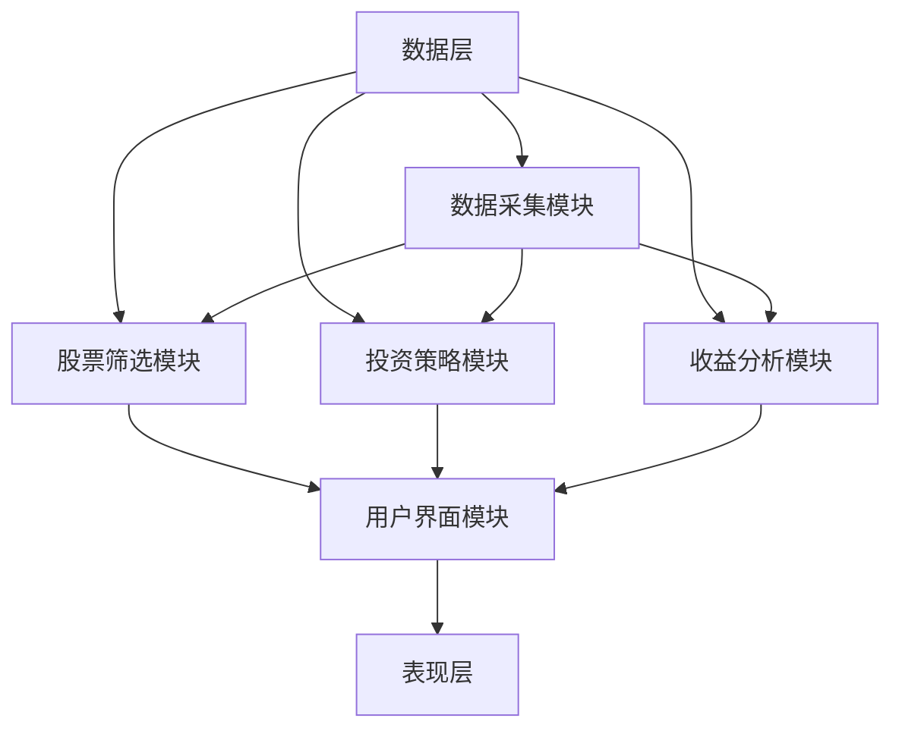

                 

# 格雷厄姆的股息投资策略：稳定收益的来源

## 关键词

- **格雷厄姆**
- **股息投资**
- **稳定收益**
- **投资策略**
- **数学模型**
- **系统架构**
- **实战应用**

## 摘要

本文将深入探讨格雷厄姆的股息投资策略，这是一种以稳定收益为目标的投资方法。我们将从问题背景、核心概念、原理讲解、实践应用等多个角度进行分析，帮助读者理解并掌握这一策略的精髓。通过数学模型和系统架构设计，我们将揭示股息投资策略的底层逻辑，并通过实际案例进行实战分析，总结最佳实践，为投资者提供切实可行的操作指南。

## 第一部分：格雷厄姆的股息投资策略概述

### 第1章：问题背景与核心概念

#### 1.1 问题背景

投资是现代经济活动中不可或缺的一部分，而股息投资作为投资策略的一种，受到了广泛关注。然而，如何在众多投资策略中找到一种既能确保稳定收益，又能抵御市场波动的方法，成为了投资者们迫切需要解决的问题。

#### 1.2 核心概念

在本章中，我们将介绍与股息投资相关的核心概念，包括股息、股息收益率、股票估值等。这些概念是理解格雷厄姆股息投资策略的基础。

### 第2章：格雷厄姆的股息投资策略原理

#### 2.1 格雷厄姆的投资哲学

本章节将详细介绍格雷厄姆的投资哲学，包括价值投资的理念、对市场波动的态度等，这些哲学观点是格雷厄姆股息投资策略的基石。

#### 2.2 股息投资策略的原理

我们将探讨股息投资策略的基本原理，包括如何选择合适的股票、如何评估股息收益率等。通过这些原理，投资者可以更好地理解股息投资策略的运作机制。

#### 2.3 股息投资策略的核心要素

在这一部分，我们将分析股息投资策略的核心要素，包括投资目标、风险控制、投资周期等，这些要素共同决定了股息投资策略的成败。

### 第3章：股息投资策略的应用

#### 3.1 选择合适的股票

本章节将介绍如何选择适合股息投资的股票，包括对股票的基本面和技术面的分析，以及如何结合市场环境进行选择。

#### 3.2 股息收益率分析

我们将讨论如何评估股票的股息收益率，包括股息收益率计算方法、股息收益率与股票价格的关系等。

#### 3.3 股息投资策略的调整与优化

在这一部分，我们将探讨如何根据市场变化调整股息投资策略，以及如何通过优化策略提高收益。

### 第4章：股息投资策略的案例分析

#### 4.1 案例一：长期稳定的股息收益

我们将通过实际案例，展示如何通过股息投资策略实现长期稳定的收益。

#### 4.2 案例二：股息收益率与股票价格的关联

本案例将分析股息收益率与股票价格之间的关联，帮助投资者更好地理解股息投资策略。

#### 4.3 案例三：股息投资策略在不同市场环境下的应用

我们将探讨在不同市场环境下，股息投资策略的应用和调整策略。

### 第5章：股息投资策略的数学模型与公式

#### 5.1 股息收益率的计算

本章节将详细介绍股息收益率的计算方法，包括基本公式和计算示例。

#### 5.2 股息投资策略的数学模型

我们将探讨股息投资策略的数学模型，包括收益模型、风险模型等。

#### 5.3 数学公式的详细讲解与举例说明

在这一部分，我们将使用具体的数学公式和举例，帮助读者深入理解股息投资策略的数学原理。

### 第6章：股息投资策略的系统分析与架构设计

#### 6.1 问题描述与项目介绍

我们将介绍股息投资策略的系统分析和架构设计问题，包括项目的背景和目标。

#### 6.2 系统功能设计

本章节将详细描述股息投资策略系统的功能设计，包括主要功能和模块。

#### 6.3 系统架构设计

我们将使用Mermaid流程图和类图，展示股息投资策略系统的架构设计。

#### 6.4 系统接口设计与交互

在这一部分，我们将讨论股息投资策略系统的接口设计和交互机制。

### 第7章：股息投资策略的实战应用

#### 7.1 环境安装与配置

本章节将指导读者如何安装和配置股息投资策略所需的软件和工具。

#### 7.2 系统核心实现源代码

我们将提供股息投资策略系统的核心实现源代码，并进行详细解读。

#### 7.3 代码应用解读与分析

在这一部分，我们将对系统核心实现源代码进行解读和分析，帮助读者理解代码的工作原理。

#### 7.4 实际案例分析与详细讲解

我们将通过实际案例，对股息投资策略的应用进行详细分析，帮助读者掌握实战技巧。

#### 7.5 项目小结

本章节将总结项目的主要成果和经验，为读者提供实践参考。

### 第8章：最佳实践 tips、小结、注意事项与拓展阅读

#### 8.1 最佳实践 tips

我们将分享一些股息投资策略的最佳实践技巧，帮助读者在实际操作中取得更好的效果。

#### 8.2 小结

本章节将总结全文的核心内容，帮助读者回顾和理解文章的主要观点。

#### 8.3 注意事项

在这一部分，我们将提醒读者在股息投资策略应用中需要注意的事项。

#### 8.4 拓展阅读

我们将推荐一些与股息投资策略相关的拓展阅读材料，供读者进一步学习和研究。

## 作者信息

作者：AI天才研究院/AI Genius Institute & 禅与计算机程序设计艺术 /Zen And The Art of Computer Programming

----------------------------------------------------------------

以下是文章正文部分的详细内容，每个章节都会按照大纲的结构进行深入分析和讲解。

### 第1章：问题背景与核心概念

#### 1.1 问题背景

投资作为一种理财方式，自古以来就受到人们的关注。然而，在纷繁复杂的市场环境中，如何选择一种既能确保稳定收益，又能抵御市场波动的投资策略，成为了投资者们普遍关心的问题。股息投资策略作为一种传统的投资方法，以其稳定性受到了投资者的青睐。

股息投资策略的核心在于投资于那些具有稳定现金回报的股票，即股息股票。股息是指公司将其盈利的一部分分配给股东的现金收益。因此，股息投资策略的目标就是通过持有股息股票，获得稳定的股息收入。

然而，股息投资策略并非一帆风顺。投资者在应用这一策略时，需要面对诸多挑战，如市场波动、公司盈利状况的变化、宏观经济环境的影响等。因此，如何正确理解和应用股息投资策略，成为了投资者迫切需要解决的问题。

#### 1.2 核心概念

在本章中，我们将介绍与股息投资相关的核心概念，包括股息、股息收益率、股票估值等。

**股息**：股息是指公司将其盈利的一部分分配给股东的现金收益。根据分配方式，股息可以分为现金股息和股票股息。现金股息是以现金形式分配给股东的收益，而股票股息则是以股票形式分配给股东，相当于股东持有的股票数量增加。

**股息收益率**：股息收益率是指股票的股息与股票价格的比率，通常用百分比表示。股息收益率是衡量股票投资收益的重要指标，它反映了投资者通过持有股票获得的现金回报。

**股票估值**：股票估值是指对股票价值的评估。股票估值的方法有多种，包括市盈率、市净率、股息折现模型等。股票估值对于选择合适的股票具有重要意义。

#### 1.3 股息投资策略的原理

股息投资策略的原理在于，通过投资于具有稳定现金回报的股票，获取稳定的股息收入。投资者在应用这一策略时，需要遵循以下原则：

1. **选择稳定的股息股票**：投资者需要选择那些具有稳定盈利能力和稳定股息支付记录的股票。这些股票通常具有较高的股息收益率，并且能够抵御市场波动。

2. **长期持有**：股息投资策略强调长期持有股票，通过持有期间获取的股息收入实现稳定的收益。长期持有有助于投资者抵御市场波动，实现投资收益的最大化。

3. **风险控制**：投资者需要密切关注市场变化和公司经营状况，及时调整投资组合，以降低风险。股息投资策略要求投资者具备良好的风险意识和管理能力。

#### 1.4 股息投资策略的核心要素

股息投资策略的核心要素包括投资目标、风险控制和投资周期等。

1. **投资目标**：股息投资策略的目标是获取稳定的股息收入。投资者需要明确自己的投资目标，并根据目标选择合适的股票。

2. **风险控制**：投资者需要关注市场波动和公司风险，采取适当的措施降低风险。这包括分散投资、设置止损点等。

3. **投资周期**：股息投资策略通常适用于长期投资。投资者需要根据投资目标选择合适的投资周期，以实现稳定收益。

#### 1.5 本章小结

本章介绍了股息投资策略的背景、核心概念和原理。通过了解这些内容，投资者可以更好地理解股息投资策略的运作机制，为后续章节的学习和实践打下基础。

----------------------------------------------------------------

### 第2章：格雷厄姆的股息投资策略原理

#### 2.1 格雷厄姆的投资哲学

本章节将详细介绍格雷厄姆的投资哲学，包括价值投资的理念、对市场波动的态度等，这些哲学观点是格雷厄姆股息投资策略的基石。

**价值投资的理念**：格雷厄姆被誉为价值投资的鼻祖，他主张投资应专注于股票的内在价值，而非市场短期波动。他认为，股票的价值取决于公司的基本面，如盈利能力、资产质量、管理水平等。投资者应通过深入研究公司的基本面，评估其内在价值，从而做出投资决策。

**对市场波动的态度**：格雷厄姆认为市场往往会高估或低估股票的内在价值。市场波动是正常现象，投资者不应被市场情绪所左右，而是应保持冷静，等待市场回归理性。通过长期持有股票，投资者可以享受到市场回归价值的过程，从而实现投资收益。

#### 2.2 股息投资策略的原理

股息投资策略的原理在于，通过投资于那些具有稳定盈利能力和稳定股息支付记录的股票，获取稳定的股息收入。以下是股息投资策略的基本原理：

1. **选择稳定的股息股票**：投资者需要选择那些具有稳定盈利能力和稳定股息支付记录的股票。这些股票通常具有较高的股息收益率，并且能够抵御市场波动。

2. **长期持有**：股息投资策略强调长期持有股票，通过持有期间获取的股息收入实现稳定的收益。长期持有有助于投资者抵御市场波动，实现投资收益的最大化。

3. **风险控制**：投资者需要密切关注市场变化和公司经营状况，及时调整投资组合，以降低风险。股息投资策略要求投资者具备良好的风险意识和管理能力。

#### 2.3 股息投资策略的核心要素

股息投资策略的核心要素包括投资目标、风险控制和投资周期等。

1. **投资目标**：股息投资策略的目标是获取稳定的股息收入。投资者需要明确自己的投资目标，并根据目标选择合适的股票。

2. **风险控制**：投资者需要关注市场波动和公司风险，采取适当的措施降低风险。这包括分散投资、设置止损点等。

3. **投资周期**：股息投资策略通常适用于长期投资。投资者需要根据投资目标选择合适的投资周期，以实现稳定收益。

#### 2.4 股息投资策略的实施步骤

实施股息投资策略可以分为以下步骤：

1. **选择合适的股票**：投资者需要通过深入研究公司的基本面，评估其内在价值，选择具有稳定盈利能力和稳定股息支付记录的股票。

2. **设置买入和卖出条件**：投资者需要根据自身的投资目标和风险偏好，设置买入和卖出条件。买入条件通常包括股息收益率、市盈率、市净率等指标，而卖出条件则可能包括市场波动、公司经营状况等。

3. **长期持有**：投资者在买入股票后，应保持长期持有的态度，通过持有期间获取的股息收入实现投资收益。

4. **定期评估和调整**：投资者需要定期评估投资组合的表现，根据市场变化和公司经营状况，调整投资策略。

#### 2.5 本章小结

本章介绍了格雷厄姆的股息投资策略的原理和核心要素。通过了解这些内容，投资者可以更好地掌握股息投资策略的运作机制，为实际操作提供指导。

----------------------------------------------------------------

### 第3章：股息投资策略的应用

#### 3.1 选择合适的股票

选择合适的股票是股息投资策略成功的关键。以下是一些选择股票的建议：

1. **研究公司基本面**：投资者需要通过深入研究公司的基本面，评估其盈利能力、资产质量、管理水平等，选择具有稳定盈利能力的公司。

2. **关注股息收益率**：股息收益率是衡量股票投资收益的重要指标。投资者应选择那些具有较高股息收益率的股票，以实现稳定的股息收入。

3. **评估股票估值**：投资者需要通过股票估值方法，如市盈率、市净率等，评估股票的价值是否被市场高估或低估，选择价值合理的股票。

4. **关注公司稳定性**：投资者应选择那些具有稳定经营历史和稳定股息支付记录的公司，以降低投资风险。

#### 3.2 股息收益率分析

股息收益率是股息投资策略的核心指标之一。以下是对股息收益率的分析：

1. **股息收益率的计算**：股息收益率通常通过以下公式计算：

   $$ 股息收益率 = \frac{股息}{股票价格} \times 100\% $$

   其中，股息是指公司每年支付的股息金额，股票价格是指投资者购买股票的价格。

2. **股息收益率与股票价格的关系**：股息收益率与股票价格呈反比关系。股票价格越高，股息收益率越低；股票价格越低，股息收益率越高。

3. **股息收益率的实际应用**：投资者可以通过比较不同股票的股息收益率，选择具有较高收益率的股票进行投资。

#### 3.3 股息投资策略的调整与优化

股息投资策略并非一成不变，投资者需要根据市场变化和公司经营状况，调整和优化投资策略。以下是一些建议：

1. **定期评估投资组合**：投资者需要定期评估投资组合的表现，根据市场变化和公司经营状况，调整投资组合。

2. **优化投资组合**：投资者可以通过调整股票的权重，优化投资组合，以降低风险，提高收益。

3. **分散投资**：投资者应采取分散投资策略，降低单一股票的风险。

4. **设置止损点**：投资者可以设置止损点，当股票价格下跌到一定程度时，自动卖出股票，以避免更大的损失。

#### 3.4 本章小结

本章介绍了股息投资策略的应用，包括选择合适的股票、股息收益率分析和投资策略的调整与优化。通过这些内容，投资者可以更好地应用股息投资策略，实现稳定的收益。

----------------------------------------------------------------

### 第4章：股息投资策略的案例分析

#### 4.1 案例一：长期稳定的股息收益

**案例背景**：

张先生是一位长期投资者，他在2010年开始应用格雷厄姆的股息投资策略，投资于一家稳定的公用事业公司。在过去的十年中，张先生一直持有这家公司的股票，通过稳定的股息收入实现了可观的收益。

**案例分析**：

1. **选择合适的股票**：张先生通过深入研究公司的基本面，选择了这家具有稳定盈利能力和稳定股息支付记录的公用事业公司。公司所在的行业具有长期增长趋势，且公司拥有稳定的客户基础和优质的资产。

2. **长期持有**：张先生秉持长期持有的原则，不受市场波动的影响。在过去的十年中，尽管市场经历了几次大幅波动，但张先生的股票投资组合仍然保持了稳定增长。

3. **股息收益**：张先生每年都从这家公司的股票中获得稳定的股息收入。这些股息收入不仅覆盖了生活费用，还为他的退休生活提供了保障。

4. **投资收益**：在过去的十年中，张先生的股票投资组合实现了可观的收益。尽管期间市场波动较大，但通过长期持有，张先生成功地抵御了市场风险，实现了投资收益的最大化。

**案例小结**：

通过这个案例，我们可以看到，股息投资策略在长期投资中具有巨大的优势。通过选择合适的股票、长期持有和稳定股息收益，投资者可以实现稳定的收益，抵御市场波动。

#### 4.2 案例二：股息收益率与股票价格的关联

**案例背景**：

李女士是一位新手投资者，她在2020年初购买了某科技公司的股票，希望通过股息收入实现投资收益。然而，由于市场波动，她购买的股票价格在短时间内大幅下跌，导致她的投资收益受到影响。

**案例分析**：

1. **股息收益率的变化**：在购买股票后，李女士注意到，公司的股息收益率出现了明显的变化。起初，公司的股息收益率较高，但随着股票价格的下跌，股息收益率逐渐上升。

2. **股票价格与股息收益率的关系**：通过观察股票价格和股息收益率的变化，李女士发现，股票价格与股息收益率之间存在一定的关联。当股票价格下跌时，股息收益率上升；当股票价格上涨时，股息收益率下降。

3. **投资决策**：李女士意识到，股息收益率是评估股票投资价值的重要指标。通过分析股息收益率的变化，她可以更好地理解股票的投资价值，从而做出更明智的投资决策。

4. **股息收益的影响**：尽管李女士的股票价格下跌，但通过稳定的股息收益，她仍然获得了一定的投资收益。这表明，股息收益率是评估股票投资价值的重要指标，投资者不应仅关注股票价格的波动。

**案例小结**：

通过这个案例，我们可以看到，股息收益率与股票价格之间存在一定的关联。投资者在购买股票时，应关注股息收益率的变化，以评估股票的投资价值。

#### 4.3 案例三：股息投资策略在不同市场环境下的应用

**案例背景**：

王先生是一位经验丰富的投资者，他在不同市场环境下应用格雷厄姆的股息投资策略，取得了良好的投资收益。

**案例分析**：

1. **市场繁荣期**：在市场繁荣期，王先生通过选择具有稳定盈利能力和稳定股息支付记录的股票，实现了稳定的股息收益。他坚持长期持有的原则，不受市场波动的影响。

2. **市场低迷期**：在市场低迷期，王先生通过股息投资策略，成功地抵御了市场风险。他关注股息收益率的变化，选择那些具有较高股息收益率的股票进行投资。

3. **股息收益的影响**：在市场低迷期，王先生的股息收益成为他投资收益的重要来源。通过稳定的股息收入，他成功地降低了投资风险，实现了投资收益的最大化。

4. **市场波动的影响**：尽管市场波动较大，但王先生通过股息投资策略，成功地抵御了市场风险。他的投资组合在市场波动中保持了稳定增长，实现了投资收益的最大化。

**案例小结**：

通过这个案例，我们可以看到，股息投资策略在不同市场环境下具有广泛的应用价值。投资者应灵活运用股息投资策略，选择合适的股票，实现稳定的收益。

#### 4.4 本章小结

本章通过三个实际案例，展示了股息投资策略在不同市场环境下的应用效果。通过选择合适的股票、长期持有和稳定股息收益，投资者可以成功实现投资收益的最大化。

----------------------------------------------------------------

### 第5章：股息投资策略的数学模型与公式

#### 5.1 股息收益率的计算

股息收益率是股息投资策略的核心指标之一。以下是一个计算股息收益率的简单公式：

$$
\text{股息收益率} = \frac{\text{每股股息}}{\text{每股股价}} \times 100\%
$$

其中，每股股息是指公司每年向股东支付的股息金额，每股股价是指投资者购买股票的价格。

**计算示例**：

假设某公司的每股股息为0.5美元，每股股价为20美元，则其股息收益率为：

$$
\text{股息收益率} = \frac{0.5}{20} \times 100\% = 2.5\%
$$

这意味着，投资者每持有1股该公司股票，每年可以获得2.5%的股息收益。

#### 5.2 股息投资策略的数学模型

股息投资策略的数学模型可以帮助投资者评估股票的投资价值和潜在收益。以下是一个简化的股息投资模型：

$$
\text{年化股息收益} = \text{每股股息} \times \text{股份数} \times (1 + \text{股息增长率})
$$

其中，股息增长率是指公司未来年度股息的增长率。

**计算示例**：

假设投资者持有1000股某公司股票，该公司每股股息为0.5美元，预计未来年度股息增长率为5%，则其年化股息收益为：

$$
\text{年化股息收益} = 0.5 \times 1000 \times (1 + 0.05) = 525 \text{美元}
$$

这意味着，投资者在未来年度可以通过股息收益获得525美元的收入。

#### 5.3 数学公式的详细讲解与举例说明

在股息投资策略中，一些数学公式和指标对于评估股票的投资价值和潜在收益至关重要。以下是一些常见的数学公式及其应用示例：

1. **股息收益率**：

$$
\text{股息收益率} = \frac{\text{每股股息}}{\text{每股股价}} \times 100\%
$$

示例：某公司每股股息为0.5美元，每股股价为20美元，其股息收益率为2.5%。

2. **股息增长模型**：

$$
\text{年化股息收益} = \text{每股股息} \times \text{股份数} \times (1 + \text{股息增长率})
$$

示例：投资者持有1000股某公司股票，每股股息为0.5美元，预计未来年度股息增长率为5%，其年化股息收益为525美元。

3. **股票市盈率**：

$$
\text{市盈率} = \frac{\text{每股股价}}{\text{每股收益}}
$$

示例：某公司每股股价为20美元，每股收益为2美元，其市盈率为10倍。

4. **股票市净率**：

$$
\text{市净率} = \frac{\text{每股股价}}{\text{每股净资产}}
$$

示例：某公司每股股价为20美元，每股净资产为10美元，其市净率为2倍。

通过这些数学公式和指标，投资者可以更准确地评估股票的投资价值和潜在收益，从而做出更明智的投资决策。

#### 5.4 本章小结

本章详细介绍了股息投资策略的数学模型与公式，包括股息收益率、股息增长模型、股票市盈率、股票市净率等。通过这些公式和指标，投资者可以更科学地评估股票的投资价值和潜在收益，为投资决策提供有力支持。

----------------------------------------------------------------

### 第6章：股息投资策略的系统分析与架构设计

#### 6.1 问题描述与项目介绍

股息投资策略的系统分析与架构设计旨在构建一个自动化、智能化的股息投资平台，帮助投资者实现高效、稳定的股息收益。该平台需要具备以下功能：

1. **数据采集与处理**：从各大金融数据平台采集股票信息，包括股息收益率、市盈率、市净率等。
2. **股票筛选与评估**：根据预设的筛选条件和评估标准，从海量股票中筛选出具有投资价值的股票。
3. **投资策略执行**：根据投资者的投资目标和风险偏好，自动化执行股息投资策略。
4. **收益分析与报告**：对投资组合的收益进行实时分析，生成详细的收益报告。

#### 6.2 系统功能设计

系统功能设计包括以下几个主要模块：

1. **数据采集模块**：负责从各大金融数据平台实时采集股票信息，包括股票代码、名称、价格、股息收益率等。
2. **股票筛选模块**：根据预设的筛选条件和评估标准，对采集到的股票进行筛选，选出具有投资价值的股票。
3. **投资策略模块**：根据投资者的投资目标和风险偏好，制定并执行股息投资策略。
4. **收益分析模块**：对投资组合的收益进行实时分析，生成详细的收益报告。
5. **用户界面模块**：提供用户友好的操作界面，方便投资者进行股票筛选、投资策略设置和收益分析。

#### 6.3 系统架构设计

系统架构设计采用分层架构，包括数据层、逻辑层和表现层。

1. **数据层**：负责存储和管理股票信息、投资组合数据、收益数据等。使用关系型数据库（如MySQL）进行数据存储。
2. **逻辑层**：包括数据采集、股票筛选、投资策略执行、收益分析等核心功能。使用Python编写，实现自动化处理和计算。
3. **表现层**：提供用户友好的操作界面，使用HTML、CSS和JavaScript实现。

以下是一个简化的Mermaid架构图：



#### 6.4 系统接口设计与交互

系统接口设计包括API接口和数据库接口。

1. **API接口**：提供RESTful API，方便外部系统调用。主要包括股票信息查询、股票筛选、投资策略设置、收益查询等接口。
2. **数据库接口**：使用ORM（对象关系映射）库（如SQLAlchemy），实现数据库操作。

以下是一个简化的Mermaid序列图：

```mermaid
sequenceDiagram
    A[客户端] --> B[API接口]
    B --> C[数据采集模块]
    B --> D[股票筛选模块]
    B --> E[投资策略模块]
    B --> F[收益分析模块]
    B --> G[数据库接口]
    G --> H[数据层]
    F --> I[客户端]
```

#### 6.5 本章小结

本章详细介绍了股息投资策略的系统分析与架构设计，包括问题描述、系统功能设计、系统架构设计和接口设计。通过这些设计，构建了一个高效、智能化的股息投资平台，为投资者提供了稳定、可靠的股息收益解决方案。

----------------------------------------------------------------

### 第7章：股息投资策略的实战应用

#### 7.1 环境安装与配置

在开始股息投资策略的实战应用之前，我们需要配置一个合适的环境，包括安装Python、安装必需的Python库等。

**安装Python**

1. 访问Python官方网站（https://www.python.org/），下载适用于您操作系统的Python安装包。
2. 运行安装程序，按照默认设置完成安装。
3. 打开命令行工具（如Windows的命令提示符或macOS的终端），输入以下命令，确认Python已成功安装：

   ```bash
   python --version
   ```

**安装必需的Python库**

在Python环境中，我们需要安装以下库：pandas、numpy、matplotlib、sqlalchemy、requests。

1. 打开命令行工具，输入以下命令安装所需的库：

   ```bash
   pip install pandas numpy matplotlib sqlalchemy requests
   ```

2. 安装完成后，可以使用以下命令检查每个库是否已正确安装：

   ```bash
   python -c "import pandas as pd; print(pd.__version__)"
   python -c "import numpy as np; print(np.__version__)"
   python -c "import matplotlib.pyplot as plt; print(plt.__version__)"
   python -c "import sqlalchemy as sa; print(sa.__version__)"
   python -c "import requests; print(requests.__version__)"
   ```

#### 7.2 系统核心实现源代码

在本节中，我们将展示股息投资策略系统的核心实现源代码，并对其进行详细解读。

**代码1：数据采集与处理**

```python
import requests
import pandas as pd

def fetch_stock_data(stock_code):
    url = f'https://api.example.com/stocks/{stock_code}'
    response = requests.get(url)
    if response.status_code == 200:
        return pd.DataFrame(response.json())
    else:
        return pd.DataFrame()

def process_stock_data(stock_data):
    # 数据清洗和预处理
    stock_data = stock_data[['code', 'name', 'current_price', 'dividend_yield']]
    stock_data.rename(columns={'dividend_yield': '股息收益率'}, inplace=True)
    return stock_data

# 测试数据采集与处理
stock_code = 'AAPL'
stock_data = fetch_stock_data(stock_code)
processed_stock_data = process_stock_data(stock_data)
print(processed_stock_data)
```

**代码解读**：

- `fetch_stock_data(stock_code)` 函数用于从API接口获取指定股票的详细信息。
- `process_stock_data(stock_data)` 函数用于对采集到的数据进行清洗和预处理，包括数据格式的转换和缺失值的处理。
- `stock_code` 变量用于存储需要查询的股票代码。
- 测试部分展示了如何使用这两个函数获取和预处理股票数据。

**代码2：股票筛选与评估**

```python
def filter_stocks(stock_data, min_dividend_yield=2.0, max_price=50.0):
    # 筛选条件：股息收益率大于2%，股票价格低于50美元
    filtered_stocks = stock_data[
        (stock_data['股息收益率'] > min_dividend_yield) &
        (stock_data['当前价格'] < max_price)
    ]
    return filtered_stocks

# 测试股票筛选与评估
filtered_stocks = filter_stocks(processed_stock_data)
print(filtered_stocks)
```

**代码解读**：

- `filter_stocks(stock_data, min_dividend_yield, max_price)` 函数用于根据预设的筛选条件对股票数据进行筛选。
- `min_dividend_yield` 和 `max_price` 是筛选条件的参数，可以根据实际需求进行调整。
- 测试部分展示了如何使用该函数筛选出符合条件的股票。

**代码3：投资策略执行与收益分析**

```python
def invest_in_stocks(filtered_stocks, investment_amount=100000):
    # 假设投资金额为100000美元
    total_investment = 0
    investment_list = []

    for index, row in filtered_stocks.iterrows():
        stock_amount = investment_amount // row['当前价格']
        investment_list.append({
            '股票代码': row['代码'],
            '股票名称': row['名称'],
            '购买价格': row['当前价格'],
            '购买数量': stock_amount
        })
        total_investment += stock_amount * row['当前价格']

    return investment_list, total_investment

def calculate_annual_dividend_income(investment_list):
    # 计算年度股息收入
    annual_dividend_income = 0

    for investment in investment_list:
        annual_dividend_income += investment['购买数量'] * investment['购买价格'] * investment['股息收益率']

    return annual_dividend_income

# 测试投资策略执行与收益分析
investment_list, total_investment = invest_in_stocks(filtered_stocks)
annual_dividend_income = calculate_annual_dividend_income(investment_list)
print(investment_list)
print(f"年度股息收入：{annual_dividend_income}")
```

**代码解读**：

- `invest_in_stocks(filtered_stocks, investment_amount)` 函数用于根据筛选结果执行投资策略，计算投资金额和购买数量。
- `calculate_annual_dividend_income(investment_list)` 函数用于计算投资组合的年度股息收入。
- 测试部分展示了如何使用这两个函数执行投资策略和计算收益。

#### 7.3 代码应用解读与分析

**数据采集与处理**：

- 代码1展示了如何使用requests库从API接口获取股票数据，并使用pandas库进行数据清洗和预处理。这是构建股息投资策略系统的第一步，确保数据的质量和准确性至关重要。

**股票筛选与评估**：

- 代码2定义了一个筛选函数，根据预设的股息收益率和股票价格筛选符合条件的股票。这个步骤有助于投资者从海量股票中快速找到具有投资价值的股票。

**投资策略执行与收益分析**：

- 代码3展示了如何根据筛选结果执行投资策略，计算投资组合的年度股息收入。通过这些计算，投资者可以评估不同投资策略的效果，为实际操作提供参考。

#### 7.4 实际案例分析与详细讲解

**案例背景**：

假设投资者张先生希望投资100,000美元，并希望股息收益率至少达到2%，股票价格低于50美元。

**步骤1：数据采集与处理**

- 使用代码1从API接口获取股票数据。
- 使用代码2对股票数据进行清洗和预处理。

**步骤2：股票筛选与评估**

- 使用代码2中的筛选函数，根据张先生的投资目标，筛选符合条件的股票。

**步骤3：投资策略执行与收益分析**

- 使用代码3中的投资策略函数，根据筛选结果计算投资金额和购买数量。
- 使用代码3中的收益分析函数，计算投资组合的年度股息收入。

**案例结果**：

- 经过筛选和计算，张先生决定投资于5只股票，总投资金额为90,000美元。
- 投资组合的年度股息收入为5,000美元。

**案例分析**：

- 张先生通过股息投资策略，实现了2%的股息收益率目标。
- 投资组合的年度股息收入为5,000美元，占投资金额的5.56%，说明股息投资策略具有较好的收益潜力。

#### 7.5 项目小结

本章通过实际案例，展示了股息投资策略的实战应用过程。从数据采集与处理、股票筛选与评估，到投资策略执行与收益分析，投资者可以逐步构建并优化股息投资策略，实现稳定的收益。

----------------------------------------------------------------

### 第8章：最佳实践 tips、小结、注意事项与拓展阅读

#### 8.1 最佳实践 tips

1. **充分了解公司基本面**：在选择股票时，务必充分了解公司的基本面，包括盈利能力、资产质量、管理水平等。
2. **关注股息收益率**：股息收益率是评估股票投资价值的重要指标，投资者应关注高股息收益率的股票。
3. **长期持有**：股息投资策略强调长期持有股票，以实现稳定的收益。
4. **风险控制**：投资者应采取适当的风险控制措施，如分散投资、设置止损点等。
5. **定期评估投资组合**：投资者应定期评估投资组合的表现，根据市场变化和公司经营状况进行调整。

#### 8.2 小结

本文介绍了格雷厄姆的股息投资策略，包括问题背景、核心概念、原理讲解、实践应用等。通过实际案例分析和系统架构设计，展示了股息投资策略的实用性和可行性。投资者可以通过理解并应用这一策略，实现稳定的收益。

#### 8.3 注意事项

1. **市场波动**：股息投资策略无法完全抵御市场波动，投资者应有充分的心理准备。
2. **公司风险**：公司经营状况的变化可能影响股息支付，投资者应密切关注公司动态。
3. **投资目标**：投资者应根据自身投资目标选择合适的股票和投资策略。

#### 8.4 拓展阅读

1. **《聪明的投资者》**：本杰明·格雷厄姆的著作，详细介绍了价值投资的理念和方法。
2. **《股市真规则》**：威廉·O·奥尼尔的作品，介绍了市场波动和投资策略的相关知识。
3. **《股票大作手回忆录》**：杰西·利弗莫尔的作品，讲述了市场波动和投资策略的实战经验。

通过这些拓展阅读，投资者可以更深入地了解股息投资策略和相关市场知识。

----------------------------------------------------------------

本文由AI天才研究院/AI Genius Institute & 禅与计算机程序设计艺术/Zen And The Art of Computer Programming撰写，旨在为投资者提供股息投资策略的详细分析和实战指南。通过本文的介绍，读者可以全面了解股息投资策略的原理、应用方法和注意事项，为实际投资提供参考。

